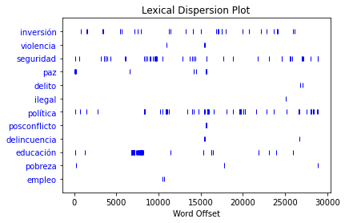
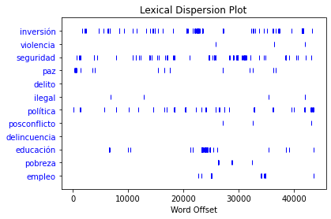
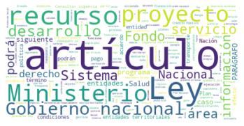
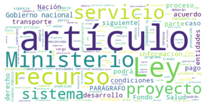
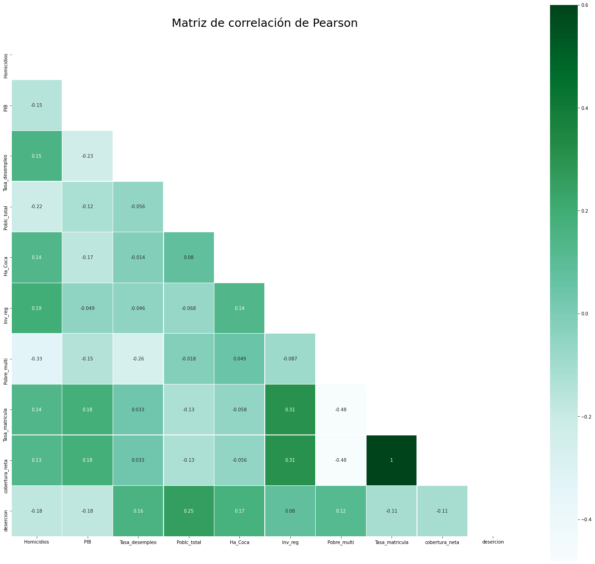

# Proyecto final Economía y Crimen en el Posconflicto


**Cindy Lorena Roa Ovalle** <br> 

1. Instalación de paquetes y librerias de Python
2. Web Scrapping a la página de la Secretaría del Senado de la República de las leyes que adoptaron los Planes Nacionales de Desarrollo para los periodos 2014-2018 y 2018-2022
3. Análisis de texto NLTK
4. Nube de palabras
5. Web Scrapping de API del portal de Datos Abiertos del Ministerio Nacional de Educación
6. Importar base de datos elaborada con información del DANE, Medicina Legal, Ministerio de Defensa, DPN, para elaboración del modelo.
7. Construcción del Dataframe y unificación con las variables extraidas de la API.
8. Analisis descriptivo y correlación entre variables.
9. Elaboración del modelo
10. Conclusión


```python
#Instalación de paquetes para ejecutar Python y hacer Web scrappin-
!pip install selenium
!pip install sodapy
!pip install wordcloud
```

    Requirement already satisfied: selenium in c:\users\cindy\anaconda3\lib\site-packages (3.141.0)
    Requirement already satisfied: urllib3 in c:\users\cindy\anaconda3\lib\site-packages (from selenium) (1.26.4)
    Requirement already satisfied: sodapy in c:\users\cindy\anaconda3\lib\site-packages (2.1.0)
    Requirement already satisfied: requests>=2.20.0 in c:\users\cindy\anaconda3\lib\site-packages (from sodapy) (2.25.1)
    Requirement already satisfied: urllib3<1.27,>=1.21.1 in c:\users\cindy\anaconda3\lib\site-packages (from requests>=2.20.0->sodapy) (1.26.4)
    Requirement already satisfied: certifi>=2017.4.17 in c:\users\cindy\anaconda3\lib\site-packages (from requests>=2.20.0->sodapy) (2020.12.5)
    Requirement already satisfied: idna<3,>=2.5 in c:\users\cindy\anaconda3\lib\site-packages (from requests>=2.20.0->sodapy) (2.10)
    Requirement already satisfied: chardet<5,>=3.0.2 in c:\users\cindy\anaconda3\lib\site-packages (from requests>=2.20.0->sodapy) (4.0.0)
    Requirement already satisfied: wordcloud in c:\users\cindy\anaconda3\lib\site-packages (1.8.1)
    Requirement already satisfied: matplotlib in c:\users\cindy\anaconda3\lib\site-packages (from wordcloud) (3.3.4)
    Requirement already satisfied: pillow in c:\users\cindy\anaconda3\lib\site-packages (from wordcloud) (8.2.0)
    Requirement already satisfied: numpy>=1.6.1 in c:\users\cindy\anaconda3\lib\site-packages (from wordcloud) (1.20.1)
    Requirement already satisfied: python-dateutil>=2.1 in c:\users\cindy\anaconda3\lib\site-packages (from matplotlib->wordcloud) (2.8.1)
    Requirement already satisfied: pyparsing!=2.0.4,!=2.1.2,!=2.1.6,>=2.0.3 in c:\users\cindy\anaconda3\lib\site-packages (from matplotlib->wordcloud) (2.4.7)
    Requirement already satisfied: kiwisolver>=1.0.1 in c:\users\cindy\anaconda3\lib\site-packages (from matplotlib->wordcloud) (1.3.1)
    Requirement already satisfied: cycler>=0.10 in c:\users\cindy\anaconda3\lib\site-packages (from matplotlib->wordcloud) (0.10.0)
    Requirement already satisfied: six in c:\users\cindy\anaconda3\lib\site-packages (from cycler>=0.10->matplotlib->wordcloud) (1.15.0)
    


```python
#Importamos las librerias
import matplotlib
import matplotlib.pyplot as plt
from bs4 import BeautifulSoup
import requests
import pandas as pd
from selenium import webdriver
import time
import string
import nltk
from nltk.corpus import stopwords
import re
from sodapy import Socrata
from wordcloud import WordCloud
from wordcloud import WordCloud, STOPWORDS
from os import path
from PIL import Image
import numpy as np
import seaborn as sns
import statsmodels.api as sm
import statsmodels.formula.api as smf
from sklearn.linear_model import LinearRegression
```


```python
nltk.download() #Instalamos todo el paquete del NLTK
```

    showing info https://raw.githubusercontent.com/nltk/nltk_data/gh-pages/index.xml
    


    True


```python
# Web Scrapping Secretarìa Senado - PLan nacional de desarrollo de Santos (2014-2018)

url = 'http://www.secretariasenado.gov.co/senado/basedoc/ley_1753_2015.html'
html = requests.get(url).text 

#Descargamos el contenido de la página
browser = webdriver.Chrome(executable_path=r"\Users\cindy\Downloads\phantomjs-2.1.1-windows\phantomjs-2.1.1-windows\bin\chromedriver")
time.sleep(5)
browser.get(url)
html = browser.page_source
time.sleep(5)
browser.quit()

# Extraemos el texto correspondiente a la primera página del PND 2014-2018
soup = BeautifulSoup(html)
texto = soup.find_all("p")
list(texto)
for i in texto:
    text=i.getText()
    print(text)

# Extraemos el texto correspondiente a las página subsecuentes del PND 2014-2018
for page_number in range(1,6):
    url2 = f'http://www.secretariasenado.gov.co/senado/basedoc/ley_1753_2015_pr00{page_number}.html'
    html2 = requests.get(url2).text #Descargo el contenido de la página
    browser3 = webdriver.Chrome(executable_path=r"\Users\cindy\Downloads\phantomjs-2.1.1-windows\phantomjs-2.1.1-windows\bin\chromedriver")
    time.sleep(5)
    browser3.get(url2)
    html3 = browser3.page_source
    time.sleep(5)
    browser3.quit()
    soup = BeautifulSoup(html3)
    textos = soup.find_all("p")
    dos=list(textos)
    for i in textos:
        text2=i.getText()
        unis=print(text2)
```

    Siguiente
    
    LEY 1753 DE 2015
    (junio 9)
    Diario Oficial No. 49.538 de 9 de junio de 2015
    CONGRESO DE LA REPÚBLICA
    Por la cual se expide el Plan Nacional de Desarrollo 2014-2018 “Todos por un nuevo país”.
    EL CONGRESO DE LA REPÚBLICA DE COLOMBIA
    DECRETA: 
    TÍTULO I. 
    DISPOSICIONES GENERALES. 
    ARTÍCULO 1o. OBJETIVOS DEL PLAN NACIONAL DE DESARROLLO. El Plan Nacional de Desarrollo 2014-2018 “Todos por un nuevo país”, que se expide por medio de la presente ley, tiene como objetivo construir una Colombia en paz, equitativa y educada, en armonía con los propósitos del Gobierno nacional, con las mejores prácticas y estándares internacionales, y con la visión de planificación, de largo plazo prevista por los objetivos de desarrollo sostenible.
    ARTÍCULO 2o. PARTE INTEGRAL DE ESTA LEY. El documento denominado “Bases del Plan Nacional de Desarrollo 2014-2018: Todos por un nuevo país”, elaborado por el Gobierno nacional con la participación del Consejo Superior de la Judicatura y del Consejo Nacional de Planeación, con las modificaciones realizadas en el trámite legislativo, es parte integral del Plan Nacional de Desarrollo y se incorpora a la presente ley como un anexo.
    ARTÍCULO 3o. PILARES DEL PLAN NACIONAL DE DESARROLLO. El Plan Nacional de Desarrollo se basa en los siguientes tres pilares:
    1. Paz. El Plan refleja la voluntad política del Gobierno para construir una paz sostenible bajo un enfoque de goce efectivo de derechos.
    2. Equidad. El Plan contempla una visión de desarrollo humano integral en una sociedad con oportunidades para todos.
    3. Educación. El Plan asume la educación como el más poderoso instrumento de igualdad social y crecimiento económico en el largo plazo, con una visión orientada a cerrar brechas en acceso y calidad al sistema educativo, entre individuos, grupos poblacionales y entre regiones, acercando al país a altos estándares internacionales y logrando la igualdad de oportunidades para todos los ciudadanos.
    ARTÍCULO 4o. ESTRATEGIAS TRANSVERSALES Y REGIONALES. Para la consolidación de los tres Pilares descritos en el artículo anterior y la transformación hacia un nuevo país, en el Plan Nacional de Desarrollo 2014-2018 se incorporarán estrategias transversales:
    1. Competitividad e infraestructura estratégicas
    2. Movilidad social
    3. Transformación del campo
    4. Seguridad, justicia y democracia para la construcción de paz
    5. Buen gobierno
    6. Crecimiento verde
    De igual manera se incorporarán las siguientes estrategias regionales, para establecer las prioridades para la gestión territorial y promover su desarrollo:
    -- Caribe: Próspero, equitativo y sin pobreza extrema.
    -- Eje Cafetero y Antioquia: Capital humano innovador en territorios incluyentes.
    -- Centro Oriente y Distrito Capital de Bogotá: Conectividad para la integración y desarrollo productivo sostenible de la región.
    -- Pacífico: Desarrollo socioeconómico con equidad, integración y sostenibilidad ambiental.
    -- Llanos Orientales: Medio ambiente, agroindustria y desarrollo humano: para el crecimiento y bienestar.
    -- Centro Sur Amazonía: Tierra de oportunidades y paz: desarrollo del campo y conservación ambiental.
    Las estrategias trasversales que se puedan aplicar acorde con la normatividad vigente cobijarán a los colombianos residentes en el exterior.
    TÍTULO II. 
    PLAN DE INVERSIONES Y PRESUPUESTOS PLURIANUALES. 
    ARTÍCULO 5o. PLAN NACIONAL DE INVERSIONES PÚBLICAS 2015-2018. El Plan Nacional de Inversiones Públicas 2015-2018 se estima en un valor de setecientos tres coma nueve ($703,9) billones, a pesos constantes de 2014, financiados de la siguiente manera:
    Estrategias Transversales y Objetivos 
    Plan de Inversiones 2015-2018
    Cifras en millones de pesos de 2014
    SGP (Sistema General de Participaciones), SGR (Sistema General de Regalías).
    PARÁGRAFO 1o. Los recursos identificados como fuentes de entidades territoriales para el financiamiento del Plan Nacional de Inversiones Públicas 2015-2018, corresponde a estimaciones de gastos de los niveles departamental, distrital y municipal en el marco de su autonomía, para la articulación de políticas, estrategias y programas nacionales con los territoriales, según los mecanismos de ejecución definidos en el presente plan.
    PARÁGRAFO 2o. Apruébese como parte integrante del plan de inversiones el documento “Regionalización del Plan Plurianual de Inversiones” que se anexa a la presente ley, el cual contiene los principales proyectos visionarios, proyectos de interés nacional estratégico y proyectos de iniciativas regionales.
    PARÁGRAFO 3o. Como parte integral del Plan Plurianual de Inversiones se incluyen de manera transversal las proyecciones indicativas acordadas en el marco de la consulta previa, estimadas para los pueblos indígenas entre ocho (8) y once (11) billones de pesos, considerando el Plan Macroeconómico y el Marco Fiscal de Mediano Plazo del Gobierno nacional, de acuerdo con todas las fuentes del presente Plan Plurianual de Inversiones.
    PARÁGRAFO 4o. Lo recursos del Presupuesto General de la Nación que en ejecución del presente Plan Nacional de Desarrollo sean asignados a las comunidades negras, afrocolombianas, raizales y palenqueras, no podrán ser inferiores, de manera proporcional, a los asignados del Presupuesto General de la Nación en el periodo 2010-2014, y guardando la proporción a los techos que se asignen para el mismo, en el Marco Fiscal de Mediano Plazo y Marco de Gasto de Mediano Plazo para el periodo 2014-2018”.
    ARTÍCULO 6o. RECURSOS FINANCIEROS, PRESUPUESTOS PLURIANUALES Y CONSISTENCIA FISCAL DEL PLAN NACIONAL DE INVERSIONES PÚBLICAS. El valor total de los gastos que se realicen para la ejecución del presente plan financiados con recursos del Presupuesto General de la Nación, no podrán superar en ningún caso el monto de los recursos disponibles de conformidad con el Plan Macroeconómico y el Marco Fiscal de Mediano Plazo del Gobierno nacional en armonía con el criterio orientador de sostenibilidad fiscal.
    Las metas contempladas en el Plan Nacional de Desarrollo 2015-2018 se ajustarán a las metas fiscales establecidas en el Marco Fiscal de Mediano Plazo, en el Marco de Gasto de Mediano Plazo y los Presupuestos Generales de la Nación aprobados para cada vigencia, según lo señalado en los artículos 4o y 5o de la Ley 1473 de 2011.
    TÍTULO III. 
    MECANISMOS PARA LA EJECUCIÓN DEL PLAN. 
    CAPÍTULO I. 
    COMPETITIVIDAD E INFRAESTRUCTURA ESTRATÉGICAS. 
    ARTÍCULO 7o. ACUERDOS ESTRATÉGICOS DE CIENCIA, TECNOLOGÍA E INNOVACIÓN. <Artículo derogado por el artículo 336 de la Ley 1955 de 2019> 
    ARTÍCULO 8o. OPERACIONES ADUANERAS EN INFRAESTRUCTURAS LOGÍSTICAS ESPECIALIZADAS. En las Infraestructuras Logísticas Especializadas (ILE) se podrán realizar las operaciones aduaneras que defina la DIAN, de modo que estas infraestructuras se integren a los corredores logísticos de importancia estratégica y se facilite el comercio exterior aprovechando la intermodalidad para el movimiento de mercancías desde y hacia los puertos de origen o destino.
    ARTÍCULO 9o. REGISTRO DE FACTURAS ELECTRÓNICAS. <Artículo derogado por el artículo 122 de la Ley 1943 de 2018> 
    ARTÍCULO 10. DERECHOS DE PROPIEDAD INTELECTUAL DE PROYECTOS DE INVESTIGACIÓN Y DESARROLLO FINANCIADOS CON RECURSOS PÚBLICOS. En los casos de proyectos de investigación y desarrollo de ciencia, tecnología e innovación y de tecnologías de la información y las comunicaciones, adelantados con recursos públicos, el Estado podrá ceder a título gratuito, salvo por motivos de seguridad y defensa nacional, los derechos de propiedad intelectual que le correspondan, y autorizará su transferencia, comercialización y explotación a quien adelante y ejecute el proyecto, sin que ello constituya daño patrimonial al Estado. Las condiciones de esta cesión serán fijadas en el respectivo contrato y en todo caso el Estado se reserva el derecho de obtener una licencia no exclusiva y gratuita de estos derechos de propiedad intelectual por motivos de interés nacional.
    PARÁGRAFO. El Gobierno nacional reglamentará esta materia en un plazo no superior a un (1) año contado a partir de la vigencia de la presente ley.
    ARTÍCULO 11. PROGRAMA DE TRANSFORMACIÓN PRODUCTIVA (PTP). <Consultar vigencia directamente en el artículo que modifica> Modifíquese el artículo 50 de la Ley 1450 de 2011, el cual quedará así:
    “Artículo 50. Programa de Transformación Productiva (PTP). El Programa de Transformación Productiva tendrá por objeto la implementación de estrategias público-privadas y el aprovechamiento de ventajas comparativas para la mejora en productividad y competitividad de la industria, en el marco de la Política de Desarrollo Productivo del Ministerio de Comercio, Industria y Turismo, al cual se podrán destinar recursos del Ministerio de Comercio, Industria y Turismo, de Organismos Internacionales de Desarrollo, convenios de cooperación internacional, convenios con organizaciones privadas, convenios con entes territoriales y transferencias de otras entidades públicas de orden nacional y regional. Este programa será un patrimonio autónomo con régimen privado administrado por el Banco de Comercio Exterior S.A. (Bancóldex)”.
    ARTÍCULO 12. PARQUES CIENTÍFICOS, TECNOLÓGICOS Y DE INNOVACIÓN (PCTI). Con el propósito de promover la transferencia de conocimiento, la transferencia y comercialización de tecnología, y el establecimiento de vínculos de colaboración entre los diversos actores del Sistema Nacional de Competitividad, Ciencia, Tecnología e Innovación, entre otros, dentro de los ocho (8) meses siguientes a la expedición de la presente ley, Colciencias, el Ministerio de Comercio, Industria y Turismo, y el Departamento Nacional de Planeación, desarrollarán una estrategia para la promoción de Parques Científicos, Tecnológicos y de Innovación (PCTI) en el territorio colombiano, entendidos como zonas geográficas especiales destinadas a promover la innovación basada en el conocimiento científico y tecnológico y a contribuir a la productividad empresarial y la competitividad regional. Igualmente definirán los mecanismos para atraer personal altamente calificado e inversión pública y privada, así como los criterios para estructurar los PCTI en el marco del Fondo de Ciencia, Tecnología e Innovación del Sistema General de Regalías.
    Para el efecto, Colciencias determinará los requisitos y las condiciones que deben cumplir las organizaciones especializadas encargadas de administrar los PCTI.
    PARÁGRAFO. En los procesos de revisión y ajuste de los planes de ordenamiento territorial se podrán determinar los terrenos destinados a la localización de Parques Científicos, Tecnológicos y de Innovación (PCTI) en suelo urbano, de expansión urbana y rural.
    ARTÍCULO 13. INNPULSA COLOMBIA. <Artículo modificado por el artículo 46 de la Ley 2069 de 2020. El nuevo texto es el siguiente:> Unifíquense en un solo patrimonio autónomo el Fondo de Modernización e Innovación para las Micro, Pequeñas y Medianas Empresas y la Unidad de Desarrollo Empresarial creados por las Leyes 590 de 2000 y 1450 de 2011, que se denominará iNNpulsa Colombia. Este patrimonio autónomo se regirá por normas de derecho privado, y será administrado por la sociedad fiduciaria que determine el Ministerio de Comercio, Industria y Turismo, de acuerdo con los lineamientos que fije el Gobierno Nacional.
    iNNpulsa Colombia será el patrimonio autónomo del Gobierno Nacional, mediante el cual las sociedades y entidades que integran la rama ejecutiva del poder público en el orden Nacional, ejecutarán los programas, instrumentos y recursos para el emprendimiento y el desarrollo empresarial con énfasis en emprendimiento e innovación empresarial en el país, que les sean asignados o deban desarrollar en el marco de sus competencias y funciones, sin perjuicio de sus obligaciones legales, judiciales y constitucionales, conforme a la reglamentación que se expida el Gobierno Nacional en la materia, la cual deberá incluir un proceso de implementación por etapas.
    En atención a esta disposición, todas las sociedades y entidades que integran la rama ejecutiva del poder público en el orden Nacional con competencias y funciones para ejecutar los programas, instrumentos y recursos señalados deberán trasladarlos o ejecutarlos a través de iNNpulsa Colombia.
    En cumplimiento de lo anterior, anualmente el Gobierno Nacional, con sujeción a las disposiciones del Presupuesto General de la Nación trasladará o destinará a iNNpulsa Colombia los recursos que correspondan en materia de emprendimiento, y el desarrollo empresarial con énfasis en emprendimiento e innovación empresarial en el país, con el fin de que este patrimonio autónomo los ejecute. Las entidades que trasladen o ejecuten sus programas, instrumentos y recursos a iNNpulsa Colombia, podrán participar en su planeación, diseño y ejecución.
    Los recursos que integrarán el patrimonio autónomo son los siguientes:
    1. Recursos provenientes del Presupuesto General de la Nación.
    2. Recursos aportados por las sociedades y entidades que integran la rama ejecutiva del poder público en el orden Nacional, entidades territoriales o por particulares a través de convenios o transferencias.
    3. Donaciones.
    4. Recursos de cooperación nacional o internacional.
    5. Rendimientos financieros generados por los recursos entregados, los cuales se reinvertirán de pleno derecho en el vehículo.
    6. Los dividendos que sean decretados en favor de la Nación por la Asamblea General de Accionistas del Banco de Comercio Exterior (Bancóldex), previa autorización del CONPES.
    7. Los demás recursos que obtenga o se le asignen a cualquier título.
    Los gastos de funcionamiento y administración en que incurra por la operación de este patrimonio se reintegrarán a la sociedad fiduciaria que lo administre.
    PARÁGRAFO 1o. Para la ejecución de programas financiados con recursos de destinación específica para municipios PDET, poblaciones vulnerables o de especial protección constitucional y otros que hayan sido creados por Ley, iNNpulsa Colombia deberá crear las subcuentas que se consideren necesarias para garantizar la adecuada administración y ejecución de estos recursos y su orientación exclusiva al cumplimiento de las obligaciones constitucionales, legales y judiciales de las entidades que los trasladan. En todo caso, iNNpulsa Colombia creará una subcuenta para el fortalecimiento de micronegocios con los recursos provenientes de las diferentes entidades de Gobierno y las diferentes fuentes de financiamiento del patrimonio orientadas a este segmento que se ejecutará de acuerdo con los lineamientos del Ministerio de Comercio, Industria y Turismo.
    PARÁGRAFO 2o. Se excluye del presente artículo al Servicio Nacional de Aprendizaje -SENA- y sus programas misionales, los cuales continuarán rigiéndose por sus normas de creación, Ley 119 de 1994, Ley 789 de 2002 artículo 40, Decreto 934 de 2003, Ley 344 de 1996, o aquellas que las modifiquen, adicionen o sustituyan, conservando su autonomía e independencia jurídica, administrativa y financiera. El SENA articulará su oferta institucional acorde a los objetivos del Sistema Nacional de Competitividad e Innovación y su Comité Técnico de Emprendimiento y las Comisiones Regionales de Competitividad. De igual manera, el SENA e iNNpulsa Colombia coordinarán su oferta institucional con el fin de beneficiar a los emprendedores nacionales.
    PARÁGRAFO 3o. Se excluye del presente artículo el Patrimonio Autónomo creado mediante el Decreto Legislativo No. 810 de 2020 que en adelante se denominará "Fondo Mujer Emprende", el cual continuará rigiéndose por su decreto de creación o por aquellas normas que lo modifiquen, adicionen o sustituyan, conservando su autonomía jurídica, administrativa y financiera. El "Fondo Mujer Emprende", coordinará su oferta institucional con iNNpulsa Colombia, y de manera conjunta podrán diseñar y ejecutar los planes, programas, iniciativas y herramientas para promover, apoyar y financiar el emprendimiento, formalización, fortalecimiento y el financiamiento empresarial de las mujeres.
    PARÁGRAFO 4o. El Patrimonio Autónomo Colombia Productiva creado en el artículo 50 de la Ley 1450 de 2011, coordinará su oferta institucional con iNNpulsa Colombia, y trabajaran de manera coordinada en iniciativas, programas e instrumentos que fomenten el emprendimiento y la productividad, la innovación y el desarrollo empresarial en el país.
    PARÁGRAFO 5o. iNNpulsa Colombia coordinará con el Fondo para el Financiamiento del Sector Agropecuario - FINAGRO, su oferta institucional para el desarrollo de programas de fomento al emprendimiento e innovación empresarial, educación financiera y tecnificación en el sector agropecuario y rural del país. Igualmente, de manera articulada y dentro de sus competencias, podrán diseñar y ejecutar los planes, programas, iniciativas y herramientas para promover, apoyar y financiar el emprendimiento, formalización, fortalecimiento y el financiamiento del sector agropecuario y rural del país, priorizando los emprendimientos liderados por pequeños productores, jóvenes, mujeres rurales y las víctimas definidas en la ley 1448 de 2011, en los términos señalados por el ordenamiento jurídico y las políticas públicas aplicables al sector agropecuario, y sin perjuicio de los programas financieros que determine la Comisión Nacional de Crédito Agropecuario.
    PARÁGRAFO 6o. El Gobierno Nacional deberá expedir la reglamentación de lo señalado en el presente artículo en los siguientes seis (6) meses de la expedición de esta ley. Mientras tanto se mantendrán las disposiciones normativas y los procesos de ejecución vigentes para los programas, instrumentos y recursos de las sociedades y entidades que integran la rama ejecutiva del poder público en el orden Nacional.
    PARÁGRAFO 7o. iNNpulsa Colombia rendirá anualmente un informe al Congreso de la República, en el cual informará como se han venido ejecutando los programas, instrumentos y recursos para el emprendimiento, la innovación y desarrollo empresarial. Así mismo, indicará cuántas Mipymes se han beneficiado en el marco de la misionalidad de la entidad.
    PARÁGRAFO 8o. Dentro de los seis (6) meses siguientes a la entrada en vigencia de la presente ley, iNNpulsa creará mecanismos y estrategias para garantizar el acceso de las Comunidades Afrocolombianas del país, a los distintos recursos que la entidad ejecute a través del Patrimonio Autónomo creado por esta ley; lo anterior, con el fin de garantizar el respeto por sus usos y costumbres y la promoción de sus saberes ancestrales, como elemento impulsor del emprendimiento.
    PARAGRAFO 9o. iNNpulsa Colombia, en conjunto con otras entidades del Gobierno Nacional, establecerán las respectivas definiciones sobre emprendimiento y sus diferentes características y tipos, así como los lineamientos que se deberán tener en cuenta para establecer la oferta institucional y apoyos que se brinden a emprendedores desde el Gobierno Nacional. Lo anterior, teniendo en cuenta lo establecido en esta Ley y documentos de política pública que se hayan expedido para tal efecto.
    ARTÍCULO 14. FUNCIONES DE BANCÓLDEX. <Consultar vigencia directamente en el artículo que modifica> Adiciónese el literal i) al artículo 282 del Decreto Ley 663 de 1993, el cual quedará así:
    “Artículo 282. Funciones del Banco. El Banco cumplirá las siguientes funciones: (...)
    i) Actuar como estructurador, gestor y/o inversionista en vehículos de inversión que tengan la naturaleza de fondos de capital semilla, capital emprendedor o capital privado, o en fondos que inviertan en dichos fondos. Estos fondos de fondos deberán destinar al menos dos terceras partes de sus recursos a fondos de capital privado, semilla o emprendedor.
    PARÁGRAFO. Lo dispuesto en el presente artículo, no se refiere a las condiciones de funcionamiento del Fondo Emprender, que continuarán rigiéndose por lo establecido por el artículo 40 de la Ley 789 de 2002 y demás normas pertinentes”.
    ARTÍCULO 15. FONDO CUENTA PARA ATENDER PASIVOS PENSIONALES EN EL SECTOR HOTELERO. Créase un fondo como una fiducia mercantil, cuyo fideicomitente será el Ministerio de Hacienda y Crédito Público. Su objeto será la financiación y el pago del pasivo laboral y pensional del sector hotelero, que a la fecha de expedición de la presente ley cumpla las siguientes condiciones:
    1. Que los inmuebles en los que se desarrollen actividades hoteleras hayan sido declarados de interés cultural.
    2. Que los inmuebles hayan sido entregados a la Nación como resultado de un proceso de extinción de dominio.
    3. Que la Nación en calidad de nuevo propietario los entregue en concesión o bajo cualquier esquema de asociación público privada.
    Este fondo tendrá las siguientes fuentes de recursos:
    1. Los recursos que le transfiera la entidad concesionaria o administradora de los inmuebles, originados en la contraprestación por la concesión o administración de los inmuebles y que serán destinados exclusivamente para el pago del pasivo laboral y pensional hasta su cancelación definitiva, momento en el cual se podrán destinar a las demás finalidades establecidas en la ley.
    2. Los recursos de empréstitos para atender de manera oportuna las obligaciones para el pago del pasivo laboral y pensional.
    3. Las donaciones que reciba.
    4. Los rendimientos financieros generados por la inversión de los anteriores recursos.
    5. <Numeral INEXEQUIBLE> 
    PARÁGRAFO. <Parágrafo INEXEQUIBLE> 
    ARTÍCULO 16. SISTEMA DE INFORMACIÓN DE METROLOGÍA LEGAL Y SISTEMA DE CERTIFICADOS DE CONFORMIDAD. Créase el Sistema de Información de Metrología Legal (Simel), administrado por la Superintendencia de Industria y Comercio, en el cual se deberán registrar los productores e importadores, los reparadores y los usuarios o titulares de instrumentos de medición sujetos a control metrológico. La Superintendencia de Industria y Comercio designará mediante acto administrativo a los Organismos Autorizados de Verificación Metrológica (OAVM), las zonas geográficas en que actuarán de forma exclusiva, los instrumentos de medición que verificarán.
    Cada verificación del OAVM dará lugar al pago de un derecho por parte de los solicitantes de acuerdo con los montos que establezca anualmente la Superintendencia de Industria y Comercio, y en cuya fijación tendrá en cuenta la recuperación de los costos involucrados, correspondientes a materiales, insumos, suministros, personal, traslado y todos aquellos que incidan directamente en el desarrollo de la actividad. En caso de un usuario titular de un instrumento de medición sujeto a control metrológico impida, obstruya o no cancele los costos de la verificación del instrumento, se ordenará la suspensión inmediata de su utilización hasta que se realice su verificación, sin perjuicio de las sanciones establecidas en el artículo 61 de la Ley 1480 de 2011. La Superintendencia de Industria y Comercio determinará la gradualidad con que se implemente el sistema, tanto territorialmente como de los instrumentos de medición que se incorporarán al Sistema.
    Créase también el Sistema de Información de Certificados de Conformidad (Sicerco), administrado por la Superintendencia de Industria y Comercio, en el cual los organismos de certificación e inspección acreditados por el organismo nacional de acreditación deberán registrar vía electrónica todos los certificados de conformidad que emitan respecto de productos sujetos al cumplimiento de reglamentos técnicos vigilados por dicha superintendencia. La Superintendencia de Industria y Comercio reglamentará lo relativo a dicho Sistema.
    PARÁGRAFO 1o. El Sistema de Información de Metrología Legal y Sistema de Certificados se articulará a la coordinación nacional de la metrología científica e industrial, y demás funciones y atribuciones lideradas por el Instituto Nacional de Metrología o quien haga sus veces, y contribuirá con la formulación de las políticas en materia metrológica. 
    PARÁGRAFO 2o. El Sistema de Información de Metrología Legal y Sistema de Certificados apoyará la función del Instituto Nacional de Metrología para proporcionar servicios de calibración a los patrones de medición de los laboratorios, centros de investigación, a la industria u otros interesados, cuando así se solicite de conformidad con las tasas que establezca la ley para el efecto.
    ARTÍCULO 17. SUBSIDIOS DE ENERGÍA ELÉCTRICA Y GAS. Los subsidios establecidos en el artículo 3o de la Ley 1117 de 2006, prorrogados a su vez por el artículo 1o de la Ley 1428 de 2010 y por el artículo 76o de la Ley 1739 de 2014, se prorrogan, como máximo, hasta el 31 de diciembre de 2018.
    ARTÍCULO 18. CONDICIONES ESPECIALES DE PRESTACIÓN DE SERVICIO EN ZONAS DE DIFÍCIL ACCESO. La Comisión de Regulación de Energía y Gas (CREG) establecerá condiciones especiales de prestación del servicio a los usuarios ubicados en zonas de difícil acceso dentro del Sistema Interconectado Nacional, que permitan aumentar la cobertura, disminuir los costos de comercialización y mitigar el riesgo de cartera, tales como la exigencia de medidores prepago, sistemas de suspensión remota, facturación mediante estimación del consumo y ciclos flexibles de facturación, medición y recaudo, entre otros esquemas.
    Las zonas de difícil acceso de que trata el presente artículo son diferentes de las Zonas Especiales que establece la Ley 812 de 2003, Áreas Rurales de Menor Desarrollo, Zonas de Difícil Gestión y Barrios Subnormales.
    El Gobierno nacional definirá esquemas diferenciales para la prestación de los servicios de acueducto, alcantarillado y aseo en zonas rurales, zonas de difícil acceso, áreas de difícil gestión y áreas de prestación, en las cuales por condiciones particulares no puedan alcanzarse los estándares de eficiencia, cobertura y calidad establecidos en la ley.
    La Comisión de Regulación de Agua y Saneamiento Básico (CRA) desarrollará la regulación necesaria para esquemas diferenciales de prestación de los servicios de acueducto, alcantarillado y aseo previstos en el presente artículo.
    ARTÍCULO 19. MECANISMOS PARA EL TRABAJO BAJO EL AMPARO DE UN TÍTULO EN LA PEQUEÑA MINERÍA. Son mecanismos para el trabajo bajo el amparo de un título minero, los siguientes:
    1. Subcontrato de formalización minera. Los explotadores mineros de pequeña escala o pequeños mineros que se encuentren adelantando actividades de explotación antes del 15 de julio de 2013 dentro de áreas ocupadas por un título minero, previa autorización de la autoridad minera competente, podrán suscribir subcontratos de formalización minera con el titular minero para continuar adelantando su explotación.
    La Autoridad Minera Nacional efectuará la respectiva anotación en el Registro Minero Nacional en un término no mayor a los quince (15) días hábiles siguientes a la aprobación del subcontrato de formalización por parte de la autoridad minera competente.
    El subcontrato de formalización se suscribirá por un periodo no inferior a cuatro (4) años prorrogable de manera sucesiva.
    La suscripción de un subcontrato de formalización minera no implicará la división o fraccionamiento del título minero en cuya área se otorga el derecho a realizar actividades de explotación minera. No obstante, podrán adelantarse labores de auditoría o fiscalización diferencial e independiente a quienes sean beneficiarios de uno de estos subcontratos. El titular del subcontrato de formalización deberá tramitar y obtener la correspondiente licencia ambiental. En el caso en el que el título minero cuente con dicho instrumento, este podrá ser cedido en los términos de ley.
    Autorizado el subcontrato de formalización minera, el subcontratista tendrá bajo su responsabilidad la totalidad de las obligaciones inherentes a la explotación de minerales dentro del área del subcontrato, así como las sanciones derivadas del incumplimiento normativo o legal. No obstante, cuando el área objeto del subcontrato de formalización esté amparada por licencia ambiental otorgada al titular minero, este será responsable hasta que se ceda o se obtenga un nuevo instrumento ambiental para dicha área.
    El titular minero solo podrá suscribir subcontratos de formalización minera hasta un treinta (30%) por ciento de su título minero, y estará en la obligación de informar a la Autoridad Minera cualquier anomalía en la ejecución del subcontrato, según la reglamentación que para el efecto expida el Gobierno nacional.
    2. Devolución de áreas para la formalización minera. Entiéndase por devolución de áreas para la formalización minera, aquella realizada por el beneficiario de un título minero como resultado de un proceso de mediación efectuado por el Ministerio de Minas y Energía o la autoridad minera competente, o por decisión directa de este, con el fin de contribuir a la formalización de los pequeños mineros que hayan llevado a cabo su explotación en dicha área o a la reubicación de aquellos que se encuentran en un área distinta a la zona devuelta, y que la requieran debido a las restricciones ambientales o sociales que se presentan en el lugar donde están ejerciendo sus labores.
    Cuando se trate de reubicación, los pequeños mineros deberán tramitar y obtener previo al inicio de las actividades de explotación el respectivo título minero y la correspondiente licencia ambiental, de conformidad con la normatividad vigente. En el evento de no obtenerse dichas autorizaciones el área será liberada para ser otorgada por el régimen ordinario.
    Los beneficiarios de títulos mineros podrán devolver áreas para la formalización, en cualquier etapa del título, no obstante, en la etapa de exploración esta devolución solo podrá realizarse como resultado de un proceso de mediación. La Autoridad Minera dará trámite inmediato a la devolución de estas áreas.
    Las áreas devueltas serán administradas por la Autoridad Minera Nacional para el desarrollo de proyectos de formalización minera. Si contados dos (2) años a partir de la fecha en que haya sido aceptada la devolución por parte de la Autoridad Minera Nacional las áreas no han sido asignadas para la formalización estas serán liberadas para ser otorgadas mediante el régimen ordinario. Los instrumentos mineros y ambientales para el desarrollo de las actividades mineras a pequeña escala en las áreas objeto de devolución, serán el título minero y la correspondiente licencia ambiental, con el fin de garantizar la explotación racional de los recursos y apoyar a los mineros a formalizar. El Gobierno nacional reglamentará la materia, al igual que las condiciones para la aceptación de la devolución de áreas para los fines de formalización.
    La Autoridad Minera tendrá un plazo de dos (2) años contados a partir de la expedición de esta ley para resolver las solicitudes de legalización de minería de hecho y las solicitudes de formalización de minería tradicional que actualmente están en curso.
    PARÁGRAFO 1o. Mientras los pequeños mineros de que trata el presente artículo obtienen la respectiva autorización ambiental deberán aplicar las guías ambientales expedidas por el Ministerio de Ambiente y Desarrollo Sostenible, caso en el cual no habrá lugar a proceder, respecto de los interesados, mediante la medida prevista en el artículo 161 de la Ley 685 de 2001, sin perjuicio de las acciones administrativas ambientales que deban imponerse por parte de las autoridades ambientales competentes, en caso de daño ambiental.
    Así mismo, el incumplimiento por parte de los pequeños mineros de que trata el presente artículo en la aplicación de la guía ambiental dará lugar a la terminación del subcontrato de formalización o a la exclusión del área.
    PARÁGRAFO 2o. Cuando las actividades de los pequeños mineros en proceso de formalización no obtengan las autorizaciones ambientales o mineras, estos serán responsables de la restauración y recuperación de las áreas intervenidas por la actividad objeto de formalización.
    PARÁGRAFO 3o. No podrán constituirse áreas para la formalización minera o celebrarse subcontratos de formalización en las zonas de que trata la Ley 2ª de 1959, hasta tanto no se obtenga la correspondiente sustracción.
    PARÁGRAFO 4o. Las autoridades ambientales ante quienes se hayan presentado solicitudes de instrumentos de manejo y control ambiental de actividades mineras de pequeña escala amparada por títulos mineros y que no hayan sido resueltas en los términos previstos por los procedimientos que regulan la materia, deberán pronunciarse de fondo y de manera inmediata sobre las mismas, so pena de hacerse acreedor el funcionario responsable de sanción disciplinaria por falta grave.
    ARTÍCULO 20. ÁREAS DE RESERVA PARA EL DESARROLLO MINERO. <Artículo CONDICIONALMENTE exequible> Las áreas de reserva para el desarrollo minero serán las siguientes:
    <Aparte tachado INEXEQUIBLE> Áreas de Reserva Estratégica Mineras: La Autoridad Minera Nacional determinará los minerales de interés estratégico para el país, respecto de los cuales, con base en la información geocientífica disponible, podrá delimitar indefinidamente áreas especiales que se encuentren libres.
    Estas áreas serán objeto de evaluación sobre su potencial minero, para lo cual se deberán adelantar estudios geológicos mineros por parte del Servicio Geológico Colombiano y/o por terceros contratados por la Autoridad Minera Nacional. Con base en dicha evaluación, esta Autoridad seleccionará las áreas que presenten un alto potencial minero.
    Estas áreas se otorgarán mediante proceso de selección objetiva. En los términos de referencia de este proceso, la Autoridad Nacional Minera establecerá los requisitos mínimos de participación, los factores de calificación, las obligaciones especiales del concesionario y podrá establecer las contraprestaciones económicas mínimas adicionales a las regalías. Sobre estas áreas no se recibirán nuevas propuestas ni se suscribirán contratos de concesión minera. Para estos efectos la Autoridad Minera contará con la colaboración del Ministerio de Ambiente y Desarrollo Sostenible.
    La Autoridad Nacional Minera dará por terminada la delimitación, cuando las áreas evaluadas no sean seleccionadas, caso en el cual quedarán libres para ser otorgadas mediante el régimen ordinario del Código de Minas. Cuando no se presente licitante u oferente la Autoridad Nacional Minera podrá mantener la delimitación para un futuro proceso de selección sin perjuicio de darla por terminada en cualquier tiempo.
    El Gobierno nacional reglamentará la materia a que aluden los incisos anteriores. En los Contratos Especiales de Exploración y Explotación que se deriven de estas delimitaciones, se podrán establecer reglas y obligaciones especiales adicionales o distintas a las establecidas en el Código de Minas.
    <Inciso INEXEQUIBLE>
    Áreas de Reserva para la formalización: La Autoridad Minera Nacional podrá delimitar áreas de Reserva Estratégica Minera para la formalización de pequeños mineros, sobre áreas libres o aquellas que sean entregadas a través de la figura de devolución de áreas para la formalización minera.
    Áreas de Reserva para el desarrollo minero-energético: El Ministerio de Minas y Energía delimitará las zonas estratégicas para el desarrollo minero-energético en un término no mayor de doce (12) meses, contados a partir de la entrada en vigencia de la presente ley. Estas zonas se declaran por un término de dos (2) años prorrogables por el mismo término y su objetivo es permitir el manejo ordenado de los recursos naturales no renovables propendiendo por la maximización del uso de los recursos ajustándose a las mejores prácticas internacionalmente aceptadas.
    Sobre estas áreas no se recibirán nuevas propuestas ni se suscribirán contratos de concesión minera de carbón. Lo anterior con el fin de que estas áreas sean otorgadas por la autoridad correspondiente a través de un proceso de selección objetiva, en el cual dicha autoridad establecerá los términos de referencia.
    En casos de superposiciones de áreas entre yacimientos no convencionales y títulos mineros, en virtud de un acuerdo operacional, la Autoridad Minera Nacional autorizará la suspensión de los títulos mineros sin afectar el tiempo contractual.
    Ante la suspensión del título minero por la causal antes señalada, el titular minero podrá solicitar la modificación del instrumento de control ambiental, incluyendo un capítulo de cierre temporal. La autoridad ambiental tramitará dicha modificación.
    No podrán ser áreas de reservas para el desarrollo minero las áreas delimitadas como páramos y humedales.
    PARÁGRAFO 1o. Las áreas estratégicas mineras creadas con base en el artículo 108 de la Ley 1450 de 2011 mantendrán su vigencia pero se sujetarán al régimen previsto en el presente artículo.
    PARÁGRAFO 2o. No podrán declararse áreas de reserva para el desarrollo minero en zonas de exclusión de conformidad con lo dispuesto por la normatividad vigente.
    ARTÍCULO 21. CLASIFICACIÓN DE LA MINERÍA. Para efectos de implementar una política pública diferenciada, las actividades mineras estarán clasificadas en minería de subsistencia, pequeña, mediana y grande. El Gobierno nacional las definirá y establecerá los requisitos teniendo en cuenta el número de hectáreas y/o la producción de las unidades mineras según el tipo de mineral. Para la exploración solo se tendrán en cuenta las hectáreas.
    PARÁGRAFO. <Ver Notas del Editor> A partir de la entrada en vigencia de la presente ley, la Autoridad Minera Nacional podrá adoptar un sistema de cuadrícula para delimitar el área objeto de los contratos de concesión minera, la cual será única y continua. Así mismo podrá adaptar al sistema de cuadrículas los títulos mineros otorgados con anterioridad a la entrada en vigencia de la presente ley, en caso de que el beneficiario de estos así lo decida.
    ARTÍCULO 22. CAPACIDAD ECONÓMICA Y GESTIÓN SOCIAL. La Autoridad Minera Nacional para el otorgamiento de títulos mineros y cesiones de derechos y de áreas requerirá a los interesados acreditar la capacidad económica para la exploración, explotación, desarrollo y ejecución del proyecto minero.
    En los contratos de concesión que suscriba la Autoridad Minera Nacional a partir de la vigencia de la presente ley, se deberá incluir la obligación del concesionario de elaborar y ejecutar Planes de Gestión Social que contengan los programas, proyectos y actividades que serán determinados por la Autoridad Minera de acuerdo a la escala de producción y capacidad técnica y económica de los titulares. La verificación del cumplimiento de esta obligación por parte de la Autoridad Minera hará parte del proceso de fiscalización y podrá financiarse con las mismas fuentes.
    PARÁGRAFO. La capacidad económica de que trata este artículo no le es aplicable a las propuestas de contrato de concesión presentadas antes de la entrada en vigencia de la presente ley.
    ARTÍCULO 23. INTEGRACIÓN DE ÁREAS. <Consultar vigencia directamente en el artículo que modifica> Adiciónese un parágrafo al artículo 101 de la Ley 685 de 2001, el cual quedará así:
    “Parágrafo. En caso de solicitarse por parte del beneficiario de un título minero de cualquier régimen o modalidad la integración de áreas, así estas no sean vecinas o colindantes, pero que pertenezcan a un mismo yacimiento, la Autoridad Minera Nacional podrá proceder a su integración, caso en el cual podrá acordar nuevos requisitos contractuales y pactar contraprestaciones adicionales distintas a las regalías. El Gobierno nacional reglamentará la materia.
    En ningún caso la integración solicitada dará lugar a prórrogas a los títulos mineros”.
    ARTÍCULO 24. CIERRE DE MINAS. El Gobierno nacional establecerá las condiciones ambientales, técnicas, financieras, sociales y demás que deberá observar el titular minero al momento de ejecutar el plan de cierre y abandono de minas, incluyendo el aprovisionamiento de recursos para tal fin y/o sus garantías. Adicionalmente, se establecerá el procedimiento para la aprobación del mencionado plan y el cumplimiento de esta obligación.
    PARÁGRAFO 1o. El plan de cierre y abandono debe establecerse desde la etapa de explotación incluida la etapa de construcción y montaje. Esta obligación se extiende a los titulares de autorizaciones temporales.
    PARÁGRAFO 2o. El Gobierno nacional deberá establecer y liderar la puesta en marcha de una estrategia integral para la identificación, atención y remediación ambiental de las áreas mineras en situación de abandono o que hayan sido afectadas por extracción ilícita de minerales especialmente aquellas que representen una grave afectación ambiental, un riesgo para las personas, sus bienes y actividades, e infraestructura de línea vital.
    ARTÍCULO 25. SANCIONES EN DISTRIBUCIÓN DE COMBUSTIBLES. <Artículo INEXEQUIBLE, difiriendo los efectos de este fallo por el término de un (1) año, contado a partir de la notificación del mismo> Los agentes de la cadena de distribución de combustibles líquidos y biocombustibles que transgredan las normas sobre el funcionamiento del servicio público que prestan dichos agentes, o que incumplan las órdenes del Ministerio de Minas y Energía sobre el particular, serán objeto de imposición de las siguientes sanciones, según la conducta: a) multa entre diez (10) y dos mil (2.000) salarios mínimos legales mensuales vigentes; b) suspensión del servicio entre diez (10) y noventa (90) días calendario y bloqueo del código Sicom; c) cancelación de la autorización y bloqueo del código Sicom; d) decomiso administrativo permanente.
    PARÁGRAFO 1o. El Ministerio de Minas y Energía o la autoridad delegada, decretará como medida preventiva dentro del procedimiento sancionatorio, la suspensión de la actividad de la cadena de distribución cuando pueda derivarse algún daño o peligro, o cuando la actividad se ejerce sin en el lleno de los requisitos, permisos o autorizaciones para su funcionamiento, para lo cual procederá a bloquear el código Sicom. Lo anterior, con el fin de proteger, prevenir o impedir la ocurrencia de un hecho, actuación y/o daño que atente contra la vida, la integridad de las personas, la seguridad, el medio ambiente o intereses jurídicos superiores. 
    PARÁGRAFO 2o. Las autoridades de policía a nivel municipal podrán realizar los decomisos temporales de productos, elementos, medios o implementos utilizados para cometer la infracción a las normas que regulan la cadena de distribución de combustibles líquidos y biocombustibles. De lo anterior informará al Ministerio de Minas y Energía o a la autoridad competente a efectos de iniciar los procedimientos administrativos que sean del caso.
    ARTÍCULO 26. MULTAS EN EL SECTOR DE HIDROCARBUROS. <Artículo INEXEQUIBLE, difiriendo los efectos de este fallo por el término de un (1) año, contado a partir de la notificación del mismo> Modifíquese el artículo 67 del Decreto número 1056 de 1953, el cual quedará así:
    “Artículo 67. El Ministerio de Minas y Energía podrá imponer administrativamente multas entre dos mil (2.000) y cien mil (100.000) salarios mínimos legales mensuales vigentes (smmlv), en cada caso, por el incumplimiento de las obligaciones que se establecen en el Código de Petróleos, cuando el incumplimiento no deba producir caducidad de contratos o cancelación de permisos, o cuando el Gobierno prefiera optar por esta sanción y no declarar la caducidad en los casos pertinentes del artículo siguiente”.
    ARTÍCULO 27. CANON SUPERFICIARIO. <Consultar vigencia directamente en el artículo que modifica> Modifíquese el artículo 230 de la Ley 685 de 2001, el cual quedará así:
    “Artículo 230. Canon superficiario. El canon superficiario se pagará anualmente y de forma anticipada, sobre la totalidad del área de la concesión minera durante la etapa de exploración, acorde con los siguientes valores y periodos:
    * Salario mínimo diario legal vigente/ hectárea.** A partir de cumplido el año más un día (5 A + 1 D, 8 A + 1 D). 
    Estos valores son compatibles con las regalías y constituyen una contraprestación que se cobrará por la autoridad contratante sin consideración a quien tenga la propiedad o posesión de los terrenos de ubicación del contrato.
    Para las etapas de construcción y montaje o exploración adicional, si a ello hay lugar, se continuará cancelando el valor equivalente al último canon pagado durante la etapa de exploración.
    ARTÍCULO 28. COYUNTURA DEL SECTOR DE HIDROCARBUROS. La Agencia Nacional de Hidrocarburos, como responsable de la administración integral de las reservas y recursos de hidrocarburos propiedad de la nación, adoptará reglas de carácter general conforme a las cuales podrán adecuarse o ajustarse los contratos de exploración y explotación, y los contratos de evaluación técnica en materia económica, sin que bajo ninguna circunstancia se puedan reducir los compromisos de inversión inicialmente pactados. 
    Lo anterior, para efectos de hacer frente a situaciones adversas de caída de los precios internacionales de los hidrocarburos, en los niveles de producción, niveles de reserva, con el propósito de mitigar los efectos negativos de estos fenómenos en la economía nacional y en las finanzas públicas.
    Los contratos y las modificaciones convenidas por las partes en desarrollo de los contratos de exploración y producción de hidrocarburos y de evaluación técnica serán públicos, incluyendo las cláusulas relacionadas con los compromisos en materia de inversión social, los programas de beneficio a las comunidades, así como las inversiones en materia ambiental, salvo en aquellos aspectos que se encuentren sometidos a reserva legal o amparados contractualmente por confidencialidad, de acuerdo con la Constitución y la ley.
    ARTÍCULO 29. FOMENTO A LOS PROYECTOS DE PRODUCCIÓN INCREMENTAL. Todos los proyectos de producción incremental serán beneficiarios de lo establecido en el parágrafo 3o del artículo 16 de la Ley 756 de 2002, para lo cual se deberá obtener la aprobación previa del proyecto por parte del Ministerio de Minas y Energía, o quien haga sus veces en materia de fiscalización. Se entenderá por proyectos de producción incremental aquellos que incorporen nuevas reservas recuperables como consecuencia de inversiones adicionales que se realicen a partir de la fecha de promulgación de la presente ley, y las cuales se encuentren encaminadas a aumentar el factor de recobro de los yacimientos existentes.
    ARTÍCULO 30. DETERMINACIÓN DE TARIFAS Y TASA POR SERVICIOS QUE PRESTEN LOS ORGANISMOS DE APOYO. <Consultar vigencia directamente en el artículo que modifica> Modifíquese el artículo 20 de la Ley 1702 de 2013, el cual quedará así:
    “Artículo 20. Determinación de tarifas por servicios que presten los organismos de apoyo. El Ministerio de Transporte definirá mediante resolución, en un plazo no mayor a noventa (90) días contados a partir de la entrada en vigencia de la presente ley, las condiciones, características de seguridad y el rango de precios al usuario dentro del cual se deben ofrecer los servicios que prestan los Centros de Enseñanza Automovilística, los de Reconocimiento y Evaluación de Conductores, los de Diagnóstico Automotor, y los que realicen la prueba teórico-práctica para la obtención de licencias de conducción expresado en salarios mínimos diarios vigentes. Se efectuará un estudio de costos directos e indirectos considerando las particularidades, infraestructura y requerimientos de cada servicio para la fijación de la tarifa. Para la determinación de los valores que por cada servicio deben transferirse al Fondo Nacional de Seguridad Vial, se aplicará el siguiente procedimiento:
    1. Se tomará el valor del presupuesto de la Agencia Nacional de Seguridad Vial ejecutado en el año inmediatamente anterior, certificado por el responsable del presupuesto.
    2. Se definirá el número de servicios acumulados en el mismo período por los cuatro (4) grupos de organismos de apoyo (Centros de Enseñanza Automovilística, los de Reconocimiento de Conductores, los de Diagnóstico Automotor y los que realicen la prueba teórico-práctica para la obtención de licencias de conducción), dividiendo el valor del numeral precedente en el número de servicios.
    3. El producto de dividir la operación se tendrá como base del cálculo individual de cada tasa.
    4. La tasa final de cada servicio corresponderá al cálculo individual multiplicado por factores numéricos inferiores a uno (1) en función de la pertenencia de cada usuario o de su vehículo (en el caso de los Centros de Diagnóstico Automotor) a grupos de riesgo con base en criterios como edad, tipo de licencia, clase de vehículo, servicio u otros que permitan estimar el riesgo de accidente, tomados con base en las estadísticas oficiales sobre fallecidos y lesionados. Los factores serán crecientes o decrecientes en función de la mayor o menor participación en accidentes, respectivamente.
    5. Una vez definido el valor de la tasa individual, esta se acumulará al valor de la tarifa para cada servicio.
    En ningún caso la tasa final al usuario podrá superar medio (0,5) salario mínimo diario en las tarifas que cobren los Centros de Reconocimiento de Conductores, de Diagnóstico Automotor y los que realicen la prueba teórico-práctica para la obtención de licencias de conducción y un (1) salario mínimo diario en los Centros de Enseñanza Automovilística.
    Se determinará el porcentaje correspondiente que se girará con destino al Fondo Nacional de Seguridad Vial y la parte que se destinará como remuneración de los organismos de apoyo de que trata este artículo.
    PARÁGRAFO 1o. La Agencia Nacional de Seguridad Vial, con cargo a los recursos mencionados en el presente artículo y los demás ingresos del Fondo Nacional de Seguridad Vial, podrá apoyar a las autoridades de tránsito que requieran intervención con base en sus indicadores de seguridad vial, así como a la Policía Nacional a través de convenios que tendrán por objeto, tanto las acciones de fortalecimiento institucional, como las preventivas y de control, incluyendo, cuando proceda, el uso de dispositivos de detección de aquellas infracciones de tránsito que generen mayor riesgo de accidente.
    PARÁGRAFO 2o. La Agencia Nacional de Seguridad Vial transferirá al Instituto Nacional de Medicina Legal y Ciencias Forenses, uno coma cinco (1,5) salarios mínimos mensuales legales vigentes (smmlv) por cada necropsia médico legal registrada en el mes anterior por causa o con ocasión de accidentes de tránsito, una vez remita la información de fallecimientos y lesiones bajo las condiciones de reporte fijadas por el Ministerio de Transporte. Los valores estarán destinados al financiamiento de las actividades médico legales y de información relacionadas con accidentes y hechos de tránsito”.
    ARTÍCULO 31. FINANCIACIÓN DE SISTEMAS DE TRANSPORTE. <Consultar vigencia directamente en el artículo que modifica> Modifíquese el artículo 14 de la Ley 86 de 1989, el cual quedará así:
    “Artículo 14. Los sistemas de transporte deben ser sostenibles. Para ello las tarifas que se cobren por la prestación del servicio de transporte público de pasajeros, sumadas a otras fuentes de financiación de origen territorial si las hubiere, deberán ser suficientes para cubrir los costos de operación, administración, mantenimiento, y reposición de los equipos. En ningún caso el Gobierno nacional podrá realizar transferencias para cubrir estos costos. Lo anterior, sin perjuicio de que las entidades territoriales y/o el Gobierno nacional, dentro del Marco de Gasto de Mediano Plazo, en los casos en que cofinancie estos sistemas, puedan realizar inversiones en la etapa preoperativa en infraestructura física y adquisición inicial total o parcial de material rodante de sistemas de metro o de transporte férreo interurbano de pasajeros incentivando la incorporación de tecnologías limpias y la accesibilidad a los vehículos para personas con movilidad reducida, estrategias de articulación y fomento de la movilidad en medios no motorizados, así como implementación de sistemas de recaudo, información y control de flota que garanticen la sostenibilidad del Sistema”.
    Para el caso de cofinanciación de sistemas de metro, el Confis podrá autorizar vigencias futuras hasta por el plazo del servicio de la deuda del proyecto de conformidad con la Ley 310 de 1996, dentro del límite anual de autorizaciones para comprometer vigencias futuras establecidas en el artículo 26 de la Ley 1508 de 2012.
    ARTÍCULO 32. APOYO A LOS SISTEMAS DE TRANSPORTE. <Artículo derogado por el artículo 336 de la Ley 1955 de 2019> 
    ARTÍCULO 33. OTRAS FUENTES DE FINANCIACIÓN PARA LOS SISTEMAS DE TRANSPORTE. <Artículo modificado por el artículo 97 de la Ley 1955 de 2019. El nuevo texto es el siguiente:> Con el objeto de contribuir a la sostenibilidad de los sistemas de transporte, a la calidad del servicio y de su infraestructura, incrementar la seguridad ciudadana, la atención y protección al usuario, al mejoramiento continuo del sistema y contar con mecanismos de gestión de la demanda, las entidades territoriales podrán establecer recursos complementarios a los ingresos por recaudo de la tarifa al usuario, que podrán ser canalizados a través de fondos de estabilización y subvención. Las fuentes podrán ser las siguientes:
    1. Recursos propios territoriales. Las autoridades de los departamentos, municipios, distritos o áreas metropolitanas podrán destinar recursos propios, incluyendo rentas y recursos de capital. La decisión anterior se adoptará mediante decreto municipal, distrital o mediante acuerdo metropolitano, el cual deberá contener como mínimo la destinación de los recursos, la fuente presupuestal y la garantía de la permanencia en el tiempo de los recursos, así como contar con concepto del Confis territorial o quien haga sus veces, y estar previstos en el Marco de Gasto de Mediano Plazo territorial con criterios de sostenibilidad fiscal.
    2. Contribución por el servicio de parqueadero o de estacionamiento en vía. Los órganos territoriales podrán establecer una contribución a las tarifas al usuario de parqueaderos fuera de vía o estacionamientos en vía y podrán destinar recursos obtenidos por esta fuente para la sostenibilidad y calidad de sus sistemas de transporte. El hecho generador del tributo corresponde al uso del servicio de parqueaderos fuera de vía o estacionamiento en vía, los sujetos activos serán los municipios, distritos y áreas metropolitanas. Serán sujetos pasivos los usuarios del servicio gravado.
    Corresponderá a las asambleas o concejos pertinentes definir los elementos del tributo y el sistema y método para definir los costos, y los responsables del cobro, declaración y consignación de los recursos recaudados, de manera que el tributo se ajuste a las condiciones locales.
    Deberá cobrarse a todos aquellos usuarios que los estudios técnicos recomienden, considerando las vulnerabilidades de siniestralidad vial y la promoción de energéticos y tecnologías de cero o bajas emisiones.
    3. Estacionamiento en vía pública. Las autoridades territoriales podrán destinar para la sostenibilidad y calidad de sus sistemas de transporte, una parte de los recursos que se hayan obtenido de las contraprestaciones económicas percibidas por el uso de vías públicas para estacionamiento.
    4. Infraestructura nueva para minimizar la congestión. Las autoridades territoriales que hayan adoptado plan de movilidad podrán establecer precios públicos diferenciales por acceso o uso de infraestructura de transporte nueva construida para minimizar la congestión. Las autoridades territoriales podrán destinar recursos obtenidos por esta fuente para la sostenibilidad y calidad de sus sistemas de transporte.
    El precio será fijado teniendo en cuenta el tipo de vía o zona; los meses, días u horas determinadas de uso; y el tipo de servicio del vehículo, el número de pasajeros o el tipo de vehículo.
    Deberá cobrarse a todos aquellos usuarios que los estudios técnicos recomienden, considerando las vulnerabilidades de siniestralidad vial y la promoción de energéticos y tecnologías de cero o bajas emisiones.
    5. Áreas con restricción vehicular. Las autoridades territoriales podrán definir áreas de congestión en las que sea necesario condicionar o restringir espacial o temporalmente el tránsito vehicular. El acceso a estas áreas podrá generar contraprestaciones o precios públicos a favor de la entidad territorial, quien definirá su tarifa y condiciones con base en estudios técnicos, con fundamento en el tipo de vía o zona; los meses, días u horas determinadas de uso; y el tipo de servicio del vehículo, el número de pasajeros o el tipo de vehículo, entre otros. Las autoridades territoriales podrán destinar recursos obtenidos por esta fuente para la sostenibilidad y calidad de sus sistemas de transporte.
    6. Las entidades territoriales podrán destinar un porcentaje hasta del 60% del recaudo correspondiente a la entidad territorial por concepto de multas de tránsito para el funcionamiento sostenible de sus sistemas de transporte público masivo y colectivo o transporte no motorizado. Dicho porcentaje deberá ser definido y soportado por un análisis técnico y financiero que identifique los costos y gastos financiados por el concepto de multas, los programas y proyectos que se pueden financiar y los indicadores de seguimiento a los objetivos de seguridad vial.
    7. Las autoridades territoriales podrán modificar las tarifas de los servicios de transporte público complementario a partir de la aplicación de factores tarifarios que permitirán obtener recursos para la sostenibilidad de otros servicios colectivos o masivos que operen en su jurisdicción.
    8. <Ver Notas del Editor> Derecho real accesorio de superficie en infraestructura de transporte. Una entidad pública denominada superficiante, titular absoluta de un bien inmueble fiscal o de uso público destinado a la infraestructura de Transporte conforme a lo establecido en el artículo 4o de la Ley 1682 de 2013, podrá otorgar el derecho real de superficie de origen contractual, enajenable y oneroso, a un tercero denominado superficiario, por un plazo máximo de treinta (30) años, prorrogables hasta máximo veinte (20) años adicionales. El superficiario tendrá la facultad, conforme a la normatividad de ordenamiento territorial del lugar donde se ubique el bien inmueble y las disposiciones urbanísticas vigentes, de realizar y explotar por su exclusiva cuenta y riesgo, construcciones o edificaciones en áreas libres aprovechables con todos los atributos de uso, goce y disposición de las mismas, a fin de que tales desarrollos puedan soportar gravámenes y limitaciones al dominio, sin afectar el uso público, la prestación del servicio de transporte, ni restringir la propiedad del inmueble base del superficiante.
    El derecho real de superficie se constituye mediante contratos elevados a escritura pública suscritos entre el titular del inmueble base y los terceros que serán superficiarios, los cuales contendrán la delimitación del área aprovechable, el plazo de otorgamiento del derecho, las condiciones de reversión de las construcciones, las causales de terminación del contrato, las obligaciones de las partes y la retribución que corresponde al superficiante, debiendo además inscribirse ante la Oficina de Registro de Instrumentos Públicos en el folio de matrícula inmobiliaria del predio sobre el cual se confiere el derecho real de superficie, en el que deberá realizarse una anotación de este como derecho accesorio, identificándose el área conferida al superficiario y los linderos de la misma y las construcciones, además deberán registrarse los actos jurídicos que se efectúen en relación con el derecho real de superficie.
    La cancelación de la constitución de este derecho real accesorio de superficie procederá mediante escritura pública suscrita por las partes constituyentes, que será objeto de registro en el folio de matrícula inmobiliaria correspondiente y ante la Oficina de Registro competente.
    Para otorgar el derecho real de superficie el superficiante deberá contar con un estudio técnico, financiero y jurídico, que valide y determine las condiciones y beneficios financieros y económicos que se generan a partir de su implementación y para la selección del superficiario el superficiante deberá sujetarse a las reglas propias de contratación que le apliquen a la entidad pública que actúe en tal calidad.
    9. Además de las anteriores fuentes de financiación y pago, se podrán utilizar recursos de otras fuentes como valor residual de concesiones, valorización, subasta de norma urbanística, herramientas de captura del valor del suelo, sobretasa a la gasolina o al ACPM, cobro o aportes por edificabilidad adicional y mayores valores de recaudo futuro generados en las zonas de influencia de proyectos de renovación urbana, así como recursos obtenidos a través de ingresos no operacionales.
    ARTÍCULO 34. SISTEMA DE RECAUDO Y SISTEMA DE GESTIÓN Y CONTROL DE FLOTA DE TRANSPORTE. <Artículo derogado por el artículo 336 de la Ley 1955 de 2019> 
    ARTÍCULO 35. FONDO DE CONTINGENCIAS Y TRASLADOS. <Artículo modificado por el artículo 88 de la Ley 1955 de 2019. El nuevo texto es el siguiente:> El Fondo de Contingencias de las Entidades Estatales creado por la Ley 448 de 1998 es el mecanismo de primera instancia autorizado para atender el pago de las obligaciones contingentes que contraigan las entidades sometidas al régimen obligatorio de contingencias contractuales del Estado, en cuanto se trate de riesgos comprendidos por este Fondo. Lo anterior sin perjuicio de la aplicación de los mecanismos alternativos para la atención de las obligaciones contingentes, de acuerdo con los lineamientos que para el efecto defina el Ministerio de Hacienda y Crédito Público, los cuales podrán contemplar la posibilidad de que dichos mecanismos se pacten contractualmente.
    PARÁGRAFO 1o. Las obligaciones contingentes que son atendidas por el Fondo mantendrán su naturaleza y condición de contingentes, siempre y cuando estén aprobadas en el respectivo plan de aportes y hasta el monto estipulado en este, sin que su cobertura quede condicionada al momento de la realización de los aportes al Fondo.
    Así mismo, con cargo a los recursos del Fondo de Contingencias se podrán atender los intereses asociados a las obligaciones contingentes, exclusivamente dentro de los plazos establecidos en cada contrato. Se podrán cubrir con plazos adicionales las contingencias que se presenten en las concesiones viales de cuarta generación 4G.
    PARÁGRAFO 2o. La entidad que administre el Fondo de Contingencias de las Entidades Estatales podrá, previa solicitud de la entidad aportante, transferir recursos de uno a otro riesgo del mismo u otro proyecto de la misma entidad, con la finalidad de atender las obligaciones contingentes amparadas. Dicha transferencia deberá contar con la aprobación previa del plan de aportes por parte de la Dirección General de Crédito Público y Tesoro Nacional del Ministerio de Hacienda y Crédito Público, siempre y cuando cumpla los siguientes requisitos: (i) cuando la entidad aportante determine a través del seguimiento que el riesgo ha disminuido totalmente, caso en el que el valor a transferir será el 100% del saldo de la subcuenta; o (ii) cuando la entidad aportante determine a través del seguimiento que el riesgo ha disminuido parcialmente, caso en el cual el valor a transferir será el exceso del saldo en la subcuenta.
    ARTÍCULO 36. CONTRIBUCIÓN ESPECIAL DE VIGILANCIA PARA LA SUPERINTENDENCIA DE PUERTOS Y TRANSPORTE. <Artículo modificado por el artículo 108 de la Ley 1955 de 2019. El nuevo texto es el siguiente:> La Superintendencia de Transporte como establecimiento público con personería jurídica, cobrará una contribución especial de vigilancia, la cual, junto con las multas impuestas en ejercicio de sus funciones, tendrán como destino el presupuesto de la Superintendencia. La contribución será cancelada anualmente por todas las personas naturales y/o jurídicas que estén sometidas a su vigilancia, inspección y/o control de acuerdo con la ley o el reglamento.
    La contribución especial de vigilancia se fijará por parte de la Superintendencia de Transporte conforme a los siguientes criterios:
    1. Con base en los ingresos brutos derivados de la actividad de transporte que perciba el sujeto supervisado durante el período anual anterior, la Superintendencia de Transporte, mediante resolución, establecerá la tarifa de la contribución a cobrar que no podrá ser superior al cero coma veintiuno porciento (0,21%) de dichos ingresos brutos.
    2. La contribución deberá cancelarse anualmente, en el plazo que para tal efecto determine la entidad y será diferencial dependiendo de si la supervisión es integral, objetiva o subjetiva.
    PARÁGRAFO 1o. Para efectos del presente artículo, se entenderá por ingresos brutos derivados de la actividad de transporte, todos aquellos que recibe el supervisado por las actividades relacionadas con el tránsito, transporte, su infraestructura o sus servicios conexos y complementarios, durante el período anual anterior, sin restarle las contribuciones, gastos, costos, tributos, descuentos y deducciones.
    PARÁGRAFO 2o. Para concesiones y otras formas de asociaciones público- privadas se entenderá por ingresos brutos derivados de la actividad de transporte, aquellos ingresos del concesionario en virtud del contrato, y que se liquidarán teniendo en cuenta los ingresos brutos ordinarios y extraordinarios determinados con base en las normas establecidas para el impuesto sobre la renta y complementarios fijadas en el estatuto tributario y su reglamentación, diferentes de los ingresos recibidos con fuente Presupuesto General de la Nación, entidades territoriales u otros fondos públicos.
    PARÁGRAFO 3o. Los concesionarios de puertos de servicio privado pagarán la contribución especial de vigilancia teniendo en cuenta como base de liquidación, la cifra resultante de multiplicar las toneladas movilizadas en el año inmediatamente anterior por la tarifa calculada anualmente por la Superintendencia de Transporte para cada tipo de carga de acuerdo con la metodología establecida en los planes de expansión portuaria y demás normas concordantes.
    PARÁGRAFO 4o. Para efectos del control en el pago de la contribución aquí prevista, la Superintendencia de Transporte reglamentará la inscripción y registro de los operadores portuarios, marítimos y fluviales.
    ARTÍCULO 37. DERECHO A RETRIBUCIONES EN PROYECTOS DE APP. <Consultar vigencia directamente en el artículo que modifica> Modifíquese el artículo 5o de la Ley 1508 de 2012, el cual quedará así: 
    “Artículo 5o. Derecho a retribuciones. El derecho al recaudo de recursos por la explotación económica del proyecto, a recibir desembolsos de recursos públicos o a cualquier otra retribución, en proyectos de asociación público-privada, estará condicionado a la disponibilidad de la infraestructura, al cumplimiento de niveles de servicio, y estándares de calidad en las distintas unidades funcionales o etapas del proyecto, y los demás requisitos que determine el reglamento. 
    PARÁGRAFO 1o. En los esquemas de asociación público-privada podrán efectuarse aportes en especie por parte de las entidades estatales. En todo caso, tales aportes no computarán para el límite previsto en los artículos 13, 17 y 18 de la presente ley. 
    Los gobiernos locales y regionales podrán aplicar la plusvalía por las obras que resulten de proyectos de asociación público-privada. 
    PARÁGRAFO 2o. En los contratos para ejecutar proyectos de asociación público-privada podrá pactarse el derecho a retribución por unidades funcionales, previa aprobación del Ministerio u órgano cabeza del sector o quien haga sus veces a nivel territorial, siempre y cuando: 
    a) El proyecto se encuentre totalmente estructurado. 
    b) El proyecto haya sido estructurado, contemplando unidades funcionales de infraestructura, cuya ejecución podría haberse realizado y contratado en forma independiente y autónoma, y la remuneración estará condicionada a la disponibilidad de la infraestructura y al cumplimiento de niveles de servicio y estándares de calidad previstos para las respectivas unidades funcionales. 
    c) Las demás condiciones que defina el Gobierno nacional, entre estas el correspondiente monto mínimo de cada unidad funcional. 
    PARÁGRAFO 3o. Complementario a lo previsto en el parágrafo anterior, en los contratos para ejecutar proyectos de asociación público-privada podrá pactarse el derecho a retribución por etapas, entendiéndose por etapa, cada una de las fases sucesivas en el tiempo, definidas en el contrato, en las que se desarrollan o mejoran unidades funcionales específicas, previa aprobación del Ministerio u órgano cabeza del sector o quien haga sus veces a nivel territorial, siempre y cuando: 
    a) El proyecto se encuentre totalmente estructurado. 
    b) Durante el plazo inicial del contrato se ejecuten todas las etapas previstas. 
    c) El proyecto haya sido estructurado en etapas sucesivas en el tiempo, de acuerdo con las necesidades del servicio respecto de las cuales se define un alcance específico en el contrato y sus correspondientes niveles de servicio y estándares de calidad. 
    d) La retribución al inversionista privado estará condicionada a la disponibilidad de la infraestructura, al cumplimiento de niveles de servicio estándares de calidad. 
    e) Las demás condiciones que defina el Gobierno nacional, entre estas el correspondiente monto mínimo de cada etapa. 
    PARÁGRAFO 4o. <Aparte tachado INEXEQUIBLE> En proyectos de asociación público-privada de iniciativa pública del orden nacional, la entidad estatal competente podrá reconocer derechos reales sobre inmuebles que no se requieran para la prestación del servicio para el cual se desarrolló el proyecto, como componente de la retribución al inversionista privado. 
    El Gobierno reglamentará las condiciones bajo las cuales se realizará el reconocimiento de los derechos reales y de explotación sobre inmuebles, garantizando que su tasación sea acorde con su valor en el mercado y a las posibilidades de explotación económica del activo. Adicionalmente, se incluirán en dicha reglamentación las condiciones que permitan que el inversionista privado reciba los ingresos de dicha explotación económica o enajenación, condicionados a la disponibilidad de la infraestructura y al cumplimiento de los estándares de calidad y niveles de servicio pactados. 
    PARÁGRAFO 5o. En caso de que en el proyecto de asociación público-privada la entidad estatal entregue al inversionista privado una infraestructura existente en condiciones de operación, la entidad estatal podrá pactar el derecho a la retribución de los costos de operación y mantenimiento de esta infraestructura existente condicionado a su disponibilidad, al cumplimiento de los niveles de servicio y estándares de calidad. 
    PARÁGRAFO 6o. En proyectos de asociación público-privada, podrán establecerse, unidades funcionales de tramos de túneles o de vías férreas, en virtud de las cuales se predicará únicamente disponibilidad parcial y estándar de calidad para efectos de la retribución. El Gobierno nacional reglamentará la materia”. 
    ARTÍCULO 38. INICIATIVAS PRIVADAS QUE REQUIEREN DESEMBOLSOS DE RECURSOS PÚBLICOS. <Consultar vigencia directamente en el artículo que modifica> Modifíquese el artículo 17 de la Ley 1508 de 2012, el cual quedará así: 
    “Artículo 17. Iniciativas privadas que requieren desembolsos de recursos públicos. Logrado el acuerdo entre la entidad estatal competente y el originador de la iniciativa, pero requiriendo la ejecución del proyecto desembolsos de recursos públicos, se abrirá una licitación pública para seleccionar el contratista que adelante el proyecto que el originador ha propuesto, proceso de selección en el cual quien presentó la iniciativa tendrá una bonificación en su calificación entre el 3 y el 10% sobre su calificación inicial, dependiendo del tamaño y complejidad del proyecto, para compensar su actividad previa, en los términos que señale el reglamento. 
    En esta clase de proyectos de asociación público-privada, los recursos del Presupuesto General de la Nación, de las entidades territoriales o de otros fondos públicos, no podrán ser superiores al 30% del presupuesto estimado de inversión del proyecto. Tratándose de proyectos de infraestructura vial de carreteras dicho porcentaje no podrá ser superior al 20% del presupuesto estimado de inversión del proyecto. 
    Si el originador no resulta seleccionado para la ejecución del contrato, deberá recibir del adjudicatario el valor que la entidad pública competente haya determinado, antes de la licitación, como costos de los estudios realizados para la estructuración del proyecto. 
    En todos los casos la entidad estatal competente, deberá cumplir con los requisitos establecidos en el artículo 11, numerales 11.2 y siguientes de la presente ley”. 
    ARTÍCULO 39. FORTALECIMIENTO AL DESARROLLO DE SOFTWARE, APLICACIONES Y CONTENIDOS DIGITALES CON IMPACTO SOCIAL. <Artículo derogado por el artículo 51 de la Ley 1978 de 2019> 
    ARTÍCULO 40. DEFINICIÓN DE UNA SENDA DE BANDA ANCHA REGULATORIA. La Comisión de Regulación de Comunicaciones (CRC), deberá establecer una senda de crecimiento para la definición regulatoria de banda ancha a largo plazo. Dicha senda deberá establecer la ruta y los plazos para cerrar las brechas entre los estándares del país y los equivalentes al promedio de la Organización para la Cooperación y Desarrollo Económico, incluyendo los estándares para altas y muy altas velocidades. Para tal efecto, la CRC podrá utilizar criterios diferenciadores atendiendo características geográficas, demográficas y técnicas. 
    ARTÍCULO 41. CONCESIONES DE ESPACIOS DE TELEVISIÓN EN EL CANAL NACIONAL DE OPERACIÓN PÚBLICA. La Autoridad Nacional de Televisión (ANTV) podrá otorgar los espacios de televisión del canal nacional de operación pública, Canal Uno, garantizando el derecho a la información, a la igualdad en el acceso y uso del espectro y al pluralismo informativo en los procesos de selección objetiva que adelante para otorgar la(s) concesión(es), siempre y cuando este o sus socios no tengan participación accionaria en los canales privados de televisión abierta nacional o local. La ANTV determinará el número de concesionarios y condiciones de los contratos, de acuerdo con los estudios técnicos y de mercado que se realicen para estos efectos. 
    La autorización prevista en el presente artículo para la(s) concesión(es) de espacios de televisión de Canal Uno no se homologa a la operación de un canal de operación privada nacional, toda vez que no hay lugar a una asignación de espectro radioeléctrico, en concordancia con lo dispuesto en el artículo 35 de la Ley 182 de 1995. En consecuencia, el operador encargado de la emisión y transmisión del Canal Uno, seguirá siendo el operador público nacional RTVC, o quien haga sus veces. 
    PARÁGRAFO. Sin perjuicio de lo establecido en el literal g) del artículo 5o de la Ley 182 de 1995, la Autoridad Nacional de Televisión, a la hora de definir el valor de la concesión de espacios de programación del canal nacional de operación pública, Canal Uno, tendrá en cuenta los criterios: 
    a) Remuneración eficiente de los costos de inversión, operación y mantenimiento de las funciones de emisión y transmisión en cabeza del operador nacional de televisión pública o quien haga sus veces, así como el reconocimiento de las inversiones asociadas con el despliegue de la televisión digital terrestre de operación pública. 
    b) El mercado de pauta publicitaria, el nivel de competencia, la población cubierta, el ingreso per cápita, la audiencia potencial y los costos de oportunidad de la red, incluyendo el espectro radioeléctrico. 
    ARTÍCULO 42. PLAZO Y RENOVACIÓN DE LOS PERMISOS PARA EL USO DEL ESPECTRO RADIOELÉCTRICO. <Consultar vigencia directamente en el artículo que modifica> Modifíquese el primer inciso del artículo 12 de la Ley 1341 de 2009, el cual quedará así: 
    “Artículo 12. Plazo y renovación de los permisos para el uso del espectro radioeléctrico. El permiso para el uso del espectro radioeléctrico tendrá un plazo definido inicial hasta de diez (10) años, el cual podrá renovarse a solicitud de parte por períodos de hasta diez (10) años. Para determinar el periodo de renovación, la autoridad competente tendrá en cuenta, entre otros criterios, razones de interés público, el reordenamiento nacional del espectro radioeléctrico, o el cumplimiento a las atribuciones y disposiciones internacionales de frecuencias, la determinación deberá efectuarse mediante acto administrativo motivado”. 
    ARTÍCULO 43. FUNCIONES DE LA AGENCIA NACIONAL DEL ESPECTRO. <Consultar vigencia directamente en el artículo que modifica> La Agencia Nacional del Espectro, además de las funciones señaladas en el artículo 26 de la Ley 1341 de 2009 y el Decreto 4169 de 2011, cumplirá las siguientes: 
    Expedir las normas relacionadas con el despliegue de antenas, las cuales contemplarán, entre otras, la potencia máxima de las antenas o límites de exposición de las personas a campos electromagnéticos y las condiciones técnicas para cumplir dichos límites. Lo anterior, con excepción de lo relativo a los componentes de infraestructura pasiva y de soporte y su compartición, en lo que corresponda a la competencia de la Comisión de Regulación de Comunicaciones. 
    ARTÍCULO 44. SANCIONES EN MATERIA TIC. <Consultar vigencia directamente en el artículo que modifica> Modifíquese el artículo 65 de la Ley 1341 de 2009, el cual quedará así: 
    “Artículo 65. Sanciones. Sin perjuicio de la responsabilidad penal o civil en que pueda incurrir el infractor, la persona natural o jurídica que incurra en cualquiera de las infracciones señaladas en el artículo 64 de la presente ley, será sancionada, además de la orden de cesación inmediata de la conducta que sea contraria a las disposiciones previstas en esta ley, con: 
    1. Amonestación. 
    2. Multa hasta por el equivalente a dos mil (2.000) salarios mínimos legales mensuales para personas naturales. 
    3. Multa hasta por el equivalente a quince mil (15.000) salarios mínimos legales mensuales para personas jurídicas. 
    4. Suspensión de la operación al público hasta por dos (2) meses. 
    5. Caducidad del contrato o cancelación de la licencia, autorización o permiso. 
    ARTÍCULO 45. ESTÁNDARES, MODELOS Y LINEAMIENTOS DE TECNOLOGÍAS DE LA INFORMACIÓN Y LAS COMUNICACIONES PARA LOS SERVICIOS AL CIUDADANO. Bajo la plena observancia del derecho fundamental de hábeas data, el Ministerio de las Tecnologías de la Información y las Comunicaciones (MinTIC), en coordinación con las entidades responsables de cada uno de los trámites y servicios, definirá y expedirá los estándares, modelos, lineamientos y normas técnicas para la incorporación de las Tecnologías de la Información y las Comunicaciones (TIC), que contribuyan a la mejora de los trámites y servicios que el Estado ofrece al ciudadano, los cuales deberán ser adoptados por las entidades estatales y aplicarán, entre otros, para los siguientes casos: 
    a) Agendamiento electrónico de citas médicas. 
    b) Historia clínica electrónica. 
    c) Autenticación electrónica. 
    d) Publicación de datos abiertos. 
    e) Integración de los sistemas de información de trámites y servicios de las entidades estatales con el Portal del Estado colombiano. 
    f) Implementación de la estrategia de Gobierno en Línea. 
    g) Marco de referencia de arquitectura empresarial para la gestión de las tecnologías de información en el Estado. 
    h) Administración, gestión y modernización de la justicia y defensa, entre otras la posibilidad de recibir registrar, tramitar, gestionar y hacer trazabilidad y seguimiento de todo tipo de denuncias y querellas, así como el reporte de control de las mismas. 
    i) Sistema integrado de seguridad y emergencias (SIES), a nivel territorial y nacional. 
    j) Interoperabilidad de datos como base para la estructuración de la estrategia que sobre la captura, almacenamiento, procesamiento, análisis y publicación de grandes volúmenes de datos (Big Data) formule el Departamento Nacional de Planeación. 
    k) Servicios de Telemedicina y Telesalud. 
    1) Sistema de seguimiento del mercado laboral. 
    m) El registro de partidos, movimientos y agrupaciones políticas a cargo del Consejo Nacional Electoral, y en especial el registro de afiliados. 
    PARÁGRAFO 1o. Estos trámites y servicios podrán ser ofrecidos por el sector privado. Los trámites y servicios que se presten mediante los estándares definidos en los literales a), b) y c) serán facultativos para los usuarios de los mismos. El Gobierno nacional reglamentará la materia. 
    PARÁGRAFO 2o. El Gobierno nacional, a través del MinTIC, diseñará e implementará políticas, planes y programas que promuevan y optimicen la gestión, el acceso, uso y apropiación de las TIC en el sector público, cuya adopción será de obligatorio cumplimiento por todas las entidades estatales y conforme a la gradualidad que para el efecto establezca el MinTIC. Tales políticas comportarán el desarrollo de, entre otros, los siguientes temas: 
    a) Carpeta ciudadana electrónica. Bajo la plena observancia del derecho fundamental de hábeas data, se podrá ofrecer a todo ciudadano una cuenta de correo electrónico oficial y el acceso a una carpeta ciudadana electrónica que le permitirá contar con un repositorio de información electrónica para almacenar y compartir documentos públicos o privados, recibir comunicados de las entidades públicas, y facilitar las actividades necesarias para interactuar con el Estado. En esta carpeta podrá estar almacenada la historia clínica electrónica. El Min- TIC definirá el modelo de operación y los estándares técnicos y de seguridad de la Carpeta Ciudadana Electrónica. Las entidades del Estado podrán utilizar la Carpeta Ciudadana Electrónica para realizar notificaciones oficiales. Todas las actuaciones que se adelanten a través de las herramientas de esta carpeta tendrán plena validez y fuerza probatoria. 
    b) Director de Tecnologías y Sistemas de Información. Las entidades estatales tendrán un Director de Tecnologías y Sistemas de Información responsable de ejecutar los planes, programas y proyectos de tecnologías y sistemas de información en la respectiva entidad. Para tales efectos, cada entidad pública efectuará los ajustes necesarios en sus estructuras organizacionales, de acuerdo con sus disponibilidades presupuestales, sin incrementar los gastos de personal. El Director de Tecnologías y Sistemas de Información reportará directamente al representante legal de la entidad a la que pertenezca y se acogerá a los lineamientos que en materia de TI defina el MinTIC. 
    ARTÍCULO 46. FUNCIONES DEL FONDO DE TECNOLOGÍAS DE LA INFORMACIÓN Y LAS COMUNICACIONES. <Artículo derogado por el artículo 51 de la Ley 1978 de 2019> 
    ARTÍCULO 47. SERVIDUMBRES PARA GARANTIZAR EL SERVICIO DE COMUNICACIÓN. <Artículo derogado por el artículo 336 de la Ley 1955 de 2019> 
    Siguiente
    
    Las notas de vigencia, concordancias, notas del editor, forma de presentación y disposición de la compilación están protegidas por las normas sobre derecho de autor. En relación con estos valores jurídicos agregados, se encuentra prohibido por la normativa vigente su aprovechamiento en publicaciones similares y con fines comerciales, incluidas -pero no únicamente- la copia, adaptación, transformación, reproducción, utilización y divulgación masiva, así como todo otro uso prohibido expresamente por la normativa sobre derechos de autor, que sea contrario a la normativa sobre promoción de la competencia o que requiera autorización expresa y escrita de los autores y/o de los titulares de los derechos de autor. En caso de duda o solicitud de autorización puede comunicarse al teléfono 617-0729 en Bogotá, extensión 101. El ingreso a la página supone la aceptación sobre las normas de uso de la información aquí contenida. 
    
    
    Anterior | Siguiente
    
    ARTÍCULO 48. BONOS HIPOTECARIOS. <Consultar vigencia directamente en el artículo que modifica> Modifíquese el inciso primero del artículo 9o de la Ley 546 de 1999, el cual quedará así: 
    “Artículo 9o. Bonos hipotecarios. Se autoriza a los establecimientos de crédito la emisión de bonos hipotecarios los cuales se enmarcarán dentro de los siguientes lineamientos”: 
    ARTÍCULO 49. SISTEMA NACIONAL DE PROYECTOS DE INTERÉS NACIONAL Y ESTRATÉGICOS (SINAPINE). El Gobierno Nacional organizará el Sistema Nacional de Proyectos de Interés Nacional y Estratégicos (Sinapine) como la estrategia de gestión pública para la planeación integral, optimización de los procedimientos y trámites, gestión y seguimiento de los Proyectos de Interés Nacional y Estratégicos (PINE), de origen público, privado o mixto que sean seleccionados como tales por el Gobierno nacional, por su alto impacto en el crecimiento económico y social del país. 
    La Comisión Intersectorial de Infraestructura y Proyectos Estratégicos (CIIPE) seleccionará los proyectos que serán considerados como PINE y ordenará que se incluyan en el Sinape. 
    <Inciso INEXEQUIBLE>
    En estos proyectos el área requerida para la construcción y operación debidamente delimitadas, le confiere a la entidad ejecutora o gestora del proyecto la primera opción de compra de todos los inmuebles comprendidos en tal zona, la cual podrá ejercer durante un periodo de tiempo no mayor a tres (3) años, contados a partir del acto de adjudicación del proyecto, el cual deberá ser registrado en el respectivo folio de matrícula inmobiliaria. Para proyectos de generación eléctrica que decida conformar la comisión tripartita, este plazo contará a partir de la aprobación del manual de valores unitarios, y para los demás proyectos de generación, este plazo se contará a partir de la ejecutoria del acto administrativo mediante el cual se otorga la licencia ambiental. 
    La CIIPE podrá conferirle la categoría PINE a proyectos que hubiesen sido declarados de utilidad pública e interés social antes de la entrada en vigencia de esta ley. 
    ARTÍCULO 50. PROYECTOS DE INTERÉS NACIONAL Y ESTRATÉGICOS (PINE). A los Proyectos de Interés Nacional y Estratégicos (PINE), les serán aplicables las disposiciones contenidas en las Leyes 9ª de 1989, 388 de 1997 y 1682 de 2013 y demás normas que las reglamenten, modifiquen o adicionen. 
    <Inciso INEXEQUIBLE>
    PARÁGRAFO. <Parágrafo INEXEQUIBLE>
    ARTÍCULO 51. LICENCIAS Y PERMISOS AMBIENTALES PARA PROYECTOS DE INTERÉS NACIONAL Y ESTRATÉGICOS (PINE). <Artículo INEXEQUIBLE>
    ARTÍCULO 52. SERVIDUMBRE EN PROYECTOS DE INTERÉS NACIONAL Y ESTRATÉGICOS (PINE). <Consultar vigencia directamente en el artículo que modifica> Adiciónese el artículo 32A a la Ley 56 de 1981, el cual quedará así: 
    “Artículo 32A. El Gobierno nacional reglamentará el procedimiento para la imposición de servidumbres requeridas para el desarrollo de proyectos de generación y trasmisión de energía eléctrica que hayan sido calificados de interés nacional y estratégico por la Comisión Intersectorial de Infraestructura y Proyectos Estratégicos (CIIPE)”. 
    ARTÍCULO 53. PRÓRROGAS DE CONCESIONES MINERAS. <Ver Notas del Editor> Como mínimo dos (2) años antes de vencerse el período de explotación y encontrándose a paz y salvo con todas las obligaciones derivadas del contrato, el concesionario podrá solicitar la prórroga del mismo hasta por treinta (30) años, la cual no será automática. 
    Presentada la solicitud, la Autoridad Minera Nacional determinará si concede o no la prórroga, para lo cual realizará una evaluación del costo-beneficio donde se establecerá la conveniencia de la misma para los intereses del Estado, teniendo en cuenta los criterios que establezca el Gobierno nacional, según la clasificación de la minería. 
    En caso de solicitarse por parte de un titular minero la prórroga de un contrato de concesión, podrá exigirse por la Autoridad Minera Nacional nuevas condiciones frente a los contratos y pactar contraprestaciones adicionales a las regalías. 
    PARÁGRAFO 1o. Los beneficiarios de licencias de explotación que hayan optado por la prórroga de este título minero y los beneficiarios de contratos mineros de pequeña minería celebrados en áreas de aporte, tendrán derecho de preferencia para obtener nuevamente el área objeto del respectivo título minero mediante contrato de concesión en los términos y condiciones establecidos en el inciso 2o de este artículo. Lo anterior sin perjuicio de lo dispuesto por la ley para las zonas de exclusión. 
    Lo anterior siempre y cuando acredite estar al día con todas sus obligaciones y alleguen los estudios técnicos que fundamenten la viabilidad de continuar con las actividades de explotación. 
    PARÁGRAFO 2o. En todos los contratos de concesión minera podrán solicitarse prórrogas de la etapa de exploración por periodos de dos (2) años cada una, hasta por un término total de once (11) años, para lo cual el concesionario deberá sustentar las razones técnicas y económicas respectivas, el cumplimiento de la normatividad minero-ambiental, describir y demostrar los trabajos de exploración ejecutados y los que faltan por realizar especificando su duración, las inversiones a efectuar y demostrar que se encuentra al día en las obligaciones de pago del canon superficiario y que mantiene vigente la póliza Minero-Ambiental. 
    ARTÍCULO 54. CONCESIONES PARA USO DEL RECURSO HÍDRICO. <Consultar vigencia directamente en el artículo que modifica> Adiciónese un parágrafo al artículo 55 del Decreto-ley 2811 de 1974, así: 
    “Parágrafo. En caso de ser viable el otorgamiento de una concesión de agua para el uso del recurso hídrico con destino a la operación de plantas de generación de energía eléctrica serán otorgadas por periodos mínimos de veinte años y hasta cincuenta años. Cuando haya lugar a otorgar prórrogas a estas concesiones, las mismas serán otorgadas por periodos mínimos de veinte (20) años, sin superar la vida económica de los proyectos de generación. Dichas prórrogas deberán tramitarse dentro de los dos (2) últimos años de la concesión. 
    Lo anterior, sin perjuicio del seguimiento, vigilancia y control que efectúen dichas autoridades a las concesiones otorgadas y/o sus prórrogas”.
    CAPÍTULO II. 
    MOVILIDAD SOCIAL. 
    ARTÍCULO 55. OBLIGATORIEDAD DE LA EDUCACIÓN MEDIA. La educación media será obligatoria, para lo cual el Estado adelantará las acciones tendientes a asegurar la cobertura hasta el grado once (11) en todos los establecimientos educativos. El Ministerio de Educación Nacional definirá los mecanismos para hacer exigible la atención hasta el grado once (11), de manera progresiva, en todos los establecimientos educativos. 
    PARÁGRAFO. <Parágrafo derogado por el artículo 336 de la Ley 1955 de 2019> 
    ARTÍCULO 56. EDUCACIÓN INICIAL. La educación inicial es un derecho de los niños y las niñas menores de cinco (5) años de edad. 
    El Gobierno nacional reglamentará su articulación con el servicio educativo en el marco de la Atención Integral, considerando como mínimo los siguientes aspectos: 
    a) El desarrollo del Sistema de Gestión de la Calidad. 
    b) La definición del Proceso de tránsito de la educación inicial al grado de preescolar en el Sistema Educativo Nacional. 
    c) Los referentes técnicos y pedagógicos de la educación inicial. 
    d) El desarrollo del Sistema de Seguimiento al Desarrollo Integral de la Primera Infancia. 
    e) Los procesos para la excelencia del talento humano. 
    PARÁGRAFO 1o. Para su reglamentación, la educación inicial se entenderá como un proceso educativo y pedagógico intencional, permanente y estructurado, a través del cual los niños y las niñas desarrollan su potencial, capacidades y habilidades por medio del juego, el arte, la literatura y la exploración del medio, contando con la familia como actor central de dicho proceso. 
    PARÁGRAFO 2o. Los niños y niñas entre los 5 y 6 años tienen el derecho a ingresar al grado obligatorio de transición, el cual para los casos en que sea ofrecido por instituciones educativas estatales se sujetará a las reglas que establece la Ley 715 de 2001, o la norma que lo modifique o sustituya. 
    PARÁGRAFO 3o. Los referentes técnicos pedagógicos deberán contener estándares de inclusión y accesibilidad dando cumplimiento al artículo 11 de la Ley 1618 de 2013 y acorde al artículo 24 de la Convención sobre los Derechos de las Personas con Discapacidad. 
    ARTÍCULO 57. JORNADAS EN LOS ESTABLECIMIENTOS EDUCATIVOS. <Ver modificaciones a este artículo directamente en el artículo 85 de la Ley 115 de 1994> Modifíquese el artículo 85 de la Ley 115 de 1994, el cual quedará así: 
    “Artículo 85. Jornadas en los establecimientos educativos. El servicio público educativo se prestará en las instituciones educativas en jornada única, la cual se define para todos los efectos, como la jornada escolar en la cual los estudiantes desarrollan actividades que forman parte del plan de estudios del establecimiento educativo y el receso durante al menos siete (7) horas al día. Tratándose de preescolar el tiempo dedicado al plan de estudios será al menos de seis (6) horas. 
    Las secretarías de educación implementarán los mecanismos para asegurar que los establecimientos educativos entreguen, dentro de sus informes periódicos de evaluación, la relación del total de horas efectivas desarrolladas en cada una de las áreas obligatorias y fundamentales, establecidas por la Ley General de Educación. 
    Excepcionalmente, cuando las limitaciones del servicio educativo impidan el desarrollo de la jornada única, podrán ofrecerse dos jornadas escolares, una diurna y otra nocturna, bajo la responsabilidad de una misma administración. La jornada escolar nocturna se destinará, preferentemente, a la educación de adultos de que trata el Título III de la presente ley. 
    PARÁGRAFO. El Gobierno nacional y las entidades territoriales certificadas en educación, diseñarán planes para la implementación, de forma gradual, de la jornada única en un plazo que no supere al año 2025 en las zonas urbanas y el 2030 para las zonas rurales. En el proceso de diseño, las facultades de educación del país, las juntas de asociación de padres de familias y los docentes podrán ser consultados”. 
    ARTÍCULO 58. SISTEMAS NACIONALES DE EDUCACIÓN. <Artículo derogado por el artículo 336 de la Ley 1955 de 2019> 
    ARTÍCULO 59. FONDO DE FINANCIAMIENTO DE LA INFRAESTRUCTURA EDUCATIVA. <Artículo modificado por el artículo 184 de la Ley 1955 de 2019. El nuevo texto es el siguiente:> El Fondo de Financiamiento de la Infraestructura es una cuenta especial del Ministerio de Educación Nacional sin personería jurídica, cuyo objeto es la viabilización y financiación de proyectos para la construcción, mejoramiento, adecuación, ampliaciones y dotación de infraestructura educativa física y digital de carácter público en educación inicial, preescolar, educación básica y media, en zonas urbanas y rurales, incluyendo residencias escolares en zonas rurales dispersas, así como los contratos de interventoría asociados a tales proyectos.
    Con cargo a los recursos administrados por el Fondo de Financiamiento de la Infraestructura Educativa, se asumirán los costos en que se incurra para el manejo y control de los recursos y los gastos de operación del fondo.
    El Fondo de Financiamiento de la Infraestructura Educativa será administrado por una junta cuya estructura y funcionamiento serán definidos por el Gobierno nacional.
    Los recursos del Fondo de Financiamiento de la Infraestructura Educativa para educación inicial, preescolar, básica y media provendrán de las siguientes fuentes:
    a) Los provenientes del recaudo establecido en el artículo 11 de la Ley 21 de 1982, destinados al Ministerio de Educación Nacional.
    b) Las partidas que se le asignen en el Presupuesto Nacional y estén contenidas en el Marco Fiscal de Mediano Plazo y el Marco de Gastos de Mediano Plazo.
    c) Los rendimientos financieros derivados de la inversión de sus recursos.
    Así mismo, los proyectos de infraestructura educativa que se desarrollen a través del Fondo podrán contar con recursos provenientes de:
    d) El Sistema General de Regalías destinados a proyectos específicos de infraestructura educativa, para los casos en que el OCAD designe al Ministerio de Educación Nacional como ejecutor de los mismos.
    e) Los recursos de cooperación internacional o cooperación de privados que este gestione o se gestionen a su favor.
    f) Aportes de los departamentos, distritos y municipios y de esquemas asociativos territoriales: regiones administrativas y de planificación, las regiones de planeación y gestión, las asociaciones de departamentos, las áreas metropolitanas, las asociaciones de distritos especiales, las provincias administrativas y de planificación, las asociaciones de municipio y la Región Administrativa de Planificación Especial (RAPE).
    g) Participación del sector privado mediante proyectos de Asociaciones Público- Privadas.
    h) Obras por impuestos.
    En caso de que un proyecto priorizado por la Junta Administradora involucre cualquiera de los recursos de que tratan los literales d), e), f), g) y h) del presente artículo, con cargo al Fondo de Financiamiento de la Infraestructura Educativa se podrán constituir patrimonios autónomos que se regirán por normas de derecho privado en donde podrán confluir todas las fuentes de recursos con las que cuenten los proyectos. Dichos Patrimonios Autónomos, podrán celebrar operaciones de crédito interno o externo a su nombre, para lo cual la Nación podrá otorgar los avales o garantías correspondientes.
    PARÁGRAFO 1o. Todo proyecto sufragado por el Fondo de Financiamiento de la Infraestructura Educativa deberá contemplar obligatoriamente los ajustes razonables para acceso a la población con discapacidad de que trata la Ley Estatutaria 1618 de 2013 o la que la modifique o sustituya.
    PARÁGRAFO 2o. El Ministerio de Educación Nacional diseñará mecanismos para fortalecer la gestión y gobernanza del Fondo, incluyendo la participación de representantes de entidades territoriales en la Junta Directiva; mejorar la coordinación y articulación con los territorios; definir criterios de priorización para la estructuración y ejecución de proyectos, con énfasis en iniciativas de zonas rurales dispersas y propender por un sistema adecuado de rendición de cuentas.
    PARÁGRAFO 3o. El Fondo levantará la información y elaborará el diagnóstico de la infraestructura educativa a nivel nacional.
    PARÁGRAFO 4o. El régimen de contratación del Fondo de Financiamiento de Infraestructura Educativa estará orientado por los principios que rigen la contratación pública y las normas dirigidas a prevenir, investigar y sancionar actos de corrupción. La selección de sus contratistas estará precedida de procesos competitivos, regidos por los estándares y lineamientos que establezca Colombia Compra Eficiente, los cuales deberán incorporar condiciones tipo, así como elementos para evitar la concentración de proveedores y para promover la participación de contratistas locales. Los procesos de contratación deberán tener especial acompañamiento de los órganos de control.
    ARTÍCULO 59. FONDO DE FINANCIAMIENTO DE LA INFRAESTRUCTURA EDUCATIVA PREESCOLAR, BÁSICA Y MEDIA. Créase el Fondo de Financiamiento de la Infraestructura Educativa Preescolar, básica y media, sin personería jurídica, como una cuenta especial del Ministerio de Educación Nacional. 
    Con cargo a los recursos administrados por el Fondo de Financiamiento de la Infraestructura Educativa Preescolar, básica y media, se asumirán los costos en que se incurra para el manejo y control de los recursos, los gastos de operación del fondo, y cualquier otro contrato que se requiera para la estructuración, desarrollo e implementación de esquemas necesarios para lograr la ejecución de los proyectos del Plan Nacional de Infraestructura Educativa. 
    El Fondo de Financiamiento de la Infraestructura Educativa será administrado por una Junta cuya estructura y funcionamiento será definida por el Gobierno nacional. 
    Los recursos del Fondo de Financiamiento de la Infraestructura Educativa Preescolar, básica y media provendrán de las siguientes fuentes: 
    a) Los recursos provenientes del recaudo establecido en el artículo 11 de la Ley 21 de 1982, destinados al Ministerio de Educación Nacional. 
    b) Las partidas que se le asignen en el Presupuesto Nacional y estén contenidas en el Marco Fiscal de Mediano Plazo y el Marco de Gastos de Mediano Plazo. 
    c) Los rendimientos financieros derivados de la inversión de sus recursos. 
    Así mismo, los proyectos de infraestructura educativa que se desarrollen a través del Fondo, podrán contar con recursos provenientes de: 
    d) El Sistema General de Regalías destinados a la infraestructura educativa, en los casos en que el OCAD designe al Ministerio de Educación Nacional como ejecutor de los mismos. 
    e) Los recursos de cooperación internacional o cooperación de privados que este gestione o se gestionen a su favor. 
    f) Aportes de los departamentos, distritos y municipios. 
    g) Participación del sector privado mediante proyectos de Asociaciones Público-Privadas. 
    h) Excedentes de los recursos del Sistema General de Participaciones en Educación de las entidades territoriales certificadas en las vigencias anteriores, una vez garantizados los recursos para: 1) saneamiento de deudas, incluyendo las deudas laborales, que resulten del reconocimiento de los costos del servicio educativo siempre que tengan amparo constitucional y legal y estén certificadas por el Ministerio de Educación y la prestación del servicio educativo; y 2) el pago de nómina y contratación de la prestación del servicio educativo de conformidad con lo dispuesto en el artículo 27 de la Ley 715 de 2001 y las normas reglamentarias correspondientes. 
    En caso de que un proyecto priorizado por la Junta Administradora involucre cualquiera de los recursos de que tratan los literales d), e), f), g) y h) del presente artículo, con cargo al Fondo de Financiamiento de la Infraestructura Educativa se podrán constituir patrimonios autónomos que se regirán por normas de derecho privado en donde podrán confluir todas las fuentes de recursos con las que cuenten los proyectos. Dichos Patrimonios Autónomos, podrán celebrar operaciones de crédito interno o externo a su nombre, para lo cual la Nación podrá otorgar los avales o garantías correspondientes. 
    PARÁGRAFO. Todo proyecto sufragado por el Fondo de Financiamiento de la Infraestructura Educativa deberá contemplar obligatoriamente los ajustes razonables para acceso a la población con discapacidad de que trata la Ley Estatutaria 1618 de 2013. 
    ARTÍCULO 60. PROGRAMA PARA EL ESTÍMULO A LA CALIDAD EDUCATIVA Y LA IMPLEMENTACIÓN DE LA JORNADA ÚNICA. <Artículo derogado por el artículo 336 de la Ley 1955 de 2019> 
    ARTÍCULO 61. FOCALIZACIÓN DE SUBSIDIOS A LOS CRÉDITOS DEL ICETEX. <Artículo modificado por el artículo 47 de la Ley 1911 de 2018. El nuevo texto es el siguiente:> Los beneficiarios de créditos de educación superior que se encuentren en los estratos 1, 2, y 3, priorizados en el Sisbén, dentro de los puntos de corte establecidos por el Ministerio de Educación Nacional, y que terminen su programa, solo pagarán el capital prestado durante su periodo de estudios, más la inflación causada de acuerdo con los datos publicados por el Departamento Administrativo Nacional de Estadística (DANE), correspondientes al periodo de amortización. 
    El Gobierno nacional propenderá por un aumento de cobertura de los créditos del Icetex entre la población no focalizada por el subsidio con el objeto de ampliar el otorgamiento de créditos. El Icetex podrá ofrecer opciones de crédito sin amortizaciones durante el periodo de estudios, sin exigencia de colaterales, que podrá incluir apoyos de sostenimiento diferenciales por el municipio o distrito de origen del beneficiario, y que cubran la totalidad de costos del programa de estudios. El Icetex garantizará acceso preferente a estos beneficios para quienes estén matriculados en programas o instituciones con acreditación de alta calidad. 
    Asimismo, con el propósito de incentivar la permanencia y calidad, se concederá una condonación de la deuda de los créditos de Educación Superior otorgados a través del Icetex, de acuerdo con lo que reglamente el Gobierno nacional, a las personas que cumplan los siguientes requisitos: 
    1. Estar en los estratos 1, 2, y 3, priorizados en el Sisbén, dentro de los puntos de corte establecidos por el Ministerio de Educación Nacional, al momento del otorgamiento del crédito. 
    2. Que los resultados de las pruebas Saber Pro estén ubicados en el decil superior en su respectiva área. 
    3. Haber terminado su programa educativo en el periodo señalado para el mismo. 
    La Nación garantizará y destinará al Icetex los recursos requeridos para compensar los ingresos que deja de percibir por los conceptos anteriores. 
    Los créditos y becas otorgados por el Icetex, estarán destinados a financiar programas en instituciones de Educación Superior que cuenten con el reconocimiento oficial del Ministerio de Educación Nacional o quien haga sus veces, como prestadoras del servicio público de educación superior. 
    PARÁGRAFO 1. Los créditos de educación superior otorgados a la fecha de entrada en vigencia de la presente ley, continuarán con las mismas condiciones que obtuvieron al momento de su otorgamiento. 
    PARÁGRAFO 2. Las tasas de interés que aplica el Icetex deberán estar siempre por debajo de las tasas de interés comerciales para créditos educativos o de libre inversión que ofrezca el mercado. Los márgenes que se establezcan no podrán obedecer a fines de lucro y tendrán por objeto garantizar la sostenibilidad y viabilidad financiera del sistema de créditos e incentivos que ofrece el Icetex. 
    ARTÍCULO 62. CONVALIDACIÓN DE TÍTULOS EN EDUCACIÓN SUPERIOR. <Ver Notas del Editor> El Ministerio de Educación Nacional establecerá, mediante un reglamento específico, el procedimiento de convalidación de títulos extranjeros de acuerdo con los criterios legalmente establecidos, y según los acuerdos internacionales que existan al respecto.
    El Ministerio de Educación Nacional contará con dos (2) meses para resolver las solicitudes de convalidación de títulos, cuando la institución que otorgó el título que se somete a convalidación o el programa académico que conduce a la expedición del título a convalidar se encuentren acreditados, o cuenten con un reconocimiento equivalente por parte de una entidad certificadora o evaluadora de alta calidad, reconocida en el país de procedencia del título o a nivel internacional.
    Las solicitudes de convalidación de los títulos universitarios oficiales, no incluidos en los supuestos del inciso anterior, se resolverán en un plazo máximo de cuatro (4) meses.
    PARÁGRAFO 1o. Los títulos otorgados por instituciones de educación superior, pero no validados por las autoridades de educación oficiales del país de origen de la institución y denominados como universitarios no oficiales o propios, otorgados a partir de la entrada en vigencia de la presente ley, no serán objeto de convalidación.
    Sólo se convalidarán aquellos títulos universitarios no oficiales o propios, a los estudiantes que se encuentren matriculados en Programas de Educación Superior que conduzcan a la obtención de títulos universitarios no oficiales o propios, con anterioridad a la expedición de la presente ley, bajo el criterio exclusivo de evaluación académica.
    PARÁGRAFO 2o. Las Instituciones Estatales no podrán financiar con recursos públicos, aquellos estudios de Educación Superior que conduzcan a la obtención de títulos universitarios no oficiales o propios.
    ARTÍCULO 63. ADJUDICACIÓN DE PREDIOS BALDÍOS PARA LA EDUCACIÓN Y LA PRIMERA INFANCIA. Las entidades territoriales, el ICBF y las instituciones de educación superior públicas, podrán solicitar al Instituto Colombiano de Desarrollo Rural (Incoder), o a la entidad que haga sus veces, la adjudicación de los inmuebles baldíos donde funcionan establecimientos educativos oficiales, de atención a primera infancia en modalidad institucional pública o instituciones de educación superior públicas cuando corresponda al momento de expedición de la presente ley.
    El Incoder podrá hacer entrega material anticipada del inmueble en la diligencia de inspección ocular del predio. A partir de ese momento se podrán invertir recursos públicos en proyectos de infraestructura sobre estos inmuebles. El desarrollo del proceso administrativo no podrá afectar bajo ninguna circunstancia la prestación del servicio.
    ARTÍCULO 64. TITULACIÓN DE LA POSESIÓN MATERIAL Y SANEAMIENTO DE TÍTULOS CON FALSA TRADICIÓN SOBRE INMUEBLES PARA LA EDUCACIÓN Y LA PRIMERA INFANCIA. Las entidades territoriales, el ICBF y las instituciones de educación superior públicas, podrán adquirir el dominio sobre los inmuebles que posean materialmente y donde operen establecimientos educativos oficiales, de atención a primera infancia en modalidad institucional pública y las instituciones de educación superior públicas según sea el caso, o sanear la falsa tradición de los mismos cuando corresponda, sin importar su valor catastral o comercial, mediante el proceso verbal especial establecido en la Ley 1561 de 2012 y en las leyes que la reformen o modifiquen, el cual se desarrollará en todos los aspectos que le sean aplicables a las entidades territoriales. 
    En el procedimiento previsto en la Ley 1561 de 2012 y para todos los efectos que ella prevé se aplicarán estas reglas:
    En ejercicio de la competencia que le confieren los artículos 5o y 9o de la Ley 1561 de 2012 el juez de conocimiento subsanará de oficio la demanda cuando no se haya aportado el plano certificado por la autoridad catastral a que se refiere el literal c) del artículo 11 de la misma ley, siempre y cuando el demandante pruebe que solicitó dicho plan certificado y advierta que la entidad competente no dio respuesta a su petición en el plazo fijado por la ley.
    En el auto admisorio de la demanda, el juez ordenará informar de la existencia del proceso a la Superintendencia de Notariado y Registro, al Instituto Colombiano para el Desarrollo Rural (Incoder), a la Unidad Administrativa Especial de Atención y Reparación Integral a Víctimas y al Instituto Geográfico Agustín Codazzi (IGAC), para que si lo consideran pertinente, haga las manifestaciones a que hubiere lugar en el ámbito de sus funciones.
    En caso de que las entidades mencionadas en el inciso anterior guarden silencio, el juez continuará el proceso y decidirá lo pertinente con las pruebas que hizo valer el demandante en las oportunidades que establezca la ley.
    ARTÍCULO 65. POLÍTICA DE ATENCIÓN INTEGRAL EN SALUD. El Ministerio de Salud y Protección Social (MSPS), dentro del marco de la Ley 1751 de 2015, Estatutaria en Salud, así como las demás leyes vigentes, definirá la política en salud que recibirá la población residente en el territorio colombiano, la cual será de obligatorio cumplimiento para los integrantes del Sistema General de Seguridad Social en Salud (SGSSS) y de las demás entidades que tengan a su cargo acciones en salud, en el marco de sus competencias y funciones.
    Para la definición de la política integral en salud se integrarán los siguientes enfoques: i) atención primaria en salud (APS); ii) salud familiar y comunitaria, iii) articulación de las actividades individuales y colectivas y iv) enfoque poblacional y diferencial. Dicha atención tendrá en cuenta los componentes relativos a las rutas de atención para la promoción y mantenimiento de la salud por curso de vida, las rutas de atención específicas por grupos de riesgos, el fortalecimiento del prestador primario, la operación en redes integrales de servicios, el desarrollo del talento humano, en el marco de la Ley 1164 de 2007, articulación de las intervenciones individuales y colectivas, el desarrollo de incentivos en salud y la definición de requerimientos de información para su seguimiento y evaluación.
    PARÁGRAFO 1o. El Ministerio de Salud y Protección Social (MSPS) realizará la adaptación de esta política en los ámbitos territoriales con población dispersa, rural y urbana diferenciando a los municipios y distritos que tengan más de un millón de habitantes. Para zonas con población dispersa y rural, se podrá determinar la existencia de uno o varios aseguradores. Si se trata de un único asegurador, el MSPS establecerá las condiciones para su selección.
    PARÁGRAFO 2o. Para la definición de la política de atención integral, el Ministerio de Salud y Protección Social garantizará una amplia participación de todos los grupos de interés del sector salud: usuarios, prestadores, aseguradores, academia, asociaciones científicas, entes territoriales, entre otros.
    ARTÍCULO 66. DEL MANEJO UNIFICADO DE LOS RECURSOS DESTINADOS A LA FINANCIACIÓN DEL SISTEMA GENERAL DE SEGURIDAD SOCIAL EN SALUD (SGSSS). Con el fin de garantizar el adecuado flujo y los respectivos controles de recursos del Sistema General de Seguridad Social en Salud, créase una entidad de naturaleza especial del nivel descentralizado del orden nacional asimilada a una empresa industrial y comercial del Estado que se denominará Entidad Administradora de los Recursos del Sistema General de Seguridad Social en Salud (SGSSS). La Entidad hará parte del SGSSS y estará adscrita al Ministerio de Salud y Protección Social (MSPS), con personería jurídica, autonomía administrativa y financiera y patrimonio independiente.
    En materia laboral los servidores de la Entidad se regirán por las normas generales aplicables a los empleados de la rama ejecutiva del orden nacional; en materia de nomenclatura se regirá por el sistema especial que establezca el Gobierno Nacional. En materia de contratación se regirá por el régimen público.
    La Entidad tendrá como objeto administrar los recursos que hacen parte del Fondo de Solidaridad y Garantías (Fosyga), los del Fondo de Salvamento y Garantías para el Sector Salud (Fonsaet), los que financien el aseguramiento en salud, los copagos por concepto de prestaciones no incluidas en el plan de beneficios del Régimen Contributivo, los recursos que se recauden como consecuencia de las gestiones que realiza la Unidad Administrativa Especial de Gestión Pensional y Contribuciones Parafiscales de la Protección Social (UGPP); los cuales confluirán en la Entidad. En ningún caso la Entidad asumirá las funciones asignadas a las Entidades Promotoras de Salud.
    Para desarrollar el objeto la Entidad tendrá las siguientes funciones: 
    a) Administrar los recursos del Sistema, de conformidad con lo previsto en el presente artículo. 
    b) <Ver Notas del Editor> Administrar los recursos del Fondo de Salvamento y Garantías para el Sector Salud (Fonsaet) creado por el artículo 50 de la Ley 1438 de 2011 y modificado por el artículo 7o de la Ley 1608 de 2013.
    c) Efectuar el reconocimiento y pago de las Unidades de Pago por Capitación y demás recursos del aseguramiento obligatorio en salud.
    d) Realizar los pagos, efectuar giros directos, a los prestadores de servicios de salud y proveedores de tecnologías en salud, de acuerdo con lo autorizado por el beneficiario de los recursos y adelantar las transferencias que correspondan a los diferentes agentes del Sistema, que en todo caso optimice el flujo de recursos.
    e) Adelantar las verificaciones para el reconocimiento y pago por los distintos conceptos, que promueva la eficiencia en la gestión de los recursos.
    f) Desarrollar los mecanismos establecidos en los artículos 41 del Decreto-ley 4107 de 2011 y 9o de la Ley 1608 de 2013.
    g) Administrar la información propia de sus operaciones.
    h) Las demás necesarias para el desarrollo de su objeto.
    Los recursos destinados al régimen subsidiado en salud, deberán ser presupuestados y ejecutados sin situación de fondos por parte de las entidades territoriales en el respectivo fondo local, distrital o departamental de salud, según sea el caso. La entidad territorial que no gestione el giro de estos recursos a la Entidad, será responsable del pago en lo que corresponda, sin perjuicio de las sanciones a que haya lugar por la omisión en dicha gestión. Los recursos del Presupuesto General de la Nación destinados al financiamiento del Sistema General de Seguridad Social en Salud (SGSSS) se presupuestarán como transferencias para ser trasladados a la Entidad.
    Los recursos administrados por la Entidad harán unidad de caja, excepto los recursos de propiedad de las entidades territoriales, los cuales conservarán su destinación específica y se manejarán en contabilidad separada. La estructuración del presupuesto de gastos se hará por conceptos, dando prioridad al aseguramiento obligatorio en salud. La presupuestación y contabilización de los recursos administrados no se hará por subcuentas.
    La Entidad tendrá domicilio en Bogotá, D. C., sus ingresos estarán conformados por los aportes del Presupuesto General de la Nación definidos a través de la sección presupuestal del Ministerio de Salud y Protección Social, los activos transferidos por la Nación y por otras entidades públicas del orden nacional y territorial y los demás ingresos que a cualquier título perciba. Los recursos recibidos en administración no harán parte del patrimonio de la Entidad. Los gastos requeridos para el desarrollo del objeto de la Entidad se financiarán con un porcentaje de hasta el cero coma cinco por ciento (0,5%) de los recursos administrados con situación de fondos.
    Son órganos de Dirección y Administración de la Entidad el Director General y la Junta Directiva. El Director General será de dedicación exclusiva, de libre nombramiento y remoción del Presidente de la República y actuará como representante legal; como tal, ejercerá las funciones que le correspondan y que le sean asignadas por el decreto de estructura de la Entidad. La Junta Directiva formulará los criterios generales para su adecuada administración y ejercerá las funciones que le señalen su propio reglamento. Estará integrada por cinco (5) miembros así: el Ministro de Salud y Protección Social, quien la presidirá; el Ministro de Hacienda y Crédito Público, quien podrá delegar su participación en sus viceministros; el Director del Departamento Nacional de Planeación, quien podrá delegar su participación en sus subdirectores generales; un (1) representante de los gobernadores y un (1) representante de los alcaldes de municipios y distritos, los cuales serán elegidos de conformidad con el mecanismo que establezca el Gobierno Nacional. 
    El Gobierno Nacional determinará el régimen de transición respecto del inicio de las funciones de la Entidad y las diferentes operaciones que realiza el Fosyga. En el periodo de transición se podrán utilizar los excedentes de las diferentes Subcuentas del Fosyga para la garantía del aseguramiento en salud. Una vez entre en operación la Entidad a que hace referencia este artículo, se suprimirá el Fosyga.
    PARÁGRAFO 1o. El Gobierno Nacional establecerá las condiciones generales de operación y estructura interna de la Entidad y adoptará la planta de personal necesaria para el cumplimiento de su objeto y funciones.
    PARÁGRAFO 2o. El cobro de los copagos por concepto de prestaciones no incluidas en el plan de beneficios del régimen contributivo tendrá en cuenta la capacidad de pago de los usuarios y en consideración a los usos requeridos por pacientes con enfermedades crónicas y huérfanas.
    <Jurisprudencia Concordantex>
    - Consejo de Estado, Sección Quinta, Expediente No. 66001-23-33-000-2019-00594-01(ACU) de 5 de diciembre de 2019, C.P. Dr. Luis Alberto Álvarez Parra.
    - Consejo de Estado, Sección Quinta, Expediente No. 66001-23-33-000-2018-00470-01(ACU) de 25 de abril de 2019, C.P. Dra. Rocío Araújo Oñate.
    ARTÍCULO 67. RECURSOS QUE ADMINISTRARÁ LA ENTIDAD ADMINISTRADORA DE LOS RECURSOS DEL SISTEMA GENERAL DE SEGURIDAD SOCIAL EN SALUD. La Entidad administrará los siguientes recursos:
    a) Los recursos del Sistema General de Participaciones en Salud del componente de subsidios a la demanda de propiedad de las entidades territoriales, en los términos del artículo 44 de la Ley 1438 de 2011, los cuales se contabilizarán individualmente a nombre de las entidades territoriales.
    b) <Ver Notas del Editor> Los recursos del Sistema General de Participaciones que financian Fonsaet. 
    c) Los recursos obtenidos como producto del monopolio de juegos de suerte y azar (novedosos y localizados) que explota, administra y recauda Coljuegos de propiedad de las entidades territoriales destinados a financiar el aseguramiento, los cuales se contabilizarán individualmente a nombre de las entidades territoriales.
    d) Las cotizaciones de los afiliados al Sistema General de Seguridad Social en Salud (SGSSS), incluidos los intereses, recaudados por las Entidades Promotoras de Salud. Las cotizaciones de los afiliados a los regímenes especiales y de excepción con vinculación laboral adicional respecto de la cual estén obligados a contribuir al SGSSS y el aporte solidario de los afiliados a los regímenes de excepción o regímenes especiales a que hacen referencia el artículo 279 de la Ley 100 de 1993 y el parágrafo del artículo 57 de la Ley 30 de 1992. 
    e) Los recursos correspondientes al monto de las Cajas de Compensación Familiar de que trata el artículo 217 de la Ley 100 de 1993.
    f) <Ver Notas del Editor> Los recursos del Impuesto sobre la Renta para la Equidad (CREE) destinados al SGSSS, en los términos previstos en la Ley 1607 de 2012, la Ley 1739 de 2014 y las normas que modifiquen, adicionen o sustituyan estas disposiciones, los cuales serán transferidos a la Entidad, entendiéndose así ejecutados.
    g) Los recursos del Presupuesto General de la Nación asignados para garantizar la universalización de la cobertura y la unificación de los planes de beneficios, los cuales serán girados directamente a la Entidad por el Ministerio de Hacienda y Crédito Público, entendiéndose así ejecutados.
    h) Los recursos por recaudo del IVA definidos en la Ley 1393 de 2010.
    i) <Ver Notas del Editor> Los recursos del Fonsaet creado por el Decreto–ley 1032 de 1991.
    j) Los recursos correspondientes a la contribución equivalente al 50% del valor de la prima anual establecida para el Seguro Obligatorio de Accidentes de Tránsito (SOAT) que se cobra con adición a ella.
    k) Los recursos recaudados por Indumil correspondientes al impuesto social a las armas y de municiones y explosivos y los correspondientes a las multas en aplicación de la Ley 1335 de 2009.
    l) Los recursos del monopolio de juegos de suerte y azar, diferentes a los que hace referencia el literal c), rentas cedidas de salud y demás recursos generados a favor de las entidades territoriales destinadas a la financiación del Régimen Subsidiado, incluidos los impuestos al consumo que la ley destina a dicho régimen, serán girados directamente por los administradores y/o recaudadores a la Entidad. La entidad territorial titular de los recursos gestionará y verificará que la transferencia se realice conforme a la ley. Este recurso se contabilizará en cuentas individuales a nombre de las Entidades Territoriales propietarias del recurso.
    m) Los copagos que por concepto de prestaciones no incluidas en el plan de beneficios del Régimen Contributivo paguen los destinatarios de tales servicios.
    n) Los rendimientos financieros generados por la administración de los recursos del Sistema y sus excedentes.
    o) Los recursos que se recauden como consecuencia de las gestiones que realiza la Entidad Administrativa Especial de Gestión Pensional y Contribuciones Parafiscales de la Protección Social (UGPP), los cuales serán transferidos directamente a la Unidad sin operación presupuestal.
    p) Los demás recursos que se destinen a la financiación del aseguramiento obligatorio en salud, de acuerdo con la ley o el reglamento.
    q) Los demás que en función a su naturaleza recaudaba el Fosyga.
    Estos recursos se destinarán a:
    a) El reconocimiento y pago a las Entidades Promotoras de Salud por el aseguramiento y demás prestaciones que se reconocen a los afiliados al Sistema General de Seguridad Social en Salud, incluido el pago de incapacidades por enfermedad de origen común que superen los quinientos cuarenta (540) días continuos. El Gobierno Nacional reglamentará, entre otras cosas, el procedimiento de revisión periódica de la incapacidad por parte de las EPS, el momento de calificación definitiva, y las situaciones de abuso del derecho que generen la suspensión del pago de esas incapacidades.
    b) El pago de las indemnizaciones por muerte o incapacidad permanente y auxilio funerario a víctimas de eventos terroristas o eventos catastróficos, así como los gastos derivados de la atención psicosocial de las víctimas del conflicto en los términos que señala la Ley 1448 de 2011.
    c) El pago de los gastos derivados de la atención en salud inicial a las víctimas de eventos terroristas y eventos catastróficos de acuerdo con el plan y modelo de ejecución que se defina. 
    d) El pago de los gastos financiados con recursos del impuesto social a las armas y de municiones y explosivos y los correspondientes a las multas en aplicación de la Ley 1335 de 2009 que financiarán exclusivamente los usos definidos en la normatividad vigente. 
    e) El fortalecimiento de la Red Nacional de Urgencias. Este gasto se hará siempre y cuando, en la respectiva vigencia, se encuentre garantizada la financiación del aseguramiento en salud.
    f) A la financiación de los programas de promoción y prevención en el marco de los usos definidos en el artículo 222 de la Ley 100 de 1993.
    g) A la inspección, vigilancia y control a cargo de la Superintendencia Nacional de Salud, de conformidad con lo establecido en el artículo 119 de la Ley 1438 de 2011.
    h) Al pago de prestaciones no incluidas en el plan de beneficios, que venían siendo financiados con recursos del Fosyga.
    i) Las medidas de atención de la Ley 1257 de 2008, en los términos que defina el Ministerio de Salud y Protección Social, para la cual los recursos asignados para el efecto, serán transferidos a las entidades territoriales con el fin de que estas sean implementadas a su cargo.
    j) A las finalidades señaladas en los artículos 41 del Decreto-ley 4107 de 2011 y 9o de la Ley 1608 de 2013. Este gasto se hará siempre y cuando, en la respectiva vigencia se encuentre garantizada la financiación del aseguramiento en salud.
    k) A cubrir los gastos de administración, funcionamiento y operación de la entidad. 
    1) Las demás destinaciones que haya definido la Ley con cargo a los recursos del Fosyga y del Fonsaet. 
    m) El pago de los gastos e inversiones requeridas que se deriven de la declaratoria de la emergencia sanitaria y/o eventos catastróficos en el país.
    n) <Literal adicionado por el artículo 7 de Ley 1917 de 2018. El nuevo texto es el siguiente:> Al pago del apoyo de sostenimiento a residentes, según la normatividad que lo establece. 
    Los recursos a que hace referencia este artículo harán unidad de caja en el fondo, excepto los recursos de propiedad de las entidades territoriales, los cuales conservarán su destinación específica y se manejarán en contabilidad separada dentro del fondo. En la estructuración del presupuesto de gastos se dará prioridad al componente de aseguramiento en salud de la población del país.
    PARÁGRAFO 1o. <Parágrafo adicionado por el artículo 15 del Decreto Legislativo 538 de 2020. El nuevo texto es el siguiente:> La Administradora de los Recursos del Sistema General de Seguridad Social en Salud -ADRES con el fin de garantizar el derecho fundamental a la salud de los afiliados al Régimen Contributivo, una vez finalizado el periodo de protección laboral cuando aplique, continuará pagando a las Entidades Promotoras de Salud -EPS- el valor de la Unidad de Pago por Capitación -UPC- correspondiente a los cotizantes que hayan sido suspendidos y su núcleo familiar, así como a los beneficiarios de los cotizantes que hayan fallecido, a partir de la entrada en vigencia del presente decreto y Durante el término de la emergencia sanitaria declarada por el Ministerio de Salud y Protección Social, con ocasión de la pandemia derivada del Coronavirus COVID-19.
    PARÁGRAFO 2o. <Parágrafo adicionado por el artículo 15 del Decreto Legislativo 538 de 2020. El nuevo texto es el siguiente:> Durante el término de la emergencia sanitaria declarada por el Ministerio de Salud y Protección Social, con ocasión de la pandemia derivada del Coronavirus COVID-19, la Administradora de los Recursos del Sistema General de Seguridad Social en Salud -ADRES- podrá adelantar los mecanismos previstos en el artículo 41 del Decreto-ley 4107 de 2011 y los del artículo 9o de la Ley 1608 de 2013, para lo cual no aplicará la restricción definida en el literal j) de la destinación de los recursos a que se refiere este artículo. Para el pago de los recursos que se otorguen por medio de estos mecanismos, se podrá realizar un cruce de cuentas por medio de lo aprobado por el mecanismo de saneamiento dispuesto por el artículo 237 de la Ley 1955 de 2019, lo que se reconozca en la auditoría de los servicios y tecnologías no financiadas con la Unidad de Pago por Capitación -UPC- adelantada por la Administradora de los Recursos del Sistema General de Seguridad Social en Salud -ADRES- o lo reconocido por concepto de Unidad de Pago por Capitación -UPC- de los regímenes contributivo o subsidiado.
    PARÁGRAFO 3o. <Aparte tachado INEXEQUIBLE> <Parágrafo adicionado por el artículo 15 del Decreto Legislativo 538 de 2020. El nuevo texto es el siguiente:> Autorícese a la Administradora de los Recursos del Sistema General de Seguridad Social en Salud -ADRES- para administrar y ejecutar los recursos que se destinen para atender la emergencia económica, social y ecológica declarada por el Coronavirus COVID-19 o aquellos que se dispongan en el marco de la emergencia sanitaria. La Administradora de los Recursos del Sistema General de Seguridad Social en Salud -ADRES- compensará de manera automática los saldos adeudados por esta figura en caso de liquidación de Entidades Promotoras de Salud -EPS-.
    PARÁGRAFO 4o. <Parágrafo adicionado por el artículo 15 del Decreto Legislativo 538 de 2020. El nuevo texto es el siguiente:> El Ministerio de Hacienda y Crédito Público transferirá los recursos que la Administradora de los Recursos del Sistema General de Seguridad Social en Salud - ADRES requiera para garantizar el financiamiento del aseguramiento en salud durante la emergencia sanitaria declarada por el COVID-19.
    ARTÍCULO 68. MEDIDAS ESPECIALES. Sin perjuicio de lo previsto en las demás normas que regulen la toma de posesión y ante la ocurrencia de cualquiera de las causales previstas en el artículo 114 del Estatuto Orgánico del Sistema Financiero, el Superintendente Nacional de Salud podrá ordenar o autorizar a las entidades vigiladas, la adopción individual o conjunta de las medidas de que trata el artículo 113 del mismo Estatuto, con el fin de salvaguardar la prestación del servicio público de salud y la adecuada gestión financiera de los recursos del Sistema General de Seguridad Social en Salud. 
    Las medidas especiales que se ordenen se regirán por lo dispuesto en el Estatuto Orgánico del Sistema Financiero, incluido el artículo 291 y siguientes de ese estatuto, en lo que resulte pertinente a las medidas especiales; el Decreto número 2555 de 2010; las disposiciones aplicables del Sector Salud y las normas que los sustituyan, modifiquen o complementen. El Gobierno Nacional reglamentará la forma de armonizar las medidas especiales o preventivas de la toma de posesión para su adecuada implementación en el Sector Salud.
    Con cargo a los recursos del Fosyga– Subcuenta de Garantías para la Salud, el Gobierno Nacional podrá llevar a cabo cualquiera de las operaciones autorizadas en el artículo 320 del Estatuto Orgánico del Sistema Financiero.
    PARÁGRAFO. Para garantizar la continuidad de los servicios de salud de los afiliados de la Caja Nacional de Previsión Social de Comunicaciones condónase toda la obligación que esta entidad tenga con la Nación a la expedición de la presente ley.
    El Gobierno Nacional reglamentará lo dispuesto en el presente artículo. 
    ARTÍCULO 69. DECLARACIÓN DE EMERGENCIA SANITARIA Y/O EVENTOS CATASTRÓFICOS. El Ministerio de Salud y Protección Social (MSPS) podrá declarar la emergencia sanitaria y/o eventos catastróficos, cuando se presenten situaciones por riesgo de epidemia, epidemia declarada, insuficiencia o desabastecimiento de bienes o servicios de salud o eventos catastróficos que afecten la salud colectiva, u otros cuya magnitud supere la capacidad de adaptación de la comunidad en la que aquel se produce y que la afecten en forma masiva e indiscriminada generando la necesidad de ayuda externa.
    En los casos mencionados, el MSPS determinará las acciones que se requieran para superar las circunstancias que generaron la emergencia sanitaria y/o eventos catastróficos con el fin de garantizar la existencia y disponibilidad de talento humano, bienes y servicios de salud, de conformidad con la reglamentación que para el efecto expida el Gobierno Nacional. Cuando las acciones requeridas para superar dichas circunstancias tengan que ver con bienes en salud, la regulación que se expida deberá fundamentarse en razones de urgencia extrema.
    Lo dispuesto en este artículo podrá financiarse con los recursos que administra el Fosyga o la entidad que haga sus veces, o por los demás que se definan.
    Concepto MINSALUD Y PROTECCIÓN SOCIAL 176291 de 2021
    ARTÍCULO 70. PATENTES Y LICENCIAS OBLIGATORIAS. El Ministerio de Salud y Protección Social (MSPS) podrá presentar ante la Superintendencia de Industria y Comercio (SIC), dentro del plazo de sesenta (60) días siguientes a la fecha de la publicación de la solicitud de patente, consideraciones técnicas no vinculantes relativas a la patentabilidad de las solicitudes de patente que sean de su interés.
    De acuerdo con lo establecido en la Decisión Andina 486 y la normatividad nacional vigente, el MSPS identificará y analizará los casos de tecnologías en salud patentadas susceptibles de obtener una licencia obligatoria. El MSPS podrá solicitar a la SIC la concesión de licencias obligatorias, y analizará y preparará la información requerida dentro del procedimiento de concesión de ese tipo de licencias. 
    ARTÍCULO 71. NEGOCIACIÓN CENTRALIZADA DE MEDICAMENTOS, INSUMOS Y DISPOSITIVOS. <Consultar vigencia directamente en el artículo que modifica> El artículo 88 de la Ley 1438 quedará así:
    “Artículo 88. Negociación centralizada de medicamentos, insumos y dispositivos. El Ministerio de Salud y Protección Social (MSPS) establecerá los mecanismos para adelantar negociaciones centralizadas de precios de medicamentos, insumos y dispositivos.
    Los precios resultantes de las negociaciones centralizadas serán obligatorios para los proveedores y compradores de medicamentos, insumos y dispositivos de servicios de salud y estos no podrán transarlos por encima de aquellos precios. El Gobierno Nacional podrá acudir subsidiariamente a la compra directa de medicamentos, insumos y dispositivos”.
    ARTÍCULO 72. REGISTROS SANITARIOS DE MEDICAMENTOS Y DISPOSITIVOS MÉDICOS. <Inciso CONDICIONALMENTE exequible> La evaluación que realice el Instituto de Evaluación Tecnológica en Salud (IETS) a los medicamentos y dispositivos médicos definidos por el Ministerio de Salud y Protección Social (MSPS) y el precio que este ministerio determine con base en esa evaluación, serán requisitos para la expedición del correspondiente registro sanitario y/o su renovación por parte del Instituto Nacional de Vigilancia de Medicamentos y Alimentos (Invima). El proceso de determinación del precio de que trata este artículo se hará en forma simultánea con el trámite de registro sanitario ante el Invima. Para tal efecto, el MSPS establecerá el procedimiento que incluya los criterios para determinar las tecnologías que estarán sujetas a este mecanismo y los términos para el mismo, los cuales no podrán superar los fijados en la normatividad vigente para la expedición del correspondiente registro sanitario.
    Corresponderá a la Comisión Nacional de Precios de Medicamentos o Dispositivos, cuando así lo delegue el Gobierno Nacional, la definición de la metodología y los mecanismos de regulación de precios de medicamentos, así como la regulación de los márgenes de distribución y comercialización de los mismos.
    Para lo previsto en el inciso primero, créase una tasa administrada por el MSPS, a cargo de personas naturales y/o jurídicas que comercialicen en el país medicamentos y dispositivos médicos. De acuerdo con el inciso segundo del artículo 338 de la Constitución Política, el MSPS fijará la tarifa de la tasa, la cual incluirá el valor por el servicio prestado. El sistema para definir la tarifa de esta tasa es un sistema de costos estandarizables, cuyas valoraciones y ponderaciones de los factores que intervienen en su definición se realizan por procedimientos técnicamente aceptados de costeo. El método seguirá las siguientes pautas técnicas:
    a) Elaboración y normalización de flujogramas para los diferentes procesos con el propósito de determinar sus rutinas.
    b) Cuantificación de recurso humano utilizado anualmente en cada uno de los procesos y procedimientos definidos en el literal anterior.
    c) Cuantificación de los costos y programas de tecnificación y modernización de la operación de los servicios.
    d) Estimación de las frecuencias de utilización de los servicios generadores de la tasa.
    El Invima podrá modificar a solicitud del MSPS, las indicaciones, contraindicaciones e interacciones de un medicamento, con base en la evidencia científica y por salud pública.
    PARÁGRAFO. En todo caso, la evaluación de que trata el presente artículo no será exigida cuando los medicamentos y dispositivos médicos sean producidos con fines de exportación exclusivamente.
    ARTÍCULO 73. PROCESOS DE RECOBROS, RECLAMACIONES Y RECONOCIMIENTO Y GIRO DE RECURSOS DEL ASEGURAMIENTO EN SALUD. Los procesos de recobros, reclamaciones y reconocimiento y giro de recursos del aseguramiento en Salud que se surten ante el Fosyga o la entidad que asuma sus funciones se regirán por las siguientes reglas:
    Tratándose de recobros y reclamaciones: 
    a) El término para efectuar reclamaciones o recobros que deban atenderse con cargo a los recursos de las diferentes subcuentas del Fosyga será de tres (3) años a partir de la fecha de la prestación del servicio, de la entrega de la tecnología en salud o del egreso del paciente. Finalizado dicho plazo, sin haberse presentado la reclamación o recobro, prescribirá el derecho a recibir el pago y se extingue la obligación para el Fosyga.
    b) El término para la caducidad de la acción legal que corresponda, se contará a partir de la fecha de la última comunicación de glosa impuesta en los procesos ordinarios de radicación, por parte del Ministerio de Salud y Protección Social (MSPS) o quien este designe. 
    c) En el caso de los recobros y reclamaciones que hayan sido glosados por el Fosyga y sobre los cuales no haya operado el término de caducidad de la acción legal que corresponda, solo se exigirá para su reconocimiento y pago los requisitos esenciales que demuestren la existencia de la respectiva obligación, los cuales serán determinados por el MSPS. Para tales efectos, las entidades recobrantes deberán autorizar el giro directo del valor total que se llegue a aprobar a favor de las Instituciones Prestadoras de Servicios de Salud (IPS) habilitadas. El pago de las solicitudes aprobadas estará sujeto a la disponibilidad presupuestal de recursos para cada vigencia, sin que haya lugar al reconocimiento de intereses moratorios por las solicitudes que se presenten bajo este mecanismo.
    Los procesos de reconocimiento y giro de los recursos del aseguramiento de Seguridad Social en Salud quedarán en firme transcurridos dos (2) años después de su realización. Cumplido dicho plazo, no procederá reclamación alguna.
    <Jurisprudencia Concordantex>
    - Consejo de Estado, Sección Quinta, Expediente No. 66001-23-33-000-2019-00594-01(ACU) de 5 de diciembre de 2019, C.P. Dr. Luis Alberto Álvarez Parra.
    - Consejo de Estado, Sección Quinta, Expediente No. 66001-23-33-000-2018-00470-01(ACU) de 25 de abril de 2019, C.P. Dra. Rocío Araújo Oñate.
    ARTÍCULO 74. POLÍTICA NACIONAL DE TRABAJO DECENTE. El Gobierno Nacional bajo la coordinación del Ministerio del Trabajo, adoptará la política nacional de trabajo decente, para promover la generación de empleo, la formalización laboral y la protección de los trabajadores de los sectores público y privado. Las entidades territoriales formularán políticas de trabajo decente en sus planes de desarrollo, en concordancia con los lineamientos que expida el Ministerio del Trabajo.
    El Gobierno Nacional también fijará las reglas para garantizar que las empresas cumplan plenamente las normas laborales en los procesos de tercerización.
    El Gobierno Nacional deberá garantizar que las actividades permanentes de las entidades públicas sean desarrolladas por personal vinculado a plantas de personal, con excepción de los casos señalados en la ley.
    ARTÍCULO 75. FORTALECIMIENTO DEL DIÁLOGO SOCIAL Y LA CONCERTACIÓN. El Gobierno Nacional a través del Ministerio del Trabajo impulsará programas con enfoque territorial que fortalezcan el Diálogo Social y la concertación laboral, la prevalencia de los derechos fundamentales del trabajo y la sostenibilidad de las empresas.
    ARTÍCULO 76. MEDIDAS PARA EVITAR LA CONCENTRACIÓN DE RIESGOS Y LA SELECCIÓN ADVERSA EN EL SISTEMA GENERAL DE RIESGOS LABORALES. <Consultar vigencia directamente en el artículo que modifica> Adiciónese el literal q), al artículo 46 del Estatuto Orgánico del Sistema Financiero:
    “q). que se definan medidas necesarias para evitar la concentración de riesgos y la selección adversa de afiliados por parte de las Administradoras de Riesgos Laborales”.
    ARTÍCULO 77. AMPLIACIÓN Y SEGUIMIENTO DEL MECANISMO DE PROTECCIÓN AL CESANTE. El Ministerio del Trabajo adoptará las medidas necesarias para fortalecer la operación del Mecanismo de Protección al Cesante como principal herramienta para la integración de políticas activas de empleo y la mitigación de los efectos nocivos del desempleo.
    <Inciso INEXEQUIBLE> 
    ARTÍCULO 78. SUPRESIÓN DE CUOTAS PARTES PENSIONALES. Las entidades públicas del orden nacional que formen parte del Presupuesto General de la Nación, cualquiera sea su naturaleza, y Colpensiones, suprimirán las obligaciones por concepto de cuotas partes pensionales. Esta posibilidad aplicará tanto para las cuotas causadas como a las que a futuro se causen. Para el efecto, las entidades harán el reconocimiento contable y la respectiva anotación en los estados financieros. 
    Lo dispuesto en el inciso anterior también aplicará a las entidades que al primero de abril de 1994 tuvieran la calidad de entidades del orden nacional.
    La Unidad Administrativa Especial de Gestión Pensional y Contribuciones Parafiscales de la Protección Social (UGPP), procederá en el mismo sentido en relación con las obligaciones por cuotas partes pensionales que haya reconocido a partir del momento en que asumió la función de reconocimiento pensional de entidades del orden nacional liquidadas o en liquidación, que sean financiadas con recursos del Fondo de Pensiones Públicas del Nivel Nacional (FOPEP).
    ARTÍCULO 79. FUENTES DE FINANCIACIÓN DE SERVICIOS SOCIALES COMPLEMENTARIOS. Los incentivos de que trata el artículo 87 de la Ley 1328 de 2009 se financiarán con recursos del Presupuesto General de la Nación.
    La prima de seguros que cubran los riesgos de la incapacidad y muerte del ahorrador vinculado a los Beneficios Económicos Periódicos (BEPS) serán financiados con recursos del Fondo de Riesgos Laborales. El Consejo Nacional de Riesgos Laborales destinará anualmente las partidas para para el efecto. La Comisión Intersectorial de Pensiones y Beneficios Económicos deberá definir el monto mínimo del Beneficio Económico Periódico teniendo en cuenta los gastos de administración.
    ARTÍCULO 80. PAGO DE PENSIONES DE INVALIDEZ RECONOCIDAS POR POSITIVA. Las pensiones que actualmente están a cargo de Positiva S. A., cuyos derechos fueron causados originalmente en el Instituto de Seguros Sociales, serán administradas por la UGPP y pagadas por el FOPEP, previo el traslado de la reserva actuarial correspondiente, de acuerdo con la reglamentación que expida el Gobierno Nacional. 
    ARTÍCULO 81. ATENCIÓN INTERSECTORIAL PARA LA DISCAPACIDAD. El Gobierno Nacional conforme a los lineamientos de la política pública de discapacidad y las estrategias de implementación para ella contempladas en las bases del Plan Nacional de Desarrollo, diseñará e implementará una Ruta de Atención Intersectorial para personas con discapacidad*. Para asegurar el acceso efectivo a la oferta programática en el nivel territorial se tomarán medidas de ajuste institucional, fortalecimiento de la capacidad instalada territorial, asistencia técnica a los gobiernos territoriales y mejoramiento de las condiciones de la gestión institucional, para lo cual el Departamento Administrativo de la Presidencia asumirá la coordinación y articulación de toda la oferta programática para discapacidad en los territorios a través de la Ruta de Atención Intersectorial para personas con discapacidad*. 
    PARÁGRAFO. Para efectos de este artículo, el Ministerio de Salud y Protección Social implementará la Certificación de Discapacidad para la inclusión y redireccionamiento de la población con discapacidad* a la oferta programática institucional.
    ARTÍCULO 82. POLÍTICA DE ATENCIÓN INTEGRAL A LA PRIMERA INFANCIA, INFANCIA Y ADOLESCENCIA. El Gobierno Nacional consolidará la implementación de la política de primera infancia y desarrollará una política nacional para la infancia y la adolescencia, en armonía con los avances técnicos y de gestión de la estrategia De Cero a Siempre, con énfasis en la población con amenaza o vulneración de derechos.
    Dicha política desarrollará, en el marco del Sistema Nacional de Bienestar Familiar (SNBF), al menos los siguientes componentes:
    a) <Literal modificado por el artículo 206 de la Ley 1955 de 2019. El nuevo texto es el siguiente:> Formulación e implementación de rutas integrales de atención que articulen y armonicen la oferta pública y privada, incluyendo las relacionadas con prevención de la violencia juvenil y el consumo de sustancias psicoactivas y estupefacientes.
    b) Formulación e implementación en el ámbito nacional de un plan operativo de la política que asegure la articulación de las diferentes políticas, planes y programas.
    c) Articulación y aplicación de una estrategia de fortalecimiento y acompañamiento técnico para la articulación de los temas de infancia y adolescencia en municipios, distritos y departamentos.
    d) Estructuración de un esquema de seguimiento y evaluación de la política, fortaleciendo el seguimiento de la garantía de derechos a través del Sistema Único de Información de la Niñez.
    PARÁGRAFO. <Parágrafo adicionado por el artículo 206 de la Ley 1955 de 2019. El nuevo texto es el siguiente:> El Gobierno nacional a través de los agentes del Sistema Nacional de Bienestar Familiar (SNBF), establecerá las condiciones institucionales, técnicas y financieras para la puesta en marcha de una oferta de atención especializada a niños, niñas y adolescentes con dependencia funcional permanente, y de aquellos que presenten consumo problemático de sustancias psicoactivas (SPA), en complementariedad y concurrencia con los gobiernos territoriales y en el marco de sus competencias.
    ARTÍCULO 83. ATENCIÓN INTEGRAL A LA PRIMERA INFANCIA EN MODALIDAD COMUNITARIA Y FAMI. El Gobierno Nacional reglamentará los mecanismos que permitan el fortalecimiento de las modalidades comunitarias y de Familia, Mujer e Infancia (FAMI), siguiendo los lineamientos de la estrategia de atención integral a la primera infancia. 
    Para ello se definirá una estrategia de mejoramiento locativo de los inmuebles donde funcionan servicios de atención a la primera infancia con el fin de ejecutar obras menores, reparaciones o adecuaciones que no requieran la obtención de permisos o licencias por parte de las autoridades competentes.
    Tales obras comprenderán prioritariamente, la habilitación o instalación de batería de baños, lavaderos, cocinas, redes hidráulicas y sanitarias, pisos en superficies en tierra o en materiales inadecuados, ajustes razonables para garantizar la accesibilidad para personas en condición de discapacidad y otras condiciones que permitan el saneamiento y mejoramiento de dichos espacios, con el objeto de alcanzar progresivamente ambientes seguros y protectores para garantizar la atención integral de la población que compone la primera infancia.
    ARTÍCULO 84. ESTRATEGIA PARA LA PREVENCIÓN DEL EMBARAZO EN LA ADOLESCENCIA. El Gobierno Nacional bajo la coordinación del Instituto Colombiano de Bienestar Familiar y del Ministerio de Salud y Protección Social, en el marco de la Comisión Nacional Intersectorial para la Promoción y Garantía de los Derechos Sexuales y Reproductivos, realizará asistencia técnica conjunta a los entes territoriales del país para que los alcaldes y gobernadores incluyan indicadores, políticas, programas y proyectos de derechos sexuales y reproductivos vinculados con la política de prevención del embarazo en la adolescencia en los respectivos planes de desarrollo.
    ARTÍCULO 85. RECURSOS DE INVERSIÓN SOCIAL EN CULTURA Y DEPORTE. Los recursos de que trata el artículo 512-2 del Estatuto Tributario serán destinados a inversión social y se distribuirán así: 
    1. El diez por ciento (10%) para promover la creación, el fomento y el fortalecimiento de las bibliotecas que conforman la Red Nacional de Bibliotecas Públicas. Estos recursos serán presupuestados en el Ministerio de Cultura.
    2. El noventa por ciento (90%) para promover el fomento, promoción y desarrollo del Deporte y la Cultura, distribuido así:
    a) Un setenta y cinco por ciento (75%) para el plan sectorial de fomento, promoción y desarrollo del deporte, y la recreación, escenarios deportivos incluidos los accesos en las zonas de influencia de los mismos, así como para la atención de los juegos deportivos nacionales y los juegos paralímpicos nacionales, los compromisos del ciclo olímpico y paralímpico que adquiera la Nación y la preparación y participación de los deportistas en todos los juegos mencionados y los del calendario único nacional. Estos recursos serán presupuestados en el Departamento Administrativo del Deporte, la Recreación, la Actividad Física y el Aprovechamiento del Tiempo Libre (Coldeportes).
    b) Un doce coma cinco por ciento (12,5%) será girado al Distrito Capital y a los departamentos, para que mediante convenio con los municipios y/o distritos que presenten proyectos que sean debidamente viabilizados, se destine a programas de fomento y desarrollo deportivo e infraestructura, atendiendo los criterios del Sistema General de Participaciones, establecidos en la Ley 715 de 2001. Del total de estos recursos se deberán destinar mínimo un tres por ciento (3%) para el fomento, promoción, desarrollo del deporte y la recreación de deportistas con discapacidad. Estos recursos serán presupuestados en Coldeportes, para su posterior distribución.
    c) Un doce coma cinco por ciento (12,5%) será girado al Distrito Capital y a los Departamentos, para que mediante convenio con los municipios y/o distritos que presenten proyectos que sean debidamente viabilizados, se destine a programas de fomento, promoción y desarrollo de la Cultura y la actividad artística colombiana dándole aplicación a la Ley 1185 de 2008 y atendiendo los criterios del Sistema General de Participaciones, establecidos en la Ley 715 de 2001. Del total de estos recursos se deberán destinar mínimo un tres por ciento (3%) a programas culturales y artísticos de gestores y creadores culturales con discapacidad. Estos recursos serán presupuestados en el Ministerio de Cultura para su posterior distribución.
    Los municipios y/o distritos cuyas actividades culturales y artísticas hayan sido declaradas como Patrimonio Cultural Inmaterial de la Humanidad por la Organización de Naciones Unidas para la Educación, la Ciencia y la Cultura, Unesco, tendrán derecho a que del porcentaje asignado se destine el cincuenta por ciento (50%) para la promoción y fomento de estas actividades.
    PARÁGRAFO 1o. El Ministerio de Hacienda y Crédito Público o la Dirección de Impuestos y Aduanas Nacionales deberán informar anualmente a las comisiones económicas del Congreso de la República el valor recaudado por este tributo y la destinación del mismo.
    PARÁGRAFO 2o. Los recursos girados para Cultura al Distrito Capital y a los departamentos, que no hayan sido ejecutados al 31 de diciembre de la vigencia siguiente a la cual fueron girados, serán reintegrados por el Distrito Capital y los departamentos a la Dirección General de Crédito Público y del Tesoro Nacional, junto con los rendimientos financieros generados, a más tardar el 30 de junio siguiente. 
    Los recursos reintegrados al Tesoro Nacional serán destinados a la ejecución de proyectos de inversión a cargo del Ministerio de Cultura relacionados con la apropiación social del patrimonio cultural.
    PARÁGRAFO 3o. Los rendimientos financieros originados por los recursos del impuesto nacional al consumo a la telefonía móvil girados al Distrito Capital y los departamentos para el fomento, promoción y desarrollo de la Cultura y el Deporte, deberán consignarse semestralmente a la Dirección General de Crédito Público y del Tesoro Nacional, en febrero y julio de cada año.
    PARÁGRAFO 4o. Cuando la entidad territorial no adelante el reintegro de recursos en los montos y plazos a que se refiere el presente artículo, el Ministerio de Cultura podrá descontarlos del giro que en las siguientes vigencias deba adelantar al Distrito Capital o al respectivo Departamento por el mismo concepto”.
    ARTÍCULO 86. PROMOCIÓN DE INICIATIVAS JUVENILES. El Gobierno Nacional impulsará estrategias encaminadas a desarrollar las iniciativas sociales de los jóvenes. Para tal efecto, la Dirección del Sistema Nacional de Juventud, Colombia Joven, constituirá un banco de iniciativas encaminado al fortalecimiento de capital social, desarrollo humano y protección de los derechos humanos de esta población, así como de los proyectos productivos y de emprendimiento que motiven a los jóvenes beneficiarios a permanecer en la Colombia rural. 
    ARTÍCULO 87. EVALUACIÓN DE LA GESTIÓN FINANCIERA, TÉCNICA Y ADMINISTRATIVA DE LOS PRESTADORES DE SERVICIOS PÚBLICOS. <Consultar vigencia directamente en el artículo que modifica> Modifíquese el numeral 11 del artículo 79 de la Ley 142 de 1994, modificado por el artículo 13 de la Ley 689 de 2001, el cual quedará así:
    “11. Evaluar la gestión financiera, técnica y administrativa de los prestadores de servicios públicos sujetos a su control, inspección y vigilancia, de acuerdo con los indicadores definidos por las Comisiones de Regulación; publicar sus evaluaciones y proporcionar, en forma oportuna, toda la información disponible a quienes deseen hacer evaluaciones independientes. La Superintendencia podrá imponer programas de gestión para las empresas que amenacen de forma grave la prestación continua y eficiente de un servicio los cuales estarán basados en los indicadores de prestación y la información derivada de la vigilancia e inspección efectuadas a las mismas, cuyo incumplimiento podrá ser sancionado en los términos de esta ley. De igual manera podrá definir criterios diferenciales para adelantar el control, inspección y vigilancia a los prestadores de acueducto, alcantarillado y aseo en áreas rurales”.
    ARTÍCULO 88. EFICIENCIA EN EL MANEJO INTEGRAL DE RESIDUOS SÓLIDOS. <Consultar vigencia directamente en el artículo que modifica> Modifíquese el artículo 251 de la Ley 1450 de 2011, el cual quedará así:
    “Artículo 251. Eficiencia en el manejo integral de residuos sólidos. Las autoridades ambientales, personas prestadoras o entidades territoriales no podrán imponer restricciones sin justificación técnica al acceso a los rellenos sanitarios y/o estaciones de transferencia. 
    Créase un incentivo al aprovechamiento de residuos sólidos en aquellas entidades territoriales en cuyo Plan de Gestión Integral de Residuos Sólidos (PGIRS) se hayan definido proyectos de aprovechamiento viables. El valor por suscriptor de dicho incentivo, se calculará sobre las toneladas de residuos no aprovechables por suscriptor del servicio público de aseo, como un valor adicional al costo de disposición final de estos residuos. El Gobierno Nacional reglamentará la materia y su implementación podrá ser de forma gradual.
    Los recursos provenientes del incentivo serán destinados a la actividad de aprovechamiento del servicio público de aseo para el desarrollo de infraestructura, separación en la fuente, recolección, transporte, recepción, pesaje, clasificación y otras formas de aprovechamiento; desarrolladas por los prestadores de la actividad de aprovechamiento y recicladores de oficio que se hayan organizado bajo la Ley 142 de 1994 para promover su formalización e inclusión social. Dichos recursos también se emplearán en la elaboración de estudios de pre-factibilidad y factibilidad que permitan la implementación de formas alternativas de aprovechamiento de residuos, tales como el compostaje, el aprovechamiento energético y las plantas de tratamiento integral de residuos sólidos, entre otros.
    Consérvese el incentivo para los municipios donde se ubiquen rellenos sanitarios de carácter regional. El valor de dicho incentivo continuará siendo pagado por el prestador al municipio donde se ubique el relleno sanitario de la actividad de disposición final y su tarifa será entre 0,23% y 0,69% del salario mínimo mensual legal vigente (smmlv) por tonelada dispuesta. En aquellos casos en que el relleno sanitario se encuentre ubicado o se llegare a ubicar en zonas limítrofes de varios municipios, el incentivo se distribuirá proporcionalmente entre los municipios, conforme al área afecta a la ejecución del proyecto.
    Consérvese el incentivo para la ubicación de estaciones de transferencia de residuos sólidos para los municipios donde se ubiquen estas infraestructuras, siempre que sean de carácter regional. El valor de ese incentivo será pagado al municipio donde se ubique la estación de transferencia regional por parte del prestador de la actividad y su tarifa fluctuará entre 0,0125% y 0,023% del smmlv por tonelada transferida, de conformidad con la reglamentación que para el efecto expida el Gobierno Nacional.
    Los anteriores incentivos deberán ser destinados a la financiación de proyectos de agua potable y saneamiento básico.
    PARÁGRAFO 1o. La Comisión de Regulación de Agua Potable y Saneamiento Básico definirá el mecanismo de inclusión del pago de los incentivos mencionados en el presente artículo, en la tarifa del usuario final del servicio de aseo; salvo aquellos usuarios ubicados en el municipio donde se encuentra el relleno sanitario y/o la estación de transferencia, para los incentivos relacionados con dicha infraestructura.
    Igualmente, en la metodología tarifaria se establecerá un incentivo a los usuarios para promover la separación en la fuente de los residuos.
    PARÁGRAFO 2o. El Ministerio de Vivienda Ciudad y Territorio reglamentará el esquema operativo de la actividad de aprovechamiento y la transitoriedad para el cumplimiento de las obligaciones que deben atender los recicladores de oficio, formalizados como personas prestadoras, de la actividad de aprovechamiento en el servicio público de aseo”. 
    ARTÍCULO 89. SISTEMAS DE CIUDADES. <Consultar vigencia directamente en el artículo que modifica> Se adiciona el parágrafo segundo del artículo 111 de la Ley 388 de 1997, el cual quedará así: 
    “Parágrafo 2o. El Gobierno Nacional a través del Ministerio de Vivienda, Ciudad y Territorio, teniendo en cuenta el principio de autonomía territorial, también podrá tener la iniciativa para la formulación y ejecución de las actuaciones urbanas integrales de que tratan los artículos 113 y 114 de la Ley 388 de 1997, siempre que sean necesarias para la implementación de proyectos estratégicos de iniciativa de la Nación, que promuevan el desarrollo del Sistema de Ciudades y los corredores urbanos regionales.
    Estas actuaciones deberán delimitarse y definirse en estudios técnicos que seguirán el procedimiento establecido en los artículos 24, 25 y 26 de la misma ley, y se constituirán en determinantes del ordenamiento territorial. El Gobierno Nacional reglamentará los lineamientos generales para la formulación de estas actuaciones estratégicas con la participación de las diferentes entidades nacionales, así como la coordinación público privada”.
    ARTÍCULO 90. VIVIENDA DE INTERÉS SOCIAL Y VIVIENDA DE INTERÉS PRIORITARIO. <Artículo derogado por el artículo 336 de la Ley 1955 de 2019> 
    ARTÍCULO 91. INCORPORACIÓN DEL SUELO RURAL, SUBURBANO Y EXPANSIÓN URBANA AL PERÍMETRO URBANO. <Consultar vigencia directamente en el artículo que modifica> Modifíquese el artículo 47 de la Ley 1537 de 2012, el cual quedará así: 
    “Artículo 47. Incorporación del suelo rural, suburbano y expansión urbana al perímetro urbano. Con el fin de garantizar el desarrollo de vivienda, infraestructura social y usos complementarios y compatibles que soporten la vivienda, durante el período constitucional de las administraciones municipales y distritales comprendido entre los años 2015 y el 2020, y por una sola vez, los municipios y distritos podrán:
    1. A iniciativa del alcalde municipal o distrital, incorporar al perímetro urbano los predios localizados en suelo rural, suelo suburbano y suelo de expansión urbana que garanticen el desarrollo y construcción de vivienda, infraestructura social y usos complementarios que soporten la vivienda de interés social y de interés prioritario, y otros, siempre que se permitan usos complementarios, mediante el ajuste del plan de ordenamiento territorial que será sometida a aprobación directa del concejo municipal o distrital, sin la realización previa de los trámites de concertación y consulta previstos en el artículo 24 de la Ley 388 de 1997. Esta acción se podrá adelantar siempre y cuando se cumplan en su totalidad las siguientes condiciones:
    a) Se trate de predios que cuenten con conexión o disponibilidad inmediata de servicios públicos domiciliarios de acueducto, alcantarillado y energía eléctrica y que tengan garantizada su conexión y articulación con los sistemas de movilidad existentes en el municipio o distrito, certificada por los prestadores correspondientes.
    b) Los predios así incorporados al perímetro urbano quedarán sometidos al régimen de desarrollo y construcción prioritaria de que trata el artículo 52 y subsiguientes de la Ley 388 de 1997. Para su ejecución se aplicarán las normas del tratamiento urbanístico de desarrollo y no se requerirá de plan parcial ni de otro instrumento de planificación complementaria para su habilitación. En el proyecto de acuerdo se incluirá la clasificación de usos y aprovechamiento del suelo.
    c) Los predios no podrán colindar ni estar ubicados al interior de áreas de conservación y protección ambiental, tales como las áreas del sistema nacional de áreas protegidas, áreas de reserva forestal, áreas de manejo especial y áreas de especial importancia ecosistémica, ni en áreas que hagan parte del suelo de protección, en los términos de que trata el artículo 35 de la Ley 388 de 1997, ni en otras áreas cuyo desarrollo se haya restringido en virtud de la concertación ambiental que fundamentó la adopción del plan de ordenamiento vigente.
    d) Aquellos municipios cuyas cabeceras municipales y centros poblados rurales (corregimientos y veredas) que estén incluidos en una de las siete (7) reservas forestales creadas por la Ley 2ª de 1959, podrán presentar ante el Ministerio de Ambiente y Desarrollo Sostenible solicitud de sustracción rápida y expedita para los lotes y actuaciones urbanas integrales que se destinen a vivienda para lo cual se expedirá por parte de dicho Ministerio las resoluciones correspondientes.
    2. Además de los instrumentos previstos en la ley, a iniciativa del alcalde municipal o distrital, se podrá modificar el régimen de usos y aprovechamiento del suelo de los predios localizados al interior del perímetro urbano o de expansión urbana que puedan ser destinados al desarrollo de proyectos de vivienda de interés prioritario, mediante el ajuste excepcional del Plan de Ordenamiento Territorial. Este ajuste se someterá a aprobación directa del concejo municipal o distrital, sin la realización previa de los trámites de concertación y consulta previstos en la Ley 388 de 1997, o mediante la expedición de decretos por parte de la autoridad municipal o distrital respectiva, cuando el Plan de Ordenamiento Territorial contemple la autorización para el efecto. Estos predios quedarán sometidos al régimen de desarrollo y construcción prioritaria, de que trata el artículo 52 y subsiguientes de la Ley 388 de 1997.
    PARÁGRAFO 1o. Transcurridos sesenta (60) días desde la presentación del proyecto de ajuste del plan de ordenamiento territorial de que trata el presente artículo, sin que el concejo municipal o distrital adopte decisión alguna o lo niegue sin base en motivos y estudios técnicos debidamente sustentados, el alcalde podrá adoptarlo mediante decreto.
    En el evento de que el concejo municipal o distrital estuviere en receso, el alcalde deberá convocarlo a sesiones extraordinarias. Toda modificación propuesta por el concejo deberá sustentarse en motivos técnicos y contar con la aceptación del alcalde y, en ningún caso, su discusión ampliará el término para decidir.
    Los concejos municipales y distritales, de conformidad con lo establecido en el artículo 81 de la Ley 134 de 1994, celebrarán obligatoriamente un Cabildo Abierto previo para el estudio y análisis del proyecto de ajuste del plan de ordenamiento territorial.
    PARÁGRAFO 2o. Los predios incorporados al perímetro urbano en virtud de las disposiciones del presente artículo deberán cumplir los porcentajes de vivienda de interés social y de interés social prioritario de que trata el artículo 46 de la presente ley.
    PARÁGRAFO 3o. Los proyectos de vivienda desarrollados bajo este artículo, no podrán cumplir la obligación de destinar suelo para vivienda de interés prioritario mediante el traslado de sus obligaciones a otro proyecto”. 
    ARTÍCULO 92. GARANTÍA DE LA NACIÓN PARA LA FINANCIACIÓN DE PROYECTOS DE VIVIENDA DE INTERÉS SOCIAL. <Consultar vigencia directamente en el artículo que modifica> Modifíquese el artículo 19 de la Ley 1537 de 2012, el cual quedará así:
    “Artículo 19. Garantía de la nación para la financiación de proyectos de vivienda de interés social. Autorícese a la Nación - Ministerio de Hacienda y Crédito Público, para garantizar operaciones de crédito público interno o externo, operaciones asimiladas o conexas a estas, que celebre la Financiera de Desarrollo Territorial (Findeter) para financiar los proyectos de vivienda de interés social y/o prioritario, en los términos de la normatividad vigente.
    Para efectos de lo previsto en esta ley, Findeter podrá otorgar crédito a los patrimonios autónomos en los que Fonvivienda sea fideicomitente, y que se constituyan para la ejecución de proyectos de vivienda de interés social y/o prioritario”. 
    ARTÍCULO 93. JUEGOS NOVEDOSOS. <Consultar vigencia directamente en el artículo que modifica> Modifíquese el artículo 38 de la Ley 643 de 2001, modificado por el artículo 22 de la Ley 1393 de 2010, el cual quedará así:
    “Artículo 38. Juegos novedosos. Son cualquier otra modalidad de juegos de suerte y azar distintos de las loterías tradicionales o de billetes, de las apuestas permanentes y de los demás juegos a que se refiere la presente ley. Se consideran juegos novedosos, entre otros, la lotto preimpresa, la lotería instantánea, el lotto en línea en cualquiera de sus modalidades, apuestas deportivas o en eventos y todos los juegos operados por internet, o por cualquier otra modalidad de tecnologías de la información que no requiera la presencia del apostador. Lo anterior únicamente en relación con los juegos que administra y/o explota Coljuegos.
    Los derechos de explotación que deben transferir quienes operen juegos novedosos equivaldrán como mínimo al 17% de los ingresos brutos. Cuando se operen juegos novedosos en los cuales el retorno al jugador de acuerdo con el reglamento del juego sea igual o superior al 83% los derechos de explotación tendrán una tarifa mínima del 15% sobre los ingresos brutos menos los premios pagados. Sin perjuicio de lo anterior quienes operen juegos por internet, pagarán adicionalmente ochocientos once (811) salarios mínimos mensuales legales vigentes, que se cancelarán durante los veinte (20) primeros días hábiles de cada año de operación.
    Se entiende que el juego opera por internet cuando la apuesta y el pago de premios se realizan únicamente por este medio, previo registro del jugador en el sitio o portal autorizado y cuya mecánica se soporta en un generador de número aleatorio virtual o en la ocurrencia de eventos reales cuyos resultados no son controlados. No se entienden operados por internet aquellos juegos que incluyan la realización de sorteos físicos, como el chance y loterías, entre otros, en cuyo caso el internet será un medio de comercialización. Coljuegos reglamentará los juegos de su competencia que operen y comercialicen por internet.
    PARÁGRAFO 1o. Podrán operar los juegos de suerte y azar por internet las personas jurídicas que suscriban el correspondiente contrato de concesión previa verificación del cumplimiento de los requisitos exigidos en el reglamento del juego y los demás definidos por Coljuegos; la operación de los demás juegos novedosos deberá ser autorizado en cumplimiento de los procesos de selección establecidos en el Estatuto General de Contratación de la Administración Pública.
    PARÁGRAFO 2o. Los juegos novedosos diferentes a los operados por internet podrán utilizar este medio únicamente como canal de venta, previa autorización del administrador del monopolio quien determinará las condiciones y requisitos que se deben cumplir para tal fin.
    PARÁGRAFO 3o. Los administradores del monopolio, las autoridades de inspección, vigilancia y control, las autoridades de policía y la Policía Nacional podrán hacer monitoreo a los canales, entidades financieras, páginas de Internet y medios que de cualquier forma sirvan a la explotación, operación, venta, pago, publicidad o comercialización de juegos de suerte y azar no autorizados, y ordenar las alertas y bloqueos correspondientes”. 
    ARTÍCULO 94. DEFINICIÓN DE JUEGOS DE SUERTE Y AZAR. <Consultar vigencia directamente en el artículo que modifica> Modifíquese el inciso 3o del artículo 5o de la Ley 643 de 2001, el cual quedará así:
    “Están excluidos del ámbito de esta ley los juegos de suerte y azar de carácter tradicional, familiar y escolar, que no sean objeto de explotación lucrativa o con carácter profesional por quien lo opera, gestiona o administra, así como las competiciones de puro pasatiempo o recreo; también están excluidos los juegos promocionales que realicen los operadores de juegos de suerte y azar, las rifas para el financiamiento del cuerpo de bomberos, los juegos promocionales de las beneficencias departamentales y de las sociedades de capitalización que solo podrán ser realizados directamente por estas entidades. Se podrán utilizar como juegos promocionales los sorteos, bingos, apuestas deportivas, lotería instantánea y lotto preimpresa, sus derechos de explotación se pagarán sobre el valor total del plan de premios y cada premio contenido en el plan no podrá superar ciento sesenta (160) salarios mínimos mensuales legales vigentes”.
    ARTÍCULO 95. FINANCIACIÓN DE PROYECTOS DE LAS IES. <Artículo derogado por el artículo 336 de la Ley 1955 de 2019> 
    ARTÍCULO 96. DACIONES EN PAGO. El Gobierno nacional definirá los mecanismos que permitan a las entidades administradoras de cada uno de los subsistemas del Sistema de Seguridad Social defender de manera activa y eficiente los créditos a favor del Estado y de los afiliados en los eventos de concurso de acreedores, optimizando los recursos del Sistema y buscando que se realicen actuaciones conjuntas. Así mismo, el Gobierno definirá los instrumentos que permitan liquidar los activos recibidos a título de dación en pago en el menor tiempo y al mejor valor posible. Sin perjuicio de lo anterior, el valor efectivamente recibido de la liquidación de los activos será el que se impute a favor del afiliado.
    PARÁGRAFO. Las daciones en pago recibidas por el Instituto de Seguros Sociales que amparaban deudas de sus diferentes negocios, se destinarán en su totalidad a la financiación de las obligaciones pensionales. La imputación de las semanas a los afiliados la realizará Colpensiones por el monto de la deuda pensional definido en el concurso de acreedores, esto es el valor al que se recibió cada uno de los activos.
    Anterior | Siguiente
    
    Las notas de vigencia, concordancias, notas del editor, forma de presentación y disposición de la compilación están protegidas por las normas sobre derecho de autor. En relación con estos valores jurídicos agregados, se encuentra prohibido por la normativa vigente su aprovechamiento en publicaciones similares y con fines comerciales, incluidas -pero no únicamente- la copia, adaptación, transformación, reproducción, utilización y divulgación masiva, así como todo otro uso prohibido expresamente por la normativa sobre derechos de autor, que sea contrario a la normativa sobre promoción de la competencia o que requiera autorización expresa y escrita de los autores y/o de los titulares de los derechos de autor. En caso de duda o solicitud de autorización puede comunicarse al teléfono 617-0729 en Bogotá, extensión 101. El ingreso a la página supone la aceptación sobre las normas de uso de la información aquí contenida. 
    
    
    Anterior | Siguiente
    
    ARTÍCULO 97. SANEAMIENTO Y CUMPLIMIENTO DE CONDICIONES FINANCIERAS DE LAS ENTIDADES PROMOTORAS DE SALUD EN QUE PARTICIPEN LAS CAJAS DE COMPENSACIÓN FAMILIAR. Con el propósito de garantizar el acceso y goce efectivo del derecho a la salud y cumplir las condiciones financieras para la operación y el saneamiento de las Entidades Promotoras de Salud en que participen las Cajas de Compensación Familiar o los programas de salud que administren o hayan operado en dichas entidades, se podrán destinar recursos propios de las Cajas de Compensación Familiar y los recursos a que hace referencia el artículo 46 de la Ley 1438 de 2011 recaudados en las vigencias 2012, 2013 y 2014 que no hayan sido utilizados en los propósitos definidos en la mencionada ley a la fecha de entrada en vigencia de la presente disposición, siempre que no correspondan a la financiación del régimen subsidiado de salud. Subsidiariamente, los recursos de la contribución parafiscal recaudados por las Cajas de Compensación Familiar no requeridos para financiar programas obligatorios podrán destinarse para estos propósitos.
    ARTÍCULO 98. PROTECCIÓN SOCIAL PARA TRABAJADORES INDEPENDIENTES CON INGRESOS INFERIORES AL SALARIO MÍNIMO. <Artículo derogado por el artículo 336 de la Ley 1955 de 2019> 
    ARTÍCULO 99. CUMPLIMIENTO DEL REGLAMENTO DEL SECTOR DE AGUA POTABLE Y SANEAMIENTO BÁSICO PARA VIVIENDA RURAL. <Consultar vigencia directamente en el artículo que modifica> Modifíquese el parágrafo 2o del artículo 29 de la Ley 1537 de 2012, el cual quedará así:
    “Parágrafo 2o. Para las viviendas dispersas localizadas en áreas rurales con soluciones individuales de saneamiento básico para la gestión de sus aguas residuales domésticas definidos, tales como sistemas sépticos y que cumplan desde su diseño con los parámetros definidos en el reglamento técnico del sector de agua potable y saneamiento básico, no requerirán de la obtención del permiso de vertimientos. 
    Lo dispuesto en el presente parágrafo, también aplicará para los proyectos que desarrolle el Fondo de Adaptación, en el ejercicio de sus competencias”. 
    CAPÍTULO III. 
    TRANSFORMACIÓN DEL CAMPO. 
    ARTÍCULO 100. MECANISMOS DE INTERVENCIÓN INTEGRAL EN TERRITORIOS RURALES. El Gobierno nacional establecerá los Mecanismos de Intervención Integral en Territorios Rurales y las zonas en las cuales estos serán implementados. Dichos mecanismos contendrán los lineamientos, criterios, parámetros, temporalidad y financiación para la ejecución de los planes operativos y de inversión, los cuales serán construidos de manera participativa en coordinación con las autoridades departamentales y municipales, que deberán contener como mínimo intervenciones en los siguientes aspectos:
    a) Ordenamiento social y productivo de las tierras rurales.
    b) Adecuación de tierras e infraestructura de riego. 
    e) Habitabilidad rural. 
    d) Infraestructura productiva y de comercialización. 
    e) Proyectos productivos, planes de negocio y asistencia técnica integral. 
    Las entidades que por sus funciones desarrollen labores en los territorios rurales y con la población rural, articularán sus intervenciones priorizando sus inversiones en las zonas de intervención integral.
    ARTÍCULO 101. SUBSIDIO INTEGRAL DE REFORMA AGRARIA. <Consultar vigencia directamente en el artículo que modifica> Modifíquese el artículo 20 de la Ley 160 de 1994, el cual quedará así:
    “Artículo 20. Subsidio integral de reforma agraria. Establézcase un Subsidio Integral de Reforma Agraria, con cargo al presupuesto del Incoder o la entidad que haga sus veces, que podrá cubrir hasta el cien por ciento (100%) del valor de la tierra y/o de los requerimientos financieros para el establecimiento del proyecto productivo agropecuario, según las condiciones socioeconómicas de los beneficiarios.
    Este subsidio será equivalente al valor de la Unidad Agrícola Familiar (UAF) y será otorgado por una sola vez a familias campesinas de escasos recursos, con arreglo a las políticas y a los criterios de planificación, focalización, priorización, exigibilidad y calificación que, para el efecto, determine el Gobierno nacional a través del Ministerio de Agricultura y Desarrollo Rural. Quienes hayan sido beneficiarios del subsidio exclusivamente para la compra de tierras, podrán ser objeto del presente subsidio únicamente por el monto destinado a cubrir los requerimientos financieros para el establecimiento del proyecto productivo agropecuario. 
    El subsidio será asignado de manera focalizada a través de procedimientos de libre concurrencia en las zonas del país seleccionadas en el marco de intervenciones integrales para promover el desarrollo rural, conforme a la reglamentación que para el efecto expida el Gobierno nacional.
    Cuando no existan zonas rurales con intervenciones integrales para promover el desarrollo rural, o existiendo no sea viable la asignación del subsidio al interior de ellas, el Ministerio de Agricultura y Desarrollo Rural podrá focalizar su asignación en otras zonas conforme a la reglamentación que expida el Consejo Directivo del Incoder. Los recursos destinados para el subsidio integral se priorizarán para la atención de las solicitudes pendientes que resultaron viables en la vigencia anterior.
    PARÁGRAFO 1o. En el pago del Subsidio Integral para el acceso a la tierra y apoyo productivo en la conformación de Empresas Básicas Agropecuarias, así como el implícito en la adquisición directa de tierras, el Gobierno nacional podrá emplear cualquier modalidad de pago contra recursos del presupuesto nacional.
    PARÁGRAFO 2o. Las entidades territoriales, las organizaciones campesinas, las entidades sin ánimo de lucro, las asociaciones mutuales, los cabildos indígenas, los consejos consultivos de las comunidades negras, las autoridades del pueblo rom, los gremios agropecuarios y demás organismos que sean autorizados por el reglamento, podrán presentar solicitudes de subsidio a nombre de los beneficiarios.
    PARÁGRAFO 3o. En el procedimiento para el otorgamiento del subsidio se realizará un levantamiento topográfico como insumo para la determinación del avalúo comercial. Mientras se implementa la política de catastro rural con enfoque multipropósito, si se evidencia una diferencia de áreas al comparar el folio de matrícula inmobiliaria y el plano topográfico del predio a adquirir, antes de elaborar dicho avalúo, el Incoder advertirá tal situación al potencial vendedor y al adjudicatario del subsidio.
    En el evento en que las partes manifiesten su interés de continuar con la negociación a pesar de lo advertido, el Incoder autorizará continuar con el procedimiento siempre y cuando exista manifestación expresa, inequívoca y escrita del propietario, solo en los casos en que el área del predio consignada en el folio de matrícula inmobiliaria sea inferior de la establecida por el levantamiento topográfico.
    En estos casos, el avalúo comercial a elaborar tendrá como área del predio, la establecida en el folio de matrícula inmobiliaria.
    PARÁGRAFO 4o. El levantamiento topográfico que se realice para efectos de la aplicación del subsidio de reforma agraria y demás asuntos propios de la gestión institucional en materia de tierras podrá ser realizado directamente por el Instituto Geográfico Agustín Codazzi (IGAC) o contratado con personas naturales o jurídicas legalmente habilitadas para ello”. 
    ARTÍCULO 102. MARCO ESPECIAL SOBRE ADMINISTRACIÓN DE TIERRAS DE LA NACIÓN. <Consultar vigencia directamente en el artículo que modifica> Modifíquese el artículo 76 de la Ley 160 de 1994, el cual quedará así:
    “Artículo 76. Sin perjuicio de lo previsto en el artículo 83 de la presente ley, podrá también el Incoder o la entidad que haga sus veces, constituir reservas sobre tierras baldías, o que llegaren a tener ese carácter, para establecer en ellas un régimen especial de ocupación, aprovechamiento y adjudicación, reglamentado por el Gobierno nacional, que permita al adjudicatario contar con la tierra como activo para iniciar actividades de generación de ingresos. Las explotaciones que se adelanten sobre las tierras reservadas con posterioridad a la fecha en que adquieran esta calidad, no darán derecho al interesado para obtener la adjudicación de la superficie correspondiente sino cuando se hayan realizado de conformidad con dichos reglamentos.
    PARÁGRAFO 1o. La reglamentación que expida el Gobierno nacional en desarrollo del régimen a que hace alusión el presente artículo, dispondrá que las tierras sean entregadas exclusivamente a trabajadores agrarios de escasos recursos, de forma individual o asociativa. 
    PARÁGRAFO 2o. El régimen especial de ocupación, aprovechamiento y adjudicación también será aplicado sobre las tierras baldías que adquieran la condición de adjudicables como consecuencia de la sustracción de zonas de reserva forestal de Ley 2ª de 1959, siempre y cuando tengan vocación agrícola y/o forestal de producción”. 
    ARTÍCULO 103. FORMALIZACIÓN DE LA PROPIEDAD RURAL. Sin perjuicio de las disposiciones propias para la titulación de baldíos o regularización de bienes fiscales, el Ministerio de Agricultura y Desarrollo Rural o la entidad ejecutora que este determine, gestionará y financiará de forma progresiva la formalización de tierras de naturaleza privada, para otorgar títulos de propiedad legalmente registrados a los trabajadores agrarios y pobladores rurales de escasos recursos que tengan la calidad de poseedores. Esta posesión debe respetar las exigencias legales de la prescripción adquisitiva de dominio, sucesión, saneamiento de que trata la Ley 1561 de 2012 o ratificación notarial de negocios jurídicos, según sea el caso.
    ARTÍCULO 104. CATASTRO MULTIPROPÓSITO. Se promoverá la implementación del catastro nacional con enfoque multipropósito, entendido como aquel que dispone información predial para contribuir a la seguridad jurídica del derecho de propiedad inmueble, al fortalecimiento de los fiscos locales, al ordenamiento territorial y la planeación social y económica.
    El Gobierno nacional, a través del Instituto Geográfico Agustín Codazzi (IGAC) con el apoyo de los catastros descentralizados, podrá realizar las actividades necesarias para la formación y actualización catastral de manera gradual e integral, con fines adicionales a los fiscales señalados en la Ley 14 de 1983, logrando plena coherencia entre el catastro y el registro, mediante levantamientos por barrido y predial masivo, en los municipios y/o zonas priorizadas con el Departamento Administrativo Nacional de Estadística, el Departamento Nacional de Planeación, el Ministerio de Agricultura y Desarrollo Rural y el Ministerio de Ambiente y Desarrollo Sostenible, conforme con la metodología definida para el efecto.
    PARÁGRAFO. El Gobierno nacional reglamentará la implementación de un Sistema Nacional de Gestión de Tierras (SNGT), cuya base la constituirá la información del catastro multipropósito, del registro público de la propiedad y del ordenamiento territorial.
    ARTÍCULO 105. RECTIFICACIÓN ADMINISTRATIVA DE ÁREA Y LINDEROS. <Consultar vigencia directamente en el artículo que modifica> Modifíquese el parágrafo del artículo 65 de la Ley 1579 de 2012, el cual quedará así:
    “Parágrafo. Cuando las autoridades catastrales competentes, en desarrollo de la formación y/o actualización catastral rural y urbana bajo la metodología de intervención por barrido predial masivo con enfoque multipropósito, adviertan diferencias en los linderos y/o área de los predios entre la información levantada en terreno y la que reposa en sus bases de datos y/o registro público de la propiedad, procederán a rectificar dicha información siempre y cuando los titulares del derecho de dominio del predio y sus colindantes manifiesten pleno acuerdo respecto de los resultados de la corrección y esta no afecte derechos de terceros o colinde con bienes imprescriptibles o propiedad de entidades de derecho público, bienes de uso público, bienes fiscales, bienes fiscales adjudicables o baldíos o cuya posesión, ocupación o transferencia estén prohibidas o restringidas por normas constitucionales o legales.
    En esos casos, no existiendo conflicto entre los titulares y una vez verificado por la correspondiente autoridad catastral que lo convenido por ellos se ajusta a la realidad física encontrada en terreno, el Registrador de Instrumentos Públicos rectificará conforme a ello la información de cabida y linderos de los inmuebles que repose en sus folios de matrícula inmobiliaria, sin que para ello se requiera de orden judicial. 
    El procedimiento para la corrección administrativa de linderos y área por acuerdo escrito entre las partes, así como los eventos en los que no sea aceptada, será objeto de reglamento por parte del Gobierno nacional”.
    ARTÍCULO 106. ADMINISTRACIÓN Y RECAUDO DE LAS CONTRIBUCIONES PARAFISCALES AGROPECUARIAS Y PESQUERAS. <Artículo derogado por el artículo 336 de la Ley 1955 de 2019> 
    ARTÍCULO 107. FACULTADES EXTRAORDINARIAS PARA EL DESARROLLO RURAL Y AGROPECUARIO. De conformidad con lo establecido en el artículo 150, numeral 10, de la Constitución Política revístase al Presidente de la República de precisas facultades extraordinarias hasta por un término de seis (6) meses, contados a partir de la fecha de publicación de la presente ley, para:
    a) Crear una entidad u organismo perteneciente a la rama ejecutiva del orden nacional del sector descentralizado, fijando su objeto y estructura orgánica, responsable de la administración de las tierras como recurso para el desarrollo rural, de la política de acceso a tierras y la gestión de la seguridad jurídica para consolidar y proteger los derechos de propiedad en el campo.
    b) Crear una entidad u organismo perteneciente a la rama ejecutiva del orden nacional del sector descentralizado, fijando su objeto y estructura orgánica responsable de gestionar, promover y financiar el desarrollo rural y agropecuario con el fin de acercar al territorio la presencia institucional del orden nacional para la transformación del campo y adelantar programas con impacto regional.
    c) Reasignar funciones y competencias entre las entidades y organismos del sector Administrativo Agropecuario, Pesquero y de Desarrollo Rural y entre estas y otras entidades y organismos del Estado.
    d) Crear las entidades u organismos que se requieran para desarrollar los objetivos que cumplían las entidades u organismos que se supriman, escindan, fusionen o transformen del sector Administrativo Agropecuario, Pesquero y de Desarrollo Rural.
    e) Crear, reasignar, modificar y distribuir competencias, funciones u objetivos a la Comisión Nacional de Crédito Agropecuario y al Fondo de Financiamiento del Sector Agropecuario (Finagro) para diseñar e implementar políticas de financiamiento, de gestión de riegos agropecuarios y microfinanzas rurales, respetando en todo caso el esquema de inversión forzosa.
    f) Ampliar las fuentes de financiación del fondo de microfinanzas rurales creado en la Ley 1731 de 2014.
    g) Realizar las modificaciones presupuestales necesarias para apropiar los gastos de funcionamiento e inversión para el cumplimiento de las funciones que se asignen a las entidades creadas, escindidas, suprimidas, fusionadas o reestructuradas en desarrollo de las facultades otorgadas por la presente ley.
    h) Crear una Dirección de Mujer Rural que se encargará de desarrollar la Política Pública Integral de Mujer Rural.
    PARÁGRAFO. De conformidad con el artículo 62 de la Ley 5ª de 1992, créase una comisión especial integrada por dos (2) Representantes y dos (2) Senadores de cada una de las Comisiones Primeras, Terceras, Cuartas y Quintas Constitucionales del Congreso de la República pertenecientes a cada uno de los partidos o movimientos políticos y una Congresista integrante de la Comisión Legal para la Equidad de la Mujer, la cual estará encargada de ejercer control político con el fin de realizar el seguimiento a las facultades conferidas.
    En el ejercicio de sus funciones, la comisión podrá solicitar informes, presentar peticiones, recomendaciones que tengan por objeto el desarrollo rural integral y la transformación productiva del campo. Tales funciones se ejercerán durante el término de vigencia de las facultades extraordinarias.
    CAPÍTULO IV. 
    SEGURIDAD, JUSTICIA Y DEMOCRACIA PARA LA CONSTRUCCIÓN DE LA PAZ. 
    ARTÍCULO 108. PLAN DECENAL DEL SISTEMA DE JUSTICIA. Con el objeto de promover la coordinación, eficiencia, eficacia y modernización en la administración de justicia y en las funciones de los organismos de control, el Ministerio de Justicia y del Derecho, el Departamento Nacional de Planeación, el Consejo Superior de la Judicatura, la Fiscalía General de la Nación, el Instituto Nacional de Medicina Legal y Ciencias Forenses, la Contraloría General de la República, la Procuraduría General de la Nación y la Defensoría del Pueblo o quienes hagan sus veces, concurrirán para la elaboración del Plan decenal del sistema de justicia, que deberá formularse dentro de los dos años siguientes a la publicación de la presente ley y con participación de las entidades territoriales, las autoridades administrativas, los particulares que ejercen funciones jurisdiccionales, los centros de conciliación y arbitraje y los operadores de justicia comunitaria. La secretaría técnica para la elaboración y seguimiento del Plan decenal estará a cargo del Ministerio de Justicia y del Derecho, el cual presentará informes anuales al Congreso de la República sobre los avances del Plan Decenal del Sistema de Justicia.
    El plan decenal contendrá, cuando menos, los objetivos del sistema de justicia, el plan de acción interinstitucional para lograrlos, las metas institucionales e interinstitucionales, la definición de herramientas tecnológicas para la justicia, los compromisos específicos de cada prestador de servicios de justicia, las prioridades y criterios territoriales, los objetivos comunes en materia de bienestar social e incentivos, capacitación y seguridad para los empleados del sistema de justicia y la definición del mecanismo de seguimiento. 
    Las entidades señaladas en el presente artículo formularán el plan decenal de justicia, teniendo en cuenta los insumos y estudios técnicos pertinentes. Las entidades y organismos del Gobierno nacional, las universidades y los centros de investigación, las organizaciones de trabajadores y usuarios del sector justicia, podrán formular recomendaciones.
    ARTÍCULO 109. ADMINISTRACIÓN Y DESTINACIÓN DE BIENES OBJETO DE EXTINCIÓN DE DOMINIO. <Consultar vigencia directamente en el artículo que modifica> Adiciónese el inciso quinto al artículo 91 de la Ley 1708 de 2014, así:
    “Los bienes, los rendimientos y los frutos que generen los bienes localizados en el departamento Archipiélago de San Andrés, Providencia y Santa Catalina, cuya extinción de dominio se haya decretado conforme a la presente ley deberán destinarse prioritariamente a programas sociales que beneficien a la población raizal”. 
    ARTÍCULO 110. PROGRAMA DE REINTEGRACIÓN SOCIAL Y ECONÓMICA. Los recursos apropiados en el rubro de transferencias corrientes Fondo de Programas Especiales para la PAZ - Programa de Reintegración Social y Económica, dentro del objeto de gasto de funcionamiento de la Agencia Colombiana para la Reintegración de Personas y Grupos Alzados en Armas (ACR), se ejecutarán con sujeción al régimen dispuesto en la Ley 434 de 1998 o la norma que lo modifique o adicione, en circunstancias de necesidad debidamente sustentadas por la ACR, relativas a procesos de desmovilización colectiva o incrementos de las desmovilizaciones individuales, en todo caso con plena observancia de los principios orientadores del Estatuto General de la Contratación Pública.
    ARTÍCULO 111. PROTOCOLIZACIÓN CONSULTAS PREVIAS. Harán parte integral de este Plan Nacional de Desarrollo, los acuerdos de la “Protocolización de la Consulta Previa al Plan Nacional de Desarrollo 2014-2018 con Grupos Étnicos”.
    ARTÍCULO 112. DECENIO INTERNACIONAL DE LOS AFRODESCENDIENTES. El Ministerio del Interior elaborará el plan intersectorial de acción del Decenio Internacional de los Afrodescendientes en el marco de la Resolución número 68/237, adoptada por la Organización de las Naciones Unidas. En la elaboración del plan se consultarán instancias de carácter técnico, tales como instituciones académicas, gremiales y sociales. El plan se orientará a garantizar el reconocimiento, la justicia y el desarrollo de las poblaciones afrocolombiana y contendrá medidas tendientes a garantizar la igualdad de oportunidades de dicha población.
    Para el desarrollo de los programas, proyectos y acciones en beneficio de la población afrodescendiente el Gobierno nacional establecerá indicadores diferenciales y metas que permitan medir la inclusión social en diversos sectores relacionados con políticas sociales.
    ARTÍCULO 113. DERECHOS CONSTITUCIONALES DE LOS INDÍGENAS. En lo concerniente a los pueblos indígenas, el Plan Nacional de Desarrollo 2014-2018 y las acciones que de este se deriven, se orientan a garantizar los derechos constitucionales, la pervivencia y permanencia física y cultural de los Pueblos Indígenas de Colombia, su bienestar, el reconocimiento de la vocación de protección ambiental de sus territorios y el goce efectivo de sus derechos colectivos y fundamentales.
    ARTÍCULO 114. IDENTIFICACIÓN DE ASIGNACIONES PRESUPUESTALES A PUEBLOS INDÍGENAS. Las entidades estatales del orden nacional, conforme a sus competencias, podrán identificar las asignaciones presupuestales específicas para los Pueblos Indígenas y presentarán al Departamento Nacional de Planeación la información desagregada. 
    ARTÍCULO 115. ELABORACIÓN DE PRESUPUESTOS. Durante cada vigencia fiscal, como parte de la elaboración de los anteproyectos de presupuesto de cada sección presupuestal, se señalarán de manera específica las partidas presupuestales destinadas a cumplir los acuerdos con los Pueblos Indígenas establecidos en el Plan Nacional de Desarrollo. 
    Antes del envío de los anteproyectos al Ministerio de Hacienda y Crédito Público, se convocará a la Mesa Permanente de Concertación, con el objeto de analizar y revisar la correspondencia con lo establecido en el Plan Nacional de Desarrollo.
    ARTÍCULO 116. SEGUIMIENTO DE POLÍTICAS PARA LOS PUEBLOS INDÍGENAS. Las estrategias y metas acordadas con los Pueblos Indígenas serán objeto de especial seguimiento. El Departamento Nacional de Planeación incluirá en el Sistema Nacional de Gestión y Resultados (Sinergia), un componente especial para Pueblos Indígenas, mediante el diseño y definición concertada de un tablero de control con indicadores culturalmente adecuados. 
    PARÁGRAFO 1o. El Gobierno nacional, a través de la Mesa Permanente de Concertación, pondrá a disposición de los Pueblos Indígenas el acceso a información suficiente y oportuna para que pueda realizar el ejercicio propio de seguimiento y evaluación. 
    PARÁGRAFO 2o. El Gobierno nacional presentará cada año, en el mes de abril, un informe consolidado de la implementación de acciones y ejecución de los recursos presupuestales para Pueblos Indígenas. En este informe debe ser clara la identificación de acciones y de la población indígena beneficiada.
    PARÁGRAFO 3o. El Gobierno nacional seguirá impulsando la construcción y puesta en funcionamiento de los pueblos indígenas culturales del cordón ambiental y tradicional de la Sierra Nevada de Santa Marta, así como la conservación del territorio ancestral Arhuaco a través de la implementación del “Programa Guardabosques Corazón del Mundo”.
    ARTÍCULO 117. POLÍTICA PÚBLICA PARA LA PROTECCIÓN DE DERECHOS DE LAS FAMILIAS, MUJERES, NIÑAS Y NIÑOS JÓVENES Y MAYORES INDÍGENAS. El Gobierno nacional adoptará, previa consulta y concertación, una política pública nacional integral diferencial para Pueblos Indígenas que garantice la protección de los derechos humanos de las familias, mujeres, niñas y niños, jóvenes y mayores indígenas.
    ARTÍCULO 118. CRITERIOS DE SALIDA DE LA RUTA DE REPARACIÓN ADMINISTRATIVA. Con el fin de establecer los criterios de salida de la ruta de reparación administrativa de las víctimas en sus dimensiones individual y colectiva, la Unidad Administrativa Especial de Atención y Reparación a Víctimas, el Departamento para la Prosperidad Social y el Departamento Nacional de Planeación, definirán una metodología para determinar el momento en el cual una persona se encuentra reparada por el daño por el cual fue reconocido como víctima del conflicto armado.
    Para este efecto, el Gobierno nacional reglamentará las acciones y condiciones con las cuales se entiende que el Estado ha garantizado la reparación administrativa de las víctimas individuales y colectivas.
    ARTÍCULO 119. EXENCIONES DE PAGO DE DERECHOS NOTARIALES Y REGISTRALES. No se causarán derechos notariales ni registrales para ninguna de las partes independientemente de su naturaleza jurídica, en los negocios jurídicos que se describen a continuación, cuando las viviendas objeto de los mismos hayan sido desarrolladas con la financiación o cofinanciación de subsidios familiares de vivienda otorgados por las entidades facultadas por la ley para el efecto:
    a) Constitución de propiedad horizontal, cuando todos los bienes de dominio particular que conformen el edificio o conjunto sean viviendas de interés prioritario.
    b) Adquisición de viviendas de interés prioritario nuevas, incluido el leasing habitacional de vivienda de interés prioritario nueva, cuando se ejerza la opción de compra.
    c) Adquisición de viviendas de interés prioritario usadas, incluido el leasing habitacional de vivienda de interés prioritario usada, cuando se ejerza la opción de compra, en los eventos en que el adquiriente se encuentre en alguna de las condiciones a que se refiere el artículo 12 de la Ley 1537 de 2012.
    d) Constitución de hipoteca de viviendas de interés prioritario nuevas.
    e) Constitución de hipoteca de viviendas de interés prioritario usadas, en los eventos en que el adquiriente se encuentre en alguna de las condiciones a que se refiere el artículo 12 de la Ley 1537 de 2012.
    f) Afectación a la vivienda familiar y/o constitución de patrimonio de familia de viviendas de interés prioritario nuevas.
    g) Afectación a vivienda familiar y/o constitución de patrimonio de familia de viviendas de interés prioritario usadas, en los eventos en que quien realiza la afectación o constituye el patrimonio de familia, se encuentre en alguna de las condiciones a que se refiere el artículo 12 de la Ley 1537 de 2012.
    h) Protocolización en notaría de la inversión del subsidio familiar de vivienda de interés social rural y/o afectación a vivienda familiar y/o constitución de patrimonio de familia de soluciones de vivienda de interés social rural nueva y mejorada.
    El Gobierno Nacional reglamentará la forma en que los interesados acreditarán que se encuentran en alguna de las condiciones a que se refiere el artículo 12 de la Ley 1537 de 2012, cuando sea el caso y las demás condiciones que deberán cumplir los interesados en acceder a las exenciones previstas en el presente artículo, las cuales deberán ser acreditadas ante el notario y la Oficina de Registro de Instrumentos Públicos correspondiente. 
    Para efectos de la aplicación del presente artículo se acudirá a la definición de vivienda de interés prioritario establecida en las normas vigentes.
    PARÁGRAFO. Los gravámenes hipotecarios, condiciones resolutorias, pactos comisorios y/o cualquier otra limitación al dominio que recaiga sobre inmuebles adjudicados, enajenados, transferidos, cedidos o asignados por el extinto Instituto de Crédito Territorial y/o por la Unidad Administrativa Especial liquidadora de asuntos del Instituto de Crédito Territorial (UAE-ICT), y/o el Instituto Nacional de Vivienda de Interés Social y Reforma Urbana (Inurbe) serán cancelados con la presentación del acto administrativo expedido por la autoridad competente, que ordene dicha cancelación, ante la respectiva Oficina de Registro de Instrumentos Públicos, sin que genere cobro de derechos registrales.
    ARTÍCULO 120. ENFOQUE PSICOSOCIAL. <Consultar vigencia directamente en el artículo que modifica> Adiciónese el parágrafo 2o del artículo 137 de la Ley 1448 de 2011, el cual quedará así:
    “Parágrafo 2o. El Gobierno Nacional, a través del Departamento para la Prosperidad Social, el Instituto Colombiano de Bienestar Familiar, la Unidad Administrativa Especial de Atención y Reparación a Víctimas y el Ministerio de Salud y Protección Social, complementará las acciones del Programa de Atención Psicosocial y Salud Integral a Víctimas, a fin de avanzar en la rehabilitación y recuperación emocional con enfoque psicosocial de las víctimas, organizaciones y comunidades que han sufrido daño a causa del conflicto armado”.
    ARTÍCULO 121. REPARACIÓN COLECTIVA. Infraestructura social y comunitaria como medidas de reparación colectiva. Las entidades del Sistema Nacional de Atención y Reparación Integral a las víctimas (SNARIV) podrán desarrollar obras de infraestructura social, educativa y comunitaria, en el marco de su competencia y respetando las disponibilidades presupuestales, como medida de reparación para sujetos de reparación colectiva, incluidos en el Registro Único de Víctimas. Estas medidas responderán al Plan de Reparación Colectiva y se ajustarán al correspondiente diagnóstico del daño ocasionado por el conflicto armado, en los términos de la Ley 1448 de 2011. Estas medidas se desarrollarán en bienes inmuebles de propiedad de las personas jurídicas que sean sujetos de reparación colectiva.
    ARTÍCULO 122. COMPONENTE DE ALIMENTACIÓN EN LA ATENCIÓN INTEGRAL A LAS VÍCTIMAS. <Consultar vigencia directamente en el artículo que modifica> Modifíquese los siguientes parágrafos de los artículos 47, 65 y 66 de la Ley 1448 de 2011, los cuales quedarán así:
    “Artículo 47. (...) 
    PARÁGRAFO 1o. Las entidades territoriales en primera instancia y la Unidad Administrativa Especial de Atención y Reparación a Víctimas subsidiariamente deberán prestar el alojamiento y alimentación transitoria en condiciones dignas y de manera inmediata a la violación de los derechos o en el momento en que las autoridades tengan conocimiento de la misma”.
    “Artículo 65. (...) 
    PARÁGRAFO 1o. La Unidad Administrativa Especial para la Atención y Reparación Integral a las Víctimas (UARIV) deberá adelantar las acciones pertinentes para garantizar la alimentación de los hogares en situación de desplazamiento. De igual forma lo hará en coordinación con los entes territoriales para garantizar el alojamiento temporal de la población en situación de desplazamiento.
    A partir de la vigencia de la presente ley, el Gobierno Nacional programará en el proyecto de Presupuesto General de la Nación los recursos que venía ejecutando el Instituto Colombiano de Bienestar Familiar a los que se refieren los anteriores parágrafos en el presupuesto de la UARIV”.
    “Artículo 66. (...) 
    PARÁGRAFO 1o. La Unidad Administrativa Especial para la Atención y Reparación Integral a las Víctimas (UARIV) deberá adelantar las acciones pertinentes ante las distintas entidades que conforman el Sistema Nacional de Atención y Reparación a las Víctimas para garantizar la efectiva atención integral a la población retornada o reubicada, especialmente en lo relacionado con los derechos mínimos de identificación a cargo de la Registraduría Nacional del Estado Civil, salud a cargo del Ministerio de Salud y Protección Social, educación a cargo del Ministerio de Educación Nacional, reunificación familiar a cargo del Instituto Colombiano de Bienestar Familiar, vivienda digna a cargo del Ministerio de Ambiente, Vivienda y Desarrollo Territorial cuando se trate de vivienda urbana, y a cargo del Ministerio de Agricultura y Desarrollo Rural cuando se trate de vivienda rural, orientación ocupacional a cargo del Servicio Nacional de Aprendizaje. El componente de alimentación en la atención humanitaria para los procesos de retornos y reubicaciones de la población desplazada quedará a cargo de la UARIV”.
    ARTÍCULO 123. DERECHOS HUMANOS Y PREVENCIÓN DEL RECLUTAMIENTO, UTILIZACIÓN Y VIOLENCIA SEXUAL CONTRA NIÑOS, NIÑAS Y ADOLESCENTES POR GRUPOS ARMADOS AL MARGEN DE LA LEY Y POR GRUPOS DE DELINCUENCIA ORGANIZADA. La Consejería Presidencial para los Derechos Humanos o quien haga sus veces, articulará, coordinará y supervisará la implementación de la Política Integral de Derechos Humanos de acuerdo con la “Estrategia Nacional para la Garantía de los Derechos Humanos 2014-2034”. Dicha política se implementará a nivel nacional y territorial, e incorporará el Enfoque Basado en Derechos Humanos (EBDH) como herramienta esencial para el diseño, formulación, implementación, evaluación, ajuste y rendición de cuentas de todas las políticas públicas. Las entidades territoriales podrán incluir en sus planes de desarrollo las estrategias, metas y objetivos que permitan la realización del EBDH.
    Así mismo, impulsará el diseño, coordinación, articulación y seguimiento de la Política para la prevención del reclutamiento, utilización y violencia sexual contra niños, niñas y adolescentes por grupos armados al margen de la ley y por grupos de delincuencia organizada, incorporando a su vez, un enfoque diferencial étnico para los pueblos indígenas, las comunidades negras, afrocolombianas, raizales y palenqueras y el pueblo Rrom.
    ARTÍCULO 124. SISTEMA INTEGRAL DE PREVENCIÓN Y GESTIÓN DE CONFLICTOS. El Gobierno Nacional creará y pondrá en funcionamiento el Sistema Integral de Prevención y Gestión de Conflictos, orientado a generar alertas tempranas que permitan, en ejercicio del diálogo democrático, evitar conflictos sociales, económicos y ambientales.
    El sistema deberá estar articulado con los demás sistemas u observatorios existentes en el sector público, así como con las entidades territoriales, las cuales deberán estructurar de manera armónica y compatible sus sistemas de información, dentro del año siguiente a la promulgación de la presente ley.
    ARTÍCULO 125. CONTRATACIÓN DE BIENES Y SERVICIOS DE LA DIRECCIÓN NACIONAL DE INTELIGENCIA. <Consultar vigencia directamente en el artículo que modifica> Adiciónese un literal al numeral 4 del artículo 2o de la Ley 1150 de 2007, así: 
    “( ... ) 
    j) La contratación de bienes y servicios de la Dirección Nacional de Inteligencia (DNI), que requieran reserva para su adquisición.”
    ARTÍCULO 126. ACUERDOS DE COOPERACIÓN PARA MISIONES INTERNACIONALES Y OPERACIONES DE PAZ. El Gobierno Nacional, a través del Ministerio de Defensa Nacional, en el marco del proceso de modernización de la Fuerza Pública, promoverá la celebración de acuerdos de cooperación internacional que permitan prestar y recibir asesoría, envío de personal y transferencia de equipos a otros países con el objeto de intercambiar experiencias, entrenamiento y capacitación, así como para la participación en misiones internacionales u operaciones de paz.
    Los acuerdos que se suscriban como consecuencia de dicha promoción estarán sujetos a las disposiciones constitucionales y legales pertinentes.
    ARTÍCULO 127. CONSEJO INTERINSTITUCIONAL DEL POSCONFLICTO. Créase el Consejo Interinstitucional del Posconflicto como organismo consultivo y coordinador para el Posconflicto, a cargo de la Presidencia de la República en cabeza del Ministro Consejero para el Posconflicto, Derechos Humanos y Seguridad o de quien haga sus veces, con el fin de facilitar la coordinación interinstitucional, la coordinación entre el nivel nacional y territorial y facilitar la toma de decisiones que se requieran para articular y supervisar la preparación del alistamiento e implementación de los acuerdos que se deriven de las conversaciones entre el Gobierno Nacional y las organizaciones armadas ilegales, así como para articular los programas que contribuyan de manera fundamental al posconflicto y a la construcción de paz.
    El Consejo estará integrado por el Ministro de Hacienda y Crédito Público, el Ministro del Interior, el Ministerio de Defensa, el Ministro Consejero de Gobierno y Sector Privado, el Alto Comisionado para la Paz, el Director del Departamento Nacional de Planeación, el Director del Departamento para la Prosperidad Social, y el Ministro Consejero para el Posconflicto, Derechos Humanos y Seguridad, quien lo presidirá. Podrán ser invitados otros miembros del Gobierno Nacional y entidades territoriales, cuando así lo decida el Consejo. 
    ARTÍCULO 128. DIRECCIONAMIENTO ESTRATÉGICO DE LA ACCIÓN INTEGRAL CONTRA MINAS ANTIPERSONAL (AICMA). El direccionamiento estratégico de la Acción Integral contra Minas Antipersonal (AICMA) será responsabilidad del Departamento Administrativo de la Presidencia, el cual establecerá los mecanismos institucionales de gerencia, coordinación y monitoreo en el orden nacional y territorial, así como los lineamientos técnicos para regular a todos los actores estatales y no estatales de la AICMA.
    El Direccionamiento estratégico relacionado con el Desminado Humanitario se realizará de manera coordinada con el Ministerio de Defensa Nacional.
    ARTÍCULO 129. EVALUACIÓN DE LA POLÍTICA PÚBLICA NACIONAL DE EQUIDAD DE GÉNERO PARA LAS MUJERES Y DE LA POLÍTICA PÚBLICA PARA LA PREVENCIÓN DE RIESGOS, LA PROTECCIÓN Y GARANTÍA DE LOS DERECHOS DE LAS MUJERES VÍCTIMAS DEL CONFLICTO ARMADO. El Gobierno Nacional realizará una evaluación participativa de la Política Pública Nacional de Equidad de Género para las Mujeres y de la Política Pública para la Prevención de Riesgos, la Protección y Garantía de los Derechos de las Mujeres Víctimas del conflicto armado. El diseño de estas evaluaciones iniciará en el primer semestre de 2016 y a partir de sus hallazgos se ajustarán las acciones, metas y presupuestos de estas políticas para el presente cuatrienio donde se incluirán las acciones que permitan avanzar en la protección y garantía de los derechos de las mujeres rurales, afrocolombianas, negras, raizales, palanqueras e indígenas, que contribuyan a su estabilización social y económica, con un enfoque territorial, etario y de justicia.
    El Departamento Nacional de Planeación y la Consejería para la Equidad de la Mujer propondrán a la Comisión Intersectorial para la Implementación de la Política Pública Nacional de Equidad de Género el mecanismo para la participación de las organizaciones de mujeres y de mujeres víctimas en la evaluación y seguimiento de las políticas a las que hace referencia el presente artículo.
    La Consejería para la Equidad de la Mujer, con el apoyo de las entidades que hacen parte de la Comisión Intersectorial para la Implementación de la Política Pública Nacional de Equidad de Género, adoptará acciones concretas para la armonización de las políticas a las que hace referencia el presente artículo, con los planes de desarrollo territorial.
    El Departamento Nacional de Planeación y el Ministerio de Hacienda y Crédito Público diseñarán un mecanismo que permita a las entidades del Gobierno Nacional incluir el enfoque diferencial de género en sus procesos de planeación y presupuesto.
    ARTÍCULO 130. POLÍTICA PÚBLICA NACIONAL PARA LA GARANTÍA DE LOS DERECHOS LGBTI. El Gobierno nacional a través de sus entidades, llevará a cabo las acciones necesarias tendientes a la implementación y seguimiento de la Política Pública Nacional para la Garantía de Derechos de Lesbianas, Gais, Bisexuales, Transgeneristas e Intersexuales (LGBTI) a través del Ministerio del Interior, e impulsará ante las Entidades Territoriales la inclusión en los Planes de Desarrollo Departamentales, Distritales y Municipales de acciones y metas que garanticen los derechos de las personas de los sectores sociales LGBTI.
    ARTÍCULO 131. ESTATUTO DEL PUEBLO RAIZAL Y RESERVA DE BIÓSFERA SEAFLOWER. En el marco de la aplicación del Convenio 169 de la OIT, la Ley 21 de 1991 y la Declaración de la Reserva de Biósfera Seaflower de la Unesco, el Gobierne Nacional, en conjunto con una comisión de ambas Cámaras del Congreso de la República, presentará a consideración del legislativo, cumplidos los trámites de consulta previa e informada con el pueblo raizal, un proyecto de Estatuto del Pueblo Raizal del Archipiélago de San Andrés, Providencia y Santa Catalina.
    ARTÍCULO 132. DEROGATORIA DEL CONTRATÓ DE TRANSACCIÓN. Deróguese los incisos 2o, 3o del artículo 132 de la Ley 1448 de 2011, así como la expresión del parágrafo 1o del mismo artículo: “Así mismo, las víctimas que al momento de le expedición de la presente ley hubiesen recibido indemnización administrativa por parte del Estado, contarán con un (1) año contado a partir de la expedición de le presente ley para manifestarle por escrito, a la Agencia Presidencial para la Acción Social y la Cooperación Internacional o a la Unidad Administrativa Especial para la Atención y Reparación a las Víctimas, si ya estuviese en funcionamiento, si desear aceptar de forma expresa y voluntaria que la indemnización administrativa fue entregada en el marco de un contrato de transacción en los términos del presente artículo. En este evento, la Agencia Presidencial para la Acción Social y la Cooperación Internacional o a la Unidad Administrativa Especial para la Atención y Reparación a las Víctimas según sea el caso, deberá volver a examinar el monto de la indemnización entregado a la víctima y comunicarle el procedimiento que debe surtirse, de conformidad con el reglamento que el Gobierno Nacional establezca para el efecto, para entregar las sumas adicionales a que haya lugar”.
    Igualmente deróguese la expresión del artículo 133 de la Ley 1448 de 2011: “En los eventos en que la víctima no acepte de forma expresa y voluntaria, que la entrega y recepción de la indemnización administrativa se entiende realizada en el marco de un contrato de transacción en los términos del artículo anterior, y el Estado sea condenado judicialmente a repararla, se descontarán de dicha condena la suma de dinero que la víctima haya recibido de cualquier entidad del Estado y que constituyan reparación”. 
    CAPÍTULO V. 
    BUEN GOBIERNO. 
    ARTÍCULO 133. INTEGRACIÓN DE SISTEMAS DE GESTIÓN. Intégrense en un solo Sistema de Gestión, los Sistemas de Gestión de la Calidad de que trata la Ley 872 de 2003 y de Desarrollo Administrativo de que trata la Ley 489 de 1998. El Sistema de Gestión deberá articularse con los Sistemas Nacional e Institucional de Control Interno consagrado en la Ley 87 de 1993 y en los artículos 27 al 29 de la Ley 489 de 1998, de tal manera que permita el fortalecimiento de los mecanismos, métodos y procedimientos de control al interior de los organismos y entidades del Estado.
    El Gobierno Nacional reglamentará la materia y establecerá el modelo que desarrolle la integración y articulación de los anteriores sistemas, en el cual se deberá determinar de manera clara el campo de aplicación de cada uno de ellos con criterios diferenciales en el territorio nacional.
    Una vez se reglamente y entre en aplicación el nuevo Modelo de Gestión, los artículos 15 al 23 de la Ley 489 de 1998 y la Ley 872 de 2003 perderán vigencia. 
    ARTÍCULO 134. CONCURSOS O PROCESOS DE SELECCIÓN. <Consultar vigencia directamente en el artículo que modifica> Modifíquese el artículo 3o del Decreto ley 760 de 2005, el cual quedará así:
    “Artículo 3o. <Apartes tachados INEXEQUIBLES> Los concursos o procesos de selección serán adelantados por la Comisión Nacional del Servicio Civil (CNSC) a través de contratos o convenios interadministrativos suscritos con el Instituto Colombiano para la Evaluación de la Educación (Icfes) o en su defecto con universidades públicas o privadas, instituciones universitarias e instituciones de educación superior acreditadas por el Ministerio de Educación Nacional para tal fin. Dentro de los criterios de acreditación se privilegiará la experiencia e idoneidad del recurso humano que vaya a realizar los concursos.
    La CNSC, las universidades públicas o privadas, instituciones universitarias y las instituciones de educación superior que adelanten los concursos, podrán apoyarse en entidades oficiales especializadas en la materia, como el Icfes, para las inscripciones, el diseño, la aplicación y la evaluación de las pruebas; el Icfes podrá brindar su apoyo a uno o más concursos de manera simultánea.
    <Inciso CONDICIONALMENTE exequible> Los costos asociados a los concursos o procesos de selección deberán ser determinados a través de Acuerdos Marco de Precios establecidos, diseñados y adoptados por la Agencia Nacional de Contratación Pública, Colombia Compra Eficiente.
    PARÁGRAFO TRANSITORIO. Hasta tanto Colombia Compra Eficiente adopte los acuerdos Marco de Precios, los bienes o servicios que requiera la Comisión serán adquiridos a través de la modalidad de contratación que legalmente corresponda”.
    ARTÍCULO 135. INGRESO BASE DE COTIZACIÓN (IBC) DE LOS INDEPENDIENTES. <Artículo derogado por el artículo 336 de la Ley 1955 de 2019> 
    ARTÍCULO 136. PRESUPUESTACIÓN DEL CREE. <Artículo derogado por el artículo 336 de la Ley 1955 de 2019> 
    ARTÍCULO 137. MULTIFONDOS. <Consultar vigencia directamente en el artículo que modifica> Modifíquese el literal c) del artículo 60 de la Ley 100 de 1993, el cual quedará así: 
    “(…)
    c) Los afiliados al sistema podrán escoger y trasladarse libremente entre entidades administradoras y entre los Fondos de Pensiones gestionados por ellas según la regulación aplicable para el efecto, así como seleccionar la aseguradora con la cual contraten las rentas o pensiones.
    En todo caso, dentro del esquema de multifondos, el Gobierno nacional definirá unas reglas de asignación para aquellos afiliados que no escojan el fondo de pensiones dentro de los tiempos definidos por las normas respectivas, reglas de asignación que tendrán en cuenta la edad y el género del afiliado. Todas las asignaciones a que se refiere el presente artículo serán informadas al afiliado.
    Así mismo, la administradora tendrá la obligación expresa de informar a los afiliados sus derechos y obligaciones de manera tal que les permitan la adopción de decisiones informadas. Por su parte, el afiliado deberá manifestar de forma libre y expresa a la administradora correspondiente, que entiende las consecuencias derivadas de su elección en cuanto a los riesgos y beneficios que caracterizan este fondo.
    La implementación de lo establecido en el presente literal estará condicionado a la exigencia por parte de la Superintendencia Financiera a las entidades administradoras de pensiones del diseño, desarrollo y puesta en marcha campañas de educación financiera previsional encaminadas a que los afiliados al Régimen de Ahorro Individual con Solidaridad conozcan, entiendan y comprendan los efectos de la aplicación de las medidas definidas.
    ARTÍCULO 138. COBERTURA DE RENTAS VITALICIAS. <Consultar vigencia directamente en el artículo que modifica> Modifíquese el parágrafo del artículo 14 de la Ley 100 de 1993, el cual quedará así:
    “Parágrafo. El Gobierno nacional podrá establecer mecanismos de cobertura que permitan a las aseguradoras cubrir el riesgo del incremento que podrían tener las pensiones de renta vitalicia inmediata y renta vitalicia diferida de que tratan los artículos 80 y 82 de esta ley cuando el aumento del salario mínimo mensual legal vigente sea superior a la variación porcentual del Índice de Precios al Consumidor certificada por el Departamento Administrativo Nacional de Estadística para el respectivo año. El Gobierno nacional determinará los costos que resulten procedentes en la aplicación de estos mecanismos de cobertura. El Consejo Superior de Política Fiscal (Confis) otorgará aval fiscal para estas coberturas”.
    ARTÍCULO 139. APROBACIÓN DE CÁLCULOS ACTUARIALES DE PASIVOS PENSIONALES DE ENTIDADES PÚBLICAS DEL ORDEN NACIONAL LIQUIDADAS. Las entidades responsables del cálculo actuarial de los pasivos pensionales de las entidades públicas del nivel nacional liquidadas presentarán al Ministerio de Hacienda y Crédito Público los cálculos actuariales que se requieran como resultado de las novedades a la nómina de pensionados y de cualquier otro derecho pensional o situación no recogidos en el cálculo actuarial aprobado. Esta obligación deberá cumplirse los primeros quince (15) días de cada año. Quienes tengan a su cargo la gestión de los derechos pensionales o su pago no podrán abstenerse de llevar a cabo las actividades que les corresponden argumentando la falta de aprobación del cálculo actuarial.
    ARTÍCULO 140. CUENTAS MAESTRAS. Los recursos del Sistema General de Participaciones se manejarán a través de cuentas bancarias debidamente registradas que solo acepten operaciones de débitos por transferencia electrónica a aquellas cuentas bancarias que pertenecen a beneficiarios naturales o jurídicos identificados formalmente como receptores de estos recursos.
    La apertura de las cuentas maestras por parte de las entidades territoriales se efectuará conforme la metodología que para el efecto determine cada ministerio Sectorial que gira los recursos.
    Los saldos excedentes de estas cuentas se destinarán a los usos previstos legalmente para estos recursos en cada sector.
    ARTÍCULO 141. RECURSOS PARA LA ESTRUCTURACIÓN DE PROYECTOS. <Consultar vigencia directamente en el artículo que modifica> Modifíquese el artículo 51 de la Ley 1450 de 2011, el cual quedará así:
    “Artículo 51. Recursos para la estructuración de proyectos. La Nación y sus entidades descentralizadas podrán destinar y asignar recursos para financiar la realización de estudios de identificación, preinversión y estructuración de proyectos de carácter estratégico, del orden nacional y territorial necesarios para dar cumplimiento al presente Plan Nacional de Desarrollo. Estos podrán ser canalizados a través de entidades públicas de carácter financiero del orden nacional definidas por el Departamento Nacional de Planeación, de reconocida capacidad técnica, administrativa y operativa, y administrados en coordinación con las entidades correspondientes.
    Las entidades financieras podrán gestionar recursos públicos o privados de carácter complementario, en beneficio de las regiones, que permitan cofinanciar los estudios a que se refiere esta norma”.
    ARTÍCULO 142. OBLIGACIONES TERRITORIALES EN ATENCIÓN A VÍCTIMAS. Las inversiones realizadas con recursos propios de las entidades territoriales en asistencia, atención y reparación integral a las víctimas, debidamente certificadas por las autoridades competentes, se tendrán como parte de pago proporcional de sus obligaciones adquiridas con cargo a los fondos de cofinanciación administrados por Findeter y cobradas coactivamente por dicha institución.
    ARTÍCULO 143. REGISTRO ÚNICO NACIONAL DE ENTIDADES OPERADORES DE LIBRANZA. Las cajas de compensación serán entidades operadoras de libranzas. El Registro Único Nacional de Entidades Operadores de Libranzas de que trata el artículo 14 de la Ley 1527 de 2012 será administrado por las Cámaras de Comercio, quienes lo publicarán en la página web institucional con el fin exclusivo de permitir el acceso a cualquier persona que desee constatar el registro de entidades operadoras, así mismo, tendrán la obligación de establecer un vínculo de acceso a las tasas comparativas publicadas por las Superintendencias, en desarrollo de lo dispuesto en el artículo 9o de la mencionada ley de libranzas.
    PARÁGRAFO. Los costos de administración de este registro se financiarán con una contraprestación a cargo de quien solicite el registro y a favor del administrador, la cual será determinada por el Ministerio de Hacienda y Crédito Público, tomando como referencia los costos de administración e inversión necesarios para la puesta en operación, mantenimiento y continuidad del servicio. El monto de esta contraprestación será actualizado anualmente.
    PARÁGRAFO TRANSITORIO. Dentro de los tres (3) meses siguientes a la entrada en vigencia de la presente ley, el Ministerio de Hacienda y Crédito Público transferirá la información a las Cámaras de Comercio para la administración del Registro Único Nacional de Entidades Operadoras de Libranza.
    Durante el proceso de transferencia se suspenderá el funcionamiento del Registro Único Nacional de Entidades Operadoras de Libranza y no podrá exigirse al empleador o entidad pagadora el cumplimiento de la obligación de verificación de la inscripción de la entidad operadora en el Registro Único Nacional de Entidades Operadoras de Libranza, por tanto, no se le podrá imputar responsabilidad solidaria en el pago de la obligación adquirida por el beneficiario del crédito. A las entidades operadoras de libranza ya registradas ante el Ministerio de Hacienda y Crédito Público a las que se les venza el Registro Único de Entidades Operadoras de Libranza (Runeol) durante los tres (3) meses consagrados en este parágrafo, se les extiende la vigencia del registro por un término igual al mencionado. Estas entidades deberán realizar la renovación ante las Cámaras de Comercio dentro de los ocho (8) días siguientes al vencimiento de esta extensión.
    Anterior | Siguiente
    
    Las notas de vigencia, concordancias, notas del editor, forma de presentación y disposición de la compilación están protegidas por las normas sobre derecho de autor. En relación con estos valores jurídicos agregados, se encuentra prohibido por la normativa vigente su aprovechamiento en publicaciones similares y con fines comerciales, incluidas -pero no únicamente- la copia, adaptación, transformación, reproducción, utilización y divulgación masiva, así como todo otro uso prohibido expresamente por la normativa sobre derechos de autor, que sea contrario a la normativa sobre promoción de la competencia o que requiera autorización expresa y escrita de los autores y/o de los titulares de los derechos de autor. En caso de duda o solicitud de autorización puede comunicarse al teléfono 617-0729 en Bogotá, extensión 101. El ingreso a la página supone la aceptación sobre las normas de uso de la información aquí contenida. 
    
    
    Anterior | Siguiente
    
    ARTÍCULO 144. FONDES. <Artículo modificado por el artículo 56 de la Ley 1955 de 2019. El nuevo texto es el siguiente:> El Fondo Nacional para el Desarrollo de la Infraestructura (FONDES) será administrado por la Financiera de Desarrollo Nacional y/o la entidad que defina el Gobierno nacional, de conformidad con la reglamentación expedida para el efecto y en los términos del contrato que se suscriba.
    El objeto del FONDES será la inversión y financiamiento de proyectos de infraestructura, así como la inversión en el capital social de empresas de servicios públicos mixtas u oficiales y su patrimonio estará constituido, entre otras, por las siguientes fuentes:
    a) Cuando el Gobierno nacional lo defina, los recursos producto de la enajenación de la participación accionaria de la Nación, recibidos en virtud de un proceso regulado por la Ley 226 de 1995;
    b) Los rendimientos que genere el Fondo;
    c) Los recursos que obtenga el fondo a través de sus propias operaciones de crédito público y de tesorería;
    d) Los demás recursos que se dispongan para el efecto.
    El Gobierno nacional reglamentará la administración y funcionamiento del FONDES, así como los demás asuntos necesarios para su financiamiento y el cabal cumplimiento de su objeto, sin perjuicio del cumplimiento de lo dispuesto por el artículo 124 del Estatuto Orgánico del Presupuesto.
    PARÁGRAFO. Los recursos resultantes de la enajenación de la participación accionaria de la Nación señalados en este artículo, mientras se incorporan al Presupuesto General de la Nación, se mantendrán en una cuenta especial e independiente administrada por el Tesoro Nacional. El Gobierno nacional reglamentará el procedimiento por el que se decidirán los términos y plazos en que los recursos de esta cuenta especial serán incorporados en el Presupuesto General de la Nación, así como la transferencia de los mismos del Tesoro Nacional a los administradores.
    ARTÍCULO 145. OPERACIONES DE CRÉDITO PÚBLICO. Las operaciones de crédito público y asimiladas cuyo objeto no comprenda el financiamiento de gastos de inversión no requerirán concepto del Departamento Nacional de Planeación para su celebración, sin perjuicio del cumplimiento de los demás requisitos dispuestos para su contratación, incluido, cuando aplique, el concepto favorable de la Comisión Interparlamentaria de Crédito Público. El Departamento Nacional de Planeación será el coordinador técnico de los créditos de libre destinación de la Nación.
    PARÁGRAFO 1o. Sin perjuicio de lo dispuesto por el parágrafo 2o del artículo 41 de la Ley 80 de 1993, en general se entiende como operación de crédito público, cualquier operación que tenga como fin la financiación de la entidad estatal para la adquisición de bienes o servicios.
    PARÁGRAFO 2o. Dada la naturaleza dineraria de las operaciones de crédito público, en los casos en que una entidad estatal sea acreedora, no serán aplicables las disposiciones del artículo 86 de la Ley 1474 de 2011.
    ARTÍCULO 146. TRANSFERENCIA TEMPORAL DE VALORES PARA FORTALECER EL MERCADO DE DEUDA PÚBLICA. <Consultar vigencia directamente en el artículo que modifica> Adiciónese el siguiente inciso al literal b) del artículo 6o de la Ley 51 de 1990, así:
    “Se autoriza al Gobierno nacional para emitir, colocar y mantener en circulación Títulos de Tesorería TES para efectuar Operaciones de Transferencia Temporal de Valores. El Gobierno nacional reglamentará las condiciones generales para la realización de las operaciones de Transferencia Temporal de Valores. Los recursos provenientes de dichas colocaciones, no podrán utilizarse para financiar apropiaciones del Presupuesto General de la Nación.
    El Banco de la República podrá administrar estos títulos, incluyendo la realización de operaciones de Transferencia Temporal de Valores, en los términos y condiciones que autorice su Junta Directiva”.
    ARTÍCULO 147. FINANCIACIÓN DEL PASIVO PENSIONAL DEL SECTOR SALUD CON RECURSOS DEL FONPET Y DESTINACIÓN DE EXCEDENTES. Las entidades territoriales utilizarán los recursos acumulados en el Fondo de Pensiones Territoriales (Fonpet) abonados en el sector salud como fuente de financiación del pasivo pensional de dicho sector. En tal sentido, se podrán atender las obligaciones pensionales establecidas en los contratos de concurrencia y las no incorporadas en dichos contratos siempre que su financiación se encuentre a cargo de las respectiva entidad territorial, incluidas las correspondientes al pago de mesadas pensionales, bonos pensionales, cuotas partes de bonos pensionales y cuotas partes pensionales.
    Así mismo, la entidad territorial podrá utilizar los recursos acumulados en el Fonpet para el pago del pasivo pensional del sector salud de aquellas personas que no fueron certificadas como beneficiarias de los contratos de concurrencia, siempre y cuando decidan asumirlo como pasivo propio. Para el efecto, se registrarán en el Fonpet tanto las obligaciones de las entidades territoriales para financiar los contratos de concurrencia como aquellas correspondientes a otras obligaciones pensionales del sector salud cuya financiación asuma la entidad territorial. El valor máximo que se podrá utilizar corresponderá al valor acumulado a 31 de diciembre de la vigencia inmediatamente anterior en el Fonpet por el sector salud.
    Cuando la entidad territorial no presente obligaciones pensionales pendientes por concepto del pasivo pensional con el sector salud o cuando estén plenamente financiadas, los recursos acumulados en el Fonpet abonados en dicho sector, diferentes a los de Loto en línea, se destinarán exclusivamente para el financiamiento del régimen subsidiado. El Ministerio de Hacienda y Crédito Público reglamentará el procedimiento para la transferencia de estos recursos al mecanismo único de recaudo y giro de que trata el artículo 31 de la Ley 1438 de 2011 o a quien haga sus veces.
    A partir de la presente ley el monto del impuesto de registro de que trata el artículo 25 de la Ley 1450 de 2011 será destinado por las entidades territoriales para el pago de cuotas partes pensionales y de mesadas pensionales. El valor que no se necesite para el pago de dichas obligaciones será de libre destinación.
    Las entidades territoriales que alcancen el cubrimiento del pasivo pensional en los términos del marco jurídico vigente, destinarán los recursos excedentes en el Fonpet, para la financiación de proyectos de inversión y atenderá la destinación específica de la fuente de que provengan estos recursos.
    PARÁGRAFO. Para los efectos del artículo 25 de la ley 1450 de 2011, se entiende por gastos administrativos los necesario para la operación administrativa y financiera del fondo.
    ARTÍCULO 148. PRESUPUESTO ORIENTADO A RESULTADOS. <Artículo modificado por el artículo 38 de la Ley 1955 de 2019. El nuevo texto es el siguiente:> La programación presupuestal debe orientarse a resultados, promover el uso eficiente y transparente de los recursos públicos y establecer una relación directa entre el ingreso, el gasto y los bienes y servicios entregados a la ciudadanía. Para el efecto, el presupuesto debe clasificarse mediante programas definidos que serán insumo para la elaboración de los planes de desarrollo y los planes plurianuales de inversión.
    La información sobre programación y ejecución presupuestal de los recursos de inversión de las entidades públicas del orden nacional y territorial debe reportarse a través del sistema de información unificada establecido para tal fin, de acuerdo con los lineamientos definidos para el efecto por el Departamento Nacional de Planeación.
    El presupuesto orientado a resultados y la clasificación por programas aplicará a la Nación, a las entidades territoriales y, a todas las fuentes de financiación del gasto público, de acuerdo con cada uno de los Planes de Desarrollo Territorial (PDT) vigentes.
    ARTÍCULO 149. ADMINISTRACIÓN EFICIENTE DE RECURSOS PÚBLICOS. <Artículo modificado por el artículo 36 de la Ley 1955 de 2019. El nuevo texto es el siguiente:> Los recursos provenientes del Presupuesto General de la Nación transferidos a entidades financieras no podrán tener como objeto proveerlas de fondos sino atender los compromisos y obligaciones en desarrollo del objeto de las apropiaciones presupuestales.
    En consecuencia, los saldos de recursos girados a entidades financieras que no se encuentren respaldando compromisos u obligaciones del Presupuesto General de la Nación deberán ser reintegrados a la entidad estatal respectiva, de conformidad con la reglamentación que expida el Ministerio de Hacienda y Crédito Público. Los saldos así reintegrados podrán ser requeridos nuevamente para gastos referentes al cumplimiento de su objeto, sin que implique operación presupuestal alguna.
    Los rendimientos financieros originados con recursos de la Nación deben consignarse en la Dirección General de Crédito Público y Tesoro Nacional, con excepción de aquellos rendimientos en los que la Ley haya determinado específicamente su tratamiento.
    Cuando los negocios fiduciarios utilicen la creación de subcuentas, subprogramas, subproyectos, o cualquier otra modalidad de clasificación, deberán implementar de manera temporal la unidad de caja, sin afectar los derechos de los beneficiarios del negocio jurídico, para buscar eficiencia en el manejo de los recursos que les sitúa la Nación.
    PARÁGRAFO 1o. Además de lo dispuesto en los incisos primero y segundo del artículo 261 de la Ley 1450 de 2011, las entidades estatales del orden nacional que administren contribuciones parafiscales y los órganos de previsión y seguridad social que administren prestaciones sociales de carácter económico, podrán formar parte del Sistema de Cuenta Única Nacional.
    PARÁGRAFO 2o. La Dirección General de Crédito Público y Tesoro Nacional podrá administrar excedentes de liquidez de entidades estatales de cualquier orden a través de depósitos en administración, de conformidad con la reglamentación que expida el Ministerio de Hacienda y Crédito Público.
    PARÁGRAFO 3o. Lo establecido en el inciso segundo de la presente disposición aplicará de manera especial para los recursos del Fondo de Reserva para la Estabilización de la Cartera Hipotecaria (FRECH) de que tratan los artículos 48 y 49 de la Ley 546 de 1999 y el artículo 88 de la Ley 1151 de 2017, así como para los recursos del Subsidio de Vivienda de Interés Social Rural (SVISR) depositados por el Banco Agrario, de conformidad con lo establecido en el Capítulo 1 del Título 1 de la Parte 2 del Libro 2 del Decreto 1071 de 2015 y sus normas modificatorias.
    ARTÍCULO 150. SISTEMAS DE COMPENSACIÓN PARA MODERNIZAR LAS OPERACIONES DEL TESORO NACIONAL. Además de las operaciones de Tesorería facultadas a través del artículo 11 de la Ley 1737 de 2014, el Tesoro Nacional podrá constituir garantías o compromisos de pago a favor de un sistema de compensación y liquidación de operaciones, en los términos del artículo 11 de la Ley 964 de 2005, o cualquier norma que lo modifique o sustituya, siempre y cuando las mismas estén afectas al cumplimiento de sus propias operaciones y no de terceros.
    ARTÍCULO 151. APORTES AL FIDEICOMISO PARA EL CRECIMIENTO Y LA REDUCCIÓN DE LA POBREZA DEL FONDO MONETARIO INTERNACIONAL. Se autoriza al Ministerio de Hacienda y Crédito Público y al Ministerio de Relaciones Exteriores, para realizar los aportes al fideicomiso para el crecimiento y la reducción de la pobreza del Fondo Monetario Internacional.
    ARTÍCULO 152. CUSTODIA DE ORO POR EL BANCO DE LA REPÚBLICA. Cuando se apliquen medidas cautelares de carácter real sobre oro, plata, platino o divisas, tanto en procesos de índole administrativo como judicial, la autoridad competente ordenará ponerlas a disposición de la Sociedad de Activos Especiales S.A.S. (SAE) o del Fondo Especial para la Administración de Bienes de la Fiscalía General de la Nación, según corresponda, para su administración en los términos de ley.
    La Sociedad de Activos Especiales S.A.S. (SAE) y el Fondo Especial para la Administración de Bienes de la Fiscalía General de la Nación, constituirán con el Banco de la República la custodia de estos activos. Para el caso de divisas, su administración se realizará de acuerdo al convenio que celebre para tal fin el Banco de la República o con los intermediarios del mercado cambiario autorizados, con miras a su enajenación.
    ARTÍCULO 153. PRESUPUESTO DE LA UNIDAD ADMINISTRATIVA ESPECIAL DE PLANEACIÓN MINERO-ENERGÉTICA (UPME). A partir de la vigencia 2016, el porcentaje del presupuesto de la Unidad Administrativa Especial de Planeación MineroEnergética (UPME) asumido por la Financiera de Desarrollo Nacional (FDN), antes Financiera Energética Nacional (FEN), será sufragado a través del presupuesto de la Nación - Ministerio de Minas y Energía o quien haga sus veces. En lo demás, la composición de los ingresos que conforman el presupuesto de la UPME no presentará variación.
    ARTÍCULO 154. COMPRA DE ENERGÍA. Las empresas generadoras, transmisoras, distribuidoras y comercializadoras de energía podrán contratar, en cualquier tiempo, compras de energía de largo plazo, comprometiendo presupuesto con cargo a vigencias futuras que superen el respectivo período de gobierno, previa autorización del Confis o de las Juntas Directivas, cuando esa función les sea delegada por tal organismo.
    En las Empresas Industriales y Comerciales del Estado y en las Sociedades de Economía Mixta que tengan régimen de Empresa Industrial y Comercial del Estado, los gastos relacionados con la adquisición de bienes y servicios necesarios para los procesos de producción, transformación y comercialización se clasificarán como proyectos de inversión.
    PARÁGRAFO. Esta clasificación se entenderá estrictamente para efectos presupuestales y no contables. No se incluirán dentro de esta clasificación los gastos relacionados con la remuneración que se haga a la mano de obra independientemente de su forma de vinculación 
    ARTÍCULO 155. DEL FONDO ADAPTACIÓN. <Artículo modificado por el artículo 46 de la Ley 1955 de 2019. El nuevo texto es el siguiente:> El Fondo Adaptación, creado mediante Decreto-Ley 4819 de 2010, hará parte del Sistema Nacional de Gestión del Riesgo de Desastres en los términos de la Ley 1523 de 2012.
    Los contratos que celebre el Fondo Adaptación para ejecutar los recursos destinados al programa de reducción de la vulnerabilidad fiscal ante desastres y riesgos climáticos, se regirán por el derecho privado. Lo anterior, con plena observancia de lo dispuesto en el artículo 13 de la Ley 1150 de 2007, sin perjuicio de la facultad de incluir las cláusulas excepcionales a que se refieren los artículos 14 a 18 de la Ley 80 de 1993 y de aplicar lo dispuesto en los artículos 11 y 17 de la Ley 1150 de 2007, a partir del 1 de enero de 2020 los procesos contractuales que adelante el Fondo Adaptación se regirán por lo previsto por la Ley 80 de 1993 y la Ley 1150 de 2007.
    Con el propósito de fortalecer y contribuir a la reducción de la vulnerabilidad fiscal del Estado, el Fondo Adaptación podrá estructurar y ejecutar proyectos integrales de reducción del riesgo y adaptación al cambio climático, en el marco del Sistema Nacional de Gestión del Riesgo de Desastres o del Plan Nacional de Adaptación y de la Política Nacional de Cambio Climático, o su equivalente, en coordinación con los respectivos sectores.
    PARÁGRAFO. Será responsabilidad de las entidades del orden nacional y territorial beneficiarías de los proyectos a cargo del Fondo Adaptación, garantizar su sostenibilidad y la puesta en marcha de los mecanismos jurídicos, técnicos, financieros y operacionales necesarios para su adecuada implementación.
    ARTÍCULO 156. SANEAMIENTO POR MOTIVOS DE UTILIDAD PÚBLICA. <Aparte tachado INEXEQUIBLE> Sin perjuicio de lo dispuesto en el artículo 245 de la Ley 1450 de 2011, la adquisición de inmuebles realizada por entidades públicas con ocasión de la ejecución de proyectos de utilidad pública e interés social en lo que atañe al Fondo Adaptación, gozará en favor de la entidad que los adquiere del saneamiento automático respecto de cualquier vicio de forma o de fondo, medidas cautelares, gravámenes que afecten la libre disposición del derecho de propiedad y, en general, de cualquier vicio relativo a su titulación y tradición, incluso los que surjan con posterioridad al proceso de adquisición, sin perjuicio de las acciones indemnizatorias que por cualquier causa puedan dirigirse contra los titulares inscritos en el respectivo folio de matrícula inmobiliaria, diferentes a la entidad pública adquirente. El saneamiento automático será invocado por la entidad adquirente en el título de tradición del dominio y será objeto de registro en el folio de matrícula correspondiente.
    Ningún saneamiento automático implicará el levantamiento de servidumbres de utilidad pública frente a redes y activos, ni el desconocimiento de los derechos inmobiliarios que hayan sido previamente adquiridos para el establecimiento de la infraestructura de servicios públicos domiciliarios y actividades complementarias, tecnologías de la Información y las comunicaciones y la industria del petróleo.
    PARÁGRAFO 1o. Para la aplicación del mecanismo de saneamiento automático a que se refiere el presente artículo se dará aplicación a lo dispuesto en el parágrafo 2o del artículo 21 de la Ley 1682 de 2013, respecto de la verificación de la inscripción del inmueble objeto de saneamiento en el Registro de Tierras Despojadas y Abandonadas Forzosamente de la Ley 1448 de 2011, así como del procedimiento allí previsto para la adquisición de tales inmuebles. En los términos del artículo 72 de la Ley 1448 de 2011, en concordancia con lo dispuesto en el literal a) del numeral 1 del artículo 97 de la misma ley, sobre los inmuebles ubicados en zonas de alto riesgo, así como respecto de aquellos que serán destinados para la reubicación, en el marco de proyectos de reasentamiento por alto riesgo y/o desastres, se entenderá que existe imposibilidad jurídica para su restitución y en consecuencia se aplicará lo previsto en el parágrafo 2o del artículo 21 de la Ley 1682 de 2013 para estos casos.
    PARÁGRAFO 2o. Las entidades públicas en el marco de proyectos de reasentamiento por alto riesgo y/o, desastre, podrán adquirir la propiedad, posesión o mejoras de los inmuebles destinados a vivienda ubicados en estas zonas de alto riesgo y/o desastre, por vía de permuta por la solución habitacional ofrecida. En aquellos casos en que por las características del proyecto de reasentamiento no sea viable la adquisición prevista en el inciso anterior, el procedimiento para la adquisición de los predios y para la imposición de servidumbres requeridas para su desarrollo, será el previsto en el Título IV Capítulo I de la Ley 1682 de 2013, específicamente los artículos 22 a 38 de la misma o las normas que los modifiquen, adicionen o sustituyan.
    ARTÍCULO 157. REASENTAMIENTO. Con el objeto de reducir el riesgo de desastres y mitigar el impacto de los ya ocurridos, las entidades públicas adelantarán procesos o planes de reasentamiento o reubicación mediante el traslado de la población ubicada en zonas de alto riesgo o de desastre a otro lugar en el que se les proporcione un nuevo hábitat.
    Las entidades públicas en el marzo de procesos de reasentamiento o reubicación de población y atendiendo a las características que les hayan dado origen, adelantarán en las condiciones que señale el reglamento, una o varias de las siguientes acciones, provisión temporal de una solución de alojamiento; la adquisición de los predios ubicados en zona de alto riesgo o de desastre; la asesoría y formulación de un programa de vivienda para su reubicación de adquisición de la nueva alternativa o solución habitacional; la asignación otorgamiento del Valor Único de Reconocimiento, cuando a este hubiere lugar o la adquisición del inmueble ubicado en zona de alto riesgo o de desastre por la vía de permuta por la nueva solución habitacional ofrecida; el acompañamiento a le población objeto de reasentamiento para que puedan acceder a la oferta pública preferente de servicios sociales en el nuevo hábitat y el desarrollo de programas de reactivación económica.
    Estas acciones se adelantarán de manera conjunta por las entidades intervinientes en el proceso de reasentamiento, en atención a sus competencias y funcione específicas y a las características del proyecto sin perjuicio de las competencias obligaciones señaladas en el artículo 121 de la Ley 388 de 1997 en cabeza de alcaldes, gobernadores y autoridades ambientales del nivel territorial y de le necesaria corresponsabilidad de la población objeto de reasentamiento.
    ARTÍCULO 158. ADMINISTRACIÓN DE LOS RECURSOS DEL FRISCO. <Consultar vigencia directamente en el artículo que modifica> Adiciónense dos incisos al artículo 91 de la Ley 1708 de 2014, así:
    “Los bienes y recursos determinados en el presente artículo gozarán de le protección de inembargabilidad. Las medidas cautelares implementadas en los trámites de extinción serán prevalentes sobre cualquier otra.
    La facultad para decidir sobre la destinación y distribución definitiva de los bienes que le corresponden a la Fiscalía General de la Nación y a la Rama Judicial, en los porcentajes establecidos en el inciso 1o del presente artículo, estará a cargo de un Comité integrado por un representante del Gobierno nacional, un representante de la Fiscalía General de la Nación y un representante de la Rama Judicial, quienes decidirán conforme a las solicitudes remitidas a este Comité por parte del administrador del Frisco y de conformidad con el reglamento que el Comité expida para tal efecto”.
    ARTÍCULO 159. OBLIGATORIEDAD DE SUMINISTRO DE INFORMACIÓN. <Consultar vigencia directamente en el artículo que modifica> Modifíquese el artículo 227 de la Ley 1450 de 2011, el cual quedará así:
    “Artículo 227. Obligatoriedad de suministro de información. Para el desarrollo de los planes, programas y proyectos incluidos en el Plan Nacional de Desarrollo y en general para el ejercicio de las funciones públicas, las entidades públicas y los particulares que ejerzan funciones públicas, pondrán a disposición de las entidades públicas que así lo soliciten, la información que generen, obtengan, adquieran o controlen y administren, en cumplimiento y ejercicio de su objeto misional. El uso y reutilización de esta información deberá garantizar la observancia de los principios y normas de protección de datos personales, de conformidad con lo dispuesto en las Leyes 1581 de 2012 y 1712 de 2014, así como las demás normas que regulan la materia.
    El suministro de la información será gratuito, deberá solicitarse y realizarse respaldado en estándares que faciliten el proceso de intercambio y no en tecnologías específicas que impidan el acceso, no estará sujeto al pago de tributo, tarifa o precio alguno y las entidades públicas solo podrán cobrar los costos asociados a su reproducción o los derivados de la aplicación de procesamientos o filtros especiales. Las entidades públicas propenderán por la integración de los sistemas de información para el ejercicio eficiente y adecuado de la función pública.
    Las obligaciones a las que hace referencia este artículo constituyen un deber para los servidores públicos en los términos del artículo 34 del Código Disciplinario Único y los términos para su cumplimiento deberán atender lo dispuesto en la Ley Estatutaria del Derecho de Petición.
    Las curadurías urbanas entregarán a los entes territoriales que lo soliciten la información pertinente sobre las solicitudes, expediciones y aprobaciones de todos los actos administrativos de licenciamiento urbanístico, a fin de que estos puedan ejercer con oportunidad y eficacia los respectivos procesos de vigilancia y control del desarrollo urbanístico e inmobiliario. Para el efecto, cada ente territorial acordará con las curadurías urbanas respectivas los medios para el reporte de la información.
    PARÁGRAFO 1o. Para el reconocimiento de derechos pensionales y el cumplimiento de la labor de fiscalización de competencia de la Unidad Administrativa Especial de Gestión Pensional y Contribuciones Parafiscales de la Protección Social (UGPP), esta tendrá acceso a la información alfanumérica y biográfica que administra la Registraduría Nacional del Estado Civil, así como a la tributaria de que trata el artículo 574 y el Capítulo III del Título II del Libro V del Estatuto Tributario que administra la Dirección de Impuestos y Aduanas Nacionales. La UGPP podrá reportar los hallazgos a las Administradoras del Sistema de Protección Social, para que adelanten las acciones bajo su competencia. Para estos efectos la UGPP requerirá a la Dirección de Impuestos y Aduanas Nacionales, dentro de lo de su competencia, para obtener la información necesaria.
    PARÁGRAFO 2o. La Registraría Nacional de Estado Civil, permitirá el acceso a la información alfanumérica, biográfica y biométrica que soliciten las administradoras del sistema de seguridad social integral en pensiones, salud y riesgos laborales, para que adelanten las acciones estrictamente relacionadas con el cumplimiento de su objetivo misional.
    Las entidades públicas o particulares con funciones públicas que quieran verificar la plena identidad de los ciudadanos contra la base de datos biométrica que produce y administra la Registraduría Nacional de Estado Civil, podrán implementar su propia infraestructura para acceder directamente o a través de un aliado tecnológico certificado por la Registraduría para consultar en línea las minucias dactilares.
    Los particulares que desarrollen las actividades del artículo 335 de la Constitución Política y los demás que autorice la ley, podrán acceder a las réplicas de las bases de datos de identificación de la Registradora y consultar en línea minucias dactilares, utilizando infraestructura propia o a través de un aliado tecnológico certificado por la Registraduría. Para ello deberán previamente cubrir los costos que anualmente indique la Registraduría, por concepto de Administración, soporte, mantenimiento de las aplicaciones de las actualizaciones de las bases de datos.
    PARÁGRAFO 3o. Los Departamentos y el Distrito Capital estarán obligados a integrarse al Sistema Único Nacional de Información y Rastreo (Sunir) que diseñe, implemente y administre la entidad pública que defina el Gobierno nacional, y a suministrar la información que este requiera. Este sistema, que tendrá en cuenta las especificidades de cada industria, se establecerá para obtener toda la información correspondiente a la importación, producción, distribución, consumo y exportación de los bienes sujetos al impuesto al consumo de licores, vinos, aperitivos y similares, de cerveza, sifones, refajos y mezclas y de cigarrillos y tabaco elaborado. El sistema permitirá además la identificación y trazabilidad de los productos.
    PARÁGRAFO 4o. Para el cumplimiento de las labores de controlar, fiscalizar y vigilar las modalidades de juegos de suerte y azar que administra Coljuegos, en lo relacionado con la información relevante para el ejercicio de su función, tendrá acceso a la información tributaria de que trata el artículo 574 y el Capítulo III del Título II del Libro V del Estatuto Tributario que administra la Dirección de Impuestos y Aduanas Nacionales.
    PARÁGRAFO 5o. Las entidades públicas y privadas que administren o cuenten con información sobre historias laborales suministrarán la información que los Ministerios de Hacienda y Crédito Público y Trabajo estimen necesaria para la construcción de las historias laborales unificadas, siempre que esta información sea relevante para el ejercicio de funciones públicas y su solicitud, suministro, tratamiento y custodia observe los principios y normatividad vigente para el tratamiento de datos personales”.
    ARTÍCULO 160. SISTEMA ESTADÍSTICO NACIONAL. <Artículo modificado por el artículo 155 de la Ley 1955 de 2019. El nuevo texto es el siguiente:> Créase el Sistema Estadístico Nacional, en adelante SEN, con el objetivo de suministrar a la sociedad y al Estado, estadísticas oficiales nacionales y territoriales de calidad. El SEN utilizará los lenguajes y procedimientos comunes, respetando los estándares estadísticos internacionales y los objetivos del código de buenas prácticas en materia estadística. Además, el SEN optimizará el uso de los registros administrativos producidos por todas las entidades que lo conforman y contribuirá con la transparencia, pertinencia, interoperabilidad, acceso, oportunidad y coherencia de las estadísticas del país, con un enfoque diferencial.
    El Sistema Estadístico Nacional (SEN) estará integrado por las entidades que produzcan y difundan estadísticas o sean responsables de registros administrativos, así:
    1. Pertenecientes a las Ramas del Poder Público, en todos los niveles de la estructura estatal, central o descentralizada por servicios o territorialmente; del orden nacional, departamental, municipal y distrital.
    2. Los órganos, organismos o entidades estatales independientes o autónomos de control.
    3. Las personas jurídicas, públicas o privadas, que presten servicios públicos.
    4. Cualquier persona jurídica o dependencia de persona jurídica que desempeñe función pública o de autoridad pública.
    5. Personas jurídicas que posean, produzcan o administren registros administrativos en el desarrollo de su objeto social, que sean insumos necesarios para la producción de estadísticas oficiales.
    El Departamento Administrativo Nacional de Estadística (DANE) será el ente rector y por tanto el coordinador y regulador del SEN. El DANE establecerá las condiciones y características que deberán cumplir las estadísticas oficiales en Colombia, respetando los estándares internacionales que usen las entidades productoras de estadísticas. Dichas condiciones y características serán consignadas en el Plan Estadístico Nacional y otros actos administrativos proferidos por el DANE, los cuales serán de obligatorio cumplimiento para los miembros del SEN.
    El Plan Estadístico Nacional se expedirá cada cinco (5) años, previa concertación y socialización a los integrantes del SEN; tendrá un enfoque diferencial y se actualizará cuando el DANE lo considere pertinente previo aval del Consejo Asesor Técnico del Sistema Estadístico Nacional del que habla el parágrafo 3 de este artículo. El Gobierno nacional reglamentará las demás disposiciones relacionadas con el Plan Estadístico Nacional y las condiciones que garanticen el intercambio de información y la calidad de las estadísticas de que trata este artículo.
    ARTÍCULO 161. CENSO NACIONAL DE POBLACIÓN Y VIVIENDA. El Departamento Administrativo Nacional de Estadística (DANE) realizará el XVIII Censo Nacional de Población y VII de Vivienda en el año 2016.
    Se llevará a cabo un conteo intercensal de población a los cinco (5) años de realizado el censo de población y vivienda para el monitoreo y seguimiento de la dinámica demográfica, y la actualización y mantenimiento del Marco Geoestadístico Nacional y de las proyecciones de población.
    ARTÍCULO 162. ENAJENACIÓN DE PARTICIPACIONES MINORITARIAS DE LA NACIÓN. <Consultar vigencia directamente en el artículo que modifica> Modifíquese el artículo 258 de la Ley 1450 de 2011, el cual quedará así:
    “Artículo 258. Enajenación de participaciones minoritarias de la Nación. La Nación podrá enajenar o entregar al colector de activos de la Nación, Central de Inversiones (CISA), aquellas participaciones accionarias en las cuales la propiedad de las mismas haya sido producto de un acto en el que no haya mediado la voluntad expresa de la Nación o que provengan de una dación en pago, siempre y cuando esta participación no supere el diez por ciento (10%) de la propiedad accionaria de la empresa.
    Cuando la Nación opte por enajenar la participación en una empresa deberá dar aplicación al régimen societario al que se encuentra sometida. Para efectos de la valoración de la participación deberá contarse con la no objeción de la Dirección General de Crédito Público y Tesoro Nacional del Ministerio de Hacienda y Crédito Público.
    En el evento en que la Nación decida entregar las acciones para que el Colector de Activos adelante el proceso de enajenación, este se efectuará conforme al modelo de valoración y al procedimiento establecido por CISA”.
    ARTÍCULO 163. MOVILIZACIÓN DE ACTIVOS. <Consultar vigencia directamente en el artículo que modifica> Modifíquese el artículo 238 de la Ley 1450 de 2011, el cual quedará así:
    “Artículo 238. Movilización de activos. A partir de la expedición de la presente ley, las entidades públicas del orden nacional con excepción de las entidades financieras de carácter estatal, las Empresas Industriales y Comerciales del Estado, las Sociedades de Economía Mixta y las entidades en liquidación, deberán vender los inmuebles que no requieran para el ejercicio de sus funciones y la cartera con más de ciento ochenta (180) días de vencida, al colector de activos de la Nación, Central de Inversiones (CISA), para que este las gestione.
    La cartera de naturaleza coactiva y la que no esté vencida, podrá ser entregada en administración a CISA.
    El registro de la transferencia de los inmuebles entre las entidades públicas y CISA, estará exento de los gastos asociados a dicho acto.
    PARÁGRAFO 1o. Se exceptúa a las entidades públicas de la obligación de vender su cartera a Central de Inversiones (CISA) cuando se haya iniciado el cobro coactivo. Se entenderá que ha iniciado el cobro coactivo cuando se haya librado mandamiento de pago. Se exceptúa igualmente la cartera proveniente de las operaciones de crédito público celebradas por la Nación, Ministerio de Hacienda y Crédito Público y de la Unidad Administrativa Especial de Impuestos y Aduanas Nacionales.
    PARÁGRAFO 2o. La forma, los plazos para el traslado de los recursos que genere la gestión de los activos a que se refiere el presente artículo, las condiciones para determinar los casos en que un activo no es requerido por una entidad para el ejercicio de sus funciones, el valor de las comisiones para la administración y/o comercialización serán reglamentados por el Gobierno nacional.
    PARÁGRAFO 3o. Los negocios que se celebren con Central de Inversiones (CISA) se realizarán mediante contrato administrativo y bajo las condiciones que fije el modelo de valoración definido por el Gobierno nacional para CISA.
    PARÁGRAFO 4o. En los eventos en que la cartera sea de imposible recaudo por la prescripción o caducidad de la acción, por la pérdida de fuerza ejecutoria del acto administrativo que le dio origen o por la inexistencia probada del deudor o su insolvencia demostrada y por tanto no sea posible ejercer los derechos de cobro o bien porque la relación costo-beneficio al realizar su cobro no resulta eficiente; las entidades públicas ya señaladas, podrán realizar la depuración definitiva de estos saldos contables, realizando un informe detallado de las causales por las cuales se depura y las excluirá de la gestión, el Gobierno nacional reglamentará la materia.
    PARÁGRAFO 5o. Los inmuebles que se hubieran transferido por parte de las Entidades Públicas a Central de Inversiones (ISA) en virtud del artículo 238 de la Ley 1450 de 2011 y del artículo 26 de la Le 1420 de 2010, que a la fecha de expedición de la presente ley no hayan sido enajenados por CISA, podrán enajenarse por esta entidad de acuerdo a sus política y procedimientos. Los recursos obtenidos por estas ventas así como los frutos de dichos bienes, se girarán al Ministerio de Hacienda y Crédito Público al final de cada ejercicio por CISA una vez descontados los costos asumidos por esta entidad así como la comisión por la venta fijada según sus políticas y procedimientos”.
    ARTÍCULO 164. CONFORMACIÓN Y FUNCIONAMIENTO DEL CONPES. Unifíquese el Conpes y el Conpes para la Política Social en un solo organismo asesor del Gobierno en todos los aspectos que se relacionen con el desarrollo económico y social del país, en el Consejo de Política Económica y Social (Conpes). El Gobierno nacional fijará las reglas de funcionamiento del Conpes.
    Serán miembros permanentes del Conpes con voz y con voto, los Ministros de Despacho y los Directores de Departamentos Administrativos que se requieran para su adecuado funcionamiento. A discreción del Gobierno se establecerán los invitados con voz y sin voto.
    Para el cumplimiento de sus objetivos el Consejo Nacional de Política Económica y Social tendrá las siguientes funciones:
    1. Servir de organismo coordinador y señalar las orientaciones generales que deben seguir los distintos organismos especializados de la dirección económica y social del Gobierno.
    2. Aprobar los documentos de política económica y social que sirvan de base para la elaboración de los planes y programas de desarrollo.
    3. Aprobar el Plan Nacional de Desarrollo conforme a la Constitución y a la Ley 152 de 1994.
    4. Aprobar el informe sobre el resultado del total de las evaluaciones del Plan Nacional de Desarrollo con un documento que se constituirá en la base para el diseño del plan de inversiones del próximo año.
    5. Estudiar y aprobar los informes periódicos u ocasionales que se le presenten a través de su Secretaria Técnica, sobre el desarrollo de los planes, programas y políticas generales, sectoriales y regionales, y recomendar las medidas que deban adoptarse para el cumplimiento de tales planes y programas.
    6. Hacer seguimiento al avance, de las metas del Plan Nacional de Desarrollo, para alcanzar plenamente los objetivos de desarrollo sostenible a los que se ha comprometido previamente la Nación, de acuerdo con la información que las entidades territoriales alleguen a los ministerios, entidades competentes y al Departamento Nacional de Planeación, sobre la inclusión en sus Planes de Desarrollo de objetivos, metas y estrategias concretas dirigidas a la consecución de dichas metas.
    7. Hacer seguimiento a los compromisos realizados por los ministerios y demás entidades a la luz de las políticas y programas aprobados por el Conpes.
    8. Estudiar y definir, sin perjuicio de las competencias del Consejo de Política Fiscal (Confis), los instrumentos de política fiscal (Superávit Primario para Sector Público No Financiero, Plan Financiero, Plan Operativo Anual de inversiones, y Marco de Gasto de Mediano Plazo) según la normatividad vigente.
    ARTÍCULO 165. FUNCIONES ESPECIALIZADAS DEL CONPES. Con el fin de precisar y determinar las competencias del Conpes, en concordancia con las funciones que se le asignan, reasígnense y elimínense las siguientes competencias:
    1. En los procedimientos descritos en los artículos 16.1.2, 16.2, 41, 49, 66, 71, 79.4, 94, en el parágrafo 5o del artículo 48 de la Ley 715 de 2001; y el parágrafo del artículo 21 de la Ley 1286 de 2009, el Departamento Nacional de Planeación hará las veces del Conpes, a partir de la entrada en vigencia de esta ley.
    2. Elimínese la competencia del Conpes descrita en los procedimientos incorporados en los artículos 85 y 87 de la Ley 715 de 2001.
    ARTÍCULO 166. PARTICIPACIÓN EN LOS ÓRGANOS COLEGIADOS DE ADMINISTRACIÓN Y DECISIÓN. <Consultar vigencia directamente en el artículo que modifica> Modifíquese el inciso 1o del artículo 42 de La Ley 1530 de 2012, el cual quedará así:
    “Artículo 42o. Órganos Colegiados de Administración y Decisión. Los Órganos Colegiados de Administración y Decisión de los departamentos estarán integrados por dos (2) Ministros o sus delegados, el gobernador respectivo o su delegado y un número equivalente al diez por ciento (10%) de los alcaldes del departamento, o sus delegados, quienes serán elegidos de conformidad con lo que se señale por la Comisión Rectora del Sistema General en lo relacionado con las elecciones de representantes de alcaldes ante los órganos colegiados de administración y decisión”.
    Los integrantes de las Comisiones Regionales de Competitividad podrán ser invitados a las sesiones de los OCAD departamentales, regionales y de Ciencia, Tecnología e Innovación en el marco del sistema de Competitividad, Ciencia, Tecnología e Innovación. Esta participación será ad honorem y no tendrá carácter vinculante.
    ARTÍCULO 167. ÓRGANOS COLEGIADOS DE ADMINISTRACIÓN Y DECISIÓN POR REGIONES. <Consultar vigencia directamente en el artículo que modifica> Modifíquese el artículo 159 de La Ley 1530 de 2012, el cual quedará así:
    “Artículo 159. Órganos Colegiados de Administración y Decisión por Regiones. Los órganos colegiados de administración y decisión que se conforman por regiones estarán constituidos por todos los gobernadores que la componen, dos alcaldes por cada uno de sus departamentos y un alcalde adicional elegido por los alcaldes de las ciudades capitales de los departamentos de la región. También serán miembros cuatro (4) Ministros o sus delegados, uno de los cuales será el Ministro de Ambiente y Desarrollo Sostenible o su delegado, y el Director del Departamento Nacional de Planeación o su delegado. Los gobernadores serán miembros permanentes por la totalidad de su periodo de gobierno”.
    ARTÍCULO 168. LIQUIDACIÓN DEL FONDO NACIONAL DE REGALÍAS, CIERRE DE PROYECTOS. En el trámite de la liquidación del Fondo Nacional de Regalías, las presuntas irregularidades identificadas en el uso de las asignaciones del mismo o en depósito en este, no darán lugar al inicio de procedimientos administrativos correctivos. Lo anterior, sin perjuicio de la obligación de reportarlas a los Órganos de Control o a la Fiscalía General de la Nación, cuando a ello hubiere lugar.
    Las modificaciones efectuadas a los proyectos de inversión financiados con asignaciones del Fondo Nacional de Regalías o en depósito en este, son susceptibles de concepto técnico por las instancias viabilizadoras.
    Las devoluciones que deba adelantar el Fondo Nacional de Regalías, en liquidación, por recursos que hayan sido dispuestos a su favor sin que se hubiera estado obligado a ello, podrán ser reintegrados con cargo a los recursos de que disponga el Fondo, sin que para el efecto se requiera operación presupuestal alguna, sino la depuración contable que aplique para evidenciar la devolución.
    ARTÍCULO 169. SOCIEDADES TITULARIZADORAS. Las sociedades titularizadoras creadas por el artículo 14 de la Ley 546 de 1999 podrán titularizar activos no hipotecarios según lo previsto en el artículo 72 de la Ley 1328 de 2009.
    CAPÍTULO VI. 
    CRECIMIENTO VERDE. 
    ARTÍCULO 170. FORMULACIÓN DE UNA POLÍTICA DE CRECIMIENTO VERDE DE LARGO PLAZO. El Gobierno nacional, a través del Departamento Nacional de Planeación en coordinación con el Ministerio de Ambiente y Desarrollo Sostenible, y con participación de los ministerios, formulará una política de crecimiento verde de largo plazo en la cual se definan los objetivos y metas de crecimiento económico sostenible. Dentro de sus estrategias se diseñará un programa de promoción de la investigación, desarrollo tecnológico e innovación para el fortalecimiento de la competitividad nacional y regional a partir de productos y actividades que contribuyan con el desarrollo sostenible y que aporten al crecimiento verde.
    Asimismo, se revisarán los mecanismos e instrumentos de mercado existentes que puedan tener efectos adversos sobre el medio ambiente, con el fin de proponer su desmonte gradual y nuevos mecanismos e instrumentos de mercado que fomenten el crecimiento verde.
    Los Ministerios de Hacienda, Agricultura y Desarrollo Rural, Minas y Energía, Transporte, Salud y Protección Social, Vivienda, Ciudad y Territorio y Comercio, Industria y Turismo, formularán e implementarán planes sectoriales de adaptación al cambio climático y planes de acción sectorial de mitigación de la Estrategia Colombiana de Desarrollo Bajo en Carbono, los cuales contendrán metas sectoriales cuantitativas de reducción de emisiones de gases de efecto invernadero a corto (año 2020) y mediano plazo (años 2025 o 2030).
    El Ministerio de Ambiente y Desarrollo Sostenible y el Departamento Nacional de Planeación realizarán el seguimiento a los planes de adaptación y mitigación del cambio climático.
    El Ministerio de Ambiente y Desarrollo Sostenible o quien haga sus veces, diseñará y orientará la implementación de la Estrategia Nacional de Reducción de Emisiones debidas a la Deforestación y Degradación Forestal, REDD+, en coordinación con otros ministerios y entidades públicas y el sector privado en el marco de la política nacional de cambio climático.
    ARTÍCULO 171. PREVENCIÓN DE LA DEFORESTACIÓN DE BOSQUES NATURALES. El Ministerio de Ambiente y Desarrollo Sostenible elaborará una política nacional de lucha contra la deforestación que contendrá un plan de acción dirigido a evitar la pérdida de bosques naturales para el año 2030. Esta política incluirá previsiones para vincular de manera sustantiva a los sectores que actúan como motores de deforestación, incluyendo las cadenas productivas que aprovechan el bosque y sus derivados.
    Esta política tendrá metas específicas con la participación de los gremios productivos, bajo la figura de acuerdos para la sostenibilidad, donde se comprometan a recuperar bosques arrasados hasta la fecha, en función de su actividad económica.
    ARTÍCULO 172. PROTECCIÓN DE HUMEDALES. Con base en la cartografía de humedales que determine el Ministerio de Ambiente y Desarrollo Sostenible, con el aporte de los institutos de investigación adscritos o vinculados, las autoridades ambientales podrán restringir parcial o totalmente, el desarrollo de actividades agropecuarias de alto impacto, de exploración y explotación minera y de hidrocarburos, con base en estudios técnicos, económicos, sociales y ambientales, conforme a los lineamientos definidos por el Ministerio de Ambiente y Desarrollo Sostenible.
    El Ministerio de Ambiente y Desarrollo Sostenible establecerá un programa de monitoreo de los ecosistemas que evalúe el estado de conservación de los mismos y priorizará las acciones de manejo sobre aquellos que se definan como estratégicos. En la construcción de este plan, concurrirán los institutos de investigación adscritos o vinculados al Ministerio de Ambiente y Desarrollo Sostenible y las autoridades ambientales. Igualmente la implementación de las acciones estará a cargo de las autoridades ambientales y las entidades territoriales.
    PARÁGRAFO. En todo caso, en humedales designados dentro de la lista de importancia internacional de la Convención RAMSAR no se podrán adelantar las actividades agropecuarias de alto impacto ambiental ni de exploración y explotación de hidrocarburos y de minerales.
    El Ministerio de Ambiente y Desarrollo Sostenible determinará la cartografía correspondiente en un plazo no mayor de dos años a partir de la promulgación de la presente ley.
    ARTÍCULO 173. PROTECCIÓN Y DELIMITACIÓN DE PÁRAMOS. <Ver Notas del Editor> En las áreas delimitadas como páramos no se podrán adelantar actividades agropecuarias ni de exploración o explotación de recursos naturales no renovables, ni construcción de refinerías de hidrocarburos.
    <Ver Notas del Editor> <Inciso CONDICIONALMENTE exequible> El Ministerio de Ambiente y Desarrollo Sostenible hará la delimitación de las áreas de páramos al interior del área de referencia definida en la cartografía generada por el Instituto Alexander Van Humboldt a escala 1:100.000 o 1:25.000, cuando esta última esté disponible. En esta área la autoridad ambiental regional deberá elaborar los estudios técnicos que permitan caracterizar el contexto ambiental, social y económico, de conformidad con los términos de referencia expedidos por el Ministerio de Ambiente y Desarrollo Sostenible. Al interior de dicha área, el Ministerio de Ambiente y Desarrollo Sostenible deberá delimitar el área de páramo, con base en criterios técnicos, ambientales, sociales y económicos.
    PARÁGRAFO 1o. <Incisos INEXEQUIBLES>
    <Ver Notas del Editor> El Ministerio de Agricultura y Desarrollo Rural y sus entidades adscritas o vinculadas y las entidades territoriales, en coordinación con las Corporaciones Autónomas Regionales, y bajo las directrices del Ministerio de Ambiente y Desarrollo Sostenible, concurrirán para diseñar, capacitar y poner en marcha programas de sustitución y reconversión de las actividades agropecuarias que se venían desarrollando con anterioridad al 16 de junio de 2011 y que se encuentren al interior del área de páramo delimitada, con el fin de garantizar de manera gradual la aplicación de la prohibición. 
    PARÁGRAFO 2o. En el área de referencia que no sea incluida dentro del área del páramo delimitada, no estará permitido otorgar nuevos títulos mineros o suscribir nuevos contratos para la exploración y explotación de hidrocarburos, ni el desarrollo de nuevas actividades agropecuarias. Esta área será objeto de ordenamiento y manejo integral por parte de las entidades territoriales de conformidad con los lineamientos que establezcan las Corporaciones Autónomas Regionales, con el fin de atenuar y prevenir las perturbaciones sobre el área delimitada como páramo y contribuir con la protección y preservación de estas. 
    PARÁGRAFO 3o. Dentro de los tres (3) años siguientes a la delimitación, las autoridades ambientales deberán zonificar y determinar el régimen de usos del área de páramo delimitada, de acuerdo con los lineamientos que para el efecto defina el Ministerio de Ambiente y Desarrollo Sostenible. 
    ARTÍCULO 174. ADQUISICIÓN POR LA NACIÓN DE ÁREAS O ECOSISTEMAS DE INTERÉS ESTRATÉGICO PARA LA CONSERVACIÓN DE LOS RECURSOS NATURALES O IMPLEMENTACIÓN DE ESQUEMAS DE PAGO POR SERVICIOS AMBIENTALES U OTROS INCENTIVOS ECONÓMICOS. <Consultar vigencia directamente en el artículo que modifica> Modifíquese el artículo 108 de la Ley 99 de 1993, el cual quedará así: 
    “Artículo 108. Adquisición por la Nación de Áreas o Ecosistemas de Interés Estratégico para la Conservación de los Recursos Naturales o implementación de esquemas de pago por servicios ambientales u otros incentivos económicos. Las autoridades ambientales en coordinación y con el apoyo de las entidades territoriales adelantarán los planes de cofinanciación necesarios para adquirir áreas o ecosistemas estratégicos para la conservación, preservación y recuperación de los recursos naturales o implementarán en ellas esquemas de pago por servicios ambientales u otros incentivos económicos para la conservación, con base en la reglamentación expedida por el Gobierno nacional. 
    La definición de estas áreas y los procesos de adquisición, conservación y administración deberán hacerse con la activa participación de la sociedad civil. 
    PARÁGRAFO 1o. Los esquemas de pago por servicios ambientales de que trata el presente artículo, además podrán ser financiados con recursos provenientes de los artículos 43 y 45 de la Ley 99 de 1993, de conformidad con el plan de ordenación y manejo de la cuenca respectiva. Así mismo, podrá aplicarse la inversión forzosa de que trata el parágrafo 1o del artículo 43, las compensaciones por pérdida de biodiversidad en el marco de la licencia ambiental y el Certificado de Incentivo Forestal con fines de conservación a que se refiere el parágrafo del artículo 253 del Estatuto Tributario. 
    Dentro del término de un año a partir de la entrada en vigencia de la presente ley el Ministerio de Ambiente y Desarrollo Sostenible presentará al Congreso de la República un proyecto de ley que establezca los términos, condiciones, procedimientos y fuentes de financiación para la implementación de Pagos por Servicios Ambientales (PSA), y otros incentivos a la conservación. 
    PARÁGRAFO 2o. El Ministerio de Ambiente y Desarrollo Sostenible creará el Registro Único de Ecosistemas y Áreas Ambientales, con excepción de las áreas protegidas registradas en el Registro Único Nacional de Áreas Protegidas (Runap) como parte de los sistemas de información del Sistema Nacional Ambiental (SINA) en un término de un año a partir de la expedición de la presente ley. Harán parte del Registro Único de Ecosistemas y Áreas Ambientales áreas tales como los ecosistemas estratégicos, páramos, humedales y las demás categorías de protección ambiental que no se encuentren registradas en el Runap. El Ministerio de Ambiente y Desarrollo Sostenible reglamentará el funcionamiento del Registro Único de Ecosistemas y Áreas Ambientales, los ecosistemas y áreas que pertenecen al mismo, su administración, actualización anual para efectos de las políticas ambientales de implementación de Pagos por Servicios Ambientales (PSA) y otros incentivos a la conservación para los municipios como reconocimiento a los beneficios generados por las áreas de conservación registradas en su jurisdicción”. 
    ARTÍCULO 175. REGISTRO NACIONAL DE REDUCCIÓN DE LAS EMISIONES DE GASES DE EFECTO INVERNADERO. Créase el Registro Nacional de Reducción de las Emisiones de Gases de Efecto Invernadero (GEI), del cual hará parte el Registro Nacional de Programas y Proyectos de acciones para la Reducción de las Emisiones debidas a la Deforestación y la Degradación Forestal de Colombia (-REDD+). Estos serán reglamentados y administrados por el Ministerio de Ambiente y Desarrollo Sostenible. 
    Toda persona, natural o jurídica, pública o privada que pretenda optar a pagos por resultados o compensaciones similares como consecuencia de acciones que generen reducciones de emisiones de GEI, deberá obtener previamente el registro de que trata el inciso anterior, conforme a la reglamentación que para tal efecto expida el Ministerio de Ambiente y Desarrollo Sostenible. Este a su vez reglamentará el sistema de contabilidad de reducción y remoción de emisiones y el sistema de monitoreo, reporte y verificación de las acciones de mitigación a nivel nacional y definirá los niveles de referencia de las emisiones debidas a la deforestación y la degradación forestal. 
    PARÁGRAFO. Las emisiones reducidas que acredite el Ministerio de Ambiente y Desarrollo Sostenible en el marco de programas nacionales o subnacionales de reducción de emisiones de GEI, no podrán ser posteriormente ofertadas a través de proyectos en el mercado. 
    ARTÍCULO 176. COMISIONES CONJUNTAS POMCA. <Consultar vigencia directamente en el artículo que modifica> Modifíquese el artículo 212 de la Ley 1450 de 2011, el cual quedará así: 
    "Artículo 212. De las comisiones conjuntas. El Ministerio de Ambiente y Desarrollo Sostenible podrá integrar y presidir las Comisiones Conjuntas de los Planes de Ordenación y Manejo de la Cuenca Hidrográfica de que trata el parágrafo 3o del artículo 33 de la Ley 99 de 1993, cuando por razones de orden ambiental, social o económico así lo justifiquen. Para el efecto, comunicará a la Comisión Conjunta su decisión de integración o retiro en el momento en que corresponda. 
    En los casos en los que el Ministerio de Ambiente y Desarrollo Sostenible no integre la Comisión Conjunta, las Autoridades Ambientales designarán quién la preside”. 
    ARTÍCULO 177. CERTIFICADO DEL INCENTIVO FORESTAL. <Consultar vigencia directamente en el artículo que modifica> Modifíquese el artículo 3o y adiciónese un parágrafo al artículo 6o de la Ley 139 de 1994, los cuales quedarán así: 
    “Artículo 3o. Naturaleza. El Certificado de Incentivo Forestal (CIF), es el documento otorgado por la entidad competente para el manejo y administración de los recursos naturales renovables y del medio ambiente que da derecho a la persona beneficiaria a obtener directamente al momento de su presentación, por una sola vez y en las fechas, términos y condiciones que específicamente se determinen, las sumas de dinero que se fijen conforme al artículo siguiente, por parte de la entidad bancaria que haya sido autorizada para el efecto por Finagro. El Certificado es personal y no negociable, excepto cuando el incentivo se constituya como colateral del pago de un crédito para la financiación de proyectos productivos forestales y/o silvopastoriles, de acuerdo con la reglamentación que para el efecto expida el Gobierno nacional. 
    PARÁGRAFO. Cuando el objeto del CIF sea la reforestación con fines comerciales, será otorgado por el Ministerio de Agricultura y Desarrollo Rural en concordancia con lo dispuesto en el artículo 75 de la Ley 1328 de 2009”. 
    “Artículo 6o. (...) 
    PARÁGRAFO. Los recursos del Certificado de Incentivo Forestal (CIF), serán distribuidos regionalmente conforme a lo aprobado por el Consejo Directivo del CIF, que deberá garantizar porcentualmente la adecuada participación del pequeño reforestador en dicha asignación. Esta distribución se efectuará hasta los montos presupuestales disponibles. 
    Entiéndase como pequeño reforestador aquel que desarrolle un proyecto de establecimiento y manejo forestal en un área hasta de 500 hectáreas”. 
    ARTÍCULO 178. ESTUDIO DE IMPACTO AMBIENTAL. <Consultar vigencia directamente en el artículo que modifica> Modifíquese el artículo 57 de la Ley 99 de 1993, modificado por el artículo 223 de la Ley 1450 de 2011, el cual quedará así: 
    “Artículo 57. Estudio de impacto ambiental. Se entiende por estudio de impacto ambiental, el conjunto de información que debe presentar ante la autoridad ambiental competente el interesado en el otorgamiento de una licencia ambiental. 
    El estudio de impacto ambiental contendrá información sobre la localización del proyecto, los elementos abióticos, bióticos, y socioeconómicos del medio que puedan sufrir deterioro por la respectiva obra o actividad, para cuya ejecución se pide la licencia, y la evaluación de los impactos que puedan producirse. Además, incluirá el diseño de los planes de prevención, mitigación, corrección y compensación de impactos, así como el plan de manejo ambiental de la obra o actividad. 
    El Ministerio de Ambiente y Desarrollo Sostenible expedirá los términos de referencia genéricos para la elaboración del estudio de impacto ambiental; sin embargo, las autoridades ambientales los fijarán de forma específica dentro de los quince (15) días hábiles siguientes a la radicación de la solicitud en ausencia de los primeros”. 
    ARTÍCULO 179. PROCEDIMIENTO PARA EL OTORGAMIENTO DE LICENCIAS AMBIENTALES. <Consultar vigencia directamente en el artículo que modifica> Modifíquese el artículo 58 de la Ley 99 de 1993, modificado por el artículo 224 de la Ley 1450 de 2011, el cual quedará así: 
    “Artículo 58. Procedimiento para el otorgamiento de licencias ambientales. El interesado en el otorgamiento de una licencia ambiental presentará ante la autoridad ambiental competente una solicitud que deberá ser acompañada del correspondiente estudio de impacto ambiental para su evaluación. 
    A partir de la fecha de radicación de la solicitud con el lleno de los requisitos exigidos, la autoridad ambiental competente procederá de manera inmediata a expedir el acto administrativo que dé inicio al trámite de licencia ambiental. 
    Expedido el acto administrativo de inicio trámite y dentro de los veinte (20) días hábiles siguientes, la autoridad ambiental competente evaluará que el estudio ambiental presentado se ajuste a los requisitos mínimos contenidos en el Manual de Evaluación de Estudios Ambientales y realizará visita a los proyectos, cuando la naturaleza de los mismos lo requieran. 
    Cuando no se requiera visita a los proyectos y agotado el término indicado en el inciso precedente, la autoridad ambiental competente dispondrá de diez (10) días hábiles para convocar mediante oficio una reunión con el fin de solicitar por una única vez la información adicional que se considere pertinente. 
    Las decisiones tomadas en la reunión de información adicional serán notificadas en la misma, contra estas procederá el recurso de reposición que se resolverá de plano en dicha reunión, de todo lo cual se dejará constancia en el acta respectiva. 
    Una vez en firme la decisión sobre información adicional, el interesado contará con el término de un (1) mes para allegar la información requerida. Allegada la información por parte del interesado, la autoridad ambiental competente dispondrá de diez (10) días hábiles adicionales para solicitar a otras entidades o autoridades los conceptos técnicos o informaciones que estime pertinentes para resolver la solicitud, y estos deberán ser remitidos por las entidades o autoridades requeridas en un plazo no mayor a veinte (20) días hábiles. 
    Vencido el término anterior la autoridad ambiental contará con treinta (30) días hábiles para expedir el acto administrativo que declare reunida toda la información requerida, así como para expedir la resolución que otorgue o niega la licencia ambiental. Tal decisión deberá ser notificada de conformidad con lo dispuesto en la Ley 1437 de 2011, o aquella que la modifique o sustituya, y publicada en el boletín de la autoridad ambiental en los términos del artículo 71 de la Ley 99 de 1993”. 
    CAPÍTULO VII. 
    ESTRATEGIA TERRITORIAL: EJES ARTICULADORES DEL DESARROLLO Y PRIORIDADES PARA LA GESTIÓN TERRITORIAL. 
    ARTÍCULO 180. PROGRAMA NACIONAL DE DELEGACIÓN DE COMPETENCIAS DIFERENCIADAS. Con el propósito de asegurar una prestación más eficiente de los bienes y servicios a cargo del Estado y crear esquemas de distribución de competencias, créase el Programa Nacional de Delegación de Competencias Diferenciadas (PNCD), el cual estará a cargo del Departamento Nacional de Planeación, en coordinación con el Ministerio del Interior, Ministerio de Hacienda y Crédito Público y las entidades sectoriales. 
    El Programa contendrá el marco de criterios para la delegación de funciones conforme al convenio que para tal efecto se suscriba. Los convenios se suscribirán entre las entidades del orden nacional, en calidad de delegantes, y las entidades territoriales, esquemas asociativos territoriales, la RAPE, áreas metropolitanas, conglomerados urbanos, o autoridades regionales que se constituyan para tal fin, en calidad de delegatarios. El Programa incluirá los parámetros de acreditación de capacidad financiera, técnica, regulatoria e institucional de las entidades o autoridades delegatarias. En el marco del programa, el Gobierno Nacional propondrá a dichas entidades y autoridades esquemas de distribución de competencias, las cuales quedarán plasmadas en los convenios que para tal efecto se suscriban entre entidades delegantes y delegatarias, de acuerdo con lo previsto en la Ley 1454 de 2011. 
    El Departamento Nacional de Planeación, en coordinación con los sectores, definirá los mecanismos de seguimiento, control y evaluación de las competencias descentralizadas y/o delegadas por el Gobierno nacional, los cuales obedecerán a criterios técnicos, objetivos, medibles y comprobables. 
    PARÁGRAFO 1o. Dentro del PNCD, se priorizarán las acciones que permitan la implementación de la política pública dirigida a las víctimas del conflicto armado desde lo territorial, las cuales serán diseñadas por el Ministerio del Interior y el Departamento Nacional de Planeación, en coordinación con la Unidad Especial para la Atención y Reparación Integral a las Víctimas. 
    PARÁGRAFO 2o. Serán susceptibles de delegación, conforme a la normatividad vigente, aquellas competencias y funciones de nivel nacional en políticas y estrategias con impacto territorial tendientes al cierre de brechas socioeconómicas, intra e interregionales que promuevan la convergencia regional, como aquellas dirigidas a promover el desarrollo productivo, la competitividad e infraestructura física y social, la generación de ingresos, la planificación y la gestión territorial, incluida la formación, actualización, conservación catastral e implementación de catastros multipropósito descentralizados, de que trata la presente ley, en municipios, distritos y áreas metropolitanas con población superior a 500.000 habitantes. 
    Las entidades territoriales interesadas deberán acreditar, conforme a las disposiciones que el Gobierno nacional establezca para el efecto, el cumplimiento de las capacidades requeridas y se sujetarán en su operación a las disposiciones que sobre la materia adopte la autoridad catastral del orden nacional, entidad que, en todo caso, podrá requerir a las autoridades catastrales descentralizadas que hayan asumido competencias delegadas en materia catastral, para cumplir la normatividad y demás lineamientos técnicos que se adopten en materia catastral, encontrándose facultada para imponer sanciones, reasumir temporal o definitivamente las competencias delegadas en los municipios, distritos o áreas metropolitanas respectivas. 
    ARTÍCULO 181. MECANISMOS ESTRATÉGICOS NACIONALES, BINACIONALES O MULTILATERALES. Como parte del desarrollo de mecanismos nacionales, binacionales o multilaterales que permitan la ejecución de programas, proyectos e iniciativas estratégicas para el desarrollo transfronterizo binacional o multilateral, el Gobierno nacional podrá constituir e implementar fondos públicos de carácter nacional, binacional o multilateral. Para el efecto ambos Estados podrán designar un organismo multilateral. 
    Estos fondos no corresponderán a los descritos en el artículo 30 del Estatuto Orgánico de Presupuesto. 
    PARÁGRAFO. El organismo multilateral quedará facultado para gestionar, recibir y administrar recursos provenientes de diferentes fuentes, incluyendo recursos públicos y privados de origen nacional o internacional. 
    ARTÍCULO 182. ZONAS DIFERENCIALES PARA EL TRANSPORTE. <Artículo modificado por el artículo 300 de la Ley 1955 de 2019. El nuevo texto es el siguiente:> Para garantizar las condiciones de accesibilidad y seguridad, promover la formalización del servicio de transporte público y garantizar a los pobladores los servicios de tránsito, el Ministerio de Transporte podrá crear zonas diferenciales para el transporte y el tránsito. Dichas zonas estarán constituidas por un municipio y/o grupos de municipios, donde no existan sistemas de transporte cofinanciados por la Nación, y cuya vocación rural o características geográficas, económicas, sociales, étnicas u otras propias del territorio impidan la normal prestación de los servicios de transporte o tránsito en las condiciones de la normativa vigente y aplicable. La extensión geográfica de la zona diferencial será determinada por el Ministerio de Transporte.
    El Ministerio de Transporte y los gobiernos locales, en forma coordinada, podrán expedir reglamentos de carácter especial y transitorio en materia de servicio de transporte público o servicios de tránsito con aplicación exclusiva en estas zonas.
    Los actos administrativos expedidos conforme a lo determinado como Zonas Estratégicas para el Transporte (ZET), con anterioridad a la presente ley, se entenderán sujetos a lo establecido en este artículo para las Zonas Diferenciales de Transporte y mantendrán su vigencia.
    PARÁGRAFO. En lo relacionado con el transporte escolar, el Ministerio de Educación Nacional acompañará al Ministerio de Transporte en el proceso de caracterización de las zonas diferenciales para el transporte dando prioridad a zonas rurales o de frontera, con el fin de que las auto ridades territoriales en el marco de sus competencias, puedan garantizar el acceso efectivo de la población al sistema de educación.
    ARTÍCULO 183. AUTORIDADES REGIONALES DE TRANSPORTE. El Gobierno nacional, a solicitud de las entidades territoriales, podrá crear y fortalecer Autoridades Regionales de Transporte en las aglomeraciones urbanas o en aquellos municipios cuya movilidad urbana se desarrolle más allá de sus propios límites jurisdiccionales. 
    Para tal efecto, las entidades territoriales interesadas deberán constituir previamente esquemas asociativos territoriales, en concordancia con el artículo 10 de la Ley 1454 de 2011. La Autoridad Regional de Transporte, será la encargada de regular el servicio de transporte público de pasajeros, otorgar permisos y habilitaciones, integrar operacional y tarifariamente los diferentes modos y modalidades, y garantizar la articulación de planes, programas y proyectos contenidos en los Planes Maestros de Movilidad de cada uno de los municipios, así como los incluidos en sus instrumentos de planeación territorial que influyan en la organización de la movilidad y el transporte, de acuerdo con los lineamientos del Ministerio de Transporte. 
    PARÁGRAFO. Las entidades territoriales, con el acompañamiento del Ministerio de Vivienda, Ciudad y Territorio, el Departamento Nacional de Planeación y el Ministerio de Transporte definirán las directrices de ordenamiento regional en concordancia con los instrumentos normativos existentes, con el fin de contar con un marco de acción que contemple estrategias regionales integrales que permitan formular, a su vez, las propuestas de movilidad regional que deberán ser desarrolladas por la Autoridad Regional de Transporte. 
    ARTÍCULO 184. IMPLEMENTACIÓN DE LOS CENTROS INTEGRADOS DE SERVICIO (SI) Y MODELO DE OPERACIÓN EN CENTROS BINACIONALES DE ATENCIÓN EN FRONTERA (CEBAF), CENTROS NACIONALES DE ATENCIÓN DE FRONTERAS (CENAF) Y PASOS DE FRONTERA. El Departamento Nacional de Planeación implementará los Centros Integrados de Servicio (SI) en los que harán presencia entidades del orden nacional, departamental y municipal, que adoptarán estándares que garanticen al ciudadano un trato amable, digno y eficiente. Así mismo, el modelo de operación y el funcionamiento de los Centros Binacionales de Atención en Frontera (CEBAF) de los Centros Nacionales de Atención de Fronteras (CENAF) será el establecido por el Programa Nacional de Servicio al Ciudadano del Departamento Nacional de Planeación, quien coordinará y articulará a las entidades que presten sus servicios en dichos centros. 
    ARTÍCULO 185. FONDO PARA EL DESARROLLO DEL PLAN TODOS SOMOS PAZCÍFICO. <Ver Notas del Editor> Créase un patrimonio autónomo denominado Fondo para el Desarrollo del Plan Todos Somos PAZcífico, administrado por el Ministerio de Hacienda y Crédito Público o por la entidad o entidades que este defina. Este fondo tendrá por objeto la financiación y/o la inversión en las necesidades más urgentes para promover el desarrollo integral del litoral Pacífico. 
    En desarrollo de su propósito el mencionado patrimonio autónomo podrá: 
    1. Recibir total o parcialmente aportes del Gobierno nacional para financiar o cofinanciar los proyectos de desarrollo acordes con la finalidad del patrimonio autónomo. 
    2. Recibir aportes de las Entidades Territoriales beneficiarias directas de las actividades del patrimonio autónomo. 
    3. Aceptar donaciones del sector público o privado, nacional e internacional, con el propósito de realizar las actividades del patrimonio. 
    4. Suscribir convenios o contratos con entidades públicas para desarrollar el propósito del Fondo para el Desarrollo del Plan Todos Somos PAZcífico. 
    5. Celebrar operaciones de financiamiento interno o externo, a nombre de patrimonio autónomo para lo cual la Nación o las Entidades Territoriales podrán otorgar los avales o garantías correspondientes. 
    6. El patrimonio autónomo denominado Fondo para el Desarrollo del Plan Todos Somos Pacífico, tendrá una Dirección Ejecutiva y una Junta Administradora integrada por: 
    a) El Ministro de Hacienda y Crédito Público, quien la presidirá. 
    b) El Director del Departamento Nacional de Planeación. 
    c) Dos Gobernadores y dos Alcaldes de la zona de influencia elegidos de conformidad con el reglamento que establezca el Gobierno nacional. 
    Ningún departamento podrá tener al tiempo más de un representante en la Junta Administradora. 
    d) Tres delegados del Presidente de la República. 
    7. El Director Ejecutivo del Fondo para el Desarrollo del Plan Todos Somos PAZcífico, será designado por la Junta Administradora, y renovado por esta quien podrá removerlo cuando lo considere pertinente. 
    8. El régimen de contratación y administración de sus recursos será el que define la Junta Administradora, y será regido por el derecho privado, con plena observancia de los principios de transparencia, economía, igualdad, publicidad y, en especial, el de selección objetiva, definidos por la Constitución y la ley, además de aplicar el régimen de inhabilidades e incompatibilidades previsto legalmente. 
    9. Cumplido el propósito del Fondo para el Desarrollo del Plan Todos Somos Pacífico, el Ministerio de Hacienda y Crédito Público podrá liquidarlo. 
    ARTÍCULO 186. SISTEMA DE COMPETITIVIDAD, CIENCIA, TECNOLOGÍA E INNOVACIÓN Y COMISIONES REGIONALES DE COMPETITIVIDAD. <Artículo derogado por el artículo 336 de la Ley 1955 de 2019> 
    ARTÍCULO 187. AUTOAVALÚO DEL IMPUESTO PREDIAL UNIFICADO. A partir del año gravable de 2017, las ciudades o distritos, conforme al censo realizado por el Departamento Administrativo Nacional de Estadística, podrán establecer, para efectos del impuesto predial unificado, bases presuntas mínimas para la liquidación privada del impuesto, de conformidad con los parámetros técnicos sobre precios por metro cuadrado de construcción o terreno según estrato. En cada año gravable el contribuyente podrá optar por declarar el avalúo catastral vigente o el autoavalúo incrementado, de acuerdo con la normatividad vigente sobre la materia. 
    ARTÍCULO 188. FORMULARIO ÚNICO TERRITORIAL (FUT). Toda la información del orden territorial sobre la ejecución presupuestal de ingresos y gastos, y demás información oficial básica, de naturaleza organizacional, financiera, económica, geográfica, social y ambiental que sea requerida por las entidades del orden nacional para efectos del monitoreo, seguimiento, evaluación y control de las entidades territoriales, será recolectada a través del Formulario Único Territorial (FUT). 
    Ninguna entidad del orden nacional podrá solicitar por su propia cuenta a las entidades territoriales la información que estas ya estén reportando a través del FUT. La inclusión de cualquier otro tipo de información requerirá la aprobación del Comité Técnico del FUT. 
    El Departamento Nacional de Planeación en coordinación con el Ministerio de Hacienda y Crédito Público definirá las acciones conducentes a consolidar el FUT como único instrumento de reporte de la información territorial con destino a las entidades del nivel nacional, con el propósito de simplificar el número de reportes y lograr mayor calidad y eficiencia en los flujos de información. El FUT buscará contribuir a la automatización de procesos y para su operación y funcionamiento se apoyará en las tecnologías de la información y las comunicaciones. 
    Lo anterior, sin perjuicio del cumplimiento del deber de reporte de información por las entidades territoriales a través de los sistemas de información dispuestos por el Gobierno Nacional para fines sectoriales y de control administrativo. 
    ARTÍCULO 189. PLANES DEPARTAMENTALES PARA EL MANEJO EMPRESARIAL DE LOS SERVICIOS DE AGUA Y SANEAMIENTO. <Consultar vigencia directamente en el artículo que modifica> Modifíquense los parágrafos 1o y 2o del artículo 21 de la Ley 1450 de 2011, el cual quedará así: 
    “Parágrafo 1o. La deuda de municipios y empresas de servicios públicos con Insfopal, entregada en administración a Findeter según la Ley 57 de 1989, podrá ser objeto de venta o cesión de su administración y/o recaudo a la Central de Inversiones (CISA), de acuerdo con la normativa aplicable a dicho colector. Los recursos obtenidos por la Nación por concepto de la venta o cesión de la administración y/o recaudo a CISA, se destinarán exclusivamente al pago de pasivos laborales generados por los prestadores de los servicios públicos liquidados y/o transformados, en el marco de los Planes Departamentales para el Manejo Empresarial de los Servicios de Agua y Saneamiento (PDA). 
    PARÁGRAFO 2o. Por motivos de interés social y cuando las características técnicas y económicas de los servicios de agua potable y saneamiento básico lo requieran, se podrán implementar esquemas regionales eficientes y sostenibles para la prestación de estos servicios en los municipios, incluyendo sus áreas rurales, a través de áreas de servicio exclusivo, de conformidad con la reglamentación que para tal fin defina el Gobierno nacional”. 
    ARTÍCULO 190. FONDOS ELÉCTRICOS. <Ver Notas de Vigencia> El Fondo de Apoyo Financiero para la Energización de las Zonas Rurales Interconectadas (FAER) y el programa de Normalización de Redes Eléctricas (Prone), administrados por el Ministerio de Minas y Energía, recibirá a partir del 1o de enero de 2016 los recursos que recaude el Administrador del Sistema de Intercambios Comerciales (ASIC), correspondientes a dos pesos con diez centavos ($2,10) por kilovatio hora transportado para el caso del FAER, y un peso con noventa centavos ($1,90) por kilovatio hora transportado en el caso del Prone. 
    Así mismo, el Fondo de Energía Social (FOES), administrado por el Ministerio de Minas y Energía como un sistema especial de cuentas, a partir del 1o de enero de 2016 cubrirá hasta noventa y dos pesos ($92) por kilovatio hora del valor de la energía eléctrica destinada al consumo de subsistencia de los usuarios residenciales de estratos 1 y 2 en las Áreas Rurales de Menor Desarrollo, Zonas de Difícil Gestión y Barrios Subnormales. 
    Al FOES ingresarán los recursos provenientes del ochenta por ciento (80%) de las Rentas de Congestión calculadas por el ASIC, como producto de las exportaciones de energía eléctrica, y recursos del Presupuesto General de la Nación cuando aquellos resulten insuficientes para financiar el 50% del subsidio cubierto por el FOES. 
    Adicionalmente, a partir del 1o de enero de 2016, al FOES también ingresarán los recursos que recaude el ASIC correspondientes a no más de dos pesos con diez centavos ($2,10) por kilovatio hora transportado, con el fin de financiar el 50% restante. 
    El consumo de energía total cubierto por el FOES no excederá del ocho por ciento (8%) del consumo total de energía en el Sistema Interconectado Nacional. Este porcentaje dependerá de la cantidad de recursos disponibles. 
    Los comercializadores indicarán el menor valor de la energía subsidiada en la factura de cobro correspondiente al período siguiente a aquel en que reciban efectivamente las sumas giradas por el FOES y en proporción a las mismas. Dichas sumas solo podrán ser aplicadas al consumo corriente de energía de los usuarios y no podrá destinarse para consumos mayores al consumo de subsistencia vigente. 
    <Ver Notas de Vigencia> El Fondo de Apoyo Financiero para la Energización de las Zonas No Interconectadas (Fazni), administrado por el Ministerio de Minas y Energía, a partir del primero de enero de 2016 recibirá los recursos que recaude el Administrador del Sistema de Intercambios Comerciales (ASIC) correspondientes a un peso con noventa centavos ($1,90) por kilovatio hora despachado en la Bolsa de Energía Mayorista, de los cuales cuarenta centavos ($0,40) serán destinados para financiar el Fondo de Energías no Convencionales y Gestión Eficiente de la Energía (Fenoge) de que trata el artículo 10 de la Ley 1715 de 2014.
    El manejo de los recursos del FAER, del Prone, del FOES y del Fazni será realizado por el Ministerio de Hacienda y Crédito Público y los mismos se considerarán inversión social, en los términos de la Constitución Política y normas orgánicas de presupuesto. El Gobierno dentro de los cuatro (4) meses siguientes a la expedición de esta ley, expedirá los decretos reglamentarios necesarios para ajustar la focalización, adjudicación y seguimiento de los recursos de dichos fondos. 
    Así mismo, el Gobierno determinará el procedimiento para declarar incumplimientos, imponer multas y sanciones de origen contractual y hacer efectivas las garantías que se constituyan en el marco de la ejecución de los recursos a que se refiere el presente artículo, de conformidad con el artículo 39 de la Ley 142 de 1994. 
    PARÁGRAFO 1o. Las tarifas de las contribuciones correspondientes a los Fondos de que trata este artículo se indexarán anualmente con el índice de Precios al Productor (IPP), calculado por el Departamento Administrativo Nacional de Estadística (DANE). 
    PARÁGRAFO 2o. En el caso del FAER, del Prone y del FOES, las contribuciones serán pagadas por los propietarios de los activos del Sistema de Transmisión Nacional (STN), y serán incorporadas en los cargos por uso del STN, para lo cual la Comisión de Regulación de Energía y Gas (CREG) adoptará los ajustes necesarios en la regulación. 
    PARÁGRAFO TERCERO. En el caso del Fazni, las contribuciones serán pagadas por los agentes generadores de energía, y serán incorporados en las tarifas de energía eléctrica, para lo cual la CREG adoptará los ajustes necesarios en la regulación. 
    PARÁGRAFO 4o. Los artículos 103, 104 y 115 de la Ley 1450 de 2011 seguirán vigentes hasta el 31 de diciembre de 2015. 
    ARTÍCULO 191. ALUMBRADO PÚBLICO. <Artículo INEXEQUIBLE> 
    Anterior | Siguiente
    
    Las notas de vigencia, concordancias, notas del editor, forma de presentación y disposición de la compilación están protegidas por las normas sobre derecho de autor. En relación con estos valores jurídicos agregados, se encuentra prohibido por la normativa vigente su aprovechamiento en publicaciones similares y con fines comerciales, incluidas -pero no únicamente- la copia, adaptación, transformación, reproducción, utilización y divulgación masiva, así como todo otro uso prohibido expresamente por la normativa sobre derechos de autor, que sea contrario a la normativa sobre promoción de la competencia o que requiera autorización expresa y escrita de los autores y/o de los titulares de los derechos de autor. En caso de duda o solicitud de autorización puede comunicarse al teléfono 617-0729 en Bogotá, extensión 101. El ingreso a la página supone la aceptación sobre las normas de uso de la información aquí contenida. 
    
    
    Anterior | Siguiente
    
    ARTÍCULO 192. ACUERDOS CON ENTIDADES TERRITORIALES. El Gobierno nacional establecerá el procedimiento para que las entidades territoriales puedan proponer al Ministerio de Minas y Energía, con fundamento en estudios técnicos, sociales y ambientales; medidas de protección del ambiente sano, las cuencas hídricas, el desarrollo económico, social, cultural de sus comunidades y la salubridad de la población, frente a las posibles afectaciones que pueden derivarse de la actividad minera. 
    Los estudios antes referidos podrán basarse en los realizados para fundamentar la expedición de los Planes de Ordenamiento Territorial, Esquemas de Ordenamiento Territorial o en los estudios que hayan sido elaborados por las Corporaciones Autónomas Regionales en el ejercicio de sus funciones. 
    ARTÍCULO 193. ACCESO A LAS TIC Y DESPLIEGUE DE INFRAESTRUCTURA. Con el propósito de garantizar el ejercicio y goce efectivo de los derechos constitucionales a la comunicación, la vida en situaciones de emergencia, la educación, la salud, la seguridad personal, y, el acceso a la información, al conocimiento, la ciencia y a la cultura, así como el de contribuir a la masificación del Gobierno en Línea, de conformidad con la Ley 1341 de 2009, es deber de la Nación asegurar la prestación continua, oportuna y de calidad de los servicios públicos de comunicaciones para lo cual velará por el despliegue de la infraestructura de redes de telecomunicaciones en las entidades territoriales. 
    Para este efecto, las autoridades de todos los órdenes territoriales identificarán los obstáculos que restrinjan, limiten o impidan el despliegue de infraestructura de telecomunicaciones necesaria para el ejercicio y goce de los derechos constitucionales y procederá a adoptar las medidas y acciones que considere idóneas para removerlos. 
    Cualquier autoridad territorial o cualquier persona podrá comunicarle a la Comisión de Regulación de Comunicaciones (CRC) la persistencia de alguno de estos obstáculos. Recibida la comunicación, la CRC deberá constatar la existencia de barreras, prohibiciones o restricciones que transitoria o permanentemente obstruyan el despliegue de infraestructura en un área determinada de la respectiva entidad territorial. Una vez efectuada la constatación por parte de la CRC y en un término no mayor de treinta (30) días, esta emitirá un concepto, en el cual informará a las autoridades territoriales responsables la necesidad de garantizar el despliegue de infraestructura de telecomunicaciones para la realización de los derechos constitucionales en los términos del primer inciso del presente artículo. 
    Comunicado el concepto, la autoridad respectiva dispondrá de un plazo máximo de treinta (30) días para informar a la CRC las acciones que ha decidido implementar en el término de seis (6) meses para remover el obstáculo o barrera identificado por la CRC, así como las alternativas que permitirán el despliegue de infraestructura de telecomunicaciones en el área determinada, incluidas, entre estas, las recomendaciones contenidas en el concepto de la CRC. 
    Antes del vencimiento de este plazo, la autoridad de la entidad territorial podrá acordar con la CRC la mejor forma de implementar las condiciones técnicas en las cuales se asegurará el despliegue. 
    PARÁGRAFO 1o. <Parágrafo modificado por el artículo 309 de la Ley 1955 de 2019. El nuevo texto es el siguiente:> Los alcaldes podrán promover las acciones necesarias para implementar la modificación de los planes de ordenamiento territorial y demás normas distritales o municipales que contengan barreras al despliegue de infraestructura para la prestación de servicios de telecomunicaciones. El Ministerio de Tecnologías de la Información y las Comunicaciones priorizará a aquellas entidades territoriales que hayan levantado tales barreras, incluyéndolas en el listado de potenciales candidatos a ser beneficiados con las obligaciones de hacer que el Ministerio puede imponer a los proveedores de redes y servicios de telecomunicaciones móviles, como mecanismo de ampliación de cobertura de servicios de telecomunicaciones. Para constatar la inexistencia y remoción de las barreras en mención, el alcalde deberá solicitar a la Comisión de Regulación de Comunicaciones o a quien haga sus veces que, en ejercicio de las facultades que le confiere el presente artículo, constate si las barreras ya fueron levantadas. Una vez la Comisión de Regulación de Comunicaciones acredite que la respectiva entidad territorial no presenta barreras al despliegue de infraestructura de telecomunicaciones, el Ministerio de Tecnologías de la Información incluirá al municipio en el listado antes mencionado.
    PARÁGRAFO 2o. <Parágrafo modificado por el artículo 7 de la Ley 2108 de 2021. El nuevo texto es el siguiente:> Las solicitudes de licencia para la construcción, conexión, instalación, modificación u operación de cualquier equipamiento para la prestación de servicios de telecomunicaciones, fijas y móviles, serán resueltas por la entidad, pública o privada, competente dentro del mes siguiente a su presentación. Transcurrido este plazo sin que se haya notificado la decisión que resuelva la petición, se entenderá concedida la licencia en favor del peticionario en los términos solicitados en razón a que ha operado el silencio administrativo positivo. Dentro de las setenta y dos (72) horas siguientes la autoridad competente deberá reconocer al peticionario los efectos del silencio administrativo positivo. 
    PARÁGRAFO 3o. Los elementos de transmisión y recepción que hacen parte de la infraestructura de los proveedores de las redes y servicios de telecomunicaciones, tales como picoceldas o microceldas, que por sus características en dimensión y peso puedan ser instaladas sin la necesidad de obra civil para su soporte estarán autorizadas para ser instaladas sin mediar licencia de autorización de uso del suelo, siempre y cuando respeten la reglamentación en la materia expedida por la Agencia Nacional del Espectro (ANE) y la Comisión de Regulación de Comunicaciones (CRC). 
    PARÁGRAFO 4o. <Parágrafo adicionado por el artículo 1 del Decreto Legislativo 540 de 2020. El nuevo texto es el siguiente:> Únicamente durante la vigencia de la Emergencia Sanitaria declarada por el Ministerio de Salud y Protección Social, con ocasión de la pandemia derivada del Coronavirus COVID-19, las solicitudes de licencia para la construcción, conexión, instalación, modificación u operación de cualquier equipamiento para la prestación de servicios de telecomunicaciones, fijas y móviles, serán resueltas por la entidad, pública o privada, competente dentro de los diez (10) días siguientes a su presentación. Transcurrido este plazo sin que se haya notificado la decisión que resuelva la petición, se entenderá concedida la licencia en favor del peticionario en los términos solicitados en razón a que ha operado el silencio administrativo positivo. Dentro de las setenta y dos (72) horas siguientes la autoridad competente deberá reconocer al peticionario los efectos del silencio administrativo positivo.
    ARTÍCULO 194. EXPANSIÓN DE LAS TELECOMUNICACIONES. <Artículo modificado por el artículo 310 de la Ley 1955 de 2019. El nuevo texto es el siguiente:> El Gobierno nacional, a través del Ministerio de Tecnologías de la Información y las Comunicaciones (MinTIC), diseñará e implementará planes, programas y proyectos que promuevan en forma prioritaria el acceso y el servicio universal a las Tecnologías de la Información y las Comunicaciones (TIC). Igualmente, en coordinación con la Autoridad Nacional de Televisión (ANTV), o quien haga sus veces, se promoverá el diseño o implementación de planes, programas y proyectos para el desarrollo de la Televisión Digital Terrestre (TDT) y Direct to Home (DTH) para que estas lleguen a todo el territorio nacional. Para el efecto:
    1. El MinTIC priorizará las iniciativas de acceso público a Internet, en beneficio de la población pobre y vulnerable, o en zonas apartadas.
    2. El MinTIC podrá adelantar iniciativas de masificación del acceso a Internet con participación del sector privado, mediante cualquiera de los mecanismos de contratación dispuestos en las normas vigentes.
    3. El MinTIC y la ANTV, o quien haga sus veces, promoverán, respectivamente, que las entidades públicas e instituciones educativas del orden nacional y territorial financien sus necesidades de conectividad a Internet, TDT y DTH, sin perjuicio de la cooperación para el desarrollo de proyectos orientados a la satisfacción de necesidades de acceso y uso de Internet y acceso a TDT y DTH de la población pobre y vulnerable, o en zonas apartadas.
    4. El MinTIC, para la implementación de las iniciativas de acceso público a Internet, podrá impulsar estrategias que fomenten el uso de tecnologías costo-eficientes bajo condiciones regulatorias especiales que sean definidas para el efecto por el regulador y mecanismos que optimicen la inversión en capacidad satelital u otras alternativas.
    5. El MinTIC implementará iniciativas de estímulo a la oferta y a la demanda de servicios de telecomunicaciones en beneficio de la población pobre y vulnerable, incluyendo el fomento al despliegue de redes de acceso y expansión de cobertura, así como subsidios o subvenciones para la prestación de los servicios o el suministro de terminales, entre otros.
    6. El Fondo de las Tecnologías de la Información y las Comunicaciones (Fontic), o quien haga sus veces, podrá promover la prestación del servicio de internet a través de los operadores de televisión comunitaria, previa inscripción e incorporación de estos en el registro TIC. Para el efecto, podrá suscribir convenios de asociación con entidades sin ánimo de lucro, de reconocida idoneidad, en los términos de los artículos 355 de la Constitución Política y 96 de la Ley 489 de 1998.
    7. El MinTIC podrá establecer obligaciones de hacer como forma de pago de la contraprestación económica por el otorgamiento o renovación de los permisos de uso del espectro radioeléctrico, para ampliar la calidad, capacidad y cobertura del servicio, que beneficie a población pobre y vulnerable, o en zonas apartadas, en escuelas públicas ubicadas en zonas rurales y otras instituciones oficiales como centros de salud, bibliotecas públicas e instituciones educativas, así como prestar redes de emergencias. Las inversiones a reconocer serán determinadas por el MinTIC de acuerdo con la reglamentación que expida al respecto;
    El Fontic, o quien haga sus veces, podrá financiar el desarrollo de las iniciativas contenidas en los numerales 1 al 6 del presente artículo.
    PARÁGRAFO 1o. Los estímulos de que trata el presente artículo tendrán un periodo máximo de aplicación definido en la reglamentación del programa y un desmonte ajustado a una senda gradual decreciente, siempre que guarden consistencia con la proyección de ingresos del Fontic, o quien haga sus veces.
    PARÁGRAFO 2o. Los recursos que se destinen y asignen para dar cumplimiento a lo dispuesto en este artículo, deberán ser consistentes con el Marco Fiscal de Mediano Plazo y el Marco de Gasto del Sector Tecnologías de la Información y las Comunicaciones.
    ARTÍCULO 195. PLANES REGIONALES DE TECNOLOGÍAS DE LA INFORMACIÓN Y LAS COMUNICACIONES. El Ministerio de las Tecnologías de la Información y las Comunicaciones (Min TIC) incluirá programas regionales de Tecnologías de la Información y las Comunicaciones (TIC), en coordinación con Colciencias y otras entidades del Estado. Dichos planes estarán alineados con los objetivos del Plan Nacional de Desarrollo. 
    PARÁGRAFO. El Min TIC apoyará el desarrollo de los planes de TIC diseñados por los municipios que incorporen la aplicación del “Código de Buenas Prácticas para el despliegue de infraestructura de redes de comunicaciones” emitido por la Comisión de Regulación de las Comunicaciones (CRC), la cual evaluará la efectiva incorporación de los elementos de dicho código a sus planes de ordenamiento territorial o al instrumento que haga sus veces. 
    ARTÍCULO 196. PRESENTACIÓN DE PROYECTOS EN BENEFICIO DE LAS REGIONES. El Gobierno nacional a través del Departamento Nacional de Planeación podrá presentar a los Órganos Colegiados de Administración y Decisión (OCAD) proyectos de impacto regional, en beneficio del desarrollo de las regiones en los que concurran distintas fuentes de financiación públicas o privadas y con cargo a las asignaciones de los fondos de desarrollo regional y de compensación regional del Sistema General de Regalías. Estos proyectos en todos los casos deberán cumplir con los criterios de selección, evaluación, viabilidad, priorización y aprobación que establezca el sistema de evaluación basado en puntajes de que trata el artículo 40 de la Ley 1744 de 2014. 
    ARTÍCULO 197. DESTINACIÓN DE RECURSOS DEL SISTEMA GENERAL DE REGALÍAS PARA LA ESTRUCTURACIÓN DE PROYECTOS. Los recursos provenientes del Sistema General de Regalías, a petición de los entes territoriales podrán destinarse a reconocer los costos derivados de la estructuración técnica, legal y financiera de proyectos por parte de entidades financieras del orden nacional con participación estatal. Para el caso de los recursos del Fondo de Ciencia, Tecnología e Innovación, dicho reconocimiento procederá también para las instituciones de educación superior, debidamente acreditadas institucionalmente en los términos del artículo 53 de la Ley 30 de 1992 o la norma que la modifique, aclare, adicione o sustituya, y de acuerdo con los criterios que establezca el Gobierno nacional. 
    Las entidades territoriales deberán presentar ante los Órganos Colegiados de Administración y Decisión los soportes que acrediten los costos de la estructuración de los proyectos, integrados a los costos de inversión del proyecto. Una vez aprobado el proyecto y apropiados los recursos, las entidades territoriales deberán transferir a la entidad estructuradora el reconocimiento correspondiente, quien deberá reinvertirlo en la estructuración de otros nuevos proyectos, en beneficio de las regiones, a financiarse con cargo a los recursos del Sistema General de Regalías. 
    ARTÍCULO 198. CONTRATOS PLAN. <Consultar vigencia directamente en el artículo que modifica> Modifíquese el artículo 8o de la Ley 1450 de 2011, el cual quedará así: 
    “Artículo 8o. Contratos Plan. El Contrato Plan es un acuerdo marco de voluntades de carácter estratégico entre la Nación y las entidades territoriales plasmado en un documento que contiene los arreglos programáticos y de desempeño definido entre estas para la ejecución asociada de proyectos de desarrollo territorial que contemplen la concurrencia de esfuerzos de inversión nacional y territorial. 
    En desarrollo de este acuerdo marco se suscribirán contratos específicos en los cuales se señalará el objeto, las metas, los plazos, el responsable de la ejecución y se comprometerán los recursos de fuente nacional y territorial que se destinen para su ejecución, así como las vigencias futuras que se requieran. Adicionalmente, se acordarán los mecanismos de seguimiento y control de los recursos y todos los demás aspectos necesarios para garantizar la rápida y eficiente ejecución de los proyectos, atendiendo las prioridades y particularidades de cada sector y cada región”. 
    Los contratos Plan constituyen un instrumento para el planeamiento y la promoción del desarrollo regional. En tal sentido son un punto de articulación del Plan Nacional de Desarrollo y los Planes Departamentales y Municipales. 
    El Gobierno nacional buscará que, en los casos que corresponda, sus acciones en materia de inversión pública operen bajo este esquema. El Departamento Nacional de Planeación (DNP) promoverá la aplicación de esta herramienta, así como establecerá los mecanismos de seguimiento y evaluación de los Contratos Plan acordados por el Gobierno nacional. 
    ARTÍCULO 199. MECANISMOS PARA LA EJECUCIÓN DE LOS CONTRATOS PLAN. Créase el Fondo Regional para los Contratos Plan como un instrumento de gestión para facilitar la ejecución de estos contratos. Este Fondo de naturaleza especial, será una cuenta sin personería jurídica, adscrita al Departamento Nacional de Planeación que podrá ser administrada por una entidad financiera del orden nacional, con participación estatal. Estará constituido con los recursos provenientes de las diferentes fuentes de financiación que en él concurran y sus recursos se destinarán al cumplimiento de los acuerdos, objetivos, metas y resultados convenidos en cada Contrato Plan. 
    Los recursos diferentes a aquellos provenientes del Presupuesto General de la Nación que concurran a este Fondo, ingresarán en calidad de depósito y se ejecutarán conforme a los mecanismos que se acuerden para cada caso, en subcuentas separadas por cada Contrato Plan. 
    En desarrollo del principio de especialización los proyectos que se ejecuten en el marco de los contratos Plan deberán contar con el concepto técnico previo del Ministerio o del departamento Administrativo del ramo o sector. 
    Lo anterior, sin perjuicio de otros mecanismos que puedan acordar las partes para la administración y ejecución de los Contratos Plan. 
    PARÁGRAFO. El Gobierno nacional establecerá una bolsa de recursos para incentivar a las entidades territoriales para que concurran con sus recursos propios y obtengan los mejores resultados en el desarrollo y ejecución de los Contratos Plan. 
    ARTÍCULO 200. PLANEACIÓN Y POLÍTICAS PÚBLICAS ORIENTADAS AL CIERRE DE BRECHAS INTRA E INTERREGIONALES. El Gobierno nacional, y los gobiernos departamentales municipales enfocarán sus planes de desarrollo y articularán sus políticas, estrategias e inversiones dando prioridad al cierre de brechas socioeconómicas intra e interregionales, de acuerdo con su identificación objetiva a partir de la información estadística oficial disponible. El Departamento Nacional de Planeación definirá con cada sector la forma como se implementará dicha priorización mediante el rediseño de programas, el redireccionamiento de recursos o el desarrollo de nuevas intervenciones. Lo anterior con el fin de promover la convergencia regional y la igualdad de oportunidades en cuanto a las condiciones de acceso a los servicios del Estado y al beneficio equitativo de los frutos del desarrollo por parte de todas las entidades territoriales y sus pobladores. 
    En la implementación de este enfoque, las entidades nacionales y los gobiernos subnacionales darán prioridad a las zonas más rezagadas, con especial atención en las zonas de frontera. 
    PARÁGRAFO. El Gobierno nacional, a través del Departamento Nacional de Planeación, establecerá los mecanismos y criterios con los cuales se evaluará la articulación de los planes de desarrollo departamentales y municipales frente a la estrategia de brechas del Plan Nacional de Desarrollo. El Gobierno Nacional establecerá indicadores diferenciales y metas que permitan medir la inclusión social en diversos sectores relacionados con las políticas orientadas al cierre de brechas. 
    ARTÍCULO 201. PROGRAMAS Y PROYECTOS PARA EL DESARROLLO Y LA INTEGRACIÓN FRONTERIZA. A partir del año 2016, cada Ministerio, departamento administrativo y demás entidades del orden nacional, identificarán en el marco de sus competencias, los programas y proyectos específicos encaminados al desarrollo e integración de las regiones de fronteras. Dichos programas serán concertados con las entidades territoriales fronterizas del país. 
    ARTÍCULO 202. DEL COMITÉ DIRECTIVO DEL FONDO PROMOCIÓN TURÍSTICA. <Consultar vigencia directamente en el artículo que modifica> Modifíquese el artículo 11 de la Ley 1101 de 2006, modificatorio del artículo 46 de la Ley 300 de 1996, el cual quedará así: 
    “Artículo 11. Del Comité Directivo del Fondo Promoción Turística. El Fondo de Promoción Turística tendrá un Comité Directivo, cuya integración será definida por el Gobierno nacional mediante decreto, para lo cual deberá garantizar la participación en el mismo del sector privado, las organizaciones gremiales de aportantes y las entidades territoriales. 
    PARÁGRAFO 1o. La adopción de las decisiones del comité directivo, requerirá el voto favorable del Ministerio de Comercio Industria y Turismo. 
    PARÁGRAFO TRANSITORIO. El Comité Directivo del Fondo Nacional de Turismo a que se refiere el artículo 20 de la Ley 1558 de 2012, continuará ejerciendo sus funciones hasta que se integre el nuevo comité de que trata este artículo, que no podrá exceder el término de seis (6) meses contados a partir de la promulgación de esta ley”.
    ARTÍCULO 203. RECURSOS DE FONTUR. Los recursos del Presupuesto Nacional a los que se refiere el artículo 21 de la Ley 1558 de 2012, serán ejecutados por el Ministerio de Comercio, Industria y Turismo, quien podrá delegar dicha ejecución en el Fondo Nacional de Turismo (Fontur) y para tal efecto los transferirá al patrimonio autónomo. 
    ARTÍCULO 204. ESTÍMULOS PARA EL USO DE LA BICICLETA Y LOS TRICIMÓVILES NO MOTORIZADOS. El Gobierno Nacional, a través del Ministerio de Transporte, realizará acciones tendientes a promover el uso de modos no motorizados y tecnologías limpias, tales como bicicleta, tricimóviles y transporte peatonal en todo el territorio nacional.
    PARÁGRAFO 1o. En un plazo no mayor a dos (2) años el Ministerio de Transporte reglamentará la prestación del servicio de transporte público en tricimóviles no motorizados y la posibilidad de alimentación de los mismos a los SITM, SETP, SITP y SITR de acuerdo con las necesidades propias de cada sistema.
    PARÁGRAFO 2o. En un plazo no mayor a dos (2) años el Ministerio de Transporte diseñará una metodología para incluir en los futuros proyectos de interconexión vial las condiciones en las que debe incluirse infraestructura segregada (ciclorrutas o carril-bici) en zonas de alto flujo de ciclistas en entornos intermunicipales, ingresos a grandes ciudades, contornos o variantes urbanas, zonas de alta velocidad o de alto volumen de tráfico.
    ARTÍCULO 205. CELEBRACIÓN DE CONTRATOS DE OBRA PÚBLICA EN INFRAESTRUCTURA CONCESIONADA. <Artículo modificado por el artículo 105 de la Ley 1955 de 2019. El nuevo texto es el siguiente:> El Instituto Nacional de Vías (Invías) y la Unidad Administrativa Especial de Aeronáutica Civil (Aerocivil) podrán, excepcionalmente, celebrar y ejecutar contratos de obra pública para realizar obras complementarias sobre infraestructura concesionada, sin que sea necesaria la desafectación de la infraestructura a intervenir, con el fin de garantizar la continuidad de la prestación del servicio en condiciones de seguridad, transitabilidad, funcionalidad y/o seguridad de la infraestructura de transporte; impedir el deterioro de la infraestructura o la afectación de la comunidad; y mitigar el riesgo de pérdida del patrimonio vial.
    El objeto de dichos contratos de obra pública no podrá comprender obras o inversiones que cambien sustancialmente el alcance del proyecto. La realización de la obra pública deberá ser pactada mediante convenio a celebrarse entre el Invías o la Aerocivil y la entidad pública a cargo del contrato de concesión. En estos convenios se definirá la fuente de financiación y entidad responsable de la ejecución y mantenimiento de la obra, así como las demás condiciones necesarias para el efecto. Previamente, la entidad estatal concedente de la infraestructura y el concesionario, deberán acordar los términos en que este colaborará y apoyará la realización de dichas obras.
    PARÁGRAFO. La infraestructura de transporte-modo carretero a cargo de la Nación, construida a partir de la fecha de expedición de la presente ley, entendiéndose tanto la concesionada como no concesionada deberá garantizar la adecuada disponibilidad de zonas de servicios complementarios como: estaciones de combustible, zonas de descanso, servicios sanitarios y de alimentación para los usuarios de las carreteras.
    ARTÍCULO 206. EVALUACIÓN Y PRIORIZACIÓN DE PROYECTOS DE ASOCIACIÓN PÚBLICO PRIVADA. En proyectos de asociación público privada distintos de proyectos nacionales de infraestructura de transporte, la entidad competente deberá verificar si el proyecto se ajusta a las políticas sectoriales y a la priorización de proyectos a ser desarrollados. Resultado de esta verificación, la entidad estatal competente solicitará al Departamento Nacional de Planeación o a la entidad de planeación de la respectiva entidad territorial, según corresponda, su concepto o recomendaciones sobre el proyecto con fundamento en la información suministrada por la entidad pública, en particular, si el proyecto se ajusta a los planes de mediano y largo plazo del sector, y reúne las condiciones que permitan inferir que podría ser desarrollado bajo el esquema de asociación público privada. Para facilitar dicha evaluación, el Departamento Nacional de Planeación expedirá metodologías y documentos de apoyo que permitan conocer con anticipación, los requisitos y parámetros que deberá cumplir la entidad competente para solicitar dicho concepto.
    Este concepto deberá ser solicitado previamente a la aceptación de la prefactibilidad en el caso de iniciativas privadas o en una etapa similar en el caso de iniciativas públicas. La entidad competente deberá considerar en sus estructuraciones la posibilidad y los mecanismos de terminación anticipada en caso de que el concepto al cual se ha hecho referencia, sea desfavorable y considere acogerlo.
    En todo caso, este concepto no implica una aprobación del proyecto, ni exceptúa a la entidad pública competente de justificar una vez se encuentre estructurado el proyecto, la utilización del mecanismo de asociación público privada como una modalidad eficiente para el desarrollo del proyecto, de conformidad con los parámetros definidos por el Departamento Nacional de Planeación.
    ARTÍCULO 207. AJUSTE DEL MARCO REGULATORIO DE LA COMISIÓN DE REGULACIÓN DE COMUNICACIONES. <Consultar vigencia directamente en el artículo que modifica> Modifíquese el artículo 20 de la Ley 1341 de 2009, el cual quedará así: 
    “Artículo 20. Composición de la Comisión de Regulación de Comunicaciones (CRC).
    Para el cumplimiento de sus funciones, la Comisión de Regulación de Comunicaciones tendrá la siguiente composición:
    El Ministro de Tecnologías de la Información y las Comunicaciones, o el Viceministro general como su delegado, el Director del Departamento Nacional de Planeación o el Subdirector como su delegado, y tres (3) comisionados de dedicación exclusiva para períodos de cuatro (4) años, no sujetos a las disposiciones que regulan la carrera administrativa. Los comisionados serán designados por el Presidente de la República los cuales podrán ser abogados, ingenieros electrónicos o de telecomunicaciones o economistas. En todo caso, al menos un comisionado deberá ser ingeniero.
    Los comisionados deben ser ciudadanos colombianos mayores de 30 años, con título de pregrado y maestría o doctorado afines, y con experiencia mínima relacionada de ocho (8) años en el ejercicio profesional.
    Uno de los comisionados, en forma rotatoria, ejercerá las funciones de Director Ejecutivo de acuerdo con el reglamento interno, adoptado por la misma Comisión.
    PARÁGRAFO 1o. La Presidencia de la Sesión de CRC será ejercida por quien los miembros de la Comisión designen, y la misma podrá sesionar y decidir con la mayoría simple de sus miembros.
    PARÁGRAFO 2o. La CRC contará adicionalmente con una Coordinación Ejecutiva. La Dirección Ejecutiva y la Coordinación Ejecutiva, cumplirán sus funciones con el apoyo de grupos internos de trabajo, definidos en su reglamento interno.
    ARTÍCULO 208. SANCIONES DE LA SUPERSERVICIOS. <Artículo INEXEQUIBLE> 
    ARTÍCULO 209. GUÍA ÚNICA DE TRANSPORTE DE GAS LICUADO DE PETRÓLEO. Con el fin de combatir el transporte ilegal de gas licuado de petróleo (GLP), el Ministerio de Minas y Energía reglamentará el uso de la Guía Única de Transporte de Gas Licuado de Petróleo de acuerdo con lo previsto en el Capítulo X del Decreto número 4299 de 2005; esta guía se constituye en requisito indispensable para el transporte de este combustible por parte de los agentes de la cadena.
    ARTÍCULO 210. SISTEMA DE INFORMACIÓN DE COMBUSTIBLES. El Sistema de Información creado mediante el artículo 61 de la Ley 1151 del 2007 y modificado por el artículo 100 de la Ley 1450 del 2011, denominado Sistema de Información de Combustibles, seguirá funcionando para realizar un eficiente control sobre los agentes de la cadena de distribución de combustibles líquidos, biocombustibles, gas natural vehicular (GNV) y gas licuado de petróleo (GLP) para uso vehicular.
    El Ministerio de Minas y Energía dará continuidad directamente o por intermedio de terceros a la operación de este sistema en el cual se deberán registrar, como requisito para operar, los mencionados agentes. El Ministerio de Minas y Energía continuará reglamentando los procedimientos, términos y condiciones operativas del sistema, para lo cual aplicará las medidas necesarias para su cumplimiento.
    El Sicom será la única fuente de información oficial a la cual deben dirigirse todas las autoridades administrativas de cualquier orden que requieran de información de los agentes de la cadena de distribución de combustibles en el país.
    PARÁGRAFO 1o. Autorícese el uso de gas licuado de petróleo (GLP) como carburante en motores de combustión interna, como carburante en transporte automotor (autogás) y demás usos alternativos del GLP en todo el territorio nacional.
    El Ministerio de Minas y Energía expedirá los reglamentos necesarios para tal fin, así como las condiciones de priorización en la utilización del GLP en situaciones de escasez, y en general la política energética aplicable al GLP en todo el territorio nacional.
    Cuando la oferta de gas licuado de petróleo sea insuficiente para garantizar el abastecimiento de la demanda, el Gobierno Nacional, de acuerdo con los ordenamientos y parámetros establecidos en la Ley 142 de 1994, fijará el orden de atención prioritaria en la región o regiones afectadas.
    PARÁGRAFO 2o. Garantía de Abastecimiento Seguro y Confiable de Combustibles. El Gobierno Nacional a través de las autoridades competentes garantizará las condiciones para asegurar la disponibilidad y suministro de combustibles líquidos en el mercado nacional, de manera confiable, continua y eficiente con producto nacional e importado. 
    El Gobierno nacional garantizará el desarrollo normal de las actividades de refinación, transporte y distribución de combustibles del país, frente a situaciones de hecho o decisiones normativas de carácter local, regional, departamental, nacional que impidan o restrinjan la prestación de este servicio público.
    ARTÍCULO 211. MASIFICACIÓN DEL USO DEL GAS COMBUSTIBLE. Sin perjuicio de lo establecido en el artículo 98 de la Ley 1450 del 2011, podrán financiarse con recursos del Sistema General de Regalías o con rentas propias de los municipios o departamentos, proyectos de masificación del uso del gas combustible, mediante el otorgamiento de subsidios a los costos de conexión domiciliaria, a las redes internas y a otros gastos asociados a la conexión del servicios a cargos de los usuarios de los estratos 1, y 2, y de la población del sector rural que cumpla con las condiciones para recibir el subsidio de vivienda de interés social rural. Con cargo a sus rentas propias, los municipios y departamentos también podrán otorgar subsidios al consumo de gas combustible.
    ARTÍCULO 212. PROGRAMA SUBSIDIO APORTE A LA PENSIÓN. Las personas que fueron beneficiarias del programa Subsidio Aporte a la Pensión podrán vincularse al servicio complementario de Beneficios Económicos Periódicos (BEPS) y trasladar un porcentaje de dicho subsidio en la proporción y condiciones que reglamente el Gobierno Nacional. En todo caso será prioritario el reconocimiento de la pensión si se logra cumplir los requisitos para ello. Las madres comunitarias, sustitutas y FAMI también podrán beneficiarse de lo dispuesto en este artículo. 
    El Gobierno Nacional reglamentará las condiciones para el traslado entre el sistema general de pensiones y BEPS, y la forma como el Programa Subsidio Aporte a la Pensión se cerrará gradualmente, manteniendo una alternativa para quien quiera obtener pensión. 
    ARTÍCULO 213. RECONOCIMIENTO DEL VALOR ACTUARIAL DE MADRES COMUNITARIAS Y SUSTITUTAS. <Consultar vigencia directamente en el artículo que modifica> Modifíquese el artículo 166 de la Ley 1450 de 2011, el cual quedará así: 
    “Las Madres Comunitarias, FAMI y Sustitutas que ostentaron esta condición entre el 29 de enero de 2003 y el 14 de abril de 2008 y no tuvieron acceso al Fondo de Solidaridad Pensional durante este periodo, podrán beneficiarse del pago del valor actuarial de las cotizaciones para el citado periodo”.
    ARTÍCULO 214. TARIFAS DE SERVICIOS PÚBLICOS PARA SERVICIOS DE PRIMERA INFANCIA Y HOGARES SUSTITUTOS. <Consultar vigencia directamente en el artículo que modifica> Modifíquese el artículo 127 de la Ley 1450 de 2011 el cual quedará así:
    “Artículo 127. Tarifas de servicios públicos para servicios de primera infancia y hogares sustitutos. Para efecto del cálculo de las tarifas de acueducto, alcantarillado, aseo, energía eléctrica y gas domiciliario, los inmuebles de uso residencial donde operan hogares sustitutos y donde se prestan servicios públicos de atención a primera infancia (hogares comunitarios de bienestar, centros de desarrollo infantil, hogares FAMI y hogares infantiles) serán considerados estrato uno (1), previa certificación del Instituto Colombiano de Bienestar Familiar (ICBF)”.
    ARTÍCULO 215. ESTRATEGIA PARA LA REDUCCIÓN DE LA MORTALIDAD MATERNA. El Gobierno nacional, bajo la coordinación del Ministerio de Salud y Protección Social, Instituto Colombiano de Bienestar Familiar (ICBF) y la Comisión Nacional Intersectorial para la Promoción y Garantía de los Derechos Sexuales y Reproductivos, adelantará, en unión con los entes territoriales, acciones integrales y de control exhaustivo para la identificación temprana del embarazo y atención de las embarazadas con enfoque de derecho humano.
    El Gobierno nacional incentivará la creación e implementación de programas para la reducción de mortalidad materna en las entidades territoriales.
    ARTÍCULO 216. REGULACIÓN DE LOS COSTOS DE ADMINISTRACIÓN DE INFORMACIÓN. Con base en estudios técnicos se podrán definir mecanismos que optimicen el sistema de recaudo del Sistema General de Seguridad Social, incluyendo la remuneración de los servicios relacionados con este proceso, lo cual en ningún caso podrá ser igual o mayor al valor de la cotización mensual que realice el afiliado al Sistema General de Seguridad Social. Para tal efecto, quien se encuentre prestando los servicios relacionados con los procesos de recaudo de aportes deberá remitir la información de estructura de costos que soporta esta actividad, en las condiciones que para tal fin defina el Gobierno nacional. 
    ARTÍCULO 217. UBICACIÓN EN MEDIO FAMILIAR. <Consultar vigencia directamente en el artículo que modifica> Modifíquese el artículo 56 de la Ley 1098 de 2005 <sic>, el cual quedará así:
    “Artículo 56. Ubicación en medio familiar. Es la ubicación del niño, niña o adolescente con sus padres, o parientes cuando estos ofrezcan las condiciones para garantizarles el ejercicio de sus derechos y atendiendo su interés superior.
    La búsqueda de parientes para la ubicación en medio familiar, cuando a ello hubiere lugar, se realizará en el marco de la actuación administrativa, esto es, durante los cuatro meses que dura la misma, o de la prórroga si fuere concedida, y no será excusa para mantener al niño, niña o adolescente en situación de declaratoria de vulneración. Los entes públicos y privados brindarán acceso a las solicitudes de información que en dicho sentido eleven las Defensorías de Familia, las cuales deberán ser atendidas en un término de diez (10) días. El incumplimiento de este término constituirá causal de mala conducta.
    Si de la verificación del estado de sus derechos se desprende que la familia carece de recursos económicos necesarios para garantizarle el nivel de vida adecuado, la autoridad competente informará a las entidades del Sistema Nacional de Bienestar Familiar para que le brinden a la familia los recursos adecuados mientras ella puede garantizarlos. 
    ARTÍCULO 218. COMPOSICIÓN DEL NÚCLEO FAMILIAR PARA EL ACCESO A LA SEGURIDAD SOCIAL. <Consultar vigencia directamente en el artículo que modifica> Modifíquese el artículo 163 de la Ley 100 de 1993, el cual quedará así:
    “Artículo 163. Beneficiarios del régimen contributivo de salud. El núcleo familiar del afiliado cotizante, estará constituido por:
    a) El cónyuge. 
    b) A falta de cónyuge la compañera o compañero permanente. 
    c) Los hijos hasta que cumplan los veinticinco (25) años de edad que dependen económicamente del afiliado.
    d) Los hijos de cualquier edad si tienen incapacidad permanente y dependen económicamente del afiliado. 
    e) Los hijos del cónyuge o compañero permanente del afiliado que se encuentren en las situaciones definidas en los numerales e) <sic c)> y d) del presente artículo.
    f) Los hijos de beneficiarios y hasta que dichos beneficiarios conserven su condición. 
    g) Las personas identificadas en los literales e) <sic c)>, d) y e) del presente artículo que están a cargo del afiliado familiar hasta el tercer grado de consanguinidad como consecuencia del fallecimiento o la ausencia de sus padres o la pérdida de la patria potestad por parte de los mismos.
    h) A falta de cónyuge o compañera o compañero permanente y de hijos, los padres del afiliado que no estén pensionados y dependan económicamente de este.
    i) Los menores entregados en custodia legal por la autoridad competente.
    PARÁGRAFO 1o. Se entiende que existe dependencia económica cuando una persona recibe de otra los medios necesarios para su subsistencia. En el caso de los hijos entre los 18 y 25 años se presumirá su incapacidad económica sino se encuentran cotizando directamente como dependientes o independientes.
    PARÁGRAFO 2o. Con el fin de garantizar la debida identificación de los recién nacidos, la Superintendencia de Notariado y Registro y las notarías implementarán medidas que permitan la expedición del registro civil de nacimiento en la institución prestadora de servicios de salud, (IPS) que atienda el parto.
    La Registraduría Nacional del Estado Civil, la Superintendencia de Notariado y Registro y las notarías suministrarán la información y las bases de datos que administren, con la oportunidad que las requieran el Ministerio de Salud y Protección Social para su procesamiento e integración con el Sistema de información del Sistema General de Seguridad Social en Salud”.
    ARTÍCULO 219. SANEAMIENTO FISCAL Y FINANCIERO EN SALUD. <Artículo derogado por el artículo 336 de la Ley 1955 de 2019> <Decaimiento por cumplimiento del término para el cual fue expedido>
    ARTÍCULO 220. PROMOCIÓN Y FOMENTO DE LAS EMPRESAS MIPYME COOPERATIVAS Y DE LA ECONOMÍA SOLIDARIA. <Consultar vigencia directamente en el artículo que modifica> Adiciónese el siguiente parágrafo al artículo 7o de la Ley 590 de 2000.
    “Parágrafo 2o. Las empresas cooperativas y de la economía solidaria, que sean clasificadas como Mipymes de acuerdo con el artículo 2o de la presente ley, serán atendidas en igualdad de condiciones por parte de las entidades estatales”.
    ARTÍCULO 221. COBRO DE MULTAS IMPUESTAS POR EL MINISTERIO DE TRABAJO. El cobro de las multas impuestas por la Dirección de Inspección, Vigilancia y Control del Ministerio de Trabajo en favor del SENA, podrá ser tercerizado con una entidad pública del orden nacional, sin variar la destinación de los recursos establecidos en el artículo 30 de la Ley 119 de 1994.
    ARTÍCULO 222. ACREDITACIÓN DE ALTA CALIDAD A LICENCIATURAS. <Artículo derogado por el artículo 336 de la Ley 1955 de 2019> 
    ARTÍCULO 223. RECURSOS PARA LA INFRAESTRUCTURA EN EDUCACIÓN SUPERIOR. <Consultar vigencia directamente en el artículo que modifica> Modifíquese el artículo 86 de la Ley 30 de 1992, el cual quedará así:
    “Artículo 86. Los presupuestos de las universidades nacionales, departamentales y municipales estarán constituidos por aportes del presupuesto nacional para funcionamiento e inversión, por los aportes de los entes territoriales, por los recursos y rentas propias de cada institución.
    Las universidades estatales u oficiales recibirán anualmente aportes de los presupuestos nacionales y de las entidades territoriales, que signifiquen siempre un incremento en pesos constantes, tomando como base los presupuestos de rentas y gastos, vigentes a partir de 1993.
    PARÁGRAFO. En todo caso la Nación y las entidades territoriales podrán realizar de manera excepcional frente a situaciones específicas que lo requieran, aportes adicionales que se destinen para el financiamiento de infraestructura de universidades públicas, los cuales no harán parte de la base presupuestal para el cálculo de los aportes señalados en el presente artículo”.
    ARTÍCULO 224. FOMENTO DE LIBROS DIGITALES. <Consultar vigencia directamente en el artículo que modifica> Adiciónese el literal k al artículo 1o de la Ley 98 de 1993, el cual quedará así:
    “k) Fomentar y apoyar la digitalización y producción de libros, mediante el estímulo a su edición y comercialización, facilitando el acceso a esta herramienta tecnológica tanto en zonas urbanas como en rurales”.
    ARTÍCULO 225. PROMOCIÓN DE ARTES ESCÉNICAS. Los contribuyentes que paguen o suscriban acuerdos de pago en relación con los impuestos derogados por la Ley 1493 de 2011 no podrán ser objeto del cobro o ejecución de intereses o sanciones.
    Los acuerdos de pago podrán contemplar la posibilidad de cumplir con la obligación mediante la asignación de entradas gratuitas a la población objetivo que determine la entidad territorial interesada. Igualmente, los montos que no se pacten a través de la compensación antes descrita podrán ser descontados de la contribución parafiscal cultural a la boletería de los espectáculos públicos de las artes escénicas que a partir de la expedición de la presente ley se genere a cargo del contribuyente que suscriba el acuerdo de pago respectivo. En ambos casos, el plazo máximo de los acuerdos de pago será de veinte (20) años.
    ARTÍCULO 226. FUNCIONES DEL FONDO NACIONAL DEL AHORRO (FNA). <Consultar vigencia directamente en el artículo que modifica> Adiciónese los literales k) y l) al artículo 3o de la Ley 432 de 1998, los cuales quedarán así:
    “k) Brindar asesoría y asistencia técnica en lo referente al diseño, ejecución, administración, evaluación y gestión de proyectos o programas de preinversión e inversión, relacionados con el sector de vivienda, el hábitat y equipamiento urbano, dirigidos a los afiliados del FNA.
    l) Celebrar contratos de fiducia para administrar recursos que le transfiera otras entidades públicas para financiar la ejecución de programas especiales relacionados con el sector vivienda, el hábitat y equipamiento urbano”. 
    ARTÍCULO 227. FORTALECIMIENTO DEL EJERCICIO DE LAS FUNCIONES DE LA SUPERINTENDENCIA DE SERVICIOS PÚBLICOS DOMICILIARIOS. <Ver modificaciones a este artículo directamente en el artículo 247 de la Ley 1450 de 2011> Modifíquese el artículo 247 de la Ley 1450 del 2011, el cual quedará así:
    “Artículo 247. Fortalecimiento del ejercicio de las funciones de la Superintendencia de Servicios Públicos Domiciliarios. En la Superintendencia de Servicios Públicos Domiciliarios seguirá funcionando el Fondo Empresarial creado por la Ley 812 del 2003, a través de un patrimonio autónomo cuyo ordenador del gasto será el superintendente de servicios públicos domiciliarios.
    Este Fondo podrá financiar a las empresas en toma de posesión para: i) Pagos para la satisfacción de los derechos de los trabajadores que se acojan a los planes de retiro voluntario y en general para el pago de las obligaciones laborales y, ii) apoyo para salvaguardar la prestación del servicio a cargo de la empresa en toma de posesión.
    Igualmente podrá contratar y/o apoyar el pago de las actividades profesionales requeridas en áreas financieras, técnicas, legales y logísticas a la Superintendencia de Servicios Públicos Domiciliarios y a la empresa objeto de toma de posesión, así como los estudios necesarios para determinar la procedencia de la medida de toma de posesión y las medidas preventivas de acuerdo con lo establecido en la Ley 142 de 1994. 
    Así mismo, de forma excepcional y por una sola vez, el Fondo podrá apoyar con recursos a la empresa en toma de posesión para asegurar la viabilidad del esquema de solución a largo plazo en los servicios de agua potable y saneamiento básico, acorde con la reglamentación que para tal efecto expida el Gobierno nacional. Lo dispuesto en el presente inciso también será aplicable a las empresas que a la entrada en vigencia de la presente ley se encuentren en toma de posesión. 
    A este Fondo ingresarán los recursos de los excedentes de la Superintendencia de Servicios Públicos Domiciliarios, de la Comisión de Regulación de Agua Potable y Saneamiento Básico (CRA), de la Comisión de Regulación de Energía y Gas (CREG), y el producto de las multas que imponga esta superintendencia”.
    ARTÍCULO 228. AJUSTE DE LA TASA RETRIBUTIVA. Los Planes de Saneamiento y Manejo de Vertimientos (PSMV) y el cálculo de factor regional de tasas retributivas se ajustarán a 1 de manera inmediata cuando quiera que existan retrasos en las obras por razones no imputables al prestador del servicio público de alcantarillado. El Gobierno nacional a través de los Ministerios de Ambiente y Desarrollo Sostenible y de Vivienda, Ciudad y Territorio reglamentará las condiciones bajos las cuales las Corporaciones Autónomas Regionales y demás autoridades ambientales verificarán los motivos que dieron lugar al incumplimiento de los PSMV.
    ARTÍCULO 229. ENFOQUE DIFERENCIAL PARA VIVIENDA DE INTERÉS PRIORITARIO. <Consultar vigencia directamente en el artículo que modifica> Adiciónese el siguiente parágrafo al artículo 6o de la Ley 1537 de 2012:
    “Parágrafo 5o. En la convocatoria para el desarrollo de proyectos de vivienda de interés prioritario en zonas o departamentos de difícil acceso, se exigirá como mínimo dos años y medio (2,5) como experiencia específica en ejecución de proyectos de vivienda”.
    ARTÍCULO 230. ORGANIZACIONES POPULARES DE VIVIENDA. <Consultar vigencia directamente en el artículo que modifica> Modifíquese el parágrafo 2o del artículo 8o de la Ley 1537 de 2012, el cual quedará así:
    “Parágrafo 2o. Los patrimonios autónomos constituidos de conformidad con la presente ley, podrán adquirir directamente las viviendas ejecutadas en proyectos promovidos, gestionados o construidos por las entidades territoriales, en predios propios o de Organizaciones Populares de Vivienda (OPV) de que trata el artículo 62 de la Ley 9ª de 1989, con el fin de ser asignadas a hogares miembros de dichas organizaciones, en las condiciones de focalización en población pobre, según defina el reglamento. Adicionalmente, se requerirá que las entidades territoriales que promuevan, gestionen o construyan los proyectos, aporten un porcentaje del valor de las viviendas, el cual podrá ser aportado a título de subsidio en los términos y condiciones que defina el Gobierno nacional.
    El Departamento Administrativo para la Prosperidad Social identificará si los hogares miembros de las OPV son potenciales beneficiarios del Subsidio Familiar de Vivienda en Especie y procederá a su selección, previo proceso de postulación ante el Fondo Nacional de Vivienda (Fonvivienda), el cual verificará que los hogares cumplan las condiciones para acceder al subsidio. Lo anterior, de acuerdo con el reglamento que expida el Gobierno Nacional”.
    ARTÍCULO 231. ACLARACIÓN DE COMPETENCIAS. En aquellos casos en que los planes de ordenamiento territorial (POT) contengan disposiciones sobre materias cuya reglamentación sea competencia de la Nación, e impidan la ejecución de los planes y programas de interés nacional establecidos en la presente ley, la entidad nacional cabeza del sector correspondiente podrá promover conflicto de competencia administrativa, de conformidad con el Código de Procedimiento Administrativo y de lo Contencioso Administrativo, a fin de que se decida quién es competente para reglamentar el respectivo asunto. En el evento de que el Consejo de Estado conceptúe que las competencias de la Nación fueron invadidas, las autoridades territoriales deberán aplicar las normas de carácter nacional vigentes sobre la materia.
    ARTÍCULO 232. POLÍTICA DE MUJER RURAL. Para la protección y garantía de los derechos de las mujeres rurales, el Gobierno nacional formulará una política pública integral de mujer rural de forma participativa, coordinada por el Ministerio de Agricultura y Desarrollo Rural y la Consejería Presidencial para la Equidad de la Mujer, que tendrá en cuenta el enfoque étnico, etario y territorial. Esta política pública estará orientada a superar las brechas urbano–rurales. En todo caso y con el fin de avanzar en la garantía de los derechos de las mujeres rurales, el Gobierno nacional implementará las medidas necesarias para dar pleno cumplimiento a lo preceptuado en la Ley 731 de 2002.
    ARTÍCULO 233. SISTEMAS DE TRAZABILIDAD. Con el fin de mejorar la sanidad agropecuaria e inocuidad de los alimentos, prevenir prácticas ilegales en el comercio de los mismos, mejorar la información disponible para el consumidor y responder a los requerimientos del comercio internacional, el Gobierno nacional, en coordinación con el Instituto Colombiano Agropecuario (ICA), reglamentará de acuerdo a su competencia, la implementación de sistemas de trazabilidad tanto en el sector primario como en la distribución de alimentos, y realizará el control de dichos sistemas. Su implementación la podrán realizar entidades de reconocida idoneidad en identificación o desarrollo de plataformas tecnológicas de trazabilidad de productos.
    PARÁGRAFO. Las autoridades competentes tendrán acceso a la información de los sistemas de trazabilidad implementados para cumplir con sus funciones de inspección, vigilancia y control.
    ARTÍCULO 234. FINANCIACIÓN DEL SISTEMA DE RESPONSABILIDAD PENAL PARA ADOLESCENTES. El Gobierno nacional fortalecerá la atención integral a los adolescentes vinculados al Sistema de Responsabilidad Penal para Adolescentes (SRPA) y la política de prevención de la delincuencia juvenil, desde un enfoque de justicia restaurativa, con procesos pedagógicos, específicos y diferenciados de los adultos, para la garantía plena y permanente de los derechos de los adolescentes y jóvenes en conflicto con la ley.
    PARÁGRAFO. Se define la Ley 55 de 1985 como fuente nacional permanente de la financiación del Sistema de Responsabilidad Penal para Adolescentes, para asegurar la prestación del servicio en todos los distritos judiciales del territorio nacional con plena garantía de derechos de los adolescentes y jóvenes en conflicto con la ley en todas la etapas de la ruta jurídica y durante el cumplimiento de su sanción.
    <Notas del Editor AL>
    L1098006, Art. 139, 140, 168 
    ARTÍCULO 235. FINANCIACIÓN DE PROGRAMAS DE JUSTICIA. <Consultar vigencia directamente en el artículo que modifica> Adiciónese el artículo 13A a la Ley 55 de 1985, el cual quedará así:
    “Artículo 13A. La porción que se reasigna sobre los ingresos provenientes de los derechos por registro de instrumentos públicos y otorgamiento de escrituras destinados a la Superintendencia de Notariado y Registro, se incrementará, además de lo previsto en el artículo anterior, en un 12% a partir de 2016; para un total del 72%.
    El 12% adicional se distribuirá así: el 10% a la financiación del Sistema de Responsabilidad Penal para Adolescentes, los cuales serán ejecutados por el Instituto Colombiano de Bienestar Familiar; y el 2% restante para programas de fortalecimiento de acceso a la justicia formal y alternativa, acciones para la prevención y control del delito e implementación de modelos de justicia territorial y rural, los cuales serán ejecutados por el Ministerio de Justicia y del Derecho”. 
    ARTÍCULO 236. TRANSPARENCIA, RENDICIÓN DE CUENTAS Y PLAN ANTICORRUPCIÓN PARA LA ADMINISTRACIÓN DE JUSTICIA. El ejercicio de las funciones administrativas por parte de los órganos que integran las distintas jurisdicciones de la Rama Judicial se sujetará a los principios de transparencia y rendición de cuentas. En desarrollo de estos principios:
    1. La Rama Judicial deberá rendir cuentas de manera permanente a la ciudadanía bajo los lineamientos de metodología y contenidos mínimos establecidos por la Comisión Interinstitucional de la Rama Judicial.
    2. El Consejo Superior de la Judicatura, o quien haga sus veces, publicará semestralmente en la página web de la Rama Judicial un informe preciso y detallado sobre la gestión financiera de los recursos recibidos por la Rama Judicial.
    3. El Consejo Superior de la Judicatura, o quien haga sus veces, publicará anualmente en la página web de la Rama Judicial un informe sobre el grado de avance de los indicadores determinados por el Sistema Nacional de Estadísticas Judiciales.
    4. El Consejo Superior de la Judicatura, o quien haga sus veces, publicará en la página web de la Rama Judicial, un directorio de todos los despachos judiciales que integran los órganos de las distintas jurisdicciones de la Rama Judicial y sus indicadores de congestión, retraso, productividad y eficacia.
    5. El Consejo Superior de la Judicatura, o quien haga sus veces, presentará anualmente un informe a las Comisiones Terceras del Congreso de la República que contenga, como mínimo, el grado de avance de la Rama en los resultados del Plan Sectorial de la Rama Judicial y el avance de los compromisos a su cargo contenidos en el Plan Decenal del Sistema de Justicia.
    6. La Comisión Interinstitucional de la Rama Judicial, con la participación del Ministerio de Justicia y del Derecho y el apoyo de la Secretaría de Transparencia de la Presidencia de la República, elaborará un Plan Anticorrupción para la Administración de Justicia.
    El plan deberá ser publicado en la página web de la Rama Judicial, a más tardar el 31 de enero de 2016 y será evaluado y revisado cada dos (2) años. Así mismo, deberán publicarse por este medio los informes de seguimiento al plan elaborados por la Comisión Interinstitucional de la Rama Judicial.
    ARTÍCULO 237. PROGRAMA DE SEGURIDAD CON VIDEO-VIGILANCIA. El Ministerio del Interior diseñará un programa que promoverá la instalación de videocámaras por parte de los establecimientos privados, con el fin de fortalecer el ejercicio de seguridad a nivel urbano.
    El Ministerio del Interior en coordinación con la Policía Nacional, los entes territoriales, los establecimientos públicos y privados desarrollarán sistemas integrados de vigilancia para poner a disposición de las entidades del Estado la información adquirida con el fin de combatir y prevenir el delito. El Gobierno Nacional reglamentará la materia.
    ARTÍCULO 238. ATENCIÓN DE PROCESOS JUDICIALES Y RECLAMACIONES ADMINISTRATIVAS DEL EXTINTO DAS Y CONSTITUCIÓN DE FIDUCIA MERCANTIL. Para efecto de dar cumplimiento a lo previsto en los artículos 18 del Decreto ley 4057 de 2011 y 7o y 9o del Decreto número 1303 de 2014, autorícese la creación de un patrimonio autónomo administrado por Fiduciaria La Previsora S.A. con quien el Ministerio de Hacienda y Crédito Público suscribirá el contrato de fiducia mercantil respectivo.
    Para todos los efectos legales la representación de dicho patrimonio autónomo la llevará la sociedad fiduciaria, quien se encargará de la atención de los procesos judiciales, reclamaciones administrativas, laborales o contractuales en los cuales sea parte o destinatario el extinto Departamento Administrativo de Seguridad (DAS) o su Fondo Rotatorio, y que no guarden relación con funciones trasladadas a entidades receptoras de acuerdo con la naturaleza, objeto o sujeto procesal, o que por cualquier razón carezcan de autoridad administrativa responsable para su atención.
    Los recursos serán invertidos observando los criterios de seguridad, solidez y rentabilidad de acuerdo con lo que para el efecto se establezca en el contrato de fiducia mercantil.
    ARTÍCULO 239. PORTAL CENTRAL DE TRANSPARENCIA FISCAL (PCTF). Constrúyase como Portal Central de Transparencia Fiscal (PCTF) el Portal de Transparencia Económica que administre el Ministerio de Hacienda y Crédito Público, con el objeto de promover la interacción del ciudadano| con la información sobre gestión fiscal y hacerlo más visible al manejo de los recursos públicos durante todo su ciclo.
    Estarán obligadas al suministro de información al PCTF todas las entidades públicas del nivel central, pertenecientes a las diferentes ramas del poder público, así como las personas de derecho privado que administren recursos públicos.
    PARÁGRAFO. El Gobierno Nacional reglamentará el funcionamiento y desarrollo del PCTF y definirá los términos y tiempos en que las entidades territoriales reportarán la información al sistema garantizando que esta se encuentre disponible en línea y permita la participación de la ciudadanía.
    La obligación de suministro de la información cobrará vigencia seis (6) meses después de la reglamentación para las entidades del Gobierno Nacional, y doce (12) meses después para las entidades territoriales.
    ARTÍCULO 240. SUBVENCIONES RUTAS SOCIALES SATENA. <Ver Notas del Editor> <Artículo modificado por el artículo 302 de la Ley 1955 de 2019. El nuevo texto es el siguiente:> Con el fin de promover la prestación del servicio de transporte aéreo en las regiones de difícil acceso y conectividad, el Gobierno nacional podrá otorgar subvenciones a Satena S. A., a través del presupuesto del Ministerio de Defensa Nacional, para la prestación del servicio público esencial de transporte aéreo, en aquellas rutas sociales en las cuales Satena S. A. sea el único operador.
    La Unidad Administrativa Especial de Aeronáutica Civil determinará las rutas y el Gobierno nacional las condiciones de estas subvenciones, que en ningún caso podrán ser superiores al déficit que registre la empresa como resultado de atender las denominadas rutas sociales en las cuales opere de manera exclusiva.
    Esta subvención tendrá una vigencia del 1 de enero al 31 de diciembre de cada anualidad y estará sujeta a la disponibilidad presupuestal del Ministerio de Defensa Nacional.
    ARTÍCULO 241. MODIFICACIONES Y AVAL FISCAL PARA ASOCIACIONES PÚBLICO-PRIVADAS. <Consultar vigencia directamente en el artículo que modifica> El inciso 4o del artículo 26 de la Ley 1508 de 2012 quedará así:
    “El aval fiscal que emita el Confis para la ejecución de un proyecto de asociación público-privada (APP) en el que el contrato no esté debidamente perfeccionado, no podrá ser objeto de reconsideración del Confis cuando se exceda el 10% del valor inicialmente aprobado. No obstante, en casos excepcionales a solicitud del ministro del ramo, previa motivación y justificación suscrita por el jefe de la entidad solicitante, el Confis podrá evaluar una nueva propuesta del proyecto en los términos establecidos en la presente ley”.
    Anterior | Siguiente
    
    Las notas de vigencia, concordancias, notas del editor, forma de presentación y disposición de la compilación están protegidas por las normas sobre derecho de autor. En relación con estos valores jurídicos agregados, se encuentra prohibido por la normativa vigente su aprovechamiento en publicaciones similares y con fines comerciales, incluidas -pero no únicamente- la copia, adaptación, transformación, reproducción, utilización y divulgación masiva, así como todo otro uso prohibido expresamente por la normativa sobre derechos de autor, que sea contrario a la normativa sobre promoción de la competencia o que requiera autorización expresa y escrita de los autores y/o de los titulares de los derechos de autor. En caso de duda o solicitud de autorización puede comunicarse al teléfono 617-0729 en Bogotá, extensión 101. El ingreso a la página supone la aceptación sobre las normas de uso de la información aquí contenida. 
    
    
    Anterior
    
    ARTÍCULO 242. OPERACIONES DE REDESCUENTO. <Consultar vigencia directamente en el artículo que modifica> Modifíquese el literal g) del artículo 270 del EOSF, el cual quedará así:
    “g. Redescontar créditos a entidades públicas del orden nacional, a entidades de derecho privado, patrimonios autónomos y personas jurídicas de derecho internacional público, siempre y cuando dichos recursos se utilicen en las actividades definidas en el numeral 2 del artículo 268 del Estatuto Orgánico del Sistema Financiero y en proyectos relacionados con el medio ambiente”.
    ARTÍCULO 243. RECONOCIMIENTO DE DEUDA EN SENTENCIAS Y CONCILIACIONES JUDICIALES. Para efectos de lo establecido en el artículo 29 de la Ley 344 de 1996, en el marco de las leyes que lo implementen, entiéndase que la referencia a las sentencias y conciliaciones judiciales es aplicable a otros mecanismos de solución alternativa de conflictos, tales como la amigable composición, que tengan efectos de cosa juzgada en última instancia en los términos del Código Civil y en los que participe el Ministerio Público.
    ARTÍCULO 244. LIBERTAD RELIGIOSA, DE CULTOS Y CONCIENCIA. El Ministerio del Interior, en coordinación con las entidades competentes, emprenderá acciones que promuevan el reconocimiento de las formas asociativas de la sociedad civil basadas en los principios de libertad religiosa, de cultos y conciencia. El Gobierno Nacional formulará y actualizará la política pública en la materia con la participación de las entidades religiosas, garantizando la libertad e igualdad religiosa en términos de equidad y reconociendo su aporte al bien común en lo local, regional y nacional.
    ARTÍCULO 245. AGENCIA NACIONAL INMOBILIARIA VIRGILIO BARCO VARGAS. <Consultar vigencia directamente en el artículo que modifica> Modifíquese el artículo 1o del Decreto ley 4184 de 2011, el cual quedará así:
    “Artículo 1o. Agencia Nacional Inmobiliaria Virgilio Barco Vargas. Transfórmese la Empresa Nacional de Renovación y Desarrollo Urbano Virgilio Barco Vargas SAS, en la Agencia Nacional Inmobiliaria Virgilio Barco Vargas con personería jurídica, domiciliada en la ciudad de Bogotá, D. C., con autonomía administrativa y financiera, y adscrita al Departamento Administrativo de la Presidencia de la República.
    A partir de la aprobación de la presente ley, la Empresa Nacional de Renovación y Desarrollo Urbano Virgilio Barco Vargas SAS se denominará para todos los efectos como Agencia Nacional Inmobiliaria Virgilio Barco Vargas y así se entenderá en todas las normas que se refieran a la empresa.
    Objeto Social. El objeto de la Agencia Nacional Inmobiliaria Virgilio Barco Vargas será identificar, promover, gestionar, gerenciar y ejecutar proyectos de renovación y de desarrollo urbano, en Bogotá u otras ciudades del país, así como construir o gestionar, mediante asociaciones público-privadas o contratación de obras, inmuebles destinados a entidades oficiales del orden nacional y a otros usos complementarios que pueda tener el mismo proyecto.
    Estructura de la Agencia. Los órganos de Dirección y Administración de la Agencia Nacional Inmobiliaria Virgilio Barco Vargas estarán constituidos en su orden por un Consejo Directivo cuya composición será determinada por el Gobierno nacional y un Director.
    Patrimonio de la Agencia Nacional Inmobiliaria Virgilio Barco Vargas. El patrimonio de la Agencia Nacional Inmobiliaria Virgilio Barco Vargas estará constituido por: bienes y recursos públicos provenientes del Presupuesto General de la Nación, los provenientes del desarrollo de su actividad y del giro ordinario de sus negocios, los bienes que adquiera a cualquier título, gratuito u oneroso, y los productos y rendimientos de ellos, así como los bienes que posea al momento de su transformación.
    PARÁGRAFO 1o. Se faculta a las entidades públicas del orden nacional para transferir a título gratuito los inmuebles ubicados en las áreas de los proyectos que desarrolle la Agencia.
    PARÁGRAFO 2o. Se autoriza la contratación de fiducias mercantiles para el desarrollo de los proyectos de la Agencia Nacional Inmobiliaria Virgilio Barco Vargas, en las que pueden participar las entidades públicas del orden nacional y territorial.
    PARÁGRAFO 3o. La Agencia Nacional Inmobiliaria Virgilio Barco Vargas podrá hacer uso de las facultades de expropiación administrativa de que tratan la Ley 1742 de 2014, siempre que invoque los motivos de utilidad pública contenidos en el artículo 58 de la Ley 388 de 1997, en los literales B, C, G, I, K, L, M.”.
    ARTÍCULO 246. SUBCUENTAS DEL FONDO NACIONAL AMBIENTAL (FONAM). El Fondo Nacional Ambiental (Fonam) tendrá tres subcuentas especiales:
    1. Subcuenta para el manejo separado de los recursos presupuestales que se asignen a la administración y manejo del Sistema de Parques Nacionales. Esta subcuenta estará integrada por los recursos provenientes de la administración y manejo de las áreas del Sistema de Parques Nacionales Naturales y del Ecoturismo, así como del producto de las concesiones en dichas áreas. El Director de Parques Nacionales Naturales de Colombia tendrá la función de ordenador del gasto de esta subcuenta.
    2. Subcuenta para el manejo separado de los recursos presupuestales que se asignen a la Autoridad Nacional de Licencias Ambientales (ANLA), constituida por los recursos provenientes del pago de los servicios de evaluación y seguimiento a las licencias, permisos, concesiones, autorizaciones y demás instrumentos de control y manejo ambiental de competencia de la ANLA, los recursos recaudados por concepto de los permisos de importación y exportación de especies de fauna y flora silvestres No Cites, la aplicación de multas y demás sanciones económicas impuestas por esta autoridad. La ordenación del gasto de esta subcuenta estará en cabeza del Director de la Autoridad Nacional de Licencias Ambientales.
    3. Subcuenta para el manejo separado de los ingresos que obtenga el Ministerio de Ambiente y Desarrollo Sostenible, constituida por los recursos provenientes de los permisos de importación y exportación de especies de fauna y flora silvestres establecidos en la Convención Internacional sobre Comercio de Especies Amenazadas de Fauna y Flora Silvestres Cites, los de fabricación y distribución de sistemas de marcaje de especies de la biodiversidad regulados por esta Convención, los recursos provenientes de los contratos de acceso a los recursos genéticos que celebre, los recursos provenientes de los desincentivos económicos establecidos por la Comisión de Regulación de Agua Potable y Saneamiento Básico, CRA, en desarrollo del artículo 7o de la Ley 373 de 1997, en los casos en que se presente disminución en los niveles de precipitación ocasionados por fenómenos de variabilidad climática, con base en la información que para el efecto divulgue el Instituto de Hidrología, Meteorología y Estudios Ambientales (Ideam) y los provenientes de la aplicación de multas y demás sanciones económicas impuestas por este Ministerio. El Ministro de Ambiente y Desarrollo Sostenible será el ordenador del gasto de esta subcuenta.
    ARTÍCULO 247. FORMULACIÓN DE UNA POLÍTICA INTEGRADA PARA LA GESTIÓN DE ZONAS MARINAS, COSTERAS E INSULARES. El Gobierno Nacional, bajo el liderazgo del Departamento Nacional de Planeación, en coordinación con otros ministerios y entidades públicas y el sector privado, formulará y adoptará la política integrada para la gestión de zonas marinas, costeras e insulares del país, la cual incluirá un programa nacional para la prevención, mitigación y control de la erosión costera, propendiendo por la seguridad habitacional y el bienestar de las poblaciones asentadas en estas zonas y el desarrollo sectorial compatible con las dinámicas de dicho fenómeno.
    ARTÍCULO 248. POLÍTICA PÚBLICA DE DEFENSA DE LOS DERECHOS DE LOS ANIMALES Y/O PROTECCIÓN ANIMAL. El Gobierno Nacional promoverá políticas públicas y acciones gubernamentales en las cuales se fomenten, promulguen y difundan los derechos de los animales y/o la protección animal. Para tal efecto, en coordinación con las organizaciones sociales de defensa de los animales, diseñará una política en la cual se establecerán los conceptos, competencias institucionales, condiciones, aspectos, limitaciones y especificaciones sobre el cuidado animal en cuanto a la reproducción, tenencia, adopción, producción, distribución y comercialización de animales domésticos no aptos para reproducirse.
    Las entidades territoriales y descentralizadas del Estado se encargarán de vigilar, controlar y fomentar el respeto por los animales y su integridad física y anímica.
    Adicionalmente, las organizaciones sociales de defensa de los animales participarán de manera coordinada con las entidades nacionales y territoriales para la difusión de las políticas a que se refiere el presente artículo.
    PARÁGRAFO. Se mantendrán las excepciones contempladas en el artículo 7o de la Ley 84 de 1989.
    ARTÍCULO 249. PROGRAMA NACIONAL DE RECONVERSIÓN PECUARIA SOSTENIBLE. El Ministerio de Agricultura y Desarrollo Rural, con el apoyo de Corpoica y la Unidad de Planificación de Tierras Rurales, Adecuación de Tierras y Usos Agropecuarios, en coordinación con el Departamento Nacional de Planeación, el Ministerio de Ambiente y Desarrollo Sostenible y con los gremios del sector agropecuario y en el marco de la estrategia de crecimiento verde, implementará el Programa Nacional de Reconversión Pecuaria Sostenible, tendiente a la reconversión productiva de las áreas dedicadas a la ganadería extensiva que presentan conflicto en el uso del suelo de acuerdo con su vocación. Para ello, el programa impulsará, dentro de otras estrategias que se diseñen, el aumento en cobertura de los sistemas agropecuarios sostenibles como los arreglos silvopastoriles y otros, de tal manera que se propenda por la conservación, recuperación, rehabilitación y restauración de ecosistemas naturales, corredores ecológicos y suelos degradados en paisajes agropecuarios.
    Este programa se implementará mediante proyectos que incluirán soporte técnico, evaluación de proyectos, generación de capacidades para asistentes técnicos y acompañamiento institucional para la sostenibilidad ambiental. La financiación de los proyectos se considerará en el marco de la operación de los instrumentos existentes tales como el Certificado del Incentivo Forestal (CIF) e Incentivo a la Capitalización Rural (ICR) y se diseñarán líneas especiales de crédito que incentiven el establecimiento de estos modelos sostenibles.
    ARTÍCULO 250. CONSEJO NACIONAL DEL AGUA. Créase el Consejo Nacional del Agua como un organismo coordinador de la gestión integral del recurso hídrico. El Consejo estará integrado por el Director del Departamento Nacional de Planeación o su delegado, el Ministro de Ambiente y Desarrollo Sostenible o su delegado quien ejercerá la Secretaría Técnica, el Ministro de Minas y Energía o su delegado, el Ministro de Agricultura y Desarrollo Rural o su delegado, el Ministro de Vivienda, Ciudad y Territorio o su delegado y el Ministro de Salud y Protección Social o su delegado.
    Podrán asistir al Consejo, en calidad de invitados, personas naturales o jurídicas con el fin de discutir aspectos relevantes en el desarrollo de su objeto.
    Este Consejo asumirá las funciones de coordinación y articulación intersectorial de las políticas, planes y programas para la administración sostenible del recurso hídrico.
    PARÁGRAFO. El Gobierno Nacional reglamentará lo relacionado con el objeto, funciones del Consejo, así como con las herramientas de articulación y coordinación interinstitucional, para ejecutar la política de administración sostenible del recurso hídrico.
    ARTÍCULO 251. PASIVOS AMBIENTALES. El Gobierno Nacional, bajo el liderazgo del Ministerio de Ambiente y Desarrollo Sostenible, formulará una política para la gestión de pasivos ambientales, en la cual se establezca una única definición de pasivos ambientales y se establezcan los mecanismos e instrumentos técnicos, jurídicos y financieros para su gestión y recuperación. Dicha política debe incluir un plan de acción a corto, mediano y largo plazo, con estrategias orientadas a la identificación, priorización, valoración y recuperación de pasivos ambientales; al desarrollo de instrumentos de información ambiental; a la definición de responsabilidades institucionales a nivel nacional y regional; a la implementación de instrumentos económicos; y al establecimiento de acciones judiciales; entre otros aspectos que se consideren fundamentales para la gestión de los pasivos ambientales.
    ARTÍCULO 252. CONTRATOS DE ACCESO A RECURSOS GENÉTICOS Y/O SUS PRODUCTOS DERIVADOS. Las personas naturales o jurídicas, nacionales o extranjeras, que a la entrada en vigencia de la presente ley hayan realizado o se encuentren realizando actividades de investigación científica no comercial, actividades de investigación con fines de prospección biológica, o actividades con fines comerciales o industriales, que configuren acceso a recursos genéticos y/o sus productos sin contar con la autorización del Ministerio de Ambiente y Desarrollo Sostenible, tendrán dos (2) años a partir de la entrada en vigencia de la presente ley para solicitar el contrato de acceso a recursos genéticos y sus productos derivados.
    Las solicitudes que estén en trámite y que hayan realizado o se encuentren realizando acceso a recursos genéticos y/o sus productos derivados, en las condiciones descritas en el inciso anterior deberán informarlo al Ministerio. Desde la radicación de la solicitud y hasta la celebración y perfeccionamiento del contrato de acceso a recursos genéticos y/o sus productos derivados o hasta la denegación del trámite, el solicitante podrá continuar accediendo al recurso genético y/o sus productos derivados.
    Aquellas colecciones biológicas existentes a 25 de febrero de 2000, que no puedan acreditar el material obtenido en el marco de actividades de recolección, de proyectos de investigación científica y/o prácticas docentes universitarias finalizadas, podrán registrar por única vez dicho material ante el Instituto de Investigación Alexander von Humboldt, dentro del año siguiente a la publicación de la presente ley y de conformidad con los parámetros previstos en las normas que regulan la materia.
    ARTÍCULO 253. TASA PARA LA CIÉNAGA GRANDE DE SANTA MARTA. <Consultar vigencia directamente en el artículo que modifica> Modifíquese el parágrafo del artículo 1o de la Ley 981 de 2005, modificada por la Ley 1718 de 2014, el cual quedará así:
    “Parágrafo. El Gobierno Nacional no podrá ordenar el cobro de la Sobretasa Ambiental sino exclusivamente a las vías que conducen del municipio de Ciénaga (Magdalena) a la ciudad de Barranquilla y del municipio de Ciénaga (Magdalena) al municipio de Fundación (Magdalena), en ambos sentidos de las vías, y que en la actualidad afecta a la Ciénaga Grande de Santa Marta, así como a la vía que conduce de la ciudad de Barranquilla (Atlántico) a la ciudad de Cartagena (Bolívar) y que afecta en la actualidad a la Ciénaga de La Virgen (Bolívar).
    ARTÍCULO 254. REGIÓN ADMINISTRATIVA DE PLANEACIÓN PARA LA AMAZONÍA. La autoridad competente podrá crear una Región Administrativa de Planeación (RAP) para la Amazonía, de acuerdo con la Ley 1454 de 2011.
    El Gobierno Nacional deberá crear una instancia de coordinación intersectorial, para garantizar un modelo de desarrollo sostenible que promueva y garantice pactos territoriales participativos para el desarrollo humano y ambientalmente sostenible.
    En esta instancia, se generarán agendas sectoriales con el propósito de fortalecer cadenas de valor competitivas y sostenibles que permitan construir mecanismos y alternativas para un uso adecuado y responsable del medio ambiente y de los recursos naturales, para proteger la biodiversidad y los conocimientos tradicionales de las comunidades indígenas de la Amazonía.
    ARTÍCULO 255. COMPENSACIÓN A TERRITORIOS COLECTIVOS DE COMUNIDADES NEGRAS. Con cargo al Presupuesto General de la Nación, a partir de la vigencia fiscal de 2017, el Ministerio de Hacienda y Crédito Público girará anualmente a los municipios en donde existan territorios colectivos de comunidades negras al momento de entrar en vigencia la presente ley, las cantidades que equivalgan a lo que tales municipios dejen de recaudar por concepto del impuesto predial unificado, según certificación del respectivo tesorero municipal. Para efectos de dar cumplimiento a lo aquí dispuesto, la tarifa aplicable para los territorios colectivos de comunidades negras será la resultante del promedio ponderado de las tarifas definidas para los demás predios del respectivo municipio o distrito, según la metodología expedida por el Instituto Geográfico Agustín Codazzi (IGAC). El Gobierno Nacional definirá el esquema mediante el cual se iniciarán progresivamente los giros a las entidades territoriales previo estudio de las condiciones financieras y de entorno de desarrollo de cada municipio.
    ARTÍCULO 256. TRANSPARENCIA DE LA DEMOCRACIA. El Gobierno Nacional procurará los recursos necesarios para garantizar la transparencia en la democracia de la que son responsables los partidos políticos.
    ARTÍCULO 257. BICENTENARIO DE LA INDEPENDENCIA NACIONAL. Créese una comisión de expertos para la Conmemoración del Bicentenario de la Independencia Nacional que se encargará de definir las actividades para la conmemoración y celebración del Bicentenario de la Independencia que se realizará el 7 de agosto de 2019.
    Los miembros de esta Comisión serán definidos por el Gobierno Nacional y actuarán ad honórem.
    PARÁGRAFO. El Instituto Colombiano de Antropología e Historia (ICANH), con el acompañamiento de la Asociación Colombiana de Historiadores y la Academia Colombiana de Historia, determinarán los municipios que conformarán la ruta libertadora, para efectos de la conmemoración de que trata este artículo.
    ARTÍCULO 258. TRANSFERENCIA DE ZONAS FRANCAS DE FRONTERA A ENTIDADES TERRITORIALES. Con el propósito de incentivar el desarrollo industrial, el Ministerio de Comercio Industria y Turismo podrá transferir las zonas francas localizadas en municipios de frontera a los entes territoriales donde ellas se ubican.
    ARTÍCULO 259. DEL GIRO DIRECTO EN RÉGIMEN CONTRIBUTIVO. <Artículo derogado por el artículo 336 de la Ley 1955 de 2019> 
    ARTÍCULO 260. POLÍTICA PÚBLICA DE INCLUSIÓN SOCIAL Y PRODUCTIVA. El Gobierno Nacional diseñará y pondrá en marcha la política pública de inclusión social y productiva para orientar la ejecución y articulación de los planes, proyectos y programas encaminados a la superación de la pobreza y la estabilización socioeconómica de la población vulnerable, generando procesos de movilidad social que garanticen la sostenibilidad de los procesos y mejoren la eficiencia en el uso de los recursos públicos.
    ARTÍCULO 261. DEPURACIÓN CONTABLE. <Artículo derogado por el artículo 336 de la Ley 1955 de 2019> 
    ARTÍCULO 262. CESIÓN DE PERMISOS DE USO DEL ESPACIO RADIOELÉCTRICO. <Artículo INEXEQUIBLE> 
    ARTÍCULO 263. FORTALECIMIENTO EN SEGURIDAD DE CARRETERAS. Para mejorar las condiciones de seguridad en pasos nacionales, las entidades territoriales podrán destinar recursos percibidos por conceptos de multas y sanciones de infracciones de tránsito, de conformidad con el artículo 160 de la Ley 769 de 2002, a través de convenios con la Agencia Nacional de Seguridad Vial, para realizar acciones e inversiones en el mejoramiento de la seguridad de estos, que podrá extenderse a la vigilancia y control mediante la inclusión de recursos tecnológicos y de iluminación, que puede ser con el uso de energías alternativas, todo lo cual será reglamentado por el Ministerio de Transporte.
    ARTÍCULO 264. TRANSPARENCIA DE LA DEMOCRACIA. <Artículo derogado por el artículo 336 de la Ley 1955 de 2019> 
    ARTÍCULO 265. MODIFICACIÓN DE LICENCIAS URBANÍSTICAS. <Ver Notas del Editor> El otorgamiento de la licencia urbanística implica la adquisición de derechos de desarrollo y construcción en los términos y condiciones contenidos en el acto administrativo respectivo, así como la certificación del cumplimiento de las normas y demás reglamentaciones en que se fundamenta, y conlleva la autorización específica sobre uso y aprovechamiento del suelo en tanto esté vigente o cuando se haya cumplido con todas las obligaciones establecidas en la misma.
    Las modificaciones de licencias vigentes se resolverán con fundamento en las normas urbanísticas y demás reglamentaciones que sirvieron de base para su expedición. En los casos en que un Plan de Ordenamiento Territorial u otros actos administrativos que lo desarrollen y complementen sean suspendidos provisionalmente por la jurisdicción de lo Contencioso-Administrativo; los curadores urbanos o la autoridad municipal o distrital competente, resolverán las solicitudes de modificación de licencias urbanísticas, con fundamento en dichas normas, siempre y cuando la solicitud se realice a partir de la entrada en vigencia de la presente ley, la licencia de urbanización y/o construcción no haya perdido vigencia y además la providencia de suspensión no se hubiere incluido disposición en contrario.
    ARTÍCULO 266. INVERSIONES PROGRAMA DE SANEAMIENTO DEL RÍO BOGOTÁ. Para el caso de la Corporación Autónoma Regional de Cundinamarca (CAR), el 50% de los recursos que, conforme a lo señalado por el artículo 44 de la Ley 99 de 1993, sean producto del recaudo del porcentaje o de la sobretasa ambiental al impuesto predial y de otros gravámenes sobre la propiedad inmueble de Bogotá, D. C., incluidos sus intereses y sanciones, se destinarán para la financiación de los proyectos de adecuación hidráulica, ampliación, construcción y optimización de plantas de tratamiento de aguas residuales u otros proyectos de saneamiento ambiental a desarrollar en cualquiera de las cuencas integrantes del río Bogotá, en jurisdicción de la Car Cundinamarca.
    ARTÍCULO 267. VIGENCIAS Y DEROGATORIAS. La presente ley rige a partir de su publicación y deroga todas las disposiciones que le sean contrarias.
    Se deroga expresamente el artículo 121 de la Ley 812 de 2003; los artículos 21, 120 y 121 de la Ley 1151 de 2007; los artículos 9o, 17, 31, 53, 54, 55, 58, 65, 66, 67, 68, 70, 71, 72, 76, 77, 79, 80, 81, 82, 83, 89, 93, 94, 95, 97, 109, 117, 119, 124, 128, 129, 150, 167, 172, 176, 182, 185, 186, 189, 199, 202, 205, 209, 217, 225, 226, el parágrafo del artículo 91, y parágrafos 1o y 2o del artículo 261 de la Ley 1450 de 2011.
    Con el fin de dar continuidad a los planes, programas y proyectos de mediano y largo plazo, los artículos de las Leyes 812 de 2003, 1151 de 2007 y 1450 de 2011 no derogados expresamente en el inciso anterior o por otras leyes continuarán vigentes hasta que sean derogados o modificados por norma posterior.
    Se deroga en especial el parágrafo del artículo 88 de la Ley 99 de 1993; el numeral 6 del artículo 2o de la Ley 310 de 1996; el inciso 7o del artículo 13 de la Ley 335 de 1996; el numeral 5 del artículo 2o de la Ley 549 de 1999; el artículo 85 de la Ley 617 de 2000; el parágrafo del artículo 13 del Decreto ley 254 de 2000; literales a) y c) del parágrafo 1o del artículo 2o de la Ley 680 de 2001; los parágrafos 1o y 2o del artículo 17 de la Ley 769 de 2002; los artículos 18 de la Ley 1122 de 2007; el inciso 1o del artículo 58 de la Ley 1341 de 2009; el artículo 82 de la Ley 1306 de 2009; el numeral 16-7 del artículo 16, el parágrafo transitorio del artículo 112 de la Ley 1438 de 2011; el artículo 1o del Decreto ley 4185 de 2011; el artículo 178 del Decreto ley 019 de 2012; el numeral 2 del artículo 9o y el numeral 1o del artículo 10 de la Ley 1530 de 2012; los artículos 1o, 2o, 3o y 4o de la Ley 1547 de 2012 y el artículo 10 de la Ley 1709 de 2014.
    El Presidente del honorable Senado de la República,
    JOSÉ DAVID NAME CARDOZO.
    El Secretario General del honorable Senado de la República,
    GREGORIO ELJACH PACHECO.
    El Presidente de la honorable Cámara de Representantes,
    FABIO RAÚL AMÍN SALEME.
    El Secretario General de la honorable Cámara de Representantes,
    JORGE HUMBERTO MANTILLA SERRANO.
    REPÚBLICA DE COLOMBIA – GOBIERNO NACIONAL
    Publíquese y ejecútese.
    Dada en Bogotá, D. C., a 9 de junio de 2015.
    JUAN MANUEL SANTOS CALDERÓN
    El Ministro de Hacienda y Crédito Público,
    Mauricio Cárdenas Santamaría.
    El Director del Departamento Nacional de Planeación,
    SIMÓN GAVIRIA MUÑOZ.
    <Consultar norma en SUIN JURISCOL: http://www.suin.gov.co/viewDocument.asp?ruta=Leyes/30019885>
    Anterior
    
    Las notas de vigencia, concordancias, notas del editor, forma de presentación y disposición de la compilación están protegidas por las normas sobre derecho de autor. En relación con estos valores jurídicos agregados, se encuentra prohibido por la normativa vigente su aprovechamiento en publicaciones similares y con fines comerciales, incluidas -pero no únicamente- la copia, adaptación, transformación, reproducción, utilización y divulgación masiva, así como todo otro uso prohibido expresamente por la normativa sobre derechos de autor, que sea contrario a la normativa sobre promoción de la competencia o que requiera autorización expresa y escrita de los autores y/o de los titulares de los derechos de autor. En caso de duda o solicitud de autorización puede comunicarse al teléfono 617-0729 en Bogotá, extensión 101. El ingreso a la página supone la aceptación sobre las normas de uso de la información aquí contenida. 
    
    
    


```python
#A partir de la información obtenida se compila el texto del Plan Nacional de Desarrollo 2014-2018 en un archivo en formato TXT y se nombra como "PND_2014"
with open('PND_2014.TXT') as f:
    PND_2014 = f.read()
```


```python
print(PND_2014)
```

    Siguiente
    
    LEY 1753 DE 2015
    (junio 9)
    Diario Oficial No. 49.538 de 9 de junio de 2015
    CONGRESO DE LA REPÚBLICA
    Por la cual se expide el Plan Nacional de Desarrollo 2014-2018 “Todos por un nuevo país”.
    EL CONGRESO DE LA REPÚBLICA DE COLOMBIA
    DECRETA: 
    TÍTULO I. 
    DISPOSICIONES GENERALES. 
    ARTÍCULO 1o. OBJETIVOS DEL PLAN NACIONAL DE DESARROLLO. El Plan Nacional de Desarrollo 2014-2018 “Todos por un nuevo país”, que se expide por medio de la presente ley, tiene como objetivo construir una Colombia en paz, equitativa y educada, en armonía con los propósitos del Gobierno nacional, con las mejores prácticas y estándares internacionales, y con la visión de planificación, de largo plazo prevista por los objetivos de desarrollo sostenible.
    ARTÍCULO 2o. PARTE INTEGRAL DE ESTA LEY. El documento denominado “Bases del Plan Nacional de Desarrollo 2014-2018: Todos por un nuevo país”, elaborado por el Gobierno nacional con la participación del Consejo Superior de la Judicatura y del Consejo Nacional de Planeación, con las modificaciones realizadas en el trámite legislativo, es parte integral del Plan Nacional de Desarrollo y se incorpora a la presente ley como un anexo.
    ARTÍCULO 3o. PILARES DEL PLAN NACIONAL DE DESARROLLO. El Plan Nacional de Desarrollo se basa en los siguientes tres pilares:
    1. Paz. El Plan refleja la voluntad política del Gobierno para construir una paz sostenible bajo un enfoque de goce efectivo de derechos.
    2. Equidad. El Plan contempla una visión de desarrollo humano integral en una sociedad con oportunidades para todos.
    3. Educación. El Plan asume la educación como el más poderoso instrumento de igualdad social y crecimiento económico en el largo plazo, con una visión orientada a cerrar brechas en acceso y calidad al sistema educativo, entre individuos, grupos poblacionales y entre regiones, acercando al país a altos estándares internacionales y logrando la igualdad de oportunidades para todos los ciudadanos.
    ARTÍCULO 4o. ESTRATEGIAS TRANSVERSALES Y REGIONALES. Para la consolidación de los tres Pilares descritos en el artículo anterior y la transformación hacia un nuevo país, en el Plan Nacional de Desarrollo 2014-2018 se incorporarán estrategias transversales:
    1. Competitividad e infraestructura estratégicas
    2. Movilidad social
    3. Transformación del campo
    4. Seguridad, justicia y democracia para la construcción de paz
    5. Buen gobierno
    6. Crecimiento verde
    De igual manera se incorporarán las siguientes estrategias regionales, para establecer las prioridades para la gestión territorial y promover su desarrollo:
    -- Caribe: Próspero, equitativo y sin pobreza extrema.
    -- Eje Cafetero y Antioquia: Capital humano innovador en territorios incluyentes.
    -- Centro Oriente y Distrito Capital de Bogotá: Conectividad para la integración y desarrollo productivo sostenible de la región.
    -- Pacífico: Desarrollo socioeconómico con equidad, integración y sostenibilidad ambiental.
    -- Llanos Orientales: Medio ambiente, agroindustria y desarrollo humano: para el crecimiento y bienestar.
    -- Centro Sur Amazonía: Tierra de oportunidades y paz: desarrollo del campo y conservación ambiental.
    Las estrategias trasversales que se puedan aplicar acorde con la normatividad vigente cobijarán a los colombianos residentes en el exterior.
    TÍTULO II. 
    PLAN DE INVERSIONES Y PRESUPUESTOS PLURIANUALES. 
    ARTÍCULO 5o. PLAN NACIONAL DE INVERSIONES PÚBLICAS 2015-2018. El Plan Nacional de Inversiones Públicas 2015-2018 se estima en un valor de setecientos tres coma nueve ($703,9) billones, a pesos constantes de 2014, financiados de la siguiente manera:
    Estrategias Transversales y Objetivos 
    Plan de Inversiones 2015-2018
    Cifras en millones de pesos de 2014
    SGP (Sistema General de Participaciones), SGR (Sistema General de Regalías).
    PARÁGRAFO 1o. Los recursos identificados como fuentes de entidades territoriales para el financiamiento del Plan Nacional de Inversiones Públicas 2015-2018, corresponde a estimaciones de gastos de los niveles departamental, distrital y municipal en el marco de su autonomía, para la articulación de políticas, estrategias y programas nacionales con los territoriales, según los mecanismos de ejecución definidos en el presente plan.
    PARÁGRAFO 2o. Apruébese como parte integrante del plan de inversiones el documento “Regionalización del Plan Plurianual de Inversiones” que se anexa a la presente ley, el cual contiene los principales proyectos visionarios, proyectos de interés nacional estratégico y proyectos de iniciativas regionales.
    PARÁGRAFO 3o. Como parte integral del Plan Plurianual de Inversiones se incluyen de manera transversal las proyecciones indicativas acordadas en el marco de la consulta previa, estimadas para los pueblos indígenas entre ocho (8) y once (11) billones de pesos, considerando el Plan Macroeconómico y el Marco Fiscal de Mediano Plazo del Gobierno nacional, de acuerdo con todas las fuentes del presente Plan Plurianual de Inversiones.
    PARÁGRAFO 4o. Lo recursos del Presupuesto General de la Nación que en ejecución del presente Plan Nacional de Desarrollo sean asignados a las comunidades negras, afrocolombianas, raizales y palenqueras, no podrán ser inferiores, de manera proporcional, a los asignados del Presupuesto General de la Nación en el periodo 2010-2014, y guardando la proporción a los techos que se asignen para el mismo, en el Marco Fiscal de Mediano Plazo y Marco de Gasto de Mediano Plazo para el periodo 2014-2018”.
    ARTÍCULO 6o. RECURSOS FINANCIEROS, PRESUPUESTOS PLURIANUALES Y CONSISTENCIA FISCAL DEL PLAN NACIONAL DE INVERSIONES PÚBLICAS. El valor total de los gastos que se realicen para la ejecución del presente plan financiados con recursos del Presupuesto General de la Nación, no podrán superar en ningún caso el monto de los recursos disponibles de conformidad con el Plan Macroeconómico y el Marco Fiscal de Mediano Plazo del Gobierno nacional en armonía con el criterio orientador de sostenibilidad fiscal.
    Las metas contempladas en el Plan Nacional de Desarrollo 2015-2018 se ajustarán a las metas fiscales establecidas en el Marco Fiscal de Mediano Plazo, en el Marco de Gasto de Mediano Plazo y los Presupuestos Generales de la Nación aprobados para cada vigencia, según lo señalado en los artículos 4o y 5o de la Ley 1473 de 2011.
    TÍTULO III. 
    MECANISMOS PARA LA EJECUCIÓN DEL PLAN. 
    CAPÍTULO I. 
    COMPETITIVIDAD E INFRAESTRUCTURA ESTRATÉGICAS. 
    ARTÍCULO 7o. ACUERDOS ESTRATÉGICOS DE CIENCIA, TECNOLOGÍA E INNOVACIÓN. <Artículo derogado por el artículo 336 de la Ley 1955 de 2019> 
    ARTÍCULO 8o. OPERACIONES ADUANERAS EN INFRAESTRUCTURAS LOGÍSTICAS ESPECIALIZADAS. En las Infraestructuras Logísticas Especializadas (ILE) se podrán realizar las operaciones aduaneras que defina la DIAN, de modo que estas infraestructuras se integren a los corredores logísticos de importancia estratégica y se facilite el comercio exterior aprovechando la intermodalidad para el movimiento de mercancías desde y hacia los puertos de origen o destino.
    ARTÍCULO 9o. REGISTRO DE FACTURAS ELECTRÓNICAS. <Artículo derogado por el artículo 122 de la Ley 1943 de 2018> 
    ARTÍCULO 10. DERECHOS DE PROPIEDAD INTELECTUAL DE PROYECTOS DE INVESTIGACIÓN Y DESARROLLO FINANCIADOS CON RECURSOS PÚBLICOS. En los casos de proyectos de investigación y desarrollo de ciencia, tecnología e innovación y de tecnologías de la información y las comunicaciones, adelantados con recursos públicos, el Estado podrá ceder a título gratuito, salvo por motivos de seguridad y defensa nacional, los derechos de propiedad intelectual que le correspondan, y autorizará su transferencia, comercialización y explotación a quien adelante y ejecute el proyecto, sin que ello constituya daño patrimonial al Estado. Las condiciones de esta cesión serán fijadas en el respectivo contrato y en todo caso el Estado se reserva el derecho de obtener una licencia no exclusiva y gratuita de estos derechos de propiedad intelectual por motivos de interés nacional.
    PARÁGRAFO. El Gobierno nacional reglamentará esta materia en un plazo no superior a un (1) año contado a partir de la vigencia de la presente ley.
    ARTÍCULO 11. PROGRAMA DE TRANSFORMACIÓN PRODUCTIVA (PTP). <Consultar vigencia directamente en el artículo que modifica> Modifíquese el artículo 50 de la Ley 1450 de 2011, el cual quedará así:
    “Artículo 50. Programa de Transformación Productiva (PTP). El Programa de Transformación Productiva tendrá por objeto la implementación de estrategias público-privadas y el aprovechamiento de ventajas comparativas para la mejora en productividad y competitividad de la industria, en el marco de la Política de Desarrollo Productivo del Ministerio de Comercio, Industria y Turismo, al cual se podrán destinar recursos del Ministerio de Comercio, Industria y Turismo, de Organismos Internacionales de Desarrollo, convenios de cooperación internacional, convenios con organizaciones privadas, convenios con entes territoriales y transferencias de otras entidades públicas de orden nacional y regional. Este programa será un patrimonio autónomo con régimen privado administrado por el Banco de Comercio Exterior S.A. (Bancóldex)”.
    ARTÍCULO 12. PARQUES CIENTÍFICOS, TECNOLÓGICOS Y DE INNOVACIÓN (PCTI). Con el propósito de promover la transferencia de conocimiento, la transferencia y comercialización de tecnología, y el establecimiento de vínculos de colaboración entre los diversos actores del Sistema Nacional de Competitividad, Ciencia, Tecnología e Innovación, entre otros, dentro de los ocho (8) meses siguientes a la expedición de la presente ley, Colciencias, el Ministerio de Comercio, Industria y Turismo, y el Departamento Nacional de Planeación, desarrollarán una estrategia para la promoción de Parques Científicos, Tecnológicos y de Innovación (PCTI) en el territorio colombiano, entendidos como zonas geográficas especiales destinadas a promover la innovación basada en el conocimiento científico y tecnológico y a contribuir a la productividad empresarial y la competitividad regional. Igualmente definirán los mecanismos para atraer personal altamente calificado e inversión pública y privada, así como los criterios para estructurar los PCTI en el marco del Fondo de Ciencia, Tecnología e Innovación del Sistema General de Regalías.
    Para el efecto, Colciencias determinará los requisitos y las condiciones que deben cumplir las organizaciones especializadas encargadas de administrar los PCTI.
    PARÁGRAFO. En los procesos de revisión y ajuste de los planes de ordenamiento territorial se podrán determinar los terrenos destinados a la localización de Parques Científicos, Tecnológicos y de Innovación (PCTI) en suelo urbano, de expansión urbana y rural.
    ARTÍCULO 13. INNPULSA COLOMBIA. <Artículo modificado por el artículo 46 de la Ley 2069 de 2020. El nuevo texto es el siguiente:> Unifíquense en un solo patrimonio autónomo el Fondo de Modernización e Innovación para las Micro, Pequeñas y Medianas Empresas y la Unidad de Desarrollo Empresarial creados por las Leyes 590 de 2000 y 1450 de 2011, que se denominará iNNpulsa Colombia. Este patrimonio autónomo se regirá por normas de derecho privado, y será administrado por la sociedad fiduciaria que determine el Ministerio de Comercio, Industria y Turismo, de acuerdo con los lineamientos que fije el Gobierno Nacional.
    iNNpulsa Colombia será el patrimonio autónomo del Gobierno Nacional, mediante el cual las sociedades y entidades que integran la rama ejecutiva del poder público en el orden Nacional, ejecutarán los programas, instrumentos y recursos para el emprendimiento y el desarrollo empresarial con énfasis en emprendimiento e innovación empresarial en el país, que les sean asignados o deban desarrollar en el marco de sus competencias y funciones, sin perjuicio de sus obligaciones legales, judiciales y constitucionales, conforme a la reglamentación que se expida el Gobierno Nacional en la materia, la cual deberá incluir un proceso de implementación por etapas.
    En atención a esta disposición, todas las sociedades y entidades que integran la rama ejecutiva del poder público en el orden Nacional con competencias y funciones para ejecutar los programas, instrumentos y recursos señalados deberán trasladarlos o ejecutarlos a través de iNNpulsa Colombia.
    En cumplimiento de lo anterior, anualmente el Gobierno Nacional, con sujeción a las disposiciones del Presupuesto General de la Nación trasladará o destinará a iNNpulsa Colombia los recursos que correspondan en materia de emprendimiento, y el desarrollo empresarial con énfasis en emprendimiento e innovación empresarial en el país, con el fin de que este patrimonio autónomo los ejecute. Las entidades que trasladen o ejecuten sus programas, instrumentos y recursos a iNNpulsa Colombia, podrán participar en su planeación, diseño y ejecución.
    Los recursos que integrarán el patrimonio autónomo son los siguientes:
    1. Recursos provenientes del Presupuesto General de la Nación.
    2. Recursos aportados por las sociedades y entidades que integran la rama ejecutiva del poder público en el orden Nacional, entidades territoriales o por particulares a través de convenios o transferencias.
    3. Donaciones.
    4. Recursos de cooperación nacional o internacional.
    5. Rendimientos financieros generados por los recursos entregados, los cuales se reinvertirán de pleno derecho en el vehículo.
    6. Los dividendos que sean decretados en favor de la Nación por la Asamblea General de Accionistas del Banco de Comercio Exterior (Bancóldex), previa autorización del CONPES.
    7. Los demás recursos que obtenga o se le asignen a cualquier título.
    Los gastos de funcionamiento y administración en que incurra por la operación de este patrimonio se reintegrarán a la sociedad fiduciaria que lo administre.
    PARÁGRAFO 1o. Para la ejecución de programas financiados con recursos de destinación específica para municipios PDET, poblaciones vulnerables o de especial protección constitucional y otros que hayan sido creados por Ley, iNNpulsa Colombia deberá crear las subcuentas que se consideren necesarias para garantizar la adecuada administración y ejecución de estos recursos y su orientación exclusiva al cumplimiento de las obligaciones constitucionales, legales y judiciales de las entidades que los trasladan. En todo caso, iNNpulsa Colombia creará una subcuenta para el fortalecimiento de micronegocios con los recursos provenientes de las diferentes entidades de Gobierno y las diferentes fuentes de financiamiento del patrimonio orientadas a este segmento que se ejecutará de acuerdo con los lineamientos del Ministerio de Comercio, Industria y Turismo.
    PARÁGRAFO 2o. Se excluye del presente artículo al Servicio Nacional de Aprendizaje -SENA- y sus programas misionales, los cuales continuarán rigiéndose por sus normas de creación, Ley 119 de 1994, Ley 789 de 2002 artículo 40, Decreto 934 de 2003, Ley 344 de 1996, o aquellas que las modifiquen, adicionen o sustituyan, conservando su autonomía e independencia jurídica, administrativa y financiera. El SENA articulará su oferta institucional acorde a los objetivos del Sistema Nacional de Competitividad e Innovación y su Comité Técnico de Emprendimiento y las Comisiones Regionales de Competitividad. De igual manera, el SENA e iNNpulsa Colombia coordinarán su oferta institucional con el fin de beneficiar a los emprendedores nacionales.
    PARÁGRAFO 3o. Se excluye del presente artículo el Patrimonio Autónomo creado mediante el Decreto Legislativo No. 810 de 2020 que en adelante se denominará "Fondo Mujer Emprende", el cual continuará rigiéndose por su decreto de creación o por aquellas normas que lo modifiquen, adicionen o sustituyan, conservando su autonomía jurídica, administrativa y financiera. El "Fondo Mujer Emprende", coordinará su oferta institucional con iNNpulsa Colombia, y de manera conjunta podrán diseñar y ejecutar los planes, programas, iniciativas y herramientas para promover, apoyar y financiar el emprendimiento, formalización, fortalecimiento y el financiamiento empresarial de las mujeres.
    PARÁGRAFO 4o. El Patrimonio Autónomo Colombia Productiva creado en el artículo 50 de la Ley 1450 de 2011, coordinará su oferta institucional con iNNpulsa Colombia, y trabajaran de manera coordinada en iniciativas, programas e instrumentos que fomenten el emprendimiento y la productividad, la innovación y el desarrollo empresarial en el país.
    PARÁGRAFO 5o. iNNpulsa Colombia coordinará con el Fondo para el Financiamiento del Sector Agropecuario - FINAGRO, su oferta institucional para el desarrollo de programas de fomento al emprendimiento e innovación empresarial, educación financiera y tecnificación en el sector agropecuario y rural del país. Igualmente, de manera articulada y dentro de sus competencias, podrán diseñar y ejecutar los planes, programas, iniciativas y herramientas para promover, apoyar y financiar el emprendimiento, formalización, fortalecimiento y el financiamiento del sector agropecuario y rural del país, priorizando los emprendimientos liderados por pequeños productores, jóvenes, mujeres rurales y las víctimas definidas en la ley 1448 de 2011, en los términos señalados por el ordenamiento jurídico y las políticas públicas aplicables al sector agropecuario, y sin perjuicio de los programas financieros que determine la Comisión Nacional de Crédito Agropecuario.
    PARÁGRAFO 6o. El Gobierno Nacional deberá expedir la reglamentación de lo señalado en el presente artículo en los siguientes seis (6) meses de la expedición de esta ley. Mientras tanto se mantendrán las disposiciones normativas y los procesos de ejecución vigentes para los programas, instrumentos y recursos de las sociedades y entidades que integran la rama ejecutiva del poder público en el orden Nacional.
    PARÁGRAFO 7o. iNNpulsa Colombia rendirá anualmente un informe al Congreso de la República, en el cual informará como se han venido ejecutando los programas, instrumentos y recursos para el emprendimiento, la innovación y desarrollo empresarial. Así mismo, indicará cuántas Mipymes se han beneficiado en el marco de la misionalidad de la entidad.
    PARÁGRAFO 8o. Dentro de los seis (6) meses siguientes a la entrada en vigencia de la presente ley, iNNpulsa creará mecanismos y estrategias para garantizar el acceso de las Comunidades Afrocolombianas del país, a los distintos recursos que la entidad ejecute a través del Patrimonio Autónomo creado por esta ley; lo anterior, con el fin de garantizar el respeto por sus usos y costumbres y la promoción de sus saberes ancestrales, como elemento impulsor del emprendimiento.
    PARAGRAFO 9o. iNNpulsa Colombia, en conjunto con otras entidades del Gobierno Nacional, establecerán las respectivas definiciones sobre emprendimiento y sus diferentes características y tipos, así como los lineamientos que se deberán tener en cuenta para establecer la oferta institucional y apoyos que se brinden a emprendedores desde el Gobierno Nacional. Lo anterior, teniendo en cuenta lo establecido en esta Ley y documentos de política pública que se hayan expedido para tal efecto.
    ARTÍCULO 14. FUNCIONES DE BANCÓLDEX. <Consultar vigencia directamente en el artículo que modifica> Adiciónese el literal i) al artículo 282 del Decreto Ley 663 de 1993, el cual quedará así:
    “Artículo 282. Funciones del Banco. El Banco cumplirá las siguientes funciones: (...)
    i) Actuar como estructurador, gestor y/o inversionista en vehículos de inversión que tengan la naturaleza de fondos de capital semilla, capital emprendedor o capital privado, o en fondos que inviertan en dichos fondos. Estos fondos de fondos deberán destinar al menos dos terceras partes de sus recursos a fondos de capital privado, semilla o emprendedor.
    PARÁGRAFO. Lo dispuesto en el presente artículo, no se refiere a las condiciones de funcionamiento del Fondo Emprender, que continuarán rigiéndose por lo establecido por el artículo 40 de la Ley 789 de 2002 y demás normas pertinentes”.
    ARTÍCULO 15. FONDO CUENTA PARA ATENDER PASIVOS PENSIONALES EN EL SECTOR HOTELERO. Créase un fondo como una fiducia mercantil, cuyo fideicomitente será el Ministerio de Hacienda y Crédito Público. Su objeto será la financiación y el pago del pasivo laboral y pensional del sector hotelero, que a la fecha de expedición de la presente ley cumpla las siguientes condiciones:
    1. Que los inmuebles en los que se desarrollen actividades hoteleras hayan sido declarados de interés cultural.
    2. Que los inmuebles hayan sido entregados a la Nación como resultado de un proceso de extinción de dominio.
    3. Que la Nación en calidad de nuevo propietario los entregue en concesión o bajo cualquier esquema de asociación público privada.
    Este fondo tendrá las siguientes fuentes de recursos:
    1. Los recursos que le transfiera la entidad concesionaria o administradora de los inmuebles, originados en la contraprestación por la concesión o administración de los inmuebles y que serán destinados exclusivamente para el pago del pasivo laboral y pensional hasta su cancelación definitiva, momento en el cual se podrán destinar a las demás finalidades establecidas en la ley.
    2. Los recursos de empréstitos para atender de manera oportuna las obligaciones para el pago del pasivo laboral y pensional.
    3. Las donaciones que reciba.
    4. Los rendimientos financieros generados por la inversión de los anteriores recursos.
    5. <Numeral INEXEQUIBLE> 
    PARÁGRAFO. <Parágrafo INEXEQUIBLE> 
    ARTÍCULO 16. SISTEMA DE INFORMACIÓN DE METROLOGÍA LEGAL Y SISTEMA DE CERTIFICADOS DE CONFORMIDAD. Créase el Sistema de Información de Metrología Legal (Simel), administrado por la Superintendencia de Industria y Comercio, en el cual se deberán registrar los productores e importadores, los reparadores y los usuarios o titulares de instrumentos de medición sujetos a control metrológico. La Superintendencia de Industria y Comercio designará mediante acto administrativo a los Organismos Autorizados de Verificación Metrológica (OAVM), las zonas geográficas en que actuarán de forma exclusiva, los instrumentos de medición que verificarán.
    Cada verificación del OAVM dará lugar al pago de un derecho por parte de los solicitantes de acuerdo con los montos que establezca anualmente la Superintendencia de Industria y Comercio, y en cuya fijación tendrá en cuenta la recuperación de los costos involucrados, correspondientes a materiales, insumos, suministros, personal, traslado y todos aquellos que incidan directamente en el desarrollo de la actividad. En caso de un usuario titular de un instrumento de medición sujeto a control metrológico impida, obstruya o no cancele los costos de la verificación del instrumento, se ordenará la suspensión inmediata de su utilización hasta que se realice su verificación, sin perjuicio de las sanciones establecidas en el artículo 61 de la Ley 1480 de 2011. La Superintendencia de Industria y Comercio determinará la gradualidad con que se implemente el sistema, tanto territorialmente como de los instrumentos de medición que se incorporarán al Sistema.
    Créase también el Sistema de Información de Certificados de Conformidad (Sicerco), administrado por la Superintendencia de Industria y Comercio, en el cual los organismos de certificación e inspección acreditados por el organismo nacional de acreditación deberán registrar vía electrónica todos los certificados de conformidad que emitan respecto de productos sujetos al cumplimiento de reglamentos técnicos vigilados por dicha superintendencia. La Superintendencia de Industria y Comercio reglamentará lo relativo a dicho Sistema.
    PARÁGRAFO 1o. El Sistema de Información de Metrología Legal y Sistema de Certificados se articulará a la coordinación nacional de la metrología científica e industrial, y demás funciones y atribuciones lideradas por el Instituto Nacional de Metrología o quien haga sus veces, y contribuirá con la formulación de las políticas en materia metrológica. 
    PARÁGRAFO 2o. El Sistema de Información de Metrología Legal y Sistema de Certificados apoyará la función del Instituto Nacional de Metrología para proporcionar servicios de calibración a los patrones de medición de los laboratorios, centros de investigación, a la industria u otros interesados, cuando así se solicite de conformidad con las tasas que establezca la ley para el efecto.
    ARTÍCULO 17. SUBSIDIOS DE ENERGÍA ELÉCTRICA Y GAS. Los subsidios establecidos en el artículo 3o de la Ley 1117 de 2006, prorrogados a su vez por el artículo 1o de la Ley 1428 de 2010 y por el artículo 76o de la Ley 1739 de 2014, se prorrogan, como máximo, hasta el 31 de diciembre de 2018.
    ARTÍCULO 18. CONDICIONES ESPECIALES DE PRESTACIÓN DE SERVICIO EN ZONAS DE DIFÍCIL ACCESO. La Comisión de Regulación de Energía y Gas (CREG) establecerá condiciones especiales de prestación del servicio a los usuarios ubicados en zonas de difícil acceso dentro del Sistema Interconectado Nacional, que permitan aumentar la cobertura, disminuir los costos de comercialización y mitigar el riesgo de cartera, tales como la exigencia de medidores prepago, sistemas de suspensión remota, facturación mediante estimación del consumo y ciclos flexibles de facturación, medición y recaudo, entre otros esquemas.
    Las zonas de difícil acceso de que trata el presente artículo son diferentes de las Zonas Especiales que establece la Ley 812 de 2003, Áreas Rurales de Menor Desarrollo, Zonas de Difícil Gestión y Barrios Subnormales.
    El Gobierno nacional definirá esquemas diferenciales para la prestación de los servicios de acueducto, alcantarillado y aseo en zonas rurales, zonas de difícil acceso, áreas de difícil gestión y áreas de prestación, en las cuales por condiciones particulares no puedan alcanzarse los estándares de eficiencia, cobertura y calidad establecidos en la ley.
    La Comisión de Regulación de Agua y Saneamiento Básico (CRA) desarrollará la regulación necesaria para esquemas diferenciales de prestación de los servicios de acueducto, alcantarillado y aseo previstos en el presente artículo.
    ARTÍCULO 19. MECANISMOS PARA EL TRABAJO BAJO EL AMPARO DE UN TÍTULO EN LA PEQUEÑA MINERÍA. Son mecanismos para el trabajo bajo el amparo de un título minero, los siguientes:
    1. Subcontrato de formalización minera. Los explotadores mineros de pequeña escala o pequeños mineros que se encuentren adelantando actividades de explotación antes del 15 de julio de 2013 dentro de áreas ocupadas por un título minero, previa autorización de la autoridad minera competente, podrán suscribir subcontratos de formalización minera con el titular minero para continuar adelantando su explotación.
    La Autoridad Minera Nacional efectuará la respectiva anotación en el Registro Minero Nacional en un término no mayor a los quince (15) días hábiles siguientes a la aprobación del subcontrato de formalización por parte de la autoridad minera competente.
    El subcontrato de formalización se suscribirá por un periodo no inferior a cuatro (4) años prorrogable de manera sucesiva.
    La suscripción de un subcontrato de formalización minera no implicará la división o fraccionamiento del título minero en cuya área se otorga el derecho a realizar actividades de explotación minera. No obstante, podrán adelantarse labores de auditoría o fiscalización diferencial e independiente a quienes sean beneficiarios de uno de estos subcontratos. El titular del subcontrato de formalización deberá tramitar y obtener la correspondiente licencia ambiental. En el caso en el que el título minero cuente con dicho instrumento, este podrá ser cedido en los términos de ley.
    Autorizado el subcontrato de formalización minera, el subcontratista tendrá bajo su responsabilidad la totalidad de las obligaciones inherentes a la explotación de minerales dentro del área del subcontrato, así como las sanciones derivadas del incumplimiento normativo o legal. No obstante, cuando el área objeto del subcontrato de formalización esté amparada por licencia ambiental otorgada al titular minero, este será responsable hasta que se ceda o se obtenga un nuevo instrumento ambiental para dicha área.
    El titular minero solo podrá suscribir subcontratos de formalización minera hasta un treinta (30%) por ciento de su título minero, y estará en la obligación de informar a la Autoridad Minera cualquier anomalía en la ejecución del subcontrato, según la reglamentación que para el efecto expida el Gobierno nacional.
    2. Devolución de áreas para la formalización minera. Entiéndase por devolución de áreas para la formalización minera, aquella realizada por el beneficiario de un título minero como resultado de un proceso de mediación efectuado por el Ministerio de Minas y Energía o la autoridad minera competente, o por decisión directa de este, con el fin de contribuir a la formalización de los pequeños mineros que hayan llevado a cabo su explotación en dicha área o a la reubicación de aquellos que se encuentran en un área distinta a la zona devuelta, y que la requieran debido a las restricciones ambientales o sociales que se presentan en el lugar donde están ejerciendo sus labores.
    Cuando se trate de reubicación, los pequeños mineros deberán tramitar y obtener previo al inicio de las actividades de explotación el respectivo título minero y la correspondiente licencia ambiental, de conformidad con la normatividad vigente. En el evento de no obtenerse dichas autorizaciones el área será liberada para ser otorgada por el régimen ordinario.
    Los beneficiarios de títulos mineros podrán devolver áreas para la formalización, en cualquier etapa del título, no obstante, en la etapa de exploración esta devolución solo podrá realizarse como resultado de un proceso de mediación. La Autoridad Minera dará trámite inmediato a la devolución de estas áreas.
    Las áreas devueltas serán administradas por la Autoridad Minera Nacional para el desarrollo de proyectos de formalización minera. Si contados dos (2) años a partir de la fecha en que haya sido aceptada la devolución por parte de la Autoridad Minera Nacional las áreas no han sido asignadas para la formalización estas serán liberadas para ser otorgadas mediante el régimen ordinario. Los instrumentos mineros y ambientales para el desarrollo de las actividades mineras a pequeña escala en las áreas objeto de devolución, serán el título minero y la correspondiente licencia ambiental, con el fin de garantizar la explotación racional de los recursos y apoyar a los mineros a formalizar. El Gobierno nacional reglamentará la materia, al igual que las condiciones para la aceptación de la devolución de áreas para los fines de formalización.
    La Autoridad Minera tendrá un plazo de dos (2) años contados a partir de la expedición de esta ley para resolver las solicitudes de legalización de minería de hecho y las solicitudes de formalización de minería tradicional que actualmente están en curso.
    PARÁGRAFO 1o. Mientras los pequeños mineros de que trata el presente artículo obtienen la respectiva autorización ambiental deberán aplicar las guías ambientales expedidas por el Ministerio de Ambiente y Desarrollo Sostenible, caso en el cual no habrá lugar a proceder, respecto de los interesados, mediante la medida prevista en el artículo 161 de la Ley 685 de 2001, sin perjuicio de las acciones administrativas ambientales que deban imponerse por parte de las autoridades ambientales competentes, en caso de daño ambiental.
    Así mismo, el incumplimiento por parte de los pequeños mineros de que trata el presente artículo en la aplicación de la guía ambiental dará lugar a la terminación del subcontrato de formalización o a la exclusión del área.
    PARÁGRAFO 2o. Cuando las actividades de los pequeños mineros en proceso de formalización no obtengan las autorizaciones ambientales o mineras, estos serán responsables de la restauración y recuperación de las áreas intervenidas por la actividad objeto de formalización.
    PARÁGRAFO 3o. No podrán constituirse áreas para la formalización minera o celebrarse subcontratos de formalización en las zonas de que trata la Ley 2ª de 1959, hasta tanto no se obtenga la correspondiente sustracción.
    PARÁGRAFO 4o. Las autoridades ambientales ante quienes se hayan presentado solicitudes de instrumentos de manejo y control ambiental de actividades mineras de pequeña escala amparada por títulos mineros y que no hayan sido resueltas en los términos previstos por los procedimientos que regulan la materia, deberán pronunciarse de fondo y de manera inmediata sobre las mismas, so pena de hacerse acreedor el funcionario responsable de sanción disciplinaria por falta grave.
    ARTÍCULO 20. ÁREAS DE RESERVA PARA EL DESARROLLO MINERO. <Artículo CONDICIONALMENTE exequible> Las áreas de reserva para el desarrollo minero serán las siguientes:
    <Aparte tachado INEXEQUIBLE> Áreas de Reserva Estratégica Mineras: La Autoridad Minera Nacional determinará los minerales de interés estratégico para el país, respecto de los cuales, con base en la información geocientífica disponible, podrá delimitar indefinidamente áreas especiales que se encuentren libres.
    Estas áreas serán objeto de evaluación sobre su potencial minero, para lo cual se deberán adelantar estudios geológicos mineros por parte del Servicio Geológico Colombiano y/o por terceros contratados por la Autoridad Minera Nacional. Con base en dicha evaluación, esta Autoridad seleccionará las áreas que presenten un alto potencial minero.
    Estas áreas se otorgarán mediante proceso de selección objetiva. En los términos de referencia de este proceso, la Autoridad Nacional Minera establecerá los requisitos mínimos de participación, los factores de calificación, las obligaciones especiales del concesionario y podrá establecer las contraprestaciones económicas mínimas adicionales a las regalías. Sobre estas áreas no se recibirán nuevas propuestas ni se suscribirán contratos de concesión minera. Para estos efectos la Autoridad Minera contará con la colaboración del Ministerio de Ambiente y Desarrollo Sostenible.
    La Autoridad Nacional Minera dará por terminada la delimitación, cuando las áreas evaluadas no sean seleccionadas, caso en el cual quedarán libres para ser otorgadas mediante el régimen ordinario del Código de Minas. Cuando no se presente licitante u oferente la Autoridad Nacional Minera podrá mantener la delimitación para un futuro proceso de selección sin perjuicio de darla por terminada en cualquier tiempo.
    El Gobierno nacional reglamentará la materia a que aluden los incisos anteriores. En los Contratos Especiales de Exploración y Explotación que se deriven de estas delimitaciones, se podrán establecer reglas y obligaciones especiales adicionales o distintas a las establecidas en el Código de Minas.
    <Inciso INEXEQUIBLE>
    Áreas de Reserva para la formalización: La Autoridad Minera Nacional podrá delimitar áreas de Reserva Estratégica Minera para la formalización de pequeños mineros, sobre áreas libres o aquellas que sean entregadas a través de la figura de devolución de áreas para la formalización minera.
    Áreas de Reserva para el desarrollo minero-energético: El Ministerio de Minas y Energía delimitará las zonas estratégicas para el desarrollo minero-energético en un término no mayor de doce (12) meses, contados a partir de la entrada en vigencia de la presente ley. Estas zonas se declaran por un término de dos (2) años prorrogables por el mismo término y su objetivo es permitir el manejo ordenado de los recursos naturales no renovables propendiendo por la maximización del uso de los recursos ajustándose a las mejores prácticas internacionalmente aceptadas.
    Sobre estas áreas no se recibirán nuevas propuestas ni se suscribirán contratos de concesión minera de carbón. Lo anterior con el fin de que estas áreas sean otorgadas por la autoridad correspondiente a través de un proceso de selección objetiva, en el cual dicha autoridad establecerá los términos de referencia.
    En casos de superposiciones de áreas entre yacimientos no convencionales y títulos mineros, en virtud de un acuerdo operacional, la Autoridad Minera Nacional autorizará la suspensión de los títulos mineros sin afectar el tiempo contractual.
    Ante la suspensión del título minero por la causal antes señalada, el titular minero podrá solicitar la modificación del instrumento de control ambiental, incluyendo un capítulo de cierre temporal. La autoridad ambiental tramitará dicha modificación.
    No podrán ser áreas de reservas para el desarrollo minero las áreas delimitadas como páramos y humedales.
    PARÁGRAFO 1o. Las áreas estratégicas mineras creadas con base en el artículo 108 de la Ley 1450 de 2011 mantendrán su vigencia pero se sujetarán al régimen previsto en el presente artículo.
    PARÁGRAFO 2o. No podrán declararse áreas de reserva para el desarrollo minero en zonas de exclusión de conformidad con lo dispuesto por la normatividad vigente.
    ARTÍCULO 21. CLASIFICACIÓN DE LA MINERÍA. Para efectos de implementar una política pública diferenciada, las actividades mineras estarán clasificadas en minería de subsistencia, pequeña, mediana y grande. El Gobierno nacional las definirá y establecerá los requisitos teniendo en cuenta el número de hectáreas y/o la producción de las unidades mineras según el tipo de mineral. Para la exploración solo se tendrán en cuenta las hectáreas.
    PARÁGRAFO. <Ver Notas del Editor> A partir de la entrada en vigencia de la presente ley, la Autoridad Minera Nacional podrá adoptar un sistema de cuadrícula para delimitar el área objeto de los contratos de concesión minera, la cual será única y continua. Así mismo podrá adaptar al sistema de cuadrículas los títulos mineros otorgados con anterioridad a la entrada en vigencia de la presente ley, en caso de que el beneficiario de estos así lo decida.
    ARTÍCULO 22. CAPACIDAD ECONÓMICA Y GESTIÓN SOCIAL. La Autoridad Minera Nacional para el otorgamiento de títulos mineros y cesiones de derechos y de áreas requerirá a los interesados acreditar la capacidad económica para la exploración, explotación, desarrollo y ejecución del proyecto minero.
    En los contratos de concesión que suscriba la Autoridad Minera Nacional a partir de la vigencia de la presente ley, se deberá incluir la obligación del concesionario de elaborar y ejecutar Planes de Gestión Social que contengan los programas, proyectos y actividades que serán determinados por la Autoridad Minera de acuerdo a la escala de producción y capacidad técnica y económica de los titulares. La verificación del cumplimiento de esta obligación por parte de la Autoridad Minera hará parte del proceso de fiscalización y podrá financiarse con las mismas fuentes.
    PARÁGRAFO. La capacidad económica de que trata este artículo no le es aplicable a las propuestas de contrato de concesión presentadas antes de la entrada en vigencia de la presente ley.
    ARTÍCULO 23. INTEGRACIÓN DE ÁREAS. <Consultar vigencia directamente en el artículo que modifica> Adiciónese un parágrafo al artículo 101 de la Ley 685 de 2001, el cual quedará así:
    “Parágrafo. En caso de solicitarse por parte del beneficiario de un título minero de cualquier régimen o modalidad la integración de áreas, así estas no sean vecinas o colindantes, pero que pertenezcan a un mismo yacimiento, la Autoridad Minera Nacional podrá proceder a su integración, caso en el cual podrá acordar nuevos requisitos contractuales y pactar contraprestaciones adicionales distintas a las regalías. El Gobierno nacional reglamentará la materia.
    En ningún caso la integración solicitada dará lugar a prórrogas a los títulos mineros”.
    ARTÍCULO 24. CIERRE DE MINAS. El Gobierno nacional establecerá las condiciones ambientales, técnicas, financieras, sociales y demás que deberá observar el titular minero al momento de ejecutar el plan de cierre y abandono de minas, incluyendo el aprovisionamiento de recursos para tal fin y/o sus garantías. Adicionalmente, se establecerá el procedimiento para la aprobación del mencionado plan y el cumplimiento de esta obligación.
    PARÁGRAFO 1o. El plan de cierre y abandono debe establecerse desde la etapa de explotación incluida la etapa de construcción y montaje. Esta obligación se extiende a los titulares de autorizaciones temporales.
    PARÁGRAFO 2o. El Gobierno nacional deberá establecer y liderar la puesta en marcha de una estrategia integral para la identificación, atención y remediación ambiental de las áreas mineras en situación de abandono o que hayan sido afectadas por extracción ilícita de minerales especialmente aquellas que representen una grave afectación ambiental, un riesgo para las personas, sus bienes y actividades, e infraestructura de línea vital.
    ARTÍCULO 25. SANCIONES EN DISTRIBUCIÓN DE COMBUSTIBLES. <Artículo INEXEQUIBLE, difiriendo los efectos de este fallo por el término de un (1) año, contado a partir de la notificación del mismo> Los agentes de la cadena de distribución de combustibles líquidos y biocombustibles que transgredan las normas sobre el funcionamiento del servicio público que prestan dichos agentes, o que incumplan las órdenes del Ministerio de Minas y Energía sobre el particular, serán objeto de imposición de las siguientes sanciones, según la conducta: a) multa entre diez (10) y dos mil (2.000) salarios mínimos legales mensuales vigentes; b) suspensión del servicio entre diez (10) y noventa (90) días calendario y bloqueo del código Sicom; c) cancelación de la autorización y bloqueo del código Sicom; d) decomiso administrativo permanente.
    PARÁGRAFO 1o. El Ministerio de Minas y Energía o la autoridad delegada, decretará como medida preventiva dentro del procedimiento sancionatorio, la suspensión de la actividad de la cadena de distribución cuando pueda derivarse algún daño o peligro, o cuando la actividad se ejerce sin en el lleno de los requisitos, permisos o autorizaciones para su funcionamiento, para lo cual procederá a bloquear el código Sicom. Lo anterior, con el fin de proteger, prevenir o impedir la ocurrencia de un hecho, actuación y/o daño que atente contra la vida, la integridad de las personas, la seguridad, el medio ambiente o intereses jurídicos superiores. 
    PARÁGRAFO 2o. Las autoridades de policía a nivel municipal podrán realizar los decomisos temporales de productos, elementos, medios o implementos utilizados para cometer la infracción a las normas que regulan la cadena de distribución de combustibles líquidos y biocombustibles. De lo anterior informará al Ministerio de Minas y Energía o a la autoridad competente a efectos de iniciar los procedimientos administrativos que sean del caso.
    ARTÍCULO 26. MULTAS EN EL SECTOR DE HIDROCARBUROS. <Artículo INEXEQUIBLE, difiriendo los efectos de este fallo por el término de un (1) año, contado a partir de la notificación del mismo> Modifíquese el artículo 67 del Decreto número 1056 de 1953, el cual quedará así:
    “Artículo 67. El Ministerio de Minas y Energía podrá imponer administrativamente multas entre dos mil (2.000) y cien mil (100.000) salarios mínimos legales mensuales vigentes (smmlv), en cada caso, por el incumplimiento de las obligaciones que se establecen en el Código de Petróleos, cuando el incumplimiento no deba producir caducidad de contratos o cancelación de permisos, o cuando el Gobierno prefiera optar por esta sanción y no declarar la caducidad en los casos pertinentes del artículo siguiente”.
    ARTÍCULO 27. CANON SUPERFICIARIO. <Consultar vigencia directamente en el artículo que modifica> Modifíquese el artículo 230 de la Ley 685 de 2001, el cual quedará así:
    “Artículo 230. Canon superficiario. El canon superficiario se pagará anualmente y de forma anticipada, sobre la totalidad del área de la concesión minera durante la etapa de exploración, acorde con los siguientes valores y periodos:
    * Salario mínimo diario legal vigente/ hectárea.** A partir de cumplido el año más un día (5 A + 1 D, 8 A + 1 D). 
    Estos valores son compatibles con las regalías y constituyen una contraprestación que se cobrará por la autoridad contratante sin consideración a quien tenga la propiedad o posesión de los terrenos de ubicación del contrato.
    Para las etapas de construcción y montaje o exploración adicional, si a ello hay lugar, se continuará cancelando el valor equivalente al último canon pagado durante la etapa de exploración.
    ARTÍCULO 28. COYUNTURA DEL SECTOR DE HIDROCARBUROS. La Agencia Nacional de Hidrocarburos, como responsable de la administración integral de las reservas y recursos de hidrocarburos propiedad de la nación, adoptará reglas de carácter general conforme a las cuales podrán adecuarse o ajustarse los contratos de exploración y explotación, y los contratos de evaluación técnica en materia económica, sin que bajo ninguna circunstancia se puedan reducir los compromisos de inversión inicialmente pactados. 
    Lo anterior, para efectos de hacer frente a situaciones adversas de caída de los precios internacionales de los hidrocarburos, en los niveles de producción, niveles de reserva, con el propósito de mitigar los efectos negativos de estos fenómenos en la economía nacional y en las finanzas públicas.
    Los contratos y las modificaciones convenidas por las partes en desarrollo de los contratos de exploración y producción de hidrocarburos y de evaluación técnica serán públicos, incluyendo las cláusulas relacionadas con los compromisos en materia de inversión social, los programas de beneficio a las comunidades, así como las inversiones en materia ambiental, salvo en aquellos aspectos que se encuentren sometidos a reserva legal o amparados contractualmente por confidencialidad, de acuerdo con la Constitución y la ley.
    ARTÍCULO 29. FOMENTO A LOS PROYECTOS DE PRODUCCIÓN INCREMENTAL. Todos los proyectos de producción incremental serán beneficiarios de lo establecido en el parágrafo 3o del artículo 16 de la Ley 756 de 2002, para lo cual se deberá obtener la aprobación previa del proyecto por parte del Ministerio de Minas y Energía, o quien haga sus veces en materia de fiscalización. Se entenderá por proyectos de producción incremental aquellos que incorporen nuevas reservas recuperables como consecuencia de inversiones adicionales que se realicen a partir de la fecha de promulgación de la presente ley, y las cuales se encuentren encaminadas a aumentar el factor de recobro de los yacimientos existentes.
    ARTÍCULO 30. DETERMINACIÓN DE TARIFAS Y TASA POR SERVICIOS QUE PRESTEN LOS ORGANISMOS DE APOYO. <Consultar vigencia directamente en el artículo que modifica> Modifíquese el artículo 20 de la Ley 1702 de 2013, el cual quedará así:
    “Artículo 20. Determinación de tarifas por servicios que presten los organismos de apoyo. El Ministerio de Transporte definirá mediante resolución, en un plazo no mayor a noventa (90) días contados a partir de la entrada en vigencia de la presente ley, las condiciones, características de seguridad y el rango de precios al usuario dentro del cual se deben ofrecer los servicios que prestan los Centros de Enseñanza Automovilística, los de Reconocimiento y Evaluación de Conductores, los de Diagnóstico Automotor, y los que realicen la prueba teórico-práctica para la obtención de licencias de conducción expresado en salarios mínimos diarios vigentes. Se efectuará un estudio de costos directos e indirectos considerando las particularidades, infraestructura y requerimientos de cada servicio para la fijación de la tarifa. Para la determinación de los valores que por cada servicio deben transferirse al Fondo Nacional de Seguridad Vial, se aplicará el siguiente procedimiento:
    1. Se tomará el valor del presupuesto de la Agencia Nacional de Seguridad Vial ejecutado en el año inmediatamente anterior, certificado por el responsable del presupuesto.
    2. Se definirá el número de servicios acumulados en el mismo período por los cuatro (4) grupos de organismos de apoyo (Centros de Enseñanza Automovilística, los de Reconocimiento de Conductores, los de Diagnóstico Automotor y los que realicen la prueba teórico-práctica para la obtención de licencias de conducción), dividiendo el valor del numeral precedente en el número de servicios.
    3. El producto de dividir la operación se tendrá como base del cálculo individual de cada tasa.
    4. La tasa final de cada servicio corresponderá al cálculo individual multiplicado por factores numéricos inferiores a uno (1) en función de la pertenencia de cada usuario o de su vehículo (en el caso de los Centros de Diagnóstico Automotor) a grupos de riesgo con base en criterios como edad, tipo de licencia, clase de vehículo, servicio u otros que permitan estimar el riesgo de accidente, tomados con base en las estadísticas oficiales sobre fallecidos y lesionados. Los factores serán crecientes o decrecientes en función de la mayor o menor participación en accidentes, respectivamente.
    5. Una vez definido el valor de la tasa individual, esta se acumulará al valor de la tarifa para cada servicio.
    En ningún caso la tasa final al usuario podrá superar medio (0,5) salario mínimo diario en las tarifas que cobren los Centros de Reconocimiento de Conductores, de Diagnóstico Automotor y los que realicen la prueba teórico-práctica para la obtención de licencias de conducción y un (1) salario mínimo diario en los Centros de Enseñanza Automovilística.
    Se determinará el porcentaje correspondiente que se girará con destino al Fondo Nacional de Seguridad Vial y la parte que se destinará como remuneración de los organismos de apoyo de que trata este artículo.
    PARÁGRAFO 1o. La Agencia Nacional de Seguridad Vial, con cargo a los recursos mencionados en el presente artículo y los demás ingresos del Fondo Nacional de Seguridad Vial, podrá apoyar a las autoridades de tránsito que requieran intervención con base en sus indicadores de seguridad vial, así como a la Policía Nacional a través de convenios que tendrán por objeto, tanto las acciones de fortalecimiento institucional, como las preventivas y de control, incluyendo, cuando proceda, el uso de dispositivos de detección de aquellas infracciones de tránsito que generen mayor riesgo de accidente.
    PARÁGRAFO 2o. La Agencia Nacional de Seguridad Vial transferirá al Instituto Nacional de Medicina Legal y Ciencias Forenses, uno coma cinco (1,5) salarios mínimos mensuales legales vigentes (smmlv) por cada necropsia médico legal registrada en el mes anterior por causa o con ocasión de accidentes de tránsito, una vez remita la información de fallecimientos y lesiones bajo las condiciones de reporte fijadas por el Ministerio de Transporte. Los valores estarán destinados al financiamiento de las actividades médico legales y de información relacionadas con accidentes y hechos de tránsito”.
    ARTÍCULO 31. FINANCIACIÓN DE SISTEMAS DE TRANSPORTE. <Consultar vigencia directamente en el artículo que modifica> Modifíquese el artículo 14 de la Ley 86 de 1989, el cual quedará así:
    “Artículo 14. Los sistemas de transporte deben ser sostenibles. Para ello las tarifas que se cobren por la prestación del servicio de transporte público de pasajeros, sumadas a otras fuentes de financiación de origen territorial si las hubiere, deberán ser suficientes para cubrir los costos de operación, administración, mantenimiento, y reposición de los equipos. En ningún caso el Gobierno nacional podrá realizar transferencias para cubrir estos costos. Lo anterior, sin perjuicio de que las entidades territoriales y/o el Gobierno nacional, dentro del Marco de Gasto de Mediano Plazo, en los casos en que cofinancie estos sistemas, puedan realizar inversiones en la etapa preoperativa en infraestructura física y adquisición inicial total o parcial de material rodante de sistemas de metro o de transporte férreo interurbano de pasajeros incentivando la incorporación de tecnologías limpias y la accesibilidad a los vehículos para personas con movilidad reducida, estrategias de articulación y fomento de la movilidad en medios no motorizados, así como implementación de sistemas de recaudo, información y control de flota que garanticen la sostenibilidad del Sistema”.
    Para el caso de cofinanciación de sistemas de metro, el Confis podrá autorizar vigencias futuras hasta por el plazo del servicio de la deuda del proyecto de conformidad con la Ley 310 de 1996, dentro del límite anual de autorizaciones para comprometer vigencias futuras establecidas en el artículo 26 de la Ley 1508 de 2012.
    ARTÍCULO 32. APOYO A LOS SISTEMAS DE TRANSPORTE. <Artículo derogado por el artículo 336 de la Ley 1955 de 2019> 
    ARTÍCULO 33. OTRAS FUENTES DE FINANCIACIÓN PARA LOS SISTEMAS DE TRANSPORTE. <Artículo modificado por el artículo 97 de la Ley 1955 de 2019. El nuevo texto es el siguiente:> Con el objeto de contribuir a la sostenibilidad de los sistemas de transporte, a la calidad del servicio y de su infraestructura, incrementar la seguridad ciudadana, la atención y protección al usuario, al mejoramiento continuo del sistema y contar con mecanismos de gestión de la demanda, las entidades territoriales podrán establecer recursos complementarios a los ingresos por recaudo de la tarifa al usuario, que podrán ser canalizados a través de fondos de estabilización y subvención. Las fuentes podrán ser las siguientes:
    1. Recursos propios territoriales. Las autoridades de los departamentos, municipios, distritos o áreas metropolitanas podrán destinar recursos propios, incluyendo rentas y recursos de capital. La decisión anterior se adoptará mediante decreto municipal, distrital o mediante acuerdo metropolitano, el cual deberá contener como mínimo la destinación de los recursos, la fuente presupuestal y la garantía de la permanencia en el tiempo de los recursos, así como contar con concepto del Confis territorial o quien haga sus veces, y estar previstos en el Marco de Gasto de Mediano Plazo territorial con criterios de sostenibilidad fiscal.
    2. Contribución por el servicio de parqueadero o de estacionamiento en vía. Los órganos territoriales podrán establecer una contribución a las tarifas al usuario de parqueaderos fuera de vía o estacionamientos en vía y podrán destinar recursos obtenidos por esta fuente para la sostenibilidad y calidad de sus sistemas de transporte. El hecho generador del tributo corresponde al uso del servicio de parqueaderos fuera de vía o estacionamiento en vía, los sujetos activos serán los municipios, distritos y áreas metropolitanas. Serán sujetos pasivos los usuarios del servicio gravado.
    Corresponderá a las asambleas o concejos pertinentes definir los elementos del tributo y el sistema y método para definir los costos, y los responsables del cobro, declaración y consignación de los recursos recaudados, de manera que el tributo se ajuste a las condiciones locales.
    Deberá cobrarse a todos aquellos usuarios que los estudios técnicos recomienden, considerando las vulnerabilidades de siniestralidad vial y la promoción de energéticos y tecnologías de cero o bajas emisiones.
    3. Estacionamiento en vía pública. Las autoridades territoriales podrán destinar para la sostenibilidad y calidad de sus sistemas de transporte, una parte de los recursos que se hayan obtenido de las contraprestaciones económicas percibidas por el uso de vías públicas para estacionamiento.
    4. Infraestructura nueva para minimizar la congestión. Las autoridades territoriales que hayan adoptado plan de movilidad podrán establecer precios públicos diferenciales por acceso o uso de infraestructura de transporte nueva construida para minimizar la congestión. Las autoridades territoriales podrán destinar recursos obtenidos por esta fuente para la sostenibilidad y calidad de sus sistemas de transporte.
    El precio será fijado teniendo en cuenta el tipo de vía o zona; los meses, días u horas determinadas de uso; y el tipo de servicio del vehículo, el número de pasajeros o el tipo de vehículo.
    Deberá cobrarse a todos aquellos usuarios que los estudios técnicos recomienden, considerando las vulnerabilidades de siniestralidad vial y la promoción de energéticos y tecnologías de cero o bajas emisiones.
    5. Áreas con restricción vehicular. Las autoridades territoriales podrán definir áreas de congestión en las que sea necesario condicionar o restringir espacial o temporalmente el tránsito vehicular. El acceso a estas áreas podrá generar contraprestaciones o precios públicos a favor de la entidad territorial, quien definirá su tarifa y condiciones con base en estudios técnicos, con fundamento en el tipo de vía o zona; los meses, días u horas determinadas de uso; y el tipo de servicio del vehículo, el número de pasajeros o el tipo de vehículo, entre otros. Las autoridades territoriales podrán destinar recursos obtenidos por esta fuente para la sostenibilidad y calidad de sus sistemas de transporte.
    6. Las entidades territoriales podrán destinar un porcentaje hasta del 60% del recaudo correspondiente a la entidad territorial por concepto de multas de tránsito para el funcionamiento sostenible de sus sistemas de transporte público masivo y colectivo o transporte no motorizado. Dicho porcentaje deberá ser definido y soportado por un análisis técnico y financiero que identifique los costos y gastos financiados por el concepto de multas, los programas y proyectos que se pueden financiar y los indicadores de seguimiento a los objetivos de seguridad vial.
    7. Las autoridades territoriales podrán modificar las tarifas de los servicios de transporte público complementario a partir de la aplicación de factores tarifarios que permitirán obtener recursos para la sostenibilidad de otros servicios colectivos o masivos que operen en su jurisdicción.
    8. <Ver Notas del Editor> Derecho real accesorio de superficie en infraestructura de transporte. Una entidad pública denominada superficiante, titular absoluta de un bien inmueble fiscal o de uso público destinado a la infraestructura de Transporte conforme a lo establecido en el artículo 4o de la Ley 1682 de 2013, podrá otorgar el derecho real de superficie de origen contractual, enajenable y oneroso, a un tercero denominado superficiario, por un plazo máximo de treinta (30) años, prorrogables hasta máximo veinte (20) años adicionales. El superficiario tendrá la facultad, conforme a la normatividad de ordenamiento territorial del lugar donde se ubique el bien inmueble y las disposiciones urbanísticas vigentes, de realizar y explotar por su exclusiva cuenta y riesgo, construcciones o edificaciones en áreas libres aprovechables con todos los atributos de uso, goce y disposición de las mismas, a fin de que tales desarrollos puedan soportar gravámenes y limitaciones al dominio, sin afectar el uso público, la prestación del servicio de transporte, ni restringir la propiedad del inmueble base del superficiante.
    El derecho real de superficie se constituye mediante contratos elevados a escritura pública suscritos entre el titular del inmueble base y los terceros que serán superficiarios, los cuales contendrán la delimitación del área aprovechable, el plazo de otorgamiento del derecho, las condiciones de reversión de las construcciones, las causales de terminación del contrato, las obligaciones de las partes y la retribución que corresponde al superficiante, debiendo además inscribirse ante la Oficina de Registro de Instrumentos Públicos en el folio de matrícula inmobiliaria del predio sobre el cual se confiere el derecho real de superficie, en el que deberá realizarse una anotación de este como derecho accesorio, identificándose el área conferida al superficiario y los linderos de la misma y las construcciones, además deberán registrarse los actos jurídicos que se efectúen en relación con el derecho real de superficie.
    La cancelación de la constitución de este derecho real accesorio de superficie procederá mediante escritura pública suscrita por las partes constituyentes, que será objeto de registro en el folio de matrícula inmobiliaria correspondiente y ante la Oficina de Registro competente.
    Para otorgar el derecho real de superficie el superficiante deberá contar con un estudio técnico, financiero y jurídico, que valide y determine las condiciones y beneficios financieros y económicos que se generan a partir de su implementación y para la selección del superficiario el superficiante deberá sujetarse a las reglas propias de contratación que le apliquen a la entidad pública que actúe en tal calidad.
    9. Además de las anteriores fuentes de financiación y pago, se podrán utilizar recursos de otras fuentes como valor residual de concesiones, valorización, subasta de norma urbanística, herramientas de captura del valor del suelo, sobretasa a la gasolina o al ACPM, cobro o aportes por edificabilidad adicional y mayores valores de recaudo futuro generados en las zonas de influencia de proyectos de renovación urbana, así como recursos obtenidos a través de ingresos no operacionales.
    ARTÍCULO 34. SISTEMA DE RECAUDO Y SISTEMA DE GESTIÓN Y CONTROL DE FLOTA DE TRANSPORTE. <Artículo derogado por el artículo 336 de la Ley 1955 de 2019> 
    ARTÍCULO 35. FONDO DE CONTINGENCIAS Y TRASLADOS. <Artículo modificado por el artículo 88 de la Ley 1955 de 2019. El nuevo texto es el siguiente:> El Fondo de Contingencias de las Entidades Estatales creado por la Ley 448 de 1998 es el mecanismo de primera instancia autorizado para atender el pago de las obligaciones contingentes que contraigan las entidades sometidas al régimen obligatorio de contingencias contractuales del Estado, en cuanto se trate de riesgos comprendidos por este Fondo. Lo anterior sin perjuicio de la aplicación de los mecanismos alternativos para la atención de las obligaciones contingentes, de acuerdo con los lineamientos que para el efecto defina el Ministerio de Hacienda y Crédito Público, los cuales podrán contemplar la posibilidad de que dichos mecanismos se pacten contractualmente.
    PARÁGRAFO 1o. Las obligaciones contingentes que son atendidas por el Fondo mantendrán su naturaleza y condición de contingentes, siempre y cuando estén aprobadas en el respectivo plan de aportes y hasta el monto estipulado en este, sin que su cobertura quede condicionada al momento de la realización de los aportes al Fondo.
    Así mismo, con cargo a los recursos del Fondo de Contingencias se podrán atender los intereses asociados a las obligaciones contingentes, exclusivamente dentro de los plazos establecidos en cada contrato. Se podrán cubrir con plazos adicionales las contingencias que se presenten en las concesiones viales de cuarta generación 4G.
    PARÁGRAFO 2o. La entidad que administre el Fondo de Contingencias de las Entidades Estatales podrá, previa solicitud de la entidad aportante, transferir recursos de uno a otro riesgo del mismo u otro proyecto de la misma entidad, con la finalidad de atender las obligaciones contingentes amparadas. Dicha transferencia deberá contar con la aprobación previa del plan de aportes por parte de la Dirección General de Crédito Público y Tesoro Nacional del Ministerio de Hacienda y Crédito Público, siempre y cuando cumpla los siguientes requisitos: (i) cuando la entidad aportante determine a través del seguimiento que el riesgo ha disminuido totalmente, caso en el que el valor a transferir será el 100% del saldo de la subcuenta; o (ii) cuando la entidad aportante determine a través del seguimiento que el riesgo ha disminuido parcialmente, caso en el cual el valor a transferir será el exceso del saldo en la subcuenta.
    ARTÍCULO 36. CONTRIBUCIÓN ESPECIAL DE VIGILANCIA PARA LA SUPERINTENDENCIA DE PUERTOS Y TRANSPORTE. <Artículo modificado por el artículo 108 de la Ley 1955 de 2019. El nuevo texto es el siguiente:> La Superintendencia de Transporte como establecimiento público con personería jurídica, cobrará una contribución especial de vigilancia, la cual, junto con las multas impuestas en ejercicio de sus funciones, tendrán como destino el presupuesto de la Superintendencia. La contribución será cancelada anualmente por todas las personas naturales y/o jurídicas que estén sometidas a su vigilancia, inspección y/o control de acuerdo con la ley o el reglamento.
    La contribución especial de vigilancia se fijará por parte de la Superintendencia de Transporte conforme a los siguientes criterios:
    1. Con base en los ingresos brutos derivados de la actividad de transporte que perciba el sujeto supervisado durante el período anual anterior, la Superintendencia de Transporte, mediante resolución, establecerá la tarifa de la contribución a cobrar que no podrá ser superior al cero coma veintiuno porciento (0,21%) de dichos ingresos brutos.
    2. La contribución deberá cancelarse anualmente, en el plazo que para tal efecto determine la entidad y será diferencial dependiendo de si la supervisión es integral, objetiva o subjetiva.
    PARÁGRAFO 1o. Para efectos del presente artículo, se entenderá por ingresos brutos derivados de la actividad de transporte, todos aquellos que recibe el supervisado por las actividades relacionadas con el tránsito, transporte, su infraestructura o sus servicios conexos y complementarios, durante el período anual anterior, sin restarle las contribuciones, gastos, costos, tributos, descuentos y deducciones.
    PARÁGRAFO 2o. Para concesiones y otras formas de asociaciones público- privadas se entenderá por ingresos brutos derivados de la actividad de transporte, aquellos ingresos del concesionario en virtud del contrato, y que se liquidarán teniendo en cuenta los ingresos brutos ordinarios y extraordinarios determinados con base en las normas establecidas para el impuesto sobre la renta y complementarios fijadas en el estatuto tributario y su reglamentación, diferentes de los ingresos recibidos con fuente Presupuesto General de la Nación, entidades territoriales u otros fondos públicos.
    PARÁGRAFO 3o. Los concesionarios de puertos de servicio privado pagarán la contribución especial de vigilancia teniendo en cuenta como base de liquidación, la cifra resultante de multiplicar las toneladas movilizadas en el año inmediatamente anterior por la tarifa calculada anualmente por la Superintendencia de Transporte para cada tipo de carga de acuerdo con la metodología establecida en los planes de expansión portuaria y demás normas concordantes.
    PARÁGRAFO 4o. Para efectos del control en el pago de la contribución aquí prevista, la Superintendencia de Transporte reglamentará la inscripción y registro de los operadores portuarios, marítimos y fluviales.
    ARTÍCULO 37. DERECHO A RETRIBUCIONES EN PROYECTOS DE APP. <Consultar vigencia directamente en el artículo que modifica> Modifíquese el artículo 5o de la Ley 1508 de 2012, el cual quedará así: 
    “Artículo 5o. Derecho a retribuciones. El derecho al recaudo de recursos por la explotación económica del proyecto, a recibir desembolsos de recursos públicos o a cualquier otra retribución, en proyectos de asociación público-privada, estará condicionado a la disponibilidad de la infraestructura, al cumplimiento de niveles de servicio, y estándares de calidad en las distintas unidades funcionales o etapas del proyecto, y los demás requisitos que determine el reglamento. 
    PARÁGRAFO 1o. En los esquemas de asociación público-privada podrán efectuarse aportes en especie por parte de las entidades estatales. En todo caso, tales aportes no computarán para el límite previsto en los artículos 13, 17 y 18 de la presente ley. 
    Los gobiernos locales y regionales podrán aplicar la plusvalía por las obras que resulten de proyectos de asociación público-privada. 
    PARÁGRAFO 2o. En los contratos para ejecutar proyectos de asociación público-privada podrá pactarse el derecho a retribución por unidades funcionales, previa aprobación del Ministerio u órgano cabeza del sector o quien haga sus veces a nivel territorial, siempre y cuando: 
    a) El proyecto se encuentre totalmente estructurado. 
    b) El proyecto haya sido estructurado, contemplando unidades funcionales de infraestructura, cuya ejecución podría haberse realizado y contratado en forma independiente y autónoma, y la remuneración estará condicionada a la disponibilidad de la infraestructura y al cumplimiento de niveles de servicio y estándares de calidad previstos para las respectivas unidades funcionales. 
    c) Las demás condiciones que defina el Gobierno nacional, entre estas el correspondiente monto mínimo de cada unidad funcional. 
    PARÁGRAFO 3o. Complementario a lo previsto en el parágrafo anterior, en los contratos para ejecutar proyectos de asociación público-privada podrá pactarse el derecho a retribución por etapas, entendiéndose por etapa, cada una de las fases sucesivas en el tiempo, definidas en el contrato, en las que se desarrollan o mejoran unidades funcionales específicas, previa aprobación del Ministerio u órgano cabeza del sector o quien haga sus veces a nivel territorial, siempre y cuando: 
    a) El proyecto se encuentre totalmente estructurado. 
    b) Durante el plazo inicial del contrato se ejecuten todas las etapas previstas. 
    c) El proyecto haya sido estructurado en etapas sucesivas en el tiempo, de acuerdo con las necesidades del servicio respecto de las cuales se define un alcance específico en el contrato y sus correspondientes niveles de servicio y estándares de calidad. 
    d) La retribución al inversionista privado estará condicionada a la disponibilidad de la infraestructura, al cumplimiento de niveles de servicio estándares de calidad. 
    e) Las demás condiciones que defina el Gobierno nacional, entre estas el correspondiente monto mínimo de cada etapa. 
    PARÁGRAFO 4o. <Aparte tachado INEXEQUIBLE> En proyectos de asociación público-privada de iniciativa pública del orden nacional, la entidad estatal competente podrá reconocer derechos reales sobre inmuebles que no se requieran para la prestación del servicio para el cual se desarrolló el proyecto, como componente de la retribución al inversionista privado. 
    El Gobierno reglamentará las condiciones bajo las cuales se realizará el reconocimiento de los derechos reales y de explotación sobre inmuebles, garantizando que su tasación sea acorde con su valor en el mercado y a las posibilidades de explotación económica del activo. Adicionalmente, se incluirán en dicha reglamentación las condiciones que permitan que el inversionista privado reciba los ingresos de dicha explotación económica o enajenación, condicionados a la disponibilidad de la infraestructura y al cumplimiento de los estándares de calidad y niveles de servicio pactados. 
    PARÁGRAFO 5o. En caso de que en el proyecto de asociación público-privada la entidad estatal entregue al inversionista privado una infraestructura existente en condiciones de operación, la entidad estatal podrá pactar el derecho a la retribución de los costos de operación y mantenimiento de esta infraestructura existente condicionado a su disponibilidad, al cumplimiento de los niveles de servicio y estándares de calidad. 
    PARÁGRAFO 6o. En proyectos de asociación público-privada, podrán establecerse, unidades funcionales de tramos de túneles o de vías férreas, en virtud de las cuales se predicará únicamente disponibilidad parcial y estándar de calidad para efectos de la retribución. El Gobierno nacional reglamentará la materia”. 
    ARTÍCULO 38. INICIATIVAS PRIVADAS QUE REQUIEREN DESEMBOLSOS DE RECURSOS PÚBLICOS. <Consultar vigencia directamente en el artículo que modifica> Modifíquese el artículo 17 de la Ley 1508 de 2012, el cual quedará así: 
    “Artículo 17. Iniciativas privadas que requieren desembolsos de recursos públicos. Logrado el acuerdo entre la entidad estatal competente y el originador de la iniciativa, pero requiriendo la ejecución del proyecto desembolsos de recursos públicos, se abrirá una licitación pública para seleccionar el contratista que adelante el proyecto que el originador ha propuesto, proceso de selección en el cual quien presentó la iniciativa tendrá una bonificación en su calificación entre el 3 y el 10% sobre su calificación inicial, dependiendo del tamaño y complejidad del proyecto, para compensar su actividad previa, en los términos que señale el reglamento. 
    En esta clase de proyectos de asociación público-privada, los recursos del Presupuesto General de la Nación, de las entidades territoriales o de otros fondos públicos, no podrán ser superiores al 30% del presupuesto estimado de inversión del proyecto. Tratándose de proyectos de infraestructura vial de carreteras dicho porcentaje no podrá ser superior al 20% del presupuesto estimado de inversión del proyecto. 
    Si el originador no resulta seleccionado para la ejecución del contrato, deberá recibir del adjudicatario el valor que la entidad pública competente haya determinado, antes de la licitación, como costos de los estudios realizados para la estructuración del proyecto. 
    En todos los casos la entidad estatal competente, deberá cumplir con los requisitos establecidos en el artículo 11, numerales 11.2 y siguientes de la presente ley”. 
    ARTÍCULO 39. FORTALECIMIENTO AL DESARROLLO DE SOFTWARE, APLICACIONES Y CONTENIDOS DIGITALES CON IMPACTO SOCIAL. <Artículo derogado por el artículo 51 de la Ley 1978 de 2019> 
    ARTÍCULO 40. DEFINICIÓN DE UNA SENDA DE BANDA ANCHA REGULATORIA. La Comisión de Regulación de Comunicaciones (CRC), deberá establecer una senda de crecimiento para la definición regulatoria de banda ancha a largo plazo. Dicha senda deberá establecer la ruta y los plazos para cerrar las brechas entre los estándares del país y los equivalentes al promedio de la Organización para la Cooperación y Desarrollo Económico, incluyendo los estándares para altas y muy altas velocidades. Para tal efecto, la CRC podrá utilizar criterios diferenciadores atendiendo características geográficas, demográficas y técnicas. 
    ARTÍCULO 41. CONCESIONES DE ESPACIOS DE TELEVISIÓN EN EL CANAL NACIONAL DE OPERACIÓN PÚBLICA. La Autoridad Nacional de Televisión (ANTV) podrá otorgar los espacios de televisión del canal nacional de operación pública, Canal Uno, garantizando el derecho a la información, a la igualdad en el acceso y uso del espectro y al pluralismo informativo en los procesos de selección objetiva que adelante para otorgar la(s) concesión(es), siempre y cuando este o sus socios no tengan participación accionaria en los canales privados de televisión abierta nacional o local. La ANTV determinará el número de concesionarios y condiciones de los contratos, de acuerdo con los estudios técnicos y de mercado que se realicen para estos efectos. 
    La autorización prevista en el presente artículo para la(s) concesión(es) de espacios de televisión de Canal Uno no se homologa a la operación de un canal de operación privada nacional, toda vez que no hay lugar a una asignación de espectro radioeléctrico, en concordancia con lo dispuesto en el artículo 35 de la Ley 182 de 1995. En consecuencia, el operador encargado de la emisión y transmisión del Canal Uno, seguirá siendo el operador público nacional RTVC, o quien haga sus veces. 
    PARÁGRAFO. Sin perjuicio de lo establecido en el literal g) del artículo 5o de la Ley 182 de 1995, la Autoridad Nacional de Televisión, a la hora de definir el valor de la concesión de espacios de programación del canal nacional de operación pública, Canal Uno, tendrá en cuenta los criterios: 
    a) Remuneración eficiente de los costos de inversión, operación y mantenimiento de las funciones de emisión y transmisión en cabeza del operador nacional de televisión pública o quien haga sus veces, así como el reconocimiento de las inversiones asociadas con el despliegue de la televisión digital terrestre de operación pública. 
    b) El mercado de pauta publicitaria, el nivel de competencia, la población cubierta, el ingreso per cápita, la audiencia potencial y los costos de oportunidad de la red, incluyendo el espectro radioeléctrico. 
    ARTÍCULO 42. PLAZO Y RENOVACIÓN DE LOS PERMISOS PARA EL USO DEL ESPECTRO RADIOELÉCTRICO. <Consultar vigencia directamente en el artículo que modifica> Modifíquese el primer inciso del artículo 12 de la Ley 1341 de 2009, el cual quedará así: 
    “Artículo 12. Plazo y renovación de los permisos para el uso del espectro radioeléctrico. El permiso para el uso del espectro radioeléctrico tendrá un plazo definido inicial hasta de diez (10) años, el cual podrá renovarse a solicitud de parte por períodos de hasta diez (10) años. Para determinar el periodo de renovación, la autoridad competente tendrá en cuenta, entre otros criterios, razones de interés público, el reordenamiento nacional del espectro radioeléctrico, o el cumplimiento a las atribuciones y disposiciones internacionales de frecuencias, la determinación deberá efectuarse mediante acto administrativo motivado”. 
    ARTÍCULO 43. FUNCIONES DE LA AGENCIA NACIONAL DEL ESPECTRO. <Consultar vigencia directamente en el artículo que modifica> La Agencia Nacional del Espectro, además de las funciones señaladas en el artículo 26 de la Ley 1341 de 2009 y el Decreto 4169 de 2011, cumplirá las siguientes: 
    Expedir las normas relacionadas con el despliegue de antenas, las cuales contemplarán, entre otras, la potencia máxima de las antenas o límites de exposición de las personas a campos electromagnéticos y las condiciones técnicas para cumplir dichos límites. Lo anterior, con excepción de lo relativo a los componentes de infraestructura pasiva y de soporte y su compartición, en lo que corresponda a la competencia de la Comisión de Regulación de Comunicaciones. 
    ARTÍCULO 44. SANCIONES EN MATERIA TIC. <Consultar vigencia directamente en el artículo que modifica> Modifíquese el artículo 65 de la Ley 1341 de 2009, el cual quedará así: 
    “Artículo 65. Sanciones. Sin perjuicio de la responsabilidad penal o civil en que pueda incurrir el infractor, la persona natural o jurídica que incurra en cualquiera de las infracciones señaladas en el artículo 64 de la presente ley, será sancionada, además de la orden de cesación inmediata de la conducta que sea contraria a las disposiciones previstas en esta ley, con: 
    1. Amonestación. 
    2. Multa hasta por el equivalente a dos mil (2.000) salarios mínimos legales mensuales para personas naturales. 
    3. Multa hasta por el equivalente a quince mil (15.000) salarios mínimos legales mensuales para personas jurídicas. 
    4. Suspensión de la operación al público hasta por dos (2) meses. 
    5. Caducidad del contrato o cancelación de la licencia, autorización o permiso. 
    ARTÍCULO 45. ESTÁNDARES, MODELOS Y LINEAMIENTOS DE TECNOLOGÍAS DE LA INFORMACIÓN Y LAS COMUNICACIONES PARA LOS SERVICIOS AL CIUDADANO. Bajo la plena observancia del derecho fundamental de hábeas data, el Ministerio de las Tecnologías de la Información y las Comunicaciones (MinTIC), en coordinación con las entidades responsables de cada uno de los trámites y servicios, definirá y expedirá los estándares, modelos, lineamientos y normas técnicas para la incorporación de las Tecnologías de la Información y las Comunicaciones (TIC), que contribuyan a la mejora de los trámites y servicios que el Estado ofrece al ciudadano, los cuales deberán ser adoptados por las entidades estatales y aplicarán, entre otros, para los siguientes casos: 
    a) Agendamiento electrónico de citas médicas. 
    b) Historia clínica electrónica. 
    c) Autenticación electrónica. 
    d) Publicación de datos abiertos. 
    e) Integración de los sistemas de información de trámites y servicios de las entidades estatales con el Portal del Estado colombiano. 
    f) Implementación de la estrategia de Gobierno en Línea. 
    g) Marco de referencia de arquitectura empresarial para la gestión de las tecnologías de información en el Estado. 
    h) Administración, gestión y modernización de la justicia y defensa, entre otras la posibilidad de recibir registrar, tramitar, gestionar y hacer trazabilidad y seguimiento de todo tipo de denuncias y querellas, así como el reporte de control de las mismas. 
    i) Sistema integrado de seguridad y emergencias (SIES), a nivel territorial y nacional. 
    j) Interoperabilidad de datos como base para la estructuración de la estrategia que sobre la captura, almacenamiento, procesamiento, análisis y publicación de grandes volúmenes de datos (Big Data) formule el Departamento Nacional de Planeación. 
    k) Servicios de Telemedicina y Telesalud. 
    1) Sistema de seguimiento del mercado laboral. 
    m) El registro de partidos, movimientos y agrupaciones políticas a cargo del Consejo Nacional Electoral, y en especial el registro de afiliados. 
    PARÁGRAFO 1o. Estos trámites y servicios podrán ser ofrecidos por el sector privado. Los trámites y servicios que se presten mediante los estándares definidos en los literales a), b) y c) serán facultativos para los usuarios de los mismos. El Gobierno nacional reglamentará la materia. 
    PARÁGRAFO 2o. El Gobierno nacional, a través del MinTIC, diseñará e implementará políticas, planes y programas que promuevan y optimicen la gestión, el acceso, uso y apropiación de las TIC en el sector público, cuya adopción será de obligatorio cumplimiento por todas las entidades estatales y conforme a la gradualidad que para el efecto establezca el MinTIC. Tales políticas comportarán el desarrollo de, entre otros, los siguientes temas: 
    a) Carpeta ciudadana electrónica. Bajo la plena observancia del derecho fundamental de hábeas data, se podrá ofrecer a todo ciudadano una cuenta de correo electrónico oficial y el acceso a una carpeta ciudadana electrónica que le permitirá contar con un repositorio de información electrónica para almacenar y compartir documentos públicos o privados, recibir comunicados de las entidades públicas, y facilitar las actividades necesarias para interactuar con el Estado. En esta carpeta podrá estar almacenada la historia clínica electrónica. El Min- TIC definirá el modelo de operación y los estándares técnicos y de seguridad de la Carpeta Ciudadana Electrónica. Las entidades del Estado podrán utilizar la Carpeta Ciudadana Electrónica para realizar notificaciones oficiales. Todas las actuaciones que se adelanten a través de las herramientas de esta carpeta tendrán plena validez y fuerza probatoria. 
    b) Director de Tecnologías y Sistemas de Información. Las entidades estatales tendrán un Director de Tecnologías y Sistemas de Información responsable de ejecutar los planes, programas y proyectos de tecnologías y sistemas de información en la respectiva entidad. Para tales efectos, cada entidad pública efectuará los ajustes necesarios en sus estructuras organizacionales, de acuerdo con sus disponibilidades presupuestales, sin incrementar los gastos de personal. El Director de Tecnologías y Sistemas de Información reportará directamente al representante legal de la entidad a la que pertenezca y se acogerá a los lineamientos que en materia de TI defina el MinTIC. 
    ARTÍCULO 46. FUNCIONES DEL FONDO DE TECNOLOGÍAS DE LA INFORMACIÓN Y LAS COMUNICACIONES. <Artículo derogado por el artículo 51 de la Ley 1978 de 2019> 
    ARTÍCULO 47. SERVIDUMBRES PARA GARANTIZAR EL SERVICIO DE COMUNICACIÓN. <Artículo derogado por el artículo 336 de la Ley 1955 de 2019> 
    Siguiente
    
    Las notas de vigencia, concordancias, notas del editor, forma de presentación y disposición de la compilación están protegidas por las normas sobre derecho de autor. En relación con estos valores jurídicos agregados, se encuentra prohibido por la normativa vigente su aprovechamiento en publicaciones similares y con fines comerciales, incluidas -pero no únicamente- la copia, adaptación, transformación, reproducción, utilización y divulgación masiva, así como todo otro uso prohibido expresamente por la normativa sobre derechos de autor, que sea contrario a la normativa sobre promoción de la competencia o que requiera autorización expresa y escrita de los autores y/o de los titulares de los derechos de autor. En caso de duda o solicitud de autorización puede comunicarse al teléfono 617-0729 en Bogotá, extensión 101. El ingreso a la página supone la aceptación sobre las normas de uso de la información aquí contenida. 
    
    
    <ipython-input-64-0f70601a5f1a>:20: DeprecationWarning: executable_path has been deprecated, please pass in a Service object
      browser3 = webdriver.Chrome(executable_path=r"\Users\CARLOS CAHO\Downloads\phantomjs-2.1.1-windows\phantomjs-2.1.1-windows\bin\chromedriver")
    Anterior | Siguiente
    
    ARTÍCULO 48. BONOS HIPOTECARIOS. <Consultar vigencia directamente en el artículo que modifica> Modifíquese el inciso primero del artículo 9o de la Ley 546 de 1999, el cual quedará así: 
    “Artículo 9o. Bonos hipotecarios. Se autoriza a los establecimientos de crédito la emisión de bonos hipotecarios los cuales se enmarcarán dentro de los siguientes lineamientos”: 
    ARTÍCULO 49. SISTEMA NACIONAL DE PROYECTOS DE INTERÉS NACIONAL Y ESTRATÉGICOS (SINAPINE). El Gobierno Nacional organizará el Sistema Nacional de Proyectos de Interés Nacional y Estratégicos (Sinapine) como la estrategia de gestión pública para la planeación integral, optimización de los procedimientos y trámites, gestión y seguimiento de los Proyectos de Interés Nacional y Estratégicos (PINE), de origen público, privado o mixto que sean seleccionados como tales por el Gobierno nacional, por su alto impacto en el crecimiento económico y social del país. 
    La Comisión Intersectorial de Infraestructura y Proyectos Estratégicos (CIIPE) seleccionará los proyectos que serán considerados como PINE y ordenará que se incluyan en el Sinape. 
    <Inciso INEXEQUIBLE>
    En estos proyectos el área requerida para la construcción y operación debidamente delimitadas, le confiere a la entidad ejecutora o gestora del proyecto la primera opción de compra de todos los inmuebles comprendidos en tal zona, la cual podrá ejercer durante un periodo de tiempo no mayor a tres (3) años, contados a partir del acto de adjudicación del proyecto, el cual deberá ser registrado en el respectivo folio de matrícula inmobiliaria. Para proyectos de generación eléctrica que decida conformar la comisión tripartita, este plazo contará a partir de la aprobación del manual de valores unitarios, y para los demás proyectos de generación, este plazo se contará a partir de la ejecutoria del acto administrativo mediante el cual se otorga la licencia ambiental. 
    La CIIPE podrá conferirle la categoría PINE a proyectos que hubiesen sido declarados de utilidad pública e interés social antes de la entrada en vigencia de esta ley. 
    ARTÍCULO 50. PROYECTOS DE INTERÉS NACIONAL Y ESTRATÉGICOS (PINE). A los Proyectos de Interés Nacional y Estratégicos (PINE), les serán aplicables las disposiciones contenidas en las Leyes 9ª de 1989, 388 de 1997 y 1682 de 2013 y demás normas que las reglamenten, modifiquen o adicionen. 
    <Inciso INEXEQUIBLE>
    PARÁGRAFO. <Parágrafo INEXEQUIBLE>
    ARTÍCULO 51. LICENCIAS Y PERMISOS AMBIENTALES PARA PROYECTOS DE INTERÉS NACIONAL Y ESTRATÉGICOS (PINE). <Artículo INEXEQUIBLE>
    ARTÍCULO 52. SERVIDUMBRE EN PROYECTOS DE INTERÉS NACIONAL Y ESTRATÉGICOS (PINE). <Consultar vigencia directamente en el artículo que modifica> Adiciónese el artículo 32A a la Ley 56 de 1981, el cual quedará así: 
    “Artículo 32A. El Gobierno nacional reglamentará el procedimiento para la imposición de servidumbres requeridas para el desarrollo de proyectos de generación y trasmisión de energía eléctrica que hayan sido calificados de interés nacional y estratégico por la Comisión Intersectorial de Infraestructura y Proyectos Estratégicos (CIIPE)”. 
    ARTÍCULO 53. PRÓRROGAS DE CONCESIONES MINERAS. <Ver Notas del Editor> Como mínimo dos (2) años antes de vencerse el período de explotación y encontrándose a paz y salvo con todas las obligaciones derivadas del contrato, el concesionario podrá solicitar la prórroga del mismo hasta por treinta (30) años, la cual no será automática. 
    Presentada la solicitud, la Autoridad Minera Nacional determinará si concede o no la prórroga, para lo cual realizará una evaluación del costo-beneficio donde se establecerá la conveniencia de la misma para los intereses del Estado, teniendo en cuenta los criterios que establezca el Gobierno nacional, según la clasificación de la minería. 
    En caso de solicitarse por parte de un titular minero la prórroga de un contrato de concesión, podrá exigirse por la Autoridad Minera Nacional nuevas condiciones frente a los contratos y pactar contraprestaciones adicionales a las regalías. 
    PARÁGRAFO 1o. Los beneficiarios de licencias de explotación que hayan optado por la prórroga de este título minero y los beneficiarios de contratos mineros de pequeña minería celebrados en áreas de aporte, tendrán derecho de preferencia para obtener nuevamente el área objeto del respectivo título minero mediante contrato de concesión en los términos y condiciones establecidos en el inciso 2o de este artículo. Lo anterior sin perjuicio de lo dispuesto por la ley para las zonas de exclusión. 
    Lo anterior siempre y cuando acredite estar al día con todas sus obligaciones y alleguen los estudios técnicos que fundamenten la viabilidad de continuar con las actividades de explotación. 
    PARÁGRAFO 2o. En todos los contratos de concesión minera podrán solicitarse prórrogas de la etapa de exploración por periodos de dos (2) años cada una, hasta por un término total de once (11) años, para lo cual el concesionario deberá sustentar las razones técnicas y económicas respectivas, el cumplimiento de la normatividad minero-ambiental, describir y demostrar los trabajos de exploración ejecutados y los que faltan por realizar especificando su duración, las inversiones a efectuar y demostrar que se encuentra al día en las obligaciones de pago del canon superficiario y que mantiene vigente la póliza Minero-Ambiental. 
    ARTÍCULO 54. CONCESIONES PARA USO DEL RECURSO HÍDRICO. <Consultar vigencia directamente en el artículo que modifica> Adiciónese un parágrafo al artículo 55 del Decreto-ley 2811 de 1974, así: 
    “Parágrafo. En caso de ser viable el otorgamiento de una concesión de agua para el uso del recurso hídrico con destino a la operación de plantas de generación de energía eléctrica serán otorgadas por periodos mínimos de veinte años y hasta cincuenta años. Cuando haya lugar a otorgar prórrogas a estas concesiones, las mismas serán otorgadas por periodos mínimos de veinte (20) años, sin superar la vida económica de los proyectos de generación. Dichas prórrogas deberán tramitarse dentro de los dos (2) últimos años de la concesión. 
    Lo anterior, sin perjuicio del seguimiento, vigilancia y control que efectúen dichas autoridades a las concesiones otorgadas y/o sus prórrogas”.
    CAPÍTULO II. 
    MOVILIDAD SOCIAL. 
    ARTÍCULO 55. OBLIGATORIEDAD DE LA EDUCACIÓN MEDIA. La educación media será obligatoria, para lo cual el Estado adelantará las acciones tendientes a asegurar la cobertura hasta el grado once (11) en todos los establecimientos educativos. El Ministerio de Educación Nacional definirá los mecanismos para hacer exigible la atención hasta el grado once (11), de manera progresiva, en todos los establecimientos educativos. 
    PARÁGRAFO. <Parágrafo derogado por el artículo 336 de la Ley 1955 de 2019> 
    ARTÍCULO 56. EDUCACIÓN INICIAL. La educación inicial es un derecho de los niños y las niñas menores de cinco (5) años de edad. 
    El Gobierno nacional reglamentará su articulación con el servicio educativo en el marco de la Atención Integral, considerando como mínimo los siguientes aspectos: 
    a) El desarrollo del Sistema de Gestión de la Calidad. 
    b) La definición del Proceso de tránsito de la educación inicial al grado de preescolar en el Sistema Educativo Nacional. 
    c) Los referentes técnicos y pedagógicos de la educación inicial. 
    d) El desarrollo del Sistema de Seguimiento al Desarrollo Integral de la Primera Infancia. 
    e) Los procesos para la excelencia del talento humano. 
    PARÁGRAFO 1o. Para su reglamentación, la educación inicial se entenderá como un proceso educativo y pedagógico intencional, permanente y estructurado, a través del cual los niños y las niñas desarrollan su potencial, capacidades y habilidades por medio del juego, el arte, la literatura y la exploración del medio, contando con la familia como actor central de dicho proceso. 
    PARÁGRAFO 2o. Los niños y niñas entre los 5 y 6 años tienen el derecho a ingresar al grado obligatorio de transición, el cual para los casos en que sea ofrecido por instituciones educativas estatales se sujetará a las reglas que establece la Ley 715 de 2001, o la norma que lo modifique o sustituya. 
    PARÁGRAFO 3o. Los referentes técnicos pedagógicos deberán contener estándares de inclusión y accesibilidad dando cumplimiento al artículo 11 de la Ley 1618 de 2013 y acorde al artículo 24 de la Convención sobre los Derechos de las Personas con Discapacidad. 
    ARTÍCULO 57. JORNADAS EN LOS ESTABLECIMIENTOS EDUCATIVOS. <Ver modificaciones a este artículo directamente en el artículo 85 de la Ley 115 de 1994> Modifíquese el artículo 85 de la Ley 115 de 1994, el cual quedará así: 
    “Artículo 85. Jornadas en los establecimientos educativos. El servicio público educativo se prestará en las instituciones educativas en jornada única, la cual se define para todos los efectos, como la jornada escolar en la cual los estudiantes desarrollan actividades que forman parte del plan de estudios del establecimiento educativo y el receso durante al menos siete (7) horas al día. Tratándose de preescolar el tiempo dedicado al plan de estudios será al menos de seis (6) horas. 
    Las secretarías de educación implementarán los mecanismos para asegurar que los establecimientos educativos entreguen, dentro de sus informes periódicos de evaluación, la relación del total de horas efectivas desarrolladas en cada una de las áreas obligatorias y fundamentales, establecidas por la Ley General de Educación. 
    Excepcionalmente, cuando las limitaciones del servicio educativo impidan el desarrollo de la jornada única, podrán ofrecerse dos jornadas escolares, una diurna y otra nocturna, bajo la responsabilidad de una misma administración. La jornada escolar nocturna se destinará, preferentemente, a la educación de adultos de que trata el Título III de la presente ley. 
    PARÁGRAFO. El Gobierno nacional y las entidades territoriales certificadas en educación, diseñarán planes para la implementación, de forma gradual, de la jornada única en un plazo que no supere al año 2025 en las zonas urbanas y el 2030 para las zonas rurales. En el proceso de diseño, las facultades de educación del país, las juntas de asociación de padres de familias y los docentes podrán ser consultados”. 
    ARTÍCULO 58. SISTEMAS NACIONALES DE EDUCACIÓN. <Artículo derogado por el artículo 336 de la Ley 1955 de 2019> 
    ARTÍCULO 59. FONDO DE FINANCIAMIENTO DE LA INFRAESTRUCTURA EDUCATIVA. <Artículo modificado por el artículo 184 de la Ley 1955 de 2019. El nuevo texto es el siguiente:> El Fondo de Financiamiento de la Infraestructura es una cuenta especial del Ministerio de Educación Nacional sin personería jurídica, cuyo objeto es la viabilización y financiación de proyectos para la construcción, mejoramiento, adecuación, ampliaciones y dotación de infraestructura educativa física y digital de carácter público en educación inicial, preescolar, educación básica y media, en zonas urbanas y rurales, incluyendo residencias escolares en zonas rurales dispersas, así como los contratos de interventoría asociados a tales proyectos.
    Con cargo a los recursos administrados por el Fondo de Financiamiento de la Infraestructura Educativa, se asumirán los costos en que se incurra para el manejo y control de los recursos y los gastos de operación del fondo.
    El Fondo de Financiamiento de la Infraestructura Educativa será administrado por una junta cuya estructura y funcionamiento serán definidos por el Gobierno nacional.
    Los recursos del Fondo de Financiamiento de la Infraestructura Educativa para educación inicial, preescolar, básica y media provendrán de las siguientes fuentes:
    a) Los provenientes del recaudo establecido en el artículo 11 de la Ley 21 de 1982, destinados al Ministerio de Educación Nacional.
    b) Las partidas que se le asignen en el Presupuesto Nacional y estén contenidas en el Marco Fiscal de Mediano Plazo y el Marco de Gastos de Mediano Plazo.
    c) Los rendimientos financieros derivados de la inversión de sus recursos.
    Así mismo, los proyectos de infraestructura educativa que se desarrollen a través del Fondo podrán contar con recursos provenientes de:
    d) El Sistema General de Regalías destinados a proyectos específicos de infraestructura educativa, para los casos en que el OCAD designe al Ministerio de Educación Nacional como ejecutor de los mismos.
    e) Los recursos de cooperación internacional o cooperación de privados que este gestione o se gestionen a su favor.
    f) Aportes de los departamentos, distritos y municipios y de esquemas asociativos territoriales: regiones administrativas y de planificación, las regiones de planeación y gestión, las asociaciones de departamentos, las áreas metropolitanas, las asociaciones de distritos especiales, las provincias administrativas y de planificación, las asociaciones de municipio y la Región Administrativa de Planificación Especial (RAPE).
    g) Participación del sector privado mediante proyectos de Asociaciones Público- Privadas.
    h) Obras por impuestos.
    En caso de que un proyecto priorizado por la Junta Administradora involucre cualquiera de los recursos de que tratan los literales d), e), f), g) y h) del presente artículo, con cargo al Fondo de Financiamiento de la Infraestructura Educativa se podrán constituir patrimonios autónomos que se regirán por normas de derecho privado en donde podrán confluir todas las fuentes de recursos con las que cuenten los proyectos. Dichos Patrimonios Autónomos, podrán celebrar operaciones de crédito interno o externo a su nombre, para lo cual la Nación podrá otorgar los avales o garantías correspondientes.
    PARÁGRAFO 1o. Todo proyecto sufragado por el Fondo de Financiamiento de la Infraestructura Educativa deberá contemplar obligatoriamente los ajustes razonables para acceso a la población con discapacidad de que trata la Ley Estatutaria 1618 de 2013 o la que la modifique o sustituya.
    PARÁGRAFO 2o. El Ministerio de Educación Nacional diseñará mecanismos para fortalecer la gestión y gobernanza del Fondo, incluyendo la participación de representantes de entidades territoriales en la Junta Directiva; mejorar la coordinación y articulación con los territorios; definir criterios de priorización para la estructuración y ejecución de proyectos, con énfasis en iniciativas de zonas rurales dispersas y propender por un sistema adecuado de rendición de cuentas.
    PARÁGRAFO 3o. El Fondo levantará la información y elaborará el diagnóstico de la infraestructura educativa a nivel nacional.
    PARÁGRAFO 4o. El régimen de contratación del Fondo de Financiamiento de Infraestructura Educativa estará orientado por los principios que rigen la contratación pública y las normas dirigidas a prevenir, investigar y sancionar actos de corrupción. La selección de sus contratistas estará precedida de procesos competitivos, regidos por los estándares y lineamientos que establezca Colombia Compra Eficiente, los cuales deberán incorporar condiciones tipo, así como elementos para evitar la concentración de proveedores y para promover la participación de contratistas locales. Los procesos de contratación deberán tener especial acompañamiento de los órganos de control.
    ARTÍCULO 59. FONDO DE FINANCIAMIENTO DE LA INFRAESTRUCTURA EDUCATIVA PREESCOLAR, BÁSICA Y MEDIA. Créase el Fondo de Financiamiento de la Infraestructura Educativa Preescolar, básica y media, sin personería jurídica, como una cuenta especial del Ministerio de Educación Nacional. 
    Con cargo a los recursos administrados por el Fondo de Financiamiento de la Infraestructura Educativa Preescolar, básica y media, se asumirán los costos en que se incurra para el manejo y control de los recursos, los gastos de operación del fondo, y cualquier otro contrato que se requiera para la estructuración, desarrollo e implementación de esquemas necesarios para lograr la ejecución de los proyectos del Plan Nacional de Infraestructura Educativa. 
    El Fondo de Financiamiento de la Infraestructura Educativa será administrado por una Junta cuya estructura y funcionamiento será definida por el Gobierno nacional. 
    Los recursos del Fondo de Financiamiento de la Infraestructura Educativa Preescolar, básica y media provendrán de las siguientes fuentes: 
    a) Los recursos provenientes del recaudo establecido en el artículo 11 de la Ley 21 de 1982, destinados al Ministerio de Educación Nacional. 
    b) Las partidas que se le asignen en el Presupuesto Nacional y estén contenidas en el Marco Fiscal de Mediano Plazo y el Marco de Gastos de Mediano Plazo. 
    c) Los rendimientos financieros derivados de la inversión de sus recursos. 
    Así mismo, los proyectos de infraestructura educativa que se desarrollen a través del Fondo, podrán contar con recursos provenientes de: 
    d) El Sistema General de Regalías destinados a la infraestructura educativa, en los casos en que el OCAD designe al Ministerio de Educación Nacional como ejecutor de los mismos. 
    e) Los recursos de cooperación internacional o cooperación de privados que este gestione o se gestionen a su favor. 
    f) Aportes de los departamentos, distritos y municipios. 
    g) Participación del sector privado mediante proyectos de Asociaciones Público-Privadas. 
    h) Excedentes de los recursos del Sistema General de Participaciones en Educación de las entidades territoriales certificadas en las vigencias anteriores, una vez garantizados los recursos para: 1) saneamiento de deudas, incluyendo las deudas laborales, que resulten del reconocimiento de los costos del servicio educativo siempre que tengan amparo constitucional y legal y estén certificadas por el Ministerio de Educación y la prestación del servicio educativo; y 2) el pago de nómina y contratación de la prestación del servicio educativo de conformidad con lo dispuesto en el artículo 27 de la Ley 715 de 2001 y las normas reglamentarias correspondientes. 
    En caso de que un proyecto priorizado por la Junta Administradora involucre cualquiera de los recursos de que tratan los literales d), e), f), g) y h) del presente artículo, con cargo al Fondo de Financiamiento de la Infraestructura Educativa se podrán constituir patrimonios autónomos que se regirán por normas de derecho privado en donde podrán confluir todas las fuentes de recursos con las que cuenten los proyectos. Dichos Patrimonios Autónomos, podrán celebrar operaciones de crédito interno o externo a su nombre, para lo cual la Nación podrá otorgar los avales o garantías correspondientes. 
    PARÁGRAFO. Todo proyecto sufragado por el Fondo de Financiamiento de la Infraestructura Educativa deberá contemplar obligatoriamente los ajustes razonables para acceso a la población con discapacidad de que trata la Ley Estatutaria 1618 de 2013. 
    ARTÍCULO 60. PROGRAMA PARA EL ESTÍMULO A LA CALIDAD EDUCATIVA Y LA IMPLEMENTACIÓN DE LA JORNADA ÚNICA. <Artículo derogado por el artículo 336 de la Ley 1955 de 2019> 
    ARTÍCULO 61. FOCALIZACIÓN DE SUBSIDIOS A LOS CRÉDITOS DEL ICETEX. <Artículo modificado por el artículo 47 de la Ley 1911 de 2018. El nuevo texto es el siguiente:> Los beneficiarios de créditos de educación superior que se encuentren en los estratos 1, 2, y 3, priorizados en el Sisbén, dentro de los puntos de corte establecidos por el Ministerio de Educación Nacional, y que terminen su programa, solo pagarán el capital prestado durante su periodo de estudios, más la inflación causada de acuerdo con los datos publicados por el Departamento Administrativo Nacional de Estadística (DANE), correspondientes al periodo de amortización. 
    El Gobierno nacional propenderá por un aumento de cobertura de los créditos del Icetex entre la población no focalizada por el subsidio con el objeto de ampliar el otorgamiento de créditos. El Icetex podrá ofrecer opciones de crédito sin amortizaciones durante el periodo de estudios, sin exigencia de colaterales, que podrá incluir apoyos de sostenimiento diferenciales por el municipio o distrito de origen del beneficiario, y que cubran la totalidad de costos del programa de estudios. El Icetex garantizará acceso preferente a estos beneficios para quienes estén matriculados en programas o instituciones con acreditación de alta calidad. 
    Asimismo, con el propósito de incentivar la permanencia y calidad, se concederá una condonación de la deuda de los créditos de Educación Superior otorgados a través del Icetex, de acuerdo con lo que reglamente el Gobierno nacional, a las personas que cumplan los siguientes requisitos: 
    1. Estar en los estratos 1, 2, y 3, priorizados en el Sisbén, dentro de los puntos de corte establecidos por el Ministerio de Educación Nacional, al momento del otorgamiento del crédito. 
    2. Que los resultados de las pruebas Saber Pro estén ubicados en el decil superior en su respectiva área. 
    3. Haber terminado su programa educativo en el periodo señalado para el mismo. 
    La Nación garantizará y destinará al Icetex los recursos requeridos para compensar los ingresos que deja de percibir por los conceptos anteriores. 
    Los créditos y becas otorgados por el Icetex, estarán destinados a financiar programas en instituciones de Educación Superior que cuenten con el reconocimiento oficial del Ministerio de Educación Nacional o quien haga sus veces, como prestadoras del servicio público de educación superior. 
    PARÁGRAFO 1. Los créditos de educación superior otorgados a la fecha de entrada en vigencia de la presente ley, continuarán con las mismas condiciones que obtuvieron al momento de su otorgamiento. 
    PARÁGRAFO 2. Las tasas de interés que aplica el Icetex deberán estar siempre por debajo de las tasas de interés comerciales para créditos educativos o de libre inversión que ofrezca el mercado. Los márgenes que se establezcan no podrán obedecer a fines de lucro y tendrán por objeto garantizar la sostenibilidad y viabilidad financiera del sistema de créditos e incentivos que ofrece el Icetex. 
    ARTÍCULO 62. CONVALIDACIÓN DE TÍTULOS EN EDUCACIÓN SUPERIOR. <Ver Notas del Editor> El Ministerio de Educación Nacional establecerá, mediante un reglamento específico, el procedimiento de convalidación de títulos extranjeros de acuerdo con los criterios legalmente establecidos, y según los acuerdos internacionales que existan al respecto.
    El Ministerio de Educación Nacional contará con dos (2) meses para resolver las solicitudes de convalidación de títulos, cuando la institución que otorgó el título que se somete a convalidación o el programa académico que conduce a la expedición del título a convalidar se encuentren acreditados, o cuenten con un reconocimiento equivalente por parte de una entidad certificadora o evaluadora de alta calidad, reconocida en el país de procedencia del título o a nivel internacional.
    Las solicitudes de convalidación de los títulos universitarios oficiales, no incluidos en los supuestos del inciso anterior, se resolverán en un plazo máximo de cuatro (4) meses.
    PARÁGRAFO 1o. Los títulos otorgados por instituciones de educación superior, pero no validados por las autoridades de educación oficiales del país de origen de la institución y denominados como universitarios no oficiales o propios, otorgados a partir de la entrada en vigencia de la presente ley, no serán objeto de convalidación.
    Sólo se convalidarán aquellos títulos universitarios no oficiales o propios, a los estudiantes que se encuentren matriculados en Programas de Educación Superior que conduzcan a la obtención de títulos universitarios no oficiales o propios, con anterioridad a la expedición de la presente ley, bajo el criterio exclusivo de evaluación académica.
    PARÁGRAFO 2o. Las Instituciones Estatales no podrán financiar con recursos públicos, aquellos estudios de Educación Superior que conduzcan a la obtención de títulos universitarios no oficiales o propios.
    ARTÍCULO 63. ADJUDICACIÓN DE PREDIOS BALDÍOS PARA LA EDUCACIÓN Y LA PRIMERA INFANCIA. Las entidades territoriales, el ICBF y las instituciones de educación superior públicas, podrán solicitar al Instituto Colombiano de Desarrollo Rural (Incoder), o a la entidad que haga sus veces, la adjudicación de los inmuebles baldíos donde funcionan establecimientos educativos oficiales, de atención a primera infancia en modalidad institucional pública o instituciones de educación superior públicas cuando corresponda al momento de expedición de la presente ley.
    El Incoder podrá hacer entrega material anticipada del inmueble en la diligencia de inspección ocular del predio. A partir de ese momento se podrán invertir recursos públicos en proyectos de infraestructura sobre estos inmuebles. El desarrollo del proceso administrativo no podrá afectar bajo ninguna circunstancia la prestación del servicio.
    ARTÍCULO 64. TITULACIÓN DE LA POSESIÓN MATERIAL Y SANEAMIENTO DE TÍTULOS CON FALSA TRADICIÓN SOBRE INMUEBLES PARA LA EDUCACIÓN Y LA PRIMERA INFANCIA. Las entidades territoriales, el ICBF y las instituciones de educación superior públicas, podrán adquirir el dominio sobre los inmuebles que posean materialmente y donde operen establecimientos educativos oficiales, de atención a primera infancia en modalidad institucional pública y las instituciones de educación superior públicas según sea el caso, o sanear la falsa tradición de los mismos cuando corresponda, sin importar su valor catastral o comercial, mediante el proceso verbal especial establecido en la Ley 1561 de 2012 y en las leyes que la reformen o modifiquen, el cual se desarrollará en todos los aspectos que le sean aplicables a las entidades territoriales. 
    En el procedimiento previsto en la Ley 1561 de 2012 y para todos los efectos que ella prevé se aplicarán estas reglas:
    En ejercicio de la competencia que le confieren los artículos 5o y 9o de la Ley 1561 de 2012 el juez de conocimiento subsanará de oficio la demanda cuando no se haya aportado el plano certificado por la autoridad catastral a que se refiere el literal c) del artículo 11 de la misma ley, siempre y cuando el demandante pruebe que solicitó dicho plan certificado y advierta que la entidad competente no dio respuesta a su petición en el plazo fijado por la ley.
    En el auto admisorio de la demanda, el juez ordenará informar de la existencia del proceso a la Superintendencia de Notariado y Registro, al Instituto Colombiano para el Desarrollo Rural (Incoder), a la Unidad Administrativa Especial de Atención y Reparación Integral a Víctimas y al Instituto Geográfico Agustín Codazzi (IGAC), para que si lo consideran pertinente, haga las manifestaciones a que hubiere lugar en el ámbito de sus funciones.
    En caso de que las entidades mencionadas en el inciso anterior guarden silencio, el juez continuará el proceso y decidirá lo pertinente con las pruebas que hizo valer el demandante en las oportunidades que establezca la ley.
    ARTÍCULO 65. POLÍTICA DE ATENCIÓN INTEGRAL EN SALUD. El Ministerio de Salud y Protección Social (MSPS), dentro del marco de la Ley 1751 de 2015, Estatutaria en Salud, así como las demás leyes vigentes, definirá la política en salud que recibirá la población residente en el territorio colombiano, la cual será de obligatorio cumplimiento para los integrantes del Sistema General de Seguridad Social en Salud (SGSSS) y de las demás entidades que tengan a su cargo acciones en salud, en el marco de sus competencias y funciones.
    Para la definición de la política integral en salud se integrarán los siguientes enfoques: i) atención primaria en salud (APS); ii) salud familiar y comunitaria, iii) articulación de las actividades individuales y colectivas y iv) enfoque poblacional y diferencial. Dicha atención tendrá en cuenta los componentes relativos a las rutas de atención para la promoción y mantenimiento de la salud por curso de vida, las rutas de atención específicas por grupos de riesgos, el fortalecimiento del prestador primario, la operación en redes integrales de servicios, el desarrollo del talento humano, en el marco de la Ley 1164 de 2007, articulación de las intervenciones individuales y colectivas, el desarrollo de incentivos en salud y la definición de requerimientos de información para su seguimiento y evaluación.
    PARÁGRAFO 1o. El Ministerio de Salud y Protección Social (MSPS) realizará la adaptación de esta política en los ámbitos territoriales con población dispersa, rural y urbana diferenciando a los municipios y distritos que tengan más de un millón de habitantes. Para zonas con población dispersa y rural, se podrá determinar la existencia de uno o varios aseguradores. Si se trata de un único asegurador, el MSPS establecerá las condiciones para su selección.
    PARÁGRAFO 2o. Para la definición de la política de atención integral, el Ministerio de Salud y Protección Social garantizará una amplia participación de todos los grupos de interés del sector salud: usuarios, prestadores, aseguradores, academia, asociaciones científicas, entes territoriales, entre otros.
    ARTÍCULO 66. DEL MANEJO UNIFICADO DE LOS RECURSOS DESTINADOS A LA FINANCIACIÓN DEL SISTEMA GENERAL DE SEGURIDAD SOCIAL EN SALUD (SGSSS). Con el fin de garantizar el adecuado flujo y los respectivos controles de recursos del Sistema General de Seguridad Social en Salud, créase una entidad de naturaleza especial del nivel descentralizado del orden nacional asimilada a una empresa industrial y comercial del Estado que se denominará Entidad Administradora de los Recursos del Sistema General de Seguridad Social en Salud (SGSSS). La Entidad hará parte del SGSSS y estará adscrita al Ministerio de Salud y Protección Social (MSPS), con personería jurídica, autonomía administrativa y financiera y patrimonio independiente.
    En materia laboral los servidores de la Entidad se regirán por las normas generales aplicables a los empleados de la rama ejecutiva del orden nacional; en materia de nomenclatura se regirá por el sistema especial que establezca el Gobierno Nacional. En materia de contratación se regirá por el régimen público.
    La Entidad tendrá como objeto administrar los recursos que hacen parte del Fondo de Solidaridad y Garantías (Fosyga), los del Fondo de Salvamento y Garantías para el Sector Salud (Fonsaet), los que financien el aseguramiento en salud, los copagos por concepto de prestaciones no incluidas en el plan de beneficios del Régimen Contributivo, los recursos que se recauden como consecuencia de las gestiones que realiza la Unidad Administrativa Especial de Gestión Pensional y Contribuciones Parafiscales de la Protección Social (UGPP); los cuales confluirán en la Entidad. En ningún caso la Entidad asumirá las funciones asignadas a las Entidades Promotoras de Salud.
    Para desarrollar el objeto la Entidad tendrá las siguientes funciones: 
    a) Administrar los recursos del Sistema, de conformidad con lo previsto en el presente artículo. 
    b) <Ver Notas del Editor> Administrar los recursos del Fondo de Salvamento y Garantías para el Sector Salud (Fonsaet) creado por el artículo 50 de la Ley 1438 de 2011 y modificado por el artículo 7o de la Ley 1608 de 2013.
    c) Efectuar el reconocimiento y pago de las Unidades de Pago por Capitación y demás recursos del aseguramiento obligatorio en salud.
    d) Realizar los pagos, efectuar giros directos, a los prestadores de servicios de salud y proveedores de tecnologías en salud, de acuerdo con lo autorizado por el beneficiario de los recursos y adelantar las transferencias que correspondan a los diferentes agentes del Sistema, que en todo caso optimice el flujo de recursos.
    e) Adelantar las verificaciones para el reconocimiento y pago por los distintos conceptos, que promueva la eficiencia en la gestión de los recursos.
    f) Desarrollar los mecanismos establecidos en los artículos 41 del Decreto-ley 4107 de 2011 y 9o de la Ley 1608 de 2013.
    g) Administrar la información propia de sus operaciones.
    h) Las demás necesarias para el desarrollo de su objeto.
    Los recursos destinados al régimen subsidiado en salud, deberán ser presupuestados y ejecutados sin situación de fondos por parte de las entidades territoriales en el respectivo fondo local, distrital o departamental de salud, según sea el caso. La entidad territorial que no gestione el giro de estos recursos a la Entidad, será responsable del pago en lo que corresponda, sin perjuicio de las sanciones a que haya lugar por la omisión en dicha gestión. Los recursos del Presupuesto General de la Nación destinados al financiamiento del Sistema General de Seguridad Social en Salud (SGSSS) se presupuestarán como transferencias para ser trasladados a la Entidad.
    Los recursos administrados por la Entidad harán unidad de caja, excepto los recursos de propiedad de las entidades territoriales, los cuales conservarán su destinación específica y se manejarán en contabilidad separada. La estructuración del presupuesto de gastos se hará por conceptos, dando prioridad al aseguramiento obligatorio en salud. La presupuestación y contabilización de los recursos administrados no se hará por subcuentas.
    La Entidad tendrá domicilio en Bogotá, D. C., sus ingresos estarán conformados por los aportes del Presupuesto General de la Nación definidos a través de la sección presupuestal del Ministerio de Salud y Protección Social, los activos transferidos por la Nación y por otras entidades públicas del orden nacional y territorial y los demás ingresos que a cualquier título perciba. Los recursos recibidos en administración no harán parte del patrimonio de la Entidad. Los gastos requeridos para el desarrollo del objeto de la Entidad se financiarán con un porcentaje de hasta el cero coma cinco por ciento (0,5%) de los recursos administrados con situación de fondos.
    Son órganos de Dirección y Administración de la Entidad el Director General y la Junta Directiva. El Director General será de dedicación exclusiva, de libre nombramiento y remoción del Presidente de la República y actuará como representante legal; como tal, ejercerá las funciones que le correspondan y que le sean asignadas por el decreto de estructura de la Entidad. La Junta Directiva formulará los criterios generales para su adecuada administración y ejercerá las funciones que le señalen su propio reglamento. Estará integrada por cinco (5) miembros así: el Ministro de Salud y Protección Social, quien la presidirá; el Ministro de Hacienda y Crédito Público, quien podrá delegar su participación en sus viceministros; el Director del Departamento Nacional de Planeación, quien podrá delegar su participación en sus subdirectores generales; un (1) representante de los gobernadores y un (1) representante de los alcaldes de municipios y distritos, los cuales serán elegidos de conformidad con el mecanismo que establezca el Gobierno Nacional. 
    El Gobierno Nacional determinará el régimen de transición respecto del inicio de las funciones de la Entidad y las diferentes operaciones que realiza el Fosyga. En el periodo de transición se podrán utilizar los excedentes de las diferentes Subcuentas del Fosyga para la garantía del aseguramiento en salud. Una vez entre en operación la Entidad a que hace referencia este artículo, se suprimirá el Fosyga.
    PARÁGRAFO 1o. El Gobierno Nacional establecerá las condiciones generales de operación y estructura interna de la Entidad y adoptará la planta de personal necesaria para el cumplimiento de su objeto y funciones.
    PARÁGRAFO 2o. El cobro de los copagos por concepto de prestaciones no incluidas en el plan de beneficios del régimen contributivo tendrá en cuenta la capacidad de pago de los usuarios y en consideración a los usos requeridos por pacientes con enfermedades crónicas y huérfanas.
    <Jurisprudencia Concordantex>
    - Consejo de Estado, Sección Quinta, Expediente No. 66001-23-33-000-2019-00594-01(ACU) de 5 de diciembre de 2019, C.P. Dr. Luis Alberto Álvarez Parra.
    - Consejo de Estado, Sección Quinta, Expediente No. 66001-23-33-000-2018-00470-01(ACU) de 25 de abril de 2019, C.P. Dra. Rocío Araújo Oñate.
    ARTÍCULO 67. RECURSOS QUE ADMINISTRARÁ LA ENTIDAD ADMINISTRADORA DE LOS RECURSOS DEL SISTEMA GENERAL DE SEGURIDAD SOCIAL EN SALUD. La Entidad administrará los siguientes recursos:
    a) Los recursos del Sistema General de Participaciones en Salud del componente de subsidios a la demanda de propiedad de las entidades territoriales, en los términos del artículo 44 de la Ley 1438 de 2011, los cuales se contabilizarán individualmente a nombre de las entidades territoriales.
    b) <Ver Notas del Editor> Los recursos del Sistema General de Participaciones que financian Fonsaet. 
    c) Los recursos obtenidos como producto del monopolio de juegos de suerte y azar (novedosos y localizados) que explota, administra y recauda Coljuegos de propiedad de las entidades territoriales destinados a financiar el aseguramiento, los cuales se contabilizarán individualmente a nombre de las entidades territoriales.
    d) Las cotizaciones de los afiliados al Sistema General de Seguridad Social en Salud (SGSSS), incluidos los intereses, recaudados por las Entidades Promotoras de Salud. Las cotizaciones de los afiliados a los regímenes especiales y de excepción con vinculación laboral adicional respecto de la cual estén obligados a contribuir al SGSSS y el aporte solidario de los afiliados a los regímenes de excepción o regímenes especiales a que hacen referencia el artículo 279 de la Ley 100 de 1993 y el parágrafo del artículo 57 de la Ley 30 de 1992. 
    e) Los recursos correspondientes al monto de las Cajas de Compensación Familiar de que trata el artículo 217 de la Ley 100 de 1993.
    f) <Ver Notas del Editor> Los recursos del Impuesto sobre la Renta para la Equidad (CREE) destinados al SGSSS, en los términos previstos en la Ley 1607 de 2012, la Ley 1739 de 2014 y las normas que modifiquen, adicionen o sustituyan estas disposiciones, los cuales serán transferidos a la Entidad, entendiéndose así ejecutados.
    g) Los recursos del Presupuesto General de la Nación asignados para garantizar la universalización de la cobertura y la unificación de los planes de beneficios, los cuales serán girados directamente a la Entidad por el Ministerio de Hacienda y Crédito Público, entendiéndose así ejecutados.
    h) Los recursos por recaudo del IVA definidos en la Ley 1393 de 2010.
    i) <Ver Notas del Editor> Los recursos del Fonsaet creado por el Decreto–ley 1032 de 1991.
    j) Los recursos correspondientes a la contribución equivalente al 50% del valor de la prima anual establecida para el Seguro Obligatorio de Accidentes de Tránsito (SOAT) que se cobra con adición a ella.
    k) Los recursos recaudados por Indumil correspondientes al impuesto social a las armas y de municiones y explosivos y los correspondientes a las multas en aplicación de la Ley 1335 de 2009.
    l) Los recursos del monopolio de juegos de suerte y azar, diferentes a los que hace referencia el literal c), rentas cedidas de salud y demás recursos generados a favor de las entidades territoriales destinadas a la financiación del Régimen Subsidiado, incluidos los impuestos al consumo que la ley destina a dicho régimen, serán girados directamente por los administradores y/o recaudadores a la Entidad. La entidad territorial titular de los recursos gestionará y verificará que la transferencia se realice conforme a la ley. Este recurso se contabilizará en cuentas individuales a nombre de las Entidades Territoriales propietarias del recurso.
    m) Los copagos que por concepto de prestaciones no incluidas en el plan de beneficios del Régimen Contributivo paguen los destinatarios de tales servicios.
    n) Los rendimientos financieros generados por la administración de los recursos del Sistema y sus excedentes.
    o) Los recursos que se recauden como consecuencia de las gestiones que realiza la Entidad Administrativa Especial de Gestión Pensional y Contribuciones Parafiscales de la Protección Social (UGPP), los cuales serán transferidos directamente a la Unidad sin operación presupuestal.
    p) Los demás recursos que se destinen a la financiación del aseguramiento obligatorio en salud, de acuerdo con la ley o el reglamento.
    q) Los demás que en función a su naturaleza recaudaba el Fosyga.
    Estos recursos se destinarán a:
    a) El reconocimiento y pago a las Entidades Promotoras de Salud por el aseguramiento y demás prestaciones que se reconocen a los afiliados al Sistema General de Seguridad Social en Salud, incluido el pago de incapacidades por enfermedad de origen común que superen los quinientos cuarenta (540) días continuos. El Gobierno Nacional reglamentará, entre otras cosas, el procedimiento de revisión periódica de la incapacidad por parte de las EPS, el momento de calificación definitiva, y las situaciones de abuso del derecho que generen la suspensión del pago de esas incapacidades.
    b) El pago de las indemnizaciones por muerte o incapacidad permanente y auxilio funerario a víctimas de eventos terroristas o eventos catastróficos, así como los gastos derivados de la atención psicosocial de las víctimas del conflicto en los términos que señala la Ley 1448 de 2011.
    c) El pago de los gastos derivados de la atención en salud inicial a las víctimas de eventos terroristas y eventos catastróficos de acuerdo con el plan y modelo de ejecución que se defina. 
    d) El pago de los gastos financiados con recursos del impuesto social a las armas y de municiones y explosivos y los correspondientes a las multas en aplicación de la Ley 1335 de 2009 que financiarán exclusivamente los usos definidos en la normatividad vigente. 
    e) El fortalecimiento de la Red Nacional de Urgencias. Este gasto se hará siempre y cuando, en la respectiva vigencia, se encuentre garantizada la financiación del aseguramiento en salud.
    f) A la financiación de los programas de promoción y prevención en el marco de los usos definidos en el artículo 222 de la Ley 100 de 1993.
    g) A la inspección, vigilancia y control a cargo de la Superintendencia Nacional de Salud, de conformidad con lo establecido en el artículo 119 de la Ley 1438 de 2011.
    h) Al pago de prestaciones no incluidas en el plan de beneficios, que venían siendo financiados con recursos del Fosyga.
    i) Las medidas de atención de la Ley 1257 de 2008, en los términos que defina el Ministerio de Salud y Protección Social, para la cual los recursos asignados para el efecto, serán transferidos a las entidades territoriales con el fin de que estas sean implementadas a su cargo.
    j) A las finalidades señaladas en los artículos 41 del Decreto-ley 4107 de 2011 y 9o de la Ley 1608 de 2013. Este gasto se hará siempre y cuando, en la respectiva vigencia se encuentre garantizada la financiación del aseguramiento en salud.
    k) A cubrir los gastos de administración, funcionamiento y operación de la entidad. 
    1) Las demás destinaciones que haya definido la Ley con cargo a los recursos del Fosyga y del Fonsaet. 
    m) El pago de los gastos e inversiones requeridas que se deriven de la declaratoria de la emergencia sanitaria y/o eventos catastróficos en el país.
    n) <Literal adicionado por el artículo 7 de Ley 1917 de 2018. El nuevo texto es el siguiente:> Al pago del apoyo de sostenimiento a residentes, según la normatividad que lo establece. 
    Los recursos a que hace referencia este artículo harán unidad de caja en el fondo, excepto los recursos de propiedad de las entidades territoriales, los cuales conservarán su destinación específica y se manejarán en contabilidad separada dentro del fondo. En la estructuración del presupuesto de gastos se dará prioridad al componente de aseguramiento en salud de la población del país.
    PARÁGRAFO 1o. <Parágrafo adicionado por el artículo 15 del Decreto Legislativo 538 de 2020. El nuevo texto es el siguiente:> La Administradora de los Recursos del Sistema General de Seguridad Social en Salud -ADRES con el fin de garantizar el derecho fundamental a la salud de los afiliados al Régimen Contributivo, una vez finalizado el periodo de protección laboral cuando aplique, continuará pagando a las Entidades Promotoras de Salud -EPS- el valor de la Unidad de Pago por Capitación -UPC- correspondiente a los cotizantes que hayan sido suspendidos y su núcleo familiar, así como a los beneficiarios de los cotizantes que hayan fallecido, a partir de la entrada en vigencia del presente decreto y Durante el término de la emergencia sanitaria declarada por el Ministerio de Salud y Protección Social, con ocasión de la pandemia derivada del Coronavirus COVID-19.
    PARÁGRAFO 2o. <Parágrafo adicionado por el artículo 15 del Decreto Legislativo 538 de 2020. El nuevo texto es el siguiente:> Durante el término de la emergencia sanitaria declarada por el Ministerio de Salud y Protección Social, con ocasión de la pandemia derivada del Coronavirus COVID-19, la Administradora de los Recursos del Sistema General de Seguridad Social en Salud -ADRES- podrá adelantar los mecanismos previstos en el artículo 41 del Decreto-ley 4107 de 2011 y los del artículo 9o de la Ley 1608 de 2013, para lo cual no aplicará la restricción definida en el literal j) de la destinación de los recursos a que se refiere este artículo. Para el pago de los recursos que se otorguen por medio de estos mecanismos, se podrá realizar un cruce de cuentas por medio de lo aprobado por el mecanismo de saneamiento dispuesto por el artículo 237 de la Ley 1955 de 2019, lo que se reconozca en la auditoría de los servicios y tecnologías no financiadas con la Unidad de Pago por Capitación -UPC- adelantada por la Administradora de los Recursos del Sistema General de Seguridad Social en Salud -ADRES- o lo reconocido por concepto de Unidad de Pago por Capitación -UPC- de los regímenes contributivo o subsidiado.
    PARÁGRAFO 3o. <Aparte tachado INEXEQUIBLE> <Parágrafo adicionado por el artículo 15 del Decreto Legislativo 538 de 2020. El nuevo texto es el siguiente:> Autorícese a la Administradora de los Recursos del Sistema General de Seguridad Social en Salud -ADRES- para administrar y ejecutar los recursos que se destinen para atender la emergencia económica, social y ecológica declarada por el Coronavirus COVID-19 o aquellos que se dispongan en el marco de la emergencia sanitaria. La Administradora de los Recursos del Sistema General de Seguridad Social en Salud -ADRES- compensará de manera automática los saldos adeudados por esta figura en caso de liquidación de Entidades Promotoras de Salud -EPS-.
    PARÁGRAFO 4o. <Parágrafo adicionado por el artículo 15 del Decreto Legislativo 538 de 2020. El nuevo texto es el siguiente:> El Ministerio de Hacienda y Crédito Público transferirá los recursos que la Administradora de los Recursos del Sistema General de Seguridad Social en Salud - ADRES requiera para garantizar el financiamiento del aseguramiento en salud durante la emergencia sanitaria declarada por el COVID-19.
    ARTÍCULO 68. MEDIDAS ESPECIALES. Sin perjuicio de lo previsto en las demás normas que regulen la toma de posesión y ante la ocurrencia de cualquiera de las causales previstas en el artículo 114 del Estatuto Orgánico del Sistema Financiero, el Superintendente Nacional de Salud podrá ordenar o autorizar a las entidades vigiladas, la adopción individual o conjunta de las medidas de que trata el artículo 113 del mismo Estatuto, con el fin de salvaguardar la prestación del servicio público de salud y la adecuada gestión financiera de los recursos del Sistema General de Seguridad Social en Salud. 
    Las medidas especiales que se ordenen se regirán por lo dispuesto en el Estatuto Orgánico del Sistema Financiero, incluido el artículo 291 y siguientes de ese estatuto, en lo que resulte pertinente a las medidas especiales; el Decreto número 2555 de 2010; las disposiciones aplicables del Sector Salud y las normas que los sustituyan, modifiquen o complementen. El Gobierno Nacional reglamentará la forma de armonizar las medidas especiales o preventivas de la toma de posesión para su adecuada implementación en el Sector Salud.
    Con cargo a los recursos del Fosyga– Subcuenta de Garantías para la Salud, el Gobierno Nacional podrá llevar a cabo cualquiera de las operaciones autorizadas en el artículo 320 del Estatuto Orgánico del Sistema Financiero.
    PARÁGRAFO. Para garantizar la continuidad de los servicios de salud de los afiliados de la Caja Nacional de Previsión Social de Comunicaciones condónase toda la obligación que esta entidad tenga con la Nación a la expedición de la presente ley.
    El Gobierno Nacional reglamentará lo dispuesto en el presente artículo. 
    ARTÍCULO 69. DECLARACIÓN DE EMERGENCIA SANITARIA Y/O EVENTOS CATASTRÓFICOS. El Ministerio de Salud y Protección Social (MSPS) podrá declarar la emergencia sanitaria y/o eventos catastróficos, cuando se presenten situaciones por riesgo de epidemia, epidemia declarada, insuficiencia o desabastecimiento de bienes o servicios de salud o eventos catastróficos que afecten la salud colectiva, u otros cuya magnitud supere la capacidad de adaptación de la comunidad en la que aquel se produce y que la afecten en forma masiva e indiscriminada generando la necesidad de ayuda externa.
    En los casos mencionados, el MSPS determinará las acciones que se requieran para superar las circunstancias que generaron la emergencia sanitaria y/o eventos catastróficos con el fin de garantizar la existencia y disponibilidad de talento humano, bienes y servicios de salud, de conformidad con la reglamentación que para el efecto expida el Gobierno Nacional. Cuando las acciones requeridas para superar dichas circunstancias tengan que ver con bienes en salud, la regulación que se expida deberá fundamentarse en razones de urgencia extrema.
    Lo dispuesto en este artículo podrá financiarse con los recursos que administra el Fosyga o la entidad que haga sus veces, o por los demás que se definan.
    Concepto MINSALUD Y PROTECCIÓN SOCIAL 176291 de 2021
    ARTÍCULO 70. PATENTES Y LICENCIAS OBLIGATORIAS. El Ministerio de Salud y Protección Social (MSPS) podrá presentar ante la Superintendencia de Industria y Comercio (SIC), dentro del plazo de sesenta (60) días siguientes a la fecha de la publicación de la solicitud de patente, consideraciones técnicas no vinculantes relativas a la patentabilidad de las solicitudes de patente que sean de su interés.
    De acuerdo con lo establecido en la Decisión Andina 486 y la normatividad nacional vigente, el MSPS identificará y analizará los casos de tecnologías en salud patentadas susceptibles de obtener una licencia obligatoria. El MSPS podrá solicitar a la SIC la concesión de licencias obligatorias, y analizará y preparará la información requerida dentro del procedimiento de concesión de ese tipo de licencias. 
    ARTÍCULO 71. NEGOCIACIÓN CENTRALIZADA DE MEDICAMENTOS, INSUMOS Y DISPOSITIVOS. <Consultar vigencia directamente en el artículo que modifica> El artículo 88 de la Ley 1438 quedará así:
    “Artículo 88. Negociación centralizada de medicamentos, insumos y dispositivos. El Ministerio de Salud y Protección Social (MSPS) establecerá los mecanismos para adelantar negociaciones centralizadas de precios de medicamentos, insumos y dispositivos.
    Los precios resultantes de las negociaciones centralizadas serán obligatorios para los proveedores y compradores de medicamentos, insumos y dispositivos de servicios de salud y estos no podrán transarlos por encima de aquellos precios. El Gobierno Nacional podrá acudir subsidiariamente a la compra directa de medicamentos, insumos y dispositivos”.
    ARTÍCULO 72. REGISTROS SANITARIOS DE MEDICAMENTOS Y DISPOSITIVOS MÉDICOS. <Inciso CONDICIONALMENTE exequible> La evaluación que realice el Instituto de Evaluación Tecnológica en Salud (IETS) a los medicamentos y dispositivos médicos definidos por el Ministerio de Salud y Protección Social (MSPS) y el precio que este ministerio determine con base en esa evaluación, serán requisitos para la expedición del correspondiente registro sanitario y/o su renovación por parte del Instituto Nacional de Vigilancia de Medicamentos y Alimentos (Invima). El proceso de determinación del precio de que trata este artículo se hará en forma simultánea con el trámite de registro sanitario ante el Invima. Para tal efecto, el MSPS establecerá el procedimiento que incluya los criterios para determinar las tecnologías que estarán sujetas a este mecanismo y los términos para el mismo, los cuales no podrán superar los fijados en la normatividad vigente para la expedición del correspondiente registro sanitario.
    Corresponderá a la Comisión Nacional de Precios de Medicamentos o Dispositivos, cuando así lo delegue el Gobierno Nacional, la definición de la metodología y los mecanismos de regulación de precios de medicamentos, así como la regulación de los márgenes de distribución y comercialización de los mismos.
    Para lo previsto en el inciso primero, créase una tasa administrada por el MSPS, a cargo de personas naturales y/o jurídicas que comercialicen en el país medicamentos y dispositivos médicos. De acuerdo con el inciso segundo del artículo 338 de la Constitución Política, el MSPS fijará la tarifa de la tasa, la cual incluirá el valor por el servicio prestado. El sistema para definir la tarifa de esta tasa es un sistema de costos estandarizables, cuyas valoraciones y ponderaciones de los factores que intervienen en su definición se realizan por procedimientos técnicamente aceptados de costeo. El método seguirá las siguientes pautas técnicas:
    a) Elaboración y normalización de flujogramas para los diferentes procesos con el propósito de determinar sus rutinas.
    b) Cuantificación de recurso humano utilizado anualmente en cada uno de los procesos y procedimientos definidos en el literal anterior.
    c) Cuantificación de los costos y programas de tecnificación y modernización de la operación de los servicios.
    d) Estimación de las frecuencias de utilización de los servicios generadores de la tasa.
    El Invima podrá modificar a solicitud del MSPS, las indicaciones, contraindicaciones e interacciones de un medicamento, con base en la evidencia científica y por salud pública.
    PARÁGRAFO. En todo caso, la evaluación de que trata el presente artículo no será exigida cuando los medicamentos y dispositivos médicos sean producidos con fines de exportación exclusivamente.
    ARTÍCULO 73. PROCESOS DE RECOBROS, RECLAMACIONES Y RECONOCIMIENTO Y GIRO DE RECURSOS DEL ASEGURAMIENTO EN SALUD. Los procesos de recobros, reclamaciones y reconocimiento y giro de recursos del aseguramiento en Salud que se surten ante el Fosyga o la entidad que asuma sus funciones se regirán por las siguientes reglas:
    Tratándose de recobros y reclamaciones: 
    a) El término para efectuar reclamaciones o recobros que deban atenderse con cargo a los recursos de las diferentes subcuentas del Fosyga será de tres (3) años a partir de la fecha de la prestación del servicio, de la entrega de la tecnología en salud o del egreso del paciente. Finalizado dicho plazo, sin haberse presentado la reclamación o recobro, prescribirá el derecho a recibir el pago y se extingue la obligación para el Fosyga.
    b) El término para la caducidad de la acción legal que corresponda, se contará a partir de la fecha de la última comunicación de glosa impuesta en los procesos ordinarios de radicación, por parte del Ministerio de Salud y Protección Social (MSPS) o quien este designe. 
    c) En el caso de los recobros y reclamaciones que hayan sido glosados por el Fosyga y sobre los cuales no haya operado el término de caducidad de la acción legal que corresponda, solo se exigirá para su reconocimiento y pago los requisitos esenciales que demuestren la existencia de la respectiva obligación, los cuales serán determinados por el MSPS. Para tales efectos, las entidades recobrantes deberán autorizar el giro directo del valor total que se llegue a aprobar a favor de las Instituciones Prestadoras de Servicios de Salud (IPS) habilitadas. El pago de las solicitudes aprobadas estará sujeto a la disponibilidad presupuestal de recursos para cada vigencia, sin que haya lugar al reconocimiento de intereses moratorios por las solicitudes que se presenten bajo este mecanismo.
    Los procesos de reconocimiento y giro de los recursos del aseguramiento de Seguridad Social en Salud quedarán en firme transcurridos dos (2) años después de su realización. Cumplido dicho plazo, no procederá reclamación alguna.
    <Jurisprudencia Concordantex>
    - Consejo de Estado, Sección Quinta, Expediente No. 66001-23-33-000-2019-00594-01(ACU) de 5 de diciembre de 2019, C.P. Dr. Luis Alberto Álvarez Parra.
    - Consejo de Estado, Sección Quinta, Expediente No. 66001-23-33-000-2018-00470-01(ACU) de 25 de abril de 2019, C.P. Dra. Rocío Araújo Oñate.
    ARTÍCULO 74. POLÍTICA NACIONAL DE TRABAJO DECENTE. El Gobierno Nacional bajo la coordinación del Ministerio del Trabajo, adoptará la política nacional de trabajo decente, para promover la generación de empleo, la formalización laboral y la protección de los trabajadores de los sectores público y privado. Las entidades territoriales formularán políticas de trabajo decente en sus planes de desarrollo, en concordancia con los lineamientos que expida el Ministerio del Trabajo.
    El Gobierno Nacional también fijará las reglas para garantizar que las empresas cumplan plenamente las normas laborales en los procesos de tercerización.
    El Gobierno Nacional deberá garantizar que las actividades permanentes de las entidades públicas sean desarrolladas por personal vinculado a plantas de personal, con excepción de los casos señalados en la ley.
    ARTÍCULO 75. FORTALECIMIENTO DEL DIÁLOGO SOCIAL Y LA CONCERTACIÓN. El Gobierno Nacional a través del Ministerio del Trabajo impulsará programas con enfoque territorial que fortalezcan el Diálogo Social y la concertación laboral, la prevalencia de los derechos fundamentales del trabajo y la sostenibilidad de las empresas.
    ARTÍCULO 76. MEDIDAS PARA EVITAR LA CONCENTRACIÓN DE RIESGOS Y LA SELECCIÓN ADVERSA EN EL SISTEMA GENERAL DE RIESGOS LABORALES. <Consultar vigencia directamente en el artículo que modifica> Adiciónese el literal q), al artículo 46 del Estatuto Orgánico del Sistema Financiero:
    “q). que se definan medidas necesarias para evitar la concentración de riesgos y la selección adversa de afiliados por parte de las Administradoras de Riesgos Laborales”.
    ARTÍCULO 77. AMPLIACIÓN Y SEGUIMIENTO DEL MECANISMO DE PROTECCIÓN AL CESANTE. El Ministerio del Trabajo adoptará las medidas necesarias para fortalecer la operación del Mecanismo de Protección al Cesante como principal herramienta para la integración de políticas activas de empleo y la mitigación de los efectos nocivos del desempleo.
    <Inciso INEXEQUIBLE> 
    ARTÍCULO 78. SUPRESIÓN DE CUOTAS PARTES PENSIONALES. Las entidades públicas del orden nacional que formen parte del Presupuesto General de la Nación, cualquiera sea su naturaleza, y Colpensiones, suprimirán las obligaciones por concepto de cuotas partes pensionales. Esta posibilidad aplicará tanto para las cuotas causadas como a las que a futuro se causen. Para el efecto, las entidades harán el reconocimiento contable y la respectiva anotación en los estados financieros. 
    Lo dispuesto en el inciso anterior también aplicará a las entidades que al primero de abril de 1994 tuvieran la calidad de entidades del orden nacional.
    La Unidad Administrativa Especial de Gestión Pensional y Contribuciones Parafiscales de la Protección Social (UGPP), procederá en el mismo sentido en relación con las obligaciones por cuotas partes pensionales que haya reconocido a partir del momento en que asumió la función de reconocimiento pensional de entidades del orden nacional liquidadas o en liquidación, que sean financiadas con recursos del Fondo de Pensiones Públicas del Nivel Nacional (FOPEP).
    ARTÍCULO 79. FUENTES DE FINANCIACIÓN DE SERVICIOS SOCIALES COMPLEMENTARIOS. Los incentivos de que trata el artículo 87 de la Ley 1328 de 2009 se financiarán con recursos del Presupuesto General de la Nación.
    La prima de seguros que cubran los riesgos de la incapacidad y muerte del ahorrador vinculado a los Beneficios Económicos Periódicos (BEPS) serán financiados con recursos del Fondo de Riesgos Laborales. El Consejo Nacional de Riesgos Laborales destinará anualmente las partidas para para el efecto. La Comisión Intersectorial de Pensiones y Beneficios Económicos deberá definir el monto mínimo del Beneficio Económico Periódico teniendo en cuenta los gastos de administración.
    ARTÍCULO 80. PAGO DE PENSIONES DE INVALIDEZ RECONOCIDAS POR POSITIVA. Las pensiones que actualmente están a cargo de Positiva S. A., cuyos derechos fueron causados originalmente en el Instituto de Seguros Sociales, serán administradas por la UGPP y pagadas por el FOPEP, previo el traslado de la reserva actuarial correspondiente, de acuerdo con la reglamentación que expida el Gobierno Nacional. 
    ARTÍCULO 81. ATENCIÓN INTERSECTORIAL PARA LA DISCAPACIDAD. El Gobierno Nacional conforme a los lineamientos de la política pública de discapacidad y las estrategias de implementación para ella contempladas en las bases del Plan Nacional de Desarrollo, diseñará e implementará una Ruta de Atención Intersectorial para personas con discapacidad*. Para asegurar el acceso efectivo a la oferta programática en el nivel territorial se tomarán medidas de ajuste institucional, fortalecimiento de la capacidad instalada territorial, asistencia técnica a los gobiernos territoriales y mejoramiento de las condiciones de la gestión institucional, para lo cual el Departamento Administrativo de la Presidencia asumirá la coordinación y articulación de toda la oferta programática para discapacidad en los territorios a través de la Ruta de Atención Intersectorial para personas con discapacidad*. 
    PARÁGRAFO. Para efectos de este artículo, el Ministerio de Salud y Protección Social implementará la Certificación de Discapacidad para la inclusión y redireccionamiento de la población con discapacidad* a la oferta programática institucional.
    ARTÍCULO 82. POLÍTICA DE ATENCIÓN INTEGRAL A LA PRIMERA INFANCIA, INFANCIA Y ADOLESCENCIA. El Gobierno Nacional consolidará la implementación de la política de primera infancia y desarrollará una política nacional para la infancia y la adolescencia, en armonía con los avances técnicos y de gestión de la estrategia De Cero a Siempre, con énfasis en la población con amenaza o vulneración de derechos.
    Dicha política desarrollará, en el marco del Sistema Nacional de Bienestar Familiar (SNBF), al menos los siguientes componentes:
    a) <Literal modificado por el artículo 206 de la Ley 1955 de 2019. El nuevo texto es el siguiente:> Formulación e implementación de rutas integrales de atención que articulen y armonicen la oferta pública y privada, incluyendo las relacionadas con prevención de la violencia juvenil y el consumo de sustancias psicoactivas y estupefacientes.
    b) Formulación e implementación en el ámbito nacional de un plan operativo de la política que asegure la articulación de las diferentes políticas, planes y programas.
    c) Articulación y aplicación de una estrategia de fortalecimiento y acompañamiento técnico para la articulación de los temas de infancia y adolescencia en municipios, distritos y departamentos.
    d) Estructuración de un esquema de seguimiento y evaluación de la política, fortaleciendo el seguimiento de la garantía de derechos a través del Sistema Único de Información de la Niñez.
    PARÁGRAFO. <Parágrafo adicionado por el artículo 206 de la Ley 1955 de 2019. El nuevo texto es el siguiente:> El Gobierno nacional a través de los agentes del Sistema Nacional de Bienestar Familiar (SNBF), establecerá las condiciones institucionales, técnicas y financieras para la puesta en marcha de una oferta de atención especializada a niños, niñas y adolescentes con dependencia funcional permanente, y de aquellos que presenten consumo problemático de sustancias psicoactivas (SPA), en complementariedad y concurrencia con los gobiernos territoriales y en el marco de sus competencias.
    ARTÍCULO 83. ATENCIÓN INTEGRAL A LA PRIMERA INFANCIA EN MODALIDAD COMUNITARIA Y FAMI. El Gobierno Nacional reglamentará los mecanismos que permitan el fortalecimiento de las modalidades comunitarias y de Familia, Mujer e Infancia (FAMI), siguiendo los lineamientos de la estrategia de atención integral a la primera infancia. 
    Para ello se definirá una estrategia de mejoramiento locativo de los inmuebles donde funcionan servicios de atención a la primera infancia con el fin de ejecutar obras menores, reparaciones o adecuaciones que no requieran la obtención de permisos o licencias por parte de las autoridades competentes.
    Tales obras comprenderán prioritariamente, la habilitación o instalación de batería de baños, lavaderos, cocinas, redes hidráulicas y sanitarias, pisos en superficies en tierra o en materiales inadecuados, ajustes razonables para garantizar la accesibilidad para personas en condición de discapacidad y otras condiciones que permitan el saneamiento y mejoramiento de dichos espacios, con el objeto de alcanzar progresivamente ambientes seguros y protectores para garantizar la atención integral de la población que compone la primera infancia.
    ARTÍCULO 84. ESTRATEGIA PARA LA PREVENCIÓN DEL EMBARAZO EN LA ADOLESCENCIA. El Gobierno Nacional bajo la coordinación del Instituto Colombiano de Bienestar Familiar y del Ministerio de Salud y Protección Social, en el marco de la Comisión Nacional Intersectorial para la Promoción y Garantía de los Derechos Sexuales y Reproductivos, realizará asistencia técnica conjunta a los entes territoriales del país para que los alcaldes y gobernadores incluyan indicadores, políticas, programas y proyectos de derechos sexuales y reproductivos vinculados con la política de prevención del embarazo en la adolescencia en los respectivos planes de desarrollo.
    ARTÍCULO 85. RECURSOS DE INVERSIÓN SOCIAL EN CULTURA Y DEPORTE. Los recursos de que trata el artículo 512-2 del Estatuto Tributario serán destinados a inversión social y se distribuirán así: 
    1. El diez por ciento (10%) para promover la creación, el fomento y el fortalecimiento de las bibliotecas que conforman la Red Nacional de Bibliotecas Públicas. Estos recursos serán presupuestados en el Ministerio de Cultura.
    2. El noventa por ciento (90%) para promover el fomento, promoción y desarrollo del Deporte y la Cultura, distribuido así:
    a) Un setenta y cinco por ciento (75%) para el plan sectorial de fomento, promoción y desarrollo del deporte, y la recreación, escenarios deportivos incluidos los accesos en las zonas de influencia de los mismos, así como para la atención de los juegos deportivos nacionales y los juegos paralímpicos nacionales, los compromisos del ciclo olímpico y paralímpico que adquiera la Nación y la preparación y participación de los deportistas en todos los juegos mencionados y los del calendario único nacional. Estos recursos serán presupuestados en el Departamento Administrativo del Deporte, la Recreación, la Actividad Física y el Aprovechamiento del Tiempo Libre (Coldeportes).
    b) Un doce coma cinco por ciento (12,5%) será girado al Distrito Capital y a los departamentos, para que mediante convenio con los municipios y/o distritos que presenten proyectos que sean debidamente viabilizados, se destine a programas de fomento y desarrollo deportivo e infraestructura, atendiendo los criterios del Sistema General de Participaciones, establecidos en la Ley 715 de 2001. Del total de estos recursos se deberán destinar mínimo un tres por ciento (3%) para el fomento, promoción, desarrollo del deporte y la recreación de deportistas con discapacidad. Estos recursos serán presupuestados en Coldeportes, para su posterior distribución.
    c) Un doce coma cinco por ciento (12,5%) será girado al Distrito Capital y a los Departamentos, para que mediante convenio con los municipios y/o distritos que presenten proyectos que sean debidamente viabilizados, se destine a programas de fomento, promoción y desarrollo de la Cultura y la actividad artística colombiana dándole aplicación a la Ley 1185 de 2008 y atendiendo los criterios del Sistema General de Participaciones, establecidos en la Ley 715 de 2001. Del total de estos recursos se deberán destinar mínimo un tres por ciento (3%) a programas culturales y artísticos de gestores y creadores culturales con discapacidad. Estos recursos serán presupuestados en el Ministerio de Cultura para su posterior distribución.
    Los municipios y/o distritos cuyas actividades culturales y artísticas hayan sido declaradas como Patrimonio Cultural Inmaterial de la Humanidad por la Organización de Naciones Unidas para la Educación, la Ciencia y la Cultura, Unesco, tendrán derecho a que del porcentaje asignado se destine el cincuenta por ciento (50%) para la promoción y fomento de estas actividades.
    PARÁGRAFO 1o. El Ministerio de Hacienda y Crédito Público o la Dirección de Impuestos y Aduanas Nacionales deberán informar anualmente a las comisiones económicas del Congreso de la República el valor recaudado por este tributo y la destinación del mismo.
    PARÁGRAFO 2o. Los recursos girados para Cultura al Distrito Capital y a los departamentos, que no hayan sido ejecutados al 31 de diciembre de la vigencia siguiente a la cual fueron girados, serán reintegrados por el Distrito Capital y los departamentos a la Dirección General de Crédito Público y del Tesoro Nacional, junto con los rendimientos financieros generados, a más tardar el 30 de junio siguiente. 
    Los recursos reintegrados al Tesoro Nacional serán destinados a la ejecución de proyectos de inversión a cargo del Ministerio de Cultura relacionados con la apropiación social del patrimonio cultural.
    PARÁGRAFO 3o. Los rendimientos financieros originados por los recursos del impuesto nacional al consumo a la telefonía móvil girados al Distrito Capital y los departamentos para el fomento, promoción y desarrollo de la Cultura y el Deporte, deberán consignarse semestralmente a la Dirección General de Crédito Público y del Tesoro Nacional, en febrero y julio de cada año.
    PARÁGRAFO 4o. Cuando la entidad territorial no adelante el reintegro de recursos en los montos y plazos a que se refiere el presente artículo, el Ministerio de Cultura podrá descontarlos del giro que en las siguientes vigencias deba adelantar al Distrito Capital o al respectivo Departamento por el mismo concepto”.
    ARTÍCULO 86. PROMOCIÓN DE INICIATIVAS JUVENILES. El Gobierno Nacional impulsará estrategias encaminadas a desarrollar las iniciativas sociales de los jóvenes. Para tal efecto, la Dirección del Sistema Nacional de Juventud, Colombia Joven, constituirá un banco de iniciativas encaminado al fortalecimiento de capital social, desarrollo humano y protección de los derechos humanos de esta población, así como de los proyectos productivos y de emprendimiento que motiven a los jóvenes beneficiarios a permanecer en la Colombia rural. 
    ARTÍCULO 87. EVALUACIÓN DE LA GESTIÓN FINANCIERA, TÉCNICA Y ADMINISTRATIVA DE LOS PRESTADORES DE SERVICIOS PÚBLICOS. <Consultar vigencia directamente en el artículo que modifica> Modifíquese el numeral 11 del artículo 79 de la Ley 142 de 1994, modificado por el artículo 13 de la Ley 689 de 2001, el cual quedará así:
    “11. Evaluar la gestión financiera, técnica y administrativa de los prestadores de servicios públicos sujetos a su control, inspección y vigilancia, de acuerdo con los indicadores definidos por las Comisiones de Regulación; publicar sus evaluaciones y proporcionar, en forma oportuna, toda la información disponible a quienes deseen hacer evaluaciones independientes. La Superintendencia podrá imponer programas de gestión para las empresas que amenacen de forma grave la prestación continua y eficiente de un servicio los cuales estarán basados en los indicadores de prestación y la información derivada de la vigilancia e inspección efectuadas a las mismas, cuyo incumplimiento podrá ser sancionado en los términos de esta ley. De igual manera podrá definir criterios diferenciales para adelantar el control, inspección y vigilancia a los prestadores de acueducto, alcantarillado y aseo en áreas rurales”.
    ARTÍCULO 88. EFICIENCIA EN EL MANEJO INTEGRAL DE RESIDUOS SÓLIDOS. <Consultar vigencia directamente en el artículo que modifica> Modifíquese el artículo 251 de la Ley 1450 de 2011, el cual quedará así:
    “Artículo 251. Eficiencia en el manejo integral de residuos sólidos. Las autoridades ambientales, personas prestadoras o entidades territoriales no podrán imponer restricciones sin justificación técnica al acceso a los rellenos sanitarios y/o estaciones de transferencia. 
    Créase un incentivo al aprovechamiento de residuos sólidos en aquellas entidades territoriales en cuyo Plan de Gestión Integral de Residuos Sólidos (PGIRS) se hayan definido proyectos de aprovechamiento viables. El valor por suscriptor de dicho incentivo, se calculará sobre las toneladas de residuos no aprovechables por suscriptor del servicio público de aseo, como un valor adicional al costo de disposición final de estos residuos. El Gobierno Nacional reglamentará la materia y su implementación podrá ser de forma gradual.
    Los recursos provenientes del incentivo serán destinados a la actividad de aprovechamiento del servicio público de aseo para el desarrollo de infraestructura, separación en la fuente, recolección, transporte, recepción, pesaje, clasificación y otras formas de aprovechamiento; desarrolladas por los prestadores de la actividad de aprovechamiento y recicladores de oficio que se hayan organizado bajo la Ley 142 de 1994 para promover su formalización e inclusión social. Dichos recursos también se emplearán en la elaboración de estudios de pre-factibilidad y factibilidad que permitan la implementación de formas alternativas de aprovechamiento de residuos, tales como el compostaje, el aprovechamiento energético y las plantas de tratamiento integral de residuos sólidos, entre otros.
    Consérvese el incentivo para los municipios donde se ubiquen rellenos sanitarios de carácter regional. El valor de dicho incentivo continuará siendo pagado por el prestador al municipio donde se ubique el relleno sanitario de la actividad de disposición final y su tarifa será entre 0,23% y 0,69% del salario mínimo mensual legal vigente (smmlv) por tonelada dispuesta. En aquellos casos en que el relleno sanitario se encuentre ubicado o se llegare a ubicar en zonas limítrofes de varios municipios, el incentivo se distribuirá proporcionalmente entre los municipios, conforme al área afecta a la ejecución del proyecto.
    Consérvese el incentivo para la ubicación de estaciones de transferencia de residuos sólidos para los municipios donde se ubiquen estas infraestructuras, siempre que sean de carácter regional. El valor de ese incentivo será pagado al municipio donde se ubique la estación de transferencia regional por parte del prestador de la actividad y su tarifa fluctuará entre 0,0125% y 0,023% del smmlv por tonelada transferida, de conformidad con la reglamentación que para el efecto expida el Gobierno Nacional.
    Los anteriores incentivos deberán ser destinados a la financiación de proyectos de agua potable y saneamiento básico.
    PARÁGRAFO 1o. La Comisión de Regulación de Agua Potable y Saneamiento Básico definirá el mecanismo de inclusión del pago de los incentivos mencionados en el presente artículo, en la tarifa del usuario final del servicio de aseo; salvo aquellos usuarios ubicados en el municipio donde se encuentra el relleno sanitario y/o la estación de transferencia, para los incentivos relacionados con dicha infraestructura.
    Igualmente, en la metodología tarifaria se establecerá un incentivo a los usuarios para promover la separación en la fuente de los residuos.
    PARÁGRAFO 2o. El Ministerio de Vivienda Ciudad y Territorio reglamentará el esquema operativo de la actividad de aprovechamiento y la transitoriedad para el cumplimiento de las obligaciones que deben atender los recicladores de oficio, formalizados como personas prestadoras, de la actividad de aprovechamiento en el servicio público de aseo”. 
    ARTÍCULO 89. SISTEMAS DE CIUDADES. <Consultar vigencia directamente en el artículo que modifica> Se adiciona el parágrafo segundo del artículo 111 de la Ley 388 de 1997, el cual quedará así: 
    “Parágrafo 2o. El Gobierno Nacional a través del Ministerio de Vivienda, Ciudad y Territorio, teniendo en cuenta el principio de autonomía territorial, también podrá tener la iniciativa para la formulación y ejecución de las actuaciones urbanas integrales de que tratan los artículos 113 y 114 de la Ley 388 de 1997, siempre que sean necesarias para la implementación de proyectos estratégicos de iniciativa de la Nación, que promuevan el desarrollo del Sistema de Ciudades y los corredores urbanos regionales.
    Estas actuaciones deberán delimitarse y definirse en estudios técnicos que seguirán el procedimiento establecido en los artículos 24, 25 y 26 de la misma ley, y se constituirán en determinantes del ordenamiento territorial. El Gobierno Nacional reglamentará los lineamientos generales para la formulación de estas actuaciones estratégicas con la participación de las diferentes entidades nacionales, así como la coordinación público privada”.
    ARTÍCULO 90. VIVIENDA DE INTERÉS SOCIAL Y VIVIENDA DE INTERÉS PRIORITARIO. <Artículo derogado por el artículo 336 de la Ley 1955 de 2019> 
    ARTÍCULO 91. INCORPORACIÓN DEL SUELO RURAL, SUBURBANO Y EXPANSIÓN URBANA AL PERÍMETRO URBANO. <Consultar vigencia directamente en el artículo que modifica> Modifíquese el artículo 47 de la Ley 1537 de 2012, el cual quedará así: 
    “Artículo 47. Incorporación del suelo rural, suburbano y expansión urbana al perímetro urbano. Con el fin de garantizar el desarrollo de vivienda, infraestructura social y usos complementarios y compatibles que soporten la vivienda, durante el período constitucional de las administraciones municipales y distritales comprendido entre los años 2015 y el 2020, y por una sola vez, los municipios y distritos podrán:
    1. A iniciativa del alcalde municipal o distrital, incorporar al perímetro urbano los predios localizados en suelo rural, suelo suburbano y suelo de expansión urbana que garanticen el desarrollo y construcción de vivienda, infraestructura social y usos complementarios que soporten la vivienda de interés social y de interés prioritario, y otros, siempre que se permitan usos complementarios, mediante el ajuste del plan de ordenamiento territorial que será sometida a aprobación directa del concejo municipal o distrital, sin la realización previa de los trámites de concertación y consulta previstos en el artículo 24 de la Ley 388 de 1997. Esta acción se podrá adelantar siempre y cuando se cumplan en su totalidad las siguientes condiciones:
    a) Se trate de predios que cuenten con conexión o disponibilidad inmediata de servicios públicos domiciliarios de acueducto, alcantarillado y energía eléctrica y que tengan garantizada su conexión y articulación con los sistemas de movilidad existentes en el municipio o distrito, certificada por los prestadores correspondientes.
    b) Los predios así incorporados al perímetro urbano quedarán sometidos al régimen de desarrollo y construcción prioritaria de que trata el artículo 52 y subsiguientes de la Ley 388 de 1997. Para su ejecución se aplicarán las normas del tratamiento urbanístico de desarrollo y no se requerirá de plan parcial ni de otro instrumento de planificación complementaria para su habilitación. En el proyecto de acuerdo se incluirá la clasificación de usos y aprovechamiento del suelo.
    c) Los predios no podrán colindar ni estar ubicados al interior de áreas de conservación y protección ambiental, tales como las áreas del sistema nacional de áreas protegidas, áreas de reserva forestal, áreas de manejo especial y áreas de especial importancia ecosistémica, ni en áreas que hagan parte del suelo de protección, en los términos de que trata el artículo 35 de la Ley 388 de 1997, ni en otras áreas cuyo desarrollo se haya restringido en virtud de la concertación ambiental que fundamentó la adopción del plan de ordenamiento vigente.
    d) Aquellos municipios cuyas cabeceras municipales y centros poblados rurales (corregimientos y veredas) que estén incluidos en una de las siete (7) reservas forestales creadas por la Ley 2ª de 1959, podrán presentar ante el Ministerio de Ambiente y Desarrollo Sostenible solicitud de sustracción rápida y expedita para los lotes y actuaciones urbanas integrales que se destinen a vivienda para lo cual se expedirá por parte de dicho Ministerio las resoluciones correspondientes.
    2. Además de los instrumentos previstos en la ley, a iniciativa del alcalde municipal o distrital, se podrá modificar el régimen de usos y aprovechamiento del suelo de los predios localizados al interior del perímetro urbano o de expansión urbana que puedan ser destinados al desarrollo de proyectos de vivienda de interés prioritario, mediante el ajuste excepcional del Plan de Ordenamiento Territorial. Este ajuste se someterá a aprobación directa del concejo municipal o distrital, sin la realización previa de los trámites de concertación y consulta previstos en la Ley 388 de 1997, o mediante la expedición de decretos por parte de la autoridad municipal o distrital respectiva, cuando el Plan de Ordenamiento Territorial contemple la autorización para el efecto. Estos predios quedarán sometidos al régimen de desarrollo y construcción prioritaria, de que trata el artículo 52 y subsiguientes de la Ley 388 de 1997.
    PARÁGRAFO 1o. Transcurridos sesenta (60) días desde la presentación del proyecto de ajuste del plan de ordenamiento territorial de que trata el presente artículo, sin que el concejo municipal o distrital adopte decisión alguna o lo niegue sin base en motivos y estudios técnicos debidamente sustentados, el alcalde podrá adoptarlo mediante decreto.
    En el evento de que el concejo municipal o distrital estuviere en receso, el alcalde deberá convocarlo a sesiones extraordinarias. Toda modificación propuesta por el concejo deberá sustentarse en motivos técnicos y contar con la aceptación del alcalde y, en ningún caso, su discusión ampliará el término para decidir.
    Los concejos municipales y distritales, de conformidad con lo establecido en el artículo 81 de la Ley 134 de 1994, celebrarán obligatoriamente un Cabildo Abierto previo para el estudio y análisis del proyecto de ajuste del plan de ordenamiento territorial.
    PARÁGRAFO 2o. Los predios incorporados al perímetro urbano en virtud de las disposiciones del presente artículo deberán cumplir los porcentajes de vivienda de interés social y de interés social prioritario de que trata el artículo 46 de la presente ley.
    PARÁGRAFO 3o. Los proyectos de vivienda desarrollados bajo este artículo, no podrán cumplir la obligación de destinar suelo para vivienda de interés prioritario mediante el traslado de sus obligaciones a otro proyecto”. 
    ARTÍCULO 92. GARANTÍA DE LA NACIÓN PARA LA FINANCIACIÓN DE PROYECTOS DE VIVIENDA DE INTERÉS SOCIAL. <Consultar vigencia directamente en el artículo que modifica> Modifíquese el artículo 19 de la Ley 1537 de 2012, el cual quedará así:
    “Artículo 19. Garantía de la nación para la financiación de proyectos de vivienda de interés social. Autorícese a la Nación - Ministerio de Hacienda y Crédito Público, para garantizar operaciones de crédito público interno o externo, operaciones asimiladas o conexas a estas, que celebre la Financiera de Desarrollo Territorial (Findeter) para financiar los proyectos de vivienda de interés social y/o prioritario, en los términos de la normatividad vigente.
    Para efectos de lo previsto en esta ley, Findeter podrá otorgar crédito a los patrimonios autónomos en los que Fonvivienda sea fideicomitente, y que se constituyan para la ejecución de proyectos de vivienda de interés social y/o prioritario”. 
    ARTÍCULO 93. JUEGOS NOVEDOSOS. <Consultar vigencia directamente en el artículo que modifica> Modifíquese el artículo 38 de la Ley 643 de 2001, modificado por el artículo 22 de la Ley 1393 de 2010, el cual quedará así:
    “Artículo 38. Juegos novedosos. Son cualquier otra modalidad de juegos de suerte y azar distintos de las loterías tradicionales o de billetes, de las apuestas permanentes y de los demás juegos a que se refiere la presente ley. Se consideran juegos novedosos, entre otros, la lotto preimpresa, la lotería instantánea, el lotto en línea en cualquiera de sus modalidades, apuestas deportivas o en eventos y todos los juegos operados por internet, o por cualquier otra modalidad de tecnologías de la información que no requiera la presencia del apostador. Lo anterior únicamente en relación con los juegos que administra y/o explota Coljuegos.
    Los derechos de explotación que deben transferir quienes operen juegos novedosos equivaldrán como mínimo al 17% de los ingresos brutos. Cuando se operen juegos novedosos en los cuales el retorno al jugador de acuerdo con el reglamento del juego sea igual o superior al 83% los derechos de explotación tendrán una tarifa mínima del 15% sobre los ingresos brutos menos los premios pagados. Sin perjuicio de lo anterior quienes operen juegos por internet, pagarán adicionalmente ochocientos once (811) salarios mínimos mensuales legales vigentes, que se cancelarán durante los veinte (20) primeros días hábiles de cada año de operación.
    Se entiende que el juego opera por internet cuando la apuesta y el pago de premios se realizan únicamente por este medio, previo registro del jugador en el sitio o portal autorizado y cuya mecánica se soporta en un generador de número aleatorio virtual o en la ocurrencia de eventos reales cuyos resultados no son controlados. No se entienden operados por internet aquellos juegos que incluyan la realización de sorteos físicos, como el chance y loterías, entre otros, en cuyo caso el internet será un medio de comercialización. Coljuegos reglamentará los juegos de su competencia que operen y comercialicen por internet.
    PARÁGRAFO 1o. Podrán operar los juegos de suerte y azar por internet las personas jurídicas que suscriban el correspondiente contrato de concesión previa verificación del cumplimiento de los requisitos exigidos en el reglamento del juego y los demás definidos por Coljuegos; la operación de los demás juegos novedosos deberá ser autorizado en cumplimiento de los procesos de selección establecidos en el Estatuto General de Contratación de la Administración Pública.
    PARÁGRAFO 2o. Los juegos novedosos diferentes a los operados por internet podrán utilizar este medio únicamente como canal de venta, previa autorización del administrador del monopolio quien determinará las condiciones y requisitos que se deben cumplir para tal fin.
    PARÁGRAFO 3o. Los administradores del monopolio, las autoridades de inspección, vigilancia y control, las autoridades de policía y la Policía Nacional podrán hacer monitoreo a los canales, entidades financieras, páginas de Internet y medios que de cualquier forma sirvan a la explotación, operación, venta, pago, publicidad o comercialización de juegos de suerte y azar no autorizados, y ordenar las alertas y bloqueos correspondientes”. 
    ARTÍCULO 94. DEFINICIÓN DE JUEGOS DE SUERTE Y AZAR. <Consultar vigencia directamente en el artículo que modifica> Modifíquese el inciso 3o del artículo 5o de la Ley 643 de 2001, el cual quedará así:
    “Están excluidos del ámbito de esta ley los juegos de suerte y azar de carácter tradicional, familiar y escolar, que no sean objeto de explotación lucrativa o con carácter profesional por quien lo opera, gestiona o administra, así como las competiciones de puro pasatiempo o recreo; también están excluidos los juegos promocionales que realicen los operadores de juegos de suerte y azar, las rifas para el financiamiento del cuerpo de bomberos, los juegos promocionales de las beneficencias departamentales y de las sociedades de capitalización que solo podrán ser realizados directamente por estas entidades. Se podrán utilizar como juegos promocionales los sorteos, bingos, apuestas deportivas, lotería instantánea y lotto preimpresa, sus derechos de explotación se pagarán sobre el valor total del plan de premios y cada premio contenido en el plan no podrá superar ciento sesenta (160) salarios mínimos mensuales legales vigentes”.
    ARTÍCULO 95. FINANCIACIÓN DE PROYECTOS DE LAS IES. <Artículo derogado por el artículo 336 de la Ley 1955 de 2019> 
    ARTÍCULO 96. DACIONES EN PAGO. El Gobierno nacional definirá los mecanismos que permitan a las entidades administradoras de cada uno de los subsistemas del Sistema de Seguridad Social defender de manera activa y eficiente los créditos a favor del Estado y de los afiliados en los eventos de concurso de acreedores, optimizando los recursos del Sistema y buscando que se realicen actuaciones conjuntas. Así mismo, el Gobierno definirá los instrumentos que permitan liquidar los activos recibidos a título de dación en pago en el menor tiempo y al mejor valor posible. Sin perjuicio de lo anterior, el valor efectivamente recibido de la liquidación de los activos será el que se impute a favor del afiliado.
    PARÁGRAFO. Las daciones en pago recibidas por el Instituto de Seguros Sociales que amparaban deudas de sus diferentes negocios, se destinarán en su totalidad a la financiación de las obligaciones pensionales. La imputación de las semanas a los afiliados la realizará Colpensiones por el monto de la deuda pensional definido en el concurso de acreedores, esto es el valor al que se recibió cada uno de los activos.
    Anterior | Siguiente
    
    Las notas de vigencia, concordancias, notas del editor, forma de presentación y disposición de la compilación están protegidas por las normas sobre derecho de autor. En relación con estos valores jurídicos agregados, se encuentra prohibido por la normativa vigente su aprovechamiento en publicaciones similares y con fines comerciales, incluidas -pero no únicamente- la copia, adaptación, transformación, reproducción, utilización y divulgación masiva, así como todo otro uso prohibido expresamente por la normativa sobre derechos de autor, que sea contrario a la normativa sobre promoción de la competencia o que requiera autorización expresa y escrita de los autores y/o de los titulares de los derechos de autor. En caso de duda o solicitud de autorización puede comunicarse al teléfono 617-0729 en Bogotá, extensión 101. El ingreso a la página supone la aceptación sobre las normas de uso de la información aquí contenida. 
    
    
    Anterior | Siguiente
    
    ARTÍCULO 97. SANEAMIENTO Y CUMPLIMIENTO DE CONDICIONES FINANCIERAS DE LAS ENTIDADES PROMOTORAS DE SALUD EN QUE PARTICIPEN LAS CAJAS DE COMPENSACIÓN FAMILIAR. Con el propósito de garantizar el acceso y goce efectivo del derecho a la salud y cumplir las condiciones financieras para la operación y el saneamiento de las Entidades Promotoras de Salud en que participen las Cajas de Compensación Familiar o los programas de salud que administren o hayan operado en dichas entidades, se podrán destinar recursos propios de las Cajas de Compensación Familiar y los recursos a que hace referencia el artículo 46 de la Ley 1438 de 2011 recaudados en las vigencias 2012, 2013 y 2014 que no hayan sido utilizados en los propósitos definidos en la mencionada ley a la fecha de entrada en vigencia de la presente disposición, siempre que no correspondan a la financiación del régimen subsidiado de salud. Subsidiariamente, los recursos de la contribución parafiscal recaudados por las Cajas de Compensación Familiar no requeridos para financiar programas obligatorios podrán destinarse para estos propósitos.
    ARTÍCULO 98. PROTECCIÓN SOCIAL PARA TRABAJADORES INDEPENDIENTES CON INGRESOS INFERIORES AL SALARIO MÍNIMO. <Artículo derogado por el artículo 336 de la Ley 1955 de 2019> 
    ARTÍCULO 99. CUMPLIMIENTO DEL REGLAMENTO DEL SECTOR DE AGUA POTABLE Y SANEAMIENTO BÁSICO PARA VIVIENDA RURAL. <Consultar vigencia directamente en el artículo que modifica> Modifíquese el parágrafo 2o del artículo 29 de la Ley 1537 de 2012, el cual quedará así:
    “Parágrafo 2o. Para las viviendas dispersas localizadas en áreas rurales con soluciones individuales de saneamiento básico para la gestión de sus aguas residuales domésticas definidos, tales como sistemas sépticos y que cumplan desde su diseño con los parámetros definidos en el reglamento técnico del sector de agua potable y saneamiento básico, no requerirán de la obtención del permiso de vertimientos. 
    Lo dispuesto en el presente parágrafo, también aplicará para los proyectos que desarrolle el Fondo de Adaptación, en el ejercicio de sus competencias”. 
    CAPÍTULO III. 
    TRANSFORMACIÓN DEL CAMPO. 
    ARTÍCULO 100. MECANISMOS DE INTERVENCIÓN INTEGRAL EN TERRITORIOS RURALES. El Gobierno nacional establecerá los Mecanismos de Intervención Integral en Territorios Rurales y las zonas en las cuales estos serán implementados. Dichos mecanismos contendrán los lineamientos, criterios, parámetros, temporalidad y financiación para la ejecución de los planes operativos y de inversión, los cuales serán construidos de manera participativa en coordinación con las autoridades departamentales y municipales, que deberán contener como mínimo intervenciones en los siguientes aspectos:
    a) Ordenamiento social y productivo de las tierras rurales.
    b) Adecuación de tierras e infraestructura de riego. 
    e) Habitabilidad rural. 
    d) Infraestructura productiva y de comercialización. 
    e) Proyectos productivos, planes de negocio y asistencia técnica integral. 
    Las entidades que por sus funciones desarrollen labores en los territorios rurales y con la población rural, articularán sus intervenciones priorizando sus inversiones en las zonas de intervención integral.
    ARTÍCULO 101. SUBSIDIO INTEGRAL DE REFORMA AGRARIA. <Consultar vigencia directamente en el artículo que modifica> Modifíquese el artículo 20 de la Ley 160 de 1994, el cual quedará así:
    “Artículo 20. Subsidio integral de reforma agraria. Establézcase un Subsidio Integral de Reforma Agraria, con cargo al presupuesto del Incoder o la entidad que haga sus veces, que podrá cubrir hasta el cien por ciento (100%) del valor de la tierra y/o de los requerimientos financieros para el establecimiento del proyecto productivo agropecuario, según las condiciones socioeconómicas de los beneficiarios.
    Este subsidio será equivalente al valor de la Unidad Agrícola Familiar (UAF) y será otorgado por una sola vez a familias campesinas de escasos recursos, con arreglo a las políticas y a los criterios de planificación, focalización, priorización, exigibilidad y calificación que, para el efecto, determine el Gobierno nacional a través del Ministerio de Agricultura y Desarrollo Rural. Quienes hayan sido beneficiarios del subsidio exclusivamente para la compra de tierras, podrán ser objeto del presente subsidio únicamente por el monto destinado a cubrir los requerimientos financieros para el establecimiento del proyecto productivo agropecuario. 
    El subsidio será asignado de manera focalizada a través de procedimientos de libre concurrencia en las zonas del país seleccionadas en el marco de intervenciones integrales para promover el desarrollo rural, conforme a la reglamentación que para el efecto expida el Gobierno nacional.
    Cuando no existan zonas rurales con intervenciones integrales para promover el desarrollo rural, o existiendo no sea viable la asignación del subsidio al interior de ellas, el Ministerio de Agricultura y Desarrollo Rural podrá focalizar su asignación en otras zonas conforme a la reglamentación que expida el Consejo Directivo del Incoder. Los recursos destinados para el subsidio integral se priorizarán para la atención de las solicitudes pendientes que resultaron viables en la vigencia anterior.
    PARÁGRAFO 1o. En el pago del Subsidio Integral para el acceso a la tierra y apoyo productivo en la conformación de Empresas Básicas Agropecuarias, así como el implícito en la adquisición directa de tierras, el Gobierno nacional podrá emplear cualquier modalidad de pago contra recursos del presupuesto nacional.
    PARÁGRAFO 2o. Las entidades territoriales, las organizaciones campesinas, las entidades sin ánimo de lucro, las asociaciones mutuales, los cabildos indígenas, los consejos consultivos de las comunidades negras, las autoridades del pueblo rom, los gremios agropecuarios y demás organismos que sean autorizados por el reglamento, podrán presentar solicitudes de subsidio a nombre de los beneficiarios.
    PARÁGRAFO 3o. En el procedimiento para el otorgamiento del subsidio se realizará un levantamiento topográfico como insumo para la determinación del avalúo comercial. Mientras se implementa la política de catastro rural con enfoque multipropósito, si se evidencia una diferencia de áreas al comparar el folio de matrícula inmobiliaria y el plano topográfico del predio a adquirir, antes de elaborar dicho avalúo, el Incoder advertirá tal situación al potencial vendedor y al adjudicatario del subsidio.
    En el evento en que las partes manifiesten su interés de continuar con la negociación a pesar de lo advertido, el Incoder autorizará continuar con el procedimiento siempre y cuando exista manifestación expresa, inequívoca y escrita del propietario, solo en los casos en que el área del predio consignada en el folio de matrícula inmobiliaria sea inferior de la establecida por el levantamiento topográfico.
    En estos casos, el avalúo comercial a elaborar tendrá como área del predio, la establecida en el folio de matrícula inmobiliaria.
    PARÁGRAFO 4o. El levantamiento topográfico que se realice para efectos de la aplicación del subsidio de reforma agraria y demás asuntos propios de la gestión institucional en materia de tierras podrá ser realizado directamente por el Instituto Geográfico Agustín Codazzi (IGAC) o contratado con personas naturales o jurídicas legalmente habilitadas para ello”. 
    ARTÍCULO 102. MARCO ESPECIAL SOBRE ADMINISTRACIÓN DE TIERRAS DE LA NACIÓN. <Consultar vigencia directamente en el artículo que modifica> Modifíquese el artículo 76 de la Ley 160 de 1994, el cual quedará así:
    “Artículo 76. Sin perjuicio de lo previsto en el artículo 83 de la presente ley, podrá también el Incoder o la entidad que haga sus veces, constituir reservas sobre tierras baldías, o que llegaren a tener ese carácter, para establecer en ellas un régimen especial de ocupación, aprovechamiento y adjudicación, reglamentado por el Gobierno nacional, que permita al adjudicatario contar con la tierra como activo para iniciar actividades de generación de ingresos. Las explotaciones que se adelanten sobre las tierras reservadas con posterioridad a la fecha en que adquieran esta calidad, no darán derecho al interesado para obtener la adjudicación de la superficie correspondiente sino cuando se hayan realizado de conformidad con dichos reglamentos.
    PARÁGRAFO 1o. La reglamentación que expida el Gobierno nacional en desarrollo del régimen a que hace alusión el presente artículo, dispondrá que las tierras sean entregadas exclusivamente a trabajadores agrarios de escasos recursos, de forma individual o asociativa. 
    PARÁGRAFO 2o. El régimen especial de ocupación, aprovechamiento y adjudicación también será aplicado sobre las tierras baldías que adquieran la condición de adjudicables como consecuencia de la sustracción de zonas de reserva forestal de Ley 2ª de 1959, siempre y cuando tengan vocación agrícola y/o forestal de producción”. 
    ARTÍCULO 103. FORMALIZACIÓN DE LA PROPIEDAD RURAL. Sin perjuicio de las disposiciones propias para la titulación de baldíos o regularización de bienes fiscales, el Ministerio de Agricultura y Desarrollo Rural o la entidad ejecutora que este determine, gestionará y financiará de forma progresiva la formalización de tierras de naturaleza privada, para otorgar títulos de propiedad legalmente registrados a los trabajadores agrarios y pobladores rurales de escasos recursos que tengan la calidad de poseedores. Esta posesión debe respetar las exigencias legales de la prescripción adquisitiva de dominio, sucesión, saneamiento de que trata la Ley 1561 de 2012 o ratificación notarial de negocios jurídicos, según sea el caso.
    ARTÍCULO 104. CATASTRO MULTIPROPÓSITO. Se promoverá la implementación del catastro nacional con enfoque multipropósito, entendido como aquel que dispone información predial para contribuir a la seguridad jurídica del derecho de propiedad inmueble, al fortalecimiento de los fiscos locales, al ordenamiento territorial y la planeación social y económica.
    El Gobierno nacional, a través del Instituto Geográfico Agustín Codazzi (IGAC) con el apoyo de los catastros descentralizados, podrá realizar las actividades necesarias para la formación y actualización catastral de manera gradual e integral, con fines adicionales a los fiscales señalados en la Ley 14 de 1983, logrando plena coherencia entre el catastro y el registro, mediante levantamientos por barrido y predial masivo, en los municipios y/o zonas priorizadas con el Departamento Administrativo Nacional de Estadística, el Departamento Nacional de Planeación, el Ministerio de Agricultura y Desarrollo Rural y el Ministerio de Ambiente y Desarrollo Sostenible, conforme con la metodología definida para el efecto.
    PARÁGRAFO. El Gobierno nacional reglamentará la implementación de un Sistema Nacional de Gestión de Tierras (SNGT), cuya base la constituirá la información del catastro multipropósito, del registro público de la propiedad y del ordenamiento territorial.
    ARTÍCULO 105. RECTIFICACIÓN ADMINISTRATIVA DE ÁREA Y LINDEROS. <Consultar vigencia directamente en el artículo que modifica> Modifíquese el parágrafo del artículo 65 de la Ley 1579 de 2012, el cual quedará así:
    “Parágrafo. Cuando las autoridades catastrales competentes, en desarrollo de la formación y/o actualización catastral rural y urbana bajo la metodología de intervención por barrido predial masivo con enfoque multipropósito, adviertan diferencias en los linderos y/o área de los predios entre la información levantada en terreno y la que reposa en sus bases de datos y/o registro público de la propiedad, procederán a rectificar dicha información siempre y cuando los titulares del derecho de dominio del predio y sus colindantes manifiesten pleno acuerdo respecto de los resultados de la corrección y esta no afecte derechos de terceros o colinde con bienes imprescriptibles o propiedad de entidades de derecho público, bienes de uso público, bienes fiscales, bienes fiscales adjudicables o baldíos o cuya posesión, ocupación o transferencia estén prohibidas o restringidas por normas constitucionales o legales.
    En esos casos, no existiendo conflicto entre los titulares y una vez verificado por la correspondiente autoridad catastral que lo convenido por ellos se ajusta a la realidad física encontrada en terreno, el Registrador de Instrumentos Públicos rectificará conforme a ello la información de cabida y linderos de los inmuebles que repose en sus folios de matrícula inmobiliaria, sin que para ello se requiera de orden judicial. 
    El procedimiento para la corrección administrativa de linderos y área por acuerdo escrito entre las partes, así como los eventos en los que no sea aceptada, será objeto de reglamento por parte del Gobierno nacional”.
    ARTÍCULO 106. ADMINISTRACIÓN Y RECAUDO DE LAS CONTRIBUCIONES PARAFISCALES AGROPECUARIAS Y PESQUERAS. <Artículo derogado por el artículo 336 de la Ley 1955 de 2019> 
    ARTÍCULO 107. FACULTADES EXTRAORDINARIAS PARA EL DESARROLLO RURAL Y AGROPECUARIO. De conformidad con lo establecido en el artículo 150, numeral 10, de la Constitución Política revístase al Presidente de la República de precisas facultades extraordinarias hasta por un término de seis (6) meses, contados a partir de la fecha de publicación de la presente ley, para:
    a) Crear una entidad u organismo perteneciente a la rama ejecutiva del orden nacional del sector descentralizado, fijando su objeto y estructura orgánica, responsable de la administración de las tierras como recurso para el desarrollo rural, de la política de acceso a tierras y la gestión de la seguridad jurídica para consolidar y proteger los derechos de propiedad en el campo.
    b) Crear una entidad u organismo perteneciente a la rama ejecutiva del orden nacional del sector descentralizado, fijando su objeto y estructura orgánica responsable de gestionar, promover y financiar el desarrollo rural y agropecuario con el fin de acercar al territorio la presencia institucional del orden nacional para la transformación del campo y adelantar programas con impacto regional.
    c) Reasignar funciones y competencias entre las entidades y organismos del sector Administrativo Agropecuario, Pesquero y de Desarrollo Rural y entre estas y otras entidades y organismos del Estado.
    d) Crear las entidades u organismos que se requieran para desarrollar los objetivos que cumplían las entidades u organismos que se supriman, escindan, fusionen o transformen del sector Administrativo Agropecuario, Pesquero y de Desarrollo Rural.
    e) Crear, reasignar, modificar y distribuir competencias, funciones u objetivos a la Comisión Nacional de Crédito Agropecuario y al Fondo de Financiamiento del Sector Agropecuario (Finagro) para diseñar e implementar políticas de financiamiento, de gestión de riegos agropecuarios y microfinanzas rurales, respetando en todo caso el esquema de inversión forzosa.
    f) Ampliar las fuentes de financiación del fondo de microfinanzas rurales creado en la Ley 1731 de 2014.
    g) Realizar las modificaciones presupuestales necesarias para apropiar los gastos de funcionamiento e inversión para el cumplimiento de las funciones que se asignen a las entidades creadas, escindidas, suprimidas, fusionadas o reestructuradas en desarrollo de las facultades otorgadas por la presente ley.
    h) Crear una Dirección de Mujer Rural que se encargará de desarrollar la Política Pública Integral de Mujer Rural.
    PARÁGRAFO. De conformidad con el artículo 62 de la Ley 5ª de 1992, créase una comisión especial integrada por dos (2) Representantes y dos (2) Senadores de cada una de las Comisiones Primeras, Terceras, Cuartas y Quintas Constitucionales del Congreso de la República pertenecientes a cada uno de los partidos o movimientos políticos y una Congresista integrante de la Comisión Legal para la Equidad de la Mujer, la cual estará encargada de ejercer control político con el fin de realizar el seguimiento a las facultades conferidas.
    En el ejercicio de sus funciones, la comisión podrá solicitar informes, presentar peticiones, recomendaciones que tengan por objeto el desarrollo rural integral y la transformación productiva del campo. Tales funciones se ejercerán durante el término de vigencia de las facultades extraordinarias.
    CAPÍTULO IV. 
    SEGURIDAD, JUSTICIA Y DEMOCRACIA PARA LA CONSTRUCCIÓN DE LA PAZ. 
    ARTÍCULO 108. PLAN DECENAL DEL SISTEMA DE JUSTICIA. Con el objeto de promover la coordinación, eficiencia, eficacia y modernización en la administración de justicia y en las funciones de los organismos de control, el Ministerio de Justicia y del Derecho, el Departamento Nacional de Planeación, el Consejo Superior de la Judicatura, la Fiscalía General de la Nación, el Instituto Nacional de Medicina Legal y Ciencias Forenses, la Contraloría General de la República, la Procuraduría General de la Nación y la Defensoría del Pueblo o quienes hagan sus veces, concurrirán para la elaboración del Plan decenal del sistema de justicia, que deberá formularse dentro de los dos años siguientes a la publicación de la presente ley y con participación de las entidades territoriales, las autoridades administrativas, los particulares que ejercen funciones jurisdiccionales, los centros de conciliación y arbitraje y los operadores de justicia comunitaria. La secretaría técnica para la elaboración y seguimiento del Plan decenal estará a cargo del Ministerio de Justicia y del Derecho, el cual presentará informes anuales al Congreso de la República sobre los avances del Plan Decenal del Sistema de Justicia.
    El plan decenal contendrá, cuando menos, los objetivos del sistema de justicia, el plan de acción interinstitucional para lograrlos, las metas institucionales e interinstitucionales, la definición de herramientas tecnológicas para la justicia, los compromisos específicos de cada prestador de servicios de justicia, las prioridades y criterios territoriales, los objetivos comunes en materia de bienestar social e incentivos, capacitación y seguridad para los empleados del sistema de justicia y la definición del mecanismo de seguimiento. 
    Las entidades señaladas en el presente artículo formularán el plan decenal de justicia, teniendo en cuenta los insumos y estudios técnicos pertinentes. Las entidades y organismos del Gobierno nacional, las universidades y los centros de investigación, las organizaciones de trabajadores y usuarios del sector justicia, podrán formular recomendaciones.
    ARTÍCULO 109. ADMINISTRACIÓN Y DESTINACIÓN DE BIENES OBJETO DE EXTINCIÓN DE DOMINIO. <Consultar vigencia directamente en el artículo que modifica> Adiciónese el inciso quinto al artículo 91 de la Ley 1708 de 2014, así:
    “Los bienes, los rendimientos y los frutos que generen los bienes localizados en el departamento Archipiélago de San Andrés, Providencia y Santa Catalina, cuya extinción de dominio se haya decretado conforme a la presente ley deberán destinarse prioritariamente a programas sociales que beneficien a la población raizal”. 
    ARTÍCULO 110. PROGRAMA DE REINTEGRACIÓN SOCIAL Y ECONÓMICA. Los recursos apropiados en el rubro de transferencias corrientes Fondo de Programas Especiales para la PAZ - Programa de Reintegración Social y Económica, dentro del objeto de gasto de funcionamiento de la Agencia Colombiana para la Reintegración de Personas y Grupos Alzados en Armas (ACR), se ejecutarán con sujeción al régimen dispuesto en la Ley 434 de 1998 o la norma que lo modifique o adicione, en circunstancias de necesidad debidamente sustentadas por la ACR, relativas a procesos de desmovilización colectiva o incrementos de las desmovilizaciones individuales, en todo caso con plena observancia de los principios orientadores del Estatuto General de la Contratación Pública.
    ARTÍCULO 111. PROTOCOLIZACIÓN CONSULTAS PREVIAS. Harán parte integral de este Plan Nacional de Desarrollo, los acuerdos de la “Protocolización de la Consulta Previa al Plan Nacional de Desarrollo 2014-2018 con Grupos Étnicos”.
    ARTÍCULO 112. DECENIO INTERNACIONAL DE LOS AFRODESCENDIENTES. El Ministerio del Interior elaborará el plan intersectorial de acción del Decenio Internacional de los Afrodescendientes en el marco de la Resolución número 68/237, adoptada por la Organización de las Naciones Unidas. En la elaboración del plan se consultarán instancias de carácter técnico, tales como instituciones académicas, gremiales y sociales. El plan se orientará a garantizar el reconocimiento, la justicia y el desarrollo de las poblaciones afrocolombiana y contendrá medidas tendientes a garantizar la igualdad de oportunidades de dicha población.
    Para el desarrollo de los programas, proyectos y acciones en beneficio de la población afrodescendiente el Gobierno nacional establecerá indicadores diferenciales y metas que permitan medir la inclusión social en diversos sectores relacionados con políticas sociales.
    ARTÍCULO 113. DERECHOS CONSTITUCIONALES DE LOS INDÍGENAS. En lo concerniente a los pueblos indígenas, el Plan Nacional de Desarrollo 2014-2018 y las acciones que de este se deriven, se orientan a garantizar los derechos constitucionales, la pervivencia y permanencia física y cultural de los Pueblos Indígenas de Colombia, su bienestar, el reconocimiento de la vocación de protección ambiental de sus territorios y el goce efectivo de sus derechos colectivos y fundamentales.
    ARTÍCULO 114. IDENTIFICACIÓN DE ASIGNACIONES PRESUPUESTALES A PUEBLOS INDÍGENAS. Las entidades estatales del orden nacional, conforme a sus competencias, podrán identificar las asignaciones presupuestales específicas para los Pueblos Indígenas y presentarán al Departamento Nacional de Planeación la información desagregada. 
    ARTÍCULO 115. ELABORACIÓN DE PRESUPUESTOS. Durante cada vigencia fiscal, como parte de la elaboración de los anteproyectos de presupuesto de cada sección presupuestal, se señalarán de manera específica las partidas presupuestales destinadas a cumplir los acuerdos con los Pueblos Indígenas establecidos en el Plan Nacional de Desarrollo. 
    Antes del envío de los anteproyectos al Ministerio de Hacienda y Crédito Público, se convocará a la Mesa Permanente de Concertación, con el objeto de analizar y revisar la correspondencia con lo establecido en el Plan Nacional de Desarrollo.
    ARTÍCULO 116. SEGUIMIENTO DE POLÍTICAS PARA LOS PUEBLOS INDÍGENAS. Las estrategias y metas acordadas con los Pueblos Indígenas serán objeto de especial seguimiento. El Departamento Nacional de Planeación incluirá en el Sistema Nacional de Gestión y Resultados (Sinergia), un componente especial para Pueblos Indígenas, mediante el diseño y definición concertada de un tablero de control con indicadores culturalmente adecuados. 
    PARÁGRAFO 1o. El Gobierno nacional, a través de la Mesa Permanente de Concertación, pondrá a disposición de los Pueblos Indígenas el acceso a información suficiente y oportuna para que pueda realizar el ejercicio propio de seguimiento y evaluación. 
    PARÁGRAFO 2o. El Gobierno nacional presentará cada año, en el mes de abril, un informe consolidado de la implementación de acciones y ejecución de los recursos presupuestales para Pueblos Indígenas. En este informe debe ser clara la identificación de acciones y de la población indígena beneficiada.
    PARÁGRAFO 3o. El Gobierno nacional seguirá impulsando la construcción y puesta en funcionamiento de los pueblos indígenas culturales del cordón ambiental y tradicional de la Sierra Nevada de Santa Marta, así como la conservación del territorio ancestral Arhuaco a través de la implementación del “Programa Guardabosques Corazón del Mundo”.
    ARTÍCULO 117. POLÍTICA PÚBLICA PARA LA PROTECCIÓN DE DERECHOS DE LAS FAMILIAS, MUJERES, NIÑAS Y NIÑOS JÓVENES Y MAYORES INDÍGENAS. El Gobierno nacional adoptará, previa consulta y concertación, una política pública nacional integral diferencial para Pueblos Indígenas que garantice la protección de los derechos humanos de las familias, mujeres, niñas y niños, jóvenes y mayores indígenas.
    ARTÍCULO 118. CRITERIOS DE SALIDA DE LA RUTA DE REPARACIÓN ADMINISTRATIVA. Con el fin de establecer los criterios de salida de la ruta de reparación administrativa de las víctimas en sus dimensiones individual y colectiva, la Unidad Administrativa Especial de Atención y Reparación a Víctimas, el Departamento para la Prosperidad Social y el Departamento Nacional de Planeación, definirán una metodología para determinar el momento en el cual una persona se encuentra reparada por el daño por el cual fue reconocido como víctima del conflicto armado.
    Para este efecto, el Gobierno nacional reglamentará las acciones y condiciones con las cuales se entiende que el Estado ha garantizado la reparación administrativa de las víctimas individuales y colectivas.
    ARTÍCULO 119. EXENCIONES DE PAGO DE DERECHOS NOTARIALES Y REGISTRALES. No se causarán derechos notariales ni registrales para ninguna de las partes independientemente de su naturaleza jurídica, en los negocios jurídicos que se describen a continuación, cuando las viviendas objeto de los mismos hayan sido desarrolladas con la financiación o cofinanciación de subsidios familiares de vivienda otorgados por las entidades facultadas por la ley para el efecto:
    a) Constitución de propiedad horizontal, cuando todos los bienes de dominio particular que conformen el edificio o conjunto sean viviendas de interés prioritario.
    b) Adquisición de viviendas de interés prioritario nuevas, incluido el leasing habitacional de vivienda de interés prioritario nueva, cuando se ejerza la opción de compra.
    c) Adquisición de viviendas de interés prioritario usadas, incluido el leasing habitacional de vivienda de interés prioritario usada, cuando se ejerza la opción de compra, en los eventos en que el adquiriente se encuentre en alguna de las condiciones a que se refiere el artículo 12 de la Ley 1537 de 2012.
    d) Constitución de hipoteca de viviendas de interés prioritario nuevas.
    e) Constitución de hipoteca de viviendas de interés prioritario usadas, en los eventos en que el adquiriente se encuentre en alguna de las condiciones a que se refiere el artículo 12 de la Ley 1537 de 2012.
    f) Afectación a la vivienda familiar y/o constitución de patrimonio de familia de viviendas de interés prioritario nuevas.
    g) Afectación a vivienda familiar y/o constitución de patrimonio de familia de viviendas de interés prioritario usadas, en los eventos en que quien realiza la afectación o constituye el patrimonio de familia, se encuentre en alguna de las condiciones a que se refiere el artículo 12 de la Ley 1537 de 2012.
    h) Protocolización en notaría de la inversión del subsidio familiar de vivienda de interés social rural y/o afectación a vivienda familiar y/o constitución de patrimonio de familia de soluciones de vivienda de interés social rural nueva y mejorada.
    El Gobierno Nacional reglamentará la forma en que los interesados acreditarán que se encuentran en alguna de las condiciones a que se refiere el artículo 12 de la Ley 1537 de 2012, cuando sea el caso y las demás condiciones que deberán cumplir los interesados en acceder a las exenciones previstas en el presente artículo, las cuales deberán ser acreditadas ante el notario y la Oficina de Registro de Instrumentos Públicos correspondiente. 
    Para efectos de la aplicación del presente artículo se acudirá a la definición de vivienda de interés prioritario establecida en las normas vigentes.
    PARÁGRAFO. Los gravámenes hipotecarios, condiciones resolutorias, pactos comisorios y/o cualquier otra limitación al dominio que recaiga sobre inmuebles adjudicados, enajenados, transferidos, cedidos o asignados por el extinto Instituto de Crédito Territorial y/o por la Unidad Administrativa Especial liquidadora de asuntos del Instituto de Crédito Territorial (UAE-ICT), y/o el Instituto Nacional de Vivienda de Interés Social y Reforma Urbana (Inurbe) serán cancelados con la presentación del acto administrativo expedido por la autoridad competente, que ordene dicha cancelación, ante la respectiva Oficina de Registro de Instrumentos Públicos, sin que genere cobro de derechos registrales.
    ARTÍCULO 120. ENFOQUE PSICOSOCIAL. <Consultar vigencia directamente en el artículo que modifica> Adiciónese el parágrafo 2o del artículo 137 de la Ley 1448 de 2011, el cual quedará así:
    “Parágrafo 2o. El Gobierno Nacional, a través del Departamento para la Prosperidad Social, el Instituto Colombiano de Bienestar Familiar, la Unidad Administrativa Especial de Atención y Reparación a Víctimas y el Ministerio de Salud y Protección Social, complementará las acciones del Programa de Atención Psicosocial y Salud Integral a Víctimas, a fin de avanzar en la rehabilitación y recuperación emocional con enfoque psicosocial de las víctimas, organizaciones y comunidades que han sufrido daño a causa del conflicto armado”.
    ARTÍCULO 121. REPARACIÓN COLECTIVA. Infraestructura social y comunitaria como medidas de reparación colectiva. Las entidades del Sistema Nacional de Atención y Reparación Integral a las víctimas (SNARIV) podrán desarrollar obras de infraestructura social, educativa y comunitaria, en el marco de su competencia y respetando las disponibilidades presupuestales, como medida de reparación para sujetos de reparación colectiva, incluidos en el Registro Único de Víctimas. Estas medidas responderán al Plan de Reparación Colectiva y se ajustarán al correspondiente diagnóstico del daño ocasionado por el conflicto armado, en los términos de la Ley 1448 de 2011. Estas medidas se desarrollarán en bienes inmuebles de propiedad de las personas jurídicas que sean sujetos de reparación colectiva.
    ARTÍCULO 122. COMPONENTE DE ALIMENTACIÓN EN LA ATENCIÓN INTEGRAL A LAS VÍCTIMAS. <Consultar vigencia directamente en el artículo que modifica> Modifíquese los siguientes parágrafos de los artículos 47, 65 y 66 de la Ley 1448 de 2011, los cuales quedarán así:
    “Artículo 47. (...) 
    PARÁGRAFO 1o. Las entidades territoriales en primera instancia y la Unidad Administrativa Especial de Atención y Reparación a Víctimas subsidiariamente deberán prestar el alojamiento y alimentación transitoria en condiciones dignas y de manera inmediata a la violación de los derechos o en el momento en que las autoridades tengan conocimiento de la misma”.
    “Artículo 65. (...) 
    PARÁGRAFO 1o. La Unidad Administrativa Especial para la Atención y Reparación Integral a las Víctimas (UARIV) deberá adelantar las acciones pertinentes para garantizar la alimentación de los hogares en situación de desplazamiento. De igual forma lo hará en coordinación con los entes territoriales para garantizar el alojamiento temporal de la población en situación de desplazamiento.
    A partir de la vigencia de la presente ley, el Gobierno Nacional programará en el proyecto de Presupuesto General de la Nación los recursos que venía ejecutando el Instituto Colombiano de Bienestar Familiar a los que se refieren los anteriores parágrafos en el presupuesto de la UARIV”.
    “Artículo 66. (...) 
    PARÁGRAFO 1o. La Unidad Administrativa Especial para la Atención y Reparación Integral a las Víctimas (UARIV) deberá adelantar las acciones pertinentes ante las distintas entidades que conforman el Sistema Nacional de Atención y Reparación a las Víctimas para garantizar la efectiva atención integral a la población retornada o reubicada, especialmente en lo relacionado con los derechos mínimos de identificación a cargo de la Registraduría Nacional del Estado Civil, salud a cargo del Ministerio de Salud y Protección Social, educación a cargo del Ministerio de Educación Nacional, reunificación familiar a cargo del Instituto Colombiano de Bienestar Familiar, vivienda digna a cargo del Ministerio de Ambiente, Vivienda y Desarrollo Territorial cuando se trate de vivienda urbana, y a cargo del Ministerio de Agricultura y Desarrollo Rural cuando se trate de vivienda rural, orientación ocupacional a cargo del Servicio Nacional de Aprendizaje. El componente de alimentación en la atención humanitaria para los procesos de retornos y reubicaciones de la población desplazada quedará a cargo de la UARIV”.
    ARTÍCULO 123. DERECHOS HUMANOS Y PREVENCIÓN DEL RECLUTAMIENTO, UTILIZACIÓN Y VIOLENCIA SEXUAL CONTRA NIÑOS, NIÑAS Y ADOLESCENTES POR GRUPOS ARMADOS AL MARGEN DE LA LEY Y POR GRUPOS DE DELINCUENCIA ORGANIZADA. La Consejería Presidencial para los Derechos Humanos o quien haga sus veces, articulará, coordinará y supervisará la implementación de la Política Integral de Derechos Humanos de acuerdo con la “Estrategia Nacional para la Garantía de los Derechos Humanos 2014-2034”. Dicha política se implementará a nivel nacional y territorial, e incorporará el Enfoque Basado en Derechos Humanos (EBDH) como herramienta esencial para el diseño, formulación, implementación, evaluación, ajuste y rendición de cuentas de todas las políticas públicas. Las entidades territoriales podrán incluir en sus planes de desarrollo las estrategias, metas y objetivos que permitan la realización del EBDH.
    Así mismo, impulsará el diseño, coordinación, articulación y seguimiento de la Política para la prevención del reclutamiento, utilización y violencia sexual contra niños, niñas y adolescentes por grupos armados al margen de la ley y por grupos de delincuencia organizada, incorporando a su vez, un enfoque diferencial étnico para los pueblos indígenas, las comunidades negras, afrocolombianas, raizales y palenqueras y el pueblo Rrom.
    ARTÍCULO 124. SISTEMA INTEGRAL DE PREVENCIÓN Y GESTIÓN DE CONFLICTOS. El Gobierno Nacional creará y pondrá en funcionamiento el Sistema Integral de Prevención y Gestión de Conflictos, orientado a generar alertas tempranas que permitan, en ejercicio del diálogo democrático, evitar conflictos sociales, económicos y ambientales.
    El sistema deberá estar articulado con los demás sistemas u observatorios existentes en el sector público, así como con las entidades territoriales, las cuales deberán estructurar de manera armónica y compatible sus sistemas de información, dentro del año siguiente a la promulgación de la presente ley.
    ARTÍCULO 125. CONTRATACIÓN DE BIENES Y SERVICIOS DE LA DIRECCIÓN NACIONAL DE INTELIGENCIA. <Consultar vigencia directamente en el artículo que modifica> Adiciónese un literal al numeral 4 del artículo 2o de la Ley 1150 de 2007, así: 
    “( ... ) 
    j) La contratación de bienes y servicios de la Dirección Nacional de Inteligencia (DNI), que requieran reserva para su adquisición.”
    ARTÍCULO 126. ACUERDOS DE COOPERACIÓN PARA MISIONES INTERNACIONALES Y OPERACIONES DE PAZ. El Gobierno Nacional, a través del Ministerio de Defensa Nacional, en el marco del proceso de modernización de la Fuerza Pública, promoverá la celebración de acuerdos de cooperación internacional que permitan prestar y recibir asesoría, envío de personal y transferencia de equipos a otros países con el objeto de intercambiar experiencias, entrenamiento y capacitación, así como para la participación en misiones internacionales u operaciones de paz.
    Los acuerdos que se suscriban como consecuencia de dicha promoción estarán sujetos a las disposiciones constitucionales y legales pertinentes.
    ARTÍCULO 127. CONSEJO INTERINSTITUCIONAL DEL POSCONFLICTO. Créase el Consejo Interinstitucional del Posconflicto como organismo consultivo y coordinador para el Posconflicto, a cargo de la Presidencia de la República en cabeza del Ministro Consejero para el Posconflicto, Derechos Humanos y Seguridad o de quien haga sus veces, con el fin de facilitar la coordinación interinstitucional, la coordinación entre el nivel nacional y territorial y facilitar la toma de decisiones que se requieran para articular y supervisar la preparación del alistamiento e implementación de los acuerdos que se deriven de las conversaciones entre el Gobierno Nacional y las organizaciones armadas ilegales, así como para articular los programas que contribuyan de manera fundamental al posconflicto y a la construcción de paz.
    El Consejo estará integrado por el Ministro de Hacienda y Crédito Público, el Ministro del Interior, el Ministerio de Defensa, el Ministro Consejero de Gobierno y Sector Privado, el Alto Comisionado para la Paz, el Director del Departamento Nacional de Planeación, el Director del Departamento para la Prosperidad Social, y el Ministro Consejero para el Posconflicto, Derechos Humanos y Seguridad, quien lo presidirá. Podrán ser invitados otros miembros del Gobierno Nacional y entidades territoriales, cuando así lo decida el Consejo. 
    ARTÍCULO 128. DIRECCIONAMIENTO ESTRATÉGICO DE LA ACCIÓN INTEGRAL CONTRA MINAS ANTIPERSONAL (AICMA). El direccionamiento estratégico de la Acción Integral contra Minas Antipersonal (AICMA) será responsabilidad del Departamento Administrativo de la Presidencia, el cual establecerá los mecanismos institucionales de gerencia, coordinación y monitoreo en el orden nacional y territorial, así como los lineamientos técnicos para regular a todos los actores estatales y no estatales de la AICMA.
    El Direccionamiento estratégico relacionado con el Desminado Humanitario se realizará de manera coordinada con el Ministerio de Defensa Nacional.
    ARTÍCULO 129. EVALUACIÓN DE LA POLÍTICA PÚBLICA NACIONAL DE EQUIDAD DE GÉNERO PARA LAS MUJERES Y DE LA POLÍTICA PÚBLICA PARA LA PREVENCIÓN DE RIESGOS, LA PROTECCIÓN Y GARANTÍA DE LOS DERECHOS DE LAS MUJERES VÍCTIMAS DEL CONFLICTO ARMADO. El Gobierno Nacional realizará una evaluación participativa de la Política Pública Nacional de Equidad de Género para las Mujeres y de la Política Pública para la Prevención de Riesgos, la Protección y Garantía de los Derechos de las Mujeres Víctimas del conflicto armado. El diseño de estas evaluaciones iniciará en el primer semestre de 2016 y a partir de sus hallazgos se ajustarán las acciones, metas y presupuestos de estas políticas para el presente cuatrienio donde se incluirán las acciones que permitan avanzar en la protección y garantía de los derechos de las mujeres rurales, afrocolombianas, negras, raizales, palanqueras e indígenas, que contribuyan a su estabilización social y económica, con un enfoque territorial, etario y de justicia.
    El Departamento Nacional de Planeación y la Consejería para la Equidad de la Mujer propondrán a la Comisión Intersectorial para la Implementación de la Política Pública Nacional de Equidad de Género el mecanismo para la participación de las organizaciones de mujeres y de mujeres víctimas en la evaluación y seguimiento de las políticas a las que hace referencia el presente artículo.
    La Consejería para la Equidad de la Mujer, con el apoyo de las entidades que hacen parte de la Comisión Intersectorial para la Implementación de la Política Pública Nacional de Equidad de Género, adoptará acciones concretas para la armonización de las políticas a las que hace referencia el presente artículo, con los planes de desarrollo territorial.
    El Departamento Nacional de Planeación y el Ministerio de Hacienda y Crédito Público diseñarán un mecanismo que permita a las entidades del Gobierno Nacional incluir el enfoque diferencial de género en sus procesos de planeación y presupuesto.
    ARTÍCULO 130. POLÍTICA PÚBLICA NACIONAL PARA LA GARANTÍA DE LOS DERECHOS LGBTI. El Gobierno nacional a través de sus entidades, llevará a cabo las acciones necesarias tendientes a la implementación y seguimiento de la Política Pública Nacional para la Garantía de Derechos de Lesbianas, Gais, Bisexuales, Transgeneristas e Intersexuales (LGBTI) a través del Ministerio del Interior, e impulsará ante las Entidades Territoriales la inclusión en los Planes de Desarrollo Departamentales, Distritales y Municipales de acciones y metas que garanticen los derechos de las personas de los sectores sociales LGBTI.
    ARTÍCULO 131. ESTATUTO DEL PUEBLO RAIZAL Y RESERVA DE BIÓSFERA SEAFLOWER. En el marco de la aplicación del Convenio 169 de la OIT, la Ley 21 de 1991 y la Declaración de la Reserva de Biósfera Seaflower de la Unesco, el Gobierne Nacional, en conjunto con una comisión de ambas Cámaras del Congreso de la República, presentará a consideración del legislativo, cumplidos los trámites de consulta previa e informada con el pueblo raizal, un proyecto de Estatuto del Pueblo Raizal del Archipiélago de San Andrés, Providencia y Santa Catalina.
    ARTÍCULO 132. DEROGATORIA DEL CONTRATÓ DE TRANSACCIÓN. Deróguese los incisos 2o, 3o del artículo 132 de la Ley 1448 de 2011, así como la expresión del parágrafo 1o del mismo artículo: “Así mismo, las víctimas que al momento de le expedición de la presente ley hubiesen recibido indemnización administrativa por parte del Estado, contarán con un (1) año contado a partir de la expedición de le presente ley para manifestarle por escrito, a la Agencia Presidencial para la Acción Social y la Cooperación Internacional o a la Unidad Administrativa Especial para la Atención y Reparación a las Víctimas, si ya estuviese en funcionamiento, si desear aceptar de forma expresa y voluntaria que la indemnización administrativa fue entregada en el marco de un contrato de transacción en los términos del presente artículo. En este evento, la Agencia Presidencial para la Acción Social y la Cooperación Internacional o a la Unidad Administrativa Especial para la Atención y Reparación a las Víctimas según sea el caso, deberá volver a examinar el monto de la indemnización entregado a la víctima y comunicarle el procedimiento que debe surtirse, de conformidad con el reglamento que el Gobierno Nacional establezca para el efecto, para entregar las sumas adicionales a que haya lugar”.
    Igualmente deróguese la expresión del artículo 133 de la Ley 1448 de 2011: “En los eventos en que la víctima no acepte de forma expresa y voluntaria, que la entrega y recepción de la indemnización administrativa se entiende realizada en el marco de un contrato de transacción en los términos del artículo anterior, y el Estado sea condenado judicialmente a repararla, se descontarán de dicha condena la suma de dinero que la víctima haya recibido de cualquier entidad del Estado y que constituyan reparación”. 
    CAPÍTULO V. 
    BUEN GOBIERNO. 
    ARTÍCULO 133. INTEGRACIÓN DE SISTEMAS DE GESTIÓN. Intégrense en un solo Sistema de Gestión, los Sistemas de Gestión de la Calidad de que trata la Ley 872 de 2003 y de Desarrollo Administrativo de que trata la Ley 489 de 1998. El Sistema de Gestión deberá articularse con los Sistemas Nacional e Institucional de Control Interno consagrado en la Ley 87 de 1993 y en los artículos 27 al 29 de la Ley 489 de 1998, de tal manera que permita el fortalecimiento de los mecanismos, métodos y procedimientos de control al interior de los organismos y entidades del Estado.
    El Gobierno Nacional reglamentará la materia y establecerá el modelo que desarrolle la integración y articulación de los anteriores sistemas, en el cual se deberá determinar de manera clara el campo de aplicación de cada uno de ellos con criterios diferenciales en el territorio nacional.
    Una vez se reglamente y entre en aplicación el nuevo Modelo de Gestión, los artículos 15 al 23 de la Ley 489 de 1998 y la Ley 872 de 2003 perderán vigencia. 
    ARTÍCULO 134. CONCURSOS O PROCESOS DE SELECCIÓN. <Consultar vigencia directamente en el artículo que modifica> Modifíquese el artículo 3o del Decreto ley 760 de 2005, el cual quedará así:
    “Artículo 3o. <Apartes tachados INEXEQUIBLES> Los concursos o procesos de selección serán adelantados por la Comisión Nacional del Servicio Civil (CNSC) a través de contratos o convenios interadministrativos suscritos con el Instituto Colombiano para la Evaluación de la Educación (Icfes) o en su defecto con universidades públicas o privadas, instituciones universitarias e instituciones de educación superior acreditadas por el Ministerio de Educación Nacional para tal fin. Dentro de los criterios de acreditación se privilegiará la experiencia e idoneidad del recurso humano que vaya a realizar los concursos.
    La CNSC, las universidades públicas o privadas, instituciones universitarias y las instituciones de educación superior que adelanten los concursos, podrán apoyarse en entidades oficiales especializadas en la materia, como el Icfes, para las inscripciones, el diseño, la aplicación y la evaluación de las pruebas; el Icfes podrá brindar su apoyo a uno o más concursos de manera simultánea.
    <Inciso CONDICIONALMENTE exequible> Los costos asociados a los concursos o procesos de selección deberán ser determinados a través de Acuerdos Marco de Precios establecidos, diseñados y adoptados por la Agencia Nacional de Contratación Pública, Colombia Compra Eficiente.
    PARÁGRAFO TRANSITORIO. Hasta tanto Colombia Compra Eficiente adopte los acuerdos Marco de Precios, los bienes o servicios que requiera la Comisión serán adquiridos a través de la modalidad de contratación que legalmente corresponda”.
    ARTÍCULO 135. INGRESO BASE DE COTIZACIÓN (IBC) DE LOS INDEPENDIENTES. <Artículo derogado por el artículo 336 de la Ley 1955 de 2019> 
    ARTÍCULO 136. PRESUPUESTACIÓN DEL CREE. <Artículo derogado por el artículo 336 de la Ley 1955 de 2019> 
    ARTÍCULO 137. MULTIFONDOS. <Consultar vigencia directamente en el artículo que modifica> Modifíquese el literal c) del artículo 60 de la Ley 100 de 1993, el cual quedará así: 
    “(…)
    c) Los afiliados al sistema podrán escoger y trasladarse libremente entre entidades administradoras y entre los Fondos de Pensiones gestionados por ellas según la regulación aplicable para el efecto, así como seleccionar la aseguradora con la cual contraten las rentas o pensiones.
    En todo caso, dentro del esquema de multifondos, el Gobierno nacional definirá unas reglas de asignación para aquellos afiliados que no escojan el fondo de pensiones dentro de los tiempos definidos por las normas respectivas, reglas de asignación que tendrán en cuenta la edad y el género del afiliado. Todas las asignaciones a que se refiere el presente artículo serán informadas al afiliado.
    Así mismo, la administradora tendrá la obligación expresa de informar a los afiliados sus derechos y obligaciones de manera tal que les permitan la adopción de decisiones informadas. Por su parte, el afiliado deberá manifestar de forma libre y expresa a la administradora correspondiente, que entiende las consecuencias derivadas de su elección en cuanto a los riesgos y beneficios que caracterizan este fondo.
    La implementación de lo establecido en el presente literal estará condicionado a la exigencia por parte de la Superintendencia Financiera a las entidades administradoras de pensiones del diseño, desarrollo y puesta en marcha campañas de educación financiera previsional encaminadas a que los afiliados al Régimen de Ahorro Individual con Solidaridad conozcan, entiendan y comprendan los efectos de la aplicación de las medidas definidas.
    ARTÍCULO 138. COBERTURA DE RENTAS VITALICIAS. <Consultar vigencia directamente en el artículo que modifica> Modifíquese el parágrafo del artículo 14 de la Ley 100 de 1993, el cual quedará así:
    “Parágrafo. El Gobierno nacional podrá establecer mecanismos de cobertura que permitan a las aseguradoras cubrir el riesgo del incremento que podrían tener las pensiones de renta vitalicia inmediata y renta vitalicia diferida de que tratan los artículos 80 y 82 de esta ley cuando el aumento del salario mínimo mensual legal vigente sea superior a la variación porcentual del Índice de Precios al Consumidor certificada por el Departamento Administrativo Nacional de Estadística para el respectivo año. El Gobierno nacional determinará los costos que resulten procedentes en la aplicación de estos mecanismos de cobertura. El Consejo Superior de Política Fiscal (Confis) otorgará aval fiscal para estas coberturas”.
    ARTÍCULO 139. APROBACIÓN DE CÁLCULOS ACTUARIALES DE PASIVOS PENSIONALES DE ENTIDADES PÚBLICAS DEL ORDEN NACIONAL LIQUIDADAS. Las entidades responsables del cálculo actuarial de los pasivos pensionales de las entidades públicas del nivel nacional liquidadas presentarán al Ministerio de Hacienda y Crédito Público los cálculos actuariales que se requieran como resultado de las novedades a la nómina de pensionados y de cualquier otro derecho pensional o situación no recogidos en el cálculo actuarial aprobado. Esta obligación deberá cumplirse los primeros quince (15) días de cada año. Quienes tengan a su cargo la gestión de los derechos pensionales o su pago no podrán abstenerse de llevar a cabo las actividades que les corresponden argumentando la falta de aprobación del cálculo actuarial.
    ARTÍCULO 140. CUENTAS MAESTRAS. Los recursos del Sistema General de Participaciones se manejarán a través de cuentas bancarias debidamente registradas que solo acepten operaciones de débitos por transferencia electrónica a aquellas cuentas bancarias que pertenecen a beneficiarios naturales o jurídicos identificados formalmente como receptores de estos recursos.
    La apertura de las cuentas maestras por parte de las entidades territoriales se efectuará conforme la metodología que para el efecto determine cada ministerio Sectorial que gira los recursos.
    Los saldos excedentes de estas cuentas se destinarán a los usos previstos legalmente para estos recursos en cada sector.
    ARTÍCULO 141. RECURSOS PARA LA ESTRUCTURACIÓN DE PROYECTOS. <Consultar vigencia directamente en el artículo que modifica> Modifíquese el artículo 51 de la Ley 1450 de 2011, el cual quedará así:
    “Artículo 51. Recursos para la estructuración de proyectos. La Nación y sus entidades descentralizadas podrán destinar y asignar recursos para financiar la realización de estudios de identificación, preinversión y estructuración de proyectos de carácter estratégico, del orden nacional y territorial necesarios para dar cumplimiento al presente Plan Nacional de Desarrollo. Estos podrán ser canalizados a través de entidades públicas de carácter financiero del orden nacional definidas por el Departamento Nacional de Planeación, de reconocida capacidad técnica, administrativa y operativa, y administrados en coordinación con las entidades correspondientes.
    Las entidades financieras podrán gestionar recursos públicos o privados de carácter complementario, en beneficio de las regiones, que permitan cofinanciar los estudios a que se refiere esta norma”.
    ARTÍCULO 142. OBLIGACIONES TERRITORIALES EN ATENCIÓN A VÍCTIMAS. Las inversiones realizadas con recursos propios de las entidades territoriales en asistencia, atención y reparación integral a las víctimas, debidamente certificadas por las autoridades competentes, se tendrán como parte de pago proporcional de sus obligaciones adquiridas con cargo a los fondos de cofinanciación administrados por Findeter y cobradas coactivamente por dicha institución.
    ARTÍCULO 143. REGISTRO ÚNICO NACIONAL DE ENTIDADES OPERADORES DE LIBRANZA. Las cajas de compensación serán entidades operadoras de libranzas. El Registro Único Nacional de Entidades Operadores de Libranzas de que trata el artículo 14 de la Ley 1527 de 2012 será administrado por las Cámaras de Comercio, quienes lo publicarán en la página web institucional con el fin exclusivo de permitir el acceso a cualquier persona que desee constatar el registro de entidades operadoras, así mismo, tendrán la obligación de establecer un vínculo de acceso a las tasas comparativas publicadas por las Superintendencias, en desarrollo de lo dispuesto en el artículo 9o de la mencionada ley de libranzas.
    PARÁGRAFO. Los costos de administración de este registro se financiarán con una contraprestación a cargo de quien solicite el registro y a favor del administrador, la cual será determinada por el Ministerio de Hacienda y Crédito Público, tomando como referencia los costos de administración e inversión necesarios para la puesta en operación, mantenimiento y continuidad del servicio. El monto de esta contraprestación será actualizado anualmente.
    PARÁGRAFO TRANSITORIO. Dentro de los tres (3) meses siguientes a la entrada en vigencia de la presente ley, el Ministerio de Hacienda y Crédito Público transferirá la información a las Cámaras de Comercio para la administración del Registro Único Nacional de Entidades Operadoras de Libranza.
    Durante el proceso de transferencia se suspenderá el funcionamiento del Registro Único Nacional de Entidades Operadoras de Libranza y no podrá exigirse al empleador o entidad pagadora el cumplimiento de la obligación de verificación de la inscripción de la entidad operadora en el Registro Único Nacional de Entidades Operadoras de Libranza, por tanto, no se le podrá imputar responsabilidad solidaria en el pago de la obligación adquirida por el beneficiario del crédito. A las entidades operadoras de libranza ya registradas ante el Ministerio de Hacienda y Crédito Público a las que se les venza el Registro Único de Entidades Operadoras de Libranza (Runeol) durante los tres (3) meses consagrados en este parágrafo, se les extiende la vigencia del registro por un término igual al mencionado. Estas entidades deberán realizar la renovación ante las Cámaras de Comercio dentro de los ocho (8) días siguientes al vencimiento de esta extensión.
    Anterior | Siguiente
    
    Las notas de vigencia, concordancias, notas del editor, forma de presentación y disposición de la compilación están protegidas por las normas sobre derecho de autor. En relación con estos valores jurídicos agregados, se encuentra prohibido por la normativa vigente su aprovechamiento en publicaciones similares y con fines comerciales, incluidas -pero no únicamente- la copia, adaptación, transformación, reproducción, utilización y divulgación masiva, así como todo otro uso prohibido expresamente por la normativa sobre derechos de autor, que sea contrario a la normativa sobre promoción de la competencia o que requiera autorización expresa y escrita de los autores y/o de los titulares de los derechos de autor. En caso de duda o solicitud de autorización puede comunicarse al teléfono 617-0729 en Bogotá, extensión 101. El ingreso a la página supone la aceptación sobre las normas de uso de la información aquí contenida. 
    
    
    Anterior | Siguiente
    
    ARTÍCULO 144. FONDES. <Artículo modificado por el artículo 56 de la Ley 1955 de 2019. El nuevo texto es el siguiente:> El Fondo Nacional para el Desarrollo de la Infraestructura (FONDES) será administrado por la Financiera de Desarrollo Nacional y/o la entidad que defina el Gobierno nacional, de conformidad con la reglamentación expedida para el efecto y en los términos del contrato que se suscriba.
    El objeto del FONDES será la inversión y financiamiento de proyectos de infraestructura, así como la inversión en el capital social de empresas de servicios públicos mixtas u oficiales y su patrimonio estará constituido, entre otras, por las siguientes fuentes:
    a) Cuando el Gobierno nacional lo defina, los recursos producto de la enajenación de la participación accionaria de la Nación, recibidos en virtud de un proceso regulado por la Ley 226 de 1995;
    b) Los rendimientos que genere el Fondo;
    c) Los recursos que obtenga el fondo a través de sus propias operaciones de crédito público y de tesorería;
    d) Los demás recursos que se dispongan para el efecto.
    El Gobierno nacional reglamentará la administración y funcionamiento del FONDES, así como los demás asuntos necesarios para su financiamiento y el cabal cumplimiento de su objeto, sin perjuicio del cumplimiento de lo dispuesto por el artículo 124 del Estatuto Orgánico del Presupuesto.
    PARÁGRAFO. Los recursos resultantes de la enajenación de la participación accionaria de la Nación señalados en este artículo, mientras se incorporan al Presupuesto General de la Nación, se mantendrán en una cuenta especial e independiente administrada por el Tesoro Nacional. El Gobierno nacional reglamentará el procedimiento por el que se decidirán los términos y plazos en que los recursos de esta cuenta especial serán incorporados en el Presupuesto General de la Nación, así como la transferencia de los mismos del Tesoro Nacional a los administradores.
    ARTÍCULO 145. OPERACIONES DE CRÉDITO PÚBLICO. Las operaciones de crédito público y asimiladas cuyo objeto no comprenda el financiamiento de gastos de inversión no requerirán concepto del Departamento Nacional de Planeación para su celebración, sin perjuicio del cumplimiento de los demás requisitos dispuestos para su contratación, incluido, cuando aplique, el concepto favorable de la Comisión Interparlamentaria de Crédito Público. El Departamento Nacional de Planeación será el coordinador técnico de los créditos de libre destinación de la Nación.
    PARÁGRAFO 1o. Sin perjuicio de lo dispuesto por el parágrafo 2o del artículo 41 de la Ley 80 de 1993, en general se entiende como operación de crédito público, cualquier operación que tenga como fin la financiación de la entidad estatal para la adquisición de bienes o servicios.
    PARÁGRAFO 2o. Dada la naturaleza dineraria de las operaciones de crédito público, en los casos en que una entidad estatal sea acreedora, no serán aplicables las disposiciones del artículo 86 de la Ley 1474 de 2011.
    ARTÍCULO 146. TRANSFERENCIA TEMPORAL DE VALORES PARA FORTALECER EL MERCADO DE DEUDA PÚBLICA. <Consultar vigencia directamente en el artículo que modifica> Adiciónese el siguiente inciso al literal b) del artículo 6o de la Ley 51 de 1990, así:
    “Se autoriza al Gobierno nacional para emitir, colocar y mantener en circulación Títulos de Tesorería TES para efectuar Operaciones de Transferencia Temporal de Valores. El Gobierno nacional reglamentará las condiciones generales para la realización de las operaciones de Transferencia Temporal de Valores. Los recursos provenientes de dichas colocaciones, no podrán utilizarse para financiar apropiaciones del Presupuesto General de la Nación.
    El Banco de la República podrá administrar estos títulos, incluyendo la realización de operaciones de Transferencia Temporal de Valores, en los términos y condiciones que autorice su Junta Directiva”.
    ARTÍCULO 147. FINANCIACIÓN DEL PASIVO PENSIONAL DEL SECTOR SALUD CON RECURSOS DEL FONPET Y DESTINACIÓN DE EXCEDENTES. Las entidades territoriales utilizarán los recursos acumulados en el Fondo de Pensiones Territoriales (Fonpet) abonados en el sector salud como fuente de financiación del pasivo pensional de dicho sector. En tal sentido, se podrán atender las obligaciones pensionales establecidas en los contratos de concurrencia y las no incorporadas en dichos contratos siempre que su financiación se encuentre a cargo de las respectiva entidad territorial, incluidas las correspondientes al pago de mesadas pensionales, bonos pensionales, cuotas partes de bonos pensionales y cuotas partes pensionales.
    Así mismo, la entidad territorial podrá utilizar los recursos acumulados en el Fonpet para el pago del pasivo pensional del sector salud de aquellas personas que no fueron certificadas como beneficiarias de los contratos de concurrencia, siempre y cuando decidan asumirlo como pasivo propio. Para el efecto, se registrarán en el Fonpet tanto las obligaciones de las entidades territoriales para financiar los contratos de concurrencia como aquellas correspondientes a otras obligaciones pensionales del sector salud cuya financiación asuma la entidad territorial. El valor máximo que se podrá utilizar corresponderá al valor acumulado a 31 de diciembre de la vigencia inmediatamente anterior en el Fonpet por el sector salud.
    Cuando la entidad territorial no presente obligaciones pensionales pendientes por concepto del pasivo pensional con el sector salud o cuando estén plenamente financiadas, los recursos acumulados en el Fonpet abonados en dicho sector, diferentes a los de Loto en línea, se destinarán exclusivamente para el financiamiento del régimen subsidiado. El Ministerio de Hacienda y Crédito Público reglamentará el procedimiento para la transferencia de estos recursos al mecanismo único de recaudo y giro de que trata el artículo 31 de la Ley 1438 de 2011 o a quien haga sus veces.
    A partir de la presente ley el monto del impuesto de registro de que trata el artículo 25 de la Ley 1450 de 2011 será destinado por las entidades territoriales para el pago de cuotas partes pensionales y de mesadas pensionales. El valor que no se necesite para el pago de dichas obligaciones será de libre destinación.
    Las entidades territoriales que alcancen el cubrimiento del pasivo pensional en los términos del marco jurídico vigente, destinarán los recursos excedentes en el Fonpet, para la financiación de proyectos de inversión y atenderá la destinación específica de la fuente de que provengan estos recursos.
    PARÁGRAFO. Para los efectos del artículo 25 de la ley 1450 de 2011, se entiende por gastos administrativos los necesario para la operación administrativa y financiera del fondo.
    ARTÍCULO 148. PRESUPUESTO ORIENTADO A RESULTADOS. <Artículo modificado por el artículo 38 de la Ley 1955 de 2019. El nuevo texto es el siguiente:> La programación presupuestal debe orientarse a resultados, promover el uso eficiente y transparente de los recursos públicos y establecer una relación directa entre el ingreso, el gasto y los bienes y servicios entregados a la ciudadanía. Para el efecto, el presupuesto debe clasificarse mediante programas definidos que serán insumo para la elaboración de los planes de desarrollo y los planes plurianuales de inversión.
    La información sobre programación y ejecución presupuestal de los recursos de inversión de las entidades públicas del orden nacional y territorial debe reportarse a través del sistema de información unificada establecido para tal fin, de acuerdo con los lineamientos definidos para el efecto por el Departamento Nacional de Planeación.
    El presupuesto orientado a resultados y la clasificación por programas aplicará a la Nación, a las entidades territoriales y, a todas las fuentes de financiación del gasto público, de acuerdo con cada uno de los Planes de Desarrollo Territorial (PDT) vigentes.
    ARTÍCULO 149. ADMINISTRACIÓN EFICIENTE DE RECURSOS PÚBLICOS. <Artículo modificado por el artículo 36 de la Ley 1955 de 2019. El nuevo texto es el siguiente:> Los recursos provenientes del Presupuesto General de la Nación transferidos a entidades financieras no podrán tener como objeto proveerlas de fondos sino atender los compromisos y obligaciones en desarrollo del objeto de las apropiaciones presupuestales.
    En consecuencia, los saldos de recursos girados a entidades financieras que no se encuentren respaldando compromisos u obligaciones del Presupuesto General de la Nación deberán ser reintegrados a la entidad estatal respectiva, de conformidad con la reglamentación que expida el Ministerio de Hacienda y Crédito Público. Los saldos así reintegrados podrán ser requeridos nuevamente para gastos referentes al cumplimiento de su objeto, sin que implique operación presupuestal alguna.
    Los rendimientos financieros originados con recursos de la Nación deben consignarse en la Dirección General de Crédito Público y Tesoro Nacional, con excepción de aquellos rendimientos en los que la Ley haya determinado específicamente su tratamiento.
    Cuando los negocios fiduciarios utilicen la creación de subcuentas, subprogramas, subproyectos, o cualquier otra modalidad de clasificación, deberán implementar de manera temporal la unidad de caja, sin afectar los derechos de los beneficiarios del negocio jurídico, para buscar eficiencia en el manejo de los recursos que les sitúa la Nación.
    PARÁGRAFO 1o. Además de lo dispuesto en los incisos primero y segundo del artículo 261 de la Ley 1450 de 2011, las entidades estatales del orden nacional que administren contribuciones parafiscales y los órganos de previsión y seguridad social que administren prestaciones sociales de carácter económico, podrán formar parte del Sistema de Cuenta Única Nacional.
    PARÁGRAFO 2o. La Dirección General de Crédito Público y Tesoro Nacional podrá administrar excedentes de liquidez de entidades estatales de cualquier orden a través de depósitos en administración, de conformidad con la reglamentación que expida el Ministerio de Hacienda y Crédito Público.
    PARÁGRAFO 3o. Lo establecido en el inciso segundo de la presente disposición aplicará de manera especial para los recursos del Fondo de Reserva para la Estabilización de la Cartera Hipotecaria (FRECH) de que tratan los artículos 48 y 49 de la Ley 546 de 1999 y el artículo 88 de la Ley 1151 de 2017, así como para los recursos del Subsidio de Vivienda de Interés Social Rural (SVISR) depositados por el Banco Agrario, de conformidad con lo establecido en el Capítulo 1 del Título 1 de la Parte 2 del Libro 2 del Decreto 1071 de 2015 y sus normas modificatorias.
    ARTÍCULO 150. SISTEMAS DE COMPENSACIÓN PARA MODERNIZAR LAS OPERACIONES DEL TESORO NACIONAL. Además de las operaciones de Tesorería facultadas a través del artículo 11 de la Ley 1737 de 2014, el Tesoro Nacional podrá constituir garantías o compromisos de pago a favor de un sistema de compensación y liquidación de operaciones, en los términos del artículo 11 de la Ley 964 de 2005, o cualquier norma que lo modifique o sustituya, siempre y cuando las mismas estén afectas al cumplimiento de sus propias operaciones y no de terceros.
    ARTÍCULO 151. APORTES AL FIDEICOMISO PARA EL CRECIMIENTO Y LA REDUCCIÓN DE LA POBREZA DEL FONDO MONETARIO INTERNACIONAL. Se autoriza al Ministerio de Hacienda y Crédito Público y al Ministerio de Relaciones Exteriores, para realizar los aportes al fideicomiso para el crecimiento y la reducción de la pobreza del Fondo Monetario Internacional.
    ARTÍCULO 152. CUSTODIA DE ORO POR EL BANCO DE LA REPÚBLICA. Cuando se apliquen medidas cautelares de carácter real sobre oro, plata, platino o divisas, tanto en procesos de índole administrativo como judicial, la autoridad competente ordenará ponerlas a disposición de la Sociedad de Activos Especiales S.A.S. (SAE) o del Fondo Especial para la Administración de Bienes de la Fiscalía General de la Nación, según corresponda, para su administración en los términos de ley.
    La Sociedad de Activos Especiales S.A.S. (SAE) y el Fondo Especial para la Administración de Bienes de la Fiscalía General de la Nación, constituirán con el Banco de la República la custodia de estos activos. Para el caso de divisas, su administración se realizará de acuerdo al convenio que celebre para tal fin el Banco de la República o con los intermediarios del mercado cambiario autorizados, con miras a su enajenación.
    ARTÍCULO 153. PRESUPUESTO DE LA UNIDAD ADMINISTRATIVA ESPECIAL DE PLANEACIÓN MINERO-ENERGÉTICA (UPME). A partir de la vigencia 2016, el porcentaje del presupuesto de la Unidad Administrativa Especial de Planeación MineroEnergética (UPME) asumido por la Financiera de Desarrollo Nacional (FDN), antes Financiera Energética Nacional (FEN), será sufragado a través del presupuesto de la Nación - Ministerio de Minas y Energía o quien haga sus veces. En lo demás, la composición de los ingresos que conforman el presupuesto de la UPME no presentará variación.
    ARTÍCULO 154. COMPRA DE ENERGÍA. Las empresas generadoras, transmisoras, distribuidoras y comercializadoras de energía podrán contratar, en cualquier tiempo, compras de energía de largo plazo, comprometiendo presupuesto con cargo a vigencias futuras que superen el respectivo período de gobierno, previa autorización del Confis o de las Juntas Directivas, cuando esa función les sea delegada por tal organismo.
    En las Empresas Industriales y Comerciales del Estado y en las Sociedades de Economía Mixta que tengan régimen de Empresa Industrial y Comercial del Estado, los gastos relacionados con la adquisición de bienes y servicios necesarios para los procesos de producción, transformación y comercialización se clasificarán como proyectos de inversión.
    PARÁGRAFO. Esta clasificación se entenderá estrictamente para efectos presupuestales y no contables. No se incluirán dentro de esta clasificación los gastos relacionados con la remuneración que se haga a la mano de obra independientemente de su forma de vinculación 
    ARTÍCULO 155. DEL FONDO ADAPTACIÓN. <Artículo modificado por el artículo 46 de la Ley 1955 de 2019. El nuevo texto es el siguiente:> El Fondo Adaptación, creado mediante Decreto-Ley 4819 de 2010, hará parte del Sistema Nacional de Gestión del Riesgo de Desastres en los términos de la Ley 1523 de 2012.
    Los contratos que celebre el Fondo Adaptación para ejecutar los recursos destinados al programa de reducción de la vulnerabilidad fiscal ante desastres y riesgos climáticos, se regirán por el derecho privado. Lo anterior, con plena observancia de lo dispuesto en el artículo 13 de la Ley 1150 de 2007, sin perjuicio de la facultad de incluir las cláusulas excepcionales a que se refieren los artículos 14 a 18 de la Ley 80 de 1993 y de aplicar lo dispuesto en los artículos 11 y 17 de la Ley 1150 de 2007, a partir del 1 de enero de 2020 los procesos contractuales que adelante el Fondo Adaptación se regirán por lo previsto por la Ley 80 de 1993 y la Ley 1150 de 2007.
    Con el propósito de fortalecer y contribuir a la reducción de la vulnerabilidad fiscal del Estado, el Fondo Adaptación podrá estructurar y ejecutar proyectos integrales de reducción del riesgo y adaptación al cambio climático, en el marco del Sistema Nacional de Gestión del Riesgo de Desastres o del Plan Nacional de Adaptación y de la Política Nacional de Cambio Climático, o su equivalente, en coordinación con los respectivos sectores.
    PARÁGRAFO. Será responsabilidad de las entidades del orden nacional y territorial beneficiarías de los proyectos a cargo del Fondo Adaptación, garantizar su sostenibilidad y la puesta en marcha de los mecanismos jurídicos, técnicos, financieros y operacionales necesarios para su adecuada implementación.
    ARTÍCULO 156. SANEAMIENTO POR MOTIVOS DE UTILIDAD PÚBLICA. <Aparte tachado INEXEQUIBLE> Sin perjuicio de lo dispuesto en el artículo 245 de la Ley 1450 de 2011, la adquisición de inmuebles realizada por entidades públicas con ocasión de la ejecución de proyectos de utilidad pública e interés social en lo que atañe al Fondo Adaptación, gozará en favor de la entidad que los adquiere del saneamiento automático respecto de cualquier vicio de forma o de fondo, medidas cautelares, gravámenes que afecten la libre disposición del derecho de propiedad y, en general, de cualquier vicio relativo a su titulación y tradición, incluso los que surjan con posterioridad al proceso de adquisición, sin perjuicio de las acciones indemnizatorias que por cualquier causa puedan dirigirse contra los titulares inscritos en el respectivo folio de matrícula inmobiliaria, diferentes a la entidad pública adquirente. El saneamiento automático será invocado por la entidad adquirente en el título de tradición del dominio y será objeto de registro en el folio de matrícula correspondiente.
    Ningún saneamiento automático implicará el levantamiento de servidumbres de utilidad pública frente a redes y activos, ni el desconocimiento de los derechos inmobiliarios que hayan sido previamente adquiridos para el establecimiento de la infraestructura de servicios públicos domiciliarios y actividades complementarias, tecnologías de la Información y las comunicaciones y la industria del petróleo.
    PARÁGRAFO 1o. Para la aplicación del mecanismo de saneamiento automático a que se refiere el presente artículo se dará aplicación a lo dispuesto en el parágrafo 2o del artículo 21 de la Ley 1682 de 2013, respecto de la verificación de la inscripción del inmueble objeto de saneamiento en el Registro de Tierras Despojadas y Abandonadas Forzosamente de la Ley 1448 de 2011, así como del procedimiento allí previsto para la adquisición de tales inmuebles. En los términos del artículo 72 de la Ley 1448 de 2011, en concordancia con lo dispuesto en el literal a) del numeral 1 del artículo 97 de la misma ley, sobre los inmuebles ubicados en zonas de alto riesgo, así como respecto de aquellos que serán destinados para la reubicación, en el marco de proyectos de reasentamiento por alto riesgo y/o desastres, se entenderá que existe imposibilidad jurídica para su restitución y en consecuencia se aplicará lo previsto en el parágrafo 2o del artículo 21 de la Ley 1682 de 2013 para estos casos.
    PARÁGRAFO 2o. Las entidades públicas en el marco de proyectos de reasentamiento por alto riesgo y/o, desastre, podrán adquirir la propiedad, posesión o mejoras de los inmuebles destinados a vivienda ubicados en estas zonas de alto riesgo y/o desastre, por vía de permuta por la solución habitacional ofrecida. En aquellos casos en que por las características del proyecto de reasentamiento no sea viable la adquisición prevista en el inciso anterior, el procedimiento para la adquisición de los predios y para la imposición de servidumbres requeridas para su desarrollo, será el previsto en el Título IV Capítulo I de la Ley 1682 de 2013, específicamente los artículos 22 a 38 de la misma o las normas que los modifiquen, adicionen o sustituyan.
    ARTÍCULO 157. REASENTAMIENTO. Con el objeto de reducir el riesgo de desastres y mitigar el impacto de los ya ocurridos, las entidades públicas adelantarán procesos o planes de reasentamiento o reubicación mediante el traslado de la población ubicada en zonas de alto riesgo o de desastre a otro lugar en el que se les proporcione un nuevo hábitat.
    Las entidades públicas en el marzo de procesos de reasentamiento o reubicación de población y atendiendo a las características que les hayan dado origen, adelantarán en las condiciones que señale el reglamento, una o varias de las siguientes acciones, provisión temporal de una solución de alojamiento; la adquisición de los predios ubicados en zona de alto riesgo o de desastre; la asesoría y formulación de un programa de vivienda para su reubicación de adquisición de la nueva alternativa o solución habitacional; la asignación otorgamiento del Valor Único de Reconocimiento, cuando a este hubiere lugar o la adquisición del inmueble ubicado en zona de alto riesgo o de desastre por la vía de permuta por la nueva solución habitacional ofrecida; el acompañamiento a le población objeto de reasentamiento para que puedan acceder a la oferta pública preferente de servicios sociales en el nuevo hábitat y el desarrollo de programas de reactivación económica.
    Estas acciones se adelantarán de manera conjunta por las entidades intervinientes en el proceso de reasentamiento, en atención a sus competencias y funcione específicas y a las características del proyecto sin perjuicio de las competencias obligaciones señaladas en el artículo 121 de la Ley 388 de 1997 en cabeza de alcaldes, gobernadores y autoridades ambientales del nivel territorial y de le necesaria corresponsabilidad de la población objeto de reasentamiento.
    ARTÍCULO 158. ADMINISTRACIÓN DE LOS RECURSOS DEL FRISCO. <Consultar vigencia directamente en el artículo que modifica> Adiciónense dos incisos al artículo 91 de la Ley 1708 de 2014, así:
    “Los bienes y recursos determinados en el presente artículo gozarán de le protección de inembargabilidad. Las medidas cautelares implementadas en los trámites de extinción serán prevalentes sobre cualquier otra.
    La facultad para decidir sobre la destinación y distribución definitiva de los bienes que le corresponden a la Fiscalía General de la Nación y a la Rama Judicial, en los porcentajes establecidos en el inciso 1o del presente artículo, estará a cargo de un Comité integrado por un representante del Gobierno nacional, un representante de la Fiscalía General de la Nación y un representante de la Rama Judicial, quienes decidirán conforme a las solicitudes remitidas a este Comité por parte del administrador del Frisco y de conformidad con el reglamento que el Comité expida para tal efecto”.
    ARTÍCULO 159. OBLIGATORIEDAD DE SUMINISTRO DE INFORMACIÓN. <Consultar vigencia directamente en el artículo que modifica> Modifíquese el artículo 227 de la Ley 1450 de 2011, el cual quedará así:
    “Artículo 227. Obligatoriedad de suministro de información. Para el desarrollo de los planes, programas y proyectos incluidos en el Plan Nacional de Desarrollo y en general para el ejercicio de las funciones públicas, las entidades públicas y los particulares que ejerzan funciones públicas, pondrán a disposición de las entidades públicas que así lo soliciten, la información que generen, obtengan, adquieran o controlen y administren, en cumplimiento y ejercicio de su objeto misional. El uso y reutilización de esta información deberá garantizar la observancia de los principios y normas de protección de datos personales, de conformidad con lo dispuesto en las Leyes 1581 de 2012 y 1712 de 2014, así como las demás normas que regulan la materia.
    El suministro de la información será gratuito, deberá solicitarse y realizarse respaldado en estándares que faciliten el proceso de intercambio y no en tecnologías específicas que impidan el acceso, no estará sujeto al pago de tributo, tarifa o precio alguno y las entidades públicas solo podrán cobrar los costos asociados a su reproducción o los derivados de la aplicación de procesamientos o filtros especiales. Las entidades públicas propenderán por la integración de los sistemas de información para el ejercicio eficiente y adecuado de la función pública.
    Las obligaciones a las que hace referencia este artículo constituyen un deber para los servidores públicos en los términos del artículo 34 del Código Disciplinario Único y los términos para su cumplimiento deberán atender lo dispuesto en la Ley Estatutaria del Derecho de Petición.
    Las curadurías urbanas entregarán a los entes territoriales que lo soliciten la información pertinente sobre las solicitudes, expediciones y aprobaciones de todos los actos administrativos de licenciamiento urbanístico, a fin de que estos puedan ejercer con oportunidad y eficacia los respectivos procesos de vigilancia y control del desarrollo urbanístico e inmobiliario. Para el efecto, cada ente territorial acordará con las curadurías urbanas respectivas los medios para el reporte de la información.
    PARÁGRAFO 1o. Para el reconocimiento de derechos pensionales y el cumplimiento de la labor de fiscalización de competencia de la Unidad Administrativa Especial de Gestión Pensional y Contribuciones Parafiscales de la Protección Social (UGPP), esta tendrá acceso a la información alfanumérica y biográfica que administra la Registraduría Nacional del Estado Civil, así como a la tributaria de que trata el artículo 574 y el Capítulo III del Título II del Libro V del Estatuto Tributario que administra la Dirección de Impuestos y Aduanas Nacionales. La UGPP podrá reportar los hallazgos a las Administradoras del Sistema de Protección Social, para que adelanten las acciones bajo su competencia. Para estos efectos la UGPP requerirá a la Dirección de Impuestos y Aduanas Nacionales, dentro de lo de su competencia, para obtener la información necesaria.
    PARÁGRAFO 2o. La Registraría Nacional de Estado Civil, permitirá el acceso a la información alfanumérica, biográfica y biométrica que soliciten las administradoras del sistema de seguridad social integral en pensiones, salud y riesgos laborales, para que adelanten las acciones estrictamente relacionadas con el cumplimiento de su objetivo misional.
    Las entidades públicas o particulares con funciones públicas que quieran verificar la plena identidad de los ciudadanos contra la base de datos biométrica que produce y administra la Registraduría Nacional de Estado Civil, podrán implementar su propia infraestructura para acceder directamente o a través de un aliado tecnológico certificado por la Registraduría para consultar en línea las minucias dactilares.
    Los particulares que desarrollen las actividades del artículo 335 de la Constitución Política y los demás que autorice la ley, podrán acceder a las réplicas de las bases de datos de identificación de la Registradora y consultar en línea minucias dactilares, utilizando infraestructura propia o a través de un aliado tecnológico certificado por la Registraduría. Para ello deberán previamente cubrir los costos que anualmente indique la Registraduría, por concepto de Administración, soporte, mantenimiento de las aplicaciones de las actualizaciones de las bases de datos.
    PARÁGRAFO 3o. Los Departamentos y el Distrito Capital estarán obligados a integrarse al Sistema Único Nacional de Información y Rastreo (Sunir) que diseñe, implemente y administre la entidad pública que defina el Gobierno nacional, y a suministrar la información que este requiera. Este sistema, que tendrá en cuenta las especificidades de cada industria, se establecerá para obtener toda la información correspondiente a la importación, producción, distribución, consumo y exportación de los bienes sujetos al impuesto al consumo de licores, vinos, aperitivos y similares, de cerveza, sifones, refajos y mezclas y de cigarrillos y tabaco elaborado. El sistema permitirá además la identificación y trazabilidad de los productos.
    PARÁGRAFO 4o. Para el cumplimiento de las labores de controlar, fiscalizar y vigilar las modalidades de juegos de suerte y azar que administra Coljuegos, en lo relacionado con la información relevante para el ejercicio de su función, tendrá acceso a la información tributaria de que trata el artículo 574 y el Capítulo III del Título II del Libro V del Estatuto Tributario que administra la Dirección de Impuestos y Aduanas Nacionales.
    PARÁGRAFO 5o. Las entidades públicas y privadas que administren o cuenten con información sobre historias laborales suministrarán la información que los Ministerios de Hacienda y Crédito Público y Trabajo estimen necesaria para la construcción de las historias laborales unificadas, siempre que esta información sea relevante para el ejercicio de funciones públicas y su solicitud, suministro, tratamiento y custodia observe los principios y normatividad vigente para el tratamiento de datos personales”.
    ARTÍCULO 160. SISTEMA ESTADÍSTICO NACIONAL. <Artículo modificado por el artículo 155 de la Ley 1955 de 2019. El nuevo texto es el siguiente:> Créase el Sistema Estadístico Nacional, en adelante SEN, con el objetivo de suministrar a la sociedad y al Estado, estadísticas oficiales nacionales y territoriales de calidad. El SEN utilizará los lenguajes y procedimientos comunes, respetando los estándares estadísticos internacionales y los objetivos del código de buenas prácticas en materia estadística. Además, el SEN optimizará el uso de los registros administrativos producidos por todas las entidades que lo conforman y contribuirá con la transparencia, pertinencia, interoperabilidad, acceso, oportunidad y coherencia de las estadísticas del país, con un enfoque diferencial.
    El Sistema Estadístico Nacional (SEN) estará integrado por las entidades que produzcan y difundan estadísticas o sean responsables de registros administrativos, así:
    1. Pertenecientes a las Ramas del Poder Público, en todos los niveles de la estructura estatal, central o descentralizada por servicios o territorialmente; del orden nacional, departamental, municipal y distrital.
    2. Los órganos, organismos o entidades estatales independientes o autónomos de control.
    3. Las personas jurídicas, públicas o privadas, que presten servicios públicos.
    4. Cualquier persona jurídica o dependencia de persona jurídica que desempeñe función pública o de autoridad pública.
    5. Personas jurídicas que posean, produzcan o administren registros administrativos en el desarrollo de su objeto social, que sean insumos necesarios para la producción de estadísticas oficiales.
    El Departamento Administrativo Nacional de Estadística (DANE) será el ente rector y por tanto el coordinador y regulador del SEN. El DANE establecerá las condiciones y características que deberán cumplir las estadísticas oficiales en Colombia, respetando los estándares internacionales que usen las entidades productoras de estadísticas. Dichas condiciones y características serán consignadas en el Plan Estadístico Nacional y otros actos administrativos proferidos por el DANE, los cuales serán de obligatorio cumplimiento para los miembros del SEN.
    El Plan Estadístico Nacional se expedirá cada cinco (5) años, previa concertación y socialización a los integrantes del SEN; tendrá un enfoque diferencial y se actualizará cuando el DANE lo considere pertinente previo aval del Consejo Asesor Técnico del Sistema Estadístico Nacional del que habla el parágrafo 3 de este artículo. El Gobierno nacional reglamentará las demás disposiciones relacionadas con el Plan Estadístico Nacional y las condiciones que garanticen el intercambio de información y la calidad de las estadísticas de que trata este artículo.
    ARTÍCULO 161. CENSO NACIONAL DE POBLACIÓN Y VIVIENDA. El Departamento Administrativo Nacional de Estadística (DANE) realizará el XVIII Censo Nacional de Población y VII de Vivienda en el año 2016.
    Se llevará a cabo un conteo intercensal de población a los cinco (5) años de realizado el censo de población y vivienda para el monitoreo y seguimiento de la dinámica demográfica, y la actualización y mantenimiento del Marco Geoestadístico Nacional y de las proyecciones de población.
    ARTÍCULO 162. ENAJENACIÓN DE PARTICIPACIONES MINORITARIAS DE LA NACIÓN. <Consultar vigencia directamente en el artículo que modifica> Modifíquese el artículo 258 de la Ley 1450 de 2011, el cual quedará así:
    “Artículo 258. Enajenación de participaciones minoritarias de la Nación. La Nación podrá enajenar o entregar al colector de activos de la Nación, Central de Inversiones (CISA), aquellas participaciones accionarias en las cuales la propiedad de las mismas haya sido producto de un acto en el que no haya mediado la voluntad expresa de la Nación o que provengan de una dación en pago, siempre y cuando esta participación no supere el diez por ciento (10%) de la propiedad accionaria de la empresa.
    Cuando la Nación opte por enajenar la participación en una empresa deberá dar aplicación al régimen societario al que se encuentra sometida. Para efectos de la valoración de la participación deberá contarse con la no objeción de la Dirección General de Crédito Público y Tesoro Nacional del Ministerio de Hacienda y Crédito Público.
    En el evento en que la Nación decida entregar las acciones para que el Colector de Activos adelante el proceso de enajenación, este se efectuará conforme al modelo de valoración y al procedimiento establecido por CISA”.
    ARTÍCULO 163. MOVILIZACIÓN DE ACTIVOS. <Consultar vigencia directamente en el artículo que modifica> Modifíquese el artículo 238 de la Ley 1450 de 2011, el cual quedará así:
    “Artículo 238. Movilización de activos. A partir de la expedición de la presente ley, las entidades públicas del orden nacional con excepción de las entidades financieras de carácter estatal, las Empresas Industriales y Comerciales del Estado, las Sociedades de Economía Mixta y las entidades en liquidación, deberán vender los inmuebles que no requieran para el ejercicio de sus funciones y la cartera con más de ciento ochenta (180) días de vencida, al colector de activos de la Nación, Central de Inversiones (CISA), para que este las gestione.
    La cartera de naturaleza coactiva y la que no esté vencida, podrá ser entregada en administración a CISA.
    El registro de la transferencia de los inmuebles entre las entidades públicas y CISA, estará exento de los gastos asociados a dicho acto.
    PARÁGRAFO 1o. Se exceptúa a las entidades públicas de la obligación de vender su cartera a Central de Inversiones (CISA) cuando se haya iniciado el cobro coactivo. Se entenderá que ha iniciado el cobro coactivo cuando se haya librado mandamiento de pago. Se exceptúa igualmente la cartera proveniente de las operaciones de crédito público celebradas por la Nación, Ministerio de Hacienda y Crédito Público y de la Unidad Administrativa Especial de Impuestos y Aduanas Nacionales.
    PARÁGRAFO 2o. La forma, los plazos para el traslado de los recursos que genere la gestión de los activos a que se refiere el presente artículo, las condiciones para determinar los casos en que un activo no es requerido por una entidad para el ejercicio de sus funciones, el valor de las comisiones para la administración y/o comercialización serán reglamentados por el Gobierno nacional.
    PARÁGRAFO 3o. Los negocios que se celebren con Central de Inversiones (CISA) se realizarán mediante contrato administrativo y bajo las condiciones que fije el modelo de valoración definido por el Gobierno nacional para CISA.
    PARÁGRAFO 4o. En los eventos en que la cartera sea de imposible recaudo por la prescripción o caducidad de la acción, por la pérdida de fuerza ejecutoria del acto administrativo que le dio origen o por la inexistencia probada del deudor o su insolvencia demostrada y por tanto no sea posible ejercer los derechos de cobro o bien porque la relación costo-beneficio al realizar su cobro no resulta eficiente; las entidades públicas ya señaladas, podrán realizar la depuración definitiva de estos saldos contables, realizando un informe detallado de las causales por las cuales se depura y las excluirá de la gestión, el Gobierno nacional reglamentará la materia.
    PARÁGRAFO 5o. Los inmuebles que se hubieran transferido por parte de las Entidades Públicas a Central de Inversiones (ISA) en virtud del artículo 238 de la Ley 1450 de 2011 y del artículo 26 de la Le 1420 de 2010, que a la fecha de expedición de la presente ley no hayan sido enajenados por CISA, podrán enajenarse por esta entidad de acuerdo a sus política y procedimientos. Los recursos obtenidos por estas ventas así como los frutos de dichos bienes, se girarán al Ministerio de Hacienda y Crédito Público al final de cada ejercicio por CISA una vez descontados los costos asumidos por esta entidad así como la comisión por la venta fijada según sus políticas y procedimientos”.
    ARTÍCULO 164. CONFORMACIÓN Y FUNCIONAMIENTO DEL CONPES. Unifíquese el Conpes y el Conpes para la Política Social en un solo organismo asesor del Gobierno en todos los aspectos que se relacionen con el desarrollo económico y social del país, en el Consejo de Política Económica y Social (Conpes). El Gobierno nacional fijará las reglas de funcionamiento del Conpes.
    Serán miembros permanentes del Conpes con voz y con voto, los Ministros de Despacho y los Directores de Departamentos Administrativos que se requieran para su adecuado funcionamiento. A discreción del Gobierno se establecerán los invitados con voz y sin voto.
    Para el cumplimiento de sus objetivos el Consejo Nacional de Política Económica y Social tendrá las siguientes funciones:
    1. Servir de organismo coordinador y señalar las orientaciones generales que deben seguir los distintos organismos especializados de la dirección económica y social del Gobierno.
    2. Aprobar los documentos de política económica y social que sirvan de base para la elaboración de los planes y programas de desarrollo.
    3. Aprobar el Plan Nacional de Desarrollo conforme a la Constitución y a la Ley 152 de 1994.
    4. Aprobar el informe sobre el resultado del total de las evaluaciones del Plan Nacional de Desarrollo con un documento que se constituirá en la base para el diseño del plan de inversiones del próximo año.
    5. Estudiar y aprobar los informes periódicos u ocasionales que se le presenten a través de su Secretaria Técnica, sobre el desarrollo de los planes, programas y políticas generales, sectoriales y regionales, y recomendar las medidas que deban adoptarse para el cumplimiento de tales planes y programas.
    6. Hacer seguimiento al avance, de las metas del Plan Nacional de Desarrollo, para alcanzar plenamente los objetivos de desarrollo sostenible a los que se ha comprometido previamente la Nación, de acuerdo con la información que las entidades territoriales alleguen a los ministerios, entidades competentes y al Departamento Nacional de Planeación, sobre la inclusión en sus Planes de Desarrollo de objetivos, metas y estrategias concretas dirigidas a la consecución de dichas metas.
    7. Hacer seguimiento a los compromisos realizados por los ministerios y demás entidades a la luz de las políticas y programas aprobados por el Conpes.
    8. Estudiar y definir, sin perjuicio de las competencias del Consejo de Política Fiscal (Confis), los instrumentos de política fiscal (Superávit Primario para Sector Público No Financiero, Plan Financiero, Plan Operativo Anual de inversiones, y Marco de Gasto de Mediano Plazo) según la normatividad vigente.
    ARTÍCULO 165. FUNCIONES ESPECIALIZADAS DEL CONPES. Con el fin de precisar y determinar las competencias del Conpes, en concordancia con las funciones que se le asignan, reasígnense y elimínense las siguientes competencias:
    1. En los procedimientos descritos en los artículos 16.1.2, 16.2, 41, 49, 66, 71, 79.4, 94, en el parágrafo 5o del artículo 48 de la Ley 715 de 2001; y el parágrafo del artículo 21 de la Ley 1286 de 2009, el Departamento Nacional de Planeación hará las veces del Conpes, a partir de la entrada en vigencia de esta ley.
    2. Elimínese la competencia del Conpes descrita en los procedimientos incorporados en los artículos 85 y 87 de la Ley 715 de 2001.
    ARTÍCULO 166. PARTICIPACIÓN EN LOS ÓRGANOS COLEGIADOS DE ADMINISTRACIÓN Y DECISIÓN. <Consultar vigencia directamente en el artículo que modifica> Modifíquese el inciso 1o del artículo 42 de La Ley 1530 de 2012, el cual quedará así:
    “Artículo 42o. Órganos Colegiados de Administración y Decisión. Los Órganos Colegiados de Administración y Decisión de los departamentos estarán integrados por dos (2) Ministros o sus delegados, el gobernador respectivo o su delegado y un número equivalente al diez por ciento (10%) de los alcaldes del departamento, o sus delegados, quienes serán elegidos de conformidad con lo que se señale por la Comisión Rectora del Sistema General en lo relacionado con las elecciones de representantes de alcaldes ante los órganos colegiados de administración y decisión”.
    Los integrantes de las Comisiones Regionales de Competitividad podrán ser invitados a las sesiones de los OCAD departamentales, regionales y de Ciencia, Tecnología e Innovación en el marco del sistema de Competitividad, Ciencia, Tecnología e Innovación. Esta participación será ad honorem y no tendrá carácter vinculante.
    ARTÍCULO 167. ÓRGANOS COLEGIADOS DE ADMINISTRACIÓN Y DECISIÓN POR REGIONES. <Consultar vigencia directamente en el artículo que modifica> Modifíquese el artículo 159 de La Ley 1530 de 2012, el cual quedará así:
    “Artículo 159. Órganos Colegiados de Administración y Decisión por Regiones. Los órganos colegiados de administración y decisión que se conforman por regiones estarán constituidos por todos los gobernadores que la componen, dos alcaldes por cada uno de sus departamentos y un alcalde adicional elegido por los alcaldes de las ciudades capitales de los departamentos de la región. También serán miembros cuatro (4) Ministros o sus delegados, uno de los cuales será el Ministro de Ambiente y Desarrollo Sostenible o su delegado, y el Director del Departamento Nacional de Planeación o su delegado. Los gobernadores serán miembros permanentes por la totalidad de su periodo de gobierno”.
    ARTÍCULO 168. LIQUIDACIÓN DEL FONDO NACIONAL DE REGALÍAS, CIERRE DE PROYECTOS. En el trámite de la liquidación del Fondo Nacional de Regalías, las presuntas irregularidades identificadas en el uso de las asignaciones del mismo o en depósito en este, no darán lugar al inicio de procedimientos administrativos correctivos. Lo anterior, sin perjuicio de la obligación de reportarlas a los Órganos de Control o a la Fiscalía General de la Nación, cuando a ello hubiere lugar.
    Las modificaciones efectuadas a los proyectos de inversión financiados con asignaciones del Fondo Nacional de Regalías o en depósito en este, son susceptibles de concepto técnico por las instancias viabilizadoras.
    Las devoluciones que deba adelantar el Fondo Nacional de Regalías, en liquidación, por recursos que hayan sido dispuestos a su favor sin que se hubiera estado obligado a ello, podrán ser reintegrados con cargo a los recursos de que disponga el Fondo, sin que para el efecto se requiera operación presupuestal alguna, sino la depuración contable que aplique para evidenciar la devolución.
    ARTÍCULO 169. SOCIEDADES TITULARIZADORAS. Las sociedades titularizadoras creadas por el artículo 14 de la Ley 546 de 1999 podrán titularizar activos no hipotecarios según lo previsto en el artículo 72 de la Ley 1328 de 2009.
    CAPÍTULO VI. 
    CRECIMIENTO VERDE. 
    ARTÍCULO 170. FORMULACIÓN DE UNA POLÍTICA DE CRECIMIENTO VERDE DE LARGO PLAZO. El Gobierno nacional, a través del Departamento Nacional de Planeación en coordinación con el Ministerio de Ambiente y Desarrollo Sostenible, y con participación de los ministerios, formulará una política de crecimiento verde de largo plazo en la cual se definan los objetivos y metas de crecimiento económico sostenible. Dentro de sus estrategias se diseñará un programa de promoción de la investigación, desarrollo tecnológico e innovación para el fortalecimiento de la competitividad nacional y regional a partir de productos y actividades que contribuyan con el desarrollo sostenible y que aporten al crecimiento verde.
    Asimismo, se revisarán los mecanismos e instrumentos de mercado existentes que puedan tener efectos adversos sobre el medio ambiente, con el fin de proponer su desmonte gradual y nuevos mecanismos e instrumentos de mercado que fomenten el crecimiento verde.
    Los Ministerios de Hacienda, Agricultura y Desarrollo Rural, Minas y Energía, Transporte, Salud y Protección Social, Vivienda, Ciudad y Territorio y Comercio, Industria y Turismo, formularán e implementarán planes sectoriales de adaptación al cambio climático y planes de acción sectorial de mitigación de la Estrategia Colombiana de Desarrollo Bajo en Carbono, los cuales contendrán metas sectoriales cuantitativas de reducción de emisiones de gases de efecto invernadero a corto (año 2020) y mediano plazo (años 2025 o 2030).
    El Ministerio de Ambiente y Desarrollo Sostenible y el Departamento Nacional de Planeación realizarán el seguimiento a los planes de adaptación y mitigación del cambio climático.
    El Ministerio de Ambiente y Desarrollo Sostenible o quien haga sus veces, diseñará y orientará la implementación de la Estrategia Nacional de Reducción de Emisiones debidas a la Deforestación y Degradación Forestal, REDD+, en coordinación con otros ministerios y entidades públicas y el sector privado en el marco de la política nacional de cambio climático.
    ARTÍCULO 171. PREVENCIÓN DE LA DEFORESTACIÓN DE BOSQUES NATURALES. El Ministerio de Ambiente y Desarrollo Sostenible elaborará una política nacional de lucha contra la deforestación que contendrá un plan de acción dirigido a evitar la pérdida de bosques naturales para el año 2030. Esta política incluirá previsiones para vincular de manera sustantiva a los sectores que actúan como motores de deforestación, incluyendo las cadenas productivas que aprovechan el bosque y sus derivados.
    Esta política tendrá metas específicas con la participación de los gremios productivos, bajo la figura de acuerdos para la sostenibilidad, donde se comprometan a recuperar bosques arrasados hasta la fecha, en función de su actividad económica.
    ARTÍCULO 172. PROTECCIÓN DE HUMEDALES. Con base en la cartografía de humedales que determine el Ministerio de Ambiente y Desarrollo Sostenible, con el aporte de los institutos de investigación adscritos o vinculados, las autoridades ambientales podrán restringir parcial o totalmente, el desarrollo de actividades agropecuarias de alto impacto, de exploración y explotación minera y de hidrocarburos, con base en estudios técnicos, económicos, sociales y ambientales, conforme a los lineamientos definidos por el Ministerio de Ambiente y Desarrollo Sostenible.
    El Ministerio de Ambiente y Desarrollo Sostenible establecerá un programa de monitoreo de los ecosistemas que evalúe el estado de conservación de los mismos y priorizará las acciones de manejo sobre aquellos que se definan como estratégicos. En la construcción de este plan, concurrirán los institutos de investigación adscritos o vinculados al Ministerio de Ambiente y Desarrollo Sostenible y las autoridades ambientales. Igualmente la implementación de las acciones estará a cargo de las autoridades ambientales y las entidades territoriales.
    PARÁGRAFO. En todo caso, en humedales designados dentro de la lista de importancia internacional de la Convención RAMSAR no se podrán adelantar las actividades agropecuarias de alto impacto ambiental ni de exploración y explotación de hidrocarburos y de minerales.
    El Ministerio de Ambiente y Desarrollo Sostenible determinará la cartografía correspondiente en un plazo no mayor de dos años a partir de la promulgación de la presente ley.
    ARTÍCULO 173. PROTECCIÓN Y DELIMITACIÓN DE PÁRAMOS. <Ver Notas del Editor> En las áreas delimitadas como páramos no se podrán adelantar actividades agropecuarias ni de exploración o explotación de recursos naturales no renovables, ni construcción de refinerías de hidrocarburos.
    <Ver Notas del Editor> <Inciso CONDICIONALMENTE exequible> El Ministerio de Ambiente y Desarrollo Sostenible hará la delimitación de las áreas de páramos al interior del área de referencia definida en la cartografía generada por el Instituto Alexander Van Humboldt a escala 1:100.000 o 1:25.000, cuando esta última esté disponible. En esta área la autoridad ambiental regional deberá elaborar los estudios técnicos que permitan caracterizar el contexto ambiental, social y económico, de conformidad con los términos de referencia expedidos por el Ministerio de Ambiente y Desarrollo Sostenible. Al interior de dicha área, el Ministerio de Ambiente y Desarrollo Sostenible deberá delimitar el área de páramo, con base en criterios técnicos, ambientales, sociales y económicos.
    PARÁGRAFO 1o. <Incisos INEXEQUIBLES>
    <Ver Notas del Editor> El Ministerio de Agricultura y Desarrollo Rural y sus entidades adscritas o vinculadas y las entidades territoriales, en coordinación con las Corporaciones Autónomas Regionales, y bajo las directrices del Ministerio de Ambiente y Desarrollo Sostenible, concurrirán para diseñar, capacitar y poner en marcha programas de sustitución y reconversión de las actividades agropecuarias que se venían desarrollando con anterioridad al 16 de junio de 2011 y que se encuentren al interior del área de páramo delimitada, con el fin de garantizar de manera gradual la aplicación de la prohibición. 
    PARÁGRAFO 2o. En el área de referencia que no sea incluida dentro del área del páramo delimitada, no estará permitido otorgar nuevos títulos mineros o suscribir nuevos contratos para la exploración y explotación de hidrocarburos, ni el desarrollo de nuevas actividades agropecuarias. Esta área será objeto de ordenamiento y manejo integral por parte de las entidades territoriales de conformidad con los lineamientos que establezcan las Corporaciones Autónomas Regionales, con el fin de atenuar y prevenir las perturbaciones sobre el área delimitada como páramo y contribuir con la protección y preservación de estas. 
    PARÁGRAFO 3o. Dentro de los tres (3) años siguientes a la delimitación, las autoridades ambientales deberán zonificar y determinar el régimen de usos del área de páramo delimitada, de acuerdo con los lineamientos que para el efecto defina el Ministerio de Ambiente y Desarrollo Sostenible. 
    ARTÍCULO 174. ADQUISICIÓN POR LA NACIÓN DE ÁREAS O ECOSISTEMAS DE INTERÉS ESTRATÉGICO PARA LA CONSERVACIÓN DE LOS RECURSOS NATURALES O IMPLEMENTACIÓN DE ESQUEMAS DE PAGO POR SERVICIOS AMBIENTALES U OTROS INCENTIVOS ECONÓMICOS. <Consultar vigencia directamente en el artículo que modifica> Modifíquese el artículo 108 de la Ley 99 de 1993, el cual quedará así: 
    “Artículo 108. Adquisición por la Nación de Áreas o Ecosistemas de Interés Estratégico para la Conservación de los Recursos Naturales o implementación de esquemas de pago por servicios ambientales u otros incentivos económicos. Las autoridades ambientales en coordinación y con el apoyo de las entidades territoriales adelantarán los planes de cofinanciación necesarios para adquirir áreas o ecosistemas estratégicos para la conservación, preservación y recuperación de los recursos naturales o implementarán en ellas esquemas de pago por servicios ambientales u otros incentivos económicos para la conservación, con base en la reglamentación expedida por el Gobierno nacional. 
    La definición de estas áreas y los procesos de adquisición, conservación y administración deberán hacerse con la activa participación de la sociedad civil. 
    PARÁGRAFO 1o. Los esquemas de pago por servicios ambientales de que trata el presente artículo, además podrán ser financiados con recursos provenientes de los artículos 43 y 45 de la Ley 99 de 1993, de conformidad con el plan de ordenación y manejo de la cuenca respectiva. Así mismo, podrá aplicarse la inversión forzosa de que trata el parágrafo 1o del artículo 43, las compensaciones por pérdida de biodiversidad en el marco de la licencia ambiental y el Certificado de Incentivo Forestal con fines de conservación a que se refiere el parágrafo del artículo 253 del Estatuto Tributario. 
    Dentro del término de un año a partir de la entrada en vigencia de la presente ley el Ministerio de Ambiente y Desarrollo Sostenible presentará al Congreso de la República un proyecto de ley que establezca los términos, condiciones, procedimientos y fuentes de financiación para la implementación de Pagos por Servicios Ambientales (PSA), y otros incentivos a la conservación. 
    PARÁGRAFO 2o. El Ministerio de Ambiente y Desarrollo Sostenible creará el Registro Único de Ecosistemas y Áreas Ambientales, con excepción de las áreas protegidas registradas en el Registro Único Nacional de Áreas Protegidas (Runap) como parte de los sistemas de información del Sistema Nacional Ambiental (SINA) en un término de un año a partir de la expedición de la presente ley. Harán parte del Registro Único de Ecosistemas y Áreas Ambientales áreas tales como los ecosistemas estratégicos, páramos, humedales y las demás categorías de protección ambiental que no se encuentren registradas en el Runap. El Ministerio de Ambiente y Desarrollo Sostenible reglamentará el funcionamiento del Registro Único de Ecosistemas y Áreas Ambientales, los ecosistemas y áreas que pertenecen al mismo, su administración, actualización anual para efectos de las políticas ambientales de implementación de Pagos por Servicios Ambientales (PSA) y otros incentivos a la conservación para los municipios como reconocimiento a los beneficios generados por las áreas de conservación registradas en su jurisdicción”. 
    ARTÍCULO 175. REGISTRO NACIONAL DE REDUCCIÓN DE LAS EMISIONES DE GASES DE EFECTO INVERNADERO. Créase el Registro Nacional de Reducción de las Emisiones de Gases de Efecto Invernadero (GEI), del cual hará parte el Registro Nacional de Programas y Proyectos de acciones para la Reducción de las Emisiones debidas a la Deforestación y la Degradación Forestal de Colombia (-REDD+). Estos serán reglamentados y administrados por el Ministerio de Ambiente y Desarrollo Sostenible. 
    Toda persona, natural o jurídica, pública o privada que pretenda optar a pagos por resultados o compensaciones similares como consecuencia de acciones que generen reducciones de emisiones de GEI, deberá obtener previamente el registro de que trata el inciso anterior, conforme a la reglamentación que para tal efecto expida el Ministerio de Ambiente y Desarrollo Sostenible. Este a su vez reglamentará el sistema de contabilidad de reducción y remoción de emisiones y el sistema de monitoreo, reporte y verificación de las acciones de mitigación a nivel nacional y definirá los niveles de referencia de las emisiones debidas a la deforestación y la degradación forestal. 
    PARÁGRAFO. Las emisiones reducidas que acredite el Ministerio de Ambiente y Desarrollo Sostenible en el marco de programas nacionales o subnacionales de reducción de emisiones de GEI, no podrán ser posteriormente ofertadas a través de proyectos en el mercado. 
    ARTÍCULO 176. COMISIONES CONJUNTAS POMCA. <Consultar vigencia directamente en el artículo que modifica> Modifíquese el artículo 212 de la Ley 1450 de 2011, el cual quedará así: 
    "Artículo 212. De las comisiones conjuntas. El Ministerio de Ambiente y Desarrollo Sostenible podrá integrar y presidir las Comisiones Conjuntas de los Planes de Ordenación y Manejo de la Cuenca Hidrográfica de que trata el parágrafo 3o del artículo 33 de la Ley 99 de 1993, cuando por razones de orden ambiental, social o económico así lo justifiquen. Para el efecto, comunicará a la Comisión Conjunta su decisión de integración o retiro en el momento en que corresponda. 
    En los casos en los que el Ministerio de Ambiente y Desarrollo Sostenible no integre la Comisión Conjunta, las Autoridades Ambientales designarán quién la preside”. 
    ARTÍCULO 177. CERTIFICADO DEL INCENTIVO FORESTAL. <Consultar vigencia directamente en el artículo que modifica> Modifíquese el artículo 3o y adiciónese un parágrafo al artículo 6o de la Ley 139 de 1994, los cuales quedarán así: 
    “Artículo 3o. Naturaleza. El Certificado de Incentivo Forestal (CIF), es el documento otorgado por la entidad competente para el manejo y administración de los recursos naturales renovables y del medio ambiente que da derecho a la persona beneficiaria a obtener directamente al momento de su presentación, por una sola vez y en las fechas, términos y condiciones que específicamente se determinen, las sumas de dinero que se fijen conforme al artículo siguiente, por parte de la entidad bancaria que haya sido autorizada para el efecto por Finagro. El Certificado es personal y no negociable, excepto cuando el incentivo se constituya como colateral del pago de un crédito para la financiación de proyectos productivos forestales y/o silvopastoriles, de acuerdo con la reglamentación que para el efecto expida el Gobierno nacional. 
    PARÁGRAFO. Cuando el objeto del CIF sea la reforestación con fines comerciales, será otorgado por el Ministerio de Agricultura y Desarrollo Rural en concordancia con lo dispuesto en el artículo 75 de la Ley 1328 de 2009”. 
    “Artículo 6o. (...) 
    PARÁGRAFO. Los recursos del Certificado de Incentivo Forestal (CIF), serán distribuidos regionalmente conforme a lo aprobado por el Consejo Directivo del CIF, que deberá garantizar porcentualmente la adecuada participación del pequeño reforestador en dicha asignación. Esta distribución se efectuará hasta los montos presupuestales disponibles. 
    Entiéndase como pequeño reforestador aquel que desarrolle un proyecto de establecimiento y manejo forestal en un área hasta de 500 hectáreas”. 
    ARTÍCULO 178. ESTUDIO DE IMPACTO AMBIENTAL. <Consultar vigencia directamente en el artículo que modifica> Modifíquese el artículo 57 de la Ley 99 de 1993, modificado por el artículo 223 de la Ley 1450 de 2011, el cual quedará así: 
    “Artículo 57. Estudio de impacto ambiental. Se entiende por estudio de impacto ambiental, el conjunto de información que debe presentar ante la autoridad ambiental competente el interesado en el otorgamiento de una licencia ambiental. 
    El estudio de impacto ambiental contendrá información sobre la localización del proyecto, los elementos abióticos, bióticos, y socioeconómicos del medio que puedan sufrir deterioro por la respectiva obra o actividad, para cuya ejecución se pide la licencia, y la evaluación de los impactos que puedan producirse. Además, incluirá el diseño de los planes de prevención, mitigación, corrección y compensación de impactos, así como el plan de manejo ambiental de la obra o actividad. 
    El Ministerio de Ambiente y Desarrollo Sostenible expedirá los términos de referencia genéricos para la elaboración del estudio de impacto ambiental; sin embargo, las autoridades ambientales los fijarán de forma específica dentro de los quince (15) días hábiles siguientes a la radicación de la solicitud en ausencia de los primeros”. 
    ARTÍCULO 179. PROCEDIMIENTO PARA EL OTORGAMIENTO DE LICENCIAS AMBIENTALES. <Consultar vigencia directamente en el artículo que modifica> Modifíquese el artículo 58 de la Ley 99 de 1993, modificado por el artículo 224 de la Ley 1450 de 2011, el cual quedará así: 
    “Artículo 58. Procedimiento para el otorgamiento de licencias ambientales. El interesado en el otorgamiento de una licencia ambiental presentará ante la autoridad ambiental competente una solicitud que deberá ser acompañada del correspondiente estudio de impacto ambiental para su evaluación. 
    A partir de la fecha de radicación de la solicitud con el lleno de los requisitos exigidos, la autoridad ambiental competente procederá de manera inmediata a expedir el acto administrativo que dé inicio al trámite de licencia ambiental. 
    Expedido el acto administrativo de inicio trámite y dentro de los veinte (20) días hábiles siguientes, la autoridad ambiental competente evaluará que el estudio ambiental presentado se ajuste a los requisitos mínimos contenidos en el Manual de Evaluación de Estudios Ambientales y realizará visita a los proyectos, cuando la naturaleza de los mismos lo requieran. 
    Cuando no se requiera visita a los proyectos y agotado el término indicado en el inciso precedente, la autoridad ambiental competente dispondrá de diez (10) días hábiles para convocar mediante oficio una reunión con el fin de solicitar por una única vez la información adicional que se considere pertinente. 
    Las decisiones tomadas en la reunión de información adicional serán notificadas en la misma, contra estas procederá el recurso de reposición que se resolverá de plano en dicha reunión, de todo lo cual se dejará constancia en el acta respectiva. 
    Una vez en firme la decisión sobre información adicional, el interesado contará con el término de un (1) mes para allegar la información requerida. Allegada la información por parte del interesado, la autoridad ambiental competente dispondrá de diez (10) días hábiles adicionales para solicitar a otras entidades o autoridades los conceptos técnicos o informaciones que estime pertinentes para resolver la solicitud, y estos deberán ser remitidos por las entidades o autoridades requeridas en un plazo no mayor a veinte (20) días hábiles. 
    Vencido el término anterior la autoridad ambiental contará con treinta (30) días hábiles para expedir el acto administrativo que declare reunida toda la información requerida, así como para expedir la resolución que otorgue o niega la licencia ambiental. Tal decisión deberá ser notificada de conformidad con lo dispuesto en la Ley 1437 de 2011, o aquella que la modifique o sustituya, y publicada en el boletín de la autoridad ambiental en los términos del artículo 71 de la Ley 99 de 1993”. 
    CAPÍTULO VII. 
    ESTRATEGIA TERRITORIAL: EJES ARTICULADORES DEL DESARROLLO Y PRIORIDADES PARA LA GESTIÓN TERRITORIAL. 
    ARTÍCULO 180. PROGRAMA NACIONAL DE DELEGACIÓN DE COMPETENCIAS DIFERENCIADAS. Con el propósito de asegurar una prestación más eficiente de los bienes y servicios a cargo del Estado y crear esquemas de distribución de competencias, créase el Programa Nacional de Delegación de Competencias Diferenciadas (PNCD), el cual estará a cargo del Departamento Nacional de Planeación, en coordinación con el Ministerio del Interior, Ministerio de Hacienda y Crédito Público y las entidades sectoriales. 
    El Programa contendrá el marco de criterios para la delegación de funciones conforme al convenio que para tal efecto se suscriba. Los convenios se suscribirán entre las entidades del orden nacional, en calidad de delegantes, y las entidades territoriales, esquemas asociativos territoriales, la RAPE, áreas metropolitanas, conglomerados urbanos, o autoridades regionales que se constituyan para tal fin, en calidad de delegatarios. El Programa incluirá los parámetros de acreditación de capacidad financiera, técnica, regulatoria e institucional de las entidades o autoridades delegatarias. En el marco del programa, el Gobierno Nacional propondrá a dichas entidades y autoridades esquemas de distribución de competencias, las cuales quedarán plasmadas en los convenios que para tal efecto se suscriban entre entidades delegantes y delegatarias, de acuerdo con lo previsto en la Ley 1454 de 2011. 
    El Departamento Nacional de Planeación, en coordinación con los sectores, definirá los mecanismos de seguimiento, control y evaluación de las competencias descentralizadas y/o delegadas por el Gobierno nacional, los cuales obedecerán a criterios técnicos, objetivos, medibles y comprobables. 
    PARÁGRAFO 1o. Dentro del PNCD, se priorizarán las acciones que permitan la implementación de la política pública dirigida a las víctimas del conflicto armado desde lo territorial, las cuales serán diseñadas por el Ministerio del Interior y el Departamento Nacional de Planeación, en coordinación con la Unidad Especial para la Atención y Reparación Integral a las Víctimas. 
    PARÁGRAFO 2o. Serán susceptibles de delegación, conforme a la normatividad vigente, aquellas competencias y funciones de nivel nacional en políticas y estrategias con impacto territorial tendientes al cierre de brechas socioeconómicas, intra e interregionales que promuevan la convergencia regional, como aquellas dirigidas a promover el desarrollo productivo, la competitividad e infraestructura física y social, la generación de ingresos, la planificación y la gestión territorial, incluida la formación, actualización, conservación catastral e implementación de catastros multipropósito descentralizados, de que trata la presente ley, en municipios, distritos y áreas metropolitanas con población superior a 500.000 habitantes. 
    Las entidades territoriales interesadas deberán acreditar, conforme a las disposiciones que el Gobierno nacional establezca para el efecto, el cumplimiento de las capacidades requeridas y se sujetarán en su operación a las disposiciones que sobre la materia adopte la autoridad catastral del orden nacional, entidad que, en todo caso, podrá requerir a las autoridades catastrales descentralizadas que hayan asumido competencias delegadas en materia catastral, para cumplir la normatividad y demás lineamientos técnicos que se adopten en materia catastral, encontrándose facultada para imponer sanciones, reasumir temporal o definitivamente las competencias delegadas en los municipios, distritos o áreas metropolitanas respectivas. 
    ARTÍCULO 181. MECANISMOS ESTRATÉGICOS NACIONALES, BINACIONALES O MULTILATERALES. Como parte del desarrollo de mecanismos nacionales, binacionales o multilaterales que permitan la ejecución de programas, proyectos e iniciativas estratégicas para el desarrollo transfronterizo binacional o multilateral, el Gobierno nacional podrá constituir e implementar fondos públicos de carácter nacional, binacional o multilateral. Para el efecto ambos Estados podrán designar un organismo multilateral. 
    Estos fondos no corresponderán a los descritos en el artículo 30 del Estatuto Orgánico de Presupuesto. 
    PARÁGRAFO. El organismo multilateral quedará facultado para gestionar, recibir y administrar recursos provenientes de diferentes fuentes, incluyendo recursos públicos y privados de origen nacional o internacional. 
    ARTÍCULO 182. ZONAS DIFERENCIALES PARA EL TRANSPORTE. <Artículo modificado por el artículo 300 de la Ley 1955 de 2019. El nuevo texto es el siguiente:> Para garantizar las condiciones de accesibilidad y seguridad, promover la formalización del servicio de transporte público y garantizar a los pobladores los servicios de tránsito, el Ministerio de Transporte podrá crear zonas diferenciales para el transporte y el tránsito. Dichas zonas estarán constituidas por un municipio y/o grupos de municipios, donde no existan sistemas de transporte cofinanciados por la Nación, y cuya vocación rural o características geográficas, económicas, sociales, étnicas u otras propias del territorio impidan la normal prestación de los servicios de transporte o tránsito en las condiciones de la normativa vigente y aplicable. La extensión geográfica de la zona diferencial será determinada por el Ministerio de Transporte.
    El Ministerio de Transporte y los gobiernos locales, en forma coordinada, podrán expedir reglamentos de carácter especial y transitorio en materia de servicio de transporte público o servicios de tránsito con aplicación exclusiva en estas zonas.
    Los actos administrativos expedidos conforme a lo determinado como Zonas Estratégicas para el Transporte (ZET), con anterioridad a la presente ley, se entenderán sujetos a lo establecido en este artículo para las Zonas Diferenciales de Transporte y mantendrán su vigencia.
    PARÁGRAFO. En lo relacionado con el transporte escolar, el Ministerio de Educación Nacional acompañará al Ministerio de Transporte en el proceso de caracterización de las zonas diferenciales para el transporte dando prioridad a zonas rurales o de frontera, con el fin de que las auto ridades territoriales en el marco de sus competencias, puedan garantizar el acceso efectivo de la población al sistema de educación.
    ARTÍCULO 183. AUTORIDADES REGIONALES DE TRANSPORTE. El Gobierno nacional, a solicitud de las entidades territoriales, podrá crear y fortalecer Autoridades Regionales de Transporte en las aglomeraciones urbanas o en aquellos municipios cuya movilidad urbana se desarrolle más allá de sus propios límites jurisdiccionales. 
    Para tal efecto, las entidades territoriales interesadas deberán constituir previamente esquemas asociativos territoriales, en concordancia con el artículo 10 de la Ley 1454 de 2011. La Autoridad Regional de Transporte, será la encargada de regular el servicio de transporte público de pasajeros, otorgar permisos y habilitaciones, integrar operacional y tarifariamente los diferentes modos y modalidades, y garantizar la articulación de planes, programas y proyectos contenidos en los Planes Maestros de Movilidad de cada uno de los municipios, así como los incluidos en sus instrumentos de planeación territorial que influyan en la organización de la movilidad y el transporte, de acuerdo con los lineamientos del Ministerio de Transporte. 
    PARÁGRAFO. Las entidades territoriales, con el acompañamiento del Ministerio de Vivienda, Ciudad y Territorio, el Departamento Nacional de Planeación y el Ministerio de Transporte definirán las directrices de ordenamiento regional en concordancia con los instrumentos normativos existentes, con el fin de contar con un marco de acción que contemple estrategias regionales integrales que permitan formular, a su vez, las propuestas de movilidad regional que deberán ser desarrolladas por la Autoridad Regional de Transporte. 
    ARTÍCULO 184. IMPLEMENTACIÓN DE LOS CENTROS INTEGRADOS DE SERVICIO (SI) Y MODELO DE OPERACIÓN EN CENTROS BINACIONALES DE ATENCIÓN EN FRONTERA (CEBAF), CENTROS NACIONALES DE ATENCIÓN DE FRONTERAS (CENAF) Y PASOS DE FRONTERA. El Departamento Nacional de Planeación implementará los Centros Integrados de Servicio (SI) en los que harán presencia entidades del orden nacional, departamental y municipal, que adoptarán estándares que garanticen al ciudadano un trato amable, digno y eficiente. Así mismo, el modelo de operación y el funcionamiento de los Centros Binacionales de Atención en Frontera (CEBAF) de los Centros Nacionales de Atención de Fronteras (CENAF) será el establecido por el Programa Nacional de Servicio al Ciudadano del Departamento Nacional de Planeación, quien coordinará y articulará a las entidades que presten sus servicios en dichos centros. 
    ARTÍCULO 185. FONDO PARA EL DESARROLLO DEL PLAN TODOS SOMOS PAZCÍFICO. <Ver Notas del Editor> Créase un patrimonio autónomo denominado Fondo para el Desarrollo del Plan Todos Somos PAZcífico, administrado por el Ministerio de Hacienda y Crédito Público o por la entidad o entidades que este defina. Este fondo tendrá por objeto la financiación y/o la inversión en las necesidades más urgentes para promover el desarrollo integral del litoral Pacífico. 
    En desarrollo de su propósito el mencionado patrimonio autónomo podrá: 
    1. Recibir total o parcialmente aportes del Gobierno nacional para financiar o cofinanciar los proyectos de desarrollo acordes con la finalidad del patrimonio autónomo. 
    2. Recibir aportes de las Entidades Territoriales beneficiarias directas de las actividades del patrimonio autónomo. 
    3. Aceptar donaciones del sector público o privado, nacional e internacional, con el propósito de realizar las actividades del patrimonio. 
    4. Suscribir convenios o contratos con entidades públicas para desarrollar el propósito del Fondo para el Desarrollo del Plan Todos Somos PAZcífico. 
    5. Celebrar operaciones de financiamiento interno o externo, a nombre de patrimonio autónomo para lo cual la Nación o las Entidades Territoriales podrán otorgar los avales o garantías correspondientes. 
    6. El patrimonio autónomo denominado Fondo para el Desarrollo del Plan Todos Somos Pacífico, tendrá una Dirección Ejecutiva y una Junta Administradora integrada por: 
    a) El Ministro de Hacienda y Crédito Público, quien la presidirá. 
    b) El Director del Departamento Nacional de Planeación. 
    c) Dos Gobernadores y dos Alcaldes de la zona de influencia elegidos de conformidad con el reglamento que establezca el Gobierno nacional. 
    Ningún departamento podrá tener al tiempo más de un representante en la Junta Administradora. 
    d) Tres delegados del Presidente de la República. 
    7. El Director Ejecutivo del Fondo para el Desarrollo del Plan Todos Somos PAZcífico, será designado por la Junta Administradora, y renovado por esta quien podrá removerlo cuando lo considere pertinente. 
    8. El régimen de contratación y administración de sus recursos será el que define la Junta Administradora, y será regido por el derecho privado, con plena observancia de los principios de transparencia, economía, igualdad, publicidad y, en especial, el de selección objetiva, definidos por la Constitución y la ley, además de aplicar el régimen de inhabilidades e incompatibilidades previsto legalmente. 
    9. Cumplido el propósito del Fondo para el Desarrollo del Plan Todos Somos Pacífico, el Ministerio de Hacienda y Crédito Público podrá liquidarlo. 
    ARTÍCULO 186. SISTEMA DE COMPETITIVIDAD, CIENCIA, TECNOLOGÍA E INNOVACIÓN Y COMISIONES REGIONALES DE COMPETITIVIDAD. <Artículo derogado por el artículo 336 de la Ley 1955 de 2019> 
    ARTÍCULO 187. AUTOAVALÚO DEL IMPUESTO PREDIAL UNIFICADO. A partir del año gravable de 2017, las ciudades o distritos, conforme al censo realizado por el Departamento Administrativo Nacional de Estadística, podrán establecer, para efectos del impuesto predial unificado, bases presuntas mínimas para la liquidación privada del impuesto, de conformidad con los parámetros técnicos sobre precios por metro cuadrado de construcción o terreno según estrato. En cada año gravable el contribuyente podrá optar por declarar el avalúo catastral vigente o el autoavalúo incrementado, de acuerdo con la normatividad vigente sobre la materia. 
    ARTÍCULO 188. FORMULARIO ÚNICO TERRITORIAL (FUT). Toda la información del orden territorial sobre la ejecución presupuestal de ingresos y gastos, y demás información oficial básica, de naturaleza organizacional, financiera, económica, geográfica, social y ambiental que sea requerida por las entidades del orden nacional para efectos del monitoreo, seguimiento, evaluación y control de las entidades territoriales, será recolectada a través del Formulario Único Territorial (FUT). 
    Ninguna entidad del orden nacional podrá solicitar por su propia cuenta a las entidades territoriales la información que estas ya estén reportando a través del FUT. La inclusión de cualquier otro tipo de información requerirá la aprobación del Comité Técnico del FUT. 
    El Departamento Nacional de Planeación en coordinación con el Ministerio de Hacienda y Crédito Público definirá las acciones conducentes a consolidar el FUT como único instrumento de reporte de la información territorial con destino a las entidades del nivel nacional, con el propósito de simplificar el número de reportes y lograr mayor calidad y eficiencia en los flujos de información. El FUT buscará contribuir a la automatización de procesos y para su operación y funcionamiento se apoyará en las tecnologías de la información y las comunicaciones. 
    Lo anterior, sin perjuicio del cumplimiento del deber de reporte de información por las entidades territoriales a través de los sistemas de información dispuestos por el Gobierno Nacional para fines sectoriales y de control administrativo. 
    ARTÍCULO 189. PLANES DEPARTAMENTALES PARA EL MANEJO EMPRESARIAL DE LOS SERVICIOS DE AGUA Y SANEAMIENTO. <Consultar vigencia directamente en el artículo que modifica> Modifíquense los parágrafos 1o y 2o del artículo 21 de la Ley 1450 de 2011, el cual quedará así: 
    “Parágrafo 1o. La deuda de municipios y empresas de servicios públicos con Insfopal, entregada en administración a Findeter según la Ley 57 de 1989, podrá ser objeto de venta o cesión de su administración y/o recaudo a la Central de Inversiones (CISA), de acuerdo con la normativa aplicable a dicho colector. Los recursos obtenidos por la Nación por concepto de la venta o cesión de la administración y/o recaudo a CISA, se destinarán exclusivamente al pago de pasivos laborales generados por los prestadores de los servicios públicos liquidados y/o transformados, en el marco de los Planes Departamentales para el Manejo Empresarial de los Servicios de Agua y Saneamiento (PDA). 
    PARÁGRAFO 2o. Por motivos de interés social y cuando las características técnicas y económicas de los servicios de agua potable y saneamiento básico lo requieran, se podrán implementar esquemas regionales eficientes y sostenibles para la prestación de estos servicios en los municipios, incluyendo sus áreas rurales, a través de áreas de servicio exclusivo, de conformidad con la reglamentación que para tal fin defina el Gobierno nacional”. 
    ARTÍCULO 190. FONDOS ELÉCTRICOS. <Ver Notas de Vigencia> El Fondo de Apoyo Financiero para la Energización de las Zonas Rurales Interconectadas (FAER) y el programa de Normalización de Redes Eléctricas (Prone), administrados por el Ministerio de Minas y Energía, recibirá a partir del 1o de enero de 2016 los recursos que recaude el Administrador del Sistema de Intercambios Comerciales (ASIC), correspondientes a dos pesos con diez centavos ($2,10) por kilovatio hora transportado para el caso del FAER, y un peso con noventa centavos ($1,90) por kilovatio hora transportado en el caso del Prone. 
    Así mismo, el Fondo de Energía Social (FOES), administrado por el Ministerio de Minas y Energía como un sistema especial de cuentas, a partir del 1o de enero de 2016 cubrirá hasta noventa y dos pesos ($92) por kilovatio hora del valor de la energía eléctrica destinada al consumo de subsistencia de los usuarios residenciales de estratos 1 y 2 en las Áreas Rurales de Menor Desarrollo, Zonas de Difícil Gestión y Barrios Subnormales. 
    Al FOES ingresarán los recursos provenientes del ochenta por ciento (80%) de las Rentas de Congestión calculadas por el ASIC, como producto de las exportaciones de energía eléctrica, y recursos del Presupuesto General de la Nación cuando aquellos resulten insuficientes para financiar el 50% del subsidio cubierto por el FOES. 
    Adicionalmente, a partir del 1o de enero de 2016, al FOES también ingresarán los recursos que recaude el ASIC correspondientes a no más de dos pesos con diez centavos ($2,10) por kilovatio hora transportado, con el fin de financiar el 50% restante. 
    El consumo de energía total cubierto por el FOES no excederá del ocho por ciento (8%) del consumo total de energía en el Sistema Interconectado Nacional. Este porcentaje dependerá de la cantidad de recursos disponibles. 
    Los comercializadores indicarán el menor valor de la energía subsidiada en la factura de cobro correspondiente al período siguiente a aquel en que reciban efectivamente las sumas giradas por el FOES y en proporción a las mismas. Dichas sumas solo podrán ser aplicadas al consumo corriente de energía de los usuarios y no podrá destinarse para consumos mayores al consumo de subsistencia vigente. 
    <Ver Notas de Vigencia> El Fondo de Apoyo Financiero para la Energización de las Zonas No Interconectadas (Fazni), administrado por el Ministerio de Minas y Energía, a partir del primero de enero de 2016 recibirá los recursos que recaude el Administrador del Sistema de Intercambios Comerciales (ASIC) correspondientes a un peso con noventa centavos ($1,90) por kilovatio hora despachado en la Bolsa de Energía Mayorista, de los cuales cuarenta centavos ($0,40) serán destinados para financiar el Fondo de Energías no Convencionales y Gestión Eficiente de la Energía (Fenoge) de que trata el artículo 10 de la Ley 1715 de 2014.
    El manejo de los recursos del FAER, del Prone, del FOES y del Fazni será realizado por el Ministerio de Hacienda y Crédito Público y los mismos se considerarán inversión social, en los términos de la Constitución Política y normas orgánicas de presupuesto. El Gobierno dentro de los cuatro (4) meses siguientes a la expedición de esta ley, expedirá los decretos reglamentarios necesarios para ajustar la focalización, adjudicación y seguimiento de los recursos de dichos fondos. 
    Así mismo, el Gobierno determinará el procedimiento para declarar incumplimientos, imponer multas y sanciones de origen contractual y hacer efectivas las garantías que se constituyan en el marco de la ejecución de los recursos a que se refiere el presente artículo, de conformidad con el artículo 39 de la Ley 142 de 1994. 
    PARÁGRAFO 1o. Las tarifas de las contribuciones correspondientes a los Fondos de que trata este artículo se indexarán anualmente con el índice de Precios al Productor (IPP), calculado por el Departamento Administrativo Nacional de Estadística (DANE). 
    PARÁGRAFO 2o. En el caso del FAER, del Prone y del FOES, las contribuciones serán pagadas por los propietarios de los activos del Sistema de Transmisión Nacional (STN), y serán incorporadas en los cargos por uso del STN, para lo cual la Comisión de Regulación de Energía y Gas (CREG) adoptará los ajustes necesarios en la regulación. 
    PARÁGRAFO TERCERO. En el caso del Fazni, las contribuciones serán pagadas por los agentes generadores de energía, y serán incorporados en las tarifas de energía eléctrica, para lo cual la CREG adoptará los ajustes necesarios en la regulación. 
    PARÁGRAFO 4o. Los artículos 103, 104 y 115 de la Ley 1450 de 2011 seguirán vigentes hasta el 31 de diciembre de 2015. 
    ARTÍCULO 191. ALUMBRADO PÚBLICO. <Artículo INEXEQUIBLE> 
    Anterior | Siguiente
    
    Las notas de vigencia, concordancias, notas del editor, forma de presentación y disposición de la compilación están protegidas por las normas sobre derecho de autor. En relación con estos valores jurídicos agregados, se encuentra prohibido por la normativa vigente su aprovechamiento en publicaciones similares y con fines comerciales, incluidas -pero no únicamente- la copia, adaptación, transformación, reproducción, utilización y divulgación masiva, así como todo otro uso prohibido expresamente por la normativa sobre derechos de autor, que sea contrario a la normativa sobre promoción de la competencia o que requiera autorización expresa y escrita de los autores y/o de los titulares de los derechos de autor. En caso de duda o solicitud de autorización puede comunicarse al teléfono 617-0729 en Bogotá, extensión 101. El ingreso a la página supone la aceptación sobre las normas de uso de la información aquí contenida. 
    
    
    Anterior | Siguiente
    
    ARTÍCULO 192. ACUERDOS CON ENTIDADES TERRITORIALES. El Gobierno nacional establecerá el procedimiento para que las entidades territoriales puedan proponer al Ministerio de Minas y Energía, con fundamento en estudios técnicos, sociales y ambientales; medidas de protección del ambiente sano, las cuencas hídricas, el desarrollo económico, social, cultural de sus comunidades y la salubridad de la población, frente a las posibles afectaciones que pueden derivarse de la actividad minera. 
    Los estudios antes referidos podrán basarse en los realizados para fundamentar la expedición de los Planes de Ordenamiento Territorial, Esquemas de Ordenamiento Territorial o en los estudios que hayan sido elaborados por las Corporaciones Autónomas Regionales en el ejercicio de sus funciones. 
    ARTÍCULO 193. ACCESO A LAS TIC Y DESPLIEGUE DE INFRAESTRUCTURA. Con el propósito de garantizar el ejercicio y goce efectivo de los derechos constitucionales a la comunicación, la vida en situaciones de emergencia, la educación, la salud, la seguridad personal, y, el acceso a la información, al conocimiento, la ciencia y a la cultura, así como el de contribuir a la masificación del Gobierno en Línea, de conformidad con la Ley 1341 de 2009, es deber de la Nación asegurar la prestación continua, oportuna y de calidad de los servicios públicos de comunicaciones para lo cual velará por el despliegue de la infraestructura de redes de telecomunicaciones en las entidades territoriales. 
    Para este efecto, las autoridades de todos los órdenes territoriales identificarán los obstáculos que restrinjan, limiten o impidan el despliegue de infraestructura de telecomunicaciones necesaria para el ejercicio y goce de los derechos constitucionales y procederá a adoptar las medidas y acciones que considere idóneas para removerlos. 
    Cualquier autoridad territorial o cualquier persona podrá comunicarle a la Comisión de Regulación de Comunicaciones (CRC) la persistencia de alguno de estos obstáculos. Recibida la comunicación, la CRC deberá constatar la existencia de barreras, prohibiciones o restricciones que transitoria o permanentemente obstruyan el despliegue de infraestructura en un área determinada de la respectiva entidad territorial. Una vez efectuada la constatación por parte de la CRC y en un término no mayor de treinta (30) días, esta emitirá un concepto, en el cual informará a las autoridades territoriales responsables la necesidad de garantizar el despliegue de infraestructura de telecomunicaciones para la realización de los derechos constitucionales en los términos del primer inciso del presente artículo. 
    Comunicado el concepto, la autoridad respectiva dispondrá de un plazo máximo de treinta (30) días para informar a la CRC las acciones que ha decidido implementar en el término de seis (6) meses para remover el obstáculo o barrera identificado por la CRC, así como las alternativas que permitirán el despliegue de infraestructura de telecomunicaciones en el área determinada, incluidas, entre estas, las recomendaciones contenidas en el concepto de la CRC. 
    Antes del vencimiento de este plazo, la autoridad de la entidad territorial podrá acordar con la CRC la mejor forma de implementar las condiciones técnicas en las cuales se asegurará el despliegue. 
    PARÁGRAFO 1o. <Parágrafo modificado por el artículo 309 de la Ley 1955 de 2019. El nuevo texto es el siguiente:> Los alcaldes podrán promover las acciones necesarias para implementar la modificación de los planes de ordenamiento territorial y demás normas distritales o municipales que contengan barreras al despliegue de infraestructura para la prestación de servicios de telecomunicaciones. El Ministerio de Tecnologías de la Información y las Comunicaciones priorizará a aquellas entidades territoriales que hayan levantado tales barreras, incluyéndolas en el listado de potenciales candidatos a ser beneficiados con las obligaciones de hacer que el Ministerio puede imponer a los proveedores de redes y servicios de telecomunicaciones móviles, como mecanismo de ampliación de cobertura de servicios de telecomunicaciones. Para constatar la inexistencia y remoción de las barreras en mención, el alcalde deberá solicitar a la Comisión de Regulación de Comunicaciones o a quien haga sus veces que, en ejercicio de las facultades que le confiere el presente artículo, constate si las barreras ya fueron levantadas. Una vez la Comisión de Regulación de Comunicaciones acredite que la respectiva entidad territorial no presenta barreras al despliegue de infraestructura de telecomunicaciones, el Ministerio de Tecnologías de la Información incluirá al municipio en el listado antes mencionado.
    PARÁGRAFO 2o. <Parágrafo modificado por el artículo 7 de la Ley 2108 de 2021. El nuevo texto es el siguiente:> Las solicitudes de licencia para la construcción, conexión, instalación, modificación u operación de cualquier equipamiento para la prestación de servicios de telecomunicaciones, fijas y móviles, serán resueltas por la entidad, pública o privada, competente dentro del mes siguiente a su presentación. Transcurrido este plazo sin que se haya notificado la decisión que resuelva la petición, se entenderá concedida la licencia en favor del peticionario en los términos solicitados en razón a que ha operado el silencio administrativo positivo. Dentro de las setenta y dos (72) horas siguientes la autoridad competente deberá reconocer al peticionario los efectos del silencio administrativo positivo. 
    PARÁGRAFO 3o. Los elementos de transmisión y recepción que hacen parte de la infraestructura de los proveedores de las redes y servicios de telecomunicaciones, tales como picoceldas o microceldas, que por sus características en dimensión y peso puedan ser instaladas sin la necesidad de obra civil para su soporte estarán autorizadas para ser instaladas sin mediar licencia de autorización de uso del suelo, siempre y cuando respeten la reglamentación en la materia expedida por la Agencia Nacional del Espectro (ANE) y la Comisión de Regulación de Comunicaciones (CRC). 
    PARÁGRAFO 4o. <Parágrafo adicionado por el artículo 1 del Decreto Legislativo 540 de 2020. El nuevo texto es el siguiente:> Únicamente durante la vigencia de la Emergencia Sanitaria declarada por el Ministerio de Salud y Protección Social, con ocasión de la pandemia derivada del Coronavirus COVID-19, las solicitudes de licencia para la construcción, conexión, instalación, modificación u operación de cualquier equipamiento para la prestación de servicios de telecomunicaciones, fijas y móviles, serán resueltas por la entidad, pública o privada, competente dentro de los diez (10) días siguientes a su presentación. Transcurrido este plazo sin que se haya notificado la decisión que resuelva la petición, se entenderá concedida la licencia en favor del peticionario en los términos solicitados en razón a que ha operado el silencio administrativo positivo. Dentro de las setenta y dos (72) horas siguientes la autoridad competente deberá reconocer al peticionario los efectos del silencio administrativo positivo.
    ARTÍCULO 194. EXPANSIÓN DE LAS TELECOMUNICACIONES. <Artículo modificado por el artículo 310 de la Ley 1955 de 2019. El nuevo texto es el siguiente:> El Gobierno nacional, a través del Ministerio de Tecnologías de la Información y las Comunicaciones (MinTIC), diseñará e implementará planes, programas y proyectos que promuevan en forma prioritaria el acceso y el servicio universal a las Tecnologías de la Información y las Comunicaciones (TIC). Igualmente, en coordinación con la Autoridad Nacional de Televisión (ANTV), o quien haga sus veces, se promoverá el diseño o implementación de planes, programas y proyectos para el desarrollo de la Televisión Digital Terrestre (TDT) y Direct to Home (DTH) para que estas lleguen a todo el territorio nacional. Para el efecto:
    1. El MinTIC priorizará las iniciativas de acceso público a Internet, en beneficio de la población pobre y vulnerable, o en zonas apartadas.
    2. El MinTIC podrá adelantar iniciativas de masificación del acceso a Internet con participación del sector privado, mediante cualquiera de los mecanismos de contratación dispuestos en las normas vigentes.
    3. El MinTIC y la ANTV, o quien haga sus veces, promoverán, respectivamente, que las entidades públicas e instituciones educativas del orden nacional y territorial financien sus necesidades de conectividad a Internet, TDT y DTH, sin perjuicio de la cooperación para el desarrollo de proyectos orientados a la satisfacción de necesidades de acceso y uso de Internet y acceso a TDT y DTH de la población pobre y vulnerable, o en zonas apartadas.
    4. El MinTIC, para la implementación de las iniciativas de acceso público a Internet, podrá impulsar estrategias que fomenten el uso de tecnologías costo-eficientes bajo condiciones regulatorias especiales que sean definidas para el efecto por el regulador y mecanismos que optimicen la inversión en capacidad satelital u otras alternativas.
    5. El MinTIC implementará iniciativas de estímulo a la oferta y a la demanda de servicios de telecomunicaciones en beneficio de la población pobre y vulnerable, incluyendo el fomento al despliegue de redes de acceso y expansión de cobertura, así como subsidios o subvenciones para la prestación de los servicios o el suministro de terminales, entre otros.
    6. El Fondo de las Tecnologías de la Información y las Comunicaciones (Fontic), o quien haga sus veces, podrá promover la prestación del servicio de internet a través de los operadores de televisión comunitaria, previa inscripción e incorporación de estos en el registro TIC. Para el efecto, podrá suscribir convenios de asociación con entidades sin ánimo de lucro, de reconocida idoneidad, en los términos de los artículos 355 de la Constitución Política y 96 de la Ley 489 de 1998.
    7. El MinTIC podrá establecer obligaciones de hacer como forma de pago de la contraprestación económica por el otorgamiento o renovación de los permisos de uso del espectro radioeléctrico, para ampliar la calidad, capacidad y cobertura del servicio, que beneficie a población pobre y vulnerable, o en zonas apartadas, en escuelas públicas ubicadas en zonas rurales y otras instituciones oficiales como centros de salud, bibliotecas públicas e instituciones educativas, así como prestar redes de emergencias. Las inversiones a reconocer serán determinadas por el MinTIC de acuerdo con la reglamentación que expida al respecto;
    El Fontic, o quien haga sus veces, podrá financiar el desarrollo de las iniciativas contenidas en los numerales 1 al 6 del presente artículo.
    PARÁGRAFO 1o. Los estímulos de que trata el presente artículo tendrán un periodo máximo de aplicación definido en la reglamentación del programa y un desmonte ajustado a una senda gradual decreciente, siempre que guarden consistencia con la proyección de ingresos del Fontic, o quien haga sus veces.
    PARÁGRAFO 2o. Los recursos que se destinen y asignen para dar cumplimiento a lo dispuesto en este artículo, deberán ser consistentes con el Marco Fiscal de Mediano Plazo y el Marco de Gasto del Sector Tecnologías de la Información y las Comunicaciones.
    ARTÍCULO 195. PLANES REGIONALES DE TECNOLOGÍAS DE LA INFORMACIÓN Y LAS COMUNICACIONES. El Ministerio de las Tecnologías de la Información y las Comunicaciones (Min TIC) incluirá programas regionales de Tecnologías de la Información y las Comunicaciones (TIC), en coordinación con Colciencias y otras entidades del Estado. Dichos planes estarán alineados con los objetivos del Plan Nacional de Desarrollo. 
    PARÁGRAFO. El Min TIC apoyará el desarrollo de los planes de TIC diseñados por los municipios que incorporen la aplicación del “Código de Buenas Prácticas para el despliegue de infraestructura de redes de comunicaciones” emitido por la Comisión de Regulación de las Comunicaciones (CRC), la cual evaluará la efectiva incorporación de los elementos de dicho código a sus planes de ordenamiento territorial o al instrumento que haga sus veces. 
    ARTÍCULO 196. PRESENTACIÓN DE PROYECTOS EN BENEFICIO DE LAS REGIONES. El Gobierno nacional a través del Departamento Nacional de Planeación podrá presentar a los Órganos Colegiados de Administración y Decisión (OCAD) proyectos de impacto regional, en beneficio del desarrollo de las regiones en los que concurran distintas fuentes de financiación públicas o privadas y con cargo a las asignaciones de los fondos de desarrollo regional y de compensación regional del Sistema General de Regalías. Estos proyectos en todos los casos deberán cumplir con los criterios de selección, evaluación, viabilidad, priorización y aprobación que establezca el sistema de evaluación basado en puntajes de que trata el artículo 40 de la Ley 1744 de 2014. 
    ARTÍCULO 197. DESTINACIÓN DE RECURSOS DEL SISTEMA GENERAL DE REGALÍAS PARA LA ESTRUCTURACIÓN DE PROYECTOS. Los recursos provenientes del Sistema General de Regalías, a petición de los entes territoriales podrán destinarse a reconocer los costos derivados de la estructuración técnica, legal y financiera de proyectos por parte de entidades financieras del orden nacional con participación estatal. Para el caso de los recursos del Fondo de Ciencia, Tecnología e Innovación, dicho reconocimiento procederá también para las instituciones de educación superior, debidamente acreditadas institucionalmente en los términos del artículo 53 de la Ley 30 de 1992 o la norma que la modifique, aclare, adicione o sustituya, y de acuerdo con los criterios que establezca el Gobierno nacional. 
    Las entidades territoriales deberán presentar ante los Órganos Colegiados de Administración y Decisión los soportes que acrediten los costos de la estructuración de los proyectos, integrados a los costos de inversión del proyecto. Una vez aprobado el proyecto y apropiados los recursos, las entidades territoriales deberán transferir a la entidad estructuradora el reconocimiento correspondiente, quien deberá reinvertirlo en la estructuración de otros nuevos proyectos, en beneficio de las regiones, a financiarse con cargo a los recursos del Sistema General de Regalías. 
    ARTÍCULO 198. CONTRATOS PLAN. <Consultar vigencia directamente en el artículo que modifica> Modifíquese el artículo 8o de la Ley 1450 de 2011, el cual quedará así: 
    “Artículo 8o. Contratos Plan. El Contrato Plan es un acuerdo marco de voluntades de carácter estratégico entre la Nación y las entidades territoriales plasmado en un documento que contiene los arreglos programáticos y de desempeño definido entre estas para la ejecución asociada de proyectos de desarrollo territorial que contemplen la concurrencia de esfuerzos de inversión nacional y territorial. 
    En desarrollo de este acuerdo marco se suscribirán contratos específicos en los cuales se señalará el objeto, las metas, los plazos, el responsable de la ejecución y se comprometerán los recursos de fuente nacional y territorial que se destinen para su ejecución, así como las vigencias futuras que se requieran. Adicionalmente, se acordarán los mecanismos de seguimiento y control de los recursos y todos los demás aspectos necesarios para garantizar la rápida y eficiente ejecución de los proyectos, atendiendo las prioridades y particularidades de cada sector y cada región”. 
    Los contratos Plan constituyen un instrumento para el planeamiento y la promoción del desarrollo regional. En tal sentido son un punto de articulación del Plan Nacional de Desarrollo y los Planes Departamentales y Municipales. 
    El Gobierno nacional buscará que, en los casos que corresponda, sus acciones en materia de inversión pública operen bajo este esquema. El Departamento Nacional de Planeación (DNP) promoverá la aplicación de esta herramienta, así como establecerá los mecanismos de seguimiento y evaluación de los Contratos Plan acordados por el Gobierno nacional. 
    ARTÍCULO 199. MECANISMOS PARA LA EJECUCIÓN DE LOS CONTRATOS PLAN. Créase el Fondo Regional para los Contratos Plan como un instrumento de gestión para facilitar la ejecución de estos contratos. Este Fondo de naturaleza especial, será una cuenta sin personería jurídica, adscrita al Departamento Nacional de Planeación que podrá ser administrada por una entidad financiera del orden nacional, con participación estatal. Estará constituido con los recursos provenientes de las diferentes fuentes de financiación que en él concurran y sus recursos se destinarán al cumplimiento de los acuerdos, objetivos, metas y resultados convenidos en cada Contrato Plan. 
    Los recursos diferentes a aquellos provenientes del Presupuesto General de la Nación que concurran a este Fondo, ingresarán en calidad de depósito y se ejecutarán conforme a los mecanismos que se acuerden para cada caso, en subcuentas separadas por cada Contrato Plan. 
    En desarrollo del principio de especialización los proyectos que se ejecuten en el marco de los contratos Plan deberán contar con el concepto técnico previo del Ministerio o del departamento Administrativo del ramo o sector. 
    Lo anterior, sin perjuicio de otros mecanismos que puedan acordar las partes para la administración y ejecución de los Contratos Plan. 
    PARÁGRAFO. El Gobierno nacional establecerá una bolsa de recursos para incentivar a las entidades territoriales para que concurran con sus recursos propios y obtengan los mejores resultados en el desarrollo y ejecución de los Contratos Plan. 
    ARTÍCULO 200. PLANEACIÓN Y POLÍTICAS PÚBLICAS ORIENTADAS AL CIERRE DE BRECHAS INTRA E INTERREGIONALES. El Gobierno nacional, y los gobiernos departamentales municipales enfocarán sus planes de desarrollo y articularán sus políticas, estrategias e inversiones dando prioridad al cierre de brechas socioeconómicas intra e interregionales, de acuerdo con su identificación objetiva a partir de la información estadística oficial disponible. El Departamento Nacional de Planeación definirá con cada sector la forma como se implementará dicha priorización mediante el rediseño de programas, el redireccionamiento de recursos o el desarrollo de nuevas intervenciones. Lo anterior con el fin de promover la convergencia regional y la igualdad de oportunidades en cuanto a las condiciones de acceso a los servicios del Estado y al beneficio equitativo de los frutos del desarrollo por parte de todas las entidades territoriales y sus pobladores. 
    En la implementación de este enfoque, las entidades nacionales y los gobiernos subnacionales darán prioridad a las zonas más rezagadas, con especial atención en las zonas de frontera. 
    PARÁGRAFO. El Gobierno nacional, a través del Departamento Nacional de Planeación, establecerá los mecanismos y criterios con los cuales se evaluará la articulación de los planes de desarrollo departamentales y municipales frente a la estrategia de brechas del Plan Nacional de Desarrollo. El Gobierno Nacional establecerá indicadores diferenciales y metas que permitan medir la inclusión social en diversos sectores relacionados con las políticas orientadas al cierre de brechas. 
    ARTÍCULO 201. PROGRAMAS Y PROYECTOS PARA EL DESARROLLO Y LA INTEGRACIÓN FRONTERIZA. A partir del año 2016, cada Ministerio, departamento administrativo y demás entidades del orden nacional, identificarán en el marco de sus competencias, los programas y proyectos específicos encaminados al desarrollo e integración de las regiones de fronteras. Dichos programas serán concertados con las entidades territoriales fronterizas del país. 
    ARTÍCULO 202. DEL COMITÉ DIRECTIVO DEL FONDO PROMOCIÓN TURÍSTICA. <Consultar vigencia directamente en el artículo que modifica> Modifíquese el artículo 11 de la Ley 1101 de 2006, modificatorio del artículo 46 de la Ley 300 de 1996, el cual quedará así: 
    “Artículo 11. Del Comité Directivo del Fondo Promoción Turística. El Fondo de Promoción Turística tendrá un Comité Directivo, cuya integración será definida por el Gobierno nacional mediante decreto, para lo cual deberá garantizar la participación en el mismo del sector privado, las organizaciones gremiales de aportantes y las entidades territoriales. 
    PARÁGRAFO 1o. La adopción de las decisiones del comité directivo, requerirá el voto favorable del Ministerio de Comercio Industria y Turismo. 
    PARÁGRAFO TRANSITORIO. El Comité Directivo del Fondo Nacional de Turismo a que se refiere el artículo 20 de la Ley 1558 de 2012, continuará ejerciendo sus funciones hasta que se integre el nuevo comité de que trata este artículo, que no podrá exceder el término de seis (6) meses contados a partir de la promulgación de esta ley”.
    ARTÍCULO 203. RECURSOS DE FONTUR. Los recursos del Presupuesto Nacional a los que se refiere el artículo 21 de la Ley 1558 de 2012, serán ejecutados por el Ministerio de Comercio, Industria y Turismo, quien podrá delegar dicha ejecución en el Fondo Nacional de Turismo (Fontur) y para tal efecto los transferirá al patrimonio autónomo. 
    ARTÍCULO 204. ESTÍMULOS PARA EL USO DE LA BICICLETA Y LOS TRICIMÓVILES NO MOTORIZADOS. El Gobierno Nacional, a través del Ministerio de Transporte, realizará acciones tendientes a promover el uso de modos no motorizados y tecnologías limpias, tales como bicicleta, tricimóviles y transporte peatonal en todo el territorio nacional.
    PARÁGRAFO 1o. En un plazo no mayor a dos (2) años el Ministerio de Transporte reglamentará la prestación del servicio de transporte público en tricimóviles no motorizados y la posibilidad de alimentación de los mismos a los SITM, SETP, SITP y SITR de acuerdo con las necesidades propias de cada sistema.
    PARÁGRAFO 2o. En un plazo no mayor a dos (2) años el Ministerio de Transporte diseñará una metodología para incluir en los futuros proyectos de interconexión vial las condiciones en las que debe incluirse infraestructura segregada (ciclorrutas o carril-bici) en zonas de alto flujo de ciclistas en entornos intermunicipales, ingresos a grandes ciudades, contornos o variantes urbanas, zonas de alta velocidad o de alto volumen de tráfico.
    ARTÍCULO 205. CELEBRACIÓN DE CONTRATOS DE OBRA PÚBLICA EN INFRAESTRUCTURA CONCESIONADA. <Artículo modificado por el artículo 105 de la Ley 1955 de 2019. El nuevo texto es el siguiente:> El Instituto Nacional de Vías (Invías) y la Unidad Administrativa Especial de Aeronáutica Civil (Aerocivil) podrán, excepcionalmente, celebrar y ejecutar contratos de obra pública para realizar obras complementarias sobre infraestructura concesionada, sin que sea necesaria la desafectación de la infraestructura a intervenir, con el fin de garantizar la continuidad de la prestación del servicio en condiciones de seguridad, transitabilidad, funcionalidad y/o seguridad de la infraestructura de transporte; impedir el deterioro de la infraestructura o la afectación de la comunidad; y mitigar el riesgo de pérdida del patrimonio vial.
    El objeto de dichos contratos de obra pública no podrá comprender obras o inversiones que cambien sustancialmente el alcance del proyecto. La realización de la obra pública deberá ser pactada mediante convenio a celebrarse entre el Invías o la Aerocivil y la entidad pública a cargo del contrato de concesión. En estos convenios se definirá la fuente de financiación y entidad responsable de la ejecución y mantenimiento de la obra, así como las demás condiciones necesarias para el efecto. Previamente, la entidad estatal concedente de la infraestructura y el concesionario, deberán acordar los términos en que este colaborará y apoyará la realización de dichas obras.
    PARÁGRAFO. La infraestructura de transporte-modo carretero a cargo de la Nación, construida a partir de la fecha de expedición de la presente ley, entendiéndose tanto la concesionada como no concesionada deberá garantizar la adecuada disponibilidad de zonas de servicios complementarios como: estaciones de combustible, zonas de descanso, servicios sanitarios y de alimentación para los usuarios de las carreteras.
    ARTÍCULO 206. EVALUACIÓN Y PRIORIZACIÓN DE PROYECTOS DE ASOCIACIÓN PÚBLICO PRIVADA. En proyectos de asociación público privada distintos de proyectos nacionales de infraestructura de transporte, la entidad competente deberá verificar si el proyecto se ajusta a las políticas sectoriales y a la priorización de proyectos a ser desarrollados. Resultado de esta verificación, la entidad estatal competente solicitará al Departamento Nacional de Planeación o a la entidad de planeación de la respectiva entidad territorial, según corresponda, su concepto o recomendaciones sobre el proyecto con fundamento en la información suministrada por la entidad pública, en particular, si el proyecto se ajusta a los planes de mediano y largo plazo del sector, y reúne las condiciones que permitan inferir que podría ser desarrollado bajo el esquema de asociación público privada. Para facilitar dicha evaluación, el Departamento Nacional de Planeación expedirá metodologías y documentos de apoyo que permitan conocer con anticipación, los requisitos y parámetros que deberá cumplir la entidad competente para solicitar dicho concepto.
    Este concepto deberá ser solicitado previamente a la aceptación de la prefactibilidad en el caso de iniciativas privadas o en una etapa similar en el caso de iniciativas públicas. La entidad competente deberá considerar en sus estructuraciones la posibilidad y los mecanismos de terminación anticipada en caso de que el concepto al cual se ha hecho referencia, sea desfavorable y considere acogerlo.
    En todo caso, este concepto no implica una aprobación del proyecto, ni exceptúa a la entidad pública competente de justificar una vez se encuentre estructurado el proyecto, la utilización del mecanismo de asociación público privada como una modalidad eficiente para el desarrollo del proyecto, de conformidad con los parámetros definidos por el Departamento Nacional de Planeación.
    ARTÍCULO 207. AJUSTE DEL MARCO REGULATORIO DE LA COMISIÓN DE REGULACIÓN DE COMUNICACIONES. <Consultar vigencia directamente en el artículo que modifica> Modifíquese el artículo 20 de la Ley 1341 de 2009, el cual quedará así: 
    “Artículo 20. Composición de la Comisión de Regulación de Comunicaciones (CRC).
    Para el cumplimiento de sus funciones, la Comisión de Regulación de Comunicaciones tendrá la siguiente composición:
    El Ministro de Tecnologías de la Información y las Comunicaciones, o el Viceministro general como su delegado, el Director del Departamento Nacional de Planeación o el Subdirector como su delegado, y tres (3) comisionados de dedicación exclusiva para períodos de cuatro (4) años, no sujetos a las disposiciones que regulan la carrera administrativa. Los comisionados serán designados por el Presidente de la República los cuales podrán ser abogados, ingenieros electrónicos o de telecomunicaciones o economistas. En todo caso, al menos un comisionado deberá ser ingeniero.
    Los comisionados deben ser ciudadanos colombianos mayores de 30 años, con título de pregrado y maestría o doctorado afines, y con experiencia mínima relacionada de ocho (8) años en el ejercicio profesional.
    Uno de los comisionados, en forma rotatoria, ejercerá las funciones de Director Ejecutivo de acuerdo con el reglamento interno, adoptado por la misma Comisión.
    PARÁGRAFO 1o. La Presidencia de la Sesión de CRC será ejercida por quien los miembros de la Comisión designen, y la misma podrá sesionar y decidir con la mayoría simple de sus miembros.
    PARÁGRAFO 2o. La CRC contará adicionalmente con una Coordinación Ejecutiva. La Dirección Ejecutiva y la Coordinación Ejecutiva, cumplirán sus funciones con el apoyo de grupos internos de trabajo, definidos en su reglamento interno.
    ARTÍCULO 208. SANCIONES DE LA SUPERSERVICIOS. <Artículo INEXEQUIBLE> 
    ARTÍCULO 209. GUÍA ÚNICA DE TRANSPORTE DE GAS LICUADO DE PETRÓLEO. Con el fin de combatir el transporte ilegal de gas licuado de petróleo (GLP), el Ministerio de Minas y Energía reglamentará el uso de la Guía Única de Transporte de Gas Licuado de Petróleo de acuerdo con lo previsto en el Capítulo X del Decreto número 4299 de 2005; esta guía se constituye en requisito indispensable para el transporte de este combustible por parte de los agentes de la cadena.
    ARTÍCULO 210. SISTEMA DE INFORMACIÓN DE COMBUSTIBLES. El Sistema de Información creado mediante el artículo 61 de la Ley 1151 del 2007 y modificado por el artículo 100 de la Ley 1450 del 2011, denominado Sistema de Información de Combustibles, seguirá funcionando para realizar un eficiente control sobre los agentes de la cadena de distribución de combustibles líquidos, biocombustibles, gas natural vehicular (GNV) y gas licuado de petróleo (GLP) para uso vehicular.
    El Ministerio de Minas y Energía dará continuidad directamente o por intermedio de terceros a la operación de este sistema en el cual se deberán registrar, como requisito para operar, los mencionados agentes. El Ministerio de Minas y Energía continuará reglamentando los procedimientos, términos y condiciones operativas del sistema, para lo cual aplicará las medidas necesarias para su cumplimiento.
    El Sicom será la única fuente de información oficial a la cual deben dirigirse todas las autoridades administrativas de cualquier orden que requieran de información de los agentes de la cadena de distribución de combustibles en el país.
    PARÁGRAFO 1o. Autorícese el uso de gas licuado de petróleo (GLP) como carburante en motores de combustión interna, como carburante en transporte automotor (autogás) y demás usos alternativos del GLP en todo el territorio nacional.
    El Ministerio de Minas y Energía expedirá los reglamentos necesarios para tal fin, así como las condiciones de priorización en la utilización del GLP en situaciones de escasez, y en general la política energética aplicable al GLP en todo el territorio nacional.
    Cuando la oferta de gas licuado de petróleo sea insuficiente para garantizar el abastecimiento de la demanda, el Gobierno Nacional, de acuerdo con los ordenamientos y parámetros establecidos en la Ley 142 de 1994, fijará el orden de atención prioritaria en la región o regiones afectadas.
    PARÁGRAFO 2o. Garantía de Abastecimiento Seguro y Confiable de Combustibles. El Gobierno Nacional a través de las autoridades competentes garantizará las condiciones para asegurar la disponibilidad y suministro de combustibles líquidos en el mercado nacional, de manera confiable, continua y eficiente con producto nacional e importado. 
    El Gobierno nacional garantizará el desarrollo normal de las actividades de refinación, transporte y distribución de combustibles del país, frente a situaciones de hecho o decisiones normativas de carácter local, regional, departamental, nacional que impidan o restrinjan la prestación de este servicio público.
    ARTÍCULO 211. MASIFICACIÓN DEL USO DEL GAS COMBUSTIBLE. Sin perjuicio de lo establecido en el artículo 98 de la Ley 1450 del 2011, podrán financiarse con recursos del Sistema General de Regalías o con rentas propias de los municipios o departamentos, proyectos de masificación del uso del gas combustible, mediante el otorgamiento de subsidios a los costos de conexión domiciliaria, a las redes internas y a otros gastos asociados a la conexión del servicios a cargos de los usuarios de los estratos 1, y 2, y de la población del sector rural que cumpla con las condiciones para recibir el subsidio de vivienda de interés social rural. Con cargo a sus rentas propias, los municipios y departamentos también podrán otorgar subsidios al consumo de gas combustible.
    ARTÍCULO 212. PROGRAMA SUBSIDIO APORTE A LA PENSIÓN. Las personas que fueron beneficiarias del programa Subsidio Aporte a la Pensión podrán vincularse al servicio complementario de Beneficios Económicos Periódicos (BEPS) y trasladar un porcentaje de dicho subsidio en la proporción y condiciones que reglamente el Gobierno Nacional. En todo caso será prioritario el reconocimiento de la pensión si se logra cumplir los requisitos para ello. Las madres comunitarias, sustitutas y FAMI también podrán beneficiarse de lo dispuesto en este artículo. 
    El Gobierno Nacional reglamentará las condiciones para el traslado entre el sistema general de pensiones y BEPS, y la forma como el Programa Subsidio Aporte a la Pensión se cerrará gradualmente, manteniendo una alternativa para quien quiera obtener pensión. 
    ARTÍCULO 213. RECONOCIMIENTO DEL VALOR ACTUARIAL DE MADRES COMUNITARIAS Y SUSTITUTAS. <Consultar vigencia directamente en el artículo que modifica> Modifíquese el artículo 166 de la Ley 1450 de 2011, el cual quedará así: 
    “Las Madres Comunitarias, FAMI y Sustitutas que ostentaron esta condición entre el 29 de enero de 2003 y el 14 de abril de 2008 y no tuvieron acceso al Fondo de Solidaridad Pensional durante este periodo, podrán beneficiarse del pago del valor actuarial de las cotizaciones para el citado periodo”.
    ARTÍCULO 214. TARIFAS DE SERVICIOS PÚBLICOS PARA SERVICIOS DE PRIMERA INFANCIA Y HOGARES SUSTITUTOS. <Consultar vigencia directamente en el artículo que modifica> Modifíquese el artículo 127 de la Ley 1450 de 2011 el cual quedará así:
    “Artículo 127. Tarifas de servicios públicos para servicios de primera infancia y hogares sustitutos. Para efecto del cálculo de las tarifas de acueducto, alcantarillado, aseo, energía eléctrica y gas domiciliario, los inmuebles de uso residencial donde operan hogares sustitutos y donde se prestan servicios públicos de atención a primera infancia (hogares comunitarios de bienestar, centros de desarrollo infantil, hogares FAMI y hogares infantiles) serán considerados estrato uno (1), previa certificación del Instituto Colombiano de Bienestar Familiar (ICBF)”.
    ARTÍCULO 215. ESTRATEGIA PARA LA REDUCCIÓN DE LA MORTALIDAD MATERNA. El Gobierno nacional, bajo la coordinación del Ministerio de Salud y Protección Social, Instituto Colombiano de Bienestar Familiar (ICBF) y la Comisión Nacional Intersectorial para la Promoción y Garantía de los Derechos Sexuales y Reproductivos, adelantará, en unión con los entes territoriales, acciones integrales y de control exhaustivo para la identificación temprana del embarazo y atención de las embarazadas con enfoque de derecho humano.
    El Gobierno nacional incentivará la creación e implementación de programas para la reducción de mortalidad materna en las entidades territoriales.
    ARTÍCULO 216. REGULACIÓN DE LOS COSTOS DE ADMINISTRACIÓN DE INFORMACIÓN. Con base en estudios técnicos se podrán definir mecanismos que optimicen el sistema de recaudo del Sistema General de Seguridad Social, incluyendo la remuneración de los servicios relacionados con este proceso, lo cual en ningún caso podrá ser igual o mayor al valor de la cotización mensual que realice el afiliado al Sistema General de Seguridad Social. Para tal efecto, quien se encuentre prestando los servicios relacionados con los procesos de recaudo de aportes deberá remitir la información de estructura de costos que soporta esta actividad, en las condiciones que para tal fin defina el Gobierno nacional. 
    ARTÍCULO 217. UBICACIÓN EN MEDIO FAMILIAR. <Consultar vigencia directamente en el artículo que modifica> Modifíquese el artículo 56 de la Ley 1098 de 2005 <sic>, el cual quedará así:
    “Artículo 56. Ubicación en medio familiar. Es la ubicación del niño, niña o adolescente con sus padres, o parientes cuando estos ofrezcan las condiciones para garantizarles el ejercicio de sus derechos y atendiendo su interés superior.
    La búsqueda de parientes para la ubicación en medio familiar, cuando a ello hubiere lugar, se realizará en el marco de la actuación administrativa, esto es, durante los cuatro meses que dura la misma, o de la prórroga si fuere concedida, y no será excusa para mantener al niño, niña o adolescente en situación de declaratoria de vulneración. Los entes públicos y privados brindarán acceso a las solicitudes de información que en dicho sentido eleven las Defensorías de Familia, las cuales deberán ser atendidas en un término de diez (10) días. El incumplimiento de este término constituirá causal de mala conducta.
    Si de la verificación del estado de sus derechos se desprende que la familia carece de recursos económicos necesarios para garantizarle el nivel de vida adecuado, la autoridad competente informará a las entidades del Sistema Nacional de Bienestar Familiar para que le brinden a la familia los recursos adecuados mientras ella puede garantizarlos. 
    ARTÍCULO 218. COMPOSICIÓN DEL NÚCLEO FAMILIAR PARA EL ACCESO A LA SEGURIDAD SOCIAL. <Consultar vigencia directamente en el artículo que modifica> Modifíquese el artículo 163 de la Ley 100 de 1993, el cual quedará así:
    “Artículo 163. Beneficiarios del régimen contributivo de salud. El núcleo familiar del afiliado cotizante, estará constituido por:
    a) El cónyuge. 
    b) A falta de cónyuge la compañera o compañero permanente. 
    c) Los hijos hasta que cumplan los veinticinco (25) años de edad que dependen económicamente del afiliado.
    d) Los hijos de cualquier edad si tienen incapacidad permanente y dependen económicamente del afiliado. 
    e) Los hijos del cónyuge o compañero permanente del afiliado que se encuentren en las situaciones definidas en los numerales e) <sic c)> y d) del presente artículo.
    f) Los hijos de beneficiarios y hasta que dichos beneficiarios conserven su condición. 
    g) Las personas identificadas en los literales e) <sic c)>, d) y e) del presente artículo que están a cargo del afiliado familiar hasta el tercer grado de consanguinidad como consecuencia del fallecimiento o la ausencia de sus padres o la pérdida de la patria potestad por parte de los mismos.
    h) A falta de cónyuge o compañera o compañero permanente y de hijos, los padres del afiliado que no estén pensionados y dependan económicamente de este.
    i) Los menores entregados en custodia legal por la autoridad competente.
    PARÁGRAFO 1o. Se entiende que existe dependencia económica cuando una persona recibe de otra los medios necesarios para su subsistencia. En el caso de los hijos entre los 18 y 25 años se presumirá su incapacidad económica sino se encuentran cotizando directamente como dependientes o independientes.
    PARÁGRAFO 2o. Con el fin de garantizar la debida identificación de los recién nacidos, la Superintendencia de Notariado y Registro y las notarías implementarán medidas que permitan la expedición del registro civil de nacimiento en la institución prestadora de servicios de salud, (IPS) que atienda el parto.
    La Registraduría Nacional del Estado Civil, la Superintendencia de Notariado y Registro y las notarías suministrarán la información y las bases de datos que administren, con la oportunidad que las requieran el Ministerio de Salud y Protección Social para su procesamiento e integración con el Sistema de información del Sistema General de Seguridad Social en Salud”.
    ARTÍCULO 219. SANEAMIENTO FISCAL Y FINANCIERO EN SALUD. <Artículo derogado por el artículo 336 de la Ley 1955 de 2019> <Decaimiento por cumplimiento del término para el cual fue expedido>
    ARTÍCULO 220. PROMOCIÓN Y FOMENTO DE LAS EMPRESAS MIPYME COOPERATIVAS Y DE LA ECONOMÍA SOLIDARIA. <Consultar vigencia directamente en el artículo que modifica> Adiciónese el siguiente parágrafo al artículo 7o de la Ley 590 de 2000.
    “Parágrafo 2o. Las empresas cooperativas y de la economía solidaria, que sean clasificadas como Mipymes de acuerdo con el artículo 2o de la presente ley, serán atendidas en igualdad de condiciones por parte de las entidades estatales”.
    ARTÍCULO 221. COBRO DE MULTAS IMPUESTAS POR EL MINISTERIO DE TRABAJO. El cobro de las multas impuestas por la Dirección de Inspección, Vigilancia y Control del Ministerio de Trabajo en favor del SENA, podrá ser tercerizado con una entidad pública del orden nacional, sin variar la destinación de los recursos establecidos en el artículo 30 de la Ley 119 de 1994.
    ARTÍCULO 222. ACREDITACIÓN DE ALTA CALIDAD A LICENCIATURAS. <Artículo derogado por el artículo 336 de la Ley 1955 de 2019> 
    ARTÍCULO 223. RECURSOS PARA LA INFRAESTRUCTURA EN EDUCACIÓN SUPERIOR. <Consultar vigencia directamente en el artículo que modifica> Modifíquese el artículo 86 de la Ley 30 de 1992, el cual quedará así:
    “Artículo 86. Los presupuestos de las universidades nacionales, departamentales y municipales estarán constituidos por aportes del presupuesto nacional para funcionamiento e inversión, por los aportes de los entes territoriales, por los recursos y rentas propias de cada institución.
    Las universidades estatales u oficiales recibirán anualmente aportes de los presupuestos nacionales y de las entidades territoriales, que signifiquen siempre un incremento en pesos constantes, tomando como base los presupuestos de rentas y gastos, vigentes a partir de 1993.
    PARÁGRAFO. En todo caso la Nación y las entidades territoriales podrán realizar de manera excepcional frente a situaciones específicas que lo requieran, aportes adicionales que se destinen para el financiamiento de infraestructura de universidades públicas, los cuales no harán parte de la base presupuestal para el cálculo de los aportes señalados en el presente artículo”.
    ARTÍCULO 224. FOMENTO DE LIBROS DIGITALES. <Consultar vigencia directamente en el artículo que modifica> Adiciónese el literal k al artículo 1o de la Ley 98 de 1993, el cual quedará así:
    “k) Fomentar y apoyar la digitalización y producción de libros, mediante el estímulo a su edición y comercialización, facilitando el acceso a esta herramienta tecnológica tanto en zonas urbanas como en rurales”.
    ARTÍCULO 225. PROMOCIÓN DE ARTES ESCÉNICAS. Los contribuyentes que paguen o suscriban acuerdos de pago en relación con los impuestos derogados por la Ley 1493 de 2011 no podrán ser objeto del cobro o ejecución de intereses o sanciones.
    Los acuerdos de pago podrán contemplar la posibilidad de cumplir con la obligación mediante la asignación de entradas gratuitas a la población objetivo que determine la entidad territorial interesada. Igualmente, los montos que no se pacten a través de la compensación antes descrita podrán ser descontados de la contribución parafiscal cultural a la boletería de los espectáculos públicos de las artes escénicas que a partir de la expedición de la presente ley se genere a cargo del contribuyente que suscriba el acuerdo de pago respectivo. En ambos casos, el plazo máximo de los acuerdos de pago será de veinte (20) años.
    ARTÍCULO 226. FUNCIONES DEL FONDO NACIONAL DEL AHORRO (FNA). <Consultar vigencia directamente en el artículo que modifica> Adiciónese los literales k) y l) al artículo 3o de la Ley 432 de 1998, los cuales quedarán así:
    “k) Brindar asesoría y asistencia técnica en lo referente al diseño, ejecución, administración, evaluación y gestión de proyectos o programas de preinversión e inversión, relacionados con el sector de vivienda, el hábitat y equipamiento urbano, dirigidos a los afiliados del FNA.
    l) Celebrar contratos de fiducia para administrar recursos que le transfiera otras entidades públicas para financiar la ejecución de programas especiales relacionados con el sector vivienda, el hábitat y equipamiento urbano”. 
    ARTÍCULO 227. FORTALECIMIENTO DEL EJERCICIO DE LAS FUNCIONES DE LA SUPERINTENDENCIA DE SERVICIOS PÚBLICOS DOMICILIARIOS. <Ver modificaciones a este artículo directamente en el artículo 247 de la Ley 1450 de 2011> Modifíquese el artículo 247 de la Ley 1450 del 2011, el cual quedará así:
    “Artículo 247. Fortalecimiento del ejercicio de las funciones de la Superintendencia de Servicios Públicos Domiciliarios. En la Superintendencia de Servicios Públicos Domiciliarios seguirá funcionando el Fondo Empresarial creado por la Ley 812 del 2003, a través de un patrimonio autónomo cuyo ordenador del gasto será el superintendente de servicios públicos domiciliarios.
    Este Fondo podrá financiar a las empresas en toma de posesión para: i) Pagos para la satisfacción de los derechos de los trabajadores que se acojan a los planes de retiro voluntario y en general para el pago de las obligaciones laborales y, ii) apoyo para salvaguardar la prestación del servicio a cargo de la empresa en toma de posesión.
    Igualmente podrá contratar y/o apoyar el pago de las actividades profesionales requeridas en áreas financieras, técnicas, legales y logísticas a la Superintendencia de Servicios Públicos Domiciliarios y a la empresa objeto de toma de posesión, así como los estudios necesarios para determinar la procedencia de la medida de toma de posesión y las medidas preventivas de acuerdo con lo establecido en la Ley 142 de 1994. 
    Así mismo, de forma excepcional y por una sola vez, el Fondo podrá apoyar con recursos a la empresa en toma de posesión para asegurar la viabilidad del esquema de solución a largo plazo en los servicios de agua potable y saneamiento básico, acorde con la reglamentación que para tal efecto expida el Gobierno nacional. Lo dispuesto en el presente inciso también será aplicable a las empresas que a la entrada en vigencia de la presente ley se encuentren en toma de posesión. 
    A este Fondo ingresarán los recursos de los excedentes de la Superintendencia de Servicios Públicos Domiciliarios, de la Comisión de Regulación de Agua Potable y Saneamiento Básico (CRA), de la Comisión de Regulación de Energía y Gas (CREG), y el producto de las multas que imponga esta superintendencia”.
    ARTÍCULO 228. AJUSTE DE LA TASA RETRIBUTIVA. Los Planes de Saneamiento y Manejo de Vertimientos (PSMV) y el cálculo de factor regional de tasas retributivas se ajustarán a 1 de manera inmediata cuando quiera que existan retrasos en las obras por razones no imputables al prestador del servicio público de alcantarillado. El Gobierno nacional a través de los Ministerios de Ambiente y Desarrollo Sostenible y de Vivienda, Ciudad y Territorio reglamentará las condiciones bajos las cuales las Corporaciones Autónomas Regionales y demás autoridades ambientales verificarán los motivos que dieron lugar al incumplimiento de los PSMV.
    ARTÍCULO 229. ENFOQUE DIFERENCIAL PARA VIVIENDA DE INTERÉS PRIORITARIO. <Consultar vigencia directamente en el artículo que modifica> Adiciónese el siguiente parágrafo al artículo 6o de la Ley 1537 de 2012:
    “Parágrafo 5o. En la convocatoria para el desarrollo de proyectos de vivienda de interés prioritario en zonas o departamentos de difícil acceso, se exigirá como mínimo dos años y medio (2,5) como experiencia específica en ejecución de proyectos de vivienda”.
    ARTÍCULO 230. ORGANIZACIONES POPULARES DE VIVIENDA. <Consultar vigencia directamente en el artículo que modifica> Modifíquese el parágrafo 2o del artículo 8o de la Ley 1537 de 2012, el cual quedará así:
    “Parágrafo 2o. Los patrimonios autónomos constituidos de conformidad con la presente ley, podrán adquirir directamente las viviendas ejecutadas en proyectos promovidos, gestionados o construidos por las entidades territoriales, en predios propios o de Organizaciones Populares de Vivienda (OPV) de que trata el artículo 62 de la Ley 9ª de 1989, con el fin de ser asignadas a hogares miembros de dichas organizaciones, en las condiciones de focalización en población pobre, según defina el reglamento. Adicionalmente, se requerirá que las entidades territoriales que promuevan, gestionen o construyan los proyectos, aporten un porcentaje del valor de las viviendas, el cual podrá ser aportado a título de subsidio en los términos y condiciones que defina el Gobierno nacional.
    El Departamento Administrativo para la Prosperidad Social identificará si los hogares miembros de las OPV son potenciales beneficiarios del Subsidio Familiar de Vivienda en Especie y procederá a su selección, previo proceso de postulación ante el Fondo Nacional de Vivienda (Fonvivienda), el cual verificará que los hogares cumplan las condiciones para acceder al subsidio. Lo anterior, de acuerdo con el reglamento que expida el Gobierno Nacional”.
    ARTÍCULO 231. ACLARACIÓN DE COMPETENCIAS. En aquellos casos en que los planes de ordenamiento territorial (POT) contengan disposiciones sobre materias cuya reglamentación sea competencia de la Nación, e impidan la ejecución de los planes y programas de interés nacional establecidos en la presente ley, la entidad nacional cabeza del sector correspondiente podrá promover conflicto de competencia administrativa, de conformidad con el Código de Procedimiento Administrativo y de lo Contencioso Administrativo, a fin de que se decida quién es competente para reglamentar el respectivo asunto. En el evento de que el Consejo de Estado conceptúe que las competencias de la Nación fueron invadidas, las autoridades territoriales deberán aplicar las normas de carácter nacional vigentes sobre la materia.
    ARTÍCULO 232. POLÍTICA DE MUJER RURAL. Para la protección y garantía de los derechos de las mujeres rurales, el Gobierno nacional formulará una política pública integral de mujer rural de forma participativa, coordinada por el Ministerio de Agricultura y Desarrollo Rural y la Consejería Presidencial para la Equidad de la Mujer, que tendrá en cuenta el enfoque étnico, etario y territorial. Esta política pública estará orientada a superar las brechas urbano–rurales. En todo caso y con el fin de avanzar en la garantía de los derechos de las mujeres rurales, el Gobierno nacional implementará las medidas necesarias para dar pleno cumplimiento a lo preceptuado en la Ley 731 de 2002.
    ARTÍCULO 233. SISTEMAS DE TRAZABILIDAD. Con el fin de mejorar la sanidad agropecuaria e inocuidad de los alimentos, prevenir prácticas ilegales en el comercio de los mismos, mejorar la información disponible para el consumidor y responder a los requerimientos del comercio internacional, el Gobierno nacional, en coordinación con el Instituto Colombiano Agropecuario (ICA), reglamentará de acuerdo a su competencia, la implementación de sistemas de trazabilidad tanto en el sector primario como en la distribución de alimentos, y realizará el control de dichos sistemas. Su implementación la podrán realizar entidades de reconocida idoneidad en identificación o desarrollo de plataformas tecnológicas de trazabilidad de productos.
    PARÁGRAFO. Las autoridades competentes tendrán acceso a la información de los sistemas de trazabilidad implementados para cumplir con sus funciones de inspección, vigilancia y control.
    ARTÍCULO 234. FINANCIACIÓN DEL SISTEMA DE RESPONSABILIDAD PENAL PARA ADOLESCENTES. El Gobierno nacional fortalecerá la atención integral a los adolescentes vinculados al Sistema de Responsabilidad Penal para Adolescentes (SRPA) y la política de prevención de la delincuencia juvenil, desde un enfoque de justicia restaurativa, con procesos pedagógicos, específicos y diferenciados de los adultos, para la garantía plena y permanente de los derechos de los adolescentes y jóvenes en conflicto con la ley.
    PARÁGRAFO. Se define la Ley 55 de 1985 como fuente nacional permanente de la financiación del Sistema de Responsabilidad Penal para Adolescentes, para asegurar la prestación del servicio en todos los distritos judiciales del territorio nacional con plena garantía de derechos de los adolescentes y jóvenes en conflicto con la ley en todas la etapas de la ruta jurídica y durante el cumplimiento de su sanción.
    <Notas del Editor AL>
    L1098006, Art. 139, 140, 168 
    ARTÍCULO 235. FINANCIACIÓN DE PROGRAMAS DE JUSTICIA. <Consultar vigencia directamente en el artículo que modifica> Adiciónese el artículo 13A a la Ley 55 de 1985, el cual quedará así:
    “Artículo 13A. La porción que se reasigna sobre los ingresos provenientes de los derechos por registro de instrumentos públicos y otorgamiento de escrituras destinados a la Superintendencia de Notariado y Registro, se incrementará, además de lo previsto en el artículo anterior, en un 12% a partir de 2016; para un total del 72%.
    El 12% adicional se distribuirá así: el 10% a la financiación del Sistema de Responsabilidad Penal para Adolescentes, los cuales serán ejecutados por el Instituto Colombiano de Bienestar Familiar; y el 2% restante para programas de fortalecimiento de acceso a la justicia formal y alternativa, acciones para la prevención y control del delito e implementación de modelos de justicia territorial y rural, los cuales serán ejecutados por el Ministerio de Justicia y del Derecho”. 
    ARTÍCULO 236. TRANSPARENCIA, RENDICIÓN DE CUENTAS Y PLAN ANTICORRUPCIÓN PARA LA ADMINISTRACIÓN DE JUSTICIA. El ejercicio de las funciones administrativas por parte de los órganos que integran las distintas jurisdicciones de la Rama Judicial se sujetará a los principios de transparencia y rendición de cuentas. En desarrollo de estos principios:
    1. La Rama Judicial deberá rendir cuentas de manera permanente a la ciudadanía bajo los lineamientos de metodología y contenidos mínimos establecidos por la Comisión Interinstitucional de la Rama Judicial.
    2. El Consejo Superior de la Judicatura, o quien haga sus veces, publicará semestralmente en la página web de la Rama Judicial un informe preciso y detallado sobre la gestión financiera de los recursos recibidos por la Rama Judicial.
    3. El Consejo Superior de la Judicatura, o quien haga sus veces, publicará anualmente en la página web de la Rama Judicial un informe sobre el grado de avance de los indicadores determinados por el Sistema Nacional de Estadísticas Judiciales.
    4. El Consejo Superior de la Judicatura, o quien haga sus veces, publicará en la página web de la Rama Judicial, un directorio de todos los despachos judiciales que integran los órganos de las distintas jurisdicciones de la Rama Judicial y sus indicadores de congestión, retraso, productividad y eficacia.
    5. El Consejo Superior de la Judicatura, o quien haga sus veces, presentará anualmente un informe a las Comisiones Terceras del Congreso de la República que contenga, como mínimo, el grado de avance de la Rama en los resultados del Plan Sectorial de la Rama Judicial y el avance de los compromisos a su cargo contenidos en el Plan Decenal del Sistema de Justicia.
    6. La Comisión Interinstitucional de la Rama Judicial, con la participación del Ministerio de Justicia y del Derecho y el apoyo de la Secretaría de Transparencia de la Presidencia de la República, elaborará un Plan Anticorrupción para la Administración de Justicia.
    El plan deberá ser publicado en la página web de la Rama Judicial, a más tardar el 31 de enero de 2016 y será evaluado y revisado cada dos (2) años. Así mismo, deberán publicarse por este medio los informes de seguimiento al plan elaborados por la Comisión Interinstitucional de la Rama Judicial.
    ARTÍCULO 237. PROGRAMA DE SEGURIDAD CON VIDEO-VIGILANCIA. El Ministerio del Interior diseñará un programa que promoverá la instalación de videocámaras por parte de los establecimientos privados, con el fin de fortalecer el ejercicio de seguridad a nivel urbano.
    El Ministerio del Interior en coordinación con la Policía Nacional, los entes territoriales, los establecimientos públicos y privados desarrollarán sistemas integrados de vigilancia para poner a disposición de las entidades del Estado la información adquirida con el fin de combatir y prevenir el delito. El Gobierno Nacional reglamentará la materia.
    ARTÍCULO 238. ATENCIÓN DE PROCESOS JUDICIALES Y RECLAMACIONES ADMINISTRATIVAS DEL EXTINTO DAS Y CONSTITUCIÓN DE FIDUCIA MERCANTIL. Para efecto de dar cumplimiento a lo previsto en los artículos 18 del Decreto ley 4057 de 2011 y 7o y 9o del Decreto número 1303 de 2014, autorícese la creación de un patrimonio autónomo administrado por Fiduciaria La Previsora S.A. con quien el Ministerio de Hacienda y Crédito Público suscribirá el contrato de fiducia mercantil respectivo.
    Para todos los efectos legales la representación de dicho patrimonio autónomo la llevará la sociedad fiduciaria, quien se encargará de la atención de los procesos judiciales, reclamaciones administrativas, laborales o contractuales en los cuales sea parte o destinatario el extinto Departamento Administrativo de Seguridad (DAS) o su Fondo Rotatorio, y que no guarden relación con funciones trasladadas a entidades receptoras de acuerdo con la naturaleza, objeto o sujeto procesal, o que por cualquier razón carezcan de autoridad administrativa responsable para su atención.
    Los recursos serán invertidos observando los criterios de seguridad, solidez y rentabilidad de acuerdo con lo que para el efecto se establezca en el contrato de fiducia mercantil.
    ARTÍCULO 239. PORTAL CENTRAL DE TRANSPARENCIA FISCAL (PCTF). Constrúyase como Portal Central de Transparencia Fiscal (PCTF) el Portal de Transparencia Económica que administre el Ministerio de Hacienda y Crédito Público, con el objeto de promover la interacción del ciudadano| con la información sobre gestión fiscal y hacerlo más visible al manejo de los recursos públicos durante todo su ciclo.
    Estarán obligadas al suministro de información al PCTF todas las entidades públicas del nivel central, pertenecientes a las diferentes ramas del poder público, así como las personas de derecho privado que administren recursos públicos.
    PARÁGRAFO. El Gobierno Nacional reglamentará el funcionamiento y desarrollo del PCTF y definirá los términos y tiempos en que las entidades territoriales reportarán la información al sistema garantizando que esta se encuentre disponible en línea y permita la participación de la ciudadanía.
    La obligación de suministro de la información cobrará vigencia seis (6) meses después de la reglamentación para las entidades del Gobierno Nacional, y doce (12) meses después para las entidades territoriales.
    ARTÍCULO 240. SUBVENCIONES RUTAS SOCIALES SATENA. <Ver Notas del Editor> <Artículo modificado por el artículo 302 de la Ley 1955 de 2019. El nuevo texto es el siguiente:> Con el fin de promover la prestación del servicio de transporte aéreo en las regiones de difícil acceso y conectividad, el Gobierno nacional podrá otorgar subvenciones a Satena S. A., a través del presupuesto del Ministerio de Defensa Nacional, para la prestación del servicio público esencial de transporte aéreo, en aquellas rutas sociales en las cuales Satena S. A. sea el único operador.
    La Unidad Administrativa Especial de Aeronáutica Civil determinará las rutas y el Gobierno nacional las condiciones de estas subvenciones, que en ningún caso podrán ser superiores al déficit que registre la empresa como resultado de atender las denominadas rutas sociales en las cuales opere de manera exclusiva.
    Esta subvención tendrá una vigencia del 1 de enero al 31 de diciembre de cada anualidad y estará sujeta a la disponibilidad presupuestal del Ministerio de Defensa Nacional.
    ARTÍCULO 241. MODIFICACIONES Y AVAL FISCAL PARA ASOCIACIONES PÚBLICO-PRIVADAS. <Consultar vigencia directamente en el artículo que modifica> El inciso 4o del artículo 26 de la Ley 1508 de 2012 quedará así:
    “El aval fiscal que emita el Confis para la ejecución de un proyecto de asociación público-privada (APP) en el que el contrato no esté debidamente perfeccionado, no podrá ser objeto de reconsideración del Confis cuando se exceda el 10% del valor inicialmente aprobado. No obstante, en casos excepcionales a solicitud del ministro del ramo, previa motivación y justificación suscrita por el jefe de la entidad solicitante, el Confis podrá evaluar una nueva propuesta del proyecto en los términos establecidos en la presente ley”.
    Anterior | Siguiente
    
    Las notas de vigencia, concordancias, notas del editor, forma de presentación y disposición de la compilación están protegidas por las normas sobre derecho de autor. En relación con estos valores jurídicos agregados, se encuentra prohibido por la normativa vigente su aprovechamiento en publicaciones similares y con fines comerciales, incluidas -pero no únicamente- la copia, adaptación, transformación, reproducción, utilización y divulgación masiva, así como todo otro uso prohibido expresamente por la normativa sobre derechos de autor, que sea contrario a la normativa sobre promoción de la competencia o que requiera autorización expresa y escrita de los autores y/o de los titulares de los derechos de autor. En caso de duda o solicitud de autorización puede comunicarse al teléfono 617-0729 en Bogotá, extensión 101. El ingreso a la página supone la aceptación sobre las normas de uso de la información aquí contenida. 
    
    
    Anterior
    
    ARTÍCULO 242. OPERACIONES DE REDESCUENTO. <Consultar vigencia directamente en el artículo que modifica> Modifíquese el literal g) del artículo 270 del EOSF, el cual quedará así:
    “g. Redescontar créditos a entidades públicas del orden nacional, a entidades de derecho privado, patrimonios autónomos y personas jurídicas de derecho internacional público, siempre y cuando dichos recursos se utilicen en las actividades definidas en el numeral 2 del artículo 268 del Estatuto Orgánico del Sistema Financiero y en proyectos relacionados con el medio ambiente”.
    ARTÍCULO 243. RECONOCIMIENTO DE DEUDA EN SENTENCIAS Y CONCILIACIONES JUDICIALES. Para efectos de lo establecido en el artículo 29 de la Ley 344 de 1996, en el marco de las leyes que lo implementen, entiéndase que la referencia a las sentencias y conciliaciones judiciales es aplicable a otros mecanismos de solución alternativa de conflictos, tales como la amigable composición, que tengan efectos de cosa juzgada en última instancia en los términos del Código Civil y en los que participe el Ministerio Público.
    ARTÍCULO 244. LIBERTAD RELIGIOSA, DE CULTOS Y CONCIENCIA. El Ministerio del Interior, en coordinación con las entidades competentes, emprenderá acciones que promuevan el reconocimiento de las formas asociativas de la sociedad civil basadas en los principios de libertad religiosa, de cultos y conciencia. El Gobierno Nacional formulará y actualizará la política pública en la materia con la participación de las entidades religiosas, garantizando la libertad e igualdad religiosa en términos de equidad y reconociendo su aporte al bien común en lo local, regional y nacional.
    ARTÍCULO 245. AGENCIA NACIONAL INMOBILIARIA VIRGILIO BARCO VARGAS. <Consultar vigencia directamente en el artículo que modifica> Modifíquese el artículo 1o del Decreto ley 4184 de 2011, el cual quedará así:
    “Artículo 1o. Agencia Nacional Inmobiliaria Virgilio Barco Vargas. Transfórmese la Empresa Nacional de Renovación y Desarrollo Urbano Virgilio Barco Vargas SAS, en la Agencia Nacional Inmobiliaria Virgilio Barco Vargas con personería jurídica, domiciliada en la ciudad de Bogotá, D. C., con autonomía administrativa y financiera, y adscrita al Departamento Administrativo de la Presidencia de la República.
    A partir de la aprobación de la presente ley, la Empresa Nacional de Renovación y Desarrollo Urbano Virgilio Barco Vargas SAS se denominará para todos los efectos como Agencia Nacional Inmobiliaria Virgilio Barco Vargas y así se entenderá en todas las normas que se refieran a la empresa.
    Objeto Social. El objeto de la Agencia Nacional Inmobiliaria Virgilio Barco Vargas será identificar, promover, gestionar, gerenciar y ejecutar proyectos de renovación y de desarrollo urbano, en Bogotá u otras ciudades del país, así como construir o gestionar, mediante asociaciones público-privadas o contratación de obras, inmuebles destinados a entidades oficiales del orden nacional y a otros usos complementarios que pueda tener el mismo proyecto.
    Estructura de la Agencia. Los órganos de Dirección y Administración de la Agencia Nacional Inmobiliaria Virgilio Barco Vargas estarán constituidos en su orden por un Consejo Directivo cuya composición será determinada por el Gobierno nacional y un Director.
    Patrimonio de la Agencia Nacional Inmobiliaria Virgilio Barco Vargas. El patrimonio de la Agencia Nacional Inmobiliaria Virgilio Barco Vargas estará constituido por: bienes y recursos públicos provenientes del Presupuesto General de la Nación, los provenientes del desarrollo de su actividad y del giro ordinario de sus negocios, los bienes que adquiera a cualquier título, gratuito u oneroso, y los productos y rendimientos de ellos, así como los bienes que posea al momento de su transformación.
    PARÁGRAFO 1o. Se faculta a las entidades públicas del orden nacional para transferir a título gratuito los inmuebles ubicados en las áreas de los proyectos que desarrolle la Agencia.
    PARÁGRAFO 2o. Se autoriza la contratación de fiducias mercantiles para el desarrollo de los proyectos de la Agencia Nacional Inmobiliaria Virgilio Barco Vargas, en las que pueden participar las entidades públicas del orden nacional y territorial.
    PARÁGRAFO 3o. La Agencia Nacional Inmobiliaria Virgilio Barco Vargas podrá hacer uso de las facultades de expropiación administrativa de que tratan la Ley 1742 de 2014, siempre que invoque los motivos de utilidad pública contenidos en el artículo 58 de la Ley 388 de 1997, en los literales B, C, G, I, K, L, M.”.
    ARTÍCULO 246. SUBCUENTAS DEL FONDO NACIONAL AMBIENTAL (FONAM). El Fondo Nacional Ambiental (Fonam) tendrá tres subcuentas especiales:
    1. Subcuenta para el manejo separado de los recursos presupuestales que se asignen a la administración y manejo del Sistema de Parques Nacionales. Esta subcuenta estará integrada por los recursos provenientes de la administración y manejo de las áreas del Sistema de Parques Nacionales Naturales y del Ecoturismo, así como del producto de las concesiones en dichas áreas. El Director de Parques Nacionales Naturales de Colombia tendrá la función de ordenador del gasto de esta subcuenta.
    2. Subcuenta para el manejo separado de los recursos presupuestales que se asignen a la Autoridad Nacional de Licencias Ambientales (ANLA), constituida por los recursos provenientes del pago de los servicios de evaluación y seguimiento a las licencias, permisos, concesiones, autorizaciones y demás instrumentos de control y manejo ambiental de competencia de la ANLA, los recursos recaudados por concepto de los permisos de importación y exportación de especies de fauna y flora silvestres No Cites, la aplicación de multas y demás sanciones económicas impuestas por esta autoridad. La ordenación del gasto de esta subcuenta estará en cabeza del Director de la Autoridad Nacional de Licencias Ambientales.
    3. Subcuenta para el manejo separado de los ingresos que obtenga el Ministerio de Ambiente y Desarrollo Sostenible, constituida por los recursos provenientes de los permisos de importación y exportación de especies de fauna y flora silvestres establecidos en la Convención Internacional sobre Comercio de Especies Amenazadas de Fauna y Flora Silvestres Cites, los de fabricación y distribución de sistemas de marcaje de especies de la biodiversidad regulados por esta Convención, los recursos provenientes de los contratos de acceso a los recursos genéticos que celebre, los recursos provenientes de los desincentivos económicos establecidos por la Comisión de Regulación de Agua Potable y Saneamiento Básico, CRA, en desarrollo del artículo 7o de la Ley 373 de 1997, en los casos en que se presente disminución en los niveles de precipitación ocasionados por fenómenos de variabilidad climática, con base en la información que para el efecto divulgue el Instituto de Hidrología, Meteorología y Estudios Ambientales (Ideam) y los provenientes de la aplicación de multas y demás sanciones económicas impuestas por este Ministerio. El Ministro de Ambiente y Desarrollo Sostenible será el ordenador del gasto de esta subcuenta.
    ARTÍCULO 247. FORMULACIÓN DE UNA POLÍTICA INTEGRADA PARA LA GESTIÓN DE ZONAS MARINAS, COSTERAS E INSULARES. El Gobierno Nacional, bajo el liderazgo del Departamento Nacional de Planeación, en coordinación con otros ministerios y entidades públicas y el sector privado, formulará y adoptará la política integrada para la gestión de zonas marinas, costeras e insulares del país, la cual incluirá un programa nacional para la prevención, mitigación y control de la erosión costera, propendiendo por la seguridad habitacional y el bienestar de las poblaciones asentadas en estas zonas y el desarrollo sectorial compatible con las dinámicas de dicho fenómeno.
    ARTÍCULO 248. POLÍTICA PÚBLICA DE DEFENSA DE LOS DERECHOS DE LOS ANIMALES Y/O PROTECCIÓN ANIMAL. El Gobierno Nacional promoverá políticas públicas y acciones gubernamentales en las cuales se fomenten, promulguen y difundan los derechos de los animales y/o la protección animal. Para tal efecto, en coordinación con las organizaciones sociales de defensa de los animales, diseñará una política en la cual se establecerán los conceptos, competencias institucionales, condiciones, aspectos, limitaciones y especificaciones sobre el cuidado animal en cuanto a la reproducción, tenencia, adopción, producción, distribución y comercialización de animales domésticos no aptos para reproducirse.
    Las entidades territoriales y descentralizadas del Estado se encargarán de vigilar, controlar y fomentar el respeto por los animales y su integridad física y anímica.
    Adicionalmente, las organizaciones sociales de defensa de los animales participarán de manera coordinada con las entidades nacionales y territoriales para la difusión de las políticas a que se refiere el presente artículo.
    PARÁGRAFO. Se mantendrán las excepciones contempladas en el artículo 7o de la Ley 84 de 1989.
    ARTÍCULO 249. PROGRAMA NACIONAL DE RECONVERSIÓN PECUARIA SOSTENIBLE. El Ministerio de Agricultura y Desarrollo Rural, con el apoyo de Corpoica y la Unidad de Planificación de Tierras Rurales, Adecuación de Tierras y Usos Agropecuarios, en coordinación con el Departamento Nacional de Planeación, el Ministerio de Ambiente y Desarrollo Sostenible y con los gremios del sector agropecuario y en el marco de la estrategia de crecimiento verde, implementará el Programa Nacional de Reconversión Pecuaria Sostenible, tendiente a la reconversión productiva de las áreas dedicadas a la ganadería extensiva que presentan conflicto en el uso del suelo de acuerdo con su vocación. Para ello, el programa impulsará, dentro de otras estrategias que se diseñen, el aumento en cobertura de los sistemas agropecuarios sostenibles como los arreglos silvopastoriles y otros, de tal manera que se propenda por la conservación, recuperación, rehabilitación y restauración de ecosistemas naturales, corredores ecológicos y suelos degradados en paisajes agropecuarios.
    Este programa se implementará mediante proyectos que incluirán soporte técnico, evaluación de proyectos, generación de capacidades para asistentes técnicos y acompañamiento institucional para la sostenibilidad ambiental. La financiación de los proyectos se considerará en el marco de la operación de los instrumentos existentes tales como el Certificado del Incentivo Forestal (CIF) e Incentivo a la Capitalización Rural (ICR) y se diseñarán líneas especiales de crédito que incentiven el establecimiento de estos modelos sostenibles.
    ARTÍCULO 250. CONSEJO NACIONAL DEL AGUA. Créase el Consejo Nacional del Agua como un organismo coordinador de la gestión integral del recurso hídrico. El Consejo estará integrado por el Director del Departamento Nacional de Planeación o su delegado, el Ministro de Ambiente y Desarrollo Sostenible o su delegado quien ejercerá la Secretaría Técnica, el Ministro de Minas y Energía o su delegado, el Ministro de Agricultura y Desarrollo Rural o su delegado, el Ministro de Vivienda, Ciudad y Territorio o su delegado y el Ministro de Salud y Protección Social o su delegado.
    Podrán asistir al Consejo, en calidad de invitados, personas naturales o jurídicas con el fin de discutir aspectos relevantes en el desarrollo de su objeto.
    Este Consejo asumirá las funciones de coordinación y articulación intersectorial de las políticas, planes y programas para la administración sostenible del recurso hídrico.
    PARÁGRAFO. El Gobierno Nacional reglamentará lo relacionado con el objeto, funciones del Consejo, así como con las herramientas de articulación y coordinación interinstitucional, para ejecutar la política de administración sostenible del recurso hídrico.
    ARTÍCULO 251. PASIVOS AMBIENTALES. El Gobierno Nacional, bajo el liderazgo del Ministerio de Ambiente y Desarrollo Sostenible, formulará una política para la gestión de pasivos ambientales, en la cual se establezca una única definición de pasivos ambientales y se establezcan los mecanismos e instrumentos técnicos, jurídicos y financieros para su gestión y recuperación. Dicha política debe incluir un plan de acción a corto, mediano y largo plazo, con estrategias orientadas a la identificación, priorización, valoración y recuperación de pasivos ambientales; al desarrollo de instrumentos de información ambiental; a la definición de responsabilidades institucionales a nivel nacional y regional; a la implementación de instrumentos económicos; y al establecimiento de acciones judiciales; entre otros aspectos que se consideren fundamentales para la gestión de los pasivos ambientales.
    ARTÍCULO 252. CONTRATOS DE ACCESO A RECURSOS GENÉTICOS Y/O SUS PRODUCTOS DERIVADOS. Las personas naturales o jurídicas, nacionales o extranjeras, que a la entrada en vigencia de la presente ley hayan realizado o se encuentren realizando actividades de investigación científica no comercial, actividades de investigación con fines de prospección biológica, o actividades con fines comerciales o industriales, que configuren acceso a recursos genéticos y/o sus productos sin contar con la autorización del Ministerio de Ambiente y Desarrollo Sostenible, tendrán dos (2) años a partir de la entrada en vigencia de la presente ley para solicitar el contrato de acceso a recursos genéticos y sus productos derivados.
    Las solicitudes que estén en trámite y que hayan realizado o se encuentren realizando acceso a recursos genéticos y/o sus productos derivados, en las condiciones descritas en el inciso anterior deberán informarlo al Ministerio. Desde la radicación de la solicitud y hasta la celebración y perfeccionamiento del contrato de acceso a recursos genéticos y/o sus productos derivados o hasta la denegación del trámite, el solicitante podrá continuar accediendo al recurso genético y/o sus productos derivados.
    Aquellas colecciones biológicas existentes a 25 de febrero de 2000, que no puedan acreditar el material obtenido en el marco de actividades de recolección, de proyectos de investigación científica y/o prácticas docentes universitarias finalizadas, podrán registrar por única vez dicho material ante el Instituto de Investigación Alexander von Humboldt, dentro del año siguiente a la publicación de la presente ley y de conformidad con los parámetros previstos en las normas que regulan la materia.
    ARTÍCULO 253. TASA PARA LA CIÉNAGA GRANDE DE SANTA MARTA. <Consultar vigencia directamente en el artículo que modifica> Modifíquese el parágrafo del artículo 1o de la Ley 981 de 2005, modificada por la Ley 1718 de 2014, el cual quedará así:
    “Parágrafo. El Gobierno Nacional no podrá ordenar el cobro de la Sobretasa Ambiental sino exclusivamente a las vías que conducen del municipio de Ciénaga (Magdalena) a la ciudad de Barranquilla y del municipio de Ciénaga (Magdalena) al municipio de Fundación (Magdalena), en ambos sentidos de las vías, y que en la actualidad afecta a la Ciénaga Grande de Santa Marta, así como a la vía que conduce de la ciudad de Barranquilla (Atlántico) a la ciudad de Cartagena (Bolívar) y que afecta en la actualidad a la Ciénaga de La Virgen (Bolívar).
    ARTÍCULO 254. REGIÓN ADMINISTRATIVA DE PLANEACIÓN PARA LA AMAZONÍA. La autoridad competente podrá crear una Región Administrativa de Planeación (RAP) para la Amazonía, de acuerdo con la Ley 1454 de 2011.
    El Gobierno Nacional deberá crear una instancia de coordinación intersectorial, para garantizar un modelo de desarrollo sostenible que promueva y garantice pactos territoriales participativos para el desarrollo humano y ambientalmente sostenible.
    En esta instancia, se generarán agendas sectoriales con el propósito de fortalecer cadenas de valor competitivas y sostenibles que permitan construir mecanismos y alternativas para un uso adecuado y responsable del medio ambiente y de los recursos naturales, para proteger la biodiversidad y los conocimientos tradicionales de las comunidades indígenas de la Amazonía.
    ARTÍCULO 255. COMPENSACIÓN A TERRITORIOS COLECTIVOS DE COMUNIDADES NEGRAS. Con cargo al Presupuesto General de la Nación, a partir de la vigencia fiscal de 2017, el Ministerio de Hacienda y Crédito Público girará anualmente a los municipios en donde existan territorios colectivos de comunidades negras al momento de entrar en vigencia la presente ley, las cantidades que equivalgan a lo que tales municipios dejen de recaudar por concepto del impuesto predial unificado, según certificación del respectivo tesorero municipal. Para efectos de dar cumplimiento a lo aquí dispuesto, la tarifa aplicable para los territorios colectivos de comunidades negras será la resultante del promedio ponderado de las tarifas definidas para los demás predios del respectivo municipio o distrito, según la metodología expedida por el Instituto Geográfico Agustín Codazzi (IGAC). El Gobierno Nacional definirá el esquema mediante el cual se iniciarán progresivamente los giros a las entidades territoriales previo estudio de las condiciones financieras y de entorno de desarrollo de cada municipio.
    ARTÍCULO 256. TRANSPARENCIA DE LA DEMOCRACIA. El Gobierno Nacional procurará los recursos necesarios para garantizar la transparencia en la democracia de la que son responsables los partidos políticos.
    ARTÍCULO 257. BICENTENARIO DE LA INDEPENDENCIA NACIONAL. Créese una comisión de expertos para la Conmemoración del Bicentenario de la Independencia Nacional que se encargará de definir las actividades para la conmemoración y celebración del Bicentenario de la Independencia que se realizará el 7 de agosto de 2019.
    Los miembros de esta Comisión serán definidos por el Gobierno Nacional y actuarán ad honórem.
    PARÁGRAFO. El Instituto Colombiano de Antropología e Historia (ICANH), con el acompañamiento de la Asociación Colombiana de Historiadores y la Academia Colombiana de Historia, determinarán los municipios que conformarán la ruta libertadora, para efectos de la conmemoración de que trata este artículo.
    ARTÍCULO 258. TRANSFERENCIA DE ZONAS FRANCAS DE FRONTERA A ENTIDADES TERRITORIALES. Con el propósito de incentivar el desarrollo industrial, el Ministerio de Comercio Industria y Turismo podrá transferir las zonas francas localizadas en municipios de frontera a los entes territoriales donde ellas se ubican.
    ARTÍCULO 259. DEL GIRO DIRECTO EN RÉGIMEN CONTRIBUTIVO. <Artículo derogado por el artículo 336 de la Ley 1955 de 2019> 
    ARTÍCULO 260. POLÍTICA PÚBLICA DE INCLUSIÓN SOCIAL Y PRODUCTIVA. El Gobierno Nacional diseñará y pondrá en marcha la política pública de inclusión social y productiva para orientar la ejecución y articulación de los planes, proyectos y programas encaminados a la superación de la pobreza y la estabilización socioeconómica de la población vulnerable, generando procesos de movilidad social que garanticen la sostenibilidad de los procesos y mejoren la eficiencia en el uso de los recursos públicos.
    ARTÍCULO 261. DEPURACIÓN CONTABLE. <Artículo derogado por el artículo 336 de la Ley 1955 de 2019> 
    ARTÍCULO 262. CESIÓN DE PERMISOS DE USO DEL ESPACIO RADIOELÉCTRICO. <Artículo INEXEQUIBLE> 
    ARTÍCULO 263. FORTALECIMIENTO EN SEGURIDAD DE CARRETERAS. Para mejorar las condiciones de seguridad en pasos nacionales, las entidades territoriales podrán destinar recursos percibidos por conceptos de multas y sanciones de infracciones de tránsito, de conformidad con el artículo 160 de la Ley 769 de 2002, a través de convenios con la Agencia Nacional de Seguridad Vial, para realizar acciones e inversiones en el mejoramiento de la seguridad de estos, que podrá extenderse a la vigilancia y control mediante la inclusión de recursos tecnológicos y de iluminación, que puede ser con el uso de energías alternativas, todo lo cual será reglamentado por el Ministerio de Transporte.
    ARTÍCULO 264. TRANSPARENCIA DE LA DEMOCRACIA. <Artículo derogado por el artículo 336 de la Ley 1955 de 2019> 
    ARTÍCULO 265. MODIFICACIÓN DE LICENCIAS URBANÍSTICAS. <Ver Notas del Editor> El otorgamiento de la licencia urbanística implica la adquisición de derechos de desarrollo y construcción en los términos y condiciones contenidos en el acto administrativo respectivo, así como la certificación del cumplimiento de las normas y demás reglamentaciones en que se fundamenta, y conlleva la autorización específica sobre uso y aprovechamiento del suelo en tanto esté vigente o cuando se haya cumplido con todas las obligaciones establecidas en la misma.
    Las modificaciones de licencias vigentes se resolverán con fundamento en las normas urbanísticas y demás reglamentaciones que sirvieron de base para su expedición. En los casos en que un Plan de Ordenamiento Territorial u otros actos administrativos que lo desarrollen y complementen sean suspendidos provisionalmente por la jurisdicción de lo Contencioso-Administrativo; los curadores urbanos o la autoridad municipal o distrital competente, resolverán las solicitudes de modificación de licencias urbanísticas, con fundamento en dichas normas, siempre y cuando la solicitud se realice a partir de la entrada en vigencia de la presente ley, la licencia de urbanización y/o construcción no haya perdido vigencia y además la providencia de suspensión no se hubiere incluido disposición en contrario.
    ARTÍCULO 266. INVERSIONES PROGRAMA DE SANEAMIENTO DEL RÍO BOGOTÁ. Para el caso de la Corporación Autónoma Regional de Cundinamarca (CAR), el 50% de los recursos que, conforme a lo señalado por el artículo 44 de la Ley 99 de 1993, sean producto del recaudo del porcentaje o de la sobretasa ambiental al impuesto predial y de otros gravámenes sobre la propiedad inmueble de Bogotá, D. C., incluidos sus intereses y sanciones, se destinarán para la financiación de los proyectos de adecuación hidráulica, ampliación, construcción y optimización de plantas de tratamiento de aguas residuales u otros proyectos de saneamiento ambiental a desarrollar en cualquiera de las cuencas integrantes del río Bogotá, en jurisdicción de la Car Cundinamarca.
    ARTÍCULO 267. VIGENCIAS Y DEROGATORIAS. La presente ley rige a partir de su publicación y deroga todas las disposiciones que le sean contrarias.
    Se deroga expresamente el artículo 121 de la Ley 812 de 2003; los artículos 21, 120 y 121 de la Ley 1151 de 2007; los artículos 9o, 17, 31, 53, 54, 55, 58, 65, 66, 67, 68, 70, 71, 72, 76, 77, 79, 80, 81, 82, 83, 89, 93, 94, 95, 97, 109, 117, 119, 124, 128, 129, 150, 167, 172, 176, 182, 185, 186, 189, 199, 202, 205, 209, 217, 225, 226, el parágrafo del artículo 91, y parágrafos 1o y 2o del artículo 261 de la Ley 1450 de 2011.
    Con el fin de dar continuidad a los planes, programas y proyectos de mediano y largo plazo, los artículos de las Leyes 812 de 2003, 1151 de 2007 y 1450 de 2011 no derogados expresamente en el inciso anterior o por otras leyes continuarán vigentes hasta que sean derogados o modificados por norma posterior.
    Se deroga en especial el parágrafo del artículo 88 de la Ley 99 de 1993; el numeral 6 del artículo 2o de la Ley 310 de 1996; el inciso 7o del artículo 13 de la Ley 335 de 1996; el numeral 5 del artículo 2o de la Ley 549 de 1999; el artículo 85 de la Ley 617 de 2000; el parágrafo del artículo 13 del Decreto ley 254 de 2000; literales a) y c) del parágrafo 1o del artículo 2o de la Ley 680 de 2001; los parágrafos 1o y 2o del artículo 17 de la Ley 769 de 2002; los artículos 18 de la Ley 1122 de 2007; el inciso 1o del artículo 58 de la Ley 1341 de 2009; el artículo 82 de la Ley 1306 de 2009; el numeral 16-7 del artículo 16, el parágrafo transitorio del artículo 112 de la Ley 1438 de 2011; el artículo 1o del Decreto ley 4185 de 2011; el artículo 178 del Decreto ley 019 de 2012; el numeral 2 del artículo 9o y el numeral 1o del artículo 10 de la Ley 1530 de 2012; los artículos 1o, 2o, 3o y 4o de la Ley 1547 de 2012 y el artículo 10 de la Ley 1709 de 2014.
    El Presidente del honorable Senado de la República,
    JOSÉ DAVID NAME CARDOZO.
    El Secretario General del honorable Senado de la República,
    GREGORIO ELJACH PACHECO.
    El Presidente de la honorable Cámara de Representantes,
    FABIO RAÚL AMÍN SALEME.
    El Secretario General de la honorable Cámara de Representantes,
    JORGE HUMBERTO MANTILLA SERRANO.
    REPÚBLICA DE COLOMBIA – GOBIERNO NACIONAL
    Publíquese y ejecútese.
    Dada en Bogotá, D. C., a 9 de junio de 2015.
    JUAN MANUEL SANTOS CALDERÓN
    El Ministro de Hacienda y Crédito Público,
    Mauricio Cárdenas Santamaría.
    El Director del Departamento Nacional de Planeación,
    SIMÓN GAVIRIA MUÑOZ.
    <Consultar norma en SUIN JURISCOL: http://www.suin.gov.co/viewDocument.asp?ruta=Leyes/30019885>
    Anterior
    
    


```python
# Separamos el texto del PND 2014-2018 en palabras 
tokens_2014 = PND_2014.split()
tokens_2014
```


    ['Siguiente',
     'LEY',
     '1753',
     'DE',
     '2015',
     '(junio',
     '9)',
     'Diario',
     'Oficial',
     'No.',
     '49.538',
     'de',
     '9',
     'de',
     'junio',
     'de',
     '2015',
     'CONGRESO',
     'DE',
     'LA',
     'REPÚBLICA',
     'Por',
     'la',
     'cual',
     'se',
     'expide',
     'el',
     'Plan',
     'Nacional',
     'de',
     'Desarrollo',
     '2014-2018',
     '“Todos',
     'por',
     'un',
     'nuevo',
     'país”.',
     'EL',
     'CONGRESO',
     'DE',
     'LA',
     'REPÚBLICA',
     'DE',
     'COLOMBIA',
     'DECRETA:',
     'TÍTULO',
     'I.',
     'DISPOSICIONES',
     'GENERALES.',
     'ARTÍCULO',
     '1o.',
     'OBJETIVOS',
     'DEL',
     'PLAN',
     'NACIONAL',
     'DE',
     'DESARROLLO.',
     'El',
     'Plan',
     'Nacional',
     'de',
     'Desarrollo',
     '2014-2018',
     '“Todos',
     'por',
     'un',
     'nuevo',
     'país”,',
     'que',
     'se',
     'expide',
     'por',
     'medio',
     'de',
     'la',
     'presente',
     'ley,',
     'tiene',
     'como',
     'objetivo',
     'construir',
     'una',
     'Colombia',
     'en',
     'paz,',
     'equitativa',
     'y',
     'educada,',
     'en',
     'armonía',
     'con',
     'los',
     'propósitos',
     'del',
     'Gobierno',
     'nacional,',
     'con',
     'las',
     'mejores',
     'prácticas',
     'y',
     'estándares',
     'internacionales,',
     'y',
     'con',
     'la',
     'visión',
     'de',
     'planificación,',
     'de',
     'largo',
     'plazo',
     'prevista',
     'por',
     'los',
     'objetivos',
     'de',
     'desarrollo',
     'sostenible.',
     'ARTÍCULO',
     '2o.',
     'PARTE',
     'INTEGRAL',
     'DE',
     'ESTA',
     'LEY.',
     'El',
     'documento',
     'denominado',
     '“Bases',
     'del',
     'Plan',
     'Nacional',
     'de',
     'Desarrollo',
     '2014-2018:',
     'Todos',
     'por',
     'un',
     'nuevo',
     'país”,',
     'elaborado',
     'por',
     'el',
     'Gobierno',
     'nacional',
     'con',
     'la',
     'participación',
     'del',
     'Consejo',
     'Superior',
     'de',
     'la',
     'Judicatura',
     'y',
     'del',
     'Consejo',
     'Nacional',
     'de',
     'Planeación,',
     'con',
     'las',
     'modificaciones',
     'realizadas',
     'en',
     'el',
     'trámite',
     'legislativo,',
     'es',
     'parte',
     'integral',
     'del',
     'Plan',
     'Nacional',
     'de',
     'Desarrollo',
     'y',
     'se',
     'incorpora',
     'a',
     'la',
     'presente',
     'ley',
     'como',
     'un',
     'anexo.',
     'ARTÍCULO',
     '3o.',
     'PILARES',
     'DEL',
     'PLAN',
     'NACIONAL',
     'DE',
     'DESARROLLO.',
     'El',
     'Plan',
     'Nacional',
     'de',
     'Desarrollo',
     'se',
     'basa',
     'en',
     'los',
     'siguientes',
     'tres',
     'pilares:',
     '1.',
     'Paz.',
     'El',
     'Plan',
     'refleja',
     'la',
     'voluntad',
     'política',
     'del',
     'Gobierno',
     'para',
     'construir',
     'una',
     'paz',
     'sostenible',
     'bajo',
     'un',
     'enfoque',
     'de',
     'goce',
     'efectivo',
     'de',
     'derechos.',
     '2.',
     'Equidad.',
     'El',
     'Plan',
     'contempla',
     'una',
     'visión',
     'de',
     'desarrollo',
     'humano',
     'integral',
     'en',
     'una',
     'sociedad',
     'con',
     'oportunidades',
     'para',
     'todos.',
     '3.',
     'Educación.',
     'El',
     'Plan',
     'asume',
     'la',
     'educación',
     'como',
     'el',
     'más',
     'poderoso',
     'instrumento',
     'de',
     'igualdad',
     'social',
     'y',
     'crecimiento',
     'económico',
     'en',
     'el',
     'largo',
     'plazo,',
     'con',
     'una',
     'visión',
     'orientada',
     'a',
     'cerrar',
     'brechas',
     'en',
     'acceso',
     'y',
     'calidad',
     'al',
     'sistema',
     'educativo,',
     'entre',
     'individuos,',
     'grupos',
     'poblacionales',
     'y',
     'entre',
     'regiones,',
     'acercando',
     'al',
     'país',
     'a',
     'altos',
     'estándares',
     'internacionales',
     'y',
     'logrando',
     'la',
     'igualdad',
     'de',
     'oportunidades',
     'para',
     'todos',
     'los',
     'ciudadanos.',
     'ARTÍCULO',
     '4o.',
     'ESTRATEGIAS',
     'TRANSVERSALES',
     'Y',
     'REGIONALES.',
     'Para',
     'la',
     'consolidación',
     'de',
     'los',
     'tres',
     'Pilares',
     'descritos',
     'en',
     'el',
     'artículo',
     'anterior',
     'y',
     'la',
     'transformación',
     'hacia',
     'un',
     'nuevo',
     'país,',
     'en',
     'el',
     'Plan',
     'Nacional',
     'de',
     'Desarrollo',
     '2014-2018',
     'se',
     'incorporarán',
     'estrategias',
     'transversales:',
     '1.',
     'Competitividad',
     'e',
     'infraestructura',
     'estratégicas',
     '2.',
     'Movilidad',
     'social',
     '3.',
     'Transformación',
     'del',
     'campo',
     '4.',
     'Seguridad,',
     'justicia',
     'y',
     'democracia',
     'para',
     'la',
     'construcción',
     'de',
     'paz',
     '5.',
     'Buen',
     'gobierno',
     '6.',
     'Crecimiento',
     'verde',
     'De',
     'igual',
     'manera',
     'se',
     'incorporarán',
     'las',
     'siguientes',
     'estrategias',
     'regionales,',
     'para',
     'establecer',
     'las',
     'prioridades',
     'para',
     'la',
     'gestión',
     'territorial',
     'y',
     'promover',
     'su',
     'desarrollo:',
     '--',
     'Caribe:',
     'Próspero,',
     'equitativo',
     'y',
     'sin',
     'pobreza',
     'extrema.',
     '--',
     'Eje',
     'Cafetero',
     'y',
     'Antioquia:',
     'Capital',
     'humano',
     'innovador',
     'en',
     'territorios',
     'incluyentes.',
     '--',
     'Centro',
     'Oriente',
     'y',
     'Distrito',
     'Capital',
     'de',
     'Bogotá:',
     'Conectividad',
     'para',
     'la',
     'integración',
     'y',
     'desarrollo',
     'productivo',
     'sostenible',
     'de',
     'la',
     'región.',
     '--',
     'Pacífico:',
     'Desarrollo',
     'socioeconómico',
     'con',
     'equidad,',
     'integración',
     'y',
     'sostenibilidad',
     'ambiental.',
     '--',
     'Llanos',
     'Orientales:',
     'Medio',
     'ambiente,',
     'agroindustria',
     'y',
     'desarrollo',
     'humano:',
     'para',
     'el',
     'crecimiento',
     'y',
     'bienestar.',
     '--',
     'Centro',
     'Sur',
     'Amazonía:',
     'Tierra',
     'de',
     'oportunidades',
     'y',
     'paz:',
     'desarrollo',
     'del',
     'campo',
     'y',
     'conservación',
     'ambiental.',
     'Las',
     'estrategias',
     'trasversales',
     'que',
     'se',
     'puedan',
     'aplicar',
     'acorde',
     'con',
     'la',
     'normatividad',
     'vigente',
     'cobijarán',
     'a',
     'los',
     'colombianos',
     'residentes',
     'en',
     'el',
     'exterior.',
     'TÍTULO',
     'II.',
     'PLAN',
     'DE',
     'INVERSIONES',
     'Y',
     'PRESUPUESTOS',
     'PLURIANUALES.',
     'ARTÍCULO',
     '5o.',
     'PLAN',
     'NACIONAL',
     'DE',
     'INVERSIONES',
     'PÚBLICAS',
     '2015-2018.',
     'El',
     'Plan',
     'Nacional',
     'de',
     'Inversiones',
     'Públicas',
     '2015-2018',
     'se',
     'estima',
     'en',
     'un',
     'valor',
     'de',
     'setecientos',
     'tres',
     'coma',
     'nueve',
     '($703,9)',
     'billones,',
     'a',
     'pesos',
     'constantes',
     'de',
     '2014,',
     'financiados',
     'de',
     'la',
     'siguiente',
     'manera:',
     'Estrategias',
     'Transversales',
     'y',
     'Objetivos',
     'Plan',
     'de',
     'Inversiones',
     '2015-2018',
     'Cifras',
     'en',
     'millones',
     'de',
     'pesos',
     'de',
     '2014',
     'SGP',
     '(Sistema',
     'General',
     'de',
     'Participaciones),',
     'SGR',
     '(Sistema',
     'General',
     'de',
     'Regalías).',
     'PARÁGRAFO',
     '1o.',
     'Los',
     'recursos',
     'identificados',
     'como',
     'fuentes',
     'de',
     'entidades',
     'territoriales',
     'para',
     'el',
     'financiamiento',
     'del',
     'Plan',
     'Nacional',
     'de',
     'Inversiones',
     'Públicas',
     '2015-2018,',
     'corresponde',
     'a',
     'estimaciones',
     'de',
     'gastos',
     'de',
     'los',
     'niveles',
     'departamental,',
     'distrital',
     'y',
     'municipal',
     'en',
     'el',
     'marco',
     'de',
     'su',
     'autonomía,',
     'para',
     'la',
     'articulación',
     'de',
     'políticas,',
     'estrategias',
     'y',
     'programas',
     'nacionales',
     'con',
     'los',
     'territoriales,',
     'según',
     'los',
     'mecanismos',
     'de',
     'ejecución',
     'definidos',
     'en',
     'el',
     'presente',
     'plan.',
     'PARÁGRAFO',
     '2o.',
     'Apruébese',
     'como',
     'parte',
     'integrante',
     'del',
     'plan',
     'de',
     'inversiones',
     'el',
     'documento',
     '“Regionalización',
     'del',
     'Plan',
     'Plurianual',
     'de',
     'Inversiones”',
     'que',
     'se',
     'anexa',
     'a',
     'la',
     'presente',
     'ley,',
     'el',
     'cual',
     'contiene',
     'los',
     'principales',
     'proyectos',
     'visionarios,',
     'proyectos',
     'de',
     'interés',
     'nacional',
     'estratégico',
     'y',
     'proyectos',
     'de',
     'iniciativas',
     'regionales.',
     'PARÁGRAFO',
     '3o.',
     'Como',
     'parte',
     'integral',
     'del',
     'Plan',
     'Plurianual',
     'de',
     'Inversiones',
     'se',
     'incluyen',
     'de',
     'manera',
     'transversal',
     'las',
     'proyecciones',
     'indicativas',
     'acordadas',
     'en',
     'el',
     'marco',
     'de',
     'la',
     'consulta',
     'previa,',
     'estimadas',
     'para',
     'los',
     'pueblos',
     'indígenas',
     'entre',
     'ocho',
     '(8)',
     'y',
     'once',
     '(11)',
     'billones',
     'de',
     'pesos,',
     'considerando',
     'el',
     'Plan',
     'Macroeconómico',
     'y',
     'el',
     'Marco',
     'Fiscal',
     'de',
     'Mediano',
     'Plazo',
     'del',
     'Gobierno',
     'nacional,',
     'de',
     'acuerdo',
     'con',
     'todas',
     'las',
     'fuentes',
     'del',
     'presente',
     'Plan',
     'Plurianual',
     'de',
     'Inversiones.',
     'PARÁGRAFO',
     '4o.',
     'Lo',
     'recursos',
     'del',
     'Presupuesto',
     'General',
     'de',
     'la',
     'Nación',
     'que',
     'en',
     'ejecución',
     'del',
     'presente',
     'Plan',
     'Nacional',
     'de',
     'Desarrollo',
     'sean',
     'asignados',
     'a',
     'las',
     'comunidades',
     'negras,',
     'afrocolombianas,',
     'raizales',
     'y',
     'palenqueras,',
     'no',
     'podrán',
     'ser',
     'inferiores,',
     'de',
     'manera',
     'proporcional,',
     'a',
     'los',
     'asignados',
     'del',
     'Presupuesto',
     'General',
     'de',
     'la',
     'Nación',
     'en',
     'el',
     'periodo',
     '2010-2014,',
     'y',
     'guardando',
     'la',
     'proporción',
     'a',
     'los',
     'techos',
     'que',
     'se',
     'asignen',
     'para',
     'el',
     'mismo,',
     'en',
     'el',
     'Marco',
     'Fiscal',
     'de',
     'Mediano',
     'Plazo',
     'y',
     'Marco',
     'de',
     'Gasto',
     'de',
     'Mediano',
     'Plazo',
     'para',
     'el',
     'periodo',
     '2014-2018”.',
     'ARTÍCULO',
     '6o.',
     'RECURSOS',
     'FINANCIEROS,',
     'PRESUPUESTOS',
     'PLURIANUALES',
     'Y',
     'CONSISTENCIA',
     'FISCAL',
     'DEL',
     'PLAN',
     'NACIONAL',
     'DE',
     'INVERSIONES',
     'PÚBLICAS.',
     'El',
     'valor',
     'total',
     'de',
     'los',
     'gastos',
     'que',
     'se',
     'realicen',
     'para',
     'la',
     'ejecución',
     'del',
     'presente',
     'plan',
     'financiados',
     'con',
     'recursos',
     'del',
     'Presupuesto',
     'General',
     'de',
     'la',
     'Nación,',
     'no',
     'podrán',
     'superar',
     'en',
     'ningún',
     'caso',
     'el',
     'monto',
     'de',
     'los',
     'recursos',
     'disponibles',
     'de',
     'conformidad',
     'con',
     'el',
     'Plan',
     'Macroeconómico',
     'y',
     'el',
     'Marco',
     'Fiscal',
     'de',
     'Mediano',
     'Plazo',
     'del',
     'Gobierno',
     'nacional',
     'en',
     'armonía',
     'con',
     'el',
     'criterio',
     'orientador',
     'de',
     'sostenibilidad',
     'fiscal.',
     'Las',
     'metas',
     'contempladas',
     'en',
     'el',
     'Plan',
     'Nacional',
     'de',
     'Desarrollo',
     '2015-2018',
     'se',
     'ajustarán',
     'a',
     'las',
     'metas',
     'fiscales',
     'establecidas',
     'en',
     'el',
     'Marco',
     'Fiscal',
     'de',
     'Mediano',
     'Plazo,',
     'en',
     'el',
     'Marco',
     'de',
     'Gasto',
     'de',
     'Mediano',
     'Plazo',
     'y',
     'los',
     'Presupuestos',
     'Generales',
     'de',
     'la',
     'Nación',
     'aprobados',
     'para',
     'cada',
     'vigencia,',
     'según',
     'lo',
     'señalado',
     'en',
     'los',
     'artículos',
     '4o',
     'y',
     '5o',
     'de',
     'la',
     'Ley',
     '1473',
     'de',
     '2011.',
     'TÍTULO',
     'III.',
     'MECANISMOS',
     'PARA',
     'LA',
     'EJECUCIÓN',
     'DEL',
     'PLAN.',
     'CAPÍTULO',
     'I.',
     'COMPETITIVIDAD',
     'E',
     'INFRAESTRUCTURA',
     'ESTRATÉGICAS.',
     'ARTÍCULO',
     '7o.',
     'ACUERDOS',
     'ESTRATÉGICOS',
     'DE',
     'CIENCIA,',
     'TECNOLOGÍA',
     'E',
     'INNOVACIÓN.',
     '<Artículo',
     'derogado',
     'por',
     'el',
     'artículo',
     '336',
     'de',
     'la',
     'Ley',
     '1955',
     'de',
     '2019>',
     'ARTÍCULO',
     '8o.',
     'OPERACIONES',
     'ADUANERAS',
     'EN',
     'INFRAESTRUCTURAS',
     'LOGÍSTICAS',
     'ESPECIALIZADAS.',
     'En',
     'las',
     'Infraestructuras',
     'Logísticas',
     'Especializadas',
     '(ILE)',
     'se',
     'podrán',
     'realizar',
     'las',
     'operaciones',
     'aduaneras',
     'que',
     'defina',
     'la',
     ...]


```python
len(tokens_2014)
```


    59486


```python
len(set(tokens_2014))
```


    9490


```python
# Eliminamos signos de puntuación y otros caracteres no deseados.
string.punctuation
punctuation = string.punctuation + '–¡¿”“•\r´'
def no_punct(text):
    return re.sub('[!"#$%&\'()*+,-./:;<=>?@[\\]^_`{|}~–¡¿”“•\r´]+', '', text)

tokens_no_2014 = list(map(no_punct, tokens_2014))
tokens_no_2014

minusc2014 = [w.lower() for w in tokens_no_2014]

alpha2014 = [w for w in minusc2014 if not w.isdigit()]
alpha2014
```


    ['siguiente',
     'ley',
     'de',
     'junio',
     'diario',
     'oficial',
     'no',
     'de',
     'de',
     'junio',
     'de',
     'congreso',
     'de',
     'la',
     'república',
     'por',
     'la',
     'cual',
     'se',
     'expide',
     'el',
     'plan',
     'nacional',
     'de',
     'desarrollo',
     'todos',
     'por',
     'un',
     'nuevo',
     'país',
     'el',
     'congreso',
     'de',
     'la',
     'república',
     'de',
     'colombia',
     'decreta',
     'título',
     'i',
     'disposiciones',
     'generales',
     'artículo',
     '1o',
     'objetivos',
     'del',
     'plan',
     'nacional',
     'de',
     'desarrollo',
     'el',
     'plan',
     'nacional',
     'de',
     'desarrollo',
     'todos',
     'por',
     'un',
     'nuevo',
     'país',
     'que',
     'se',
     'expide',
     'por',
     'medio',
     'de',
     'la',
     'presente',
     'ley',
     'tiene',
     'como',
     'objetivo',
     'construir',
     'una',
     'colombia',
     'en',
     'paz',
     'equitativa',
     'y',
     'educada',
     'en',
     'armonía',
     'con',
     'los',
     'propósitos',
     'del',
     'gobierno',
     'nacional',
     'con',
     'las',
     'mejores',
     'prácticas',
     'y',
     'estándares',
     'internacionales',
     'y',
     'con',
     'la',
     'visión',
     'de',
     'planificación',
     'de',
     'largo',
     'plazo',
     'prevista',
     'por',
     'los',
     'objetivos',
     'de',
     'desarrollo',
     'sostenible',
     'artículo',
     '2o',
     'parte',
     'integral',
     'de',
     'esta',
     'ley',
     'el',
     'documento',
     'denominado',
     'bases',
     'del',
     'plan',
     'nacional',
     'de',
     'desarrollo',
     'todos',
     'por',
     'un',
     'nuevo',
     'país',
     'elaborado',
     'por',
     'el',
     'gobierno',
     'nacional',
     'con',
     'la',
     'participación',
     'del',
     'consejo',
     'superior',
     'de',
     'la',
     'judicatura',
     'y',
     'del',
     'consejo',
     'nacional',
     'de',
     'planeación',
     'con',
     'las',
     'modificaciones',
     'realizadas',
     'en',
     'el',
     'trámite',
     'legislativo',
     'es',
     'parte',
     'integral',
     'del',
     'plan',
     'nacional',
     'de',
     'desarrollo',
     'y',
     'se',
     'incorpora',
     'a',
     'la',
     'presente',
     'ley',
     'como',
     'un',
     'anexo',
     'artículo',
     '3o',
     'pilares',
     'del',
     'plan',
     'nacional',
     'de',
     'desarrollo',
     'el',
     'plan',
     'nacional',
     'de',
     'desarrollo',
     'se',
     'basa',
     'en',
     'los',
     'siguientes',
     'tres',
     'pilares',
     'paz',
     'el',
     'plan',
     'refleja',
     'la',
     'voluntad',
     'política',
     'del',
     'gobierno',
     'para',
     'construir',
     'una',
     'paz',
     'sostenible',
     'bajo',
     'un',
     'enfoque',
     'de',
     'goce',
     'efectivo',
     'de',
     'derechos',
     'equidad',
     'el',
     'plan',
     'contempla',
     'una',
     'visión',
     'de',
     'desarrollo',
     'humano',
     'integral',
     'en',
     'una',
     'sociedad',
     'con',
     'oportunidades',
     'para',
     'todos',
     'educación',
     'el',
     'plan',
     'asume',
     'la',
     'educación',
     'como',
     'el',
     'más',
     'poderoso',
     'instrumento',
     'de',
     'igualdad',
     'social',
     'y',
     'crecimiento',
     'económico',
     'en',
     'el',
     'largo',
     'plazo',
     'con',
     'una',
     'visión',
     'orientada',
     'a',
     'cerrar',
     'brechas',
     'en',
     'acceso',
     'y',
     'calidad',
     'al',
     'sistema',
     'educativo',
     'entre',
     'individuos',
     'grupos',
     'poblacionales',
     'y',
     'entre',
     'regiones',
     'acercando',
     'al',
     'país',
     'a',
     'altos',
     'estándares',
     'internacionales',
     'y',
     'logrando',
     'la',
     'igualdad',
     'de',
     'oportunidades',
     'para',
     'todos',
     'los',
     'ciudadanos',
     'artículo',
     '4o',
     'estrategias',
     'transversales',
     'y',
     'regionales',
     'para',
     'la',
     'consolidación',
     'de',
     'los',
     'tres',
     'pilares',
     'descritos',
     'en',
     'el',
     'artículo',
     'anterior',
     'y',
     'la',
     'transformación',
     'hacia',
     'un',
     'nuevo',
     'país',
     'en',
     'el',
     'plan',
     'nacional',
     'de',
     'desarrollo',
     'se',
     'incorporarán',
     'estrategias',
     'transversales',
     'competitividad',
     'e',
     'infraestructura',
     'estratégicas',
     'movilidad',
     'social',
     'transformación',
     'del',
     'campo',
     'seguridad',
     'justicia',
     'y',
     'democracia',
     'para',
     'la',
     'construcción',
     'de',
     'paz',
     'buen',
     'gobierno',
     'crecimiento',
     'verde',
     'de',
     'igual',
     'manera',
     'se',
     'incorporarán',
     'las',
     'siguientes',
     'estrategias',
     'regionales',
     'para',
     'establecer',
     'las',
     'prioridades',
     'para',
     'la',
     'gestión',
     'territorial',
     'y',
     'promover',
     'su',
     'desarrollo',
     '',
     'caribe',
     'próspero',
     'equitativo',
     'y',
     'sin',
     'pobreza',
     'extrema',
     '',
     'eje',
     'cafetero',
     'y',
     'antioquia',
     'capital',
     'humano',
     'innovador',
     'en',
     'territorios',
     'incluyentes',
     '',
     'centro',
     'oriente',
     'y',
     'distrito',
     'capital',
     'de',
     'bogotá',
     'conectividad',
     'para',
     'la',
     'integración',
     'y',
     'desarrollo',
     'productivo',
     'sostenible',
     'de',
     'la',
     'región',
     '',
     'pacífico',
     'desarrollo',
     'socioeconómico',
     'con',
     'equidad',
     'integración',
     'y',
     'sostenibilidad',
     'ambiental',
     '',
     'llanos',
     'orientales',
     'medio',
     'ambiente',
     'agroindustria',
     'y',
     'desarrollo',
     'humano',
     'para',
     'el',
     'crecimiento',
     'y',
     'bienestar',
     '',
     'centro',
     'sur',
     'amazonía',
     'tierra',
     'de',
     'oportunidades',
     'y',
     'paz',
     'desarrollo',
     'del',
     'campo',
     'y',
     'conservación',
     'ambiental',
     'las',
     'estrategias',
     'trasversales',
     'que',
     'se',
     'puedan',
     'aplicar',
     'acorde',
     'con',
     'la',
     'normatividad',
     'vigente',
     'cobijarán',
     'a',
     'los',
     'colombianos',
     'residentes',
     'en',
     'el',
     'exterior',
     'título',
     'ii',
     'plan',
     'de',
     'inversiones',
     'y',
     'presupuestos',
     'plurianuales',
     'artículo',
     '5o',
     'plan',
     'nacional',
     'de',
     'inversiones',
     'públicas',
     'el',
     'plan',
     'nacional',
     'de',
     'inversiones',
     'públicas',
     'se',
     'estima',
     'en',
     'un',
     'valor',
     'de',
     'setecientos',
     'tres',
     'coma',
     'nueve',
     'billones',
     'a',
     'pesos',
     'constantes',
     'de',
     'financiados',
     'de',
     'la',
     'siguiente',
     'manera',
     'estrategias',
     'transversales',
     'y',
     'objetivos',
     'plan',
     'de',
     'inversiones',
     'cifras',
     'en',
     'millones',
     'de',
     'pesos',
     'de',
     'sgp',
     'sistema',
     'general',
     'de',
     'participaciones',
     'sgr',
     'sistema',
     'general',
     'de',
     'regalías',
     'parágrafo',
     '1o',
     'los',
     'recursos',
     'identificados',
     'como',
     'fuentes',
     'de',
     'entidades',
     'territoriales',
     'para',
     'el',
     'financiamiento',
     'del',
     'plan',
     'nacional',
     'de',
     'inversiones',
     'públicas',
     'corresponde',
     'a',
     'estimaciones',
     'de',
     'gastos',
     'de',
     'los',
     'niveles',
     'departamental',
     'distrital',
     'y',
     'municipal',
     'en',
     'el',
     'marco',
     'de',
     'su',
     'autonomía',
     'para',
     'la',
     'articulación',
     'de',
     'políticas',
     'estrategias',
     'y',
     'programas',
     'nacionales',
     'con',
     'los',
     'territoriales',
     'según',
     'los',
     'mecanismos',
     'de',
     'ejecución',
     'definidos',
     'en',
     'el',
     'presente',
     'plan',
     'parágrafo',
     '2o',
     'apruébese',
     'como',
     'parte',
     'integrante',
     'del',
     'plan',
     'de',
     'inversiones',
     'el',
     'documento',
     'regionalización',
     'del',
     'plan',
     'plurianual',
     'de',
     'inversiones',
     'que',
     'se',
     'anexa',
     'a',
     'la',
     'presente',
     'ley',
     'el',
     'cual',
     'contiene',
     'los',
     'principales',
     'proyectos',
     'visionarios',
     'proyectos',
     'de',
     'interés',
     'nacional',
     'estratégico',
     'y',
     'proyectos',
     'de',
     'iniciativas',
     'regionales',
     'parágrafo',
     '3o',
     'como',
     'parte',
     'integral',
     'del',
     'plan',
     'plurianual',
     'de',
     'inversiones',
     'se',
     'incluyen',
     'de',
     'manera',
     'transversal',
     'las',
     'proyecciones',
     'indicativas',
     'acordadas',
     'en',
     'el',
     'marco',
     'de',
     'la',
     'consulta',
     'previa',
     'estimadas',
     'para',
     'los',
     'pueblos',
     'indígenas',
     'entre',
     'ocho',
     'y',
     'once',
     'billones',
     'de',
     'pesos',
     'considerando',
     'el',
     'plan',
     'macroeconómico',
     'y',
     'el',
     'marco',
     'fiscal',
     'de',
     'mediano',
     'plazo',
     'del',
     'gobierno',
     'nacional',
     'de',
     'acuerdo',
     'con',
     'todas',
     'las',
     'fuentes',
     'del',
     'presente',
     'plan',
     'plurianual',
     'de',
     'inversiones',
     'parágrafo',
     '4o',
     'lo',
     'recursos',
     'del',
     'presupuesto',
     'general',
     'de',
     'la',
     'nación',
     'que',
     'en',
     'ejecución',
     'del',
     'presente',
     'plan',
     'nacional',
     'de',
     'desarrollo',
     'sean',
     'asignados',
     'a',
     'las',
     'comunidades',
     'negras',
     'afrocolombianas',
     'raizales',
     'y',
     'palenqueras',
     'no',
     'podrán',
     'ser',
     'inferiores',
     'de',
     'manera',
     'proporcional',
     'a',
     'los',
     'asignados',
     'del',
     'presupuesto',
     'general',
     'de',
     'la',
     'nación',
     'en',
     'el',
     'periodo',
     'y',
     'guardando',
     'la',
     'proporción',
     'a',
     'los',
     'techos',
     'que',
     'se',
     'asignen',
     'para',
     'el',
     'mismo',
     'en',
     'el',
     'marco',
     'fiscal',
     'de',
     'mediano',
     'plazo',
     'y',
     'marco',
     'de',
     'gasto',
     'de',
     'mediano',
     'plazo',
     'para',
     'el',
     'periodo',
     'artículo',
     '6o',
     'recursos',
     'financieros',
     'presupuestos',
     'plurianuales',
     'y',
     'consistencia',
     'fiscal',
     'del',
     'plan',
     'nacional',
     'de',
     'inversiones',
     'públicas',
     'el',
     'valor',
     'total',
     'de',
     'los',
     'gastos',
     'que',
     'se',
     'realicen',
     'para',
     'la',
     'ejecución',
     'del',
     'presente',
     'plan',
     'financiados',
     'con',
     'recursos',
     'del',
     'presupuesto',
     'general',
     'de',
     'la',
     'nación',
     'no',
     'podrán',
     'superar',
     'en',
     'ningún',
     'caso',
     'el',
     'monto',
     'de',
     'los',
     'recursos',
     'disponibles',
     'de',
     'conformidad',
     'con',
     'el',
     'plan',
     'macroeconómico',
     'y',
     'el',
     'marco',
     'fiscal',
     'de',
     'mediano',
     'plazo',
     'del',
     'gobierno',
     'nacional',
     'en',
     'armonía',
     'con',
     'el',
     'criterio',
     'orientador',
     'de',
     'sostenibilidad',
     'fiscal',
     'las',
     'metas',
     'contempladas',
     'en',
     'el',
     'plan',
     'nacional',
     'de',
     'desarrollo',
     'se',
     'ajustarán',
     'a',
     'las',
     'metas',
     'fiscales',
     'establecidas',
     'en',
     'el',
     'marco',
     'fiscal',
     'de',
     'mediano',
     'plazo',
     'en',
     'el',
     'marco',
     'de',
     'gasto',
     'de',
     'mediano',
     'plazo',
     'y',
     'los',
     'presupuestos',
     'generales',
     'de',
     'la',
     'nación',
     'aprobados',
     'para',
     'cada',
     'vigencia',
     'según',
     'lo',
     'señalado',
     'en',
     'los',
     'artículos',
     '4o',
     'y',
     '5o',
     'de',
     'la',
     'ley',
     'de',
     'título',
     'iii',
     'mecanismos',
     'para',
     'la',
     'ejecución',
     'del',
     'plan',
     'capítulo',
     'i',
     'competitividad',
     'e',
     'infraestructura',
     'estratégicas',
     'artículo',
     '7o',
     'acuerdos',
     'estratégicos',
     'de',
     'ciencia',
     'tecnología',
     'e',
     'innovación',
     'artículo',
     'derogado',
     'por',
     'el',
     'artículo',
     'de',
     'la',
     'ley',
     'de',
     'artículo',
     '8o',
     'operaciones',
     'aduaneras',
     'en',
     'infraestructuras',
     'logísticas',
     'especializadas',
     'en',
     'las',
     'infraestructuras',
     'logísticas',
     'especializadas',
     'ile',
     'se',
     'podrán',
     'realizar',
     'las',
     'operaciones',
     'aduaneras',
     'que',
     'defina',
     'la',
     'dian',
     'de',
     'modo',
     'que',
     'estas',
     'infraestructuras',
     'se',
     'integren',
     'a',
     'los',
     'corredores',
     'logísticos',
     'de',
     'importancia',
     'estratégica',
     'y',
     'se',
     'facilite',
     'el',
     'comercio',
     'exterior',
     'aprovechando',
     'la',
     'intermodalidad',
     'para',
     'el',
     'movimiento',
     'de',
     'mercancías',
     'desde',
     'y',
     'hacia',
     'los',
     'puertos',
     'de',
     'origen',
     ...]


```python
len(alpha2014)
```


    57852


```python
len(set(alpha2014))
```


    5316


```python
#Se depuran palabras de parada en español (conectores) y se filtran las palabras de intéres.
stopwords_esp = stopwords.words('spanish')
stopwords_esp

tokens_no_stop2014 = [w for w in alpha2014 if w not in stopwords_esp]

freqdist2014 = nltk.FreqDist(tokens_no_stop2014)
freqdist2014.most_common()
```


    [('artículo', 748),
     ('nacional', 540),
     ('ley', 396),
     ('recursos', 280),
     ('parágrafo', 232),
     ('desarrollo', 228),
     ('entidades', 226),
     ('ministerio', 188),
     ('gobierno', 183),
     ('así', 163),
     ('sistema', 146),
     ('podrán', 132),
     ('podrá', 131),
     ('proyectos', 128),
     ('social', 125),
     ('información', 118),
     ('plan', 117),
     ('presente', 116),
     ('vigencia', 114),
     ('territoriales', 112),
     ('salud', 112),
     ('fondo', 110),
     ('entidad', 108),
     ('público', 102),
     ('servicios', 92),
     ('general', 88),
     ('áreas', 84),
     ('condiciones', 82),
     ('infraestructura', 81),
     ('directamente', 80),
     ('territorial', 75),
     ('derechos', 74),
     ('nación', 74),
     ('política', 71),
     ('transporte', 71),
     ('ser', 70),
     ('pública', 70),
     ('parte', 69),
     ('consultar', 69),
     ('1o', 68),
     ('caso', 68),
     ('deberá', 68),
     ('servicio', 68),
     ('autoridad', 67),
     ('2o', 66),
     ('marco', 66),
     ('programas', 66),
     ('modifica', 66),
     ('pago', 66),
     ('educación', 63),
     ('objeto', 63),
     ('departamento', 63),
     ('públicas', 61),
     ('zonas', 61),
     ('través', 61),
     ('gestión', 60),
     ('crédito', 60),
     ('acuerdo', 59),
     ('quedará', 59),
     ('atención', 59),
     ('cuales', 59),
     ('administración', 59),
     ('efecto', 58),
     ('seguridad', 57),
     ('ambiental', 57),
     ('deberán', 57),
     ('cada', 56),
     ('derecho', 56),
     ('integral', 55),
     ('planes', 55),
     ('protección', 55),
     ('sector', 55),
     ('planeación', 54),
     ('interés', 54),
     ('demás', 54),
     ('plazo', 53),
     ('anterior', 53),
     ('partir', 53),
     ('fin', 53),
     ('siguientes', 52),
     ('acceso', 52),
     ('funciones', 52),
     ('uso', 52),
     ('vivienda', 52),
     ('proyecto', 51),
     ('especial', 51),
     ('presupuesto', 50),
     ('públicos', 50),
     ('siguiente', 49),
     ('modifíquese', 49),
     ('rural', 49),
     ('cumplimiento', 49),
     ('sostenible', 48),
     ('mediante', 48),
     ('cargo', 48),
     ('registro', 47),
     ('orden', 47),
     ('normas', 47),
     ('términos', 47),
     ('ejecución', 46),
     ('comisión', 46),
     ('autoridades', 46),
     ('mecanismos', 45),
     ('implementación', 45),
     ('dentro', 45),
     ('minera', 44),
     ('ambientales', 44),
     ('ambiente', 43),
     ('valor', 43),
     ('operación', 43),
     ('garantizar', 43),
     ('acciones', 43),
     ('contratos', 43),
     ('administrativa', 42),
     ('sistemas', 42),
     ('trata', 42),
     ('manera', 41),
     ('financiación', 41),
     ('conformidad', 40),
     ('actividades', 40),
     ('energía', 40),
     ('población', 40),
     ('reglamentará', 39),
     ('control', 39),
     ('años', 39),
     ('materia', 38),
     ('administrativo', 38),
     ('coordinación', 38),
     ('mismo', 37),
     ('obligaciones', 37),
     ('efectos', 37),
     ('', 36),
     ('programa', 36),
     ('inversión', 36),
     ('cualquier', 36),
     ('forma', 36),
     ('nuevo', 35),
     ('calidad', 35),
     ('evaluación', 35),
     ('título', 34),
     ('participación', 34),
     ('patrimonio', 34),
     ('régimen', 34),
     ('procesos', 34),
     ('tal', 34),
     ('hacienda', 34),
     ('competente', 34),
     ('área', 34),
     ('tecnologías', 33),
     ('municipios', 33),
     ('dos', 33),
     ('c', 33),
     ('consejo', 32),
     ('superior', 32),
     ('financiamiento', 32),
     ('formalización', 32),
     ('costos', 32),
     ('u', 32),
     ('seguimiento', 32),
     ('3o', 31),
     ('bajo', 31),
     ('inversiones', 31),
     ('instituto', 31),
     ('prestación', 31),
     ('base', 31),
     ('inciso', 31),
     ('siempre', 31),
     ('familiar', 31),
     ('políticas', 30),
     ('perjuicio', 30),
     ('conforme', 30),
     ('proceso', 30),
     ('haga', 30),
     ('veces', 30),
     ('bienes', 30),
     ('país', 29),
     ('gastos', 29),
     ('comunicaciones', 29),
     ('contrato', 29),
     ('criterios', 29),
     ('unidad', 29),
     ('cuenta', 29),
     ('dispuesto', 29),
     ('saneamiento', 29),
     ('personas', 29),
     ('reconocimiento', 29),
     ('casos', 28),
     ('explotación', 28),
     ('promoción', 28),
     ('instrumentos', 28),
     ('rurales', 28),
     ('víctimas', 28),
     ('superintendencia', 28),
     ('dicha', 28),
     ('estudios', 28),
     ('d', 28),
     ('juegos', 28),
     ('colombia', 27),
     ('justicia', 27),
     ('promover', 27),
     ('nacionales', 27),
     ('competencias', 27),
     ('técnicos', 27),
     ('establecerá', 27),
     ('término', 27),
     ('correspondiente', 27),
     ('manejo', 27),
     ('notas', 27),
     ('concepto', 27),
     ('vigente', 26),
     ('artículos', 26),
     ('operaciones', 26),
     ('privado', 26),
     ('decreto', 26),
     ('aquellos', 26),
     ('regulación', 26),
     ('permitan', 26),
     ('minero', 26),
     ('aplicación', 26),
     ('b', 26),
     ('subsidio', 26),
     ('fiscal', 25),
     ('realizar', 25),
     ('comercio', 25),
     ('destinados', 25),
     ('texto', 25),
     ('reglamentación', 25),
     ('inmuebles', 25),
     ('dicho', 25),
     ('económica', 25),
     ('ingresos', 25),
     ('medidas', 25),
     ('república', 24),
     ('según', 24),
     ('propiedad', 24),
     ('año', 24),
     ('regional', 24),
     ('modificado', 24),
     ('provenientes', 24),
     ('sido', 24),
     ('establecido', 24),
     ('vez', 24),
     ('tales', 24),
     ('minas', 24),
     ('procedimiento', 24),
     ('agencia', 24),
     ('ejercicio', 24),
     ('especiales', 23),
     ('funcionamiento', 23),
     ('riesgo', 23),
     ('educativa', 23),
     ('fuentes', 22),
     ('definidos', 22),
     ('derogado', 22),
     ('licencia', 22),
     ('expedición', 22),
     ('lineamientos', 22),
     ('rama', 22),
     ('autorización', 22),
     ('diferentes', 22),
     ('correspondientes', 22),
     ('actividad', 22),
     ('establecidos', 22),
     ('días', 22),
     ('sociales', 22),
     ('reparación', 22),
     ('único', 22),
     ('medio', 21),
     ('estándares', 21),
     ('estrategias', 21),
     ('regionales', 21),
     ('previa', 21),
     ('todas', 21),
     ('transferencia', 21),
     ('aprovechamiento', 21),
     ('ordenamiento', 21),
     ('financiera', 21),
     ('dichos', 21),
     ('definirá', 21),
     ('si', 21),
     ('nivel', 21),
     ('construcción', 20),
     ('indígenas', 20),
     ('innovación', 20),
     ('industria', 20),
     ('fortalecimiento', 20),
     ('fondos', 20),
     ('legal', 20),
     ('mineros', 20),
     ('títulos', 20),
     ('editor', 20),
     ('carácter', 20),
     ('solicitud', 20),
     ('dirección', 20),
     ('reglamento', 20),
     ('instituciones', 20),
     ('prioritario', 20),
     ('disposiciones', 19),
     ('enfoque', 19),
     ('articulación', 19),
     ('autónomo', 19),
     ('financiar', 19),
     ('lugar', 19),
     ('respectiva', 19),
     ('referencia', 19),
     ('naturales', 19),
     ('previsto', 19),
     ('ver', 19),
     ('adquisición', 19),
     ('aportes', 19),
     ('adaptación', 19),
     ('objetivos', 18),
     ('4o', 18),
     ('iniciativas', 18),
     ('mediano', 18),
     ('internacional', 18),
     ('meses', 18),
     ('requisitos', 18),
     ('expida', 18),
     ('institucional', 18),
     ('entrada', 18),
     ('refiere', 18),
     ('pensionales', 18),
     ('concesión', 18),
     ('asociación', 18),
     ('cuya', 18),
     ('centros', 18),
     ('recaudo', 18),
     ('obligación', 18),
     ('decisión', 18),
     ('distribución', 18),
     ('mínimo', 18),
     ('apoyo', 18),
     ('oficiales', 18),
     ('departamentos', 18),
     ('garantía', 18),
     ('órganos', 18),
     ('inmobiliaria', 18),
     ('estatuto', 18),
     ('competencia', 18),
     ('director', 18),
     ('necesarios', 18),
     ('infancia', 18),
     ('ministro', 18),
     ('eventos', 18),
     ('establecer', 17),
     ('capital', 17),
     ('puedan', 17),
     ('regalías', 17),
     ('metas', 17),
     ('respectivo', 17),
     ('reserva', 17),
     ('organismos', 17),
     ('estrategia', 17),
     ('territorio', 17),
     ('disposición', 17),
     ('anualmente', 17),
     ('jurídica', 17),
     ('vigentes', 17),
     ('administradora', 17),
     ('inexequible', 17),
     ('beneficiarios', 17),
     ('ciento', 17),
     ('requieran', 17),
     ('solicitudes', 17),
     ('selección', 17),
     ('incluyendo', 17),
     ('licencias', 17),
     ('activos', 17),
     ('contratación', 17),
     ('estatales', 17),
     ('primera', 17),
     ('vigilancia', 17),
     ('eficiente', 17),
     ('normativa', 17),
     ('msps', 17),
     ('tierras', 17),
     ('integración', 16),
     ('sostenibilidad', 16),
     ('financieros', 16),
     ('acuerdos', 16),
     ('defina', 16),
     ('colombiano', 16),
     ('cumplir', 16),
     ('literal', 16),
     ('pensional', 16),
     ('momento', 16),
     ('establezca', 16),
     ('esquemas', 16),
     ('dichas', 16),
     ('exploración', 16),
     ('otorgamiento', 16),
     ('técnica', 16),
     ('constitución', 16),
     ('distritos', 16),
     ('definición', 16),
     ('incentivo', 16),
     ('judicial', 16),
     ('transformación', 15),
     ('bienestar', 15),
     ('conservación', 15),
     ('normatividad', 15),
     ('periodo', 15),
     ('gasto', 15),
     ('estratégicos', 15),
     ('destinar', 15),
     ('propósito', 15),
     ('innpulsa', 15),
     ('legales', 15),
     ('ejecutar', 15),
     ('favor', 15),
     ('aquellas', 15),
     ('agropecuario', 15),
     ('adiciónese', 15),
     ('créase', 15),
     ('usuarios', 15),
     ('sanciones', 15),
     ('gas', 15),
     ('aprobación', 15),
     ('procedimientos', 15),
     ('adelantar', 15),
     ('valores', 15),
     ('además', 15),
     ('mecanismo', 15),
     ('derivados', 15),
     ('realizará', 15),
     ('g', 15),
     ('afiliados', 15),
     ('autor', 15),
     ('prevención', 15),
     ('interior', 15),
     ('internet', 15),
     ('crecimiento', 14),
     ('municipal', 14),
     ('pueblos', 14),
     ('empresarial', 14),
     ('privada', 14),
     ('suelo', 14),
     ('empresas', 14),
     ('destinación', 14),
     ('oferta', 14),
     ('fomento', 14),
     ('usos', 14),
     ('naturaleza', 14),
     ('partes', 14),
     ('fecha', 14),
     ('agua', 14),
     ('trabajo', 14),
     ('encuentren', 14),
     ('fines', 14),
     ('alto', 14),
     ('mínimos', 14),
     ('número', 14),
     ('multas', 14),
     ('precios', 14),
     ('tarifa', 14),
     ('vial', 14),
     ('tránsito', 14),
     ('otorgar', 14),
     ('misma', 14),
     ('riesgos', 14),
     ('estatal', 14),
     ('estructuración', 14),
     ('impacto', 14),
     ('crc', 14),
     ('civil', 14),
     ('mismos', 14),
     ('aseguramiento', 14),
     ('acción', 14),
     ('reducción', 14),
     ('telecomunicaciones', 14),
     ('i', 13),
     ('tres', 13),
     ('grupos', 13),
     ('regiones', 13),
     ('competitividad', 13),
     ('bogotá', 13),
     ('5o', 13),
     ('total', 13),
     ('capítulo', 13),
     ('ello', 13),
     ('obtener', 13),
     ('organizaciones', 13),
     ('determinará', 13),
     ('urbano', 13),
     ('solo', 13),
     ('determine', 13),
     ('emprendimiento', 13),
     ('diseño', 13),
     ('necesarias', 13),
     ('mujeres', 13),
     ('cobertura', 13),
     ('consumo', 13),
     ('mayor', 13),
     ('producción', 13),
     ('tipo', 13),
     ('diez', 13),
     ('permanente', 13),
     ('posesión', 13),
     ('fuente', 13),
     ('contribución', 13),
     ('cobro', 13),
     ('financiero', 13),
     ('relación', 13),
     ('económicos', 13),
     ('despliegue', 13),
     ('requiera', 13),
     ('intersectorial', 13),
     ('discapacidad', 13),
     ('municipio', 13),
     ('cuentas', 13),
     ('predios', 13),
     ('fosyga', 13),
     ('paz', 12),
     ('equidad', 12),
     ('niveles', 12),
     ('distrital', 12),
     ('9o', 12),
     ('convenios', 12),
     ('cooperación', 12),
     ('administrado', 12),
     ('ajuste', 12),
     ('rendimientos', 12),
     ('conpes', 12),
     ('técnico', 12),
     ('numeral', 12),
     ('acto', 12),
     ('vía', 12),
     ('respecto', 12),
     ('productos', 12),
     ('diferenciales', 12),
     ('responsable', 12),
     ('código', 12),
     ('única', 12),
     ('hará', 12),
     ('financieras', 12),
     ('identificación', 12),
     ('permisos', 12),
     ('jurídicos', 12),
     ('hacer', 12),
     ('tarifas', 12),
     ('inicial', 12),
     ('contar', 12),
     ('propios', 12),
     ('presupuestal', 12),
     ('emisiones', 12),
     ('beneficios', 12),
     ('realización', 12),
     ('impuesto', 12),
     ('disponibilidad', 12),
     ('encuentre', 12),
     ('mintic', 12),
     ('presupuestales', 12),
     ('comerciales', 12),
     ('recurso', 12),
     ('inclusión', 12),
     ('junta', 12),
     ('laborales', 12),
     ('créditos', 12),
     ('incentivos', 12),
     ('compensación', 12),
     ('conflicto', 12),
     ('medicamentos', 12),
     ('pensiones', 12),
     ('forestal', 12),
     ('cisa', 12),
     ('virgilio', 12),
     ('barco', 12),
     ('vargas', 12),
     ('humano', 11),
     ('instrumento', 11),
     ('educativo', 11),
     ('movilidad', 11),
     ('distrito', 11),
     ('comunidades', 11),
     ('monto', 11),
     ('origen', 11),
     ('investigación', 11),
     ('comercialización', 11),
     ('turismo', 11),
     ('privadas', 11),
     ('entes', 11),
     ('deben', 11),
     ('determinar', 11),
     ('urbana', 11),
     ('ejecutiva', 11),
     ('crear', 11),
     ('subcuenta', 11),
     ('comité', 11),
     ('comisiones', 11),
     ('mujer', 11),
     ('características', 11),
     ('atender', 11),
     ('titulares', 11),
     ('sujetos', 11),
     ('verificación', 11),
     ('titular', 11),
     ('utilización', 11),
     ('función', 11),
     ('previstos', 11),
     ('etapa', 11),
     ('adicionales', 11),
     ('tiempo', 11),
     ('solicitar', 11),
     ('capacidad', 11),
     ('técnicas', 11),
     ('administrativos', 11),
     ('tasa', 11),
     ('estudio', 11),
     ('certificado', 11),
     ('porcentaje', 11),
     ('dispositivos', 11),
     ('definir', 11),
     ('tesoro', 11),
     ('jurídicas', 11),
     ('mercado', 11),
     ('únicamente', 11),
     ('televisión', 11),
     ('espectro', 11),
     ('corresponda', 11),
     ('tic', 11),
     ('datos', 11),
     ('f', 11),
     ('h', 11),
     ('implementará', 11),
     ('presentación', 11),
     ('incluidas', 11),
     ('expresa', 11),
     ('central', 11),
     ('resultados', 11),
     ('redes', 11),
     ('empresa', 11),
     ('miembros', 11),
     ('emergencia', 11),
     ('cultura', 11),
     ('relacionados', 11),
     ('afiliado', 11),
     ('viviendas', 11),
     ('agricultura', 11),
     ('transparencia', 11),
     ('delegado', 11),
     ('generales', 10),
     ('internacionales', 10),
     ('largo', 10),
     ('económico', 10),
     ('territorios', 10),
     ('financiados', 10),
     ('participaciones', 10),
     ('estratégico', 10),
     ('ningún', 10),
     ('ciencia', 10),
     ('tecnología', 10),
     ('defensa', 10),
     ('banco', 10),
     ('administrar', 10),
     ('judiciales', 10),
     ('constitucionales', 10),
     ('creado', 10),
     ('pasivos', 10),
     ('dominio', 10),
     ('inspección', 10),
     ('organismo', 10),
     ('electrónica', 10),
     ('básico', 10),
     ('subcontrato', 10),
     ('diferencial', 10),
     ('responsabilidad', 10),
     ('mismas', 10),
     ('reglas', 10),
     ('modalidad', 10),
     ('garantías', 10),
     ('debe', 10),
     ('combustibles', 10),
     ('hidrocarburos', 10),
     ('adoptará', 10),
     ('beneficio', 10),
     ('entenderá', 10),
     ('consecuencia', 10),
     ('indicadores', 10),
     ('concesiones', 10),
     ('renovación', 10),
     ('generación', 10),
     ('contribuciones', 10),
     ('asociaciones', 10),
     ('liquidación', 10),
     ('metodología', 10),
     ('recibir', 10),
     ('públicoprivada', 10),
     ('obras', 10),
     ('plena', 10),
     ('trámites', 10),
     ('diseñará', 10),
     ('prohibido', 10),
     ('página', 10),
     ('establecimientos', 10),
     ('catastral', 10),
     ('elaboración', 10),
     ('adolescentes', 10),
     ('residuos', 10),
     ('ciudad', 10),
     ('municipales', 10),
     ('departamentales', 10),
     ('hogares', 10),
     ('ecosistemas', 10),
     ('congreso', 9),
     ('sociedad', 9),
     ('establecidas', 9),
     ('productiva', 9),
     ('establecimiento', 9),
     ('contribuir', 9),
     ('igualmente', 9),
     ('personal', 9),
     ('sociedades', 9),
     ('desarrollar', 9),
     ('tener', 9),
     ('pasivo', 9),
     ('laboral', 9),
     ('esquema', 9),
     ('exclusivamente', 9),
     ('suspensión', 9),
     ('formulación', 9),
     ('eléctrica', 9),
     ('difícil', 9),
     ('devolución', 9),
     ('mineras', 9),
     ('nuevas', 9),
     ('cierre', 9),
     ('temporal', 9),
     ('implementar', 9),
     ('agentes', 9),
     ('procederá', 9),
     ('adicional', 9),
     ('compromisos', 9),
     ('aspectos', 9),
     ('aplicará', 9),
     ('producto', 9),
     ('estadísticas', 9),
     ('definido', 9),
     ('cinco', 9),
     ('complementarios', 9),
     ('rentas', 9),
     ('inmueble', 9),
     ('matrícula', 9),
     ('propias', 9),
     ('obligatorio', 9),
     ('canal', 9),
     ('privados', 9),
     ('toda', 9),
     ('persona', 9),
     ('cualquiera', 9),
     ('modelo', 9),
     ('encuentra', 9),
     ('debidamente', 9),
     ('compra', 9),
     ('familia', 9),
     ('urbanas', 9),
     ('administrados', 9),
     ('estructura', 9),
     ('icetex', 9),
     ('estadística', 9),
     ('incluidos', 9),
     ('integrales', 9),
     ('giro', 9),
     ('alcaldes', 9),
     ('suerte', 9),
     ('azar', 9),
     ('administra', 9),
     ('sanitaria', 9),
     ('toma', 9),
     ('incluirá', 9),
     ('concertación', 9),
     ('humanos', 9),
     ('obra', 9),
     ('reasentamiento', 9),
     ('colegiados', 9),
     ('planificación', 8),
     ('modificaciones', 8),
     ('trámite', 8),
     ('legislativo', 8),
     ('igualdad', 8),
     ('brechas', 8),
     ('igual', 8),
     ('presupuestos', 8),
     ('asignen', 8),
     ('realicen', 8),
     ('superar', 8),
     ('7o', 8),
     ('motivos', 8),
     ('adelante', 8),
     ('exclusiva', 8),
     ('expansión', 8),
     ('leyes', 8),
     ('incluir', 8),
     ('generados', 8),
     ('específica', 8),
     ('subcuentas', 8),
     ('pequeños', 8),
     ('definidas', 8),
     ('informe', 8),
     ('pertinentes', 8),
     ('cuyo', 8),
     ('anteriores', 8),
     ('dará', 8),
     ('insumos', 8),
     ('usuario', 8),
     ('inmediata', 8),
     ('subsidios', 8),
     ('máximo', 8),
     ('ubicados', 8),
     ('aseo', 8),
     ('eficiencia', 8),
     ('hábiles', 8),
     ('zona', 8),
     ('previo', 8),
     ('aceptación', 8),
     ('administrativas', 8),
     ('competentes', 8),
     ('presenten', 8),
     ('económicas', 8),
     ('contará', 8),
     ('quedarán', 8),
     ('modificación', 8),
     ('clasificación', 8),
     ('unidades', 8),
     ('aplicable', 8),
     ('adicionalmente', 8),
     ('situación', 8),
     ('línea', 8),
     ('salarios', 8),
     ('superficiario', 8),
     ('equivalente', 8),
     ('situaciones', 8),
     ('cálculo', 8),
     ('cubrir', 8),
     ('mantenimiento', 8),
     ('confis', 8),
     ('vigencias', 8),
     ('real', 8),
     ('superficie', 8),
     ('retribución', 8),
     ('folio', 8),
     ('utilizar', 8),
     ('norma', 8),
     ('realizado', 8),
     ('asignación', 8),
     ('radioeléctrico', 8),
     ('ingreso', 8),
     ('k', 8),
     ('representante', 8),
     ('protegidas', 8),
     ('puede', 8),
     ('ejecutados', 8),
     ('media', 8),
     ('asegurar', 8),
     ('educativos', 8),
     ('niños', 8),
     ('niñas', 8),
     ('preescolar', 8),
     ('facultades', 8),
     ('impuestos', 8),
     ('autónomos', 8),
     ('priorización', 8),
     ('principios', 8),
     ('excedentes', 8),
     ('libre', 8),
     ('incoder', 8),
     ('sgsss', 8),
     ('prestadores', 8),
     ('harán', 8),
     ('hace', 8),
     ('novedosos', 8),
     ('destinarán', 8),
     ('colectiva', 8),
     ('alguna', 8),
     ('potable', 8),
     ('domiciliarios', 8),
     ('entiende', 8),
     ('administren', 8),
     ('parámetros', 8),
     ('directivo', 8),
     ('interinstitucional', 8),
     ('enero', 8),
     ('suministro', 8),
     ('ministerios', 8),
     ('foes', 8),
     ('bases', 7),
     ('estratégicas', 7),
     ('campo', 7),
     ('verde', 7),
     ('productivo', 7),
     ('región', 7),
     ('ii', 7),
     ('pesos', 7),
     ('negras', 7),
     ('6o', 7),
     ('daño', 7),
     ('etapas', 7),
     ('vehículo', 7),
     ('adecuada', 7),
     ('modifiquen', 7),
     ('continuará', 7),
     ('apoyar', 7),
     ('jóvenes', 7),
     ('seis', 7),
     ('menos', 7),
     ('resultado', 7),
     ('metrología', 7),
     ('recuperación', 7),
     ('diciembre', 7),
     ('cartera', 7),
     ('necesaria', 7),
     ('minería', 7),
     ('cuatro', 7),
     ('incumplimiento', 7),
     ('contados', 7),
     ('otorgadas', 7),
     ('responsables', 7),
     ('distintas', 7),
     ('virtud', 7),
     ('otorgados', 7),
     ('mensuales', 7),
     ('intereses', 7),
     ('frente', 7),
     ('relacionadas', 7),
     ('existentes', 7),
     ('obtención', 7),
     ('período', 7),
     ('individual', 7),
     ('física', 7),
     ('obtenidos', 7),
     ('nueva', 7),
     ('horas', 7),
     ('operen', 7),
     ('veinte', 7),
     ('plazos', 7),
     ('transferir', 7),
     ('brutos', 7),
     ('aquí', 7),
     ('cabeza', 7),
     ('específicas', 7),
     ('iniciativa', 7),
     ('enajenación', 7),
     ('contenidos', 7),
     ('ruta', 7),
     ('concordancia', 7),
     ('excepción', 7),
     ('expedirá', 7),
     ('publicación', 7),
     ('literales', 7),
     ('similares', 7),
     ('reproducción', 7),
     ('expresamente', 7),
     ('extensión', 7),
     ('pine', 7),
     ('adjudicación', 7),
     ('requeridas', 7),
     ('aporte', 7),
     ('grado', 7),
     ('básica', 7),
     ('patrimonios', 7),
     ('regirán', 7),
     ('interno', 7),
     ('nombre', 7),
     ('fortalecer', 7),
     ('dane', 7),
     ('pertinente', 7),
     ('rutas', 7),
     ('contributivo', 7),
     ('ugpp', 7),
     ('promotoras', 7),
     ('catastróficos', 7),
     ('adicionado', 7),
     ('orgánico', 7),
     ('presentar', 7),
     ('reclamaciones', 7),
     ('sectores', 7),
     ('cuotas', 7),
     ('alcalde', 7),
     ('agropecuarias', 7),
     ('predial', 7),
     ('decenal', 7),
     ('presentará', 7),
     ('registraduría', 7),
     ('dar', 7),
     ('operadoras', 7),
     ('fonpet', 7),
     ('previamente', 7),
     ('petróleo', 7),
     ('estadístico', 7),
     ('sen', 7),
     ('sectoriales', 7),
     ('frontera', 7),
     ('oficial', 6),
     ('prácticas', 6),
     ('judicatura', 6),
     ('goce', 6),
     ('efectivo', 6),
     ('oportunidades', 6),
     ('aplicar', 6),
     ('acorde', 6),
     ...]


```python
# A partir de la frecuencia de distribución se depura nuevamente el listado para las palabras de interés y se deermina su frecuencia.

not_of_interest2014 = ['', 'ley', 'ser', 'da', 'página', 'artículo', 'parágrafo', 'así', 'podrá', 'podrán', "2o", "1o", "tal", "u", "c", "d","3o"]

tokens_of_interest2014 = [w for w in alpha2014 if w not in not_of_interest2014]
tokens_of_interest2014 = [w for w in tokens_of_interest2014 if w not in stopwords_esp]
freqdist2014 = nltk.FreqDist(tokens_of_interest2014)
freqdist2014.most_common()
```


    [('nacional', 540),
     ('recursos', 280),
     ('desarrollo', 228),
     ('entidades', 226),
     ('ministerio', 188),
     ('gobierno', 183),
     ('sistema', 146),
     ('proyectos', 128),
     ('social', 125),
     ('información', 118),
     ('plan', 117),
     ('presente', 116),
     ('vigencia', 114),
     ('territoriales', 112),
     ('salud', 112),
     ('fondo', 110),
     ('entidad', 108),
     ('público', 102),
     ('servicios', 92),
     ('general', 88),
     ('áreas', 84),
     ('condiciones', 82),
     ('infraestructura', 81),
     ('directamente', 80),
     ('territorial', 75),
     ('derechos', 74),
     ('nación', 74),
     ('política', 71),
     ('transporte', 71),
     ('pública', 70),
     ('parte', 69),
     ('consultar', 69),
     ('caso', 68),
     ('deberá', 68),
     ('servicio', 68),
     ('autoridad', 67),
     ('marco', 66),
     ('programas', 66),
     ('modifica', 66),
     ('pago', 66),
     ('educación', 63),
     ('objeto', 63),
     ('departamento', 63),
     ('públicas', 61),
     ('zonas', 61),
     ('través', 61),
     ('gestión', 60),
     ('crédito', 60),
     ('acuerdo', 59),
     ('quedará', 59),
     ('atención', 59),
     ('cuales', 59),
     ('administración', 59),
     ('efecto', 58),
     ('seguridad', 57),
     ('ambiental', 57),
     ('deberán', 57),
     ('cada', 56),
     ('derecho', 56),
     ('integral', 55),
     ('planes', 55),
     ('protección', 55),
     ('sector', 55),
     ('planeación', 54),
     ('interés', 54),
     ('demás', 54),
     ('plazo', 53),
     ('anterior', 53),
     ('partir', 53),
     ('fin', 53),
     ('siguientes', 52),
     ('acceso', 52),
     ('funciones', 52),
     ('uso', 52),
     ('vivienda', 52),
     ('proyecto', 51),
     ('especial', 51),
     ('presupuesto', 50),
     ('públicos', 50),
     ('siguiente', 49),
     ('modifíquese', 49),
     ('rural', 49),
     ('cumplimiento', 49),
     ('sostenible', 48),
     ('mediante', 48),
     ('cargo', 48),
     ('registro', 47),
     ('orden', 47),
     ('normas', 47),
     ('términos', 47),
     ('ejecución', 46),
     ('comisión', 46),
     ('autoridades', 46),
     ('mecanismos', 45),
     ('implementación', 45),
     ('dentro', 45),
     ('minera', 44),
     ('ambientales', 44),
     ('ambiente', 43),
     ('valor', 43),
     ('operación', 43),
     ('garantizar', 43),
     ('acciones', 43),
     ('contratos', 43),
     ('administrativa', 42),
     ('sistemas', 42),
     ('trata', 42),
     ('manera', 41),
     ('financiación', 41),
     ('conformidad', 40),
     ('actividades', 40),
     ('energía', 40),
     ('población', 40),
     ('reglamentará', 39),
     ('control', 39),
     ('años', 39),
     ('materia', 38),
     ('administrativo', 38),
     ('coordinación', 38),
     ('mismo', 37),
     ('obligaciones', 37),
     ('efectos', 37),
     ('programa', 36),
     ('inversión', 36),
     ('cualquier', 36),
     ('forma', 36),
     ('nuevo', 35),
     ('calidad', 35),
     ('evaluación', 35),
     ('título', 34),
     ('participación', 34),
     ('patrimonio', 34),
     ('régimen', 34),
     ('procesos', 34),
     ('hacienda', 34),
     ('competente', 34),
     ('área', 34),
     ('tecnologías', 33),
     ('municipios', 33),
     ('dos', 33),
     ('consejo', 32),
     ('superior', 32),
     ('financiamiento', 32),
     ('formalización', 32),
     ('costos', 32),
     ('seguimiento', 32),
     ('bajo', 31),
     ('inversiones', 31),
     ('instituto', 31),
     ('prestación', 31),
     ('base', 31),
     ('inciso', 31),
     ('siempre', 31),
     ('familiar', 31),
     ('políticas', 30),
     ('perjuicio', 30),
     ('conforme', 30),
     ('proceso', 30),
     ('haga', 30),
     ('veces', 30),
     ('bienes', 30),
     ('país', 29),
     ('gastos', 29),
     ('comunicaciones', 29),
     ('contrato', 29),
     ('criterios', 29),
     ('unidad', 29),
     ('cuenta', 29),
     ('dispuesto', 29),
     ('saneamiento', 29),
     ('personas', 29),
     ('reconocimiento', 29),
     ('casos', 28),
     ('explotación', 28),
     ('promoción', 28),
     ('instrumentos', 28),
     ('rurales', 28),
     ('víctimas', 28),
     ('superintendencia', 28),
     ('dicha', 28),
     ('estudios', 28),
     ('juegos', 28),
     ('colombia', 27),
     ('justicia', 27),
     ('promover', 27),
     ('nacionales', 27),
     ('competencias', 27),
     ('técnicos', 27),
     ('establecerá', 27),
     ('término', 27),
     ('correspondiente', 27),
     ('manejo', 27),
     ('notas', 27),
     ('concepto', 27),
     ('vigente', 26),
     ('artículos', 26),
     ('operaciones', 26),
     ('privado', 26),
     ('decreto', 26),
     ('aquellos', 26),
     ('regulación', 26),
     ('permitan', 26),
     ('minero', 26),
     ('aplicación', 26),
     ('b', 26),
     ('subsidio', 26),
     ('fiscal', 25),
     ('realizar', 25),
     ('comercio', 25),
     ('destinados', 25),
     ('texto', 25),
     ('reglamentación', 25),
     ('inmuebles', 25),
     ('dicho', 25),
     ('económica', 25),
     ('ingresos', 25),
     ('medidas', 25),
     ('república', 24),
     ('según', 24),
     ('propiedad', 24),
     ('año', 24),
     ('regional', 24),
     ('modificado', 24),
     ('provenientes', 24),
     ('sido', 24),
     ('establecido', 24),
     ('vez', 24),
     ('tales', 24),
     ('minas', 24),
     ('procedimiento', 24),
     ('agencia', 24),
     ('ejercicio', 24),
     ('especiales', 23),
     ('funcionamiento', 23),
     ('riesgo', 23),
     ('educativa', 23),
     ('fuentes', 22),
     ('definidos', 22),
     ('derogado', 22),
     ('licencia', 22),
     ('expedición', 22),
     ('lineamientos', 22),
     ('rama', 22),
     ('autorización', 22),
     ('diferentes', 22),
     ('correspondientes', 22),
     ('actividad', 22),
     ('establecidos', 22),
     ('días', 22),
     ('sociales', 22),
     ('reparación', 22),
     ('único', 22),
     ('medio', 21),
     ('estándares', 21),
     ('estrategias', 21),
     ('regionales', 21),
     ('previa', 21),
     ('todas', 21),
     ('transferencia', 21),
     ('aprovechamiento', 21),
     ('ordenamiento', 21),
     ('financiera', 21),
     ('dichos', 21),
     ('definirá', 21),
     ('si', 21),
     ('nivel', 21),
     ('construcción', 20),
     ('indígenas', 20),
     ('innovación', 20),
     ('industria', 20),
     ('fortalecimiento', 20),
     ('fondos', 20),
     ('legal', 20),
     ('mineros', 20),
     ('títulos', 20),
     ('editor', 20),
     ('carácter', 20),
     ('solicitud', 20),
     ('dirección', 20),
     ('reglamento', 20),
     ('instituciones', 20),
     ('prioritario', 20),
     ('disposiciones', 19),
     ('enfoque', 19),
     ('articulación', 19),
     ('autónomo', 19),
     ('financiar', 19),
     ('lugar', 19),
     ('respectiva', 19),
     ('referencia', 19),
     ('naturales', 19),
     ('previsto', 19),
     ('ver', 19),
     ('adquisición', 19),
     ('aportes', 19),
     ('adaptación', 19),
     ('objetivos', 18),
     ('4o', 18),
     ('iniciativas', 18),
     ('mediano', 18),
     ('internacional', 18),
     ('meses', 18),
     ('requisitos', 18),
     ('expida', 18),
     ('institucional', 18),
     ('entrada', 18),
     ('refiere', 18),
     ('pensionales', 18),
     ('concesión', 18),
     ('asociación', 18),
     ('cuya', 18),
     ('centros', 18),
     ('recaudo', 18),
     ('obligación', 18),
     ('decisión', 18),
     ('distribución', 18),
     ('mínimo', 18),
     ('apoyo', 18),
     ('oficiales', 18),
     ('departamentos', 18),
     ('garantía', 18),
     ('órganos', 18),
     ('inmobiliaria', 18),
     ('estatuto', 18),
     ('competencia', 18),
     ('director', 18),
     ('necesarios', 18),
     ('infancia', 18),
     ('ministro', 18),
     ('eventos', 18),
     ('establecer', 17),
     ('capital', 17),
     ('puedan', 17),
     ('regalías', 17),
     ('metas', 17),
     ('respectivo', 17),
     ('reserva', 17),
     ('organismos', 17),
     ('estrategia', 17),
     ('territorio', 17),
     ('disposición', 17),
     ('anualmente', 17),
     ('jurídica', 17),
     ('vigentes', 17),
     ('administradora', 17),
     ('inexequible', 17),
     ('beneficiarios', 17),
     ('ciento', 17),
     ('requieran', 17),
     ('solicitudes', 17),
     ('selección', 17),
     ('incluyendo', 17),
     ('licencias', 17),
     ('activos', 17),
     ('contratación', 17),
     ('estatales', 17),
     ('primera', 17),
     ('vigilancia', 17),
     ('eficiente', 17),
     ('normativa', 17),
     ('msps', 17),
     ('tierras', 17),
     ('integración', 16),
     ('sostenibilidad', 16),
     ('financieros', 16),
     ('acuerdos', 16),
     ('defina', 16),
     ('colombiano', 16),
     ('cumplir', 16),
     ('literal', 16),
     ('pensional', 16),
     ('momento', 16),
     ('establezca', 16),
     ('esquemas', 16),
     ('dichas', 16),
     ('exploración', 16),
     ('otorgamiento', 16),
     ('técnica', 16),
     ('constitución', 16),
     ('distritos', 16),
     ('definición', 16),
     ('incentivo', 16),
     ('judicial', 16),
     ('transformación', 15),
     ('bienestar', 15),
     ('conservación', 15),
     ('normatividad', 15),
     ('periodo', 15),
     ('gasto', 15),
     ('estratégicos', 15),
     ('destinar', 15),
     ('propósito', 15),
     ('innpulsa', 15),
     ('legales', 15),
     ('ejecutar', 15),
     ('favor', 15),
     ('aquellas', 15),
     ('agropecuario', 15),
     ('adiciónese', 15),
     ('créase', 15),
     ('usuarios', 15),
     ('sanciones', 15),
     ('gas', 15),
     ('aprobación', 15),
     ('procedimientos', 15),
     ('adelantar', 15),
     ('valores', 15),
     ('además', 15),
     ('mecanismo', 15),
     ('derivados', 15),
     ('realizará', 15),
     ('g', 15),
     ('afiliados', 15),
     ('autor', 15),
     ('prevención', 15),
     ('interior', 15),
     ('internet', 15),
     ('crecimiento', 14),
     ('municipal', 14),
     ('pueblos', 14),
     ('empresarial', 14),
     ('privada', 14),
     ('suelo', 14),
     ('empresas', 14),
     ('destinación', 14),
     ('oferta', 14),
     ('fomento', 14),
     ('usos', 14),
     ('naturaleza', 14),
     ('partes', 14),
     ('fecha', 14),
     ('agua', 14),
     ('trabajo', 14),
     ('encuentren', 14),
     ('fines', 14),
     ('alto', 14),
     ('mínimos', 14),
     ('número', 14),
     ('multas', 14),
     ('precios', 14),
     ('tarifa', 14),
     ('vial', 14),
     ('tránsito', 14),
     ('otorgar', 14),
     ('misma', 14),
     ('riesgos', 14),
     ('estatal', 14),
     ('estructuración', 14),
     ('impacto', 14),
     ('crc', 14),
     ('civil', 14),
     ('mismos', 14),
     ('aseguramiento', 14),
     ('acción', 14),
     ('reducción', 14),
     ('telecomunicaciones', 14),
     ('i', 13),
     ('tres', 13),
     ('grupos', 13),
     ('regiones', 13),
     ('competitividad', 13),
     ('bogotá', 13),
     ('5o', 13),
     ('total', 13),
     ('capítulo', 13),
     ('ello', 13),
     ('obtener', 13),
     ('organizaciones', 13),
     ('determinará', 13),
     ('urbano', 13),
     ('solo', 13),
     ('determine', 13),
     ('emprendimiento', 13),
     ('diseño', 13),
     ('necesarias', 13),
     ('mujeres', 13),
     ('cobertura', 13),
     ('consumo', 13),
     ('mayor', 13),
     ('producción', 13),
     ('tipo', 13),
     ('diez', 13),
     ('permanente', 13),
     ('posesión', 13),
     ('fuente', 13),
     ('contribución', 13),
     ('cobro', 13),
     ('financiero', 13),
     ('relación', 13),
     ('económicos', 13),
     ('despliegue', 13),
     ('requiera', 13),
     ('intersectorial', 13),
     ('discapacidad', 13),
     ('municipio', 13),
     ('cuentas', 13),
     ('predios', 13),
     ('fosyga', 13),
     ('paz', 12),
     ('equidad', 12),
     ('niveles', 12),
     ('distrital', 12),
     ('9o', 12),
     ('convenios', 12),
     ('cooperación', 12),
     ('administrado', 12),
     ('ajuste', 12),
     ('rendimientos', 12),
     ('conpes', 12),
     ('técnico', 12),
     ('numeral', 12),
     ('acto', 12),
     ('vía', 12),
     ('respecto', 12),
     ('productos', 12),
     ('diferenciales', 12),
     ('responsable', 12),
     ('código', 12),
     ('única', 12),
     ('hará', 12),
     ('financieras', 12),
     ('identificación', 12),
     ('permisos', 12),
     ('jurídicos', 12),
     ('hacer', 12),
     ('tarifas', 12),
     ('inicial', 12),
     ('contar', 12),
     ('propios', 12),
     ('presupuestal', 12),
     ('emisiones', 12),
     ('beneficios', 12),
     ('realización', 12),
     ('impuesto', 12),
     ('disponibilidad', 12),
     ('encuentre', 12),
     ('mintic', 12),
     ('presupuestales', 12),
     ('comerciales', 12),
     ('recurso', 12),
     ('inclusión', 12),
     ('junta', 12),
     ('laborales', 12),
     ('créditos', 12),
     ('incentivos', 12),
     ('compensación', 12),
     ('conflicto', 12),
     ('medicamentos', 12),
     ('pensiones', 12),
     ('forestal', 12),
     ('cisa', 12),
     ('virgilio', 12),
     ('barco', 12),
     ('vargas', 12),
     ('humano', 11),
     ('instrumento', 11),
     ('educativo', 11),
     ('movilidad', 11),
     ('distrito', 11),
     ('comunidades', 11),
     ('monto', 11),
     ('origen', 11),
     ('investigación', 11),
     ('comercialización', 11),
     ('turismo', 11),
     ('privadas', 11),
     ('entes', 11),
     ('deben', 11),
     ('determinar', 11),
     ('urbana', 11),
     ('ejecutiva', 11),
     ('crear', 11),
     ('subcuenta', 11),
     ('comité', 11),
     ('comisiones', 11),
     ('mujer', 11),
     ('características', 11),
     ('atender', 11),
     ('titulares', 11),
     ('sujetos', 11),
     ('verificación', 11),
     ('titular', 11),
     ('utilización', 11),
     ('función', 11),
     ('previstos', 11),
     ('etapa', 11),
     ('adicionales', 11),
     ('tiempo', 11),
     ('solicitar', 11),
     ('capacidad', 11),
     ('técnicas', 11),
     ('administrativos', 11),
     ('tasa', 11),
     ('estudio', 11),
     ('certificado', 11),
     ('porcentaje', 11),
     ('dispositivos', 11),
     ('definir', 11),
     ('tesoro', 11),
     ('jurídicas', 11),
     ('mercado', 11),
     ('únicamente', 11),
     ('televisión', 11),
     ('espectro', 11),
     ('corresponda', 11),
     ('tic', 11),
     ('datos', 11),
     ('f', 11),
     ('h', 11),
     ('implementará', 11),
     ('presentación', 11),
     ('incluidas', 11),
     ('expresa', 11),
     ('central', 11),
     ('resultados', 11),
     ('redes', 11),
     ('empresa', 11),
     ('miembros', 11),
     ('emergencia', 11),
     ('cultura', 11),
     ('relacionados', 11),
     ('afiliado', 11),
     ('viviendas', 11),
     ('agricultura', 11),
     ('transparencia', 11),
     ('delegado', 11),
     ('generales', 10),
     ('internacionales', 10),
     ('largo', 10),
     ('económico', 10),
     ('territorios', 10),
     ('financiados', 10),
     ('participaciones', 10),
     ('estratégico', 10),
     ('ningún', 10),
     ('ciencia', 10),
     ('tecnología', 10),
     ('defensa', 10),
     ('banco', 10),
     ('administrar', 10),
     ('judiciales', 10),
     ('constitucionales', 10),
     ('creado', 10),
     ('pasivos', 10),
     ('dominio', 10),
     ('inspección', 10),
     ('organismo', 10),
     ('electrónica', 10),
     ('básico', 10),
     ('subcontrato', 10),
     ('diferencial', 10),
     ('responsabilidad', 10),
     ('mismas', 10),
     ('reglas', 10),
     ('modalidad', 10),
     ('garantías', 10),
     ('debe', 10),
     ('combustibles', 10),
     ('hidrocarburos', 10),
     ('adoptará', 10),
     ('beneficio', 10),
     ('entenderá', 10),
     ('consecuencia', 10),
     ('indicadores', 10),
     ('concesiones', 10),
     ('renovación', 10),
     ('generación', 10),
     ('contribuciones', 10),
     ('asociaciones', 10),
     ('liquidación', 10),
     ('metodología', 10),
     ('recibir', 10),
     ('públicoprivada', 10),
     ('obras', 10),
     ('plena', 10),
     ('trámites', 10),
     ('diseñará', 10),
     ('prohibido', 10),
     ('página', 10),
     ('establecimientos', 10),
     ('catastral', 10),
     ('elaboración', 10),
     ('adolescentes', 10),
     ('residuos', 10),
     ('ciudad', 10),
     ('municipales', 10),
     ('departamentales', 10),
     ('hogares', 10),
     ('ecosistemas', 10),
     ('congreso', 9),
     ('sociedad', 9),
     ('establecidas', 9),
     ('productiva', 9),
     ('establecimiento', 9),
     ('contribuir', 9),
     ('igualmente', 9),
     ('personal', 9),
     ('sociedades', 9),
     ('desarrollar', 9),
     ('tener', 9),
     ('pasivo', 9),
     ('laboral', 9),
     ('esquema', 9),
     ('exclusivamente', 9),
     ('suspensión', 9),
     ('formulación', 9),
     ('eléctrica', 9),
     ('difícil', 9),
     ('devolución', 9),
     ('mineras', 9),
     ('nuevas', 9),
     ('cierre', 9),
     ('temporal', 9),
     ('implementar', 9),
     ('agentes', 9),
     ('procederá', 9),
     ('adicional', 9),
     ('compromisos', 9),
     ('aspectos', 9),
     ('aplicará', 9),
     ('producto', 9),
     ('estadísticas', 9),
     ('definido', 9),
     ('cinco', 9),
     ('complementarios', 9),
     ('rentas', 9),
     ('inmueble', 9),
     ('matrícula', 9),
     ('propias', 9),
     ('obligatorio', 9),
     ('canal', 9),
     ('privados', 9),
     ('toda', 9),
     ('persona', 9),
     ('cualquiera', 9),
     ('modelo', 9),
     ('encuentra', 9),
     ('debidamente', 9),
     ('compra', 9),
     ('familia', 9),
     ('urbanas', 9),
     ('administrados', 9),
     ('estructura', 9),
     ('icetex', 9),
     ('estadística', 9),
     ('incluidos', 9),
     ('integrales', 9),
     ('giro', 9),
     ('alcaldes', 9),
     ('suerte', 9),
     ('azar', 9),
     ('administra', 9),
     ('sanitaria', 9),
     ('toma', 9),
     ('incluirá', 9),
     ('concertación', 9),
     ('humanos', 9),
     ('obra', 9),
     ('reasentamiento', 9),
     ('colegiados', 9),
     ('planificación', 8),
     ('modificaciones', 8),
     ('trámite', 8),
     ('legislativo', 8),
     ('igualdad', 8),
     ('brechas', 8),
     ('igual', 8),
     ('presupuestos', 8),
     ('asignen', 8),
     ('realicen', 8),
     ('superar', 8),
     ('7o', 8),
     ('motivos', 8),
     ('adelante', 8),
     ('exclusiva', 8),
     ('expansión', 8),
     ('leyes', 8),
     ('incluir', 8),
     ('generados', 8),
     ('específica', 8),
     ('subcuentas', 8),
     ('pequeños', 8),
     ('definidas', 8),
     ('informe', 8),
     ('pertinentes', 8),
     ('cuyo', 8),
     ('anteriores', 8),
     ('dará', 8),
     ('insumos', 8),
     ('usuario', 8),
     ('inmediata', 8),
     ('subsidios', 8),
     ('máximo', 8),
     ('ubicados', 8),
     ('aseo', 8),
     ('eficiencia', 8),
     ('hábiles', 8),
     ('zona', 8),
     ('previo', 8),
     ('aceptación', 8),
     ('administrativas', 8),
     ('competentes', 8),
     ('presenten', 8),
     ('económicas', 8),
     ('contará', 8),
     ('quedarán', 8),
     ('modificación', 8),
     ('clasificación', 8),
     ('unidades', 8),
     ('aplicable', 8),
     ('adicionalmente', 8),
     ('situación', 8),
     ('línea', 8),
     ('salarios', 8),
     ('superficiario', 8),
     ('equivalente', 8),
     ('situaciones', 8),
     ('cálculo', 8),
     ('cubrir', 8),
     ('mantenimiento', 8),
     ('confis', 8),
     ('vigencias', 8),
     ('real', 8),
     ('superficie', 8),
     ('retribución', 8),
     ('folio', 8),
     ('utilizar', 8),
     ('norma', 8),
     ('realizado', 8),
     ('asignación', 8),
     ('radioeléctrico', 8),
     ('ingreso', 8),
     ('k', 8),
     ('representante', 8),
     ('protegidas', 8),
     ('puede', 8),
     ('ejecutados', 8),
     ('media', 8),
     ('asegurar', 8),
     ('educativos', 8),
     ('niños', 8),
     ('niñas', 8),
     ('preescolar', 8),
     ('facultades', 8),
     ('impuestos', 8),
     ('autónomos', 8),
     ('priorización', 8),
     ('principios', 8),
     ('excedentes', 8),
     ('libre', 8),
     ('incoder', 8),
     ('sgsss', 8),
     ('prestadores', 8),
     ('harán', 8),
     ('hace', 8),
     ('novedosos', 8),
     ('destinarán', 8),
     ('colectiva', 8),
     ('alguna', 8),
     ('potable', 8),
     ('domiciliarios', 8),
     ('entiende', 8),
     ('administren', 8),
     ('parámetros', 8),
     ('directivo', 8),
     ('interinstitucional', 8),
     ('enero', 8),
     ('suministro', 8),
     ('ministerios', 8),
     ('foes', 8),
     ('bases', 7),
     ('estratégicas', 7),
     ('campo', 7),
     ('verde', 7),
     ('productivo', 7),
     ('región', 7),
     ('ii', 7),
     ('pesos', 7),
     ('negras', 7),
     ('6o', 7),
     ('daño', 7),
     ('etapas', 7),
     ('vehículo', 7),
     ('adecuada', 7),
     ('modifiquen', 7),
     ('continuará', 7),
     ('apoyar', 7),
     ('jóvenes', 7),
     ('seis', 7),
     ('menos', 7),
     ('resultado', 7),
     ('metrología', 7),
     ('recuperación', 7),
     ('diciembre', 7),
     ('cartera', 7),
     ('necesaria', 7),
     ('minería', 7),
     ('cuatro', 7),
     ('incumplimiento', 7),
     ('contados', 7),
     ('otorgadas', 7),
     ('responsables', 7),
     ('distintas', 7),
     ('virtud', 7),
     ('otorgados', 7),
     ('mensuales', 7),
     ('intereses', 7),
     ('frente', 7),
     ('relacionadas', 7),
     ('existentes', 7),
     ('obtención', 7),
     ('período', 7),
     ('individual', 7),
     ('física', 7),
     ('obtenidos', 7),
     ('nueva', 7),
     ('horas', 7),
     ('operen', 7),
     ('veinte', 7),
     ('plazos', 7),
     ('transferir', 7),
     ('brutos', 7),
     ('aquí', 7),
     ('cabeza', 7),
     ('específicas', 7),
     ('iniciativa', 7),
     ('enajenación', 7),
     ('contenidos', 7),
     ('ruta', 7),
     ('concordancia', 7),
     ('excepción', 7),
     ('expedirá', 7),
     ('publicación', 7),
     ('literales', 7),
     ('similares', 7),
     ('reproducción', 7),
     ('expresamente', 7),
     ('extensión', 7),
     ('pine', 7),
     ('adjudicación', 7),
     ('requeridas', 7),
     ('aporte', 7),
     ('grado', 7),
     ('básica', 7),
     ('patrimonios', 7),
     ('regirán', 7),
     ('interno', 7),
     ('nombre', 7),
     ('fortalecer', 7),
     ('dane', 7),
     ('pertinente', 7),
     ('rutas', 7),
     ('contributivo', 7),
     ('ugpp', 7),
     ('promotoras', 7),
     ('catastróficos', 7),
     ('adicionado', 7),
     ('orgánico', 7),
     ('presentar', 7),
     ('reclamaciones', 7),
     ('sectores', 7),
     ('cuotas', 7),
     ('alcalde', 7),
     ('agropecuarias', 7),
     ('predial', 7),
     ('decenal', 7),
     ('presentará', 7),
     ('registraduría', 7),
     ('dar', 7),
     ('operadoras', 7),
     ('fonpet', 7),
     ('previamente', 7),
     ('petróleo', 7),
     ('estadístico', 7),
     ('sen', 7),
     ('sectoriales', 7),
     ('frontera', 7),
     ('oficial', 6),
     ('prácticas', 6),
     ('judicatura', 6),
     ('goce', 6),
     ('efectivo', 6),
     ('oportunidades', 6),
     ('aplicar', 6),
     ('acorde', 6),
     ('coma', 6),
     ('autonomía', 6),
     ('consulta', 6),
     ('asignados', 6),
     ('iii', 6),
     ('transferencias', 6),
     ('parques', 6),
     ('integran', 6),
     ('poder', 6),
     ('señalados', 6),
     ('particulares', 6),
     ('creación', 6),
     ('conjunta', 6),
     ('herramientas', 6),
     ('aplicables', 6),
     ...]


```python
# Gráfico de dispersión de palabras de interés para la investigación
tokens_nltk2014 = nltk.Text(tokens_of_interest2014)
type(tokens_of_interest2014)
tokens_nltk2014.dispersion_plot(['inversión', "violencia", "seguridad", "paz", "delito", "ilegal", "política", "posconflicto", "delincuencia", "educación", "pobreza", "empleo"])
```


    

    


```python
## Web Scrapping Secretarìa Senado - Plan nacional de desarollo de Duque (2018-2022)

url = 'http://www.secretariasenado.gov.co/senado/basedoc/ley_1955_2019.html'
html = requests.get(url).text 

#Descargo el contenido de la página
browser = webdriver.Chrome(executable_path=r"\Users\cindy\Downloads\phantomjs-2.1.1-windows\phantomjs-2.1.1-windows\bin\chromedriver")
time.sleep(5)
browser.get(url)
html2 = browser.page_source
time.sleep(5)
browser.quit()
html2
soup = BeautifulSoup(html2)
texto = soup.find_all("p")
for i in texto:
    print(i.getText())

for page_number in range(1,8):
    url2 = f'http://www.secretariasenado.gov.co/senado/basedoc/ley_1955_2019_pr00{page_number}.html'
    html2 = requests.get(url2).text #Descargo el contenido de la página
    browser3 = webdriver.Chrome(executable_path=r"\Users\cindy\Downloads\phantomjs-2.1.1-windows\phantomjs-2.1.1-windows\bin\chromedriver")
    time.sleep(5)
    browser3.get(url2)
    html3 = browser3.page_source
    time.sleep(5)
    browser3.quit()
    html3
    soup = BeautifulSoup(html3)
    textos = soup.find_all("p")
    list(textos)
    for i in textos:
        print(i.getText())
```

    Siguiente
    
    LEY 1955 DE 2019
    (mayo 25)
    Diario Oficial No. 50.964 de 25 de mayo 2019
    PODER PÚBLICO – RAMA LEGISLATIVA
    Por el cual se expide el Plan Nacional de Desarrollo 2018-2022.
    “Pacto por Colombia, Pacto por la Equidad”.
    EL CONGRESO DE COLOMBIA
    DECRETA:
    TÍTULO I. 
    PARTE GENERAL. 
    ARTÍCULO 1o. OBJETIVOS DEL PLAN NACIONAL DE DESARROLLO. El Plan Nacional de Desarrollo 2018-2022 “Pacto por Colombia, pacto por la equidad”, que se expide por medio de la presente Ley, tiene como objetivo sentar las bases de legalidad, emprendimiento y equidad que permitan lograr la igualdad de oportunidades para todos los colombianos, en concordancia con un proyecto de largo plazo con el que Colombia alcance los Objetivos de Desarrollo Sostenible al 2030.
    ARTÍCULO 2o. PARTE INTEGRAL DE ESTA LEY. El documento denominado “Bases del Plan Nacional de Desarrollo 2018-2022: Pacto por Colombia, pacto por la equidad”, elaborado por el Gobierno nacional con la participación del Consejo Superior de la Judicatura y del Consejo Nacional de Planeación, y construido desde los territorios, con las modificaciones realizadas en el trámite legislativo, es parte integral del Plan Nacional de Desarrollo, y se incorpora a la presente Ley como un anexo.
    ARTÍCULO 3o. PACTOS DEL PLAN NACIONAL DE DESARROLLO. El Plan Nacional de Desarrollo está compuesto por objetivos de política pública denominados pactos, concepto que refleja la importancia del aporte de todas las facetas de la sociedad en la construcción de una Colombia equitativa.
    El Plan se basa en los siguientes tres pactos estructurales:
    1. Legalidad. El Plan establece las bases para la protección de las libertades individuales y de los bienes públicos, para el imperio de la Ley y la garantía de los derechos humanos, para una lucha certera contra la corrupción y para el fortalecimiento de la Rama Judicial.
    2. Emprendimiento. Sobre el sustento de la legalidad, el Plan plantea expandir las oportunidades de los colombianos a través del estímulo al emprendimiento, la formalización del trabajo y las actividades económicas, y el fortalecimiento del tejido empresarial en las ciudades y en el campo.
    3. Equidad. Como resultado final, el Plan busca la igualdad de oportunidades para todos, por medio de una política social moderna orientada a lograr la inclusión social y la inclusión productiva de los colombianos, y que se centra en las familias como los principales vehículos para la construcción de lazos de solidaridad y de tejido social.
    El logro de estos objetivos requiere de algunas condiciones habilitantes que permitan acelerar el cambio social. Por lo tanto, el Plan contempla los siguientes pactos que contienen estrategias transversales:
    4. Pacto por la sostenibilidad: producir conservando y conservar produciendo.
    5. Pacto por la ciencia, la tecnología y la innovación: un sistema para construir el conocimiento de la Colombia del futuro.
    6. Pacto por el transporte y la logística para la competitividad y la integración regional.
    7. Pacto por la transformación digital de Colombia: Gobierno, empresas y hogares conectados con la era del conocimiento.
    8. Pacto por la calidad y eficiencia de los servicios públicos: agua y energía para promover la competitividad y el bienestar de todos.
    9. Pacto por los recursos minero-energéticos para el crecimiento sostenible y la expansión de oportunidades.
    10. Pacto por la protección y promoción de nuestra cultura y desarrollo de la economía naranja.
    11. Pacto por la construcción de paz: cultura de la legalidad, convivencia, estabilización y víctimas.
    12. Pacto por la equidad de oportunidades para grupos indígenas, negros, afros, raizales, palenqueros y Rrom.
    13. Pacto por la inclusión de todas las personas con discapacidad.
    14. Pacto por la equidad de las mujeres.
    15. Pacto por una gestión pública efectiva.
    Así mismo, el Plan integra una visión territorial basada en la importancia de conectar territorios, gobiernos y poblaciones. Esto se ve reflejado en los siguientes pactos:
    16. Pacto por la descentralización: conectar territorios, gobiernos y poblaciones.
    17 - 25. Pacto por la productividad y la equidad en las regiones:
    - Región Pacífico: Diversidad para la equidad, la convivencia pacífica y el desarrollo sostenible.
    - Región Caribe: Una transformación para la igualdad de oportunidades y la equidad.
    - Seaflower Región: Por una región próspera, segura y sostenible.
    - Región Central: Centro de innovación y nodo logístico de integración productiva nacional e internacional.
    - Región Santanderes: Eje logístico, competitivo y sostenible de Colombia.
    - Región Amazonia: Desarrollo sostenible por una Amazonia viva.
    - Eje Cafetero y Antioquia: Conectar para la competitividad y el desarrollo logístico sostenible.
    - Región Llanos - Orinoquía: Conectar y potenciar la despensa sostenible de la región con el país y el mundo.
    - Región Océanos: Colombia, potencia bioceánica.
    TÍTULO II. 
    CAPÍTULO I. 
    PLAN DE INVERSIONES Y PRESUPUESTOS PLURIANUALES. 
    ARTÍCULO 4o. PLAN NACIONAL DE INVERSIONES PÚBLICAS 2019- 2022. El Plan Nacional de Inversiones Públicas 2019-2022 se estima en un valor de mil noventa y seis, coma uno ($1.096,1) billones, a pesos constantes de 2018, el cual incluye el componente Plan Plurianual de Inversiones para la Paz de forma transversal y que se estima en un valor de treinta y siete coma uno ($37,1) billones, a pesos constantes de 2018.
    Tabla I. Fuentes que Financian el PND 2019-2022
    Cifras en billones de pesos de 2018
    Fuente: Dirección de Inversiones y Finanzas Públicas (DNP).
    TABLA II. Distribución por Pactos del PND
    (*) Los recursos de este pacto hacen parte de los $37,1 billones del Plan Plurianual de Inversiones para la Paz.
    (**) Estos valores NO SUMAN al total del Plan Plurianual de Inversiones por ser recursos transversales entre los diferentes pactos.
    Fuente: Dirección de Inversiones y Finanzas Públicas (DNP).
    En cumplimiento del artículo 3o del Acto Legislativo 01 del 7 de julio de 2016 por el cual “... se establecen instrumentos jurídicos para facilitar y asegurar la implementación y el desarrollo normativo del Acuerdo Final para la terminación del conflicto y la construcción de una paz estable y duradera”, se incluye el Plan Plurianual de Inversiones para la Paz por un valor de treinta y siete coma uno ($37,1) billones como un componente del Plan Plurianual de Inversiones del Plan Nacional de Desarrollo.
    Tabla III. Plan Plurianual de Inversiones para la Paz
    Fuente: Dirección de Inversiones y Finanzas Públicas (DNP).
    PARÁGRAFO 1o. Los recursos identificados como fuentes de entidades territoriales para financiamiento del Plan Nacional de Inversiones Públicas 2019-2022, corresponde a estimaciones de gastos de los niveles departamental, distrital y municipal en el marco de su autonomía, para la articulación de políticas, estrategias y programas nacionales con los territoriales, según los mecanismos de ejecución definidos en el presente Plan.
    PARÁGRAFO 2o. Apruébese como parte integral de la presente ley e incorpórese como anexo el documento “Plan Plurianual de Inversiones” incluido el componente especial para la Paz.
    PARÁGRAFO 3o. Como parte integral del Plan Plurianual de Inversiones se incluyen de manera transversal las proyecciones indicativas acordadas en el marco de las consultas previas con los grupos étnicos por veintinueve ($29) billones, estimadas para los pueblos indígenas en diez ($10) billones, los cuales se destinarán para el cumplimiento de los acuerdos que corresponden al Capítulo de los pueblos indígenas, y para las comunidades negras, afrocolombianas, raizales y palenqueras por valor de diecinueve ($19) billones, considerando el Plan Macroeconómico y el Marco Fiscal de Mediano Plazo del Gobierno nacional de acuerdo con todas las fuentes del presente Plan Plurianual de Inversiones y serán sujetos de control fiscal por el órgano competente.
    PARÁGRAFO 4o. El Gobierno nacional tiene el propósito de cumplimiento de lo pactado en los acuerdos con la Minga social por la defensa de la vida, el territorio, la democracia, la justicia y la paz logrado 6 de abril de 2019.
    ARTÍCULO 5o. RECURSOS FINANCIEROS, PRESUPUESTOS PLURIANUALES Y CONSISTENCIA FISCAL DEL PLAN NACIONAL DE INVERSIONES PÚBLICAS. El valor total de los gastos que se realicen para la ejecución del presente plan financiados con recursos del Presupuesto General de la Nación, no podrán superar en ningún caso el monto de los recursos disponibles de conformidad con el Plan Macroeconómico y el Marco Fiscal de Mediano Plazo (MFMP) del Gobierno nacional.
    Las metas de los programas contempladas en el Plan Nacional de Desarrollo 2018-2022 se ajustarán de acuerdo con las disponibilidades fiscales que se establezcan en el Marco Fiscal de Mediano Plazo (MFMP), en el Marco de Gasto de Mediano Plazo (MGMP) y en los Presupuestos Generales de la Nación aprobados para cada vigencia, según lo señalado en los artículos 4o y 5o de la Ley 1473 de 2011.
    CAPÍTULO II. 
    MECANISMOS DE EJECUCIÓN DEL PLAN. 
    SECCIÓN I. 
    PACTO POR LA LEGALIDAD: SEGURIDAD EFECTIVA Y JUSTICIA TRANSPARENTE PARA QUE TODOS VIVAMOS CON LIBERTAD Y EN DEMOCRACIA. 
    SUBSECCIÓN 1. 
    LEGALIDAD PARA EL SECTOR AMBIENTAL Y MINERO ENERGÉTICO. 
    ARTÍCULO 6o. ACCESO A RECURSOS GENÉTICOS Y PRODUCTOS DERIVADOS. Las personas naturales o jurídicas, nacionales o extranjeras, que a la entrada en vigencia de la presente Ley hayan realizado o se encuentren realizando actividades de investigación con fines de prospección biológica, que contemple actividades de acceso a recursos genéticos y/o sus productos derivados sin contar con la autorización del Ministerio de Ambiente y Desarrollo Sostenible (MADS), tendrán dos años a partir de la entrada en vigencia de la presente Ley, para solicitar ante dicha entidad, el Contrato de Acceso a Recursos Genéticos y sus Productos Derivados.
    El Ministerio citado podrá otorgar este contrato, aun cuando los especímenes utilizados para las actividades de acceso a recursos genéticos o sus productos derivados señaladas en el inciso anterior no cuenten con los permisos de colecta.
    Con base en este contrato el Instituto Alexander von Humboldt registrará la colección biológica de los especímenes. También registrará por una sola vez, dentro de los dos años siguientes a la entrada en vigencia de la presente Ley, las colecciones biológicas existentes, que no puedan acreditar el material obtenido en el marco de actividades de recolección, de proyectos de investigación científica y/o prácticas docentes universitarias finalizadas, aun cuando las mismas no acreditenlos permisos de colecta.
    Desde la radicación de la solicitud y hasta la celebración y perfeccionamiento del Contrato de Acceso a Recursos Genéticos y/o sus Productos Derivados o hasta la denegación del trámite, el solicitante podrá continuar accediendo al recurso genético y/o sus productos derivados.
    PARÁGRAFO. El uso de fauna silvestre en el marco de la investigación científica no comercial, no constituye hecho generador de la tasa compensatoria de que trata el artículo 42 de la Ley 99 de 1993.
    ARTÍCULO 7o. CONFLICTOS SOCIOAMBIENTALES EN ÁREAS PROTEGIDAS DEL SISTEMA NACIONAL EE <sic> ÁREAS PROTEGIDAS (SINAP). Las autoridades ambientales, en coordinación con otras entidades públicas y en el marco de sus funciones podrán celebrar acuerdos con población campesina en condición de vulnerabilidad, que habite, ocupe o realice usos tradicionales asociados a la economía campesina en áreas protegidas del SINAP que deriven su sustento de estos usos y que puedan ser reconocidos por las entidades que suscriben los acuerdos con una relación productiva artesanal y tradicional con el área protegida, con el objeto de contribuir a la atención de los conflictos de uso, ocupación y tenencia que se presenten en estas áreas. Estos acuerdos permitirán generar alternativas de usos compatibles con los objetivos de conservación del área, ordenar y regular los usos asociados a la economía campesina, para mejorar el estado de conservación de las áreas, definir actividades productivas acordes con los objetivos de conservación del área protegida y las condiciones de vida de la población, garantizando sus derechos fundamentales.
    Estos acuerdos podrán ser celebrados hasta tanto la concurrencia de las distintas entidades del Estado permita atender estos conflictos por uso, ocupación y tenencia con alternativas diferenciales, integrales y definitivas.
    Lo previsto en este artículo no modifica el régimen de propiedad de las áreas, ni su régimen de protección ambiental.
    ARTÍCULO 8o. MEDIDAS TENDIENTES A DINAMIZAR PROCESOS DE SANEAMIENTO AL INTERIOR DE LAS ÁREAS DEL SISTEMA DE PARQUES NACIONALES NATURALES. Para efectos del saneamiento y recuperación ambiental de las áreas del Sistema de Parques Nacionales Naturales de Colombia (SPNN), Parques Nacionales Naturales de Colombia podrá adelantar las siguientes medidas:
    1. Saneamiento automático: En los eventos en que el Estado adquiera inmuebles ubicados al interior de las áreas del SPNN por motivos de utilidad pública, operará el saneamiento automático de vicios en los títulos y la tradición, incluso los que surjan con posterioridad al proceso de adquisición. Lo anterior, sin perjuicio de las acciones indemnizatorias que procedan según la ley.
    El saneamiento automático de que trata este numeral, no aplicará respecto de los vicios que pudieran derivarse de la adquisición de inmuebles en territorios colectivos de comunidades étnicas, afrocolombianas o raizales.
    2. Compra de mejoras: Parques Nacionales Naturales de Colombia u otra entidad pública podrán reconocer mejoras realizadas en predios al interior de las áreas del SPNN con posterioridad a la declaratoria del área protegida y anteriores al 30 de noviembre de 2016, de acuerdo con la reglamentación que se expida para el efecto.
    Este reconocimiento solo aplica para las personas previamente caracterizadas que reúnan las siguientes condiciones: i) que no sean propietarios de tierras; ii) que se hallen en condiciones de vulnerabilidad o deriven directamente del uso de la tierra y de los recursos naturales su fuente básica de subsistencia; y iii) siempre y cuando las mejoras no estén asociadas a cultivos ilícitos, o a su procesamiento o comercialización, así como a actividades de extracción ilícita de minerales.
    Para proceder al reconocimiento y pago de indemnizaciones o mejoras en los términos de este artículo, será necesario contar con la disponibilidad presupuestal correspondiente.
    ARTÍCULO 9o. COORDINACIÓN INTERINSTITUCIONAL PARA EL CONTROL Y VIGILANCIA CONTRA LA DEFORESTACIÓN Y OTROS CRÍMENES AMBIENTALES. Créase el Consejo Nacional de Lucha contra la Deforestación y otros Crímenes Ambientales Asociados (Conaldef) para la defensa del agua, la biodiversidad y el medio ambiente, conformado por el Consejero Presidencial para la Seguridad Nacional, el Ministro de Defensa Nacional, el Ministro de Justicia y del Derecho, el Ministro de Ambiente y Desarrollo Sostenible, quien lo preside, el Procurador General de la Nación y el Fiscal General de la Nación. Deberá participar el Ministro de Relaciones Exteriores, de existir acciones en zonas fronterizas o que involucren extranjeros, así como los Ministros de Agricultura y Desarrollo Rural, Transporte y Minas y Energía, cuando los asuntos a tratar correspondan a sus competencias.
    Para el logro de su objetivo el Consejo ejercerá las siguientes funciones:
    1. Proponer la política, planes, programas y estrategias de lucha contra la deforestación y otros delitos ambientales asociados, así como definir y coordinar las medidas interinstitucionales para su control.
    2. Adoptar mediante acuerdo su propio reglamento y dictar las normas necesarias para el debido cumplimiento de sus funciones y proponer al Gobierno la expedición de las que fueren de competencia de éste.
    3. Evaluar avances en la lucha contra la deforestación y otros crímenes ambientales asociados.
    4. Mantener contactos con Gobiernos o entidades extranjeras en asuntos de su competencia y adelantar gestiones ante los mismos con el fin de coordinar la acción con la de otros Estados y de obtener la asistencia que fuere del caso.
    5. Las demás relacionadas con su objetivo.
    El Consejo contará con dos coordinaciones que constituirán instancias técnicas de articulación y evaluación para el estudio y sugerencia de acciones y políticas que permitan el logro de sus funciones:
    La Coordinación de Monitoreo y Análisis de la Información para efectos de analizar, valorar y hacer seguimiento a las acciones de control y prevención de la deforestación y otros crímenes ambientales asociados, integrada por delegados del Consejero Presidencial de Seguridad Nacional, del Ministro de Defensa Nacional, del Ministro de Ambiente y Desarrollo Sostenible, del Director del Instituto de Hidrología, Meteorología y Estudios Ambientales (IDEAM) Sistema de Monitoreo de Bosques y Carbono y del Fiscal General de la Nación.
    La Coordinación Interinstitucional para la unificación de esfuerzos y acciones en la lucha contra la deforestación y otros crímenes ambientales asociados, conformada por delegados del Ministro de Ambiente y Desarrollo Sostenible, del Ministro de Defensa Nacional y del Fiscal General de la Nación, así como el Director de la Corporación Autónoma Regional -o su delegado- de la zona para la que se planeen las intervenciones, en su calidad de autoridad ambiental.
    PARÁGRAFO 1o. Las acciones operativas y operacionales se desarrollarán de conformidad con la misión constitucional asignada a las Fuerzas Militares y la Policía Nacional, por conducto del Ministerio de Defensa Nacional, y de acuerdo con la Política de Defensa y Seguridad para la Legalidad, el Emprendimiento y la Equidad que establece que el agua, la biodiversidad y el medio ambiente son interés nacional principal y prevalente, en coordinación con las autoridades ambientales y judiciales competentes.
    PARÁGRAFO 2o. El Estado colombiano se obliga a partir de la presente Ley a establecer y ejecutar políticas públicas en el territorio nacional, encaminadas a concretar acciones para detener la deforestación e implementar las nuevas estrategias de reforestación y forestación. Las anteriores políticas públicas se deben desarrollar y ejecutar en el marco de la legalidad, emprendimiento y equidad.
    ARTÍCULO 10. CONSERVACIÓN DE BOSQUES EN LA REGIÓN DE LA AMAZONÍA. De los recursos provenientes del impuesto al carbono, concretamente del rubro “Colombia en Paz”, se destinará el 15% exclusivo para la conservación de los bosques de la región de la Amazonia; toda vez que esta región contiene la mayor extensión de bosques a nivel nacional, constituyendo al territorio como un centro de desarrollo económico y ambiental sostenible para el país, por la biodiversidad que alberga. Con su preservación coadyuva en forma positiva a revertir el desequilibrio ecológico que existe actualmente por el impacto de las actividades humanas sobre el entorno.
    ARTÍCULO 11. RECURSOS PARA LA CONSERVACIÓN DE LOS PÁRAMOS. Los recursos de que tratan los artículos 43 y 45 de la Ley 99 de 1993, modificados por la Ley 1930 de 2018, que le correspondan a las Corporaciones Autónomas Regionales y a los municipios y, que sean destinados a la conservación de los páramos, constituyen rentas propias de estas autoridades por lo que no ingresarán al Fondo Nacional Ambiental (FONAM).
    Los recursos que le correspondan a Parques Nacionales Naturales ingresarán a la subcuenta para la administración y manejo del Sistema de Parques Nacionales del FONAM. En todo caso los recursos de los que trata este artículo se destinarán exclusivamente a la preservación, restauración, uso sostenible y generación de conocimiento de los páramos.
    ARTÍCULO 12. AUTORIZACIÓN AMBIENTAL PARA PLANTAS DE PROCESAMIENTO MÓVILES PARA LA OBTENCIÓN DE ORO LIBRE DE MERCURIO. El Gobierno nacional a través del Ministerio de Ambiente y Desarrollo Sostenible reglamentará la autorización ambiental diferencial para la operación de plantas de procesamiento móviles para la obtención de oro libre de mercurio. En la reglamentación se deberá tener en cuenta entre otras cosas, el uso de los recursos naturales renovables que se requieren para el proceso de beneficio, la duración de la misma, velando por conservar el ambiente.
    ARTÍCULO 13. REQUERIMIENTO DE PERMISO DE VERTIMIENTO. Solo requiere permiso de vertimiento la descarga de aguas residuales a las aguas superficiales, a las aguas marinas o al suelo.
    ARTÍCULO 14. TRATAMIENTO DE AGUAS RESIDUALES. Los prestadores de alcantarillado estarán en la obligación de permitir la conexión de las redes de recolección a las plantas de tratamiento de aguas residuales de otros prestadores y de facturar esta actividad en la tarifa a los usuarios, siempre que la solución represente menores costos de operación, administración, mantenimiento e inversión a los que pueda presentar el prestador del servicio de alcantarillado. El Gobierno nacional reglamentará la materia.
    Adicionalmente, la disposición de residuos líquidos no domésticos a la red de alcantarillado sin tratamiento podrá ser contratada entre el suscriptor y/o usuario y el prestador del servicio público domiciliario de alcantarillado siempre y cuando este último tenga la capacidad en términos de infraestructura y tecnología para cumplir con los parámetros y los valores límites máximos permisibles en los vertimientos puntuales.
    ARTÍCULO 15. FUNCIONES DE LA SUPERINTENDENCIA. Modifíquese el numeral 8 y adiciónense los numerales 34, 35 y 36 al artículo 79 de la Ley 142 de 1994, así:
    8. Solicitar documentos, inclusive contables y financieros, a los prestadores, entidades públicas, privadas o mixtas, auditores externos, interventores o supervisores y privados, entre otros, que tengan información relacionada con la prestación de los servicios públicos domiciliarios. Adicionalmente, practicar las visitas, inspecciones y pruebas que sean necesarias para el cumplimiento de sus funciones, en la oportunidad fijada por la Superintendencia.
    34. Sancionar a los prestadores de servicios públicos y vigilados, auditores externos y otras entidades con naturaleza pública, privada o mixta, que tengan información relacionada con los servicios públicos domiciliarios, cuando no atiendan de manera oportuna y adecuada las solicitudes y requerimientos que la Superintendencia realice en ejercicio de sus funciones.
    35. En los casos en los que lo considere necesario para el ejercicio de las funciones de inspección, vigilancia y control, encargar a terceros especializados la toma de muestras de calidad del agua en cualquier lugar del área de prestación del servicio y del sistema que sea técnicamente posible, y contratar un laboratorio para el análisis de las mismas. Los resultados que arrojen las muestras tomadas por la Superintendencia de Servicios Públicos Domiciliarios, podrán ser utilizados como prueba, dentro de los procesos administrativos sancionatorios que adelante contra prestadores objeto de su vigilancia, y para cualquier otro fin que sea pertinente dentro del ejercicio de las funciones de la Superintendencia de Servicios Públicos Domiciliarios.
    36. Corresponde a la Superintendencia de Servicios Públicos Domiciliarios, en desarrollo de sus funciones de inspección y vigilancia, establecer, administrar, mantener y operar el Sistema Único de Información (SUI) de los Servicios Públicos Domiciliarios que se nutra con la información de los prestadores, auditores externos, entidades públicas, particulares, interventores y/o supervisores relacionados con la prestación de los servicios públicos domiciliarios. El SUI podrá interoperar con otras plataformas públicas y privadas y, adicionalmente, podrá compartir información, inclusive aquella que tenga el carácter de confidencial o reservado, garantizando la reserva y confidencialidad de la misma.
    ARTÍCULO 16. FORTALECIMIENTO DEL EJERCICIO DE LAS FUNCIONES DE LA SUPERINTENDENCIA DE SERVICIOS PÚBLICOS DOMICILIARIOS. Modifíquese el artículo 227 de la Ley 1753 del 2015, el cual quedará así:
    Artículo 227. Fortalecimiento del ejercicio de las funciones de la superintendencia de servicios públicos domiciliarios. En la Superintendencia de Servicios Públicos Domiciliarios seguirá funcionando, con vocación de permanencia, el Fondo Empresarial creado por la Ley 812 del 2003, a través de un patrimonio autónomo cuyo ordenador del gasto será el Superintendente de Servicios Públicos Domiciliarios.
    Este Fondo podrá financiar a las empresas en toma de posesión para: 1) pagos para la satisfacción de los derechos de los trabajadores que se acojan a los planes de retiro voluntario y en general las obligaciones laborales y, 2) apoyo para salvaguardar la prestación del servicio.
    Igualmente, podrá contratar y/o apoyar el pago de las actividades profesionales requeridas en áreas financieras, técnicas, legales y logísticas a la Superintendencia de Servicios Públicos Domiciliarios y a la empresa objeto de toma de posesión, así como los estudios necesarios para determinar la procedencia de dicha medida y las medidas preventivas de acuerdo con lo establecido en la Ley 142 de 1994.
    Así mismo, de forma excepcional el Fondo podrá apoyar con recursos a las empresas prestadoras de servicios públicos objeto de la medida de toma de posesión para asegurar la viabilidad de los respetivos esquemas de solución a largo plazo sin importar el resultado en el balance del Fondo de la respectiva operación, siempre y cuando así lo soliciten ante la Superintendencia de Servicios Públicos Domiciliarios y acrediten:
    1. Incapacidad presente y futura de pago de los recursos entregados previamente a título de financiación, con cargo a los recursos del Fondo Empresarial soportada con las modelaciones financieras y demás elementos que lo demuestren.
    2. Contar con un esquema de solución de largo plazo que cumpla con los criterios que para el efecto establezca la Superintendencia de Servicios Públicos Domiciliarios, y
    3. El esquema de solución de largo plazo a que hace referencia el numeral anterior solo pueda ser cumplible con la entrega de los recursos mencionados por parte del Fondo, los cuales se considerarán como un ingreso no constitutivo de renta ni ganancia ocasional para las empresas en toma de posesión.
    Lo anteriormente señalado también será aplicable a las empresas que a la entrada en vigencia de la presente Ley se encuentren en toma de posesión.
    Los recursos del Fondo Empresarial estarán conformados por las siguientes fuentes:
    a) Los excedentes de la Superintendencia de Servicios Públicos Domiciliarios, de la Comisión de Regulación de Agua Potable y Saneamiento Básico (CRA), de la Comisión de Regulación de Energía y Gas (CREG); 
    b) El producto de las multas que imponga esta Superintendencia; 
    c) Los rendimientos que genere el Fondo Empresarial y que se obtengan por la inversión de los recursos que integran su patrimonio; 
    d) Los recursos que obtenga a través de las operaciones de crédito interno o externo que se celebren a su nombre, y los que reciba por operaciones de tesorería; 
    e) Los rendimientos derivados de las acciones que posea el Fondo o su enajenación los cuales no estarán sometidos al impuesto sobre la renta y complementarios; y,
    f) Los demás que obtenga a cualquier título.
    El financiamiento por parte del Fondo Empresarial a las empresas intervenidas podrá instrumentarse a través de contratos de mutuo, otorgamiento de garantías a favor de terceros, o cualquier otro mecanismo de carácter financiero que permita o facilite el cumplimiento del objeto del Fondo Empresarial.
    Para las operaciones pasivas de crédito interno o externo del literal d) se requerirá si cumplimiento de los requisitos legales ordinarios establecidos para las operaciones de crédito; cuando dichas operaciones de crédito estén dirigidas al desarrollo del giro ordinario de las actividades propias del objeto del Fondo Empresarial para el otorgamiento de la garantía de la Nación no será necesario la constitución de las contragarantías a favor de la Nación normalmente exigidas, ni los aportes al Fondo de Contingencias; para los créditos otorgados directamente por la Nación - Ministerio de Hacienda y Crédito Público no será necesario el otorgamiento de garantías a su favor.
    ARTÍCULO 17. DEFINICIONES. Adiciónese un parágrafo al artículo 14 de la Ley 142 de 1994, así:
    PARÁGRAFO. Las actividades que inciden determinantemente en la correcta prestación de los servicios públicos se podrán asimilar a alguna de las actividades principales o complementarias que componen las cadenas de valor de los servicios públicos. En consecuencia, quienes desarrollen tales nuevas actividades quedarán sometidos a la regulación, inspección, vigilancia y control por parte de las Comisiones de Regulación respectivas y la Superintendencia de Servicios Públicos Domiciliarios, respectivamente. La Superintendencia de Servicios Públicos Domiciliarios definirá cuándo aplica dicha asimilación y la obligación de constituirse como Empresas de Servicios Públicos Domiciliarios.
    ARTÍCULO 18. CONTRIBUCIONES ESPECIALES A FAVOR DE LA COMISIÓN DE REGULACIÓN DE ENERGÍA Y GAS (CREG), DE LA COMISIÓN DE REGULACIÓN DE AGUA POTABLE Y SANEAMIENTO BÁSICO (CRA) Y DE LA SUPERINTENDENCIA DE SERVICIOS PÚBLICOS DOMICILIARIOS (SSPD). <Artículo INEXEQUIBLE con efectos inmediatos y hacia futuro> Modifíquese el artículo 85 de la Ley 142 de 1994, el cual quedará así:
    Artículo 85. Contribuciones especiales a favor de la Comisión de Regulación de Energía y Gas (CREG), de la Comisión de Regulación de Agua Potable y Saneamiento Básico (CRA) y de la Superintendencia de Servicios Públicos Domiciliarios (SSPD). Con el fin de financiar los gastos de funcionamiento e inversión de la CREG, la CRA y la SSPD, y en general recuperar los costos del servicio, las personas prestadoras y entidades sujetas a la regulación, inspección, vigilancia y control de las respectivas entidades, serán sujetos pasivos del pago de las contribuciones especiales anuales descritas en el presente artículo, cuyas tarifas serán determinadas por las entidades respectivas y las cuales no podrán ser superiores al uno por ciento (1%) de las respectivas bases gravables. Los elementos de las contribuciones a que hace referencia el presente artículo serán:
    1. Base gravable: La base gravable de cada sujeto pasivo se determinará con base en los costos y gastos totales devengados de acuerdo con la técnica contable menos los impuestos, tasas, contribuciones y los intereses devengados a favor de terceros independientes, del año inmediatamente anterior al de la fecha de liquidación, este resultado se denomina costos y gastos totales depurados. Este valor se multiplicará por la división de los ingresos por actividades ordinarias reguladas y el total de ingresos por actividades ordinarias, conforme a los estados financieros de la vigencia fiscal anterior a la cual se haga su cobro. La base gravable descrita se calculará para cada sujeto pasivo así:
    Base gravable = (Costos y Gastos totales depurados) * (Total ingresos actividades ordinarias y sus actividades complementarias de servicios sujetas a inspección vigilancia, control y regulación devengados en el período) / (Total de ingresos de actividades ordinarias devengados en el período).
    Se entenderá que es un tercero independiente siempre que no cumpla con alguno de los criterios de vinculación previstos en el artículo 260-1 del Estatuto Tributario.
    2. Tarifa: La tarifa de cada contribución especial se determinará por cada uno de los sujetos activos de la contribución de manera independiente, tomando el valor del presupuesto neto de la entidad correspondiente en el año a financiar, incluidos la totalidad de gastos de funcionamiento e inversión, el cual se dividirá por la suma de las bases gravables determinadas para los sujetos pasivos conforme a los estados financieros de la vigencia fiscal anterior.
    Tarifa de contribución de sujeto activo = (Presupuesto a financiar de sujeto activo) / (Suma de bases gravables de sujetos pasivos).
    3. Hecho generador. El hecho generador de cada contribución especial por parte de los sujetos pasivos, será la prestación de los servicios sometidos a inspección, control, vigilancia y la venta de sus bienes vigilados o regulados.
    4. <Aparte tachado INEXEQUIBLE desde el 20 de octubre de 2020> Sujetos pasivos. Los sujetos pasivos de la contribución especial son las personas prestadoras de servicios públicos domiciliarios, conforme a los artículos 15 y 16 de la Ley 142 de 1994, y todos aquellos que inciden directa o indirectamente en la prestación de los servicios públicos domiciliarios; las personas prestadoras de la cadena de combustibles líquidos y las personas prestadoras del servicio de alumbrado público. Tratándose de la CREG también lo serán las personas prestadoras a que hace referencia el artículo 61 de la Ley 812 de 2003 y el Decreto número 4299 de 2005, o las normas que lo modifiquen, sustituyan o deroguen, con excepción de los distribuidores minoristas en estación de servicio en un municipio ubicado en zona de frontera.
    PARÁGRAFO 1o. El Gobierno nacional reglamentará las características y condiciones especiales que se requieran para la determinación de las contribuciones especiales a que hace referencia el presente artículo, así como los asuntos relacionados con la declaración, administración, fiscalización, el cálculo, cobro, recaudo y aplicación del anticipo y demás aspectos relacionados con obligaciones formales y de procedimiento. Las sanciones e intereses por el incumplimiento de las obligaciones formales y sustanciales relacionadas con la contribución especial serán las mismas establecidas en el Estatuto Tributario para el impuesto sobre la renta y complementarios.
    PARÁGRAFO 2o. El manejo de los recursos del pago de las contribuciones especiales de la CRA y la CREG a que hace referencia el presente artículo se realizará de acuerdo con los mecanismos previstos en los artículos 72 de la Ley 142 de 1994 y 21 de la Ley 143 de 1994. En el evento de existir excedentes de la contribución especial de la CREG provenientes de las actividades reguladas de combustibles líquidos, debido a recursos no ejecutados en el período presupuestal, dichos excedentes serán compensados al pago de la contribución especial de cada empresa del sector de combustibles líquidos en la siguiente vigencia fiscal.
    PARÁGRAFO 3o. Los sujetos pasivos objeto de la presente contribución están obligados a reportar a más tardar el 30 de abril de cada vigencia la información requerida para el cálculo de la tarifa y la liquidación de la contribución especial en el formato que para el efecto defina la CRA, la CREG y la SSPD a través del SUI.
    El no reporte de información, en las condiciones de oportunidad, calidad e integralidad definidos por la SSPD, generará la imposición de las sanciones a que hubiere lugar.
    PARÁGRAFO TRANSITORIO. Para la vigencia de 2019 el plazo para el cargue de la información será el 31 de julio.
    ARTÍCULO 19. SANCIONES. <Artículo INEXEQUIBLE> 
    ARTÍCULO 20. TARIFA DE COBROS POR LOS SERVICIOS TÉCNICOS DE PLANEACIÓN DE LA UPME. La Unidad de Planeación Minero Energética (UPME), en los términos del literal i) del artículo 16 de la Ley 143 de 1994, podrá cobrar a aquellas personas naturales o jurídicas que utilicen o soliciten los servicios técnicos de planeación y asesoría relacionados con las actividades de:
    a) Evaluación de proyectos de eficiencia energética y fuentes no convencionales de energía y gestión eficiente de la energía, para acceder a los incentivos tributarios; 
    b) Evaluación de proyectos del sector energético para acceder a la línea de redescuento con tasa compensada de la Financiera de Desarrollo Territorial S.A. (FINDETER); 
    c) Emisión de conceptos sobre las conexiones al Sistema Interconectado Nacional, en el marco de la expansión de generación y transmisión de energía, de conformidad con la delegación efectuada por el Ministerio de Minas y Energía.
    El sistema y método de cálculo de la tarifa incluirá:
    a) El valor total de los honorarios de los profesionales requeridos para la realización de la tarea propuesta. Para este fin se estimará el número de profesionales/mes o contratistas/mes y se aplicarán las categorías y tarifas de honorarios de contratos de la UPME; 
    b) El valor total de los viáticos y gastos de viaje de los profesionales que se ocasionen para el estudio, la expedición, el seguimiento y/o el monitoreo del servicio técnico de planeación y demás instrumentos de control y manejo establecidos en la ley, las resoluciones internas y los reglamentos. Para este fin, sobre el estimativo de visitas a la zona del proyecto se calculará el monto de los gastos de viaje necesarios, valorados de acuerdo con las tarifas del transporte público y la escala de viáticos aplicable a la UPME.
    Las tarifas que se cobrarán por concepto de la prestación de los servicios de planeación y asesoría descritos corresponderá a una tasa hasta de:
    - El 1% de los beneficios tributarios solicitados por el usuario solicitante, en el caso de la evaluación de los proyectos de eficiencia energética y fuentes no convencionales de energía y gestión eficiente de la energía; 
    - El 1% del valor de los proyectos del sector energético a financiar con la línea de redescuento con tasa compensada de la Financiera de Desarrollo Territorial (S.A.) (FINDETER).
    - 50 smlmv por solicitud de conexión al Sistema Interconectado Nacional.
    Los recursos que se recauden por concepto del cobro de los citados servicios técnicos de planeación y asesoría de que trata el presente artículo, serán depositados en un patrimonio autónomo que la UPME constituirá a través de un contrato de fiducia mercantil que se someterá a las normas del derecho privado. Dichos recursos serán utilizados para sufragar los costos relacionados con la emisión de conceptos técnicos, la evaluación y el seguimiento en que deba incurrir la UPME para la prestación de estos servicios.
    ARTÍCULO 21. VIGENCIA FONDOS ELÉCTRICOS. El Fondo de Apoyo Financiero para la Energización de Zonas Rurales Interconectadas (FAER) creado por el artículo 105 de la Ley 788 de 2002, el Programa de Normalización de Redes Eléctricas (PRONE) creado por el artículo 1o de la Ley 1117 de 2006 y el Fondo de Apoyo Financiero para la Energización de las Zonas No Interconectadas (FAZNI) de que trata el artículo 82 de la Ley 633 de 2000, tendrán vigencia hasta el 31 de diciembre de 2030.
    Estos fondos recibirán recursos de conformidad con las condiciones y tarifas que se encuentran vigentes a la fecha de expedición de la presente Ley.
    ARTÍCULO 22. LICENCIA AMBIENTAL TEMPORAL PARA LA FORMALIZACIÓN MINERA. Las actividades de explotación minera que pretendan obtener su título minero bajo el marco normativo de la formalización de minería tradicional o en virtud de la formalización que ocurra con posterioridad a las declaratorias y delimitaciones de áreas de reserva especial o que pretendan ser cobijadas a través de alguno de los mecanismos para la formalización bajo el amparo de un título minero en la pequeña mi nería, deberán tramitar y obtener licencia ambiental temporal para la formalización minera.
    Para el efecto, dentro de los tres meses siguiente a la firmeza del acto administrativo que autoriza el subcontrato de formalización, que aprueba la devolución de áreas para la formalización o que declara y delimita el área de reserva especial de que trata el artículo 31 de la Ley 685 de 2001, se deberá radicar por parte del interesado el respectivo Estudio de Impacto Ambiental junto con la solicitud de licencia ambiental temporal para la formalización minera.
    Una vez radicado el Estudio de Impacto Ambiental, la autoridad ambiental, dentro de los treinta (30) días siguientes, se pronunciará, mediante acto administrativo, sobre la viabilidad o no de la licencia ambiental temporal para la formalización minera, la cual tendrá vigencia por el término de duración del trámite de formalización minera y dos (2) meses adicionales después de otorgado el contrato de concesión minera o la anotación del subcontrato en el Registro Minero Nacional, término en el cual deberá presentarse por el interesado la solicitud de licencia ambiental global o definitiva.
    La autoridad ambiental que otorga la licencia ambiental temporal para la formalización minera, deberá hacer seguimiento y control a los términos y condiciones establecidos en ella y en caso de inobservancia de los mismos procederá a requerir por una sola vez al interesado, para que en un término no mayor a treinta (30) días subsane las faltas encontradas. Vencido este término, la autoridad ambiental se pronunciará, y en el evento en que el interesado no subsane la falta o no desvirtúe el incumplimiento, comunicará tal situación a la autoridad minera dentro de los cinco (5) días siguientes, a efectos de que dicha entidad proceda de manera inmediata al rechazo de la solicitud de formalización de minería tradicional o a la revocatoria del acto administrativo de autorización del subcontrato de formalización minera, de delimitación y declaración del Área de Reserva Especial o el de la aprobación de la devolución de áreas para la formalización. De la actuación que surta la autoridad minera se correrá traslado a la Policía Nacional, para lo de su competencia.
    No obstante lo anterior, una vez otorgado el contrato de concesión minera o realizada la anotación en el Registro Minero Nacional del subcontrato de formalización, su titular deberá tramitar y obtener ante la autoridad ambiental competente la correspondiente licencia ambiental global o definitiva que ampare la actividad. Este trámite deberá ceñirse a los términos y condiciones establecidos en el Título VIII de la Ley 99 de 1993 y sus normas reglamentarias. En todo caso, el acto administrativo de inicio del trámite de la licencia ambiental global antes mencionado, extenderá la vigencia de la licencia ambiental temporal para la formalización hasta que la autoridad ambiental competente se pronuncie sobre la viabilidad o no de la licencia ambiental global o definitiva. El incumplimiento de los términos y condiciones aquí descritos serán causal de rechazo de la solicitudes de formalización de minería tradicional o del subcontrato de formalización minera o de revocatoria de los actos administrativos de aceptación de la devolución de áreas para la formalización o del de declaración y delimitación del Área de Reserva Especial o de caducidad del contrato de concesión minera, según sea el caso; así como de la imposición de las medidas preventivas y sancionatorias consagradas en la Ley 1333 de 2009.
    En todo caso, tanto las autoridades ambientales competentes como la autoridad minera deberán observar de manera estricta el cumplimiento de los plazos establecidos en las normas que regulan los procesos del presente artículo.
    El Ministerio de Ambiente y Desarrollo Sostenible deberá expedir los términos de referencia diferenciales para la elaboración del estudio de impacto ambiental de la licencia ambiental temporal para la formalización minera, teniendo en cuenta la particularidad de los procesos de formalización de que trata el presente artículo. Las autoridades ambientales competentes cobrarán los servicios de seguimiento ambiental que se efectúen a las actividades mineras durante la implementación de la licencia ambienta temporal para la formalización minera de conformidad con lo dispuesto en la Ley 633 de 2000, sin perjuicio del cobro del servicio de evaluación que se deba realizar para la imposición del instrumento de manejo y control ambiental que ampare la operación de estas actividades.
    Las solicitudes de formalización de minería tradicional que presentaron plan de manejo ambiental no requerirán presentar el estudio de impacto ambiental, por lo tanto, la licencia ambiental temporal para la formalización se otorgará con fundamento en el mencionado plan. En el evento en que el plan de manejo ambiental haya sido aprobado, este será el instrumento de manejo y control ambiental que amparará el proceso.
    Las solicitudes de formalización de minería tradicional que no hayan presentado plan de manejo ambiental, las áreas de reserva especial declaradas y delimitadas, los subcontratos de formalización autorizados y aprobados, y las devoluciones de áreas aprobadas para la formalización antes de la expedición de la presente ley, tendrán un plazo de tres (3) meses para presentar el estudio de impacto ambiental y la solicitud de licencia ambiental temporal para la formalización, contado a partir del día siguiente a la entrada en vigencia de los términos de referencia diferenciales para la elaboración del estudio de impacto ambiental de la licencia ambiental temporal para la formalización minera por parte del Ministerio de Ambiente y Desarrollo Sostenible.
    ARTÍCULO 23. CESIÓN DE DERECHOS MINEROS. La cesión de derechos emanados de un título minero requerirá solicitud por parte del beneficiario del título, acompañada del documento de negociación de la cesión de derechos. Esta solicitud deberá ser resuelta por la Autoridad Minera en un término de sesenta (60) días, en los cuales verificará los requisitos de orden legal y económico a que alude el artículo 22 de la Ley 1753 de 2015 o aquella que la sustituya o modifique. En caso de ser aprobada la cesión se inscribirá en el Registro Minero Nacional el acto administrativo de aprobación.
    ARTÍCULO 24. SISTEMA DE CUADRÍCULA EN LA TITULACIÓN MINERA. La implementación del sistema de cuadrículas se llevará a cabo de acuerdo con las normas de información geoespacial vigentes y los lineamientos que para el efecto defina la autoridad minera nacional.
    Todas las solicitudes y propuestas se evaluarán con base en el sistema de cuadrícula minera implementado por la autoridad minera nacional. Por lo anterior no se permitirá la superposición de propuestas sobre una misma celda, con excepción de las concesiones concurrentes. Se entiende por celda el cuadro definido por la autoridad minera nacional como una unidad de medida para la delimitación del área de las solicitudes y contratos de concesión minera.
    Los títulos mineros otorgados con anterioridad a la entrada en operación del sistema de cuadrícula o el que haga sus veces, migrará a este sistema manteniendo las condiciones y coordenadas en las que fueron otorgados, para lo cual se atenderá la metodología que para el efecto establezca la autoridad minera nacional.
    ARTÍCULO 25. PRÓRROGAS DE LOS CONTRATOS DE CONCESIÓN MINERA DEL DECRETO 2655 DE 1988. Los Contratos de Concesión de Minería suscritos en vigencia del Decreto 2655 de 1988 podrán prorrogarse. Para el efecto, mínimo seis (6) meses antes de vencerse el período de explotación y encontrándose a paz y salvo con todas las obligaciones derivadas del contrato, el concesionario podrá solicitar la prórroga hasta por treinta (30) años, la cual no será automática.
    La Autoridad Minera Nacional determinará si concede o no la prórroga, teniendo en cuenta la conveniencia de la misma para los intereses del Estado, de acuerdo con los criterios que para el efecto establezca dicha autoridad. Adicionalmente, podrá establecer nuevas condiciones contractuales y pactar nuevas contraprestaciones adicionales a las regalías.
    Perfeccionada la prórroga, en los términos del artículo 77 de la Ley 685 de 2001 o la norma que la sustituya o modifique, el contrato prorrogado deberá cumplir con las normas ambientales vigentes. Las labores de explotación no se suspenderán mientras se perfeccione el nuevo contrato y se adecúen los instrumentos ambientales del contrato inicial, de acuerdo con lo que determine la autoridad ambiental.
    ARTÍCULO 26. LIQUIDACIÓN DE CONTRATOS DE CONCESIÓN MINERA. <Artículo INEXEQUIBLE> 
    ARTÍCULO 27. SERVIDUMBRE MINERA. El procedimiento para la imposición de servidumbres mineras será el previsto en la Ley 1274 de 2009.
    ARTÍCULO 28. LIBERACIÓN DE ÁREAS. <Artículo INEXEQUIBLE> 
    ARTÍCULO 29. REPORTE DE INFORMACIÓN AL MINISTERIO DE MINAS Y ENERGÍA. El Ministerio de Minas y Energía en su calidad de administrador de los recursos destinados al pago de subsidios, a la ampliación de cobertura y a la mejora de calidad, entre otros, para la asignación de dichos recursos, además de la información reportada por los prestadores al Sistema Único de Información (SUI) podrá solicitar directamente a los prestadores del servicio público de energía la información que requiera, efectuar visitas, adelantar auditorías y realizar todas las gestiones necesarias para verificar la destinación de los recursos asignados.
    PARÁGRAFO. El Ministerio de Minas y Energía deberá presentar un informe anual al Congreso de la República sobre los recursos destinados para pago de subsidios y la destinación de los mismos para mejorar la ampliación, calidad y cobertura.
    ARTÍCULO 30. FORTALECIMIENTO DE LA FISCALIZACIÓN, SEGUIMIENTO Y CONTROL DE ACTIVIDADES MINERAS. Las labores de exploración y explotación que se desarrollen a través de las figuras de reconocimientos de propiedad privada, autorizaciones temporales, áreas de reserva especial declaradas y delimitadas por la autoridad minera nacional, solicitudes de legalización y formalización minera y mecanismos de trabajo bajo el amparo de un título minero serán objeto de fiscalización.
    Para la fiscalización de las actividades mineras que se desarrollan en los reconocimientos de propiedad privada, los beneficiarios deberán presentar en el mes de noviembre de cada año, un informe de las labores mineras ejecutadas en dicha anualidad y el programa de las que se realizarán en la siguiente. Así mismo, deberán cumplir con las normas de seguridad e higiene minera, con la declaración de producción de minerales y con la liquidación y pago de las regalías de manera trimestral. La autoridad minera establecerá el detalle de la información a presentar y los requisitos para su entrega.
    Los beneficiarios de autorizaciones temporales deberán contar con la aprobación por parte de la autoridad minera, de un Plan de Trabajo de Explotación para la ejecución de sus actividades mineras y para su fiscalización. Los términos de referencia para la elaboración, contenido, evaluación y aprobación de este Plan se expedirán por la autoridad minera.
    Mientras obtienen el contrato de concesión minera, las actividades mineras realizadas en las Áreas de Reserva Especial declaradas, en las solicitudes de legalización y de formalización minera, y en las devoluciones de áreas para la formalización minera, serán objeto de fiscalización respecto del cumplimiento de los reglamentos de seguridad e higiene minera y el pago de las regalías que genere la explotación. Las Áreas de Reserva Especial que cuenten con condiciones de seguridad e higiene minera y con instrumento ambiental diferencial, luego de su declaratoria, podrán ejecutar operaciones mineras sin restricción. El incumplimiento de las obligaciones establecidas en este inciso ocasionará la suspensión inmediata de las actividades de explotación y el rechazo de la solicitud o la terminación de la declaratoria de Área de Reserva Especial.
    El incumplimiento de las obligaciones señaladas en los incisos segundo y tercero del presente artículo, serán objeto de multa en los términos previstos por los artículos 115 y 287 de la Ley 685 de 2001, sin perjuicio de las sanciones que, de acuerdo con la normativa ambiental, sean aplicables.
    ARTÍCULO 31. SECRETARÍA TÉCNICA DEL OCAD PAZ. El Departamento Nacional de Planeación ejercerá la Secretaría Técnica del OCAD PAZ.
    ARTÍCULO 32. CAUSALES PARA ADELANTAR EL PROCEDIMIENTO CORRECTIVO Y SANCIONATORIO. Modifíquese el literal a) del artículo 113 de la Ley 1530 de 2012, el cual quedará así:
    a) Incumplir con la destinación legal de los recursos del Sistema General de Regalías.
    SUBSECCIÓN 2. 
    LEGALIDAD PARA LA TRANSPARENCIA DE LAS FINANZAS PÚBLICAS. 
    ARTÍCULO 33. FUNCIONAMIENTO DEL FONDO DE ESTABILIZACIÓN DE PRECIOS DE LOS COMBUSTIBLES (FEPC). Para garantizar el funcionamiento y sostenibilidad del Fondo de Estabilización de Precios de los Combustibles (FEPC) el Ministerio de Hacienda y Crédito Público, como administrador del FEPC, podrá realizar directamente o a través de entidades especializadas, el diseño, gestión, adquisición y/o celebración de instrumentos y/o contratos de cobertura financiera sobre los precios del petróleo o de los combustibles líquidos en el mercado internacional, o sobre la tasa de cambio del peso colombiano por el dólar estadounidense.
    PARÁGRAFO 1o. Las decisiones de coberturas financieras previstas en este artículo deberán ser evaluadas de forma conjunta y en contexto con la función del FEPC, no por el desempeño de una operación individual sino como parte de una estrategia de estabilidad de los precios internos de los combustibles y de sostenibilidad del FEPC. En algunos periodos determinados por condiciones adversas del mercado, se podrán obser var operaciones cuyos resultados sean iguales a cero o negativos por la naturaleza propia de las coberturas.
    PARÁGRAFO 2o. Los actos o contratos que se ejecuten para el control del riesgo de mercado y de crédito resultante de las operaciones o de la estrategia implementada según lo previsto en el presente artículo, se sujetarán a las normas del derecho privado aplicables a las mismas.
    ARTÍCULO 34. OBLIGACIONES A CARGO DEL FONDO DE ESTABILIZACIÓN DE PRECIOS DE LOS COMBUSTIBLES (FEPC). Las obligaciones derivadas de las cuentas por cobrar constituidas por la Nación al Fondo de Estabilización de Precios de los Combustibles (FEPC) creado por el artículo 69 de la Ley 1151 de 2007, prorrogado por el artículo 267 de la Ley 1753 de 2015, las cuales fueron autorizadas por la ley en contrapartida de la emisión de bonos u otros títulos de deuda pública, se entenderán extintas a partir del 31 de diciembre de 2019.
    Para dar cumplimiento a lo establecido en el presente artículo, el Ministerio de Hacienda y Crédito Público realizará las operaciones necesarias para la extinción de la deuda de la que trata el presente artículo, y de sus respectivos intereses.
    ARTÍCULO 35. PRECIO DE LOS COMBUSTIBLES LÍQUIDOS A ESTABILIZAR. El Ministerio de Hacienda y Crédito Público y el Ministerio de Minas y Energía, o la entidad delegada, establecerá la metodología de cálculo del valor del ingreso al productor de los combustibles líquidos y biocombustibles, así como las tarifas y márgenes asociados a la remuneración de toda la cadena de transporte, logística, comercialización y distribución de dichos combustibles que hacen parte del mercado regulado. El Ministerio de Hacienda y Crédito Público podrá determinar el mecanismo de estabilización de los precios de referencia de venta al público de los combustibles regulados, así como los subsidios a los mismos, que se harán a través del Fondo de Estabilización de Precios de los Combustibles (FEPC). El mecanismo de estabilización previsto por el FEPC no afectará los impuestos de carácter territorial.
    PARÁGRAFO 1o. Las compensaciones al transporte, los subsidios, los incentivos tributarios y el mecanismo de estabilización de precios, podrán reconocerse y entregarse de manera general, focalizada o directa al consumidor final en la forma que determine el Gobierno nacional mediante el uso de nuevas tecnologías.
    PARÁGRAFO 2o. Dado que el sector de biocombustibles tiene relación directa con el sector agrícola y tiene un efecto oxigenante en los combustibles líquidos, el porcentaje de biocombustibles dentro de la mezcla de combustibles líquidos deberá ser regulado por el Ministerio de Agricultura y Desarrollo Rural, el Ministerio de Ambiente y Desarrollo Sostenible y el Ministerio de Minas y Energía.
    ARTÍCULO 36. ADMINISTRACIÓN EFICIENTE DE RECURSOS PÚBLICOS. Modifíquese el artículo 149 de la Ley 1753 de 2015, el cual quedará así:
    Artículo 149. Administración eficiente de recursos públicos. Los recursos provenientes del Presupuesto General de la Nación transferidos a entidades financieras no podrán tener como objeto proveerlas de fondos sino atender los compromisos y obligaciones en desarrollo del objeto de las apropiaciones presupuestales.
    En consecuencia, los saldos de recursos girados a entidades financieras que no se encuentren respaldando compromisos u obligaciones del Presupuesto General de la Nación deberán ser reintegrados a la entidad estatal respectiva, de conformidad con la reglamentación que expida el Ministerio de Hacienda y Crédito Público. Los saldos así reintegrados podrán ser requeridos nuevamente para gastos referentes al cumplimiento de su objeto, sin que implique operación presupuestal alguna.
    Los rendimientos financieros originados con recursos de la Nación deben consignarse en la Dirección General de Crédito Público y Tesoro Nacional, con excepción de aquellos rendimientos en los que la Ley haya determinado específicamente su tratamiento.
    Cuando los negocios fiduciarios utilicen la creación de subcuentas, subprogramas, subproyectos, o cualquier otra modalidad de clasificación, deberán implementar de manera temporal la unidad de caja, sin afectar los derechos de los beneficiarios del negocio jurídico, para buscar eficiencia en el manejo de los recursos que les sitúa la Nación.
    PARÁGRAFO 1o. Además de lo dispuesto en los incisos primero y segundo del artículo 261 de la Ley 1450 de 2011, las entidades estatales del orden nacional que administren contribuciones parafiscales y los órganos de previsión y seguridad social que administren prestaciones sociales de carácter económico, podrán formar parte del Sistema de Cuenta Única Nacional.
    PARÁGRAFO 2o. La Dirección General de Crédito Público y Tesoro Nacional podrá administrar excedentes de liquidez de entidades estatales de cualquier orden a través de depósitos en administración, de conformidad con la reglamentación que expida el Ministerio de Hacienda y Crédito Público.
    PARÁGRAFO 3o. Lo establecido en el inciso segundo de la presente disposición aplicará de manera especial para los recursos del Fondo de Reserva para la Estabilización de la Cartera Hipotecaria (FRECH) de que tratan los artículos 48 y 49 de la Ley 546 de 1999 y el artículo 88 de la Ley 1151 de 2017 <sic>, así como para los recursos del Subsidio de Vivienda de Interés Social Rural (SVISR) depositados por el Banco Agrario, de conformidad con lo establecido en el Capítulo 1 del Título 1 de la Parte 2 del Libro 2 del Decreto 1071 de 2015 y sus normas modificatorias.
    ARTÍCULO 37. ADMINISTRACIÓN DE ACTIVOS Y PASIVOS FINANCIEROS. El Ministerio de Hacienda y Crédito Público, a través de la Dirección General de Crédito Público y Tesoro Nacional será la encargada de administrar los activos y pasivos financieros de la Nación de forma directa y los activos financieros de los demás entes públicos por delegación de las entidades respectivas.
    Para tal efecto, facúltese a la Dirección General de Crédito Público y Tesoro Nacional del Ministerio de Hacienda y Crédito Público para que realice las siguientes operaciones: compra y venta de títulos valores emitidos por la Nación, el Banco de la República, Fondo de Garantías de Instituciones Financieras (FOGAFÍN), entidades sujetas al control y vigilancia de la Superintendencia Financiera de Colombia y otros gobiernos y tesorerías; compra de deuda de la Nación; compras con pacto de retroventa, operaciones repo, simultáneas y transferencia temporal de valores con entidades públicas y con entidades financieras sujetas al control y vigilancia de la Superintendencia Financiera de Colombia; depósitos remunerados e inversiones financieras en entidades sujetas al control y vigilancia de la Superintendencia Financiera de Colombia; depósitos a término y compras de títulos emitidos por entidades bancadas y financieras del exterior; inversiones en instrumentos del mercado monetario administrados por entidades financieras del exterior; operaciones de cubrimiento de riesgos; préstamos transitorios a dicha Dirección General cuyo plazo se podrá prorrogar antes de su vencimiento, depósitos en administración de recursos de las entidades estatales de cualquier orden, eventos que no implican unidad de caja; préstamos de títulos valores a la citada Dirección a tasas de mercado; y las demás que autorice el Gobierno nacional.
    PARÁGRAFO 1o. Las operaciones de las que trata este artículo, así como los actos y contratos necesarios para su ejecución, se sujetarán a las normas de derecho privado y se podrán atender con cargo al servicio de la deuda si lo apropiado por los rendimientos de la colocación de los excedentes de la Dirección General de Crédito Público y Tesoro Nacional, fuera insuficiente.
    PARÁGRAFO 2o. En el manejo de los excedentes de liquidez, la Dirección General de Crédito Público y Tesoro Nacional podrá otorgar créditos de tesorería hasta por el plazo de un año a las entidades descentralizadas del orden nacional, de conformidad con los criterios técnicos y condiciones que establezca el Ministerio de Hacienda y Crédito Público.
    ARTÍCULO 38. ORIENTACIÓN DEL GASTO A RESULTADOS. Modifíquese el artículo 148 de la Ley 1753 de 2015, el cual quedará así:
    Artículo 148. Presupuesto orientado a resultados. La programación presupuestal debe orientarse a resultados, promover el uso eficiente y transparente de los recursos públicos y establecer una relación directa entre el ingreso, el gasto y los bienes y servicios entregados a la ciudadanía. Para el efecto, el presupuesto debe clasificarse mediante programas definidos que serán insumo para la elaboración de los planes de desarrollo y los planes plurianuales de inversión.
    La información sobre programación y ejecución presupuestal de los recursos de inversión de las entidades públicas del orden nacional y territorial debe reportarse a través del sistema de información unificada establecido para tal fin, de acuerdo con los lineamientos definidos para el efecto por el Departamento Nacional de Planeación.
    El presupuesto orientado a resultados y la clasificación por programas aplicará a la Nación, a las entidades territoriales y, a todas las fuentes de financiación del gasto público, de acuerdo con cada uno de los Planes de Desarrollo Territorial (PDT) vigentes.
    ARTÍCULO 39. SANEAMIENTO CONTABLE DE LOS ESTADOS FINANCIEROS DE LA NACIÓN. Con el fin de lograr el saneamiento contable de los estados financieros de la Nación, el Ministerio de Hacienda y Crédito Público hará los registros contables para depurar y castigar los saldos derivados de embargos judiciales por procesos ejecutivos decretados en contra de las diferentes entidades públicas, antes del 28 de febrero de 1995 y que recayeron contra el Tesoro Nacional - Cuenta Cajero del Banco de la República.
    ARTÍCULO 40. SANEAMIENTO DE TÍTULOS DE BIENES INMUEBLES DE LA NACIÓN Y ENTIDADES EXTINTAS O INEXISTENTES DEL ORDEN NACIONAL. Los bienes inmuebles cuyos títulos de propiedad actualmente figuren en cabeza de entidades, establecimientos públicos, empresas industriales o comerciales del orden nacional, ya extintas o inexistentes o aparezcan asignados de manera indefinida o genérica a nombre de la Nación o el Estado colombiano, o cualquier expresión equivalente en su momento, se inscribirán por las autoridades registrales a título de asignación a nombre del Ministerio y/o Departamento Administrativo cabeza del último sector al que perteneció o debió pertenecer la entidad en ellos mencionada o al Ministerio cuyas funciones estén relacionadas con el objeto o destino del respectivo bien.
    Para lo anterior, el Ministerio de Hacienda y Crédito Público determinará mediante acto administrativo motivado el Ministerio y/o Departamento Administrativo al que será asignado el inmueble. Si el inmueble no se requiere para la prestación de algún servicio a cargo del Gobierno nacional será asignado a la Central de Inversiones S.A. (CISA). En caso de no poderse determinar la entidad a la que pertenecía o el sector al cual estaba destinado el uso del bien, la titularidad del mismo quedará en cabeza del Ministerio de Hacienda y Crédito Público, mientras se efectúa la asignación mencionada. El registro de este acto no generará impuestos, tasas o contribuciones.
    PARÁGRAFO. Se exceptúa de lo dispuesto en este artículo los bienes baldíos rurales.
    ARTÍCULO 41. DE LAS MODALIDADES DE SELECCIÓN. Modifíquese el parágrafo 5 del artículo 2o de la Ley 1150 de 2007, el cual quedará así:
    PARÁGRAFO 5o. Los acuerdos marco de precios a que se refiere el inciso 2 del literal a) del numeral 2 del presente artículo, permitirán fijar las condiciones de oferta para la adquisición o suministro de bienes y servicios de características técnicas uniformes y de común utilización a las entidades estatales durante un período de tiempo determinado, en la forma, plazo y condiciones de entrega, calidad y garantía establecidas en el acuerdo.
    La selección de proveedores como consecuencia de la realización de un acuerdo marco de precios, le dará a las entidades estatales que suscriban el acuerdo, la posibilidad que mediante órdenes de compra directa, adquieran los bienes y servicios ofrecidos.
    En consecuencia, entre cada una de las entidades que formulen órdenes directas de compra y el respectivo proveedor, se constituirá un contrato en los términos y condiciones previstos en el respectivo acuerdo.
    El Gobierno nacional señalará la entidad o entidades que tendrán a su cargo el diseño, organización y celebración de los acuerdos marco de precios. El reglamento establecerá las condiciones bajo las cuales el uso de acuerdos marco de precios, se hará obligatorio para todas las entidades sometidas al Estatuto General de Contratación de la Administración Pública.
    Los Organismos Autónomos, las Ramas Legislativa y Judicial y las entidades territoriales en ausencia de un acuerdo marco de precios diseñado por la entidad que señale el Gobierno nacional, podrán diseñar, organizar y celebrar acuerdos marco de precios propios.
    ARTÍCULO 42. TRANSPARENCIA EN CONTRATACIÓN DE MÍNIMA CUANTÍA. Adiciónese el parágrafo 3 al artículo 94 de la Ley 1474 de 2011, así:
    PARÁGRAFO 3o. En aquellos eventos en que las entidades estatales deban contratar bienes o servicios de características técnicas uniformes que se encuentren en un acuerdo marco de precios y cuyo valor no exceda del diez por ciento (10%) de la menor cuantía, las entidades deberán realizar la adquisición a través de la Tienda Virtual del Estado Colombiano, siempre que el bien o servicio esté disponible por ese medio.
    Las entidades que no se encuentren obligadas a hacer uso del acuerdo marco de precios igualmente podrán utilizar esta figura antes que la selección por mínima cuantía.
    ARTÍCULO 43. INHABILIDAD POR INCUMPLIMIENTO REITERADO. Modifíquese el artículo 90 de la Ley 1474 de 2011, el cual quedará así:
    Artículo 90. Inhabilidad por incumplimiento reiterado. Quedará inhabilitado el contratista que incurra en alguna de las siguientes conductas:
    a) Haber sido objeto de imposición de cinco (5) o más multas durante la ejecución de uno o varios contratos, con una o varias entidades estatales, durante los últimos tres (3) años; 
    b) Haber sido objeto de declaratorias de incumplimiento contractual en por lo menos dos (2) contratos, con una o varias entidades estatales, durante los últimos tres (3) años; 
    c) Haber sido objeto de imposición de dos (2) multas y un (1) incumplimiento durante una misma vigencia fiscal, con una o varias entidades estatales.
    La inhabilidad se extenderá por un término de tres (3) años, contados a partir de la publicación del acto administrativo que impone la inscripción de la última multa o incumplimiento en el Registro Único de Proponentes, de acuerdo con la información remitida por las entidades públicas. La inhabilidad pertinente se hará explícita en el Registro Único de Proponentes cuando a ello haya lugar.
    PARÁGRAFO. La inhabilidad a que se refiere el presente artículo se extenderá a los socios de sociedades de personas a las cuales se haya declarado esta inhabilidad, así como a las sociedades de personas de las que aquellos formen parte con posterioridad a dicha declaratoria.
    Siguiente
    
    Las notas de vigencia, concordancias, notas del editor, forma de presentación y disposición de la compilación están protegidas por las normas sobre derecho de autor. En relación con estos valores jurídicos agregados, se encuentra prohibido por la normativa vigente su aprovechamiento en publicaciones similares y con fines comerciales, incluidas -pero no únicamente- la copia, adaptación, transformación, reproducción, utilización y divulgación masiva, así como todo otro uso prohibido expresamente por la normativa sobre derechos de autor, que sea contrario a la normativa sobre promoción de la competencia o que requiera autorización expresa y escrita de los autores y/o de los titulares de los derechos de autor. En caso de duda o solicitud de autorización puede comunicarse al teléfono 617-0729 en Bogotá, extensión 101. El ingreso a la página supone la aceptación sobre las normas de uso de la información aquí contenida. 
    
    
    Anterior | Siguiente
    
    ARTÍCULO 44. ENAJENACIÓN DE PARTICIPACIONES MINORITARIAS DE LAS ENTIDADES ESTATALES. Modifíquese el artículo 258 de la Ley 1450 de 2011, modificado por el artículo 162 de la Ley 1753 de 2015, el cual quedará así:
    Artículo 258. Enajenación de participaciones minoritarias de las entidades estatales. Las entidades estatales de cualquier orden o rama podrán enajenar directamente o a través del colector de activos de la Nación, Central de Inversiones (CISA), únicamente aquellas participaciones accionarias en las cuales la propiedad de las mismas haya sido producto de un acto en el que no haya mediado la voluntad expresa de la entidad pública o que provengan de una dación en pago y, siempre y cuando esta participación no supere el cuarenta y nueve por ciento (49%) de la propiedad accionaria de la sociedad. En todo caso, y previo a enajenar las mismas, la entidad propietaria de la participación accionaria deberá comprobar que la propiedad accionaria que ostenta fue producto de un acto en el que no medió la voluntad expresa de la entidad pública o que provino de una dación en pago. Cuando la entidad opte por enajenar la participación en una sociedad deberá dar aplicación al régimen societario al que se encuentra sometida.
    En el evento en que las entidades a que se refiere este artículo opten por enajenar directamente su participación en una empresa, la valoración de la participación deberá contar con las siguientes aprobaciones: i) Las entidades que hacen parte del sector central del orden nacional deberán contar con la no objeción del Ministerio de Hacienda y Crédito Público, ii) Las entidades que hacen parte del sector descentralizado del orden nacional deberán contar con la aprobación de la junta directiva de la respectiva entidad, y, iii) las entidades territoriales de cualquier orden deberán contar con la aprobación del representante de la respectiva entidad.
    En los casos en que las entidades a que se refiere este artículo decidan adelantar el proceso de enajenación a través de CISA, este se efectuará conforme al modelo de valoración y al procedimiento establecido por CISA, teniendo en cuenta las condiciones de mercado. Es este caso, la entidad estatal y CISA podrán suscribir un convenio / contrato interadministrativo en el cual se pactará entre otros: i) El valor y forma de pago de la remuneración de CISA, que podrá ser descontado del valor de la venta, ii) Los métodos de valoración, que se adelantarán siguiendo al efecto el modelo de valoración y el procedimiento establecido por CISA, para lo cual esta última podrá contratar a un tercero que desarrolle actividades de banca de inversión con el fin de que adelante y/o apoye el proceso de valoración.
    Las entidades a que hace referencia este artículo podrán, a través de CISA, enajenar las acciones que hubieren adquirido con anterioridad a la expedición de esta Ley o aquellas que adquieran posteriormente.
    ARTÍCULO 45. EXTENSIÓN DE LA MEDIDA CAUTELAR. Adiciónese el siguiente parágrafo al artículo 100 de la Ley 1708 de 2014, así:
    PARÁGRAFO. La extensión de la medida cautelar a que se refiere este artículo aplica aunque los bienes no hayan sido plenamente individualizados por la Fiscalía General de la Nación. Los efectos de este artículo aplicarán a los procesos iniciados antes de la entrada en vigencia de la presente Ley. En consecuencia, el administrador del FRISCO estará habilitado para solicitar a las autoridades con funciones de registro, la inscripción de las medidas cautelares a los bienes donde opere el fenómeno, siempre que la medida cautelar recaiga en el 100% de la participación accionaria.
    ARTÍCULO 46. DEL FONDO ADAPTACIÓN. Modifíquese el artículo 155 de la Ley 1753 de 2015, el cual quedará así:
    Artículo 155. Del Fondo Adaptación. El Fondo Adaptación, creado mediante Decreto-Ley 4819 de 2010, hará parte del Sistema Nacional de Gestión del Riesgo de Desastres en los términos de la Ley 1523 de 2012.
    Los contratos que celebre el Fondo Adaptación para ejecutar los recursos destinados al programa de reducción de la vulnerabilidad fiscal ante desastres y riesgos climáticos, se regirán por el derecho privado. Lo anterior, con plena observancia de lo dispuesto en el artículo 13 de la Ley 1150 de 2007, sin perjuicio de la facultad de incluir las cláusulas excepcionales a que se refieren los artículos 14 a 18 de la Ley 80 de 1993 y de aplicar lo dispuesto en los artículos 11 y 17 de la Ley 1150 de 2007, a partir del 1 de enero de 2020 los procesos contractuales que adelante el Fondo Adaptación se regirán por lo previsto por la Ley 80 de 1993 y la Ley 1150 de 2007.
    Con el propósito de fortalecer y contribuir a la reducción de la vulnerabilidad fiscal del Estado, el Fondo Adaptación podrá estructurar y ejecutar proyectos integrales de reducción del riesgo y adaptación al cambio climático, en el marco del Sistema Nacional de Gestión del Riesgo de Desastres o del Plan Nacional de Adaptación y de la Política Nacional de Cambio Climático, o su equivalente, en coordinación con los respectivos sectores.
    PARÁGRAFO. Será responsabilidad de las entidades del orden nacional y territorial beneficiarías de los proyectos a cargo del Fondo Adaptación, garantizar su sostenibilidad y la puesta en marcha de los mecanismos jurídicos, técnicos, financieros y operacionales necesarios para su adecuada implementación.
    ARTÍCULO 47. RÉGIMEN PATRIMONIAL. Adiciónese el literal f) al numeral 2 del artículo 319 del Estatuto Orgánico del Sistema Financiero, así:
    f) Cuando de acuerdo con consideraciones técnicas referidas a la suficiencia de una reserva, la Junta Directiva del Fondo de Garantías de Instituciones Financieras lo considere necesario, podrá adoptar un plan para incrementarla de manera temporal. Para dicha finalidad, con base en estos criterios, podrá incrementar la prima por encima del límite previsto en el artículo 323 de este Estatuto.
    ARTÍCULO 48. GARANTÍAS PARA BONOS HIPOTECARIOS PARA FINANCIAR CARTERA VIS SUBSIDIABLE Y PARA TÍTULOS EMITIDOS EN PROCESOS DE TITULARIZACIÓN DE CARTERA VIS SUBSIDIABLE. Modifíquese el inciso primero del artículo 30 de la Ley 546 de 1999, el cual quedará así:
    Garantías para bonos hipotecarios para financiar cartera VIS subsidiable y para títulos emitidos en procesos de titularización de cartera VIS subsidiable. El Gobierno nacional, a través del Fondo Nacional de Garantías (FNG), otorgará garantías para los bonos hipotecarios para financiar cartera VIS subsidiable y para títulos emitidos en procesos de titularización de cartera VIS subsidiable, que emitan los establecimientos de crédito, en los términos y con las condiciones que señale el Gobierno nacional.
    ARTÍCULO 49. CÁLCULO DE VALORES EN UVT. A partir del 1 de enero de 2020, todos los cobros, sanciones, multas, tasas, tarifas y estampillas, actualmente denominados y establecidos con base en el salario mínimo mensual legal vigente (smmlv), deberán ser calculados con base en su equivalencia en términos de la Unidad de Valor Tributario (UVT). En adelante, las actualizaciones de estos valores también se harán con base en el valor de la UVT vigente.
    PARÁGRAFO. Los cobros, sanciones, multas, tasas, tarifas y estampillas, que se encuentren ejecutoriados con anterioridad al 1 de enero de 2020 se mantendrán determinados en smmlv.
    ARTÍCULO 50. TRANSFERENCIA DE PARTICIPACIONES EN ORGANISMOS INTERNACIONALES. Autorícese al Banco de la República para transferir al Gobierno nacional las participaciones (aportes, contribuciones y suscripciones) en organismos internacionales que no constituyan activos de reservas internacionales y los pasivos relacionados con las mismas. Esta operación se efectuará por el valor en libros en la fecha de la operación, con cargo al patrimonio del Banco de la República.
    ARTÍCULO 51. GASTOS DE PERSONAL DE ENTIDADES PÚBLICAS DEL ORDEN NACIONAL. Las modificaciones a los gastos de personal de las entidades públicas nacionales no podrán afectar programas y servicios esenciales a cargo de la respectiva entidad. Así mismo, deberán guardar consistencia con el Marco Fiscal de Mediano Plazo, el Marco de Gasto de Mediano Plazo del respectivo sector, y garantizar el cumplimiento de la regla fiscal establecida en la Ley 1473 de 2011. El Ministerio de Hacienda y Crédito Público verificará el cumplimiento de estas condiciones y otorgará la viabilidad presupuestal.
    ARTÍCULO 52. MARCO FISCAL DE MEDIANO PLAZO PARA ENTIDADES TERRITORIALES. Adiciónese el literal h) y un parágrafo al artículo 5o de la Ley 819 de 2003, así:
    h) Incorporar en su Marco Fiscal de Mediano Plazo el análisis de la situación financiera de las entidades del sector descentralizado y hacer ejercicios de simulación sobre el impacto que puedan tener los resultados de dichas entidades en las finanzas de la entidad territorial y en los indicadores de las normas de responsabilidad fiscal territorial.
    PARÁGRAFO. El Marco Fiscal de Mediano Plazo de las entidades territoriales deberá contener la descripción de las estrategias e instrumentos para garantizar su cumplimiento. Los concejos municipales y asambleas departamentales al aprobar el presupuesto y el plan de inversiones del plan de desarrollo tendrán en cuenta que estos sean consistentes con el Marco Fiscal de Mediano Plazo de la entidad territorial.
    ARTÍCULO 53. PAGO DE SENTENCIAS O CONCILIACIONES EN MORA. Durante la vigencia de la presente Ley, la Nación podrá reconocer como deuda pública las obligaciones de pago originadas en sentencias o conciliaciones debidamente ejecutoriadas y los intereses derivados de las mismas, que se encuentren en mora en su pago a la fecha de expedición de la presente Ley. Este reconocimiento operará exclusivamente para las entidades que hagan parte del Presupuesto General de la Nación y por una sola vez. En estos casos, dichas obligaciones de pago serán reconocidas y pagadas bien sea con cargo al servicio de deuda del Presupuesto General de la Nación o mediante la emisión de Títulos de Tesorería TES Clase B.
    Para el cumplimiento de lo señalado en este artículo y con el objetivo de suministrar la respectiva liquidez, la Dirección General de Crédito Público y Tesoro Nacional del Ministerio de Hacienda y Crédito Público administrará, en una cuenta independiente el cupo de emisión de TES que se destine a la atención de las obligaciones de pago originadas en sentencias o conciliaciones ejecutoriadas, y los intereses derivados de las mismas. Para estos efectos, la Dirección General de Crédito Público y Tesoro Nacional estará facultada para realizar las operaciones necesarias en el mercado monetario y de deuda pública.
    En todo caso, las entidades de las que trata el inciso primero de este artículo deberán tener en cuenta:
    1. La veracidad, oportunidad, verificación de los requisitos para el pago de las obligaciones, así como la responsabilidad de adelantar las gestiones pertinentes radica exclusivamente en cada una de las entidades, sin que implique responsabilidad alguna para las demás entidades que participan en el proceso de pago de las sentencias o conciliaciones, de conformidad con lo que para el efecto defina el Gobierno nacional. El incumplimiento de lo dispuesto en este numeral acarreará las sanciones penales, disciplinarias y fiscales a que haya lugar.
    2. El cumplimiento de lo dispuesto en el artículo 262 de la Ley 1819 de 2016.
    3. Podrán celebrar acuerdos de pago o conciliaciones extrajudiciales con los beneficiarios finales, respecto de los montos adeudados.
    4. La responsabilidad por el pago de las obligaciones es exclusivamente de la entidad. El Gobierno nacional reglamentará la materia.
    PARÁGRAFO 1o. La emisión de Títulos de Tesorería TES Clase B de que trata el presente artículo no implica operación presupuestal y solo debe presupuestarse para efectos del pago de intereses y la redención de los títulos.
    PARÁGRAFO 2o. Las entidades del Presupuesto General de la Nación de las que trata el presente artículo deberán suscribir con el Ministerio de Hacienda y Crédito Público los acuerdos de pago para asumir el principal e intereses de los títulos con cargo a sus presupuestos de gasto y procederán con los registros contables que sean del caso para extinguir dichas obligaciones.
    ARTÍCULO 54. AUTORIZACIÓN PARA EL USO DE RECURSOS DE MAYOR RECAUDO. Los recursos incorporados en el presupuesto bienal del Sistema General de Regalías a través del artículo 7o de la Ley 1942 de 2018, no estarán imitados <sic> por lo dispuesto en el artículo 40 de la misma Ley. 
    ARTÍCULO 55. FONDO DIAN PARA COLOMBIA. Créase un patrimonio autónomo denominado Fondo DIAN para Colombia, administrado por el Ministerio de Hacienda y Crédito Público o por la entidad o entidades que esta decida, y para el efecto estas entidades se encuentran facultadas para celebrar el espectivo contrato de fiducia mercantil. Este Fondo tendrá por objeto la financiación y/o la inversión del programa de modernización de la Dirección de Impuestos y Aduanas Nacionales (DIAN). En desarrollo de su propósito el mencionado patrimonio autónomo podrá:
    1. Recibir total o parcialmente aportes del Gobierno nacional para financiar o cofinanciar los proyectos de desarrollo acordes con la finalidad del patrimonio autónomo.
    2. Administrar todo tipo de bienes muebles y/o inmuebles de propiedad de la DIAN y comercializarlos a fin de destinarlos al objeto del fondo.
    3. Aceptar donaciones del sector público o privado, nacional e internacional, con el propósito de realizar las actividades del patrimonio.
    4. Suscribir convenios o contratos con entidades públicas para desarrollar su propósito.
    5. Celebrar operaciones de financiamiento interno o externo, a nombre de patrimonio autónomo para lo cual la Nación o las Entidades Territoriales podrán otorgar los avales o garantías correspondientes. Para el otorgamiento de la garantía de la Nación no será necesario la constitución de las contragarantías a favor de la Nación ni de la realización de aportes al Fondo de Contingencias.
    Cumplido el propósito del Fondo DIAN para Colombia, este podrá ser liquidado. El Gobierno nacional reglamentará la materia.
    ARTÍCULO 56. FONDO NACIONAL PARA EL DESARROLLO DE LA INFRAESTRUCTURA (FONDES). Modifíquese el artículo 144 de la Ley 1753 de 2015 que quedará así:
    Artículo 144. Fondo Nacional para el Desarrollo de la Infraestructura (FONDES). El Fondo Nacional para el Desarrollo de la Infraestructura (FONDES) será administrado por la Financiera de Desarrollo Nacional y/o la entidad que defina el Gobierno nacional, de conformidad con la reglamentación expedida para el efecto y en los términos del contrato que se suscriba.
    El objeto del FONDES será la inversión y financiamiento de proyectos de infraestructura, así como la inversión en el capital social de empresas de servicios públicos mixtas u oficiales y su patrimonio estará constituido, entre otras, por las siguientes fuentes:
    a) Cuando el Gobierno nacional lo defina, los recursos producto de la enajenación de la participación accionaria de la Nación, recibidos en virtud de un proceso regulado por la Ley 226 de 1995; 
    b) Los rendimientos que genere el Fondo; 
    c) Los recursos que obtenga el fondo a través de sus propias operaciones de crédito público y de tesorería; 
    d) Los demás recursos que se dispongan para el efecto.
    El Gobierno nacional reglamentará la administración y funcionamiento del FONDES, así como los demás asuntos necesarios para su financiamiento y el cabal cumplimiento de su objeto, sin perjuicio del cumplimiento de lo dispuesto por el artículo 124 del Estatuto Orgánico del Presupuesto.
    PARÁGRAFO. Los recursos resultantes de la enajenación de la participación accionaria de la Nación señalados en este artículo, mientras se incorporan al Presupuesto General de la Nación, se mantendrán en una cuenta especial e independiente administrada por el Tesoro Nacional. El Gobierno nacional reglamentará el procedimiento por el que se decidirán los términos y plazos en que los recursos de esta cuenta especial serán incorporados en el Presupuesto General de la Nación, así como la transferencia de los mismos del Tesoro Nacional a los administradores.
    ARTÍCULO 57. EFICIENCIA EN LA ADMINISTRACIÓN DE LOS RECURSOS DEL FONDO NACIONAL DE PRESTACIONES SOCIALES DEL MAGISTERIO. Las cesantías definitivas y parciales de los docentes de que trata la Ley 91 de 1989 serán reconocidas y liquidadas por la Secretaría de Educación de la entidad territorial y pagadas por el Fondo Nacional de Prestaciones Sociales del Magisterio.
    Las pensiones que pagará el Fondo Nacional de Prestaciones Sociales del Magisterio serán reconocidas por el citado Fondo, mediante la aprobación del proyecto de resolución por parte de quien administre el Fondo, el cual debe ser elaborado por el Secretario de Educación de la Entidad Territorial certificada correspondiente, a la que se encuentre vinculado el docente. El acto administrativo de reconocimiento de la pensión se hará mediante resolución que llevará la firma del Secretario de Educación de la entidad territorial.
    Para el pago de las prestaciones económicas y los servicios de salud, el Fondo deberá aplicar el principio de unidad de caja con el fin de lograr mayor eficiencia en la administración y pago de las obligaciones definidas por la ley, con excepción de los recursos provenientes del Fondo Nacional de Pensiones de las Entidades Territoriales (FONPET). En todo caso, el Fondo debe priorizar el pago de los servicios de salud y de las mesadas pensionales de los maestros.
    Los recursos del Fondo Nacional de Prestaciones Sociales del Magisterio solo podrán destinarse para garantizar el pago de las prestaciones económicas, sociales y asistenciales a sus afiliados docentes, pensionados y beneficiarios. No podrá decretarse el pago de indemnizaciones económicas por vía judicial o administrativa con cargo a los recursos del Fondo Nacional de Prestaciones Sociales del Magisterio.
    PARÁGRAFO. La entidad territorial será responsable del pago de la sanción por mora en el pago de las cesantías en aquellos eventos en los que el pago extemporáneo se genere como consecuencia del incumplimiento de los plazos previstos para la radicación o entrega de la solicitud de pago de cesantías por parte de la Secretaría de Educación territorial al Fondo Nacional de Prestaciones Sociales del Magisterio. En estos eventos el Fondo Nacional de Prestaciones Sociales del Magisterio será responsable únicamente del pago de las cesantías.
    PARÁGRAFO TRANSITORIO. Para efectos de financiar el pago de las sanciones por mora a cargo Fondo Nacional de Prestaciones Sociales del Magisterio causadas a diciembre de 2019, facúltese al Ministerio de Hacienda y Crédito Público para emitir Títulos de Tesorería que serán administrados por una o varias sociedades fiduciarias públicas; así mismo, el Ministerio de Hacienda y Crédito Público definirá la operación, las reglas de negociación y pago de los mismos. El Consejo Directivo del FOMAG efectuará la adición presupuestal de los recursos de los que trata el presente parágrafo.
    La emisión de bonos o títulos no implica operación presupuestal alguna y solo debe presupuestarse para efectos de su redención.
    ARTÍCULO 58. PROHIBICIÓN DE TRANSFERENCIAS Y LIQUIDACIÓN DE EMPRESAS INEFICIENTES. Adiciónese el siguiente parágrafo al artículo 14 de la Ley 617 de 2000:
    PARÁGRAFO. Las entidades territoriales podrán incluir dentro de sus planes de inversión, partidas destinadas a fortalecer la reserva técnica de las empresas operadoras de juegos de lotería tradicional o de billetes. También podrán hacerlo para el desarrollo e implementación de un plan de desempeño y/o estrategia comercial; el cual deberá contar con la aprobación previa del Consejo Nacional de juegos de Suerte y Azar, en el que se determinará la viabilidad de la empresa y la rentabilidad de la inversión.
    ARTÍCULO 59. CONDICIONES DE OPERACIÓN EN LÍNEA Y EN TIEMPO REAL DE LOS JUEGOS LOCALIZADOS. Modifíquese el artículo 14 de la Ley 1393 de 2010, el cual quedará así:
    Artículo 14. Condiciones de operación en línea y en tiempo real de los juegos localizados. Los operadores de Juegos de Suerte y Azar Localizados que cumplan con las condiciones de conectividad y confiabilidad Restablecidos por la entidad administradora del monopolio pagarán a título de derecho de explotación el doce por ciento (12%) sobre los Ingresos brutos menos el monto de los premios pagados calculados sobre la totalidad de los elementos de juego autorizados en el contrato de concesión.
    Una vez dispuesta la obligación de conectividad, se presumirá ilegal la máquina que no lo esté y además de las sanciones por ilegalidad correspondiente, será objeto del respectivo decomiso.
    PARÁGRAFO 1o. Entiéndase por ingresos brutos la totalidad del valor registrado en el contador de entrada de las máquinas del contrato de concesión.
    Para el caso de Bingos, los ingresos brutos son el total del valor de los cartones vendidos en el periodo de liquidación.
    PARÁGRAFO 2o. En ningún caso el impuesto del IVA formará parte de la base para el cálculo de los derechos de explotación previstos en el siguiente artículo.
    ARTÍCULO 60. PLAN DE PREMIOS Y RENTABILIDAD MÍNIMA ANUAL. Modifíquese el artículo 24 de la Ley 643 de 2001, el cual quedará así:
    Artículo 24. Plan de Premios y Rentabilidad Mínima Anual. El Gobierno nacional fijará la estructura del plan de premios del juego de apuestas permanentes o chance que regirá en todo el país.
    La rentabilidad mínima anual del juego de chance para cada concesionario, será el valor pagado por concepto de derechos de explotación en el año inmediatamente anterior, para lo cual, la única referencia son los ingresos brutos del juego.
    Para los pliegos de condiciones, la legalización y la tasación de las garantías anuales de los contratos de concesión, el valor contractual será el 12% de los ingresos brutos del juego de chance de los últimos 5 años. La garantía de cumplimiento se constituirá por los concesionarios, por períodos sucesivos de un (1) año durante la vigencia de los contratos de concesión, con base en el valor del contrato por cada año, con la obligación de obtener la correspondiente prórroga con anticipación al vencimiento de la garantía en la etapa respectiva.
    Cuando el monto de los derechos de explotación, de un año, resulte inferior al valor absoluto pagado durante el año inmediatamente anterior, el concesionario estará obligado al pago de la diferencia a título de compensación contractual.
    No habrá lugar a conceptos, ni actos administrativos que varíen los derechos de explotación, la rentabilidad mínima ni el valor de los contratos.
    ARTÍCULO 61. PROHIBICIÓN DE GRAVAR EL MONOPOLIO RENTÍSTICO. Modifíquese el artículo 49 de la Ley 643 de 2001, el cual quedará así:
    Artículo 49. Prohibición de gravar el monopolio rentístico. En las concesiones o autorizaciones para operar juegos de suerte y azar, en las cuales el precio pagado por el aportador incluye el IVA, de pleno derecho, se efectuará el ajuste del valor del contrato respectivo en caso de incremento en la tarifa de este impuesto.
    La suscripción, ejecución y liquidación de los contratos para la operación de todas las modalidades de juegos de suerte y azar, los puntos de venta, las agencias, establecimientos de comercio donde ellos operan, los premios y, en general todos los actos de la operación comercial de la actividad de juegos de suerte y azar, no pueden estas gravados con ningún impuesto directo o indirecto, tasas, contribuciones fiscales o parafiscales, estampillas, ni tarifas diferenciales por concepto de impuestos de carácter municipal, distrital o departamental.
    ARTÍCULO 62. CRÉDITOS DE TESORERÍA DE CORTO PLAZO. En las Empresas Industriales y Comerciales del Estado y en las Sociedades de Economía Mixta que tengan régimen de Empresa Industrial y Comercial del Estado, que desarrollen su objeto social en mercados en competencia, y que tengan una calificación de crédito mínimo de A+ (Col) podrán celebrar créditos de tesorería de corto plazo previa aprobación de su Junta Directiva, sin superar el 10% de los ingresos de explotación de la vigencia en curso y sin requerirse concepto de otro órgano y entidad.
    PARÁGRAFO. Los créditos de tesorería de corto plazo, no servirán para modificar el presupuesto de la vigencia en curso, ni para soportar adiciones al presupuesto de gastos.
    ARTÍCULO 63. OPERACIONES FINAGRO. Adiciónese los numerales 6 y 7 al artículo 10 de la Ley 16 de 1990 modificado por el artículo 4o del Decreto 2371 de 2015 e incorporado en el artículo 230 del Estatuto Orgánico del Sistema financiero, el cual quedará así:
    6. Transferir recursos al fondo de microfinanzas rurales hasta en un 20% de su patrimonio técnico conforme a las directrices de su junta directiva.
    7. Realizar operaciones de redescuento con entidades microfinancieras no vigiladas por la Superintendencia Financiera de Colombia, sujeto a los límites aplicables a las cooperativas de ahorro y crédito vigiladas por la superintendencia de economía solidaria y a los límites aplicables a las cooperativas de ahorro y crédito vigiladas por la Superintendencia de Economía Solidaria y a las operaciones que en desarrollo de este artículo reglamente la Comisión Nacional de Crédito Agropecuario. La junta directiva de FINAGRO autorizará los cupos a cada entidad precio estudios de riesgos realizados por FINAGRO a cada entidad no vigilada.
    ARTÍCULO 64. RENTAS EXENTAS A PARTIR DEL AÑO GRAVABLE 2019. Interprétese con autoridad el primer inciso del artículo 235-2 del Estatuto Tributario, modificado por el artículo 79 de la Ley 1943 de 2018, y entiéndase que las rentas exentas de las personas naturales comprenden las de los artículos 126-1, 126-4, 206 y 206-1 del Estatuto Tributario y las reconocidas en convenios internacionales, desde el 1 de enero de 2019 inclusive.
    ARTÍCULO 65. TARIFA ESPECIAL PARA DIVIDENDOS O PARTICIPACIONES RECIBIDAS POR SOCIEDADES NACIONALES. Modificar el parágrafo 3 del artículo 50 de la Ley 1943 de 2018 que adicionó el artículo 242-1 del Estatuto Tributario referido a la tarifa especial para dividendos o participaciones recibidas por sociedades nacionales, el cual quedará así:
    PARÁGRAFO 3o. Los dividendos que se distribuyen dentro de los grupos empresariales o dentro de sociedades en situación de control debidamente registrados ante la Cámara de Comercio, no estarán sujetos a la retención en la fuente regulada en este artículo. Lo anterior, siempre y cuando no se trate de una entidad intermedia dispuesta para el diferimiento del impuesto sobre los dividendos.
    ARTÍCULO 66. MOVILIZACIÓN DE CARTERA. A partir de la expedición de la adicionado adicionado presente Ley, las entidades estatales o públicas del orden nacional con excepción de las entidades financieras de carácter estatal, las Empresas Industriales y Comerciales del Estado, las Sociedades de Economía Mixta y las entidades en liquidación, deberán vender la cartera con más de ciento ochenta (180) días de vencida al colector de activos de la Nación, Central de Inversiones (CISA), para que este las gestione.
    Respecto de la cartera de naturaleza coactiva, las entidades de que trata este artículo, al igual que las de orden territorial, podrán enajenarla a CISA, quien para su recuperación podrá aplicar sus políticas de descuento y podrá dar aplicación al mecanismo de notificación electrónica de que trata el artículo 566-1 del Estatuto Tributario, que también aplicará para cualquier acto derivado del procedimiento establecido en el artículo 823 del referido Estatuto y demás normas que lo complementen o modifiquen. Se entenderá que los titulares de datos personales autorizan expresamente la notificación a través de este medio, de conformidad con lo previsto en el artículo 56 de la Ley 1437 de 2011.
    CISA en su condición de colector de activos públicos de la Nación, tendrá acceso a las bases del Registro Único Tributario (RUT) y el Registro Único Nacional de Tránsito (RUNT) para obtener la información de correo electrónico de los deudores.
    En los eventos en que la cartera sea de imposible recudo por la prescripción o caducidad de la acción, por la pérdida de fuerza ejecutoria del acto administrativo que le dio origen o por la inexistencia probada del deudor o su insolvencia demostrada y por tanto no sea posible ejercer los derechos de cobro o bien porque la relación costo-beneficio al realizar su cobro no resulta eficiente; las entidades estatales o públicas del orden nacional, podrán realizar la depuración definitiva de estos saldos contables, realizando un informe detallado de las causales por las cuales se depura y las excluirá de la gestión. El Gobierno nacional reglamentará la materia. Los recursos obtenidos por esta venta serán girados por los plazos fijados por CISA atendiendo sus disponibilidades de caja así: i) Al Tesoro Nacional en el caso de las entidades que hacen parte del presupuesto nacional; y ii) directamente a los patrimonios autónomos de remanentes y a las entidades pertenecientes al sector descentralizado del nivel nacional, cobijados por lo dispuesto en el artículo 238 de la Ley 1450 de 2011, así como los fondos especiales cuya ley de creación incluya ingresos de capital por venta de bienes propios de las entidades a las que están adscritos como fuentes de recursos.
    CISA causará para efectos fiscales los ingresos que genere el cobro de cartera, solamente cuando se produzca el recaudo efectivo o se produzca su enajenación.
    ARTÍCULO 67. AEROPUERTO DEL CAFÉ (AEROCAFÉ). Los recursos destinados al desarrollo del Proyecto del Aeropuerto del Café (AEROCAFÉ), serán ejecutados a través de un patrimonio autónomo que para tal efecto constituya la Aeronáutica Civil.
    El patrimonio autónomo podrá recibir aportes del Gobierno nacional, del departamento de Caldas y de sus municipios; y aceptar donaciones del sector público o privado, nacional e internacional. Así mismo, podrá celebrar operaciones de financiamiento interno o externo a nombre del patrimonio autónomo para lo cual la Nación o las entidades territoriales podrán otorgar los avales o garantías respectivas, hasta por el monto de los aportes que cada uno se haya comprometido.
    El régimen de contratación y administración de sus recursos se regirá por el derecho privado, con plena observancia de los principios de transparencia, economía, igualdad y publicidad, definidos por la Constitución y la Ley. El control fiscal de los recursos lo ejercerá la Contraloría General de la República.
    La administración del patrimonio autónomo presentará informes sobre los avances y resultados de la gestión de los recursos al menos una vez al año, que se remitirán a la Aeronáutica Civil para ser publicados en su página web.
    ARTÍCULO 68. ADMINISTRACIÓN DEL IMPUESTO AL TURISMO. Los recursos recaudados por concepto del impuesto con destino al turismo de que trata el artículo 4o de la Ley 1101 de 2006, o la norma que la modifique, adicione o sustituya, no servirán de base en el proceso de programación para la financiación de otros programas del sector en el Presupuesto General de la Nación.
    ARTÍCULO 69. DECLARACIÓN Y PAGO NACIONAL. Modifíquese el artículo 344 de la Ley 1819 de 2016, el cual quedará así:
    Artículo 344. Declaración y pago nacional. Las administraciones departamentales, municipales y distritales deberán adoptar y exigir a los contribuyentes presentar la declaración del Impuesto de Industria y Comercio en el formulario único nacional diseñado por la Dirección General de Apoyo Fiscal del Ministerio de Hacienda y Crédito Público.
    En el evento en que los municipios o distritos establezcan mecanismos de retención en la fuente del impuesto de industria y comercio, tales formularios serán adaptados a partir del formulario único nacional por cada entidad.
    Para efectos de la presentación de la declaración y el pago, los municipios y distritos podrán suscribir convenios con las entidades financieras vigiladas por la Superintendencia Financiera de Colombia, con cobertura nacional, de tal forma que los sujetos pasivos puedan cumplir con sus obligaciones tributarias desde cualquier lugar del país, y a través de medios electrónicos de pago, sin perjuicio de remitir la constancia de declaración y pago a la entidad territorial sujeto activo del tributo. La declaración se entenderá presentada en la fecha de pago siempre y cuando, el pago se haya realizado dentro del término establecido, y se remita dentro de los 15 días hábiles siguientes a dicha fecha.
    Las administraciones departamentales, municipales y distritales deberán permitir a los contribuyentes del impuesto de industria y comercio y de los demás tributos por ellas administrados, el cumplimiento de las obligaciones tributarias desde cualquier lugar del país, incluyendo la utilización de medios electrónicos.
    Las administraciones departamentales, municipales y distritales deberán armonizar la clasificación de actividades económicas de sus registros de información tributaria (RIT) y de las tarifas del impuesto de industria y comercio a la Clasificación de Actividades Económicas que adopte o que se encuentra vigente por parte de la Dirección de Impuestos y Aduanas Nacionales (DIAN) para efectos del control y determinación de los impuestos y demás obligaciones tributarias.
    PARÁGRAFO. Lo dispuesto en el presente artículo se aplicará en relación con las declaraciones que deban presentarse a partir de la vigencia 2020.
    ARTÍCULO 70. INSPECCIÓN Y VIGILANCIA. Modifíquese el artículo 14 de la Ley 432 de 1998, el cual quedará así:
    Artículo 14. Inspección y vigilancia. De conformidad con la reglamentación especial que al efecto expida el Gobierno nacional, el Fondo Nacional del Ahorro (FNA) estará sometido a la inspección y vigilancia de la Superintendencia Financiera de Colombia.
    ARTÍCULO 71. POLÍTICA DE USO Y APROVECHAMIENTO DEL ESPACIO PÚBLICO. El Gobierno nacional acompañará a los entes territoriales en la formulación de la política de uso y aprovechamiento del espacio público, a fin de procurar alternativas para los vendedores Informales en el marco del principio de la confianza legítima y del derecho al trabajo. También promoverá su acceso a la seguridad social, según su capacidad de pago, y su acceso a los programas de Beneficios Económicos Periódicos (BEPS), promoviendo la capacitación y desarrollo de proyectos productivos.
    PARÁGRAFO. Los Concejos Municipales y Distritales podrán reglamentar, previo estudio de impacto fiscal, que parte del cobro para el uso y aprovechamiento del espacio público se podrá destinar a programas de ahorro para la vejez.
    ARTÍCULO 72. MECANISMO PARA FACILITAR LA ADMINISTRACIÓN DE BIENES. Adiciónense los siguientes parágrafos al artículo 92 de la Ley 1708 de 2014, los cuales quedarán así:
    PARÁGRAFO 3o. En los casos de venta masiva de bienes, el administrador del FRISCO podrá expedir acto administrativo que servirá de título traslaticio de dominio del bien a favor del comprador, el cual deberá inscribirse en el evento en que los bienes sean sujetos a registro. Lo anterior, sin perjuicio de las acciones de verificación que puedan adelantarse para establecer el origen lícito de los recursos que destine el comprador para la adquisición.
    PARÁGRAFO 4o. Cuando el administrador del FRISCO emplee la enajenación temprana podrá expedir acto administrativo que servirá de título traslaticio de dominio del bien a favor del FRISCO y tendrá las mismas consecuencias fijadas en el artículo 18 de la Ley 793 de 2002.
    PARÁGRAFO 5o. Sin perjuicio de la comercialización individual de los bienes, el administrador del FRISCO podrá, con el apoyo de expertos, adoptar mediante acto administrativo, metodologías fundamentales en factores econométricos para la valoración de activos urbanos con información catastral disponible, que sean susceptibles de enajenación a través de ventas masivas.
    PARÁGRAFO 6o. Será causal de terminación anticipada de los contratos de arrendamiento suscritos por el FRISCO, i) Condiciones no acordes al mercado, de acuerdo con los estudios técnicos que para el caso determine el administrador en su metodología; ii) La destinación definitiva de los inmuebles de conformidad con lo previsto en esta Ley; iii) Los contratos celebrados que no se acojan a las condiciones establecidas en la metodología de administración del FRISCO. 
    Configurada la causal de terminación anticipada, el administrador del FRISCO podrá ejercer las facultades de policía administrativa previstas en esta Ley para la recuperación del activo. En todo caso, el administrador del FRISCO, no podrá celebrar contratos de arrendamiento con el afectado dentro del proceso de extinción de dominio o sus familiares dentro del cuarto grado de consanguinidad, segundo de afinidad y primero civil.
    ARTÍCULO 73. ENAJENACIÓN TEMPRANA, CHATARRIZACIÓN, DEMOLICIÓN Y DESTRUCCIÓN. Adiciónese un parágrafo al artículo 93 de la Ley 1708 de 2014, el cual quedará así:
    PARÁGRAFO. Cuando se trate de bienes inmuebles rurales en proceso de extinción de dominio que no tengan la vocación descrita en el artículo 91 de la presente Ley, la entidad beneficiaria de dichos inmuebles comunicará tal situación y el administrador del FRISCO quedará habilitado para enajenarlos tempranamente.
    Los recursos que se obtengan de la comercialización de estos predios serán entregados en su totalidad al Gobierno nacional, para ser destinados a los programas de generación de acceso a tierra administrados por este.
    ARTÍCULO 74. BIENES GRAVADOS CON LA TARIFA DEL CINCO POR CIENTO (5%). Adiciónese un numeral y dos parágrafos transitorios al artículo 468-1 del Estatuto Tributario, así:
    4. El ingreso al productor en la venta de Gasolina y ACPM. Para efectos de este numeral se considera gasolina y ACPM lo definido en el parágrafo 1 del artículo 167 de la Ley 1607 de 2012.
    A la base gravable determinada de conformidad con el artículo 467 del Estatuto Tributario, se detrae el ingreso al productor y se le aplica la tarifa general del impuesto sobre las ventas IVA.
    PARÁGRAFO TRANSITORIO 2o. Para efectos del numeral 4 de este artículo, el exceso de impuesto descontable por la diferencia de tarifa será un mayor valor del costo o gasto hasta el 31 de diciembre de 2021. El exceso de impuesto descontable por la diferencia de tarifa, generado a partir del 1 de enero de 2022 por la venta de productos del numeral 4 de este artículo, se regirá por lo establecido en el parágrafo del artículo 485 de este Estatuto.
    PARÁGRAFO TRANSITORIO 3o. Lo dispuesto en el numeral 4 de este artículo inicia su aplicación a partir del bimestre siguiente a la vigencia de la presente Ley.
    SUBSECCIÓN 3. 
    LEGALIDAD PARA LA PROTECCIÓN SOCIAL. 
    ARTÍCULO 75. COMPETENCIAS DE INSPECCIÓN, VIGILANCIA Y CONTROL DE LA SUPERINTENDENCIA NACIONAL DE SALUD RESPECTO DE LA COMPOSICIÓN DE CAPITAL O DEL PATRIMONIO DE LAS EPS. Todo acto jurídico sin consideración a su naturaleza, de nacionales o extranjeros que tenga por objeto o efecto la adquisición directa o indirecta del diez por ciento (10%) o más de la composición de capital o del patrimonio de una Entidad Promotora de Salud, ya se realice mediante una o varias operaciones de cualquier naturaleza, simultáneas o sucesivas o aquellas por medio de las cuales se incremente dicho porcentaje, requerirá, so pena de ineficacia de pleno derecho, la aprobación del Superintendente Nacional de Salud, quien examinará la idoneidad, responsabilidad y carácter de las personas interesadas en adquirirlas. El Superintendente, además, se cerciorará que el bienestar público será fomentado con dicha transacción.
    El Superintendente Nacional de Salud verificará que el interesado o potencial adquirente haya acreditado como mínimo los siguientes requisitos, para obtener la aprobación:
    a) El origen de los recursos objeto del acto o negocio jurídico; 
    b) Tener un patrimonio equivalente a, por lo menos, 1.3 veces el capital que se compromete a aportar en el negocio o acto jurídico, incluyendo este último; 
    c) Que por lo menos una tercera parte de los recursos con los que se realiza el negocio o acto jurídico, sean propios y no producto de operaciones de endeudamiento u otras análogas.
    En todo caso, el Superintendente Nacional de Salud, mediante acto administrativo motivado, negará la aprobación de que trata el presente artículo, cuando el interesado o potencial adquirente, o alguno de sus socios, cuando aplique, se encuentren incursos en alguna o varias de las siguientes situaciones:
    1. Haber sido condenado por delitos relacionados con el manejo de recursos públicos.
    2. Haber sido condenado por delitos contra el patrimonio económico, lavado de activos, enriquecimiento ilícito y los establecidos en los Capítulos Segundo del Título X, Primero del Título XV y Segundo del Título XIII del Libro Segundo del Código Penal y las normas que los modifiquen o sustituyan.
    3. Haber sido objeto de declaración de extinción de dominio, por incurrir en las causales previstas en el artículo 16 de la Ley 1708 de 2014 o disposiciones que la modifican o sustituyan.
    4. Haber sido sancionado por infringir las normas legales o reglamentarias sobre la integración vertical y de posición dominante.
    PARÁGRAFO 1o. El Gobierno nacional adecuará, en lo pertinente, las normas vigentes sobre la habilitación y la permanencia de las Entidades Promotoras de Salud.
    PARÁGRAFO 2o. El Ministerio de Salud y Protección Social establecerá los parámetros necesarios para definir el beneficiario real de la transferencia, así como su identificación.
    PARÁGRAFO 3o. El presente artículo aplicará a la inversión extranjera en Entidades Promotoras de Salud sin perjuicio de lo establecido en régimen de la inversión de capitales del exterior en el país.
    ARTÍCULO 76. CONTRIBUCIÓN DE VIGILANCIA A FAVOR DE LA SUPERINTENDENCIA NACIONAL DE SALUD. Modifíquese el artículo 98 de la Ley 488 de 1998, el cual quedará así:
    Artículo 98. Contribución de vigilancia a favor de la Superintendencia Nacional de Salud. La contribución de vigilancia a favor de la Superintendencia Nacional de Salud tendrá como fin apoyar el cubrimiento de los costos y gastos que ocasione el funcionamiento e inversión de dicha Superintendencia, la cual deberán cancelar anualmente las personas jurídicas de derecho privado y derecho público sometidos a Inspección, Vigilancia y Control (IVC) de acuerdo con la ley o el reglamento.
    La contribución impuesta se causará el primer día calendario de enero. Si una entidad no permaneció bajo IVC durante todo el año anterior a la causación, pagará la contribución, con base en los ingresos operacionales del sector obtenidos durante el tiempo que estuvo activa.
    La contribución se fijará por parte de la Superintendencia Nacional de Salud conforme a los siguientes criterios:
    1. El total de las contribuciones apoyará el presupuesto anual de funcionamiento e inversión de la Superintendencia.
    2. Con base en los ingresos operacionales del sector causados a 31 de diciembre del año inmediatamente anterior, la Superintendencia Nacional de Salud, mediante resolución, establecerá anualmente la tarifa de la contribución a cobrar que no podrá ser superior al cero coma dos por ciento (0,2%) de dichos ingresos.
    3. La contribución deberá pagarse en los plazos que para tal efecto determine la Superintendencia Nacional de Salud. De conformidad con el artículo 3o de la Ley 1066 de 2006, los responsables de la contribución aquí establecida que no las cancelen oportunamente deberán liquidar y pagar intereses moratorios a la tasa prevista en el Estatuto Tributario.
    PARÁGRAFO 1o. Los recursos que administra la ADRES e INDUMIL, los prestadores de servicios de salud con objeto social diferente, los profesionales independientes, las EPS e IPS Indígenas, las Empresas Sociales del Estado acreditadas, así como las Instituciones Prestadoras de Servicios de Salud y los Hospitales Universitarios debidamente acreditados quedarán exonerados del pago de contribución de vigilancia a favor de la Superintendencia Nacional de Salud.
    PARÁGRAFO 2o. La implementación de esta disposición se hará a partir del 1 de enero de 2020, la liquidación y recaudo de la tasa correspondiente a la anualidad 2019 se regirá por lo dispuesto en el artículo 98 de la Ley 488 de 1998.
    ARTÍCULO 77. PROGRAMA DE SANEAMIENTO FISCAL Y FINANCIERO. <Ver Notas del Editor> Se entiende por Programa de Saneamiento Fiscal y Financiero de Empresas Sociales del Estado, un programa integral, institucional, financiero y administrativo, que tiene por objeto restablecer la solidez económica y financiera de estas Empresas y asegurar la continuidad, la calidad y la oportunidad en la prestación del servicio público de salud, respetando, en todo caso, lo señalado por el artículo 24 de la Ley 1751 de 2015.
    El Ministerio de Hacienda y Crédito Público definirá los parámetros generales de adopción, seguimiento y evaluación de los programas a que hace referencia este artículo y tendrá a cargo la viabilidad y evaluación de los mismos.
    Las Empresas Sociales del Estado categorizadas en riesgo medio o alto, deberán adoptar un programa de saneamiento fiscal y financiero, con el acompañamiento de la dirección departamental o distrital de salud, conforme a la reglamentación y la metodología que defina el Ministerio de Hacienda y Crédito Público.
    Las Empresas Sociales del Estado cuyos Programas de Saneamiento Fiscal y Financiero se encuentren en proceso de viabilidad o debidamente viabilizados por el Ministerio de Hacienda y Crédito Público, a la fecha de entrada en vigencia de la presente Ley, no serán objeto de categorización del riesgo hasta tanto el Programa no se encuentre culminado.
    Los recursos que destine la Nación, las entidades territoriales, las Leyes 1608 de 2013, 1797 de 2016 y demás disposiciones, se podrán aplicar conforme a la reglamentación definida por el Ministerio de Hacienda y Crédito Público.
    PARÁGRAFO 1o. Las Empresas Sociales del Estado que hayan sido remitidas por el Ministerio de Hacienda y Crédito Público a la Superintendencia Nacional de Salud, antes de la entrada en vigencia de la presente ley y que en virtud de la competencia establecida en el artículo 80 de la Ley 1438 de 2011, sean categorizadas en riesgo medio o alto por el Ministerio de Salud y Protección Social, podrán presentar un nuevo Programa de Saneamiento Fiscal y Financiero ante el Ministerio de Hacienda y Crédito Público.
    PARÁGRAFO 2o. Las fundaciones que sean categorizadas en riesgo medio o alto por el Ministerio de Salud y Protección Social podrán adoptar un Programa de Saneamiento Fiscal y Financiero en las condiciones establecidas en el presente artículo, de conformidad con la reglamentación que para el efecto expida el Ministerio de Hacienda y Crédito Público y acceder a los recursos del Programa de Saneamiento Fiscal y Financiero de que trata la Ley 1608 de 2013 y demás normas.
    PARÁGRAFO 3o. El incumplimiento de lo dispuesto en el presente artículo genera responsabilidad disciplinaria y fiscal para los representantes legales y revisores fiscales, de las entidades territoriales y de las Empresas Sociales del Estado, según corresponda.
    PARÁGRAFO 4o. El Ministerio de Hacienda y Crédito Público remitirá a la Superintendencia Nacional de Salud la información de las Empresas Sociales del Estado que, de acuerdo con las evaluaciones realizadas por el Ministerio incumplan el Programa de Saneamiento Fiscal y Financiero, para que la Superintendencia Nacional de Salud adelante las actuaciones a que haya lugar, de conformidad con el marco de sus competencias.
    ARTÍCULO 78. AUTORIZACIÓN PARA EL USO DE LOS RECURSOS DE LAS ENTIDADES TERRITORIALES. Las entidades territoriales podrán destinar al saneamiento fiscal y financiero de las Empresas Sociales del Estado categorizadas en riesgo medio o alto de la red de prestación de servicios de salud de su departamento, incluidas aquellas que no sean de su propiedad, los recursos dispuestos para este fin por la normatividad vigente y las demás que en adelante los dispongan. En todo caso, los citados recursos se podrán disponer siempre y cuando no sean requeridos para el saneamiento de aquellas ESE de propiedad de la entidad territorial. Los términos y condiciones para la transferencia y uso de los recursos se deben consignar en un documento debidamente firmado por las partes.
    SUBSECCIÓN 4. 
    LEGALIDAD DE LA PROPIEDAD. 
    ARTÍCULO 79. NATURALEZA Y ORGANIZACIÓN DE LA GESTIÓN CATASTRAL. La gestión catastral es un servicio público que comprende un conjunto de operaciones técnicas y administrativas orientadas a la adecuada formación, actualización, conservación y difusión de la información catastral, así como los procedimientos del enfoque catastral multipropósito que sean adoptados.
    La gestión catastral será prestada por: i) Una autoridad catastral nacional que regulará la gestión catastral, y estará a cargo del Instituto Geográfico Agustín Codazzi (IGAC); ii) Por gestores catastrales, encargados de adelantar la formación, actualización, conservación y difusión catastral, así como los procedimientos del enfoque catastral multipropósito adoptados para el efecto; y ii) Por operadores catastrales, quienes desarrollarán labores operativas relativas a la gestión catastral.
    El Instituto Geográfico Agustín Codazzi (IGAC) será la máxima autoridad catastral nacional y prestador por excepción del servicio público de catastro, en ausencia de gestores catastrales habilitados. En su rol de autoridad catastral, el IGAC mantendrá la función reguladora y ejecutora en materia de gestión catastral, agrología, cartografía, geografía y geodesia.
    Con el fin de garantizar el adecuado cumplimiento de los estándares de rigor y pertinencia de la gestión catastral, el Instituto Geográfico Agustín Codazzi (IGAC), convocará una instancia técnica asesora que asegure la idoneidad de la regulación técnica bajo su responsabilidad.
    El IGAC, a solicitud de parte, y previo cumplimiento de las condiciones jurídicas, técnicas, económicas y financieras, definidas en el respectivo marco regulatorio, habilitará como gestores catastrales para la prestación del servicio catastral a las entidades públicas nacionales o territoriales, incluyendo, entre otros, esquemas asociativos de entidades territoriales.
    Los gestores catastrales podrán adelantar la gestión catastral para la formación, actualización y conservación catastral, así como los procedimientos del enfoque catastral multipropósito que sean adoptados, directamente o mediante la contratación de operadores catastrales.
    Los operadores catastrales son las personas jurídicas, de derecho público o privado, que mediante contrato con uno o varios gestores catastrales, desarrollan labores operativas que sirven de insumo para adelantar los procesos de formación, actualización y conservación catastral, así como los procedimientos del enfoque catastral multipropósito que sean adoptados, conforme a la regulación que para el efecto expida el Gobierno nacional. Los operadores catastrales deberán cumplir con los requisitos de idoneidad que defina el Gobierno nacional. El IGAC será gestor catastral por excepción, en ausencia de gestores catastrales habilitados.
    La Superintendencia de Notariado y Registro (SNR) o la entidad que haga sus veces, ejercerá las funciones de inspección, vigilancia y control al ejercicio de la gestión catastral que adelantan todos los sujetos encargados de la gestión catastral incluyendo los gestores y operadores catastrales, así como los usuarios de este servicio.
    La custodia y gestión de la información catastral corresponde al Estado a través del Instituto Geográfico Agustín Codazzi (IGAC), quien promoverá su producción y difusión. La información generada por los gestores catastrales en ejercicio de sus funciones deberá ser registrada, en los términos y condiciones definidos por la autoridad reguladora, en el Sistema Nacional de Información Catastral (SINIC), el cual será el instrumento para la gestión de la información catastral y debe ser interoperable con otros sistemas de información de acuerdo con los criterios que para el efecto defina la autoridad reguladora. La información registrada en el sistema se considera oficial para todos los fines.
    En todo caso, los gestores y operadores catastrales actuarán dando estricto cumplimiento a las disposiciones contenidas en las Leyes 1581 de 2012 y 1712 de 2014, o las normas que las modifiquen, complementen o adicionen.
    Los departamentos podrán apoyar financiera, técnica y administrativamente a los municipios que asuman su gestión catastral y promoverán la coordinación entre gestores catastrales, asociaciones de municipios y municipios para la prestación del servicio público catastral en su jurisdicción.
    PARÁGRAFO 1o. Conservarán su condición de gestor catastral aquellas entidades que, a la promulgación de la presente Ley, sean titulares de catastros descentralizados o mediante delegación ejerzan la gestión sin necesidad de trámite adicional alguno. Respecto de los catastros descentralizados, a la fecha de entrada en vigencia de la presente Ley, estos conservarán su calidad de autoridades catastrales por lo cual podrán promover, facilitar y planear el ejercicio de la gestión catastral en concordancia con la regulación nacional en materia catastral sin perjuicio de las competencias legales de la SNR, del IGAC y de la ANT.
    PARÁGRAFO 2o. Los gastos asociados a la gestión catastral constituyen gastos de inversión, sin perjuicio de los gastos de funcionamiento que requieran los gestores catastrales para desarrollar sus funciones.
    ARTÍCULO 80. GESTIÓN CATASTRAL A CARGO DE LA AGENCIA NACIONAL DE TIERRAS (ANT). La Agencia Nacional de Tierras (ANT) en su calidad de gestor catastral, de acuerdo con los estándares y las especificaciones técnicas determinadas por el Instituto Geográfico Agustín Codazzi (IGAC), levantará los componentes físico y jurídico del catastro, necesarios para los procesos de ordenamiento social de la propiedad o los asociados al desarrollo de proyectos estratégicos del orden nacional priorizados por el Ministerio de Agricultura y Desarrollo Rural.
    La Agencia Nacional de Tierras (ANT) incorporará la información levantada en el suelo rural de su competencia y alimentará con dicha información el sistema de información que el Instituto Geográfico Agustín Codazzi (IGAC) defina para el efecto. Para el levantamiento de los demás componentes, así como la información correspondiente al suelo urbano, el gestor catastral o el Instituto Geográfico Agustín Codazzi (IGAC) deberán coordinar con la Agencia Nacional de Tierras (ANT) para completar la intervención integral catastral. En este caso se procurará el levantamiento de la Información en campo con un único operador catastral. La Agencia Nacional de Tierras (ANT) no tendrá a su cargo la conservación catastral.
    ARTÍCULO 81. INFRACCIONES AL RÉGIMEN DE PRESTACIÓN DEL SERVICIO PÚBLICO DE GESTIÓN CATASTRAL. Los propietarios, ocupantes, tenedores o poseedores, titulares de derechos reales o quien tenga cualquier relación fáctica o jurídica con el predio, se encuentran obligados a permitir la entrada de los operadores del catastro a las diferentes unidades prediales cuando se les requiera, a suministrar información veraz y útil, así como a participar en las actividades derivadas del proceso de gestión catastral multipropósito; en igual sentido, les corresponde solicitar la anotación, modificación o rectificación de la Información predial de su Interés, no hacerlo será considerado una Infracción al régimen de gestión catastral.
    De otra parte, los gestores y operadores del servicio público de catastro serán sujetos del siguiente régimen de infracciones; 
    1. No suministrar información oportunamente, o no suministrar información requerida por el Instituto Geográfico Agustín Codazzi (IGAC), relacionada con el Sistema Nacional de Información Catastral.
    2. Incumplir los procedimientos, protocolos o requisitos previstos por el Instituto Geográfico Agustín Codazzi (IGAC) para el suministro y consolidación de la Información catastral.
    3. Efectuar modificaciones en el Sistema Nacional de Información Catastral sin el cumplimiento de los requisitos documentales de orden técnico o jurídico, fijados por el Instituto Geográfico Agustín Codazzi (IGAC).
    4. Efectuar modificaciones catastrales por fuera de los términos establecidos en los estándares, metodologías y procedimientos definidos por el Instituto Geográfico Agustín Codazzi (IGAC).
    5. Exigir requisitos adicionales a los señalados para la ejecución de trámites o servicios catastrales.
    6. No adelantar las labores de formación, conservación y actualización catastral, pese a haber sido habilitado para el efecto, por el Instituto Geográfico Agustín Codazzi (IGAC).
    7. Aplicar incorrectamente o no aplicar las metodologías, los estándares, metodologías y procedimientos técnicos definidos por el Instituto Geográfico Agustín Codazzi (IGAC) en el desarrollo de las actividades propias del catastro.
    8. Atrasar injustificadamente la validación de documentos en el Sistema Nacional de Información Catastral.
    9. Realizar modificaciones catastrales sin los respectivos soportes.
    10. Presentar desactualización injustificada de la gestión catastral.
    11. Incumplir los estándares en la entrega adecuada y oportuna de Información a los ciudadanos y en la atención de los trámites relacionados con la gestión catastral.
    12. No cargar la información, o cargarla de manera incompleta, inoportuna y/o no veraz, al Sistema Nacional de Información Catastral.
    13. Incumplir las disposiciones contenidas en la presente ley, la normativa proferida por el Instituto Geográfico Agustín Codazzi (IGAC) en ejercicio de su función regulatoria, las instrucciones y órdenes impartidas por la Superintendencia de Notariado y Registro y demás leyes, decretos y reglamentos que regulen la gestión catastral.
    PARÁGRAFO. Las infracciones establecidas en el presente artículo podrán ser aplicables al Instituto Geográfico Agustín Codazzi (IGAC) cuando ejerza funciones de gestor catastral por excepción, salvo las conductas relacionadas con la causal décima (10) de este artículo, para lo cual la Superintendencia de Notariado y Registro, o quien haga sus veces, se abstendrá de sancionar al IGAC por un término de cuatro (4) años contados a partir de la entrada en vigencia de la presente ley.
    ARTÍCULO 82. RÉGIMEN SANCIONATORIO. La comisión de las infracciones previstas en el artículo anterior, sin perjuicio de la responsabilidad penal, fiscal o disciplinaria, dará lugar a la imposición por parte de la Superintendencia de Notariado y Registro, o quien haga sus veces, de las siguientes sanciones:
    1. Multa entre veinticinco (25) y doscientos cuarenta y un mil seiscientos cuarenta y cinco (241.645) Unidades de Valor Tributario (UVT). Si la infracción se cometió durante varios años, el monto máximo de la multa se podrá aumentar hasta en ciento veinte mil ochocientos veintitrés (120.823) Unidades de Valor Tributario (UVT), por cada año adicional que dure la infracción.
    2. Suspensión temporal de la habilitación en todas o algunas de las actividades que comprenden el servicio de gestión catastral.
    3. Revocatoria de la habilitación como gestor catastral.
    La Superintendencia de Notariado y Registro, o quien haga sus veces, seguirá el procedimiento administrativo general previsto en el Título III de la Ley 1437 de 2011 o las disposiciones que hagan sus veces.
    Dentro de los criterios de atenuación se tendrán en cuenta las condiciones socioeconómicas del infractor aquí previstas, así como las contempladas en la Ley 1437 de 2011. Serán atenuantes específicas para la imposición de sanciones las siguientes conductas y situaciones:
    1. Informar de manera voluntaria a la Superintendencia de Notariado y Registro, o quien haga sus veces, la infracción antes de la notificación del auto de apertura de investigación.
    2. Que las inconsistencias en el ejercicio de la prestación del servicio de gestión catastral no afecten la veracidad de la información.
    3. Corregir o mitigar por su cuenta las inconsistencias en la información catastral antes de la notificación del auto de práctica de pruebas.
    La sanción la impondrá la Superintendencia de Notariado y Registro, o quien haga sus veces, según el grado de impacto en la gestión catastral y el factor de reincidencia y los demás agravantes contemplados en la Ley 1437 de 2011.
    La Superintendencia de Notariado y Registro, o quien haga sus veces, podrá imponer las medidas preventivas que determine necesarias y proporcionales, como la suspensión inmediata de todas o algunas de las actividades del infractor. Cuando la sanción sea la de suspensión o revocatoria de la gestión catastral, el Instituto Geográfico Agustín Codazzi (IGAC) asumirá temporalmente su ejercicio hasta cuando se habilite un gestor catastral, directamente o a través de un tercero.
    ARTÍCULO 83. INEMBARGABILIDAD, IMPRESCRIPTIBILIDAD E INALIENABILIDAD. Modifíquese el artículo 10 de la Ley 397 de 1997, el cual quedará así.
    Artículo 10. Inembargabilidad, Imprescriptibilidad e Inalienabilidad. Los bienes de interés cultural de propiedad de entidades públicas son inembargables, imprescriptibles e inalienables.
    <Aparte subrayado CONDICIONALMENTE exequible> Excepcionalmente podrán enajenarse a particulares bienes de interés cultural de propiedad de entidades públicas, previo concepto favorable del Consejo Nacional de Patrimonio Cultural o de los respectivos consejos departamentales o distritales de patrimonio cultural, según el caso, en los siguientes eventos:
    1. Cuando el bien de interés cultural se encuentre en el marco del régimen de propiedad horizontal y la entidad pública sea propietaria de una o varias unidades de vivienda, comercio o industria, y la enajenación se requiera para garantizar la integridad y protección del inmueble.
    2. Cuando la entidad pública sea propietaria del derecho proindiviso o cuota sobre bienes inmuebles, así como derechos fiduciarios en fideicomisos que tienen como bien(es) fideicomitido(s) inmuebles enajenación se requiera para garantizar la integridad y protección del inmueble.
    3. Cuando el bien de interés cultural haya sido objeto de extinción de dominio.
    4. Cuando el bien de interés cultural tenga uso comercial, de servicios o industrial y la entidad pública no pueda usarlo o mantenerlo, de forma que el bien tenga riesgo de deterioro.
    5. Cuando la enajenación se haga a instituciones de educación superior o a entidades de derecho privado sin ánimo de lucro que desarrollen de forma principal actividades culturales o de defensa del patrimonio cultural.
    En todos los casos previstos en este artículo, el respectivo bien mantendrá su condición de bien de interés cultural y quien lo adquiera estará obligado a cumplir las normas aplicables en el régimen especial de protección.
    Dentro de los títulos jurídicos de enajenación a particulares y/o entidades públicas se incluye el aporte fiduciario. En todo caso la enajenación se regirá por el régimen de contratación que cobije a la respectiva entidad pública enajenante y demás normas aplicables.
    PARÁGRAFO. El Ministerio de Cultura podrá autorizar la enajenación o el préstamo de bienes de interés cultural del ámbito nacional entre entidades públicas. Los municipios, los departamentos, las autoridades de los territorios indígenas y de las comunidades negras de que trata la Ley 70 de 1993, serán las encargadas de dar aplicación a lo previsto en este parágrafo respecto de los bienes de interés cultural declarados por ellas.
    Las autoridades señaladas en este parágrafo podrán autorizar a las entidades públicas propietarias de bienes de interés cultural para darlos en comodato a entidades privadas sin ánimo de lucro de reconocida idoneidad, hasta por el término de cinco (5) años prorrogables con sujeción a lo previsto en el artículo 355 de la Constitución Política, celebrar convenios interadministrativos y de asociación en la forma prevista en los artículos 95 y 96 de la Ley 489 de 1998 o en las normas que los modifiquen o sustituyan, y en general, celebrar cualquier tipo de contrato, incluidos los de concesión y alianzas público-privadas, que impliquen la entrega de dichos bienes a particulares, siempre que cualquiera de las modalidades que se utilicen se dirijan a proveer y garantizar lo necesario para la protección, recuperación, conservación, sostenibilidad y divulgación de los mismos, sin afectar su inalienabilidad, imprescriptibilidad e inembargabilidad.
    ARTÍCULO 84. REGISTRO ÚNICO DE PREDIOS Y TERRITORIOS ABANDONADOS (RUPTA). Adiciónese a la Ley 387 de 1995 <sic, 1997> un nuevo artículo, el cual quedará así:
    Artículo 33-A. La inscripción en el Registro Único de Predios y Territorios Abandonados (Rupta), creado por la Ley 387 de 1995, procederá de oficio, o por solicitud del interesado y deberá realizarse dentro de los dos (2) años siguientes al hecho victimizante, salvo fuerza mayor o caso fortuito.
    La cancelación en el Rupta procederá en cualquier tiempo respecto de medidas individuales o colectivas, de oficio o por solicitud del beneficiario de la medida o del propietario del predio. Una vez recibida la solicitud, o iniciado el trámite de oficio, la Unidad Administrativa Especial de Gestión de Restitución de Tierras Despojadas, comunicará dicho trámite a través del medio más eficaz a quienes puedan verse directamente afectados por la decisión, a fin de que puedan intervenir en el trámite administrativo para aportar las pruebas que se pretendan hacer valer. La referida Unidad tendrá un término de sesenta (60) días contados a partir del momento en que acometa el estudio para decidir sobre la inclusión o cancelación en el Rupta. Este término podrá ser prorrogado hasta por treinta (30) días, cuando existan o sobrevengan circunstancias que lo justifiquen. El Gobierno nacional reglamentará este procedimiento administrativo especial, en armonía con la Ley 1448 de 2011.
    ARTÍCULO 85. CONCEPTO DE VIVIENDA DE INTERÉS SOCIAL. De conformidad con lo previsto en el artículo 91 de la Ley 388 de 1997, la vivienda de interés social es aquella que se desarrolla para garantizar el derecho a la vivienda de los hogares de menores ingresos, que cumple con los estándares de calidad en diseño urbanístico, arquitectónico y de construcción sostenible, y cuyo valor no exceda ciento treinta y cinco salarios mínimos mensuales legales vigentes (135 smmlv). Excepcionalmente, para las aglomeraciones urbanas definidas por el Conpes y cuya población supere un millón (1.000.000) de habitantes, el Gobierno nacional podrá establecer como precio máximo de la vivienda de interés social la suma de ciento cincuenta salarios mínimos mensuales legales vigentes (150 smmlv). Para el caso de los municipios que hacen parte de dichas aglomeraciones, el valor aplicará únicamente para aquellos en que el Gobierno nacional demuestre presiones en el valor del suelo, que generan dificultades en la provisión de vivienda de interés social. El valor máximo de la Vivienda de Interés Prioritario, será de noventa salarios mínimos mensuales legales vigentes (90 smmlv).
    Tratándose de programas y/o proyectos de renovación urbana, la vivienda de interés social podrá tener un precio superior a los ciento treinta y cinco salarios mínimos mensuales legales vigentes (135 smmlv), sin que este exceda los ciento setenta y cinco salarios mínimos mensuales legales vigentes (175 smmlv). La vivienda de interés prioritario en renovación urbana podrá tener un precio superior a los noventa salarios mínimos mensuales legales vigentes (90 smmlv), sin que este exceda los ciento diez salarios mínimos mensuales legales vigentes (110 smmlv).
    PARÁGRAFO 1o. Los proyectos de Vivienda de Interés Social implementarán las medidas establecidas por el Gobierno nacional para el ahorro de agua y energía, entre las que se incluyen la iluminación y ventilación natural, de acuerdo con las condiciones climáticas. Asimismo, los proyectos de vivienda, de equipamiento (recreación, deporte, salud, educación) y de espacio público implementarán los criterios de sostenibilidad establecidos por el Conpes 3919 de 2018.
    PARÁGRAFO 2o. En ningún caso se podrán otorgar subsidios por encima del tope de recursos previstos en el Marco Fiscal de Mediano Plazo y en el Marco de Gasto del sector.
    PARÁGRAFO 3o. Los recursos correspondientes a subsidios familiares de vivienda urbana que sean objeto de renuncia por parte de su beneficiario, que se venzan, o que correspondan a aquellos recuperados mediante actuaciones administrativas, deberán ser incorporados en el presupuesto del Fondo Nacional de Vivienda (Fonvivienda), y serán destinados a la financiación o cofinanciación de programas o proyectos de vivienda de interés social, a la construcción y/o dotación de equipamientos públicos colectivos y/o a la infraestructura de servicios públicos domiciliarios. Lo anterior, independientemente de la vigencia presupuestal en la que hayan sido asignados los subsidios.
    Los mencionados recursos podrán ser transferidos directamente, total o parcialmente, a cualquiera de los patrimonios autónomos en los que sea fideicomitente el Fonvivienda, o la entidad que indique el Gobierno nacional.
    Respecto de los subsidios familiares de vivienda urbana que se encuentren sin aplicar, Fonvivienda podrá proceder a su vencimiento sin que se requiera surtir previamente el proceso a que se refiere el parágrafo 1 del artículo 8o de la Ley 1537 de 2012.
    En todo caso, los recursos del Presupuesto General de la Nación asignados a Fonvivienda y que se incorporen a patrimonios autónomos en los cuales dicha entidad sea Fideicomitente, independiente del rubro presupuestal de los referidos recursos, podrán ser destinados para la construcción y/o dotación de equipamientos públicos colectivo y/o infraestructura de servicios públicos domiciliarios, incluida la adquisición de predios para esos propósitos, para los proyectos de vivienda de interés social y prioritaria que se ejecuten en el marco de los patrimonios autónomos. La entidad aportante de los recursos definirá los porcentajes de los recursos aportados que pueden ser destinados a estos propósitos.
    PARÁGRAFO 4o. Cuando la entidad otorgante de subsidios familiares de vivienda 100% en especie (SFVE) advierta el acaecimiento de una causal para su restitución, de acuerdo con lo establecido en el artículo 21 de la Ley 1537 de 2012, adelantará un procedimiento administrativo para lograr la restitución formal del título de dominio del bien inmueble y, con el fin de lograr la restitución material, se podrán Incoar las acciones policivas a que haya lugar, según los términos y condiciones dispuestos en la legislación vigente.
    Sin perjuicio de lo anterior, una vez surtido el proceso administrativo, por virtud de la ley e independientemente del negocio jurídico suscrito para que el hogar beneficiario se convirtiera en propietario de la vivienda, la entidad otorgante del SFVE o los fideicomisos en los cuales esta sea fideicomitente, podrán convertirse en titulares del derecho de dominio de las viviendas restituidas, para lo cual solo se requerirá la inscripción del acto administrativo correspondiente en el folio de matrícula inmobiliaria de la vivienda.
    Cuando, en virtud de acreditación emitida por autoridad competente, se determine que las viviendas han sido utilizadas como medio o instrumento para la ejecución de actividades ilícitas, podrán ser restituidas por parte de la entidad otorgante, para ser asignadas a otros hogares que se encuentren en las condiciones señaladas en el artículo 12 de la Ley 1537 de 2012, aún en el evento en que no se cuente con decisión judicial.
    Las viviendas que sean objeto de restitución de acuerdo con lo establecido en el presente artículo podrán ser transferidas a Fonvivienda o a patrimonios autónomos constituidos por la entidad otorgante de los subsidios, hasta el momento en que sean transferidas a un nuevo hogar beneficiario.
    En el caso de solicitarse renuncias al Subsidio Familiar de Vivienda en Especie (SFVE), la restitución del título de dominio del bien inmueble procederá con la sola inscripción del acto administrativo que acepta la renuncia en el folio de matrícula inmobiliaria, sin ser necesaria la resciliación de la escritura pública de transferencia. En estos casos, el título de dominio se establecerá en la entidad otorgante del SFVE o los fideicomisos en las cuales esta sea fideicomitente.
    ARTÍCULO 86. TRÁMITE DE REPARTO NOTARIAL. Modifíquese el artículo 15 de la Ley 29 de 1973, el cual quedará así:
    Artículo 15. Trámite de Reparto Notarial. El trámite de reparto notarial para los actos que involucren la constitución de propiedad horizontal, constitución o levantamiento de gravámenes, adquisición o trasferencia del derecho de propiedad y adquisición o transferencia de inmuebles donde comparezcan las entidades financieras del Estado de orden nacional que otorguen o que otorgaron el crédito para la adquisición de vivienda, cuando en el círculo de que se trate haya más de una notaría, se asignarán eficientemente entre las que exista, de tal modo que la administración no establezca privilegios a favor de ningún notario. El mecanismo mediante el cual se dará cumplimiento a lo anterior deberá ser auditado anualmente por un tercero independiente, con criterios de eficiencia y transparencia.
    ARTÍCULO 87. SEGURIDAD JURÍDICA EN EL ORDENAMIENTO TERRITORIAL. El principio de seguridad jurídica deberá estar inmerso en las acciones y actuaciones urbanísticas, a fin de propender por la inversión y estabilidad a mediano y largo plazo del sector edificador.
    El otorgamiento de una licencia urbanística en cualquiera de sus modalidades crea derechos y obligaciones de carácter particular para el titular de la licencia, y de carácter colectivo para la comunidad en general y las entidades territoriales correspondientes.
    Para los titulares de las licencias urbanísticas, el otorgamiento de una licencia reconoce derechos de construcción y desarrollo, ya sea parcelando, urbanizando o construyendo en los predios objeto de la misma; y, genera para su titular una serie de deberes en los términos y condiciones autorizados en el acto administrativo que la adopta.
    En los eventos en que la licencia urbanística comprenda obligaciones de cesión de áreas para espacio público, o construcción de equipamiento público, se entenderá que la licencia urbanística reconoce derechos colectivos al espacio público de las áreas de cesión que surgen como consecuencia del proyecto urbanístico licenciado y de las obras de infraestructura en servicios públicos y vías de la malla vial arterial que se ejecuten por efecto de la concesión de la licencia.
    PARÁGRAFO. El acto administrativo que adopte la concertación ambiental en el proceso de formulación de un plan parcial se sujetará a las determinantes ambientales incorporadas en el trámite de revisión o modificación de los planes de ordenamiento territorial.
    SUBSECCIÓN 5. 
    LEGALIDAD EN MATERIA DE INFRAESTRUCTURA. 
    ARTÍCULO 88. FONDO DE CONTINGENCIAS Y TRASLADOS. Modifíquese el artículo 35 de la Ley 1753 de 2015, el cual quedará así:
    Artículo 35. Fondo de Contingencias y Traslados. El Fondo de Contingencias de las Entidades Estatales creado por la Ley 448 de 1998 es el mecanismo de primera instancia autorizado para atender el pago de las obligaciones contingentes que contraigan las entidades sometidas al régimen obligatorio de contingencias contractuales del Estado, en cuanto se trate de riesgos comprendidos por este Fondo. Lo anterior sin perjuicio de la aplicación de los mecanismos alternativos para la atención de las obligaciones contingentes, de acuerdo con los lineamientos que para el efecto defina el Ministerio de Hacienda y Crédito Público, los cuales podrán contemplar la posibilidad de que dichos mecanismos se pacten contractualmente.
    PARÁGRAFO 1o. Las obligaciones contingentes que son atendidas por el Fondo mantendrán su naturaleza y condición de contingentes, siempre y cuando estén aprobadas en el respectivo plan de aportes y hasta el monto estipulado en este, sin que su cobertura quede condicionada al momento de la realización de los aportes al Fondo.
    Así mismo, con cargo a los recursos del Fondo de Contingencias se podrán atender los intereses asociados a las obligaciones contingentes, exclusivamente dentro de los plazos establecidos en cada contrato. Se podrán cubrir con plazos adicionales las contingencias que se presenten en las concesiones viales de cuarta generación 4G.
    PARÁGRAFO 2o. La entidad que administre el Fondo de Contingencias de las Entidades Estatales podrá, previa solicitud de la entidad aportante, transferir recursos de uno a otro riesgo del mismo u otro proyecto de la misma entidad, con la finalidad de atender las obligaciones contingentes amparadas. Dicha transferencia deberá contar con la aprobación previa del plan de aportes por parte de la Dirección General de Crédito Público y Tesoro Nacional del Ministerio de Hacienda y Crédito Público, siempre y cuando cumpla los siguientes requisitos: (i) cuando la entidad aportante determine a través del seguimiento que el riesgo ha disminuido totalmente, caso en el que el valor a transferir será el 100% del saldo de la subcuenta; o (ii) cuando la entidad aportante determine a través del seguimiento que el riesgo ha disminuido parcialmente, caso en el cual el valor a transferir será el exceso del saldo en la subcuenta.
    ARTÍCULO 89. FONDO DE CONTINGENCIAS DE LAS ENTIDADES ESTATALES. Modifíquese el artículo 2o de la Ley 448 de 1998, el cual quedará así:
    Artículo 2o. Fondo de Contingencias de las Entidades Estatales. El Fondo de Contingencias de las Entidades Estatales es una cuenta especial sin personería jurídica administrada por el Ministerio de Hacienda y Crédito Público. Los recursos, así como los asuntos relacionados con pasivos del Fondo, serán administrados por la Dirección General de Crédito Público y Tesoro Nacional.
    ARTÍCULO 90. APROBACIÓN Y SEGUIMIENTO DE LA VALORACIÓN DE LAS CONTINGENCIAS. Adiciónese un parágrafo al artículo 6o de la Ley 448 de 1998, así:
    PARÁGRAFO. Las entidades territoriales y sus descentralizadas deberán crear su propio fondo de contingencias; para tal efecto determinarán las metodologías de valoración según el tipo de pasivo contingente previsto en el artículo 3o de la Ley 819 de 2003, las condiciones de cada entidad y deberán incluir en sus presupuestos de servicio de deuda, las apropiaciones necesarias. Los aportes realizados al Fondo se entenderán ejecutados una vez transferidos al mismo y sólo podrán ser reembolsados al presupuesto de la entidad aportante como recursos de capital cuando se verifique en forma definitiva la no realización de los riesgos previstos. 
    La aprobación y seguimiento de las valoraciones de las que trata el presente parágrafo solamente se efectuarán por parte de la Dirección General de Crédito Público y Tesoro Nacional cuando los aportes al fondo de contingencias de las entidades estatales se deriven de contingencias relacionadas con riesgos contractuales, providencias que impongan condenas o aprueben conciliaciones, y garantías, en los casos en los que se cuente con participación de recursos públicos de orden nacional y/o haya asunción de obligaciones contingentes por parte de la Nación o las entidades descentralizadas del orden nacional.
    Anterior | Siguiente
    
    Las notas de vigencia, concordancias, notas del editor, forma de presentación y disposición de la compilación están protegidas por las normas sobre derecho de autor. En relación con estos valores jurídicos agregados, se encuentra prohibido por la normativa vigente su aprovechamiento en publicaciones similares y con fines comerciales, incluidas -pero no únicamente- la copia, adaptación, transformación, reproducción, utilización y divulgación masiva, así como todo otro uso prohibido expresamente por la normativa sobre derechos de autor, que sea contrario a la normativa sobre promoción de la competencia o que requiera autorización expresa y escrita de los autores y/o de los titulares de los derechos de autor. En caso de duda o solicitud de autorización puede comunicarse al teléfono 617-0729 en Bogotá, extensión 101. El ingreso a la página supone la aceptación sobre las normas de uso de la información aquí contenida. 
    
    
    Anterior | Siguiente
    
    ARTÍCULO 91. BIENES INMUEBLES FISCALES. Los bienes inmuebles fiscales de propiedad de entidades públicas del orden nacional y territorial podrán utilizarse como medio de pago, garantía o fuente de financiación para adelantar la formulación, estructuración y ejecución de proyectos inmobiliarios que tengan como propósito o consecuencia resolver necesidades en materia de infraestructura para sedes administrativas, o misionales de entidades públicas, incluyendo instalaciones militares y carcelarias, así como de defensa y seguridad del Estado, y en consecuencia se entenderá que los respectivos inmuebles se requieren para el ejercicio de sus funciones.
    En los proyectos inmobiliarios que se adelanten para resolver necesidades del sector defensa, y se desarrollen a través de otros organismos del Presupuesto General de la Nación, que involucren o no mecanismos como la fiducia mercantil, podrán diseñarse procesos de selección de contratistas entre aspirantes a contratar que cuenten con el respaldo de países con los cuales el Ministerio de Defensa Nacional hubiere firmado acuerdos o convenios. Los contratos que se celebren con el alcance descrito en este inciso son de defensa y seguridad del Estado para todos los efectos y en especial para lo dispuesto en el artículo 33 de la Ley 996 de 2005, o la norma que lo modifique, adicione o sustituya.
    Si los proyectos a que se refiere este artículo son encargados para su ejecución a un particular, la remuneración, total o parcial podrá hacerse con los aportes, en dinero o en especie, según el mecanismo jurídico diseñado para tal fin.
    El Ministerio de Defensa Nacional y la Policía Nacional podrán suscribir convenios con entidades públicas o privadas que les permitan recibir aportes para fortalecer las capacidades de la Fuerza Pública en áreas en donde se concentre la infraestructura crítica, productiva y de desarrollo.
    ARTÍCULO 92. ESTRUCTURACIÓN DE PROYECTOS POR PARTE DE LA AGENCIA NACIONAL INMOBILIARIA “VIRGILIO BARCO VARGAS”. La estructuración y ejecución de los proyectos inmobiliarios que lleve a cabo la Agencia Nacional Inmobiliaria “Virgilio Barco Vargas”, se podrá realizar sin requerir desembolso de recursos públicos y de acuerdo con la normativa aplicable al mecanismo fiduciario utilizado por la Agencia, como si se tratara de una asociación público-privada de iniciativa privada.
    Los recursos que se generen en los proyectos inmobiliarios que se desarrollan mediante contratos de fiducia mercantil, provenientes del intercambio u operación predial que realice la Agencia Nacional Inmobiliaria “Virgilio Barco Vargas”, así como del ejercicio de su actividad, harán parte de los proyectos que se adelanten por este mecanismo y se ejecutarán y administrarán a través de los respectivos patrimonios autónomos, sin operación presupuestal alguna por parte de la Agencia.
    ARTÍCULO 93. INFRAESTRUCTURA INMOBILIARIA PARA LA ADMINISTRACIÓN PÚBLICA. La Agencia Nacional Inmobiliaria Virgilio Barco Vargas, en desarrollo de su objeto de construir o gestionar, mediante Asociaciones Público-Privadas o contratación de obras, inmuebles destinados a entidades oficiales del orden nacional o territorial y a otros usos complementarios que pueda tener el mismo proyecto, podrá suscribir contratos de tracto sucesivo ya sea de arrendamiento o con cualquier otro compromiso contractual, por el mismo plazo que la Asociación Público-Privada o vehículo contractual de ejecución del proyecto inmobiliario requiera para la financiación del mismo y recuperación de la inversión antes de la reversión del inmueble a la misma Agencia cuando a ello hubiere lugar.
    ARTÍCULO 94. VIGENCIAS FUTURAS AGENCIA NACIONAL INMOBILIARIA VIRGILIO BARCO VARGAS. La autorización de compromisos de vigencias futuras de cualquier naturaleza para atender gastos de proyectos en que participa la Agencia Nacional Inmobiliaria Virgilio Barco Vargas, no estará sujeta al límite de autorizaciones para comprometer vigencias futuras.
    ARTÍCULO 95. FORTALECIMIENTO DE LA INFRAESTRUCTURA FÍSICA DE LAS ENTIDADES DEL ESTADO. Con el propósito de modernizar, tecnificar y consolidar la institucionalidad de las entidades públicas, el Gobierno nacional podrá apropiar recursos para que dentro del Plan Plurianual de Inversiones y con cargo al Presupuesto General de la Nación, a partir de la vigencia de la presente ley se corrija la deficiencia en la capacidad de la infraestructura física de las instalaciones.
    En concurrencia con los recursos que aporte el sector público del orden nacional, también se tendrán como fuente los procedentes del sector privado en alianza con Asociaciones Público-Privadas y los de cooperación internacional, con el objetivo de lograr la eficiencia en las inversiones.
    ARTÍCULO 96. PLANES DE MOVILIDAD SOSTENIBLE Y SEGURA PARA MUNICIPIOS, DISTRITOS Y ÁREAS METROPOLITANAS. Modifíquese el artículo 1o de la Ley 1083 de 2006, el cual quedará así:
    Artículo 1o. Planes de Movilidad Sostenible y Segura para Municipios, Distritos y Áreas Metropolitanas. Los municipios y distritos que deben adoptar planes de ordenamiento territorial en los términos del literal a) del artículo 9o de la Ley 388 de 1997, formularán, adoptarán y ejecutarán planes de movilidad. Los planes de movilidad sostenible y segura darán prelación a los medios de transporte no motorizados (peatón y bicicleta) y al transporte público con energéticos y tecnologías de bajas o cero emisiones.
    En todo caso, los planes de movilidad deberán determinar objetivos y metas de movilidad sostenible, articulados con los respectivos planes de ordenamiento territorial, cuyo total cumplimiento deberá garantizarse mediante la formulación y ejecución de estrategias, programas y proyectos.
    Cualquier municipio que esté fuera de esta obligación podrá formular, adoptar y ejecutar su plan de movilidad en el marco de los objetivos y metas de movilidad sostenible y segura, en especial capitales departamentales, municipios con nodos de comercio exterior, con intensidad turística, o con altos índices de contaminación o siniestralidad.
    Las áreas metropolitanas definidas por el artículo 319 de la Constitución Política de Colombia y que se encuentren legalmente conformadas, deberán formular, adoptar y ejecutar planes de movilidad sobre la totalidad del territorio de los municipios que la conforman. Los planes de movilidad metropolitanos deberán formularse, adoptarse y ejecutarse con los mismos parámetros definidos para los municipios y distritos; así mismo, deberán garantizar concordancia con el nivel de prevalencia tanto de los planes integrales de desarrollo metropolitano como de los planes estratégicos de ordenamiento territorial metropolitano definidos por la Ley 1625 de 2013, que le corresponda a cada área metropolitana.
    Los contenidos de los planes de desarrollo municipal y distrital de que trata la Ley 152 de 1994, deben armonizarse con los objetivos y metas de los planes de movilidad.
    Los municipios y distritos que integran y hacen parte del territorio de un área metropolitana, deben armonizar igualmente sus planes de desarrollo con el plan de movilidad de la respectiva área metropolitana, en los términos del presente artículo.
    La formulación de los planes de movilidad sostenible y segura deberá enmarcarse en la estrategia para la implementación de los Objetivos de Desarrollo Sostenible en Colombia.
    PARÁGRAFO. El Ministerio de Minas y Energía y el Ministerio de Ambiente y Desarrollo Sostenible, dentro de los seis (6) meses siguien tes a la promulgación de esta ley, establecerá mediante reglamentación la definición de energéticos de bajas o cero emisiones, teniendo como criterio fundamental su contenido de componentes nocivos para la salud y el medio ambiente. El Ministerio de Transporte y el Ministerio de Ambiente y Desarrollo Sostenible expedirán la reglamentación de tecnologías vehiculares de bajas o cero emisiones. Las definiciones y reglamentaciones deberán ser actualizadas de manera cuatrienal considerando los constantes avances en los energéticos y en las tecnologías.
    ARTÍCULO 97. OTRAS FUENTES DE FINANCIACIÓN PARA LOS SISTEMAS DE TRANSPORTE. Modifíquese el artículo 33 de la Ley 1753 de 2015, el cual quedará así:
    Artículo 33. Otras Fuentes de Financiación para los Sistemas de Transporte. Con el objeto de contribuir a la sostenibilidad de los sistemas de transporte, a la calidad del servicio y de su infraestructura, incrementar la seguridad ciudadana, la atención y protección al usuario, al mejoramiento continuo del sistema y contar con mecanismos de gestión de la demanda, las entidades territoriales podrán establecer recursos complementarios a los ingresos por recaudo de la tarifa al usuario, que podrán ser canalizados a través de fondos de estabilización y subvención. Las fuentes podrán ser las siguientes:
    1. Recursos propios territoriales. Las autoridades de los departamentos, municipios, distritos o áreas metropolitanas podrán destinar recursos propios, incluyendo rentas y recursos de capital. La decisión anterior se adoptará mediante decreto municipal, distrital o mediante acuerdo metropolitano, el cual deberá contener como mínimo la destinación de los recursos, la fuente presupuestal y la garantía de la permanencia en el tiempo de los recursos, así como contar con concepto del Confis territorial o quien haga sus veces, y estar previstos en el Marco de Gasto de Mediano Plazo territorial con criterios de sostenibilidad fiscal.
    2. Contribución por el servicio de parqueadero o de estacionamiento en vía. Los órganos territoriales podrán establecer una contribución a las tarifas al usuario de parqueaderos fuera de vía o estacionamientos en vía y podrán destinar recursos obtenidos por esta fuente para la sostenibilidad y calidad de sus sistemas de transporte. El hecho generador del tributo corresponde al uso del servicio de parqueaderos fuera de vía o estacionamiento en vía, los sujetos activos serán los municipios, distritos y áreas metropolitanas. Serán sujetos pasivos los usuarios del servicio gravado.
    Corresponderá a las asambleas o concejos pertinentes definir los elementos del tributo y el sistema y método para definir los costos, y los responsables del cobro, declaración y consignación de los recursos recaudados, de manera que el tributo se ajuste a las condiciones locales.
    Deberá cobrarse a todos aquellos usuarios que los estudios técnicos recomienden, considerando las vulnerabilidades de siniestralidad vial y la promoción de energéticos y tecnologías de cero o bajas emisiones.
    3. Estacionamiento en vía pública. Las autoridades territoriales podrán destinar para la sostenibilidad y calidad de sus sistemas de transporte, una parte de los recursos que se hayan obtenido de las contraprestaciones económicas percibidas por el uso de vías públicas para estacionamiento.
    4. Infraestructura nueva para minimizar la congestión. Las autoridades territoriales que hayan adoptado plan de movilidad podrán establecer precios públicos diferenciales por acceso o uso de infraestructura de transporte nueva construida para minimizar la congestión. Las autoridades territoriales podrán destinar recursos obtenidos por esta fuente para la sostenibilidad y calidad de sus sistemas de transporte.
    El precio será fijado teniendo en cuenta el tipo de vía o zona; los meses, días u horas determinadas de uso; y el tipo de servicio del vehículo, el número de pasajeros o el tipo de vehículo.
    Deberá cobrarse a todos aquellos usuarios que los estudios técnicos recomienden, considerando las vulnerabilidades de siniestralidad vial y la promoción de energéticos y tecnologías de cero o bajas emisiones.
    5. Áreas con restricción vehicular. Las autoridades territoriales podrán definir áreas de congestión en las que sea necesario condicionar o restringir espacial o temporalmente el tránsito vehicular. El acceso a estas áreas podrá generar contraprestaciones o precios públicos a favor de la entidad territorial, quien definirá su tarifa y condiciones con base en estudios técnicos, con fundamento en el tipo de vía o zona; los meses, días u horas determinadas de uso; y el tipo de servicio del vehículo, el número de pasajeros o el tipo de vehículo, entre otros. Las autoridades territoriales podrán destinar recursos obtenidos por esta fuente para la sostenibilidad y calidad de sus sistemas de transporte.
    6. Las entidades territoriales podrán destinar un porcentaje hasta del 60% del recaudo correspondiente a la entidad territorial por concepto de multas de tránsito para el funcionamiento sostenible de sus sistemas de transporte público masivo y colectivo o transporte no motorizado. Dicho porcentaje deberá ser definido y soportado por un análisis técnico y financiero que identifique los costos y gastos financiados por el concepto de multas, los programas y proyectos que se pueden financiar y los indicadores de seguimiento a los objetivos de seguridad vial.
    7. Las autoridades territoriales podrán modificar las tarifas de los servicios de transporte público complementario a partir de la aplicación de factores tarifarios que permitirán obtener recursos para la sostenibilidad de otros servicios colectivos o masivos que operen en su jurisdicción.
    8. Derecho real accesorio de superficie en infraestructura de transporte. Una entidad pública denominada superficiante, titular absoluta de un bien inmueble fiscal o de uso público destinado a la infraestructura de Transporte conforme a lo establecido en el artículo 4o de la Ley 1682 de 2013, podrá otorgar el derecho real de superficie de origen contractual, enajenable y oneroso, a un tercero denominado superficiario, por un plazo máximo de treinta (30) años, prorrogables hasta máximo veinte (20) años adicionales. El superficiario tendrá la facultad, conforme a la normatividad de ordenamiento territorial del lugar donde se ubique el bien inmueble y las disposiciones urbanísticas vigentes, de realizar y explotar por su exclusiva cuenta y riesgo, construcciones o edificaciones en áreas libres aprovechables con todos los atributos de uso, goce y disposición de las mismas, a fin de que tales desarrollos puedan soportar gravámenes y limitaciones al dominio, sin afectar el uso público, la prestación del servicio de transporte, ni restringir la propiedad del inmueble base del superficiante.
    El derecho real de superficie se constituye mediante contratos elevados a escritura pública suscritos entre el titular del inmueble base y los terceros que serán superficiarios, los cuales contendrán la delimitación del área aprovechable, el plazo de otorgamiento del derecho, las condiciones de reversión de las construcciones, las causales de terminación del contrato, las obligaciones de las partes y la retribución que corresponde al superficiante, debiendo además inscribirse ante la Oficina de Registro de Instrumentos Públicos en el folio de matrícula inmobiliaria del predio sobre el cual se confiere el derecho real de superficie, en el que deberá realizarse una anotación de este como derecho accesorio, identificándose el área conferida al superficiario y los linderos de la misma y las construcciones, además deberán registrarse los actos jurídicos que se efectúen en relación con el derecho real de superficie.
    La cancelación de la constitución de este derecho real accesorio de superficie procederá mediante escritura pública suscrita por las partes constituyentes, que será objeto de registro en el folio de matrícula inmobiliaria correspondiente y ante la Oficina de Registro competente.
    Para otorgar el derecho real de superficie el superficiante deberá contar con un estudio técnico, financiero y jurídico, que valide y determine las condiciones y beneficios financieros y económicos que se generan a partir de su implementación y para la selección del superficiario el superficiante deberá sujetarse a las reglas propias de contratación que le apliquen a la entidad pública que actúe en tal calidad.
    9. Además de las anteriores fuentes de financiación y pago, se podrán utilizar recursos de otras fuentes como valor residual de concesiones, valorización, subasta de norma urbanística, herramientas de captura del valor del suelo, sobretasa a la gasolina o al ACPM, cobro o aportes por edificabilidad adicional y mayores valores de recaudo futuro generados en las zonas de influencia de proyectos de renovación urbana, así como recursos obtenidos a través de ingresos no operacionales.
    ARTÍCULO 98. SOSTENIBILIDAD DE SISTEMAS DE TRANSPORTE. <Ver modificaciones a este artículo directamente el la Ley 86 de 1989> Modifíquese el artículo 14 de la Ley 86 de 1989, el cual quedará así:
    Artículo 14. Sostenibilidad de Sistemas de Transporte. Los sistemas de transporte colectivo y masivo deben ser sostenibles basados en la calidad en la prestación del servicio y en el control de la ilegalidad y la informalidad por parte de las entidades territoriales. Para ello las tarifas que se cobren por la prestación del servicio, sumadas a otras fuentes de pago de origen territorial si las hubiere, deberán ser suficientes para cubrir los costos de operación, administración, mantenimiento, y reposición de los equipos. En ningún caso el Gobierno nacional podrá realizar transferencias para cubrir los costos de operación, administración y mantenimiento.
    Los contratos de concesión y operación deben contemplar el concepto de sostenibilidad, y para el efecto se podrán realizar las modificaciones contractuales a que haya lugar.
    ARTÍCULO 99. APOYO A LOS SISTEMAS DE TRANSPORTE. El Gobierno nacional podrá apoyar técnica o financieramente la implementación de sistemas de transporte público colectivo o masivo terrestres, marítimos o fluviales en cualquiera de las jurisdicciones del territorio nacional, en sus etapas de diseño, ejecución u operación. Lo anterior de conformidad con el Marco Fiscal de Mediano Plazo y lo establecido en el artículo 14 de la Ley 86 de 1989 y en la Ley 310 de 1996.
    Los sistemas de transporte cofinanciados por la Nación deberán ser soluciones de transporte que cumplan condiciones de calidad, utilizar eficientemente los recursos, incorporar energéticos y tecnologías vehiculares de cero o bajas emisiones y facilitar el acceso a personas con discapacidad o movilidad reducida, contemplar herramientas que contribuyan a la gestión del tráfico e involucran en los diseños la integración operacional de los sistemas de transporte con los terminales de transporte habilitados por el Ministerio de Transporte, aeropuertos, puertos y pasos de frontera según sea el caso, siempre que estas infraestructuras se encuentren ubicadas dentro de la jurisdicción donde operan los sistemas de transporte; así como contar con medidas orientadas a incrementar el uso de medios no motorizados y con empresas administradoras integrales encargadas de la operación.
    Estos sistemas podrán ser: i) Sistemas Integrados de Transporte Masivo (SITM) entendidos como aquellos que cuentan con infraestructura segregada para su uso exclusivo y cuyos agentes operadores y de recaudo sean concesionados o públicos; ii) Sistemas Estratégicos de Transporte Público (SETP) como servicios de transporte colectivo integrados; iii) Sistemas Integrados de Transporte Público (SITP) conformados por más de un modo o medio de transporte público integrados operacional y tarifariamente entre sí; iv) Sistemas Integrados de Transporte Regional (SITR).
    Dentro de los Sistemas de Transporte podrá existir un subsistema de transporte complementario el cual atenderá la demanda de transporte público que no cubra el sistema de transporte masivo, integrado, estratégico o regional.
    La estructuración de los sistemas de transporte se realizará con autonomía por parte de las entidades territoriales, de conformidad con las necesidades propias de la ciudad o región. En caso de pretender la cofinanciación del Gobierno nacional se deberá involucrar a las entidades competentes de la Nación durante la elaboración de los estudios.
    Las autoridades territoriales podrán realizar acciones que conduzcan a la sostenibilidad, calidad y cobertura de los sistemas de transporte público para lo cual pueden recurrir a la complementación, integración y articulación de las diferentes modalidades y servicios autorizados, haciendo uso de herramientas como los convenios de colaboración empresarial, acuerdos comerciales y todas aquellas acciones contra el transporte ilegal.
    El servido de transporte automotor mixto podrá complementar o alimentar los sistemas de transporte para brindar conectividad entre las zonas rurales y urbanas.
    Para la integración con el transporte intermunicipal de pasajeros de corta distancia, las autoridades territoriales, junto con el Ministerio de Transporte y la sociedad titular del sistema de transporte, según sea el caso, podrán aplicar las herramientas indicadas, para iniciar, terminar o hacer paradas intermedias de sus recorridos en nodos del sistema de transporte o en las terminales de transporte intermunicipal habilitadas por el Ministerio de Transporte, incluidas las de operación satélite periférica, para lo cual deberán disponer de la infraestructura o señalización necesaria que permita la integración. En todo caso, los vehículos de transporte intermunicipal que cubran rutas de media y larga distancia deberán iniciar y terminar sus recorridos en las terminales de transporte intermunicipales habilitadas para tal fin.
    PARÁGRAFO 1o. Es deber de las autoridades locales, entes gestores, concesionarios de operación y de recaudo, así como de las empresas operadoras del servicio de transporte, suministrar cualquier tipo de información solicitada por el Gobierno nacional.
    PARÁGRAFO 2o. Se podrán realizar proyectos bajo esquemas de asociaciones público-privadas, de conformidad con la Ley 1508 de 2012 o la norma que lo modifique o sustituya, para el desarrollo de sistemas de transporte público colectivo o masivo o de algunos de sus componentes o unidades funcionales, con recursos de cofinanciación de la Nación. Dicha cofinanciación será de hasta el 70% del menor valor que resulte entre 1) los desembolsos de recursos públicos solicitados para la ejecución del proyecto y 2) el valor estimado del costo y la financiación de las actividades de diseño, preconstrucción y construcción del proyecto. Dicho porcentaje será certificado por parte de la Entidad Territorial Beneficiaria de los recursos de cofinanciación.
    PARÁGRAFO 3o. El Ministerio de Transporte reglamentará la definición de transporte intermunicipal de corta, media y larga distancia. Basados en la calidad de la prestación del servicio y en el control de la ilegalidad y la informalidad por parte de las autoridades competentes.
    PARÁGRAFO 4o. Las autoridades territoriales conjuntamente con el Ministerio de Transporte, según sea el caso, podrán promover mecanismos de organización entre los sistemas de transporte público colectivo o masivo y las empresas de transporte intermunicipal de pasajeros de corta distancia.
    ARTÍCULO 100. COFINANCIACIÓN DE SISTEMAS DE TRANSPORTE. <Ver modificación a este artículo directamente en la Ley 310 de 1996> Modifíquese el artículo 2o de la Ley 310 de 1996, el cual quedará así:
    Artículo 2o. Cofinanciación de Sistemas de Transporte. La Nación y sus entidades descentralizadas podrán realizar inversiones dentro del Marco Fiscal de Mediano Plazo con un mínimo del 40% y hasta por un 70% en proyectos de sistemas de transporte público colectivo o masivo, con dinero a través de una fiducia, o en especie de acuerdo con la reglamentación que para el efecto expida el Ministerio de Transporte.
    Las inversiones financiables podrán ser el servicio de deuda; infraestructura física; sistemas inteligentes de transporte; y adquisición total o parcial de vehículos nuevos o material rodante nuevo con estándares de bajas o cero emisiones, sin afectar el monto inicial de los recursos aprobados en el Conpes que dio origen a cada proyecto; que garanticen accesibilidad para población en condición de discapacidad o movilidad reducida. La adquisición, operación y mantenimiento de los activos cofinanciados son responsabilidad del ente territorial o de quien este delegue. Las disposiciones de este artículo tendrán vocación de permanencia en el tiempo.
    El Ministerio de Transporte verifica el cumplimiento de los siguientes requisitos:
    1. Que exista o se constituya una sociedad titular de carácter público que se encargue de la gestión del sistema de transporte. Esta sociedad deberá implementar los lineamientos de Gobierno corporativo emitidos por el Ministerio de Hacienda y Crédito Público para tal fin.
    2. Que el proyecto respectivo tenga estudios de factibilidad técnica, ambiental, legales y financieros, aprobados por la entidad territorial que soporten, para las fases de planeación, construcción, operación y seguimiento, lo siguiente:
    a) Definición del esquema operacional y financiero.
    b) Definición del esquema institucional.
    c) Aplicación de medidas para controlar y minimizar la ilegalidad.
    d) Evaluación social y económica.
    e) Definición de estrategias para su sostenibilidad, mantenimiento y actualización.
    f) Identificación de fuentes de pago para alimentar el fondo de estabilización tarifaria.
    g) Análisis de la viabilidad fiscal.
    3. Que el proyecto respectivo cuente con un documento Conpes, que defina el sistema de transporte, así como las entidades encargadas de su diseño, construcción y operación con el cronograma respectivo, a partir del cual se autorizarán los desembolsos de manera progresiva de acuerdo con las necesidades y logros del proyecto, en especial aquellos hitos relacionados con la sostenibilidad operacional del sistema.
    4. Que el sistema de transporte sea coherente con los objetivos del plan de movilidad adoptado en los casos ordenados por la ley, el plan de ordenamiento territorial y el plan de desarrollo territorial.
    5. Que el proyecto propuesto esté debidamente registrado en el Banco de Proyectos de Inversión Nacional, y cumpla los requisitos establecidos en las disposiciones vigentes sobre la materia.
    6. Que esté formalmente constituida una autoridad de transporte del sistema de transporte propuesto.
    PARÁGRAFO 1o. Los estudios ambientales, técnicos, legales o financieros que sean realizados por parte de las entidades territoriales o quien estas deleguen hacen parte de su autonomía territorial; el Gobierno nacional, brindará el acompañamiento técnico necesario sin que esto implique su validación o aprobación a los estudios realizados.
    Los estudios a los que hace alusión este parágrafo deberán realizarse bajo el marco de la estrategia para la implementación de los Objetivos de Desarrollo Sostenible en Colombia.
    PARÁGRAFO 2o. Para el caso de cofinanciación de sistemas transporte, el Confis podrá autorizar vigencias futuras de acuerdo con el respectivo cupo sectorial para el desarrollo de Asociaciones Público-Privadas.
    ARTÍCULO 101. CONCESIONES PORTUARIAS SOBRE NUEVOS EMPLAZAMIENTOS. Tratándose de concesiones portuarias entiéndase como puerto Greenfield el nuevo emplazamiento portuario construido en aguas profundas, es decir con profundidades naturales iguales o mayores a 17 metros en marea cero, que requieren el desarrollo de toda la infraestructura complementaria de accesos marítimos y terrestres o fluviales, así como la conectividad con otros modos de transporte y de comunicaciones con el resto del país y el mundo. Para este tipo de concesiones, el financiamiento de las inversiones requeridas en accesos y conectividad podrá ser contemplado en el Plan de Negocio del concesionario, y el plazo inicial de la concesión podrá ser hasta de 40 años, de conformidad con el parágrafo 1 del presente artículo.
    PARÁGRAFO 1o. El plazo de concesión podrá ser prorrogado hasta por el plazo inicialmente pactado, siempre que se cuente con el concepto previo y favorable del Conpes, si fuere necesario para que, en condiciones razonables de operación, los titulares de los contratos de concesión portuaria recuperen el valor de las inversiones hechas o para estimular a estos a prestar el servicio público portuario y deberán soportarse en el modelo financiero que establezca el tiempo que se requiera para la recuperación de las inversiones efectuadas.
    PARÁGRAFO 2o. Las condiciones de prórroga y reversión serán las mismas contempladas en el artículo 8o de la Ley 1 de 1991 o aquel que lo modifique o complemente.
    ARTÍCULO 102. CAMBIO EN LAS CONDICIONES DE LA CONCESIÓN. Modifíquese el artículo 17 de la Ley 1 de 1991, el cual quedará así:
    Artículo 17. Cambio en las condiciones de la Concesión. Para que una sociedad portuaria pueda cambiar las condiciones en las cuales se le aprobó una concesión portuaria, debe obtener permiso previo y escrito de la entidad concedente, que sólo lo otorgará si con ello no se infiere perjuicio grave e injustificado a terceros, y si el cambio no es de tal naturaleza que desvirtúe los propósitos de competencia en los que se inspiran los procedimientos descritos en los artículos 9o, 10, 11 y 12, de esta ley. En el caso que ocurran modificaciones sustanciales podrá variarse la metodología de la contraprestación que se paga a la Nación. Se entiende por modificación sustancial a la concesión portuaria, el plazo, como la modificación en la ubicación, linderos y/o extensión zona de uso público otorgada en concesión.
    PARÁGRAFO 1o. La entidad concedente efectuará el estudio de las solicitudes de modificación a los contratos de concesión portuaria y establecerá, en cada caso y conforme las disposiciones contractuales, si lo pretendido con la solicitud implica una modificación sustancial de la concesión portuaria, caso en el cual deberá surtirse el procedimiento que para tal efecto se establece en el artículo 2.2.3.3.3.5 del Decreto 1079 de 2015, o aquel que lo sustituya, modifique o complemente.
    ARTÍCULO 103. INTERVENCIÓN DE LA RED VIAL, FLUVIAL Y AEROPUERTOS REGIONALES. El Instituto Nacional de Vías (Invías) y la Unidad Administrativa Especial de Aeronáutica Civil podrán apoyar la financiación de proyectos para la intervención de la red vial, fluvial y los aeropuertos regionales de competencia de las entidades territoriales, previo a los criterios de priorización definidos por el Gobierno nacional y de acuerdo con lo previsto en el Marco Fiscal de Mediano Plazo y con el Marco de Gasto del correspondiente sector.
    En virtud del apoyo a las entidades territoriales, el Invías y la Unidad Administrativa Especial de Aeronáutica Civil podrán adquirir, materiales, equipos, y la mano de obra requerida para su ejecución y podrán concurrir en la cofinanciación entidades de carácter privado. En todo caso, el Invías y la Aeronáutica Civil adoptarán las medidas requeridas para la ejecución de los recursos, entre otros, en convenio con los municipios.
    ARTÍCULO 104. PARTICIPACIÓN DE ENTIDADES DE NATURALEZA PÚBLICA O MIXTA. Modifíquese el parágrafo del artículo 8o de la Ley 1508 de 2012, el cual quedará así:
    PARÁGRAFO. Podrán ser contratantes de esquemas de Asociación Público- Privada bajo el régimen previsto en la presente ley, las Empresas Industriales y Comerciales del Estado, las Sociedades de Economía Mixta en las que el Estado tenga participación superior al cincuenta por ciento (50%), sus filiales y las Sociedades entre Entidades Públicas con participación mayoritaria del Estado superior al cincuenta por ciento (50%) y las empresas de servicios públicos domiciliarios oficiales o mixtas.
    En el caso en que las entidades a que se refiere el inciso anterior decidan optar por esquemas de Asociación Público Privada bajo el régimen previsto en la presente ley, dichas empresas o sociedades deberán dar cumplimiento a lo previsto en la misma y sujetarse a las disposiciones particulares que les sean aplicables en materia contractual y presupuestal.
    Cuando las entidades a que se refiere el primer inciso del presente parágrafo decidan no acogerse a los esquemas de Asociación Público Privada bajo el régimen previsto en la presente ley, podrán contratar esquemas de participación privada en infraestructura conforme a su régimen de contratación, incluyendo la utilización, cuando a ello haya lugar, de la concesión de que trata el numeral 4 del artículo 32 de la Ley 80 de 1993.
    Lo anterior, sin perjuicio de que las entidades a las que se refiere el primer inciso de este parágrafo puedan presentar oferta para participar en los procesos de selección de esquemas de asociación público- privada regidos por esta ley, siempre que cumplan con los requisitos establecidos para el efecto en el respectivo proceso de selección.
    ARTÍCULO 105. CELEBRACIÓN DE CONTRATOS DE OBRA PÚBLICA. Modifíquese el artículo 205 de la Ley 1753 de 2015, el cual quedará así:
    Artículo 205. Celebración de Contratos de Obra Pública en infraestructura concesionada. El Instituto Nacional de Vías (Invías) y la Unidad Administrativa Especial de Aeronáutica Civil (Aerocivil) podrán, excepcionalmente, celebrar y ejecutar contratos de obra pública para realizar obras complementarias sobre infraestructura concesionada, sin que sea necesaria la desafectación de la infraestructura a intervenir, con el fin de garantizar la continuidad de la prestación del servicio en condiciones de seguridad, transitabilidad, funcionalidad y/o seguridad de la infraestructura de transporte; impedir el deterioro de la infraestructura o la afectación de la comunidad; y mitigar el riesgo de pérdida del patrimonio vial.
    El objeto de dichos contratos de obra pública no podrá comprender obras o inversiones que cambien sustancialmente el alcance del proyecto. La realización de la obra pública deberá ser pactada mediante convenio a celebrarse entre el Invías o la Aerocivil y la entidad pública a cargo del contrato de concesión. En estos convenios se definirá la fuente de financiación y entidad responsable de la ejecución y mantenimiento de la obra, así como las demás condiciones necesarias para el efecto. Previamente, la entidad estatal concedente de la infraestructura y el concesionario, deberán acordar los términos en que este colaborará y apoyará la realización de dichas obras.
    PARÁGRAFO. La infraestructura de transporte-modo carretero a cargo de la Nación, construida a partir de la fecha de expedición de la presente ley, entendiéndose tanto la concesionada como no concesionada deberá garantizar la adecuada disponibilidad de zonas de servicios complementarios como: estaciones de combustible, zonas de descanso, servicios sanitarios y de alimentación para los usuarios de las carreteras.
    ARTÍCULO 106. DESTINACIÓN DE APORTES DE LA AGENCIA NACIONAL DE INFRAESTRUCTURA (ANI) EN SITUACIONES DE REVERSIÓN DE INFRAESTRUCTURA POR TERMINACIÓN ANTICIPADA. Cuando por la terminación anticipada del contrato de concesión, se efectúe la reversión de infraestructura, se podrán destinar parcial o totalmente los aportes previstos para la Agencia Nacional de Infraestructura que habrían de ser transferidos a los concesionarios en las vigencias anuales sucesivas respetando la anualidad correspondiente, así como los ingresos provenientes de los peajes previstos en el modelo financiero como ingresos de los concesionarios, para dar continuidad a las obras, garantizar la transitabilidad, funcionalidad y seguridad de la infraestructura de transporte revertida, así como para atender necesidades del sector transporte.
    Para ello, el Ministerio de Transporte y sus entidades adscritas y vinculadas podrán reprogramar vigencias futuras autorizadas en los diferentes proyectos de inversión en la vigencia en la cual ocurra la reversión.
    ARTÍCULO 107. AVALES Y GARANTÍAS EN EL MARCO DE LA COFINANCIACIÓN DE SISTEMAS DE TRANSPORTE. <Ver Notas del Editor> La Nación podrá otorgar los avales o garantías a las operaciones de financiamiento que realicen las entidades en el marco de la cofinanciación de la que trata el inciso 2 del artículo 14 de la Ley 86 de 1989, modificada por el artículo 31 de la Ley 1753 de 2015. En estos eventos, las entidades estatales podrán utilizar para la constitución de las contragarantías a favor de la Nación, entre otras, los flujos correspondientes a las vigencias futuras aprobadas por la instancia correspondiente.
    PARÁGRAFO 1o. Para la constitución de las contragarantías a favor de la Nación, se podrán otorgar como contragarantía los flujos correspondientes a las vigencias futuras de las entidades de los órdenes nacionales o territoriales aprobados por las instancias correspondientes.
    PARÁGRAFO 2o. En lo no previsto en el presente artículo se aplicará lo dispuesto en el Decreto 1068 de 2015 y demás normas vigentes.
    ARTÍCULO 108. CONTRIBUCIÓN ESPECIAL DE VIGILANCIA PARA LA SUPERINTENDENCIA DE TRANSPORTE. Modifíquese el artículo 36 de la Ley 1753 de 2015, el cual quedará así:
    Artículo 36. Contribución Especial de Vigilancia para la Superintendencia de Transporte. La Superintendencia de Transporte como establecimiento público con personería jurídica, cobrará una contribución especial de vigilancia, la cual, junto con las multas impuestas en ejercicio de sus funciones, tendrán como destino el presupuesto de la Superintendencia. La contribución será cancelada anualmente por todas las personas naturales y/o jurídicas que estén sometidas a su vigilancia, inspección y/o control de acuerdo con la ley o el reglamento.
    La contribución especial de vigilancia se fijará por parte de la Superintendencia de Transporte conforme a los siguientes criterios:
    1. Con base en los ingresos brutos derivados de la actividad de transporte que perciba el sujeto supervisado durante el período anual anterior, la Superintendencia de Transporte, mediante resolución, establecerá la tarifa de la contribución a cobrar que no podrá ser superior al cero coma veintiuno porciento (0,21%) de dichos ingresos brutos.
    2. La contribución deberá cancelarse anualmente, en el plazo que para tal efecto determine la entidad y será diferencial dependiendo de si la supervisión es integral, objetiva o subjetiva.
    PARÁGRAFO 1o. Para efectos del presente artículo, se entenderá por ingresos brutos derivados de la actividad de transporte, todos aquellos que recibe el supervisado por las actividades relacionadas con el tránsito, transporte, su infraestructura o sus servicios conexos y complementarios, durante el período anual anterior, sin restarle las contribuciones, gastos, costos, tributos, descuentos y deducciones.
    PARÁGRAFO 2o. Para concesiones y otras formas de asociaciones público- privadas se entenderá por ingresos brutos derivados de la actividad de transporte, aquellos ingresos del concesionario en virtud del contrato, y que se liquidarán teniendo en cuenta los ingresos brutos ordinarios y extraordinarios determinados con base en las normas establecidas para el impuesto sobre la renta y complementarios fijadas en el estatuto tributario y su reglamentación, diferentes de los ingresos recibidos con fuente Presupuesto General de la Nación, entidades territoriales u otros fondos públicos.
    PARÁGRAFO 3o. Los concesionarios de puertos de servicio privado pagarán la contribución especial de vigilancia teniendo en cuenta como base de liquidación, la cifra resultante de multiplicar las toneladas movilizadas en el año inmediatamente anterior por la tarifa calculada anualmente por la Superintendencia de Transporte para cada tipo de carga de acuerdo con la metodología establecida en los planes de expansión portuaria y demás normas concordantes.
    PARÁGRAFO 4o. Para efectos del control en el pago de la contribución aquí prevista, la Superintendencia de Transporte reglamentará la inscripción y registro de los operadores portuarios, marítimos y fluviales.
    ARTÍCULO 109. PROTECCIÓN DE USUARIOS DE TRANSPORTE AÉREO. La Superintendencia de Transporte es la autoridad competente para velar por la observancia de las disposiciones sobre protección al usuario del transporte aéreo, así como para adelantar las investigaciones e imponer las sanciones o medidas administrativas a que haya lugar por las infracciones a las normas aeronáuticas en lo referente a los derechos y deberes de los usuarios del transporte aéreo, excluyendo aquellas disposiciones relacionadas con la seguridad operacional y seguridad de la aviación civil; cuya competencia permanecerá en la Unidad Administrativa Especial de Aeronáutica Civil. Las multas impuestas por la Superintendencia de Transporte tendrán como destino el presupuesto de esta.
    PARÁGRAFO. Los cargos y recursos de la Unidad Administrativa Especial de Aeronáutica Civil para la protección de usuarios del modo de transporte aéreo serán trasladados a la Superintendencia de Transporte. En todo caso, el Gobierno nacional garantizará que la Superintendencia de Transporte cuente con el presupuesto necesario para la protección de los usuarios del sector.
    ARTÍCULO 110. PROTECCIÓN AL TURISTA. Modifíquese el parágrafo 2 y adiciónese un parágrafo transitorio al artículo 25 de la Ley 1558 de 2012 el cual quedará así:
    PARÁGRAFO 2o. Las reclamaciones que se susciten en desarrollo de la prestación y comercialización del servicio del transporte aéreo, serán resueltas por la Superintendencia de Transporte como única entidad competente del sector, dando aplicación al procedimiento sancionatorio del Código de Procedimiento Administrativo y de lo Contencioso Administrativo y demás normas concordantes.
    PARÁGRAFO TRANSITORIO. Las investigaciones iniciadas con anterioridad a la entrada en vigencia de esta ley seguirán en cabeza de la Unidad Administrativa Especial de Aeronáutica Civil y culminarán de conformidad con el régimen jurídico y procedimiento con el cual se iniciaron.
    ARTÍCULO 111. REPROGRAMACIÓN DE VIGENCIAS FUTURAS DEL SECTOR TRANSPORTE. Con el fin de atender gastos prioritarios del Sector Transporte y mantener la consistencia fiscal del Presupuesto General de la Nación, las entidades que conforman el Sector podrán recomponer el presupuesto a través de la reprogramación de los compromisos realizados con cargo a vigencias futuras, autorizadas en los diferentes proyectos de inversión.
    El Gobierno nacional hará los ajustes necesarios mediante decreto anual, debidamente motivado, sin cambiar, en todo caso, el monto total de gasto de inversión del sector para la vigencia fiscal, aprobado por el Congreso.
    ARTÍCULO 112. VIGENCIAS FUTURAS DE LA NACIÓN Y LAS ENTIDADES ESTATALES DEL ORDEN NACIONAL PARA PROYECTOS DE ASOCIACIÓN PÚBLICO PRIVADA. Adiciónese el siguiente parágrafo al artículo 26 de la Ley 1508 de 2012:
    PARÁGRAFO. Las entidades estatales del orden nacional que cuenten con recursos propios o fondos especiales destinados al desarrollo de proyectos de Infraestructura, podrán destinar estos recursos para el desarrollo de proyectos de Asociación Público Privada (APP), sin que estos sean contabilizados dentro del límite anual de autorizaciones de vigencias futuras establecido por el Consejo Nacional de Política Económica y Social (Conpes) para el desarrollo de dichos proyectos. Sin perjuicio de lo anterior, la solicitud de autorización de vigencia futuras al Consejo de Política Fiscal (Confis) para proyectos de Asociación Público Privada deberá estar acompañada de un análisis de disponibilidad y sostenibilidad de los ingresos propios o de la fuente de ingreso del respectivo fondo público durante el periodo que demande la ejecución del proyecto, de conformidad con los compromisos de pago proyectados.
    ARTÍCULO 113. REQUISITOS PARA PROYECTOS DE ASOCIACIÓN PÚBLICO PRIVADA QUE REQUIEREN DESEMBOLSOS DE RECURSOS PÚBLICOS EN ENTIDADES TERRITORIALES. Modifica el numeral 6, 7 y el parágrafo 2 del artículo 27 de la Ley 1508 de 2012, así:
    6. La autorización por parte de la Asamblea o Concejo respectivo, para asumir obligaciones con cargo al presupuesto de vigencias futuras para proyectos de Asociación Público Privada podrá efectuarse en cualquier momento y superar el período de Gobierno del respectivo gobernador o alcalde. El plazo de dicha autorización no podrá exceder el plazo previsto en el artículo 6o de la Ley 1508 de 2012.
    7. Las vigencias futuras que se expidan deberán cumplir las normas vigentes que regulan la materia y los parámetros previstos en el presente artículo, incluyendo la aprobación previa de la valoración de riesgos y pasivos contingentes por parte del Ministerio de Hacienda y Crédito Público.
    Estas vigencias futuras podrán ser aprobadas en el último año de Gobierno, hasta por el plazo de duración del proyecto respectivo.
    PARÁGRAFO 2o. Para la presentación de estos proyectos al Ministerio de Hacienda y Crédito Público se deberá contar con la validación financiera por parte de alguna de las entidades financieras públicas de segundo piso o estructuradoras públicas del orden nacional.
    Se exceptúan de la mencionada validación, aquellos proyectos que han sido estructurados por una estructuradora pública del orden nacional o el Departamento Nacional de Planeación.
    ARTÍCULO 114. TRÁMITES DE PROYECTOS DE INTERÉS NACIONAL Y ESTRATÉGICO. Las entidades que determinan la viabilidad o que expidan permisos y licencias para el desarrollo de los Proyectos de Interés Nacional y Estratégico, deberán darle prioridad a dichos proyectos sobre cualquier otro proyecto.
    ARTÍCULO 115. ASOCIACIONES PÚBLICO-PRIVADAS PARA ESCENARIOS PÚBLICOS. Para el trámite de asociaciones público privadas de Iniciativa privada para la construcción, administración, mantenimiento y adecuación de escenarios públicos tales como estadios, coliseos deportivos, centros de convenciones o similares, los tiempos para la evaluación se podrán reducir hasta la mitad.
    ARTÍCULO 116. EVALUACIÓN DE LOS PROYECTOS DE ASOCIACIÓN PÚBLICO PRIVADA DE INICIATIVA PRIVADA. El artículo 19 de la Ley 1882 de 2018 quedará así:
    Artículo 19. Evaluación de los Proyectos de Asociación Público Privada de Iniciativa Privada. Los originadores de proyectos de Asociación Pública Privada de Iniciativa privada, asumirán por su propia cuenta y riesgo, el costo estimado de su revisión y/o evaluación en la etapa de factibilidad.
    Para el efecto, el originador deberá aportar, según corresponda:
    a) El equivalente a 500 SMLMV en caso de proyectos cuyo presupuesto estimado de inversión sea inferior a 400.000 SMLMV, calculado en precios constantes al momento en que la entidad pública competente una vez finalizada la etapa de prefactibilidad manifiesta que el proyecto es de su interés, o
    b) El equivalente al 0,1% del presupuesto estimado de Inversión para proyectos cuyo presupuesto estimado de inversión sea igual o superior a 400.000 smlmv, calculado en precios constantes al momento en que la entidad pública competente una vez finalizada la etapa de prefactibilidad manifiesta que el proyecto es de su interés.
    La administración y manejo de los recursos aportados por el originador destinados a la revisión y/o evaluación del proyecto en etapa de factibilidad se realizará a través de un patrimonio autónomo que constituirá el originador. Los costos que genere la administración de dicho patrimonio autónomo deberán ser cubiertos por el originador de la iniciativa privada.
    La entidad estatal encargada de la revisión y/o evaluación del proyecto será la beneficiaria del patrimonio autónomo y la encargada de autorizar la celebración de los contratos requeridos para el efecto, así como autorizar los pagos a que hubiere lugar en desarrollo de los mismos.
    El costo estimado de la evaluación del proyecto en la etapa de factibilidad deberá girarse al patrimonio autónomo en el plazo establecido por la entidad al momento de pronunciarse sobre el mismo una vez finalizada la etapa de prefactibilidad. En caso de que el originador no consigne el valor de la evaluación del proyecto la entidad estatal no adelantará su respectiva evaluación.
    <Aparte tachado INEXEQUIBLE> Finalizada la evaluación del proyecto, se procederá a la liquidación del patrimonio autónomo y sus excedentes si los hubiere serán consignados a orden del tesoro nacional.
    ARTÍCULO 117. SISTEMA DE RECAUDO Y SISTEMA DE GESTIÓN Y CONTROL DE FLOTA DE TRANSPORTE. Los sistemas de transporte que sean cofinanciados con recursos de la nación, adoptarán un sistema de recaudo centralizado, así como un sistema de gestión y control de flota, que integre los subsistemas de transporte complementario y de transporte masivo, integrado, estratégico o regional, utilizando mecanismos que así lo permitan, en especial el sistema de recaudo unificado, el cual permitirá el pago electrónico y en efectivo validado por medios electrónicos, y los sistemas de compensación entre operadores, de conformidad con lo dispuesto por la autoridad de transporte competente de acuerdo con los resultados de los estudios técnicos.
    Se entiende como recaudo centralizado, aquel sistema mediante el cual se recaudan los dineros por concepto de la tarifa al usuario del sistema de transporte, los cuales se administran a través de un patrimonio autónomo o cualquier otro esquema de administración de recursos autorizado y administrado por una entidad vigilada por la Superintendencia Financiera de Colombia, constituido por el agente recaudador el cual estará sujeto a la auditoría permanente e irrestricta de la autoridad de transporte correspondiente.
    Los sistemas de recaudo centralizado, de control de flota y de información y servicio al usuario, se constituyen en la herramienta tecnológica que controla la calidad, la cobertura y la continuidad del servicio del respectivo sistema de transporte, que deberá ser interoperable y suministrar información para que las autoridades definan políticas de movilidad, incluyendo demanda, oferta, tarifa y derechos de participación de los agentes. La totalidad de la información recolectada es propiedad del ente territorial o quien este delegue, teniendo libre acceso a las bases de datos.
    En los sistemas de transporte masivos, ni los operadores o empresas de transporte, ni sus vinculados económicos podrán participar en la operación y administración de sistema de recaudo, salvo que se trate de una entidad pública. Vinculados económicos entendidos como tales los que se encuentren en los supuestos previstos por los artículos 450 a 452 del Estatuto Tributario.
    Para los sistemas estratégicos de transporte público una entidad pública, o el agente operador de transporte o sus vinculados podrán operar el sistema de recaudo centralizado, caso en el cual el Ministerio de Transporte reglamentará las condiciones, garantizando la estabilidad jurídica de los actos administrativos expedidos a la entrada en vigencia de la presente ley por las entidades territoriales.
    Cuando existan dos o más agentes operadores de transporte, estos y sus vinculados económicos podrán participar en la operación y administración del sistema de recaudo, siempre y cuando todos ellos conformen un único agente recaudador; cuando no se logre la participación de todos los operadores de transporte en el agente de recaudo, la entidad territorial, el ente gestor o quien estos deleguen deberá adjudicar la operación del servicio de recaudo centralizado mediante licitación pública o convenio interadministrativo.
    La autoridad competente cancelará las habilitaciones correspondientes a las empresas de transporte masivo, integrado, estratégico, regional o complementario que no se integren al sistema de recaudo centralizado siempre y cuando los sistemas a integrar hayan sido cofinanciados con recursos de la Nación.
    PARÁGRAFO 1o. La entidad territorial, el ente gestor o quien estos deleguen podrá ostentar la calidad de operador del sistema de recaudo, del sistema de control y gestión de flota y del sistema de información al usuario, siempre y cuando los estudios así lo recomienden. En todo caso se garantizará la estabilidad jurídica de los actos administrativos expedidos a la entrada en vigor de la presente ley por las entidades territoriales. El Gobierno nacional reglamentará las condiciones técnicas, operativas y de seguridad de los sistemas de recaudo en el país.
    PARÁGRAFO 2o. Los agentes recaudadores de transporte público podrán ser habilitados por la autoridad competente para que además de recaudar la tarifa del servicio de transporte público, en sus diferentes modalidades, puedan recaudar el precio de otros productos o servicios afines o conexos a la movilidad. Para el efecto en el patrimonio autónomo o esquema financiero constituido para el recaudo centralizado se deberán generar subcuentas por cada concepto de pago.
    ARTÍCULO 118. NUEVAS FUENTES DE MATERIALES PARA MANTENIMIENTO, MEJORAMIENTO Y REHABILITACIÓN DE VÍAS TERCIARIAS Y PARA EL PROGRAMA “COLOMBIA RURAL”. En el evento que no utilicen fuentes de material titulado y licenciado ambientalmente para el mantenimiento, mejoramiento y rehabilitación de vías terciarias; previo a la ejecución de las obras, la entidad territorial definirá conjuntamente con la autoridad ambiental regional y la autoridad minera competentes, la ubicación y el volumen estimado de las fuentes de material requerido para el mantenimiento, mejoramiento y rehabilitación de vías terciarias y del programa “Colombia Rural” en el respectivo municipio. Con base en esta información la autoridad ambiental, una vez otorgada la autorización temporal por parte de la autoridad minera competente, procederá a pronunciarse, en un término máximo de dos (2) meses sobre la viabilidad de la licencia ambiental a estas fuentes de materiales, cuya vigencia no podrá ser inferior a la de la autorización minera.
    PARÁGRAFO. El Ministerio de Ambiente y Desarrollo Sostenible expedirá los términos de referencia para la elaboración del estudio de impacto ambiental de la licencia ambiental de que trata el presente artículo, dentro del mes siguiente a la expedición de la presente ley.
    ARTÍCULO 119. PRIORIZACIÓN PARA PROYECTOS DE INVERSIÓN EN AGUA POTABLE, SANEAMIENTO BÁSICO, VÍAS TERCIARIAS Y ENERGÍA ELÉCTRICA. A partir de la expedición de la presente ley y durante su vigencia, el Órgano Colegiado de Administración y Decisión PAZ (Ocad Paz) garantizará la priorización de proyectos para mejorar los índices de cobertura de agua potable, saneamiento básico, desarrollo de vías terciarias y generación y ampliación de cobertura del servicio público de energía eléctrica hasta por la suma de uno punto cinco billones de pesos discriminados así: quinientos mil millones de pesos para agua y saneamiento básico, quinientos mil millones de pesos para vías terciarias y quinientos mil millones de pesos para generación y ampliación y cobertura del servicio público de energía eléctrica. La presente partida corresponde al bienio 2019-2020 del Presupuesto del Sistema General de Regalías y se mantendrá en similar proporción para el bienio 2021-2022.
    La contratación de proyectos para el desarrollo de vías terciarias, se realizará atendiendo las normas vigentes, en particular las Leyes 1682 de 2013 y 1882 de 2018, y aquellas que las modifiquen o sustituyan.
    En la financiación de las iniciativas de desarrollo de que trata este artículo podrán concurrir diferentes fuentes o mecanismos, entre otros, recursos provenientes de Asociaciones Público - Privadas (APP), obras por impuestos y otros aportes del Presupuesto General de la Nación. 
    Para definir la priorización de los proyectos de que trata el inciso primero del presente artículo, se tendrán en cuenta los criterios establecidos en el Decreto-ley 413 del 2018.
    Lo dispuesto en el presente artículo guardará concordancia con el mecanismo de hoja de ruta establecido en el artículo 281 de la presente ley.
    ARTÍCULO 120. PERMISOS ESPECIALES Y TEMPORALES DE VEHÍCULOS COMBINADOS DE CARGA (VCC). El Instituto Nacional de Vías concederá permisos especiales, individuales o colectivos, temporales, con una vigencia máxima de dos (2) años, para el transporte de carga divisible por las vías nacionales, concesionadas o no, con vehículos combinados de carga, de conformidad con los criterios técnicos y jurídicos, determinados por el Ministerio de Transporte y el Instituto Nacional de Vías, relativos a la seguridad vial, infraestructura, movilidad y logística. Tales permisos se concederán por el Instituto Nacional de Vías hasta tanto se establezca la regulación que especifique los criterios definitivos para la operación de los vehículos combinados de carga siempre y cuando los estudios técnicos determinen su viabilidad.
    Cuando el permiso verse sobre vías concesionadas, se deberá contar con el concepto previo de la Agencia Nacional de Infraestructura.
    ARTÍCULO 121. VEHÍCULOS CON MATRÍCULA EXTRANJERA EN ZONAS DE FRONTERA CUYO MODELO NO SUPERE EL AÑO 2016. Los residentes de las Unidades Especiales de Desarrollo Fronterizo (UEDF) de que trata el artículo 4o de la Ley 191 de 1995, propietarios o tenedores de vehículos, motocicletas y embarcaciones fluviales menores, de matrícula del país vecino, cuyo modelo no supere el año 2016, que al 19 de agosto de 2015 hubieren ingresado y se encuentren circulando en la jurisdicción de los departamentos al que pertenecen las UEDF, deberán proceder al registro de dichos bienes ante los municipios de la UEDF o ante las autoridades locales que estos deleguen, dentro de los tres (3) meses siguientes al vencimiento del plazo de que trata el siguiente inciso, con el fin de poder circular de manera legal dentro de la jurisdicción de ese departamento.
    Dentro de los treinta (30) días hábiles siguientes a la promulgación de la presente ley, el municipio de la UEDF informará a los interesados el procedimiento para adelantar el registro de que trata el presente artículo, el cual deberá contener como mínimo la siguiente información:
    1. La identificación del propietario o tenedor, indicando el número de identificación correspondiente.
    2. La individualización del bien objeto de registro, indicando cuando aplique para el tipo de bien, el número VIN, el número de serie del motor, o el número de serie que identifique el bien, el número de placa.
    3. Declaración del propietario o tenedor en la que manifieste:
    3.1. Ser residente en la Unidad Especial de Desarrollo Fronterizo en la que está realizando el registro correspondiente.
    3.2. Que el origen del bien objeto de registro es legal.
    Esta declaración se entenderá prestada bajo la gravedad del juramento con la firma del registro correspondiente.
    4. Para vehículos y motocicletas deberá acreditar la existencia del Certificado de Revisión Técnico - mecánica y del Seguro Obligatorio de Accidentes de Tránsito, vigentes.
    Los bienes que hayan sido objeto del registro de que trata el presente artículo, no deberán ser sometidos al trámite de internación temporal previsto en el Decreto 2229 de 2017 o en las normas que lo modifiquen.
    PARÁGRAFO 1o. El Registro de que trata el presente artículo deberá exhibirse ante las autoridades que lo requieran como documento que acredita la circulación legal permanente del bien, dentro de la jurisdicción del respectivo departamento.
    PARÁGRAFO 2o. El registro de que trata el presente artículo no determina la propiedad cuando este sea adelantado por el poseedor. Así mismo, no subsana irregularidades en su posesión o eventuales hechos ilícitos que se hayan presentado en su adquisición, y su disposición se encuentra restringida a la circulación del bien dentro de la jurisdicción del departamento en donde se hizo el registro.
    PARÁGRAFO 3o. La Dirección de Impuestos y Aduanas Nacionales podrá aprehender y decomisar los bienes de que trata el presente artículo en los siguientes casos: i) Cuando los vehículos, motocicletas y embarcaciones fluviales menores, de matrícula del país vecino, no cuenten con el registro dentro de los plazos y términos aquí señalados y ii) cuando se encuentren vehículos, motocicletas y embarcaciones fluviales menores, de matrícula del país vecino, por fuera de la jurisdicción del departamento que fuera señalada en el registro, de que trata este artículo.
    ARTÍCULO 122. INTERNACIÓN TEMPORAL DE VEHÍCULOS CON MATRÍCULA EXTRANJERA EN ZONAS DE FRONTERA CUYO MODELO SEA AÑO 2017 Y SIGUIENTES. Lo previsto en el artículo anterior no aplica para vehículos, motocicletas y embarcaciones fluviales menores, de matrícula del país vecino, cuyo modelo sea posterior al año 2016. En consecuencia, los bienes cuyo modelo sea 2017 y posteriores, dentro de los tres (3) meses siguientes a la entrada en vigencia de la presente ley deberán cumplir los requisitos previstos en el Decreto 2229 de 2017, modificado por el Decreto 2453 de 2018, so pena de la aprehensión y decomiso realizada por la Dirección de Impuestos y Aduanas Nacionales.
    ARTÍCULO 123. IMPUESTO DE VEHÍCULOS AUTOMOTORES PARA VEHÍCULOS DE MATRÍCULA EXTRANJERA EN ZONAS DE FRONTERA. Los vehículos, motocicletas y embarcaciones fluviales menores, de matrícula de un país vecino inscritos en el registro de que trata el artículo 121 de esta ley, y aquellos que se hayan acogido a la medida de internación temporal de que trata el artículo anterior, causarán anualmente, en su totalidad, y a favor de las Unidades Especiales de Desarrollo Fronterizo, el impuesto de vehículos automotores de que trata la Ley 488 de 1998. El Ministerio de Transporte fijará la tabla de avalúo de los vehículos a que se refiere el presente artículo.
    SUBSECCIÓN 6. 
    LEGALIDAD - OTRAS DISPOSICIONES. 
    ARTÍCULO 124. REQUISITOS PARA LA CREACIÓN DE DISTRITOS. Modifíquese el artículo 8o de la Ley 1617 de 2013, el cual quedará así:
    Artículo 8o. Requisitos para la Creación de Distritos. La ley podrá decretar la conformación de nuevos distritos, siempre que se cumplan las siguientes condiciones:
    1. Contar por lo menos con quinientos mil (500.000) habitantes, según certificación expedida por el Departamento Administrativo Nacional de Estadística (DANE), de acuerdo con el último censo realizado por esta entidad o estar ubicado en zonas costeras, ser capital de departamento, municipio fronterizo o contar con declaratoria de Patrimonio Histórico de la Humanidad por parte de la Unesco.
    2. Presentar un documento con la sustentación técnica del potencial para el desarrollo de puertos o para el desarrollo de actividades turísticas, industriales, o económicas de gran relevancia y/o culturales, que acredite la capacidad institucional, de gestión y financiación para el desarrollo de dicha vocación.
    3. Presentar un análisis de la capacidad fiscal que demuestre su suficiencia para asumir las necesidades institucionales y estructura administrativa asociada a la conformación de localidades.
    4. Presentar los resultados de la diligencia de deslinde efectuada por el Instituto Geográfico Agustín Codazzi (IGAC) de conformidad con lo establecido en el artículo 10 de la Ley 1617 de 2013.
    5. Contar con concepto previo y favorable sobre la conveniencia de crear el nuevo distrito, emitido por las Comisiones Especiales de Seguimiento al Proceso de Descentralización y Ordenamiento Territorial del Senado de la República y la Cámara de Representantes, y la Comisión de Ordenamiento Territorial como organismo técnico asesor, o el organismo que haga sus veces, concepto que será sometido a consideración de las Plenarias del Senado de la República y de la Cámara de Representantes, respectivamente.
    6. Contar con concepto previo y favorable de los concejos municipales.
    PARÁGRAFO TRANSITORIO. Los distritos conformados con anterioridad a la entrada en vigencia de la presente ley continuarán sometiéndose a sus respectivas normas de creación. Los municipios que hayan iniciado el trámite para convertirse en Distritos antes del 30 de abril de 2019, seguirán rigiéndose por las normas constitucionales o legales con que iniciaron.
    ARTÍCULO 125. FUSIÓN Y DENOMINACIÓN. <Artículo INEXEQUIBLE, con efectos diferidos a dos legislaturas completas, contadas a partir del 20 de julio de 2021 (hasta el 20 de junio de 2023)>
    ARTÍCULO 126. OBJETIVOS GENERALES Y ESPECÍFICOS DEL MINISTERIO DE CIENCIA, TECNOLOGÍA E INNOVACIÓN. <Artículo INEXEQUIBLE, con efectos diferidos a dos legislaturas completas, contadas a partir del 20 de julio de 2021 (hasta el 20 de junio de 2023)>
    ARTÍCULO 127. LIBERTAD RELIGIOSA, DE CULTOS Y CONCIENCIA. El Gobierno nacional con la coordinación del Ministerio del Interior, emprenderá acciones que promuevan la articulación intersectorial, interinstitucional y territorial para la garantía y goce efectivo del ejercicio del derecho a la libertad religiosa, de cultos y conciencia en el territorio nacional. Para el efecto, promoverá e impulsará la participación de los representantes de las entidades religiosas, el reconocimiento de las mismas, la garantía del libre ejercicio de estos derechos y realizará las acciones que permitan determinar el impacto social de las organizaciones y entidades religiosas, conforme a la Constitución y la ley.
    ARTÍCULO 128. FUNCIONES DE LOS MUNICIPIOS. Adiciónese el siguiente parágrafo al artículo 6o de la Ley 1551 de 2012 el cual quedará así:
    PARÁGRAFO 5o. Los denominados convenios solidarios de que trata el parágrafo 3 del presente artículo también podrán ser celebrados entre las entidades del orden nacional y los organismos de acción comunal para la ejecución de proyectos incluidos en el respectivo Plan Nacional de Desarrollo.
    ARTÍCULO 129. RESERVA LEGAL DE LAS ESTRATEGIAS DE DEFENSA JURÍDICA NACIONAL E INTERNACIONAL. Las estrategias de defensa jurídica nacional e internacional gozarán de reserva legal conforme lo dispuesto en los literales e) y h) y el parágrafo del artículo 19 de la Ley 1712 de 2014, o la norma que los modifique, adicione o sustituya.
    Las estrategias de defensa jurídica nacional e internacional son los documentos, conceptos, lineamientos e información a los que acuden la Agencia Nacional de Defensa Jurídica del Estado y/o las entidades públicas encargadas de hacer efectiva la defensa jurídica del Estado y de proteger sus intereses litigiosos.
    La reserva cubrirá todas las etapas de la controversia o del proceso respectivo. Podrán publicarse parcialmente documentos y piezas de información cuya revelación no afecte la estrategia de defensa o los intereses legítimos del Estado.
    PARÁGRAFO 1o. Cuando la publicación de los acuerdos o contratos producto del uso de los mecanismos alternativos de arreglo directo o negociaciones en materia de conflictos de inversión en el ámbito internacional, pueda incidir en la gestión de otros procesos o acuerdos, estos podrán ser materia de reserva.
    PARÁGRAFO 2o. El término de la reserva sobre las estrategias de defensa jurídica nacional e internacional del Estado, podrá extenderse por el término máximo autorizado en la ley.
    PARÁGRAFO 3o. La reserva no abarcará aquellos documentos e informes que constituyan prueba necesaria a favor de quien los solicita y que se encuentren en poder del Estado en ejercicio de una función prevista en el ordenamiento jurídico.
    ARTÍCULO 130. CONTRIBUCIÓN ESPECIAL PARA LAUDOS ARBITRALES DE CONTENIDO ECONÓMICO. Créase la contribución especial para laudos arbitrales de contenido económico a cargo de la persona natural o jurídica o el patrimonio autónomo a cuyo favor se ordene el pago de valor superior a setenta y tres (73) salarios mínimos legales mensuales vigentes. Estos recursos se destinarán a la financiación del sector Justicia y de la Rama Judicial.
    Serán sujetos activos de la contribución especial, el Consejo Superior de la Judicatura, Dirección Ejecutiva de Administración Judicial, o quien haga sus veces, con destino al Fondo para la Modernización, Descongestión y Bienestar de la Administración de Justicia. La contribución especial se causa cuando se haga el pago voluntario o por ejecución forzosa del correspondiente laudo.
    La base gravable de la contribución especial será el valor total de los pagos ordenados en el correspondiente laudo, providencia o sentencia condenatoria. La tarifa será el dos por ciento (2%). En todo caso, el valor a pagar por concepto del impuesto no podrá exceder de mil (1.000) salarios mínimos legales mensuales vigentes.
    La entidad pagadora, ya sea persona natural o entidad pública o privada, en el momento en que efectúe pagos totales o parciales de las cuantías ordenadas en el laudo arbitral, deberá retener en la fuente la totalidad de la contribución especial causada con el respectivo pago. La retención practicada deberá ser incluida y pagada en la respectiva declaración mensual de retenciones en la fuente del agente retenedor, de acuerdo con las normas que regulan la retención en la fuente contenidas en el Estatuto Tributario. En el evento de que el pagador no tenga la calidad de agente retenedor, el perceptor del pago deberá autorretener el monto de la contribución especial causada de acuerdo con las disposiciones establecidas sobre el particular en el Estatuto Tributario.
    Esta contribución no aplica para laudos arbitrales internacionales.
    PARÁGRAFO. El Gobierno nacional deberá girar en la primera quincena de cada semestre al Fondo para la Modernización, Descongestión y Bienestar de la Administración de Justicia, el monto recaudado por concepto de la contribución especial para laudos arbitrales de contenido económico.
    ARTÍCULO 131. REGISTRO ÚNICO DE DECISIONES JUDICIALES EN MATERIA PENAL Y JURISDICCIONES ESPECIALES. Créase el Registro Único de Decisiones Judiciales en Materia Penal y Jurisdicciones Especiales, administrado por la Policía Nacional - Dirección de Investigación Criminal e Interpol.
    El administrador garantizará a la Fiscalía General de la Nación y demás autoridades judiciales, el acceso, consulta y actualización al Registro así como la protección del derecho del hábeas data de los ciudadanos. Este registro contendrá los antecedentes penales, requerimientos, anotaciones, sentencias y demás decisiones judiciales que hagan tránsito a cosa juzgada, proferidas por la Jurisdicción Ordinaria, la Justicia Penal Militar, la Jurisdicción Especial para la Paz y demás jurisdicciones especiales reconocidas por la Constitución Política.
    El Gobierno nacional reglamentará las materias necesarias para garantizar el funcionamiento del registro y el proceso de actualización de la información.
    PARÁGRAFO 1o. El Consejo Superior de la Judicatura, la Justicia Penal Militar, la Jurisdicción Especial para la Paz, la Fiscalía General de la Nación deberán actualizar el sistema de información de acuerdo con los parámetros y protocolos que para tal efecto disponga el administrador del registro. Con este fin en un término de doce (12) meses, adoptarán las soluciones administrativas y tecnológicas necesaria para garantizar el suministro, registro y actualización de la información a través de canales seguros que garanticen su integridad, seguridad y confiabilidad.
    PARÁGRAFO 2o. El Instituto Nacional Penitenciario y Carcelario y demás Centros Carcelarios como ejecutores de las decisiones judiciales, deberán actualizar y proporcionar la información necesaria, de acuerdo con los parámetros y protocolos que para tal efecto disponga el administrador del registro.
    PARÁGRAFO 3o. Los registros referidos en los artículos 166, 167, 299, 305A y 320 de la Ley 906 de 2004 formarán parte del registro de que trata el presente artículo.
    ARTÍCULO 132. ARMONIZACIÓN DEL PLAN DECENAL DEL SISTEMA DE JUSTICIA CON LOS PLANES NACIONALES DE DESARROLLO. Con el objeto de promover la coordinación, eficiencia, eficacia y modernización en la administración de justicia y en las funciones de los organismos de control, el Ministerio de Justicia y del Derecho, el Departamento Nacional de Planeación, el Consejo Superior de la Judicatura, la Fiscalía General de la Nación, el Instituto Nacional de Medicina Legal y Ciencias Forenses, la Contraloría General de la República, la Procuraduría General de la Nación y la Defensoría del Pueblo o quienes hagan sus veces, concurrirán para adelantar las armonizaciones necesarias al Plan Decenal del Sistema de Justicia en concordancia con los Planes Nacionales de Desarrollo, de acuerdo con las prioridades que dichas entidades identifiquen en el sistema de justicia, y teniendo en cuenta el proceso continuo de planeación que comprende la formulación, la aprobación, la ejecución, el seguimiento y la evaluación.
    ARTÍCULO 133. ESTRATEGIA DE CÁRCELES DEL ORDEN NACIONAL. La Nación podrá adelantar gestiones para la creación, fusión, supresión, dirección, organización, administración, sostenimiento y vigilancia de cárceles para personas detenidas preventivamente; sin perjuicio de la responsabilidad que hoy le asiste a las entidades territoriales, de acuerdo con el artículo 17 de la Ley 65 de 1993. Lo anterior, teniendo en cuenta las siguientes disposiciones:
    a) Las entidades territoriales identificarán predios para la localización de las cárceles, sobre los cuales la USPEC y el INPEC realizarán una evaluación a fin de establecer la viabilidad operativa de los mismos. Los predios identificados como viables deberán ser incorporados a los instrumentos de planeación territorial que correspondan con el uso del suelo requerido para la localización del equipamiento.
    b) Las entidades territoriales podrán identificar, adquirir, habilitar y ceder a título gratuito al INPEC, el suelo con urbanismo y servicios públicos para la construcción de los establecimientos de reclusión nacionales, sin perjuicio de la facultad que les asiste para construir, administrar y operar cárceles del orden territorial.
    c) Las entidades territoriales podrán convenir entre ellas la habilitación de suelo para la construcción de establecimientos de reclusión, así como su operación y mantenimiento conjunto. Igualmente, podrán celebrar convenios con la USPEC para la construcción, operación y mantenimiento de centros de reclusión.
    d) Habilítese a la USPEC a realizar gestiones para la construcción conjunta de ciudadelas judiciales, establecidas en el artículo 21 de la Ley 65 de 1993.
    PARÁGRAFO 1o. Las disposiciones establecidas en el presente artículo, podrán desarrollarse mediante el esquema de asociación público privado, concesión u otras formas de contratación establecidas en la ley.
    PARÁGRAFO 2o. El Gobierno nacional tendrá en cuenta el análisis de impacto fiscal que se genera con la implementación de la medida y señalará la correspondiente fuente sustitutiva.
    PARÁGRAFO 3o. Con el fin de garantizar la financiación de la política carcelaria para personas detenidas preventivamente y condenadas por contravenciones que impliquen privación de la libertad, las entidades territoriales podrán crear un fondo de infraestructura carcelaria con ingresos provenientes de las siguientes fuentes:
    1. Contribución especial de obra pública establecida en el artículo 6o de la Ley 1106 de 2006.
    2. Las tasas y sobretasas de seguridad de que trata el artículo 8o de la Ley 1421 de 2010.
    ARTÍCULO 134. COMPORTAMIENTOS RELACIONADOS CON EL CUMPLIMIENTO DE LA NORMATIVIDAD QUE AFECTAN LA ACTIVIDAD ECONÓMICA. Adiciónese un parágrafo nuevo al artículo 92 de la Ley 1801 de 2016, Código Nacional de Policía y Convivencia, el cual quedará así:
    PARÁGRAFO 7o. Para efecto de la aplicación del numeral 16 del presente artículo, sobre comportamientos relacionados con desarrollar la actividad económica sin cumplir cualquiera de los requisitos establecidos en la normatividad vigente, el mismo se deberá interpretar y aplicar únicamente teniendo en cuenta los requisitos de apertura y funcionamiento que se establecen en el artículo 87 de la Ley 1801 de 2016.
    En todo caso, el control de uso reglamentado del suelo y las disposiciones de ubicación, destinación o finalidad, para la que fue construida la edificación, es exclusiva de los Inspectores de Policía de conformidad con el numeral 12 del presente artículo. No procederá la medida de suspensión temporal de actividades.
    ARTÍCULO 135. DISPOSITIVOS DE ESCANEO PARA LA VIGILANCIA FRONTERIZA Y NACIONAL. El Gobierno nacional, a través del Ministerio de Defensa Nacional y la Policía Nacional o por intermedio de los órganos que este determine, en desarrollo de la estrategia de política pública sobre la consolidación de control institucional de los territorios, que enfrente la criminalidad y las economías ilegales, implementará y dispondrá de los mecanismos e inversiones necesarias que permitan la adquisición a cualquier título de equipos e infraestructura tecnológica que facilite y coadyuve a la vigilancia móvil fronteriza y nacional, buscando con ello, salvaguardar la Seguridad y Defensa Nacional del Estado, controlar los pasos de frontera, luchar contra las economías ilegales, defender y proteger a la población civil y las estructuras militares del Estado frente a eventuales ataques terroristas, combatir el tráfico de drogas, armas, explosivos, el contrabando y combatir la trata de personas, entre otras conductas delictivas.
    Los equipos, infraestructura o software que se adquieran deberán facilitar y permitir de manera estacionaria, móvil o remota, el rastreo, escaneo, detección y transmisión de imágenes que faciliten el control, vigilancia y lucha contra las conductas antijurídicas antes referidas o para cualquier otra que llegare a ser considerada de importancia para la defensa y seguridad nacional y deberán permitir entre otros aspectos, (detección de objetos y personas) y visualización de rayos x, gamma, neutrones, retrodispersión u otras tecnologías, que permitan a la transmisión de las imágenes detectadas por los dispositivos que llegaren a ser adquiridos para las finalidades previamente mencionadas.
    ARTÍCULO 136. ACCESO A LA INFORMACIÓN. La Contraloría General de la República para el cumplimiento de sus funciones, tendrá acceso sin restricciones a los sistemas de Información o bases de datos de las entidades públicas y privadas que dispongan o administren recursos y/o ejerzan funciones públicas.
    La reserva legal de información o documentos no le será oponible a la Contraloría General de la República y se entenderá extendida exclusivamente para su uso en el marco de sus funciones constitucionales y legales.
    PARÁGRAFO 1o. Cada entidad deberá disponer de lo necesario para garantizar el suministro oportuno y en tiempo real de la información requerida por la Contraloría General de la República.
    PARÁGRAFO 2o. Además de las sanciones ya previstas en la ley, la Contraloría General de la República podrá suspender en el ejercicio del cargo, hasta por el término de 180 días y con el fin de impulsar el correcto ejercicio del control fiscal, a los servidores públicos que impidan o entorpezcan el acceso a la información, previo agotamiento del procedimiento legal administrativo correspondiente, en el cual se garantizará el derecho al debido proceso. El Contralor General de la República reglamentará la materia.
    ARTÍCULO 137. TARIFA DE CONTROL FISCAL. La liquidación y recaudo de la Tarifa de Control Fiscal a la que se refiere el artículo 4o de la Ley 106 de 1993, será de competencia del Ministerio de Hacienda y Crédito Público a partir de la presente vigencia fiscal.
    ARTÍCULO 138. RECURSOS PARA EL FONDO BIENESTAR DE LA CONTRALORÍA GENERAL DE LA REPÚBLICA. Adiciónese un parágrafo al artículo 91 de la Ley 106 de 1993, el cual quedará así:
    PARÁGRAFO. Sin perjuicio de lo dispuesto en el presente artículo, la Contraloría General de la República podrá destinar recursos de su presupuesto, para la ejecución directa de planes y programas o el desarro llo de actividades de bienestar social para los servidores de la entidad, lo cual realizará en coordinación con el Fondo de Bienestar Social.
    ARTÍCULO 139. PLAN DECENAL DEL MINISTERIO PÚBLICO. <Ver prórrogas en Notas de Vigencia> Con el objeto de promover la coordinación, eficiencia, eficacia y modernización del Ministerio Público, la Procuraduría General de la Nación coordinará con la Defensoría del Pueblo, las personerías distritales y municipales y la Vicepresidencia de la República, la elaboración del Plan decenal del Ministerio Público, el cual deberá formularse dentro de los dos (2) años siguientes a la promulgación de esta ley. La secretaría técnica a cargo de la elaboración y seguimiento del plan estará a cargo del Instituto de Estudios del Ministerio Público, y la Procuraduría General de la Nación presentará sus avances anualmente al Congreso de la República.
    El Plan debe contener, por lo menos, los objetivos interinstitucionales, un plan de acción para lograrlos, las metas interinstitucionales, las actividades y la definición de los mecanismos de seguimiento dirigidas a preservar el interés general, luchar contra la corrupción y la efectividad de los derechos en Colombia.
    Las entidades y organismos del Gobierno nacional, las universidades y los centros de investigación y las organizaciones de trabajadores, podrán 
    formular recomendaciones.
    PARÁGRAFO. Las personerías distritales y municipales, oficinas de control interno disciplinario de todas las entidades públicas u órganos internos de control disciplinario estarán obligadas a reportar la información de todos los procesos que adelanten como operadores disciplinarios al Sistema de Información Misional de la Procuraduría General de la Nación, o el que haga sus veces, en el marco exclusivo de las leyes 734 de 2002 y 1952 de 2019, de forma que habrá un sistema unificado del registro disciplinario. Este sistema será coordinado por la Procuraduría General de la Nación como supremo director del Ministerio Público y para lo cual dispondrá las medidas necesarias para la adopción y uso del sistema de información en cada una de las entidades y dependencias enunciadas.
    Anterior | Siguiente
    
    Las notas de vigencia, concordancias, notas del editor, forma de presentación y disposición de la compilación están protegidas por las normas sobre derecho de autor. En relación con estos valores jurídicos agregados, se encuentra prohibido por la normativa vigente su aprovechamiento en publicaciones similares y con fines comerciales, incluidas -pero no únicamente- la copia, adaptación, transformación, reproducción, utilización y divulgación masiva, así como todo otro uso prohibido expresamente por la normativa sobre derechos de autor, que sea contrario a la normativa sobre promoción de la competencia o que requiera autorización expresa y escrita de los autores y/o de los titulares de los derechos de autor. En caso de duda o solicitud de autorización puede comunicarse al teléfono 617-0729 en Bogotá, extensión 101. El ingreso a la página supone la aceptación sobre las normas de uso de la información aquí contenida. 
    
    
    Anterior | Siguiente
    
    ARTÍCULO 140. PRÓRROGA CÓDIGO GENERAL DISCIPLINARIO. Prorróguese hasta el 1 de julio de 2021 la entrada en vigencia de la Ley 1952 de 2019.
    ARTÍCULO 141. UNIDAD DE INVESTIGACIÓN Y ACUSACIÓN (UIA) DE LA JURISDICCIÓN ESPECIAL PARA LA PAZ (JEP). <Derogatoria orgánica por la Ley 1957 de 2019, Sentencia C-047-20> El Estado, por intermedio del Gobierno nacional, garantizará la autonomía administrativa, técnica y presupuestal de la Unidad de Investigación y Acusación (UIA) de la Jurisdicción Especial para la Paz, para lo cual podrá hacer uso del plan de inversiones para la paz, contenido en el artículo 3o del Acto Legislativo número 01 de 2016.
    Con el fin de garantizar el funcionamiento y autonomía administrativa, técnica y presupuestal de la Unidad de Investigación y Acusación (UIA), el Director ejercerá de manera exclusiva e independiente todas las funciones que correspondan para determinar la estructura y funcionamiento de la Unidad de Investigación y Acusación (UIA) de la Jurisdicción Especial para la Paz.
    PARÁGRAFO. El Director de la Unidad de Investigación y Acusación (UIA) en desarrollo de tal facultad, asignará la planta de personal que corresponda a cada dependencia, podrá variarla cuando lo considere necesario y establecerá el manual de requisitos y funciones de cada uno de los empleos.
    La unidad de investigación y acusación de la Jurisdicción Especial para la Paz se identificará como una sección en el Presupuesto General de la Nación.
    En ejercicio de estas atribuciones, el Director de la Unidad de Investigación Acusación (UIA), no podrá crear, con cargo al Tesoro, obligaciones que excedan el monto global fijado asignado en el Presupuesto a la unidad de investigación y acusación de la JEP.
    ARTÍCULO 142. CUENTAS DE DEPÓSITO EN EL BANCO DE LA REPÚBLICA. No serán susceptibles de medidas cautelares por parte de cualquier autoridad judicial o administrativa las cuentas de depósito en el Banco de la República, salvo aquellas derivadas de la adopción de institutos de salvamento y protección de la confianza pública y/o de la toma de posesión y liquidación forzosa administrativa establecidos en el Estatuto Orgánico del Sistema Financiero y de las contempladas en el artículo 6o de la Ley 964 de 2005.
    ARTÍCULO 143. BICENTENARIO DE LA INDEPENDENCIA NACIONAL. Modifíquese el artículo 13 de la Ley 1916 de 2018, el cual quedará así:
    Artículo 13. Para efectos de la conmemoración del Bicentenario de la Campaña Libertadora de 1819 en todo el territorio nacional y sin perjuicio de las asignaciones que definan las entidades territoriales comprendidas en esta Ley u otros sujetos de derecho público o privado, se crea un fondo cuenta sin personería jurídica denominado Fondo del Bicentenario.
    Este Fondo estará adscrito al Departamento Administrativo de la Presidencia de la República - Vicepresidencia de la República y se integra con los siguientes recursos:
    1. Recursos que se le asignen en el Presupuesto General de la Nación.
    2. Recursos que se le asignen del Presupuesto de las entidades territoriales.
    3. Recursos que el Ministerio de Cultura designe para la finalidad señalada.
    4. Recursos que otras entidades nacionales destinen para la conmemoración del Bicentenario de la Campaña Libertadora de 1819 a través de los convenios interadministrativos con el Ministerio de Cultura mediante los cuales podrán transferirse los recursos indicados.
    5. Aportes de Cooperación Internacional.
    6. Donaciones, transferencias o aportes en dinero que reciba.
    7. Los recursos derivados de las operaciones que se realicen con los recursos del Fondo.
    Para la vigencia de 2019 se harán las asignaciones presupuestales necesarias para el funcionamiento del fondo cuenta sin menoscabo de las apropiaciones existentes en entidades nacionales que se transfieran al mismo.
    PARÁGRAFO 1o. Como conmemoración del Bicentenario de la Independencia de Colombia el Banco de la República emitirá, por una sola vez, monedas conmemorativas de dichas efemérides.
    PARÁGRAFO 2o. Los recursos del fondo cuenta establecidos en este artículo podrán manejarse en un patrimonio autónomo.
    PARÁGRAFO 3o. El fondo cuenta establecido en el presente artículo tendrá vigencia hasta el 31 de diciembre de 2022.
    ARTÍCULO 144. LIQUIDACIÓN DE SOCIEDADES NO OPERATIVAS SUJETAS A LA INSPECCIÓN, VIGILANCIA Y CONTROL DE LA SUPERINTENDENCIA DE SOCIEDADES. Las sociedades mercantiles sujetas a la supervisión de la Superintendencia de Sociedades, que no renueven su matrícula mercantil por un término de tres (3) años o que no envíen la información requerida por dicha Superintendencia durante el mismo término, se presumirán como no operativas y, podrán ser declaradas de oficio como disueltas por la Superintendencia de Sociedades, salvo demostración en contrario de su parte.
    PARÁGRAFO. El Gobierno nacional establecerá y reglamentará la aplicación del procedimiento objeto del presente artículo.
    ARTÍCULO 145. TARIFAS A FAVOR DE LAS CÁMARAS DE COMERCIO. Modifíquese el artículo 124 de la Ley 6 de 1992, el cual quedará así:
    Artículo 124. Tarifas a favor de las Cámaras de Comercio. El Gobierno nacional fijará el monto de las tarifas que deban sufragarse en favor de las Cámaras de Comercio por concepto de las matrículas, sus renovaciones, cancelaciones e inscripciones de los actos, libros y documentos que la ley determine efectuar en el registro mercantil, así como el valor de los certificados que dichas entidades expidan en ejercicio de sus funciones.
    Para el señalamiento de los derechos relacionados con la obligación de la matrícula mercantil y su renovación, el Gobierno nacional establecerá tarifas diferenciales en función del monto de los activos o de los Ingresos de actividades ordinarias del comerciante o del establecimiento de comercio, según sea el caso, con base en el criterio más favorable para la formalización de las empresas.
    Las cuotas anuales que el reglamento de las Cámaras de Comercio señale para los comerciantes afiliados son de naturaleza voluntaria.
    PARÁGRAFO. Los derechos relacionados con la obligación de la matricula mercantil y su renovación en el caso de personas naturales que realicen una actividad comercial, serán establecidos en función del monto de los activos o de los ingresos relacionados con el desarrollo de su actividad comercial.
    ARTÍCULO 146. ABOGACÍA DE LA COMPETENCIA. Modifíquese el artículo 7o de la Ley 1340 de 2009, el cual quedará así:
    Artículo 7o. Abogacía de la Competencia. Además de las disposiciones consagradas en el artículo segundo del Decreto 2153 de 1992, la Superintendencia de Industria y Comercio podrá rendir concepto previo, a solicitud o de oficio, sobre los proyectos de regulación estatal que puedan tener incidencia sobre la libre competencia en los mercados. Para estos efectos las autoridades deberán informar a la Superintendencia de Industria y Comercio los actos administrativos que pretendan expedir. El concepto emitido por la Superintendencia de Industria y Comercio en este sentido no será vinculante. Sin embargo, si la autoridad respectiva se aparta de dicho concepto, la misma deberá manifestar de manera expresa dentro de las consideraciones de la decisión los motivos por los cuales se aparta.
    ARTÍCULO 147. TRANSFORMACIÓN DIGITAL PÚBLICA. Las entidades estatales del orden nacional deberán incorporar en sus respectivos planes de acción el componente de transformación digital siguiendo los estándares que para este propósito defina el Ministerio de Tecnologías de la Información y las Comunicaciones. En todos los escenarios la transformación digital deberá incorporar los componentes asociados a tecnologías emergentes, definidos como aquellos de la Cuarta Revolución Industrial, entre otros.
    Las entidades territoriales podrán definir estrategias de ciudades y territorios inteligentes, para lo cual deberán incorporar los lineamientos técnicos en el componente de transformación digital que elabore el Ministerio de Tecnologías de la Información y las Comunicaciones.
    Los proyectos estratégicos de transformación digital se orientarán por los siguientes principios:
    1. Uso y aprovechamiento de la infraestructura de datos públicos, con un enfoque de apertura por defecto.
    2. Aplicación y aprovechamiento de estándares, modelos, normas y herramientas que permitan la adecuada gestión de riesgos de seguridad digital, para generar confianza en los procesos de las entidades públicas y garantizar la protección de datos personales.
    3. Plena interoperabilidad entre los sistemas de información públicos que garantice el suministro e intercambio de la información de manera ágil y eficiente a través de una plataforma de interoperabilidad. Se habilita de forma plena, permanente y en tiempo real cuando se requiera, el intercambio de información de forma electrónica en los estándares definidos por el Ministerio TIC, entre entidades públicas. Dando cumplimiento a la protección de datos personales y salvaguarda de la información.
    4. Optimización de la gestión de recursos públicos en proyectos de Tecnologías de la Información a través del uso de los instrumentos de agregación de demanda y priorización de los servicios de nube.
    5. Promoción de tecnologías basadas en software libre o código abierto, lo anterior, sin perjuicio de la inversión en tecnologías cerradas. En todos los casos la necesidad tecnológica deberá justificarse teniendo en cuenta análisis de costo-beneficio.
    6. Priorización de tecnologías emergentes de la Cuarta Revolución Industrial que faciliten la prestación de servicios del Estado a través de nuevos modelos incluyendo, pero no limitado a, tecnologías de desintermediación, DLT (Distributed Ledger Technology), análisis masivo de datos (Big data), inteligencia artificial (AI), Internet de las Cosas (IoT), Robótica y similares.
    7. Vinculación de todas las interacciones digitales entre el Estado y sus usuarios a través del Portal Único del Estado colombiano.
    8. Implementación de todos los trámites nuevos en forma digital o electrónica sin ninguna excepción, en consecuencia, la interacción del Ciudadano-Estado sólo será presencial cuando sea la única opción.
    9. Implementación de la política de racionalización de trámites para todos los trámites, eliminación de los que no se requieran, así como en el aprovechamiento de las tecnologías emergentes y exponenciales.
    10. Inclusión de programas de uso de tecnología para participación ciudadana y Gobierno abierto en los procesos misionales de las entidades públicas.
    11. Inclusión y actualización permanente de políticas de seguridad y confianza digital.
    12. Implementación de estrategias público-privadas que propendan por el uso de medios de pago electrónicos, siguiendo los lineamientos que se establezcan en el Programa de Digitalización de la Economía que adopte el Gobierno nacional.
    13. Promoción del uso de medios de pago electrónico en la economía, conforme a la estrategia que defina el Gobierno nacional para generar una red masiva de aceptación de medios de pago electrónicos por parte de las entidades públicas y privadas. 
    PARÁGRAFO. Los trámites y servicios que se deriven de los anteriores principios podrán ser ofrecidos tanto por personas jurídicas privadas como públicas, incluyendo a la entidad que haga las veces de articulador de servicios ciudadanos digitales, o la que defina el Ministerio TIC para tal fin.
    ARTÍCULO 148. GOBIERNO DIGITAL COMO POLÍTICA DE GESTIÓN Y DESEMPEÑO INSTITUCIONAL. Modifíquese el artículo 230 de la Ley 1450 de 2011, el cual quedará así:
    Artículo 230. Gobierno Digital como Política de Gestión y Desempeño Institucional. Todas las entidades de la administración pública deberán adelantar las acciones que señale el Gobierno nacional a través del Ministerio de Tecnologías de la Información y las Comunicaciones para la implementación de la política de Gobierno Digital.
    Esta política liderada por el Ministerio de Tecnologías de la Información y las Comunicaciones contemplará como acciones prioritarias el cumplimiento de los lineamientos y estándares para la Integración de trámites al Portal Único del Estado Colombiano, la publicación y el aprovechamiento de datos públicos, la adopción del modelo de territorios y ciudades inteligentes, la optimización de compras públicas de tecnologías de la información, la oferta y uso de software público, el aprovechamiento de tecnologías emergentes en el sector público, incremento de la confianza y la seguridad digital y el fomento a la participación y la democracia por medios digitales.
    El Gobierno implementará mecanismos que permitan un monitoreo permanente sobre el uso, calidad, nivel de satisfacción e impacto de estas acciones.
    ARTÍCULO 149. INFRACCIONES POSTALES. Modifíquese el artículo 37 de la Ley 1369 de 2009, el cual quedará así:
    Artículo 37. Infracciones postales. Constituyen las infracciones a este ordenamiento las siguientes:
    1. Prestar el Servicio de correo sin estar legalmente habilitado para ello.
    2. La suspensión total o parcial de la prestación del Servicio Postal Universal por parte del operador postal oficial.
    3. La utilización de oferta o anuncio de servicios que corresponden de manera exclusiva al Operador Postal Oficial o Concesionario de Correo.
    4. El incumplimiento en la implementación, actualización o aplicación de los sistemas de administración y mitigación de riesgos por parte de los operadores postales de pago.
    5. No cumplir los operadores postales de pago en todo tiempo con los requisitos patrimoniales fijados por el Ministerio de Tecnologías de la Información y las Comunicaciones que deben respaldar la operación o cualquier situación que afecte su capacidad de responder por sus obligaciones y pueda poner en riesgo los recursos recibidos del público.
    6. Cualquier forma de violación a la libertad y confidencialidad de los envíos postales.
    7. La prestación de servicios postales sin la debida inscripción en el registro de Operadores Postales del Ministerio de Tecnologías de la Información y las Comunicaciones.
    8. No pagar la contraprestación periódica.
    9. No pagar oportunamente la contraprestación periódica.
    10. Pagar la contraprestación periódica fijando como base para su cálculo ingresos inferiores a los realmente percibidos por concepto de prestación de servicios postales.
    11. El incumplimiento de uno o más indicadores técnicos y de calidad de los servicios postales.
    12. La negativa, obstrucción o resistencia a ser inspeccionado dentro de la visita administrativa para esclarecer hechos por la prestación del servicio.
    13. La actuación destinada a ocasionar fraude en el franqueo.
    14. No cumplir el Operador de Servicios Postales con la obligación de divulgar, en sitio visible en todos los puntos de atención al público, las condiciones de prestación de cada servicio postal.
    15. No cumplir el Operador de Servicios Postales con la obligación de divulgar, en la página web de la empresa y/o en medio de comunicación escrito, las condiciones de prestación de cada servicio postal.
    16. La demora por parte de los Operadores de Servicios Postales, en facilitar la información requerida por el Ministerio de Tecnologías de la Información y las Comunicaciones, con el objeto de cumplir con las funciones asignadas.
    17. La consolidación de objetos postales por parte del operador con el fin de evadir la contraprestación fijada en esta ley.
    18. Cualquiera otra forma de incumplimiento o violación de las disposiciones legales, reglamentarias o contractuales o regulatorias en materia de servicios postales.
    ARTÍCULO 150. SANCIONES POSTALES. Modifíquese el artículo 38 de la Ley 1369 de 2009, el cual quedará así:
    Artículo 38. Sanciones Postales. Previo el trámite del procedimiento administrativo señalado en el Código de Procedimiento Administrativo y de lo Contencioso Administrativo, y con la plenitud de las garantías constitucionales, el Ministro de Tecnologías de la Información y las Comunicaciones o su delegado podrá imponer las siguientes sanciones:
    1. Amonestación escrita. La cual podrá ser publicada por un término de un (1) año en el registro de operadores postales.
    2. Multa de hasta cuatrocientos (400) salarios mínimos legales mensuales vigentes.
    3. Suspensión de operaciones hasta por dos (2) meses.
    4. Cancelación del título habilitante para la prestación de servicios postales y si eliminación del Registro de Operadores Postales.
    PARÁGRAFO. Se podrá declarar la caducidad del Contrato de Concesión a Operador Postal Oficial o Concesionario de Correo, de acuerdo con los requisitos legales aplicables, cuando se constante la ocurrencia de cualquiera de las causales previstas en los numerales 1, 2, 3, 4, 7, 8, 9, 10, 12, 13, del artículo 37 de la presente ley.
    ARTÍCULO 151. GRADUACIÓN DE LAS SANCIONES POSTALES. Modifíquese el artículo 39 de la Ley 1369 de 2009, el cual quedará así:
    Artículo 39. Graduación de las Sanciones Postales. Para definir las sanciones se aplicarán los criterios consagrados en el Código de Procedimiento Administrativo y de lo Contencioso Administrativo.
    En el procedimiento administrativo sancionador que adelante el Ministerio de Tecnologías de la Información y las Comunicaciones, podrán tenerse como factores atenuantes, los siguientes criterios:
    1. Cuando, dentro de los cinco (5) días siguientes a la notificación del acto mediante el cual se formulan cargos, el investigado acredite que se ha producido el cese de los actos u omisiones que dieron lugar al inicio de la actuación administrativa, la sanción administrativa podrá reducirse hasta en las tres cuartas partes de la que resultare pertinente imponer.
    2. Cuando, dentro de los quince (15) días siguientes a la notificación del acto mediante el cual se formulan cargos, el investigado acredite que se ha producido el cese de los actos u omisiones que dieron lugar al inicio de la actuación administrativa, la sanción administrativa podrá reducirse hasta en la mitad de la que resultare pertinente imponer.
    3. Cuando, hasta antes de la culminación del periodo probatorio, el investigado acredite que se ha producido el cese de los actos u omisiones que dieron lugar al inicio de la actuación administrativa, la sanción administrativa podrá reducirse hasta en la tercera parte de la que resultare pertinente imponer.
    ARTÍCULO 152. RECURSOS DEL FONTIC PARA INSPECCIÓN, VIGILANCIA Y CONTROL. El Fondo de Tecnologías de la Información y las Comunicaciones, o quien haga sus veces, deberá transferir a la Superintendencia de Industria y Comercio los recursos para el ejercicio de la función de inspección, vigilancia y control en materia de comunicaciones adelantada por esta Entidad.
    ARTÍCULO 153. REDES Y SERVICIOS DE TELECOMUNICACIONES. El manejo, tratamiento o procesamiento de información no configuran, por sí mismos, la provisión de redes y servicios de telecomunicaciones que se rige por la Ley 1341 de 2009, aunque se soporten en redes y servicios de telecomunicaciones.
    Cuando en un mismo negocio jurídico se involucre la provisión de redes y servicios de telecomunicaciones, y el manejo, tratamiento o procesamiento de información, deberá realizarse la separación contable de los ingresos derivados del manejo, tratamiento o procesamiento de información y de los ingresos derivados de la provisión de redes y servicios de telecomunicaciones que se rigen por la Ley 1341 de 2009, respectivamente.
    ARTÍCULO 154. PRODUCCIÓN Y CONTENIDO LOCAL EN SERVICIOS DE VIDEO BAJO DEMANDA. Los servicios bajo demanda (Suscription Video on Demand -SVOD-) que se prestan a través de Internet (Over the Top-OTT-), deberán disponer, para los usuarios en Colombia, de una sección fácilmente accesible para el usuario en la que se incluyan obras audiovisuales de origen nacional.
    El Gobierno nacional expedirá, dentro de los doce meses siguientes a la expedición de la presente ley, los aspectos necesarios para dar cum plimiento al presente artículo teniendo en cuenta las disposiciones de los tratados internacionales firmados por Colombia.
    ARTÍCULO 155. SISTEMA ESTADÍSTICO NACIONAL. Modifíquese el artículo 160 de la Ley 1753 de 2015, el cual quedará así:
    Artículo 160. sistema estadístico nacional. Créase el Sistema Estadístico Nacional, en adelante SEN, con el objetivo de suministrar a la sociedad y al Estado, estadísticas oficiales nacionales y territoriales de calidad. El SEN utilizará los lenguajes y procedimientos comunes, respetando los estándares estadísticos internacionales y los objetivos del código de buenas prácticas en materia estadística. Además, el SEN optimizará el uso de los registros administrativos producidos por todas las entidades que lo conforman y contribuirá con la transparencia, pertinencia, interoperabilidad, acceso, oportunidad y coherencia de las estadísticas del país, con un enfoque diferencial.
    El Sistema Estadístico Nacional (SEN) estará integrado por las entidades que produzcan y difundan estadísticas o sean responsables de registros administrativos, así:
    1. Pertenecientes a las Ramas del Poder Público, en todos los niveles de la estructura estatal, central o descentralizada por servicios o territorialmente; del orden nacional, departamental, municipal y distrital.
    2. Los órganos, organismos o entidades estatales independientes o autónomos de control.
    3. Las personas jurídicas, públicas o privadas, que presten servicios públicos.
    4. Cualquier persona jurídica o dependencia de persona jurídica que desempeñe función pública o de autoridad pública.
    5. Personas jurídicas que posean, produzcan o administren registros administrativos en el desarrollo de su objeto social, que sean insumos necesarios para la producción de estadísticas oficiales.
    El Departamento Administrativo Nacional de Estadística (DANE) será el ente rector y por tanto el coordinador y regulador del SEN. El DANE establecerá las condiciones y características que deberán cumplir las estadísticas oficiales en Colombia, respetando los estándares internacionales que usen las entidades productoras de estadísticas. Dichas condiciones y características serán consignadas en el Plan Estadístico Nacional y otros actos administrativos proferidos por el DANE, los cuales serán de obligatorio cumplimiento para los miembros del SEN.
    El Plan Estadístico Nacional se expedirá cada cinco (5) años, previa concertación y socialización a los integrantes del SEN; tendrá un enfoque diferencial y se actualizará cuando el DANE lo considere pertinente previo aval del Consejo Asesor Técnico del Sistema Estadístico Nacional del que habla el parágrafo 3 de este artículo. El Gobierno nacional reglamentará las demás disposiciones relacionadas con el Plan Estadístico Nacional y las condiciones que garanticen el intercambio de información y la calidad de las estadísticas de que trata este artículo.
    PARÁGRAFO 1o. Para la producción y difusión de estadísticas oficiales y de conformidad con la Ley 1266 de 2008 y la Ley 1712 de 2014, los integrantes del SEN deberán poner a disposición del DANE, de manera inmediata y de forma gratuita, las bases de datos completas de los registros administrativos que sean solicitados por el departamento, para lo cual no será oponible la reserva legal, especialmente la contenida en el Estatuto Tributario. El DANE garantizará la reserva y confidencialidad de la información en concordancia con el artículo 5o de la Ley 79 de 1993. Los Integrantes del SEN que incumplan u obstaculicen los requerimientos de información realizados por el DANE, asociados a la entrega de bases de datos de los registros administrativos, estarán sujetos a las sanciones y multas señaladas en el artículo 6o de la Ley 79 de 1993.
    PARÁGRAFO 2o. Con el fin de garantizar y contribuir al fortalecimiento de la calidad y coherencia de la información de que trata este artículo, los integrantes del SEN atenderán las obligaciones derivadas de las evaluaciones y requisitos de calidad estadística establecidos por el DANE. Adicionalmente, los integrantes del SEN podrán intercambiar información estadística, hasta el nivel de microdato, de forma gratuita y oportuna, de acuerdo con la reglamentación que para el efecto expida el Gobierno nacional. Las entidades que hagan parte del Intercambio de información deben salvaguardar la confidencialidad y reserva de la misma.
    PARÁGRAFO 3o. Con el fin de asesorar y evaluar el desarrollo del SEN y la producción estadística nacional, créase el Consejo Asesor Técnico del Sistema Estadístico Nacional como órgano de carácter consultivo. El Gobierno nacional reglamentará los principios, la composición y funcionamiento de este consejo.
    PARÁGRAFO 4o. Con el fin de garantizar una plena identificación y caracterización de la oferta de información estadística en el país, los miembros del SEN estarán obligados a reportar la creación, actualización y cualquier otra novedad en la producción y difusión de información estadística o registros administrativos en el sistema informático que defina para este efecto el DANE y de acuerdo con la periodicidad establecida en el Plan Estadístico Nacional. Este sistema informático contendrá los metadatos de las operaciones estadísticas y de los registros administrativos para aprovechamiento estadístico.
    PARÁGRAFO 5o. El Gobierno nacional dispondrá de los recursos necesarios para que, bajo la coordinación del DANE, las operaciones estadísticas que hacen parte del Sistema Estadístico Nacional, aumenten su cobertura y difundan sus resultados con desagregación a nivel territorial de distritos y municipios que sean capitales de departamentos y los departamentos de categoría especial. En todo caso, deberá surtir una evaluación de viabilidad técnica a fin de preservar la reserva estadística y atributos de calidad de la operación.
    PARÁGRAFO 6o. El Departamento Administrativo Nacional de Estadística (DANE) brindará asesoría y asistencia técnica en la formulación de Planes Estadísticos Territoriales, así como en los lineamientos y estándares para la producción y difusión de información estadística en los distritos y municipios que sean capitales de departamentos y los departamentos de categoría especial.
    ARTÍCULO 156. POTESTAD SANCIONATORIA DEL ICA E INFRACCIONES. El Estado es el titular de la potestad sancionatoria en materia sanitaria, fitosanitaria, de inocuidad y forestal comercial y la ejerce, sin perjuicio de las competencias legales de otras autoridades, a través del Instituto Colombiano Agropecuario (ICA), conforme lo dispuesto en la presente ley.
    Será infracción toda acción u omisión que contravenga las disposiciones establecidas en el ordenamiento jurídico en materia sanitaria, fitosanitaria, de inocuidad y forestal comercial, en especial cuando impida u obstruya el desarrollo o la ejecución de cualquiera de las siguientes actividades:
    1. Campañas de prevención, erradicación y manejo de plagas y enfermedades.
    2. Desarrollo de cuarentena agropecuaria.
    3. Actividades de inspección, vigilancia y control sanitario, fitosanitario y de inocuidad.
    4. Diagnóstico, la vigilancia epidemiológica y sanitaria animal y vegetal.
    5. Exportación e importación de animales, vegetales, sus productos y sus subproductos y agroinsumos.
    6. Control técnico de los insumos agropecuarios, material genético animal, vegetal y semillas para siembra.
    7. Operación de establecimientos comerciales agropecuarios.
    8. Inscripción o expedición de certificados de movilización de plantaciones forestales comerciales.
    PARÁGRAFO 1o. La aplicación del régimen administrativo sancionatorio establecido en la presente ley, por parte del Instituto Colombiano Agropecuario (ICA), se regirá por lo previsto en el Título III de la Ley 1437 de 2011 y demás normas que lo modifiquen, adicionen o sustituyan.
    Lo anterior, para asegurar el debido proceso en el trámite.
    PARÁGRAFO 2o. El Ministerio de Agricultura y Desarrollo Rural en conjunto con Agrosavia y el ICA, formularán un programa de fomento y apoyo a los sistemas locales de semillas para el rescate, conservación, uso, promoción y protección de semillas criollas y nativas.
    PARÁGRAFO 3o. El Ministerio de Agricultura y Desarrollo Rural y el ICA rendirán informe escrito, durante los meses de septiembre y abril de cada año, a las comisiones quintas de Senado y Cámara sobre el avance del ICA en el fortalecimiento de sus competencias, en materia de sanidad, y trazabilidad en materia agropecuaria.
    ARTÍCULO 157. SANCIONES ADMINISTRATIVAS. Las infracciones a que se refiere la presente ley serán objeto de sanción administrativa por parte del Instituto Colombiano Agropecuario (ICA), sin perjuicio de las acciones penales y civiles a que haya lugar. Las sanciones serán las siguientes:
    1. Amonestación escrita o llamado de atención, con un plazo para que el infractor cese su incumplimiento.
    2. Multa, representada en salarios mínimos legales mensuales vigentes, que oscilan de acuerdo a la gravedad de la conducta, desde un (1) salario hasta diez mil (10.000) salarios mínimos legales mensuales vigentes, para la fecha de ocurrencia de los hechos.
    El ICA podrá imponer multas sucesivas cuando corrobore que el sancionado ha persistido en su incumplimiento.
    3. La prohibición temporal o definitiva de la producción de especies animales y/o vegetales.
    4. La suspensión o cancelación de registros, permisos, certificaciones o autorizaciones concedidas por el ICA, hasta por el término de dos (2) años.
    5. La suspensión o cancelación, hasta por el término de dos (2) años, de los servicios que el ICA preste al infractor.
    PARÁGRAFO 1o. Dependiendo de la gravedad de la infracción, el ICA podrá imponer una o varias de las sanciones contempladas en la presente ley, atendiendo a los criterios de graduación contenidos en el artículo 50 de la Ley 1437 de 2011. En todo caso, la imposición de las sanciones aquí señaladas no exime al infractor del deber de ejecutar las acciones a que esté obligado.
    PARÁGRAFO 2o. Los actos administrativos expedidos por el ICA que impongan sanciones pecuniarias, una vez ejecutoriados, prestan mérito ejecutivo y su cobro podrá hacerse a través de la jurisdicción coactiva.
    PARÁGRAFO 3o. El no pago de la sanción pecuniaria dentro del término de cinco (5) días siguientes a la ejecutoria del acto a través del cual se impone la sanción, o el incumplimiento al acuerdo de pago suscrito con el Instituto Colombiano Agropecuario (ICA), dará lugar a la liquidación y pago de intereses moratorios a la tasa prevista para el impuesto de renta y complementarios.
    PARÁGRAFO 4o. Las sumas recaudadas por concepto de multas ingresarán al Instituto Colombiano Agropecuario (ICA), y serán considerados como ingresos propios de la Entidad para financiar los planes y programas de control y vigilancia.
    ARTÍCULO 158. TASA, SUJETO ACTIVO Y PASIVO Y HECHOS GENERADORES. Créase la tasa para la recuperación de los costos de los servicios prestados por el Instituto Colombiano Agropecuario (ICA), en ejercicio de su función misional, para garantizar y proteger la sanidad animal, vegetal e inocuidad de la producción primaria.
    El sujeto activo de la tasa creada por la presente ley será el Instituto Colombiano Agropecuario (ICA). Tendrán la condición de sujeto pasivo de la tasa, las personas naturales o jurídicas que soliciten cualquiera de los servicios prestados por el Instituto Colombiano Agropecuario (ICA).
    Son hechos generadores de la tasa que se crea en la presente ley, los siguientes:
    1. Expedición de registros, autorizaciones, habilitaciones, certificados, licencias, permisos, remisiones, publicaciones, inscripciones y conceptos en materia sanitaria, fitosanitaria, de inocuidad y forestal comercial.
    2. Realización de pruebas de laboratorio analíticas y diagnósticas de enfermedades y plagas, de verificación de requisitos técnicos de insumos agropecuarios y semillas y de detección de residuos y contaminantes en productos agropecuarios.
    3. Realización de inspección física y cuarentenas agropecuarias para importación, exportación y reexportación.
    PARÁGRAFO. La base para la liquidación de la tasa será el costo de los servicios correspondientes a cada uno de los hechos generadores establecidos en el artículo anterior, conforme la metodología de cálculo que establezca el Gobierno nacional.
    ARTÍCULO 159. MÉTODO Y SISTEMA PARA LA DETERMINACIÓN DE LAS TARIFAS. El Instituto Colombiano Agropecuario (ICA) fijará y actualizará anualmente las tarifas de los servicios que preste, por cada uno de los hechos generadores de la tasa. Las tarifas se fijarán en salarios mínimos legales diarios vigentes y se cobrarán como recuperación de los costos de los servicios prestados por la entidad, para lo cual se utilizarán el siguiente método y sistema, teniendo en cuenta los costos administrativos, financieros, directos e indirectos, de operación y los costos de los programas de tecnificación.
    A) Método
    a) Elaboración y normalización de flujogramas para los diferentes procesos con el propósito de determinar sus rutinas; 
    b) Cuantificación de los materiales, suministros y los demás insumos tecnológicos y de recurso humano utilizados anualmente, en cada uno de los procesos y procedimientos definidos en el literal anterior. Estos insumos deben incluir unos porcentajes de los gastos de administración general del ICA cuantificados siguiendo las normas y principios aceptados de contabilidad de costos; 
    c) Valoración a precios de mercado de los insumos descritos en el literal anterior para cada uno de los procesos y procedimientos, incluidos los relativos a transporte y almacenamiento. Cuando uno de los procedimientos deba contratarse con terceros, se tomará el valor del servicio contratado; 
    d) Valoración del recurso humano utilizado directamente en la prestación del servicio, tomando como base los salarios y prestaciones de la planta de personal del ICA, así como el valor de los contratos que se celebren para el efecto; 
    e) Cuantificación de los costos en función de los equipos, técnicas y tecnologías disponibles para la operación de los servicios; 
    f) Estimación de las frecuencias de utilización de los servicios. La frecuencia se entiende como el número de operaciones o ejecuciones de cada uno de los servicios prestados por el ICA.
    B) Sistema de costos
    El sistema para definir las tarifas es un sistema de costos estandarizables, en el que la valoración y ponderación de los factores que intervienen en su definición se realizará por medio de los procedimientos de costeo técnicamente aceptados.
    La tarifa para cada uno de los servicios prestados por el Instituto Colombiano Agropecuario (ICA), será el resultado de sumar el valor de los insumos y de los recursos humanos utilizados, de conformidad con los literales c), d) y e) del artículo anterior de esta ley, divididos cada uno por la frecuencia de utilización de que trata el literal f) del mismo artículo.
    PARÁGRAFO. El Gobierno nacional podrá revisar periódicamente los criterios para la determinación de las tarifas considerando mejoras en eficiencia que puedan resultar en menores costos en la prestación de los servicios a cargo del ICA, así como utilizar ponderaciones regionales para la fijación de las tarifas.
    ARTÍCULO 160. PAGO, RECAUDO Y DESTINACIÓN ESPECÍFICA DE LOS RECURSOS. El sujeto pasivo o usuario deberá acreditar el pago de la tarifa correspondiente al momento de solicitar el servicio al Instituto Colombiano Agropecuario (ICA).
    El recaudo de las tarifas de que trata la presente ley estará a cargo del Instituto Colombiano Agropecuario (ICA), y tendrá una destinación específica encaminada a la prevención, control y la erradicación de enfermedades y plagas en animales y vegetales y la inocuidad en la producción primaria.
    PARÁGRAFO. Los recursos serán incorporados en el presupuesto del ICA de conformidad con lo previsto en la Ley Orgánica de Presupuesto y se destinarán a financiar los programas de prevención, control y erradicación.
    ARTÍCULO 161. TASA POR LA REALIZACIÓN DE LA CONSULTA PREVIA. <Artículo INEXEQUIBLE> 
    SECCIÓN II. 
    PACTO POR EL EMPRENDIMIENTO, LA FORMALIZACIÓN Y LA PRODUCTIVIDAD: UNA ECONOMÍA DINÁMICA, INCLUYENTE Y SOSTENIBLE QUE POTENCIE TODOS NUESTROS TALENTOS. 
    ARTÍCULO 162. EMISIONES PARA PEQUEÑAS Y MEDIANAS EMPRESAS. El Gobierno nacional creará un modelo de emisiones de acciones e instrumentos de crédito, hasta 584.000 Unidades de Valor Tributario (UVT) por cada emisor, para pequeñas y medianas empresas, en el cual se establecerán condiciones que faciliten su proceso de emisión. Así mismo, serán negociados a través de un sistema autorizado por la Superintendencia Financiera de Colombia, al cual concurrirán inversionistas y emisores, para efectuar operaciones primarias y secundarias de compra y venta. El Gobierno nacional reglamentará la materia.
    ARTÍCULO 163. COLOMBIA PRODUCTIVA. Modifíquese el artículo 50 de la Ley 1450 de 2011, modificado por el artículo 11 de la Ley 1753 de 2015, el cual quedará así:
    Artículo 50. Colombia Productiva. El Programa de Transformación Productiva, que en adelante se llamará Colombia Productiva, será el encargado de promover la productividad, la competitividad y los encadenamientos productivos para fortalecer cadenas de valor sostenibles; implementar estrategias público-privadas que permitan el aprovechamiento de ventajas comparativas y competitivas para afrontar los retos del mercado global; y, fortalecer las capacidades empresariales, la sofisticación, la calidad y el valor agregado de los productos y servicos, de acuerdo a la política que defina el Ministerio de Comercio, Industria y Turismo.
    Los recursos que integrarán el patrimonio autónomo son los siguientes:
    1. Recursos provenientes del Presupuesto General de la Nación.
    2. Recursos aportados por las entidades nacionales, internacionales, territoriales o por particulares a través de convenios o transferencias.
    3. Donaciones.
    4. Recursos de cooperación nacional o internacional.
    5. Rendimientos financieros generados por los recursos entregados, los cuales se reinvertirán de pleno derecho en el Patrimonio Autónomo.
    6. Los dividendos que sean decretados en favor de la Nación por la Asamblea General de Accionistas del Banco de Comercio Exterior (Bancoldex).
    7. Los demás recursos que obtenga o se le asignen a cualquier título.
    Este programa será un patrimonio autónomo con régimen privado y será administrado directamente por el Banco de Comercio Exterior (Bancoldex), sus filiales o por la entidad que defina el Ministerio de Comercio, Industria y Turismo.
    Todas las referencias que se hayan hecho o que se hagan al Programa de Transformación Productiva deben entenderse referidas a Colombia Productiva.
    ARTÍCULO 164. FORTALECIMIENTO EMPRESARIAL DE LAS ORGANIZACIONES DE LA ECONOMÍA SOLIDARIA. Le corresponderá al Gobierno nacional diseñar, formular e implementar la política pública integral estatal para la promoción, planeación, protección, fortalecimiento y desarrollo empresarial de las organizaciones de la economía solidaria, determinadas en la Ley 454 de 1998; con especial énfasis en la economía solidaria rural y campesina, por el fomento de la equidad de género, en favor de las madres cabeza de hogar y por el emprendimiento y asociatividad de la juventud y los trabajadores. La política pública establecerá los mecanismos para el fomento y desarrollo del servicio de ahorro y crédito solidario que mediante los Fondos de Empleados se construyen a nivel nacional.
    PARÁGRAFO 1o. Para el efecto se creará la Comisión Intersectorial para la Economía Solidaria en la cual confluirán e interactuarán las diversas entidades del orden nacional de la rama ejecutiva con el objetivo de coordinar y armonizar las políticas, planes programas y acciones necesarias para la ejecución transversal e integral de la política pública de la economía solidaria y su articulación con otras políticas de desarrollo económico y empresarial.
    PARÁGRAFO 2o. En la política de la que trata este artículo, el Gobierno nacional deberá diseñar los incentivos y estrategias para las empresas que fomenten la creación, desarrollo y subvención de Fondos de Em pleados que beneficien directa e indirectamente a sus trabajadores con el ánimo de incrementar actores dentro de la economía solidaria en el territorio nacional.
    ARTÍCULO 165. LÍNEAS DE CRÉDITO PARA INVERSIÓN EN ACTIVIDADES DE CIENCIA, TECNOLOGÍA E INNOVACIÓN. Podrán destinarse recursos públicos que pertenezcan a fondos de Ciencia, Tecnología e Innovación para apalancar inversión privada en actividades de Ciencia, Tecnología e Innovación, haciendo uso de líneas de crédito a través de entidades financieras de segundo piso.
    PARÁGRAFO. Como apoyo a estas entidades se crearán centros de dinamización financiera que direccionen e incentiven a las empresas para acceder y obtener los recursos públicos existentes para fines de ciencia, tecnología e innovación.
    ARTÍCULO 166. CONSTITUCIÓN DE EMPRESAS DE DESARROLLOS TECNOLÓGICOS INNOVADORES. Quienes se propongan implementar desarrollos tecnológicos innovadores para realizar actividades propias de las entidades vigiladas por la Superintendencia Financiera, podrán constituir una de estas entidades y obtener un certificado para operar temporalmente, de acuerdo con las condiciones, requisitos y requerimientos prudenciales, incluyendo la determinación o aplicación de capitales mínimos, de acuerdo con la reglamentación que para el efecto expida el Gobierno nacional. Dicho certificado de operación temporal no excederá de dos (2) años y podrá ser revocado en cualquier momento por la Superintendencia Financiera.
    La Superintendencia Financiera autorizará la constitución de estas entidades y otorgará el respectivo certificado de funcionamiento, conforme al procedimiento que se establezca para el efecto. En desarrollo de esta disposición, el Gobierno nacional podrá determinar los montos mínimos de capital que deberán acreditarse para solicitar la constitución de las entidades sometidas al control y vigilancia de la Superintendencia Financiera de Colombia, el cual podrá estar diferenciado en función de las operaciones autorizadas por la Superintendencia Financiera de Colombia, en los términos del numeral 2 del artículo 53 del Estatuto Orgánico del Sistema Financiero.
    PARÁGRAFO 1o. Con sujeción a las condiciones, requisitos y requerimientos prudenciales que establezca la reglamentación a la que se refiere el presente artículo, las entidades vigiladas por la Superintendencia Financiera de Colombia podrán implementar desarrollos tecnológicos innovadores para probar temporalmente nuevos productos o servicios, bajo la supervisión de dicha Superintendencia, por el término indicado en este artículo.
    PARÁGRAFO 2o. El Gobierno nacional a través de la Comisión Intersectorial para la Inclusión Financiera articulará las medidas y políticas tendientes a desarrollar mecanismos de financiación para empresas y emprendedores, con el propósito de evitar duplicidad y que se diseñen instrumentos adecuados para las diferentes etapas de desarrollo empresarial.
    ARTÍCULO 167. BIENES INTANGIBLES O DERECHOS DE PROPIEDAD INTELECTUAL DE LAS ENTIDADES PÚBLICAS. La entidad pública que sea titular de bienes intangibles y derechos de propiedad intelectual podrá negociar su explotación comercial.
    Los beneficios o regalías que se generen de la explotación comercial del bien intangible o derecho de propiedad intelectual de titularidad de la entidad pública, deberán ser destinados para el apoyo e inversión a los programas, proyectos, actividades e iniciativas de ciencia, tecnología e innovación de la entidad pública. Para lo anterior, la entidad pública podrá suscribir convenios de ejecución con fondos o fiducias que garanticen dicha destinación.
    Para aquellas entidades públicas que no desarrollen o ejecuten programas, proyectos, actividades e iniciativas de ciencia, tecnología e innovación, los beneficios o regalías que genere la explotación comercial de sus bienes intangibles o propiedad intelectual, deberá ser destinada a la promoción de industrias creativas de conformidad con el artículo 2o de la Ley 1834 de 2017.
    ARTÍCULO 168. CRÉDITO FISCAL PARA INVERSIONES EN PROYECTOS DE INVESTIGACIÓN, DESARROLLO TECNOLÓGICO E INNOVACIÓN O VINCULACIÓN DE CAPITAL HUMANO DE ALTO NIVEL. Adiciónese al Libro Primero, Título I, Capítulo X del Estatuto Tributario el artículo 256-1, así:
    Artículo 256-1. Crédito fiscal para inversiones en proyectos de investigación, desarrollo tecnológico e innovación o vinculación de capital humano de alto nivel. Las inversiones que realicen las Micro, Pequeñas y Medianas empresas en proyectos calificados como de Investigación, Desarrollo Tecnológico e Innovación, de acuerdo con los criterios y condiciones definidas por el Consejo Nacional de Beneficios Tributarios en Ciencia, Tecnología e Innovación (CNBT), podrán acceder a un crédito fiscal por un valor del 50% de la inversión realizada y certificada por el CNBT aplicable para la compensación de impuestos nacionales. El crédito fiscal aquí establecido no generará saldo a favor susceptible de devolución, excepto únicamente respecto de lo previsto en los parágrafos 3 y 4 del presente artículo.
    Igual tratamiento será aplicable a la remuneración correspondiente a la vinculación de personal con título de doctorado en las Mipymes, que se realice con posterioridad a la expedición de la presente ley, siempre y cuando se cumplan con los criterios y condiciones definidos por el CNBT para tal fin y su vinculación esté asociada al desarrollo de actividades de I+D+i. El crédito fiscal corresponde al 50% de la remuneración efectivamente pagada durante la vigencia fiscal y deberá solicitarse cada año una vez demostrada la vinculación del personal con título de doctorado. Para el caso de títulos de doctorado obtenidos en el exterior, se deberán cumplir los requisitos de convalidación previstos en la normatividad vigente, de manera previa a su vinculación.
    PARÁGRAFO 1o. Los proyectos presentados y calificados bajo la modalidad de crédito fiscal no podrán acceder a la deducción y descuento definido en el artículo 158-1 y 256 del Estatuto Tributario, respectivamente. Igual tratamiento aplica para la remuneración derivada de la vinculación del nuevo personal con título de doctorado.
    PARÁGRAFO 2o. El CNBT definirá el cupo máximo de inversiones que podrá certificar bajo esta modalidad, el cual hará parte del cupo establecido en el parágrafo 1 del artículo 158-1 del Estatuto Tributario.
    PARÁGRAFO 3o. Las micro, pequeñas y medianas empresas que cuenten con créditos fiscales vigentes superiores a mil UVT (1000 UVT) por inversiones en proyectos calificados como de Investigación, Desarrollo Tecnológico e Innovación, de acuerdo con los criterios y condiciones definidas por el Consejo Nacional de Beneficios Tributarios en Ciencia, Tecnología e Innovación (CNBT), podrán solicitar Títulos de Devolución de Impuestos (TIDIS) por el valor del crédito fiscal.
    PARÁGRAFO 4o. La remuneración pagada por la vinculación de personal con título de doctorado en las Mipymes podrá ser solicitada como TIDIS (Títulos de Devolución de Impuestos) siempre y cuando se cumplan con los criterios y condiciones definidos por el Consejo Nacional de Beneficios Tributarios y cuenten con un crédito fiscal vigente superior a los 1000 UVT.
    PARÁGRAFO 5o. Los créditos fiscales tendrán una vigencia de dos años una vez expedido el respectivo certificado.
    ARTÍCULO 169. DERECHOS DE PROPIEDAD INTELECTUAL SOBRE RESULTADOS DE PROGRAMAS Y PROYECTOS DE CIENCIA, TECNOLOGÍA E INNOVACIÓN Y DE TECNOLOGÍAS DE LA INFORMACIÓN Y LAS COMUNICACIONES FINANCIADOS CON RECURSOS PÚBLICOS. En los casos de proyectos de investigación y desarrollo de ciencia, tecnología e innovación y de tecnologías de la información y las comunicaciones, adelantados con recursos públicos, el Estado como titular de los derechos de propiedad intelectual derivados de estos proyectos podrá ceder dichos derechos a través de la entidad financiadora, y autorizará su transferencia, comercialización y explotación a quien adelante y ejecute el proyecto, sin que ello le constituya daño patri monial. Las condiciones de esta cesión serán fijadas en el respectivo contrato o convenio.
    En todo caso, el Estado, a través de la entidad financiadora, se reserva el derecho de obtener una licencia no exclusiva y gratuita de estos derechos de propiedad intelectual por motivos de interés público. Así mismo, en caso de presentarse motivos de seguridad y defensa nacional, el titular de los derechos de propiedad intelectual deberá ceder a título gratuito y sin limitación alguna al Estado, los derechos de propiedad intelectual que le correspondan. Los derechos de propiedad intelectual a ceder, así como sus condiciones de uso, serán fijados en el respectivo contrato o convenio.
    PARÁGRAFO. Cuando en el respectivo contrato o convenio se defina que el titular de derechos de propiedad intelectual es quien adelante y ejecute el proyecto, y este realice la explotación de dichos derechos, obteniendo ganancias económicas, deberá garantizar al Estado, a través de la entidad financiadora, un porcentaje de las ganancias netas obtenidas en la explotación de la propiedad intelectual de la cual es titular, porcentaje que deberá ser acordado por mutuo acuerdo con el Estado, a través de la entidad financiadora. El Estado a través de la entidad financiadora, deberá invertir los dineros obtenidos, en programas y proyectos de Ciencia, Tecnología e Innovación y de tecnologías de la información y las comunicaciones.
    ARTÍCULO 170. DEDUCCIÓN POR DONACIONES E INVERSIONES EN INVESTIGACIÓN, DESARROLLO TECNOLÓGICO E INNOVACIÓN. Modifíquese el artículo 158-1 del Estatuto Tributario, modificado por el artículo 91 de la Ley 1819 de 2016, el cual quedará así:
    Artículo 158-1. Deducción por donaciones e inversiones en investigación, desarrollo tecnológico e innovación. Las inversiones que se realicen en investigación, desarrollo tecnológico e innovación, de acuerdo con los criterios y las condiciones señaladas por el Consejo Nacional de Beneficios Tributarios en Ciencia, Tecnología e Innovación (CNBT), serán deducidles en el período gravable en que se realicen. Lo anterior, no excluye la aplicación del descuento de que trata el artículo 256 del Estatuto Tributario cuando se cumplan las condiciones y requisitos allí previstos.
    El mismo tratamiento previsto en este artículo será aplicable en los siguientes casos: i) a las donaciones que se realicen por intermedio de las Instituciones de Educación Superior o del Instituto Colombiano de Crédito Educativo y Estudios Técnicos en el Exterior (Icetex) dirigidas a programas de becas o créditos condonables que sean aprobados por el Ministerio de Educación Nacional, y que beneficien a estudiantes de estratos 1, 2 y 3 a través de becas de estudio total o parcial, o créditos condonables que podrán incluir manutención, hospedaje, transporte, matrícula, útiles y libros, de acuerdo a la reglamentación expedida por el Gobierno nacional respecto de las condiciones de asignación y funcionamiento de los programas de becas y créditos condonables a los que hace referencia el presente artículo, i) <sic, ii)> a las donaciones recibidas por el Fondo Nacional de Financiamiento para la Ciencia, la Tecnología y la Innovación, Fondo Francisco José de Caldas, y que sean destinadas al financiamiento de Programas y/o Proyectos de Ciencia, Tecnología e Innovación, de acuerdo con los criterios y las condiciones señaladas por el Consejo Nacional de Beneficios Tributarios en Ciencia, Tecnología e Innovación (CNBT), y iii) a la remuneración correspondiente a la vinculación de personal con título de Doctorado en las empresas contribuyentes de renta, que se realice con posterioridad a la expedición de la presente ley, siempre y cuando se cumplan con los criterios y condiciones definidos por el CNBT para tal fin y su vinculación esté asociada al desarrollo de actividades de I+D+i. Para el caso de títulos de Doctorado obtenidos en el exterior, se deberán cumplir los requisitos de convalidación previstos en la normatividad vigente, de manera previa a su vinculación.
    PARÁGRAFO 1o. El Consejo Nacional de Beneficios Tributarios en Ciencia, Tecnología e Innovación (CNBT) definirá anualmente un monto máximo total de la deducción prevista en el presente artículo y del descuento establecido en el artículo 256 del Estatuto Tributario y del Crédito Fiscal por Inversiones en CTel, así como el monto máximo anual que individualmente pueden solicitar las empresas como deducción y descuento por inversiones o donaciones de que trata el Parágrafo 2 del artículo 256 del Estatuto Tributario, efectivamente realizadas en el año. El Gobierno nacional definirá mediante reglamento que un porcentaje específico del monto máximo total de la deducción de que trata el presente artículo y del descuento de que trata el artículo 256 del Estatuto Tributario, se invierta en proyectos de investigación, desarrollo tecnológico e innovación en Pequeñas y medianas empresas (Pymes).
    Cuando se presenten proyectos en CT+I que establezcan inversiones superiores al monto señalado anteriormente, el contribuyente podrá solicitar al CNBT la ampliación de dicho tope, justificando los beneficios y la conveniencia del mismo. En los casos de proyectos plurianuales, el monto máximo establecido en este inciso se mantendrá vigente durante los años de ejecución del proyecto calificado, sin perjuicio de tomar en un año un valor superior, cuando el CNBT establezca un monto superior al mismo para dicho año.
    PARÁGRAFO 2o. Los costos y gastos que dan lugar a la deducción de que trata este artículo y al descuento del artículo 256 del Estatuto Tributario, no podrán ser capitalizados ni tomados como costo o deducción nuevamente por el mismo contribuyente.
    PARÁGRAFO 3o. Los contribuyentes del impuesto sobre la renta y complementarios que hayan accedido al beneficio contemplado en el artículo 158-1 del Estatuto Tributario antes de 31 de diciembre de 2016 en un proyecto plurianual, conservarán las condiciones previstas al momento de obtener la aprobación por parte del CNBT respecto del proyecto correspondiente. Las inversiones en los proyectos de que trata este Parágrafo, no se someten a lo previsto en el artículo 256 del Estatuto Tributario.
    PARÁGRAFO 4o. La deducción prevista por la remuneración de personal con título de doctorado se causará cuando dicho personal no esté vinculado a los proyectos a los que hace mención el presente artículo en su primer inciso.
    ARTÍCULO 171. DESCUENTO PARA INVERSIONES Y DONACIONES REALIZADAS EN INVESTIGACIÓN, DESARROLLO TECNOLÓGICO O INNOVACIÓN. Modifíquese el artículo 256 del Estatuto Tributario, modificado por el artículo 104 de la Ley 1819 de 2016, el cual quedará así; 
    Artículo 256. Descuento para inversiones realizadas en investigación, desarrollo tecnológico o innovación. Las personas que realicen inversiones en proyectos calificados por el Consejo Nacional de Beneficios Tributarios en Ciencia y Tecnología en Innovación como de investigación, desarrollo tecnológico o innovación, de acuerdo con los criterios y condiciones definidas por dicho Consejo, tendrán derecho a descontar de su impuesto sobre la renta a cargo el 25% del valor invertido en dichos proyectos en el período gravable en que se realizó la inversión. 
    Las inversiones de que trata este artículo, podrán ser realizadas a través de los actores reconocidos por Colciencias de acuerdo con la normatividad vigente. El Consejo Nacional de Beneficios Tributarios, definirá los procedimientos de control, seguimiento y evaluación de los proyectos calificados, y las condiciones para garantizar la divulgación de los resultados de los proyectos calificados, sin perjuicio de la aplicación de las normas sobre propiedad intelectual, y que además servirán de mecanismo de control de la inversión de los recursos.
    PARÁGRAFO 1o. Para que proceda el descuento de que trata el presente artículo, al calificar el proyecto se deberán tener en cuenta criterios de impacto ambiental.
    PARÁGRAFO 2o. El mismo tratamiento previsto en este artículo será aplicable en los siguientes casos: i) a las donaciones hechas a programas creados por las instituciones de educación superior, o del Instituto Colombiano de Crédito Educativo y Estudios Técnicos en el Exterior (Icetex) dirigidas a programas de becas o créditos condonables que sean aprobados por el Ministerio de Educación Nacional y que beneficien a estudiantes de estratos 1, 2 y 3 a través de becas de estudio total o parcial o créditos condonables que podrán incluir manutención, hospedaje, transporte, matrícula, útiles y libros de acuerdo a la reglamentación expedida por el Gobierno nacional respecto de las condiciones de asignación y funcionamiento de los programas de becas y créditos condonables a los que se refiere el presente artículo, ii) a las donaciones recibidas por el Fondo Nacional de Financiamiento para la Ciencia, la Tecnología y la Innovación, Fondo Francisco José de Caldas, y que sean destinadas al financiamiento de Programas y/o Proyectos de Ciencia, Tecnología e Innovación, de acuerdo con los criterios y las condiciones señaladas por el Consejo Nacional de Beneficios Tributarios en Ciencia, Tecnología e Innovación (CNBT), y iii) a la remuneración correspondiente a la vinculación de personal con título de doctorado en las empresas contribuyentes de renta, que se realice con posterioridad a la expedición de la presente ley, siempre y cuando se cumplan con los criterios y condiciones definidos por el CNBT para tal fin y su vinculación esté asociada al desarrollo de actividades de I+D+i. Para el caso de títulos de Doctorado obtenidos en el exterior, se deberán cumplir los requisitos de convalidación previstos en la normatividad vigente, de manera previa a su vinculación.
    PARÁGRAFO 3o. El descuento previsto por la remuneración de personal con título de doctorado se causará cuando dicho personal no esté vinculado a los proyectos a los que hace mención el presente artículo en su primer inciso.
    PARÁGRAFO 4o. El descuento aquí previsto se somete a lo establecido en los parágrafos 1 y 2 del artículo 158-1 del Estatuto Tributario.
    ARTÍCULO 172. SISTEMA NACIONAL DE COMPETITIVIDAD E INNOVACIÓN (SNCI). Créese el Sistema Nacional de Competitividad e Innovación (SNCI) con el objetivo de fortalecer la competitividad, en el marco de este sistema y a través de la Comisión Nacional de Competitividad e Innovación, se articularán los siguientes sistemas: el Sistema Nacional de Ciencia, Tecnología e Innovación (SNCTI); el Sistema Nacional de Innovación Agropecuaria (SNIA); la Comisión Intersectorial de Propiedad Intelectual (CIPI); el Consejo Nacional de Economía Naranja (CNEN); el Sistema Nacional Ambiental (SINA) y los demás sistemas, órganos e instancias relacionadas con competitividad, productividad e innovación, y coordinar la elaboración, implementación y seguimiento de la agenda Nacional de Competitividad e Innovación.
    Las distintas instancias regionales, departamentales y territoriales de los sistemas que coordinan en la Comisión Nacional de Competitividad e Innovación se articularán en las Comisiones Regionales de Competitividad e Innovación con el objetivo de fortalecer la competitividad.
    Las comisiones Regionales de Competitividad e Innovación promoverán la implementación de la Agenda Departamental de Competitividad e Innovación, la cual se articulará con la Agenda Nacional en el marco del Sistema Nacional de Competitividad e Innovación.
    PARÁGRAFO 1o. La coordinación general y secretaria técnica de la Comisión Nacional de Competitividad e Innovación estará a cargo del Departamento Administrativo de la Presidencia de la República.
    PARÁGRAFO 2o. El Gobierno nacional reglamentará la organización, articulación y funcionamiento del Sistema Nacional de Competitividad e Innovación.
    ARTÍCULO 173. INNOVACIÓN E IMPLEMENTACIÓN DE NUEVAS TECNOLOGÍAS EN PROYECTOS DE INFRAESTRUCTURA DE TRANSPORTE. Para la promoción del emprendimiento, investigación y desarrollo de nuevas tecnologías e innovación en la infraestructura de transporte, el Invías podrá incentivar la promoción del uso de nuevas tecnologías, mediante la cofinanciación de ejecución de tramos de prueba, con cargo a los presupuestos de los respectivos proyectos de infraestructura en desarrollo de los respectivos contratos.
    PARÁGRAFO. La regulación técnica para la implementación, estandarización, seguimiento, metodologías y protocolos de nuevas tecnologías para la intervención de la infraestructura de transporte, se definirá por el Invías.
    ARTÍCULO 174. INCENTIVOS A LA GENERACIÓN DE ENERGÍA ELÉCTRICA CON FUENTES NO CONVENCIONALES (FNCE). Modifíquese el artículo 11 de la Ley 1715 de 2014, el cual quedará así:
    Artículo 11. Incentivos a la generación de energía eléctrica con fuentes no convencionales (FNCE). Como Fomento a la Investigación, desarrollo e inversión en el ámbito de la producción de energía eléctrica con FNCE y la gestión eficiente de la energía, los obligados a declarar renta que realicen directamente inversiones en este sentido, tendrán derecho a deducir de su renta, en un período no mayor de 15 años, contados a partir del año gravable siguiente en el que haya entrado en operación la inversión, el 50% del total de la inversión realizada.
    El valor a deducir por este concepto en ningún caso podrá ser superior al 50% de la Renta Líquida del contribuyente, determinada antes de restar el valor de la inversión.
    Para los efectos de la obtención del presente beneficio tributario, la inversión causante del mismo deberá ser certificada como proyecto de generación de energía eléctrica a partir de FNCE por la Unidad de Planeación Minero Energética (UPME).
    ARTÍCULO 175. PARTIDAS ARANCELARIAS PARA PROYECTOS DE ENERGÍA SOLAR. Adiciónense las siguientes partidas arancelarias al cuadro del primer inciso del artículo 424 del Estatuto Tributario:
    - 85.04.40.90.90 Inversor de energía para sistema de energía solar con paneles.
    - 85.41.40.10.00 Paneles solares.
    - 90.32.89.90.00 Controlador de carga para sistema de energía solar con paneles.
    ARTÍCULO 176. DEL ESTABLECIMIENTO DEL SEGURO AGROPECUARIO. Mediante el cual se modifica el artículo 1o de la Ley 69 de 1993.
    Artículo 1o. Del establecimiento del seguro agropecuario. Establézcase el seguro agropecuario en Colombia, como instrumento para incentivar y proteger la producción de alimentos, buscar el mejoramiento económico del sector agropecuario, promover el ordenamiento económico del sector agropecuario y como estrategia para coadyuvar al desarrollo global del país.
    El objeto del seguro es la protección de la totalidad o parte de las inversiones agropecuarias financiadas con recursos de crédito provenientes del sistema nacional de crédito agropecuario o con recursos propios del productor. El seguro agropecuario podrá abarcar tanto el daño emergente como el lucro cesante, previendo las necesidades de producción y comercialización, y el desarrollo integral del sector económico primario.
    PARÁGRAFO 1o. El seguro agropecuario podrá ofrecerse bajo la modalidad de seguro paramétrico, de manera que el pago de la indemnización se hará exigible ante la realización de un índice definido en el contrato de seguro.
    Esta modalidad de seguro podrá ser tomada por cualquier persona natural o jurídica de derecho privado o de derecho público. En este último caso, la entidad de derecho público podrá actuar como tomador, asegurado y/o beneficiario del seguro agropecuario paramétrico, asumir el pago de la prima del seguro y disponer de los recursos recibidos por concepto de indemnización para resarcir a las personas o infraestructura afectada por el riesgo amparado en el seguro. En este último caso, tal erogación se entenderá como gasto público social.
    PARÁGRAFO 2o. La Comisión Nacional de Crédito Agropecuario definirá las condiciones para acceder al Incentivo al Seguro Agropecuario bajo la modalidad de seguro paramétrico o por índice, con el fin de garantizar que el diseño del incentivo apoye la política de Gestión de Riesgos Agropecuarios trazada por el Ministerio de Agricultura y Desarrollo Rural.
    ARTÍCULO 177. PRÓRROGA DE LA LEY 1556 DE 2012. Prorróguese la vigencia de la Ley 1556 de 2012 y del Fondo Fílmico Colombia allí establecido, hasta el 9 de julio de 2032. El Gobierno nacional promoverá la inclusión de las partidas presupuestales necesarias, convenientes y crecientes a los fines del Fondo Fílmico Colombia, teniendo en consideración la relación positiva de los aportes nacionales por la contraprestación allí establecida y la inversión real en servicios locales, imagen de país y otros fines de la referida Ley.
    PARÁGRAFO. La contraprestación del Fondo Fílmico Colombia establecida en la Ley 1556 de 2012, puede otorgarse igualmente a otros géneros audiovisuales realizados en Colombia conforme al Manual de Asignación de Recursos que expide el Comité Promoción Fílmica Colombia. No menos de un cincuenta por ciento (50%) del Fondo Fílmico Colombia será asignado a obras cinematográficas, salvo que no haya postulaciones suficientes o avaladas por el Comité Promoción Fílmica Colombia.
    ARTÍCULO 178. CONTRAPRESTACIÓN Y ESTÍMULO A LA PRODUCCIÓN DE OBRAS AUDIOVISUALES EN COLOMBIA. Modifíquese el artículo 9o de la Ley 1556 de 2012, el cual quedará así:
    Artículo 9o. Contraprestación y estímulo a la producción de obras audiovisuales en Colombia. Las empresas productoras de obras audiovisuales, rodadas total o parcialmente dentro del territorio colombiano que celebren los Contratos Filmación Colombia, tendrán una contra prestación equivalente al cuarenta por ciento (40%) del valor de los gastos realizados en el país por concepto de servicios cinematográficos contratados con sociedades colombianas de servicios cinematográficos y al veinte por ciento (20%) del valor de los gastos en hotelería, alimentación y transporte, siempre y cuando se cumplan las condiciones establecidas en el manual de asignación de recursos.
    Las obras audiovisuales no nacionales de cualquier género o formato, producidas o posproducidas en Colombia de manera total o parcial cuando sean previamente aprobadas por el Comité Promoción Fílmica Colombia, darán derecho a la solicitud de un Certificado de Inversión Audiovisual en Colombia, descontable del impuesto de renta hasta por un valor equivalente al treinta y cinco por ciento (35%) del valor de la inversión que realicen en Colombia.
    Para poder acceder al Certificado de Inversión Audiovisual en Colombia debe demostrarse que la inversión se realizó sobre la contratación de personas naturales o jurídicas colombianas que provean servicios audiovisuales necesarios para las diversas etapas de la realización, producción o posproducción, incluidos servicios de hotelería, alimentación y transporte para la obra respectiva.
    PARÁGRAFO 1o. En el caso de las empresas productoras de obras cinematográficas nacionales, estas podrán o no realizar la contratación a través de sociedades colombianas de servicios cinematográficos.
    PARÁGRAFO 2o. El titular o productor cinematográfico deberá garantizar integralmente al personal que contrate o vincule laboralmente en el país, los derechos y prestaciones sociales consagrados en la legislación colombiana.
    PARÁGRAFO 3o. Las obras audiovisuales a las que se refiere este artículo podrán optar por la contraprestación o el certificado. Ambos mecanismos de estímulo no son compatibles en una misma obra.
    PARÁGRAFO 4o. El Certificado de Inversión Audiovisual en Colombia es un valor negociable que se emite a nombre del productor extranjero responsable del proyecto, el cual puede negociarlo con personas naturales o jurídicas declarantes del impuesto de renta en Colombia. El ingreso que obtenga el productor extranjero por la transferencia del Certificado no constituye para él ingreso tributario en Colombia, y no es susceptible de retención en la fuente en el país.
    PARÁGRAFO 5o. Para el uso del certificado de inversión audiovisual el Gobierno nacional reglamentará la materia.
    PARÁGRAFO 6o. El Comité Promoción Fílmica Colombia fijará en los dos últimos meses de cada año, el monto máximo de Certificados de Inversión Audiovisual en Colombia que podrán otorgarse en el año calendario siguiente, en perspectiva de las condiciones de sector audiovisual, así como el monto mínimo de las inversiones requeridas en el país, el porcentaje de inversión para la operación del sistema de evaluación, seguimiento de proyectos y otorgamiento de los Certificados sin superar un cinco por ciento (5%), requisitos de inversión, sectores audiovisuales destinatarios y demás aspectos operativos correspondientes. El manejo del sistema pertinente de evaluación, seguimiento de proyectos y emisión de los Certificados podrá hacerse, de ser preciso según decisión del Ministerio de Cultura, mediante un contrato de asociación o cooperación con una entidad sin ánimo de lucro afín con los propósitos de esta Ley.
    El Manual de Asignación de Recursos que corresponde expedir al Comité Promoción Fílmica Colombia determinará mecanismos similares de operatividad para el sistema de contraprestación del Fondo Fílmico Colombia y el de los Certificados de Inversión Audiovisual en Colombia.
    ARTÍCULO 179. ÁREAS DE DESARROLLO NARANJA. Se entiende por áreas de desarrollo naranja (ADN) los espacios geográficos que sean delimitados y reconocidos a través de instrumentos de ordenamiento territorial o decisiones administrativas de la entidad territorial, que tengan por objeto incentivar y fortalecer las actividades culturales y creativas previstas en el artículo 2o de la Ley 1834 de 2017. Las ADN basadas en la oferta cultural y creativa son espacios que operan como centros de actividad económica y creativa, contribuyen a la renovación urbana y al mejoramiento del área de ubicación, crean un ambiente propicio en el que confluyen iniciativas en estos campos, fortalecen el emprendimiento, el empleo basado en la creatividad, el turismo, la recuperación del patrimonio cultural construido, la conservación medioambiental, la transferencia de conocimientos, el sentido de pertenencia, la inclusión social y el acceso ciudadano a la oferta cultural y creativa.
    Para el desarrollo de cada ADN la autoridad competente podrá definir las actividades culturales y creativas a desarrollar, así como los beneficios normativos y tributarios respectivos.
    Para estimular la localización de actividades culturales y creativas en los espacios identificados y crear un ambiente que permita atraer la inversión para mejoras locativas, se podrá promover la exención de un porcentaje del impuesto predial por un tiempo establecido, la exención de un porcentaje del impuesto por la compra o venta de inmuebles y la exención del pago del impuesto de delineación urbana.
    En todo caso, las autoridades competentes deben establecer los procedimientos de identificación y registro de los beneficiarios, los procedimientos legales para su operación y los mecanismos de control y seguimiento pertinentes.
    En la identificación de los beneficiarios se tendrá en cuenta a los residentes de la zona y a aquellos que realizan allí sus actividades culturales y creativas, para buscar un equilibrio con la inversión público y privada que se atraiga.
    PARÁGRAFO. Las inversiones que se realicen en Áreas de Desarrollo Naranja (ADN) tendrán el mismo beneficio de obras por impuestos previsto en el artículo 71 de la Ley 1943 de 2018, que adiciona el artículo 800-1 al Estatuto Tributario. Las entidades estales declarantes de renta y los particulares que participen en asociaciones público privadas regidas por la Ley 1508 de 2012 para la realización de proyectos de economía creativa y que desarrollen infraestructuras en la forma descrita en el precitado artículo 71, también serán destinatarias de este mecanismo.
    Las instancias de evaluación, viabilización y aprobación deberán contar con el concepto previo favorable del Ministerio de Cultura. Esta entidad deberá conformar un banco de proyectos susceptibles de contar con viabilidad técnica y presupuestal para recibir el amparo de que trata este artículo y que puedan llevarse a cabo en las ADN que se establezcan.
    El Gobierno nacional reglamentará lo previsto en este artículo y tendrá la facultad para definir los topes o montos máximos de los proyectos beneficiarios de obras por impuestos en Áreas de Desarrollo Naranja.
    ARTÍCULO 180. PROYECTOS DE ECONOMÍA CREATIVA. El Ministerio de Cultura podrá realizar una convocatoria anual de proyectos de economía creativa en los campos definidos en el artículo 2o de la Ley 1834 de 2017, así como planes especiales de salvaguardia de manifestaciones culturales incorporadas a listas representativas de patrimonio cultural inmaterial acordes con la Ley 1185 de 2008, e infraestructura de espectáculos públicos de artes escénicas previstos en el artículo 4o de la Ley 1493 de 2011, respecto de las cuales las inversiones o donaciones recibirán similar deducción a la prevista en el artículo 195 de la Ley 1607 de 2012. Los certificados de inversión que se generen para amparar el incentivo serán a la orden negociables en el mercado.
    El Consejo Nacional de la Economía Naranja establecerá un cupo anual máximo para estos efectos.
    PARÁGRAFO 1o. El Ministerio de Cultura podrá definir, de considerarlo necesario, que la convocatoria se realice por intermedio de una entidad sin ánimo de lucro adscrita a esa entidad, para lo cual celebrará de manera directa el respectivo convenio. Las inversiones o donaciones que se canalicen mediante el mecanismo previsto en este artículo deberán cubrir los costos que la convocatoria demande.
    PARÁGRAFO 2o. El Gobierno nacional reglamentará la materia teniendo en perspectiva las tipologías de proyectos y sectores susceptibles de ser destinatarios del incentivo, los montos máximos que pueden ser cobijados con el mismo. En el caso de los proyectos diferentes a los de artes y patrimonio, el incentivo de que trata el presente artículo solo será aplicable para proyectos presentados por micro, pequeñas y medianas empresas.
    ARTÍCULO 181. ACUERDOS SOBRE DERECHOS PATRIMONIALES. Modifíquese el artículo 183 de la Ley 23 de 1982, el cual quedará así:
    Artículo 183. Acuerdos sobre derechos patrimoniales. Los acuerdos sobre derechos patrimoniales de autor o conexos, deberán guiarse por las siguientes reglas:
    Los derechos patrimoniales de autor o conexos pueden transferirse, o licenciarse por acto entre vivos, quedando limitada dicha transferencia o licencia a las modalidades de explotación previstas y al tiempo y ámbito territorial que se determinen contractualmente.
    La falta de mención del tiempo limita la transferencia o licencia a cinco (5) años, y la del ámbito territorial, al país en el que se realice la transferencia o licencia.
    Los actos o contratos por los cuales se transfieren, parcial o totalmente, los derechos patrimoniales de autor o conexos deberán constar por escrito como condición de validez.
    Todo acto por el cual se enajene, transfiera, cambie o limite el dominio sobre el derecho de autor, o los derechos conexos, así como cualquier otro acto o contrato que implique exclusividad, deberá ser inscrito en el Registro Nacional del Derecho de Autor, para efectos de publicidad y oponibilidad ante terceros.
    Será ineficaz toda estipulación en virtud de la cual el autor transfiera de modo general o indeterminable la producción futura, o se obligue a restringir su producción intelectual o a no producir.
    Será ineficaz toda estipulación que prevea formas de explotación o modalidades de utilización de derechos patrimoniales de autor o conexos, que sean inexistentes o desconocidas al tiempo de convenir la transferencia, autorización o licencia.
    ARTÍCULO 182. FOMENTO DE LOS MICROCRÉDITOS. En armonía con las Bases del “Plan Nacional de Desarrollo 2018-2022 Pacto por Colombia, Pacto por la Equidad”, el Gobierno nacional reglamentará la manera en que se profundicen los microcréditos a través de las entidades del sector financiero como instrumento de formalización de generación de empleo e instrumento para combatir el “gota a gota” o “paga diario”.
    PARÁGRAFO. El Gobierno nacional fomentará el desarrollo de cadenas productivas entre empresarios MiPymes a través de figuras como la Asociatividad que generen valor agregado al producto final y permitan mayor innovación tecnológica entre las unidades productivas.
    SECCIÓN III. 
    PACTO POR LA EQUIDAD: POLÍTICA SOCIAL MODERNA CENTRADA EN LA FAMILIA, EFICIENTE, DE CALIDAD Y CONECTADA A MERCADOS. 
    SUBSECCIÓN 1. 
    EQUIDAD EN LA EDUCACIÓN. 
    ARTÍCULO 183. FORTALECIMIENTO FINANCIERO DE LA EDUCACIÓN SUPERIOR PÚBLICA. La Ley Anual de Presupuesto para 2020 asignará a la base presupuestal de funcionamiento de las Instituciones de Educación Superior Pública un incremento del IPC más 4 puntos a los recursos de transferencia ordinaria. La Ley Anual de Presupuesto para 2021 asignará a la base presupuestal de funcionamiento de las Instituciones de Educación Superior Pública un incremento del IPC más 4,5 puntos a los recursos de transferencia ordinaria. La Ley Anual de Presupuesto para 2022 asignará a la base presupuestal de funcionamiento de las Instituciones de Educación Superior Pública un incremento del IPC más 4,65 puntos a los recursos de transferencia ordinaria. El Ministerio de Educación Nacional establecerá los mecanismos de distribución de estos recursos, con criterios de equidad y fortalecimiento institucional, entre otros.
    La Nación asignará recursos de funcionamiento del Presupuesto General de la Nación a todas las Instituciones de Educación Superior que son establecimientos públicos del orden territorial. Para ello el Ministerio de Educación Nacional establecerá anualmente con estas instituciones, el mecanismo de inversión en los presupuestos institucionales.
    La Nación financiará proyectos de inversión de las Instituciones de Educación Superior Públicas los cuales no harán parte de la base presupuestal, que incluyen saneamiento de pasivos y aportes adicionales de inversión.
    Estos programas incluirán medidas orientadas al pago de acreencias laborales, reestructuración y saneamiento de pasivos, adquisición de cartera, y estarán precedidos del estudio que realizará cada Institución de Educación Superior Pública, el cual deberá ser validado por el Ministerio de Educación Nacional.
    Los recursos adicionales para inversión también se podrán destinar para el mejoramiento de la calidad de las Instituciones de Educación Superior Públicas, de acuerdo con las líneas definidas por el Ministerio de Educación Nacional.
    El Gobierno nacional adelantará un proceso de revisión integral de fuentes y usos de los recursos de las Instituciones de Educación Superior Públicas con miras a plantear una reforma al esquema de financiación de las mismas, que permita la garantía de su financiación y sostenibilidad en el mediano y largo plazo.
    ARTÍCULO 184. FONDO DE FINANCIAMIENTO DE LA INFRAESTRUCTURA EDUCATIVA. Modifíquese el artículo 59 de la Ley 1753 de 2015, el cual quedará así:
    Artículo 59. Fondo de financiamiento de la infraestructura educativa. El Fondo de Financiamiento de la Infraestructura es una cuenta especial del Ministerio de Educación Nacional sin personería jurídica, cuyo objeto es la viabilización y financiación de proyectos para la construcción, mejoramiento, adecuación, ampliaciones y dotación de infraestructura educativa física y digital de carácter público en educación inicial, preescolar, educación básica y media, en zonas urbanas y rurales, incluyendo residencias escolares en zonas rurales dispersas, así como los contratos de interventoría asociados a tales proyectos.
    Con cargo a los recursos administrados por el Fondo de Financiamiento de la Infraestructura Educativa, se asumirán los costos en que se incurra para el manejo y control de los recursos y los gastos de operación del fondo.
    El Fondo de Financiamiento de la Infraestructura Educativa será administrado por una junta cuya estructura y funcionamiento serán definidos por el Gobierno nacional.
    Los recursos del Fondo de Financiamiento de la Infraestructura Educativa para educación inicial, preescolar, básica y media provendrán de las siguientes fuentes:
    a) Los provenientes del recaudo establecido en el artículo 11 de la Ley 21 de 1982, destinados al Ministerio de Educación Nacional.
    b) Las partidas que se le asignen en el Presupuesto Nacional y estén contenidas en el Marco Fiscal de Mediano Plazo y el Marco de Gastos de Mediano Plazo.
    c) Los rendimientos financieros derivados de la inversión de sus recursos.
    Así mismo, los proyectos de infraestructura educativa que se desarrollen a través del Fondo podrán contar con recursos provenientes de:
    d) El Sistema General de Regalías destinados a proyectos específicos de infraestructura educativa, para los casos en que el OCAD designe al Ministerio de Educación Nacional como ejecutor de los mismos.
    e) Los recursos de cooperación internacional o cooperación de privados que este gestione o se gestionen a su favor.
    f) Aportes de los departamentos, distritos y municipios y de esquemas asociativos territoriales: regiones administrativas y de planificación, las regiones de planeación y gestión, las asociaciones de departamentos, las áreas metropolitanas, las asociaciones de distritos especiales, las provincias administrativas y de planificación, las asociaciones de municipio y la Región Administrativa de Planificación Especial (RAPE).
    g) Participación del sector privado mediante proyectos de Asociaciones Público- Privadas.
    h) Obras por impuestos.
    En caso de que un proyecto priorizado por la Junta Administradora involucre cualquiera de los recursos de que tratan los literales d), e), f), g) y h) del presente artículo, con cargo al Fondo de Financiamiento de la Infraestructura Educativa se podrán constituir patrimonios autónomos que se regirán por normas de derecho privado en donde podrán confluir todas las fuentes de recursos con las que cuenten los proyectos. Dichos Patrimonios Autónomos, podrán celebrar operaciones de crédito interno o externo a su nombre, para lo cual la Nación podrá otorgar los avales o garantías correspondientes.
    PARÁGRAFO 1o. Todo proyecto sufragado por el Fondo de Financiamiento de la Infraestructura Educativa deberá contemplar obligatoriamente los ajustes razonables para acceso a la población con discapacidad de que trata la Ley Estatutaria 1618 de 2013 o la que la modifique o sustituya.
    PARÁGRAFO 2o. El Ministerio de Educación Nacional diseñará mecanismos para fortalecer la gestión y gobernanza del Fondo, incluyendo la participación de representantes de entidades territoriales en la Junta Directiva; mejorar la coordinación y articulación con los territorios; definir criterios de priorización para la estructuración y ejecución de proyectos, con énfasis en iniciativas de zonas rurales dispersas y propender por un sistema adecuado de rendición de cuentas.
    PARÁGRAFO 3o. El Fondo levantará la información y elaborará el diagnóstico de la infraestructura educativa a nivel nacional.
    PARÁGRAFO 4o. El régimen de contratación del Fondo de Financiamiento de Infraestructura Educativa estará orientado por los principios que rigen la contratación pública y las normas dirigidas a prevenir, investigar y sancionar actos de corrupción. La selección de sus contratistas estará precedida de procesos competitivos, regidos por los estándares y lineamientos que establezca Colombia Compra Eficiente, los cuales deberán incorporar condiciones tipo, así como elementos para evitar la concentración de proveedores y para promover la participación de contratistas locales. Los procesos de contratación deberán tener especial acompañamiento de los órganos de control.
    ARTÍCULO 185. AVANCE EN EL ACCESO EN EDUCACIÓN SUPERIOR PÚBLICA. El Gobierno nacional avanzará en un proceso gradual para el acceso, permanencia y graduación en la educación superior pública de la población en condiciones de vulnerabilidad, incluida la rural, que sea admitida en una institución de educación superior pública, de formación técnica profesional, tecnológica y universitaria. Para este fin, podrán establecerse apoyos para pago de matrícula a través del Icetex y subsidios de sostenimiento con cargo a programas del Ministerio de Educación Nacional, el Departamento Administrativo para la Prosperidad Social y otras fuentes.
    ARTÍCULO 186. EXCEDENTES DEL ICETEX. El Ministerio de Educación Nacional podrá utilizar los excedentes que se generen en el Icetex a partir de los recursos girados por la Nación. En caso de hacerlo, debe destinarlos prioritariamente a atender los subsidios de tasa de interés, condonación y manutención asociados a los créditos educativos; a programas de alivio de cartera para sus beneficiarios o de fortalecimiento de la educación superior; al pago de las obligaciones que el Icetex haya adquirido con dichos fines; a financiar las renovaciones o las adjudicaciones de nuevos créditos educativos o para otros objetivos similares.
    Anterior | Siguiente
    
    Las notas de vigencia, concordancias, notas del editor, forma de presentación y disposición de la compilación están protegidas por las normas sobre derecho de autor. En relación con estos valores jurídicos agregados, se encuentra prohibido por la normativa vigente su aprovechamiento en publicaciones similares y con fines comerciales, incluidas -pero no únicamente- la copia, adaptación, transformación, reproducción, utilización y divulgación masiva, así como todo otro uso prohibido expresamente por la normativa sobre derechos de autor, que sea contrario a la normativa sobre promoción de la competencia o que requiera autorización expresa y escrita de los autores y/o de los titulares de los derechos de autor. En caso de duda o solicitud de autorización puede comunicarse al teléfono 617-0729 en Bogotá, extensión 101. El ingreso a la página supone la aceptación sobre las normas de uso de la información aquí contenida. 
    
    
    Anterior | Siguiente
    
    ARTÍCULO 187. ARMONIZACIÓN DEL PLAN NACIONAL DE DESARROLLO CON EL PLAN NACIONAL DECENAL DE EDUCACIÓN 2016-2026. En cumplimiento de lo ordenado por la Ley General de Educación (Ley 115 de 1994), la política educativa del Gobierno nacional contenida en el presente Plan Nacional de Desarrollo deberá armonizarse con los propósitos y lineamientos del Plan Nacional Decenal de Educación 2016-2026. Con el fin de fortalecer la planeación educativa en las regiones, los departamentos, distritos y municipios articularán y armonizarán sus Planes de Desarrollo en materia educativa con lo dispuesto en el Plan Decenal de Educación 2016-2026 y en el Plan Nacional de Desarrollo.
    ARTÍCULO 188. COMISIÓN PARA LA REVISIÓN DEL SISTEMA GENERAL DE PARTICIPACIONES. Créase una Comisión de alto nivel, que se instalará dentro de los dos (2) meses siguientes contados a partir de la expedición y entrada en vigencia del presente Plan Nacional de Desarrollo, y sesionará durante los seis (6) meses siguientes, para elaborar una propuesta de acto legislativo que incremente real y progresivamente los recursos del Sistema General de Participaciones.
    La Comisión estará bajo el liderazgo del Ministerio de Hacienda y Crédito Público y el Departamento Nacional de Planeación, y harán parte de ella: el Ministerio de Educación Nacional, el Ministerio de Salud y Protección Social, el Ministerio de Vivienda, Ciudad y Territorio, el Ministerio del Interior, la Federación Colombiana de Trabajadores de la Educación, la Federación Colombiana de Municipios, Asocapitales y la Federación Nacional de Departamentos, agremiaciones, organizaciones y sectores sociales involucrados en las transferencias del Sistema General de Participaciones.
    ARTÍCULO 189. CREACIÓN DE LA UNIDAD ADMINISTRATIVA ESPECIAL DE ALIMENTACIÓN ESCOLAR. Créase la unidad administrativa especial de alimentación escolar, como una entidad adscrita al Ministerio de Educación Nacional, con autonomía administrativa, personería jurídica y patrimonio independiente, su domicilio será la ciudad de Bogotá y contará con la estructura interna y la planta de personal que el Gobierno nacional establezca en desarrollo de sus facultades; tendrá como objeto fijar y desarrollar la política en materia de alimentación escolar; sus objetivos específicos serán: 1) Fortalecer los esquemas de financiación del Programa de Alimentación Escolar. 2) Definir esquemas para promover la transparencia en la contratación del Programa de Alimentación Escolar. 3) Ampliar su cobertura y garantizar la continuidad con criterios técnicos de focalización. 4) Garantizar la calidad e inocuidad de la alimentación escolar. 5) Proponer modelos de operación para fortalecer la territorialidad en esta materia. El patrimonio de la entidad estará inte grado por fuentes del Presupuesto General de la Nación, fuentes locales y otras fuentes. La Unidad estará administrada y dirigida por un gerente de libre nombramiento y remoción del Presidente de la República, por un consejo directivo, integrado por el Ministro de Educación, quien lo presidirá, y por los demás delegados o representantes que indique el Gobierno nacional. La entidad deberá entrar en funcionamiento en el año 2020.
    ARTÍCULO 190. BECAS POR IMPUESTOS. Adiciónese el siguiente artículo al Estatuto Tributario, el cual quedará así:
    Artículo 257-1. Becas por impuestos. Las personas naturales o jurídicas contribuyentes del Impuesto sobre la renta y complementarios podrán celebrar convenios con Coldeportes para asignar becas de estudio y manutención a deportistas talento o reserva deportiva, por las que recibirán a cambio títulos negociables para el pago del impuesto sobre la renta.
    Coldeportes reglamentará en un plazo no mayor a seis (6) meses de la expedición de la presente ley el mecanismo de selección, evaluación y seguimiento de los deportistas beneficiados, así como los criterios de inclusión y de exclusión del programa y los criterios técnico-deportivos aplicables para el concepto de manutención.
    Los descuentos de los que trata este artículo y en su conjunto los que tratan los artículos 255, 256 y 257 del Estatuto Tributario no podrán exceder en un 30% del impuesto sobre la renta a cargo del contribuyente en el respectivo año gravable.
    ARTÍCULO 191. RECONOCIMIENTO DE TÍTULOS EN EDUCACIÓN SUPERIOR. El Ministerio de Educación Nacional diseñará e implementará un nuevo modelo de convalidaciones, de acuerdo con las distintas tipologías existentes en la materia, cuya duración no podrá exceder en ningún caso los seis (6) meses, a partir de la fecha de inicio del trámite.
    PARÁGRAFO 1o. Para el caso de profesiones reguladas, el Ministerio contará con una reglamentación específica. No obstante, los tiempos de trámite para la convalidación no podrán exceder lo establecido previamente.
    PARÁGRAFO 2o. El Ministerio de Educación realizará las mejoras administrativas y tecnológicas para el seguimiento del trámite de convalidación. Así mismo, pondrá a disposición de los ciudadanos la información sobre las instituciones y programas acreditados o reconocidos en alta calidad por parte de una entidad gubernamental competente, u organización privada autorizada oficialmente para ello en el país de origen del título, además pondrá a disposición la información sobre los sistemas educativos del mundo.
    SUBSECCIÓN 2. 
    EQUIDAD EN EL TRABAJO. 
    ARTÍCULO 192. PRÁCTICAS LABORALES. Además de lo previsto en el artículo 15 de la Ley 1780 de 2016, las prácticas laborales podrán desarrollarse por estudiantes de educación superior de posgrado, de educación para el trabajo y desarrollo humano, de formación profesional integral del SENA, así como de toda la oferta de formación por competencias.
    PARÁGRAFO 1o. El tiempo de la práctica laboral que el estudiante realice para optar a su título de profesional, tecnológico o técnico cuenta como experiencia laboral, sin perjuicio de las disposiciones vigentes en la materia.
    PARÁGRAFO 2o. Las prácticas laborales realizadas durante los veinticuatro (24) meses anteriores a la entrada en vigencia de la presente Ley, serán tenidas en cuenta al momento de contabilizar el tiempo de experiencia laboral.
    PARÁGRAFO 3o. Se exceptúan de lo dispuesto en el presente artículo, los estudiantes de posgrado del sector salud.
    PARÁGRAFO 4o. En el sector público se generarán oportunidades de prácticas laborales para estudiantes de administración pública.
    ARTÍCULO 193. PISO DE PROTECCIÓN SOCIAL PARA PERSONAS CON INGRESOS INFERIORES A UN SALARIO MÍNIMO. <Aparte subrayado CONDICIONALMENTE exequible> <Artículo INEXEQUIBLE, con efectos a partir del 20 de junio de 2023> Las personas que tengan relación contractual laboral o por prestación de servicios, por tiempo parcial y que en virtud de ello perciban un ingreso mensual inferior a un (1) Salario Mínimo Mensual Legal Vigente (SMLMV) deberán vincularse al Piso de Protección Social que estará integrado por: i) el Régimen Subsidiado del Sistema General de Seguridad en Salud, ii) el Servicio Social Complementario de Beneficios Económicos Periódicos (BEPS) como mecanismo de protección en la vejez y iii) el Seguro Inclusivo que amparará al trabajador de los riesgos derivados de la actividad laboral y de las enfermedades cubiertas por BEPS.
    En estos eventos el aporte al programa de los Beneficios Económicos Periódicos (BEPS) deberá ser asumido enteramente por el empleador o el contratante y corresponderá al 15% del ingreso mensual del trabajador o contratista. De este monto se destinará el 1% para financiar el Fondo de Riesgos Laborales, con el fin de atender el pago de la prima del Seguro Inclusivo.
    Sin perjuicio de lo anterior, las personas que no tengan una vinculación laboral o no hayan suscrito un contrato de prestación de servicios y no tengan capacidad de pago para cubrir el monto total de la cotización al Sistema Integral de Seguridad Social podrán afiliarse y/o vincularse bajo la modalidad del piso de protección social de que trata este artículo y serán los responsables de realizar el aporte al programa BEPS y el pago del seguro inclusivo. En todo caso, las personas deberán cumplir con los requisitos de acceso o pertenencia a los diferentes componentes del piso de protección social.
    PARÁGRAFO 1o. En ningún caso el ahorro en el mecanismo de los Beneficios Económicos Periódicos podrá ser inferior al tope mínimo establecido para ese Servicio Social Complementario.
    PARÁGRAFO 2o. El Gobierno nacional reglamentará la materia; así mismo podrá establecer mecanismos para que los vinculados al programa BEPS, realicen ahorros en este servicio social complementario de forma conjunta con la adquisición de bienes y servicios, y para que los trabajadores dependientes cobijados por el presente artículo tengan acceso al sistema de subsidio familiar.
    PARÁGRAFO 3o. Los empleadores o contratantes que a la entrada en vigencia de la presente Ley cuenten con trabajadores o contratistas afiliados al sistema de seguridad social en su componente contributivo, y que con el propósito de obtener provecho de la reducción de sus aportes en materia de seguridad social desmejoren las condiciones económicas de dichos trabajadores o contratistas mediante la implementación de uno o varios actos o negocios jurídicos artificiosos que conlleve a su afiliación al piso mínimo de protección social, independientemente de cualquier intención subjetiva adicional, serán objeto de procesos de Fiscalización preferente en los que podrán ser sancionados por la Unidad de Gestión de Pensiones y Parafiscales (UGPP) por no realizar en debida forma los aportes a seguridad social que le correspondan, una vez surtido el debido proceso y ejercido el derecho a la defensa a que haya lugar.
    PARÁGRAFO 4o. Una vez finalizado el periodo de ahorro en el mecanismo de Beneficios Económicos Periódicos (BEPS), el ahorrador tendrá derecho a elegir si recibe la anualidad vitalicia o la devolución del valor ahorrado, caso en el cual no habrá lugar al pago del incentivo periódico, conforme a la normatividad vigente.
    ARTÍCULO 194. SISTEMA NACIONAL DE CUALIFICACIONES. Créase el Sistema Nacional de Cualificaciones (SNC) como un conjunto de políticas, instrumentos, componentes y procesos necesarios para alinear la educación y formación a las necesidades sociales y productivas del país y que promueve el reconocimiento de aprendizajes, el desarrollo personal y profesional de los ciudadanos, la inserción o reinserción laboral y el desarrollo productivo del país. Son componentes del SNC: el Marco Nacional de Cualificaciones (MNC), los subsistemas de aseguramiento de la calidad de la educación y la formación, de normalización de competencias y de evaluación y certificación de competencias, el esquema de movilidad educativa y formativa, así como la plataforma de información del SNC.
    Se crea el Marco Nacional de Cualificaciones (MNC), para clasificar y estructurar las cualificaciones en un esquema de ocho (8) niveles ordenados y expresados en términos de conocimientos, destrezas y aptitudes, de acuerdo con la secuencialidad y complejidad de los aprendizajes que logran las personas en las diferentes vías de cualificación.
    Se crea el Esquema de Movilidad Educativa y Formativa, para facilitar la movilidad de las personas entre las diferentes vías de cualificación que son la educativa, la formación para el trabajo y el reconocimiento de aprendizajes previos para la certificación de competencias, con el fin de promover las rutas de aprendizaje, las relaciones con el sector productivo y el aprendizaje a lo largo de la vida.
    Como una vía de cualificación dentro del Sistema Nacional de Cualificaciones, se crea el Subsistema de Formación para el Trabajo. Esta formación se estructurará en diversos niveles de complejidad, desde los iniciales hasta los más avanzados, de acuerdo con las necesidades del sector productivo. Sus oferentes son el Servicio Nacional de Aprendizaje (SENA), las Instituciones de Educación para el Trabajo y Desarrollo Humano (ETDH) y las Instituciones de Educación Superior con oferta de formación para el trabajo que formen por competencias y cumplan los requisitos y mecanismos que para tal fin se establezcan.
    PARÁGRAFO 1o. El Gobierno nacional, con el liderazgo del Ministerio de Educación Nacional y del Ministerio del Trabajo, establecerá la estructura, las condiciones y mecanismos del Subsistema de formación para el trabajo y de sus procesos de aseguramiento de calidad. Para ello, se definirán las competencias de cada uno de estos dos ministerios. El Ministerio del Trabajo reglamentará la oferta y los niveles de la ETDH y el SENA en lo relacionado con la formación para el trabajo.
    PARÁGRAFO 2o. Los programas de formación para el trabajo por competencias serán estructurados con base en el subsistema de normalización de competencias y el Marco Nacional de Cualificaciones.
     
    PARÁGRAFO 3o. Las condiciones y mecanismos para la acreditación de las entidades públicas certificadoras de competencias laborales, serán reglamentadas por el Ministerio del Trabajo.
    PARÁGRAFO 4o. El Gobierno nacional reglamentará lo dispuesto en el presente artículo.
    ARTÍCULO 195. INCLUSIÓN LABORAL. Todos los mecanismos, instrumentos, acciones y servicios que promuevan la inclusión laboral deberán implementarse a través de la Red de Prestadores del Servicio Público de Empleo. La Unidad Administrativa Especial del Servicio Público de Empleo, como articuladora de la Red, definirá los servicios básicos y especializados de gestión y colocación de empleo y fijará las reglas para la prestación de estos servicios, para contribuir al acceso al empleo formal de las personas que enfrentan barreras, especialmente la población más vulnerable.
    PARÁGRAFO 1o. Las personas jurídicas autorizadas que presten servicios de gestión y colocación de empleo de que trata el artículo 30 de la Ley 1636 de 2013, tendrán que articularse para garantizar el acceso público y transparente a todas las vacantes ofrecidas por los empleadores, en la Red de Prestadores del Servicio Público de Empleo y estas deberán ser reportadas al Sistema de Información administrado por la UAESPE.
    PARÁGRAFO 2o. Las personas jurídicas y naturales, nacionales o internacionales, que por su experiencia, representatividad o reconocimiento en modelos de inclusión laboral puedan aportar conocimientos y herramientas para aumentar el acceso de las personas al mercado laboral, especialmente de población vulnerable, lo podrán hacer a través de asesoría técnica y alianzas con los prestadores del servicio público de empleo, previa autorización de la Unidad Administrativa Especial del Servicio Público de Empleo.
    ARTÍCULO 196. GENERACIÓN DE EMPLEO PARA LA POBLACIÓN JOVEN DEL PAÍS. Con el fin de generar oportunidades de empleo para la población joven del país y permitir superar las barreras de empleabilidad de este grupo poblacional, las entidades públicas darán prioridad a la vinculación de jóvenes entre 18 y 28 años, para lo cual deberán garantizar cuando adelanten modificaciones a su planta de personal, que el diez por ciento (10%) de los nuevos empleos no requieran experiencia profesional, con el fin de que sean provistos con jóvenes egresados de programas técnicos, tecnológicos y de pregrado. Para la creación de nuevos empleos de carácter permanente del nivel profesional, no se exigirá experiencia profesional hasta el grado once (11) y se aplicarán las equivalencias respectivas.
    PARÁGRAFO 1o. Las entidades públicas deberán adecuar sus manuales de funciones y competencias laborales para permitir el nombramiento de jóvenes entre los 18 y 28 años graduados y que no tengan experiencia, o para determinar las equivalencias que corresponda, siempre y cuando cumplan con los requisitos del cargo.
    PARÁGRAFO 2o. Las entidades y organismos que creen empleos de carácter temporal deberán garantizar que el 10% de estos empleos sean asignados para jóvenes entre los 18 y 28 años.
    PARÁGRAFO 3o. Cuando las entidades públicas vinculen provisionales a sus plantas de personal deberán dar prioridad a los jóvenes entre los 18 y 28 años para dicha vinculación.
    PARÁGRAFO 4o. Para el cumplimiento en lo consagrado en el presente artículo, tendrán prioridad los jóvenes entre los 18 y 28 años que estuvieron bajo custodia y protección del Sistema Nacional de Bienestar Familiar.
    ARTÍCULO 197. INTERVENCIÓN EN ACTIVIDADES FINANCIERA Y ASEGURADORA. Adicionar un literal r) al artículo 46 del Estatuto Orgánico del Sistema Financiero el cual quedará de la siguiente manera:
    r) Garantizar la suficiencia del Sistema General de Riesgos Laborales, a través de la actualización de las actividades económicas y los montos de cotización aplicables a estas.
    ARTÍCULO 198. PROMOCIÓN DE LOS BENEFICIOS ECONÓMICOS PERIÓDICOS. En el evento en que los afiliados al Sistema General de Pensiones obtengan como prestación sustituta una devolución de saldos o indemnización sustitutiva de vejez, estos recursos serán trasladados al mecanismo de los Beneficios Económicos Periódicos para el reconocimiento de una anualidad vitalicia en las condiciones legales vigentes, excepto en el evento en que el afiliado manifieste su decisión de recibir dicha prestación, dentro de los seis (6) meses siguientes a la notificación personal del documento o acto que la define. Corresponderá a Colpensiones con antelación al reconocimiento de la indemnización sustitutiva o la devolución de saldos en el Régimen de Ahorro Individual, brindar de manera obligatoria a los afiliados, asesoría respecto de los Beneficios Económicos Periódicos. El Gobierno nacional reglamentará la materia y las especificaciones para la entrega de información por parte de las administradoras de fondos de pensiones y de asesoría y asistencia técnica al afiliado.
    PARÁGRAFO. Los colombianos que residen en el exterior y no estén cotizando al Sistema de Seguridad Social Colombiano pueden voluntariamente vincularse al Programa de Beneficios Económicos Periódicos (BEPS). El Gobierno nacional reglamentará el procedimiento administrativo para hacer efectiva la participación al programa.
    ARTÍCULO 199. FINANCIACIÓN DE OBLIGACIONES PENSIONALES CON RECURSOS DEL FONPET. Adicional a lo establecido en las normas vigentes, con cargo a los recursos del Fondo Nacional de Pensiones de las Entidades Territoriales (Fonpet) las entidades territoriales podrán pagar las siguientes obligaciones:
    1) La deuda con el Fondo Nacional de Prestaciones Sociales del Magisterio (Fomag) por concepto del pasivo pensional corriente del Sector Educación.
    2) Las cuotas partes pensiónales corrientes de la vigencia en curso, a las entidades públicas acreedoras.
    3) Las mesadas pensionales corrientes de la vigencia a cargo de la administración central territorial.
    Para determinar la cobertura de los pasivos pensionales, las entidades territoriales podrán girar voluntariamente al Fonpet otros recursos que acumulen para el pago de su pasivo pensional. El Ministerio de Hacienda y Crédito Público determinará las instrucciones operativas para el recibo de estos recursos que tendrán las mismas condiciones de administración existentes para la cuenta individual de la entidad territorial.
    Los recursos que aporte la Nación al Fonpet, y los que se encuentren pendientes por distribuir de la Nación, destinados a financiar obligaciones pensionales, se distribuirán entre todas las entidades territoriales que no hayan alcanzado el cubrimiento de su pasivo pensional.
    Las entidades territoriales que soliciten el retiro de recursos ahorrados en el Fonpet, deberán cumplir con la obligación de suministrar la información requerida en el artículo 9o de la Ley 549 de 1999, de lo contrario el Fondo podrá no autorizar el retiro de los mismos.
    ARTÍCULO 200. TERMINACIÓN DEL PROCEDIMIENTO SANCIONATORIO LABORAL. El Ministerio del Trabajo podrá dar por suspendido o terminado, mediante mutuo acuerdo, un procedimiento administrativo sancionatorio por violación de normas laborales, diferentes a las relativas a la formalización laboral. La terminación por mutuo acuerdo estará condicionada a que los investigados reconozcan el incumplimiento de las normas laborales o de seguridad social integral, y garanticen la implementación por parte de los empleadores investigados, de medidas dirigidas a corregir las causas por las cuales se dio inicio a la actuación administrativa.
    Se suspenderá el procedimiento cuando los investigados reconozcan el incumplimiento de las normas y se comprometan a implementar las medidas correctivas mediante un plan de mejoramiento que contenga plazos razonables, no superiores a un (1) año, el cual deberá ser aprobado por el Ministerio del Trabajo. Una vez se implemente el plan de mejoramiento en su totalidad, se dará por terminado el procedimiento.
    Si la suspensión por mutuo acuerdo se suscribiere en la etapa de averiguación preliminar no habrá lugar a sanción alguna; si se suscribiera entre la formulación de cargos y la presentación de descargos, la sanción tendrá una rebaja de la mitad; y si se suscribiera entre el período probatorio y la presentación de alegatos, la sanción tendrá una rebaja de una tercera parte. Si no se diere cumplimiento al plan de mejoramiento, se levantará la suspensión y se continuará con las etapas restantes del procedimiento, sin que proceda reducción alguna en la sanción. Este beneficio no procederá en caso de reincidencia de las mismas infracciones.
    El Ministerio del Trabajo reglamentará lo atinente a lo estipulado en el presente artículo.
    ARTÍCULO 201. FONDO PARA EL FORTALECIMIENTO DE LA INSPECCIÓN, VIGILANCIA Y CONTROL DEL TRABAJO Y LA SEGURIDAD SOCIAL (FIVICOT). Créase el Fondo para el Fortalecimiento de la Inspección, Vigilancia, y Control del Trabajo y la Seguridad Social (Fivicot), como una cuenta especial de la Nación, sin personería jurídica, adscrita al Ministerio del Trabajo, cuyos recursos se destinarán a fortalecer la Inspección, Vigilancia y Control del Trabajo y la Seguridad Social.
    El Fondo estará conformado por las multas que se impongan por las autoridades administrativas del trabajo a partir del primero (1) de enero de 2020, por la violación de las disposiciones relativas a las condiciones de trabajo, así como a la protección de los trabajadores en el ejercicio de su profesión y del derecho de libre asociación sindical.
    PARÁGRAFO. El Gobierno nacional reglamentará el presente artículo en el plazo máximo de seis (6) meses.
    ARTÍCULO 202. OBJETO DEL FONDO DE RIESGOS LABORALES. Adiciónese el literal i) al artículo 12 de la Ley 1562 de 2012, en los siguientes términos:
    i) Compensar a las Administradoras de Riesgos Laborales que asuman el aseguramiento de riesgos con alta siniestralidad, alto costo operativo, o la combinación de ambos fenómenos, mediante una subcuenta de compensación que será financiada con el 50% del recaudo correspondiente a las cotizaciones a cargo de los empleadores y trabajadores independientes establecido en el artículo 89 del Decreto Ley 1295 de 1994 y las normas que lo modifiquen o adicionen.
    ARTÍCULO 203. SERVICIOS DE PROMOCIÓN Y PREVENCIÓN. Modifíquese el segundo inciso del parágrafo 5 del artículo 11 de la Ley 1562 de 2012, el cual quedará así:
    En caso de que se utilice algún intermediario las ARL podrán pagar las comisiones del ramo con cargo a las cotizaciones o primas, incluidas las de riesgos laborales, o con los rendimientos financieros de las inversiones de las reservas técnicas, siempre que hayan cumplido sus deberes propios derivados de la cobertura de las prestaciones del sistema, y los destine como parte de los gastos de administración. El Gobierno nacional, con base en estudios técnicos, determinará el valor máximo de estas comisiones.
    ARTÍCULO 204. EXONERACIÓN DE APORTES. Adiciónese un inciso al parágrafo 2 del artículo 114-1 del Estatuto Tributario, así:
    Las entidades de que trata el artículo 19-4 del Estatuto Tributario conservan el derecho a la exoneración de que trata este artículo.
    ARTÍCULO 205. APLICACIONES Y PLATAFORMAS TECNOLÓGICAS. El Gobierno nacional a través del Ministerio del Trabajo, en coordinación con los Ministerios de Salud y Protección Social, Hacienda y Crédito Público y de las Tecnologías de la Información y las Comunicaciones, diseñarán y formularán una política pública que permita, entre otros, caracterizar las condiciones de prestación de servicio y las modalidades de protección y seguridad social que se puedan generar del uso de estas aplicaciones y plataformas.
    Las aplicaciones y plataformas, así como las personas naturales y jurídicas del sector, suministrarán la información necesaria que servirá de insumo para la política pública y los estudios sectoriales que se requiera, incluyendo la caracterización del sector.
    PARÁGRAFO. Dentro del año siguiente a la promulgación de la presente Ley, el Gobierno nacional presentará al Congreso de la República un proyecto de ley que definirá la forma de vinculación correspondiente de los actores del sector y el acceso y aporte a la seguridad social integral para las personas que presten sus servicios a través de las aplicaciones y plataformas tecnológicas.
    SUBSECCIÓN 3. 
    EQUIDAD PARA LA PROSPERIDAD SOCIAL. 
    ARTÍCULO 206. POLÍTICA DE ATENCIÓN INTEGRAL A LA PRIMERA INFANCIA, INFANCIA Y ADOLESCENCIA. Modifíquese el literal a) y adiciónese un parágrafo al artículo 82 de la Ley 1753 de 2015, el cual quedará así:
    a) Formulación e implementación de rutas integrales de atención que articulen y armonicen la oferta pública y privada, incluyendo las relacionadas con prevención de la violencia juvenil y el consumo de sustancias psicoactivas y estupefacientes.
    PARÁGRAFO. El Gobierno nacional a través de los agentes del Sistema Nacional de Bienestar Familiar (SNBF), establecerá las condiciones institucionales, técnicas y financieras para la puesta en marcha de una oferta de atención especializada a niños, niñas y adolescentes con dependencia funcional permanente, y de aquellos que presenten consumo problemático de sustancias psicoactivas (SPA), en complementariedad y concurrencia con los gobiernos territoriales y en el marco de sus competencias.
    ARTÍCULO 207. ACCESO PREFERENTE A LA OFERTA DEL SECTOR DE INCLUSIÓN SOCIAL Y RECONCILIACIÓN. Los niños, las niñas y los adolescentes en procesos de protección y las familias en programas de acompañamiento fa miliar del Instituto Colombiano de Bienestar Familiar (ICBF), tendrán acceso preferente a la oferta del Sector de Inclusión Social y Reconciliación, para la superación de las condiciones sociales y económicas que incidieron en la vulneración de sus derechos.
    PARÁGRAFO. El Departamento Administrativo para la Prosperidad Social, en articulación con el Instituto Colombiano de Bienestar Familiar (ICBF), adelantarán las acciones correspondientes para el desarrollo de los instrumentos técnicos y normativos necesarios para garantizar el acceso preferencial a esta población.
    ARTÍCULO 208. MEDIDAS DE RESTABLECIMIENTO DE DERECHOS Y DE DECLARATORIA DE VULNERACIÓN. Modifíquese el inciso sexto del artículo 103 de la Ley 1098 de 2006, modificado por el artículo 6o de la Ley 1878 de 2018, y adiciónense los siguientes incisos, así:
    El Proceso Administrativo de Restablecimiento de Derechos con el seguimiento tendrá una duración de dieciocho (18) meses, contados a partir del conocimiento de los hechos por parte de la autoridad administrativa hasta la declaratoria de adoptabilidad o el cierre del proceso por haberse evidenciado con los seguimientos, que la ubicación en medio familiar fue la medida idónea.
    Con el fin de garantizar una atención con enfoque diferencial, en los casos en que se advierta que un proceso no puede ser definido de fondo en el término máximo establecido, por las situaciones fácticas y probatorias que reposan en el expediente, el ICBF reglamentará un mecanismo para analizar el proceso y darle el aval a la autoridad administrativa para la ampliación del término.
    Cuando se trata de procesos administrativos de restablecimiento de derechos de niños, niñas, adolescentes y adultos con discapacidad en los cuales se hubiere superado la vulneración de derechos, transitoriamente se continuará con la prestación del servicio de la modalidad de protección cuando se requiera, hasta tanto la entidad correspondiente del Sistema Nacional de Bienestar Familiar garantice la prestación del servicio de acuerdo con sus competencias legales.
    En los casos en que se otorgue el aval, la autoridad administrativa emitirá una resolución motivada decretando la ampliación del término y relacionando el acervo documental que soporta esta decisión.
    ARTÍCULO 209. ESTRATEGIA SACÚDETE. El Gobierno nacional, bajo la coordinación técnica de la Dirección del Sistema Nacional de Juventud “Colombia Joven”, reglamentará e implementará la Estrategia Sacúdete, cuyo objeto es desarrollar, fortalecer y potenciar los talentos, capacidades y habilidades de los jóvenes, a través de la transferencia de conocimientos y herramientas metodológicas, que faciliten la inserción en el mercado productivo y la consolidación de proyectos de vida legales y sostenibles.
    Las entidades vinculadas a la implementación de la Estrategia Sacúdete son: Ministerio de Comercio, Industria y Turismo, Ministerio de Trabajo, Ministerio de Justicia y del Derecho, Ministerio de Cultura, Ministerio de Salud y Protección Social, Ministerio de Ambiente y Desarrollo Sostenible, Ministerio de Educación Nacional, Ministerio de Tecnologías de la Información y las Comunicaciones, Ministerio de Agricultura y Desarrollo Rural, Departamento para la Prosperidad Social, Ministerio de Ciencia, Tecnología e Innovación, Departamento Administrativo Nacional de Estadística, SENA, ICBF y Coldeportes.
    Para el diseño e implementación de esta estrategia, se podrán destinar recursos de las entidades públicas del orden nacional y territorial, de organismos internacionales de desarrollo, de convenios de cooperación internacional y de convenios con organizaciones privadas.
    ARTÍCULO 210. FOCALIZACIÓN DE LA OFERTA SOCIAL. Para todos los efectos, los programas del Departamento Administrativo para la Prosperidad Social focalizarán a la población que se encuentre en situación de pobreza y pobreza extrema, utilizando el Sisbén.
    El Gobierno nacional definirá los lineamientos para la focalización de la población víctima del desplazamiento forzado en los programas sociales a nivel nacional y territorial, utilizando como instrumento de focalización el Sisbén.
    La población pobre y pobre extrema tendrá acceso a programas y proyectos ejecutados por las entidades del Estado.
    PARÁGRAFO. Para la caracterización e identificación de necesidades en materia socioeconómica de la población víctima de desplazamiento forzado las entidades territoriales utilizarán el Sisbén.
    ARTÍCULO 211. MESA DE EQUIDAD. Créase la Mesa de Equidad como instancia de alto nivel, de carácter estratégico y decisorio, presidida y convocada por el Presidente de la República, con el objetivo de establecer directrices para los sectores y entidades del Gobierno nacional para la aprobación de diseños e implementación de acciones y la destinación de recursos de acuerdo con las prioridades territoriales y poblacionales para la reducción de la pobreza y la pobreza extrema, el seguimiento de las acciones del Gobierno y la rendición de cuentas para asegurar la atención prioritaria a la población en condición de pobreza y pobreza extrema y el cumplimiento de las metas trazadoras en materia de pobreza. La Secretaría Técnica estará a cargo del Departamento Nacional de Planeación y el Departamento Administrativo para la Prosperidad Social. El Gobierno nacional reglamentará el funcionamiento de la Mesa.
    ARTÍCULO 212. ACOMPAÑAMIENTO FAMILIAR Y SOCIAL EN LOS PROGRAMAS DE VIVIENDA GRATUITA. Modifíquese el artículo 15 de la Ley 1537 de 2012 que quedará así:
    Artículo 15. Acompañamiento familiar y social en los programas de vivienda gratuita. El Departamento Administrativo para la Prosperidad Social brindará acompañamiento familiar a través de la Estrategia Unidos a los hogares en condición de pobreza que sean beneficiarios de los programas de vivienda gratuita.
    El acompañamiento social en los proyectos de vivienda ejecutados en el marco de los programas de vivienda gratuita, en aspectos relacionados con temas de convivencia y el cuidado de las unidades privadas y las áreas comunes será coordinado por el Ministerio de Vivienda, Ciudad y Territorio.
    A nivel territorial la estrategia de acompañamiento social deberá ser implementada y ejecutada por los municipios, distritos y distritos especiales, quienes, junto con entidades privadas involucradas en los proyectos, deberán reportar al Ministerio de Vivienda, Ciudad y Territorio la información para el seguimiento al impacto del acompañamiento social en la calidad de vida de la población beneficiaria del Programa de Vivienda Gratuita.
    ARTÍCULO 213. APOYO Y FORTALECIMIENTO A LA ATENCIÓN FAMILIAR. Las entidades encargadas de la protección de las familias, en especial aquellas que desarrollan programas y estrategias para la inclusión social, ofrecerán servicios de promoción, prevención, acompañamiento, asistencia y asesoría a las familias en el marco de sus competencias y sujeto a su disponibilidad presupuestal, en línea con lo dispuesto por la Política Pública Nacional de Apoyo y Fortalecimiento a las Familias.
    El ICBF a través de sus Centros Zonales prestará el servicio de asistencia y asesoría a las familias con dificultades en sus dinámicas relacionales, brindando atención y orientación para el acceso a su oferta de promoción y prevención.
    PARÁGRAFO. La entidad que lidere la implementación de la Política Pública Nacional de Apoyo y Fortalecimiento a las Familias, en articulación con las entidades territoriales y las demás entidades del Gobierno nacional según sus competencias, formulará las orientaciones técnicas para estos servicios.
    ARTÍCULO 214. CUENTAS MAESTRAS PARA SERVICIOS DE ATENCIÓN DEL INSTITUTO COLOMBIANO DE BIENESTAR FAMILIAR (ICBF). Las personas jurídicas o naturales que defina el Instituto Colombiano de Bienestar Familiar (ICBF), de acuerdo a criterios técnicos basados en el volumen de recursos que reciban en el marco de los contratos que suscriban para la ejecución de los objetivos misionales de la entidad, con recursos prove nientes del Presupuesto General de la Nación, deberán realizar la apertura de Cuentas Maestras que solo aceptarán operaciones de débito por transferencia electrónica a terceros beneficiarios previamente inscritos de manera formal como receptores de dichos recursos. Así mismo, las operaciones de crédito que se hagan a estas cuentas maestras deberán realizarse vía electrónica.
    La reglamentación asociada con la apertura, registro, y demás operaciones autorizadas en las cuentas maestras, será establecida de conformidad con la metodología que para tal efecto determine el ICBF.
    ARTÍCULO 215. SUBSIDIO DE SOLIDARIDAD PENSIONAL. Tendrán acceso al Subsidio de la subcuenta de subsistencia del Fondo de Solidaridad Pensional de que trata la Ley 797 de 2003, las personas que dejen de ser madres sustitutas a partir del 24 de noviembre de 2015, que hayan desarrollado la labor por un tiempo no menor de 10 años y que no reúnan los requisitos para acceder a una pensión.
    La identificación de las posibles beneficiarias de este subsidio la realizará el Instituto Colombiano de Bienestar Familiar (ICBF), entidad que complementará en una porción que se defina el subsidio a otorgar por parte de la subcuenta de subsistencia del Fondo de Solidaridad Pensional.
    ARTÍCULO 216. PREVENCIÓN DE LA EXPLOTACIÓN SEXUAL DE NIÑAS, NIÑOS Y ADOLESCENTES (ESCNNA). El Gobierno nacional teniendo como base la Ley 1336 de 2009, implementará un programa de prevención y atención integral para niños, niñas y adolescentes, víctimas de explotación sexual y comercial. El Gobierno nacional en coordinación con las entidades territoriales priorizadas desarrollará una estrategia de asistencia técnica para incluir en los planes de desarrollo de los territorios focalizados, el programa de atención y prevención integral de acuerdo con las dinámicas específicas del territorio.
    ARTÍCULO 217. ESTAMPILLA PARA EL BIENESTAR DEL ADULTO MAYOR. Modifíquese el artículo 1o de la Ley 687 de 2001, el cual quedará así:
    Artículo 1o. Autorízase a las asambleas departamentales y a los concejos distritales y municipales para emitir una estampilla, la cual se llamará Estampilla para el Bienestar del Adulto Mayor, como recurso de obligatorio recaudo para concurrir con las entidades territoriales en la construcción, instalación, mantenimiento, adecuación, dotación y funcionamiento de Centros de Bienestar, Centros de Protección Social, Centros Vida y otras modalidades de atención y desarrollo de programas y servicios sociales dirigidos a las personas adultas mayores, en sus respectivas jurisdicciones. El producto de dichos recursos se destinará en un 70% para la financiación de los Centros Vida y el 30% restante, al financiamiento de los Centros de Bienestar o Centros de Protección Social del adulto mayor, sin perjuicio de los recursos adicionales que puedan gestionarse a través de otras fuentes como el Sistema General de Regalías, el Sistema General de Participaciones, el sector privado y la cooperación internacional, principalmente.
    PARÁGRAFO 1o. El recaudo de la estampilla será invertido por la gobernación, alcaldía o distrito en los Centros de Bienestar, Centros de Protección Social, Centro Vida y otras modalidades de atención dirigidas a las personas adultas mayores de su jurisdicción, en proporción directa al número de adultos mayores con puntaje Sisbén menor al corte establecido por el programa y en condición de vulnerabilidad.
    PARÁGRAFO 2o. De acuerdo con las necesidades de apoyo social de la población adulto mayor en la entidad territorial, los recursos referidos en el presente artículo podrán destinarse en las distintas modalidades de atención, programas y servicios sociales dirigidos a las personas adultas mayores, siempre que se garantice la atención en condiciones de calidad, frecuencia y número de personas atendidas en los Centros Vida, Centros de Bienestar o Centros de Protección Social, los cuales no deben ser inferiores a las de la vigencia inmediatamente anterior.
    PARÁGRAFO 3o. Los departamentos y distritos reportarán semestralmente, conforme lo determine el Ministerio de Salud y Protección Social o la entidad que haga sus veces, la información sobre la implementación de la Estampilla para el Bienestar del Adulto Mayor en su jurisdicción.
    ARTÍCULO 218. CREACIÓN DEL FONDO PARA EL BUEN VIVIR Y LA EQUIDAD DE LOS PUEBLOS INDÍGENAS DE COLOMBIA. Para apoyar el desarrollo con identidad de los pueblos indígenas de Colombia se crea el Fondo para el buen vivir y la equidad de los pueblos indígenas de Colombia.
    La estructura y funcionamiento del Fondo se concertarán entre el Departamento Nacional de Planeación y la organización de la Minga Nacional. Su funcionamiento iniciará en tres (3) meses.
    El Fondo contará con las siguientes líneas:
    1. Acceso a los derechos territoriales de los Pueblos Indígenas.
    2. Emprendimiento y desarrollo económico propio de los Pueblos Indígenas.
    3. Fortalecimiento de la institucionalidad de los Pueblos Indígenas de Colombia.
    4. Infraestructura y servicios públicos.
    5. Empoderamiento de las mujeres, familia y generaciones de los pueblos indígenas.
    Los recursos del Fondo estarán constituidos por:
    1. Las partidas que se le asignen o incorporen en el presupuesto nacional y los demás recursos que aporte el Gobierno nacional.
    2. Los aportes a cualquier título de las entidades territoriales.
    3. Recursos provenientes de operaciones de financiamiento interno o externo, que se celebren a nombre del Fondo.
    4. Donaciones tanto de origen nacional como internacional con el propósito de desarrollar su objeto.
    5. Empréstitos.
    6. Demás recursos que obtenga o se le asignen a cualquier título.
    El monto inicial del Fondo, será consultado por parte del Director del Departamento Nacional de Planeación al Presidente de la República.
    ARTÍCULO 219. TRAZADOR PRESUPUESTAL. Las entidades estatales del orden nacional conforme a sus competencias identificarán mediante un marcador presupuestal especial, las asignaciones presupuestales para los pueblos indígenas, comunidades negras, afros, raizales, palenqueros y Rrom, con el fin de preparar anualmente un informe de los recursos y los resultados obtenidos en desarrollo de estos pueblos de la vigencia inmediatamente anterior y los recursos apropiados para la vigencia en curso.
    Este informe deberá ser presentado a más tardar en el mes de abril de cada año, a las instancias de concertación y consulta de nivel nacional de cada uno de estos pueblos y comunidades.
    ARTÍCULO 220. TRAZADOR PRESUPUESTAL PARA LA PAZ. Para cada vigencia fiscal, las entidades estatales del orden nacional conforme a sus competencias identificarán mediante un marcador presupuestal especial denominado -Construcción de Paz- las partidas presupuestales tanto de funcionamiento como de inversión, destinadas a cumplir la implementación del Acuerdo de Paz. Esta información deberá conformar el proyecto de Ley del Presupuesto General de la Nación que se presente al Congreso anualmente, durante el tiempo de ejecución del PMI, como un anexo denominado Anexo Gasto Construcción de Paz PGN.
    En la elaboración del Plan Operativo Anual de Inversiones que prioriza el Departamento Nacional de Planeación, se identificarán los proyectos de inversión que dispondrán del nuevo trazador presupuestal a que hace referencia el inciso anterior.
    El Departamento Nacional de Planeación por su parte deberá garantizar que los proyectos formulados para implementar las acciones con ocasión al Plan Marco de Implementación se encuentren alineados con la implementación de la Hoja de Ruta, sean identificados de igual manera con la denominación Construcción de Paz.
    Las Entidades Estatales del orden nacional conforme a sus competencias deberán reportar periódicamente el avance de los indicadores estipulados en el Plan Marco de implementación en el Sistema de Información Integral para el Posconflicto (SIIPO), o el que para estos fines disponga el Gobierno nacional, información que deberá ser pública. La Consejería Presidencial para la Estabilización y Consolidación en articulación con el Departamento Nacional de Planeación estarán a cargo del Sistema.
    ARTÍCULO 221. TRAZADOR PRESUPUESTAL PARA LA EQUIDAD DE LA MUJER. El Ministerio de Hacienda y Crédito Público y el Departamento Nacional de Planeación definirá un marcador de la equidad para las mujeres, con el fin de que las entidades que conforman el Presupuesto General de la Nación identifiquen las asignaciones presupuestales para la referida finalidad, preparen y presenten anualmente un informe de los recursos y los resultados obtenidos en la vigencia inmediatamente anterior, así como de los recursos apropiados para la vigencia en curso.
    El informe mencionado en el inciso anterior deberá presentarse a más tardar en el mes de abril ante el Congreso de la República. En la elaboración del Plan Operativo Anual de Inversiones que prioriza el Departamento Nacional de Planeación, se identificarán los proyectos de inversión que dispondrán del trazador presupuestal a que hace referencia el inciso anterior.
    ARTÍCULO 222. SISTEMA NACIONAL DE LAS MUJERES. Créase el Sistema Nacional de las Mujeres como un conjunto de políticas, instrumentos, componentes y procesos con el fin de incluir en la agenda de las diferentes ramas del poder público los temas prioritarios en materia de avance y garantía de los derechos humanos de las mujeres, con especial énfasis en el impulso de la transversalidad del enfoque de género y étnico para las mujeres en las entidades del orden nacional y en la definición de políticas públicas sobre equidad de género para las mujeres.
    El Sistema estará integrado por representantes del Gobierno nacional, la Comisión Legal para la Equidad de la Mujer del Congreso de la República, la Comisión de Género de la Rama Judicial, la Procuraduría General de la Nación y la Defensoría del Pueblo. Podrán asistir como invitados representantes de organismos internacionales, de las secretarías de la mujer del nivel territorial, representantes de la academia y representantes de organizaciones de la sociedad civil que cuenten con conocimiento y experticia sobre los derechos de las mujeres. El sistema también estará integrado por el Observatorio de Asuntos de Género (OAG), a cargo de la Consejería Presidencial para la Equidad de la Mujer, con el fin de que este último suministre a sus integrantes la información cuantitativa y cualitativa relevante para el análisis y discusión en torno a la garantía de derechos de las mujeres.
    El Sistema Nacional de las Mujeres dará insumos para la formulación de la Política de Equidad de Género para las Mujeres y realizará seguimiento a la implementación del Plan de acción de dicha política. En la construcción de esta política se hará énfasis en las mujeres rurales teniendo en cuenta un enfoque interseccional.
    Así mismo, el Sistema realizará seguimiento a la política pública de cuidado que se construirá bajo la coordinación de la Comisión Intersectorial del Sistema de Cuidado, teniendo en cuenta los enfoques de género e interseccional para el reconocimiento, reducción y redistribución del trabajo doméstico y de cuidado remunerado y no remunerado.
    PARÁGRAFO TRANSITORIO. El Departamento Administrativo de la Presidencia de la República, dentro de los tres (3) meses siguientes a la entrada en vigencia de la presente ley, reglamentará el funcionamiento del Sistema.
    ARTÍCULO 223. RESTITUCIÓN DEL SUBSIDIO Y DEL INMUEBLE OBJETO DEL SUBSIDIO DE ARRENDAMIENTO. El presunto incumplimiento de las obligaciones de los beneficiarios del subsidio familiar de vivienda para arrendamiento dará inicio por parte la entidad otorgante, para la revocatoria de la asignación del subsidio y la restitución del inmueble. Para el efecto se aplicará el siguiente procedimiento:
    (i) Se citará a audiencia por parte de la entidad otorgante en la que detallarán los hechos, acompañados de las pruebas que sustenten la actuación, enunciando las obligaciones presuntamente incumplidas, así como las consecuencias que podrían derivarse. En la misma citación se establecerá el lugar, fecha y hora para la realización de la audiencia; 
    (ii) En desarrollo de la audiencia se presentarán los hechos, obligaciones presuntamente incumplidas y los elementos probatorios que dan cuenta del presunto incumplimiento conforme a la citación efectuada. Acto seguido, se concederá el uso de la palabra al beneficiario del subsidio o su representante para que presenten sus descargos, en desarrollo de lo cual, podrá rendir las explicaciones del caso, aportar pruebas y controvertir las presentadas por la entidad.
    Agotada la etapa anterior, en la misma audiencia, la entidad procederá a decidir sobre el cumplimiento de las obligaciones del beneficiario del subsidio, la revocatoria del mismo y la restitución del inmueble, mediante resolución motivada, en la que se consigne lo ocurrido en desarrollo de la audiencia y la cual se entenderá notificada en dicho acto público. Contra la decisión así proferida solo procede el recurso de reposición que se interpondrá, sustentará y decidirá en la misma audiencia. La decisión sobre el recurso se entenderá notificada en la misma audiencia.
    En cualquier momento del desarrollo de la audiencia, la entidad otorgante podrá suspenderla, de oficio o a petición de parte. En todo caso, al adoptar la decisión de suspensión se señalará fecha y hora para reanudar la audiencia.
    A más tardar dentro de los cinco (5) días hábiles siguientes a la ejecutoria del acto administrativo, mediante el cual se revoca el Subsidio Familiar de Vivienda y se ordena la restitución de la tenencia del inmueble arrendado a su propietario, expedido por la entidad otorgante, el hogar beneficiario deberá suscribir el acta de restitución de la vivienda, a través de la cual se deja la constancia de su entrega material, so pena de que se inicien las acciones policivas y/o judiciales a que haya lugar.
    La vivienda deberá ser restituida en las mismas condiciones en las que fue entregada, salvo por el deterioro normal por el transcurso del tiempo y el uso legítimo de la misma. A solicitud del hogar, este podrá contar con acompañamiento por parte del Ministerio Público durante el proceso administrativo descrito.
    Para efectos del subsidio de vivienda para arrendamiento, no aplica lo establecido en el artículo 16 de la Ley 820 de 2003.
    PARÁGRAFO. El procedimiento previsto en este artículo aplicará también para la restitución formal del título de dominio del bien inmueble objeto del subsidio familiar de vivienda 100% en especie.
    ARTÍCULO 224. PROTECCIÓN CONTRA LA PÉRDIDA DEL VALOR ADQUISITIVO DE LA MONEDA. Modifíquese el artículo 11 de la Ley 432 de 1998, el cual quedará así:
    Artículo 11. Protección contra la pérdida del valor adquisitivo de la moneda. El Fondo Nacional de Ahorro reconocerá y abonará en la cuenta individual de cesantías de cada afiliado, como mínimo un interés equivalente a la variación anual de la Unidad de Valor Real (UVR), certificada por el Banco de la República, sobre su saldo acumulado de cesantías a 31 de diciembre del año inmediatamente anterior, y proporcional por la fracción de año que corresponda al momento de retiro, sobre el monto parcial o definitivo de la cesantía pagada.
    Para el efecto, los saldos de Cesantías que administre el Fondo Nacional del Ahorro (FNA) se denominarán en UVR y se reexpresarán en pesos de acuerdo con el valor de la UVR, certificado por el Banco de la República, con base en la fecha de consignación de cada una de las fracciones.
    ARTÍCULO 225. INTERESES SOBRE CESANTÍAS. Modifíquese el artículo 12 de la Ley 432 de 1998, el cual quedará así:
    Artículo 12. Intereses sobre cesantías. El Fondo Nacional del Ahorro reconocerá y abonará en la cuenta de cesantías de cada servidor público afiliado, un interés equivalente a la variación anual de la Unidad de Valor Real (UVR), certificada por el Banco de la República, sobre las cesantías liquidadas por la entidad nominadora correspondientes al año inmediatamente anterior o proporcional por la fracción de año que se liquide definitivamente. No obstante, el cálculo del interés tendrá en cuenta las fechas en las que fue consignada cada fracción.
    Para el efecto, los saldos que administre el Fondo Nacional del Ahorro por este concepto se denominarán en UVR y se reexpresarán en pesos de acuerdo con el valor de la UVR, certificado por el Banco de la República, con base en la fecha de consignación de cada una de las fracciones.
    PARÁGRAFO. El reconocimiento de intereses de que trata el presente artículo no aplicará a los servidores de las entidades públicas empleadoras del orden departamental y municipal, a quienes aplica el régimen establecido en el artículo 99 de la Ley 50 de 1990, en lo relacionado con las fechas de transferencia de cesantías, intereses y demás normas que la reglamenten, modifiquen o sustituyan.
    ARTÍCULO 226. FONDO DE ESTABILIZACIÓN DE PRECIOS DEL CAFÉ. Créase el Fondo de Estabilización de Precios del Café como una cuenta especial sin personería jurídica que tendrá por objeto adoptar una variedad de mecanismos técnicamente idóneos para estabilizar el ingreso de los productores de café colombiano y protegerlo de precios extremadamente bajos.
    El Congreso de la República definirá su estructura, administración, finalidades, funciones, recursos para su capitalización y funcionamiento, mecanismos y criterios para su reglamentación por parte del Gobierno nacional.
    ARTÍCULO 227. SUBSIDIO DE ENERGÍA PARA DISTRITOS DE RIEGO. <Ver Notas del Editor> La Nación asignará un monto de recursos destinados a cubrir el valor correspondiente a un porcentaje del cincuenta por ciento (50%) del costo de la energía eléctrica y gas natural que consuman los distritos de riego que utilicen equipos electromecánicos para su operación debidamente comprobado por las empresas prestadoras del servicio respectivo, de los usuarios de los distritos de riego y de los distritos de riego administrados por el Estado o por las Asociaciones de Usuarios debidamente reconocidos por el Ministerio de Agricultura y Desarrollo Rural.
    PARÁGRAFO 1o. Para el caso de los usuarios de riego cuya facturación sea individual, este beneficio se otorgará solo para aquellos que no posean más de cincuenta (50) hectáreas.
    PARÁGRAFO 2o. Para efectos de la clasificación de los usuarios del servicio de energía eléctrica y gas natural, según la Ley 142 de 1994, la utilización de estos servicios para el riego dirigido a la producción agropecuaria se clasificará dentro de la clase especial, la cual no pagará contribución. Además, con el objeto de comercializar la energía eléctrica y el gas natural, los usuarios de los distritos de riego, se clasificarán como usuarios no regulados.
    PARÁGRAFO 3o. El subsidio aquí descrito tendrá vigencia a partir del 1 de enero del año 2019.
    ARTÍCULO 228. TARIFA DIFERENCIAL A PEQUEÑOS PRODUCTORES RURALES. La Nación asignará un monto de recursos destinados a cubrir el valor correspondiente a un porcentaje del cincuenta por ciento (50%) del costo de la energía eléctrica y de gas que consuman las asociaciones de pequeños productores del campo, que utilicen equipos electromecánicos o de refrigeración, para su operación debidamente comprobado por las empresas prestadoras del servicio respectivo. Las asociaciones de pequeños productores deberán realizar la inscripción ante las secretarías departamentales de agricultura o quien haga sus veces y esta información será verificada por el Ministerio de Agricultura y Desarrollo Rural.
    PARÁGRAFO 1o. Se entenderá por asociaciones de pequeños productores del campo, quienes posean activos totales no superiores a los doscientos ochenta y cuatro (284) SMMLV, en el momento de la solicitud del subsidio, el valor de la tierra no será computable dentro de los activos totales. El Gobierno nacional reglamentará la materia.
    PARÁGRAFO 2o. Quienes hayan accedido al subsidio de energía y gas, no podrán ser beneficiarios del subsidio consagrado en el presente artículo. A menos de que renuncien al anterior subsidio.
    PARÁGRAFO 3o. El Gobierno nacional reglamentará la materia en un término no mayor de seis (6) meses a partir de la vigencia de la presente Ley.
    ARTÍCULO 229. CALIFICACIÓN DIFERENCIADA EN COMPRAS PÚBLICAS DE ALIMENTOS. Las entidades públicas descentralizadas del orden nacional y las entidades territoriales cada vez que requieran productos de origen agropecuario para atender la demanda de los programas institucionales de servicios de alimentación deberán establecer en sus pliegos de condiciones puntajes adicionales y estrategias de ponderación que mejoren las calificaciones de los proponentes cuando presenten contratos de proveeduría suscritos con productores nacionales. El Gobierno nacional en un plazo máximo de no más de tres (3) meses establecerá el esquema de puntajes adicionales, previo análisis de la Agencia de Contratación Colombia Compra Eficiente.
    Sin perjuicio de lo anterior, las entidades públicas contratantes deberán adquirir hasta el cuarenta por ciento (40%) de alimentos procesados o sin procesar, en donde los insumos y los productos hayan sido adquiridos de productores agropecuarios locales.
    Adicionalmente, podrá establecerse un diez por ciento (10%) de puntaje adicional, a los proveedores que realicen el suministro que se pretenda contratar vinculando pequeños productores.
    PARÁGRAFO 1o. Para garantizar el derecho a la igualdad de los pequeños productores, los contratos de proveeduría que se presenten respecto de ellos podrán ser individuales u organizados bajo cualquier esquema asociativo registrado ante las Secretarías de Agricultura de sus respectivas entidades territoriales.
    PARÁGRAFO 2o. El Ministerio de Agricultura y Desarrollo Rural en coordinación con Colombia Compra Eficiente desarrollará al menos una guía que será publicada en los sitios web de ambas entidades, en el marco de las estrategias de política definidas por la Cartera del Sector Agricultura y Desarrollo Rural, que incluirán aproximaciones teóricas, estadísticas o funcionales del concepto de “pequeño productor” y de lo que se puede considerar “esquema asociativo de pequeños productores”.
    ARTÍCULO 230. BIENES QUE SE ENCUENTRAN EXENTOS DEL IMPUESTO. Adiciónese al artículo 477 del Estatuto Tributario el siguiente bien que tendrá la naturaleza de exento para efectos del impuesto sobre las ventas:
    10.06 Arroz para consumo humano (excepto el arroz con cáscara o “Arroz Paddy” de la partida 10.06.10.90.00 y el arroz para la siembra de la partida 10.06.10.10.00, los cuales conservan la calidad de bienes excluidos del IVA)”.
    SUBSECCIÓN 4. 
    EQUIDAD EN LA SALUD. 
    ARTÍCULO 231. COMPETENCIAS EN SALUD POR PARTE DE LA NACIÓN. <Entra en vigencia a partir del 1 de enero de 2020> Adiciónese el numeral 42.24 al artículo 42 de la Ley 715 de 2001, así:
    42.24. Financiar, verificar, controlar y pagar servicios y tecnologías en salud no financiadas con cargo a la Unidad de Pago por Capitación (UPC) en el Sistema General de Seguridad Social en Salud. La verificación, control y pago de las cuentas que soportan los servicios y tecnologías de salud no financiados con recursos de la UPC de los afiliados al Régimen Subsidiado prestados a partir del 1 de enero de 2020 y siguientes, estará a cargo de la Administradora de los Recursos del Sistema de Seguridad Social en Salud (ADRES), de conformidad con los lineamientos que para el efecto expida el Ministerio de Salud y Protección Social.
    ARTÍCULO 232. COMPETENCIAS DE LOS DEPARTAMENTOS EN LA PRESTACIÓN DE SERVICIOS DE SALUD. <Entra en vigencia a partir del 1 de enero de 2020> Adiciónense los siguientes numerales al artículo 43 de la Ley 715 de 2001, así:
    43.2.9. Garantizar la contratación y el seguimiento del subsidio a la oferta, entendido como la cofinanciación de la operación de la prestación de servicios y tecnologías efectuada en zonas alejadas o de difícil acceso, a través de instituciones públicas o infraestructura pública administrada por terceros ubicadas en esas zonas, que sean monopolio en servicios trazadores y no sostenibles por venta de servicios, de conformidad con los criterios establecidos por el Gobierno nacional. Los subsidios a la oferta se financiarán con recursos del Sistema General de Participaciones y con los recursos propios de la entidad territorial.
    43.2.10. Realizar la verificación, control y pago de los servicios y tecnologías no financiados con cargo a la UPC de los afiliados al régimen subsidiado de su jurisdicción, prestados hasta el 31 de diciembre de 2019.
    43.2.11. Ejecutar los recursos que asigne el Gobierno nacional para la atención de la población migrante y destinar recursos propios, si lo considera pertinente.
    ARTÍCULO 233. DESTINACIÓN Y DISTRIBUCIÓN DE LOS RECURSOS DEL SISTEMA GENERAL DE PARTICIPACIONES PARA SALUD. <Entra en vigencia a partir del 1 de enero de 2020> Modifíquese el artículo 47 de la Ley 715 de 2001, el cual quedará así:
    Artículo 47. Distribución de los recursos del sistema general de participaciones. Los recursos del Sistema General en Participaciones en Salud se destinarán y distribuirán en los siguientes componentes:
    1. El 87% para el componente de aseguramiento en salud de los afiliados al Régimen Subsidiado.
    2. El 10% para el componente de salud pública y el 3% para el subsidio a la oferta.
    PARÁGRAFO 1o. La información utilizada para determinar la asignación de los recursos será suministrada por el Departamento Administrativo Nacional de Estadística (DANE); el Ministerio de Salud y Protección Social; el Departamento Nacional de Planeación (DNP); el Instituto Geográfico Agustín Codazzi (IGAC), conforme a la que generen en ejercicio de sus competencias y acorde con la reglamentación que se expida para el efecto.
    PARÁGRAFO 2o. Los recursos destinados a salud pública que no se comprometan al cierre de cada vigencia fiscal, se utilizarán para cofinanciar los programas de interés en salud pública de que trata el numeral 13 del artículo 42 de la Ley 715 de 2001, o las normas que las sustituyan, modifiquen o adicionen.
    Anterior | Siguiente
    
    Las notas de vigencia, concordancias, notas del editor, forma de presentación y disposición de la compilación están protegidas por las normas sobre derecho de autor. En relación con estos valores jurídicos agregados, se encuentra prohibido por la normativa vigente su aprovechamiento en publicaciones similares y con fines comerciales, incluidas -pero no únicamente- la copia, adaptación, transformación, reproducción, utilización y divulgación masiva, así como todo otro uso prohibido expresamente por la normativa sobre derechos de autor, que sea contrario a la normativa sobre promoción de la competencia o que requiera autorización expresa y escrita de los autores y/o de los titulares de los derechos de autor. En caso de duda o solicitud de autorización puede comunicarse al teléfono 617-0729 en Bogotá, extensión 101. El ingreso a la página supone la aceptación sobre las normas de uso de la información aquí contenida. 
    
    
    Anterior | Siguiente
    
    ARTÍCULO 234. DISTRIBUCIÓN DE LOS RECURSOS DE ASEGURAMIENTO EN SALUD. <Entra en vigencia a partir del 1 de enero de 2020> Modifíquese el artículo 48 de la Ley 715 de 2001, el cual quedará así:
    Artículo 48. Distribución de los recursos de aseguramiento en salud. Los recursos del Sistema General de Participaciones destinados al componente de aseguramiento en salud del régimen subsidiado serán asignados a distritos, municipios y áreas no municipalizadas así:
    Los recursos de este componente se dividirán por el total de la población pobre afiliada al régimen subsidiado en el país en la vigencia anterior, con el fin de estimar un per cápita nacional. El valor per cápita resultante se multiplicará por la población pobre afiliada al régimen subsidiado en cada ente territorial. La población afiliada para los efectos del presente cálculo será la del año anterior a aquel para el cual se realiza la distribución. El resultado será la cuantía que corresponderá a cada distrito, municipio o áreas no municipalizadas de los departamentos.
    La población pobre afiliada al régimen subsidiado de las áreas no municipalizadas de los departamentos de Amazonas, Guainía y Vaupés hará parte del cálculo de los recursos del departamento estos serán asignados sin situación de fondos.
    ARTÍCULO 235. DISTRIBUCIÓN DE LOS RECURSOS DEL COMPONENTE DE SALUD PÚBLICA Y SUBSIDIOS A LA OFERTA. <Entra en vigencia a partir del 1 de enero de 2020> Modifíquese el artículo 52 de la Ley 715 de 2001, el cual quedará así:
    Artículo 52. Distribución de los recursos del componente de salud pública y de subsidio de oferta. Este componente comprende dos subcomponentes: el de acciones de salud pública y el de subsidio a la oferta. Los recursos correspondientes a estos subcomponentes se distribuirán así:
    52.1 El subcomponente de Acciones de Salud Pública, se distribuirá a cada entidad territorial de acuerdo al resultado de la sumatoria de los siguientes criterios: población, porcentaje de pobreza de cada entidad territorial, ruralidad, densidad poblacional y eficiencia administrativa. Se entenderá como eficiencia administrativa el mayor o menor cumplimiento en metas prioritarias de salud pública, medidas por indicadores trazadores.
    Los departamentos recibirán el 45% de los recursos destinados a este subcomponente para financiar las acciones de salud pública de su competencia, la operación y mantenimiento de los laboratorios de salud pública y el 100% de los asignados a las áreas no municipalizadas. Los municipios y distritos recibirán el 55% de los recursos asignados a este componente, con excepción del Distrito Capital que recibirá el 100%.
    El Ministerio de Salud y Protección Social deberá diseñar e implementar los sistemas de monitoreo que den cuenta del uso eficiente de los recursos y los resultados en salud, acorde con las acciones de salud pública priorizadas. Para lo cual los departamentos, distritos y municipios deberán reportar la información que corresponda.
    Los departamentos, distritos y municipios podrán establecer convenios de asociación para la ejecución de los recursos, en función de los planes territoriales de salud pública de intervenciones colectivas, en especial los objetivos y metas priorizadas en el respectivo territorio.
    52.2 El subcomponente de Subsidio a la Oferta se define como una asignación de recursos para concurrir en la financiación de la operación de la prestación de servicios y tecnologías efectuadas por instituciones públicas o infraestructura pública administrada por terceros, ubicadas en zonas alejadas o de difícil acceso que sean monopolio en servicios trazadores y no sostenibles por venta de servicios.
    Los recursos para financiar este subcomponente se distribuirán entre los municipios y distritos certificados y los departamentos con instituciones de prestación de servicios de que trata el inciso anterior, de conformidad con los siguientes criterios: población total, porcentaje de pobreza de cada entidad territorial, ruralidad y densidad poblacional.
    ARTÍCULO 236. PAGO DE SERVICIOS Y TECNOLOGÍAS DE USUARIOS NO AFILIADOS. <Entra en vigencia a partir del 1 de enero de 2020> Con el propósito de lograr la cobertura universal del aseguramiento, cuando una persona requiera la prestación de servicios de salud y no esté afiliada al Sistema General de Seguridad Social en Salud, la entidad territorial competente, en coordinación con las Entidades Promotoras de Salud (EPS) y con las Instituciones Prestadoras de Servicios de Salud (IPS) públicas o privadas afiliarán a estas personas al régimen de salud que corresponda, teniendo en cuenta su capacidad de pago; lo anterior de conformidad con los lineamientos que para el efecto se expidan.
    Los gastos en salud que se deriven de la atención a población pobre que no haya surtido el proceso de afiliación definido en el presente artículo, serán asumidos por las entidades territoriales.
    ARTÍCULO 237. SOSTENIBILIDAD FINANCIERA DEL SISTEMA GENERAL DE SEGURIDAD SOCIAL EN SALUD. Con el fin de contribuir a la sostenibilidad financiera del Sistema General de Seguridad Social en Salud (SGSSS), el Gobierno nacional definirá los criterios y los plazos para la estructuración, operación y seguimiento del saneamiento definitivo de las cuentas de recobro relacionadas con los servicios y tecnologías de salud no financiados con cargo a la UPC del régimen contributivo. Los servicios y tecnologías en salud objeto de este saneamiento deben cumplir los siguientes requisitos:
    a) Que hayan sido prestados con anterioridad a la entrada en vigor de la presente Ley.
    b) Que en los eventos en que se hubieren prestado con posterioridad a la entrada en vigencia de la Ley 1753 de 2015, la solicitud de pago se haya presentado dentro de los términos a que hace referencia el artículo 73 de la Ley 1753 de 2015.
    c) Que la obligación derivada de la prestación del servicio o tecnología no se encuentre afectada por caducidad y/o prescripción.
    d) Que hayan sido prescritos a quien le asistía el derecho, por un profesional de la salud o mediante un fallo de tutela, facturadas por el prestador o proveedor y suministradas al usuario. Para demostrar el cumplimiento de este requisito se podrán utilizar los medios de prueba establecidos en el Código General del Proceso que sean conducentes y pertinentes para acreditar la efectiva prestación del servicio, de acuerdo a la reglamentación que emita el Ministerio de Salud y Protección Social.
    e) Que no se trate de insumos que no observen el principio de integralidad.
    f) Que no se trate de recobros involucrados en investigación por la Contraloría General de la República, la Fiscalía General de la Nación y/o la Superintendencia Nacional de Salud.
    g) Que no correspondan a uno de los criterios definidos en el artículo 15 de la Ley 1751 de 2015.
    Las cuentas de recobro que cumplan los requisitos enlistados podrán ser objeto de reconocimiento y pago por parte de la Administradora de los Recursos de Sistema de Seguridad Social en Salud (ADRES), una vez se cumplan las siguientes condiciones:
    1. Como requisito indispensable la entidad recobrante y la ADRES suscriban un contrato de transacción en el que la primera se obligue como mínimo a:
    1.1 Aceptar los resultados producto del proceso de auditoría; 
    1.2 Renunciar a instaurar o desistir de cualquier acción judicial o administrativa relacionada con la solicitud de pago elevada; 
    1.3 Renunciar expresamente al cobro de cualquier tipo de interés y otros gastos, independientemente de su denominación sobre las cuentas presentadas, al momento de radicarlas por este mecanismo; 
    1.4 No celebrar negocio jurídico alguno asociado a los valores que se reconozcan; 
    1.5 Revelar y depurar en sus estados financieros los resultados del proceso de verificación y control.
    2. La entidad interesada deberá someter las cuentas objeto de la solicitud a un proceso de auditoría. En ningún caso las actuaciones que se cumplan para efectos de lo ordenado en el presente artículo interrumpen, suspenden, o reviven los términos de prescripción. Las condiciones, metodología detallada y tablas de referencia en que se realizará dicha auditoría deberán ser informadas a las entidades interesadas de forma previa a la firma del contrato de transacción. Los costos de esta auditoría deberán ser sufragados por la entidad recobrante. El Ministerio de Salud y Protección Social fijará los términos y condiciones para el cumplimiento de esta obligación.
    3. El monto a pagar por servicios y tecnologías de salud no financiadas con cargo a la UPC que resulten aprobados en el proceso de auditoría, serán reconocidos conforme a la metodología de valores que para el efecto defina el Ministerio de Salud y Protección Social.
    4. La ADRES compensará los valores que resulten a favor de las EPS o IPS con las obligaciones que la entidad le adeude como producto del proceso de reintegro de recursos.
    5. La ADRES aprobará los valores a pagar a la entidad recobrante.
    Para financiar los valores aprobados por este mecanismo y las deudas reconocidas en el proceso liquidatario de Caprecom y los contratos de salud del Fomag liquidados en la vigencia 2019, serán reconocidos como deuda pública y podrán ser pagadas con cargo al servicio de deuda pública del Presupuesto General de la Nación o mediante operaciones de crédito público. De atenderse con operaciones de crédito público, la Dirección General de Crédito Público y Tesoro Nacional del Ministerio de Hacienda y Crédito Público administrará, en una cuenta independiente, el cupo de emisión de deuda que se destine a la atención de las obligaciones de pago originadas en este artículo. Las operaciones de crédito público no implican operación presupuestal y solo deberá presupuestarse para efectos de su redención y pago de intereses. Para los efectos previstos en este inciso la Dirección General de Crédito Público y Tesoro Nacional estará facultada para realizar las operaciones necesarias en el mercado monetario y de deuda pública.
    PARÁGRAFO 1o. La ADRES podrá adelantar directamente o contratar con un tercero la auditoría del presente artículo, contrato en el cual se entenderán incluidas las cláusulas excepcionales establecidas en la Ley 80 de 1993.
    PARÁGRAFO 2o. El resultado del saneamiento de que trata el presente artículo deberá reflejarse en los estados financieros de las entidades involucradas, dando cumplimiento a las normas de contabilidad, de información financiera y demás instrucciones vigentes sobre la materia, de tal forma que los estados financieros reflejen la realidad económica de estas entidades. La Superintendencia Nacional de Salud implementará un sistema de seguimiento que permita que el saneamiento se vea reflejado en los estados financieros de las Entidades Promotoras de Salud (EPS) y de las Instituciones Prestadoras de Servicios (IPS). Los responsables de las Instituciones Prestadoras de Servicios de Salud públicas que en el marco de este mecanismo apliquen lo dispuesto en el presente parágrafo, no incurrirán en falta disciplinaria, fiscal o penal.
    El incumplimiento de esta obligación dará lugar a las sanciones contenidas en la Ley 1949 de 2019. Los representantes legales, administradores, contadores y revisores fiscales que ordenen, toleren, hagan o encubran falsedades en los balances, incurrirán en las sanciones previstas en la Ley 599 de 2000, así como fraudes y los demás relacionados que se configuren de acuerdo a su ocurrencia.
    PARÁGRAFO 3o. Para el pago de los servicios y tecnologías no financiados con recursos de la UPC indicados en el literal c del artículo 73 de la Ley 1753 de 2015, podrán ser reconocidos con cargo a los instrumentos de deuda pública definidos en el presente artículo.
    PARÁGRAFO 4o. Los beneficiarios de este mecanismo cederán su titularidad, cuando tengan deudas asociadas a la prestación de servicios y tecnologías no financiados con la UPC del régimen contributivo, a los agentes del Sistema General de Seguridad Social en Salud (SGSSS) que hayan prestado o suministrado dichos servicios, tales como las Instituciones Prestadoras de Servicios de Salud, quienes a su vez priorizarán las deudas laborales, en caso de tenerlas. Como requisito para la cesión de su titularidad las EPS deberán acreditar haber surtido la conciliación e las cuentas a pagar.
    PARÁGRAFO 5o. Las decisiones judiciales que ordenen el pago de recobros distintos se indexarán utilizando el Índice de Precios al Consumidor (IPC), sin lugar a intereses de mora.
    PARÁGRAFO 6o. Para el trámite de presentación, registro, aprobación o reconocimiento de valores recobrados mediante factura o cualquier documento que soporte el cobro por este mecanismo, se tendrá en cuenta lo dispuesto en la Ley 599 de 2000 en términos de configuración de conductas relacionadas con la comisión de falsedades, inconsistencias, adulteraciones o cualquier situación fraudulenta o irregular constitutiva de una sanción penal, y serán puestas en conocimiento de la autoridad competente por parte de la persona que lo conozca.
    PARÁGRAFO 7o. <Parágrafo adicionado por el artículo 16 del Decreto Legislativo 538 de 2020. El nuevo texto es el siguiente:> Cuando la entidad recobrante no tenga deudas por concepto de servicios y tecnologías no financiados con cargo a la Unidad de Pago por Capitación -UPC-, podrá solicitar a la Administradora de los Recursos del Sistema General de Seguridad Social en Salud -ADRES, que los recursos aprobados en el marco de este artículo, se giren directamente a los prestadores de servicios, proveedores u otros acreedores con los que tengan cuentas pendientes derivadas de servicios de salud.
    PARÁGRAFO 8o. <Parágrafo adicionado por el artículo 16 del Decreto Legislativo 538 de 2020. El nuevo texto es el siguiente:> Los recursos aprobados en el marco del saneamiento de que trata este artículo, podrán ser descontados por la Administradora de los Recursos del Sistema General de Seguridad Social en Salud -ADRES para el pago de los valores adeudados por las entidades recobrantes por concepto de los mecanismos definidos en el artículo 9o de la Ley 1608 de 2013, así como el monto pendiente por reintegrar cuando el valor aprobado en la auditoría haya sido menor al giro previo realizado.
    PARÁGRAFO 9o. <Parágrafo adicionado por el artículo 1 del Decreto Legislativo 800 de 2020. El nuevo texto es el siguiente:> Durante el término de la emergencia sanitaria declarada por el Ministerio de Salud y Protección Social, las entidades recobrantes y la Administradora de los Recursos del Sistema General de Seguridad Social en Salud (Adres) podrán suscribir acuerdos de pago parcial para el reconocimiento anticipado del 25% del valor de las solicitudes de recobro que cumplan los requisitos establecidos en el numeral 1 del presente artículo. 
    El valor de los acuerdos de pago será girado, directamente a los prestadores y proveedores de servicios y tecnologías de salud, reportados previamente por las entidades recobrantes. Los proveedores y prestadores de servicios y tecnologías de salud, con esos recursos, priorizarán el pago de salarios, prestaciones económicas y demás obligaciones contractuales con el personal médico, asistencial y de apoyo. 
    Los acuerdos de pago deberán contener como mínimo (i) el valor del anticipo aprobado; (ii) la obligación de las entidades recobrantes de completar a satisfacción de la Administradora de los Recursos del Sistema General de Seguridad Social en Salud (Adres) los procesos de auditoría descritos en el numeral 2 del presente artículo; y (iii) la obligación de las entidades recobrantes de celebrar el contrato de transacción previsto en el numeral 1o. de este artículo. El incumplimiento de las anteriores condiciones, obliga a las entidades recobrantes a reintegrar a la Administradora de los Recursos del Sistema General de Seguridad Social en Salud (Adres) los recursos girados por concepto de acuerdo de pago dentro de los cinco (5) días siguientes al requerimiento hecho por dicha entidad. Estos acuerdos se registrarán como un pasivo en la contabilidad de la Administradora de los Recursos del Sistema General de Seguridad Social en Salud (Adres). 
    Si luego de realizada la auditoría correspondiente el monto del anticipo supera el valor aprobado, la Administradora de los Recursos del Sistema General de Seguridad Social en Salud (Adres) realizará el descuento que corresponda, de aquellos valores que la Adres deba pagar a la entidad recobrante por cualquier concepto. 
    ARTÍCULO 238. SANEAMIENTO FINANCIERO DEL SECTOR SALUD EN LAS ENTIDADES TERRITORIALES. Para efectos de lograr el saneamiento definitivo de las cuentas de servicios y tecnologías en salud no financiadas por la UPC del régimen subsidiado prestados hasta el 31 de diciembre de 2019, deberán cumplirse las siguientes reglas:
    1. Para determinar las deudas por servicios y tecnologías en salud no financiadas con cargo a la UPC de los afiliados al régimen subsidiado, la entidad territorial deberá adelantar el proceso de auditoría que le permita determinar si es procedente el pago.
    En este proceso la entidad territorial verificará que los servicios y tecnologías en salud no financiados con cargo a la UPC hayan sido prescritas por parte de un profesional de la salud u ordenados mediante un fallo de tutela facturadas por el prestador o proveedor y suministradas al usuario, para lo cual deberán acogerse a la reglamentación que expida el Ministerio de Salud y Protección Social en virtud del literal d) del artículo anterior.
    Las entidades territoriales deberán adoptar lo dispuesto por la Nación para el proceso de auditoría y posterior pago de los servicios y tecnologías en salud no financiadas con cargo a la UPC del régimen contributivo.
    2. No serán objeto de saneamiento las obligaciones caducadas o prescritas, aquellas que correspondan a insumos recobrados sin observancia del principio de integralidad, los cobros o recobros que se encuentren involucrados en investigación por la Contraloría General de la República, la Fiscalía General de la Nación y/o la Superintendencia Nacional de Salud o sus referentes territoriales, ni los servicios y tecnologías en salud en los que se advierta alguno de los criterios definidos en el artículo 15 de la Ley 1751 de 2015.
    3. Las entidades territoriales podrán disponer de las siguientes fuentes de financiación: rentas cedidas, excedentes de las rentas cedidas, saldos de las cuentas maestras del régimen subsidiado en salud, excedentes del Sistema General de Participaciones de Salud Pública, excedentes y saldos no comprometidos con destino a la prestación de servicios en lo no cubierto con subsidios a la demanda del Sistema General de Participaciones, los recursos de transferencias realizadas por el Ministerio de Salud y Protección Social con cargo a los recursos del Fondo de Solidaridad y Garantías (Fosyga) de vigencias anteriores y los excedentes del Fondo Nacional de Pensiones de las Entidades Territoriales (Fonpet) del sector salud financiados con Lotto en línea, sin perjuicio de los usos ya definidos en la ley y del Sistema General de Regalías cuando lo estimen pertinente.
    4. La entidad territorial creará un fondo al cual deberá transferir los recursos mencionados en el anterior numeral para financiar las obligaciones de que trata el presente artículo.
    5. La entidad territorial deberá ajustar su Marco Fiscal de Mediano Plazo en el curso de la vigencia 2019, en lo referente a la propuesta de ingresos y gastos requerido para dar cumplimiento al saneamiento de las deudas por servicios y tecnologías en salud no financiadas con cargo a la UPC del régimen subsidiado.
    6. Cuando se trate de servicios y tecnologías en salud prestados con anterioridad a la entrada en vigencia de la Resolución 1479 de 2015 del Ministerio de Salud y Protección Social, los recobros por dichos servicios y tecnologías deberán ser radicadas por la Entidad Promotora de Salud ante la entidad territorial, siempre y cuando no hayan prescrito ni caducado, para lo cual tendrán un plazo máximo de nueve (9) meses a partir de la entrada en vigencia de la presente Ley.
    7. Cuando se trate de servicios prestados con posterioridad a la entrada en vigencia de la Resolución 1479 de 2015 del Ministerio de Salud y Protección Social, los cobros por servicios y tecnologías no financiados con cargo a la UPC deberán reconocerse a través de los modelos establecidos en el capítulo I y II de la mencionada resolución. Para ello, las Entidades Promotoras de Salud tendrán que trasladar todas las facturas a la entidad territorial, antes del 31 de diciembre de 2019, so pena de entenderse subrogadas en la posición de la entidad territorial.
    8. Los servicios y tecnologías no financiados con cargo a la UPC prestados con posterioridad a la entrada en vigencia de la presente Ley y hasta el 31 de diciembre de 2019, deberán ser cobrados o recobrados a las entidades territoriales dentro de los seis (6) meses siguientes a su prestación. De lo contrario, no podrán ser objeto del saneamiento dispuesto en este artículo.
    Cumplidas las reglas señaladas en los numerales anteriores, la entidad territorial procederá a suscribir los acuerdos de pago con las EPS e IPS de acuerdo con la disponibilidad de recursos del fondo constituido según lo dispuesto en los numerales 3 y 4 de este artículo.
    La Nación podrá cofinanciar el pago de las deudas de los servicios y tecnologías en salud no financiadas con cargo a la UPC del régimen subsidiado que agoten el procedimiento descrito en este artículo, siempre y cuando se cumplan las siguientes condiciones:
    a) Que se hayan agotado las fuentes de financiación con las que cuenta la entidad territorial para el pago de estas obligaciones. Para el efecto el Ministerio de Hacienda y Crédito Público, con el apoyo del Ministerio de Salud y Protección Social y del Departamento Nacional de Planeación, evaluará el esfuerzo fiscal de las entidades territoriales para el pago de estos pasivos y definirá el monto a financiar premiando a aquellas que hayan realizado mayores esfuerzos.
    b) Que la entidad territorial suscriba un contrato de transacción con la entidad acreedora que incluya como mínimo:
    i) La renuncia expresa de la entidad que esté realizando el cobro o recobro a instaurar o desistir de cualquier acción judicial o administrativa relacionada con la solicitud de pago elevada.
    ii) La obligación de la entidad territorial y la entidad que está realizando el recobro de revelar y depurar en sus estados financieros los resultados del proceso de verificación y control.
    iii) La renuncia expresa de la entidad que esté realizando el cobro o recobro a cualquier tipo de interés y otros gastos, independientemente de su denominación sobre las cuentas presentadas, al momento de radicarlas por este mecanismo.
    c) Que el representante legal de la Entidad Territorial certifique los montos resultantes. El Gobierno nacional podrá remitir los resultados de las auditorías a los organismos de control para lo de su competencia.
    <Inciso modificado por el artículo 21 del Decreto Legislativo 538 de 2020. El nuevo texto es el siguiente:> Para cofinanciar el pago de las deudas de los servicios y tecnologías en salud no financiadas con cargo a la Unidad de Pago por Capitación -UPC- del régimen subsidiado, autorícese al Gobierno nacional a realizar operaciones de crédito en las vigencias 2020 y 2021. La Dirección General de Crédito Público y Tesoro Nacional del Ministerio de Hacienda y Crédito Público, administrará, en una cuenta independiente, el cupo de emisión de deuda que se destine a la atención de las obligaciones de pago originadas en este artículo. Para los efectos previstos en este inciso, la Dirección General de Crédito Público y Tesoro Nacional estará facultada para realizar las operaciones necesarias en el mercado monetario y de deuda pública. Las operaciones de crédito público no implican operación presupuestal y solo deberá presupuestarse para efectos de su redención y pago de intereses. El Gobierno nacional reglamentará los términos y condiciones en (os cuales operará la cofinanciación de la Nación.
    PARÁGRAFO 1o. Los servicios y tecnologías en salud no financiadas con cargo a la UPC que resulten aprobados mediante lo definido en el presente artículo no podrán exceder el valor máximo definido por el Gobierno nacional.
    PARÁGRAFO 2o. El resultado de los procesos de saneamiento de que trata el presente artículo deberá reflejarse en los estados financieros de las entidades involucradas, dando cumplimiento a las normas de contabilidad, de información financiera y demás instrucciones vigentes sobre la materia, de tal forma que los estados financieros reflejen la realidad económica de estas entidades. La Superintendencia Nacional de Salud implementará un sistema de seguimiento que permita que el saneamiento se refleje en los estados financieros de las EPS y de las IPS.
    El incumplimiento de esta obligación dará lugar a las sanciones contenidas en la Ley 1949 de 2019. Los representantes legales, administradores, contadores y revisores fiscales que ordenen, toleren, hagan o encubran falsedades cometidas en los balances, incurrirán en las sanciones previstas en la Ley 599 de 2000, así como fraudes y los demás relacionados que se configuren de acuerdo con su ocurrencia.
    PARÁGRAFO 3o. Los beneficiarios, a través de los instrumentos de crédito público, cederán su titularidad, cuando tengan deudas asociadas a la prestación de servicios y tecnologías no financiados con la UPC del régimen subsidiado, a los agentes del Sistema General de Seguridad Social en Salud (SGSSS) que hayan prestado o suministrado dichos servicios, tales como las Instituciones Prestadoras de Servicios de Salud, quienes a su vez priorizarán las deudas laborales, en caso de tenerlas. Como requisito para la cesión de su titularidad, las EPS deberán acreditar haber surtido la conciliación de las cuentas a pagar.
    PARÁGRAFO 4o. Los responsables de las Instituciones Prestadoras de Servicios de Salud públicas que en el marco de este mecanismo apliquen lo dispuesto en el presente artículo, no incurrirán en falta disciplinaria, fiscal o penal.
    PARÁGRAFO 5o. Para el trámite de presentación, registro, aprobación o reconocimiento de valores del cobro o recobro mediante factura o cualquier documento que soporte el cobro por este mecanismo, se tendrá en cuenta lo dispuesto en Ley 599 de 2000 en términos de configuración de conductas relacionadas con la comisión de falsedades, inconsistencias, adulteraciones o cualquier situación fraudulenta o irregular constitutiva de una sanción penal, y serán puestas en conocimiento de la autoridad competente por parte de la persona que lo conozca.
    PARÁGRAFO 6o. <Parágrafo adicionado por el artículo 21 del Decreto Legislativo 538 de 2020. El nuevo texto es el siguiente:> Durante el término de la emergencia sanitaria declarada por el Ministerio de Salud y Protección Social, suspéndase el plazo dispuesto en el numeral 8 del presente artículo. El término se reanudará a partir del día hábil siguiente a su culminación.
    ARTÍCULO 239. GIRO DIRECTO. <Ver Notas del Editor> La Administradora de los Recursos del Sistema General de Seguridad Social en Salud (ADRES) en nombre de las Entidades Promotoras de Salud y demás Entidades Obligadas a Compensar, realizará el giro directo de los recursos de las Unidades de Pago por Capitación (UPC) de los regímenes contributivo y subsidiado destinadas a la prestación de servicios de salud, a todas las instituciones y entidades que presten dichos servicios y que provean tecnologías incluidas en el plan de beneficios, así como a los proveedores, de conformidad con los porcentajes y condiciones que defina el Ministerio de Salud y Protección Social. También aplicará transitoriamente el giro directo de los recursos asociados al pago de los servicios y tecnologías de salud no financiados con recursos de la UPC para los regímenes contributivo y subsidiado, según lo dispuesto en el presente artículo.
    PARÁGRAFO 1o. La información de este mecanismo será de consulta pública.
    PARÁGRAFO 2o. Sin perjuicio de las funciones de Inspección, Vigilancia y Control de la Superintendencia Nacional de Salud, el Ministerio de Salud y Protección Social realizará el seguimiento permanente a la oportunidad del giro de los recursos, así como a su programación, destinación y ejecución por las Entidades Administradoras de Planes de Beneficios, instituciones prestadoras y proveedores de tecnologías en salud, últimos responsables de estos procesos.
    PARÁGRAFO 3o. Lo dispuesto en el presente artículo en lo referente a los servicios y tecnologías no financiadas con cargo a la UPC del régimen subsidiado comenzará a operar a partir del 1 de enero de 2020.
    PARÁGRAFO 4o. No estarán sujetas a lo dispuesto en este artículo las EPS adaptadas del Estado y aquellas que en su desempeño financiero cumplan con el patrimonio adecuado.
    ARTÍCULO 240. EFICIENCIA DEL GASTO ASOCIADO A LA PRESTACIÓN DEL SERVICIO Y TECNOLOGÍAS NO FINANCIADOS CON CARGO A LOS RECURSOS DE LA UPC. Los servicios y tecnologías en salud no financiados con cargo a los recursos de la UPC serán gestionados por las EPS quienes los financiarán con cargo al techo o presupuesto máximo que les transfiera para tal efecto la Administradora de los Recursos del Sistema General de Seguridad Social en Salud (ADRES). El techo o presupuesto máximo anual por EPS se establecerá de acuerdo a la metodología que defina el Ministerio de Salud y Protección Social, la cual considerará incentivos al uso eficiente de los recursos. En ningún caso, el cumplimiento del techo por parte de las EPS deberá afectar la prestación del servicio. Lo anterior, sin perjuicio del mecanismo de negociación centralizada contemplado en el artículo 71 de la Ley 1753 de 2015.
    En todo caso, las Entidades Promotoras de Salud (EPS) considerarán la regulación de precios, aplicarán los valores máximos por tecnología o servicio que defina el Ministerio de Salud y Protección Social y remitirán la información que este requiera. La ADRES ajustará sus procesos administrativos, operativos, de verificación, control y auditoría para efectos de implementar lo previsto en este artículo.
    PARÁGRAFO. Las EPS podrán implementar mecanismos financieros y de seguros para mitigar el riesgo asociado a la gestión de los servicios y tecnologías no financiados con cargo a los recursos de la UPC.
    ARTÍCULO 241. INCENTIVOS A LA CALIDAD Y LOS RESULTADOS EN SALUD. El Ministerio de Salud y Protección Social diseñará e implementará un mecanismo de pago por resultados en salud, el cual tendrá como mínimo un sistema de información, seguimiento y monitoreo basado en indicadores trazadores.
    Para efecto de lo dispuesto en este artículo, la Administradora de los recursos del Sistema General de Seguridad Social en Salud (ADRES), podrá girar los recursos que se determinen por este mecanismo a las Instituciones Prestadoras de Salud (IPS), en función de los resultados en salud que certifique la EPS.
    Los recursos destinados para el mecanismo de pago por resultado, serán los equivalentes a los asignados en cumplimiento del artículo 222 de la Ley 100 de 1993 a la entrada en vigencia de la presente Ley. El Ministerio de Salud y Protección Social establecerá la variación de estos recursos, que en todo caso deberán tener en cuenta la suficiencia de la UPC.
    Adicionalmente se establecerán incentivos de reconocimiento social y empresarial por resultados con calidad para las IPS del Sistema de Salud u otros actores del Sistema de Seguridad Social en Salud.
    El Ministerio de Salud y Protección Social podrá con cargo a los recursos del mecanismo, contratar a un tercero independiente que evalúe el cumplimiento de dichos resultados.
    ARTÍCULO 242. SOLIDARIDAD EN EL SISTEMA DE SALUD. Los afiliados al Régimen Subsidiado en el Sistema General de Seguridad Social en Salud son las personas sin capacidad de pago para cubrir el monto total de la cotización. La población que sea clasificada como pobre o vulnerable según el Sistema de Identificación de Potenciales Beneficiarios de Programas Sociales (Sisbén), recibirá subsidio pleno y por tanto no deberá contribuir. Los afiliados al Régimen Subsidiado de salud que, de acuerdo al Sisbén, sean clasificados como no pobres o no vulnerables deberán contribuir solidariamente al sistema, de acuerdo a su capacidad de pago parcial, definida según el mismo Sisbén.
    El recaudo de la contribución se efectuará por los canales que defina el Ministerio de Salud y Protección Social, recursos que se girarán a la Administradora de los Recursos del Sistema General de Seguridad Social en Salud (ADRES), donde harán unidad de caja para el pago del aseguramiento.
    La base gravable será la Unidad de Pago por Capitación (UPC) del Régimen Subsidiado. El Ministerio de Salud y Protección Social fijará unas tarifas progresivas entre el 1% y el 15%, de acuerdo con la capacidad de pago parcial, las cuales se aplicarán a grupos de capacidad similar.
    Cuando se identifiquen personas afiliadas al Régimen Subsidiado con capacidad de pago para cubrir el monto total de la cotización deberán afiliarse al Régimen Contributivo.
    Les corresponderá a las alcaldías municipales garantizar que los afiliados al régimen subsidiado en salud cumplan con los requisitos legales para pertenecer a dicho régimen, sin perjuicio de las competencias de la Unidad de Gestión Pensional y Parafiscales (UGPP).
    En caso de que se determine que el subsidio en salud se obtuvo mediante engaño sobre las condiciones requeridas para su concesión o callando total o parcialmente la verdad, se compulsará copia del expediente a la Fiscalía General de la Nación.
    PARÁGRAFO. Los afiliados al Régimen Subsidiado del Sistema General de Seguridad Social en Salud podrán adquirir un seguro para proteger su ingreso de subsistencia en momentos de enfermedad, según las condiciones que defina el Ministerio de Salud y Protección Social.
    PARÁGRAFO 2o. <Parágrafo adicionado por el artículo 6 del Decreto Legislativo 800 de 2020. El nuevo texto es el siguiente:> Los cotizantes al régimen contributivo y sus beneficiarios, podrán acceder temporalmente al régimen subsidiado de salud mediante la contribución solidaria, una vez finalice el beneficio estipulado en el parágrafo primero del artículo 67 de la Ley 1753 de 2015, adicionado por el artículo 15 del Decreto Legislativo 538 de 2020, cuando el cotizante (i) no cumpla con las condiciones para pertenecer al régimen subsidiado; (ii) haya finalizado su relación laboral durante la emergencia sanitaria o durante los seis (6) meses siguientes a su finalización, y (iii) haya aportado al Sistema General de Seguridad Social en Salud sobre un Ingreso Base de Cotización (IBC) hasta de un (1) salario mínimo legal mensual vigente (smlmv). 
    Este mecanismo estará disponible hasta por un periodo máximo de seis (6) meses después de finalizada la declaratoria de emergencia sanitaria y podrá ser prorrogado por el Ministerio de Salud y Protección Social. La permanencia en el mecanismo no podrá ser mayor a un (1) año contado a partir de la finalización de la relación laboral, el inicio del periodo de protección laboral o el mecanismo de protección al cesante, cuando aplique. En todo caso, la encuesta Sisbén primará como criterio para determinar el pago de la contribución solidaria una vez entre en implementación la metodología IV del Sisbén. 
    ARTÍCULO 243. INTEGRANTES DEL SISTEMA GENERAL DE SEGURIDAD SOCIAL EN SALUD. Adiciónese el siguiente numeral al artículo 155 de la Ley 100 de 1993, así:
    8. Operadores logísticos de tecnologías en salud y gestores farmacéuticos.
    El Ministerio de Salud y Protección Social reglamentará los requisitos financieros y de operación de los agentes de los que trata este numeral. La Superintendencia de Industria y Comercio, en el desarrollo de sus funciones, garantizará la libre y leal competencia económica, mediante la prohibición de actos y conductas de competencia desleal.
    ARTÍCULO 244. INGRESO BASE DE COTIZACIÓN (IBC) DE LOS INDEPENDIENTES. <Artículo INEXEQUIBLE. Fallo diferido hasta el vencimiento de las dos legislaturas ordinarias siguientes> Los trabajadores independientes con ingresos netos iguales o superiores a 1 salario mínimo legal mensual vigente que celebren contratos de prestación de servicios personales, cotizarán mes vencido al Sistema de Seguridad Social Integral, sobre una base mínima del 40% del valor mensualizado del contrato, sin incluir el valor del Impuesto al Valor Agregado (IVA).
    Los independientes por cuenta propia y los trabajadores independientes con contratos diferentes a prestación de servicios personales con ingresos netos iguales o superiores a un (1) salario mínimo legal mensual vigente efectuarán su cotización mes vencido, sobre una base mínima de cotización del 40% del valor mensualizado de los ingresos, sin incluir el valor del Impuesto al Valor Agregado (IVA). En estos casos será procedente la imputación de costos y deducciones siempre que se cumplan los criterios determinados en el artículo 107 del Estatuto Tributario y sin exceder los valores incluidos en la declaración de renta de la respectiva vigencia.
    El Gobierno nacional reglamentará el mecanismo para realizar la mensualización de que trata el presente artículo.
    PARÁGRAFO. Para efectos de la determinación del ingreso base de cotización de los trabajadores independientes por cuenta propia y para quienes celebren contratos diferentes de prestación de servicios personales que impliquen subcontratación y/o compra de insumos o expensas, la Unidad de Gestión Pensional y Parafiscales (UGPP) deberá, atendiendo a los datos estadísticos producidos por la Dirección de Impuestos y Aduanas Nacionales (DIAN), por el Departamento Administrativo Nacional de Estadística, por el Banco de la República, por la Superintendencia de Sociedades u otras entidades cuyas estadísticas fueren aplicables, determinar un esquema de presunción de costos.
    No obstante lo anterior, los obligados podrán establecer costos diferentes de los definidos por el esquema de presunción de costos de la UGPP, siempre y cuando cuenten con los documentos que soporten los costos y deducciones, los cuales deben cumplir con los requisitos establecidos en el artículo 107 del Estatuto Tributario y demás normas que regulen las exigencias para la validez de dichos documentos.
    PARÁGRAFO 2o. <Parágrafo corregido por el artículo 1 del Decreto 690 de 2020. El nuevo texto es el siguiente:> La UGPP podrá aplicar el esquema de presunción previsto en el parágrafo anterior a los procesos de fiscalización en curso y a los que se inicien respecto de cualquier vigencia fiscal y a los que, siendo procedente y sin requerir el consentimiento previo, estén o llegaren a estar en trámite de resolver a través de revocación directa y no dispongan de una situación jurídica consolidada por pago. 
    Los plazos que se encuentren cursando para resolver recursos o la revocatoria directa de actos administrativos proferidos por la UGPP en la materia, se ampliarán en el mismo término del inicialmente definido por la Ley. 
    <Ver prórrogas en Notas de Vigencia> A las decisiones resultantes de la aplicación de la presente disposición también le será aplicable lo dispuesto en el artículo 119 de la presente ley, cuyo plazo para solicitar la transacción con la UGPP será el 31 de diciembre de 2020.
    ARTÍCULO 245. ACUERDOS DE PAGO DE SERVICIOS Y TECNOLOGÍAS EN SALUD. Con el fin de garantizar el derecho fundamental a la salud, la ADRES podrá, de manera transitoria y durante la vigencia de la presente Ley, suscribir acuerdos de pago con las EPS para atender el pago previo y/o acreencias por servicios y tecnologías en salud no incluidas en el Plan de Beneficios en Salud con cargo a la Unidad de Pago por Capitación del régimen contributivo prestados únicamente hasta el 31 de diciembre de 2019. Estos acuerdos de pago se registrarán como un pasivo en la contabilidad de la ADRES y se reconocerán como deuda pública y se podrán atender ya sea con cargo al servicio de la deuda del Presupuesto General de la Nación o mediante operaciones de crédito público. Este reconocimiento será por una sola vez, y para los efectos previstos en este artículo.
    De atenderse con operaciones de crédito público, la Dirección General de Crédito Público y Tesoro Nacional del Ministerio de Hacienda y Crédito Público administrará, en una cuenta independiente, el cupo de emisión de deuda que se destine a la atención de las obligaciones de pago originadas en este artículo. Para los efectos previstos en este inciso, la Dirección General de Crédito Público y Tesoro Nacional estará facultada para realizar las operaciones necesarias en el mercado monetario y de deuda pública.
    PARÁGRAFO 1o. La ADRES será la entidad responsable de realizar las auditorías requeridas, así como el pago a las EPS o a las entidades que estas ordenen, de conformidad con los acuerdos de pago suscritos. Si durante el proceso de auditoría se llegase a presentar valores en exceso a los pagados, las EPS deberán proceder al reintegro de los recursos correspondientes.
    PARÁGRAFO 2o. Sin perjuicio de lo previsto en el primer inciso del presente artículo, el Ministerio de Hacienda y Crédito Público, así como el Ministerio de Salud y Protección Social deberán asignar en las vigencias presupuestales con posterioridad a la expedición de la presente Ley, los recursos suficientes para el pago a las EPS, por las Acreencias adquiridas por servicios y tecnologías en salud no incluidas en el Plan de Beneficios en Salud con cargo a la Unidad de Pago por Capitación del régimen contributivo.
    ARTÍCULO 246. INTEROPERABILIDAD DE LA HISTORIA CLÍNICA. El Ministerio de Salud y Protección Social adoptará un mecanismo electrónico que desarrolle la interoperabilidad de la historia clínica. Dicho mecanismo deberá garantizar que todos los prestadores de servicios de salud públicos y privados, y demás personas naturales o jurídicas que se relacionen con la atención en salud, compartan los datos vitales definidos por el Gobierno nacional para dar continuidad a la atención en salud, los cuales deberán cumplir los estándares que se establezcan para el efecto.
    El mecanismo electrónico de interoperabilidad garantizará la autenticidad, integridad, disponibilidad y fiabilidad de los datos y deberá utilizar las técnicas necesarias que minimicen el riesgo a la suplantación, alteración, pérdida de confidencialidad y cualquier acceso indebido o no autorizado a la misma, de conformidad con la Ley 1581 de 2012 y las normas que la modifiquen, adicionen o sustituyan.
    PARÁGRAFO. A partir de la entrada en vigencia de la presente Ley el Gobierno nacional, deberá en un término de doce (12) meses adoptar la reglamentación que estime necesaria para el desarrollo del presente artículo.
    ARTÍCULO 247. ATENCIÓN PRIORITARIA A PACIENTES DE REGIONES DISPERSAS Y DE DIFÍCIL ACCESO. Cuando el proceso de referencia se solicite, de manera posterior a la atención de urgencias o ambulatorias prioritarias, se deberá dar prelación a aquellos pacientes que procedan de regiones dispersas y de difícil acceso, por parte de la entidad responsable de pago y de la Institución Prestadora de Servicios de Salud receptora. Igual consideración se deberá tener en cuenta para el proceso de contrarreferencia de estos pacientes.
    ARTÍCULO 248. FASE DE REHABILITACIÓN. Modifíquese el artículo 3o de la Ley 1471 de 2011, el cual quedará así:
    Artículo 3o. Fase de rehabilitación. La Fase de Rehabilitación Inclusiva (FRI) del Sistema de Rehabilitación Integral (SRI) del Ministerio de Defensa Nacional, comprende elementos terapéuticos, educativos y de gestión que permiten alcanzar la autonomía de las personas con discapacidad y de otras poblaciones del sector defensa definidas en esta ley, para desarrollar un nuevo proyecto de vida, con miras a la inclusión al medio familiar, laboral y social.
    Son beneficiarios de la Fase Inclusión: Miembros de la Fuerza Pública con discapacidad, sean estos activos, retirados, pensionados, beneficiarios mayores de edad con discapacidad de los miembros de la Fuerza Pública, veteranos, veteranos de Corea, miembros de la Fuerza Pública activos o retirados que accedan a la Jurisdicción Especial para la Paz (JEP), miembros de la Fuerza Pública que se encuentren en transición a la vida civil o en proceso de retiro, lesionados bajo las circunstancias previstas en los literales a, b, c, d del artículo 24 del Decreto 1796 de 2000 sin importar el porcentaje de pérdida de capacidad psicofísica otorgado por la junta médico laboral, víctimas militares y de policía conforme a lo definido en el artículo 3o de la Ley 1448 de 2011, personal civil con discapacidad del Ministerio de Defensa Nacional y de las Fuerzas Militares, y personal no uniformado con discapacidad de la Policía Nacional vinculados con anterioridad a la vigencia de la Ley 100 de 1993, que se encuentren en servicio activo o retirado de la institución, soldados regulares que hayan adquirido una discapacidad durante la prestación de su servicio militar obligatorio y, en general, poblaciones del sector seguridad y defensa que requieran de esta fase.
    Será requisito para acceder a los servicios provistos en la Fase de Inclusión, que los titulares de los derechos de esta Ley estén afiliados y con los servicios activos al sistema de salud de las Fuerzas Militares o de la Policía Nacional o al Sistema General de Seguridad Social en Salud, según sea el caso, siempre que no implique erogación presupuestal adicional.
    Los recursos que se destinen y asignen para dar cumplimiento a lo dispuesto en este artículo, deberán ser consistentes con el Marco Fiscal de Mediano Plazo y el Marco de Gasto de Mediano Plazo del Sector Defensa.
    SUBSECCIÓN 5. 
    EQUIDAD EN LOS TERRITORIOS. 
    ARTÍCULO 249. ESQUEMAS ASOCIATIVOS TERRITORIALES (EAT). La conformación y registro de las asociaciones de departamentos, distritos, municipios; regiones de planificación y gestión de que trata la Ley 1454 de 2011, se adelantará conforme al siguiente procedimiento: i) Expedición de la ordenanza departamental, acuerdo municipal y/o distrital de cada una de las entidades territoriales interesadas, autorizando al gobernador o alcalde para conformar el correspondiente Esquema Asociativo Territorial (EAT); ii) Suscripción del convenio interadministrativo con las entidades territoriales por medio del cual se conforma el respectivo EAT; iii) Documento de los estatutos que regularán la conformación y funcionamiento del EAT de acuerdo con la ley 1551 de 2012, incluyendo la descripción del patrimonio y aportes de las entidades que conforman el respectivo EAT; iv) Adopción de un plan estratégico de mediano plazo que contenga los objetivos, metas y líneas de acción para el cual se conforma el EAT.
    Una vez conformado, el EAT deberá registrar el convenio de conformación y sus estatutos en el Registro de Esquemas Asociativos Territoriales que para el efecto ponga en funcionamiento el Gobierno nacional, quien podrá definir los requisitos, condiciones y procedimiento para el suministro de la información a que haya lugar.
    Las entidades territoriales a través de los EAT conformados según el procedimiento descrito anteriormente y constituidos como persona jurídica de derecho público, podrán presentar proyectos de inversión de impacto regional a los organos Colegiados de Administración y Decisión (OCAD), y ser designados como sus ejecutores, conforme a la normativa vigente y aplicable. Para la presentación del proyecto, este deberá contar con concepto favorable de los alcaldes o gobernadores, según sea el caso, de las entidades territoriales conformantes del EAT.
    Sin perjuicio de lo establecido en la Ley 1454 de 2011 y la Ley 136 de 1994 y las normas que las modifiquen, complementen o reglamenten, los EAT podrán prestar servicios públicos, desempeñar funciones administrativas propias o las que las entidades territoriales o el nivel nacional le deleguen, ejecutar obras de interés del ámbito regional, cumplir funciones de planificación o ejecutar proyectos de desarrollo integral. Para tal fin deberán cumplir con las condiciones de experiencia, idoneidad y los demás requisitos dispuestos en las normas vigentes y aplicables, incluyendo la Ley 142 de 1994 y las que la modifiquen o sustituyan. Los EAT podrán, igualmente, asociarse con operadores autorizados por la autoridad competente para la prestación de los correspondientes servicios.
    Los EAT conformados con anterioridad a la vigencia de la presente Ley continuarán sometiéndose a sus respectivas normas de conformación y funcionamiento, hasta tanto el Gobierno nacional habilite el referido sistema de registro. Una vez habilitado, los EAT ya conformados tendrán un plazo máximo de un (1) año para registrase. Sin perjuicio de lo anterior, los EAT que busquen acceder a los recursos de los OCAD y asumir las competencias definidas en el presente artículo deberán estar registrados en el sistema en mención.
    ARTÍCULO 250. PACTOS TERRITORIALES. La Nación y las entidades territoriales podrán suscribir pactos regionales, departamentales y funcionales. Los pactos regionales son acuerdos marco de voluntades suscritos entre la Nación y el conjunto de departamentos que integran las regiones definidas en las bases del Plan Nacional de Desarrollo- “Pacto por Colombia - pacto por la equidad”, cuyo propósito es articular políticas, planes y programas orientados a la gestión técnica y financiera de proyectos de impacto regional conforme a las necesidades de los territorios, a fin de promover el desarrollo regional.
    Los pactos departamentales son acuerdos marco de voluntades que podrán ser suscritos entre la Nación y cada uno de los departamentos priorizados para el desarrollo de las estrategias diferenciadas a las que hacen referencia las bases de la presente Ley, cuyo propósito es articular políticas, planes y programas orientados a la gestión técnica y financiera de proyectos conforme a las necesidades de los territorios, a fin de promover, entre otras cosas, la superación de la pobreza, el fortalecimiento institucional de las autoridades territoriales y el desarrollo socioeconómico de las comunidades.
    Los pactos funcionales son acuerdos marco de voluntades que podrán ser suscritos entre la Nación y los municipios que tengan relaciones funcionales de acuerdo con la metodología que para el efecto defina el Departamento Nacional de Planeación, cuyo propósito es articular políticas, planes y programas orientados a la gestión técnica y financiera de proyectos conforme a las necesidades de los territorios, a fin de promover, entre otras cosas, el desarrollo subregional.
    Los esquemas asociativos de entidades territoriales previstos en la Ley 1454 de 2011, podrán igualmente suscribir pactos territoriales según corresponda.
    Las iniciativas o proyectos de inversión que hacen parte de los Contratos Plan piloto, los Contratos Plan para la Paz y el Posconflicto; así como en la Hoja de Ruta para la estabilización; identificados por el Departamento Nacional de Planeación como de impacto regional, podrán incorporarse a los Pactos Territoriales, y deberán articularse con las líneas programáticas y proyectos de impacto regional priorizados, en los términos y condiciones que para el efecto defina el Departamento Nacional de Planeación.
    El Departamento Nacional de Planeación coordinará el proceso de transición y articulación de los Contratos Plan hacia el modelo de Pactos Territoriales y definirá los aspectos operativos correspondientes. En adelante la Nación, las entidades territoriales y los esquemas asociativos de entidades territoriales previstos en la Ley 1454 de 2011, solo podrán suscribir pactos territoriales. Se mantendrán como mecanismos para la ejecución de esta nueva herramienta los Contratos Específicos y el Fondo Regional para los Contratos Plan, en adelante Fondo Regional para los Pactos Territoriales, cuya operación se orientará a facilitar la ejecución de los Pactos Territoriales y de los Contratos Plan vigentes. Los Contratos Plan suscritos en virtud de lo dispuesto en el artículo 18 de la Ley 1454 de 2011, se mantendrán vigentes por el término de duración pactado entre las partes, que en todo caso, no podrá superar el 31 de diciembre de 2023.
    PARÁGRAFO. Dentro del marco de la conmemoración del Bicentenario de la Independencia de Colombia se celebrará por parte del Gobierno nacional un pacto territorial con las entidades territoriales afines a la mencionada celebración.
    ARTÍCULO 251. CONCURRENCIA DE RECURSOS PARA LA FINANCIACIÓN DE INICIATIVAS DE GASTO EN DIFERENTES JURISDICCIONES. Las entidades territoriales podrán financiar de manera conjunta y concertada iniciativas de gasto por fuera de su jurisdicción, y en especial para la ejecución de proyectos de inversión con impacto regional, siempre y cuando este beneficie a las entidades territoriales que financian la iniciativa de propuesta.
    ARTÍCULO 252. CÉDULA RURAL. Con el propósito de formalizar la actividad de producción agropecuaria, promover la inclusión financiera, controlar el otorgamiento de créditos, subsidios, incentivos o apoyos estatales a las actividades agropecuarias y rurales; así como obtener información de la producción agropecuaria que facilite la adopción de políticas públicas para este sector, créase la cédula rural.
    El Ministerio de Agricultura y Desarrollo Rural, en coordinación con el Ministerio de Hacienda y Crédito Público, reglamentará todos los aspectos requeridos para el funcionamiento y operación de este mecanismo.
    El Ministerio de Agricultura y Desarrollo Rural podrá delegar en otras entidades públicas la administración y operación de la cédula rural.
    Los recursos que se destinen y asignen para la implementación, administración y operación de la cédula rural deberán ser consistentes con el Marco Fiscal de Mediano Plazo y el Marco de Gasto del Sector de Agricultura y Desarrollo Rural.
    PARÁGRAFO. El Gobierno nacional tendrá en consideración las experiencias existentes en los procesos de cedulación rural, con el propósito de evitar duplicidades, precisar los alcances y enriquecer los procesos.
    ARTÍCULO 253. POLÍTICA PÚBLICA DEL SECTOR CAMPESINO. El Gobierno nacional construirá una política pública para la población campesina. El proceso de elaboración de dicha política se realizará a partir de la recolección de insumos de diferentes espacios de participación que incluyan a las organizaciones campesinas, la academia y las entidades especializadas en el tema campesino, se tendrán en cuenta los estudios de la Comisión de Expertos del campesinado, entre otros.
    El proceso será liderado por el Ministerio de Agricultura con el acompañamiento del Ministerio del interior y el Departamento Nacional de Planeación.
    PARÁGRAFO. Una vez sancionada la presente Ley se iniciará la construcción de la ruta de elaboración de la política pública del sector campesino.
    ARTÍCULO 254. DIAGNÓSTICO, PREVENCIÓN Y CONTROL DE LA SALMONELLA. Autorícese al Gobierno nacional para que dentro del Plan Plurianual de Inversiones se asigne con cargo al Presupuesto General de la Nación, recursos con destino al Instituto Colombiano Agropecuario (ICA) para el diagnóstico, prevención y control de Salmonella Enteritides y Typhimurium a nivel de los productores.
    ARTÍCULO 255. VIVIENDA RURAL EFECTIVA. El Gobierno nacional diseñará un plan para la efectiva implementación de una política de vivienda rural. A partir del año 2020 su formulación y ejecución estará a cargo del Ministerio de Vivienda, Ciudad y Territorio, por lo que será esa entidad la encargada de coordinar y liderar la ejecución de los proyectos de vivienda y mejoramiento de vivienda encaminados a la disminución del déficit habitacional rural.
    Para este efecto el Gobierno nacional realizará los ajustes presupuestales correspondientes, respetando tanto el Marco de Gasto de Mediano Plazo, así como el Marco Fiscal de Mediano Plazo, y reglamentará la materia.
    PARÁGRAFO. A partir del año 2020 el Ministerio de Vivienda, Ciudad y Territorio, a través del Fondo Nacional de Vivienda “Fonvivienda”, administrará y ejecutará los recursos asignados en el Presupuesto General de la Nación en inversión para vivienda de interés social urbana y rural, en los términos del artículo 6o de la Ley 1537 de 2012 o la norma que lo modifique, sustituya o complemente, así como los recursos que se apropien para la formulación, organización, promoción, desarrollo, mantenimiento y consolidación del Sistema Nacional de Información de Vivienda, tanto urbana como rural.
    ARTÍCULO 256. SERVICIO PÚBLICO DE ADECUACIÓN DE TIERRAS. Modifíquese el artículo 3o de la Ley 41 de 1993 así:
    Artículo 3o. Servicio público de adecuación de tierras. El servicio público de adecuación de tierras (ADT) comprende la construcción de obras de infraestructura destinadas a dotar a un área determinada con riego, drenaje, o protección contra inundaciones, reposición de maquinaria; así como las actividades complementarias de este servicio para mejorar la productividad agropecuaria. Esto último de acuerdo con la reglamentación del Ministerio de Agricultura y Desarrollo Rural, de conformidad con lo dispuesto en el literal d) sobre costos del artículo “Sistema y método para la determinación de las tarifas”.
    ARTÍCULO 257. CREACIÓN DE LA TASA, HECHO GENERADOR, SUJETO PASIVO Y ACTIVO DEL SERVICIO PÚBLICO DE ADECUACIÓN DE TIERRAS. Adiciónese el siguiente artículo a la Ley 41 de 1993.
    Artículo 16A. Creación de la tasa, hecho generador, sujeto pasivo y activo del servicio público de adecuación de tierras. Créase la tasa del servicio público de Adecuación de Tierras para recuperar los costos asociados a su prestación y que se constituyen como la base gravable para la liquidación. Estos costos se determinarán, a través del sistema y método tarifario establecido en la presente ley.
    Serán hechos generadores de la tasa del servicio público de ADT los siguientes:
    1. Suministro de agua para usos agropecuarios; 
    2. Drenaje de aguas en los suelos; 
    3. Protección contra inundaciones; 
    4. Desarrollo de actividades complementarias para mejorar la productividad agropecuaria.
    La entidad pública propietaria del distrito que preste el servidor público de ADT, será sujeto activo de la tasa del Servicio Público de Adecuación de Tierras y todo usuario de los Distritos de Adecuación de Tierras será sujeto pasivo.
    ARTÍCULO 258 SISTEMA Y MÉTODO PARA LA DETERMINACIÓN DE LAS TARIFAS. Adiciónese el siguiente artículo a la Ley 41 de 1993.
    Artículo 16B. Sistema y método para la determinación de las tarifas. El sistema y método para la fijación de las tarifas que se cobrarán como recuperación de los costos asociados a la prestación del servicio público de adecuación de tierras, es el siguiente:
    1. Sistema: Para la definición de los costos sobre cuya base haya de calcularse la tarifa de adecuación de tierras, se aplicará el siguiente sistema:
    a) Tarifa Fija: se calcula a partir de la sumatoria de los costos de administración y de la proporción de los costos de operación y conservación que establezca el Ministerio de Agricultura y Desarrollo Rural, dividida sobre el área del distrito de Adecuación de Tierras. Para establecer el valor que le corresponde pagar a cada usuario por concepto de esta tarifa, se multiplica por el área beneficiada de cada predio.
    b) Tarifa Volumétrica o de aprovechamiento: se calcula a partir de la sumatoria de la proporción de los costos de operación y conservación, más el costo por utilización de aguas que el distrito de Adecuación de Tierras cancela a la autoridad ambiental competente, dividida por el volumen de agua anual derivado en bocatoma. Para establecer el valor que le corresponde pagar a cada usuario por concepto de esta tarifa, se multiplica por el volumen del agua entregado a cada usuario.
    c) Tarifa por prestación de actividades para mejorar la productividad agropecuaria: se calcula a partir de la sumatoria de los costos fijos y variables de las actividades complementarias para mejorar la productividad agropecuaria, dividido entre el número de beneficiados por dichas actividades. Esta tarifa se cobrará únicamente a los usuarios del distrito de Adecuación de Tierras que soliciten al prestador del servicio público la prestación de dichas actividades.
    d) Tarifa para reposición de maquinaria: se calcula a partir del valor anual de depreciación de la maquinaria, dividido sobre el área total del distrito de Adecuación de Tierras. Para establecer el valor que le corresponde pagar a cada usuario por concepto de esta tarifa, se multiplica por el área de cada predio.
    Para el cálculo de las tarifas se utilizará:
    I. El presupuesto anual de costos asociados a la prestación del servicio público de adecuación de tierras, elaborado por el prestador del servicio público.
    II. El registro general de usuarios actualizado.
    III. El plan de adecuación de tierras proyectado.
    2. Método: Definición de los costos asociados a la prestación del servicio público de Adecuación de Tierras, sobre cuya base se hará la fijación del monto tarifario de la tasa del servicio público:
    a) Costos de administración del distrito. Comprenden la remuneración del personal administrativo, costos generales, costos de facturación, arriendos, vigilancia, servicios públicos, seguros, impuestos y costos no operacionales relacionados con la administración del respectivo distrito.
    b) Costos de operación del distrito. Comprenden la remuneración del personal operativo, energía eléctrica para bombeo, costos de operación y mantenimiento de vehículos, maquinaria y equipo, y movilización del personal de operación del distrito.
    c) Costos de conservación. Comprenden la remuneración del personal de conservación y los costos de la conservación, limpieza, reparación y reposición de infraestructura y equipos del distrito.
    d) Costos de actividades complementarias para mejorar la productividad agropecuaria. Comprenden los costos asociados al fortalecimiento organizacional y extensión agropecuaria; promoción de prácticas adecuadas para el uso del agua en el riego; apoyo a la producción agropecuaria; investigación, innovación, transferencia tecnológica y transformación; comercialización; manejo eficiente del agua y suelo; aprovechamiento de los materiales resultantes del mantenimiento y conservación del distrito de adecuación de tierras.
    e) Costo de la Tasa por Utilización de Aguas (TUA). De conformidad con lo dispuesto en el artículo 43 de la Ley 99 de 1993 y el Decreto 1076 de 2015 o las disposiciones que hagan sus veces. Se calcula a partir del volumen de agua medido que se utiliza para la prestación del servicio de riego a los usuarios del Distrito de riego.
    f) Costos de Reposición de Maquinaria. Son los costos en que se incurre para reemplazar la maquinaria del distrito destinada para la prestación del servicio público de adecuación de tierras a los usuarios, una vez haya cumplido su vida útil.
    PARÁGRAFO 1o. El Ministerio de Agricultura y Desarrollo Rural fijará mediante resolución, antes del 31 de diciembre de cada año y para la vigencia siguiente, la tarifa fija, la tarifa volumétrica y la tarifa para reposición de maquinaria del servicio público de riego, con el fundamento en el método y sistema establecidos en la presente ley. Asimismo, fijará anualmente la proporción de los costos de operación y conservación para las tarifas fija y volumétrica para cada distrito de Adecuación de Tierras, teniendo en cuenta su naturaleza, así como los sistemas de captación y distribución del agua.
    PARÁGRAFO 2o. El valor a pagar por el administrador del Distrito de Adecuación de Tierras por concepto de la Tasa por Utilización de Aguas (TUA) será con cargo a cada usuario del servicio y debe calcularse proporcionalmente al área beneficiada de cada uno por el servicio prestado.
    PARÁGRAFO 3o. En el caso de las asociaciones de usuarios, la factura del servicio público de adecuación de tierras constituye título ejecutivo y en consecuencia, su cobro se hará conforme con las reglas de procedimiento establecidas en el Código General del Proceso.
    ARTÍCULO 259. FONDO DE ADECUACIÓN DE TIERRAS. Modifíquese el artículo 16 de la Ley 41 de 1993 así:
    Artículo 16. Fondo de Adecuación de Tierras. Créase el Fondo Nacional de Adecuación de Tierras (Fonat) como una unidad administrativa de financiamiento del Subsector de Adecuación de Tierras, cuyo objetivo es financiar los estudios, diseños y construcción de las obras de riego, avenamiento, reposición de maquinaria y las actividades complementarias al servicio de ADT para mejorar la productividad agropecuaria, esto último de acuerdo con la reglamentación del Ministerio de Agricultura y Desarrollo Rural, de conformidad con lo dispuesto en el literal d) sobre costos del artículo “Sistema y método para la determinación de las tarifas”.
    El Fondo funcionará como una cuenta separada en el presupuesto de la Agencia de Desarrollo Rural (ADR), quien lo manejará y su representante legal será el Presidente de dicha Agencia.
    ARTÍCULO 260. ENTIDAD RESPONSABLE INSPECCIÓN, VIGILANCIA Y CONTROL DE ADT. Adiciónese el siguiente artículo de la Ley 41 de 1993.
    Artículo 16C. Entidad responsable inspección, vigilancia y control de ADT. El Ministerio de Agricultura y Desarrollo Rural será la entidad responsable de adelantar labores de inspección, vigilancia y control de la prestación del servicio público de adecuación de tierras conforme lo dispuesto en la ley.
    PARÁGRAFO. Para el ejercicio de estas funciones, el Ministerio de Agricultura y Desarrollo Rural organizará dentro de su estructura interna, una dependencia encargada de conocer de los procesos sancionatorios en primera y segunda instancia, de conformidad con el procedimiento aplicable contenido en la Ley 1437 de 2011.
    ARTÍCULO 261. INFRACCIONES EN LA PRESTACIÓN DEL SERVICIO PÚBLICO DE ADT. Adiciónese el siguiente artículo de Ley 41 de 1993.
    Artículo 16D. Infracciones en la prestación del servicio público de ADT. Serán infractores del servicio público de adecuación de tierras los usuarios y operadores en la prestación de este servicio público. Las infracciones serán las siguientes:
    1. No suministrar oportunamente a las autoridades la información y los documentos necesarios para el ejercicio de la inspección, vigilancia y control.
    2. No suministrar oportunamente a la asamblea general de la asociación de usuarios la información y documentos relevantes para la administración del distrito de adecuación de tierras.
    3. Extraviar, perder o dañar bienes del distrito de adecuación de tierras o de la asociación de usuarios que se tengan bajo administración o custodia.
    4. Asumir compromisos sobre apropiaciones presupuestales inexistentes en exceso del saldo disponible de apropiación o que afecten el presupuesto de la asociación de usuarios sin contar con las autorizaciones pertinentes.
    5. Llevar de forma indebida los libros de registro de ejecución presupuestal de ingresos y gastos, así como los libros de contabilidad financiera.
    6. Efectuar inversión de recursos públicos en condiciones que no garantizan seguridad, rentabilidad y liquidez.
    7. Omitir o retardar injustificadamente el ejercicio de las funciones que le son propias de su naturaleza.
    8. Extraviar, perder o dañar maquinaria, equipos técnicos necesarios para la debida operación y conservación del distrito de adecuación de tierras.
    9. Extraviar, perder o dañar información administrativa financiera, técnica o legal relacionada con la operación del distrito de adecuación de tierras.
    10. Alterar, falsificar, introducir, borrar, ocultar o desaparecer información de cualquiera de los sistemas de información del distrito de adecuación de tierras o permitir el acceso a ella a personas no autorizadas.
    11. Recibir dádivas o beneficios por la prestación del servicio público de adecuación de tierras que no correspondan a las tarifas establecidas legalmente.
    12. No asegurar por el valor real los bienes del distrito de adecuación de tierras que tenga bajo custodia.
    13. Obtener o beneficiarse de la prestación del servicio público de adecuación de tierras de forma irregular, clandestina o a través de la alteración de los mecanismos de medición y control.
    ARTÍCULO 262. SANCIONES A LA PRESTACIÓN DEL SERVICIO PÚBLICO ADT. Adiciónese el siguiente artículo a la Ley 41 de 1993.
    Artículo 16E. Sanciones a la prestación del servicio público ADT. Las sanciones señaladas en este artículo se impondrán como principales o accesorias a los responsables de las infracciones en calidad de operadores o usuarios del servicio público de adecuación de tierras y demás disposiciones vigentes que las adicionen, sustituyan o modifiquen, las cuales se incorporarán atendiendo a la graduación establecida en el artículo 50 de la Ley 1437 del 2011 o las disposiciones legales que hagan sus veces.
    Las sanciones contenidas en el presente artículo, sin perjuicio de las sanciones penales y demás a que hubiere lugar, se impondrán al infractor de acuerdo con la gravedad de la infracción mediante resolución motivada.
    1. Multas pecuniarias hasta por 241.644,6 UVT.
    2. Suspensión temporal de la autorización para ejercer la función de prestador del servicio público de adecuación de tierras.
    3. Revocatoria de la autorización para ejercer la función de prestador del servicio público de adecuación de tierras.
    4. Inhabilidad hasta por veinte (20) años para ejercer la función de prestador del servicio público de adecuación de tierras.
    PARÁGRAFO 1o. Los actos administrativos que impongan sanciones pecuniarias prestarán mérito ejecutivo y su cobro podrá realizarse a través de jurisdicción coactiva.
    PARÁGRAFO 2o. En caso de que la entidad prestadora del servicio público de adecuación de tierras tenga un contrato de administración delegada sobre un distrito de propiedad del Estado y sea sancionada en los términos de los numerales 3 y/o 4, se terminará inmediata y unilateralmente el contrato.
    ARTÍCULO 263. REDUCCIÓN DE LA PROVISIONALIDAD EN EL EMPLEO PÚBLICO. Las entidades coordinarán con la Comisión Nacional del Servicio Civil (CNSC) la realización de los procesos de selección para el ingreso a los cargos de carrera administrativa y su financiación; definidas las fechas del concurso las entidades asignarán los recursos presupuestales que le corresponden para la financiación, si el valor del recaudo es insuficiente para atender los costos que genere el proceso de selección, de acuerdo con lo señalado en el artículo 9o de la Ley 1033 de 2006.
    Los procesos de selección para proveer las vacantes en los empleos de carrera administrativa en los municipios de quinta y sexta categoría serán adelantados por la CNSC, a través de la Escuela Superior de Administración Pública (ESAP), como institución acreditada ante la CNSC para ser operador del proceso. La ESAP asumirá en su totalidad, los costos que generen los procesos de selección.
    PARÁGRAFO 1o. Las entidades públicas deberán adelantar las convocatorias de oferta pública de empleo en coordinación con la CNSC y el Departamento Administrativo de la Función Pública.
    PARÁGRAFO 2o. Los empleos vacantes en forma definitiva del sistema general de carrera, que estén siendo desempeñados con personal vinculado mediante nombramiento provisional antes de diciembre de 2018 y cuyos titulares a la fecha de entrada en vigencia de la presente ley le falten tres (3) años o menos para causar el derecho a la pensión de jubilación, serán ofertados por la CNSC una vez el servidor cause su respectivo derecho pensional.
    Surtido lo anterior los empleos deberán proveerse siguiendo el procedimiento señalado en la Ley 909 de 2004 y en los decretos reglamentarios. Para el efecto, las listas de elegibles que se conformen en aplicación del presente artículo tendrán una vigencia de tres (3) años. 
    El jefe del organismo deberá reportar a la CNSC, dentro de los dos (2) meses siguientes a la fecha de publicación de la presente ley, los empleos que se encuentren en la situación antes señalada.
    Para los demás servidores en condiciones especiales, madres, padres cabeza de familia y en situación de discapacidad que vayan a ser desvinculados como consecuencia de aplicación de una lista de elegibles, la administración deberá adelantar acciones afirmativas para que en lo posible sean reubicados en otros empleos vacantes o sean los últimos en ser retirados, lo anterior sin perjuicio del derecho preferencial de la persona que está en la lista de ser nombrado en el respectivo empleo.
    ARTÍCULO 264. INFRAESTRUCTURA PARA PROYECTOS TURÍSTICOS ESPECIALES (PTE). Modifíquese el artículo 18 de la Ley 300 de 1996, cuyo texto será el siguiente:
    Artículo 18. Infraestructura para Proyectos Turísticos Especiales (PTE). Son el conjunto de acciones técnica y jurídicamente definidas y evaluadas que están orientadas a la planeación, reglamentación, financiación y ejecución de la infraestructura que se requiere para el desarrollo de proyectos turísticos de gran escala en áreas del territorio nacional en la que teniendo en cuenta su ubicación geográfica, valores culturales y/o ambientales y/o sociales, así como la factibilidad de conectividad, se convierten en sitios de alta importancia estratégica para el desarrollo o mejoramiento del potencial turístico del país.
    La definición de lo que debe entenderse por Proyecto Turístico Especial de Gran Escala, así como la determinación, delimitación, reglamentación, priorización y aprobación de los sitios en los cuales se desarrollará la infraestructura para Proyectos Turísticos Especiales (PTE), así como de sus esquemas de financiación y ejecución corresponde al Ministerio de Comercio, Industria y Turismo quien adelantará dichas acciones en coordinación con los alcaldes municipales y distritales de los territorios incluidos; los Proyectos Turísticos Especiales y la ejecución de su infraestructura constituyen determinante de superior jerarquía en los términos del artículo 10 de la Ley 388 de 1997.
    Quedan excluidos del desarrollo de esta infraestructura, las áreas del Sistema de Parques Nacionales Naturales y los Parques Naturales Regionales. Cuando los proyectos en referencia incluyan o afecten las demás áreas del Sistema Nacional de Áreas Protegidas (Sinap) sus áreas de influencia o sus áreas con función amortiguadora según corresponda, o Bienes de Interés Cultural del ámbito nacional, deberá tener en cuenta la reglamentación sobre zonificación y régimen de usos vigentes para cada una de estas áreas, expedidas por las autoridades competentes.
    En todo caso, para la ejecución de la infraestructura de los Proyectos Turísticos Especiales (PTE) de gran escala localizado en suelo rural donde estos se puedan desarrollar se requerirá tramitar previamente ante la Autoridad Nacional de Licencias Ambientales - el Plan de Manejo Ambiental que incluya de manera detallada las medidas y actividades para prevenir, mitigar, corregir o compensar los posibles impactos ambientales que se puedan generar con la ejecución de dicha infraestructura. De ser necesario, la ANLA previo concepto de la autoridad ambiental regional correspondiente, otorgará los permisos ambientales para el uso de los recursos naturales requeridos para la ejecución y funcionamiento de dicha infraestructura turística.
    En el acto administrativo que determine el desarrollo del proyecto de infraestructura para el Proyecto Turístico Especial se hará el anuncio del proyecto para los efectos del parágrafo 1 del artículo 61 de la Ley 388 de 1997.
    Los recursos para la adquisición de los predios pueden provenir de terceros y se podrá aplicar el procedimiento previsto en los artículos 63 y siguientes de la Ley 388 de 1997.
    Las entidades públicas podrán participar en la ejecución de los proyectos mediante la celebración de, entre otros, contratos de fiducia con sujeción a las reglas generales y del derecho comercial, sin las limitaciones y restricciones previstas en el numeral 5 del artículo 32 de la Ley 80 de 1993.
    ARTÍCULO 265. ARTICULACIÓN DEL PLAN NACIONAL DE DESARROLLO CON EL PLAN ESPECIAL PARA EL DESARROLLO DE BUENAVENTURA. A través del presente Plan Nacional de Desarrollo, se garantiza la inclusión y articulación del plan integral especial para el desarrollo de Buenaventura y las llamadas “inversiones prioritarias”, según los términos del artículo 5o parágrafos 4 y 5 y del artículo 10 de la Ley 1872 de 2017.
    ARTÍCULO 266. SUBCUENTA PACTO POR EL CHOCÓ-TUMACO. Créase una Subcuenta dentro del Fondo para el Desarrollo del Plan Todos Somos PAZcífico, denominada PACTO POR EL CHOCÓ-TUMACO, que tendrá como objeto promover el desarrollo sostenible en las tres (3) cuencas hidrográficas principales del Departamento del Chocó (Atrato, Sanjuán y Baudó y Tumaco), y en especial:
    a) La recuperación de la navegabilidad y de la actividad portuaria; 
    b) La adecuación y conservación de tierras; 
    c) La generación y distribución de energía; 
    d) La ejecución de obras de infraestructura y saneamiento básico; 
    e) El fortalecimiento de las políticas de comunicación; 
    f) La seguridad alimentaria; 
    g) El fomento y promoción del turismo; 
    h) La explotación acuícola sostenible; 
    i) Proyectos de desarrollo social.
    El Gobierno nacional tendrá seis (6) meses a partir de la expedición de la presente ley para reglamentar la operación y funcionamiento de 
    esta Subcuenta.
    ARTÍCULO 267. RECONOCIMIENTO COSTOS DE TRANSPORTE. Durante la vigencia de la presente ley, la Nación, a través del Ministerio de Minas y Energía, sin perjuicio de lo establecido en el artículo 55 de la Ley 191 de 1995, podrá reconocer el costo del transporte terrestre de los combustibles líquidos derivados del petróleo que se suministre desde las plantas de abastecimiento ubicados en el departamento de Nariño hasta la capital de dicho departamento y sus demás municipios.
    ARTÍCULO 268. ZONA ECONÓMICA Y SOCIAL ESPECIAL (ZESE) PARA LA GUAJIRA, NORTE DE SANTANDER Y ARAUCA. Créese un régimen especial en materia tributaria para los departamentos de La Guajira, Norte de Santander y Arauca, para atraer inversión nacional y extranjera y así contribuir al mejoramiento de las condiciones de vida de su población y la generación de empleo.
    <Inciso modificado por el artículo 147 de la Ley 2010 de 2019. El nuevo texto es el siguiente:> Este régimen aplica a las sociedades comerciales que se constituyan en la ZESE, dentro de los tres (3) años siguientes a la entrada en vigencia de la presente ley, bajo cualquiera de las modalidades definidas en la legislación vigente o las sociedades comerciales existentes que durante ese mismo término se acojan a este régimen especial y demuestren un aumento del 15% del empleo directo generado, tomando como base el promedio de los trabajadores vinculados durante los dos últimos años, el cual se debe mantener durante el periodo de vigencia del beneficio, y cuya actividad económica principal consista en el desarrollo de actividades industriales, agropecuarias, comerciales, turísticas o de salud. 
    El beneficiario deberá desarrollar toda su actividad económica en la ZESE y los productos que prepare o provea podrán ser vendidos y despachados en la misma o ser destinados a lugares del territorio nacional o al exterior.
    La tarifa del impuesto sobre la renta aplicable a los beneficiarios de la ZESE será del 0% durante los primeros cinco (5) años contados a partir de la constitución de la sociedad, y del 50% de la tarifa general para los siguientes cinco (5) años.
    Cuando se efectúen pagos o abonos en cuenta a un beneficiario de la ZESE, la tarifa de retención en la fuente se calculará en forma proporcional al porcentaje de la tarifa del impuesto sobre la renta y complementarios del beneficiario.
    PARÁGRAFO 1o. Durante los diez (10) años siguientes los beneficiarios de la ZESE enviarán antes del 30 de marzo del año siguiente gravable a la Dirección Seccional respectiva o la que haga sus veces de la Unidad Administrativa Especial de Impuestos y Adunas Nacionales (DIAN), los siguientes documentos, los cuales esta entidad verificará con la declaración de impuesto sobre la renta correspondiente.
    1. Declaración juramentada del beneficiario ante notario público, en la cual conste que se encuentra instalado físicamente en la jurisdicción de cualquiera de los departamentos a los que se refiere el presente artículo y que se acoge al régimen de la ZESE.
    2. Certificado de Existencia y Representación Legal.
    3. Las sociedades constituidas a la entrada en vigencia de la presente ley, además deben acreditar el incremento del 15% en el empleo directo generado, mediante certificación de revisor fiscal o contador público, según corresponda en la cual conste el promedio de empleos generados durante los dos últimos años y las planillas de pago de seguridad social respectivas.
    PARÁGRAFO 2o. El Gobierno nacional reglamentará cualquiera de los asuntos y materias objeto de la ZESE para facilitar su aplicación y eventualmente su entendimiento, y podrá imponer las sanciones administrativas, penales, disciplinarias, comerciales y civiles aplicables y vigentes tanto a las sociedades como a sus representantes en caso de que se compruebe que incumplen las disposiciones aquí previstas.
    PARÁGRAFO 3o. El presente artículo no es aplicable a las empresas dedicadas a la actividad portuaria o a las actividades de exploración y explotación de minerales e hidrocarburos.
    PARÁGRAFO 4o. El presente artículo no es aplicable a las sociedades comerciales existentes que trasladen su domicilio fiscal a cualquiera de los Municipios pertenecientes a los Departamentos de que trata este artículo.
    PARÁGRAFO 5o. Extiéndanse los efectos del presente artículo a aquellas ciudades capitales cuyos índices de desempleo durante los cinco (5) últimos años anteriores a la expedición de la presente ley hayan sido superiores al 14%.
    PARÁGRAFO 6o. <Parágrafo adicionado por el artículo 10 de la Ley 2069 de 2020. El nuevo texto es el siguiente:> Exceptúese a las sociedades comerciales que durante el año 2020 se acogieron en el régimen especial en materia tributarla ZESE, de cumplir el requisito de generación empleo durante dicha vigencia. Este requisito, deberá tener cumplimiento a partir del año 2021.
    ARTÍCULO 269. REDUCCIÓN DE LA VULNERABILIDAD FISCAL DEL ESTADO FRENTE A DESASTRES. Modifíquese el artículo 220 de la Ley 1450 de 2011, el cual quedará así:
    Artículo 220. Reducción de la vulnerabilidad fiscal del Estado frente a desastres. El Ministerio de Hacienda y Crédito Público diseñará una estrategia para la gestión financiera, el aseguramiento y la mitigación ante riesgos de desastres de origen natural y/o antrópico no intencional. Dicha estrategia estará orientada a la reducción de la vulnerabilidad fiscal del Estado.
    PARÁGRAFO 1o. Como parte de la estrategia de la que trata el inciso primero, el Ministerio de Hacienda y Crédito Público evaluará, entre otros, la estructuración y/o implementación de mecanismos de protección financiera de diversa índole, incluyendo mecanismos de aseguramiento que permitan aprovechar los beneficios de la diversificación, así como la formulación de esquemas, mandatos o incentivos que promuevan y/o posibiliten en las entidades estatales la gestión financiera del riesgo de desastres de origen natural y/o antrópico no intencional.
    PARÁGRAFO 2o. El Ministerio de Hacienda y Crédito Público podrá, con cargo a los recursos del Presupuesto General de la Nación gestionar, adquirir y/o celebrar con entidades nacionales y/o extranjeras los instrumentos y/o contratos que permitan el aseguramiento y/o cubrimiento de dichos eventos.
    PARÁGRAFO 3o. La modalidad de selección para los instrumentos y/o contratos de los que trata el presente artículo se contratarán en forma directa; y se someterán a la jurisdicción que decidan las partes.
    ARTÍCULO 270. OBLIGACIÓN DE PRONTO PAGO EN CONTRATOS Y ACTOS MERCANTILES. El Gobierno nacional establecerá las condiciones para reglamentar el pago en plazos justos de operaciones comerciales derivadas de actos mercantiles entre particulares con los objetivos de promover la competitividad empresarial, mejorar la liquidez de las empresas proveedoras y reducir las demoras en el pago una vez se ha finalizado la provisión de los bienes y servicios.
    ARTÍCULO 271. TRANSFERENCIA DE ZONAS FRANCAS DE FRONTERA A ENTIDADES TERRITORIALES. Con el propósito de Incentivar el desarrollo industrial, el crecimiento económico de los territorios de frontera, los flujos de inversión extranjera directa y las cadenas de valor global para el aumento de la productividad, el Ministerio de Comercio, Industria y Turismo, transferirá a título gratuito las Zonas Francas localizadas en municipios de frontera a los entes territoriales donde ellas se ubican; esta transferencia implicará el derecho real de dominio y posición sobre el predio, sus construcciones, instalaciones y obras de infraestructura, sin restricción alguna del uso, goce y disposición de esos derechos, salvo la relativa a la destinación del predio, para un único y exclusivo de regímenes de Zonas Francas, el cual no podrá ser modificado sino por reglamentación expresa del Gobierno Nacional, en virtud de lo previsto en el artículo 4o de la Ley 1004 de 2005. Esta previsión será de aplicación a las transferencias realizadas en virtud del artículo 258 de la Ley 1753 de 2015.
    ARTÍCULO 272. BIENES QUE NO CAUSAN EL IMPUESTO. Modifíquese el numeral 13 del artículo 424 del Estatuto Tributario, el cual quedará así:
    13. El consumo humano y animal, vestuario, elementos de aseo y medicamentos para uso humano o veterinario, materiales de construcción que se introduzcan y comercialicen a los departamentos de Amazonas, Guainía, Guaviare, Vaupés y Vichada, siempre y cuando se destinen exclusivamente al consumo dentro del mismo departamento. El Gobierno nacional reglamentará la materia para garantizar que la exclusión del IVA se aplique en las ventas al consumidor final.
    ARTÍCULO 273. BIENES QUE SE ENCUENTRAN EXENTOS DEL IMPUESTO. Adiciónese el numeral 6 al artículo 477 del Estatuto Tributario, el cual quedará así.
    6. Las bicicletas y sus partes; motocicletas y sus partes y motocarros y sus partes, que se introduzcan y comercialicen en los departamentos de Amazonas, Guainía, Guaviare, Vaupés y Vichada, siempre y cuando se destinen exclusivamente al consumo dentro del mismo departamento y las motocicletas y motocarros sean registrados en el departamento. También estarán exentos los bienes indicados anteriormente que se importen al territorio aduanero nacional y que se destinen posteriormente exclusivamente a estos departamentos.
    El Gobierno nacional reglamentará la materia con el fin de que la exención del IVA se aplique en las ventas al consumidor final y para que los importadores de las referidas mercancías ubicados fuera de los citados territorios, puedan descontar a su favor en la cuenta corriente del IVA, el valor total del mismo, pagado en la nacionalización y las compras nacionales a que hubiere lugar, cuando estas mercancías se comercialicen con destino exclusivo al consumo en los referidos departamentos.
    ARTÍCULO 274. ARANCEL A LAS IMPORTACIONES. <Artículo INEXEQUIBLE> 
    ARTÍCULO 275. ARANCEL DE ADUANAS NACIONALES. <Artículo INEXEQUIBLE> 
    ARTÍCULO 276. TRANSFERENCIA DE DOMINIO DE BIENES INMUEBLES FISCALES ENTRE ENTIDADES. Los bienes inmuebles fiscales de propiedad de las entidades públicas del orden nacional de carácter no financiero, que hagan parte de cualquiera de las Ramas del Poder Público, así como de los órganos autónomos e independientes, que no los requieran para el ejercicio de sus funciones, podrán ser transferidos a título gratuito a las entidades del orden nacional y territorial con el fin de atender necesidades en materia de infraestructura y vivienda, sin importar el resultado de la operación en la entidad cedente. Cuando la entidad territorial no necesite dicho inmueble, la Nación aplicará lo dispuesto en el artículo 163 de la Ley 1753 de 2015.
    Las entidades territoriales podrán igualmente ceder a título gratuito a entidades del orden nacional bienes inmuebles fiscales de su propiedad, sin importar el resultado de la operación en el patrimonio de la entidad cedente.
    Transferido el inmueble la entidad receptora será la encargada de continuar con el saneamiento y/o titulación del mismo.
    PARÁGRAFO. En cualquier caso la transferencia a título gratuito de la que se habla en este artículo, mantendrá, en concordancia con el POT, el uso del suelo que posee el inmueble transferido.
    ARTÍCULO 277. CESIÓN A TÍTULO GRATUITO O ENAJENACIÓN DE BIENES FISCALES. Modifíquese el artículo 14 de la Ley 708 de 2001, el cual quedará así:
    Artículo 14. Cesión a título gratuito o enajenación de dominio de bienes fiscales. Las entidades públicas podrán transferir mediante cesión a título gratuito la propiedad de los bienes inmuebles fiscales o la porción de ellos, ocupados ilegalmente con mejoras y/o construcciones de destinación económica habitacional, siempre y cuando la ocupación ilegal haya sido efectuada por un hogar que cumpla con las condiciones para ser beneficiario del subsidio de vivienda de interés social y haya ocurrido de manera ininterrumpida con mínimo diez (10) años de anterioridad al inicio del procedimiento administrativo. La cesión gratuita se efectuará mediante resolución administrativa, la cual constituirá título de dominio y una vez inscrita en la correspondiente Oficina de Registro de Instrumentos Públicos, será plena prueba de la propiedad.
    En ningún caso procederá la cesión anterior tratándose de inmuebles con mejoras construidas sobre bienes de uso público o destinados a la salud y a la educación. Tampoco procederá cuando se trate de inmuebles ubicados en zonas insalubres o zonas de alto riesgo no mitigable o en suelo de protección, de conformidad con las disposiciones locales sobre la materia.
    PARÁGRAFO 1o. Para bienes inmuebles fiscales ocupados ilegalmente con mejoras que no cuenten con destinación económica habitacional, procederá la enajenación directa del predio fiscal por su valor catastral vigente a la fecha de la oferta. El Gobierno nacional reglamentará la materia.
    PARÁGRAFO 2o. Para los procesos de cesión a título gratuito o enajenación de dominio de bienes fiscales, no aplicarán las restricciones de transferencia de derecho real o aquella que exige la residencia transcurridos diez (10) años desde la fecha de la transferencia, establecidas en el artículo 21 de la Ley 1537 de 2012.
    PARÁGRAFO 3o. En las resoluciones administrativas de transferencia mediante cesión a título gratuito, se constituirá patrimonio de familia inembargable.
    PARÁGRAFO 4o. La cesión de la que trata el presente artículo solo procederá siempre y cuando el beneficiario asuma y acredite el cumplimiento de las obligaciones fiscales pendientes de pago con la entidad territorial, generadas por el inmueble a titular por concepto de impuesto predial.
    PARÁGRAFO 5o. Las administraciones municipales o distritales podrán suprimir de los registros y cuentas de los contribuyentes de su jurisdicción mediante los procedimientos de saneamiento contable, las deudas a cargo del cedente por conceptos de tributos a la propiedad raíz respecto al bien cedido en el marco de este artículo.
    ARTÍCULO 278. INSTRUMENTO PARA LA FINANCIACIÓN DE LA RENOVACIÓN URBANA. Los municipios de categorías especial, 1 y 2, que gestionen sus propios catastros directamente o a través de esquemas asociativos territoriales y que cumplan con criterios de eficiencia en el recaudo del impuesto predial definidos por el Gobierno nacional, podrán financiar infraestructura urbana vinculada a los proyectos estratégicos de renovación urbana contemplados en sus planes de ordenamiento territorial y planes de desarrollo territorial, a través de la titularización de la totalidad o parte de los mayores valores de recaudo futuro del impuesto predial que se genere en las zonas de influencia de los respectivos proyectos estratégicos de renovación urbana durante el período necesario para cubrir el monto de la emisión.
    Para estos efectos, el mayor valor del recaudo futuro del impuesto predial que se genere en las zonas de influencia de los respectivos proyectos estratégicos de renovación urbana se cederá como aporte de la entidad territorial a los patrimonios autónomos autorizados por el artículo 121 de la Ley 1450 de 2011, los cuales podrán realizar la respectiva titularización y ejecutar el proyecto de renovación urbana, sin sujeción a la limitación prevista en el artículo 76 de la Ley 617 de 2000. Tales recursos se considerarán como un menor valor del ingreso por concepto de impuesto predial, se descontarán de la capacidad de endeudamiento y por ende no se reflejarán en el presupuesto de gastos de la entidad territorial.
    Para la autorización de la titularización del recaudo futuro del impuesto predial y del aporte al fideicomiso de las rentas a ceder para el desarrollo de los proyectos, por parte de los concejos municipales o distritales, las entidades territoriales deberán aplicar los procedimientos que defina el Gobierno nacional para el control de riesgos, definición de proyecto estratégico, validación de la necesidad del instrumento, y validación de la insuficiencia de los demás instrumentos de captura de valor autorizados para financiar parte de la infraestructura urbana vinculada a proyectos estratégicos de renovación urbana; así como los criterios de eficiencia en el recaudo del impuesto predial.
    PARÁGRAFO. Los procesos de titularización de que trata el presente artículo quedarán excluidos de la autorización del Ministerio de Hacienda y Crédito Público a que hace referencia el inciso 2 del artículo 3o de la Ley 358 de 1997.
    ARTÍCULO 279. DOTACIÓN DE SOLUCIONES ADECUADAS DE AGUA PARA CONSUMO HUMANO Y DOMÉSTICO, MANEJO DE AGUAS RESIDUALES Y RESIDUOS SÓLIDOS EN ÁREAS URBANAS DE DIFÍCIL GESTIÓN Y EN ZONAS RURALES. Los municipios y distritos deben asegurar la atención de las necesidades básicas de agua para consumo humano y doméstico y de saneamiento básico de los asentamientos humanos de áreas urbanas de difícil gestión, y en zonas rurales, implementando soluciones alternativas colectivas o individuales, o mediante la prestación del servicio público domiciliario de acueducto, alcantarillado o aseo, de acuerdo con los esquemas diferenciales definidos por el Gobierno nacional y la reglamentación vigente en la materia.
    Con el fin de orientar la dotación de infraestructura básica de servicios públicos domiciliarios o de soluciones alternativas, el Ministerio de Vivienda, Ciudad y Territorio establecerá lo que debe entenderse por asentamientos humanos rurales y viviendas rurales dispersas que hacen parte del componente rural del Plan de Ordenamiento Territorial. Las autoridades ambientales y sanitarias y la Superintendencia de Servicios Públicos Domiciliarios definirán criterios de vigilancia y control diferencial para quienes, de acuerdo con sus competencias provean el servicio de agua potable.
    No obstante, este uso deberá ser inscrito en el Registro de Usuarios del Recurso Hídrico, bajo el entendido de que la autorización en el presente inciso, sustituye la respectiva concesión. Las soluciones individuales de saneamiento básico para el tratamiento de las aguas residuales domésticas provenientes de viviendas rurales dispersas que sean diseñados bajo los parámetros definidos en el reglamento técnico del sector de agua potable y saneamiento básico no requerirán permiso de vertimientos al suelo; no obstante deberán ser registro de vertimientos al suelo que para tales efectos reglamente el Gobierno nacional. Esta excepción no aplica para hacer vertimientos directos de aguas residuales a cuerpos de aguas superficiales, subterráneas o marinas.
    La Infraestructura de agua para consumo humano y doméstico o de saneamiento básico en zonas rurales, podrá ser entregada de manera directa para operación y mantenimiento, como aporte bajo condición, a las comunidades organizadas beneficiadas con la infraestructura, de acuerdo con la reglamentación que para tal efecto expida el Gobierno nacional.
    PARÁGRAFO 1o. El uso del agua para consumo humano y doméstico en viviendas rurales dispersas deberá hacerse con criterios de ahorro y uso eficiente del recurso hídrico, teniendo en cuenta los módulos de consumo establecidos por la autoridad ambiental competente.
    PARÁGRAFO 2o. Las excepciones que en el presente artículo se hacen en favor de las viviendas rurales dispersas no aplican a otros usos diferentes al consumo humano y doméstico, ni a parcelaciones campestres o infraestructura de servicios públicos o privados ubicada en zonas rurales. Tampoco aplica a los acueductos que se establezcan para prestar el servicio de agua potable a viviendas rurales dispersas.
    ARTÍCULO 280. DESTINACIÓN DE LOS RECURSOS DE LA PARTICIPACIÓN DE AGUA POTABLE Y SANEAMIENTO BÁSICO EN LOS DISTRITOS Y MUNICIPIOS. Modifíquese el literal h) del artículo 11 de la Ley 1176 de 2007, el cual quedará así:
    h) Adquisición de los equipos requeridos y pago del servicio de energía por concepto de la operación de los sistemas de acueducto y alcantarillado en los municipios de categorías 5 y 6 que presten directamente estos servicios, conforme a la reglamentación que establezca el Gobierno nacional, siempre y cuando estos costos no estén incluidos en las tarifas cobradas a los usuarios.
    ARTÍCULO 281. HOJA DE RUTA ÚNICA. Créase la Hoja de Ruta para la implementación de la política de estabilización como una herramienta que articule los instrumentos derivados del Acuerdo Final, (Plan de Acción de Transformación Regional, Planes Nacionales Sectoriales, Planes Integrales de Sustitución y Desarrollo Alternativo, Planes Integrales de Reparación Colectiva, y el Plan Marco de Implementación cuando haya lugar) los planes de las Zonas Estratégicas de Intervención Integral donde coincidan territorial y temporalmente los planes y programas sectoriales y territoriales, así como con los mecanismos de financiación y de ejecución para garantizar la concurrencia de entidades, de recursos y consolidar la acción coordinada del Gobierno nacional, las autoridades locales, la participación del sector privado y la cooperación internacional, entre otros, en los 170 municipios que componen las 16 subregiones PDET definidas en el Decreto-ley 893 de 2017. La coordinación de la Hoja de Ruta estará a cargo de la Consejería para la Estabilización y la Consolidación, o quien haga sus veces, con el acompañamiento técnico del Departamento Nacional de Planeación y la Agencia para la Renovación del Territorio. Esta Hoja de Ruta deberá tener un acuerdo de inversión y cronograma de ejecución anualizado por cada subregión, en el cual se identifiquen los proyectos, responsables, compromisos, fuentes de financiación y recursos apropiados en las entidades competentes del orden nacional y en las entidades territoriales, de acuerdo con sus competencias y autonomía. Los proyectos definidos como de impacto regional podrán ser gestionados a través de los pactos territoriales, en concordancia con el artículo 250 de la presente ley.
    La Consejería para la Estabilización y la Consolidación dará los lineamientos para la articulación de los acuerdos y proyectos de inversión incluidos en la Hoja de Ruta, así como para la planeación de largo plazo, de acuerdo con las metas del Plan Nacional de Desarrollo y los compromisos del Plan Marco de Implementación (PMI).
    La Consejería para la Estabilización y la Consolidación, o el funcionario que designe el Presidente de la República, formará parte del OCAD PAZ con voz y voto. Los proyectos que se financien con cargo a los recursos del OCAD PAZ, deben orientarse al desarrollo de las inversiones previstas en la Hoja de Ruta en los municipios PDET, promoviendo la eficiencia en la utilización de los recursos públicos y complementando la oferta interinstitucional del Gobierno nacional.
    PARÁGRAFO 1o. Los planes para las Zonas Estratégicas de Intervención Integral (ZEII), creadas mediante la Ley 1941 de 2018, en las zonas en que coincidan con PDET, deberán coordinarse con la Consejería para la Estabilización y la Consolidación y construirse a partir de los resultados de los procesos participativos de los Planes de Acción para la Transformación Regional.
    PARÁGRAFO 2o. Los recursos destinados a la financiación de las Zonas Estratégicas de Intervención Integral (ZEII), en ningún caso podrán comprometer los recursos definidos por el Plan Marco de Implementación para los PDET.
    PARÁGRAFO 3o. Los proyectos contemplados en la Hoja de Ruta se implementarán en articulación con las entidades nacionales y territoriales. Para el efecto las entidades territoriales gozarán de plena autonomía legal para alinear sus instrumentos de planeación a lo previsto en la Hoja de Ruta y los lineamientos generados por la Consejería para la Estabilización y la Consolidación.
    PARÁGRAFO 4o. Para el cumplimiento e implementación de la política de estabilización, en especial lo contemplado en el presente artículo, con la expedición de la presente ley, la Agencia de Renovación del Territorio cambiará su adscripción del Sector Agricultura y Desarrollo Rural al sector Presidencia de la República. En desarrollo de lo anterior, el desarrollo y ejecución del Programa Nacional de Sustitución de Cultivos Ilícitos, se efectuará por parte de la Agencia de Renovación del Territorio. Con base en las facultades permanentes que se asisten al Gobierno nacional, dentro de los seis meses siguientes a la expedición de la presente ley, se procederán a efectuar los arreglos institucionales a que haya lugar.
    ARTÍCULO 282. FORTALECIMIENTO DEL FONDO DE REPARACIÓN PARA LAS VÍCTIMAS DE LA VIOLENCIA. Los recursos líquidos derivados de los bienes extintos que no hayan sido entregados por las FARC-EP en los términos del artículo 2o del Decreto-ley 903 de 2017, tendrán como destinación el Fondo de Reparación para las Víctimas de la Violencia al que se refiere la Ley 1448 de 2011, a excepción de los predios rurales de los que trata el inciso segundo del artículo 91 de la Ley 1708 de 2014.
    La Fiscalía General de la Nación determinará los bienes que se encuentran vinculados a procesos de extinción de dominio que no correspondan al inventario de que trata el Decreto-ley 903 de 2017.
    PARÁGRAFO. Los recursos líquidos que ingresen al Fondo de Reparación para las Víctimas en cumplimiento de este artículo serán destinados a la reparación colectiva administrativa de las víctimas en el marco de lo establecido en la Ley 1448 de 2011.
    Anterior | Siguiente
    
    Las notas de vigencia, concordancias, notas del editor, forma de presentación y disposición de la compilación están protegidas por las normas sobre derecho de autor. En relación con estos valores jurídicos agregados, se encuentra prohibido por la normativa vigente su aprovechamiento en publicaciones similares y con fines comerciales, incluidas -pero no únicamente- la copia, adaptación, transformación, reproducción, utilización y divulgación masiva, así como todo otro uso prohibido expresamente por la normativa sobre derechos de autor, que sea contrario a la normativa sobre promoción de la competencia o que requiera autorización expresa y escrita de los autores y/o de los titulares de los derechos de autor. En caso de duda o solicitud de autorización puede comunicarse al teléfono 617-0729 en Bogotá, extensión 101. El ingreso a la página supone la aceptación sobre las normas de uso de la información aquí contenida. 
    
    
    Anterior | Siguiente
    
    ARTÍCULO 283. ADMINISTRACIÓN Y DESTINACIÓN DE BIENES. Adicionar un parágrafo al artículo 91 de la Ley 1708 de 2017 <sic, 2014>, modificada por el artículo 22 de la Ley 1849 de 2017, así:
    PARÁGRAFO 4o. Los predios rurales donde se desarrollen o vayan a desarrollar proyectos productivos por parte de la población en proceso de reincorporación serán transferidos directamente por la Sociedad de Activos Especiales a los beneficiarios de estos proyectos que indique la Agencia Nacional de Reincorporación, en los plazos que defina el Gobierno Nacional. En estos casos se configurará una excepción frente a la obligación de transferir todos los bienes rurales a la Agencia Nacional de Tierras. Se excluyen de esta previsión los bienes a que se refiere el artículo 144 de la presente ley.
    ARTÍCULO 284. RENTA BÁSICA. Modifíquese el artículo 8o del Decretoley 899 de 2017, así:
    Artículo 8o. Renta básica. La renta básica es un beneficio económico que se otorgará a cada uno de los integrantes de las FARC-EP, una vez surtido el proceso de acreditación y tránsito a la legalidad y a partir de la terminación de las Zonas Veredales Transitorias de Normalización y durante veinticuatro (24) meses, siempre y cuando no tengan un vínculo contractual, laboral, legal y reglamentario, o un contrato de cualquier naturaleza que les genere ingresos. Este beneficio económico equivaldrá al 90% del Salario Mínimo Mensual Legal Vigente en el momento de su reconocimiento.
    Una vez cumplidos los veinticuatro (24) meses anteriormente señalados, se otorgará una asignación mensual equivalente al 90% del Salario Mínimo Mensual Legal Vigente, sujeta al cumplimiento de la ruta de reincorporación, la cual se compone de: Formación Académica, Formación para el Trabajo y Desarrollo Humano, Acompañamiento Psicosocial, Generación de Ingresos, entre otros componentes que disponga el Gobierno nacional. Este beneficio no será considerado fuente de generación de ingresos y su plazo estará determinado por las normas en materia de implementación del Acuerdo Final para la Terminación del Conflicto y el Establecimiento de una Paz Estable y Duradera contenidas en este Plan Nacional de Desarrollo. Las condiciones y términos para el reconocimiento de este beneficio serán establecidas por el Gobierno nacional.
    PARÁGRAFO. Para aquellos integrantes de las FARC-EP privados de la libertad que sean beneficiados con indulto o amnistía, en el marco del Acuerdo Final para la Terminación del Conflicto y la Construcción de una Paz Estable y Duradera, el desembolso de la renta básica se realizará a partir del mes siguiente de aquel en que recupere su libertad y una vez se realicen los trámites administrativos correspondientes.
    ARTÍCULO 285. AMPLIACIÓN DE LAS OBRAS POR IMPUESTOS. <Ver Notas de Vigencia> El mecanismo dispuesto en el artículo 71 de la Ley 1943* de 2018 se priorizará para beneficiar a los municipios definidos en el Decreto 893 de 2017 o la reglamentación que lo modifique o sustituya.
    La Agencia de Renovación del Territorio (ART) efectuará una priorización de las iniciativas para conformar el banco de proyectos de que trata el inciso tercero del artículo 71 de la Ley 1943* de 2018, de conformidad con la identificación y priorización que se haya dado en el Plan de Acción para la Trasformación Regional (PATR) o la Floja de Ruta correspondiente.
    SUBSECCIÓN 6. 
    EQUIDAD EN LOS SERVICIOS PÚBLICOS. 
    ARTÍCULO 286. INVERSIÓN DE RECURSOS PÚBLICOS EN INFRAESTRUCTURA CONCESIONADA EN ÁREAS DE SERVICIO EXCLUSIVO. La Nación y las entidades territoriales podrán continuar celebrando y ejecutando contratos para realizar obras complementarias que no correspondan a inversiones obligatorias del concesionario en Áreas de Servicio Exclusivo, con el objeto de garantizar la efectiva prestación del servicio público domiciliario de energía eléctrica, o su prestación en condiciones eficientes, sin que por ello se entienda afectado el respectivo contrato de concesión.
    La entidad interesada en realizar las obras deberá informar a la entidad concedente del Área de Servicio Exclusivo su propósito para que este último informe lo pertinente al concesionario. La entidad estatal concedente y el concesionario podrán acordar los términos en que este último colaborará y apoyará la realización de las obras, sin que ello implique afectación alguna al contrato de concesión.
    En todo caso, las inversiones en obras complementarias de las que trata el presente artículo serán de propiedad de la Nación y/o de las entidades territoriales, según corresponda.
    ARTÍCULO 287. SERVICIO PÚBLICO DOMICILIARIO DE ENERGÍA ELÉCTRICA EN ZONAS NO INTERCONECTADAS (ZNI). El Servicio Público Domiciliario de Energía Eléctrica en ZNI es el transporte de energía eléctrica desde la barra de entrega de energía de un Generador al Sistema de Distribución hasta el domicilio del usuario final, incluida su conexión y medición. El suministro de energía eléctrica a un domicilio mediante soluciones individuales de generación también se considera, servicio público domiciliario de energía eléctrica en ZNI.
    Los recursos del Fondo de Apoyo Financiero para la Energización de las Zonas No Interconectadas (Fazni), y del Fondo de Apoyo Financiero para la Energización de las Zonas Rurales Interconectadas (FAER) se podrán utilizar para la reposición de los activos necesarios para la prestación de este servicio.
    El Fondo de Energías no Convencionales y Gestión Eficiente de la Energía (Fenoge) podrá financiar proyectos de gestión eficiente de la energía y sistemas individuales de autogeneración con FNCE en ZNI y en el Sistema Interconectado Nacional, incluyendo el mantenimiento y reposición de equipos y la transferencia del dominio de los activos a los beneficiarios de los respectivos proyectos. Estas soluciones no serán objeto de asignación de subsidios de los que trata el artículo 99 de la Ley 142 de 1994.
    ARTÍCULO 288. SOLUCIONES ENERGÉTICAS PARA PROYECTOS DEL FONDO DE APOYO FINANCIERO PARA LA ENERGIZACIÓN DE LAS ZONAS NO INTERCONECTADAS (FAZNI). Las entidades territoriales o entes prestadores del servicio que soliciten recursos del FAZNI y/o al Instituto de Planificación y Promoción de Soluciones Energéticas para las Zonas No Interconectadas (IPSE) para la implementación de soluciones energéticas, deberán ejecutar directa o indirectamente su administración, operación y mantenimiento, garantizando su sostenibilidad, durante el tiempo que se indique en el respectivo contrato. Si transcurridos seis (6) meses a la terminación de la implementación de la solución energética, la entidad territorial o el prestador del servicio no recibe la infraestructura y no ha gestionado su administración, operación y mantenimiento, quien haga las veces de entidad contratante dará por terminado unilateralmente el respectivo contrato o carta compromisoria e iniciará la búsqueda de prestadores del servicio u operadores de red de la región que estén debidamente inscritos en el Sistema Único de Información (SUI), para que se encarguen de la administración, operación y mantenimiento de la solución energética, según el procedimiento que para el efecto defina el Ministerio de Minas y Energía.
    La entidad territorial o el prestador que solicite el proyecto y no reciba la solución energética para su administración, operación y mantenimiento, garantizando su sostenibilidad, no podrá volver a acceder a recursos de Fazni y/o del IPSE, por los siguientes cuatro años al no recibo de la solución. En caso de que la entidad territorial o el prestador del servicio subsanen la situación descrita, la entidad administradora de los recursos del Fazni o el IPSE si son recursos de dicha entidad podrá modificar o exceptuar el cumplimiento de la medida a la que hace referencia este artículo, de conformidad con los requerimientos que para tal fin establezca el Ministerio de Minas y Energía. Dichos requerimientos podrán incluir, entre otros, el pago de una compensación a favor de la entidad administradora del Fazni o del IPSE, según corresponda, por parte de la entidad territorial o del prestador incumplido, o periodos de moratoria diferentes a los acá dispuestos para el acceso a los recursos.
    Aquellas entidades territoriales o entes prestadores del servicio que se comprometieron a recibir la infraestructura para la administración, operación y mantenimiento de las soluciones energéticas con recursos del Fazni o con recursos del IPSE, con antelación a la presente ley y que aún no lo han hecho, tendrán seis (6) meses a partir de la entrada en vigencia de esta ley, para recibirlas e iniciar su administración, operación y mantenimiento. Transcurrido dicho plazo, si la entidad territorial o el ente prestador del servicio no inicia la administración, operación y mantenimiento del proyecto, se aplicarán las medidas dispuestas en este artículo.
    PARÁGRAFO. <Parágrafo adicionado por el artículo 30 de la Ley 2099 de 2021. El nuevo texto es el siguiente:> Lo dispuesto en el presente artículo, también aplicará respecto de cualquier fondo público que destine recursos para la inversión en infraestructura eléctrica y ampliación de cobertura. 
    ARTÍCULO 289. TRANSFERENCIAS DEL SECTOR ELÉCTRICO. Modifíquese el artículo 54 de la Ley 143 de 1994, el cual quedará así:
    Artículo 54. Los autogeneradores, las empresas que vendan excedentes de energía eléctrica, así como las personas jurídicas privadas que entreguen o repartan, a cualquier título, entre sus socios y/o asociados, la energía eléctrica que ellas produzcan, están obligados a cancelar la transferencia en los términos de que trata el artículo 45 de la Ley 99 de 1993, que será calculada sobre las ventas brutas por generación propia, de acuerdo con la tarifa que señale la Comisión de Regulación de Energía y Gas para el efecto. Para la liquidación de esta transferencia, las ventas brutas se calcularán como la generación propia multiplicada por la tarifa que señale la Comisión de Regulación de Energía y Gas para el efecto.
    Para el caso de la energía producida a partir de fuentes no convencionales a las que se refiere la Ley 1715 de 2014, cuyas plantas con potencia nominal instalada total supere los 10.000 kilovatios, deberán cancelar una transferencia equivalente al 1% de las ventas brutas de energía por generación propia de acuerdo con la tarifa que para ventas en bloque señale la Comisión de Regulación de Energía y Gas (CREG). Los recursos recaudados por este concepto se destinarán así:
    a) 60% se destinará en partes iguales a las comunidades étnicas ubicadas en el área de influencia del proyecto de generación para la ejecución de proyectos de inversión en infraestructura, servicios públicos, saneamiento básico y/o de agua potable, así como en proyectos que dichas comunidades definan, siempre que incidan directamente en su calidad de vida y bienestar.
    En caso de no existir comunidades étnicas acreditadas por el Ministerio del Interior en el respectivo territorio, el porcentaje aquí establecido se destinará a los municipios ubicados en el área del proyecto para inversión en infraestructura, servicios públicos, saneamiento básico y/o agua potable en las comunidades del área de influencia del proyecto.
    b) 40% para los municipios ubicados en el área del proyecto que se destinará a proyectos de inversión en infraestructura, servicios públicos, saneamiento básico y/o de agua potable previstos en el plan de desarrollo municipal.
    PARÁGRAFO 1o. Para efectos de la liquidación y pago de la transferencia, se entenderá que el área de influencia será la establecida en el Estudio de Impacto Ambiental y en la licencia ambiental que expida la autoridad ambiental competente.
    PARÁGRAFO 2o. En caso de comunidades étnicas, la transferencia se hará a las comunidades debidamente acreditadas por el Ministerio del Interior, que se encuentren ubicadas dentro del área de influencia del proyecto de generación, en los términos que defina el Gobierno nacional.
    PARÁGRAFO 3o. Se exceptúa de las transferencias establecidas en este artículo, a la energía producida por la que ya se paguen las transferencias por generación térmica o hidroeléctrica, establecidas en el artículo 45 de la Ley 99 de 1993 o las normas que lo modifiquen o adicionen.
    PARÁGRAFO 4o. La tarifa de la transferencia de que trata el presente artículo se incrementará a 2% cuando la capacidad instalada de generación eléctrica a partir de fuentes no convencionales de energía renovables, reportada por el Centro Nacional de Despacho, sea superior al 20% de la capacidad instalada de generación total del país.
    ARTÍCULO 290. NUEVOS AGENTES. La Comisión de Regulación de Energía y Gas (CREG), en el marco de la función de garantizar la prestación eficiente del servicio público, de promover la competencia, evitar los abusos de posición dominante y garantizar los derechos de los usuarios, dentro de la regulación sobre servicios de gas combustible, energía eléctrica y alumbrado público, incluirá:
    1. Definición de nuevas actividades o eslabones en la cadena de prestación del servicio, las cuales estarán sujetas a la regulación vigente.
    2. Definición de la regulación aplicable a los agentes que desarrollen tales nuevas actividades, los cuales estarán sujetos a la regulación vigente.
    3. Determinación de la actividad o actividades en que cada agente de la cadena puede participar.
    4. Definición de las reglas sobre la gobernanza de datos e información que se produzca como resultado del ejercicio de las actividades de los agentes que interactúan en los servicios públicos.
    5. Optimización de los requerimientos de información y su validación a los agentes de los sectores regulados.
    PARÁGRAFO 1o. No obstante, lo dispuesto en el artículo 126 de la Ley 142 de 1994, la CREG podrá modificar las fórmulas tarifarias durante su vigencia cuando ello sea estrictamente necesario y motivado en la inclusión de nuevos agentes, actividades o tecnologías, cumpliendo con los criterios establecidos en dicho artículo para la implementación de la regulación.
    PARÁGRAFO 2o. El objeto de las Empresas de Servicios Públicos Domiciliarios, junto con sus actividades complementarias, en lo que tiene que ver con la prestación de los servicios de que trata la Ley 142 de 1994, continuará siendo prevalente con respecto a las demás actividades desarrolladas por aquellas en los términos de lo dispuesto en los artículos 99 y siguientes del Código de Comercio.
    PARÁGRAFO 3o. Las competencias establecidas en este artículo podrán ser asumidas por el Presidente de la República o por el Ministerio de Minas y Energía según a quien corresponda la función delegada en la CREG.
    ARTÍCULO 291. PROGRAMA DE ENERGIZACIÓN PARA LA REGIÓN PACÍFICA. Se dará continuidad y financiación al programa de energización para zonas rurales apartadas y dispersas de la región Pacífica para el período 2018-2022, a través del fondo creado en el artículo 185 de la Ley 1753 de 2015.
    ARTÍCULO 292. EDIFICIOS PERTENECIENTES A LAS ADMINISTRACIONES PÚBLICAS. Modifíquese el artículo 30 de la Ley 1715 de 2014, el cual quedará así:
    Artículo 30. Edificios pertenecientes a las administraciones públicas. El Gobierno nacional, y el resto de administraciones públicas, en un término no superior a un año, a partir del 1 de junio de 2019, realizarán la auditoría energética de sus instalaciones y establecerán objetivos de ahorro de energía a ser alcanzadas a través de medidas de eficiencia energética y de cambios y/o adecuaciones en su infraestructura. Tales objetivos deberán implicar para el primer año un ahorro en el consumo de energía de mínimo 15% respecto del consumo del año anterior y a partir del segundo año con metas escalonadas definidas a partir de la auditoría y a ser alcanzadas a más tardar en el año 2022. Para tal efecto, cada entidad deberá destinar los recursos (presupuesto) necesarios para cumplir con tales medidas de gestión eficiente de la energía.
    ARTÍCULO 293. PROYECTOS DE EXPANSIÓN DE REDES DE GLP. El Ministerio de Minas y Energía fomentará la promoción y cofinanciación de proyectos de expansión de redes de GLP para conectar a los usuarios donde sea técnica y económicamente viable y priorizará los municipios con niveles altos e intermedios de Necesidades Básicas Insatisfechas, municipios rurales y zonas de difícil acceso.
    PARÁGRAFO 1o. El Ministerio de Minas y Energía definirá los términos y condiciones para la asignación de recursos públicos destinados a la ampliación de cobertura del servicio público domiciliario de gas combustible, entre las que se incluirán las condiciones de eficiencia económica incluidas en el Plan indicativo de expansión de cobertura de gas combustible elaborado por la UPME.
    PARÁGRAFO 2o. El Ministerio de Minas y Energía definirá los términos y condiciones para la asignación de recursos del Fondo Especial Cuota de Fomento de Gas Natural (FECFGN) destinados a la ampliación de cobertura del servicio público domiciliario de gas combustible, entre las que se incluirán las condiciones de eficiencia económica incluidas en el Plan Indicativo de Expansión de cobertura de gas combustible elaborado por la UPME.
    ARTÍCULO 294. GESTIÓN DEL SERVICIO PÚBLICO DOMICILIARIO DE GAS COMBUSTIBLE EN ZONAS APARTADAS SIN SERVICIO. De conformidad con las competencias establecidas en el artículo 8o de la Ley 142 de 1994 y el Decreto 381 de 2012, y las normas que lo sustituyan o lo complementen, el Ministerio de Minas y Energía dirigirá la forma en que se podrán gestionar los recursos que sociedades decidan aportar para extender el uso de gas natural distribuido por redes y/o gas licuado de petróleo distribuido por redes a cabeceras municipales que no cuenten con el servicio respectivo y/o a centros poblados diferentes a la cabecera municipal, como por ejemplo las veredas, los corregimientos, caseríos y/o inspecciones de policía, que no cuenten con el servicio respectivo. Para el efecto, la persona jurídica deberá depositar los recursos mencionados en una fiducia mercantil que la misma deberá contratar, a través de la cual se aportarán los recursos a empresas prestadoras de servicios públicos domiciliarios que ejecuten proyectos dirigidos a la prestación del servicio público de gas combustible. Los aportes de estos recursos se regirán por lo establecido en el numeral 87.9 del artículo 87 de la Ley 142 de 1994.
    Por otra parte, la Comisión de Regulación de Energía y Gas (CREG), establecerá los mecanismos para que los valores de los recursos de que trata este artículo, y que sean entregados a título de aporte a las empresas seleccionadas, no se incluyan en el cálculo de las tarifas correspondientes, sin perjuicio de lo establecido en el artículo 126 de la Ley 142 de 1994, de tal forma que el usuario final se beneficie durante el período tarifario correspondiente. Las empresas de servicios públicos que resulten seleccionadas y que reciban estos aportes deberán solicitar la aprobación de las tarifas por parte de la CREG, una vez reciban los recursos.
    ARTÍCULO 295. SUBSIDIOS PARA COMBUSTIBLES LÍQUIDOS, BIOCOMBUSTIBLES Y GLP. Los subsidios a nivel nacional para los combustibles líquidos, biocombustibles y Gas combustible, se revisarán con el fin de establecer una metodología eficiente que garantice un precio competitivo y la mejor señal de consumo para los usuarios, sostenibilidad fiscal y la pertinencia de su ajuste gradual, sin que exista concurrencia de subsidios entre estos. Así mismo, se hará una revisión al Fondo de Estabilización de Precios de los Combustibles (FEPC) a fin de establecer una metodología que posibilite una estructura con sostenibilidad fiscal a largo plazo. El Ministerio de Minas y Energía revisará los subsidios de transporte de combustibles líquidos, gas combustible y crudo, así como lo de transporte en zonas especiales y diésel marino. El Ministerio de Hacienda y Crédito Público, el Ministerio de Transporte y el Ministerio de Minas y Energía revisarán el esquema de sobretasa que aplican los municipios para considerar los nuevos energéticos que se incorporarán a la matriz para movilidad.
    Los subsidios a nivel nacional para los combustibles líquidos, biocombustibles y Gas combustible para los departamentos ubicados para la zona de frontera continuarán rigiéndose por el artículo 220 de la Ley 1819 de 2016.
    ARTÍCULO 296. MATRIZ ENERGÉTICA. En cumplimiento del objetivo de contar con una matriz energética complementaria, resiliente y comprometida con la reducción de emisiones de carbono, los agentes comercializadores del Mercado de Energía Mayorista estarán obligados a que entre el 8 y el 10% de sus compras de energía provengan de fuentes no convencionales de energía renovable, a través de contratos de largo plazo asignados en determinados mecanismos de mercado que la regulación establezca. Lo anterior, sin perjuicio de que los agentes comercializadores puedan tener un porcentaje superior al dispuesto en este artículo.
    El Ministerio de Minas y Energía, o la entidad a la que este delegue, reglamentará mediante resolución el alcance de la obligación establecida en el presente artículo, así como los mecanismos de seguimiento y control, sin perjuicio de la función sancionatoria de la Superintendencia de Servicios Públicos Domiciliarios (SSPD). Las condiciones de inicio y vigencia de la obligación serán definidas en dicha reglamentación.
    ARTÍCULO 297. SUBSIDIOS DE ENERGÍA ELÉCTRICA Y GAS. Los subsidios establecidos en el artículo 3o de la Ley 1117 de 2006, prorrogados a su vez por el artículo 1o de la Ley 1428 de 2010, además por el artículo 76 de la Ley 1739 de 2014 y por el artículo 17 de la Ley 1753 de 2015 se prorrogan, como máximo, hasta el 31 de diciembre de 2022.
    PARÁGRAFO. Buscando la eficiencia de los recursos presupuestales destinados para financiar subsidios de energía eléctrica y gas a usuarios de menores ingresos, se implementarán medidas que permitan el cruce entre la estratificación y la información socioeconómica de los usuarios como parámetro de focalización del subsidio.
    ARTÍCULO 298. ACTIVIDADES RELACIONADAS CON LA PRESTACIÓN DEL SERVICIO PÚBLICO DE ENERGÍA ELÉCTRICA. Sustitúyase el artículo 74 de la Ley 143 de 1994 por el siguiente:
    Las Empresas de Servicios Públicos Domiciliarios que tengan por objeto la prestación del servicio público de energía eléctrica y que hagan parte del Sistema Interconectado Nacional, podrán desarrollar las actividades de generación, distribución y comercialización de energía de manera integrada. Esta disposición aplicará también para las empresas que tengan el mismo controlante o entre las cuales exista situación de control en los términos del artículo 260 del Código de Comercio y el artículo 45 del Decreto 2153 de 1992, o las normas que las modifiquen o adicionen.
    La Comisión de Regulación de Energía y Gas establecerá la regulación diferencial que fuere pertinente para la promoción de la competencia y la mitigación de los conflictos de interés en los casos de que trata el presente artículo y en los casos en que la integración existiere previamente a la expedición de la presente ley.
    PARÁGRAFO 1o. La Comisión de Regulación de Energía y Gas deberá adoptar medidas para la adecuada implementación de lo dispuesto en el presente artículo, en relación con la concurrencia de actividades de comercialización, generación y distribución en una misma empresa o en empresas con el mismo controlante o entre las cuales exista situación de control, incluyendo posibles conflictos de interés, conductas anticompetitivas y abusos de posición dominante y las demás condiciones que busquen proteger a los usuarios finales.
    PARÁGRAFO 2o. Ninguna empresa de servicios públicos domiciliarios que desarrolle en forma combinada la actividad de generación de energía, y/o la de comercialización y/o la de distribución, que represente más del 25% del total de la demanda del Sistema Interconectado Nacional, podrá cubrir con energía propia o con energía de filiales o empresas controladas, más del 40% de la energía requerida para atender la demanda de su mercado regulado. Esta restricción no aplicará a los contratos bilaterales que sean asignados en procesos competitivos en los que expresamente el Ministerio de Minas y Energía o la Comisión de Regulación de Energía y Gas en ejercicio de las funciones delegadas, dispongan que están exceptuados de esta restricción. El Gobierno nacional o la Comisión de Regulación de Energía y Gas en ejercicio de las funciones delegadas, podrá establecer un porcentaje inferior a este 40%.
    ARTÍCULO 299. EQUIDAD REGIONAL EN LA PRESTACIÓN DE LOS SERVICIOS DE ACUEDUCTO Y ALCANTARILLADO. El Ministerio de Vivienda, Ciudad y Territorio solicitará a la Comisión de Regulación de Agua Potable y Saneamiento Básico el inicio de una actuación administrativa en el marco de lo establecido en el numeral 14 del artículo 73 de la Ley 142 de 1994, cuando cuente con estudios que indiquen que es necesario para garantizar condiciones de equidad regional en la prestación de los servicios públicos de acueducto y/o alcantarillado de dos o más municipios, orientada a incrementar la cobertura, disminuir los costos en la prestación o mejorar la calidad.
    El Gobierno nacional reglamentará la oportunidad, alcance y contenido de los estudios que deben soportar dicha solicitud, y definirá los criterios de participación accionaria en la creación de nuevas empresas.
    ARTÍCULO 300. ZONAS DIFERENCIALES PARA EL TRANSPORTE. Modifíquese el artículo 182 de la Ley 1753 de 2015, el cual quedará así:
    Artículo 182. Zonas diferenciales para el transporte. Para garantizar las condiciones de accesibilidad y seguridad, promover la formalización del servicio de transporte público y garantizar a los pobladores los servicios de tránsito, el Ministerio de Transporte podrá crear zonas diferenciales para el transporte y el tránsito. Dichas zonas estarán constituidas por un municipio y/o grupos de municipios, donde no existan sistemas de transporte cofinanciados por la Nación, y cuya vocación rural o características geográficas, económicas, sociales, étnicas u otras propias del territorio impidan la normal prestación de los servicios de transporte o tránsito en las condiciones de la normativa vigente y aplicable. La extensión geográfica de la zona diferencial será determinada por el Ministerio de Transporte.
    El Ministerio de Transporte y los gobiernos locales, en forma coordinada, podrán expedir reglamentos de carácter especial y transitorio en materia de servicio de transporte público o servicios de tránsito con aplicación exclusiva en estas zonas.
    Los actos administrativos expedidos conforme a lo determinado como Zonas Estratégicas para el Transporte (ZET), con anterioridad a la presente ley, se entenderán sujetos a lo establecido en este artículo para las Zonas Diferenciales de Transporte y mantendrán su vigencia.
    PARÁGRAFO. En lo relacionado con el transporte escolar, el Ministerio de Educación Nacional acompañará al Ministerio de Transporte en el proceso de caracterización de las zonas diferenciales para el transporte dando prioridad a zonas rurales o de frontera, con el fin de que las auto ridades territoriales en el marco de sus competencias, puedan garantizar el acceso efectivo de la población al sistema de educación.
    ARTÍCULO 301. INSERCIÓN DE LOS SISTEMAS FERROVIARIOS. La zona de protección, la zona de seguridad, así como las franjas de retiro obligatorio o área de reserva o de exclusión de los sistemas ferroviarios serán definidas por la entidad encargada de la administración o gestión de dicha infraestructura o por la ejecutora del proyecto, dependiendo del tipo de sistema ferroviario a ser desarrollado, previa justificación técnica. Dichas zonas deberán ser aprobadas por el Ministerio de Transporte o la Comisión de Regulación de Infraestructura y Transporte (CRIT).
    En todos los casos, la zona de protección y las franjas de retiro obligatorio o las áreas de reserva o de exclusión no podrán ser inferiores al Galibo Libre de Obstáculos (GLO).
    El Ministerio de Transporte definirá los parámetros técnicos y de seguridad, bajo los cuales operen, diseñen y construyan los cruces de carreteras u otras vías de comunicación, con líneas férreas existentes o que se proyecte construir. Para la fijación de estos parámetros se tendrán en cuenta, entre otras, las condiciones de tráfico, seguridad y tecnología.
    PARÁGRAFO 1o. El Ministerio de Transporte asumirá las funciones que se asignan en el presente artículo, hasta tanto la CRIT entre en funcionamiento.
    PARÁGRAFO 2o. El Instituto Nacional de Vías podrá permitir a las entidades territoriales la intervención de la totalidad o parte de las fajas de los corredores férreos, o los derechos de vía de los mismos de su propiedad, o su eventual transferencia de dominio para la construcción de infraestructura de sistemas urbanos de transporte público masivo de pasajeros de otros modos de transporte. Lo anterior, cuando se cumplan las siguientes condiciones: (i) que el proyecto a ser ejecutado sobre un corredor férreo haya sido declarado de importancia estratégica nacional; (ii) que el proyecto sea cofinanciado por la Nación; (iii) que sobre el corredor actualmente no sea posible el transito férreo; y, (iv) que no haga parte de los planes de reactivación de la red férrea nacional.
    Para el efecto se deberá suscribir un convenio interadministrativo en el que se definan los términos y condiciones de la respectiva intervención, incluyendo la obligación de la entidad territorial de compensar con la administración, operación y/o mantenimiento de otro corredor férreo nacional, que haga parte de un proyecto declarado de importancia estratégica nacional. La compensación se dará por: (i) el permiso de intervención y la modificación del respectivo modo de transporte y/o (ii) la eventual transferencia de dominio de las áreas a que haya lugar a la respectiva entidad territorial, realizada mediante acto administrativo inscrito en la oficina de registro de instrumentos públicos.
    ARTÍCULO 302. SUBVENCIONES RUTAS SOCIALES SATENA. Modifíquese el artículo 240 de la Ley 1753 de 2015, el cual quedará así:
    Artículo 240. Subvenciones rutas sociales Satena. Con el fin de promover la prestación del servicio de transporte aéreo en las regiones de difícil acceso y conectividad, el Gobierno nacional podrá otorgar subvenciones a Satena S. A., a través del presupuesto del Ministerio de Defensa Nacional, para la prestación del servicio público esencial de transporte aéreo, en aquellas rutas sociales en las cuales Satena S. A. sea el único operador.
    La Unidad Administrativa Especial de Aeronáutica Civil determinará las rutas y el Gobierno nacional las condiciones de estas subvenciones, que en ningún caso podrán ser superiores al déficit que registre la empresa como resultado de atender las denominadas rutas sociales en las cuales opere de manera exclusiva.
    Esta subvención tendrá una vigencia del 1 de enero al 31 de diciembre de cada anualidad y estará sujeta a la disponibilidad presupuestal del Ministerio de Defensa Nacional.
    ARTÍCULO 303. EMPRESA DE TRANSPORTE NAVIERO DE COLOMBIA. Créase una Empresa Industrial y Comercial del Estado del nivel nacional, vinculada al Ministerio de Defensa Nacional, denominada Empresa de Transporte Naviero de Colombia, con personería jurídica, patrimonio propio, autonomía administrativa y financiera, cuyo domicilio es la ciudad de Bogotá y su objeto será fomentar el desarrollo de zonas apartadas a través de la prestación del servicio público de transporte de personas y mercancías por medios marítimos y fluviales, facilitando la conexión de estas zonas con el resto del país.
    Su patrimonio estará constituido por los recursos propios que generen y aquellos que recibe del Presupuesto General de la Nación.
    Son órganos de administración y dirección de la Empresa de Transporte Naviero de Colombia la Junta Directiva y el Director General, sin perjuicio de los demás órganos que sean definidos por el decreto que para el efecto expida el Gobierno nacional.
    PARÁGRAFO. Por un término de cinco (5) años la disposición consagrada en el parágrafo 2 del artículo 8o de la Ley 185 de 1995 no será aplicable para Empresa de transporte naviero de Colombia pudiendo el Gobierno nacional capitalizar la empresa para cubrir el déficit operacional.
    ARTÍCULO 304. OTRAS FUENTES DE FINANCIACIÓN PARA LA SOSTENIBILIDAD DE INFRAESTRUCTURA DE TRANSPORTE. Para el financiamiento de la infraestructura, las entidades del sector transporte podrán implementar estrategias de financiación, tales como enajenación directa de activos, cobro por derechos por uso de la infraestructura de los distintos modos de transporte de su competencia. Los recursos obtenidos se destinarán al sector transporte, previa incorporación presupuestal.
    Con el mismo fin, el sector transporte podrá obtener ingresos a través de publicidad en la infraestructura o anexidades existentes, en los distintos modos de transporte propiedad de la Nación administrada por obra pública o concesión.
    ARTÍCULO 305. COFINANCIACIÓN DE SISTEMAS DE TRANSPORTE MASIVO QUE SE CONECTEN CON LOS AEROPUERTOS. Créese una Tasa que coadyuve a la financiación de sistemas de transporte público de pasajeros del modo férreo, de alimentación eléctrica, que brinden conexión directa con los aeropuertos.
    El Ministerio de Transporte establecerá la tarifa de la Tasa bajo los siguientes parámetros.
    El hecho generador es la prestación efectiva del servicio público de transporte masivo de pasajeros del modo férreo conectado con el modo aéreo, siempre y cuando exista una infraestructura operativa que dé derecho al usuario a acceder a la infraestructura intermodal y a usar el servicio férreo.
    Serán sujetos activos las autoridades de transporte del municipio, distrito o área metropolitana, encargados de la prestación del servicio público de transporte férreo.
    Serán sujetos pasivos los usuarios del transporte público férreo que tengan como origen o destino el aeropuerto.
    La metodología para fijar la tarifa es la de recuperación de costos y gastos para construcción, operación y mantenimiento de la infraestructura adicional necesaria para llegar al aeropuerto. La recuperación de costos y gastos se debe calcular en valor presente a la tasa de descuento del proyecto.
    ARTÍCULO 306. DESTINACIÓN DE MULTAS Y SANCIONES. Modifíquese el artículo 160 de la Ley 769 de 2002, el cual quedará así:
    Artículo 160. Destinación de multas y sanciones. De conformidad con las normas presupuestales respectivas, el recaudo por concepto de multas y sanciones por infracciones de tránsito, se destinará a la ejecución de los planes y proyectos del sector movilidad, en aspectos tales como planes de tránsito, transporte y movilidad, educación, dotación de equipos, combustible, seguridad vial, operación e infraestructura vial del servicio de transporte público de pasajeros, transporte no motorizado, y gestión del sistema de recaudo de las multas, salvo en lo que corresponde a la Federación Colombiana de Municipios.
    PARÁGRAFO. En lo que se refiere al servicio de transporte público las entidades territoriales que cuenten con sistemas de transporte cofinanciados por la Nación priorizarán la financiación de estos sistemas.
    ARTÍCULO 307. FONDO NACIONAL DE MODERNIZACIÓN DEL PARQUE AUTOMOTOR DE CARGA. Créase el Fondo Nacional de Modernización del Parque Automotor de Carga, como un patrimonio autónomo constituido mediante la celebración de un contrato de fiducia mercantil por parte del Ministerio de Transporte, con el objeto de financiar el programa de modernización del parque automotor de carga.
    El Fondo se financiará con: i) el saldo de los recursos pendientes por ejecutar del “Programa de Promoción para la Reposición y Renovación del Parque Automotor de Carga”; ii) los recursos provenientes del pago efectuado por los interesados dentro del proceso de normalización del registro inicial de vehículos de carga y/o del pago de un porcentaje del valor comercial del vehículo nuevo de carga, que reglamente el Gobierno nacional como requisito para su matrícula inicial; iii) los recursos aportados por particulares y organismos multilaterales; y, iv) los recursos que de manera subsidiaria aporte el Gobierno nacional de acuerdo con el marco de gasto del sector y el Marco Fiscal de Mediano Plazo.
    ARTÍCULO 308. CONTRIBUCIÓN DE LAS CONCESIONES AL FUNCIONAMIENTO DE LA AGENCIA NACIONAL DE INFRAESTRUCTURA (ANI) Y LA UNIDAD ADMINISTRATIVA ESPECIAL DE AERONÁUTICA CIVIL. De los recursos percibidos por la Nación por concepto de las concesiones férreas y aéreas se destinará un porcentaje para el funcionamiento de estas entidades, de la siguiente manera:
    En las concesiones férreas y aéreas, el Gobierno nacional definirá y aplicará una fórmula que permita repartir porcentualmente los recursos recaudados por el uso de la infraestructura de cada uno de los modos para los gastos de funcionamiento de la Agencia Nacional de Infraestructura y la Unidad Administrativa Especial de Aeronáutica Civil. El porcentaje restante por concepto de recaudo por uso de la infraestructura, será destinado a financiar la construcción, mantenimiento y operación de cada modo, según corresponda.
    PARÁGRAFO. En todo caso, el porcentaje señalado en este artículo no podrá ser superior al 15% por modo para la financiación del presupuesto del funcionamiento de la ANI.
    ARTÍCULO 309. ACCESO A LAS TIC Y DESPLIEGUE DE LA INFRAESTRUCTURA. Modifíquese el parágrafo 1 del artículo 193 de la Ley 1753 de 2015, el cual quedará así.
    PARÁGRAFO 1o. Los alcaldes podrán promover las acciones necesarias para implementar la modificación de los planes de ordenamiento territorial y demás normas distritales o municipales que contengan barreras al despliegue de infraestructura para la prestación de servicios de telecomunicaciones. El Ministerio de Tecnologías de la Información y las Comunicaciones priorizará a aquellas entidades territoriales que hayan levantado tales barreras, incluyéndolas en el listado de potenciales candidatos a ser beneficiados con las obligaciones de hacer que el Ministerio puede imponer a los proveedores de redes y servicios de telecomunicaciones móviles, como mecanismo de ampliación de cobertura de servicios de telecomunicaciones. Para constatar la inexistencia y remoción de las barreras en mención, el alcalde deberá solicitar a la Comisión de Regulación de Comunicaciones o a quien haga sus veces que, en ejercicio de las facultades que le confiere el presente artículo, constate si las barreras ya fueron levantadas. Una vez la Comisión de Regulación de Comunicaciones acredite que la respectiva entidad territorial no presenta barreras al despliegue de infraestructura de telecomunicaciones, el Ministerio de Tecnologías de la Información incluirá al municipio en el listado antes mencionado.
    ARTÍCULO 310. EXPANSIÓN DE LAS TELECOMUNICACIONES. Modifíquese el artículo 194 de la Ley 1753 de 2015, el cual quedará así:
    Artículo 194. Expansión de las telecomunicaciones. El Gobierno nacional, a través del Ministerio de Tecnologías de la Información y las Comunicaciones (MinTIC), diseñará e implementará planes, programas y proyectos que promuevan en forma prioritaria el acceso y el servicio universal a las Tecnologías de la Información y las Comunicaciones (TIC). Igualmente, en coordinación con la Autoridad Nacional de Televisión (ANTV), o quien haga sus veces, se promoverá el diseño o implementación de planes, programas y proyectos para el desarrollo de la Televisión Digital Terrestre (TDT) y Direct to Home (DTH) para que estas lleguen a todo el territorio nacional. Para el efecto:
    1. El MinTIC priorizará las iniciativas de acceso público a Internet, en beneficio de la población pobre y vulnerable, o en zonas apartadas.
    2. El MinTIC podrá adelantar iniciativas de masificación del acceso a Internet con participación del sector privado, mediante cualquiera de los mecanismos de contratación dispuestos en las normas vigentes.
    3. El MinTIC y la ANTV, o quien haga sus veces, promoverán, respectivamente, que las entidades públicas e instituciones educativas del orden nacional y territorial financien sus necesidades de conectividad a Internet, TDT y DTH, sin perjuicio de la cooperación para el desarrollo de proyectos orientados a la satisfacción de necesidades de acceso y uso de Internet y acceso a TDT y DTH de la población pobre y vulnerable, o en zonas apartadas.
    4. El MinTIC, para la implementación de las iniciativas de acceso público a Internet, podrá impulsar estrategias que fomenten el uso de tecnologías costo-eficientes bajo condiciones regulatorias especiales que sean definidas para el efecto por el regulador y mecanismos que optimicen la inversión en capacidad satelital u otras alternativas.
    5. El MinTIC implementará iniciativas de estímulo a la oferta y a la demanda de servicios de telecomunicaciones en beneficio de la población pobre y vulnerable, incluyendo el fomento al despliegue de redes de acceso y expansión de cobertura, así como subsidios o subvenciones para la prestación de los servicios o el suministro de terminales, entre otros.
    6. El Fondo de las Tecnologías de la Información y las Comunicaciones (Fontic), o quien haga sus veces, podrá promover la prestación del servicio de internet a través de los operadores de televisión comunitaria, previa inscripción e incorporación de estos en el registro TIC. Para el efecto, podrá suscribir convenios de asociación con entidades sin ánimo de lucro, de reconocida idoneidad, en los términos de los artículos 355 de la Constitución Política y 96 de la Ley 489 de 1998.
    7. El MinTIC podrá establecer obligaciones de hacer como forma de pago de la contraprestación económica por el otorgamiento o renovación de los permisos de uso del espectro radioeléctrico, para ampliar la calidad, capacidad y cobertura del servicio, que beneficie a población pobre y vulnerable, o en zonas apartadas, en escuelas públicas ubicadas en zonas rurales y otras instituciones oficiales como centros de salud, bibliotecas públicas e instituciones educativas, así como prestar redes de emergencias. Las inversiones a reconocer serán determinadas por el MinTIC de acuerdo con la reglamentación que expida al respecto; 
    El Fontic, o quien haga sus veces, podrá financiar el desarrollo de las iniciativas contenidas en los numerales 1 al 6 del presente artículo.
    PARÁGRAFO 1o. Los estímulos de que trata el presente artículo tendrán un periodo máximo de aplicación definido en la reglamentación del programa y un desmonte ajustado a una senda gradual decreciente, siempre que guarden consistencia con la proyección de ingresos del Fontic, o quien haga sus veces.
    PARÁGRAFO 2o. Los recursos que se destinen y asignen para dar cumplimiento a lo dispuesto en este artículo, deberán ser consistentes con el Marco Fiscal de Mediano Plazo y el Marco de Gasto del Sector Tecnologías de la Información y las Comunicaciones.
    ARTÍCULO 311. CONTRAPRESTACIONES A CARGO DE LOS OPERADORES POSTALES. Adiciónese el parágrafo 3 al artículo 14 de la Ley 1369 de 2009, así:
    PARÁGRAFO 3o. La contraprestación periódica de que trata este artículo y el valor que deben pagar los operadores postales para ser inscritos en el Registro de Operadores Postales o renovar su inscripción podrá pagarse mediante la ejecución de obligaciones de hacer, que serán previamente autorizadas por el Ministerio de Tecnologías de la Información y las Comunicaciones, de acuerdo con la reglamentación que este defina al respecto. Estas obligaciones deberán ejecutarse mediante proyectos que permitan masificar el acceso universal a Internet en todo el territorio nacional, a través del aprovechamiento de las redes postales, que beneficie a población pobre y vulnerable, o en zonas apartadas. Las inversiones por reconocer serán determinadas por el Ministerio de Tecnologías de la Información y las Comunicaciones. Estas obligaciones contarán con una supervisión o interventoría técnica, administrativa y financiera a cargo del Ministerio, que garantice transparencia y cumplimiento de las obligaciones de hacer. Los recursos necesarios para financiar la supervisión o interventoría deberán ser garantizados por el Fondo de Tecnologías de la Información y las Comunicaciones, o quien haga sus veces.
    La ejecución de las obligaciones de hacer de que trata el presente artículo, por parte de los operadores postales, no implica la modificación de la clasificación legal de los servicios postales para los cuales se encuentra habilitado conforme lo define la Ley 1369 de 2009. Esto incluye el cumplimiento de todas las demás obligaciones de origen legal, reglamentario, regulatorio, aplicables al servicio.
    SUBSECCIÓN 7. 
    EQUIDAD PARA LA EFICIENTE PRESTACIÓN DEL SERVICIO PÚBLICO DE ENERGÍA EN LA COSTA CARIBE. 
    ARTÍCULO 312. MEDIDAS DE SOSTENIBILIDAD FINANCIERA DEL FONDO EMPRESARIAL. Autorícese a la Nación para que directa o indirectamente adopte medidas de financiamiento al Fondo Empresarial de la SSPD, incluyendo créditos y garantías, los cuales podrán ser superiores a un año. No se requerirá la constitución de garantías ni contragarantías cuando la Nación otorgue estos créditos o garantías, y las operaciones estarán exentas de los aportes al Fondo de Contingencias creado por Ley 448 de 1998. Los términos para desarrollar estas autorizaciones se rigen por lo dispuesto en este Capítulo. El Gobierno nacional reglamentará la materia.
    PARÁGRAFO. Harán parte de las medidas autorizadas de sostenibilidad del Fondo Empresarial, la provisión de recursos de la Nación y otras entidades estatales con recursos líquidos y en especie (tales como acciones), incluyendo sus frutos.
    ARTÍCULO 313. SOBRETASA POR KILOVATIO HORA CONSUMIDO PARA FORTALECER AL FONDO EMPRESARIAL EN EL TERRITORIO NACIONAL. <Artículo INEXEQUIBLE> 
    ARTÍCULO 314. CONTRIBUCIÓN ADICIONAL A LA CONTRIBUCIÓN DEFINIDA EN EL ARTÍCULO 85 DE LA LEY 142 DE 1994 PARA EL FORTALECIMIENTO DEL FONDO EMPRESARIAL. <Artículo INEXEQUIBLE con efectos inmediatos y hacia futuro> A partir del 1 de enero de 2020 y hasta el 31 de diciembre de 2022 se autoriza el cobro de una contribución adicional a la regulada en el artículo 85 de la Ley 142 de 1994. Dicha contribución se cobrará a favor del Fondo Empresarial de la Superintendencia de Servicios Públicos Domiciliarios (SSPD). Las reglas aplicables a esta contribución serán las siguientes:
    1. La base gravable es exactamente la misma que la base de la contribución de que trata el artículo 85 de la Ley 142 de 1994, o cuando corresponda las normas que lo modifiquen, sustituyan o adicionen.
    2. Los sujetos pasivos son todas las personas vigiladas por la SSPD.
    3. El sujeto activo de esta contribución será la SSPD.
    4. La tarifa será del 1%.
    5. El hecho generador es el estar sometido a la vigilancia de la SSPD.
    El recaudo obtenido por esta contribución adicional se destinará en su totalidad al Fondo Empresarial de la Superintendencia de Servicios Públicos Domiciliarios. El traslado de los recursos de las cuentas de la Superintendencia al Fondo Empresarial de la Superintendencia de Servicios Públicos Domiciliarios estará exento del gravamen a los movimientos financieros.
    ARTÍCULO 315. SOSTENIBILIDAD DEL SERVICIO PÚBLICO MEDIANTE LA ASUNCIÓN DE PASIVOS. Con el fin de asegurar la prestación eficiente y sostenible del servicio público de distribución y comercialización de electricidad en la Costa Caribe del país, en desarrollo del artículo 365 de la Constitución Política, autorícese a la Nación a asumir directa o Indirectamente el pasivo pensional y prestacional, así como el pasivo de Electrificadora del Caribe S.A. E.S.P. asociado al Fondo Empresarial de la siguiente manera: i) el pasivo pensional y prestacional correspondiente a la totalidad de las pensiones y cesantías, ciertas o contingentes, pagaderas a los pensionados de Electrificadora del Caribe S.A. E.S.P. y a las obligaciones convencionales, ciertas o contingentes, adquiridas por la causación del derecho a recibir el pago de la pensión convencional de jubilación y/o legal de vejez; ii) el pasivo de Electrificadora del Caribe S.A. E.S.P. con el Fondo Empresarial correspondiente a las obligaciones en las cuales el Fondo haya incurrido o incurra, incluyendo garantías emitidas.
    PARÁGRAFO 1o. Para viabilizar el desarrollo de esta Subsección, autorícese a la Nación para constituir patrimonios autónomos, fondos necesarios para tal efecto, o una o más sociedades por acciones cuyo objeto principal sea adelantar las operaciones actualmente adelantadas por Electrificadora del Caribe S.A. E.S.P., para lo cual sus patrimonios podrán estar integrados, entre otros, por los activos de Electrificadora del Caribe S.A. E.S.P. Estas sociedades que el Gobierno nacional decida constituir serán empresas de servicios públicos domiciliarios, sometida a la Ley 142 de 1994 y demás normas complementarias, vinculadas al Ministerio de Hacienda y Crédito Público, con domicilio en la Costa Caribe. Su denominación y demás requisitos de estructura orgánica serán definidos por el Gobierno nacional. Los activos de estos podrán incluir, entre otras, rentas, tasas, contribuciones, recursos del Presupuesto General de la Nación, y las demás que determine el Gobierno nacional tales como los derechos litigiosos, cuentas por cobrar de la Nación y otras entidades públicas a Electrificadora del Caribe S.A. E.S.P. y/o a los causantes de la necesidad de la toma de posesión.
    PARÁGRAFO 2o. Para la gestión y el pago del pasivo pensional y prestacional, la Nación - Superintendencia de Servicios Públicos Domiciliarios, mediante la celebración de un contrato de fiducia mercantil, constituirá el patrimonio autónomo - Foneca cuyo objeto será recibir y administrar los recursos que se transfieran, así como, pagar el pasivo pensional y prestacional, como una cuenta especial, sin personería ju rídica, cuyos recursos serán administrados por quien determine el Gobierno nacional. Los recursos y los rendimientos de este fondo tendrán destinación específica para pagar el pasivo pensional y prestacional, así como los gastos de administración del patrimonio autónomo. Los recursos que el Foneca pueda recibir como consecuencia de un proceso de vinculación de capital para la operación de la prestación del servicio de energía eléctrica en la Costa Caribe, se transferirán directamente al patrimonio autónomo sin que se requiera operación presupuestal para tales efectos.
    PARÁGRAFO 3o. La Nación, el Fondo Empresarial o cualquier entidad del orden nacional, podrán llevar a cabo los actos necesarios para cumplir con los objetivos aquí planteados, incluyendo, entre otros, la cancelación de garantías y la condonación de obligaciones y los demás modos de extinción de las obligaciones. La asunción de los pasivos en los términos de esta Subsección no requerirá autorizaciones adicionales a las aquí previstas.
    PARÁGRAFO 4o. Ninguna actuación por parte de la Nación, la SSPD o el Fondo Empresarial desplegada para el cumplimiento de lo dispuesto en los artículos de esta Subsección, podrá interpretarse como reconocimiento de su responsabilidad por la situación de Electrificadora del Caribe S.A. E.S.P. ni como una renuncia a obtener cualquier indemnización frente a los responsables de los perjuicios causados, lo anterior teniendo en cuenta la situación financiera y operativa de la citada que dieron origen al proceso de toma de posesión que se adelanta por la SSPD, con el fin de salvaguardar la prestación del servicio de energía eléctrica en los 7 departamentos de la Costa Atlántica.
    ARTÍCULO 316. TÉRMINOS Y CONDICIONES DE LAS MEDIDAS DE SOSTENIBILIDAD. Como contraprestación por la asunción de los pasivos la Nación - Ministerio de Hacienda y Crédito Público directa o indirectamente adquirirá una o más cuentas por cobrar a cargo de Electrificadora del Caribe S.A. E.S.P. El Conpes determinará: a) el monto de las cuentas por cobrar con base en el concepto previo emitido por la Dirección General de Regulación Económica de la Seguridad Social del MHCP, a partir de la información que reciba del agente interventor de Electricaribe S.A. E.S.P., en cuanto al pasivo pensional y al pasivo prestacional, y de la SSPD en cuanto al pasivo asociado al Fondo Empresarial; b) los mecanismos para actualizar dichos montos hasta la fecha efectiva de la asunción del pasivo previsto en esta Subsección.
    El Gobierno nacional reglamentará los términos y condiciones de la asunción de pasivos y aquellos aspectos conexos de la vinculación de capital privado, público o mixto, a través de uno o varios oferentes, a la solución estructural de la prestación del servicio público de energía eléctrica en la Costa Caribe en el marco de esta Subsección. La eventual insuficiencia de las fuentes de pago de las deudas de Electrificadora del Caribe S.A. E.S.P. con la Nación o el Fondo Empresarial, se entenderán como gastos necesarios para asegurar la prestación eficiente del servicio público de distribución y comercialización de electricidad en la Costa Caribe del país. En consecuencia, dicha gestión no se enmarcará en lo dispuesto por el artículo 6o de la Ley 610 de 2000 para servidores y contratistas del Estado o las normas que la modifiquen, por cuanto obedecen al cumplimiento de los cometidos y de los fines esenciales del Estado. Lo anterior sin perjuicio de las reclamaciones que pueda instaurar la nación y otras entidades públicas para el cobro de las indemnizaciones que correspondan contra Electrificadora del Caribe S.A.E.S.P. y/o a los causantes de la necesidad de la toma de posesión.
    Los documentos relacionados con la asunción de la deuda y el desarrollo del objeto de esta ley inciden en la estabilidad macroeconómica y financiera del país y se considerarán estudios técnicos de valoración de los activos de la Nación. En caso de que la asunción de los pasivos de los que trata el artículo anterior, se dé en virtud de un proceso de vinculación de capital privado, público o mixto, el Consejo de Ministros o una comisión conformada por dicho órgano, podrá determinar un valor de referencia a partir del cual se habilita la asunción de pasivos para el caso en que ello esté ligado a un proceso de vinculación de capital, que estará sujeto a reserva. El Gobierno nacional podrá decidir que dicha reserva se levante en cualquier momento del curso del proceso de vinculación de capital, o en un momento posterior.
    La cuenta por cobrar que corresponda al pasivo pensional y al pasivo prestacional tendrá prelación sobre la parte de la cuenta por cobrar que corresponda al pasivo asociado al Fondo Empresarial. Por tratarse de medidas de salvamiento, estas cuentas por cobrar tendrán prelación en su pago sobre todos los pasivos a cargo de Electrificadora del Caribe S.A. E.S.P.
    PARÁGRAFO 1o. Sin perjuicio de las cuentas por cobrar y las acciones indemnizatorias a las que haya lugar, una vez asumidos los pasivos, para viabilizar la sostenibilidad de las nuevas empresas prestadoras de servicios públicos, la Nación-MHCP, o quien esta determine, será el único deudor frente a los acreedores de las deudas asumidas, sin que se predique solidaridad.
    PARÁGRAFO 2o. El reconocimiento y pago de los derechos pensionales y prestacionales que sea asumido directa o indirectamente por la Nación de conformidad con esta ley, seguirán rigiéndose por las normas vigentes sobre la materia. En todo caso para garantizar el derecho fundamental a la seguridad social y la sostenibilidad del Fondo Empresarial, la Nación-MHCP será el garante subsidiario de dichos pasivos.
    ARTÍCULO 317. PRESERVACIÓN DEL SERVICIO. Para la preservación del servicio son aplicables al desarrollo de esta Subsección, los artículos 38 y 61 de la Ley 142 de 1994. En consecuencia, los actos jurídicos mediante los cuales se implemente el objeto de esta subsección no se afectarán como consecuencia de la ineficacia que pueda declararse respecto de los demás actos relacionados con la toma de posesión o liquidación de Electrificadora del Caribe S.A. E.S.P. Esto incluye los actos necesarios para asegurar la continuidad en la prestación del servicio público domiciliario, en razón a la situación de la empresa al momento de la intervención incluyendo una eventual capitalización de Electrificadora del Caribe S.A. E.S.P. (o las sociedades creadas en el marco de la toma de posesión), la cual se autoriza mediante lo aquí dispuesto, el pago por parte de uno o varios particulares a Electrificadora del Caribe S.A.E.S.P, o cualquier solución empresarial que se adopte para garantizar la prestación del servicio de energía eléctrica en el corto, mediano y largo plazo.
    Para efectos del proceso de vinculación de capital que se efectúe en desarrollo de esta Subsección, no causarán tasa, contribución o impuestos de cualquier orden, los siguientes actos: a) Las actuaciones llevadas a cabo por entidades públicas o por particulares, o los efectos percibidos por las mismas, en desarrollo de lo previsto en los artículos anteriores de esta Subsección, excluyendo las actividades para la operación de Electricaribe S.A. E.S.P. o la operación de las sociedades que se creen para la prestación del servicio público de electricidad en la Costa Caribe; b) La constitución y la realización de aportes a las sociedades que se lleguen a constituir como parte del proceso de adopción de medidas para asegurar la prestación eficiente del servicio público de distribución y comercialización de electricidad en la Costa Caribe; y c) La enajenación de acciones de los vehículos jurídicos que se desarrollen o constituyan en el marco del proceso de adopción de medidas para asegurar la prestación eficiente del servicio público de distribución y comercialización de electricidad en la Costa Caribe para la vinculación de un Inversionista.
    Electrificadora del Caribe S.A. E.S.P. podrá realizar, mediante documento privado, un listado individualizado de los bienes inmuebles que considere transferir a terceros, incluyendo los vehículos que se constituyan en el marco del proceso de toma de posesión de Electrificadora del Caribe S.A. E.S.P. Dicho listado será el título suficiente para llevar a cabo la tradición de los Inmuebles, la cual se perfeccionará con la inscripción de dicho listado en las respectivas oficinas de instrumentos públicos.
    El registro de cualquiera de estos actos no causará el Impuesto de registro.
    PARÁGRAFO 1o. Cualquier transferencia de activos que Electrificadora del Caribe S.A. E.S.P. lleve a cabo a favor de cualquier vehículo jurídico que se desarrolle o constituya en el marco del proceso de toma de posesión de esta sociedad, no estará sujeta a las normas sobre la transferencia de establecimientos de comercio establecidas en los artículos 525 y siguientes del Código de Comercio.
    PARÁGRAFO 2o. Las disposiciones tributarias a las que se refiere este artículo, no se aplicarán a las actividades propias de la operación y la prestación del servicio público de energía por parte de Electricaribe S.A. E.S.P. o de las sociedades que se creen para la prestación del servicio público de electricidad en la Costa Caribe.
    PARÁGRAFO 3o. Las Comisiones Cuartas Permanentes Constitucionales de Cámara y Senado designarán a dos representantes de cada una de esas Comisiones para adelantar el seguimiento y la implementación de lo señalado en el presente artículo.
    ARTÍCULO 318. RÉGIMEN TRANSITORIO ESPECIAL PARA ASEGURAR LA SOSTENIBILIDAD DE LA PRESTACIÓN EFICIENTE DEL SERVICIO. Con el fin de asegurar la prestación eficiente y sostenible del servicio público domiciliario de energía eléctrica en la Costa Caribe, teniendo en cuenta el estado de Electricaribe S.A. E.S.P. al momento de su Intervención, autorícese al Gobierno nacional para establecer un régimen transitorio especial en materia tarifaria para las actividades de distribución y comercialización del actual mercado de Electrificadora del Caribe S.A. E.S.P. o las empresas derivadas de Electrificadora del Caribe S.A. E.S.P. que se constituyan en el marco del proceso de toma de posesión de esta sociedad para las regiones en las se preste el servicio público. Para estos efectos, los límites en la participación de la actividad de comercialización de energía eléctrica podrán ser superiores hasta en diez puntos porcentuales adicionales al límite regulatorio corriente.
    Este régimen regulatorio especial deberá establecer que la variación en las tarifas para esta región sea al menos igual a la variación porcentual de tarifas del promedio nacional, en la medida en que refleje, como mínimo, las inversiones realizadas, el cumplimiento de las metas de calidad y de reducción de pérdidas. El Gobierno nacional definirá el plazo máximo de aplicación del este régimen transitorio especial.
    PARÁGRAFO 1o. Con recursos provenientes del sistema general de regalías se podrán financiar inversiones en infraestructura eléctrica, como aportes que no incidirán en la tarifa.
    PARÁGRAFO 2o. Las entidades estatales que sean deudoras de Electricaribe S.A. E.S.P. deberán tomar las medidas necesarias para cumplir con las obligaciones que se derivan del servicio público de energía. El incumplimiento por parte de cualquier entidad estatal de sus deberes como usuarios de servicios públicos, especialmente en lo relativo a la incorporación en los respectivos presupuestos de apropiaciones suficientes y al pago efectivo de los servicios utilizados, es causal de mala conducta para sus representantes legales y los funcionarios responsables, sancionable con destitución.
    SUBSECCIÓN 8. 
    EQUIDAD EN MATERIA AMBIENTAL. 
    ARTÍCULO 319. PAGO POR SERVICIOS AMBIENTALES EN TERRITORIOS INDÍGENAS. Modifíquese el inciso segundo del artículo 3o del Decreto-ley 870 de 2017 y adiciónense dos parágrafos, así:
    El Gobierno nacional y las organizaciones indígenas que asisten a la Mesa Permanente de Concertación (MPC) construirán de manera conjunta la propuesta de reglamentación de Pago por Servicios Ambientales (PSA) y otros incentivos de conservación para los pueblos y comunidades indígenas, y radicarán esta propuesta ante la MPC una vez entre en vigencia la Ley del Plan Nacional de Desarrollo (PND), para incluir su respectivo proceso de consulta previa con los pueblos y organizaciones indígenas.
    PARÁGRAFO 1o. El presente artículo, se interpretará sin detrimento del derecho a la consulta previa sobre el PSA e incentivos a la conservación para los demás grupos étnicos del país.
    PARÁGRAFO 2o. Aplicación del incentivo de Pago por Servidos Ambientales (PSA) en territorios de Pueblos Indígenas. Para el diseño e implementación de PSA en territorios indígenas de que trata el artículo 3o de Decreto-ley 870 de 2017, se aplicará con carácter transitorio lo dispuesto por el Decreto 1007 de 2018 y las normas que les modifiquen o complementen, y adicionalmente se tendrán en cuenta las siguientes consideraciones:
    1. Los Proyectos de PSA en territorios indígenas serán de carácter voluntario entre las partes, reconocerán las prácticas tradicionales de producción, estarán en armonía con los instrumentos de planificación propios y garantizarán la adecuada participación, autonomía y libre autodeterminación de las comunidades indígenas.
    2. Los pueblos indígenas serán beneficiarios del incentivo de manera colectiva de acuerdo a los procedimientos que de manera autónoma se establezcan en sus territorios.
    3. La concertación en el marco del PND 2018-2022 sobre el incentivo de PSA servirá de marco para el diseño e implementación de proyectos específicos de PSA en territorios indígenas. 
    ARTÍCULO 320. APLICACIÓN DEL INCENTIVO DE PAGO POR SERVICIOS AMBIENTALES (PSA) EN CONSEJOS COMUNITARIOS U ORGANIZACIONES DE BASE DE COMUNIDADES NEGRAS, AFROCOLOMBIANAS, RAIZALES Y PALENQUERAS. Para el diseño e implementación de proyectos de PSA en sus territorios de que trata el artículo 3o del Decreto-ley 870 de 2017, se aplicará lo establecido por el Decreto 1007 de 2018 y las normas que le modifiquen o complementen, y adicionalmente se tendrán en cuenta las siguientes consideraciones:
    1. Los proyectos de PSA en territorios de comunidades negras, afrodescendientes, raizales y palenqueras serán de carácter voluntario entre las partes, reconocerán las prácticas tradicionales de producción, estarán en armonía con los instrumentos de planificación propios y garantizarán la adecuada participación, autonomía y libre autodeterminación de las comunidades étnicas.
    2. Las comunidades negras, afrocolombianas, raizales y palenqueras serán beneficiarias del incentivo de manera colectiva de acuerdo con los procedimientos que de manera autónoma se establezcan en sus territorios.
    3. La consulta previa del presente articulado sobre el incentivo de pago por servicios ambientales servirá de marco para el diseño e implementación de proyectos específicos de pago por servicios ambientales en territorios de las comunidades negras, afrocolombianas, raizales y palenqueras.
    ARTÍCULO 321. ACTUALIZACIÓN DEL VALOR DE LA INVERSIÓN DE NO MENOS DEL 1%, DE COMPETENCIA DE LA AUTORIDAD NACIONAL DE LICENCIAS AMBIENTALES (ANLA). Todos aquellos titulares de una licencia ambiental que tengan inversiones pendientes a la fecha de promulgación de la presente ley, relativas a la inversión forzosa de no menos del 1% de que trata el parágrafo del artículo 43 de la Ley 99 de 1993, podrán acogerse al porcentaje de incremento del valor de la base de liquidación de la inversión forzosa de no menos del 1%, según el año de inicio de actividades autorizadas en la licencia ambiental, de acuerdo con lo señalado en la siguiente tabla:
    Las inversiones ejecutadas o que estén en proceso de ejecución en el marco de un plan de inversión del 1% aprobado por la Autoridad Nacional de Licencias Ambientales (ANLA), no serán tenidas en cuenta para efectos del cálculo de la actualización del valor de la base de liquidación de la inversión del 1%.
    Para acogerse deberán presentar la solicitud dentro de los seis (6) meses siguientes a la promulgación de la presente ley, junto con: a) el certificado que soporta el cálculo de la base de liquidación; b) el plan de inversión con la base actualizada aplicando el porcentaje de incremento definido en la tabla anterior; c) la proyección financiera para la ejecución del plan de inversión y d) el cronograma del plan de inversión del 1% con inicio de ejecución no superior a los seis (6) meses siguientes de la aprobación de la solicitud de acogimiento.
    En caso de no ejecutar las inversiones de acuerdo con el cronograma, por un tiempo superior a un año fiscal, deberán actualizar los valores no ejecutados, de acuerdo con la fórmula señalada en el parágrafo 1 del presente artículo.
    Para los que se acojan o no al presente artículo y los nuevos titulares de licencia, la liquidación de la inversión se realizará de conformidad con los siguientes ítems: a) adquisición de terrenos e inmuebles, b) obras civiles, c) adquisición y alquiler de maquinaria y equipo utilizado en las obras civiles y d) constitución de servidumbres. Los costos y gastos, incluidos los capitalizados en el activo, a que se refieren los literales anteriores, corresponden a los realizados en las etapas previas a la producción de proyectos, obras o actividades sujetos de licenciamiento ambiental o aquellas modificaciones de proyectos, obras o actividades que tengan como instrumento de control un plan de manejo ambiental, siempre y cuando dicha modificación cumpla con las condiciones establecidas en la reglamentación vigente.
    PARÁGRAFO 1o. Para aquellos que no se acojan al presente artículo, deberán presentar la actualización de la base de inversión del 1% de los valores no ejecutados, dentro de los siete (7) meses siguientes a la promulgación de la presente ley, junto con: a) el certificado que soporta la actualización del cálculo de la base de liquidación, b) el plan de inversión con la base actualizada aplicando la fórmula del presente parágrafo, c) la proyección financiera para la ejecución del plan de inversión y d) el cronograma del plan de inversión del 1% con inicio de ejecución no superior a los seis (6) meses siguientes de la aprobación del plan de inversión actualizado. El incremento de la actualización de la base de liquidación de la inversión forzosa de no menos del 1%, será calculado así:
    VBL = VIRa *(IPC actual/ IPC inicial), donde,
    VBL (Valor de la base de liquidación): es el valor en pesos (COP) de la base de liquidación de la inversión forzosa del 1% certificado de acuerdo con lo señalado en el parágrafo 3 del presente artículo, actualizada al mes de diciembre del año anterior a la fecha de presentación de la actualización.
    VIRa (Valor de la Inversión realizada para cada año): es el valor en pesos (COP) correspondiente a las inversiones realizadas del proyecto para cada año, durante su ejecución.
    IPC actual: corresponde al último valor del IPC a diciembre del año anterior reportado por el DAÑE, en índice - serie de empalme, con respecto a la fecha de presentación del plan de inversiones actualizado ante la ANLA.
    IPC inicial: corresponde al valor del IPC reportado por el DANE, en índice - serie de empalme, para el año en el que se ejecutó la inversión o actividad del proyecto, tomando el que corresponda al mes de diciembre.
    El valor total de la base actualizada de liquidación de la Inversión de no menos del 1% será la sumatoria de los VBL de cada año. Las inversiones ejecutadas o que estén en proceso de ejecución en el marco de un plan de inversión del 1% aprobado por la ANLA, no serán tenidas en cuenta para efectos del cálculo de la actualización del valor de la base de liquidación de la inversión del 1%. La actualización del valor de la base de liquidación del 1% deberá ser realizada con corte a 31 de diciembre de cada año fiscal y deberá ser presentada a más tardar a 31 de marzo del año siguiente.
    PARÁGRAFO 2o. Para los titulares de licencias ambientales expedidas a partir del primero de enero de 2019, que no ejecuten las inversiones obligatorias del 1% en los años definidos en el cronograma del plan de inversiones aprobado por la ANLA, deberán actualizar los valores no ejecutados, de acuerdo con la fórmula señalada en el parágrafo 1 del presente artículo.
    PARÁGRAFO 3o. El certificado de la base de liquidación será suscrito por el revisor fiscal o contador público, según el caso, o mediante documento equivalente firmado por el representante legal de la empresa, cuyo contenido se presumirá veraz en virtud del principio constitucional de buena fe, sin perjuicio de la posibilidad de ejercer las acciones legales procedentes en caso de falta de veracidad de la información.
    ARTÍCULO 322. REFORESTACIÓN CON ÁRBOLES NATIVOS. Los programas de reforestación propuestos por el Gobierno nacional deberán dar prioridad a la siembra de árboles nativos con esquemas de georreferenciación.
    ARTÍCULO 323. PLAN MAESTRO DE EROSIÓN COSTERA. El Gobierno nacional implementará el “Plan Maestro de Erosión Costera” para la recuperación de playas, ecosistemas marinos y de manglares como estrategia de fortalecimiento, fomento y promoción del turismo, que a su vez permita contrarrestar el devastador efecto que produce la erosión costera en el litoral Caribe, litoral Pacífico y en el archipiélago de San Andrés, Providencia y Santa Catalina.
    Adicionalmente, se deberán crear estrategias que permitan identificar, cuantificar, priorizar y recuperar los ecosistemas afectados como herramienta de desarrollo ambiental, turístico y económico, además de cumplir con la responsabilidad que en materia ambiental deben tener el Estado y sus entidades descentralizadas, fomentando la inclusión del sector privado.
    ARTÍCULO 324. POLÍTICA DE PROTECCIÓN Y BIENESTAR DE ANIMALES DOMÉSTICOS Y SILVESTRES. El Gobierno nacional, bajo el liderazgo del Ministerio de Ambiente y Desarrollo Sostenible, con la participación del Ministerio de Salud y la Protección Social, Ministerio de Agricultura y Desarrollo Rural, Ministerio del Interior, Departamento Nacional de Planeación y demás entidades competentes, formulará la Política Nacional de Protección y Bienestar de Animales Domésticos y Silvestres, para lo cual tendrá un plazo de seis (6) meses contados a partir de la expedición de la presente ley.
    Esta política establecerá lineamientos en materia de bienestar de animales de granja; animales en situación de calle; animales maltratados; especies silvestres objeto de tráfico ilegal; entre otros, y definirá estrategias, programas y propuestas de normatividad para la protección animal, tales como la formación en tenencia responsable; las campañas de esterilización; la creación de centros territoriales de bienestar, la rehabilitación y asistencia integral de fauna doméstica y silvestre; la sustitución progresiva de vehículos de tracción animal; y el fortalecimiento de la investigación y procesamiento de los delitos contra los animales, con el fin de erradicar en el país toda forma de violencia, crueldad, tráfico y comercio ilegal de animales.
    SUBSECCIÓN 9. 
    EQUIDAD EN MATERIA MINERA. 
    ARTÍCULO 325. TRÁMITE SOLICITUDES DE FORMALIZACIÓN DE MINERÍA TRADICIONAL. Las personas naturales, grupos o asociaciones que presentaron solicitud de formalización de minería tradicional hasta el 10 de mayo de 2013 ante la autoridad minera competente y que a la fecha de promulgación de esta ley se encuentran vigentes y en área libre, continuarán su trámite con el fin de verificar la viabilidad técnica del desarrollo del proyecto minero de pequeña minería. Si la solicitud no se encuentra en área libre esta se rechazará salvo lo dispuesto en el inciso tercero del presente artículo. En caso de que la superposición sea parcial se procederá a los recortes respectivos. La autoridad minera resolverá estas solicitudes en el término de un (1) año contado a partir de la viabilidad técnica de la solicitud.
    Una vez verificada la viabilidad de la solicitud, la autoridad minera requerirá al solicitante para que presente en un plazo máximo de cuatro (4) meses el Programa de Trabajos y Obras (PTO) a ejecutar y la licencia ambiental temporal para la formalización en los términos del artículo 22 de esta ley, so pena de entender desistido el trámite de formalización. En caso de que se formulen objeciones al PTO y estas no sean subsanadas se procederá al rechazo de la solicitud. Una vez aprobado el PTO y el Plan Manejo Ambiental (PMA) o licencia ambiental temporal se procederá con la suscripción del contrato de concesión.
    En el evento en que las solicitudes de formalización de minería tradicional se hayan presentado en un área ocupada totalmente por un título minero y se encuentre vigente a la fecha de promulgación de la presente ley, la autoridad minera procederá a realizar un proceso de mediación entre las partes. De negarse el titular minero a la mediación o de no lograrse un acuerdo entre las partes, se procederá por parte de la autoridad minera al rechazo de la solicitud de formalización.
    A partir de la promulgación de esta ley y mientras no se resuelva de fondo el trámite de la solicitud de formalización de minería tradicional no habrá lugar a la aplicación de las medidas previstas en los artículos 161 y 306 de la Ley 685 de 2001, ni a proseguir las acciones penales señaladas en los artículos 159 y 160 de esta misma ley, sin perjuicio de la aplicación de las medidas preventivas y sancionatorias de carácter ambiental, así como las relacionadas con la seguridad minera.
    ARTÍCULO 326. REQUISITOS DIFERENCIALES PARA CONTRATO DE CONCESIÓN MINERA. El Gobierno nacional definirá los requisitos diferenciales para el otorgamiento del contrato de concesión a los mineros de pequeña escala, beneficiarios de devolución de área y comunidades étnicas. Así mismo, el Ministerio de Ambiente y Desarrollo Sostenible establecerá los términos de referencia diferenciales para la elaboración del estudio de impacto ambiental requerido para el licenciamiento ambiental a estos proyectos mineros
    Los mineros de pequeña escala, los beneficiarios de devolución de áreas y las comunidades étnicas una vez suscriban el contrato de concesión minera, contarán con un acompañamiento técnico integral y serán objeto de fiscalización diferencial.
    En los contratos de concesión de comunidades étnicas en zonas mineras declaradas, el canon superficiario se pagará anualmente de manera anticipada, sobre la totalidad del área de la concesión y de acuerdo con los siguientes valores, siempre y cuando la actividad sea desarrollada por la misma comunidad.
    ARTÍCULO 327. MINERÍA DE SUBSISTENCIA. Los mineros de subsistencia, definidos por el Gobierno nacional, sólo requerirán para el desarrollo de su actividad la inscripción personal y gratuita ante la alcaldía del municipio donde realizan la actividad y de efectuarse en terrenos de propiedad privada deberá obtener la autorización del propietario. La alcaldía del municipio donde se realiza la actividad minera podrá mediar en la obtención de dicha autorización. En la minería de subsistencia se entienden incluidas las labores de barequeo.
    La minería de subsistencia no comprende la realización de actividades subterráneas, hacer uso de maquinaria o explosivos, ni puede exceder los volúmenes de producción señalados por el Ministerio de Minas y Energía. Para el ejercicio de esta actividad los mineros deberán cumplir con las restricciones establecidas en los artículos 157 y 158 de la Ley 685 de 2001.
    Los municipios deberán implementar la validación biométrica en el Sistema Automatizado de Identificación Dactilar de la Registraduría Nacional del Estado Civil, con el fin de verificar la plena identidad de los mineros de subsistencia al momento de la inscripción.
    La inscripción deberá realizarse con el cumplimiento de los siguientes requisitos:
    i) Presentación de la cédula de ciudadanía; ii) Registro Único Tributario con Indicación específica de la actividad económica relacionada con la actividad minera, iii) Certificado de afiliación a Sisbén, o el documento que haga sus veces; iv) Indicación del mineral objeto de explotación; v) Descripción de la actividad y la indicación de la zona donde se va a realizar (municipio, corregimiento, caserío, vereda, río).
    Estos mineros no podrán estar inscritos en más de un municipio a la vez, en cuya jurisdicción deberán realizar la actividad. La inscripción deberá ser renovada anualmente de manera personal, y la información podrá ser actualizada por los mineros en cualquier tiempo, en caso de efectuarse un cambio en la ejecución de la actividad. Los mineros que se encuentren inscritos contarán con el término de seis (6) meses para renovar su inscripción con el cumplimiento de los requisitos antes establecidos.
    La inscripción de los mineros de subsistencia deberá realizarse por los municipios en el sistema de información que para el efecto disponga el Ministerio de Minas y Energía.
    Los alcaldes vigilarán el cumplimiento de lo dispuesto en este artículo e impondrán las medidas a que haya lugar, sin perjuicio de las medidas preventivas y sancionatorias que imponga la autoridad ambiental para la prevención o por la comisión de un daño ambiental de acuerdo con lo dispuesto en la Ley 1333 de 2009, o la norma que la modifique, adicione o sustituya.
    El alcalde se abstendrá de inscribir o cancelará la inscripción del minero de subsistencia en los siguientes eventos:
    a) Si la actividad se realiza en zonas excluidas o prohibidas de las actividades mineras; 
    b) Si la actividad no se realiza con las restricciones establecidas en los artículos 157 y 158 de la Ley 685 de 2001; 
    c) Si la actividad se realiza en un lugar diferente al señalado en la inscripción; 
    d) Cuando exceda los volúmenes de producción señalados por el Ministerio de Minas y Energía o la autoridad competente; 
    e) Cuando utilice maquinaria, equipos mecanizados o explosivos para el arranque de los minerales; 
    f) Si las actividades se realizan de manera subterránea; 
    g) Cuando extraiga un mineral diferente al establecido en la inscripción.
    Al minero de subsistencia que se le cancele la inscripción no podrá inscribirse ante cualquier municipio por un término de seis (6) meses. De no cumplirse con los requisitos exigidos en este artículo para el desarrollo de la minería de subsistencia, los mineros se considerarán explotadores ilícitos de yacimientos mineros en los términos del Código Penal Colombiano o la norma que lo modifique o sustituya.
    PARÁGRAFO 1o. La autoridad minera brindará las herramientas de actualización de la plataforma de inscripción de mineros de subsistencia, con las necesidades de información que requieran los municipios para llevar a cabo las labores de inscripción conociendo las restricciones en tiempo real.
    PARÁGRAFO 2o. En las zonas de minería de subsistencia, la DIAN implementará, en coordinación con las autoridades territoriales, campañas para agilizar el registro del RUT para los explotadores mineros.
    ARTÍCULO 328. ESTÁNDAR COLOMBIANO PARA EL REPORTE PÚBLICO DE RESULTADOS DE EXPLORACIÓN, RECURSOS Y RESERVAS MINERALES. Con ocasión de las actividades de exploración y explotación minera, para la presentación de la información de los recursos y reservas existentes en el área concesionada, se adopta el Estándar Colombiano para el Reporte Público de Resultados de Exploración, Recursos y Reservas Minerales de la Comisión Colombiana de Recursos y Reservas Minerales, o cualquier otro estándar internacionalmente reconocido por Committe for Mineral Reserves International Reporting Standards (Crirsco), para su presentación. La información sobre los recursos y reservas existentes en el área concesionada estructurada en las condiciones previstas en el mencionado estándar, debe presentarse por el titular minero junto con el Programa de Trabajos y Obras o el documento técnico correspondiente o su actualización, sin perjuicio de que dicha información pueda ser requerida por la autoridad minera en cualquier momento durante la etapa de explotación.
    La autoridad minera expedirá los términos de referencia que establezcan, entre otros aspectos, condiciones y periodicidad para la presentación de la información de que trata el presente artículo, y su incumplimiento dará lugar a las multas previstas en el artículo 115 del Código de Minas o la norma que lo modifique o sustituya. La información suministrada por los titulares mineros será divulgada y usada por parte de la autoridad minera, en los términos del artículo 88 del Código de Minas o la norma que lo modifique o sustituya.
    Anterior | Siguiente
    
    Las notas de vigencia, concordancias, notas del editor, forma de presentación y disposición de la compilación están protegidas por las normas sobre derecho de autor. En relación con estos valores jurídicos agregados, se encuentra prohibido por la normativa vigente su aprovechamiento en publicaciones similares y con fines comerciales, incluidas -pero no únicamente- la copia, adaptación, transformación, reproducción, utilización y divulgación masiva, así como todo otro uso prohibido expresamente por la normativa sobre derechos de autor, que sea contrario a la normativa sobre promoción de la competencia o que requiera autorización expresa y escrita de los autores y/o de los titulares de los derechos de autor. En caso de duda o solicitud de autorización puede comunicarse al teléfono 617-0729 en Bogotá, extensión 101. El ingreso a la página supone la aceptación sobre las normas de uso de la información aquí contenida. 
    
    
    Anterior
    
    ARTÍCULO 329. INTEGRACIÓN DE ÁREAS. Adiciónese el parágrafo segundo al artículo 101 de la Ley 685 de 2001, así:
    PARÁGRAFO 2o. En el evento en que una solicitud de integración de áreas o un trámite de integración ya iniciado o un título ya integrado, presente franjas o corredores respecto de los cuales se hubieren presentado propuestas de contrato de concesión y estas no resulten viables para la realización de un proyecto minero, la autoridad minera procederá a su rechazo. En este evento, las respectivas franjas o corredores se incorporarán al contrato que resulte de la integración de áreas o a los contratos otorgados antes de la vigencia de esta ley en virtud de una integración de áreas. En todo caso, la integración de áreas y las incorporaciones de corredores se realizarán de acuerdo con la metodología del sistema de cuadrículas.
    La autoridad minera nacional definirá el área mínima para las franjas o corredores donde no es viable realizar un proyecto minero de acuerdo con las dimensiones adoptadas por el sistema de cuadrícula para las celdas mineras.
    ARTÍCULO 330. MONTO DE LAS REGALÍAS PARA RECONOCIMIENTOS DE PROPIEDAD PRIVADA. Establézcanse para las regalías de que trata el inciso 2 del artículo 227 del Código de Minas, por la explotación de recursos naturales no renovables de propiedad privada, sobre el valor de la producción en boca o borde de mina según corresponde para cada explotación, los siguientes porcentajes:
    El precio base para la liquidación de regalías generadas por cada explotación u operación minera del carbón se calculará anualmente según la producción y se regirá según lo establecido en el artículo 15 de la Ley 1530 de 2012.
    El titular de las minas de Reconocimiento de Propiedad Privada, deberá declarar, liquidar y demostrar el pago de las regalías de cada explotación u operación minera a partir del 2019 ante la Agencia Nacional de Minería, de conformidad con lo señalado en el presente artículo.
    La Agencia Nacional de Minería deberá recaudar y transferir las regalías generadas por cada explotación u operación minera de los recursos naturales no renovables de propiedad privada, conforme lo estipulado en la Ley 1530 de 2012 y demás normas que la modifiquen o adicionen a partir de 2019.
    Para la aplicación del porcentaje para las explotaciones con producción igual o mayor a 3 millones de toneladas anuales se establece un periodo de transición de tres (3) años para permitir un aumento escalonado y progresivo.
    SECCIÓN IV. 
    FACULTADES EXTRAORDINARIAS. 
    ARTÍCULO 331. MODERNIZACIÓN Y EFICIENCIA DE LAS ENTIDADES PÚBLICAS DEL SECTOR FINANCIERO. De conformidad con lo establecido en el artículo 150, numeral 10, de la Constitución Política, revístase al Presidente de la República de precisas facultades extraordinarias, por el término de seis (6) meses, contados a partir de la fecha de publicación de la presente ley, para:
    Fusionar entidades públicas del sector financiero, tales como, Aseguradoras Públicas y Fiduciarias Públicas; con el fin de evitar duplicidades y crear una entidad de la Rama Ejecutiva del orden nacional responsable de la gestión del servicio financiero público que incida en mayores niveles de eficiencia.
    ARTÍCULO 332. REESTRUCTURACIÓN DE LA CONTRALORÍA GENERAL DE LA REPÚBLICA. De conformidad con lo establecido en el artículo 150, numeral 10, de la Constitución Política, revístase al Presidente de la República de precisas facultades extraordinarias, por el término de seis (6) meses, contados a partir de la fecha de publicación de la presente ley, para: 
    Reestructurar jerárquica y funcionalmente la Contraloría Delegada para el Sector Defensa, Justicia y Seguridad, la Contraloría Delegada para el Sector Social, la Contraloría Delegada para el Sector Infraestructura Física y Telecomunicaciones, Comercio Exterior y Desarrollo Regional, la Contraloría Delegada para Investigaciones, Juicios Fiscales y Jurisdicción Coactiva, la Gerencia de Gestión Administrativa y Financiera, la Contraloría Delegada para la Participación Ciudadana, la Unidad de Investigaciones Especiales contra la Corrupción y la Unidad Delegada para el Posconflicto, y crear la Dirección de Información, Análisis y Reacción Inmediata, en la Contraloría General de la República, para lo cual podrá desarrollar la estructura de la entidad, creando nuevas dependencias, modificar o establecer sus funciones y su planta de personal creando los empleos a que haya lugar.
    PARÁGRAFO 1o. La Gerencia Administrativa y Financiera tiene la función de dirigir y controlar las actividades y procesos de contratación administrativa, para lo cual ordenará el gasto y suscribirá los actos, contratos y convenios requeridos para el funcionamiento de la entidad.
    PARÁGRAFO 2o. El Fondo de Bienestar Social de la Contraloría General de la República podrá contratar seguro de vida colectivo con cobertura general, para los servidores de la Contraloría General de la República.
    ARTÍCULO 333. SUPRESIÓN DE TRÁMITES, PROCESOS Y PROCEDIMIENTOS PARA LA MODERNIZACIÓN Y EFICIENCIA DE LA ADMINISTRACIÓN PÚBLICA. De conformidad con lo establecido en el artículo 150, numeral 10, de la Constitución Política, revístese al Presidente de la República de precisas facultades extraordinarias, por el término de seis (6) meses, contados a partir de la fecha de publicación de la presente ley, para:
    Simplificar o suprimir o reformar trámites, procesos y procedimientos innecesarios existentes en la administración pública.
    ARTÍCULO 334. FORTALECIMIENTO DE LA EQUIDAD, EL EMPRENDIMIENTO Y LA LEGALIDAD DESDE LA MODERNIZACIÓN Y EFICIENCIA DE LA ADMINISTRACIÓN PÚBLICA. De conformidad con lo establecido en el artículo 150, numeral 10, de la Constitución Política, revístese al Presidente de la República de precisas facultades extraordinarias, por el término de seis (6) meses, contados a partir de la fecha de publicación de la presente ley, para:
    Realizar las modificaciones presupuestales necesarias para apropiar los gastos de funcionamiento e inversión necesarios para el cumplimiento de las facultades extraordinarias conferidas en la presente ley.
    ARTÍCULO 335. AUTONOMÍA PRESUPUESTAL DEL CONSEJO NACIONAL ELECTORAL. Para efectos de la autonomía administrativa y presupuestal del Consejo Nacional Electoral de que trata el artículo 265 de la Constitución, revístase al Presidente de la República de facultades extraordinarias para que dentro de los 6 meses siguientes a la expedición de la presente ley, adopte la estructura y organización del Consejo Nacional Electoral, que mantendrá el régimen especial establecido en la Ley 1350 de 2009 para lo cual tendrá en cuenta los estudios que ha adelantado dicha Corporación y el Departamento Administrativo de la Función Pública sobre el particular.
    En la Ley Anual de Presupuesto se asignarán las apropiaciones necesarias con sujeción a las disposiciones de la gestión presupuestal para el desarrollo de la estructura y organización del Consejo Nacional Electoral.
    PARÁGRAFO 1o. En ejercicio de su autonomía administrativa le corresponde al Consejo Nacional Electoral a través de su presidente, nombrar a los servidores públicos de acuerdo con la estructura y organización dispuesta para el efecto, así como crear grupos internos de trabajo y definir todos los aspectos relacionados con el cumplimiento de sus funciones, en armonía con los principios consagrados en la Constitución Política y la ley, así como suscribir los contratos que debe celebrar en cumplimiento de sus funciones, sin perjuicio de la delegación que para el efecto, realice conforme a lo dispuesto en las disposiciones legales y en la presente ley.
    PARÁGRAFO 2o. En desarrollo de las facultades de que trata el presente artículo el Presidente de la República adoptará la estructura orgánica e interna y la planta de personal para el Consejo Nacional Electoral, que le permita desarrollar la autonomía administrativa y presupuestal de que trata el artículo 265 de la Constitución Política. El régimen laboral para sus servidores será el establecido en la Ley 1350 de 2009. El presidente del Consejo estará facultado para nombrar a los empleados del Consejo y para celebrar los contratos en cumplimiento de sus funciones.
    ARTÍCULO 336. VIGENCIAS Y DEROGATORIAS. La presente ley rige a partir de su publicación y deroga todas las disposiciones que le sean contrarias. Los artículos de las Leyes 812 de 2003, 1151 de 2007, 1450 de 2011, y 1753 de 2015 no derogados expresamente en el siguiente Inciso o por otras leyes continuarán vigentes hasta que sean derogados o modificados por norma posterior.
    <Apartes tachados INEXEQUIBLES> Se derogan expresamente el artículo 4o de la Ley 14 de 1983; el artículo 84 de la Ley 100 de 1993; el artículo 174 del Decreto-ley 1333 de 1986; el artículo 92 de la Ley 617 de 2000; el artículo 167 de la Ley 769 de 2002, el artículo 56 y 68 de la Ley 962 de 2005; el parágrafo 1 del artículo 4o de la Ley 1393 de 2010; los artículos 51 a 59 de la Ley 1429 de 2010; el artículo 81 de la Ley 1438 de 2011; los artículos 69, 90, 91, 131, 132, 133, 134, 138, 141, 149, 152 a 155, 159, 161, 171, 194, 196, 212, 223, 224, 272 de la Ley 1450 de 2011; los artículos 7o, 32, 34, 47, 58, 60, 90, 95, 98, 106, 135, 136, 186, 219, 222, 259, 261, 264 y los parágrafos de los artículos 55 y 57 de la Ley 1753 de 2015; el artículo 7o de la Ley 1797 de 2016; el parágrafo transitorio del artículo 12 de la Ley 1904 de 2018; el artículo 110 de la Ley 1943 de 2018; y el artículo 4o de la Ley 1951 de 2019.
    PARÁGRAFO 1o. Los artículos 231, 232, 233, 234, 235 y 236 de la presente ley entrarán en vigencia a partir del 1 de enero de 2020.
    PARÁGRAFO 2o. El artículo 49, 58 y el numeral 43.2.2. del artículo 43 de la Ley 715 de 2001; el artículo 7o de la Ley 1608 de 2013 y los artículos 2o y 3o incisos 6 y 7 de la Ley 1797 de 2016, perderán vigencia el 31 de diciembre de 2019.
    PARÁGRAFO 3o. Las disposiciones del Capítulo VI de la Parte V del Estatuto Orgánico del Sistema Financiero perderán vigencia en el término de 24 meses contados a partir de la vigencia de la presente ley.
    El Presidente del Honorable Senado de la República,
    Ernesto Macías Tovar.
    El Secretario General del Honorable Senado de la República,
    Gregorio Eljach Pacheco.
    El Presidente de la Honorable Cámara de Representantes,
    Alejandro Carlos Chacón Camargo.
    El Secretario General de la Honorable Cámara de Representantes,
    Jorge Humberto Mantilla Serrano.
    REPÚBLICA DE COLOMBIA – GOBIERNO NACIONAL
    Publíquese y ejecútese.
    Dada en Valledupar, a 25 de mayo de 2019.
    IVÁN DUQUE MÁRQUEZ
    La Ministra del Interior,
    Nancy Patricia Gutiérrez Castañeda.
    El Ministro de Relaciones Exteriores,
    Carlos Holmes Trujillo García.
    El Ministro de Hacienda y Crédito Público,
    Alberto Carrasquilla Barrera.
    El Viceministro de Política Criminal y Justicia Restaurativa, encargado del empleo de Ministro de Justicia y del Derecho,
    Juan Francisco Espinosa Palacios.
    El Ministro de Defensa Nacional,
    Lorenzo Guillermo Botero Nieto.
    El Viceministro de Desarrollo Rural, encargado de las funciones del despacho del Ministro de Agricultura y Desarrollo Rural,
    Javier Ignacio Pérez Burgos.
    El Ministro de Salud y Protección Social,
    Juan Pablo Eusebio Uribe Retrepo.
    La Ministra del Trabajo,
    Alicia Victoria Arango Olmos.
    El Ministro de Comercio, Industria y Turismo,
    José Manuel Restrepo Abondano.
    La Ministra de Educación Nacional,
    María Victoria Angulo González.
    La Ministra de Minas y Energía,
    María Fernanda Suárez Londoño.
    El Ministro de Ambiente y Desarrollo Sostenible,
    Ricardo José Lozano Picón.
    El Ministro de Vivienda, Ciudad y Territorio,
    Jonathan Tybalt Malagón González.
    La Ministra de Tecnologías de la Información y las Comunicaciones,
    Sylvia Cristina Constain Rengifo.
    El Viceministro de Transporte, encargado de las funciones del despacho de la Ministra de Transporte,
    Juan Camilo Ostos Romero.
    La Ministra de Cultura,
    Carmen Inés Vásquez Camacho.
    La Directora del Departamento Nacional de Planeación,
    Gloria Amparo Alonso Másmela
    <Anexo no incluido, consultar PDF del Diario Oficial No. 50.964 de 25 de mayo 2019 directamente en www.imprenta.gov.co> 
    Anterior
    
    Las notas de vigencia, concordancias, notas del editor, forma de presentación y disposición de la compilación están protegidas por las normas sobre derecho de autor. En relación con estos valores jurídicos agregados, se encuentra prohibido por la normativa vigente su aprovechamiento en publicaciones similares y con fines comerciales, incluidas -pero no únicamente- la copia, adaptación, transformación, reproducción, utilización y divulgación masiva, así como todo otro uso prohibido expresamente por la normativa sobre derechos de autor, que sea contrario a la normativa sobre promoción de la competencia o que requiera autorización expresa y escrita de los autores y/o de los titulares de los derechos de autor. En caso de duda o solicitud de autorización puede comunicarse al teléfono 617-0729 en Bogotá, extensión 101. El ingreso a la página supone la aceptación sobre las normas de uso de la información aquí contenida. 
    
    
    


```python
#A partir de la información obtenida se compila el texto del Plan Nacional de Desarrollo 2018-2022 en un archivo en formato TXT y se nombra como "PND_2018"

with open('PND_2018.TXT') as f:
    PND_2018 = f.read()
```


```python
print(PND_2018)
```

    Siguiente
    
    LEY 1955 DE 2019
    (mayo 25)
    Diario Oficial No. 50.964 de 25 de mayo 2019
    PODER PÚBLICO – RAMA LEGISLATIVA
    Por el cual se expide el Plan Nacional de Desarrollo 2018-2022.
    “Pacto por Colombia, Pacto por la Equidad”.
    EL CONGRESO DE COLOMBIA
    DECRETA:
    TÍTULO I. 
    PARTE GENERAL. 
    ARTÍCULO 1o. OBJETIVOS DEL PLAN NACIONAL DE DESARROLLO. El Plan Nacional de Desarrollo 2018-2022 “Pacto por Colombia, pacto por la equidad”, que se expide por medio de la presente Ley, tiene como objetivo sentar las bases de legalidad, emprendimiento y equidad que permitan lograr la igualdad de oportunidades para todos los colombianos, en concordancia con un proyecto de largo plazo con el que Colombia alcance los Objetivos de Desarrollo Sostenible al 2030.
    ARTÍCULO 2o. PARTE INTEGRAL DE ESTA LEY. El documento denominado “Bases del Plan Nacional de Desarrollo 2018-2022: Pacto por Colombia, pacto por la equidad”, elaborado por el Gobierno nacional con la participación del Consejo Superior de la Judicatura y del Consejo Nacional de Planeación, y construido desde los territorios, con las modificaciones realizadas en el trámite legislativo, es parte integral del Plan Nacional de Desarrollo, y se incorpora a la presente Ley como un anexo.
    ARTÍCULO 3o. PACTOS DEL PLAN NACIONAL DE DESARROLLO. El Plan Nacional de Desarrollo está compuesto por objetivos de política pública denominados pactos, concepto que refleja la importancia del aporte de todas las facetas de la sociedad en la construcción de una Colombia equitativa.
    El Plan se basa en los siguientes tres pactos estructurales:
    1. Legalidad. El Plan establece las bases para la protección de las libertades individuales y de los bienes públicos, para el imperio de la Ley y la garantía de los derechos humanos, para una lucha certera contra la corrupción y para el fortalecimiento de la Rama Judicial.
    2. Emprendimiento. Sobre el sustento de la legalidad, el Plan plantea expandir las oportunidades de los colombianos a través del estímulo al emprendimiento, la formalización del trabajo y las actividades económicas, y el fortalecimiento del tejido empresarial en las ciudades y en el campo.
    3. Equidad. Como resultado final, el Plan busca la igualdad de oportunidades para todos, por medio de una política social moderna orientada a lograr la inclusión social y la inclusión productiva de los colombianos, y que se centra en las familias como los principales vehículos para la construcción de lazos de solidaridad y de tejido social.
    El logro de estos objetivos requiere de algunas condiciones habilitantes que permitan acelerar el cambio social. Por lo tanto, el Plan contempla los siguientes pactos que contienen estrategias transversales:
    4. Pacto por la sostenibilidad: producir conservando y conservar produciendo.
    5. Pacto por la ciencia, la tecnología y la innovación: un sistema para construir el conocimiento de la Colombia del futuro.
    6. Pacto por el transporte y la logística para la competitividad y la integración regional.
    7. Pacto por la transformación digital de Colombia: Gobierno, empresas y hogares conectados con la era del conocimiento.
    8. Pacto por la calidad y eficiencia de los servicios públicos: agua y energía para promover la competitividad y el bienestar de todos.
    9. Pacto por los recursos minero-energéticos para el crecimiento sostenible y la expansión de oportunidades.
    10. Pacto por la protección y promoción de nuestra cultura y desarrollo de la economía naranja.
    11. Pacto por la construcción de paz: cultura de la legalidad, convivencia, estabilización y víctimas.
    12. Pacto por la equidad de oportunidades para grupos indígenas, negros, afros, raizales, palenqueros y Rrom.
    13. Pacto por la inclusión de todas las personas con discapacidad.
    14. Pacto por la equidad de las mujeres.
    15. Pacto por una gestión pública efectiva.
    Así mismo, el Plan integra una visión territorial basada en la importancia de conectar territorios, gobiernos y poblaciones. Esto se ve reflejado en los siguientes pactos:
    16. Pacto por la descentralización: conectar territorios, gobiernos y poblaciones.
    17 - 25. Pacto por la productividad y la equidad en las regiones:
    - Región Pacífico: Diversidad para la equidad, la convivencia pacífica y el desarrollo sostenible.
    - Región Caribe: Una transformación para la igualdad de oportunidades y la equidad.
    - Seaflower Región: Por una región próspera, segura y sostenible.
    - Región Central: Centro de innovación y nodo logístico de integración productiva nacional e internacional.
    - Región Santanderes: Eje logístico, competitivo y sostenible de Colombia.
    - Región Amazonia: Desarrollo sostenible por una Amazonia viva.
    - Eje Cafetero y Antioquia: Conectar para la competitividad y el desarrollo logístico sostenible.
    - Región Llanos - Orinoquía: Conectar y potenciar la despensa sostenible de la región con el país y el mundo.
    - Región Océanos: Colombia, potencia bioceánica.
    TÍTULO II. 
    CAPÍTULO I. 
    PLAN DE INVERSIONES Y PRESUPUESTOS PLURIANUALES. 
    ARTÍCULO 4o. PLAN NACIONAL DE INVERSIONES PÚBLICAS 2019- 2022. El Plan Nacional de Inversiones Públicas 2019-2022 se estima en un valor de mil noventa y seis, coma uno ($1.096,1) billones, a pesos constantes de 2018, el cual incluye el componente Plan Plurianual de Inversiones para la Paz de forma transversal y que se estima en un valor de treinta y siete coma uno ($37,1) billones, a pesos constantes de 2018.
    Tabla I. Fuentes que Financian el PND 2019-2022
    Cifras en billones de pesos de 2018
    Fuente: Dirección de Inversiones y Finanzas Públicas (DNP).
    TABLA II. Distribución por Pactos del PND
    (*) Los recursos de este pacto hacen parte de los $37,1 billones del Plan Plurianual de Inversiones para la Paz.
    (**) Estos valores NO SUMAN al total del Plan Plurianual de Inversiones por ser recursos transversales entre los diferentes pactos.
    Fuente: Dirección de Inversiones y Finanzas Públicas (DNP).
    En cumplimiento del artículo 3o del Acto Legislativo 01 del 7 de julio de 2016 por el cual “... se establecen instrumentos jurídicos para facilitar y asegurar la implementación y el desarrollo normativo del Acuerdo Final para la terminación del conflicto y la construcción de una paz estable y duradera”, se incluye el Plan Plurianual de Inversiones para la Paz por un valor de treinta y siete coma uno ($37,1) billones como un componente del Plan Plurianual de Inversiones del Plan Nacional de Desarrollo.
    Tabla III. Plan Plurianual de Inversiones para la Paz
    Fuente: Dirección de Inversiones y Finanzas Públicas (DNP).
    PARÁGRAFO 1o. Los recursos identificados como fuentes de entidades territoriales para financiamiento del Plan Nacional de Inversiones Públicas 2019-2022, corresponde a estimaciones de gastos de los niveles departamental, distrital y municipal en el marco de su autonomía, para la articulación de políticas, estrategias y programas nacionales con los territoriales, según los mecanismos de ejecución definidos en el presente Plan.
    PARÁGRAFO 2o. Apruébese como parte integral de la presente ley e incorpórese como anexo el documento “Plan Plurianual de Inversiones” incluido el componente especial para la Paz.
    PARÁGRAFO 3o. Como parte integral del Plan Plurianual de Inversiones se incluyen de manera transversal las proyecciones indicativas acordadas en el marco de las consultas previas con los grupos étnicos por veintinueve ($29) billones, estimadas para los pueblos indígenas en diez ($10) billones, los cuales se destinarán para el cumplimiento de los acuerdos que corresponden al Capítulo de los pueblos indígenas, y para las comunidades negras, afrocolombianas, raizales y palenqueras por valor de diecinueve ($19) billones, considerando el Plan Macroeconómico y el Marco Fiscal de Mediano Plazo del Gobierno nacional de acuerdo con todas las fuentes del presente Plan Plurianual de Inversiones y serán sujetos de control fiscal por el órgano competente.
    PARÁGRAFO 4o. El Gobierno nacional tiene el propósito de cumplimiento de lo pactado en los acuerdos con la Minga social por la defensa de la vida, el territorio, la democracia, la justicia y la paz logrado 6 de abril de 2019.
    ARTÍCULO 5o. RECURSOS FINANCIEROS, PRESUPUESTOS PLURIANUALES Y CONSISTENCIA FISCAL DEL PLAN NACIONAL DE INVERSIONES PÚBLICAS. El valor total de los gastos que se realicen para la ejecución del presente plan financiados con recursos del Presupuesto General de la Nación, no podrán superar en ningún caso el monto de los recursos disponibles de conformidad con el Plan Macroeconómico y el Marco Fiscal de Mediano Plazo (MFMP) del Gobierno nacional.
    Las metas de los programas contempladas en el Plan Nacional de Desarrollo 2018-2022 se ajustarán de acuerdo con las disponibilidades fiscales que se establezcan en el Marco Fiscal de Mediano Plazo (MFMP), en el Marco de Gasto de Mediano Plazo (MGMP) y en los Presupuestos Generales de la Nación aprobados para cada vigencia, según lo señalado en los artículos 4o y 5o de la Ley 1473 de 2011.
    CAPÍTULO II. 
    MECANISMOS DE EJECUCIÓN DEL PLAN. 
    SECCIÓN I. 
    PACTO POR LA LEGALIDAD: SEGURIDAD EFECTIVA Y JUSTICIA TRANSPARENTE PARA QUE TODOS VIVAMOS CON LIBERTAD Y EN DEMOCRACIA. 
    SUBSECCIÓN 1. 
    LEGALIDAD PARA EL SECTOR AMBIENTAL Y MINERO ENERGÉTICO. 
    ARTÍCULO 6o. ACCESO A RECURSOS GENÉTICOS Y PRODUCTOS DERIVADOS. Las personas naturales o jurídicas, nacionales o extranjeras, que a la entrada en vigencia de la presente Ley hayan realizado o se encuentren realizando actividades de investigación con fines de prospección biológica, que contemple actividades de acceso a recursos genéticos y/o sus productos derivados sin contar con la autorización del Ministerio de Ambiente y Desarrollo Sostenible (MADS), tendrán dos años a partir de la entrada en vigencia de la presente Ley, para solicitar ante dicha entidad, el Contrato de Acceso a Recursos Genéticos y sus Productos Derivados.
    El Ministerio citado podrá otorgar este contrato, aun cuando los especímenes utilizados para las actividades de acceso a recursos genéticos o sus productos derivados señaladas en el inciso anterior no cuenten con los permisos de colecta.
    Con base en este contrato el Instituto Alexander von Humboldt registrará la colección biológica de los especímenes. También registrará por una sola vez, dentro de los dos años siguientes a la entrada en vigencia de la presente Ley, las colecciones biológicas existentes, que no puedan acreditar el material obtenido en el marco de actividades de recolección, de proyectos de investigación científica y/o prácticas docentes universitarias finalizadas, aun cuando las mismas no acreditenlos permisos de colecta.
    Desde la radicación de la solicitud y hasta la celebración y perfeccionamiento del Contrato de Acceso a Recursos Genéticos y/o sus Productos Derivados o hasta la denegación del trámite, el solicitante podrá continuar accediendo al recurso genético y/o sus productos derivados.
    PARÁGRAFO. El uso de fauna silvestre en el marco de la investigación científica no comercial, no constituye hecho generador de la tasa compensatoria de que trata el artículo 42 de la Ley 99 de 1993.
    ARTÍCULO 7o. CONFLICTOS SOCIOAMBIENTALES EN ÁREAS PROTEGIDAS DEL SISTEMA NACIONAL EE <sic> ÁREAS PROTEGIDAS (SINAP). Las autoridades ambientales, en coordinación con otras entidades públicas y en el marco de sus funciones podrán celebrar acuerdos con población campesina en condición de vulnerabilidad, que habite, ocupe o realice usos tradicionales asociados a la economía campesina en áreas protegidas del SINAP que deriven su sustento de estos usos y que puedan ser reconocidos por las entidades que suscriben los acuerdos con una relación productiva artesanal y tradicional con el área protegida, con el objeto de contribuir a la atención de los conflictos de uso, ocupación y tenencia que se presenten en estas áreas. Estos acuerdos permitirán generar alternativas de usos compatibles con los objetivos de conservación del área, ordenar y regular los usos asociados a la economía campesina, para mejorar el estado de conservación de las áreas, definir actividades productivas acordes con los objetivos de conservación del área protegida y las condiciones de vida de la población, garantizando sus derechos fundamentales.
    Estos acuerdos podrán ser celebrados hasta tanto la concurrencia de las distintas entidades del Estado permita atender estos conflictos por uso, ocupación y tenencia con alternativas diferenciales, integrales y definitivas.
    Lo previsto en este artículo no modifica el régimen de propiedad de las áreas, ni su régimen de protección ambiental.
    ARTÍCULO 8o. MEDIDAS TENDIENTES A DINAMIZAR PROCESOS DE SANEAMIENTO AL INTERIOR DE LAS ÁREAS DEL SISTEMA DE PARQUES NACIONALES NATURALES. Para efectos del saneamiento y recuperación ambiental de las áreas del Sistema de Parques Nacionales Naturales de Colombia (SPNN), Parques Nacionales Naturales de Colombia podrá adelantar las siguientes medidas:
    1. Saneamiento automático: En los eventos en que el Estado adquiera inmuebles ubicados al interior de las áreas del SPNN por motivos de utilidad pública, operará el saneamiento automático de vicios en los títulos y la tradición, incluso los que surjan con posterioridad al proceso de adquisición. Lo anterior, sin perjuicio de las acciones indemnizatorias que procedan según la ley.
    El saneamiento automático de que trata este numeral, no aplicará respecto de los vicios que pudieran derivarse de la adquisición de inmuebles en territorios colectivos de comunidades étnicas, afrocolombianas o raizales.
    2. Compra de mejoras: Parques Nacionales Naturales de Colombia u otra entidad pública podrán reconocer mejoras realizadas en predios al interior de las áreas del SPNN con posterioridad a la declaratoria del área protegida y anteriores al 30 de noviembre de 2016, de acuerdo con la reglamentación que se expida para el efecto.
    Este reconocimiento solo aplica para las personas previamente caracterizadas que reúnan las siguientes condiciones: i) que no sean propietarios de tierras; ii) que se hallen en condiciones de vulnerabilidad o deriven directamente del uso de la tierra y de los recursos naturales su fuente básica de subsistencia; y iii) siempre y cuando las mejoras no estén asociadas a cultivos ilícitos, o a su procesamiento o comercialización, así como a actividades de extracción ilícita de minerales.
    Para proceder al reconocimiento y pago de indemnizaciones o mejoras en los términos de este artículo, será necesario contar con la disponibilidad presupuestal correspondiente.
    ARTÍCULO 9o. COORDINACIÓN INTERINSTITUCIONAL PARA EL CONTROL Y VIGILANCIA CONTRA LA DEFORESTACIÓN Y OTROS CRÍMENES AMBIENTALES. Créase el Consejo Nacional de Lucha contra la Deforestación y otros Crímenes Ambientales Asociados (Conaldef) para la defensa del agua, la biodiversidad y el medio ambiente, conformado por el Consejero Presidencial para la Seguridad Nacional, el Ministro de Defensa Nacional, el Ministro de Justicia y del Derecho, el Ministro de Ambiente y Desarrollo Sostenible, quien lo preside, el Procurador General de la Nación y el Fiscal General de la Nación. Deberá participar el Ministro de Relaciones Exteriores, de existir acciones en zonas fronterizas o que involucren extranjeros, así como los Ministros de Agricultura y Desarrollo Rural, Transporte y Minas y Energía, cuando los asuntos a tratar correspondan a sus competencias.
    Para el logro de su objetivo el Consejo ejercerá las siguientes funciones:
    1. Proponer la política, planes, programas y estrategias de lucha contra la deforestación y otros delitos ambientales asociados, así como definir y coordinar las medidas interinstitucionales para su control.
    2. Adoptar mediante acuerdo su propio reglamento y dictar las normas necesarias para el debido cumplimiento de sus funciones y proponer al Gobierno la expedición de las que fueren de competencia de éste.
    3. Evaluar avances en la lucha contra la deforestación y otros crímenes ambientales asociados.
    4. Mantener contactos con Gobiernos o entidades extranjeras en asuntos de su competencia y adelantar gestiones ante los mismos con el fin de coordinar la acción con la de otros Estados y de obtener la asistencia que fuere del caso.
    5. Las demás relacionadas con su objetivo.
    El Consejo contará con dos coordinaciones que constituirán instancias técnicas de articulación y evaluación para el estudio y sugerencia de acciones y políticas que permitan el logro de sus funciones:
    La Coordinación de Monitoreo y Análisis de la Información para efectos de analizar, valorar y hacer seguimiento a las acciones de control y prevención de la deforestación y otros crímenes ambientales asociados, integrada por delegados del Consejero Presidencial de Seguridad Nacional, del Ministro de Defensa Nacional, del Ministro de Ambiente y Desarrollo Sostenible, del Director del Instituto de Hidrología, Meteorología y Estudios Ambientales (IDEAM) Sistema de Monitoreo de Bosques y Carbono y del Fiscal General de la Nación.
    La Coordinación Interinstitucional para la unificación de esfuerzos y acciones en la lucha contra la deforestación y otros crímenes ambientales asociados, conformada por delegados del Ministro de Ambiente y Desarrollo Sostenible, del Ministro de Defensa Nacional y del Fiscal General de la Nación, así como el Director de la Corporación Autónoma Regional -o su delegado- de la zona para la que se planeen las intervenciones, en su calidad de autoridad ambiental.
    PARÁGRAFO 1o. Las acciones operativas y operacionales se desarrollarán de conformidad con la misión constitucional asignada a las Fuerzas Militares y la Policía Nacional, por conducto del Ministerio de Defensa Nacional, y de acuerdo con la Política de Defensa y Seguridad para la Legalidad, el Emprendimiento y la Equidad que establece que el agua, la biodiversidad y el medio ambiente son interés nacional principal y prevalente, en coordinación con las autoridades ambientales y judiciales competentes.
    PARÁGRAFO 2o. El Estado colombiano se obliga a partir de la presente Ley a establecer y ejecutar políticas públicas en el territorio nacional, encaminadas a concretar acciones para detener la deforestación e implementar las nuevas estrategias de reforestación y forestación. Las anteriores políticas públicas se deben desarrollar y ejecutar en el marco de la legalidad, emprendimiento y equidad.
    ARTÍCULO 10. CONSERVACIÓN DE BOSQUES EN LA REGIÓN DE LA AMAZONÍA. De los recursos provenientes del impuesto al carbono, concretamente del rubro “Colombia en Paz”, se destinará el 15% exclusivo para la conservación de los bosques de la región de la Amazonia; toda vez que esta región contiene la mayor extensión de bosques a nivel nacional, constituyendo al territorio como un centro de desarrollo económico y ambiental sostenible para el país, por la biodiversidad que alberga. Con su preservación coadyuva en forma positiva a revertir el desequilibrio ecológico que existe actualmente por el impacto de las actividades humanas sobre el entorno.
    ARTÍCULO 11. RECURSOS PARA LA CONSERVACIÓN DE LOS PÁRAMOS. Los recursos de que tratan los artículos 43 y 45 de la Ley 99 de 1993, modificados por la Ley 1930 de 2018, que le correspondan a las Corporaciones Autónomas Regionales y a los municipios y, que sean destinados a la conservación de los páramos, constituyen rentas propias de estas autoridades por lo que no ingresarán al Fondo Nacional Ambiental (FONAM).
    Los recursos que le correspondan a Parques Nacionales Naturales ingresarán a la subcuenta para la administración y manejo del Sistema de Parques Nacionales del FONAM. En todo caso los recursos de los que trata este artículo se destinarán exclusivamente a la preservación, restauración, uso sostenible y generación de conocimiento de los páramos.
    ARTÍCULO 12. AUTORIZACIÓN AMBIENTAL PARA PLANTAS DE PROCESAMIENTO MÓVILES PARA LA OBTENCIÓN DE ORO LIBRE DE MERCURIO. El Gobierno nacional a través del Ministerio de Ambiente y Desarrollo Sostenible reglamentará la autorización ambiental diferencial para la operación de plantas de procesamiento móviles para la obtención de oro libre de mercurio. En la reglamentación se deberá tener en cuenta entre otras cosas, el uso de los recursos naturales renovables que se requieren para el proceso de beneficio, la duración de la misma, velando por conservar el ambiente.
    ARTÍCULO 13. REQUERIMIENTO DE PERMISO DE VERTIMIENTO. Solo requiere permiso de vertimiento la descarga de aguas residuales a las aguas superficiales, a las aguas marinas o al suelo.
    ARTÍCULO 14. TRATAMIENTO DE AGUAS RESIDUALES. Los prestadores de alcantarillado estarán en la obligación de permitir la conexión de las redes de recolección a las plantas de tratamiento de aguas residuales de otros prestadores y de facturar esta actividad en la tarifa a los usuarios, siempre que la solución represente menores costos de operación, administración, mantenimiento e inversión a los que pueda presentar el prestador del servicio de alcantarillado. El Gobierno nacional reglamentará la materia.
    Adicionalmente, la disposición de residuos líquidos no domésticos a la red de alcantarillado sin tratamiento podrá ser contratada entre el suscriptor y/o usuario y el prestador del servicio público domiciliario de alcantarillado siempre y cuando este último tenga la capacidad en términos de infraestructura y tecnología para cumplir con los parámetros y los valores límites máximos permisibles en los vertimientos puntuales.
    ARTÍCULO 15. FUNCIONES DE LA SUPERINTENDENCIA. Modifíquese el numeral 8 y adiciónense los numerales 34, 35 y 36 al artículo 79 de la Ley 142 de 1994, así:
    8. Solicitar documentos, inclusive contables y financieros, a los prestadores, entidades públicas, privadas o mixtas, auditores externos, interventores o supervisores y privados, entre otros, que tengan información relacionada con la prestación de los servicios públicos domiciliarios. Adicionalmente, practicar las visitas, inspecciones y pruebas que sean necesarias para el cumplimiento de sus funciones, en la oportunidad fijada por la Superintendencia.
    34. Sancionar a los prestadores de servicios públicos y vigilados, auditores externos y otras entidades con naturaleza pública, privada o mixta, que tengan información relacionada con los servicios públicos domiciliarios, cuando no atiendan de manera oportuna y adecuada las solicitudes y requerimientos que la Superintendencia realice en ejercicio de sus funciones.
    35. En los casos en los que lo considere necesario para el ejercicio de las funciones de inspección, vigilancia y control, encargar a terceros especializados la toma de muestras de calidad del agua en cualquier lugar del área de prestación del servicio y del sistema que sea técnicamente posible, y contratar un laboratorio para el análisis de las mismas. Los resultados que arrojen las muestras tomadas por la Superintendencia de Servicios Públicos Domiciliarios, podrán ser utilizados como prueba, dentro de los procesos administrativos sancionatorios que adelante contra prestadores objeto de su vigilancia, y para cualquier otro fin que sea pertinente dentro del ejercicio de las funciones de la Superintendencia de Servicios Públicos Domiciliarios.
    36. Corresponde a la Superintendencia de Servicios Públicos Domiciliarios, en desarrollo de sus funciones de inspección y vigilancia, establecer, administrar, mantener y operar el Sistema Único de Información (SUI) de los Servicios Públicos Domiciliarios que se nutra con la información de los prestadores, auditores externos, entidades públicas, particulares, interventores y/o supervisores relacionados con la prestación de los servicios públicos domiciliarios. El SUI podrá interoperar con otras plataformas públicas y privadas y, adicionalmente, podrá compartir información, inclusive aquella que tenga el carácter de confidencial o reservado, garantizando la reserva y confidencialidad de la misma.
    ARTÍCULO 16. FORTALECIMIENTO DEL EJERCICIO DE LAS FUNCIONES DE LA SUPERINTENDENCIA DE SERVICIOS PÚBLICOS DOMICILIARIOS. Modifíquese el artículo 227 de la Ley 1753 del 2015, el cual quedará así:
    Artículo 227. Fortalecimiento del ejercicio de las funciones de la superintendencia de servicios públicos domiciliarios. En la Superintendencia de Servicios Públicos Domiciliarios seguirá funcionando, con vocación de permanencia, el Fondo Empresarial creado por la Ley 812 del 2003, a través de un patrimonio autónomo cuyo ordenador del gasto será el Superintendente de Servicios Públicos Domiciliarios.
    Este Fondo podrá financiar a las empresas en toma de posesión para: 1) pagos para la satisfacción de los derechos de los trabajadores que se acojan a los planes de retiro voluntario y en general las obligaciones laborales y, 2) apoyo para salvaguardar la prestación del servicio.
    Igualmente, podrá contratar y/o apoyar el pago de las actividades profesionales requeridas en áreas financieras, técnicas, legales y logísticas a la Superintendencia de Servicios Públicos Domiciliarios y a la empresa objeto de toma de posesión, así como los estudios necesarios para determinar la procedencia de dicha medida y las medidas preventivas de acuerdo con lo establecido en la Ley 142 de 1994.
    Así mismo, de forma excepcional el Fondo podrá apoyar con recursos a las empresas prestadoras de servicios públicos objeto de la medida de toma de posesión para asegurar la viabilidad de los respetivos esquemas de solución a largo plazo sin importar el resultado en el balance del Fondo de la respectiva operación, siempre y cuando así lo soliciten ante la Superintendencia de Servicios Públicos Domiciliarios y acrediten:
    1. Incapacidad presente y futura de pago de los recursos entregados previamente a título de financiación, con cargo a los recursos del Fondo Empresarial soportada con las modelaciones financieras y demás elementos que lo demuestren.
    2. Contar con un esquema de solución de largo plazo que cumpla con los criterios que para el efecto establezca la Superintendencia de Servicios Públicos Domiciliarios, y
    3. El esquema de solución de largo plazo a que hace referencia el numeral anterior solo pueda ser cumplible con la entrega de los recursos mencionados por parte del Fondo, los cuales se considerarán como un ingreso no constitutivo de renta ni ganancia ocasional para las empresas en toma de posesión.
    Lo anteriormente señalado también será aplicable a las empresas que a la entrada en vigencia de la presente Ley se encuentren en toma de posesión.
    Los recursos del Fondo Empresarial estarán conformados por las siguientes fuentes:
    a) Los excedentes de la Superintendencia de Servicios Públicos Domiciliarios, de la Comisión de Regulación de Agua Potable y Saneamiento Básico (CRA), de la Comisión de Regulación de Energía y Gas (CREG); 
    b) El producto de las multas que imponga esta Superintendencia; 
    c) Los rendimientos que genere el Fondo Empresarial y que se obtengan por la inversión de los recursos que integran su patrimonio; 
    d) Los recursos que obtenga a través de las operaciones de crédito interno o externo que se celebren a su nombre, y los que reciba por operaciones de tesorería; 
    e) Los rendimientos derivados de las acciones que posea el Fondo o su enajenación los cuales no estarán sometidos al impuesto sobre la renta y complementarios; y,
    f) Los demás que obtenga a cualquier título.
    El financiamiento por parte del Fondo Empresarial a las empresas intervenidas podrá instrumentarse a través de contratos de mutuo, otorgamiento de garantías a favor de terceros, o cualquier otro mecanismo de carácter financiero que permita o facilite el cumplimiento del objeto del Fondo Empresarial.
    Para las operaciones pasivas de crédito interno o externo del literal d) se requerirá si cumplimiento de los requisitos legales ordinarios establecidos para las operaciones de crédito; cuando dichas operaciones de crédito estén dirigidas al desarrollo del giro ordinario de las actividades propias del objeto del Fondo Empresarial para el otorgamiento de la garantía de la Nación no será necesario la constitución de las contragarantías a favor de la Nación normalmente exigidas, ni los aportes al Fondo de Contingencias; para los créditos otorgados directamente por la Nación - Ministerio de Hacienda y Crédito Público no será necesario el otorgamiento de garantías a su favor.
    ARTÍCULO 17. DEFINICIONES. Adiciónese un parágrafo al artículo 14 de la Ley 142 de 1994, así:
    PARÁGRAFO. Las actividades que inciden determinantemente en la correcta prestación de los servicios públicos se podrán asimilar a alguna de las actividades principales o complementarias que componen las cadenas de valor de los servicios públicos. En consecuencia, quienes desarrollen tales nuevas actividades quedarán sometidos a la regulación, inspección, vigilancia y control por parte de las Comisiones de Regulación respectivas y la Superintendencia de Servicios Públicos Domiciliarios, respectivamente. La Superintendencia de Servicios Públicos Domiciliarios definirá cuándo aplica dicha asimilación y la obligación de constituirse como Empresas de Servicios Públicos Domiciliarios.
    ARTÍCULO 18. CONTRIBUCIONES ESPECIALES A FAVOR DE LA COMISIÓN DE REGULACIÓN DE ENERGÍA Y GAS (CREG), DE LA COMISIÓN DE REGULACIÓN DE AGUA POTABLE Y SANEAMIENTO BÁSICO (CRA) Y DE LA SUPERINTENDENCIA DE SERVICIOS PÚBLICOS DOMICILIARIOS (SSPD). <Artículo INEXEQUIBLE con efectos inmediatos y hacia futuro> Modifíquese el artículo 85 de la Ley 142 de 1994, el cual quedará así:
    Artículo 85. Contribuciones especiales a favor de la Comisión de Regulación de Energía y Gas (CREG), de la Comisión de Regulación de Agua Potable y Saneamiento Básico (CRA) y de la Superintendencia de Servicios Públicos Domiciliarios (SSPD). Con el fin de financiar los gastos de funcionamiento e inversión de la CREG, la CRA y la SSPD, y en general recuperar los costos del servicio, las personas prestadoras y entidades sujetas a la regulación, inspección, vigilancia y control de las respectivas entidades, serán sujetos pasivos del pago de las contribuciones especiales anuales descritas en el presente artículo, cuyas tarifas serán determinadas por las entidades respectivas y las cuales no podrán ser superiores al uno por ciento (1%) de las respectivas bases gravables. Los elementos de las contribuciones a que hace referencia el presente artículo serán:
    1. Base gravable: La base gravable de cada sujeto pasivo se determinará con base en los costos y gastos totales devengados de acuerdo con la técnica contable menos los impuestos, tasas, contribuciones y los intereses devengados a favor de terceros independientes, del año inmediatamente anterior al de la fecha de liquidación, este resultado se denomina costos y gastos totales depurados. Este valor se multiplicará por la división de los ingresos por actividades ordinarias reguladas y el total de ingresos por actividades ordinarias, conforme a los estados financieros de la vigencia fiscal anterior a la cual se haga su cobro. La base gravable descrita se calculará para cada sujeto pasivo así:
    Base gravable = (Costos y Gastos totales depurados) * (Total ingresos actividades ordinarias y sus actividades complementarias de servicios sujetas a inspección vigilancia, control y regulación devengados en el período) / (Total de ingresos de actividades ordinarias devengados en el período).
    Se entenderá que es un tercero independiente siempre que no cumpla con alguno de los criterios de vinculación previstos en el artículo 260-1 del Estatuto Tributario.
    2. Tarifa: La tarifa de cada contribución especial se determinará por cada uno de los sujetos activos de la contribución de manera independiente, tomando el valor del presupuesto neto de la entidad correspondiente en el año a financiar, incluidos la totalidad de gastos de funcionamiento e inversión, el cual se dividirá por la suma de las bases gravables determinadas para los sujetos pasivos conforme a los estados financieros de la vigencia fiscal anterior.
    Tarifa de contribución de sujeto activo = (Presupuesto a financiar de sujeto activo) / (Suma de bases gravables de sujetos pasivos).
    3. Hecho generador. El hecho generador de cada contribución especial por parte de los sujetos pasivos, será la prestación de los servicios sometidos a inspección, control, vigilancia y la venta de sus bienes vigilados o regulados.
    4. <Aparte tachado INEXEQUIBLE desde el 20 de octubre de 2020> Sujetos pasivos. Los sujetos pasivos de la contribución especial son las personas prestadoras de servicios públicos domiciliarios, conforme a los artículos 15 y 16 de la Ley 142 de 1994, y todos aquellos que inciden directa o indirectamente en la prestación de los servicios públicos domiciliarios; las personas prestadoras de la cadena de combustibles líquidos y las personas prestadoras del servicio de alumbrado público. Tratándose de la CREG también lo serán las personas prestadoras a que hace referencia el artículo 61 de la Ley 812 de 2003 y el Decreto número 4299 de 2005, o las normas que lo modifiquen, sustituyan o deroguen, con excepción de los distribuidores minoristas en estación de servicio en un municipio ubicado en zona de frontera.
    PARÁGRAFO 1o. El Gobierno nacional reglamentará las características y condiciones especiales que se requieran para la determinación de las contribuciones especiales a que hace referencia el presente artículo, así como los asuntos relacionados con la declaración, administración, fiscalización, el cálculo, cobro, recaudo y aplicación del anticipo y demás aspectos relacionados con obligaciones formales y de procedimiento. Las sanciones e intereses por el incumplimiento de las obligaciones formales y sustanciales relacionadas con la contribución especial serán las mismas establecidas en el Estatuto Tributario para el impuesto sobre la renta y complementarios.
    PARÁGRAFO 2o. El manejo de los recursos del pago de las contribuciones especiales de la CRA y la CREG a que hace referencia el presente artículo se realizará de acuerdo con los mecanismos previstos en los artículos 72 de la Ley 142 de 1994 y 21 de la Ley 143 de 1994. En el evento de existir excedentes de la contribución especial de la CREG provenientes de las actividades reguladas de combustibles líquidos, debido a recursos no ejecutados en el período presupuestal, dichos excedentes serán compensados al pago de la contribución especial de cada empresa del sector de combustibles líquidos en la siguiente vigencia fiscal.
    PARÁGRAFO 3o. Los sujetos pasivos objeto de la presente contribución están obligados a reportar a más tardar el 30 de abril de cada vigencia la información requerida para el cálculo de la tarifa y la liquidación de la contribución especial en el formato que para el efecto defina la CRA, la CREG y la SSPD a través del SUI.
    El no reporte de información, en las condiciones de oportunidad, calidad e integralidad definidos por la SSPD, generará la imposición de las sanciones a que hubiere lugar.
    PARÁGRAFO TRANSITORIO. Para la vigencia de 2019 el plazo para el cargue de la información será el 31 de julio.
    ARTÍCULO 19. SANCIONES. <Artículo INEXEQUIBLE> 
    ARTÍCULO 20. TARIFA DE COBROS POR LOS SERVICIOS TÉCNICOS DE PLANEACIÓN DE LA UPME. La Unidad de Planeación Minero Energética (UPME), en los términos del literal i) del artículo 16 de la Ley 143 de 1994, podrá cobrar a aquellas personas naturales o jurídicas que utilicen o soliciten los servicios técnicos de planeación y asesoría relacionados con las actividades de:
    a) Evaluación de proyectos de eficiencia energética y fuentes no convencionales de energía y gestión eficiente de la energía, para acceder a los incentivos tributarios; 
    b) Evaluación de proyectos del sector energético para acceder a la línea de redescuento con tasa compensada de la Financiera de Desarrollo Territorial S.A. (FINDETER); 
    c) Emisión de conceptos sobre las conexiones al Sistema Interconectado Nacional, en el marco de la expansión de generación y transmisión de energía, de conformidad con la delegación efectuada por el Ministerio de Minas y Energía.
    El sistema y método de cálculo de la tarifa incluirá:
    a) El valor total de los honorarios de los profesionales requeridos para la realización de la tarea propuesta. Para este fin se estimará el número de profesionales/mes o contratistas/mes y se aplicarán las categorías y tarifas de honorarios de contratos de la UPME; 
    b) El valor total de los viáticos y gastos de viaje de los profesionales que se ocasionen para el estudio, la expedición, el seguimiento y/o el monitoreo del servicio técnico de planeación y demás instrumentos de control y manejo establecidos en la ley, las resoluciones internas y los reglamentos. Para este fin, sobre el estimativo de visitas a la zona del proyecto se calculará el monto de los gastos de viaje necesarios, valorados de acuerdo con las tarifas del transporte público y la escala de viáticos aplicable a la UPME.
    Las tarifas que se cobrarán por concepto de la prestación de los servicios de planeación y asesoría descritos corresponderá a una tasa hasta de:
    - El 1% de los beneficios tributarios solicitados por el usuario solicitante, en el caso de la evaluación de los proyectos de eficiencia energética y fuentes no convencionales de energía y gestión eficiente de la energía; 
    - El 1% del valor de los proyectos del sector energético a financiar con la línea de redescuento con tasa compensada de la Financiera de Desarrollo Territorial (S.A.) (FINDETER).
    - 50 smlmv por solicitud de conexión al Sistema Interconectado Nacional.
    Los recursos que se recauden por concepto del cobro de los citados servicios técnicos de planeación y asesoría de que trata el presente artículo, serán depositados en un patrimonio autónomo que la UPME constituirá a través de un contrato de fiducia mercantil que se someterá a las normas del derecho privado. Dichos recursos serán utilizados para sufragar los costos relacionados con la emisión de conceptos técnicos, la evaluación y el seguimiento en que deba incurrir la UPME para la prestación de estos servicios.
    ARTÍCULO 21. VIGENCIA FONDOS ELÉCTRICOS. El Fondo de Apoyo Financiero para la Energización de Zonas Rurales Interconectadas (FAER) creado por el artículo 105 de la Ley 788 de 2002, el Programa de Normalización de Redes Eléctricas (PRONE) creado por el artículo 1o de la Ley 1117 de 2006 y el Fondo de Apoyo Financiero para la Energización de las Zonas No Interconectadas (FAZNI) de que trata el artículo 82 de la Ley 633 de 2000, tendrán vigencia hasta el 31 de diciembre de 2030.
    Estos fondos recibirán recursos de conformidad con las condiciones y tarifas que se encuentran vigentes a la fecha de expedición de la presente Ley.
    ARTÍCULO 22. LICENCIA AMBIENTAL TEMPORAL PARA LA FORMALIZACIÓN MINERA. Las actividades de explotación minera que pretendan obtener su título minero bajo el marco normativo de la formalización de minería tradicional o en virtud de la formalización que ocurra con posterioridad a las declaratorias y delimitaciones de áreas de reserva especial o que pretendan ser cobijadas a través de alguno de los mecanismos para la formalización bajo el amparo de un título minero en la pequeña mi nería, deberán tramitar y obtener licencia ambiental temporal para la formalización minera.
    Para el efecto, dentro de los tres meses siguiente a la firmeza del acto administrativo que autoriza el subcontrato de formalización, que aprueba la devolución de áreas para la formalización o que declara y delimita el área de reserva especial de que trata el artículo 31 de la Ley 685 de 2001, se deberá radicar por parte del interesado el respectivo Estudio de Impacto Ambiental junto con la solicitud de licencia ambiental temporal para la formalización minera.
    Una vez radicado el Estudio de Impacto Ambiental, la autoridad ambiental, dentro de los treinta (30) días siguientes, se pronunciará, mediante acto administrativo, sobre la viabilidad o no de la licencia ambiental temporal para la formalización minera, la cual tendrá vigencia por el término de duración del trámite de formalización minera y dos (2) meses adicionales después de otorgado el contrato de concesión minera o la anotación del subcontrato en el Registro Minero Nacional, término en el cual deberá presentarse por el interesado la solicitud de licencia ambiental global o definitiva.
    La autoridad ambiental que otorga la licencia ambiental temporal para la formalización minera, deberá hacer seguimiento y control a los términos y condiciones establecidos en ella y en caso de inobservancia de los mismos procederá a requerir por una sola vez al interesado, para que en un término no mayor a treinta (30) días subsane las faltas encontradas. Vencido este término, la autoridad ambiental se pronunciará, y en el evento en que el interesado no subsane la falta o no desvirtúe el incumplimiento, comunicará tal situación a la autoridad minera dentro de los cinco (5) días siguientes, a efectos de que dicha entidad proceda de manera inmediata al rechazo de la solicitud de formalización de minería tradicional o a la revocatoria del acto administrativo de autorización del subcontrato de formalización minera, de delimitación y declaración del Área de Reserva Especial o el de la aprobación de la devolución de áreas para la formalización. De la actuación que surta la autoridad minera se correrá traslado a la Policía Nacional, para lo de su competencia.
    No obstante lo anterior, una vez otorgado el contrato de concesión minera o realizada la anotación en el Registro Minero Nacional del subcontrato de formalización, su titular deberá tramitar y obtener ante la autoridad ambiental competente la correspondiente licencia ambiental global o definitiva que ampare la actividad. Este trámite deberá ceñirse a los términos y condiciones establecidos en el Título VIII de la Ley 99 de 1993 y sus normas reglamentarias. En todo caso, el acto administrativo de inicio del trámite de la licencia ambiental global antes mencionado, extenderá la vigencia de la licencia ambiental temporal para la formalización hasta que la autoridad ambiental competente se pronuncie sobre la viabilidad o no de la licencia ambiental global o definitiva. El incumplimiento de los términos y condiciones aquí descritos serán causal de rechazo de la solicitudes de formalización de minería tradicional o del subcontrato de formalización minera o de revocatoria de los actos administrativos de aceptación de la devolución de áreas para la formalización o del de declaración y delimitación del Área de Reserva Especial o de caducidad del contrato de concesión minera, según sea el caso; así como de la imposición de las medidas preventivas y sancionatorias consagradas en la Ley 1333 de 2009.
    En todo caso, tanto las autoridades ambientales competentes como la autoridad minera deberán observar de manera estricta el cumplimiento de los plazos establecidos en las normas que regulan los procesos del presente artículo.
    El Ministerio de Ambiente y Desarrollo Sostenible deberá expedir los términos de referencia diferenciales para la elaboración del estudio de impacto ambiental de la licencia ambiental temporal para la formalización minera, teniendo en cuenta la particularidad de los procesos de formalización de que trata el presente artículo. Las autoridades ambientales competentes cobrarán los servicios de seguimiento ambiental que se efectúen a las actividades mineras durante la implementación de la licencia ambienta temporal para la formalización minera de conformidad con lo dispuesto en la Ley 633 de 2000, sin perjuicio del cobro del servicio de evaluación que se deba realizar para la imposición del instrumento de manejo y control ambiental que ampare la operación de estas actividades.
    Las solicitudes de formalización de minería tradicional que presentaron plan de manejo ambiental no requerirán presentar el estudio de impacto ambiental, por lo tanto, la licencia ambiental temporal para la formalización se otorgará con fundamento en el mencionado plan. En el evento en que el plan de manejo ambiental haya sido aprobado, este será el instrumento de manejo y control ambiental que amparará el proceso.
    Las solicitudes de formalización de minería tradicional que no hayan presentado plan de manejo ambiental, las áreas de reserva especial declaradas y delimitadas, los subcontratos de formalización autorizados y aprobados, y las devoluciones de áreas aprobadas para la formalización antes de la expedición de la presente ley, tendrán un plazo de tres (3) meses para presentar el estudio de impacto ambiental y la solicitud de licencia ambiental temporal para la formalización, contado a partir del día siguiente a la entrada en vigencia de los términos de referencia diferenciales para la elaboración del estudio de impacto ambiental de la licencia ambiental temporal para la formalización minera por parte del Ministerio de Ambiente y Desarrollo Sostenible.
    ARTÍCULO 23. CESIÓN DE DERECHOS MINEROS. La cesión de derechos emanados de un título minero requerirá solicitud por parte del beneficiario del título, acompañada del documento de negociación de la cesión de derechos. Esta solicitud deberá ser resuelta por la Autoridad Minera en un término de sesenta (60) días, en los cuales verificará los requisitos de orden legal y económico a que alude el artículo 22 de la Ley 1753 de 2015 o aquella que la sustituya o modifique. En caso de ser aprobada la cesión se inscribirá en el Registro Minero Nacional el acto administrativo de aprobación.
    ARTÍCULO 24. SISTEMA DE CUADRÍCULA EN LA TITULACIÓN MINERA. La implementación del sistema de cuadrículas se llevará a cabo de acuerdo con las normas de información geoespacial vigentes y los lineamientos que para el efecto defina la autoridad minera nacional.
    Todas las solicitudes y propuestas se evaluarán con base en el sistema de cuadrícula minera implementado por la autoridad minera nacional. Por lo anterior no se permitirá la superposición de propuestas sobre una misma celda, con excepción de las concesiones concurrentes. Se entiende por celda el cuadro definido por la autoridad minera nacional como una unidad de medida para la delimitación del área de las solicitudes y contratos de concesión minera.
    Los títulos mineros otorgados con anterioridad a la entrada en operación del sistema de cuadrícula o el que haga sus veces, migrará a este sistema manteniendo las condiciones y coordenadas en las que fueron otorgados, para lo cual se atenderá la metodología que para el efecto establezca la autoridad minera nacional.
    ARTÍCULO 25. PRÓRROGAS DE LOS CONTRATOS DE CONCESIÓN MINERA DEL DECRETO 2655 DE 1988. Los Contratos de Concesión de Minería suscritos en vigencia del Decreto 2655 de 1988 podrán prorrogarse. Para el efecto, mínimo seis (6) meses antes de vencerse el período de explotación y encontrándose a paz y salvo con todas las obligaciones derivadas del contrato, el concesionario podrá solicitar la prórroga hasta por treinta (30) años, la cual no será automática.
    La Autoridad Minera Nacional determinará si concede o no la prórroga, teniendo en cuenta la conveniencia de la misma para los intereses del Estado, de acuerdo con los criterios que para el efecto establezca dicha autoridad. Adicionalmente, podrá establecer nuevas condiciones contractuales y pactar nuevas contraprestaciones adicionales a las regalías.
    Perfeccionada la prórroga, en los términos del artículo 77 de la Ley 685 de 2001 o la norma que la sustituya o modifique, el contrato prorrogado deberá cumplir con las normas ambientales vigentes. Las labores de explotación no se suspenderán mientras se perfeccione el nuevo contrato y se adecúen los instrumentos ambientales del contrato inicial, de acuerdo con lo que determine la autoridad ambiental.
    ARTÍCULO 26. LIQUIDACIÓN DE CONTRATOS DE CONCESIÓN MINERA. <Artículo INEXEQUIBLE> 
    ARTÍCULO 27. SERVIDUMBRE MINERA. El procedimiento para la imposición de servidumbres mineras será el previsto en la Ley 1274 de 2009.
    ARTÍCULO 28. LIBERACIÓN DE ÁREAS. <Artículo INEXEQUIBLE> 
    ARTÍCULO 29. REPORTE DE INFORMACIÓN AL MINISTERIO DE MINAS Y ENERGÍA. El Ministerio de Minas y Energía en su calidad de administrador de los recursos destinados al pago de subsidios, a la ampliación de cobertura y a la mejora de calidad, entre otros, para la asignación de dichos recursos, además de la información reportada por los prestadores al Sistema Único de Información (SUI) podrá solicitar directamente a los prestadores del servicio público de energía la información que requiera, efectuar visitas, adelantar auditorías y realizar todas las gestiones necesarias para verificar la destinación de los recursos asignados.
    PARÁGRAFO. El Ministerio de Minas y Energía deberá presentar un informe anual al Congreso de la República sobre los recursos destinados para pago de subsidios y la destinación de los mismos para mejorar la ampliación, calidad y cobertura.
    ARTÍCULO 30. FORTALECIMIENTO DE LA FISCALIZACIÓN, SEGUIMIENTO Y CONTROL DE ACTIVIDADES MINERAS. Las labores de exploración y explotación que se desarrollen a través de las figuras de reconocimientos de propiedad privada, autorizaciones temporales, áreas de reserva especial declaradas y delimitadas por la autoridad minera nacional, solicitudes de legalización y formalización minera y mecanismos de trabajo bajo el amparo de un título minero serán objeto de fiscalización.
    Para la fiscalización de las actividades mineras que se desarrollan en los reconocimientos de propiedad privada, los beneficiarios deberán presentar en el mes de noviembre de cada año, un informe de las labores mineras ejecutadas en dicha anualidad y el programa de las que se realizarán en la siguiente. Así mismo, deberán cumplir con las normas de seguridad e higiene minera, con la declaración de producción de minerales y con la liquidación y pago de las regalías de manera trimestral. La autoridad minera establecerá el detalle de la información a presentar y los requisitos para su entrega.
    Los beneficiarios de autorizaciones temporales deberán contar con la aprobación por parte de la autoridad minera, de un Plan de Trabajo de Explotación para la ejecución de sus actividades mineras y para su fiscalización. Los términos de referencia para la elaboración, contenido, evaluación y aprobación de este Plan se expedirán por la autoridad minera.
    Mientras obtienen el contrato de concesión minera, las actividades mineras realizadas en las Áreas de Reserva Especial declaradas, en las solicitudes de legalización y de formalización minera, y en las devoluciones de áreas para la formalización minera, serán objeto de fiscalización respecto del cumplimiento de los reglamentos de seguridad e higiene minera y el pago de las regalías que genere la explotación. Las Áreas de Reserva Especial que cuenten con condiciones de seguridad e higiene minera y con instrumento ambiental diferencial, luego de su declaratoria, podrán ejecutar operaciones mineras sin restricción. El incumplimiento de las obligaciones establecidas en este inciso ocasionará la suspensión inmediata de las actividades de explotación y el rechazo de la solicitud o la terminación de la declaratoria de Área de Reserva Especial.
    El incumplimiento de las obligaciones señaladas en los incisos segundo y tercero del presente artículo, serán objeto de multa en los términos previstos por los artículos 115 y 287 de la Ley 685 de 2001, sin perjuicio de las sanciones que, de acuerdo con la normativa ambiental, sean aplicables.
    ARTÍCULO 31. SECRETARÍA TÉCNICA DEL OCAD PAZ. El Departamento Nacional de Planeación ejercerá la Secretaría Técnica del OCAD PAZ.
    ARTÍCULO 32. CAUSALES PARA ADELANTAR EL PROCEDIMIENTO CORRECTIVO Y SANCIONATORIO. Modifíquese el literal a) del artículo 113 de la Ley 1530 de 2012, el cual quedará así:
    a) Incumplir con la destinación legal de los recursos del Sistema General de Regalías.
    SUBSECCIÓN 2. 
    LEGALIDAD PARA LA TRANSPARENCIA DE LAS FINANZAS PÚBLICAS. 
    ARTÍCULO 33. FUNCIONAMIENTO DEL FONDO DE ESTABILIZACIÓN DE PRECIOS DE LOS COMBUSTIBLES (FEPC). Para garantizar el funcionamiento y sostenibilidad del Fondo de Estabilización de Precios de los Combustibles (FEPC) el Ministerio de Hacienda y Crédito Público, como administrador del FEPC, podrá realizar directamente o a través de entidades especializadas, el diseño, gestión, adquisición y/o celebración de instrumentos y/o contratos de cobertura financiera sobre los precios del petróleo o de los combustibles líquidos en el mercado internacional, o sobre la tasa de cambio del peso colombiano por el dólar estadounidense.
    PARÁGRAFO 1o. Las decisiones de coberturas financieras previstas en este artículo deberán ser evaluadas de forma conjunta y en contexto con la función del FEPC, no por el desempeño de una operación individual sino como parte de una estrategia de estabilidad de los precios internos de los combustibles y de sostenibilidad del FEPC. En algunos periodos determinados por condiciones adversas del mercado, se podrán obser var operaciones cuyos resultados sean iguales a cero o negativos por la naturaleza propia de las coberturas.
    PARÁGRAFO 2o. Los actos o contratos que se ejecuten para el control del riesgo de mercado y de crédito resultante de las operaciones o de la estrategia implementada según lo previsto en el presente artículo, se sujetarán a las normas del derecho privado aplicables a las mismas.
    ARTÍCULO 34. OBLIGACIONES A CARGO DEL FONDO DE ESTABILIZACIÓN DE PRECIOS DE LOS COMBUSTIBLES (FEPC). Las obligaciones derivadas de las cuentas por cobrar constituidas por la Nación al Fondo de Estabilización de Precios de los Combustibles (FEPC) creado por el artículo 69 de la Ley 1151 de 2007, prorrogado por el artículo 267 de la Ley 1753 de 2015, las cuales fueron autorizadas por la ley en contrapartida de la emisión de bonos u otros títulos de deuda pública, se entenderán extintas a partir del 31 de diciembre de 2019.
    Para dar cumplimiento a lo establecido en el presente artículo, el Ministerio de Hacienda y Crédito Público realizará las operaciones necesarias para la extinción de la deuda de la que trata el presente artículo, y de sus respectivos intereses.
    ARTÍCULO 35. PRECIO DE LOS COMBUSTIBLES LÍQUIDOS A ESTABILIZAR. El Ministerio de Hacienda y Crédito Público y el Ministerio de Minas y Energía, o la entidad delegada, establecerá la metodología de cálculo del valor del ingreso al productor de los combustibles líquidos y biocombustibles, así como las tarifas y márgenes asociados a la remuneración de toda la cadena de transporte, logística, comercialización y distribución de dichos combustibles que hacen parte del mercado regulado. El Ministerio de Hacienda y Crédito Público podrá determinar el mecanismo de estabilización de los precios de referencia de venta al público de los combustibles regulados, así como los subsidios a los mismos, que se harán a través del Fondo de Estabilización de Precios de los Combustibles (FEPC). El mecanismo de estabilización previsto por el FEPC no afectará los impuestos de carácter territorial.
    PARÁGRAFO 1o. Las compensaciones al transporte, los subsidios, los incentivos tributarios y el mecanismo de estabilización de precios, podrán reconocerse y entregarse de manera general, focalizada o directa al consumidor final en la forma que determine el Gobierno nacional mediante el uso de nuevas tecnologías.
    PARÁGRAFO 2o. Dado que el sector de biocombustibles tiene relación directa con el sector agrícola y tiene un efecto oxigenante en los combustibles líquidos, el porcentaje de biocombustibles dentro de la mezcla de combustibles líquidos deberá ser regulado por el Ministerio de Agricultura y Desarrollo Rural, el Ministerio de Ambiente y Desarrollo Sostenible y el Ministerio de Minas y Energía.
    ARTÍCULO 36. ADMINISTRACIÓN EFICIENTE DE RECURSOS PÚBLICOS. Modifíquese el artículo 149 de la Ley 1753 de 2015, el cual quedará así:
    Artículo 149. Administración eficiente de recursos públicos. Los recursos provenientes del Presupuesto General de la Nación transferidos a entidades financieras no podrán tener como objeto proveerlas de fondos sino atender los compromisos y obligaciones en desarrollo del objeto de las apropiaciones presupuestales.
    En consecuencia, los saldos de recursos girados a entidades financieras que no se encuentren respaldando compromisos u obligaciones del Presupuesto General de la Nación deberán ser reintegrados a la entidad estatal respectiva, de conformidad con la reglamentación que expida el Ministerio de Hacienda y Crédito Público. Los saldos así reintegrados podrán ser requeridos nuevamente para gastos referentes al cumplimiento de su objeto, sin que implique operación presupuestal alguna.
    Los rendimientos financieros originados con recursos de la Nación deben consignarse en la Dirección General de Crédito Público y Tesoro Nacional, con excepción de aquellos rendimientos en los que la Ley haya determinado específicamente su tratamiento.
    Cuando los negocios fiduciarios utilicen la creación de subcuentas, subprogramas, subproyectos, o cualquier otra modalidad de clasificación, deberán implementar de manera temporal la unidad de caja, sin afectar los derechos de los beneficiarios del negocio jurídico, para buscar eficiencia en el manejo de los recursos que les sitúa la Nación.
    PARÁGRAFO 1o. Además de lo dispuesto en los incisos primero y segundo del artículo 261 de la Ley 1450 de 2011, las entidades estatales del orden nacional que administren contribuciones parafiscales y los órganos de previsión y seguridad social que administren prestaciones sociales de carácter económico, podrán formar parte del Sistema de Cuenta Única Nacional.
    PARÁGRAFO 2o. La Dirección General de Crédito Público y Tesoro Nacional podrá administrar excedentes de liquidez de entidades estatales de cualquier orden a través de depósitos en administración, de conformidad con la reglamentación que expida el Ministerio de Hacienda y Crédito Público.
    PARÁGRAFO 3o. Lo establecido en el inciso segundo de la presente disposición aplicará de manera especial para los recursos del Fondo de Reserva para la Estabilización de la Cartera Hipotecaria (FRECH) de que tratan los artículos 48 y 49 de la Ley 546 de 1999 y el artículo 88 de la Ley 1151 de 2017 <sic>, así como para los recursos del Subsidio de Vivienda de Interés Social Rural (SVISR) depositados por el Banco Agrario, de conformidad con lo establecido en el Capítulo 1 del Título 1 de la Parte 2 del Libro 2 del Decreto 1071 de 2015 y sus normas modificatorias.
    ARTÍCULO 37. ADMINISTRACIÓN DE ACTIVOS Y PASIVOS FINANCIEROS. El Ministerio de Hacienda y Crédito Público, a través de la Dirección General de Crédito Público y Tesoro Nacional será la encargada de administrar los activos y pasivos financieros de la Nación de forma directa y los activos financieros de los demás entes públicos por delegación de las entidades respectivas.
    Para tal efecto, facúltese a la Dirección General de Crédito Público y Tesoro Nacional del Ministerio de Hacienda y Crédito Público para que realice las siguientes operaciones: compra y venta de títulos valores emitidos por la Nación, el Banco de la República, Fondo de Garantías de Instituciones Financieras (FOGAFÍN), entidades sujetas al control y vigilancia de la Superintendencia Financiera de Colombia y otros gobiernos y tesorerías; compra de deuda de la Nación; compras con pacto de retroventa, operaciones repo, simultáneas y transferencia temporal de valores con entidades públicas y con entidades financieras sujetas al control y vigilancia de la Superintendencia Financiera de Colombia; depósitos remunerados e inversiones financieras en entidades sujetas al control y vigilancia de la Superintendencia Financiera de Colombia; depósitos a término y compras de títulos emitidos por entidades bancadas y financieras del exterior; inversiones en instrumentos del mercado monetario administrados por entidades financieras del exterior; operaciones de cubrimiento de riesgos; préstamos transitorios a dicha Dirección General cuyo plazo se podrá prorrogar antes de su vencimiento, depósitos en administración de recursos de las entidades estatales de cualquier orden, eventos que no implican unidad de caja; préstamos de títulos valores a la citada Dirección a tasas de mercado; y las demás que autorice el Gobierno nacional.
    PARÁGRAFO 1o. Las operaciones de las que trata este artículo, así como los actos y contratos necesarios para su ejecución, se sujetarán a las normas de derecho privado y se podrán atender con cargo al servicio de la deuda si lo apropiado por los rendimientos de la colocación de los excedentes de la Dirección General de Crédito Público y Tesoro Nacional, fuera insuficiente.
    PARÁGRAFO 2o. En el manejo de los excedentes de liquidez, la Dirección General de Crédito Público y Tesoro Nacional podrá otorgar créditos de tesorería hasta por el plazo de un año a las entidades descentralizadas del orden nacional, de conformidad con los criterios técnicos y condiciones que establezca el Ministerio de Hacienda y Crédito Público.
    ARTÍCULO 38. ORIENTACIÓN DEL GASTO A RESULTADOS. Modifíquese el artículo 148 de la Ley 1753 de 2015, el cual quedará así:
    Artículo 148. Presupuesto orientado a resultados. La programación presupuestal debe orientarse a resultados, promover el uso eficiente y transparente de los recursos públicos y establecer una relación directa entre el ingreso, el gasto y los bienes y servicios entregados a la ciudadanía. Para el efecto, el presupuesto debe clasificarse mediante programas definidos que serán insumo para la elaboración de los planes de desarrollo y los planes plurianuales de inversión.
    La información sobre programación y ejecución presupuestal de los recursos de inversión de las entidades públicas del orden nacional y territorial debe reportarse a través del sistema de información unificada establecido para tal fin, de acuerdo con los lineamientos definidos para el efecto por el Departamento Nacional de Planeación.
    El presupuesto orientado a resultados y la clasificación por programas aplicará a la Nación, a las entidades territoriales y, a todas las fuentes de financiación del gasto público, de acuerdo con cada uno de los Planes de Desarrollo Territorial (PDT) vigentes.
    ARTÍCULO 39. SANEAMIENTO CONTABLE DE LOS ESTADOS FINANCIEROS DE LA NACIÓN. Con el fin de lograr el saneamiento contable de los estados financieros de la Nación, el Ministerio de Hacienda y Crédito Público hará los registros contables para depurar y castigar los saldos derivados de embargos judiciales por procesos ejecutivos decretados en contra de las diferentes entidades públicas, antes del 28 de febrero de 1995 y que recayeron contra el Tesoro Nacional - Cuenta Cajero del Banco de la República.
    ARTÍCULO 40. SANEAMIENTO DE TÍTULOS DE BIENES INMUEBLES DE LA NACIÓN Y ENTIDADES EXTINTAS O INEXISTENTES DEL ORDEN NACIONAL. Los bienes inmuebles cuyos títulos de propiedad actualmente figuren en cabeza de entidades, establecimientos públicos, empresas industriales o comerciales del orden nacional, ya extintas o inexistentes o aparezcan asignados de manera indefinida o genérica a nombre de la Nación o el Estado colombiano, o cualquier expresión equivalente en su momento, se inscribirán por las autoridades registrales a título de asignación a nombre del Ministerio y/o Departamento Administrativo cabeza del último sector al que perteneció o debió pertenecer la entidad en ellos mencionada o al Ministerio cuyas funciones estén relacionadas con el objeto o destino del respectivo bien.
    Para lo anterior, el Ministerio de Hacienda y Crédito Público determinará mediante acto administrativo motivado el Ministerio y/o Departamento Administrativo al que será asignado el inmueble. Si el inmueble no se requiere para la prestación de algún servicio a cargo del Gobierno nacional será asignado a la Central de Inversiones S.A. (CISA). En caso de no poderse determinar la entidad a la que pertenecía o el sector al cual estaba destinado el uso del bien, la titularidad del mismo quedará en cabeza del Ministerio de Hacienda y Crédito Público, mientras se efectúa la asignación mencionada. El registro de este acto no generará impuestos, tasas o contribuciones.
    PARÁGRAFO. Se exceptúa de lo dispuesto en este artículo los bienes baldíos rurales.
    ARTÍCULO 41. DE LAS MODALIDADES DE SELECCIÓN. Modifíquese el parágrafo 5 del artículo 2o de la Ley 1150 de 2007, el cual quedará así:
    PARÁGRAFO 5o. Los acuerdos marco de precios a que se refiere el inciso 2 del literal a) del numeral 2 del presente artículo, permitirán fijar las condiciones de oferta para la adquisición o suministro de bienes y servicios de características técnicas uniformes y de común utilización a las entidades estatales durante un período de tiempo determinado, en la forma, plazo y condiciones de entrega, calidad y garantía establecidas en el acuerdo.
    La selección de proveedores como consecuencia de la realización de un acuerdo marco de precios, le dará a las entidades estatales que suscriban el acuerdo, la posibilidad que mediante órdenes de compra directa, adquieran los bienes y servicios ofrecidos.
    En consecuencia, entre cada una de las entidades que formulen órdenes directas de compra y el respectivo proveedor, se constituirá un contrato en los términos y condiciones previstos en el respectivo acuerdo.
    El Gobierno nacional señalará la entidad o entidades que tendrán a su cargo el diseño, organización y celebración de los acuerdos marco de precios. El reglamento establecerá las condiciones bajo las cuales el uso de acuerdos marco de precios, se hará obligatorio para todas las entidades sometidas al Estatuto General de Contratación de la Administración Pública.
    Los Organismos Autónomos, las Ramas Legislativa y Judicial y las entidades territoriales en ausencia de un acuerdo marco de precios diseñado por la entidad que señale el Gobierno nacional, podrán diseñar, organizar y celebrar acuerdos marco de precios propios.
    ARTÍCULO 42. TRANSPARENCIA EN CONTRATACIÓN DE MÍNIMA CUANTÍA. Adiciónese el parágrafo 3 al artículo 94 de la Ley 1474 de 2011, así:
    PARÁGRAFO 3o. En aquellos eventos en que las entidades estatales deban contratar bienes o servicios de características técnicas uniformes que se encuentren en un acuerdo marco de precios y cuyo valor no exceda del diez por ciento (10%) de la menor cuantía, las entidades deberán realizar la adquisición a través de la Tienda Virtual del Estado Colombiano, siempre que el bien o servicio esté disponible por ese medio.
    Las entidades que no se encuentren obligadas a hacer uso del acuerdo marco de precios igualmente podrán utilizar esta figura antes que la selección por mínima cuantía.
    ARTÍCULO 43. INHABILIDAD POR INCUMPLIMIENTO REITERADO. Modifíquese el artículo 90 de la Ley 1474 de 2011, el cual quedará así:
    Artículo 90. Inhabilidad por incumplimiento reiterado. Quedará inhabilitado el contratista que incurra en alguna de las siguientes conductas:
    a) Haber sido objeto de imposición de cinco (5) o más multas durante la ejecución de uno o varios contratos, con una o varias entidades estatales, durante los últimos tres (3) años; 
    b) Haber sido objeto de declaratorias de incumplimiento contractual en por lo menos dos (2) contratos, con una o varias entidades estatales, durante los últimos tres (3) años; 
    c) Haber sido objeto de imposición de dos (2) multas y un (1) incumplimiento durante una misma vigencia fiscal, con una o varias entidades estatales.
    La inhabilidad se extenderá por un término de tres (3) años, contados a partir de la publicación del acto administrativo que impone la inscripción de la última multa o incumplimiento en el Registro Único de Proponentes, de acuerdo con la información remitida por las entidades públicas. La inhabilidad pertinente se hará explícita en el Registro Único de Proponentes cuando a ello haya lugar.
    PARÁGRAFO. La inhabilidad a que se refiere el presente artículo se extenderá a los socios de sociedades de personas a las cuales se haya declarado esta inhabilidad, así como a las sociedades de personas de las que aquellos formen parte con posterioridad a dicha declaratoria.
    Siguiente
    
    Las notas de vigencia, concordancias, notas del editor, forma de presentación y disposición de la compilación están protegidas por las normas sobre derecho de autor. En relación con estos valores jurídicos agregados, se encuentra prohibido por la normativa vigente su aprovechamiento en publicaciones similares y con fines comerciales, incluidas -pero no únicamente- la copia, adaptación, transformación, reproducción, utilización y divulgación masiva, así como todo otro uso prohibido expresamente por la normativa sobre derechos de autor, que sea contrario a la normativa sobre promoción de la competencia o que requiera autorización expresa y escrita de los autores y/o de los titulares de los derechos de autor. En caso de duda o solicitud de autorización puede comunicarse al teléfono 617-0729 en Bogotá, extensión 101. El ingreso a la página supone la aceptación sobre las normas de uso de la información aquí contenida. 
    
    
    <ipython-input-107-6014c621f479>:21: DeprecationWarning: executable_path has been deprecated, please pass in a Service object
      browser3 = webdriver.Chrome(executable_path=r"\Users\CARLOS CAHO\Downloads\phantomjs-2.1.1-windows\phantomjs-2.1.1-windows\bin\chromedriver")
    Anterior | Siguiente
    
    ARTÍCULO 44. ENAJENACIÓN DE PARTICIPACIONES MINORITARIAS DE LAS ENTIDADES ESTATALES. Modifíquese el artículo 258 de la Ley 1450 de 2011, modificado por el artículo 162 de la Ley 1753 de 2015, el cual quedará así:
    Artículo 258. Enajenación de participaciones minoritarias de las entidades estatales. Las entidades estatales de cualquier orden o rama podrán enajenar directamente o a través del colector de activos de la Nación, Central de Inversiones (CISA), únicamente aquellas participaciones accionarias en las cuales la propiedad de las mismas haya sido producto de un acto en el que no haya mediado la voluntad expresa de la entidad pública o que provengan de una dación en pago y, siempre y cuando esta participación no supere el cuarenta y nueve por ciento (49%) de la propiedad accionaria de la sociedad. En todo caso, y previo a enajenar las mismas, la entidad propietaria de la participación accionaria deberá comprobar que la propiedad accionaria que ostenta fue producto de un acto en el que no medió la voluntad expresa de la entidad pública o que provino de una dación en pago. Cuando la entidad opte por enajenar la participación en una sociedad deberá dar aplicación al régimen societario al que se encuentra sometida.
    En el evento en que las entidades a que se refiere este artículo opten por enajenar directamente su participación en una empresa, la valoración de la participación deberá contar con las siguientes aprobaciones: i) Las entidades que hacen parte del sector central del orden nacional deberán contar con la no objeción del Ministerio de Hacienda y Crédito Público, ii) Las entidades que hacen parte del sector descentralizado del orden nacional deberán contar con la aprobación de la junta directiva de la respectiva entidad, y, iii) las entidades territoriales de cualquier orden deberán contar con la aprobación del representante de la respectiva entidad.
    En los casos en que las entidades a que se refiere este artículo decidan adelantar el proceso de enajenación a través de CISA, este se efectuará conforme al modelo de valoración y al procedimiento establecido por CISA, teniendo en cuenta las condiciones de mercado. Es este caso, la entidad estatal y CISA podrán suscribir un convenio / contrato interadministrativo en el cual se pactará entre otros: i) El valor y forma de pago de la remuneración de CISA, que podrá ser descontado del valor de la venta, ii) Los métodos de valoración, que se adelantarán siguiendo al efecto el modelo de valoración y el procedimiento establecido por CISA, para lo cual esta última podrá contratar a un tercero que desarrolle actividades de banca de inversión con el fin de que adelante y/o apoye el proceso de valoración.
    Las entidades a que hace referencia este artículo podrán, a través de CISA, enajenar las acciones que hubieren adquirido con anterioridad a la expedición de esta Ley o aquellas que adquieran posteriormente.
    ARTÍCULO 45. EXTENSIÓN DE LA MEDIDA CAUTELAR. Adiciónese el siguiente parágrafo al artículo 100 de la Ley 1708 de 2014, así:
    PARÁGRAFO. La extensión de la medida cautelar a que se refiere este artículo aplica aunque los bienes no hayan sido plenamente individualizados por la Fiscalía General de la Nación. Los efectos de este artículo aplicarán a los procesos iniciados antes de la entrada en vigencia de la presente Ley. En consecuencia, el administrador del FRISCO estará habilitado para solicitar a las autoridades con funciones de registro, la inscripción de las medidas cautelares a los bienes donde opere el fenómeno, siempre que la medida cautelar recaiga en el 100% de la participación accionaria.
    ARTÍCULO 46. DEL FONDO ADAPTACIÓN. Modifíquese el artículo 155 de la Ley 1753 de 2015, el cual quedará así:
    Artículo 155. Del Fondo Adaptación. El Fondo Adaptación, creado mediante Decreto-Ley 4819 de 2010, hará parte del Sistema Nacional de Gestión del Riesgo de Desastres en los términos de la Ley 1523 de 2012.
    Los contratos que celebre el Fondo Adaptación para ejecutar los recursos destinados al programa de reducción de la vulnerabilidad fiscal ante desastres y riesgos climáticos, se regirán por el derecho privado. Lo anterior, con plena observancia de lo dispuesto en el artículo 13 de la Ley 1150 de 2007, sin perjuicio de la facultad de incluir las cláusulas excepcionales a que se refieren los artículos 14 a 18 de la Ley 80 de 1993 y de aplicar lo dispuesto en los artículos 11 y 17 de la Ley 1150 de 2007, a partir del 1 de enero de 2020 los procesos contractuales que adelante el Fondo Adaptación se regirán por lo previsto por la Ley 80 de 1993 y la Ley 1150 de 2007.
    Con el propósito de fortalecer y contribuir a la reducción de la vulnerabilidad fiscal del Estado, el Fondo Adaptación podrá estructurar y ejecutar proyectos integrales de reducción del riesgo y adaptación al cambio climático, en el marco del Sistema Nacional de Gestión del Riesgo de Desastres o del Plan Nacional de Adaptación y de la Política Nacional de Cambio Climático, o su equivalente, en coordinación con los respectivos sectores.
    PARÁGRAFO. Será responsabilidad de las entidades del orden nacional y territorial beneficiarías de los proyectos a cargo del Fondo Adaptación, garantizar su sostenibilidad y la puesta en marcha de los mecanismos jurídicos, técnicos, financieros y operacionales necesarios para su adecuada implementación.
    ARTÍCULO 47. RÉGIMEN PATRIMONIAL. Adiciónese el literal f) al numeral 2 del artículo 319 del Estatuto Orgánico del Sistema Financiero, así:
    f) Cuando de acuerdo con consideraciones técnicas referidas a la suficiencia de una reserva, la Junta Directiva del Fondo de Garantías de Instituciones Financieras lo considere necesario, podrá adoptar un plan para incrementarla de manera temporal. Para dicha finalidad, con base en estos criterios, podrá incrementar la prima por encima del límite previsto en el artículo 323 de este Estatuto.
    ARTÍCULO 48. GARANTÍAS PARA BONOS HIPOTECARIOS PARA FINANCIAR CARTERA VIS SUBSIDIABLE Y PARA TÍTULOS EMITIDOS EN PROCESOS DE TITULARIZACIÓN DE CARTERA VIS SUBSIDIABLE. Modifíquese el inciso primero del artículo 30 de la Ley 546 de 1999, el cual quedará así:
    Garantías para bonos hipotecarios para financiar cartera VIS subsidiable y para títulos emitidos en procesos de titularización de cartera VIS subsidiable. El Gobierno nacional, a través del Fondo Nacional de Garantías (FNG), otorgará garantías para los bonos hipotecarios para financiar cartera VIS subsidiable y para títulos emitidos en procesos de titularización de cartera VIS subsidiable, que emitan los establecimientos de crédito, en los términos y con las condiciones que señale el Gobierno nacional.
    ARTÍCULO 49. CÁLCULO DE VALORES EN UVT. A partir del 1 de enero de 2020, todos los cobros, sanciones, multas, tasas, tarifas y estampillas, actualmente denominados y establecidos con base en el salario mínimo mensual legal vigente (smmlv), deberán ser calculados con base en su equivalencia en términos de la Unidad de Valor Tributario (UVT). En adelante, las actualizaciones de estos valores también se harán con base en el valor de la UVT vigente.
    PARÁGRAFO. Los cobros, sanciones, multas, tasas, tarifas y estampillas, que se encuentren ejecutoriados con anterioridad al 1 de enero de 2020 se mantendrán determinados en smmlv.
    ARTÍCULO 50. TRANSFERENCIA DE PARTICIPACIONES EN ORGANISMOS INTERNACIONALES. Autorícese al Banco de la República para transferir al Gobierno nacional las participaciones (aportes, contribuciones y suscripciones) en organismos internacionales que no constituyan activos de reservas internacionales y los pasivos relacionados con las mismas. Esta operación se efectuará por el valor en libros en la fecha de la operación, con cargo al patrimonio del Banco de la República.
    ARTÍCULO 51. GASTOS DE PERSONAL DE ENTIDADES PÚBLICAS DEL ORDEN NACIONAL. Las modificaciones a los gastos de personal de las entidades públicas nacionales no podrán afectar programas y servicios esenciales a cargo de la respectiva entidad. Así mismo, deberán guardar consistencia con el Marco Fiscal de Mediano Plazo, el Marco de Gasto de Mediano Plazo del respectivo sector, y garantizar el cumplimiento de la regla fiscal establecida en la Ley 1473 de 2011. El Ministerio de Hacienda y Crédito Público verificará el cumplimiento de estas condiciones y otorgará la viabilidad presupuestal.
    ARTÍCULO 52. MARCO FISCAL DE MEDIANO PLAZO PARA ENTIDADES TERRITORIALES. Adiciónese el literal h) y un parágrafo al artículo 5o de la Ley 819 de 2003, así:
    h) Incorporar en su Marco Fiscal de Mediano Plazo el análisis de la situación financiera de las entidades del sector descentralizado y hacer ejercicios de simulación sobre el impacto que puedan tener los resultados de dichas entidades en las finanzas de la entidad territorial y en los indicadores de las normas de responsabilidad fiscal territorial.
    PARÁGRAFO. El Marco Fiscal de Mediano Plazo de las entidades territoriales deberá contener la descripción de las estrategias e instrumentos para garantizar su cumplimiento. Los concejos municipales y asambleas departamentales al aprobar el presupuesto y el plan de inversiones del plan de desarrollo tendrán en cuenta que estos sean consistentes con el Marco Fiscal de Mediano Plazo de la entidad territorial.
    ARTÍCULO 53. PAGO DE SENTENCIAS O CONCILIACIONES EN MORA. Durante la vigencia de la presente Ley, la Nación podrá reconocer como deuda pública las obligaciones de pago originadas en sentencias o conciliaciones debidamente ejecutoriadas y los intereses derivados de las mismas, que se encuentren en mora en su pago a la fecha de expedición de la presente Ley. Este reconocimiento operará exclusivamente para las entidades que hagan parte del Presupuesto General de la Nación y por una sola vez. En estos casos, dichas obligaciones de pago serán reconocidas y pagadas bien sea con cargo al servicio de deuda del Presupuesto General de la Nación o mediante la emisión de Títulos de Tesorería TES Clase B.
    Para el cumplimiento de lo señalado en este artículo y con el objetivo de suministrar la respectiva liquidez, la Dirección General de Crédito Público y Tesoro Nacional del Ministerio de Hacienda y Crédito Público administrará, en una cuenta independiente el cupo de emisión de TES que se destine a la atención de las obligaciones de pago originadas en sentencias o conciliaciones ejecutoriadas, y los intereses derivados de las mismas. Para estos efectos, la Dirección General de Crédito Público y Tesoro Nacional estará facultada para realizar las operaciones necesarias en el mercado monetario y de deuda pública.
    En todo caso, las entidades de las que trata el inciso primero de este artículo deberán tener en cuenta:
    1. La veracidad, oportunidad, verificación de los requisitos para el pago de las obligaciones, así como la responsabilidad de adelantar las gestiones pertinentes radica exclusivamente en cada una de las entidades, sin que implique responsabilidad alguna para las demás entidades que participan en el proceso de pago de las sentencias o conciliaciones, de conformidad con lo que para el efecto defina el Gobierno nacional. El incumplimiento de lo dispuesto en este numeral acarreará las sanciones penales, disciplinarias y fiscales a que haya lugar.
    2. El cumplimiento de lo dispuesto en el artículo 262 de la Ley 1819 de 2016.
    3. Podrán celebrar acuerdos de pago o conciliaciones extrajudiciales con los beneficiarios finales, respecto de los montos adeudados.
    4. La responsabilidad por el pago de las obligaciones es exclusivamente de la entidad. El Gobierno nacional reglamentará la materia.
    PARÁGRAFO 1o. La emisión de Títulos de Tesorería TES Clase B de que trata el presente artículo no implica operación presupuestal y solo debe presupuestarse para efectos del pago de intereses y la redención de los títulos.
    PARÁGRAFO 2o. Las entidades del Presupuesto General de la Nación de las que trata el presente artículo deberán suscribir con el Ministerio de Hacienda y Crédito Público los acuerdos de pago para asumir el principal e intereses de los títulos con cargo a sus presupuestos de gasto y procederán con los registros contables que sean del caso para extinguir dichas obligaciones.
    ARTÍCULO 54. AUTORIZACIÓN PARA EL USO DE RECURSOS DE MAYOR RECAUDO. Los recursos incorporados en el presupuesto bienal del Sistema General de Regalías a través del artículo 7o de la Ley 1942 de 2018, no estarán imitados <sic> por lo dispuesto en el artículo 40 de la misma Ley. 
    ARTÍCULO 55. FONDO DIAN PARA COLOMBIA. Créase un patrimonio autónomo denominado Fondo DIAN para Colombia, administrado por el Ministerio de Hacienda y Crédito Público o por la entidad o entidades que esta decida, y para el efecto estas entidades se encuentran facultadas para celebrar el espectivo contrato de fiducia mercantil. Este Fondo tendrá por objeto la financiación y/o la inversión del programa de modernización de la Dirección de Impuestos y Aduanas Nacionales (DIAN). En desarrollo de su propósito el mencionado patrimonio autónomo podrá:
    1. Recibir total o parcialmente aportes del Gobierno nacional para financiar o cofinanciar los proyectos de desarrollo acordes con la finalidad del patrimonio autónomo.
    2. Administrar todo tipo de bienes muebles y/o inmuebles de propiedad de la DIAN y comercializarlos a fin de destinarlos al objeto del fondo.
    3. Aceptar donaciones del sector público o privado, nacional e internacional, con el propósito de realizar las actividades del patrimonio.
    4. Suscribir convenios o contratos con entidades públicas para desarrollar su propósito.
    5. Celebrar operaciones de financiamiento interno o externo, a nombre de patrimonio autónomo para lo cual la Nación o las Entidades Territoriales podrán otorgar los avales o garantías correspondientes. Para el otorgamiento de la garantía de la Nación no será necesario la constitución de las contragarantías a favor de la Nación ni de la realización de aportes al Fondo de Contingencias.
    Cumplido el propósito del Fondo DIAN para Colombia, este podrá ser liquidado. El Gobierno nacional reglamentará la materia.
    ARTÍCULO 56. FONDO NACIONAL PARA EL DESARROLLO DE LA INFRAESTRUCTURA (FONDES). Modifíquese el artículo 144 de la Ley 1753 de 2015 que quedará así:
    Artículo 144. Fondo Nacional para el Desarrollo de la Infraestructura (FONDES). El Fondo Nacional para el Desarrollo de la Infraestructura (FONDES) será administrado por la Financiera de Desarrollo Nacional y/o la entidad que defina el Gobierno nacional, de conformidad con la reglamentación expedida para el efecto y en los términos del contrato que se suscriba.
    El objeto del FONDES será la inversión y financiamiento de proyectos de infraestructura, así como la inversión en el capital social de empresas de servicios públicos mixtas u oficiales y su patrimonio estará constituido, entre otras, por las siguientes fuentes:
    a) Cuando el Gobierno nacional lo defina, los recursos producto de la enajenación de la participación accionaria de la Nación, recibidos en virtud de un proceso regulado por la Ley 226 de 1995; 
    b) Los rendimientos que genere el Fondo; 
    c) Los recursos que obtenga el fondo a través de sus propias operaciones de crédito público y de tesorería; 
    d) Los demás recursos que se dispongan para el efecto.
    El Gobierno nacional reglamentará la administración y funcionamiento del FONDES, así como los demás asuntos necesarios para su financiamiento y el cabal cumplimiento de su objeto, sin perjuicio del cumplimiento de lo dispuesto por el artículo 124 del Estatuto Orgánico del Presupuesto.
    PARÁGRAFO. Los recursos resultantes de la enajenación de la participación accionaria de la Nación señalados en este artículo, mientras se incorporan al Presupuesto General de la Nación, se mantendrán en una cuenta especial e independiente administrada por el Tesoro Nacional. El Gobierno nacional reglamentará el procedimiento por el que se decidirán los términos y plazos en que los recursos de esta cuenta especial serán incorporados en el Presupuesto General de la Nación, así como la transferencia de los mismos del Tesoro Nacional a los administradores.
    ARTÍCULO 57. EFICIENCIA EN LA ADMINISTRACIÓN DE LOS RECURSOS DEL FONDO NACIONAL DE PRESTACIONES SOCIALES DEL MAGISTERIO. Las cesantías definitivas y parciales de los docentes de que trata la Ley 91 de 1989 serán reconocidas y liquidadas por la Secretaría de Educación de la entidad territorial y pagadas por el Fondo Nacional de Prestaciones Sociales del Magisterio.
    Las pensiones que pagará el Fondo Nacional de Prestaciones Sociales del Magisterio serán reconocidas por el citado Fondo, mediante la aprobación del proyecto de resolución por parte de quien administre el Fondo, el cual debe ser elaborado por el Secretario de Educación de la Entidad Territorial certificada correspondiente, a la que se encuentre vinculado el docente. El acto administrativo de reconocimiento de la pensión se hará mediante resolución que llevará la firma del Secretario de Educación de la entidad territorial.
    Para el pago de las prestaciones económicas y los servicios de salud, el Fondo deberá aplicar el principio de unidad de caja con el fin de lograr mayor eficiencia en la administración y pago de las obligaciones definidas por la ley, con excepción de los recursos provenientes del Fondo Nacional de Pensiones de las Entidades Territoriales (FONPET). En todo caso, el Fondo debe priorizar el pago de los servicios de salud y de las mesadas pensionales de los maestros.
    Los recursos del Fondo Nacional de Prestaciones Sociales del Magisterio solo podrán destinarse para garantizar el pago de las prestaciones económicas, sociales y asistenciales a sus afiliados docentes, pensionados y beneficiarios. No podrá decretarse el pago de indemnizaciones económicas por vía judicial o administrativa con cargo a los recursos del Fondo Nacional de Prestaciones Sociales del Magisterio.
    PARÁGRAFO. La entidad territorial será responsable del pago de la sanción por mora en el pago de las cesantías en aquellos eventos en los que el pago extemporáneo se genere como consecuencia del incumplimiento de los plazos previstos para la radicación o entrega de la solicitud de pago de cesantías por parte de la Secretaría de Educación territorial al Fondo Nacional de Prestaciones Sociales del Magisterio. En estos eventos el Fondo Nacional de Prestaciones Sociales del Magisterio será responsable únicamente del pago de las cesantías.
    PARÁGRAFO TRANSITORIO. Para efectos de financiar el pago de las sanciones por mora a cargo Fondo Nacional de Prestaciones Sociales del Magisterio causadas a diciembre de 2019, facúltese al Ministerio de Hacienda y Crédito Público para emitir Títulos de Tesorería que serán administrados por una o varias sociedades fiduciarias públicas; así mismo, el Ministerio de Hacienda y Crédito Público definirá la operación, las reglas de negociación y pago de los mismos. El Consejo Directivo del FOMAG efectuará la adición presupuestal de los recursos de los que trata el presente parágrafo.
    La emisión de bonos o títulos no implica operación presupuestal alguna y solo debe presupuestarse para efectos de su redención.
    ARTÍCULO 58. PROHIBICIÓN DE TRANSFERENCIAS Y LIQUIDACIÓN DE EMPRESAS INEFICIENTES. Adiciónese el siguiente parágrafo al artículo 14 de la Ley 617 de 2000:
    PARÁGRAFO. Las entidades territoriales podrán incluir dentro de sus planes de inversión, partidas destinadas a fortalecer la reserva técnica de las empresas operadoras de juegos de lotería tradicional o de billetes. También podrán hacerlo para el desarrollo e implementación de un plan de desempeño y/o estrategia comercial; el cual deberá contar con la aprobación previa del Consejo Nacional de juegos de Suerte y Azar, en el que se determinará la viabilidad de la empresa y la rentabilidad de la inversión.
    ARTÍCULO 59. CONDICIONES DE OPERACIÓN EN LÍNEA Y EN TIEMPO REAL DE LOS JUEGOS LOCALIZADOS. Modifíquese el artículo 14 de la Ley 1393 de 2010, el cual quedará así:
    Artículo 14. Condiciones de operación en línea y en tiempo real de los juegos localizados. Los operadores de Juegos de Suerte y Azar Localizados que cumplan con las condiciones de conectividad y confiabilidad Restablecidos por la entidad administradora del monopolio pagarán a título de derecho de explotación el doce por ciento (12%) sobre los Ingresos brutos menos el monto de los premios pagados calculados sobre la totalidad de los elementos de juego autorizados en el contrato de concesión.
    Una vez dispuesta la obligación de conectividad, se presumirá ilegal la máquina que no lo esté y además de las sanciones por ilegalidad correspondiente, será objeto del respectivo decomiso.
    PARÁGRAFO 1o. Entiéndase por ingresos brutos la totalidad del valor registrado en el contador de entrada de las máquinas del contrato de concesión.
    Para el caso de Bingos, los ingresos brutos son el total del valor de los cartones vendidos en el periodo de liquidación.
    PARÁGRAFO 2o. En ningún caso el impuesto del IVA formará parte de la base para el cálculo de los derechos de explotación previstos en el siguiente artículo.
    ARTÍCULO 60. PLAN DE PREMIOS Y RENTABILIDAD MÍNIMA ANUAL. Modifíquese el artículo 24 de la Ley 643 de 2001, el cual quedará así:
    Artículo 24. Plan de Premios y Rentabilidad Mínima Anual. El Gobierno nacional fijará la estructura del plan de premios del juego de apuestas permanentes o chance que regirá en todo el país.
    La rentabilidad mínima anual del juego de chance para cada concesionario, será el valor pagado por concepto de derechos de explotación en el año inmediatamente anterior, para lo cual, la única referencia son los ingresos brutos del juego.
    Para los pliegos de condiciones, la legalización y la tasación de las garantías anuales de los contratos de concesión, el valor contractual será el 12% de los ingresos brutos del juego de chance de los últimos 5 años. La garantía de cumplimiento se constituirá por los concesionarios, por períodos sucesivos de un (1) año durante la vigencia de los contratos de concesión, con base en el valor del contrato por cada año, con la obligación de obtener la correspondiente prórroga con anticipación al vencimiento de la garantía en la etapa respectiva.
    Cuando el monto de los derechos de explotación, de un año, resulte inferior al valor absoluto pagado durante el año inmediatamente anterior, el concesionario estará obligado al pago de la diferencia a título de compensación contractual.
    No habrá lugar a conceptos, ni actos administrativos que varíen los derechos de explotación, la rentabilidad mínima ni el valor de los contratos.
    ARTÍCULO 61. PROHIBICIÓN DE GRAVAR EL MONOPOLIO RENTÍSTICO. Modifíquese el artículo 49 de la Ley 643 de 2001, el cual quedará así:
    Artículo 49. Prohibición de gravar el monopolio rentístico. En las concesiones o autorizaciones para operar juegos de suerte y azar, en las cuales el precio pagado por el aportador incluye el IVA, de pleno derecho, se efectuará el ajuste del valor del contrato respectivo en caso de incremento en la tarifa de este impuesto.
    La suscripción, ejecución y liquidación de los contratos para la operación de todas las modalidades de juegos de suerte y azar, los puntos de venta, las agencias, establecimientos de comercio donde ellos operan, los premios y, en general todos los actos de la operación comercial de la actividad de juegos de suerte y azar, no pueden estas gravados con ningún impuesto directo o indirecto, tasas, contribuciones fiscales o parafiscales, estampillas, ni tarifas diferenciales por concepto de impuestos de carácter municipal, distrital o departamental.
    ARTÍCULO 62. CRÉDITOS DE TESORERÍA DE CORTO PLAZO. En las Empresas Industriales y Comerciales del Estado y en las Sociedades de Economía Mixta que tengan régimen de Empresa Industrial y Comercial del Estado, que desarrollen su objeto social en mercados en competencia, y que tengan una calificación de crédito mínimo de A+ (Col) podrán celebrar créditos de tesorería de corto plazo previa aprobación de su Junta Directiva, sin superar el 10% de los ingresos de explotación de la vigencia en curso y sin requerirse concepto de otro órgano y entidad.
    PARÁGRAFO. Los créditos de tesorería de corto plazo, no servirán para modificar el presupuesto de la vigencia en curso, ni para soportar adiciones al presupuesto de gastos.
    ARTÍCULO 63. OPERACIONES FINAGRO. Adiciónese los numerales 6 y 7 al artículo 10 de la Ley 16 de 1990 modificado por el artículo 4o del Decreto 2371 de 2015 e incorporado en el artículo 230 del Estatuto Orgánico del Sistema financiero, el cual quedará así:
    6. Transferir recursos al fondo de microfinanzas rurales hasta en un 20% de su patrimonio técnico conforme a las directrices de su junta directiva.
    7. Realizar operaciones de redescuento con entidades microfinancieras no vigiladas por la Superintendencia Financiera de Colombia, sujeto a los límites aplicables a las cooperativas de ahorro y crédito vigiladas por la superintendencia de economía solidaria y a los límites aplicables a las cooperativas de ahorro y crédito vigiladas por la Superintendencia de Economía Solidaria y a las operaciones que en desarrollo de este artículo reglamente la Comisión Nacional de Crédito Agropecuario. La junta directiva de FINAGRO autorizará los cupos a cada entidad precio estudios de riesgos realizados por FINAGRO a cada entidad no vigilada.
    ARTÍCULO 64. RENTAS EXENTAS A PARTIR DEL AÑO GRAVABLE 2019. Interprétese con autoridad el primer inciso del artículo 235-2 del Estatuto Tributario, modificado por el artículo 79 de la Ley 1943 de 2018, y entiéndase que las rentas exentas de las personas naturales comprenden las de los artículos 126-1, 126-4, 206 y 206-1 del Estatuto Tributario y las reconocidas en convenios internacionales, desde el 1 de enero de 2019 inclusive.
    ARTÍCULO 65. TARIFA ESPECIAL PARA DIVIDENDOS O PARTICIPACIONES RECIBIDAS POR SOCIEDADES NACIONALES. Modificar el parágrafo 3 del artículo 50 de la Ley 1943 de 2018 que adicionó el artículo 242-1 del Estatuto Tributario referido a la tarifa especial para dividendos o participaciones recibidas por sociedades nacionales, el cual quedará así:
    PARÁGRAFO 3o. Los dividendos que se distribuyen dentro de los grupos empresariales o dentro de sociedades en situación de control debidamente registrados ante la Cámara de Comercio, no estarán sujetos a la retención en la fuente regulada en este artículo. Lo anterior, siempre y cuando no se trate de una entidad intermedia dispuesta para el diferimiento del impuesto sobre los dividendos.
    ARTÍCULO 66. MOVILIZACIÓN DE CARTERA. A partir de la expedición de la adicionado adicionado presente Ley, las entidades estatales o públicas del orden nacional con excepción de las entidades financieras de carácter estatal, las Empresas Industriales y Comerciales del Estado, las Sociedades de Economía Mixta y las entidades en liquidación, deberán vender la cartera con más de ciento ochenta (180) días de vencida al colector de activos de la Nación, Central de Inversiones (CISA), para que este las gestione.
    Respecto de la cartera de naturaleza coactiva, las entidades de que trata este artículo, al igual que las de orden territorial, podrán enajenarla a CISA, quien para su recuperación podrá aplicar sus políticas de descuento y podrá dar aplicación al mecanismo de notificación electrónica de que trata el artículo 566-1 del Estatuto Tributario, que también aplicará para cualquier acto derivado del procedimiento establecido en el artículo 823 del referido Estatuto y demás normas que lo complementen o modifiquen. Se entenderá que los titulares de datos personales autorizan expresamente la notificación a través de este medio, de conformidad con lo previsto en el artículo 56 de la Ley 1437 de 2011.
    CISA en su condición de colector de activos públicos de la Nación, tendrá acceso a las bases del Registro Único Tributario (RUT) y el Registro Único Nacional de Tránsito (RUNT) para obtener la información de correo electrónico de los deudores.
    En los eventos en que la cartera sea de imposible recudo por la prescripción o caducidad de la acción, por la pérdida de fuerza ejecutoria del acto administrativo que le dio origen o por la inexistencia probada del deudor o su insolvencia demostrada y por tanto no sea posible ejercer los derechos de cobro o bien porque la relación costo-beneficio al realizar su cobro no resulta eficiente; las entidades estatales o públicas del orden nacional, podrán realizar la depuración definitiva de estos saldos contables, realizando un informe detallado de las causales por las cuales se depura y las excluirá de la gestión. El Gobierno nacional reglamentará la materia. Los recursos obtenidos por esta venta serán girados por los plazos fijados por CISA atendiendo sus disponibilidades de caja así: i) Al Tesoro Nacional en el caso de las entidades que hacen parte del presupuesto nacional; y ii) directamente a los patrimonios autónomos de remanentes y a las entidades pertenecientes al sector descentralizado del nivel nacional, cobijados por lo dispuesto en el artículo 238 de la Ley 1450 de 2011, así como los fondos especiales cuya ley de creación incluya ingresos de capital por venta de bienes propios de las entidades a las que están adscritos como fuentes de recursos.
    CISA causará para efectos fiscales los ingresos que genere el cobro de cartera, solamente cuando se produzca el recaudo efectivo o se produzca su enajenación.
    ARTÍCULO 67. AEROPUERTO DEL CAFÉ (AEROCAFÉ). Los recursos destinados al desarrollo del Proyecto del Aeropuerto del Café (AEROCAFÉ), serán ejecutados a través de un patrimonio autónomo que para tal efecto constituya la Aeronáutica Civil.
    El patrimonio autónomo podrá recibir aportes del Gobierno nacional, del departamento de Caldas y de sus municipios; y aceptar donaciones del sector público o privado, nacional e internacional. Así mismo, podrá celebrar operaciones de financiamiento interno o externo a nombre del patrimonio autónomo para lo cual la Nación o las entidades territoriales podrán otorgar los avales o garantías respectivas, hasta por el monto de los aportes que cada uno se haya comprometido.
    El régimen de contratación y administración de sus recursos se regirá por el derecho privado, con plena observancia de los principios de transparencia, economía, igualdad y publicidad, definidos por la Constitución y la Ley. El control fiscal de los recursos lo ejercerá la Contraloría General de la República.
    La administración del patrimonio autónomo presentará informes sobre los avances y resultados de la gestión de los recursos al menos una vez al año, que se remitirán a la Aeronáutica Civil para ser publicados en su página web.
    ARTÍCULO 68. ADMINISTRACIÓN DEL IMPUESTO AL TURISMO. Los recursos recaudados por concepto del impuesto con destino al turismo de que trata el artículo 4o de la Ley 1101 de 2006, o la norma que la modifique, adicione o sustituya, no servirán de base en el proceso de programación para la financiación de otros programas del sector en el Presupuesto General de la Nación.
    ARTÍCULO 69. DECLARACIÓN Y PAGO NACIONAL. Modifíquese el artículo 344 de la Ley 1819 de 2016, el cual quedará así:
    Artículo 344. Declaración y pago nacional. Las administraciones departamentales, municipales y distritales deberán adoptar y exigir a los contribuyentes presentar la declaración del Impuesto de Industria y Comercio en el formulario único nacional diseñado por la Dirección General de Apoyo Fiscal del Ministerio de Hacienda y Crédito Público.
    En el evento en que los municipios o distritos establezcan mecanismos de retención en la fuente del impuesto de industria y comercio, tales formularios serán adaptados a partir del formulario único nacional por cada entidad.
    Para efectos de la presentación de la declaración y el pago, los municipios y distritos podrán suscribir convenios con las entidades financieras vigiladas por la Superintendencia Financiera de Colombia, con cobertura nacional, de tal forma que los sujetos pasivos puedan cumplir con sus obligaciones tributarias desde cualquier lugar del país, y a través de medios electrónicos de pago, sin perjuicio de remitir la constancia de declaración y pago a la entidad territorial sujeto activo del tributo. La declaración se entenderá presentada en la fecha de pago siempre y cuando, el pago se haya realizado dentro del término establecido, y se remita dentro de los 15 días hábiles siguientes a dicha fecha.
    Las administraciones departamentales, municipales y distritales deberán permitir a los contribuyentes del impuesto de industria y comercio y de los demás tributos por ellas administrados, el cumplimiento de las obligaciones tributarias desde cualquier lugar del país, incluyendo la utilización de medios electrónicos.
    Las administraciones departamentales, municipales y distritales deberán armonizar la clasificación de actividades económicas de sus registros de información tributaria (RIT) y de las tarifas del impuesto de industria y comercio a la Clasificación de Actividades Económicas que adopte o que se encuentra vigente por parte de la Dirección de Impuestos y Aduanas Nacionales (DIAN) para efectos del control y determinación de los impuestos y demás obligaciones tributarias.
    PARÁGRAFO. Lo dispuesto en el presente artículo se aplicará en relación con las declaraciones que deban presentarse a partir de la vigencia 2020.
    ARTÍCULO 70. INSPECCIÓN Y VIGILANCIA. Modifíquese el artículo 14 de la Ley 432 de 1998, el cual quedará así:
    Artículo 14. Inspección y vigilancia. De conformidad con la reglamentación especial que al efecto expida el Gobierno nacional, el Fondo Nacional del Ahorro (FNA) estará sometido a la inspección y vigilancia de la Superintendencia Financiera de Colombia.
    ARTÍCULO 71. POLÍTICA DE USO Y APROVECHAMIENTO DEL ESPACIO PÚBLICO. El Gobierno nacional acompañará a los entes territoriales en la formulación de la política de uso y aprovechamiento del espacio público, a fin de procurar alternativas para los vendedores Informales en el marco del principio de la confianza legítima y del derecho al trabajo. También promoverá su acceso a la seguridad social, según su capacidad de pago, y su acceso a los programas de Beneficios Económicos Periódicos (BEPS), promoviendo la capacitación y desarrollo de proyectos productivos.
    PARÁGRAFO. Los Concejos Municipales y Distritales podrán reglamentar, previo estudio de impacto fiscal, que parte del cobro para el uso y aprovechamiento del espacio público se podrá destinar a programas de ahorro para la vejez.
    ARTÍCULO 72. MECANISMO PARA FACILITAR LA ADMINISTRACIÓN DE BIENES. Adiciónense los siguientes parágrafos al artículo 92 de la Ley 1708 de 2014, los cuales quedarán así:
    PARÁGRAFO 3o. En los casos de venta masiva de bienes, el administrador del FRISCO podrá expedir acto administrativo que servirá de título traslaticio de dominio del bien a favor del comprador, el cual deberá inscribirse en el evento en que los bienes sean sujetos a registro. Lo anterior, sin perjuicio de las acciones de verificación que puedan adelantarse para establecer el origen lícito de los recursos que destine el comprador para la adquisición.
    PARÁGRAFO 4o. Cuando el administrador del FRISCO emplee la enajenación temprana podrá expedir acto administrativo que servirá de título traslaticio de dominio del bien a favor del FRISCO y tendrá las mismas consecuencias fijadas en el artículo 18 de la Ley 793 de 2002.
    PARÁGRAFO 5o. Sin perjuicio de la comercialización individual de los bienes, el administrador del FRISCO podrá, con el apoyo de expertos, adoptar mediante acto administrativo, metodologías fundamentales en factores econométricos para la valoración de activos urbanos con información catastral disponible, que sean susceptibles de enajenación a través de ventas masivas.
    PARÁGRAFO 6o. Será causal de terminación anticipada de los contratos de arrendamiento suscritos por el FRISCO, i) Condiciones no acordes al mercado, de acuerdo con los estudios técnicos que para el caso determine el administrador en su metodología; ii) La destinación definitiva de los inmuebles de conformidad con lo previsto en esta Ley; iii) Los contratos celebrados que no se acojan a las condiciones establecidas en la metodología de administración del FRISCO. 
    Configurada la causal de terminación anticipada, el administrador del FRISCO podrá ejercer las facultades de policía administrativa previstas en esta Ley para la recuperación del activo. En todo caso, el administrador del FRISCO, no podrá celebrar contratos de arrendamiento con el afectado dentro del proceso de extinción de dominio o sus familiares dentro del cuarto grado de consanguinidad, segundo de afinidad y primero civil.
    ARTÍCULO 73. ENAJENACIÓN TEMPRANA, CHATARRIZACIÓN, DEMOLICIÓN Y DESTRUCCIÓN. Adiciónese un parágrafo al artículo 93 de la Ley 1708 de 2014, el cual quedará así:
    PARÁGRAFO. Cuando se trate de bienes inmuebles rurales en proceso de extinción de dominio que no tengan la vocación descrita en el artículo 91 de la presente Ley, la entidad beneficiaria de dichos inmuebles comunicará tal situación y el administrador del FRISCO quedará habilitado para enajenarlos tempranamente.
    Los recursos que se obtengan de la comercialización de estos predios serán entregados en su totalidad al Gobierno nacional, para ser destinados a los programas de generación de acceso a tierra administrados por este.
    ARTÍCULO 74. BIENES GRAVADOS CON LA TARIFA DEL CINCO POR CIENTO (5%). Adiciónese un numeral y dos parágrafos transitorios al artículo 468-1 del Estatuto Tributario, así:
    4. El ingreso al productor en la venta de Gasolina y ACPM. Para efectos de este numeral se considera gasolina y ACPM lo definido en el parágrafo 1 del artículo 167 de la Ley 1607 de 2012.
    A la base gravable determinada de conformidad con el artículo 467 del Estatuto Tributario, se detrae el ingreso al productor y se le aplica la tarifa general del impuesto sobre las ventas IVA.
    PARÁGRAFO TRANSITORIO 2o. Para efectos del numeral 4 de este artículo, el exceso de impuesto descontable por la diferencia de tarifa será un mayor valor del costo o gasto hasta el 31 de diciembre de 2021. El exceso de impuesto descontable por la diferencia de tarifa, generado a partir del 1 de enero de 2022 por la venta de productos del numeral 4 de este artículo, se regirá por lo establecido en el parágrafo del artículo 485 de este Estatuto.
    PARÁGRAFO TRANSITORIO 3o. Lo dispuesto en el numeral 4 de este artículo inicia su aplicación a partir del bimestre siguiente a la vigencia de la presente Ley.
    SUBSECCIÓN 3. 
    LEGALIDAD PARA LA PROTECCIÓN SOCIAL. 
    ARTÍCULO 75. COMPETENCIAS DE INSPECCIÓN, VIGILANCIA Y CONTROL DE LA SUPERINTENDENCIA NACIONAL DE SALUD RESPECTO DE LA COMPOSICIÓN DE CAPITAL O DEL PATRIMONIO DE LAS EPS. Todo acto jurídico sin consideración a su naturaleza, de nacionales o extranjeros que tenga por objeto o efecto la adquisición directa o indirecta del diez por ciento (10%) o más de la composición de capital o del patrimonio de una Entidad Promotora de Salud, ya se realice mediante una o varias operaciones de cualquier naturaleza, simultáneas o sucesivas o aquellas por medio de las cuales se incremente dicho porcentaje, requerirá, so pena de ineficacia de pleno derecho, la aprobación del Superintendente Nacional de Salud, quien examinará la idoneidad, responsabilidad y carácter de las personas interesadas en adquirirlas. El Superintendente, además, se cerciorará que el bienestar público será fomentado con dicha transacción.
    El Superintendente Nacional de Salud verificará que el interesado o potencial adquirente haya acreditado como mínimo los siguientes requisitos, para obtener la aprobación:
    a) El origen de los recursos objeto del acto o negocio jurídico; 
    b) Tener un patrimonio equivalente a, por lo menos, 1.3 veces el capital que se compromete a aportar en el negocio o acto jurídico, incluyendo este último; 
    c) Que por lo menos una tercera parte de los recursos con los que se realiza el negocio o acto jurídico, sean propios y no producto de operaciones de endeudamiento u otras análogas.
    En todo caso, el Superintendente Nacional de Salud, mediante acto administrativo motivado, negará la aprobación de que trata el presente artículo, cuando el interesado o potencial adquirente, o alguno de sus socios, cuando aplique, se encuentren incursos en alguna o varias de las siguientes situaciones:
    1. Haber sido condenado por delitos relacionados con el manejo de recursos públicos.
    2. Haber sido condenado por delitos contra el patrimonio económico, lavado de activos, enriquecimiento ilícito y los establecidos en los Capítulos Segundo del Título X, Primero del Título XV y Segundo del Título XIII del Libro Segundo del Código Penal y las normas que los modifiquen o sustituyan.
    3. Haber sido objeto de declaración de extinción de dominio, por incurrir en las causales previstas en el artículo 16 de la Ley 1708 de 2014 o disposiciones que la modifican o sustituyan.
    4. Haber sido sancionado por infringir las normas legales o reglamentarias sobre la integración vertical y de posición dominante.
    PARÁGRAFO 1o. El Gobierno nacional adecuará, en lo pertinente, las normas vigentes sobre la habilitación y la permanencia de las Entidades Promotoras de Salud.
    PARÁGRAFO 2o. El Ministerio de Salud y Protección Social establecerá los parámetros necesarios para definir el beneficiario real de la transferencia, así como su identificación.
    PARÁGRAFO 3o. El presente artículo aplicará a la inversión extranjera en Entidades Promotoras de Salud sin perjuicio de lo establecido en régimen de la inversión de capitales del exterior en el país.
    ARTÍCULO 76. CONTRIBUCIÓN DE VIGILANCIA A FAVOR DE LA SUPERINTENDENCIA NACIONAL DE SALUD. Modifíquese el artículo 98 de la Ley 488 de 1998, el cual quedará así:
    Artículo 98. Contribución de vigilancia a favor de la Superintendencia Nacional de Salud. La contribución de vigilancia a favor de la Superintendencia Nacional de Salud tendrá como fin apoyar el cubrimiento de los costos y gastos que ocasione el funcionamiento e inversión de dicha Superintendencia, la cual deberán cancelar anualmente las personas jurídicas de derecho privado y derecho público sometidos a Inspección, Vigilancia y Control (IVC) de acuerdo con la ley o el reglamento.
    La contribución impuesta se causará el primer día calendario de enero. Si una entidad no permaneció bajo IVC durante todo el año anterior a la causación, pagará la contribución, con base en los ingresos operacionales del sector obtenidos durante el tiempo que estuvo activa.
    La contribución se fijará por parte de la Superintendencia Nacional de Salud conforme a los siguientes criterios:
    1. El total de las contribuciones apoyará el presupuesto anual de funcionamiento e inversión de la Superintendencia.
    2. Con base en los ingresos operacionales del sector causados a 31 de diciembre del año inmediatamente anterior, la Superintendencia Nacional de Salud, mediante resolución, establecerá anualmente la tarifa de la contribución a cobrar que no podrá ser superior al cero coma dos por ciento (0,2%) de dichos ingresos.
    3. La contribución deberá pagarse en los plazos que para tal efecto determine la Superintendencia Nacional de Salud. De conformidad con el artículo 3o de la Ley 1066 de 2006, los responsables de la contribución aquí establecida que no las cancelen oportunamente deberán liquidar y pagar intereses moratorios a la tasa prevista en el Estatuto Tributario.
    PARÁGRAFO 1o. Los recursos que administra la ADRES e INDUMIL, los prestadores de servicios de salud con objeto social diferente, los profesionales independientes, las EPS e IPS Indígenas, las Empresas Sociales del Estado acreditadas, así como las Instituciones Prestadoras de Servicios de Salud y los Hospitales Universitarios debidamente acreditados quedarán exonerados del pago de contribución de vigilancia a favor de la Superintendencia Nacional de Salud.
    PARÁGRAFO 2o. La implementación de esta disposición se hará a partir del 1 de enero de 2020, la liquidación y recaudo de la tasa correspondiente a la anualidad 2019 se regirá por lo dispuesto en el artículo 98 de la Ley 488 de 1998.
    ARTÍCULO 77. PROGRAMA DE SANEAMIENTO FISCAL Y FINANCIERO. <Ver Notas del Editor> Se entiende por Programa de Saneamiento Fiscal y Financiero de Empresas Sociales del Estado, un programa integral, institucional, financiero y administrativo, que tiene por objeto restablecer la solidez económica y financiera de estas Empresas y asegurar la continuidad, la calidad y la oportunidad en la prestación del servicio público de salud, respetando, en todo caso, lo señalado por el artículo 24 de la Ley 1751 de 2015.
    El Ministerio de Hacienda y Crédito Público definirá los parámetros generales de adopción, seguimiento y evaluación de los programas a que hace referencia este artículo y tendrá a cargo la viabilidad y evaluación de los mismos.
    Las Empresas Sociales del Estado categorizadas en riesgo medio o alto, deberán adoptar un programa de saneamiento fiscal y financiero, con el acompañamiento de la dirección departamental o distrital de salud, conforme a la reglamentación y la metodología que defina el Ministerio de Hacienda y Crédito Público.
    Las Empresas Sociales del Estado cuyos Programas de Saneamiento Fiscal y Financiero se encuentren en proceso de viabilidad o debidamente viabilizados por el Ministerio de Hacienda y Crédito Público, a la fecha de entrada en vigencia de la presente Ley, no serán objeto de categorización del riesgo hasta tanto el Programa no se encuentre culminado.
    Los recursos que destine la Nación, las entidades territoriales, las Leyes 1608 de 2013, 1797 de 2016 y demás disposiciones, se podrán aplicar conforme a la reglamentación definida por el Ministerio de Hacienda y Crédito Público.
    PARÁGRAFO 1o. Las Empresas Sociales del Estado que hayan sido remitidas por el Ministerio de Hacienda y Crédito Público a la Superintendencia Nacional de Salud, antes de la entrada en vigencia de la presente ley y que en virtud de la competencia establecida en el artículo 80 de la Ley 1438 de 2011, sean categorizadas en riesgo medio o alto por el Ministerio de Salud y Protección Social, podrán presentar un nuevo Programa de Saneamiento Fiscal y Financiero ante el Ministerio de Hacienda y Crédito Público.
    PARÁGRAFO 2o. Las fundaciones que sean categorizadas en riesgo medio o alto por el Ministerio de Salud y Protección Social podrán adoptar un Programa de Saneamiento Fiscal y Financiero en las condiciones establecidas en el presente artículo, de conformidad con la reglamentación que para el efecto expida el Ministerio de Hacienda y Crédito Público y acceder a los recursos del Programa de Saneamiento Fiscal y Financiero de que trata la Ley 1608 de 2013 y demás normas.
    PARÁGRAFO 3o. El incumplimiento de lo dispuesto en el presente artículo genera responsabilidad disciplinaria y fiscal para los representantes legales y revisores fiscales, de las entidades territoriales y de las Empresas Sociales del Estado, según corresponda.
    PARÁGRAFO 4o. El Ministerio de Hacienda y Crédito Público remitirá a la Superintendencia Nacional de Salud la información de las Empresas Sociales del Estado que, de acuerdo con las evaluaciones realizadas por el Ministerio incumplan el Programa de Saneamiento Fiscal y Financiero, para que la Superintendencia Nacional de Salud adelante las actuaciones a que haya lugar, de conformidad con el marco de sus competencias.
    ARTÍCULO 78. AUTORIZACIÓN PARA EL USO DE LOS RECURSOS DE LAS ENTIDADES TERRITORIALES. Las entidades territoriales podrán destinar al saneamiento fiscal y financiero de las Empresas Sociales del Estado categorizadas en riesgo medio o alto de la red de prestación de servicios de salud de su departamento, incluidas aquellas que no sean de su propiedad, los recursos dispuestos para este fin por la normatividad vigente y las demás que en adelante los dispongan. En todo caso, los citados recursos se podrán disponer siempre y cuando no sean requeridos para el saneamiento de aquellas ESE de propiedad de la entidad territorial. Los términos y condiciones para la transferencia y uso de los recursos se deben consignar en un documento debidamente firmado por las partes.
    SUBSECCIÓN 4. 
    LEGALIDAD DE LA PROPIEDAD. 
    ARTÍCULO 79. NATURALEZA Y ORGANIZACIÓN DE LA GESTIÓN CATASTRAL. La gestión catastral es un servicio público que comprende un conjunto de operaciones técnicas y administrativas orientadas a la adecuada formación, actualización, conservación y difusión de la información catastral, así como los procedimientos del enfoque catastral multipropósito que sean adoptados.
    La gestión catastral será prestada por: i) Una autoridad catastral nacional que regulará la gestión catastral, y estará a cargo del Instituto Geográfico Agustín Codazzi (IGAC); ii) Por gestores catastrales, encargados de adelantar la formación, actualización, conservación y difusión catastral, así como los procedimientos del enfoque catastral multipropósito adoptados para el efecto; y ii) Por operadores catastrales, quienes desarrollarán labores operativas relativas a la gestión catastral.
    El Instituto Geográfico Agustín Codazzi (IGAC) será la máxima autoridad catastral nacional y prestador por excepción del servicio público de catastro, en ausencia de gestores catastrales habilitados. En su rol de autoridad catastral, el IGAC mantendrá la función reguladora y ejecutora en materia de gestión catastral, agrología, cartografía, geografía y geodesia.
    Con el fin de garantizar el adecuado cumplimiento de los estándares de rigor y pertinencia de la gestión catastral, el Instituto Geográfico Agustín Codazzi (IGAC), convocará una instancia técnica asesora que asegure la idoneidad de la regulación técnica bajo su responsabilidad.
    El IGAC, a solicitud de parte, y previo cumplimiento de las condiciones jurídicas, técnicas, económicas y financieras, definidas en el respectivo marco regulatorio, habilitará como gestores catastrales para la prestación del servicio catastral a las entidades públicas nacionales o territoriales, incluyendo, entre otros, esquemas asociativos de entidades territoriales.
    Los gestores catastrales podrán adelantar la gestión catastral para la formación, actualización y conservación catastral, así como los procedimientos del enfoque catastral multipropósito que sean adoptados, directamente o mediante la contratación de operadores catastrales.
    Los operadores catastrales son las personas jurídicas, de derecho público o privado, que mediante contrato con uno o varios gestores catastrales, desarrollan labores operativas que sirven de insumo para adelantar los procesos de formación, actualización y conservación catastral, así como los procedimientos del enfoque catastral multipropósito que sean adoptados, conforme a la regulación que para el efecto expida el Gobierno nacional. Los operadores catastrales deberán cumplir con los requisitos de idoneidad que defina el Gobierno nacional. El IGAC será gestor catastral por excepción, en ausencia de gestores catastrales habilitados.
    La Superintendencia de Notariado y Registro (SNR) o la entidad que haga sus veces, ejercerá las funciones de inspección, vigilancia y control al ejercicio de la gestión catastral que adelantan todos los sujetos encargados de la gestión catastral incluyendo los gestores y operadores catastrales, así como los usuarios de este servicio.
    La custodia y gestión de la información catastral corresponde al Estado a través del Instituto Geográfico Agustín Codazzi (IGAC), quien promoverá su producción y difusión. La información generada por los gestores catastrales en ejercicio de sus funciones deberá ser registrada, en los términos y condiciones definidos por la autoridad reguladora, en el Sistema Nacional de Información Catastral (SINIC), el cual será el instrumento para la gestión de la información catastral y debe ser interoperable con otros sistemas de información de acuerdo con los criterios que para el efecto defina la autoridad reguladora. La información registrada en el sistema se considera oficial para todos los fines.
    En todo caso, los gestores y operadores catastrales actuarán dando estricto cumplimiento a las disposiciones contenidas en las Leyes 1581 de 2012 y 1712 de 2014, o las normas que las modifiquen, complementen o adicionen.
    Los departamentos podrán apoyar financiera, técnica y administrativamente a los municipios que asuman su gestión catastral y promoverán la coordinación entre gestores catastrales, asociaciones de municipios y municipios para la prestación del servicio público catastral en su jurisdicción.
    PARÁGRAFO 1o. Conservarán su condición de gestor catastral aquellas entidades que, a la promulgación de la presente Ley, sean titulares de catastros descentralizados o mediante delegación ejerzan la gestión sin necesidad de trámite adicional alguno. Respecto de los catastros descentralizados, a la fecha de entrada en vigencia de la presente Ley, estos conservarán su calidad de autoridades catastrales por lo cual podrán promover, facilitar y planear el ejercicio de la gestión catastral en concordancia con la regulación nacional en materia catastral sin perjuicio de las competencias legales de la SNR, del IGAC y de la ANT.
    PARÁGRAFO 2o. Los gastos asociados a la gestión catastral constituyen gastos de inversión, sin perjuicio de los gastos de funcionamiento que requieran los gestores catastrales para desarrollar sus funciones.
    ARTÍCULO 80. GESTIÓN CATASTRAL A CARGO DE LA AGENCIA NACIONAL DE TIERRAS (ANT). La Agencia Nacional de Tierras (ANT) en su calidad de gestor catastral, de acuerdo con los estándares y las especificaciones técnicas determinadas por el Instituto Geográfico Agustín Codazzi (IGAC), levantará los componentes físico y jurídico del catastro, necesarios para los procesos de ordenamiento social de la propiedad o los asociados al desarrollo de proyectos estratégicos del orden nacional priorizados por el Ministerio de Agricultura y Desarrollo Rural.
    La Agencia Nacional de Tierras (ANT) incorporará la información levantada en el suelo rural de su competencia y alimentará con dicha información el sistema de información que el Instituto Geográfico Agustín Codazzi (IGAC) defina para el efecto. Para el levantamiento de los demás componentes, así como la información correspondiente al suelo urbano, el gestor catastral o el Instituto Geográfico Agustín Codazzi (IGAC) deberán coordinar con la Agencia Nacional de Tierras (ANT) para completar la intervención integral catastral. En este caso se procurará el levantamiento de la Información en campo con un único operador catastral. La Agencia Nacional de Tierras (ANT) no tendrá a su cargo la conservación catastral.
    ARTÍCULO 81. INFRACCIONES AL RÉGIMEN DE PRESTACIÓN DEL SERVICIO PÚBLICO DE GESTIÓN CATASTRAL. Los propietarios, ocupantes, tenedores o poseedores, titulares de derechos reales o quien tenga cualquier relación fáctica o jurídica con el predio, se encuentran obligados a permitir la entrada de los operadores del catastro a las diferentes unidades prediales cuando se les requiera, a suministrar información veraz y útil, así como a participar en las actividades derivadas del proceso de gestión catastral multipropósito; en igual sentido, les corresponde solicitar la anotación, modificación o rectificación de la Información predial de su Interés, no hacerlo será considerado una Infracción al régimen de gestión catastral.
    De otra parte, los gestores y operadores del servicio público de catastro serán sujetos del siguiente régimen de infracciones; 
    1. No suministrar información oportunamente, o no suministrar información requerida por el Instituto Geográfico Agustín Codazzi (IGAC), relacionada con el Sistema Nacional de Información Catastral.
    2. Incumplir los procedimientos, protocolos o requisitos previstos por el Instituto Geográfico Agustín Codazzi (IGAC) para el suministro y consolidación de la Información catastral.
    3. Efectuar modificaciones en el Sistema Nacional de Información Catastral sin el cumplimiento de los requisitos documentales de orden técnico o jurídico, fijados por el Instituto Geográfico Agustín Codazzi (IGAC).
    4. Efectuar modificaciones catastrales por fuera de los términos establecidos en los estándares, metodologías y procedimientos definidos por el Instituto Geográfico Agustín Codazzi (IGAC).
    5. Exigir requisitos adicionales a los señalados para la ejecución de trámites o servicios catastrales.
    6. No adelantar las labores de formación, conservación y actualización catastral, pese a haber sido habilitado para el efecto, por el Instituto Geográfico Agustín Codazzi (IGAC).
    7. Aplicar incorrectamente o no aplicar las metodologías, los estándares, metodologías y procedimientos técnicos definidos por el Instituto Geográfico Agustín Codazzi (IGAC) en el desarrollo de las actividades propias del catastro.
    8. Atrasar injustificadamente la validación de documentos en el Sistema Nacional de Información Catastral.
    9. Realizar modificaciones catastrales sin los respectivos soportes.
    10. Presentar desactualización injustificada de la gestión catastral.
    11. Incumplir los estándares en la entrega adecuada y oportuna de Información a los ciudadanos y en la atención de los trámites relacionados con la gestión catastral.
    12. No cargar la información, o cargarla de manera incompleta, inoportuna y/o no veraz, al Sistema Nacional de Información Catastral.
    13. Incumplir las disposiciones contenidas en la presente ley, la normativa proferida por el Instituto Geográfico Agustín Codazzi (IGAC) en ejercicio de su función regulatoria, las instrucciones y órdenes impartidas por la Superintendencia de Notariado y Registro y demás leyes, decretos y reglamentos que regulen la gestión catastral.
    PARÁGRAFO. Las infracciones establecidas en el presente artículo podrán ser aplicables al Instituto Geográfico Agustín Codazzi (IGAC) cuando ejerza funciones de gestor catastral por excepción, salvo las conductas relacionadas con la causal décima (10) de este artículo, para lo cual la Superintendencia de Notariado y Registro, o quien haga sus veces, se abstendrá de sancionar al IGAC por un término de cuatro (4) años contados a partir de la entrada en vigencia de la presente ley.
    ARTÍCULO 82. RÉGIMEN SANCIONATORIO. La comisión de las infracciones previstas en el artículo anterior, sin perjuicio de la responsabilidad penal, fiscal o disciplinaria, dará lugar a la imposición por parte de la Superintendencia de Notariado y Registro, o quien haga sus veces, de las siguientes sanciones:
    1. Multa entre veinticinco (25) y doscientos cuarenta y un mil seiscientos cuarenta y cinco (241.645) Unidades de Valor Tributario (UVT). Si la infracción se cometió durante varios años, el monto máximo de la multa se podrá aumentar hasta en ciento veinte mil ochocientos veintitrés (120.823) Unidades de Valor Tributario (UVT), por cada año adicional que dure la infracción.
    2. Suspensión temporal de la habilitación en todas o algunas de las actividades que comprenden el servicio de gestión catastral.
    3. Revocatoria de la habilitación como gestor catastral.
    La Superintendencia de Notariado y Registro, o quien haga sus veces, seguirá el procedimiento administrativo general previsto en el Título III de la Ley 1437 de 2011 o las disposiciones que hagan sus veces.
    Dentro de los criterios de atenuación se tendrán en cuenta las condiciones socioeconómicas del infractor aquí previstas, así como las contempladas en la Ley 1437 de 2011. Serán atenuantes específicas para la imposición de sanciones las siguientes conductas y situaciones:
    1. Informar de manera voluntaria a la Superintendencia de Notariado y Registro, o quien haga sus veces, la infracción antes de la notificación del auto de apertura de investigación.
    2. Que las inconsistencias en el ejercicio de la prestación del servicio de gestión catastral no afecten la veracidad de la información.
    3. Corregir o mitigar por su cuenta las inconsistencias en la información catastral antes de la notificación del auto de práctica de pruebas.
    La sanción la impondrá la Superintendencia de Notariado y Registro, o quien haga sus veces, según el grado de impacto en la gestión catastral y el factor de reincidencia y los demás agravantes contemplados en la Ley 1437 de 2011.
    La Superintendencia de Notariado y Registro, o quien haga sus veces, podrá imponer las medidas preventivas que determine necesarias y proporcionales, como la suspensión inmediata de todas o algunas de las actividades del infractor. Cuando la sanción sea la de suspensión o revocatoria de la gestión catastral, el Instituto Geográfico Agustín Codazzi (IGAC) asumirá temporalmente su ejercicio hasta cuando se habilite un gestor catastral, directamente o a través de un tercero.
    ARTÍCULO 83. INEMBARGABILIDAD, IMPRESCRIPTIBILIDAD E INALIENABILIDAD. Modifíquese el artículo 10 de la Ley 397 de 1997, el cual quedará así.
    Artículo 10. Inembargabilidad, Imprescriptibilidad e Inalienabilidad. Los bienes de interés cultural de propiedad de entidades públicas son inembargables, imprescriptibles e inalienables.
    <Aparte subrayado CONDICIONALMENTE exequible> Excepcionalmente podrán enajenarse a particulares bienes de interés cultural de propiedad de entidades públicas, previo concepto favorable del Consejo Nacional de Patrimonio Cultural o de los respectivos consejos departamentales o distritales de patrimonio cultural, según el caso, en los siguientes eventos:
    1. Cuando el bien de interés cultural se encuentre en el marco del régimen de propiedad horizontal y la entidad pública sea propietaria de una o varias unidades de vivienda, comercio o industria, y la enajenación se requiera para garantizar la integridad y protección del inmueble.
    2. Cuando la entidad pública sea propietaria del derecho proindiviso o cuota sobre bienes inmuebles, así como derechos fiduciarios en fideicomisos que tienen como bien(es) fideicomitido(s) inmuebles enajenación se requiera para garantizar la integridad y protección del inmueble.
    3. Cuando el bien de interés cultural haya sido objeto de extinción de dominio.
    4. Cuando el bien de interés cultural tenga uso comercial, de servicios o industrial y la entidad pública no pueda usarlo o mantenerlo, de forma que el bien tenga riesgo de deterioro.
    5. Cuando la enajenación se haga a instituciones de educación superior o a entidades de derecho privado sin ánimo de lucro que desarrollen de forma principal actividades culturales o de defensa del patrimonio cultural.
    En todos los casos previstos en este artículo, el respectivo bien mantendrá su condición de bien de interés cultural y quien lo adquiera estará obligado a cumplir las normas aplicables en el régimen especial de protección.
    Dentro de los títulos jurídicos de enajenación a particulares y/o entidades públicas se incluye el aporte fiduciario. En todo caso la enajenación se regirá por el régimen de contratación que cobije a la respectiva entidad pública enajenante y demás normas aplicables.
    PARÁGRAFO. El Ministerio de Cultura podrá autorizar la enajenación o el préstamo de bienes de interés cultural del ámbito nacional entre entidades públicas. Los municipios, los departamentos, las autoridades de los territorios indígenas y de las comunidades negras de que trata la Ley 70 de 1993, serán las encargadas de dar aplicación a lo previsto en este parágrafo respecto de los bienes de interés cultural declarados por ellas.
    Las autoridades señaladas en este parágrafo podrán autorizar a las entidades públicas propietarias de bienes de interés cultural para darlos en comodato a entidades privadas sin ánimo de lucro de reconocida idoneidad, hasta por el término de cinco (5) años prorrogables con sujeción a lo previsto en el artículo 355 de la Constitución Política, celebrar convenios interadministrativos y de asociación en la forma prevista en los artículos 95 y 96 de la Ley 489 de 1998 o en las normas que los modifiquen o sustituyan, y en general, celebrar cualquier tipo de contrato, incluidos los de concesión y alianzas público-privadas, que impliquen la entrega de dichos bienes a particulares, siempre que cualquiera de las modalidades que se utilicen se dirijan a proveer y garantizar lo necesario para la protección, recuperación, conservación, sostenibilidad y divulgación de los mismos, sin afectar su inalienabilidad, imprescriptibilidad e inembargabilidad.
    ARTÍCULO 84. REGISTRO ÚNICO DE PREDIOS Y TERRITORIOS ABANDONADOS (RUPTA). Adiciónese a la Ley 387 de 1995 <sic, 1997> un nuevo artículo, el cual quedará así:
    Artículo 33-A. La inscripción en el Registro Único de Predios y Territorios Abandonados (Rupta), creado por la Ley 387 de 1995, procederá de oficio, o por solicitud del interesado y deberá realizarse dentro de los dos (2) años siguientes al hecho victimizante, salvo fuerza mayor o caso fortuito.
    La cancelación en el Rupta procederá en cualquier tiempo respecto de medidas individuales o colectivas, de oficio o por solicitud del beneficiario de la medida o del propietario del predio. Una vez recibida la solicitud, o iniciado el trámite de oficio, la Unidad Administrativa Especial de Gestión de Restitución de Tierras Despojadas, comunicará dicho trámite a través del medio más eficaz a quienes puedan verse directamente afectados por la decisión, a fin de que puedan intervenir en el trámite administrativo para aportar las pruebas que se pretendan hacer valer. La referida Unidad tendrá un término de sesenta (60) días contados a partir del momento en que acometa el estudio para decidir sobre la inclusión o cancelación en el Rupta. Este término podrá ser prorrogado hasta por treinta (30) días, cuando existan o sobrevengan circunstancias que lo justifiquen. El Gobierno nacional reglamentará este procedimiento administrativo especial, en armonía con la Ley 1448 de 2011.
    ARTÍCULO 85. CONCEPTO DE VIVIENDA DE INTERÉS SOCIAL. De conformidad con lo previsto en el artículo 91 de la Ley 388 de 1997, la vivienda de interés social es aquella que se desarrolla para garantizar el derecho a la vivienda de los hogares de menores ingresos, que cumple con los estándares de calidad en diseño urbanístico, arquitectónico y de construcción sostenible, y cuyo valor no exceda ciento treinta y cinco salarios mínimos mensuales legales vigentes (135 smmlv). Excepcionalmente, para las aglomeraciones urbanas definidas por el Conpes y cuya población supere un millón (1.000.000) de habitantes, el Gobierno nacional podrá establecer como precio máximo de la vivienda de interés social la suma de ciento cincuenta salarios mínimos mensuales legales vigentes (150 smmlv). Para el caso de los municipios que hacen parte de dichas aglomeraciones, el valor aplicará únicamente para aquellos en que el Gobierno nacional demuestre presiones en el valor del suelo, que generan dificultades en la provisión de vivienda de interés social. El valor máximo de la Vivienda de Interés Prioritario, será de noventa salarios mínimos mensuales legales vigentes (90 smmlv).
    Tratándose de programas y/o proyectos de renovación urbana, la vivienda de interés social podrá tener un precio superior a los ciento treinta y cinco salarios mínimos mensuales legales vigentes (135 smmlv), sin que este exceda los ciento setenta y cinco salarios mínimos mensuales legales vigentes (175 smmlv). La vivienda de interés prioritario en renovación urbana podrá tener un precio superior a los noventa salarios mínimos mensuales legales vigentes (90 smmlv), sin que este exceda los ciento diez salarios mínimos mensuales legales vigentes (110 smmlv).
    PARÁGRAFO 1o. Los proyectos de Vivienda de Interés Social implementarán las medidas establecidas por el Gobierno nacional para el ahorro de agua y energía, entre las que se incluyen la iluminación y ventilación natural, de acuerdo con las condiciones climáticas. Asimismo, los proyectos de vivienda, de equipamiento (recreación, deporte, salud, educación) y de espacio público implementarán los criterios de sostenibilidad establecidos por el Conpes 3919 de 2018.
    PARÁGRAFO 2o. En ningún caso se podrán otorgar subsidios por encima del tope de recursos previstos en el Marco Fiscal de Mediano Plazo y en el Marco de Gasto del sector.
    PARÁGRAFO 3o. Los recursos correspondientes a subsidios familiares de vivienda urbana que sean objeto de renuncia por parte de su beneficiario, que se venzan, o que correspondan a aquellos recuperados mediante actuaciones administrativas, deberán ser incorporados en el presupuesto del Fondo Nacional de Vivienda (Fonvivienda), y serán destinados a la financiación o cofinanciación de programas o proyectos de vivienda de interés social, a la construcción y/o dotación de equipamientos públicos colectivos y/o a la infraestructura de servicios públicos domiciliarios. Lo anterior, independientemente de la vigencia presupuestal en la que hayan sido asignados los subsidios.
    Los mencionados recursos podrán ser transferidos directamente, total o parcialmente, a cualquiera de los patrimonios autónomos en los que sea fideicomitente el Fonvivienda, o la entidad que indique el Gobierno nacional.
    Respecto de los subsidios familiares de vivienda urbana que se encuentren sin aplicar, Fonvivienda podrá proceder a su vencimiento sin que se requiera surtir previamente el proceso a que se refiere el parágrafo 1 del artículo 8o de la Ley 1537 de 2012.
    En todo caso, los recursos del Presupuesto General de la Nación asignados a Fonvivienda y que se incorporen a patrimonios autónomos en los cuales dicha entidad sea Fideicomitente, independiente del rubro presupuestal de los referidos recursos, podrán ser destinados para la construcción y/o dotación de equipamientos públicos colectivo y/o infraestructura de servicios públicos domiciliarios, incluida la adquisición de predios para esos propósitos, para los proyectos de vivienda de interés social y prioritaria que se ejecuten en el marco de los patrimonios autónomos. La entidad aportante de los recursos definirá los porcentajes de los recursos aportados que pueden ser destinados a estos propósitos.
    PARÁGRAFO 4o. Cuando la entidad otorgante de subsidios familiares de vivienda 100% en especie (SFVE) advierta el acaecimiento de una causal para su restitución, de acuerdo con lo establecido en el artículo 21 de la Ley 1537 de 2012, adelantará un procedimiento administrativo para lograr la restitución formal del título de dominio del bien inmueble y, con el fin de lograr la restitución material, se podrán Incoar las acciones policivas a que haya lugar, según los términos y condiciones dispuestos en la legislación vigente.
    Sin perjuicio de lo anterior, una vez surtido el proceso administrativo, por virtud de la ley e independientemente del negocio jurídico suscrito para que el hogar beneficiario se convirtiera en propietario de la vivienda, la entidad otorgante del SFVE o los fideicomisos en los cuales esta sea fideicomitente, podrán convertirse en titulares del derecho de dominio de las viviendas restituidas, para lo cual solo se requerirá la inscripción del acto administrativo correspondiente en el folio de matrícula inmobiliaria de la vivienda.
    Cuando, en virtud de acreditación emitida por autoridad competente, se determine que las viviendas han sido utilizadas como medio o instrumento para la ejecución de actividades ilícitas, podrán ser restituidas por parte de la entidad otorgante, para ser asignadas a otros hogares que se encuentren en las condiciones señaladas en el artículo 12 de la Ley 1537 de 2012, aún en el evento en que no se cuente con decisión judicial.
    Las viviendas que sean objeto de restitución de acuerdo con lo establecido en el presente artículo podrán ser transferidas a Fonvivienda o a patrimonios autónomos constituidos por la entidad otorgante de los subsidios, hasta el momento en que sean transferidas a un nuevo hogar beneficiario.
    En el caso de solicitarse renuncias al Subsidio Familiar de Vivienda en Especie (SFVE), la restitución del título de dominio del bien inmueble procederá con la sola inscripción del acto administrativo que acepta la renuncia en el folio de matrícula inmobiliaria, sin ser necesaria la resciliación de la escritura pública de transferencia. En estos casos, el título de dominio se establecerá en la entidad otorgante del SFVE o los fideicomisos en las cuales esta sea fideicomitente.
    ARTÍCULO 86. TRÁMITE DE REPARTO NOTARIAL. Modifíquese el artículo 15 de la Ley 29 de 1973, el cual quedará así:
    Artículo 15. Trámite de Reparto Notarial. El trámite de reparto notarial para los actos que involucren la constitución de propiedad horizontal, constitución o levantamiento de gravámenes, adquisición o trasferencia del derecho de propiedad y adquisición o transferencia de inmuebles donde comparezcan las entidades financieras del Estado de orden nacional que otorguen o que otorgaron el crédito para la adquisición de vivienda, cuando en el círculo de que se trate haya más de una notaría, se asignarán eficientemente entre las que exista, de tal modo que la administración no establezca privilegios a favor de ningún notario. El mecanismo mediante el cual se dará cumplimiento a lo anterior deberá ser auditado anualmente por un tercero independiente, con criterios de eficiencia y transparencia.
    ARTÍCULO 87. SEGURIDAD JURÍDICA EN EL ORDENAMIENTO TERRITORIAL. El principio de seguridad jurídica deberá estar inmerso en las acciones y actuaciones urbanísticas, a fin de propender por la inversión y estabilidad a mediano y largo plazo del sector edificador.
    El otorgamiento de una licencia urbanística en cualquiera de sus modalidades crea derechos y obligaciones de carácter particular para el titular de la licencia, y de carácter colectivo para la comunidad en general y las entidades territoriales correspondientes.
    Para los titulares de las licencias urbanísticas, el otorgamiento de una licencia reconoce derechos de construcción y desarrollo, ya sea parcelando, urbanizando o construyendo en los predios objeto de la misma; y, genera para su titular una serie de deberes en los términos y condiciones autorizados en el acto administrativo que la adopta.
    En los eventos en que la licencia urbanística comprenda obligaciones de cesión de áreas para espacio público, o construcción de equipamiento público, se entenderá que la licencia urbanística reconoce derechos colectivos al espacio público de las áreas de cesión que surgen como consecuencia del proyecto urbanístico licenciado y de las obras de infraestructura en servicios públicos y vías de la malla vial arterial que se ejecuten por efecto de la concesión de la licencia.
    PARÁGRAFO. El acto administrativo que adopte la concertación ambiental en el proceso de formulación de un plan parcial se sujetará a las determinantes ambientales incorporadas en el trámite de revisión o modificación de los planes de ordenamiento territorial.
    SUBSECCIÓN 5. 
    LEGALIDAD EN MATERIA DE INFRAESTRUCTURA. 
    ARTÍCULO 88. FONDO DE CONTINGENCIAS Y TRASLADOS. Modifíquese el artículo 35 de la Ley 1753 de 2015, el cual quedará así:
    Artículo 35. Fondo de Contingencias y Traslados. El Fondo de Contingencias de las Entidades Estatales creado por la Ley 448 de 1998 es el mecanismo de primera instancia autorizado para atender el pago de las obligaciones contingentes que contraigan las entidades sometidas al régimen obligatorio de contingencias contractuales del Estado, en cuanto se trate de riesgos comprendidos por este Fondo. Lo anterior sin perjuicio de la aplicación de los mecanismos alternativos para la atención de las obligaciones contingentes, de acuerdo con los lineamientos que para el efecto defina el Ministerio de Hacienda y Crédito Público, los cuales podrán contemplar la posibilidad de que dichos mecanismos se pacten contractualmente.
    PARÁGRAFO 1o. Las obligaciones contingentes que son atendidas por el Fondo mantendrán su naturaleza y condición de contingentes, siempre y cuando estén aprobadas en el respectivo plan de aportes y hasta el monto estipulado en este, sin que su cobertura quede condicionada al momento de la realización de los aportes al Fondo.
    Así mismo, con cargo a los recursos del Fondo de Contingencias se podrán atender los intereses asociados a las obligaciones contingentes, exclusivamente dentro de los plazos establecidos en cada contrato. Se podrán cubrir con plazos adicionales las contingencias que se presenten en las concesiones viales de cuarta generación 4G.
    PARÁGRAFO 2o. La entidad que administre el Fondo de Contingencias de las Entidades Estatales podrá, previa solicitud de la entidad aportante, transferir recursos de uno a otro riesgo del mismo u otro proyecto de la misma entidad, con la finalidad de atender las obligaciones contingentes amparadas. Dicha transferencia deberá contar con la aprobación previa del plan de aportes por parte de la Dirección General de Crédito Público y Tesoro Nacional del Ministerio de Hacienda y Crédito Público, siempre y cuando cumpla los siguientes requisitos: (i) cuando la entidad aportante determine a través del seguimiento que el riesgo ha disminuido totalmente, caso en el que el valor a transferir será el 100% del saldo de la subcuenta; o (ii) cuando la entidad aportante determine a través del seguimiento que el riesgo ha disminuido parcialmente, caso en el cual el valor a transferir será el exceso del saldo en la subcuenta.
    ARTÍCULO 89. FONDO DE CONTINGENCIAS DE LAS ENTIDADES ESTATALES. Modifíquese el artículo 2o de la Ley 448 de 1998, el cual quedará así:
    Artículo 2o. Fondo de Contingencias de las Entidades Estatales. El Fondo de Contingencias de las Entidades Estatales es una cuenta especial sin personería jurídica administrada por el Ministerio de Hacienda y Crédito Público. Los recursos, así como los asuntos relacionados con pasivos del Fondo, serán administrados por la Dirección General de Crédito Público y Tesoro Nacional.
    ARTÍCULO 90. APROBACIÓN Y SEGUIMIENTO DE LA VALORACIÓN DE LAS CONTINGENCIAS. Adiciónese un parágrafo al artículo 6o de la Ley 448 de 1998, así:
    PARÁGRAFO. Las entidades territoriales y sus descentralizadas deberán crear su propio fondo de contingencias; para tal efecto determinarán las metodologías de valoración según el tipo de pasivo contingente previsto en el artículo 3o de la Ley 819 de 2003, las condiciones de cada entidad y deberán incluir en sus presupuestos de servicio de deuda, las apropiaciones necesarias. Los aportes realizados al Fondo se entenderán ejecutados una vez transferidos al mismo y sólo podrán ser reembolsados al presupuesto de la entidad aportante como recursos de capital cuando se verifique en forma definitiva la no realización de los riesgos previstos. 
    La aprobación y seguimiento de las valoraciones de las que trata el presente parágrafo solamente se efectuarán por parte de la Dirección General de Crédito Público y Tesoro Nacional cuando los aportes al fondo de contingencias de las entidades estatales se deriven de contingencias relacionadas con riesgos contractuales, providencias que impongan condenas o aprueben conciliaciones, y garantías, en los casos en los que se cuente con participación de recursos públicos de orden nacional y/o haya asunción de obligaciones contingentes por parte de la Nación o las entidades descentralizadas del orden nacional.
    Anterior | Siguiente
    
    Las notas de vigencia, concordancias, notas del editor, forma de presentación y disposición de la compilación están protegidas por las normas sobre derecho de autor. En relación con estos valores jurídicos agregados, se encuentra prohibido por la normativa vigente su aprovechamiento en publicaciones similares y con fines comerciales, incluidas -pero no únicamente- la copia, adaptación, transformación, reproducción, utilización y divulgación masiva, así como todo otro uso prohibido expresamente por la normativa sobre derechos de autor, que sea contrario a la normativa sobre promoción de la competencia o que requiera autorización expresa y escrita de los autores y/o de los titulares de los derechos de autor. En caso de duda o solicitud de autorización puede comunicarse al teléfono 617-0729 en Bogotá, extensión 101. El ingreso a la página supone la aceptación sobre las normas de uso de la información aquí contenida. 
    
    
    Anterior | Siguiente
    
    ARTÍCULO 91. BIENES INMUEBLES FISCALES. Los bienes inmuebles fiscales de propiedad de entidades públicas del orden nacional y territorial podrán utilizarse como medio de pago, garantía o fuente de financiación para adelantar la formulación, estructuración y ejecución de proyectos inmobiliarios que tengan como propósito o consecuencia resolver necesidades en materia de infraestructura para sedes administrativas, o misionales de entidades públicas, incluyendo instalaciones militares y carcelarias, así como de defensa y seguridad del Estado, y en consecuencia se entenderá que los respectivos inmuebles se requieren para el ejercicio de sus funciones.
    En los proyectos inmobiliarios que se adelanten para resolver necesidades del sector defensa, y se desarrollen a través de otros organismos del Presupuesto General de la Nación, que involucren o no mecanismos como la fiducia mercantil, podrán diseñarse procesos de selección de contratistas entre aspirantes a contratar que cuenten con el respaldo de países con los cuales el Ministerio de Defensa Nacional hubiere firmado acuerdos o convenios. Los contratos que se celebren con el alcance descrito en este inciso son de defensa y seguridad del Estado para todos los efectos y en especial para lo dispuesto en el artículo 33 de la Ley 996 de 2005, o la norma que lo modifique, adicione o sustituya.
    Si los proyectos a que se refiere este artículo son encargados para su ejecución a un particular, la remuneración, total o parcial podrá hacerse con los aportes, en dinero o en especie, según el mecanismo jurídico diseñado para tal fin.
    El Ministerio de Defensa Nacional y la Policía Nacional podrán suscribir convenios con entidades públicas o privadas que les permitan recibir aportes para fortalecer las capacidades de la Fuerza Pública en áreas en donde se concentre la infraestructura crítica, productiva y de desarrollo.
    ARTÍCULO 92. ESTRUCTURACIÓN DE PROYECTOS POR PARTE DE LA AGENCIA NACIONAL INMOBILIARIA “VIRGILIO BARCO VARGAS”. La estructuración y ejecución de los proyectos inmobiliarios que lleve a cabo la Agencia Nacional Inmobiliaria “Virgilio Barco Vargas”, se podrá realizar sin requerir desembolso de recursos públicos y de acuerdo con la normativa aplicable al mecanismo fiduciario utilizado por la Agencia, como si se tratara de una asociación público-privada de iniciativa privada.
    Los recursos que se generen en los proyectos inmobiliarios que se desarrollan mediante contratos de fiducia mercantil, provenientes del intercambio u operación predial que realice la Agencia Nacional Inmobiliaria “Virgilio Barco Vargas”, así como del ejercicio de su actividad, harán parte de los proyectos que se adelanten por este mecanismo y se ejecutarán y administrarán a través de los respectivos patrimonios autónomos, sin operación presupuestal alguna por parte de la Agencia.
    ARTÍCULO 93. INFRAESTRUCTURA INMOBILIARIA PARA LA ADMINISTRACIÓN PÚBLICA. La Agencia Nacional Inmobiliaria Virgilio Barco Vargas, en desarrollo de su objeto de construir o gestionar, mediante Asociaciones Público-Privadas o contratación de obras, inmuebles destinados a entidades oficiales del orden nacional o territorial y a otros usos complementarios que pueda tener el mismo proyecto, podrá suscribir contratos de tracto sucesivo ya sea de arrendamiento o con cualquier otro compromiso contractual, por el mismo plazo que la Asociación Público-Privada o vehículo contractual de ejecución del proyecto inmobiliario requiera para la financiación del mismo y recuperación de la inversión antes de la reversión del inmueble a la misma Agencia cuando a ello hubiere lugar.
    ARTÍCULO 94. VIGENCIAS FUTURAS AGENCIA NACIONAL INMOBILIARIA VIRGILIO BARCO VARGAS. La autorización de compromisos de vigencias futuras de cualquier naturaleza para atender gastos de proyectos en que participa la Agencia Nacional Inmobiliaria Virgilio Barco Vargas, no estará sujeta al límite de autorizaciones para comprometer vigencias futuras.
    ARTÍCULO 95. FORTALECIMIENTO DE LA INFRAESTRUCTURA FÍSICA DE LAS ENTIDADES DEL ESTADO. Con el propósito de modernizar, tecnificar y consolidar la institucionalidad de las entidades públicas, el Gobierno nacional podrá apropiar recursos para que dentro del Plan Plurianual de Inversiones y con cargo al Presupuesto General de la Nación, a partir de la vigencia de la presente ley se corrija la deficiencia en la capacidad de la infraestructura física de las instalaciones.
    En concurrencia con los recursos que aporte el sector público del orden nacional, también se tendrán como fuente los procedentes del sector privado en alianza con Asociaciones Público-Privadas y los de cooperación internacional, con el objetivo de lograr la eficiencia en las inversiones.
    ARTÍCULO 96. PLANES DE MOVILIDAD SOSTENIBLE Y SEGURA PARA MUNICIPIOS, DISTRITOS Y ÁREAS METROPOLITANAS. Modifíquese el artículo 1o de la Ley 1083 de 2006, el cual quedará así:
    Artículo 1o. Planes de Movilidad Sostenible y Segura para Municipios, Distritos y Áreas Metropolitanas. Los municipios y distritos que deben adoptar planes de ordenamiento territorial en los términos del literal a) del artículo 9o de la Ley 388 de 1997, formularán, adoptarán y ejecutarán planes de movilidad. Los planes de movilidad sostenible y segura darán prelación a los medios de transporte no motorizados (peatón y bicicleta) y al transporte público con energéticos y tecnologías de bajas o cero emisiones.
    En todo caso, los planes de movilidad deberán determinar objetivos y metas de movilidad sostenible, articulados con los respectivos planes de ordenamiento territorial, cuyo total cumplimiento deberá garantizarse mediante la formulación y ejecución de estrategias, programas y proyectos.
    Cualquier municipio que esté fuera de esta obligación podrá formular, adoptar y ejecutar su plan de movilidad en el marco de los objetivos y metas de movilidad sostenible y segura, en especial capitales departamentales, municipios con nodos de comercio exterior, con intensidad turística, o con altos índices de contaminación o siniestralidad.
    Las áreas metropolitanas definidas por el artículo 319 de la Constitución Política de Colombia y que se encuentren legalmente conformadas, deberán formular, adoptar y ejecutar planes de movilidad sobre la totalidad del territorio de los municipios que la conforman. Los planes de movilidad metropolitanos deberán formularse, adoptarse y ejecutarse con los mismos parámetros definidos para los municipios y distritos; así mismo, deberán garantizar concordancia con el nivel de prevalencia tanto de los planes integrales de desarrollo metropolitano como de los planes estratégicos de ordenamiento territorial metropolitano definidos por la Ley 1625 de 2013, que le corresponda a cada área metropolitana.
    Los contenidos de los planes de desarrollo municipal y distrital de que trata la Ley 152 de 1994, deben armonizarse con los objetivos y metas de los planes de movilidad.
    Los municipios y distritos que integran y hacen parte del territorio de un área metropolitana, deben armonizar igualmente sus planes de desarrollo con el plan de movilidad de la respectiva área metropolitana, en los términos del presente artículo.
    La formulación de los planes de movilidad sostenible y segura deberá enmarcarse en la estrategia para la implementación de los Objetivos de Desarrollo Sostenible en Colombia.
    PARÁGRAFO. El Ministerio de Minas y Energía y el Ministerio de Ambiente y Desarrollo Sostenible, dentro de los seis (6) meses siguien tes a la promulgación de esta ley, establecerá mediante reglamentación la definición de energéticos de bajas o cero emisiones, teniendo como criterio fundamental su contenido de componentes nocivos para la salud y el medio ambiente. El Ministerio de Transporte y el Ministerio de Ambiente y Desarrollo Sostenible expedirán la reglamentación de tecnologías vehiculares de bajas o cero emisiones. Las definiciones y reglamentaciones deberán ser actualizadas de manera cuatrienal considerando los constantes avances en los energéticos y en las tecnologías.
    ARTÍCULO 97. OTRAS FUENTES DE FINANCIACIÓN PARA LOS SISTEMAS DE TRANSPORTE. Modifíquese el artículo 33 de la Ley 1753 de 2015, el cual quedará así:
    Artículo 33. Otras Fuentes de Financiación para los Sistemas de Transporte. Con el objeto de contribuir a la sostenibilidad de los sistemas de transporte, a la calidad del servicio y de su infraestructura, incrementar la seguridad ciudadana, la atención y protección al usuario, al mejoramiento continuo del sistema y contar con mecanismos de gestión de la demanda, las entidades territoriales podrán establecer recursos complementarios a los ingresos por recaudo de la tarifa al usuario, que podrán ser canalizados a través de fondos de estabilización y subvención. Las fuentes podrán ser las siguientes:
    1. Recursos propios territoriales. Las autoridades de los departamentos, municipios, distritos o áreas metropolitanas podrán destinar recursos propios, incluyendo rentas y recursos de capital. La decisión anterior se adoptará mediante decreto municipal, distrital o mediante acuerdo metropolitano, el cual deberá contener como mínimo la destinación de los recursos, la fuente presupuestal y la garantía de la permanencia en el tiempo de los recursos, así como contar con concepto del Confis territorial o quien haga sus veces, y estar previstos en el Marco de Gasto de Mediano Plazo territorial con criterios de sostenibilidad fiscal.
    2. Contribución por el servicio de parqueadero o de estacionamiento en vía. Los órganos territoriales podrán establecer una contribución a las tarifas al usuario de parqueaderos fuera de vía o estacionamientos en vía y podrán destinar recursos obtenidos por esta fuente para la sostenibilidad y calidad de sus sistemas de transporte. El hecho generador del tributo corresponde al uso del servicio de parqueaderos fuera de vía o estacionamiento en vía, los sujetos activos serán los municipios, distritos y áreas metropolitanas. Serán sujetos pasivos los usuarios del servicio gravado.
    Corresponderá a las asambleas o concejos pertinentes definir los elementos del tributo y el sistema y método para definir los costos, y los responsables del cobro, declaración y consignación de los recursos recaudados, de manera que el tributo se ajuste a las condiciones locales.
    Deberá cobrarse a todos aquellos usuarios que los estudios técnicos recomienden, considerando las vulnerabilidades de siniestralidad vial y la promoción de energéticos y tecnologías de cero o bajas emisiones.
    3. Estacionamiento en vía pública. Las autoridades territoriales podrán destinar para la sostenibilidad y calidad de sus sistemas de transporte, una parte de los recursos que se hayan obtenido de las contraprestaciones económicas percibidas por el uso de vías públicas para estacionamiento.
    4. Infraestructura nueva para minimizar la congestión. Las autoridades territoriales que hayan adoptado plan de movilidad podrán establecer precios públicos diferenciales por acceso o uso de infraestructura de transporte nueva construida para minimizar la congestión. Las autoridades territoriales podrán destinar recursos obtenidos por esta fuente para la sostenibilidad y calidad de sus sistemas de transporte.
    El precio será fijado teniendo en cuenta el tipo de vía o zona; los meses, días u horas determinadas de uso; y el tipo de servicio del vehículo, el número de pasajeros o el tipo de vehículo.
    Deberá cobrarse a todos aquellos usuarios que los estudios técnicos recomienden, considerando las vulnerabilidades de siniestralidad vial y la promoción de energéticos y tecnologías de cero o bajas emisiones.
    5. Áreas con restricción vehicular. Las autoridades territoriales podrán definir áreas de congestión en las que sea necesario condicionar o restringir espacial o temporalmente el tránsito vehicular. El acceso a estas áreas podrá generar contraprestaciones o precios públicos a favor de la entidad territorial, quien definirá su tarifa y condiciones con base en estudios técnicos, con fundamento en el tipo de vía o zona; los meses, días u horas determinadas de uso; y el tipo de servicio del vehículo, el número de pasajeros o el tipo de vehículo, entre otros. Las autoridades territoriales podrán destinar recursos obtenidos por esta fuente para la sostenibilidad y calidad de sus sistemas de transporte.
    6. Las entidades territoriales podrán destinar un porcentaje hasta del 60% del recaudo correspondiente a la entidad territorial por concepto de multas de tránsito para el funcionamiento sostenible de sus sistemas de transporte público masivo y colectivo o transporte no motorizado. Dicho porcentaje deberá ser definido y soportado por un análisis técnico y financiero que identifique los costos y gastos financiados por el concepto de multas, los programas y proyectos que se pueden financiar y los indicadores de seguimiento a los objetivos de seguridad vial.
    7. Las autoridades territoriales podrán modificar las tarifas de los servicios de transporte público complementario a partir de la aplicación de factores tarifarios que permitirán obtener recursos para la sostenibilidad de otros servicios colectivos o masivos que operen en su jurisdicción.
    8. Derecho real accesorio de superficie en infraestructura de transporte. Una entidad pública denominada superficiante, titular absoluta de un bien inmueble fiscal o de uso público destinado a la infraestructura de Transporte conforme a lo establecido en el artículo 4o de la Ley 1682 de 2013, podrá otorgar el derecho real de superficie de origen contractual, enajenable y oneroso, a un tercero denominado superficiario, por un plazo máximo de treinta (30) años, prorrogables hasta máximo veinte (20) años adicionales. El superficiario tendrá la facultad, conforme a la normatividad de ordenamiento territorial del lugar donde se ubique el bien inmueble y las disposiciones urbanísticas vigentes, de realizar y explotar por su exclusiva cuenta y riesgo, construcciones o edificaciones en áreas libres aprovechables con todos los atributos de uso, goce y disposición de las mismas, a fin de que tales desarrollos puedan soportar gravámenes y limitaciones al dominio, sin afectar el uso público, la prestación del servicio de transporte, ni restringir la propiedad del inmueble base del superficiante.
    El derecho real de superficie se constituye mediante contratos elevados a escritura pública suscritos entre el titular del inmueble base y los terceros que serán superficiarios, los cuales contendrán la delimitación del área aprovechable, el plazo de otorgamiento del derecho, las condiciones de reversión de las construcciones, las causales de terminación del contrato, las obligaciones de las partes y la retribución que corresponde al superficiante, debiendo además inscribirse ante la Oficina de Registro de Instrumentos Públicos en el folio de matrícula inmobiliaria del predio sobre el cual se confiere el derecho real de superficie, en el que deberá realizarse una anotación de este como derecho accesorio, identificándose el área conferida al superficiario y los linderos de la misma y las construcciones, además deberán registrarse los actos jurídicos que se efectúen en relación con el derecho real de superficie.
    La cancelación de la constitución de este derecho real accesorio de superficie procederá mediante escritura pública suscrita por las partes constituyentes, que será objeto de registro en el folio de matrícula inmobiliaria correspondiente y ante la Oficina de Registro competente.
    Para otorgar el derecho real de superficie el superficiante deberá contar con un estudio técnico, financiero y jurídico, que valide y determine las condiciones y beneficios financieros y económicos que se generan a partir de su implementación y para la selección del superficiario el superficiante deberá sujetarse a las reglas propias de contratación que le apliquen a la entidad pública que actúe en tal calidad.
    9. Además de las anteriores fuentes de financiación y pago, se podrán utilizar recursos de otras fuentes como valor residual de concesiones, valorización, subasta de norma urbanística, herramientas de captura del valor del suelo, sobretasa a la gasolina o al ACPM, cobro o aportes por edificabilidad adicional y mayores valores de recaudo futuro generados en las zonas de influencia de proyectos de renovación urbana, así como recursos obtenidos a través de ingresos no operacionales.
    ARTÍCULO 98. SOSTENIBILIDAD DE SISTEMAS DE TRANSPORTE. <Ver modificaciones a este artículo directamente el la Ley 86 de 1989> Modifíquese el artículo 14 de la Ley 86 de 1989, el cual quedará así:
    Artículo 14. Sostenibilidad de Sistemas de Transporte. Los sistemas de transporte colectivo y masivo deben ser sostenibles basados en la calidad en la prestación del servicio y en el control de la ilegalidad y la informalidad por parte de las entidades territoriales. Para ello las tarifas que se cobren por la prestación del servicio, sumadas a otras fuentes de pago de origen territorial si las hubiere, deberán ser suficientes para cubrir los costos de operación, administración, mantenimiento, y reposición de los equipos. En ningún caso el Gobierno nacional podrá realizar transferencias para cubrir los costos de operación, administración y mantenimiento.
    Los contratos de concesión y operación deben contemplar el concepto de sostenibilidad, y para el efecto se podrán realizar las modificaciones contractuales a que haya lugar.
    ARTÍCULO 99. APOYO A LOS SISTEMAS DE TRANSPORTE. El Gobierno nacional podrá apoyar técnica o financieramente la implementación de sistemas de transporte público colectivo o masivo terrestres, marítimos o fluviales en cualquiera de las jurisdicciones del territorio nacional, en sus etapas de diseño, ejecución u operación. Lo anterior de conformidad con el Marco Fiscal de Mediano Plazo y lo establecido en el artículo 14 de la Ley 86 de 1989 y en la Ley 310 de 1996.
    Los sistemas de transporte cofinanciados por la Nación deberán ser soluciones de transporte que cumplan condiciones de calidad, utilizar eficientemente los recursos, incorporar energéticos y tecnologías vehiculares de cero o bajas emisiones y facilitar el acceso a personas con discapacidad o movilidad reducida, contemplar herramientas que contribuyan a la gestión del tráfico e involucran en los diseños la integración operacional de los sistemas de transporte con los terminales de transporte habilitados por el Ministerio de Transporte, aeropuertos, puertos y pasos de frontera según sea el caso, siempre que estas infraestructuras se encuentren ubicadas dentro de la jurisdicción donde operan los sistemas de transporte; así como contar con medidas orientadas a incrementar el uso de medios no motorizados y con empresas administradoras integrales encargadas de la operación.
    Estos sistemas podrán ser: i) Sistemas Integrados de Transporte Masivo (SITM) entendidos como aquellos que cuentan con infraestructura segregada para su uso exclusivo y cuyos agentes operadores y de recaudo sean concesionados o públicos; ii) Sistemas Estratégicos de Transporte Público (SETP) como servicios de transporte colectivo integrados; iii) Sistemas Integrados de Transporte Público (SITP) conformados por más de un modo o medio de transporte público integrados operacional y tarifariamente entre sí; iv) Sistemas Integrados de Transporte Regional (SITR).
    Dentro de los Sistemas de Transporte podrá existir un subsistema de transporte complementario el cual atenderá la demanda de transporte público que no cubra el sistema de transporte masivo, integrado, estratégico o regional.
    La estructuración de los sistemas de transporte se realizará con autonomía por parte de las entidades territoriales, de conformidad con las necesidades propias de la ciudad o región. En caso de pretender la cofinanciación del Gobierno nacional se deberá involucrar a las entidades competentes de la Nación durante la elaboración de los estudios.
    Las autoridades territoriales podrán realizar acciones que conduzcan a la sostenibilidad, calidad y cobertura de los sistemas de transporte público para lo cual pueden recurrir a la complementación, integración y articulación de las diferentes modalidades y servicios autorizados, haciendo uso de herramientas como los convenios de colaboración empresarial, acuerdos comerciales y todas aquellas acciones contra el transporte ilegal.
    El servido de transporte automotor mixto podrá complementar o alimentar los sistemas de transporte para brindar conectividad entre las zonas rurales y urbanas.
    Para la integración con el transporte intermunicipal de pasajeros de corta distancia, las autoridades territoriales, junto con el Ministerio de Transporte y la sociedad titular del sistema de transporte, según sea el caso, podrán aplicar las herramientas indicadas, para iniciar, terminar o hacer paradas intermedias de sus recorridos en nodos del sistema de transporte o en las terminales de transporte intermunicipal habilitadas por el Ministerio de Transporte, incluidas las de operación satélite periférica, para lo cual deberán disponer de la infraestructura o señalización necesaria que permita la integración. En todo caso, los vehículos de transporte intermunicipal que cubran rutas de media y larga distancia deberán iniciar y terminar sus recorridos en las terminales de transporte intermunicipales habilitadas para tal fin.
    PARÁGRAFO 1o. Es deber de las autoridades locales, entes gestores, concesionarios de operación y de recaudo, así como de las empresas operadoras del servicio de transporte, suministrar cualquier tipo de información solicitada por el Gobierno nacional.
    PARÁGRAFO 2o. Se podrán realizar proyectos bajo esquemas de asociaciones público-privadas, de conformidad con la Ley 1508 de 2012 o la norma que lo modifique o sustituya, para el desarrollo de sistemas de transporte público colectivo o masivo o de algunos de sus componentes o unidades funcionales, con recursos de cofinanciación de la Nación. Dicha cofinanciación será de hasta el 70% del menor valor que resulte entre 1) los desembolsos de recursos públicos solicitados para la ejecución del proyecto y 2) el valor estimado del costo y la financiación de las actividades de diseño, preconstrucción y construcción del proyecto. Dicho porcentaje será certificado por parte de la Entidad Territorial Beneficiaria de los recursos de cofinanciación.
    PARÁGRAFO 3o. El Ministerio de Transporte reglamentará la definición de transporte intermunicipal de corta, media y larga distancia. Basados en la calidad de la prestación del servicio y en el control de la ilegalidad y la informalidad por parte de las autoridades competentes.
    PARÁGRAFO 4o. Las autoridades territoriales conjuntamente con el Ministerio de Transporte, según sea el caso, podrán promover mecanismos de organización entre los sistemas de transporte público colectivo o masivo y las empresas de transporte intermunicipal de pasajeros de corta distancia.
    ARTÍCULO 100. COFINANCIACIÓN DE SISTEMAS DE TRANSPORTE. <Ver modificación a este artículo directamente en la Ley 310 de 1996> Modifíquese el artículo 2o de la Ley 310 de 1996, el cual quedará así:
    Artículo 2o. Cofinanciación de Sistemas de Transporte. La Nación y sus entidades descentralizadas podrán realizar inversiones dentro del Marco Fiscal de Mediano Plazo con un mínimo del 40% y hasta por un 70% en proyectos de sistemas de transporte público colectivo o masivo, con dinero a través de una fiducia, o en especie de acuerdo con la reglamentación que para el efecto expida el Ministerio de Transporte.
    Las inversiones financiables podrán ser el servicio de deuda; infraestructura física; sistemas inteligentes de transporte; y adquisición total o parcial de vehículos nuevos o material rodante nuevo con estándares de bajas o cero emisiones, sin afectar el monto inicial de los recursos aprobados en el Conpes que dio origen a cada proyecto; que garanticen accesibilidad para población en condición de discapacidad o movilidad reducida. La adquisición, operación y mantenimiento de los activos cofinanciados son responsabilidad del ente territorial o de quien este delegue. Las disposiciones de este artículo tendrán vocación de permanencia en el tiempo.
    El Ministerio de Transporte verifica el cumplimiento de los siguientes requisitos:
    1. Que exista o se constituya una sociedad titular de carácter público que se encargue de la gestión del sistema de transporte. Esta sociedad deberá implementar los lineamientos de Gobierno corporativo emitidos por el Ministerio de Hacienda y Crédito Público para tal fin.
    2. Que el proyecto respectivo tenga estudios de factibilidad técnica, ambiental, legales y financieros, aprobados por la entidad territorial que soporten, para las fases de planeación, construcción, operación y seguimiento, lo siguiente:
    a) Definición del esquema operacional y financiero.
    b) Definición del esquema institucional.
    c) Aplicación de medidas para controlar y minimizar la ilegalidad.
    d) Evaluación social y económica.
    e) Definición de estrategias para su sostenibilidad, mantenimiento y actualización.
    f) Identificación de fuentes de pago para alimentar el fondo de estabilización tarifaria.
    g) Análisis de la viabilidad fiscal.
    3. Que el proyecto respectivo cuente con un documento Conpes, que defina el sistema de transporte, así como las entidades encargadas de su diseño, construcción y operación con el cronograma respectivo, a partir del cual se autorizarán los desembolsos de manera progresiva de acuerdo con las necesidades y logros del proyecto, en especial aquellos hitos relacionados con la sostenibilidad operacional del sistema.
    4. Que el sistema de transporte sea coherente con los objetivos del plan de movilidad adoptado en los casos ordenados por la ley, el plan de ordenamiento territorial y el plan de desarrollo territorial.
    5. Que el proyecto propuesto esté debidamente registrado en el Banco de Proyectos de Inversión Nacional, y cumpla los requisitos establecidos en las disposiciones vigentes sobre la materia.
    6. Que esté formalmente constituida una autoridad de transporte del sistema de transporte propuesto.
    PARÁGRAFO 1o. Los estudios ambientales, técnicos, legales o financieros que sean realizados por parte de las entidades territoriales o quien estas deleguen hacen parte de su autonomía territorial; el Gobierno nacional, brindará el acompañamiento técnico necesario sin que esto implique su validación o aprobación a los estudios realizados.
    Los estudios a los que hace alusión este parágrafo deberán realizarse bajo el marco de la estrategia para la implementación de los Objetivos de Desarrollo Sostenible en Colombia.
    PARÁGRAFO 2o. Para el caso de cofinanciación de sistemas transporte, el Confis podrá autorizar vigencias futuras de acuerdo con el respectivo cupo sectorial para el desarrollo de Asociaciones Público-Privadas.
    ARTÍCULO 101. CONCESIONES PORTUARIAS SOBRE NUEVOS EMPLAZAMIENTOS. Tratándose de concesiones portuarias entiéndase como puerto Greenfield el nuevo emplazamiento portuario construido en aguas profundas, es decir con profundidades naturales iguales o mayores a 17 metros en marea cero, que requieren el desarrollo de toda la infraestructura complementaria de accesos marítimos y terrestres o fluviales, así como la conectividad con otros modos de transporte y de comunicaciones con el resto del país y el mundo. Para este tipo de concesiones, el financiamiento de las inversiones requeridas en accesos y conectividad podrá ser contemplado en el Plan de Negocio del concesionario, y el plazo inicial de la concesión podrá ser hasta de 40 años, de conformidad con el parágrafo 1 del presente artículo.
    PARÁGRAFO 1o. El plazo de concesión podrá ser prorrogado hasta por el plazo inicialmente pactado, siempre que se cuente con el concepto previo y favorable del Conpes, si fuere necesario para que, en condiciones razonables de operación, los titulares de los contratos de concesión portuaria recuperen el valor de las inversiones hechas o para estimular a estos a prestar el servicio público portuario y deberán soportarse en el modelo financiero que establezca el tiempo que se requiera para la recuperación de las inversiones efectuadas.
    PARÁGRAFO 2o. Las condiciones de prórroga y reversión serán las mismas contempladas en el artículo 8o de la Ley 1 de 1991 o aquel que lo modifique o complemente.
    ARTÍCULO 102. CAMBIO EN LAS CONDICIONES DE LA CONCESIÓN. Modifíquese el artículo 17 de la Ley 1 de 1991, el cual quedará así:
    Artículo 17. Cambio en las condiciones de la Concesión. Para que una sociedad portuaria pueda cambiar las condiciones en las cuales se le aprobó una concesión portuaria, debe obtener permiso previo y escrito de la entidad concedente, que sólo lo otorgará si con ello no se infiere perjuicio grave e injustificado a terceros, y si el cambio no es de tal naturaleza que desvirtúe los propósitos de competencia en los que se inspiran los procedimientos descritos en los artículos 9o, 10, 11 y 12, de esta ley. En el caso que ocurran modificaciones sustanciales podrá variarse la metodología de la contraprestación que se paga a la Nación. Se entiende por modificación sustancial a la concesión portuaria, el plazo, como la modificación en la ubicación, linderos y/o extensión zona de uso público otorgada en concesión.
    PARÁGRAFO 1o. La entidad concedente efectuará el estudio de las solicitudes de modificación a los contratos de concesión portuaria y establecerá, en cada caso y conforme las disposiciones contractuales, si lo pretendido con la solicitud implica una modificación sustancial de la concesión portuaria, caso en el cual deberá surtirse el procedimiento que para tal efecto se establece en el artículo 2.2.3.3.3.5 del Decreto 1079 de 2015, o aquel que lo sustituya, modifique o complemente.
    ARTÍCULO 103. INTERVENCIÓN DE LA RED VIAL, FLUVIAL Y AEROPUERTOS REGIONALES. El Instituto Nacional de Vías (Invías) y la Unidad Administrativa Especial de Aeronáutica Civil podrán apoyar la financiación de proyectos para la intervención de la red vial, fluvial y los aeropuertos regionales de competencia de las entidades territoriales, previo a los criterios de priorización definidos por el Gobierno nacional y de acuerdo con lo previsto en el Marco Fiscal de Mediano Plazo y con el Marco de Gasto del correspondiente sector.
    En virtud del apoyo a las entidades territoriales, el Invías y la Unidad Administrativa Especial de Aeronáutica Civil podrán adquirir, materiales, equipos, y la mano de obra requerida para su ejecución y podrán concurrir en la cofinanciación entidades de carácter privado. En todo caso, el Invías y la Aeronáutica Civil adoptarán las medidas requeridas para la ejecución de los recursos, entre otros, en convenio con los municipios.
    ARTÍCULO 104. PARTICIPACIÓN DE ENTIDADES DE NATURALEZA PÚBLICA O MIXTA. Modifíquese el parágrafo del artículo 8o de la Ley 1508 de 2012, el cual quedará así:
    PARÁGRAFO. Podrán ser contratantes de esquemas de Asociación Público- Privada bajo el régimen previsto en la presente ley, las Empresas Industriales y Comerciales del Estado, las Sociedades de Economía Mixta en las que el Estado tenga participación superior al cincuenta por ciento (50%), sus filiales y las Sociedades entre Entidades Públicas con participación mayoritaria del Estado superior al cincuenta por ciento (50%) y las empresas de servicios públicos domiciliarios oficiales o mixtas.
    En el caso en que las entidades a que se refiere el inciso anterior decidan optar por esquemas de Asociación Público Privada bajo el régimen previsto en la presente ley, dichas empresas o sociedades deberán dar cumplimiento a lo previsto en la misma y sujetarse a las disposiciones particulares que les sean aplicables en materia contractual y presupuestal.
    Cuando las entidades a que se refiere el primer inciso del presente parágrafo decidan no acogerse a los esquemas de Asociación Público Privada bajo el régimen previsto en la presente ley, podrán contratar esquemas de participación privada en infraestructura conforme a su régimen de contratación, incluyendo la utilización, cuando a ello haya lugar, de la concesión de que trata el numeral 4 del artículo 32 de la Ley 80 de 1993.
    Lo anterior, sin perjuicio de que las entidades a las que se refiere el primer inciso de este parágrafo puedan presentar oferta para participar en los procesos de selección de esquemas de asociación público- privada regidos por esta ley, siempre que cumplan con los requisitos establecidos para el efecto en el respectivo proceso de selección.
    ARTÍCULO 105. CELEBRACIÓN DE CONTRATOS DE OBRA PÚBLICA. Modifíquese el artículo 205 de la Ley 1753 de 2015, el cual quedará así:
    Artículo 205. Celebración de Contratos de Obra Pública en infraestructura concesionada. El Instituto Nacional de Vías (Invías) y la Unidad Administrativa Especial de Aeronáutica Civil (Aerocivil) podrán, excepcionalmente, celebrar y ejecutar contratos de obra pública para realizar obras complementarias sobre infraestructura concesionada, sin que sea necesaria la desafectación de la infraestructura a intervenir, con el fin de garantizar la continuidad de la prestación del servicio en condiciones de seguridad, transitabilidad, funcionalidad y/o seguridad de la infraestructura de transporte; impedir el deterioro de la infraestructura o la afectación de la comunidad; y mitigar el riesgo de pérdida del patrimonio vial.
    El objeto de dichos contratos de obra pública no podrá comprender obras o inversiones que cambien sustancialmente el alcance del proyecto. La realización de la obra pública deberá ser pactada mediante convenio a celebrarse entre el Invías o la Aerocivil y la entidad pública a cargo del contrato de concesión. En estos convenios se definirá la fuente de financiación y entidad responsable de la ejecución y mantenimiento de la obra, así como las demás condiciones necesarias para el efecto. Previamente, la entidad estatal concedente de la infraestructura y el concesionario, deberán acordar los términos en que este colaborará y apoyará la realización de dichas obras.
    PARÁGRAFO. La infraestructura de transporte-modo carretero a cargo de la Nación, construida a partir de la fecha de expedición de la presente ley, entendiéndose tanto la concesionada como no concesionada deberá garantizar la adecuada disponibilidad de zonas de servicios complementarios como: estaciones de combustible, zonas de descanso, servicios sanitarios y de alimentación para los usuarios de las carreteras.
    ARTÍCULO 106. DESTINACIÓN DE APORTES DE LA AGENCIA NACIONAL DE INFRAESTRUCTURA (ANI) EN SITUACIONES DE REVERSIÓN DE INFRAESTRUCTURA POR TERMINACIÓN ANTICIPADA. Cuando por la terminación anticipada del contrato de concesión, se efectúe la reversión de infraestructura, se podrán destinar parcial o totalmente los aportes previstos para la Agencia Nacional de Infraestructura que habrían de ser transferidos a los concesionarios en las vigencias anuales sucesivas respetando la anualidad correspondiente, así como los ingresos provenientes de los peajes previstos en el modelo financiero como ingresos de los concesionarios, para dar continuidad a las obras, garantizar la transitabilidad, funcionalidad y seguridad de la infraestructura de transporte revertida, así como para atender necesidades del sector transporte.
    Para ello, el Ministerio de Transporte y sus entidades adscritas y vinculadas podrán reprogramar vigencias futuras autorizadas en los diferentes proyectos de inversión en la vigencia en la cual ocurra la reversión.
    ARTÍCULO 107. AVALES Y GARANTÍAS EN EL MARCO DE LA COFINANCIACIÓN DE SISTEMAS DE TRANSPORTE. <Ver Notas del Editor> La Nación podrá otorgar los avales o garantías a las operaciones de financiamiento que realicen las entidades en el marco de la cofinanciación de la que trata el inciso 2 del artículo 14 de la Ley 86 de 1989, modificada por el artículo 31 de la Ley 1753 de 2015. En estos eventos, las entidades estatales podrán utilizar para la constitución de las contragarantías a favor de la Nación, entre otras, los flujos correspondientes a las vigencias futuras aprobadas por la instancia correspondiente.
    PARÁGRAFO 1o. Para la constitución de las contragarantías a favor de la Nación, se podrán otorgar como contragarantía los flujos correspondientes a las vigencias futuras de las entidades de los órdenes nacionales o territoriales aprobados por las instancias correspondientes.
    PARÁGRAFO 2o. En lo no previsto en el presente artículo se aplicará lo dispuesto en el Decreto 1068 de 2015 y demás normas vigentes.
    ARTÍCULO 108. CONTRIBUCIÓN ESPECIAL DE VIGILANCIA PARA LA SUPERINTENDENCIA DE TRANSPORTE. Modifíquese el artículo 36 de la Ley 1753 de 2015, el cual quedará así:
    Artículo 36. Contribución Especial de Vigilancia para la Superintendencia de Transporte. La Superintendencia de Transporte como establecimiento público con personería jurídica, cobrará una contribución especial de vigilancia, la cual, junto con las multas impuestas en ejercicio de sus funciones, tendrán como destino el presupuesto de la Superintendencia. La contribución será cancelada anualmente por todas las personas naturales y/o jurídicas que estén sometidas a su vigilancia, inspección y/o control de acuerdo con la ley o el reglamento.
    La contribución especial de vigilancia se fijará por parte de la Superintendencia de Transporte conforme a los siguientes criterios:
    1. Con base en los ingresos brutos derivados de la actividad de transporte que perciba el sujeto supervisado durante el período anual anterior, la Superintendencia de Transporte, mediante resolución, establecerá la tarifa de la contribución a cobrar que no podrá ser superior al cero coma veintiuno porciento (0,21%) de dichos ingresos brutos.
    2. La contribución deberá cancelarse anualmente, en el plazo que para tal efecto determine la entidad y será diferencial dependiendo de si la supervisión es integral, objetiva o subjetiva.
    PARÁGRAFO 1o. Para efectos del presente artículo, se entenderá por ingresos brutos derivados de la actividad de transporte, todos aquellos que recibe el supervisado por las actividades relacionadas con el tránsito, transporte, su infraestructura o sus servicios conexos y complementarios, durante el período anual anterior, sin restarle las contribuciones, gastos, costos, tributos, descuentos y deducciones.
    PARÁGRAFO 2o. Para concesiones y otras formas de asociaciones público- privadas se entenderá por ingresos brutos derivados de la actividad de transporte, aquellos ingresos del concesionario en virtud del contrato, y que se liquidarán teniendo en cuenta los ingresos brutos ordinarios y extraordinarios determinados con base en las normas establecidas para el impuesto sobre la renta y complementarios fijadas en el estatuto tributario y su reglamentación, diferentes de los ingresos recibidos con fuente Presupuesto General de la Nación, entidades territoriales u otros fondos públicos.
    PARÁGRAFO 3o. Los concesionarios de puertos de servicio privado pagarán la contribución especial de vigilancia teniendo en cuenta como base de liquidación, la cifra resultante de multiplicar las toneladas movilizadas en el año inmediatamente anterior por la tarifa calculada anualmente por la Superintendencia de Transporte para cada tipo de carga de acuerdo con la metodología establecida en los planes de expansión portuaria y demás normas concordantes.
    PARÁGRAFO 4o. Para efectos del control en el pago de la contribución aquí prevista, la Superintendencia de Transporte reglamentará la inscripción y registro de los operadores portuarios, marítimos y fluviales.
    ARTÍCULO 109. PROTECCIÓN DE USUARIOS DE TRANSPORTE AÉREO. La Superintendencia de Transporte es la autoridad competente para velar por la observancia de las disposiciones sobre protección al usuario del transporte aéreo, así como para adelantar las investigaciones e imponer las sanciones o medidas administrativas a que haya lugar por las infracciones a las normas aeronáuticas en lo referente a los derechos y deberes de los usuarios del transporte aéreo, excluyendo aquellas disposiciones relacionadas con la seguridad operacional y seguridad de la aviación civil; cuya competencia permanecerá en la Unidad Administrativa Especial de Aeronáutica Civil. Las multas impuestas por la Superintendencia de Transporte tendrán como destino el presupuesto de esta.
    PARÁGRAFO. Los cargos y recursos de la Unidad Administrativa Especial de Aeronáutica Civil para la protección de usuarios del modo de transporte aéreo serán trasladados a la Superintendencia de Transporte. En todo caso, el Gobierno nacional garantizará que la Superintendencia de Transporte cuente con el presupuesto necesario para la protección de los usuarios del sector.
    ARTÍCULO 110. PROTECCIÓN AL TURISTA. Modifíquese el parágrafo 2 y adiciónese un parágrafo transitorio al artículo 25 de la Ley 1558 de 2012 el cual quedará así:
    PARÁGRAFO 2o. Las reclamaciones que se susciten en desarrollo de la prestación y comercialización del servicio del transporte aéreo, serán resueltas por la Superintendencia de Transporte como única entidad competente del sector, dando aplicación al procedimiento sancionatorio del Código de Procedimiento Administrativo y de lo Contencioso Administrativo y demás normas concordantes.
    PARÁGRAFO TRANSITORIO. Las investigaciones iniciadas con anterioridad a la entrada en vigencia de esta ley seguirán en cabeza de la Unidad Administrativa Especial de Aeronáutica Civil y culminarán de conformidad con el régimen jurídico y procedimiento con el cual se iniciaron.
    ARTÍCULO 111. REPROGRAMACIÓN DE VIGENCIAS FUTURAS DEL SECTOR TRANSPORTE. Con el fin de atender gastos prioritarios del Sector Transporte y mantener la consistencia fiscal del Presupuesto General de la Nación, las entidades que conforman el Sector podrán recomponer el presupuesto a través de la reprogramación de los compromisos realizados con cargo a vigencias futuras, autorizadas en los diferentes proyectos de inversión.
    El Gobierno nacional hará los ajustes necesarios mediante decreto anual, debidamente motivado, sin cambiar, en todo caso, el monto total de gasto de inversión del sector para la vigencia fiscal, aprobado por el Congreso.
    ARTÍCULO 112. VIGENCIAS FUTURAS DE LA NACIÓN Y LAS ENTIDADES ESTATALES DEL ORDEN NACIONAL PARA PROYECTOS DE ASOCIACIÓN PÚBLICO PRIVADA. Adiciónese el siguiente parágrafo al artículo 26 de la Ley 1508 de 2012:
    PARÁGRAFO. Las entidades estatales del orden nacional que cuenten con recursos propios o fondos especiales destinados al desarrollo de proyectos de Infraestructura, podrán destinar estos recursos para el desarrollo de proyectos de Asociación Público Privada (APP), sin que estos sean contabilizados dentro del límite anual de autorizaciones de vigencias futuras establecido por el Consejo Nacional de Política Económica y Social (Conpes) para el desarrollo de dichos proyectos. Sin perjuicio de lo anterior, la solicitud de autorización de vigencia futuras al Consejo de Política Fiscal (Confis) para proyectos de Asociación Público Privada deberá estar acompañada de un análisis de disponibilidad y sostenibilidad de los ingresos propios o de la fuente de ingreso del respectivo fondo público durante el periodo que demande la ejecución del proyecto, de conformidad con los compromisos de pago proyectados.
    ARTÍCULO 113. REQUISITOS PARA PROYECTOS DE ASOCIACIÓN PÚBLICO PRIVADA QUE REQUIEREN DESEMBOLSOS DE RECURSOS PÚBLICOS EN ENTIDADES TERRITORIALES. Modifica el numeral 6, 7 y el parágrafo 2 del artículo 27 de la Ley 1508 de 2012, así:
    6. La autorización por parte de la Asamblea o Concejo respectivo, para asumir obligaciones con cargo al presupuesto de vigencias futuras para proyectos de Asociación Público Privada podrá efectuarse en cualquier momento y superar el período de Gobierno del respectivo gobernador o alcalde. El plazo de dicha autorización no podrá exceder el plazo previsto en el artículo 6o de la Ley 1508 de 2012.
    7. Las vigencias futuras que se expidan deberán cumplir las normas vigentes que regulan la materia y los parámetros previstos en el presente artículo, incluyendo la aprobación previa de la valoración de riesgos y pasivos contingentes por parte del Ministerio de Hacienda y Crédito Público.
    Estas vigencias futuras podrán ser aprobadas en el último año de Gobierno, hasta por el plazo de duración del proyecto respectivo.
    PARÁGRAFO 2o. Para la presentación de estos proyectos al Ministerio de Hacienda y Crédito Público se deberá contar con la validación financiera por parte de alguna de las entidades financieras públicas de segundo piso o estructuradoras públicas del orden nacional.
    Se exceptúan de la mencionada validación, aquellos proyectos que han sido estructurados por una estructuradora pública del orden nacional o el Departamento Nacional de Planeación.
    ARTÍCULO 114. TRÁMITES DE PROYECTOS DE INTERÉS NACIONAL Y ESTRATÉGICO. Las entidades que determinan la viabilidad o que expidan permisos y licencias para el desarrollo de los Proyectos de Interés Nacional y Estratégico, deberán darle prioridad a dichos proyectos sobre cualquier otro proyecto.
    ARTÍCULO 115. ASOCIACIONES PÚBLICO-PRIVADAS PARA ESCENARIOS PÚBLICOS. Para el trámite de asociaciones público privadas de Iniciativa privada para la construcción, administración, mantenimiento y adecuación de escenarios públicos tales como estadios, coliseos deportivos, centros de convenciones o similares, los tiempos para la evaluación se podrán reducir hasta la mitad.
    ARTÍCULO 116. EVALUACIÓN DE LOS PROYECTOS DE ASOCIACIÓN PÚBLICO PRIVADA DE INICIATIVA PRIVADA. El artículo 19 de la Ley 1882 de 2018 quedará así:
    Artículo 19. Evaluación de los Proyectos de Asociación Público Privada de Iniciativa Privada. Los originadores de proyectos de Asociación Pública Privada de Iniciativa privada, asumirán por su propia cuenta y riesgo, el costo estimado de su revisión y/o evaluación en la etapa de factibilidad.
    Para el efecto, el originador deberá aportar, según corresponda:
    a) El equivalente a 500 SMLMV en caso de proyectos cuyo presupuesto estimado de inversión sea inferior a 400.000 SMLMV, calculado en precios constantes al momento en que la entidad pública competente una vez finalizada la etapa de prefactibilidad manifiesta que el proyecto es de su interés, o
    b) El equivalente al 0,1% del presupuesto estimado de Inversión para proyectos cuyo presupuesto estimado de inversión sea igual o superior a 400.000 smlmv, calculado en precios constantes al momento en que la entidad pública competente una vez finalizada la etapa de prefactibilidad manifiesta que el proyecto es de su interés.
    La administración y manejo de los recursos aportados por el originador destinados a la revisión y/o evaluación del proyecto en etapa de factibilidad se realizará a través de un patrimonio autónomo que constituirá el originador. Los costos que genere la administración de dicho patrimonio autónomo deberán ser cubiertos por el originador de la iniciativa privada.
    La entidad estatal encargada de la revisión y/o evaluación del proyecto será la beneficiaria del patrimonio autónomo y la encargada de autorizar la celebración de los contratos requeridos para el efecto, así como autorizar los pagos a que hubiere lugar en desarrollo de los mismos.
    El costo estimado de la evaluación del proyecto en la etapa de factibilidad deberá girarse al patrimonio autónomo en el plazo establecido por la entidad al momento de pronunciarse sobre el mismo una vez finalizada la etapa de prefactibilidad. En caso de que el originador no consigne el valor de la evaluación del proyecto la entidad estatal no adelantará su respectiva evaluación.
    <Aparte tachado INEXEQUIBLE> Finalizada la evaluación del proyecto, se procederá a la liquidación del patrimonio autónomo y sus excedentes si los hubiere serán consignados a orden del tesoro nacional.
    ARTÍCULO 117. SISTEMA DE RECAUDO Y SISTEMA DE GESTIÓN Y CONTROL DE FLOTA DE TRANSPORTE. Los sistemas de transporte que sean cofinanciados con recursos de la nación, adoptarán un sistema de recaudo centralizado, así como un sistema de gestión y control de flota, que integre los subsistemas de transporte complementario y de transporte masivo, integrado, estratégico o regional, utilizando mecanismos que así lo permitan, en especial el sistema de recaudo unificado, el cual permitirá el pago electrónico y en efectivo validado por medios electrónicos, y los sistemas de compensación entre operadores, de conformidad con lo dispuesto por la autoridad de transporte competente de acuerdo con los resultados de los estudios técnicos.
    Se entiende como recaudo centralizado, aquel sistema mediante el cual se recaudan los dineros por concepto de la tarifa al usuario del sistema de transporte, los cuales se administran a través de un patrimonio autónomo o cualquier otro esquema de administración de recursos autorizado y administrado por una entidad vigilada por la Superintendencia Financiera de Colombia, constituido por el agente recaudador el cual estará sujeto a la auditoría permanente e irrestricta de la autoridad de transporte correspondiente.
    Los sistemas de recaudo centralizado, de control de flota y de información y servicio al usuario, se constituyen en la herramienta tecnológica que controla la calidad, la cobertura y la continuidad del servicio del respectivo sistema de transporte, que deberá ser interoperable y suministrar información para que las autoridades definan políticas de movilidad, incluyendo demanda, oferta, tarifa y derechos de participación de los agentes. La totalidad de la información recolectada es propiedad del ente territorial o quien este delegue, teniendo libre acceso a las bases de datos.
    En los sistemas de transporte masivos, ni los operadores o empresas de transporte, ni sus vinculados económicos podrán participar en la operación y administración de sistema de recaudo, salvo que se trate de una entidad pública. Vinculados económicos entendidos como tales los que se encuentren en los supuestos previstos por los artículos 450 a 452 del Estatuto Tributario.
    Para los sistemas estratégicos de transporte público una entidad pública, o el agente operador de transporte o sus vinculados podrán operar el sistema de recaudo centralizado, caso en el cual el Ministerio de Transporte reglamentará las condiciones, garantizando la estabilidad jurídica de los actos administrativos expedidos a la entrada en vigencia de la presente ley por las entidades territoriales.
    Cuando existan dos o más agentes operadores de transporte, estos y sus vinculados económicos podrán participar en la operación y administración del sistema de recaudo, siempre y cuando todos ellos conformen un único agente recaudador; cuando no se logre la participación de todos los operadores de transporte en el agente de recaudo, la entidad territorial, el ente gestor o quien estos deleguen deberá adjudicar la operación del servicio de recaudo centralizado mediante licitación pública o convenio interadministrativo.
    La autoridad competente cancelará las habilitaciones correspondientes a las empresas de transporte masivo, integrado, estratégico, regional o complementario que no se integren al sistema de recaudo centralizado siempre y cuando los sistemas a integrar hayan sido cofinanciados con recursos de la Nación.
    PARÁGRAFO 1o. La entidad territorial, el ente gestor o quien estos deleguen podrá ostentar la calidad de operador del sistema de recaudo, del sistema de control y gestión de flota y del sistema de información al usuario, siempre y cuando los estudios así lo recomienden. En todo caso se garantizará la estabilidad jurídica de los actos administrativos expedidos a la entrada en vigor de la presente ley por las entidades territoriales. El Gobierno nacional reglamentará las condiciones técnicas, operativas y de seguridad de los sistemas de recaudo en el país.
    PARÁGRAFO 2o. Los agentes recaudadores de transporte público podrán ser habilitados por la autoridad competente para que además de recaudar la tarifa del servicio de transporte público, en sus diferentes modalidades, puedan recaudar el precio de otros productos o servicios afines o conexos a la movilidad. Para el efecto en el patrimonio autónomo o esquema financiero constituido para el recaudo centralizado se deberán generar subcuentas por cada concepto de pago.
    ARTÍCULO 118. NUEVAS FUENTES DE MATERIALES PARA MANTENIMIENTO, MEJORAMIENTO Y REHABILITACIÓN DE VÍAS TERCIARIAS Y PARA EL PROGRAMA “COLOMBIA RURAL”. En el evento que no utilicen fuentes de material titulado y licenciado ambientalmente para el mantenimiento, mejoramiento y rehabilitación de vías terciarias; previo a la ejecución de las obras, la entidad territorial definirá conjuntamente con la autoridad ambiental regional y la autoridad minera competentes, la ubicación y el volumen estimado de las fuentes de material requerido para el mantenimiento, mejoramiento y rehabilitación de vías terciarias y del programa “Colombia Rural” en el respectivo municipio. Con base en esta información la autoridad ambiental, una vez otorgada la autorización temporal por parte de la autoridad minera competente, procederá a pronunciarse, en un término máximo de dos (2) meses sobre la viabilidad de la licencia ambiental a estas fuentes de materiales, cuya vigencia no podrá ser inferior a la de la autorización minera.
    PARÁGRAFO. El Ministerio de Ambiente y Desarrollo Sostenible expedirá los términos de referencia para la elaboración del estudio de impacto ambiental de la licencia ambiental de que trata el presente artículo, dentro del mes siguiente a la expedición de la presente ley.
    ARTÍCULO 119. PRIORIZACIÓN PARA PROYECTOS DE INVERSIÓN EN AGUA POTABLE, SANEAMIENTO BÁSICO, VÍAS TERCIARIAS Y ENERGÍA ELÉCTRICA. A partir de la expedición de la presente ley y durante su vigencia, el Órgano Colegiado de Administración y Decisión PAZ (Ocad Paz) garantizará la priorización de proyectos para mejorar los índices de cobertura de agua potable, saneamiento básico, desarrollo de vías terciarias y generación y ampliación de cobertura del servicio público de energía eléctrica hasta por la suma de uno punto cinco billones de pesos discriminados así: quinientos mil millones de pesos para agua y saneamiento básico, quinientos mil millones de pesos para vías terciarias y quinientos mil millones de pesos para generación y ampliación y cobertura del servicio público de energía eléctrica. La presente partida corresponde al bienio 2019-2020 del Presupuesto del Sistema General de Regalías y se mantendrá en similar proporción para el bienio 2021-2022.
    La contratación de proyectos para el desarrollo de vías terciarias, se realizará atendiendo las normas vigentes, en particular las Leyes 1682 de 2013 y 1882 de 2018, y aquellas que las modifiquen o sustituyan.
    En la financiación de las iniciativas de desarrollo de que trata este artículo podrán concurrir diferentes fuentes o mecanismos, entre otros, recursos provenientes de Asociaciones Público - Privadas (APP), obras por impuestos y otros aportes del Presupuesto General de la Nación. 
    Para definir la priorización de los proyectos de que trata el inciso primero del presente artículo, se tendrán en cuenta los criterios establecidos en el Decreto-ley 413 del 2018.
    Lo dispuesto en el presente artículo guardará concordancia con el mecanismo de hoja de ruta establecido en el artículo 281 de la presente ley.
    ARTÍCULO 120. PERMISOS ESPECIALES Y TEMPORALES DE VEHÍCULOS COMBINADOS DE CARGA (VCC). El Instituto Nacional de Vías concederá permisos especiales, individuales o colectivos, temporales, con una vigencia máxima de dos (2) años, para el transporte de carga divisible por las vías nacionales, concesionadas o no, con vehículos combinados de carga, de conformidad con los criterios técnicos y jurídicos, determinados por el Ministerio de Transporte y el Instituto Nacional de Vías, relativos a la seguridad vial, infraestructura, movilidad y logística. Tales permisos se concederán por el Instituto Nacional de Vías hasta tanto se establezca la regulación que especifique los criterios definitivos para la operación de los vehículos combinados de carga siempre y cuando los estudios técnicos determinen su viabilidad.
    Cuando el permiso verse sobre vías concesionadas, se deberá contar con el concepto previo de la Agencia Nacional de Infraestructura.
    ARTÍCULO 121. VEHÍCULOS CON MATRÍCULA EXTRANJERA EN ZONAS DE FRONTERA CUYO MODELO NO SUPERE EL AÑO 2016. Los residentes de las Unidades Especiales de Desarrollo Fronterizo (UEDF) de que trata el artículo 4o de la Ley 191 de 1995, propietarios o tenedores de vehículos, motocicletas y embarcaciones fluviales menores, de matrícula del país vecino, cuyo modelo no supere el año 2016, que al 19 de agosto de 2015 hubieren ingresado y se encuentren circulando en la jurisdicción de los departamentos al que pertenecen las UEDF, deberán proceder al registro de dichos bienes ante los municipios de la UEDF o ante las autoridades locales que estos deleguen, dentro de los tres (3) meses siguientes al vencimiento del plazo de que trata el siguiente inciso, con el fin de poder circular de manera legal dentro de la jurisdicción de ese departamento.
    Dentro de los treinta (30) días hábiles siguientes a la promulgación de la presente ley, el municipio de la UEDF informará a los interesados el procedimiento para adelantar el registro de que trata el presente artículo, el cual deberá contener como mínimo la siguiente información:
    1. La identificación del propietario o tenedor, indicando el número de identificación correspondiente.
    2. La individualización del bien objeto de registro, indicando cuando aplique para el tipo de bien, el número VIN, el número de serie del motor, o el número de serie que identifique el bien, el número de placa.
    3. Declaración del propietario o tenedor en la que manifieste:
    3.1. Ser residente en la Unidad Especial de Desarrollo Fronterizo en la que está realizando el registro correspondiente.
    3.2. Que el origen del bien objeto de registro es legal.
    Esta declaración se entenderá prestada bajo la gravedad del juramento con la firma del registro correspondiente.
    4. Para vehículos y motocicletas deberá acreditar la existencia del Certificado de Revisión Técnico - mecánica y del Seguro Obligatorio de Accidentes de Tránsito, vigentes.
    Los bienes que hayan sido objeto del registro de que trata el presente artículo, no deberán ser sometidos al trámite de internación temporal previsto en el Decreto 2229 de 2017 o en las normas que lo modifiquen.
    PARÁGRAFO 1o. El Registro de que trata el presente artículo deberá exhibirse ante las autoridades que lo requieran como documento que acredita la circulación legal permanente del bien, dentro de la jurisdicción del respectivo departamento.
    PARÁGRAFO 2o. El registro de que trata el presente artículo no determina la propiedad cuando este sea adelantado por el poseedor. Así mismo, no subsana irregularidades en su posesión o eventuales hechos ilícitos que se hayan presentado en su adquisición, y su disposición se encuentra restringida a la circulación del bien dentro de la jurisdicción del departamento en donde se hizo el registro.
    PARÁGRAFO 3o. La Dirección de Impuestos y Aduanas Nacionales podrá aprehender y decomisar los bienes de que trata el presente artículo en los siguientes casos: i) Cuando los vehículos, motocicletas y embarcaciones fluviales menores, de matrícula del país vecino, no cuenten con el registro dentro de los plazos y términos aquí señalados y ii) cuando se encuentren vehículos, motocicletas y embarcaciones fluviales menores, de matrícula del país vecino, por fuera de la jurisdicción del departamento que fuera señalada en el registro, de que trata este artículo.
    ARTÍCULO 122. INTERNACIÓN TEMPORAL DE VEHÍCULOS CON MATRÍCULA EXTRANJERA EN ZONAS DE FRONTERA CUYO MODELO SEA AÑO 2017 Y SIGUIENTES. Lo previsto en el artículo anterior no aplica para vehículos, motocicletas y embarcaciones fluviales menores, de matrícula del país vecino, cuyo modelo sea posterior al año 2016. En consecuencia, los bienes cuyo modelo sea 2017 y posteriores, dentro de los tres (3) meses siguientes a la entrada en vigencia de la presente ley deberán cumplir los requisitos previstos en el Decreto 2229 de 2017, modificado por el Decreto 2453 de 2018, so pena de la aprehensión y decomiso realizada por la Dirección de Impuestos y Aduanas Nacionales.
    ARTÍCULO 123. IMPUESTO DE VEHÍCULOS AUTOMOTORES PARA VEHÍCULOS DE MATRÍCULA EXTRANJERA EN ZONAS DE FRONTERA. Los vehículos, motocicletas y embarcaciones fluviales menores, de matrícula de un país vecino inscritos en el registro de que trata el artículo 121 de esta ley, y aquellos que se hayan acogido a la medida de internación temporal de que trata el artículo anterior, causarán anualmente, en su totalidad, y a favor de las Unidades Especiales de Desarrollo Fronterizo, el impuesto de vehículos automotores de que trata la Ley 488 de 1998. El Ministerio de Transporte fijará la tabla de avalúo de los vehículos a que se refiere el presente artículo.
    SUBSECCIÓN 6. 
    LEGALIDAD - OTRAS DISPOSICIONES. 
    ARTÍCULO 124. REQUISITOS PARA LA CREACIÓN DE DISTRITOS. Modifíquese el artículo 8o de la Ley 1617 de 2013, el cual quedará así:
    Artículo 8o. Requisitos para la Creación de Distritos. La ley podrá decretar la conformación de nuevos distritos, siempre que se cumplan las siguientes condiciones:
    1. Contar por lo menos con quinientos mil (500.000) habitantes, según certificación expedida por el Departamento Administrativo Nacional de Estadística (DANE), de acuerdo con el último censo realizado por esta entidad o estar ubicado en zonas costeras, ser capital de departamento, municipio fronterizo o contar con declaratoria de Patrimonio Histórico de la Humanidad por parte de la Unesco.
    2. Presentar un documento con la sustentación técnica del potencial para el desarrollo de puertos o para el desarrollo de actividades turísticas, industriales, o económicas de gran relevancia y/o culturales, que acredite la capacidad institucional, de gestión y financiación para el desarrollo de dicha vocación.
    3. Presentar un análisis de la capacidad fiscal que demuestre su suficiencia para asumir las necesidades institucionales y estructura administrativa asociada a la conformación de localidades.
    4. Presentar los resultados de la diligencia de deslinde efectuada por el Instituto Geográfico Agustín Codazzi (IGAC) de conformidad con lo establecido en el artículo 10 de la Ley 1617 de 2013.
    5. Contar con concepto previo y favorable sobre la conveniencia de crear el nuevo distrito, emitido por las Comisiones Especiales de Seguimiento al Proceso de Descentralización y Ordenamiento Territorial del Senado de la República y la Cámara de Representantes, y la Comisión de Ordenamiento Territorial como organismo técnico asesor, o el organismo que haga sus veces, concepto que será sometido a consideración de las Plenarias del Senado de la República y de la Cámara de Representantes, respectivamente.
    6. Contar con concepto previo y favorable de los concejos municipales.
    PARÁGRAFO TRANSITORIO. Los distritos conformados con anterioridad a la entrada en vigencia de la presente ley continuarán sometiéndose a sus respectivas normas de creación. Los municipios que hayan iniciado el trámite para convertirse en Distritos antes del 30 de abril de 2019, seguirán rigiéndose por las normas constitucionales o legales con que iniciaron.
    ARTÍCULO 125. FUSIÓN Y DENOMINACIÓN. <Artículo INEXEQUIBLE, con efectos diferidos a dos legislaturas completas, contadas a partir del 20 de julio de 2021 (hasta el 20 de junio de 2023)>
    ARTÍCULO 126. OBJETIVOS GENERALES Y ESPECÍFICOS DEL MINISTERIO DE CIENCIA, TECNOLOGÍA E INNOVACIÓN. <Artículo INEXEQUIBLE, con efectos diferidos a dos legislaturas completas, contadas a partir del 20 de julio de 2021 (hasta el 20 de junio de 2023)>
    ARTÍCULO 127. LIBERTAD RELIGIOSA, DE CULTOS Y CONCIENCIA. El Gobierno nacional con la coordinación del Ministerio del Interior, emprenderá acciones que promuevan la articulación intersectorial, interinstitucional y territorial para la garantía y goce efectivo del ejercicio del derecho a la libertad religiosa, de cultos y conciencia en el territorio nacional. Para el efecto, promoverá e impulsará la participación de los representantes de las entidades religiosas, el reconocimiento de las mismas, la garantía del libre ejercicio de estos derechos y realizará las acciones que permitan determinar el impacto social de las organizaciones y entidades religiosas, conforme a la Constitución y la ley.
    ARTÍCULO 128. FUNCIONES DE LOS MUNICIPIOS. Adiciónese el siguiente parágrafo al artículo 6o de la Ley 1551 de 2012 el cual quedará así:
    PARÁGRAFO 5o. Los denominados convenios solidarios de que trata el parágrafo 3 del presente artículo también podrán ser celebrados entre las entidades del orden nacional y los organismos de acción comunal para la ejecución de proyectos incluidos en el respectivo Plan Nacional de Desarrollo.
    ARTÍCULO 129. RESERVA LEGAL DE LAS ESTRATEGIAS DE DEFENSA JURÍDICA NACIONAL E INTERNACIONAL. Las estrategias de defensa jurídica nacional e internacional gozarán de reserva legal conforme lo dispuesto en los literales e) y h) y el parágrafo del artículo 19 de la Ley 1712 de 2014, o la norma que los modifique, adicione o sustituya.
    Las estrategias de defensa jurídica nacional e internacional son los documentos, conceptos, lineamientos e información a los que acuden la Agencia Nacional de Defensa Jurídica del Estado y/o las entidades públicas encargadas de hacer efectiva la defensa jurídica del Estado y de proteger sus intereses litigiosos.
    La reserva cubrirá todas las etapas de la controversia o del proceso respectivo. Podrán publicarse parcialmente documentos y piezas de información cuya revelación no afecte la estrategia de defensa o los intereses legítimos del Estado.
    PARÁGRAFO 1o. Cuando la publicación de los acuerdos o contratos producto del uso de los mecanismos alternativos de arreglo directo o negociaciones en materia de conflictos de inversión en el ámbito internacional, pueda incidir en la gestión de otros procesos o acuerdos, estos podrán ser materia de reserva.
    PARÁGRAFO 2o. El término de la reserva sobre las estrategias de defensa jurídica nacional e internacional del Estado, podrá extenderse por el término máximo autorizado en la ley.
    PARÁGRAFO 3o. La reserva no abarcará aquellos documentos e informes que constituyan prueba necesaria a favor de quien los solicita y que se encuentren en poder del Estado en ejercicio de una función prevista en el ordenamiento jurídico.
    ARTÍCULO 130. CONTRIBUCIÓN ESPECIAL PARA LAUDOS ARBITRALES DE CONTENIDO ECONÓMICO. Créase la contribución especial para laudos arbitrales de contenido económico a cargo de la persona natural o jurídica o el patrimonio autónomo a cuyo favor se ordene el pago de valor superior a setenta y tres (73) salarios mínimos legales mensuales vigentes. Estos recursos se destinarán a la financiación del sector Justicia y de la Rama Judicial.
    Serán sujetos activos de la contribución especial, el Consejo Superior de la Judicatura, Dirección Ejecutiva de Administración Judicial, o quien haga sus veces, con destino al Fondo para la Modernización, Descongestión y Bienestar de la Administración de Justicia. La contribución especial se causa cuando se haga el pago voluntario o por ejecución forzosa del correspondiente laudo.
    La base gravable de la contribución especial será el valor total de los pagos ordenados en el correspondiente laudo, providencia o sentencia condenatoria. La tarifa será el dos por ciento (2%). En todo caso, el valor a pagar por concepto del impuesto no podrá exceder de mil (1.000) salarios mínimos legales mensuales vigentes.
    La entidad pagadora, ya sea persona natural o entidad pública o privada, en el momento en que efectúe pagos totales o parciales de las cuantías ordenadas en el laudo arbitral, deberá retener en la fuente la totalidad de la contribución especial causada con el respectivo pago. La retención practicada deberá ser incluida y pagada en la respectiva declaración mensual de retenciones en la fuente del agente retenedor, de acuerdo con las normas que regulan la retención en la fuente contenidas en el Estatuto Tributario. En el evento de que el pagador no tenga la calidad de agente retenedor, el perceptor del pago deberá autorretener el monto de la contribución especial causada de acuerdo con las disposiciones establecidas sobre el particular en el Estatuto Tributario.
    Esta contribución no aplica para laudos arbitrales internacionales.
    PARÁGRAFO. El Gobierno nacional deberá girar en la primera quincena de cada semestre al Fondo para la Modernización, Descongestión y Bienestar de la Administración de Justicia, el monto recaudado por concepto de la contribución especial para laudos arbitrales de contenido económico.
    ARTÍCULO 131. REGISTRO ÚNICO DE DECISIONES JUDICIALES EN MATERIA PENAL Y JURISDICCIONES ESPECIALES. Créase el Registro Único de Decisiones Judiciales en Materia Penal y Jurisdicciones Especiales, administrado por la Policía Nacional - Dirección de Investigación Criminal e Interpol.
    El administrador garantizará a la Fiscalía General de la Nación y demás autoridades judiciales, el acceso, consulta y actualización al Registro así como la protección del derecho del hábeas data de los ciudadanos. Este registro contendrá los antecedentes penales, requerimientos, anotaciones, sentencias y demás decisiones judiciales que hagan tránsito a cosa juzgada, proferidas por la Jurisdicción Ordinaria, la Justicia Penal Militar, la Jurisdicción Especial para la Paz y demás jurisdicciones especiales reconocidas por la Constitución Política.
    El Gobierno nacional reglamentará las materias necesarias para garantizar el funcionamiento del registro y el proceso de actualización de la información.
    PARÁGRAFO 1o. El Consejo Superior de la Judicatura, la Justicia Penal Militar, la Jurisdicción Especial para la Paz, la Fiscalía General de la Nación deberán actualizar el sistema de información de acuerdo con los parámetros y protocolos que para tal efecto disponga el administrador del registro. Con este fin en un término de doce (12) meses, adoptarán las soluciones administrativas y tecnológicas necesaria para garantizar el suministro, registro y actualización de la información a través de canales seguros que garanticen su integridad, seguridad y confiabilidad.
    PARÁGRAFO 2o. El Instituto Nacional Penitenciario y Carcelario y demás Centros Carcelarios como ejecutores de las decisiones judiciales, deberán actualizar y proporcionar la información necesaria, de acuerdo con los parámetros y protocolos que para tal efecto disponga el administrador del registro.
    PARÁGRAFO 3o. Los registros referidos en los artículos 166, 167, 299, 305A y 320 de la Ley 906 de 2004 formarán parte del registro de que trata el presente artículo.
    ARTÍCULO 132. ARMONIZACIÓN DEL PLAN DECENAL DEL SISTEMA DE JUSTICIA CON LOS PLANES NACIONALES DE DESARROLLO. Con el objeto de promover la coordinación, eficiencia, eficacia y modernización en la administración de justicia y en las funciones de los organismos de control, el Ministerio de Justicia y del Derecho, el Departamento Nacional de Planeación, el Consejo Superior de la Judicatura, la Fiscalía General de la Nación, el Instituto Nacional de Medicina Legal y Ciencias Forenses, la Contraloría General de la República, la Procuraduría General de la Nación y la Defensoría del Pueblo o quienes hagan sus veces, concurrirán para adelantar las armonizaciones necesarias al Plan Decenal del Sistema de Justicia en concordancia con los Planes Nacionales de Desarrollo, de acuerdo con las prioridades que dichas entidades identifiquen en el sistema de justicia, y teniendo en cuenta el proceso continuo de planeación que comprende la formulación, la aprobación, la ejecución, el seguimiento y la evaluación.
    ARTÍCULO 133. ESTRATEGIA DE CÁRCELES DEL ORDEN NACIONAL. La Nación podrá adelantar gestiones para la creación, fusión, supresión, dirección, organización, administración, sostenimiento y vigilancia de cárceles para personas detenidas preventivamente; sin perjuicio de la responsabilidad que hoy le asiste a las entidades territoriales, de acuerdo con el artículo 17 de la Ley 65 de 1993. Lo anterior, teniendo en cuenta las siguientes disposiciones:
    a) Las entidades territoriales identificarán predios para la localización de las cárceles, sobre los cuales la USPEC y el INPEC realizarán una evaluación a fin de establecer la viabilidad operativa de los mismos. Los predios identificados como viables deberán ser incorporados a los instrumentos de planeación territorial que correspondan con el uso del suelo requerido para la localización del equipamiento.
    b) Las entidades territoriales podrán identificar, adquirir, habilitar y ceder a título gratuito al INPEC, el suelo con urbanismo y servicios públicos para la construcción de los establecimientos de reclusión nacionales, sin perjuicio de la facultad que les asiste para construir, administrar y operar cárceles del orden territorial.
    c) Las entidades territoriales podrán convenir entre ellas la habilitación de suelo para la construcción de establecimientos de reclusión, así como su operación y mantenimiento conjunto. Igualmente, podrán celebrar convenios con la USPEC para la construcción, operación y mantenimiento de centros de reclusión.
    d) Habilítese a la USPEC a realizar gestiones para la construcción conjunta de ciudadelas judiciales, establecidas en el artículo 21 de la Ley 65 de 1993.
    PARÁGRAFO 1o. Las disposiciones establecidas en el presente artículo, podrán desarrollarse mediante el esquema de asociación público privado, concesión u otras formas de contratación establecidas en la ley.
    PARÁGRAFO 2o. El Gobierno nacional tendrá en cuenta el análisis de impacto fiscal que se genera con la implementación de la medida y señalará la correspondiente fuente sustitutiva.
    PARÁGRAFO 3o. Con el fin de garantizar la financiación de la política carcelaria para personas detenidas preventivamente y condenadas por contravenciones que impliquen privación de la libertad, las entidades territoriales podrán crear un fondo de infraestructura carcelaria con ingresos provenientes de las siguientes fuentes:
    1. Contribución especial de obra pública establecida en el artículo 6o de la Ley 1106 de 2006.
    2. Las tasas y sobretasas de seguridad de que trata el artículo 8o de la Ley 1421 de 2010.
    ARTÍCULO 134. COMPORTAMIENTOS RELACIONADOS CON EL CUMPLIMIENTO DE LA NORMATIVIDAD QUE AFECTAN LA ACTIVIDAD ECONÓMICA. Adiciónese un parágrafo nuevo al artículo 92 de la Ley 1801 de 2016, Código Nacional de Policía y Convivencia, el cual quedará así:
    PARÁGRAFO 7o. Para efecto de la aplicación del numeral 16 del presente artículo, sobre comportamientos relacionados con desarrollar la actividad económica sin cumplir cualquiera de los requisitos establecidos en la normatividad vigente, el mismo se deberá interpretar y aplicar únicamente teniendo en cuenta los requisitos de apertura y funcionamiento que se establecen en el artículo 87 de la Ley 1801 de 2016.
    En todo caso, el control de uso reglamentado del suelo y las disposiciones de ubicación, destinación o finalidad, para la que fue construida la edificación, es exclusiva de los Inspectores de Policía de conformidad con el numeral 12 del presente artículo. No procederá la medida de suspensión temporal de actividades.
    ARTÍCULO 135. DISPOSITIVOS DE ESCANEO PARA LA VIGILANCIA FRONTERIZA Y NACIONAL. El Gobierno nacional, a través del Ministerio de Defensa Nacional y la Policía Nacional o por intermedio de los órganos que este determine, en desarrollo de la estrategia de política pública sobre la consolidación de control institucional de los territorios, que enfrente la criminalidad y las economías ilegales, implementará y dispondrá de los mecanismos e inversiones necesarias que permitan la adquisición a cualquier título de equipos e infraestructura tecnológica que facilite y coadyuve a la vigilancia móvil fronteriza y nacional, buscando con ello, salvaguardar la Seguridad y Defensa Nacional del Estado, controlar los pasos de frontera, luchar contra las economías ilegales, defender y proteger a la población civil y las estructuras militares del Estado frente a eventuales ataques terroristas, combatir el tráfico de drogas, armas, explosivos, el contrabando y combatir la trata de personas, entre otras conductas delictivas.
    Los equipos, infraestructura o software que se adquieran deberán facilitar y permitir de manera estacionaria, móvil o remota, el rastreo, escaneo, detección y transmisión de imágenes que faciliten el control, vigilancia y lucha contra las conductas antijurídicas antes referidas o para cualquier otra que llegare a ser considerada de importancia para la defensa y seguridad nacional y deberán permitir entre otros aspectos, (detección de objetos y personas) y visualización de rayos x, gamma, neutrones, retrodispersión u otras tecnologías, que permitan a la transmisión de las imágenes detectadas por los dispositivos que llegaren a ser adquiridos para las finalidades previamente mencionadas.
    ARTÍCULO 136. ACCESO A LA INFORMACIÓN. La Contraloría General de la República para el cumplimiento de sus funciones, tendrá acceso sin restricciones a los sistemas de Información o bases de datos de las entidades públicas y privadas que dispongan o administren recursos y/o ejerzan funciones públicas.
    La reserva legal de información o documentos no le será oponible a la Contraloría General de la República y se entenderá extendida exclusivamente para su uso en el marco de sus funciones constitucionales y legales.
    PARÁGRAFO 1o. Cada entidad deberá disponer de lo necesario para garantizar el suministro oportuno y en tiempo real de la información requerida por la Contraloría General de la República.
    PARÁGRAFO 2o. Además de las sanciones ya previstas en la ley, la Contraloría General de la República podrá suspender en el ejercicio del cargo, hasta por el término de 180 días y con el fin de impulsar el correcto ejercicio del control fiscal, a los servidores públicos que impidan o entorpezcan el acceso a la información, previo agotamiento del procedimiento legal administrativo correspondiente, en el cual se garantizará el derecho al debido proceso. El Contralor General de la República reglamentará la materia.
    ARTÍCULO 137. TARIFA DE CONTROL FISCAL. La liquidación y recaudo de la Tarifa de Control Fiscal a la que se refiere el artículo 4o de la Ley 106 de 1993, será de competencia del Ministerio de Hacienda y Crédito Público a partir de la presente vigencia fiscal.
    ARTÍCULO 138. RECURSOS PARA EL FONDO BIENESTAR DE LA CONTRALORÍA GENERAL DE LA REPÚBLICA. Adiciónese un parágrafo al artículo 91 de la Ley 106 de 1993, el cual quedará así:
    PARÁGRAFO. Sin perjuicio de lo dispuesto en el presente artículo, la Contraloría General de la República podrá destinar recursos de su presupuesto, para la ejecución directa de planes y programas o el desarro llo de actividades de bienestar social para los servidores de la entidad, lo cual realizará en coordinación con el Fondo de Bienestar Social.
    ARTÍCULO 139. PLAN DECENAL DEL MINISTERIO PÚBLICO. <Ver prórrogas en Notas de Vigencia> Con el objeto de promover la coordinación, eficiencia, eficacia y modernización del Ministerio Público, la Procuraduría General de la Nación coordinará con la Defensoría del Pueblo, las personerías distritales y municipales y la Vicepresidencia de la República, la elaboración del Plan decenal del Ministerio Público, el cual deberá formularse dentro de los dos (2) años siguientes a la promulgación de esta ley. La secretaría técnica a cargo de la elaboración y seguimiento del plan estará a cargo del Instituto de Estudios del Ministerio Público, y la Procuraduría General de la Nación presentará sus avances anualmente al Congreso de la República.
    El Plan debe contener, por lo menos, los objetivos interinstitucionales, un plan de acción para lograrlos, las metas interinstitucionales, las actividades y la definición de los mecanismos de seguimiento dirigidas a preservar el interés general, luchar contra la corrupción y la efectividad de los derechos en Colombia.
    Las entidades y organismos del Gobierno nacional, las universidades y los centros de investigación y las organizaciones de trabajadores, podrán 
    formular recomendaciones.
    PARÁGRAFO. Las personerías distritales y municipales, oficinas de control interno disciplinario de todas las entidades públicas u órganos internos de control disciplinario estarán obligadas a reportar la información de todos los procesos que adelanten como operadores disciplinarios al Sistema de Información Misional de la Procuraduría General de la Nación, o el que haga sus veces, en el marco exclusivo de las leyes 734 de 2002 y 1952 de 2019, de forma que habrá un sistema unificado del registro disciplinario. Este sistema será coordinado por la Procuraduría General de la Nación como supremo director del Ministerio Público y para lo cual dispondrá las medidas necesarias para la adopción y uso del sistema de información en cada una de las entidades y dependencias enunciadas.
    Anterior | Siguiente
    
    Las notas de vigencia, concordancias, notas del editor, forma de presentación y disposición de la compilación están protegidas por las normas sobre derecho de autor. En relación con estos valores jurídicos agregados, se encuentra prohibido por la normativa vigente su aprovechamiento en publicaciones similares y con fines comerciales, incluidas -pero no únicamente- la copia, adaptación, transformación, reproducción, utilización y divulgación masiva, así como todo otro uso prohibido expresamente por la normativa sobre derechos de autor, que sea contrario a la normativa sobre promoción de la competencia o que requiera autorización expresa y escrita de los autores y/o de los titulares de los derechos de autor. En caso de duda o solicitud de autorización puede comunicarse al teléfono 617-0729 en Bogotá, extensión 101. El ingreso a la página supone la aceptación sobre las normas de uso de la información aquí contenida. 
    
    
    Anterior | Siguiente
    
    ARTÍCULO 140. PRÓRROGA CÓDIGO GENERAL DISCIPLINARIO. Prorróguese hasta el 1 de julio de 2021 la entrada en vigencia de la Ley 1952 de 2019.
    ARTÍCULO 141. UNIDAD DE INVESTIGACIÓN Y ACUSACIÓN (UIA) DE LA JURISDICCIÓN ESPECIAL PARA LA PAZ (JEP). <Derogatoria orgánica por la Ley 1957 de 2019, Sentencia C-047-20> El Estado, por intermedio del Gobierno nacional, garantizará la autonomía administrativa, técnica y presupuestal de la Unidad de Investigación y Acusación (UIA) de la Jurisdicción Especial para la Paz, para lo cual podrá hacer uso del plan de inversiones para la paz, contenido en el artículo 3o del Acto Legislativo número 01 de 2016.
    Con el fin de garantizar el funcionamiento y autonomía administrativa, técnica y presupuestal de la Unidad de Investigación y Acusación (UIA), el Director ejercerá de manera exclusiva e independiente todas las funciones que correspondan para determinar la estructura y funcionamiento de la Unidad de Investigación y Acusación (UIA) de la Jurisdicción Especial para la Paz.
    PARÁGRAFO. El Director de la Unidad de Investigación y Acusación (UIA) en desarrollo de tal facultad, asignará la planta de personal que corresponda a cada dependencia, podrá variarla cuando lo considere necesario y establecerá el manual de requisitos y funciones de cada uno de los empleos.
    La unidad de investigación y acusación de la Jurisdicción Especial para la Paz se identificará como una sección en el Presupuesto General de la Nación.
    En ejercicio de estas atribuciones, el Director de la Unidad de Investigación Acusación (UIA), no podrá crear, con cargo al Tesoro, obligaciones que excedan el monto global fijado asignado en el Presupuesto a la unidad de investigación y acusación de la JEP.
    ARTÍCULO 142. CUENTAS DE DEPÓSITO EN EL BANCO DE LA REPÚBLICA. No serán susceptibles de medidas cautelares por parte de cualquier autoridad judicial o administrativa las cuentas de depósito en el Banco de la República, salvo aquellas derivadas de la adopción de institutos de salvamento y protección de la confianza pública y/o de la toma de posesión y liquidación forzosa administrativa establecidos en el Estatuto Orgánico del Sistema Financiero y de las contempladas en el artículo 6o de la Ley 964 de 2005.
    ARTÍCULO 143. BICENTENARIO DE LA INDEPENDENCIA NACIONAL. Modifíquese el artículo 13 de la Ley 1916 de 2018, el cual quedará así:
    Artículo 13. Para efectos de la conmemoración del Bicentenario de la Campaña Libertadora de 1819 en todo el territorio nacional y sin perjuicio de las asignaciones que definan las entidades territoriales comprendidas en esta Ley u otros sujetos de derecho público o privado, se crea un fondo cuenta sin personería jurídica denominado Fondo del Bicentenario.
    Este Fondo estará adscrito al Departamento Administrativo de la Presidencia de la República - Vicepresidencia de la República y se integra con los siguientes recursos:
    1. Recursos que se le asignen en el Presupuesto General de la Nación.
    2. Recursos que se le asignen del Presupuesto de las entidades territoriales.
    3. Recursos que el Ministerio de Cultura designe para la finalidad señalada.
    4. Recursos que otras entidades nacionales destinen para la conmemoración del Bicentenario de la Campaña Libertadora de 1819 a través de los convenios interadministrativos con el Ministerio de Cultura mediante los cuales podrán transferirse los recursos indicados.
    5. Aportes de Cooperación Internacional.
    6. Donaciones, transferencias o aportes en dinero que reciba.
    7. Los recursos derivados de las operaciones que se realicen con los recursos del Fondo.
    Para la vigencia de 2019 se harán las asignaciones presupuestales necesarias para el funcionamiento del fondo cuenta sin menoscabo de las apropiaciones existentes en entidades nacionales que se transfieran al mismo.
    PARÁGRAFO 1o. Como conmemoración del Bicentenario de la Independencia de Colombia el Banco de la República emitirá, por una sola vez, monedas conmemorativas de dichas efemérides.
    PARÁGRAFO 2o. Los recursos del fondo cuenta establecidos en este artículo podrán manejarse en un patrimonio autónomo.
    PARÁGRAFO 3o. El fondo cuenta establecido en el presente artículo tendrá vigencia hasta el 31 de diciembre de 2022.
    ARTÍCULO 144. LIQUIDACIÓN DE SOCIEDADES NO OPERATIVAS SUJETAS A LA INSPECCIÓN, VIGILANCIA Y CONTROL DE LA SUPERINTENDENCIA DE SOCIEDADES. Las sociedades mercantiles sujetas a la supervisión de la Superintendencia de Sociedades, que no renueven su matrícula mercantil por un término de tres (3) años o que no envíen la información requerida por dicha Superintendencia durante el mismo término, se presumirán como no operativas y, podrán ser declaradas de oficio como disueltas por la Superintendencia de Sociedades, salvo demostración en contrario de su parte.
    PARÁGRAFO. El Gobierno nacional establecerá y reglamentará la aplicación del procedimiento objeto del presente artículo.
    ARTÍCULO 145. TARIFAS A FAVOR DE LAS CÁMARAS DE COMERCIO. Modifíquese el artículo 124 de la Ley 6 de 1992, el cual quedará así:
    Artículo 124. Tarifas a favor de las Cámaras de Comercio. El Gobierno nacional fijará el monto de las tarifas que deban sufragarse en favor de las Cámaras de Comercio por concepto de las matrículas, sus renovaciones, cancelaciones e inscripciones de los actos, libros y documentos que la ley determine efectuar en el registro mercantil, así como el valor de los certificados que dichas entidades expidan en ejercicio de sus funciones.
    Para el señalamiento de los derechos relacionados con la obligación de la matrícula mercantil y su renovación, el Gobierno nacional establecerá tarifas diferenciales en función del monto de los activos o de los Ingresos de actividades ordinarias del comerciante o del establecimiento de comercio, según sea el caso, con base en el criterio más favorable para la formalización de las empresas.
    Las cuotas anuales que el reglamento de las Cámaras de Comercio señale para los comerciantes afiliados son de naturaleza voluntaria.
    PARÁGRAFO. Los derechos relacionados con la obligación de la matricula mercantil y su renovación en el caso de personas naturales que realicen una actividad comercial, serán establecidos en función del monto de los activos o de los ingresos relacionados con el desarrollo de su actividad comercial.
    ARTÍCULO 146. ABOGACÍA DE LA COMPETENCIA. Modifíquese el artículo 7o de la Ley 1340 de 2009, el cual quedará así:
    Artículo 7o. Abogacía de la Competencia. Además de las disposiciones consagradas en el artículo segundo del Decreto 2153 de 1992, la Superintendencia de Industria y Comercio podrá rendir concepto previo, a solicitud o de oficio, sobre los proyectos de regulación estatal que puedan tener incidencia sobre la libre competencia en los mercados. Para estos efectos las autoridades deberán informar a la Superintendencia de Industria y Comercio los actos administrativos que pretendan expedir. El concepto emitido por la Superintendencia de Industria y Comercio en este sentido no será vinculante. Sin embargo, si la autoridad respectiva se aparta de dicho concepto, la misma deberá manifestar de manera expresa dentro de las consideraciones de la decisión los motivos por los cuales se aparta.
    ARTÍCULO 147. TRANSFORMACIÓN DIGITAL PÚBLICA. Las entidades estatales del orden nacional deberán incorporar en sus respectivos planes de acción el componente de transformación digital siguiendo los estándares que para este propósito defina el Ministerio de Tecnologías de la Información y las Comunicaciones. En todos los escenarios la transformación digital deberá incorporar los componentes asociados a tecnologías emergentes, definidos como aquellos de la Cuarta Revolución Industrial, entre otros.
    Las entidades territoriales podrán definir estrategias de ciudades y territorios inteligentes, para lo cual deberán incorporar los lineamientos técnicos en el componente de transformación digital que elabore el Ministerio de Tecnologías de la Información y las Comunicaciones.
    Los proyectos estratégicos de transformación digital se orientarán por los siguientes principios:
    1. Uso y aprovechamiento de la infraestructura de datos públicos, con un enfoque de apertura por defecto.
    2. Aplicación y aprovechamiento de estándares, modelos, normas y herramientas que permitan la adecuada gestión de riesgos de seguridad digital, para generar confianza en los procesos de las entidades públicas y garantizar la protección de datos personales.
    3. Plena interoperabilidad entre los sistemas de información públicos que garantice el suministro e intercambio de la información de manera ágil y eficiente a través de una plataforma de interoperabilidad. Se habilita de forma plena, permanente y en tiempo real cuando se requiera, el intercambio de información de forma electrónica en los estándares definidos por el Ministerio TIC, entre entidades públicas. Dando cumplimiento a la protección de datos personales y salvaguarda de la información.
    4. Optimización de la gestión de recursos públicos en proyectos de Tecnologías de la Información a través del uso de los instrumentos de agregación de demanda y priorización de los servicios de nube.
    5. Promoción de tecnologías basadas en software libre o código abierto, lo anterior, sin perjuicio de la inversión en tecnologías cerradas. En todos los casos la necesidad tecnológica deberá justificarse teniendo en cuenta análisis de costo-beneficio.
    6. Priorización de tecnologías emergentes de la Cuarta Revolución Industrial que faciliten la prestación de servicios del Estado a través de nuevos modelos incluyendo, pero no limitado a, tecnologías de desintermediación, DLT (Distributed Ledger Technology), análisis masivo de datos (Big data), inteligencia artificial (AI), Internet de las Cosas (IoT), Robótica y similares.
    7. Vinculación de todas las interacciones digitales entre el Estado y sus usuarios a través del Portal Único del Estado colombiano.
    8. Implementación de todos los trámites nuevos en forma digital o electrónica sin ninguna excepción, en consecuencia, la interacción del Ciudadano-Estado sólo será presencial cuando sea la única opción.
    9. Implementación de la política de racionalización de trámites para todos los trámites, eliminación de los que no se requieran, así como en el aprovechamiento de las tecnologías emergentes y exponenciales.
    10. Inclusión de programas de uso de tecnología para participación ciudadana y Gobierno abierto en los procesos misionales de las entidades públicas.
    11. Inclusión y actualización permanente de políticas de seguridad y confianza digital.
    12. Implementación de estrategias público-privadas que propendan por el uso de medios de pago electrónicos, siguiendo los lineamientos que se establezcan en el Programa de Digitalización de la Economía que adopte el Gobierno nacional.
    13. Promoción del uso de medios de pago electrónico en la economía, conforme a la estrategia que defina el Gobierno nacional para generar una red masiva de aceptación de medios de pago electrónicos por parte de las entidades públicas y privadas. 
    PARÁGRAFO. Los trámites y servicios que se deriven de los anteriores principios podrán ser ofrecidos tanto por personas jurídicas privadas como públicas, incluyendo a la entidad que haga las veces de articulador de servicios ciudadanos digitales, o la que defina el Ministerio TIC para tal fin.
    ARTÍCULO 148. GOBIERNO DIGITAL COMO POLÍTICA DE GESTIÓN Y DESEMPEÑO INSTITUCIONAL. Modifíquese el artículo 230 de la Ley 1450 de 2011, el cual quedará así:
    Artículo 230. Gobierno Digital como Política de Gestión y Desempeño Institucional. Todas las entidades de la administración pública deberán adelantar las acciones que señale el Gobierno nacional a través del Ministerio de Tecnologías de la Información y las Comunicaciones para la implementación de la política de Gobierno Digital.
    Esta política liderada por el Ministerio de Tecnologías de la Información y las Comunicaciones contemplará como acciones prioritarias el cumplimiento de los lineamientos y estándares para la Integración de trámites al Portal Único del Estado Colombiano, la publicación y el aprovechamiento de datos públicos, la adopción del modelo de territorios y ciudades inteligentes, la optimización de compras públicas de tecnologías de la información, la oferta y uso de software público, el aprovechamiento de tecnologías emergentes en el sector público, incremento de la confianza y la seguridad digital y el fomento a la participación y la democracia por medios digitales.
    El Gobierno implementará mecanismos que permitan un monitoreo permanente sobre el uso, calidad, nivel de satisfacción e impacto de estas acciones.
    ARTÍCULO 149. INFRACCIONES POSTALES. Modifíquese el artículo 37 de la Ley 1369 de 2009, el cual quedará así:
    Artículo 37. Infracciones postales. Constituyen las infracciones a este ordenamiento las siguientes:
    1. Prestar el Servicio de correo sin estar legalmente habilitado para ello.
    2. La suspensión total o parcial de la prestación del Servicio Postal Universal por parte del operador postal oficial.
    3. La utilización de oferta o anuncio de servicios que corresponden de manera exclusiva al Operador Postal Oficial o Concesionario de Correo.
    4. El incumplimiento en la implementación, actualización o aplicación de los sistemas de administración y mitigación de riesgos por parte de los operadores postales de pago.
    5. No cumplir los operadores postales de pago en todo tiempo con los requisitos patrimoniales fijados por el Ministerio de Tecnologías de la Información y las Comunicaciones que deben respaldar la operación o cualquier situación que afecte su capacidad de responder por sus obligaciones y pueda poner en riesgo los recursos recibidos del público.
    6. Cualquier forma de violación a la libertad y confidencialidad de los envíos postales.
    7. La prestación de servicios postales sin la debida inscripción en el registro de Operadores Postales del Ministerio de Tecnologías de la Información y las Comunicaciones.
    8. No pagar la contraprestación periódica.
    9. No pagar oportunamente la contraprestación periódica.
    10. Pagar la contraprestación periódica fijando como base para su cálculo ingresos inferiores a los realmente percibidos por concepto de prestación de servicios postales.
    11. El incumplimiento de uno o más indicadores técnicos y de calidad de los servicios postales.
    12. La negativa, obstrucción o resistencia a ser inspeccionado dentro de la visita administrativa para esclarecer hechos por la prestación del servicio.
    13. La actuación destinada a ocasionar fraude en el franqueo.
    14. No cumplir el Operador de Servicios Postales con la obligación de divulgar, en sitio visible en todos los puntos de atención al público, las condiciones de prestación de cada servicio postal.
    15. No cumplir el Operador de Servicios Postales con la obligación de divulgar, en la página web de la empresa y/o en medio de comunicación escrito, las condiciones de prestación de cada servicio postal.
    16. La demora por parte de los Operadores de Servicios Postales, en facilitar la información requerida por el Ministerio de Tecnologías de la Información y las Comunicaciones, con el objeto de cumplir con las funciones asignadas.
    17. La consolidación de objetos postales por parte del operador con el fin de evadir la contraprestación fijada en esta ley.
    18. Cualquiera otra forma de incumplimiento o violación de las disposiciones legales, reglamentarias o contractuales o regulatorias en materia de servicios postales.
    ARTÍCULO 150. SANCIONES POSTALES. Modifíquese el artículo 38 de la Ley 1369 de 2009, el cual quedará así:
    Artículo 38. Sanciones Postales. Previo el trámite del procedimiento administrativo señalado en el Código de Procedimiento Administrativo y de lo Contencioso Administrativo, y con la plenitud de las garantías constitucionales, el Ministro de Tecnologías de la Información y las Comunicaciones o su delegado podrá imponer las siguientes sanciones:
    1. Amonestación escrita. La cual podrá ser publicada por un término de un (1) año en el registro de operadores postales.
    2. Multa de hasta cuatrocientos (400) salarios mínimos legales mensuales vigentes.
    3. Suspensión de operaciones hasta por dos (2) meses.
    4. Cancelación del título habilitante para la prestación de servicios postales y si eliminación del Registro de Operadores Postales.
    PARÁGRAFO. Se podrá declarar la caducidad del Contrato de Concesión a Operador Postal Oficial o Concesionario de Correo, de acuerdo con los requisitos legales aplicables, cuando se constante la ocurrencia de cualquiera de las causales previstas en los numerales 1, 2, 3, 4, 7, 8, 9, 10, 12, 13, del artículo 37 de la presente ley.
    ARTÍCULO 151. GRADUACIÓN DE LAS SANCIONES POSTALES. Modifíquese el artículo 39 de la Ley 1369 de 2009, el cual quedará así:
    Artículo 39. Graduación de las Sanciones Postales. Para definir las sanciones se aplicarán los criterios consagrados en el Código de Procedimiento Administrativo y de lo Contencioso Administrativo.
    En el procedimiento administrativo sancionador que adelante el Ministerio de Tecnologías de la Información y las Comunicaciones, podrán tenerse como factores atenuantes, los siguientes criterios:
    1. Cuando, dentro de los cinco (5) días siguientes a la notificación del acto mediante el cual se formulan cargos, el investigado acredite que se ha producido el cese de los actos u omisiones que dieron lugar al inicio de la actuación administrativa, la sanción administrativa podrá reducirse hasta en las tres cuartas partes de la que resultare pertinente imponer.
    2. Cuando, dentro de los quince (15) días siguientes a la notificación del acto mediante el cual se formulan cargos, el investigado acredite que se ha producido el cese de los actos u omisiones que dieron lugar al inicio de la actuación administrativa, la sanción administrativa podrá reducirse hasta en la mitad de la que resultare pertinente imponer.
    3. Cuando, hasta antes de la culminación del periodo probatorio, el investigado acredite que se ha producido el cese de los actos u omisiones que dieron lugar al inicio de la actuación administrativa, la sanción administrativa podrá reducirse hasta en la tercera parte de la que resultare pertinente imponer.
    ARTÍCULO 152. RECURSOS DEL FONTIC PARA INSPECCIÓN, VIGILANCIA Y CONTROL. El Fondo de Tecnologías de la Información y las Comunicaciones, o quien haga sus veces, deberá transferir a la Superintendencia de Industria y Comercio los recursos para el ejercicio de la función de inspección, vigilancia y control en materia de comunicaciones adelantada por esta Entidad.
    ARTÍCULO 153. REDES Y SERVICIOS DE TELECOMUNICACIONES. El manejo, tratamiento o procesamiento de información no configuran, por sí mismos, la provisión de redes y servicios de telecomunicaciones que se rige por la Ley 1341 de 2009, aunque se soporten en redes y servicios de telecomunicaciones.
    Cuando en un mismo negocio jurídico se involucre la provisión de redes y servicios de telecomunicaciones, y el manejo, tratamiento o procesamiento de información, deberá realizarse la separación contable de los ingresos derivados del manejo, tratamiento o procesamiento de información y de los ingresos derivados de la provisión de redes y servicios de telecomunicaciones que se rigen por la Ley 1341 de 2009, respectivamente.
    ARTÍCULO 154. PRODUCCIÓN Y CONTENIDO LOCAL EN SERVICIOS DE VIDEO BAJO DEMANDA. Los servicios bajo demanda (Suscription Video on Demand -SVOD-) que se prestan a través de Internet (Over the Top-OTT-), deberán disponer, para los usuarios en Colombia, de una sección fácilmente accesible para el usuario en la que se incluyan obras audiovisuales de origen nacional.
    El Gobierno nacional expedirá, dentro de los doce meses siguientes a la expedición de la presente ley, los aspectos necesarios para dar cum plimiento al presente artículo teniendo en cuenta las disposiciones de los tratados internacionales firmados por Colombia.
    ARTÍCULO 155. SISTEMA ESTADÍSTICO NACIONAL. Modifíquese el artículo 160 de la Ley 1753 de 2015, el cual quedará así:
    Artículo 160. sistema estadístico nacional. Créase el Sistema Estadístico Nacional, en adelante SEN, con el objetivo de suministrar a la sociedad y al Estado, estadísticas oficiales nacionales y territoriales de calidad. El SEN utilizará los lenguajes y procedimientos comunes, respetando los estándares estadísticos internacionales y los objetivos del código de buenas prácticas en materia estadística. Además, el SEN optimizará el uso de los registros administrativos producidos por todas las entidades que lo conforman y contribuirá con la transparencia, pertinencia, interoperabilidad, acceso, oportunidad y coherencia de las estadísticas del país, con un enfoque diferencial.
    El Sistema Estadístico Nacional (SEN) estará integrado por las entidades que produzcan y difundan estadísticas o sean responsables de registros administrativos, así:
    1. Pertenecientes a las Ramas del Poder Público, en todos los niveles de la estructura estatal, central o descentralizada por servicios o territorialmente; del orden nacional, departamental, municipal y distrital.
    2. Los órganos, organismos o entidades estatales independientes o autónomos de control.
    3. Las personas jurídicas, públicas o privadas, que presten servicios públicos.
    4. Cualquier persona jurídica o dependencia de persona jurídica que desempeñe función pública o de autoridad pública.
    5. Personas jurídicas que posean, produzcan o administren registros administrativos en el desarrollo de su objeto social, que sean insumos necesarios para la producción de estadísticas oficiales.
    El Departamento Administrativo Nacional de Estadística (DANE) será el ente rector y por tanto el coordinador y regulador del SEN. El DANE establecerá las condiciones y características que deberán cumplir las estadísticas oficiales en Colombia, respetando los estándares internacionales que usen las entidades productoras de estadísticas. Dichas condiciones y características serán consignadas en el Plan Estadístico Nacional y otros actos administrativos proferidos por el DANE, los cuales serán de obligatorio cumplimiento para los miembros del SEN.
    El Plan Estadístico Nacional se expedirá cada cinco (5) años, previa concertación y socialización a los integrantes del SEN; tendrá un enfoque diferencial y se actualizará cuando el DANE lo considere pertinente previo aval del Consejo Asesor Técnico del Sistema Estadístico Nacional del que habla el parágrafo 3 de este artículo. El Gobierno nacional reglamentará las demás disposiciones relacionadas con el Plan Estadístico Nacional y las condiciones que garanticen el intercambio de información y la calidad de las estadísticas de que trata este artículo.
    PARÁGRAFO 1o. Para la producción y difusión de estadísticas oficiales y de conformidad con la Ley 1266 de 2008 y la Ley 1712 de 2014, los integrantes del SEN deberán poner a disposición del DANE, de manera inmediata y de forma gratuita, las bases de datos completas de los registros administrativos que sean solicitados por el departamento, para lo cual no será oponible la reserva legal, especialmente la contenida en el Estatuto Tributario. El DANE garantizará la reserva y confidencialidad de la información en concordancia con el artículo 5o de la Ley 79 de 1993. Los Integrantes del SEN que incumplan u obstaculicen los requerimientos de información realizados por el DANE, asociados a la entrega de bases de datos de los registros administrativos, estarán sujetos a las sanciones y multas señaladas en el artículo 6o de la Ley 79 de 1993.
    PARÁGRAFO 2o. Con el fin de garantizar y contribuir al fortalecimiento de la calidad y coherencia de la información de que trata este artículo, los integrantes del SEN atenderán las obligaciones derivadas de las evaluaciones y requisitos de calidad estadística establecidos por el DANE. Adicionalmente, los integrantes del SEN podrán intercambiar información estadística, hasta el nivel de microdato, de forma gratuita y oportuna, de acuerdo con la reglamentación que para el efecto expida el Gobierno nacional. Las entidades que hagan parte del Intercambio de información deben salvaguardar la confidencialidad y reserva de la misma.
    PARÁGRAFO 3o. Con el fin de asesorar y evaluar el desarrollo del SEN y la producción estadística nacional, créase el Consejo Asesor Técnico del Sistema Estadístico Nacional como órgano de carácter consultivo. El Gobierno nacional reglamentará los principios, la composición y funcionamiento de este consejo.
    PARÁGRAFO 4o. Con el fin de garantizar una plena identificación y caracterización de la oferta de información estadística en el país, los miembros del SEN estarán obligados a reportar la creación, actualización y cualquier otra novedad en la producción y difusión de información estadística o registros administrativos en el sistema informático que defina para este efecto el DANE y de acuerdo con la periodicidad establecida en el Plan Estadístico Nacional. Este sistema informático contendrá los metadatos de las operaciones estadísticas y de los registros administrativos para aprovechamiento estadístico.
    PARÁGRAFO 5o. El Gobierno nacional dispondrá de los recursos necesarios para que, bajo la coordinación del DANE, las operaciones estadísticas que hacen parte del Sistema Estadístico Nacional, aumenten su cobertura y difundan sus resultados con desagregación a nivel territorial de distritos y municipios que sean capitales de departamentos y los departamentos de categoría especial. En todo caso, deberá surtir una evaluación de viabilidad técnica a fin de preservar la reserva estadística y atributos de calidad de la operación.
    PARÁGRAFO 6o. El Departamento Administrativo Nacional de Estadística (DANE) brindará asesoría y asistencia técnica en la formulación de Planes Estadísticos Territoriales, así como en los lineamientos y estándares para la producción y difusión de información estadística en los distritos y municipios que sean capitales de departamentos y los departamentos de categoría especial.
    ARTÍCULO 156. POTESTAD SANCIONATORIA DEL ICA E INFRACCIONES. El Estado es el titular de la potestad sancionatoria en materia sanitaria, fitosanitaria, de inocuidad y forestal comercial y la ejerce, sin perjuicio de las competencias legales de otras autoridades, a través del Instituto Colombiano Agropecuario (ICA), conforme lo dispuesto en la presente ley.
    Será infracción toda acción u omisión que contravenga las disposiciones establecidas en el ordenamiento jurídico en materia sanitaria, fitosanitaria, de inocuidad y forestal comercial, en especial cuando impida u obstruya el desarrollo o la ejecución de cualquiera de las siguientes actividades:
    1. Campañas de prevención, erradicación y manejo de plagas y enfermedades.
    2. Desarrollo de cuarentena agropecuaria.
    3. Actividades de inspección, vigilancia y control sanitario, fitosanitario y de inocuidad.
    4. Diagnóstico, la vigilancia epidemiológica y sanitaria animal y vegetal.
    5. Exportación e importación de animales, vegetales, sus productos y sus subproductos y agroinsumos.
    6. Control técnico de los insumos agropecuarios, material genético animal, vegetal y semillas para siembra.
    7. Operación de establecimientos comerciales agropecuarios.
    8. Inscripción o expedición de certificados de movilización de plantaciones forestales comerciales.
    PARÁGRAFO 1o. La aplicación del régimen administrativo sancionatorio establecido en la presente ley, por parte del Instituto Colombiano Agropecuario (ICA), se regirá por lo previsto en el Título III de la Ley 1437 de 2011 y demás normas que lo modifiquen, adicionen o sustituyan.
    Lo anterior, para asegurar el debido proceso en el trámite.
    PARÁGRAFO 2o. El Ministerio de Agricultura y Desarrollo Rural en conjunto con Agrosavia y el ICA, formularán un programa de fomento y apoyo a los sistemas locales de semillas para el rescate, conservación, uso, promoción y protección de semillas criollas y nativas.
    PARÁGRAFO 3o. El Ministerio de Agricultura y Desarrollo Rural y el ICA rendirán informe escrito, durante los meses de septiembre y abril de cada año, a las comisiones quintas de Senado y Cámara sobre el avance del ICA en el fortalecimiento de sus competencias, en materia de sanidad, y trazabilidad en materia agropecuaria.
    ARTÍCULO 157. SANCIONES ADMINISTRATIVAS. Las infracciones a que se refiere la presente ley serán objeto de sanción administrativa por parte del Instituto Colombiano Agropecuario (ICA), sin perjuicio de las acciones penales y civiles a que haya lugar. Las sanciones serán las siguientes:
    1. Amonestación escrita o llamado de atención, con un plazo para que el infractor cese su incumplimiento.
    2. Multa, representada en salarios mínimos legales mensuales vigentes, que oscilan de acuerdo a la gravedad de la conducta, desde un (1) salario hasta diez mil (10.000) salarios mínimos legales mensuales vigentes, para la fecha de ocurrencia de los hechos.
    El ICA podrá imponer multas sucesivas cuando corrobore que el sancionado ha persistido en su incumplimiento.
    3. La prohibición temporal o definitiva de la producción de especies animales y/o vegetales.
    4. La suspensión o cancelación de registros, permisos, certificaciones o autorizaciones concedidas por el ICA, hasta por el término de dos (2) años.
    5. La suspensión o cancelación, hasta por el término de dos (2) años, de los servicios que el ICA preste al infractor.
    PARÁGRAFO 1o. Dependiendo de la gravedad de la infracción, el ICA podrá imponer una o varias de las sanciones contempladas en la presente ley, atendiendo a los criterios de graduación contenidos en el artículo 50 de la Ley 1437 de 2011. En todo caso, la imposición de las sanciones aquí señaladas no exime al infractor del deber de ejecutar las acciones a que esté obligado.
    PARÁGRAFO 2o. Los actos administrativos expedidos por el ICA que impongan sanciones pecuniarias, una vez ejecutoriados, prestan mérito ejecutivo y su cobro podrá hacerse a través de la jurisdicción coactiva.
    PARÁGRAFO 3o. El no pago de la sanción pecuniaria dentro del término de cinco (5) días siguientes a la ejecutoria del acto a través del cual se impone la sanción, o el incumplimiento al acuerdo de pago suscrito con el Instituto Colombiano Agropecuario (ICA), dará lugar a la liquidación y pago de intereses moratorios a la tasa prevista para el impuesto de renta y complementarios.
    PARÁGRAFO 4o. Las sumas recaudadas por concepto de multas ingresarán al Instituto Colombiano Agropecuario (ICA), y serán considerados como ingresos propios de la Entidad para financiar los planes y programas de control y vigilancia.
    ARTÍCULO 158. TASA, SUJETO ACTIVO Y PASIVO Y HECHOS GENERADORES. Créase la tasa para la recuperación de los costos de los servicios prestados por el Instituto Colombiano Agropecuario (ICA), en ejercicio de su función misional, para garantizar y proteger la sanidad animal, vegetal e inocuidad de la producción primaria.
    El sujeto activo de la tasa creada por la presente ley será el Instituto Colombiano Agropecuario (ICA). Tendrán la condición de sujeto pasivo de la tasa, las personas naturales o jurídicas que soliciten cualquiera de los servicios prestados por el Instituto Colombiano Agropecuario (ICA).
    Son hechos generadores de la tasa que se crea en la presente ley, los siguientes:
    1. Expedición de registros, autorizaciones, habilitaciones, certificados, licencias, permisos, remisiones, publicaciones, inscripciones y conceptos en materia sanitaria, fitosanitaria, de inocuidad y forestal comercial.
    2. Realización de pruebas de laboratorio analíticas y diagnósticas de enfermedades y plagas, de verificación de requisitos técnicos de insumos agropecuarios y semillas y de detección de residuos y contaminantes en productos agropecuarios.
    3. Realización de inspección física y cuarentenas agropecuarias para importación, exportación y reexportación.
    PARÁGRAFO. La base para la liquidación de la tasa será el costo de los servicios correspondientes a cada uno de los hechos generadores establecidos en el artículo anterior, conforme la metodología de cálculo que establezca el Gobierno nacional.
    ARTÍCULO 159. MÉTODO Y SISTEMA PARA LA DETERMINACIÓN DE LAS TARIFAS. El Instituto Colombiano Agropecuario (ICA) fijará y actualizará anualmente las tarifas de los servicios que preste, por cada uno de los hechos generadores de la tasa. Las tarifas se fijarán en salarios mínimos legales diarios vigentes y se cobrarán como recuperación de los costos de los servicios prestados por la entidad, para lo cual se utilizarán el siguiente método y sistema, teniendo en cuenta los costos administrativos, financieros, directos e indirectos, de operación y los costos de los programas de tecnificación.
    A) Método
    a) Elaboración y normalización de flujogramas para los diferentes procesos con el propósito de determinar sus rutinas; 
    b) Cuantificación de los materiales, suministros y los demás insumos tecnológicos y de recurso humano utilizados anualmente, en cada uno de los procesos y procedimientos definidos en el literal anterior. Estos insumos deben incluir unos porcentajes de los gastos de administración general del ICA cuantificados siguiendo las normas y principios aceptados de contabilidad de costos; 
    c) Valoración a precios de mercado de los insumos descritos en el literal anterior para cada uno de los procesos y procedimientos, incluidos los relativos a transporte y almacenamiento. Cuando uno de los procedimientos deba contratarse con terceros, se tomará el valor del servicio contratado; 
    d) Valoración del recurso humano utilizado directamente en la prestación del servicio, tomando como base los salarios y prestaciones de la planta de personal del ICA, así como el valor de los contratos que se celebren para el efecto; 
    e) Cuantificación de los costos en función de los equipos, técnicas y tecnologías disponibles para la operación de los servicios; 
    f) Estimación de las frecuencias de utilización de los servicios. La frecuencia se entiende como el número de operaciones o ejecuciones de cada uno de los servicios prestados por el ICA.
    B) Sistema de costos
    El sistema para definir las tarifas es un sistema de costos estandarizables, en el que la valoración y ponderación de los factores que intervienen en su definición se realizará por medio de los procedimientos de costeo técnicamente aceptados.
    La tarifa para cada uno de los servicios prestados por el Instituto Colombiano Agropecuario (ICA), será el resultado de sumar el valor de los insumos y de los recursos humanos utilizados, de conformidad con los literales c), d) y e) del artículo anterior de esta ley, divididos cada uno por la frecuencia de utilización de que trata el literal f) del mismo artículo.
    PARÁGRAFO. El Gobierno nacional podrá revisar periódicamente los criterios para la determinación de las tarifas considerando mejoras en eficiencia que puedan resultar en menores costos en la prestación de los servicios a cargo del ICA, así como utilizar ponderaciones regionales para la fijación de las tarifas.
    ARTÍCULO 160. PAGO, RECAUDO Y DESTINACIÓN ESPECÍFICA DE LOS RECURSOS. El sujeto pasivo o usuario deberá acreditar el pago de la tarifa correspondiente al momento de solicitar el servicio al Instituto Colombiano Agropecuario (ICA).
    El recaudo de las tarifas de que trata la presente ley estará a cargo del Instituto Colombiano Agropecuario (ICA), y tendrá una destinación específica encaminada a la prevención, control y la erradicación de enfermedades y plagas en animales y vegetales y la inocuidad en la producción primaria.
    PARÁGRAFO. Los recursos serán incorporados en el presupuesto del ICA de conformidad con lo previsto en la Ley Orgánica de Presupuesto y se destinarán a financiar los programas de prevención, control y erradicación.
    ARTÍCULO 161. TASA POR LA REALIZACIÓN DE LA CONSULTA PREVIA. <Artículo INEXEQUIBLE> 
    SECCIÓN II. 
    PACTO POR EL EMPRENDIMIENTO, LA FORMALIZACIÓN Y LA PRODUCTIVIDAD: UNA ECONOMÍA DINÁMICA, INCLUYENTE Y SOSTENIBLE QUE POTENCIE TODOS NUESTROS TALENTOS. 
    ARTÍCULO 162. EMISIONES PARA PEQUEÑAS Y MEDIANAS EMPRESAS. El Gobierno nacional creará un modelo de emisiones de acciones e instrumentos de crédito, hasta 584.000 Unidades de Valor Tributario (UVT) por cada emisor, para pequeñas y medianas empresas, en el cual se establecerán condiciones que faciliten su proceso de emisión. Así mismo, serán negociados a través de un sistema autorizado por la Superintendencia Financiera de Colombia, al cual concurrirán inversionistas y emisores, para efectuar operaciones primarias y secundarias de compra y venta. El Gobierno nacional reglamentará la materia.
    ARTÍCULO 163. COLOMBIA PRODUCTIVA. Modifíquese el artículo 50 de la Ley 1450 de 2011, modificado por el artículo 11 de la Ley 1753 de 2015, el cual quedará así:
    Artículo 50. Colombia Productiva. El Programa de Transformación Productiva, que en adelante se llamará Colombia Productiva, será el encargado de promover la productividad, la competitividad y los encadenamientos productivos para fortalecer cadenas de valor sostenibles; implementar estrategias público-privadas que permitan el aprovechamiento de ventajas comparativas y competitivas para afrontar los retos del mercado global; y, fortalecer las capacidades empresariales, la sofisticación, la calidad y el valor agregado de los productos y servicos, de acuerdo a la política que defina el Ministerio de Comercio, Industria y Turismo.
    Los recursos que integrarán el patrimonio autónomo son los siguientes:
    1. Recursos provenientes del Presupuesto General de la Nación.
    2. Recursos aportados por las entidades nacionales, internacionales, territoriales o por particulares a través de convenios o transferencias.
    3. Donaciones.
    4. Recursos de cooperación nacional o internacional.
    5. Rendimientos financieros generados por los recursos entregados, los cuales se reinvertirán de pleno derecho en el Patrimonio Autónomo.
    6. Los dividendos que sean decretados en favor de la Nación por la Asamblea General de Accionistas del Banco de Comercio Exterior (Bancoldex).
    7. Los demás recursos que obtenga o se le asignen a cualquier título.
    Este programa será un patrimonio autónomo con régimen privado y será administrado directamente por el Banco de Comercio Exterior (Bancoldex), sus filiales o por la entidad que defina el Ministerio de Comercio, Industria y Turismo.
    Todas las referencias que se hayan hecho o que se hagan al Programa de Transformación Productiva deben entenderse referidas a Colombia Productiva.
    ARTÍCULO 164. FORTALECIMIENTO EMPRESARIAL DE LAS ORGANIZACIONES DE LA ECONOMÍA SOLIDARIA. Le corresponderá al Gobierno nacional diseñar, formular e implementar la política pública integral estatal para la promoción, planeación, protección, fortalecimiento y desarrollo empresarial de las organizaciones de la economía solidaria, determinadas en la Ley 454 de 1998; con especial énfasis en la economía solidaria rural y campesina, por el fomento de la equidad de género, en favor de las madres cabeza de hogar y por el emprendimiento y asociatividad de la juventud y los trabajadores. La política pública establecerá los mecanismos para el fomento y desarrollo del servicio de ahorro y crédito solidario que mediante los Fondos de Empleados se construyen a nivel nacional.
    PARÁGRAFO 1o. Para el efecto se creará la Comisión Intersectorial para la Economía Solidaria en la cual confluirán e interactuarán las diversas entidades del orden nacional de la rama ejecutiva con el objetivo de coordinar y armonizar las políticas, planes programas y acciones necesarias para la ejecución transversal e integral de la política pública de la economía solidaria y su articulación con otras políticas de desarrollo económico y empresarial.
    PARÁGRAFO 2o. En la política de la que trata este artículo, el Gobierno nacional deberá diseñar los incentivos y estrategias para las empresas que fomenten la creación, desarrollo y subvención de Fondos de Em pleados que beneficien directa e indirectamente a sus trabajadores con el ánimo de incrementar actores dentro de la economía solidaria en el territorio nacional.
    ARTÍCULO 165. LÍNEAS DE CRÉDITO PARA INVERSIÓN EN ACTIVIDADES DE CIENCIA, TECNOLOGÍA E INNOVACIÓN. Podrán destinarse recursos públicos que pertenezcan a fondos de Ciencia, Tecnología e Innovación para apalancar inversión privada en actividades de Ciencia, Tecnología e Innovación, haciendo uso de líneas de crédito a través de entidades financieras de segundo piso.
    PARÁGRAFO. Como apoyo a estas entidades se crearán centros de dinamización financiera que direccionen e incentiven a las empresas para acceder y obtener los recursos públicos existentes para fines de ciencia, tecnología e innovación.
    ARTÍCULO 166. CONSTITUCIÓN DE EMPRESAS DE DESARROLLOS TECNOLÓGICOS INNOVADORES. Quienes se propongan implementar desarrollos tecnológicos innovadores para realizar actividades propias de las entidades vigiladas por la Superintendencia Financiera, podrán constituir una de estas entidades y obtener un certificado para operar temporalmente, de acuerdo con las condiciones, requisitos y requerimientos prudenciales, incluyendo la determinación o aplicación de capitales mínimos, de acuerdo con la reglamentación que para el efecto expida el Gobierno nacional. Dicho certificado de operación temporal no excederá de dos (2) años y podrá ser revocado en cualquier momento por la Superintendencia Financiera.
    La Superintendencia Financiera autorizará la constitución de estas entidades y otorgará el respectivo certificado de funcionamiento, conforme al procedimiento que se establezca para el efecto. En desarrollo de esta disposición, el Gobierno nacional podrá determinar los montos mínimos de capital que deberán acreditarse para solicitar la constitución de las entidades sometidas al control y vigilancia de la Superintendencia Financiera de Colombia, el cual podrá estar diferenciado en función de las operaciones autorizadas por la Superintendencia Financiera de Colombia, en los términos del numeral 2 del artículo 53 del Estatuto Orgánico del Sistema Financiero.
    PARÁGRAFO 1o. Con sujeción a las condiciones, requisitos y requerimientos prudenciales que establezca la reglamentación a la que se refiere el presente artículo, las entidades vigiladas por la Superintendencia Financiera de Colombia podrán implementar desarrollos tecnológicos innovadores para probar temporalmente nuevos productos o servicios, bajo la supervisión de dicha Superintendencia, por el término indicado en este artículo.
    PARÁGRAFO 2o. El Gobierno nacional a través de la Comisión Intersectorial para la Inclusión Financiera articulará las medidas y políticas tendientes a desarrollar mecanismos de financiación para empresas y emprendedores, con el propósito de evitar duplicidad y que se diseñen instrumentos adecuados para las diferentes etapas de desarrollo empresarial.
    ARTÍCULO 167. BIENES INTANGIBLES O DERECHOS DE PROPIEDAD INTELECTUAL DE LAS ENTIDADES PÚBLICAS. La entidad pública que sea titular de bienes intangibles y derechos de propiedad intelectual podrá negociar su explotación comercial.
    Los beneficios o regalías que se generen de la explotación comercial del bien intangible o derecho de propiedad intelectual de titularidad de la entidad pública, deberán ser destinados para el apoyo e inversión a los programas, proyectos, actividades e iniciativas de ciencia, tecnología e innovación de la entidad pública. Para lo anterior, la entidad pública podrá suscribir convenios de ejecución con fondos o fiducias que garanticen dicha destinación.
    Para aquellas entidades públicas que no desarrollen o ejecuten programas, proyectos, actividades e iniciativas de ciencia, tecnología e innovación, los beneficios o regalías que genere la explotación comercial de sus bienes intangibles o propiedad intelectual, deberá ser destinada a la promoción de industrias creativas de conformidad con el artículo 2o de la Ley 1834 de 2017.
    ARTÍCULO 168. CRÉDITO FISCAL PARA INVERSIONES EN PROYECTOS DE INVESTIGACIÓN, DESARROLLO TECNOLÓGICO E INNOVACIÓN O VINCULACIÓN DE CAPITAL HUMANO DE ALTO NIVEL. Adiciónese al Libro Primero, Título I, Capítulo X del Estatuto Tributario el artículo 256-1, así:
    Artículo 256-1. Crédito fiscal para inversiones en proyectos de investigación, desarrollo tecnológico e innovación o vinculación de capital humano de alto nivel. Las inversiones que realicen las Micro, Pequeñas y Medianas empresas en proyectos calificados como de Investigación, Desarrollo Tecnológico e Innovación, de acuerdo con los criterios y condiciones definidas por el Consejo Nacional de Beneficios Tributarios en Ciencia, Tecnología e Innovación (CNBT), podrán acceder a un crédito fiscal por un valor del 50% de la inversión realizada y certificada por el CNBT aplicable para la compensación de impuestos nacionales. El crédito fiscal aquí establecido no generará saldo a favor susceptible de devolución, excepto únicamente respecto de lo previsto en los parágrafos 3 y 4 del presente artículo.
    Igual tratamiento será aplicable a la remuneración correspondiente a la vinculación de personal con título de doctorado en las Mipymes, que se realice con posterioridad a la expedición de la presente ley, siempre y cuando se cumplan con los criterios y condiciones definidos por el CNBT para tal fin y su vinculación esté asociada al desarrollo de actividades de I+D+i. El crédito fiscal corresponde al 50% de la remuneración efectivamente pagada durante la vigencia fiscal y deberá solicitarse cada año una vez demostrada la vinculación del personal con título de doctorado. Para el caso de títulos de doctorado obtenidos en el exterior, se deberán cumplir los requisitos de convalidación previstos en la normatividad vigente, de manera previa a su vinculación.
    PARÁGRAFO 1o. Los proyectos presentados y calificados bajo la modalidad de crédito fiscal no podrán acceder a la deducción y descuento definido en el artículo 158-1 y 256 del Estatuto Tributario, respectivamente. Igual tratamiento aplica para la remuneración derivada de la vinculación del nuevo personal con título de doctorado.
    PARÁGRAFO 2o. El CNBT definirá el cupo máximo de inversiones que podrá certificar bajo esta modalidad, el cual hará parte del cupo establecido en el parágrafo 1 del artículo 158-1 del Estatuto Tributario.
    PARÁGRAFO 3o. Las micro, pequeñas y medianas empresas que cuenten con créditos fiscales vigentes superiores a mil UVT (1000 UVT) por inversiones en proyectos calificados como de Investigación, Desarrollo Tecnológico e Innovación, de acuerdo con los criterios y condiciones definidas por el Consejo Nacional de Beneficios Tributarios en Ciencia, Tecnología e Innovación (CNBT), podrán solicitar Títulos de Devolución de Impuestos (TIDIS) por el valor del crédito fiscal.
    PARÁGRAFO 4o. La remuneración pagada por la vinculación de personal con título de doctorado en las Mipymes podrá ser solicitada como TIDIS (Títulos de Devolución de Impuestos) siempre y cuando se cumplan con los criterios y condiciones definidos por el Consejo Nacional de Beneficios Tributarios y cuenten con un crédito fiscal vigente superior a los 1000 UVT.
    PARÁGRAFO 5o. Los créditos fiscales tendrán una vigencia de dos años una vez expedido el respectivo certificado.
    ARTÍCULO 169. DERECHOS DE PROPIEDAD INTELECTUAL SOBRE RESULTADOS DE PROGRAMAS Y PROYECTOS DE CIENCIA, TECNOLOGÍA E INNOVACIÓN Y DE TECNOLOGÍAS DE LA INFORMACIÓN Y LAS COMUNICACIONES FINANCIADOS CON RECURSOS PÚBLICOS. En los casos de proyectos de investigación y desarrollo de ciencia, tecnología e innovación y de tecnologías de la información y las comunicaciones, adelantados con recursos públicos, el Estado como titular de los derechos de propiedad intelectual derivados de estos proyectos podrá ceder dichos derechos a través de la entidad financiadora, y autorizará su transferencia, comercialización y explotación a quien adelante y ejecute el proyecto, sin que ello le constituya daño patri monial. Las condiciones de esta cesión serán fijadas en el respectivo contrato o convenio.
    En todo caso, el Estado, a través de la entidad financiadora, se reserva el derecho de obtener una licencia no exclusiva y gratuita de estos derechos de propiedad intelectual por motivos de interés público. Así mismo, en caso de presentarse motivos de seguridad y defensa nacional, el titular de los derechos de propiedad intelectual deberá ceder a título gratuito y sin limitación alguna al Estado, los derechos de propiedad intelectual que le correspondan. Los derechos de propiedad intelectual a ceder, así como sus condiciones de uso, serán fijados en el respectivo contrato o convenio.
    PARÁGRAFO. Cuando en el respectivo contrato o convenio se defina que el titular de derechos de propiedad intelectual es quien adelante y ejecute el proyecto, y este realice la explotación de dichos derechos, obteniendo ganancias económicas, deberá garantizar al Estado, a través de la entidad financiadora, un porcentaje de las ganancias netas obtenidas en la explotación de la propiedad intelectual de la cual es titular, porcentaje que deberá ser acordado por mutuo acuerdo con el Estado, a través de la entidad financiadora. El Estado a través de la entidad financiadora, deberá invertir los dineros obtenidos, en programas y proyectos de Ciencia, Tecnología e Innovación y de tecnologías de la información y las comunicaciones.
    ARTÍCULO 170. DEDUCCIÓN POR DONACIONES E INVERSIONES EN INVESTIGACIÓN, DESARROLLO TECNOLÓGICO E INNOVACIÓN. Modifíquese el artículo 158-1 del Estatuto Tributario, modificado por el artículo 91 de la Ley 1819 de 2016, el cual quedará así:
    Artículo 158-1. Deducción por donaciones e inversiones en investigación, desarrollo tecnológico e innovación. Las inversiones que se realicen en investigación, desarrollo tecnológico e innovación, de acuerdo con los criterios y las condiciones señaladas por el Consejo Nacional de Beneficios Tributarios en Ciencia, Tecnología e Innovación (CNBT), serán deducidles en el período gravable en que se realicen. Lo anterior, no excluye la aplicación del descuento de que trata el artículo 256 del Estatuto Tributario cuando se cumplan las condiciones y requisitos allí previstos.
    El mismo tratamiento previsto en este artículo será aplicable en los siguientes casos: i) a las donaciones que se realicen por intermedio de las Instituciones de Educación Superior o del Instituto Colombiano de Crédito Educativo y Estudios Técnicos en el Exterior (Icetex) dirigidas a programas de becas o créditos condonables que sean aprobados por el Ministerio de Educación Nacional, y que beneficien a estudiantes de estratos 1, 2 y 3 a través de becas de estudio total o parcial, o créditos condonables que podrán incluir manutención, hospedaje, transporte, matrícula, útiles y libros, de acuerdo a la reglamentación expedida por el Gobierno nacional respecto de las condiciones de asignación y funcionamiento de los programas de becas y créditos condonables a los que hace referencia el presente artículo, i) <sic, ii)> a las donaciones recibidas por el Fondo Nacional de Financiamiento para la Ciencia, la Tecnología y la Innovación, Fondo Francisco José de Caldas, y que sean destinadas al financiamiento de Programas y/o Proyectos de Ciencia, Tecnología e Innovación, de acuerdo con los criterios y las condiciones señaladas por el Consejo Nacional de Beneficios Tributarios en Ciencia, Tecnología e Innovación (CNBT), y iii) a la remuneración correspondiente a la vinculación de personal con título de Doctorado en las empresas contribuyentes de renta, que se realice con posterioridad a la expedición de la presente ley, siempre y cuando se cumplan con los criterios y condiciones definidos por el CNBT para tal fin y su vinculación esté asociada al desarrollo de actividades de I+D+i. Para el caso de títulos de Doctorado obtenidos en el exterior, se deberán cumplir los requisitos de convalidación previstos en la normatividad vigente, de manera previa a su vinculación.
    PARÁGRAFO 1o. El Consejo Nacional de Beneficios Tributarios en Ciencia, Tecnología e Innovación (CNBT) definirá anualmente un monto máximo total de la deducción prevista en el presente artículo y del descuento establecido en el artículo 256 del Estatuto Tributario y del Crédito Fiscal por Inversiones en CTel, así como el monto máximo anual que individualmente pueden solicitar las empresas como deducción y descuento por inversiones o donaciones de que trata el Parágrafo 2 del artículo 256 del Estatuto Tributario, efectivamente realizadas en el año. El Gobierno nacional definirá mediante reglamento que un porcentaje específico del monto máximo total de la deducción de que trata el presente artículo y del descuento de que trata el artículo 256 del Estatuto Tributario, se invierta en proyectos de investigación, desarrollo tecnológico e innovación en Pequeñas y medianas empresas (Pymes).
    Cuando se presenten proyectos en CT+I que establezcan inversiones superiores al monto señalado anteriormente, el contribuyente podrá solicitar al CNBT la ampliación de dicho tope, justificando los beneficios y la conveniencia del mismo. En los casos de proyectos plurianuales, el monto máximo establecido en este inciso se mantendrá vigente durante los años de ejecución del proyecto calificado, sin perjuicio de tomar en un año un valor superior, cuando el CNBT establezca un monto superior al mismo para dicho año.
    PARÁGRAFO 2o. Los costos y gastos que dan lugar a la deducción de que trata este artículo y al descuento del artículo 256 del Estatuto Tributario, no podrán ser capitalizados ni tomados como costo o deducción nuevamente por el mismo contribuyente.
    PARÁGRAFO 3o. Los contribuyentes del impuesto sobre la renta y complementarios que hayan accedido al beneficio contemplado en el artículo 158-1 del Estatuto Tributario antes de 31 de diciembre de 2016 en un proyecto plurianual, conservarán las condiciones previstas al momento de obtener la aprobación por parte del CNBT respecto del proyecto correspondiente. Las inversiones en los proyectos de que trata este Parágrafo, no se someten a lo previsto en el artículo 256 del Estatuto Tributario.
    PARÁGRAFO 4o. La deducción prevista por la remuneración de personal con título de doctorado se causará cuando dicho personal no esté vinculado a los proyectos a los que hace mención el presente artículo en su primer inciso.
    ARTÍCULO 171. DESCUENTO PARA INVERSIONES Y DONACIONES REALIZADAS EN INVESTIGACIÓN, DESARROLLO TECNOLÓGICO O INNOVACIÓN. Modifíquese el artículo 256 del Estatuto Tributario, modificado por el artículo 104 de la Ley 1819 de 2016, el cual quedará así; 
    Artículo 256. Descuento para inversiones realizadas en investigación, desarrollo tecnológico o innovación. Las personas que realicen inversiones en proyectos calificados por el Consejo Nacional de Beneficios Tributarios en Ciencia y Tecnología en Innovación como de investigación, desarrollo tecnológico o innovación, de acuerdo con los criterios y condiciones definidas por dicho Consejo, tendrán derecho a descontar de su impuesto sobre la renta a cargo el 25% del valor invertido en dichos proyectos en el período gravable en que se realizó la inversión. 
    Las inversiones de que trata este artículo, podrán ser realizadas a través de los actores reconocidos por Colciencias de acuerdo con la normatividad vigente. El Consejo Nacional de Beneficios Tributarios, definirá los procedimientos de control, seguimiento y evaluación de los proyectos calificados, y las condiciones para garantizar la divulgación de los resultados de los proyectos calificados, sin perjuicio de la aplicación de las normas sobre propiedad intelectual, y que además servirán de mecanismo de control de la inversión de los recursos.
    PARÁGRAFO 1o. Para que proceda el descuento de que trata el presente artículo, al calificar el proyecto se deberán tener en cuenta criterios de impacto ambiental.
    PARÁGRAFO 2o. El mismo tratamiento previsto en este artículo será aplicable en los siguientes casos: i) a las donaciones hechas a programas creados por las instituciones de educación superior, o del Instituto Colombiano de Crédito Educativo y Estudios Técnicos en el Exterior (Icetex) dirigidas a programas de becas o créditos condonables que sean aprobados por el Ministerio de Educación Nacional y que beneficien a estudiantes de estratos 1, 2 y 3 a través de becas de estudio total o parcial o créditos condonables que podrán incluir manutención, hospedaje, transporte, matrícula, útiles y libros de acuerdo a la reglamentación expedida por el Gobierno nacional respecto de las condiciones de asignación y funcionamiento de los programas de becas y créditos condonables a los que se refiere el presente artículo, ii) a las donaciones recibidas por el Fondo Nacional de Financiamiento para la Ciencia, la Tecnología y la Innovación, Fondo Francisco José de Caldas, y que sean destinadas al financiamiento de Programas y/o Proyectos de Ciencia, Tecnología e Innovación, de acuerdo con los criterios y las condiciones señaladas por el Consejo Nacional de Beneficios Tributarios en Ciencia, Tecnología e Innovación (CNBT), y iii) a la remuneración correspondiente a la vinculación de personal con título de doctorado en las empresas contribuyentes de renta, que se realice con posterioridad a la expedición de la presente ley, siempre y cuando se cumplan con los criterios y condiciones definidos por el CNBT para tal fin y su vinculación esté asociada al desarrollo de actividades de I+D+i. Para el caso de títulos de Doctorado obtenidos en el exterior, se deberán cumplir los requisitos de convalidación previstos en la normatividad vigente, de manera previa a su vinculación.
    PARÁGRAFO 3o. El descuento previsto por la remuneración de personal con título de doctorado se causará cuando dicho personal no esté vinculado a los proyectos a los que hace mención el presente artículo en su primer inciso.
    PARÁGRAFO 4o. El descuento aquí previsto se somete a lo establecido en los parágrafos 1 y 2 del artículo 158-1 del Estatuto Tributario.
    ARTÍCULO 172. SISTEMA NACIONAL DE COMPETITIVIDAD E INNOVACIÓN (SNCI). Créese el Sistema Nacional de Competitividad e Innovación (SNCI) con el objetivo de fortalecer la competitividad, en el marco de este sistema y a través de la Comisión Nacional de Competitividad e Innovación, se articularán los siguientes sistemas: el Sistema Nacional de Ciencia, Tecnología e Innovación (SNCTI); el Sistema Nacional de Innovación Agropecuaria (SNIA); la Comisión Intersectorial de Propiedad Intelectual (CIPI); el Consejo Nacional de Economía Naranja (CNEN); el Sistema Nacional Ambiental (SINA) y los demás sistemas, órganos e instancias relacionadas con competitividad, productividad e innovación, y coordinar la elaboración, implementación y seguimiento de la agenda Nacional de Competitividad e Innovación.
    Las distintas instancias regionales, departamentales y territoriales de los sistemas que coordinan en la Comisión Nacional de Competitividad e Innovación se articularán en las Comisiones Regionales de Competitividad e Innovación con el objetivo de fortalecer la competitividad.
    Las comisiones Regionales de Competitividad e Innovación promoverán la implementación de la Agenda Departamental de Competitividad e Innovación, la cual se articulará con la Agenda Nacional en el marco del Sistema Nacional de Competitividad e Innovación.
    PARÁGRAFO 1o. La coordinación general y secretaria técnica de la Comisión Nacional de Competitividad e Innovación estará a cargo del Departamento Administrativo de la Presidencia de la República.
    PARÁGRAFO 2o. El Gobierno nacional reglamentará la organización, articulación y funcionamiento del Sistema Nacional de Competitividad e Innovación.
    ARTÍCULO 173. INNOVACIÓN E IMPLEMENTACIÓN DE NUEVAS TECNOLOGÍAS EN PROYECTOS DE INFRAESTRUCTURA DE TRANSPORTE. Para la promoción del emprendimiento, investigación y desarrollo de nuevas tecnologías e innovación en la infraestructura de transporte, el Invías podrá incentivar la promoción del uso de nuevas tecnologías, mediante la cofinanciación de ejecución de tramos de prueba, con cargo a los presupuestos de los respectivos proyectos de infraestructura en desarrollo de los respectivos contratos.
    PARÁGRAFO. La regulación técnica para la implementación, estandarización, seguimiento, metodologías y protocolos de nuevas tecnologías para la intervención de la infraestructura de transporte, se definirá por el Invías.
    ARTÍCULO 174. INCENTIVOS A LA GENERACIÓN DE ENERGÍA ELÉCTRICA CON FUENTES NO CONVENCIONALES (FNCE). Modifíquese el artículo 11 de la Ley 1715 de 2014, el cual quedará así:
    Artículo 11. Incentivos a la generación de energía eléctrica con fuentes no convencionales (FNCE). Como Fomento a la Investigación, desarrollo e inversión en el ámbito de la producción de energía eléctrica con FNCE y la gestión eficiente de la energía, los obligados a declarar renta que realicen directamente inversiones en este sentido, tendrán derecho a deducir de su renta, en un período no mayor de 15 años, contados a partir del año gravable siguiente en el que haya entrado en operación la inversión, el 50% del total de la inversión realizada.
    El valor a deducir por este concepto en ningún caso podrá ser superior al 50% de la Renta Líquida del contribuyente, determinada antes de restar el valor de la inversión.
    Para los efectos de la obtención del presente beneficio tributario, la inversión causante del mismo deberá ser certificada como proyecto de generación de energía eléctrica a partir de FNCE por la Unidad de Planeación Minero Energética (UPME).
    ARTÍCULO 175. PARTIDAS ARANCELARIAS PARA PROYECTOS DE ENERGÍA SOLAR. Adiciónense las siguientes partidas arancelarias al cuadro del primer inciso del artículo 424 del Estatuto Tributario:
    - 85.04.40.90.90 Inversor de energía para sistema de energía solar con paneles.
    - 85.41.40.10.00 Paneles solares.
    - 90.32.89.90.00 Controlador de carga para sistema de energía solar con paneles.
    ARTÍCULO 176. DEL ESTABLECIMIENTO DEL SEGURO AGROPECUARIO. Mediante el cual se modifica el artículo 1o de la Ley 69 de 1993.
    Artículo 1o. Del establecimiento del seguro agropecuario. Establézcase el seguro agropecuario en Colombia, como instrumento para incentivar y proteger la producción de alimentos, buscar el mejoramiento económico del sector agropecuario, promover el ordenamiento económico del sector agropecuario y como estrategia para coadyuvar al desarrollo global del país.
    El objeto del seguro es la protección de la totalidad o parte de las inversiones agropecuarias financiadas con recursos de crédito provenientes del sistema nacional de crédito agropecuario o con recursos propios del productor. El seguro agropecuario podrá abarcar tanto el daño emergente como el lucro cesante, previendo las necesidades de producción y comercialización, y el desarrollo integral del sector económico primario.
    PARÁGRAFO 1o. El seguro agropecuario podrá ofrecerse bajo la modalidad de seguro paramétrico, de manera que el pago de la indemnización se hará exigible ante la realización de un índice definido en el contrato de seguro.
    Esta modalidad de seguro podrá ser tomada por cualquier persona natural o jurídica de derecho privado o de derecho público. En este último caso, la entidad de derecho público podrá actuar como tomador, asegurado y/o beneficiario del seguro agropecuario paramétrico, asumir el pago de la prima del seguro y disponer de los recursos recibidos por concepto de indemnización para resarcir a las personas o infraestructura afectada por el riesgo amparado en el seguro. En este último caso, tal erogación se entenderá como gasto público social.
    PARÁGRAFO 2o. La Comisión Nacional de Crédito Agropecuario definirá las condiciones para acceder al Incentivo al Seguro Agropecuario bajo la modalidad de seguro paramétrico o por índice, con el fin de garantizar que el diseño del incentivo apoye la política de Gestión de Riesgos Agropecuarios trazada por el Ministerio de Agricultura y Desarrollo Rural.
    ARTÍCULO 177. PRÓRROGA DE LA LEY 1556 DE 2012. Prorróguese la vigencia de la Ley 1556 de 2012 y del Fondo Fílmico Colombia allí establecido, hasta el 9 de julio de 2032. El Gobierno nacional promoverá la inclusión de las partidas presupuestales necesarias, convenientes y crecientes a los fines del Fondo Fílmico Colombia, teniendo en consideración la relación positiva de los aportes nacionales por la contraprestación allí establecida y la inversión real en servicios locales, imagen de país y otros fines de la referida Ley.
    PARÁGRAFO. La contraprestación del Fondo Fílmico Colombia establecida en la Ley 1556 de 2012, puede otorgarse igualmente a otros géneros audiovisuales realizados en Colombia conforme al Manual de Asignación de Recursos que expide el Comité Promoción Fílmica Colombia. No menos de un cincuenta por ciento (50%) del Fondo Fílmico Colombia será asignado a obras cinematográficas, salvo que no haya postulaciones suficientes o avaladas por el Comité Promoción Fílmica Colombia.
    ARTÍCULO 178. CONTRAPRESTACIÓN Y ESTÍMULO A LA PRODUCCIÓN DE OBRAS AUDIOVISUALES EN COLOMBIA. Modifíquese el artículo 9o de la Ley 1556 de 2012, el cual quedará así:
    Artículo 9o. Contraprestación y estímulo a la producción de obras audiovisuales en Colombia. Las empresas productoras de obras audiovisuales, rodadas total o parcialmente dentro del territorio colombiano que celebren los Contratos Filmación Colombia, tendrán una contra prestación equivalente al cuarenta por ciento (40%) del valor de los gastos realizados en el país por concepto de servicios cinematográficos contratados con sociedades colombianas de servicios cinematográficos y al veinte por ciento (20%) del valor de los gastos en hotelería, alimentación y transporte, siempre y cuando se cumplan las condiciones establecidas en el manual de asignación de recursos.
    Las obras audiovisuales no nacionales de cualquier género o formato, producidas o posproducidas en Colombia de manera total o parcial cuando sean previamente aprobadas por el Comité Promoción Fílmica Colombia, darán derecho a la solicitud de un Certificado de Inversión Audiovisual en Colombia, descontable del impuesto de renta hasta por un valor equivalente al treinta y cinco por ciento (35%) del valor de la inversión que realicen en Colombia.
    Para poder acceder al Certificado de Inversión Audiovisual en Colombia debe demostrarse que la inversión se realizó sobre la contratación de personas naturales o jurídicas colombianas que provean servicios audiovisuales necesarios para las diversas etapas de la realización, producción o posproducción, incluidos servicios de hotelería, alimentación y transporte para la obra respectiva.
    PARÁGRAFO 1o. En el caso de las empresas productoras de obras cinematográficas nacionales, estas podrán o no realizar la contratación a través de sociedades colombianas de servicios cinematográficos.
    PARÁGRAFO 2o. El titular o productor cinematográfico deberá garantizar integralmente al personal que contrate o vincule laboralmente en el país, los derechos y prestaciones sociales consagrados en la legislación colombiana.
    PARÁGRAFO 3o. Las obras audiovisuales a las que se refiere este artículo podrán optar por la contraprestación o el certificado. Ambos mecanismos de estímulo no son compatibles en una misma obra.
    PARÁGRAFO 4o. El Certificado de Inversión Audiovisual en Colombia es un valor negociable que se emite a nombre del productor extranjero responsable del proyecto, el cual puede negociarlo con personas naturales o jurídicas declarantes del impuesto de renta en Colombia. El ingreso que obtenga el productor extranjero por la transferencia del Certificado no constituye para él ingreso tributario en Colombia, y no es susceptible de retención en la fuente en el país.
    PARÁGRAFO 5o. Para el uso del certificado de inversión audiovisual el Gobierno nacional reglamentará la materia.
    PARÁGRAFO 6o. El Comité Promoción Fílmica Colombia fijará en los dos últimos meses de cada año, el monto máximo de Certificados de Inversión Audiovisual en Colombia que podrán otorgarse en el año calendario siguiente, en perspectiva de las condiciones de sector audiovisual, así como el monto mínimo de las inversiones requeridas en el país, el porcentaje de inversión para la operación del sistema de evaluación, seguimiento de proyectos y otorgamiento de los Certificados sin superar un cinco por ciento (5%), requisitos de inversión, sectores audiovisuales destinatarios y demás aspectos operativos correspondientes. El manejo del sistema pertinente de evaluación, seguimiento de proyectos y emisión de los Certificados podrá hacerse, de ser preciso según decisión del Ministerio de Cultura, mediante un contrato de asociación o cooperación con una entidad sin ánimo de lucro afín con los propósitos de esta Ley.
    El Manual de Asignación de Recursos que corresponde expedir al Comité Promoción Fílmica Colombia determinará mecanismos similares de operatividad para el sistema de contraprestación del Fondo Fílmico Colombia y el de los Certificados de Inversión Audiovisual en Colombia.
    ARTÍCULO 179. ÁREAS DE DESARROLLO NARANJA. Se entiende por áreas de desarrollo naranja (ADN) los espacios geográficos que sean delimitados y reconocidos a través de instrumentos de ordenamiento territorial o decisiones administrativas de la entidad territorial, que tengan por objeto incentivar y fortalecer las actividades culturales y creativas previstas en el artículo 2o de la Ley 1834 de 2017. Las ADN basadas en la oferta cultural y creativa son espacios que operan como centros de actividad económica y creativa, contribuyen a la renovación urbana y al mejoramiento del área de ubicación, crean un ambiente propicio en el que confluyen iniciativas en estos campos, fortalecen el emprendimiento, el empleo basado en la creatividad, el turismo, la recuperación del patrimonio cultural construido, la conservación medioambiental, la transferencia de conocimientos, el sentido de pertenencia, la inclusión social y el acceso ciudadano a la oferta cultural y creativa.
    Para el desarrollo de cada ADN la autoridad competente podrá definir las actividades culturales y creativas a desarrollar, así como los beneficios normativos y tributarios respectivos.
    Para estimular la localización de actividades culturales y creativas en los espacios identificados y crear un ambiente que permita atraer la inversión para mejoras locativas, se podrá promover la exención de un porcentaje del impuesto predial por un tiempo establecido, la exención de un porcentaje del impuesto por la compra o venta de inmuebles y la exención del pago del impuesto de delineación urbana.
    En todo caso, las autoridades competentes deben establecer los procedimientos de identificación y registro de los beneficiarios, los procedimientos legales para su operación y los mecanismos de control y seguimiento pertinentes.
    En la identificación de los beneficiarios se tendrá en cuenta a los residentes de la zona y a aquellos que realizan allí sus actividades culturales y creativas, para buscar un equilibrio con la inversión público y privada que se atraiga.
    PARÁGRAFO. Las inversiones que se realicen en Áreas de Desarrollo Naranja (ADN) tendrán el mismo beneficio de obras por impuestos previsto en el artículo 71 de la Ley 1943 de 2018, que adiciona el artículo 800-1 al Estatuto Tributario. Las entidades estales declarantes de renta y los particulares que participen en asociaciones público privadas regidas por la Ley 1508 de 2012 para la realización de proyectos de economía creativa y que desarrollen infraestructuras en la forma descrita en el precitado artículo 71, también serán destinatarias de este mecanismo.
    Las instancias de evaluación, viabilización y aprobación deberán contar con el concepto previo favorable del Ministerio de Cultura. Esta entidad deberá conformar un banco de proyectos susceptibles de contar con viabilidad técnica y presupuestal para recibir el amparo de que trata este artículo y que puedan llevarse a cabo en las ADN que se establezcan.
    El Gobierno nacional reglamentará lo previsto en este artículo y tendrá la facultad para definir los topes o montos máximos de los proyectos beneficiarios de obras por impuestos en Áreas de Desarrollo Naranja.
    ARTÍCULO 180. PROYECTOS DE ECONOMÍA CREATIVA. El Ministerio de Cultura podrá realizar una convocatoria anual de proyectos de economía creativa en los campos definidos en el artículo 2o de la Ley 1834 de 2017, así como planes especiales de salvaguardia de manifestaciones culturales incorporadas a listas representativas de patrimonio cultural inmaterial acordes con la Ley 1185 de 2008, e infraestructura de espectáculos públicos de artes escénicas previstos en el artículo 4o de la Ley 1493 de 2011, respecto de las cuales las inversiones o donaciones recibirán similar deducción a la prevista en el artículo 195 de la Ley 1607 de 2012. Los certificados de inversión que se generen para amparar el incentivo serán a la orden negociables en el mercado.
    El Consejo Nacional de la Economía Naranja establecerá un cupo anual máximo para estos efectos.
    PARÁGRAFO 1o. El Ministerio de Cultura podrá definir, de considerarlo necesario, que la convocatoria se realice por intermedio de una entidad sin ánimo de lucro adscrita a esa entidad, para lo cual celebrará de manera directa el respectivo convenio. Las inversiones o donaciones que se canalicen mediante el mecanismo previsto en este artículo deberán cubrir los costos que la convocatoria demande.
    PARÁGRAFO 2o. El Gobierno nacional reglamentará la materia teniendo en perspectiva las tipologías de proyectos y sectores susceptibles de ser destinatarios del incentivo, los montos máximos que pueden ser cobijados con el mismo. En el caso de los proyectos diferentes a los de artes y patrimonio, el incentivo de que trata el presente artículo solo será aplicable para proyectos presentados por micro, pequeñas y medianas empresas.
    ARTÍCULO 181. ACUERDOS SOBRE DERECHOS PATRIMONIALES. Modifíquese el artículo 183 de la Ley 23 de 1982, el cual quedará así:
    Artículo 183. Acuerdos sobre derechos patrimoniales. Los acuerdos sobre derechos patrimoniales de autor o conexos, deberán guiarse por las siguientes reglas:
    Los derechos patrimoniales de autor o conexos pueden transferirse, o licenciarse por acto entre vivos, quedando limitada dicha transferencia o licencia a las modalidades de explotación previstas y al tiempo y ámbito territorial que se determinen contractualmente.
    La falta de mención del tiempo limita la transferencia o licencia a cinco (5) años, y la del ámbito territorial, al país en el que se realice la transferencia o licencia.
    Los actos o contratos por los cuales se transfieren, parcial o totalmente, los derechos patrimoniales de autor o conexos deberán constar por escrito como condición de validez.
    Todo acto por el cual se enajene, transfiera, cambie o limite el dominio sobre el derecho de autor, o los derechos conexos, así como cualquier otro acto o contrato que implique exclusividad, deberá ser inscrito en el Registro Nacional del Derecho de Autor, para efectos de publicidad y oponibilidad ante terceros.
    Será ineficaz toda estipulación en virtud de la cual el autor transfiera de modo general o indeterminable la producción futura, o se obligue a restringir su producción intelectual o a no producir.
    Será ineficaz toda estipulación que prevea formas de explotación o modalidades de utilización de derechos patrimoniales de autor o conexos, que sean inexistentes o desconocidas al tiempo de convenir la transferencia, autorización o licencia.
    ARTÍCULO 182. FOMENTO DE LOS MICROCRÉDITOS. En armonía con las Bases del “Plan Nacional de Desarrollo 2018-2022 Pacto por Colombia, Pacto por la Equidad”, el Gobierno nacional reglamentará la manera en que se profundicen los microcréditos a través de las entidades del sector financiero como instrumento de formalización de generación de empleo e instrumento para combatir el “gota a gota” o “paga diario”.
    PARÁGRAFO. El Gobierno nacional fomentará el desarrollo de cadenas productivas entre empresarios MiPymes a través de figuras como la Asociatividad que generen valor agregado al producto final y permitan mayor innovación tecnológica entre las unidades productivas.
    SECCIÓN III. 
    PACTO POR LA EQUIDAD: POLÍTICA SOCIAL MODERNA CENTRADA EN LA FAMILIA, EFICIENTE, DE CALIDAD Y CONECTADA A MERCADOS. 
    SUBSECCIÓN 1. 
    EQUIDAD EN LA EDUCACIÓN. 
    ARTÍCULO 183. FORTALECIMIENTO FINANCIERO DE LA EDUCACIÓN SUPERIOR PÚBLICA. La Ley Anual de Presupuesto para 2020 asignará a la base presupuestal de funcionamiento de las Instituciones de Educación Superior Pública un incremento del IPC más 4 puntos a los recursos de transferencia ordinaria. La Ley Anual de Presupuesto para 2021 asignará a la base presupuestal de funcionamiento de las Instituciones de Educación Superior Pública un incremento del IPC más 4,5 puntos a los recursos de transferencia ordinaria. La Ley Anual de Presupuesto para 2022 asignará a la base presupuestal de funcionamiento de las Instituciones de Educación Superior Pública un incremento del IPC más 4,65 puntos a los recursos de transferencia ordinaria. El Ministerio de Educación Nacional establecerá los mecanismos de distribución de estos recursos, con criterios de equidad y fortalecimiento institucional, entre otros.
    La Nación asignará recursos de funcionamiento del Presupuesto General de la Nación a todas las Instituciones de Educación Superior que son establecimientos públicos del orden territorial. Para ello el Ministerio de Educación Nacional establecerá anualmente con estas instituciones, el mecanismo de inversión en los presupuestos institucionales.
    La Nación financiará proyectos de inversión de las Instituciones de Educación Superior Públicas los cuales no harán parte de la base presupuestal, que incluyen saneamiento de pasivos y aportes adicionales de inversión.
    Estos programas incluirán medidas orientadas al pago de acreencias laborales, reestructuración y saneamiento de pasivos, adquisición de cartera, y estarán precedidos del estudio que realizará cada Institución de Educación Superior Pública, el cual deberá ser validado por el Ministerio de Educación Nacional.
    Los recursos adicionales para inversión también se podrán destinar para el mejoramiento de la calidad de las Instituciones de Educación Superior Públicas, de acuerdo con las líneas definidas por el Ministerio de Educación Nacional.
    El Gobierno nacional adelantará un proceso de revisión integral de fuentes y usos de los recursos de las Instituciones de Educación Superior Públicas con miras a plantear una reforma al esquema de financiación de las mismas, que permita la garantía de su financiación y sostenibilidad en el mediano y largo plazo.
    ARTÍCULO 184. FONDO DE FINANCIAMIENTO DE LA INFRAESTRUCTURA EDUCATIVA. Modifíquese el artículo 59 de la Ley 1753 de 2015, el cual quedará así:
    Artículo 59. Fondo de financiamiento de la infraestructura educativa. El Fondo de Financiamiento de la Infraestructura es una cuenta especial del Ministerio de Educación Nacional sin personería jurídica, cuyo objeto es la viabilización y financiación de proyectos para la construcción, mejoramiento, adecuación, ampliaciones y dotación de infraestructura educativa física y digital de carácter público en educación inicial, preescolar, educación básica y media, en zonas urbanas y rurales, incluyendo residencias escolares en zonas rurales dispersas, así como los contratos de interventoría asociados a tales proyectos.
    Con cargo a los recursos administrados por el Fondo de Financiamiento de la Infraestructura Educativa, se asumirán los costos en que se incurra para el manejo y control de los recursos y los gastos de operación del fondo.
    El Fondo de Financiamiento de la Infraestructura Educativa será administrado por una junta cuya estructura y funcionamiento serán definidos por el Gobierno nacional.
    Los recursos del Fondo de Financiamiento de la Infraestructura Educativa para educación inicial, preescolar, básica y media provendrán de las siguientes fuentes:
    a) Los provenientes del recaudo establecido en el artículo 11 de la Ley 21 de 1982, destinados al Ministerio de Educación Nacional.
    b) Las partidas que se le asignen en el Presupuesto Nacional y estén contenidas en el Marco Fiscal de Mediano Plazo y el Marco de Gastos de Mediano Plazo.
    c) Los rendimientos financieros derivados de la inversión de sus recursos.
    Así mismo, los proyectos de infraestructura educativa que se desarrollen a través del Fondo podrán contar con recursos provenientes de:
    d) El Sistema General de Regalías destinados a proyectos específicos de infraestructura educativa, para los casos en que el OCAD designe al Ministerio de Educación Nacional como ejecutor de los mismos.
    e) Los recursos de cooperación internacional o cooperación de privados que este gestione o se gestionen a su favor.
    f) Aportes de los departamentos, distritos y municipios y de esquemas asociativos territoriales: regiones administrativas y de planificación, las regiones de planeación y gestión, las asociaciones de departamentos, las áreas metropolitanas, las asociaciones de distritos especiales, las provincias administrativas y de planificación, las asociaciones de municipio y la Región Administrativa de Planificación Especial (RAPE).
    g) Participación del sector privado mediante proyectos de Asociaciones Público- Privadas.
    h) Obras por impuestos.
    En caso de que un proyecto priorizado por la Junta Administradora involucre cualquiera de los recursos de que tratan los literales d), e), f), g) y h) del presente artículo, con cargo al Fondo de Financiamiento de la Infraestructura Educativa se podrán constituir patrimonios autónomos que se regirán por normas de derecho privado en donde podrán confluir todas las fuentes de recursos con las que cuenten los proyectos. Dichos Patrimonios Autónomos, podrán celebrar operaciones de crédito interno o externo a su nombre, para lo cual la Nación podrá otorgar los avales o garantías correspondientes.
    PARÁGRAFO 1o. Todo proyecto sufragado por el Fondo de Financiamiento de la Infraestructura Educativa deberá contemplar obligatoriamente los ajustes razonables para acceso a la población con discapacidad de que trata la Ley Estatutaria 1618 de 2013 o la que la modifique o sustituya.
    PARÁGRAFO 2o. El Ministerio de Educación Nacional diseñará mecanismos para fortalecer la gestión y gobernanza del Fondo, incluyendo la participación de representantes de entidades territoriales en la Junta Directiva; mejorar la coordinación y articulación con los territorios; definir criterios de priorización para la estructuración y ejecución de proyectos, con énfasis en iniciativas de zonas rurales dispersas y propender por un sistema adecuado de rendición de cuentas.
    PARÁGRAFO 3o. El Fondo levantará la información y elaborará el diagnóstico de la infraestructura educativa a nivel nacional.
    PARÁGRAFO 4o. El régimen de contratación del Fondo de Financiamiento de Infraestructura Educativa estará orientado por los principios que rigen la contratación pública y las normas dirigidas a prevenir, investigar y sancionar actos de corrupción. La selección de sus contratistas estará precedida de procesos competitivos, regidos por los estándares y lineamientos que establezca Colombia Compra Eficiente, los cuales deberán incorporar condiciones tipo, así como elementos para evitar la concentración de proveedores y para promover la participación de contratistas locales. Los procesos de contratación deberán tener especial acompañamiento de los órganos de control.
    ARTÍCULO 185. AVANCE EN EL ACCESO EN EDUCACIÓN SUPERIOR PÚBLICA. El Gobierno nacional avanzará en un proceso gradual para el acceso, permanencia y graduación en la educación superior pública de la población en condiciones de vulnerabilidad, incluida la rural, que sea admitida en una institución de educación superior pública, de formación técnica profesional, tecnológica y universitaria. Para este fin, podrán establecerse apoyos para pago de matrícula a través del Icetex y subsidios de sostenimiento con cargo a programas del Ministerio de Educación Nacional, el Departamento Administrativo para la Prosperidad Social y otras fuentes.
    ARTÍCULO 186. EXCEDENTES DEL ICETEX. El Ministerio de Educación Nacional podrá utilizar los excedentes que se generen en el Icetex a partir de los recursos girados por la Nación. En caso de hacerlo, debe destinarlos prioritariamente a atender los subsidios de tasa de interés, condonación y manutención asociados a los créditos educativos; a programas de alivio de cartera para sus beneficiarios o de fortalecimiento de la educación superior; al pago de las obligaciones que el Icetex haya adquirido con dichos fines; a financiar las renovaciones o las adjudicaciones de nuevos créditos educativos o para otros objetivos similares.
    Anterior | Siguiente
    
    Las notas de vigencia, concordancias, notas del editor, forma de presentación y disposición de la compilación están protegidas por las normas sobre derecho de autor. En relación con estos valores jurídicos agregados, se encuentra prohibido por la normativa vigente su aprovechamiento en publicaciones similares y con fines comerciales, incluidas -pero no únicamente- la copia, adaptación, transformación, reproducción, utilización y divulgación masiva, así como todo otro uso prohibido expresamente por la normativa sobre derechos de autor, que sea contrario a la normativa sobre promoción de la competencia o que requiera autorización expresa y escrita de los autores y/o de los titulares de los derechos de autor. En caso de duda o solicitud de autorización puede comunicarse al teléfono 617-0729 en Bogotá, extensión 101. El ingreso a la página supone la aceptación sobre las normas de uso de la información aquí contenida. 
    
    
    Anterior | Siguiente
    
    ARTÍCULO 187. ARMONIZACIÓN DEL PLAN NACIONAL DE DESARROLLO CON EL PLAN NACIONAL DECENAL DE EDUCACIÓN 2016-2026. En cumplimiento de lo ordenado por la Ley General de Educación (Ley 115 de 1994), la política educativa del Gobierno nacional contenida en el presente Plan Nacional de Desarrollo deberá armonizarse con los propósitos y lineamientos del Plan Nacional Decenal de Educación 2016-2026. Con el fin de fortalecer la planeación educativa en las regiones, los departamentos, distritos y municipios articularán y armonizarán sus Planes de Desarrollo en materia educativa con lo dispuesto en el Plan Decenal de Educación 2016-2026 y en el Plan Nacional de Desarrollo.
    ARTÍCULO 188. COMISIÓN PARA LA REVISIÓN DEL SISTEMA GENERAL DE PARTICIPACIONES. Créase una Comisión de alto nivel, que se instalará dentro de los dos (2) meses siguientes contados a partir de la expedición y entrada en vigencia del presente Plan Nacional de Desarrollo, y sesionará durante los seis (6) meses siguientes, para elaborar una propuesta de acto legislativo que incremente real y progresivamente los recursos del Sistema General de Participaciones.
    La Comisión estará bajo el liderazgo del Ministerio de Hacienda y Crédito Público y el Departamento Nacional de Planeación, y harán parte de ella: el Ministerio de Educación Nacional, el Ministerio de Salud y Protección Social, el Ministerio de Vivienda, Ciudad y Territorio, el Ministerio del Interior, la Federación Colombiana de Trabajadores de la Educación, la Federación Colombiana de Municipios, Asocapitales y la Federación Nacional de Departamentos, agremiaciones, organizaciones y sectores sociales involucrados en las transferencias del Sistema General de Participaciones.
    ARTÍCULO 189. CREACIÓN DE LA UNIDAD ADMINISTRATIVA ESPECIAL DE ALIMENTACIÓN ESCOLAR. Créase la unidad administrativa especial de alimentación escolar, como una entidad adscrita al Ministerio de Educación Nacional, con autonomía administrativa, personería jurídica y patrimonio independiente, su domicilio será la ciudad de Bogotá y contará con la estructura interna y la planta de personal que el Gobierno nacional establezca en desarrollo de sus facultades; tendrá como objeto fijar y desarrollar la política en materia de alimentación escolar; sus objetivos específicos serán: 1) Fortalecer los esquemas de financiación del Programa de Alimentación Escolar. 2) Definir esquemas para promover la transparencia en la contratación del Programa de Alimentación Escolar. 3) Ampliar su cobertura y garantizar la continuidad con criterios técnicos de focalización. 4) Garantizar la calidad e inocuidad de la alimentación escolar. 5) Proponer modelos de operación para fortalecer la territorialidad en esta materia. El patrimonio de la entidad estará inte grado por fuentes del Presupuesto General de la Nación, fuentes locales y otras fuentes. La Unidad estará administrada y dirigida por un gerente de libre nombramiento y remoción del Presidente de la República, por un consejo directivo, integrado por el Ministro de Educación, quien lo presidirá, y por los demás delegados o representantes que indique el Gobierno nacional. La entidad deberá entrar en funcionamiento en el año 2020.
    ARTÍCULO 190. BECAS POR IMPUESTOS. Adiciónese el siguiente artículo al Estatuto Tributario, el cual quedará así:
    Artículo 257-1. Becas por impuestos. Las personas naturales o jurídicas contribuyentes del Impuesto sobre la renta y complementarios podrán celebrar convenios con Coldeportes para asignar becas de estudio y manutención a deportistas talento o reserva deportiva, por las que recibirán a cambio títulos negociables para el pago del impuesto sobre la renta.
    Coldeportes reglamentará en un plazo no mayor a seis (6) meses de la expedición de la presente ley el mecanismo de selección, evaluación y seguimiento de los deportistas beneficiados, así como los criterios de inclusión y de exclusión del programa y los criterios técnico-deportivos aplicables para el concepto de manutención.
    Los descuentos de los que trata este artículo y en su conjunto los que tratan los artículos 255, 256 y 257 del Estatuto Tributario no podrán exceder en un 30% del impuesto sobre la renta a cargo del contribuyente en el respectivo año gravable.
    ARTÍCULO 191. RECONOCIMIENTO DE TÍTULOS EN EDUCACIÓN SUPERIOR. El Ministerio de Educación Nacional diseñará e implementará un nuevo modelo de convalidaciones, de acuerdo con las distintas tipologías existentes en la materia, cuya duración no podrá exceder en ningún caso los seis (6) meses, a partir de la fecha de inicio del trámite.
    PARÁGRAFO 1o. Para el caso de profesiones reguladas, el Ministerio contará con una reglamentación específica. No obstante, los tiempos de trámite para la convalidación no podrán exceder lo establecido previamente.
    PARÁGRAFO 2o. El Ministerio de Educación realizará las mejoras administrativas y tecnológicas para el seguimiento del trámite de convalidación. Así mismo, pondrá a disposición de los ciudadanos la información sobre las instituciones y programas acreditados o reconocidos en alta calidad por parte de una entidad gubernamental competente, u organización privada autorizada oficialmente para ello en el país de origen del título, además pondrá a disposición la información sobre los sistemas educativos del mundo.
    SUBSECCIÓN 2. 
    EQUIDAD EN EL TRABAJO. 
    ARTÍCULO 192. PRÁCTICAS LABORALES. Además de lo previsto en el artículo 15 de la Ley 1780 de 2016, las prácticas laborales podrán desarrollarse por estudiantes de educación superior de posgrado, de educación para el trabajo y desarrollo humano, de formación profesional integral del SENA, así como de toda la oferta de formación por competencias.
    PARÁGRAFO 1o. El tiempo de la práctica laboral que el estudiante realice para optar a su título de profesional, tecnológico o técnico cuenta como experiencia laboral, sin perjuicio de las disposiciones vigentes en la materia.
    PARÁGRAFO 2o. Las prácticas laborales realizadas durante los veinticuatro (24) meses anteriores a la entrada en vigencia de la presente Ley, serán tenidas en cuenta al momento de contabilizar el tiempo de experiencia laboral.
    PARÁGRAFO 3o. Se exceptúan de lo dispuesto en el presente artículo, los estudiantes de posgrado del sector salud.
    PARÁGRAFO 4o. En el sector público se generarán oportunidades de prácticas laborales para estudiantes de administración pública.
    ARTÍCULO 193. PISO DE PROTECCIÓN SOCIAL PARA PERSONAS CON INGRESOS INFERIORES A UN SALARIO MÍNIMO. <Aparte subrayado CONDICIONALMENTE exequible> <Artículo INEXEQUIBLE, con efectos a partir del 20 de junio de 2023> Las personas que tengan relación contractual laboral o por prestación de servicios, por tiempo parcial y que en virtud de ello perciban un ingreso mensual inferior a un (1) Salario Mínimo Mensual Legal Vigente (SMLMV) deberán vincularse al Piso de Protección Social que estará integrado por: i) el Régimen Subsidiado del Sistema General de Seguridad en Salud, ii) el Servicio Social Complementario de Beneficios Económicos Periódicos (BEPS) como mecanismo de protección en la vejez y iii) el Seguro Inclusivo que amparará al trabajador de los riesgos derivados de la actividad laboral y de las enfermedades cubiertas por BEPS.
    En estos eventos el aporte al programa de los Beneficios Económicos Periódicos (BEPS) deberá ser asumido enteramente por el empleador o el contratante y corresponderá al 15% del ingreso mensual del trabajador o contratista. De este monto se destinará el 1% para financiar el Fondo de Riesgos Laborales, con el fin de atender el pago de la prima del Seguro Inclusivo.
    Sin perjuicio de lo anterior, las personas que no tengan una vinculación laboral o no hayan suscrito un contrato de prestación de servicios y no tengan capacidad de pago para cubrir el monto total de la cotización al Sistema Integral de Seguridad Social podrán afiliarse y/o vincularse bajo la modalidad del piso de protección social de que trata este artículo y serán los responsables de realizar el aporte al programa BEPS y el pago del seguro inclusivo. En todo caso, las personas deberán cumplir con los requisitos de acceso o pertenencia a los diferentes componentes del piso de protección social.
    PARÁGRAFO 1o. En ningún caso el ahorro en el mecanismo de los Beneficios Económicos Periódicos podrá ser inferior al tope mínimo establecido para ese Servicio Social Complementario.
    PARÁGRAFO 2o. El Gobierno nacional reglamentará la materia; así mismo podrá establecer mecanismos para que los vinculados al programa BEPS, realicen ahorros en este servicio social complementario de forma conjunta con la adquisición de bienes y servicios, y para que los trabajadores dependientes cobijados por el presente artículo tengan acceso al sistema de subsidio familiar.
    PARÁGRAFO 3o. Los empleadores o contratantes que a la entrada en vigencia de la presente Ley cuenten con trabajadores o contratistas afiliados al sistema de seguridad social en su componente contributivo, y que con el propósito de obtener provecho de la reducción de sus aportes en materia de seguridad social desmejoren las condiciones económicas de dichos trabajadores o contratistas mediante la implementación de uno o varios actos o negocios jurídicos artificiosos que conlleve a su afiliación al piso mínimo de protección social, independientemente de cualquier intención subjetiva adicional, serán objeto de procesos de Fiscalización preferente en los que podrán ser sancionados por la Unidad de Gestión de Pensiones y Parafiscales (UGPP) por no realizar en debida forma los aportes a seguridad social que le correspondan, una vez surtido el debido proceso y ejercido el derecho a la defensa a que haya lugar.
    PARÁGRAFO 4o. Una vez finalizado el periodo de ahorro en el mecanismo de Beneficios Económicos Periódicos (BEPS), el ahorrador tendrá derecho a elegir si recibe la anualidad vitalicia o la devolución del valor ahorrado, caso en el cual no habrá lugar al pago del incentivo periódico, conforme a la normatividad vigente.
    ARTÍCULO 194. SISTEMA NACIONAL DE CUALIFICACIONES. Créase el Sistema Nacional de Cualificaciones (SNC) como un conjunto de políticas, instrumentos, componentes y procesos necesarios para alinear la educación y formación a las necesidades sociales y productivas del país y que promueve el reconocimiento de aprendizajes, el desarrollo personal y profesional de los ciudadanos, la inserción o reinserción laboral y el desarrollo productivo del país. Son componentes del SNC: el Marco Nacional de Cualificaciones (MNC), los subsistemas de aseguramiento de la calidad de la educación y la formación, de normalización de competencias y de evaluación y certificación de competencias, el esquema de movilidad educativa y formativa, así como la plataforma de información del SNC.
    Se crea el Marco Nacional de Cualificaciones (MNC), para clasificar y estructurar las cualificaciones en un esquema de ocho (8) niveles ordenados y expresados en términos de conocimientos, destrezas y aptitudes, de acuerdo con la secuencialidad y complejidad de los aprendizajes que logran las personas en las diferentes vías de cualificación.
    Se crea el Esquema de Movilidad Educativa y Formativa, para facilitar la movilidad de las personas entre las diferentes vías de cualificación que son la educativa, la formación para el trabajo y el reconocimiento de aprendizajes previos para la certificación de competencias, con el fin de promover las rutas de aprendizaje, las relaciones con el sector productivo y el aprendizaje a lo largo de la vida.
    Como una vía de cualificación dentro del Sistema Nacional de Cualificaciones, se crea el Subsistema de Formación para el Trabajo. Esta formación se estructurará en diversos niveles de complejidad, desde los iniciales hasta los más avanzados, de acuerdo con las necesidades del sector productivo. Sus oferentes son el Servicio Nacional de Aprendizaje (SENA), las Instituciones de Educación para el Trabajo y Desarrollo Humano (ETDH) y las Instituciones de Educación Superior con oferta de formación para el trabajo que formen por competencias y cumplan los requisitos y mecanismos que para tal fin se establezcan.
    PARÁGRAFO 1o. El Gobierno nacional, con el liderazgo del Ministerio de Educación Nacional y del Ministerio del Trabajo, establecerá la estructura, las condiciones y mecanismos del Subsistema de formación para el trabajo y de sus procesos de aseguramiento de calidad. Para ello, se definirán las competencias de cada uno de estos dos ministerios. El Ministerio del Trabajo reglamentará la oferta y los niveles de la ETDH y el SENA en lo relacionado con la formación para el trabajo.
    PARÁGRAFO 2o. Los programas de formación para el trabajo por competencias serán estructurados con base en el subsistema de normalización de competencias y el Marco Nacional de Cualificaciones.
     
    PARÁGRAFO 3o. Las condiciones y mecanismos para la acreditación de las entidades públicas certificadoras de competencias laborales, serán reglamentadas por el Ministerio del Trabajo.
    PARÁGRAFO 4o. El Gobierno nacional reglamentará lo dispuesto en el presente artículo.
    ARTÍCULO 195. INCLUSIÓN LABORAL. Todos los mecanismos, instrumentos, acciones y servicios que promuevan la inclusión laboral deberán implementarse a través de la Red de Prestadores del Servicio Público de Empleo. La Unidad Administrativa Especial del Servicio Público de Empleo, como articuladora de la Red, definirá los servicios básicos y especializados de gestión y colocación de empleo y fijará las reglas para la prestación de estos servicios, para contribuir al acceso al empleo formal de las personas que enfrentan barreras, especialmente la población más vulnerable.
    PARÁGRAFO 1o. Las personas jurídicas autorizadas que presten servicios de gestión y colocación de empleo de que trata el artículo 30 de la Ley 1636 de 2013, tendrán que articularse para garantizar el acceso público y transparente a todas las vacantes ofrecidas por los empleadores, en la Red de Prestadores del Servicio Público de Empleo y estas deberán ser reportadas al Sistema de Información administrado por la UAESPE.
    PARÁGRAFO 2o. Las personas jurídicas y naturales, nacionales o internacionales, que por su experiencia, representatividad o reconocimiento en modelos de inclusión laboral puedan aportar conocimientos y herramientas para aumentar el acceso de las personas al mercado laboral, especialmente de población vulnerable, lo podrán hacer a través de asesoría técnica y alianzas con los prestadores del servicio público de empleo, previa autorización de la Unidad Administrativa Especial del Servicio Público de Empleo.
    ARTÍCULO 196. GENERACIÓN DE EMPLEO PARA LA POBLACIÓN JOVEN DEL PAÍS. Con el fin de generar oportunidades de empleo para la población joven del país y permitir superar las barreras de empleabilidad de este grupo poblacional, las entidades públicas darán prioridad a la vinculación de jóvenes entre 18 y 28 años, para lo cual deberán garantizar cuando adelanten modificaciones a su planta de personal, que el diez por ciento (10%) de los nuevos empleos no requieran experiencia profesional, con el fin de que sean provistos con jóvenes egresados de programas técnicos, tecnológicos y de pregrado. Para la creación de nuevos empleos de carácter permanente del nivel profesional, no se exigirá experiencia profesional hasta el grado once (11) y se aplicarán las equivalencias respectivas.
    PARÁGRAFO 1o. Las entidades públicas deberán adecuar sus manuales de funciones y competencias laborales para permitir el nombramiento de jóvenes entre los 18 y 28 años graduados y que no tengan experiencia, o para determinar las equivalencias que corresponda, siempre y cuando cumplan con los requisitos del cargo.
    PARÁGRAFO 2o. Las entidades y organismos que creen empleos de carácter temporal deberán garantizar que el 10% de estos empleos sean asignados para jóvenes entre los 18 y 28 años.
    PARÁGRAFO 3o. Cuando las entidades públicas vinculen provisionales a sus plantas de personal deberán dar prioridad a los jóvenes entre los 18 y 28 años para dicha vinculación.
    PARÁGRAFO 4o. Para el cumplimiento en lo consagrado en el presente artículo, tendrán prioridad los jóvenes entre los 18 y 28 años que estuvieron bajo custodia y protección del Sistema Nacional de Bienestar Familiar.
    ARTÍCULO 197. INTERVENCIÓN EN ACTIVIDADES FINANCIERA Y ASEGURADORA. Adicionar un literal r) al artículo 46 del Estatuto Orgánico del Sistema Financiero el cual quedará de la siguiente manera:
    r) Garantizar la suficiencia del Sistema General de Riesgos Laborales, a través de la actualización de las actividades económicas y los montos de cotización aplicables a estas.
    ARTÍCULO 198. PROMOCIÓN DE LOS BENEFICIOS ECONÓMICOS PERIÓDICOS. En el evento en que los afiliados al Sistema General de Pensiones obtengan como prestación sustituta una devolución de saldos o indemnización sustitutiva de vejez, estos recursos serán trasladados al mecanismo de los Beneficios Económicos Periódicos para el reconocimiento de una anualidad vitalicia en las condiciones legales vigentes, excepto en el evento en que el afiliado manifieste su decisión de recibir dicha prestación, dentro de los seis (6) meses siguientes a la notificación personal del documento o acto que la define. Corresponderá a Colpensiones con antelación al reconocimiento de la indemnización sustitutiva o la devolución de saldos en el Régimen de Ahorro Individual, brindar de manera obligatoria a los afiliados, asesoría respecto de los Beneficios Económicos Periódicos. El Gobierno nacional reglamentará la materia y las especificaciones para la entrega de información por parte de las administradoras de fondos de pensiones y de asesoría y asistencia técnica al afiliado.
    PARÁGRAFO. Los colombianos que residen en el exterior y no estén cotizando al Sistema de Seguridad Social Colombiano pueden voluntariamente vincularse al Programa de Beneficios Económicos Periódicos (BEPS). El Gobierno nacional reglamentará el procedimiento administrativo para hacer efectiva la participación al programa.
    ARTÍCULO 199. FINANCIACIÓN DE OBLIGACIONES PENSIONALES CON RECURSOS DEL FONPET. Adicional a lo establecido en las normas vigentes, con cargo a los recursos del Fondo Nacional de Pensiones de las Entidades Territoriales (Fonpet) las entidades territoriales podrán pagar las siguientes obligaciones:
    1) La deuda con el Fondo Nacional de Prestaciones Sociales del Magisterio (Fomag) por concepto del pasivo pensional corriente del Sector Educación.
    2) Las cuotas partes pensiónales corrientes de la vigencia en curso, a las entidades públicas acreedoras.
    3) Las mesadas pensionales corrientes de la vigencia a cargo de la administración central territorial.
    Para determinar la cobertura de los pasivos pensionales, las entidades territoriales podrán girar voluntariamente al Fonpet otros recursos que acumulen para el pago de su pasivo pensional. El Ministerio de Hacienda y Crédito Público determinará las instrucciones operativas para el recibo de estos recursos que tendrán las mismas condiciones de administración existentes para la cuenta individual de la entidad territorial.
    Los recursos que aporte la Nación al Fonpet, y los que se encuentren pendientes por distribuir de la Nación, destinados a financiar obligaciones pensionales, se distribuirán entre todas las entidades territoriales que no hayan alcanzado el cubrimiento de su pasivo pensional.
    Las entidades territoriales que soliciten el retiro de recursos ahorrados en el Fonpet, deberán cumplir con la obligación de suministrar la información requerida en el artículo 9o de la Ley 549 de 1999, de lo contrario el Fondo podrá no autorizar el retiro de los mismos.
    ARTÍCULO 200. TERMINACIÓN DEL PROCEDIMIENTO SANCIONATORIO LABORAL. El Ministerio del Trabajo podrá dar por suspendido o terminado, mediante mutuo acuerdo, un procedimiento administrativo sancionatorio por violación de normas laborales, diferentes a las relativas a la formalización laboral. La terminación por mutuo acuerdo estará condicionada a que los investigados reconozcan el incumplimiento de las normas laborales o de seguridad social integral, y garanticen la implementación por parte de los empleadores investigados, de medidas dirigidas a corregir las causas por las cuales se dio inicio a la actuación administrativa.
    Se suspenderá el procedimiento cuando los investigados reconozcan el incumplimiento de las normas y se comprometan a implementar las medidas correctivas mediante un plan de mejoramiento que contenga plazos razonables, no superiores a un (1) año, el cual deberá ser aprobado por el Ministerio del Trabajo. Una vez se implemente el plan de mejoramiento en su totalidad, se dará por terminado el procedimiento.
    Si la suspensión por mutuo acuerdo se suscribiere en la etapa de averiguación preliminar no habrá lugar a sanción alguna; si se suscribiera entre la formulación de cargos y la presentación de descargos, la sanción tendrá una rebaja de la mitad; y si se suscribiera entre el período probatorio y la presentación de alegatos, la sanción tendrá una rebaja de una tercera parte. Si no se diere cumplimiento al plan de mejoramiento, se levantará la suspensión y se continuará con las etapas restantes del procedimiento, sin que proceda reducción alguna en la sanción. Este beneficio no procederá en caso de reincidencia de las mismas infracciones.
    El Ministerio del Trabajo reglamentará lo atinente a lo estipulado en el presente artículo.
    ARTÍCULO 201. FONDO PARA EL FORTALECIMIENTO DE LA INSPECCIÓN, VIGILANCIA Y CONTROL DEL TRABAJO Y LA SEGURIDAD SOCIAL (FIVICOT). Créase el Fondo para el Fortalecimiento de la Inspección, Vigilancia, y Control del Trabajo y la Seguridad Social (Fivicot), como una cuenta especial de la Nación, sin personería jurídica, adscrita al Ministerio del Trabajo, cuyos recursos se destinarán a fortalecer la Inspección, Vigilancia y Control del Trabajo y la Seguridad Social.
    El Fondo estará conformado por las multas que se impongan por las autoridades administrativas del trabajo a partir del primero (1) de enero de 2020, por la violación de las disposiciones relativas a las condiciones de trabajo, así como a la protección de los trabajadores en el ejercicio de su profesión y del derecho de libre asociación sindical.
    PARÁGRAFO. El Gobierno nacional reglamentará el presente artículo en el plazo máximo de seis (6) meses.
    ARTÍCULO 202. OBJETO DEL FONDO DE RIESGOS LABORALES. Adiciónese el literal i) al artículo 12 de la Ley 1562 de 2012, en los siguientes términos:
    i) Compensar a las Administradoras de Riesgos Laborales que asuman el aseguramiento de riesgos con alta siniestralidad, alto costo operativo, o la combinación de ambos fenómenos, mediante una subcuenta de compensación que será financiada con el 50% del recaudo correspondiente a las cotizaciones a cargo de los empleadores y trabajadores independientes establecido en el artículo 89 del Decreto Ley 1295 de 1994 y las normas que lo modifiquen o adicionen.
    ARTÍCULO 203. SERVICIOS DE PROMOCIÓN Y PREVENCIÓN. Modifíquese el segundo inciso del parágrafo 5 del artículo 11 de la Ley 1562 de 2012, el cual quedará así:
    En caso de que se utilice algún intermediario las ARL podrán pagar las comisiones del ramo con cargo a las cotizaciones o primas, incluidas las de riesgos laborales, o con los rendimientos financieros de las inversiones de las reservas técnicas, siempre que hayan cumplido sus deberes propios derivados de la cobertura de las prestaciones del sistema, y los destine como parte de los gastos de administración. El Gobierno nacional, con base en estudios técnicos, determinará el valor máximo de estas comisiones.
    ARTÍCULO 204. EXONERACIÓN DE APORTES. Adiciónese un inciso al parágrafo 2 del artículo 114-1 del Estatuto Tributario, así:
    Las entidades de que trata el artículo 19-4 del Estatuto Tributario conservan el derecho a la exoneración de que trata este artículo.
    ARTÍCULO 205. APLICACIONES Y PLATAFORMAS TECNOLÓGICAS. El Gobierno nacional a través del Ministerio del Trabajo, en coordinación con los Ministerios de Salud y Protección Social, Hacienda y Crédito Público y de las Tecnologías de la Información y las Comunicaciones, diseñarán y formularán una política pública que permita, entre otros, caracterizar las condiciones de prestación de servicio y las modalidades de protección y seguridad social que se puedan generar del uso de estas aplicaciones y plataformas.
    Las aplicaciones y plataformas, así como las personas naturales y jurídicas del sector, suministrarán la información necesaria que servirá de insumo para la política pública y los estudios sectoriales que se requiera, incluyendo la caracterización del sector.
    PARÁGRAFO. Dentro del año siguiente a la promulgación de la presente Ley, el Gobierno nacional presentará al Congreso de la República un proyecto de ley que definirá la forma de vinculación correspondiente de los actores del sector y el acceso y aporte a la seguridad social integral para las personas que presten sus servicios a través de las aplicaciones y plataformas tecnológicas.
    SUBSECCIÓN 3. 
    EQUIDAD PARA LA PROSPERIDAD SOCIAL. 
    ARTÍCULO 206. POLÍTICA DE ATENCIÓN INTEGRAL A LA PRIMERA INFANCIA, INFANCIA Y ADOLESCENCIA. Modifíquese el literal a) y adiciónese un parágrafo al artículo 82 de la Ley 1753 de 2015, el cual quedará así:
    a) Formulación e implementación de rutas integrales de atención que articulen y armonicen la oferta pública y privada, incluyendo las relacionadas con prevención de la violencia juvenil y el consumo de sustancias psicoactivas y estupefacientes.
    PARÁGRAFO. El Gobierno nacional a través de los agentes del Sistema Nacional de Bienestar Familiar (SNBF), establecerá las condiciones institucionales, técnicas y financieras para la puesta en marcha de una oferta de atención especializada a niños, niñas y adolescentes con dependencia funcional permanente, y de aquellos que presenten consumo problemático de sustancias psicoactivas (SPA), en complementariedad y concurrencia con los gobiernos territoriales y en el marco de sus competencias.
    ARTÍCULO 207. ACCESO PREFERENTE A LA OFERTA DEL SECTOR DE INCLUSIÓN SOCIAL Y RECONCILIACIÓN. Los niños, las niñas y los adolescentes en procesos de protección y las familias en programas de acompañamiento fa miliar del Instituto Colombiano de Bienestar Familiar (ICBF), tendrán acceso preferente a la oferta del Sector de Inclusión Social y Reconciliación, para la superación de las condiciones sociales y económicas que incidieron en la vulneración de sus derechos.
    PARÁGRAFO. El Departamento Administrativo para la Prosperidad Social, en articulación con el Instituto Colombiano de Bienestar Familiar (ICBF), adelantarán las acciones correspondientes para el desarrollo de los instrumentos técnicos y normativos necesarios para garantizar el acceso preferencial a esta población.
    ARTÍCULO 208. MEDIDAS DE RESTABLECIMIENTO DE DERECHOS Y DE DECLARATORIA DE VULNERACIÓN. Modifíquese el inciso sexto del artículo 103 de la Ley 1098 de 2006, modificado por el artículo 6o de la Ley 1878 de 2018, y adiciónense los siguientes incisos, así:
    El Proceso Administrativo de Restablecimiento de Derechos con el seguimiento tendrá una duración de dieciocho (18) meses, contados a partir del conocimiento de los hechos por parte de la autoridad administrativa hasta la declaratoria de adoptabilidad o el cierre del proceso por haberse evidenciado con los seguimientos, que la ubicación en medio familiar fue la medida idónea.
    Con el fin de garantizar una atención con enfoque diferencial, en los casos en que se advierta que un proceso no puede ser definido de fondo en el término máximo establecido, por las situaciones fácticas y probatorias que reposan en el expediente, el ICBF reglamentará un mecanismo para analizar el proceso y darle el aval a la autoridad administrativa para la ampliación del término.
    Cuando se trata de procesos administrativos de restablecimiento de derechos de niños, niñas, adolescentes y adultos con discapacidad en los cuales se hubiere superado la vulneración de derechos, transitoriamente se continuará con la prestación del servicio de la modalidad de protección cuando se requiera, hasta tanto la entidad correspondiente del Sistema Nacional de Bienestar Familiar garantice la prestación del servicio de acuerdo con sus competencias legales.
    En los casos en que se otorgue el aval, la autoridad administrativa emitirá una resolución motivada decretando la ampliación del término y relacionando el acervo documental que soporta esta decisión.
    ARTÍCULO 209. ESTRATEGIA SACÚDETE. El Gobierno nacional, bajo la coordinación técnica de la Dirección del Sistema Nacional de Juventud “Colombia Joven”, reglamentará e implementará la Estrategia Sacúdete, cuyo objeto es desarrollar, fortalecer y potenciar los talentos, capacidades y habilidades de los jóvenes, a través de la transferencia de conocimientos y herramientas metodológicas, que faciliten la inserción en el mercado productivo y la consolidación de proyectos de vida legales y sostenibles.
    Las entidades vinculadas a la implementación de la Estrategia Sacúdete son: Ministerio de Comercio, Industria y Turismo, Ministerio de Trabajo, Ministerio de Justicia y del Derecho, Ministerio de Cultura, Ministerio de Salud y Protección Social, Ministerio de Ambiente y Desarrollo Sostenible, Ministerio de Educación Nacional, Ministerio de Tecnologías de la Información y las Comunicaciones, Ministerio de Agricultura y Desarrollo Rural, Departamento para la Prosperidad Social, Ministerio de Ciencia, Tecnología e Innovación, Departamento Administrativo Nacional de Estadística, SENA, ICBF y Coldeportes.
    Para el diseño e implementación de esta estrategia, se podrán destinar recursos de las entidades públicas del orden nacional y territorial, de organismos internacionales de desarrollo, de convenios de cooperación internacional y de convenios con organizaciones privadas.
    ARTÍCULO 210. FOCALIZACIÓN DE LA OFERTA SOCIAL. Para todos los efectos, los programas del Departamento Administrativo para la Prosperidad Social focalizarán a la población que se encuentre en situación de pobreza y pobreza extrema, utilizando el Sisbén.
    El Gobierno nacional definirá los lineamientos para la focalización de la población víctima del desplazamiento forzado en los programas sociales a nivel nacional y territorial, utilizando como instrumento de focalización el Sisbén.
    La población pobre y pobre extrema tendrá acceso a programas y proyectos ejecutados por las entidades del Estado.
    PARÁGRAFO. Para la caracterización e identificación de necesidades en materia socioeconómica de la población víctima de desplazamiento forzado las entidades territoriales utilizarán el Sisbén.
    ARTÍCULO 211. MESA DE EQUIDAD. Créase la Mesa de Equidad como instancia de alto nivel, de carácter estratégico y decisorio, presidida y convocada por el Presidente de la República, con el objetivo de establecer directrices para los sectores y entidades del Gobierno nacional para la aprobación de diseños e implementación de acciones y la destinación de recursos de acuerdo con las prioridades territoriales y poblacionales para la reducción de la pobreza y la pobreza extrema, el seguimiento de las acciones del Gobierno y la rendición de cuentas para asegurar la atención prioritaria a la población en condición de pobreza y pobreza extrema y el cumplimiento de las metas trazadoras en materia de pobreza. La Secretaría Técnica estará a cargo del Departamento Nacional de Planeación y el Departamento Administrativo para la Prosperidad Social. El Gobierno nacional reglamentará el funcionamiento de la Mesa.
    ARTÍCULO 212. ACOMPAÑAMIENTO FAMILIAR Y SOCIAL EN LOS PROGRAMAS DE VIVIENDA GRATUITA. Modifíquese el artículo 15 de la Ley 1537 de 2012 que quedará así:
    Artículo 15. Acompañamiento familiar y social en los programas de vivienda gratuita. El Departamento Administrativo para la Prosperidad Social brindará acompañamiento familiar a través de la Estrategia Unidos a los hogares en condición de pobreza que sean beneficiarios de los programas de vivienda gratuita.
    El acompañamiento social en los proyectos de vivienda ejecutados en el marco de los programas de vivienda gratuita, en aspectos relacionados con temas de convivencia y el cuidado de las unidades privadas y las áreas comunes será coordinado por el Ministerio de Vivienda, Ciudad y Territorio.
    A nivel territorial la estrategia de acompañamiento social deberá ser implementada y ejecutada por los municipios, distritos y distritos especiales, quienes, junto con entidades privadas involucradas en los proyectos, deberán reportar al Ministerio de Vivienda, Ciudad y Territorio la información para el seguimiento al impacto del acompañamiento social en la calidad de vida de la población beneficiaria del Programa de Vivienda Gratuita.
    ARTÍCULO 213. APOYO Y FORTALECIMIENTO A LA ATENCIÓN FAMILIAR. Las entidades encargadas de la protección de las familias, en especial aquellas que desarrollan programas y estrategias para la inclusión social, ofrecerán servicios de promoción, prevención, acompañamiento, asistencia y asesoría a las familias en el marco de sus competencias y sujeto a su disponibilidad presupuestal, en línea con lo dispuesto por la Política Pública Nacional de Apoyo y Fortalecimiento a las Familias.
    El ICBF a través de sus Centros Zonales prestará el servicio de asistencia y asesoría a las familias con dificultades en sus dinámicas relacionales, brindando atención y orientación para el acceso a su oferta de promoción y prevención.
    PARÁGRAFO. La entidad que lidere la implementación de la Política Pública Nacional de Apoyo y Fortalecimiento a las Familias, en articulación con las entidades territoriales y las demás entidades del Gobierno nacional según sus competencias, formulará las orientaciones técnicas para estos servicios.
    ARTÍCULO 214. CUENTAS MAESTRAS PARA SERVICIOS DE ATENCIÓN DEL INSTITUTO COLOMBIANO DE BIENESTAR FAMILIAR (ICBF). Las personas jurídicas o naturales que defina el Instituto Colombiano de Bienestar Familiar (ICBF), de acuerdo a criterios técnicos basados en el volumen de recursos que reciban en el marco de los contratos que suscriban para la ejecución de los objetivos misionales de la entidad, con recursos prove nientes del Presupuesto General de la Nación, deberán realizar la apertura de Cuentas Maestras que solo aceptarán operaciones de débito por transferencia electrónica a terceros beneficiarios previamente inscritos de manera formal como receptores de dichos recursos. Así mismo, las operaciones de crédito que se hagan a estas cuentas maestras deberán realizarse vía electrónica.
    La reglamentación asociada con la apertura, registro, y demás operaciones autorizadas en las cuentas maestras, será establecida de conformidad con la metodología que para tal efecto determine el ICBF.
    ARTÍCULO 215. SUBSIDIO DE SOLIDARIDAD PENSIONAL. Tendrán acceso al Subsidio de la subcuenta de subsistencia del Fondo de Solidaridad Pensional de que trata la Ley 797 de 2003, las personas que dejen de ser madres sustitutas a partir del 24 de noviembre de 2015, que hayan desarrollado la labor por un tiempo no menor de 10 años y que no reúnan los requisitos para acceder a una pensión.
    La identificación de las posibles beneficiarias de este subsidio la realizará el Instituto Colombiano de Bienestar Familiar (ICBF), entidad que complementará en una porción que se defina el subsidio a otorgar por parte de la subcuenta de subsistencia del Fondo de Solidaridad Pensional.
    ARTÍCULO 216. PREVENCIÓN DE LA EXPLOTACIÓN SEXUAL DE NIÑAS, NIÑOS Y ADOLESCENTES (ESCNNA). El Gobierno nacional teniendo como base la Ley 1336 de 2009, implementará un programa de prevención y atención integral para niños, niñas y adolescentes, víctimas de explotación sexual y comercial. El Gobierno nacional en coordinación con las entidades territoriales priorizadas desarrollará una estrategia de asistencia técnica para incluir en los planes de desarrollo de los territorios focalizados, el programa de atención y prevención integral de acuerdo con las dinámicas específicas del territorio.
    ARTÍCULO 217. ESTAMPILLA PARA EL BIENESTAR DEL ADULTO MAYOR. Modifíquese el artículo 1o de la Ley 687 de 2001, el cual quedará así:
    Artículo 1o. Autorízase a las asambleas departamentales y a los concejos distritales y municipales para emitir una estampilla, la cual se llamará Estampilla para el Bienestar del Adulto Mayor, como recurso de obligatorio recaudo para concurrir con las entidades territoriales en la construcción, instalación, mantenimiento, adecuación, dotación y funcionamiento de Centros de Bienestar, Centros de Protección Social, Centros Vida y otras modalidades de atención y desarrollo de programas y servicios sociales dirigidos a las personas adultas mayores, en sus respectivas jurisdicciones. El producto de dichos recursos se destinará en un 70% para la financiación de los Centros Vida y el 30% restante, al financiamiento de los Centros de Bienestar o Centros de Protección Social del adulto mayor, sin perjuicio de los recursos adicionales que puedan gestionarse a través de otras fuentes como el Sistema General de Regalías, el Sistema General de Participaciones, el sector privado y la cooperación internacional, principalmente.
    PARÁGRAFO 1o. El recaudo de la estampilla será invertido por la gobernación, alcaldía o distrito en los Centros de Bienestar, Centros de Protección Social, Centro Vida y otras modalidades de atención dirigidas a las personas adultas mayores de su jurisdicción, en proporción directa al número de adultos mayores con puntaje Sisbén menor al corte establecido por el programa y en condición de vulnerabilidad.
    PARÁGRAFO 2o. De acuerdo con las necesidades de apoyo social de la población adulto mayor en la entidad territorial, los recursos referidos en el presente artículo podrán destinarse en las distintas modalidades de atención, programas y servicios sociales dirigidos a las personas adultas mayores, siempre que se garantice la atención en condiciones de calidad, frecuencia y número de personas atendidas en los Centros Vida, Centros de Bienestar o Centros de Protección Social, los cuales no deben ser inferiores a las de la vigencia inmediatamente anterior.
    PARÁGRAFO 3o. Los departamentos y distritos reportarán semestralmente, conforme lo determine el Ministerio de Salud y Protección Social o la entidad que haga sus veces, la información sobre la implementación de la Estampilla para el Bienestar del Adulto Mayor en su jurisdicción.
    ARTÍCULO 218. CREACIÓN DEL FONDO PARA EL BUEN VIVIR Y LA EQUIDAD DE LOS PUEBLOS INDÍGENAS DE COLOMBIA. Para apoyar el desarrollo con identidad de los pueblos indígenas de Colombia se crea el Fondo para el buen vivir y la equidad de los pueblos indígenas de Colombia.
    La estructura y funcionamiento del Fondo se concertarán entre el Departamento Nacional de Planeación y la organización de la Minga Nacional. Su funcionamiento iniciará en tres (3) meses.
    El Fondo contará con las siguientes líneas:
    1. Acceso a los derechos territoriales de los Pueblos Indígenas.
    2. Emprendimiento y desarrollo económico propio de los Pueblos Indígenas.
    3. Fortalecimiento de la institucionalidad de los Pueblos Indígenas de Colombia.
    4. Infraestructura y servicios públicos.
    5. Empoderamiento de las mujeres, familia y generaciones de los pueblos indígenas.
    Los recursos del Fondo estarán constituidos por:
    1. Las partidas que se le asignen o incorporen en el presupuesto nacional y los demás recursos que aporte el Gobierno nacional.
    2. Los aportes a cualquier título de las entidades territoriales.
    3. Recursos provenientes de operaciones de financiamiento interno o externo, que se celebren a nombre del Fondo.
    4. Donaciones tanto de origen nacional como internacional con el propósito de desarrollar su objeto.
    5. Empréstitos.
    6. Demás recursos que obtenga o se le asignen a cualquier título.
    El monto inicial del Fondo, será consultado por parte del Director del Departamento Nacional de Planeación al Presidente de la República.
    ARTÍCULO 219. TRAZADOR PRESUPUESTAL. Las entidades estatales del orden nacional conforme a sus competencias identificarán mediante un marcador presupuestal especial, las asignaciones presupuestales para los pueblos indígenas, comunidades negras, afros, raizales, palenqueros y Rrom, con el fin de preparar anualmente un informe de los recursos y los resultados obtenidos en desarrollo de estos pueblos de la vigencia inmediatamente anterior y los recursos apropiados para la vigencia en curso.
    Este informe deberá ser presentado a más tardar en el mes de abril de cada año, a las instancias de concertación y consulta de nivel nacional de cada uno de estos pueblos y comunidades.
    ARTÍCULO 220. TRAZADOR PRESUPUESTAL PARA LA PAZ. Para cada vigencia fiscal, las entidades estatales del orden nacional conforme a sus competencias identificarán mediante un marcador presupuestal especial denominado -Construcción de Paz- las partidas presupuestales tanto de funcionamiento como de inversión, destinadas a cumplir la implementación del Acuerdo de Paz. Esta información deberá conformar el proyecto de Ley del Presupuesto General de la Nación que se presente al Congreso anualmente, durante el tiempo de ejecución del PMI, como un anexo denominado Anexo Gasto Construcción de Paz PGN.
    En la elaboración del Plan Operativo Anual de Inversiones que prioriza el Departamento Nacional de Planeación, se identificarán los proyectos de inversión que dispondrán del nuevo trazador presupuestal a que hace referencia el inciso anterior.
    El Departamento Nacional de Planeación por su parte deberá garantizar que los proyectos formulados para implementar las acciones con ocasión al Plan Marco de Implementación se encuentren alineados con la implementación de la Hoja de Ruta, sean identificados de igual manera con la denominación Construcción de Paz.
    Las Entidades Estatales del orden nacional conforme a sus competencias deberán reportar periódicamente el avance de los indicadores estipulados en el Plan Marco de implementación en el Sistema de Información Integral para el Posconflicto (SIIPO), o el que para estos fines disponga el Gobierno nacional, información que deberá ser pública. La Consejería Presidencial para la Estabilización y Consolidación en articulación con el Departamento Nacional de Planeación estarán a cargo del Sistema.
    ARTÍCULO 221. TRAZADOR PRESUPUESTAL PARA LA EQUIDAD DE LA MUJER. El Ministerio de Hacienda y Crédito Público y el Departamento Nacional de Planeación definirá un marcador de la equidad para las mujeres, con el fin de que las entidades que conforman el Presupuesto General de la Nación identifiquen las asignaciones presupuestales para la referida finalidad, preparen y presenten anualmente un informe de los recursos y los resultados obtenidos en la vigencia inmediatamente anterior, así como de los recursos apropiados para la vigencia en curso.
    El informe mencionado en el inciso anterior deberá presentarse a más tardar en el mes de abril ante el Congreso de la República. En la elaboración del Plan Operativo Anual de Inversiones que prioriza el Departamento Nacional de Planeación, se identificarán los proyectos de inversión que dispondrán del trazador presupuestal a que hace referencia el inciso anterior.
    ARTÍCULO 222. SISTEMA NACIONAL DE LAS MUJERES. Créase el Sistema Nacional de las Mujeres como un conjunto de políticas, instrumentos, componentes y procesos con el fin de incluir en la agenda de las diferentes ramas del poder público los temas prioritarios en materia de avance y garantía de los derechos humanos de las mujeres, con especial énfasis en el impulso de la transversalidad del enfoque de género y étnico para las mujeres en las entidades del orden nacional y en la definición de políticas públicas sobre equidad de género para las mujeres.
    El Sistema estará integrado por representantes del Gobierno nacional, la Comisión Legal para la Equidad de la Mujer del Congreso de la República, la Comisión de Género de la Rama Judicial, la Procuraduría General de la Nación y la Defensoría del Pueblo. Podrán asistir como invitados representantes de organismos internacionales, de las secretarías de la mujer del nivel territorial, representantes de la academia y representantes de organizaciones de la sociedad civil que cuenten con conocimiento y experticia sobre los derechos de las mujeres. El sistema también estará integrado por el Observatorio de Asuntos de Género (OAG), a cargo de la Consejería Presidencial para la Equidad de la Mujer, con el fin de que este último suministre a sus integrantes la información cuantitativa y cualitativa relevante para el análisis y discusión en torno a la garantía de derechos de las mujeres.
    El Sistema Nacional de las Mujeres dará insumos para la formulación de la Política de Equidad de Género para las Mujeres y realizará seguimiento a la implementación del Plan de acción de dicha política. En la construcción de esta política se hará énfasis en las mujeres rurales teniendo en cuenta un enfoque interseccional.
    Así mismo, el Sistema realizará seguimiento a la política pública de cuidado que se construirá bajo la coordinación de la Comisión Intersectorial del Sistema de Cuidado, teniendo en cuenta los enfoques de género e interseccional para el reconocimiento, reducción y redistribución del trabajo doméstico y de cuidado remunerado y no remunerado.
    PARÁGRAFO TRANSITORIO. El Departamento Administrativo de la Presidencia de la República, dentro de los tres (3) meses siguientes a la entrada en vigencia de la presente ley, reglamentará el funcionamiento del Sistema.
    ARTÍCULO 223. RESTITUCIÓN DEL SUBSIDIO Y DEL INMUEBLE OBJETO DEL SUBSIDIO DE ARRENDAMIENTO. El presunto incumplimiento de las obligaciones de los beneficiarios del subsidio familiar de vivienda para arrendamiento dará inicio por parte la entidad otorgante, para la revocatoria de la asignación del subsidio y la restitución del inmueble. Para el efecto se aplicará el siguiente procedimiento:
    (i) Se citará a audiencia por parte de la entidad otorgante en la que detallarán los hechos, acompañados de las pruebas que sustenten la actuación, enunciando las obligaciones presuntamente incumplidas, así como las consecuencias que podrían derivarse. En la misma citación se establecerá el lugar, fecha y hora para la realización de la audiencia; 
    (ii) En desarrollo de la audiencia se presentarán los hechos, obligaciones presuntamente incumplidas y los elementos probatorios que dan cuenta del presunto incumplimiento conforme a la citación efectuada. Acto seguido, se concederá el uso de la palabra al beneficiario del subsidio o su representante para que presenten sus descargos, en desarrollo de lo cual, podrá rendir las explicaciones del caso, aportar pruebas y controvertir las presentadas por la entidad.
    Agotada la etapa anterior, en la misma audiencia, la entidad procederá a decidir sobre el cumplimiento de las obligaciones del beneficiario del subsidio, la revocatoria del mismo y la restitución del inmueble, mediante resolución motivada, en la que se consigne lo ocurrido en desarrollo de la audiencia y la cual se entenderá notificada en dicho acto público. Contra la decisión así proferida solo procede el recurso de reposición que se interpondrá, sustentará y decidirá en la misma audiencia. La decisión sobre el recurso se entenderá notificada en la misma audiencia.
    En cualquier momento del desarrollo de la audiencia, la entidad otorgante podrá suspenderla, de oficio o a petición de parte. En todo caso, al adoptar la decisión de suspensión se señalará fecha y hora para reanudar la audiencia.
    A más tardar dentro de los cinco (5) días hábiles siguientes a la ejecutoria del acto administrativo, mediante el cual se revoca el Subsidio Familiar de Vivienda y se ordena la restitución de la tenencia del inmueble arrendado a su propietario, expedido por la entidad otorgante, el hogar beneficiario deberá suscribir el acta de restitución de la vivienda, a través de la cual se deja la constancia de su entrega material, so pena de que se inicien las acciones policivas y/o judiciales a que haya lugar.
    La vivienda deberá ser restituida en las mismas condiciones en las que fue entregada, salvo por el deterioro normal por el transcurso del tiempo y el uso legítimo de la misma. A solicitud del hogar, este podrá contar con acompañamiento por parte del Ministerio Público durante el proceso administrativo descrito.
    Para efectos del subsidio de vivienda para arrendamiento, no aplica lo establecido en el artículo 16 de la Ley 820 de 2003.
    PARÁGRAFO. El procedimiento previsto en este artículo aplicará también para la restitución formal del título de dominio del bien inmueble objeto del subsidio familiar de vivienda 100% en especie.
    ARTÍCULO 224. PROTECCIÓN CONTRA LA PÉRDIDA DEL VALOR ADQUISITIVO DE LA MONEDA. Modifíquese el artículo 11 de la Ley 432 de 1998, el cual quedará así:
    Artículo 11. Protección contra la pérdida del valor adquisitivo de la moneda. El Fondo Nacional de Ahorro reconocerá y abonará en la cuenta individual de cesantías de cada afiliado, como mínimo un interés equivalente a la variación anual de la Unidad de Valor Real (UVR), certificada por el Banco de la República, sobre su saldo acumulado de cesantías a 31 de diciembre del año inmediatamente anterior, y proporcional por la fracción de año que corresponda al momento de retiro, sobre el monto parcial o definitivo de la cesantía pagada.
    Para el efecto, los saldos de Cesantías que administre el Fondo Nacional del Ahorro (FNA) se denominarán en UVR y se reexpresarán en pesos de acuerdo con el valor de la UVR, certificado por el Banco de la República, con base en la fecha de consignación de cada una de las fracciones.
    ARTÍCULO 225. INTERESES SOBRE CESANTÍAS. Modifíquese el artículo 12 de la Ley 432 de 1998, el cual quedará así:
    Artículo 12. Intereses sobre cesantías. El Fondo Nacional del Ahorro reconocerá y abonará en la cuenta de cesantías de cada servidor público afiliado, un interés equivalente a la variación anual de la Unidad de Valor Real (UVR), certificada por el Banco de la República, sobre las cesantías liquidadas por la entidad nominadora correspondientes al año inmediatamente anterior o proporcional por la fracción de año que se liquide definitivamente. No obstante, el cálculo del interés tendrá en cuenta las fechas en las que fue consignada cada fracción.
    Para el efecto, los saldos que administre el Fondo Nacional del Ahorro por este concepto se denominarán en UVR y se reexpresarán en pesos de acuerdo con el valor de la UVR, certificado por el Banco de la República, con base en la fecha de consignación de cada una de las fracciones.
    PARÁGRAFO. El reconocimiento de intereses de que trata el presente artículo no aplicará a los servidores de las entidades públicas empleadoras del orden departamental y municipal, a quienes aplica el régimen establecido en el artículo 99 de la Ley 50 de 1990, en lo relacionado con las fechas de transferencia de cesantías, intereses y demás normas que la reglamenten, modifiquen o sustituyan.
    ARTÍCULO 226. FONDO DE ESTABILIZACIÓN DE PRECIOS DEL CAFÉ. Créase el Fondo de Estabilización de Precios del Café como una cuenta especial sin personería jurídica que tendrá por objeto adoptar una variedad de mecanismos técnicamente idóneos para estabilizar el ingreso de los productores de café colombiano y protegerlo de precios extremadamente bajos.
    El Congreso de la República definirá su estructura, administración, finalidades, funciones, recursos para su capitalización y funcionamiento, mecanismos y criterios para su reglamentación por parte del Gobierno nacional.
    ARTÍCULO 227. SUBSIDIO DE ENERGÍA PARA DISTRITOS DE RIEGO. <Ver Notas del Editor> La Nación asignará un monto de recursos destinados a cubrir el valor correspondiente a un porcentaje del cincuenta por ciento (50%) del costo de la energía eléctrica y gas natural que consuman los distritos de riego que utilicen equipos electromecánicos para su operación debidamente comprobado por las empresas prestadoras del servicio respectivo, de los usuarios de los distritos de riego y de los distritos de riego administrados por el Estado o por las Asociaciones de Usuarios debidamente reconocidos por el Ministerio de Agricultura y Desarrollo Rural.
    PARÁGRAFO 1o. Para el caso de los usuarios de riego cuya facturación sea individual, este beneficio se otorgará solo para aquellos que no posean más de cincuenta (50) hectáreas.
    PARÁGRAFO 2o. Para efectos de la clasificación de los usuarios del servicio de energía eléctrica y gas natural, según la Ley 142 de 1994, la utilización de estos servicios para el riego dirigido a la producción agropecuaria se clasificará dentro de la clase especial, la cual no pagará contribución. Además, con el objeto de comercializar la energía eléctrica y el gas natural, los usuarios de los distritos de riego, se clasificarán como usuarios no regulados.
    PARÁGRAFO 3o. El subsidio aquí descrito tendrá vigencia a partir del 1 de enero del año 2019.
    ARTÍCULO 228. TARIFA DIFERENCIAL A PEQUEÑOS PRODUCTORES RURALES. La Nación asignará un monto de recursos destinados a cubrir el valor correspondiente a un porcentaje del cincuenta por ciento (50%) del costo de la energía eléctrica y de gas que consuman las asociaciones de pequeños productores del campo, que utilicen equipos electromecánicos o de refrigeración, para su operación debidamente comprobado por las empresas prestadoras del servicio respectivo. Las asociaciones de pequeños productores deberán realizar la inscripción ante las secretarías departamentales de agricultura o quien haga sus veces y esta información será verificada por el Ministerio de Agricultura y Desarrollo Rural.
    PARÁGRAFO 1o. Se entenderá por asociaciones de pequeños productores del campo, quienes posean activos totales no superiores a los doscientos ochenta y cuatro (284) SMMLV, en el momento de la solicitud del subsidio, el valor de la tierra no será computable dentro de los activos totales. El Gobierno nacional reglamentará la materia.
    PARÁGRAFO 2o. Quienes hayan accedido al subsidio de energía y gas, no podrán ser beneficiarios del subsidio consagrado en el presente artículo. A menos de que renuncien al anterior subsidio.
    PARÁGRAFO 3o. El Gobierno nacional reglamentará la materia en un término no mayor de seis (6) meses a partir de la vigencia de la presente Ley.
    ARTÍCULO 229. CALIFICACIÓN DIFERENCIADA EN COMPRAS PÚBLICAS DE ALIMENTOS. Las entidades públicas descentralizadas del orden nacional y las entidades territoriales cada vez que requieran productos de origen agropecuario para atender la demanda de los programas institucionales de servicios de alimentación deberán establecer en sus pliegos de condiciones puntajes adicionales y estrategias de ponderación que mejoren las calificaciones de los proponentes cuando presenten contratos de proveeduría suscritos con productores nacionales. El Gobierno nacional en un plazo máximo de no más de tres (3) meses establecerá el esquema de puntajes adicionales, previo análisis de la Agencia de Contratación Colombia Compra Eficiente.
    Sin perjuicio de lo anterior, las entidades públicas contratantes deberán adquirir hasta el cuarenta por ciento (40%) de alimentos procesados o sin procesar, en donde los insumos y los productos hayan sido adquiridos de productores agropecuarios locales.
    Adicionalmente, podrá establecerse un diez por ciento (10%) de puntaje adicional, a los proveedores que realicen el suministro que se pretenda contratar vinculando pequeños productores.
    PARÁGRAFO 1o. Para garantizar el derecho a la igualdad de los pequeños productores, los contratos de proveeduría que se presenten respecto de ellos podrán ser individuales u organizados bajo cualquier esquema asociativo registrado ante las Secretarías de Agricultura de sus respectivas entidades territoriales.
    PARÁGRAFO 2o. El Ministerio de Agricultura y Desarrollo Rural en coordinación con Colombia Compra Eficiente desarrollará al menos una guía que será publicada en los sitios web de ambas entidades, en el marco de las estrategias de política definidas por la Cartera del Sector Agricultura y Desarrollo Rural, que incluirán aproximaciones teóricas, estadísticas o funcionales del concepto de “pequeño productor” y de lo que se puede considerar “esquema asociativo de pequeños productores”.
    ARTÍCULO 230. BIENES QUE SE ENCUENTRAN EXENTOS DEL IMPUESTO. Adiciónese al artículo 477 del Estatuto Tributario el siguiente bien que tendrá la naturaleza de exento para efectos del impuesto sobre las ventas:
    10.06 Arroz para consumo humano (excepto el arroz con cáscara o “Arroz Paddy” de la partida 10.06.10.90.00 y el arroz para la siembra de la partida 10.06.10.10.00, los cuales conservan la calidad de bienes excluidos del IVA)”.
    SUBSECCIÓN 4. 
    EQUIDAD EN LA SALUD. 
    ARTÍCULO 231. COMPETENCIAS EN SALUD POR PARTE DE LA NACIÓN. <Entra en vigencia a partir del 1 de enero de 2020> Adiciónese el numeral 42.24 al artículo 42 de la Ley 715 de 2001, así:
    42.24. Financiar, verificar, controlar y pagar servicios y tecnologías en salud no financiadas con cargo a la Unidad de Pago por Capitación (UPC) en el Sistema General de Seguridad Social en Salud. La verificación, control y pago de las cuentas que soportan los servicios y tecnologías de salud no financiados con recursos de la UPC de los afiliados al Régimen Subsidiado prestados a partir del 1 de enero de 2020 y siguientes, estará a cargo de la Administradora de los Recursos del Sistema de Seguridad Social en Salud (ADRES), de conformidad con los lineamientos que para el efecto expida el Ministerio de Salud y Protección Social.
    ARTÍCULO 232. COMPETENCIAS DE LOS DEPARTAMENTOS EN LA PRESTACIÓN DE SERVICIOS DE SALUD. <Entra en vigencia a partir del 1 de enero de 2020> Adiciónense los siguientes numerales al artículo 43 de la Ley 715 de 2001, así:
    43.2.9. Garantizar la contratación y el seguimiento del subsidio a la oferta, entendido como la cofinanciación de la operación de la prestación de servicios y tecnologías efectuada en zonas alejadas o de difícil acceso, a través de instituciones públicas o infraestructura pública administrada por terceros ubicadas en esas zonas, que sean monopolio en servicios trazadores y no sostenibles por venta de servicios, de conformidad con los criterios establecidos por el Gobierno nacional. Los subsidios a la oferta se financiarán con recursos del Sistema General de Participaciones y con los recursos propios de la entidad territorial.
    43.2.10. Realizar la verificación, control y pago de los servicios y tecnologías no financiados con cargo a la UPC de los afiliados al régimen subsidiado de su jurisdicción, prestados hasta el 31 de diciembre de 2019.
    43.2.11. Ejecutar los recursos que asigne el Gobierno nacional para la atención de la población migrante y destinar recursos propios, si lo considera pertinente.
    ARTÍCULO 233. DESTINACIÓN Y DISTRIBUCIÓN DE LOS RECURSOS DEL SISTEMA GENERAL DE PARTICIPACIONES PARA SALUD. <Entra en vigencia a partir del 1 de enero de 2020> Modifíquese el artículo 47 de la Ley 715 de 2001, el cual quedará así:
    Artículo 47. Distribución de los recursos del sistema general de participaciones. Los recursos del Sistema General en Participaciones en Salud se destinarán y distribuirán en los siguientes componentes:
    1. El 87% para el componente de aseguramiento en salud de los afiliados al Régimen Subsidiado.
    2. El 10% para el componente de salud pública y el 3% para el subsidio a la oferta.
    PARÁGRAFO 1o. La información utilizada para determinar la asignación de los recursos será suministrada por el Departamento Administrativo Nacional de Estadística (DANE); el Ministerio de Salud y Protección Social; el Departamento Nacional de Planeación (DNP); el Instituto Geográfico Agustín Codazzi (IGAC), conforme a la que generen en ejercicio de sus competencias y acorde con la reglamentación que se expida para el efecto.
    PARÁGRAFO 2o. Los recursos destinados a salud pública que no se comprometan al cierre de cada vigencia fiscal, se utilizarán para cofinanciar los programas de interés en salud pública de que trata el numeral 13 del artículo 42 de la Ley 715 de 2001, o las normas que las sustituyan, modifiquen o adicionen.
    Anterior | Siguiente
    
    Las notas de vigencia, concordancias, notas del editor, forma de presentación y disposición de la compilación están protegidas por las normas sobre derecho de autor. En relación con estos valores jurídicos agregados, se encuentra prohibido por la normativa vigente su aprovechamiento en publicaciones similares y con fines comerciales, incluidas -pero no únicamente- la copia, adaptación, transformación, reproducción, utilización y divulgación masiva, así como todo otro uso prohibido expresamente por la normativa sobre derechos de autor, que sea contrario a la normativa sobre promoción de la competencia o que requiera autorización expresa y escrita de los autores y/o de los titulares de los derechos de autor. En caso de duda o solicitud de autorización puede comunicarse al teléfono 617-0729 en Bogotá, extensión 101. El ingreso a la página supone la aceptación sobre las normas de uso de la información aquí contenida. 
    
    
    Anterior | Siguiente
    
    ARTÍCULO 234. DISTRIBUCIÓN DE LOS RECURSOS DE ASEGURAMIENTO EN SALUD. <Entra en vigencia a partir del 1 de enero de 2020> Modifíquese el artículo 48 de la Ley 715 de 2001, el cual quedará así:
    Artículo 48. Distribución de los recursos de aseguramiento en salud. Los recursos del Sistema General de Participaciones destinados al componente de aseguramiento en salud del régimen subsidiado serán asignados a distritos, municipios y áreas no municipalizadas así:
    Los recursos de este componente se dividirán por el total de la población pobre afiliada al régimen subsidiado en el país en la vigencia anterior, con el fin de estimar un per cápita nacional. El valor per cápita resultante se multiplicará por la población pobre afiliada al régimen subsidiado en cada ente territorial. La población afiliada para los efectos del presente cálculo será la del año anterior a aquel para el cual se realiza la distribución. El resultado será la cuantía que corresponderá a cada distrito, municipio o áreas no municipalizadas de los departamentos.
    La población pobre afiliada al régimen subsidiado de las áreas no municipalizadas de los departamentos de Amazonas, Guainía y Vaupés hará parte del cálculo de los recursos del departamento estos serán asignados sin situación de fondos.
    ARTÍCULO 235. DISTRIBUCIÓN DE LOS RECURSOS DEL COMPONENTE DE SALUD PÚBLICA Y SUBSIDIOS A LA OFERTA. <Entra en vigencia a partir del 1 de enero de 2020> Modifíquese el artículo 52 de la Ley 715 de 2001, el cual quedará así:
    Artículo 52. Distribución de los recursos del componente de salud pública y de subsidio de oferta. Este componente comprende dos subcomponentes: el de acciones de salud pública y el de subsidio a la oferta. Los recursos correspondientes a estos subcomponentes se distribuirán así:
    52.1 El subcomponente de Acciones de Salud Pública, se distribuirá a cada entidad territorial de acuerdo al resultado de la sumatoria de los siguientes criterios: población, porcentaje de pobreza de cada entidad territorial, ruralidad, densidad poblacional y eficiencia administrativa. Se entenderá como eficiencia administrativa el mayor o menor cumplimiento en metas prioritarias de salud pública, medidas por indicadores trazadores.
    Los departamentos recibirán el 45% de los recursos destinados a este subcomponente para financiar las acciones de salud pública de su competencia, la operación y mantenimiento de los laboratorios de salud pública y el 100% de los asignados a las áreas no municipalizadas. Los municipios y distritos recibirán el 55% de los recursos asignados a este componente, con excepción del Distrito Capital que recibirá el 100%.
    El Ministerio de Salud y Protección Social deberá diseñar e implementar los sistemas de monitoreo que den cuenta del uso eficiente de los recursos y los resultados en salud, acorde con las acciones de salud pública priorizadas. Para lo cual los departamentos, distritos y municipios deberán reportar la información que corresponda.
    Los departamentos, distritos y municipios podrán establecer convenios de asociación para la ejecución de los recursos, en función de los planes territoriales de salud pública de intervenciones colectivas, en especial los objetivos y metas priorizadas en el respectivo territorio.
    52.2 El subcomponente de Subsidio a la Oferta se define como una asignación de recursos para concurrir en la financiación de la operación de la prestación de servicios y tecnologías efectuadas por instituciones públicas o infraestructura pública administrada por terceros, ubicadas en zonas alejadas o de difícil acceso que sean monopolio en servicios trazadores y no sostenibles por venta de servicios.
    Los recursos para financiar este subcomponente se distribuirán entre los municipios y distritos certificados y los departamentos con instituciones de prestación de servicios de que trata el inciso anterior, de conformidad con los siguientes criterios: población total, porcentaje de pobreza de cada entidad territorial, ruralidad y densidad poblacional.
    ARTÍCULO 236. PAGO DE SERVICIOS Y TECNOLOGÍAS DE USUARIOS NO AFILIADOS. <Entra en vigencia a partir del 1 de enero de 2020> Con el propósito de lograr la cobertura universal del aseguramiento, cuando una persona requiera la prestación de servicios de salud y no esté afiliada al Sistema General de Seguridad Social en Salud, la entidad territorial competente, en coordinación con las Entidades Promotoras de Salud (EPS) y con las Instituciones Prestadoras de Servicios de Salud (IPS) públicas o privadas afiliarán a estas personas al régimen de salud que corresponda, teniendo en cuenta su capacidad de pago; lo anterior de conformidad con los lineamientos que para el efecto se expidan.
    Los gastos en salud que se deriven de la atención a población pobre que no haya surtido el proceso de afiliación definido en el presente artículo, serán asumidos por las entidades territoriales.
    ARTÍCULO 237. SOSTENIBILIDAD FINANCIERA DEL SISTEMA GENERAL DE SEGURIDAD SOCIAL EN SALUD. Con el fin de contribuir a la sostenibilidad financiera del Sistema General de Seguridad Social en Salud (SGSSS), el Gobierno nacional definirá los criterios y los plazos para la estructuración, operación y seguimiento del saneamiento definitivo de las cuentas de recobro relacionadas con los servicios y tecnologías de salud no financiados con cargo a la UPC del régimen contributivo. Los servicios y tecnologías en salud objeto de este saneamiento deben cumplir los siguientes requisitos:
    a) Que hayan sido prestados con anterioridad a la entrada en vigor de la presente Ley.
    b) Que en los eventos en que se hubieren prestado con posterioridad a la entrada en vigencia de la Ley 1753 de 2015, la solicitud de pago se haya presentado dentro de los términos a que hace referencia el artículo 73 de la Ley 1753 de 2015.
    c) Que la obligación derivada de la prestación del servicio o tecnología no se encuentre afectada por caducidad y/o prescripción.
    d) Que hayan sido prescritos a quien le asistía el derecho, por un profesional de la salud o mediante un fallo de tutela, facturadas por el prestador o proveedor y suministradas al usuario. Para demostrar el cumplimiento de este requisito se podrán utilizar los medios de prueba establecidos en el Código General del Proceso que sean conducentes y pertinentes para acreditar la efectiva prestación del servicio, de acuerdo a la reglamentación que emita el Ministerio de Salud y Protección Social.
    e) Que no se trate de insumos que no observen el principio de integralidad.
    f) Que no se trate de recobros involucrados en investigación por la Contraloría General de la República, la Fiscalía General de la Nación y/o la Superintendencia Nacional de Salud.
    g) Que no correspondan a uno de los criterios definidos en el artículo 15 de la Ley 1751 de 2015.
    Las cuentas de recobro que cumplan los requisitos enlistados podrán ser objeto de reconocimiento y pago por parte de la Administradora de los Recursos de Sistema de Seguridad Social en Salud (ADRES), una vez se cumplan las siguientes condiciones:
    1. Como requisito indispensable la entidad recobrante y la ADRES suscriban un contrato de transacción en el que la primera se obligue como mínimo a:
    1.1 Aceptar los resultados producto del proceso de auditoría; 
    1.2 Renunciar a instaurar o desistir de cualquier acción judicial o administrativa relacionada con la solicitud de pago elevada; 
    1.3 Renunciar expresamente al cobro de cualquier tipo de interés y otros gastos, independientemente de su denominación sobre las cuentas presentadas, al momento de radicarlas por este mecanismo; 
    1.4 No celebrar negocio jurídico alguno asociado a los valores que se reconozcan; 
    1.5 Revelar y depurar en sus estados financieros los resultados del proceso de verificación y control.
    2. La entidad interesada deberá someter las cuentas objeto de la solicitud a un proceso de auditoría. En ningún caso las actuaciones que se cumplan para efectos de lo ordenado en el presente artículo interrumpen, suspenden, o reviven los términos de prescripción. Las condiciones, metodología detallada y tablas de referencia en que se realizará dicha auditoría deberán ser informadas a las entidades interesadas de forma previa a la firma del contrato de transacción. Los costos de esta auditoría deberán ser sufragados por la entidad recobrante. El Ministerio de Salud y Protección Social fijará los términos y condiciones para el cumplimiento de esta obligación.
    3. El monto a pagar por servicios y tecnologías de salud no financiadas con cargo a la UPC que resulten aprobados en el proceso de auditoría, serán reconocidos conforme a la metodología de valores que para el efecto defina el Ministerio de Salud y Protección Social.
    4. La ADRES compensará los valores que resulten a favor de las EPS o IPS con las obligaciones que la entidad le adeude como producto del proceso de reintegro de recursos.
    5. La ADRES aprobará los valores a pagar a la entidad recobrante.
    Para financiar los valores aprobados por este mecanismo y las deudas reconocidas en el proceso liquidatario de Caprecom y los contratos de salud del Fomag liquidados en la vigencia 2019, serán reconocidos como deuda pública y podrán ser pagadas con cargo al servicio de deuda pública del Presupuesto General de la Nación o mediante operaciones de crédito público. De atenderse con operaciones de crédito público, la Dirección General de Crédito Público y Tesoro Nacional del Ministerio de Hacienda y Crédito Público administrará, en una cuenta independiente, el cupo de emisión de deuda que se destine a la atención de las obligaciones de pago originadas en este artículo. Las operaciones de crédito público no implican operación presupuestal y solo deberá presupuestarse para efectos de su redención y pago de intereses. Para los efectos previstos en este inciso la Dirección General de Crédito Público y Tesoro Nacional estará facultada para realizar las operaciones necesarias en el mercado monetario y de deuda pública.
    PARÁGRAFO 1o. La ADRES podrá adelantar directamente o contratar con un tercero la auditoría del presente artículo, contrato en el cual se entenderán incluidas las cláusulas excepcionales establecidas en la Ley 80 de 1993.
    PARÁGRAFO 2o. El resultado del saneamiento de que trata el presente artículo deberá reflejarse en los estados financieros de las entidades involucradas, dando cumplimiento a las normas de contabilidad, de información financiera y demás instrucciones vigentes sobre la materia, de tal forma que los estados financieros reflejen la realidad económica de estas entidades. La Superintendencia Nacional de Salud implementará un sistema de seguimiento que permita que el saneamiento se vea reflejado en los estados financieros de las Entidades Promotoras de Salud (EPS) y de las Instituciones Prestadoras de Servicios (IPS). Los responsables de las Instituciones Prestadoras de Servicios de Salud públicas que en el marco de este mecanismo apliquen lo dispuesto en el presente parágrafo, no incurrirán en falta disciplinaria, fiscal o penal.
    El incumplimiento de esta obligación dará lugar a las sanciones contenidas en la Ley 1949 de 2019. Los representantes legales, administradores, contadores y revisores fiscales que ordenen, toleren, hagan o encubran falsedades en los balances, incurrirán en las sanciones previstas en la Ley 599 de 2000, así como fraudes y los demás relacionados que se configuren de acuerdo a su ocurrencia.
    PARÁGRAFO 3o. Para el pago de los servicios y tecnologías no financiados con recursos de la UPC indicados en el literal c del artículo 73 de la Ley 1753 de 2015, podrán ser reconocidos con cargo a los instrumentos de deuda pública definidos en el presente artículo.
    PARÁGRAFO 4o. Los beneficiarios de este mecanismo cederán su titularidad, cuando tengan deudas asociadas a la prestación de servicios y tecnologías no financiados con la UPC del régimen contributivo, a los agentes del Sistema General de Seguridad Social en Salud (SGSSS) que hayan prestado o suministrado dichos servicios, tales como las Instituciones Prestadoras de Servicios de Salud, quienes a su vez priorizarán las deudas laborales, en caso de tenerlas. Como requisito para la cesión de su titularidad las EPS deberán acreditar haber surtido la conciliación e las cuentas a pagar.
    PARÁGRAFO 5o. Las decisiones judiciales que ordenen el pago de recobros distintos se indexarán utilizando el Índice de Precios al Consumidor (IPC), sin lugar a intereses de mora.
    PARÁGRAFO 6o. Para el trámite de presentación, registro, aprobación o reconocimiento de valores recobrados mediante factura o cualquier documento que soporte el cobro por este mecanismo, se tendrá en cuenta lo dispuesto en la Ley 599 de 2000 en términos de configuración de conductas relacionadas con la comisión de falsedades, inconsistencias, adulteraciones o cualquier situación fraudulenta o irregular constitutiva de una sanción penal, y serán puestas en conocimiento de la autoridad competente por parte de la persona que lo conozca.
    PARÁGRAFO 7o. <Parágrafo adicionado por el artículo 16 del Decreto Legislativo 538 de 2020. El nuevo texto es el siguiente:> Cuando la entidad recobrante no tenga deudas por concepto de servicios y tecnologías no financiados con cargo a la Unidad de Pago por Capitación -UPC-, podrá solicitar a la Administradora de los Recursos del Sistema General de Seguridad Social en Salud -ADRES, que los recursos aprobados en el marco de este artículo, se giren directamente a los prestadores de servicios, proveedores u otros acreedores con los que tengan cuentas pendientes derivadas de servicios de salud.
    PARÁGRAFO 8o. <Parágrafo adicionado por el artículo 16 del Decreto Legislativo 538 de 2020. El nuevo texto es el siguiente:> Los recursos aprobados en el marco del saneamiento de que trata este artículo, podrán ser descontados por la Administradora de los Recursos del Sistema General de Seguridad Social en Salud -ADRES para el pago de los valores adeudados por las entidades recobrantes por concepto de los mecanismos definidos en el artículo 9o de la Ley 1608 de 2013, así como el monto pendiente por reintegrar cuando el valor aprobado en la auditoría haya sido menor al giro previo realizado.
    PARÁGRAFO 9o. <Parágrafo adicionado por el artículo 1 del Decreto Legislativo 800 de 2020. El nuevo texto es el siguiente:> Durante el término de la emergencia sanitaria declarada por el Ministerio de Salud y Protección Social, las entidades recobrantes y la Administradora de los Recursos del Sistema General de Seguridad Social en Salud (Adres) podrán suscribir acuerdos de pago parcial para el reconocimiento anticipado del 25% del valor de las solicitudes de recobro que cumplan los requisitos establecidos en el numeral 1 del presente artículo. 
    El valor de los acuerdos de pago será girado, directamente a los prestadores y proveedores de servicios y tecnologías de salud, reportados previamente por las entidades recobrantes. Los proveedores y prestadores de servicios y tecnologías de salud, con esos recursos, priorizarán el pago de salarios, prestaciones económicas y demás obligaciones contractuales con el personal médico, asistencial y de apoyo. 
    Los acuerdos de pago deberán contener como mínimo (i) el valor del anticipo aprobado; (ii) la obligación de las entidades recobrantes de completar a satisfacción de la Administradora de los Recursos del Sistema General de Seguridad Social en Salud (Adres) los procesos de auditoría descritos en el numeral 2 del presente artículo; y (iii) la obligación de las entidades recobrantes de celebrar el contrato de transacción previsto en el numeral 1o. de este artículo. El incumplimiento de las anteriores condiciones, obliga a las entidades recobrantes a reintegrar a la Administradora de los Recursos del Sistema General de Seguridad Social en Salud (Adres) los recursos girados por concepto de acuerdo de pago dentro de los cinco (5) días siguientes al requerimiento hecho por dicha entidad. Estos acuerdos se registrarán como un pasivo en la contabilidad de la Administradora de los Recursos del Sistema General de Seguridad Social en Salud (Adres). 
    Si luego de realizada la auditoría correspondiente el monto del anticipo supera el valor aprobado, la Administradora de los Recursos del Sistema General de Seguridad Social en Salud (Adres) realizará el descuento que corresponda, de aquellos valores que la Adres deba pagar a la entidad recobrante por cualquier concepto. 
    ARTÍCULO 238. SANEAMIENTO FINANCIERO DEL SECTOR SALUD EN LAS ENTIDADES TERRITORIALES. Para efectos de lograr el saneamiento definitivo de las cuentas de servicios y tecnologías en salud no financiadas por la UPC del régimen subsidiado prestados hasta el 31 de diciembre de 2019, deberán cumplirse las siguientes reglas:
    1. Para determinar las deudas por servicios y tecnologías en salud no financiadas con cargo a la UPC de los afiliados al régimen subsidiado, la entidad territorial deberá adelantar el proceso de auditoría que le permita determinar si es procedente el pago.
    En este proceso la entidad territorial verificará que los servicios y tecnologías en salud no financiados con cargo a la UPC hayan sido prescritas por parte de un profesional de la salud u ordenados mediante un fallo de tutela facturadas por el prestador o proveedor y suministradas al usuario, para lo cual deberán acogerse a la reglamentación que expida el Ministerio de Salud y Protección Social en virtud del literal d) del artículo anterior.
    Las entidades territoriales deberán adoptar lo dispuesto por la Nación para el proceso de auditoría y posterior pago de los servicios y tecnologías en salud no financiadas con cargo a la UPC del régimen contributivo.
    2. No serán objeto de saneamiento las obligaciones caducadas o prescritas, aquellas que correspondan a insumos recobrados sin observancia del principio de integralidad, los cobros o recobros que se encuentren involucrados en investigación por la Contraloría General de la República, la Fiscalía General de la Nación y/o la Superintendencia Nacional de Salud o sus referentes territoriales, ni los servicios y tecnologías en salud en los que se advierta alguno de los criterios definidos en el artículo 15 de la Ley 1751 de 2015.
    3. Las entidades territoriales podrán disponer de las siguientes fuentes de financiación: rentas cedidas, excedentes de las rentas cedidas, saldos de las cuentas maestras del régimen subsidiado en salud, excedentes del Sistema General de Participaciones de Salud Pública, excedentes y saldos no comprometidos con destino a la prestación de servicios en lo no cubierto con subsidios a la demanda del Sistema General de Participaciones, los recursos de transferencias realizadas por el Ministerio de Salud y Protección Social con cargo a los recursos del Fondo de Solidaridad y Garantías (Fosyga) de vigencias anteriores y los excedentes del Fondo Nacional de Pensiones de las Entidades Territoriales (Fonpet) del sector salud financiados con Lotto en línea, sin perjuicio de los usos ya definidos en la ley y del Sistema General de Regalías cuando lo estimen pertinente.
    4. La entidad territorial creará un fondo al cual deberá transferir los recursos mencionados en el anterior numeral para financiar las obligaciones de que trata el presente artículo.
    5. La entidad territorial deberá ajustar su Marco Fiscal de Mediano Plazo en el curso de la vigencia 2019, en lo referente a la propuesta de ingresos y gastos requerido para dar cumplimiento al saneamiento de las deudas por servicios y tecnologías en salud no financiadas con cargo a la UPC del régimen subsidiado.
    6. Cuando se trate de servicios y tecnologías en salud prestados con anterioridad a la entrada en vigencia de la Resolución 1479 de 2015 del Ministerio de Salud y Protección Social, los recobros por dichos servicios y tecnologías deberán ser radicadas por la Entidad Promotora de Salud ante la entidad territorial, siempre y cuando no hayan prescrito ni caducado, para lo cual tendrán un plazo máximo de nueve (9) meses a partir de la entrada en vigencia de la presente Ley.
    7. Cuando se trate de servicios prestados con posterioridad a la entrada en vigencia de la Resolución 1479 de 2015 del Ministerio de Salud y Protección Social, los cobros por servicios y tecnologías no financiados con cargo a la UPC deberán reconocerse a través de los modelos establecidos en el capítulo I y II de la mencionada resolución. Para ello, las Entidades Promotoras de Salud tendrán que trasladar todas las facturas a la entidad territorial, antes del 31 de diciembre de 2019, so pena de entenderse subrogadas en la posición de la entidad territorial.
    8. Los servicios y tecnologías no financiados con cargo a la UPC prestados con posterioridad a la entrada en vigencia de la presente Ley y hasta el 31 de diciembre de 2019, deberán ser cobrados o recobrados a las entidades territoriales dentro de los seis (6) meses siguientes a su prestación. De lo contrario, no podrán ser objeto del saneamiento dispuesto en este artículo.
    Cumplidas las reglas señaladas en los numerales anteriores, la entidad territorial procederá a suscribir los acuerdos de pago con las EPS e IPS de acuerdo con la disponibilidad de recursos del fondo constituido según lo dispuesto en los numerales 3 y 4 de este artículo.
    La Nación podrá cofinanciar el pago de las deudas de los servicios y tecnologías en salud no financiadas con cargo a la UPC del régimen subsidiado que agoten el procedimiento descrito en este artículo, siempre y cuando se cumplan las siguientes condiciones:
    a) Que se hayan agotado las fuentes de financiación con las que cuenta la entidad territorial para el pago de estas obligaciones. Para el efecto el Ministerio de Hacienda y Crédito Público, con el apoyo del Ministerio de Salud y Protección Social y del Departamento Nacional de Planeación, evaluará el esfuerzo fiscal de las entidades territoriales para el pago de estos pasivos y definirá el monto a financiar premiando a aquellas que hayan realizado mayores esfuerzos.
    b) Que la entidad territorial suscriba un contrato de transacción con la entidad acreedora que incluya como mínimo:
    i) La renuncia expresa de la entidad que esté realizando el cobro o recobro a instaurar o desistir de cualquier acción judicial o administrativa relacionada con la solicitud de pago elevada.
    ii) La obligación de la entidad territorial y la entidad que está realizando el recobro de revelar y depurar en sus estados financieros los resultados del proceso de verificación y control.
    iii) La renuncia expresa de la entidad que esté realizando el cobro o recobro a cualquier tipo de interés y otros gastos, independientemente de su denominación sobre las cuentas presentadas, al momento de radicarlas por este mecanismo.
    c) Que el representante legal de la Entidad Territorial certifique los montos resultantes. El Gobierno nacional podrá remitir los resultados de las auditorías a los organismos de control para lo de su competencia.
    <Inciso modificado por el artículo 21 del Decreto Legislativo 538 de 2020. El nuevo texto es el siguiente:> Para cofinanciar el pago de las deudas de los servicios y tecnologías en salud no financiadas con cargo a la Unidad de Pago por Capitación -UPC- del régimen subsidiado, autorícese al Gobierno nacional a realizar operaciones de crédito en las vigencias 2020 y 2021. La Dirección General de Crédito Público y Tesoro Nacional del Ministerio de Hacienda y Crédito Público, administrará, en una cuenta independiente, el cupo de emisión de deuda que se destine a la atención de las obligaciones de pago originadas en este artículo. Para los efectos previstos en este inciso, la Dirección General de Crédito Público y Tesoro Nacional estará facultada para realizar las operaciones necesarias en el mercado monetario y de deuda pública. Las operaciones de crédito público no implican operación presupuestal y solo deberá presupuestarse para efectos de su redención y pago de intereses. El Gobierno nacional reglamentará los términos y condiciones en (os cuales operará la cofinanciación de la Nación.
    PARÁGRAFO 1o. Los servicios y tecnologías en salud no financiadas con cargo a la UPC que resulten aprobados mediante lo definido en el presente artículo no podrán exceder el valor máximo definido por el Gobierno nacional.
    PARÁGRAFO 2o. El resultado de los procesos de saneamiento de que trata el presente artículo deberá reflejarse en los estados financieros de las entidades involucradas, dando cumplimiento a las normas de contabilidad, de información financiera y demás instrucciones vigentes sobre la materia, de tal forma que los estados financieros reflejen la realidad económica de estas entidades. La Superintendencia Nacional de Salud implementará un sistema de seguimiento que permita que el saneamiento se refleje en los estados financieros de las EPS y de las IPS.
    El incumplimiento de esta obligación dará lugar a las sanciones contenidas en la Ley 1949 de 2019. Los representantes legales, administradores, contadores y revisores fiscales que ordenen, toleren, hagan o encubran falsedades cometidas en los balances, incurrirán en las sanciones previstas en la Ley 599 de 2000, así como fraudes y los demás relacionados que se configuren de acuerdo con su ocurrencia.
    PARÁGRAFO 3o. Los beneficiarios, a través de los instrumentos de crédito público, cederán su titularidad, cuando tengan deudas asociadas a la prestación de servicios y tecnologías no financiados con la UPC del régimen subsidiado, a los agentes del Sistema General de Seguridad Social en Salud (SGSSS) que hayan prestado o suministrado dichos servicios, tales como las Instituciones Prestadoras de Servicios de Salud, quienes a su vez priorizarán las deudas laborales, en caso de tenerlas. Como requisito para la cesión de su titularidad, las EPS deberán acreditar haber surtido la conciliación de las cuentas a pagar.
    PARÁGRAFO 4o. Los responsables de las Instituciones Prestadoras de Servicios de Salud públicas que en el marco de este mecanismo apliquen lo dispuesto en el presente artículo, no incurrirán en falta disciplinaria, fiscal o penal.
    PARÁGRAFO 5o. Para el trámite de presentación, registro, aprobación o reconocimiento de valores del cobro o recobro mediante factura o cualquier documento que soporte el cobro por este mecanismo, se tendrá en cuenta lo dispuesto en Ley 599 de 2000 en términos de configuración de conductas relacionadas con la comisión de falsedades, inconsistencias, adulteraciones o cualquier situación fraudulenta o irregular constitutiva de una sanción penal, y serán puestas en conocimiento de la autoridad competente por parte de la persona que lo conozca.
    PARÁGRAFO 6o. <Parágrafo adicionado por el artículo 21 del Decreto Legislativo 538 de 2020. El nuevo texto es el siguiente:> Durante el término de la emergencia sanitaria declarada por el Ministerio de Salud y Protección Social, suspéndase el plazo dispuesto en el numeral 8 del presente artículo. El término se reanudará a partir del día hábil siguiente a su culminación.
    ARTÍCULO 239. GIRO DIRECTO. <Ver Notas del Editor> La Administradora de los Recursos del Sistema General de Seguridad Social en Salud (ADRES) en nombre de las Entidades Promotoras de Salud y demás Entidades Obligadas a Compensar, realizará el giro directo de los recursos de las Unidades de Pago por Capitación (UPC) de los regímenes contributivo y subsidiado destinadas a la prestación de servicios de salud, a todas las instituciones y entidades que presten dichos servicios y que provean tecnologías incluidas en el plan de beneficios, así como a los proveedores, de conformidad con los porcentajes y condiciones que defina el Ministerio de Salud y Protección Social. También aplicará transitoriamente el giro directo de los recursos asociados al pago de los servicios y tecnologías de salud no financiados con recursos de la UPC para los regímenes contributivo y subsidiado, según lo dispuesto en el presente artículo.
    PARÁGRAFO 1o. La información de este mecanismo será de consulta pública.
    PARÁGRAFO 2o. Sin perjuicio de las funciones de Inspección, Vigilancia y Control de la Superintendencia Nacional de Salud, el Ministerio de Salud y Protección Social realizará el seguimiento permanente a la oportunidad del giro de los recursos, así como a su programación, destinación y ejecución por las Entidades Administradoras de Planes de Beneficios, instituciones prestadoras y proveedores de tecnologías en salud, últimos responsables de estos procesos.
    PARÁGRAFO 3o. Lo dispuesto en el presente artículo en lo referente a los servicios y tecnologías no financiadas con cargo a la UPC del régimen subsidiado comenzará a operar a partir del 1 de enero de 2020.
    PARÁGRAFO 4o. No estarán sujetas a lo dispuesto en este artículo las EPS adaptadas del Estado y aquellas que en su desempeño financiero cumplan con el patrimonio adecuado.
    ARTÍCULO 240. EFICIENCIA DEL GASTO ASOCIADO A LA PRESTACIÓN DEL SERVICIO Y TECNOLOGÍAS NO FINANCIADOS CON CARGO A LOS RECURSOS DE LA UPC. Los servicios y tecnologías en salud no financiados con cargo a los recursos de la UPC serán gestionados por las EPS quienes los financiarán con cargo al techo o presupuesto máximo que les transfiera para tal efecto la Administradora de los Recursos del Sistema General de Seguridad Social en Salud (ADRES). El techo o presupuesto máximo anual por EPS se establecerá de acuerdo a la metodología que defina el Ministerio de Salud y Protección Social, la cual considerará incentivos al uso eficiente de los recursos. En ningún caso, el cumplimiento del techo por parte de las EPS deberá afectar la prestación del servicio. Lo anterior, sin perjuicio del mecanismo de negociación centralizada contemplado en el artículo 71 de la Ley 1753 de 2015.
    En todo caso, las Entidades Promotoras de Salud (EPS) considerarán la regulación de precios, aplicarán los valores máximos por tecnología o servicio que defina el Ministerio de Salud y Protección Social y remitirán la información que este requiera. La ADRES ajustará sus procesos administrativos, operativos, de verificación, control y auditoría para efectos de implementar lo previsto en este artículo.
    PARÁGRAFO. Las EPS podrán implementar mecanismos financieros y de seguros para mitigar el riesgo asociado a la gestión de los servicios y tecnologías no financiados con cargo a los recursos de la UPC.
    ARTÍCULO 241. INCENTIVOS A LA CALIDAD Y LOS RESULTADOS EN SALUD. El Ministerio de Salud y Protección Social diseñará e implementará un mecanismo de pago por resultados en salud, el cual tendrá como mínimo un sistema de información, seguimiento y monitoreo basado en indicadores trazadores.
    Para efecto de lo dispuesto en este artículo, la Administradora de los recursos del Sistema General de Seguridad Social en Salud (ADRES), podrá girar los recursos que se determinen por este mecanismo a las Instituciones Prestadoras de Salud (IPS), en función de los resultados en salud que certifique la EPS.
    Los recursos destinados para el mecanismo de pago por resultado, serán los equivalentes a los asignados en cumplimiento del artículo 222 de la Ley 100 de 1993 a la entrada en vigencia de la presente Ley. El Ministerio de Salud y Protección Social establecerá la variación de estos recursos, que en todo caso deberán tener en cuenta la suficiencia de la UPC.
    Adicionalmente se establecerán incentivos de reconocimiento social y empresarial por resultados con calidad para las IPS del Sistema de Salud u otros actores del Sistema de Seguridad Social en Salud.
    El Ministerio de Salud y Protección Social podrá con cargo a los recursos del mecanismo, contratar a un tercero independiente que evalúe el cumplimiento de dichos resultados.
    ARTÍCULO 242. SOLIDARIDAD EN EL SISTEMA DE SALUD. Los afiliados al Régimen Subsidiado en el Sistema General de Seguridad Social en Salud son las personas sin capacidad de pago para cubrir el monto total de la cotización. La población que sea clasificada como pobre o vulnerable según el Sistema de Identificación de Potenciales Beneficiarios de Programas Sociales (Sisbén), recibirá subsidio pleno y por tanto no deberá contribuir. Los afiliados al Régimen Subsidiado de salud que, de acuerdo al Sisbén, sean clasificados como no pobres o no vulnerables deberán contribuir solidariamente al sistema, de acuerdo a su capacidad de pago parcial, definida según el mismo Sisbén.
    El recaudo de la contribución se efectuará por los canales que defina el Ministerio de Salud y Protección Social, recursos que se girarán a la Administradora de los Recursos del Sistema General de Seguridad Social en Salud (ADRES), donde harán unidad de caja para el pago del aseguramiento.
    La base gravable será la Unidad de Pago por Capitación (UPC) del Régimen Subsidiado. El Ministerio de Salud y Protección Social fijará unas tarifas progresivas entre el 1% y el 15%, de acuerdo con la capacidad de pago parcial, las cuales se aplicarán a grupos de capacidad similar.
    Cuando se identifiquen personas afiliadas al Régimen Subsidiado con capacidad de pago para cubrir el monto total de la cotización deberán afiliarse al Régimen Contributivo.
    Les corresponderá a las alcaldías municipales garantizar que los afiliados al régimen subsidiado en salud cumplan con los requisitos legales para pertenecer a dicho régimen, sin perjuicio de las competencias de la Unidad de Gestión Pensional y Parafiscales (UGPP).
    En caso de que se determine que el subsidio en salud se obtuvo mediante engaño sobre las condiciones requeridas para su concesión o callando total o parcialmente la verdad, se compulsará copia del expediente a la Fiscalía General de la Nación.
    PARÁGRAFO. Los afiliados al Régimen Subsidiado del Sistema General de Seguridad Social en Salud podrán adquirir un seguro para proteger su ingreso de subsistencia en momentos de enfermedad, según las condiciones que defina el Ministerio de Salud y Protección Social.
    PARÁGRAFO 2o. <Parágrafo adicionado por el artículo 6 del Decreto Legislativo 800 de 2020. El nuevo texto es el siguiente:> Los cotizantes al régimen contributivo y sus beneficiarios, podrán acceder temporalmente al régimen subsidiado de salud mediante la contribución solidaria, una vez finalice el beneficio estipulado en el parágrafo primero del artículo 67 de la Ley 1753 de 2015, adicionado por el artículo 15 del Decreto Legislativo 538 de 2020, cuando el cotizante (i) no cumpla con las condiciones para pertenecer al régimen subsidiado; (ii) haya finalizado su relación laboral durante la emergencia sanitaria o durante los seis (6) meses siguientes a su finalización, y (iii) haya aportado al Sistema General de Seguridad Social en Salud sobre un Ingreso Base de Cotización (IBC) hasta de un (1) salario mínimo legal mensual vigente (smlmv). 
    Este mecanismo estará disponible hasta por un periodo máximo de seis (6) meses después de finalizada la declaratoria de emergencia sanitaria y podrá ser prorrogado por el Ministerio de Salud y Protección Social. La permanencia en el mecanismo no podrá ser mayor a un (1) año contado a partir de la finalización de la relación laboral, el inicio del periodo de protección laboral o el mecanismo de protección al cesante, cuando aplique. En todo caso, la encuesta Sisbén primará como criterio para determinar el pago de la contribución solidaria una vez entre en implementación la metodología IV del Sisbén. 
    ARTÍCULO 243. INTEGRANTES DEL SISTEMA GENERAL DE SEGURIDAD SOCIAL EN SALUD. Adiciónese el siguiente numeral al artículo 155 de la Ley 100 de 1993, así:
    8. Operadores logísticos de tecnologías en salud y gestores farmacéuticos.
    El Ministerio de Salud y Protección Social reglamentará los requisitos financieros y de operación de los agentes de los que trata este numeral. La Superintendencia de Industria y Comercio, en el desarrollo de sus funciones, garantizará la libre y leal competencia económica, mediante la prohibición de actos y conductas de competencia desleal.
    ARTÍCULO 244. INGRESO BASE DE COTIZACIÓN (IBC) DE LOS INDEPENDIENTES. <Artículo INEXEQUIBLE. Fallo diferido hasta el vencimiento de las dos legislaturas ordinarias siguientes> Los trabajadores independientes con ingresos netos iguales o superiores a 1 salario mínimo legal mensual vigente que celebren contratos de prestación de servicios personales, cotizarán mes vencido al Sistema de Seguridad Social Integral, sobre una base mínima del 40% del valor mensualizado del contrato, sin incluir el valor del Impuesto al Valor Agregado (IVA).
    Los independientes por cuenta propia y los trabajadores independientes con contratos diferentes a prestación de servicios personales con ingresos netos iguales o superiores a un (1) salario mínimo legal mensual vigente efectuarán su cotización mes vencido, sobre una base mínima de cotización del 40% del valor mensualizado de los ingresos, sin incluir el valor del Impuesto al Valor Agregado (IVA). En estos casos será procedente la imputación de costos y deducciones siempre que se cumplan los criterios determinados en el artículo 107 del Estatuto Tributario y sin exceder los valores incluidos en la declaración de renta de la respectiva vigencia.
    El Gobierno nacional reglamentará el mecanismo para realizar la mensualización de que trata el presente artículo.
    PARÁGRAFO. Para efectos de la determinación del ingreso base de cotización de los trabajadores independientes por cuenta propia y para quienes celebren contratos diferentes de prestación de servicios personales que impliquen subcontratación y/o compra de insumos o expensas, la Unidad de Gestión Pensional y Parafiscales (UGPP) deberá, atendiendo a los datos estadísticos producidos por la Dirección de Impuestos y Aduanas Nacionales (DIAN), por el Departamento Administrativo Nacional de Estadística, por el Banco de la República, por la Superintendencia de Sociedades u otras entidades cuyas estadísticas fueren aplicables, determinar un esquema de presunción de costos.
    No obstante lo anterior, los obligados podrán establecer costos diferentes de los definidos por el esquema de presunción de costos de la UGPP, siempre y cuando cuenten con los documentos que soporten los costos y deducciones, los cuales deben cumplir con los requisitos establecidos en el artículo 107 del Estatuto Tributario y demás normas que regulen las exigencias para la validez de dichos documentos.
    PARÁGRAFO 2o. <Parágrafo corregido por el artículo 1 del Decreto 690 de 2020. El nuevo texto es el siguiente:> La UGPP podrá aplicar el esquema de presunción previsto en el parágrafo anterior a los procesos de fiscalización en curso y a los que se inicien respecto de cualquier vigencia fiscal y a los que, siendo procedente y sin requerir el consentimiento previo, estén o llegaren a estar en trámite de resolver a través de revocación directa y no dispongan de una situación jurídica consolidada por pago. 
    Los plazos que se encuentren cursando para resolver recursos o la revocatoria directa de actos administrativos proferidos por la UGPP en la materia, se ampliarán en el mismo término del inicialmente definido por la Ley. 
    <Ver prórrogas en Notas de Vigencia> A las decisiones resultantes de la aplicación de la presente disposición también le será aplicable lo dispuesto en el artículo 119 de la presente ley, cuyo plazo para solicitar la transacción con la UGPP será el 31 de diciembre de 2020.
    ARTÍCULO 245. ACUERDOS DE PAGO DE SERVICIOS Y TECNOLOGÍAS EN SALUD. Con el fin de garantizar el derecho fundamental a la salud, la ADRES podrá, de manera transitoria y durante la vigencia de la presente Ley, suscribir acuerdos de pago con las EPS para atender el pago previo y/o acreencias por servicios y tecnologías en salud no incluidas en el Plan de Beneficios en Salud con cargo a la Unidad de Pago por Capitación del régimen contributivo prestados únicamente hasta el 31 de diciembre de 2019. Estos acuerdos de pago se registrarán como un pasivo en la contabilidad de la ADRES y se reconocerán como deuda pública y se podrán atender ya sea con cargo al servicio de la deuda del Presupuesto General de la Nación o mediante operaciones de crédito público. Este reconocimiento será por una sola vez, y para los efectos previstos en este artículo.
    De atenderse con operaciones de crédito público, la Dirección General de Crédito Público y Tesoro Nacional del Ministerio de Hacienda y Crédito Público administrará, en una cuenta independiente, el cupo de emisión de deuda que se destine a la atención de las obligaciones de pago originadas en este artículo. Para los efectos previstos en este inciso, la Dirección General de Crédito Público y Tesoro Nacional estará facultada para realizar las operaciones necesarias en el mercado monetario y de deuda pública.
    PARÁGRAFO 1o. La ADRES será la entidad responsable de realizar las auditorías requeridas, así como el pago a las EPS o a las entidades que estas ordenen, de conformidad con los acuerdos de pago suscritos. Si durante el proceso de auditoría se llegase a presentar valores en exceso a los pagados, las EPS deberán proceder al reintegro de los recursos correspondientes.
    PARÁGRAFO 2o. Sin perjuicio de lo previsto en el primer inciso del presente artículo, el Ministerio de Hacienda y Crédito Público, así como el Ministerio de Salud y Protección Social deberán asignar en las vigencias presupuestales con posterioridad a la expedición de la presente Ley, los recursos suficientes para el pago a las EPS, por las Acreencias adquiridas por servicios y tecnologías en salud no incluidas en el Plan de Beneficios en Salud con cargo a la Unidad de Pago por Capitación del régimen contributivo.
    ARTÍCULO 246. INTEROPERABILIDAD DE LA HISTORIA CLÍNICA. El Ministerio de Salud y Protección Social adoptará un mecanismo electrónico que desarrolle la interoperabilidad de la historia clínica. Dicho mecanismo deberá garantizar que todos los prestadores de servicios de salud públicos y privados, y demás personas naturales o jurídicas que se relacionen con la atención en salud, compartan los datos vitales definidos por el Gobierno nacional para dar continuidad a la atención en salud, los cuales deberán cumplir los estándares que se establezcan para el efecto.
    El mecanismo electrónico de interoperabilidad garantizará la autenticidad, integridad, disponibilidad y fiabilidad de los datos y deberá utilizar las técnicas necesarias que minimicen el riesgo a la suplantación, alteración, pérdida de confidencialidad y cualquier acceso indebido o no autorizado a la misma, de conformidad con la Ley 1581 de 2012 y las normas que la modifiquen, adicionen o sustituyan.
    PARÁGRAFO. A partir de la entrada en vigencia de la presente Ley el Gobierno nacional, deberá en un término de doce (12) meses adoptar la reglamentación que estime necesaria para el desarrollo del presente artículo.
    ARTÍCULO 247. ATENCIÓN PRIORITARIA A PACIENTES DE REGIONES DISPERSAS Y DE DIFÍCIL ACCESO. Cuando el proceso de referencia se solicite, de manera posterior a la atención de urgencias o ambulatorias prioritarias, se deberá dar prelación a aquellos pacientes que procedan de regiones dispersas y de difícil acceso, por parte de la entidad responsable de pago y de la Institución Prestadora de Servicios de Salud receptora. Igual consideración se deberá tener en cuenta para el proceso de contrarreferencia de estos pacientes.
    ARTÍCULO 248. FASE DE REHABILITACIÓN. Modifíquese el artículo 3o de la Ley 1471 de 2011, el cual quedará así:
    Artículo 3o. Fase de rehabilitación. La Fase de Rehabilitación Inclusiva (FRI) del Sistema de Rehabilitación Integral (SRI) del Ministerio de Defensa Nacional, comprende elementos terapéuticos, educativos y de gestión que permiten alcanzar la autonomía de las personas con discapacidad y de otras poblaciones del sector defensa definidas en esta ley, para desarrollar un nuevo proyecto de vida, con miras a la inclusión al medio familiar, laboral y social.
    Son beneficiarios de la Fase Inclusión: Miembros de la Fuerza Pública con discapacidad, sean estos activos, retirados, pensionados, beneficiarios mayores de edad con discapacidad de los miembros de la Fuerza Pública, veteranos, veteranos de Corea, miembros de la Fuerza Pública activos o retirados que accedan a la Jurisdicción Especial para la Paz (JEP), miembros de la Fuerza Pública que se encuentren en transición a la vida civil o en proceso de retiro, lesionados bajo las circunstancias previstas en los literales a, b, c, d del artículo 24 del Decreto 1796 de 2000 sin importar el porcentaje de pérdida de capacidad psicofísica otorgado por la junta médico laboral, víctimas militares y de policía conforme a lo definido en el artículo 3o de la Ley 1448 de 2011, personal civil con discapacidad del Ministerio de Defensa Nacional y de las Fuerzas Militares, y personal no uniformado con discapacidad de la Policía Nacional vinculados con anterioridad a la vigencia de la Ley 100 de 1993, que se encuentren en servicio activo o retirado de la institución, soldados regulares que hayan adquirido una discapacidad durante la prestación de su servicio militar obligatorio y, en general, poblaciones del sector seguridad y defensa que requieran de esta fase.
    Será requisito para acceder a los servicios provistos en la Fase de Inclusión, que los titulares de los derechos de esta Ley estén afiliados y con los servicios activos al sistema de salud de las Fuerzas Militares o de la Policía Nacional o al Sistema General de Seguridad Social en Salud, según sea el caso, siempre que no implique erogación presupuestal adicional.
    Los recursos que se destinen y asignen para dar cumplimiento a lo dispuesto en este artículo, deberán ser consistentes con el Marco Fiscal de Mediano Plazo y el Marco de Gasto de Mediano Plazo del Sector Defensa.
    SUBSECCIÓN 5. 
    EQUIDAD EN LOS TERRITORIOS. 
    ARTÍCULO 249. ESQUEMAS ASOCIATIVOS TERRITORIALES (EAT). La conformación y registro de las asociaciones de departamentos, distritos, municipios; regiones de planificación y gestión de que trata la Ley 1454 de 2011, se adelantará conforme al siguiente procedimiento: i) Expedición de la ordenanza departamental, acuerdo municipal y/o distrital de cada una de las entidades territoriales interesadas, autorizando al gobernador o alcalde para conformar el correspondiente Esquema Asociativo Territorial (EAT); ii) Suscripción del convenio interadministrativo con las entidades territoriales por medio del cual se conforma el respectivo EAT; iii) Documento de los estatutos que regularán la conformación y funcionamiento del EAT de acuerdo con la ley 1551 de 2012, incluyendo la descripción del patrimonio y aportes de las entidades que conforman el respectivo EAT; iv) Adopción de un plan estratégico de mediano plazo que contenga los objetivos, metas y líneas de acción para el cual se conforma el EAT.
    Una vez conformado, el EAT deberá registrar el convenio de conformación y sus estatutos en el Registro de Esquemas Asociativos Territoriales que para el efecto ponga en funcionamiento el Gobierno nacional, quien podrá definir los requisitos, condiciones y procedimiento para el suministro de la información a que haya lugar.
    Las entidades territoriales a través de los EAT conformados según el procedimiento descrito anteriormente y constituidos como persona jurídica de derecho público, podrán presentar proyectos de inversión de impacto regional a los organos Colegiados de Administración y Decisión (OCAD), y ser designados como sus ejecutores, conforme a la normativa vigente y aplicable. Para la presentación del proyecto, este deberá contar con concepto favorable de los alcaldes o gobernadores, según sea el caso, de las entidades territoriales conformantes del EAT.
    Sin perjuicio de lo establecido en la Ley 1454 de 2011 y la Ley 136 de 1994 y las normas que las modifiquen, complementen o reglamenten, los EAT podrán prestar servicios públicos, desempeñar funciones administrativas propias o las que las entidades territoriales o el nivel nacional le deleguen, ejecutar obras de interés del ámbito regional, cumplir funciones de planificación o ejecutar proyectos de desarrollo integral. Para tal fin deberán cumplir con las condiciones de experiencia, idoneidad y los demás requisitos dispuestos en las normas vigentes y aplicables, incluyendo la Ley 142 de 1994 y las que la modifiquen o sustituyan. Los EAT podrán, igualmente, asociarse con operadores autorizados por la autoridad competente para la prestación de los correspondientes servicios.
    Los EAT conformados con anterioridad a la vigencia de la presente Ley continuarán sometiéndose a sus respectivas normas de conformación y funcionamiento, hasta tanto el Gobierno nacional habilite el referido sistema de registro. Una vez habilitado, los EAT ya conformados tendrán un plazo máximo de un (1) año para registrase. Sin perjuicio de lo anterior, los EAT que busquen acceder a los recursos de los OCAD y asumir las competencias definidas en el presente artículo deberán estar registrados en el sistema en mención.
    ARTÍCULO 250. PACTOS TERRITORIALES. La Nación y las entidades territoriales podrán suscribir pactos regionales, departamentales y funcionales. Los pactos regionales son acuerdos marco de voluntades suscritos entre la Nación y el conjunto de departamentos que integran las regiones definidas en las bases del Plan Nacional de Desarrollo- “Pacto por Colombia - pacto por la equidad”, cuyo propósito es articular políticas, planes y programas orientados a la gestión técnica y financiera de proyectos de impacto regional conforme a las necesidades de los territorios, a fin de promover el desarrollo regional.
    Los pactos departamentales son acuerdos marco de voluntades que podrán ser suscritos entre la Nación y cada uno de los departamentos priorizados para el desarrollo de las estrategias diferenciadas a las que hacen referencia las bases de la presente Ley, cuyo propósito es articular políticas, planes y programas orientados a la gestión técnica y financiera de proyectos conforme a las necesidades de los territorios, a fin de promover, entre otras cosas, la superación de la pobreza, el fortalecimiento institucional de las autoridades territoriales y el desarrollo socioeconómico de las comunidades.
    Los pactos funcionales son acuerdos marco de voluntades que podrán ser suscritos entre la Nación y los municipios que tengan relaciones funcionales de acuerdo con la metodología que para el efecto defina el Departamento Nacional de Planeación, cuyo propósito es articular políticas, planes y programas orientados a la gestión técnica y financiera de proyectos conforme a las necesidades de los territorios, a fin de promover, entre otras cosas, el desarrollo subregional.
    Los esquemas asociativos de entidades territoriales previstos en la Ley 1454 de 2011, podrán igualmente suscribir pactos territoriales según corresponda.
    Las iniciativas o proyectos de inversión que hacen parte de los Contratos Plan piloto, los Contratos Plan para la Paz y el Posconflicto; así como en la Hoja de Ruta para la estabilización; identificados por el Departamento Nacional de Planeación como de impacto regional, podrán incorporarse a los Pactos Territoriales, y deberán articularse con las líneas programáticas y proyectos de impacto regional priorizados, en los términos y condiciones que para el efecto defina el Departamento Nacional de Planeación.
    El Departamento Nacional de Planeación coordinará el proceso de transición y articulación de los Contratos Plan hacia el modelo de Pactos Territoriales y definirá los aspectos operativos correspondientes. En adelante la Nación, las entidades territoriales y los esquemas asociativos de entidades territoriales previstos en la Ley 1454 de 2011, solo podrán suscribir pactos territoriales. Se mantendrán como mecanismos para la ejecución de esta nueva herramienta los Contratos Específicos y el Fondo Regional para los Contratos Plan, en adelante Fondo Regional para los Pactos Territoriales, cuya operación se orientará a facilitar la ejecución de los Pactos Territoriales y de los Contratos Plan vigentes. Los Contratos Plan suscritos en virtud de lo dispuesto en el artículo 18 de la Ley 1454 de 2011, se mantendrán vigentes por el término de duración pactado entre las partes, que en todo caso, no podrá superar el 31 de diciembre de 2023.
    PARÁGRAFO. Dentro del marco de la conmemoración del Bicentenario de la Independencia de Colombia se celebrará por parte del Gobierno nacional un pacto territorial con las entidades territoriales afines a la mencionada celebración.
    ARTÍCULO 251. CONCURRENCIA DE RECURSOS PARA LA FINANCIACIÓN DE INICIATIVAS DE GASTO EN DIFERENTES JURISDICCIONES. Las entidades territoriales podrán financiar de manera conjunta y concertada iniciativas de gasto por fuera de su jurisdicción, y en especial para la ejecución de proyectos de inversión con impacto regional, siempre y cuando este beneficie a las entidades territoriales que financian la iniciativa de propuesta.
    ARTÍCULO 252. CÉDULA RURAL. Con el propósito de formalizar la actividad de producción agropecuaria, promover la inclusión financiera, controlar el otorgamiento de créditos, subsidios, incentivos o apoyos estatales a las actividades agropecuarias y rurales; así como obtener información de la producción agropecuaria que facilite la adopción de políticas públicas para este sector, créase la cédula rural.
    El Ministerio de Agricultura y Desarrollo Rural, en coordinación con el Ministerio de Hacienda y Crédito Público, reglamentará todos los aspectos requeridos para el funcionamiento y operación de este mecanismo.
    El Ministerio de Agricultura y Desarrollo Rural podrá delegar en otras entidades públicas la administración y operación de la cédula rural.
    Los recursos que se destinen y asignen para la implementación, administración y operación de la cédula rural deberán ser consistentes con el Marco Fiscal de Mediano Plazo y el Marco de Gasto del Sector de Agricultura y Desarrollo Rural.
    PARÁGRAFO. El Gobierno nacional tendrá en consideración las experiencias existentes en los procesos de cedulación rural, con el propósito de evitar duplicidades, precisar los alcances y enriquecer los procesos.
    ARTÍCULO 253. POLÍTICA PÚBLICA DEL SECTOR CAMPESINO. El Gobierno nacional construirá una política pública para la población campesina. El proceso de elaboración de dicha política se realizará a partir de la recolección de insumos de diferentes espacios de participación que incluyan a las organizaciones campesinas, la academia y las entidades especializadas en el tema campesino, se tendrán en cuenta los estudios de la Comisión de Expertos del campesinado, entre otros.
    El proceso será liderado por el Ministerio de Agricultura con el acompañamiento del Ministerio del interior y el Departamento Nacional de Planeación.
    PARÁGRAFO. Una vez sancionada la presente Ley se iniciará la construcción de la ruta de elaboración de la política pública del sector campesino.
    ARTÍCULO 254. DIAGNÓSTICO, PREVENCIÓN Y CONTROL DE LA SALMONELLA. Autorícese al Gobierno nacional para que dentro del Plan Plurianual de Inversiones se asigne con cargo al Presupuesto General de la Nación, recursos con destino al Instituto Colombiano Agropecuario (ICA) para el diagnóstico, prevención y control de Salmonella Enteritides y Typhimurium a nivel de los productores.
    ARTÍCULO 255. VIVIENDA RURAL EFECTIVA. El Gobierno nacional diseñará un plan para la efectiva implementación de una política de vivienda rural. A partir del año 2020 su formulación y ejecución estará a cargo del Ministerio de Vivienda, Ciudad y Territorio, por lo que será esa entidad la encargada de coordinar y liderar la ejecución de los proyectos de vivienda y mejoramiento de vivienda encaminados a la disminución del déficit habitacional rural.
    Para este efecto el Gobierno nacional realizará los ajustes presupuestales correspondientes, respetando tanto el Marco de Gasto de Mediano Plazo, así como el Marco Fiscal de Mediano Plazo, y reglamentará la materia.
    PARÁGRAFO. A partir del año 2020 el Ministerio de Vivienda, Ciudad y Territorio, a través del Fondo Nacional de Vivienda “Fonvivienda”, administrará y ejecutará los recursos asignados en el Presupuesto General de la Nación en inversión para vivienda de interés social urbana y rural, en los términos del artículo 6o de la Ley 1537 de 2012 o la norma que lo modifique, sustituya o complemente, así como los recursos que se apropien para la formulación, organización, promoción, desarrollo, mantenimiento y consolidación del Sistema Nacional de Información de Vivienda, tanto urbana como rural.
    ARTÍCULO 256. SERVICIO PÚBLICO DE ADECUACIÓN DE TIERRAS. Modifíquese el artículo 3o de la Ley 41 de 1993 así:
    Artículo 3o. Servicio público de adecuación de tierras. El servicio público de adecuación de tierras (ADT) comprende la construcción de obras de infraestructura destinadas a dotar a un área determinada con riego, drenaje, o protección contra inundaciones, reposición de maquinaria; así como las actividades complementarias de este servicio para mejorar la productividad agropecuaria. Esto último de acuerdo con la reglamentación del Ministerio de Agricultura y Desarrollo Rural, de conformidad con lo dispuesto en el literal d) sobre costos del artículo “Sistema y método para la determinación de las tarifas”.
    ARTÍCULO 257. CREACIÓN DE LA TASA, HECHO GENERADOR, SUJETO PASIVO Y ACTIVO DEL SERVICIO PÚBLICO DE ADECUACIÓN DE TIERRAS. Adiciónese el siguiente artículo a la Ley 41 de 1993.
    Artículo 16A. Creación de la tasa, hecho generador, sujeto pasivo y activo del servicio público de adecuación de tierras. Créase la tasa del servicio público de Adecuación de Tierras para recuperar los costos asociados a su prestación y que se constituyen como la base gravable para la liquidación. Estos costos se determinarán, a través del sistema y método tarifario establecido en la presente ley.
    Serán hechos generadores de la tasa del servicio público de ADT los siguientes:
    1. Suministro de agua para usos agropecuarios; 
    2. Drenaje de aguas en los suelos; 
    3. Protección contra inundaciones; 
    4. Desarrollo de actividades complementarias para mejorar la productividad agropecuaria.
    La entidad pública propietaria del distrito que preste el servidor público de ADT, será sujeto activo de la tasa del Servicio Público de Adecuación de Tierras y todo usuario de los Distritos de Adecuación de Tierras será sujeto pasivo.
    ARTÍCULO 258 SISTEMA Y MÉTODO PARA LA DETERMINACIÓN DE LAS TARIFAS. Adiciónese el siguiente artículo a la Ley 41 de 1993.
    Artículo 16B. Sistema y método para la determinación de las tarifas. El sistema y método para la fijación de las tarifas que se cobrarán como recuperación de los costos asociados a la prestación del servicio público de adecuación de tierras, es el siguiente:
    1. Sistema: Para la definición de los costos sobre cuya base haya de calcularse la tarifa de adecuación de tierras, se aplicará el siguiente sistema:
    a) Tarifa Fija: se calcula a partir de la sumatoria de los costos de administración y de la proporción de los costos de operación y conservación que establezca el Ministerio de Agricultura y Desarrollo Rural, dividida sobre el área del distrito de Adecuación de Tierras. Para establecer el valor que le corresponde pagar a cada usuario por concepto de esta tarifa, se multiplica por el área beneficiada de cada predio.
    b) Tarifa Volumétrica o de aprovechamiento: se calcula a partir de la sumatoria de la proporción de los costos de operación y conservación, más el costo por utilización de aguas que el distrito de Adecuación de Tierras cancela a la autoridad ambiental competente, dividida por el volumen de agua anual derivado en bocatoma. Para establecer el valor que le corresponde pagar a cada usuario por concepto de esta tarifa, se multiplica por el volumen del agua entregado a cada usuario.
    c) Tarifa por prestación de actividades para mejorar la productividad agropecuaria: se calcula a partir de la sumatoria de los costos fijos y variables de las actividades complementarias para mejorar la productividad agropecuaria, dividido entre el número de beneficiados por dichas actividades. Esta tarifa se cobrará únicamente a los usuarios del distrito de Adecuación de Tierras que soliciten al prestador del servicio público la prestación de dichas actividades.
    d) Tarifa para reposición de maquinaria: se calcula a partir del valor anual de depreciación de la maquinaria, dividido sobre el área total del distrito de Adecuación de Tierras. Para establecer el valor que le corresponde pagar a cada usuario por concepto de esta tarifa, se multiplica por el área de cada predio.
    Para el cálculo de las tarifas se utilizará:
    I. El presupuesto anual de costos asociados a la prestación del servicio público de adecuación de tierras, elaborado por el prestador del servicio público.
    II. El registro general de usuarios actualizado.
    III. El plan de adecuación de tierras proyectado.
    2. Método: Definición de los costos asociados a la prestación del servicio público de Adecuación de Tierras, sobre cuya base se hará la fijación del monto tarifario de la tasa del servicio público:
    a) Costos de administración del distrito. Comprenden la remuneración del personal administrativo, costos generales, costos de facturación, arriendos, vigilancia, servicios públicos, seguros, impuestos y costos no operacionales relacionados con la administración del respectivo distrito.
    b) Costos de operación del distrito. Comprenden la remuneración del personal operativo, energía eléctrica para bombeo, costos de operación y mantenimiento de vehículos, maquinaria y equipo, y movilización del personal de operación del distrito.
    c) Costos de conservación. Comprenden la remuneración del personal de conservación y los costos de la conservación, limpieza, reparación y reposición de infraestructura y equipos del distrito.
    d) Costos de actividades complementarias para mejorar la productividad agropecuaria. Comprenden los costos asociados al fortalecimiento organizacional y extensión agropecuaria; promoción de prácticas adecuadas para el uso del agua en el riego; apoyo a la producción agropecuaria; investigación, innovación, transferencia tecnológica y transformación; comercialización; manejo eficiente del agua y suelo; aprovechamiento de los materiales resultantes del mantenimiento y conservación del distrito de adecuación de tierras.
    e) Costo de la Tasa por Utilización de Aguas (TUA). De conformidad con lo dispuesto en el artículo 43 de la Ley 99 de 1993 y el Decreto 1076 de 2015 o las disposiciones que hagan sus veces. Se calcula a partir del volumen de agua medido que se utiliza para la prestación del servicio de riego a los usuarios del Distrito de riego.
    f) Costos de Reposición de Maquinaria. Son los costos en que se incurre para reemplazar la maquinaria del distrito destinada para la prestación del servicio público de adecuación de tierras a los usuarios, una vez haya cumplido su vida útil.
    PARÁGRAFO 1o. El Ministerio de Agricultura y Desarrollo Rural fijará mediante resolución, antes del 31 de diciembre de cada año y para la vigencia siguiente, la tarifa fija, la tarifa volumétrica y la tarifa para reposición de maquinaria del servicio público de riego, con el fundamento en el método y sistema establecidos en la presente ley. Asimismo, fijará anualmente la proporción de los costos de operación y conservación para las tarifas fija y volumétrica para cada distrito de Adecuación de Tierras, teniendo en cuenta su naturaleza, así como los sistemas de captación y distribución del agua.
    PARÁGRAFO 2o. El valor a pagar por el administrador del Distrito de Adecuación de Tierras por concepto de la Tasa por Utilización de Aguas (TUA) será con cargo a cada usuario del servicio y debe calcularse proporcionalmente al área beneficiada de cada uno por el servicio prestado.
    PARÁGRAFO 3o. En el caso de las asociaciones de usuarios, la factura del servicio público de adecuación de tierras constituye título ejecutivo y en consecuencia, su cobro se hará conforme con las reglas de procedimiento establecidas en el Código General del Proceso.
    ARTÍCULO 259. FONDO DE ADECUACIÓN DE TIERRAS. Modifíquese el artículo 16 de la Ley 41 de 1993 así:
    Artículo 16. Fondo de Adecuación de Tierras. Créase el Fondo Nacional de Adecuación de Tierras (Fonat) como una unidad administrativa de financiamiento del Subsector de Adecuación de Tierras, cuyo objetivo es financiar los estudios, diseños y construcción de las obras de riego, avenamiento, reposición de maquinaria y las actividades complementarias al servicio de ADT para mejorar la productividad agropecuaria, esto último de acuerdo con la reglamentación del Ministerio de Agricultura y Desarrollo Rural, de conformidad con lo dispuesto en el literal d) sobre costos del artículo “Sistema y método para la determinación de las tarifas”.
    El Fondo funcionará como una cuenta separada en el presupuesto de la Agencia de Desarrollo Rural (ADR), quien lo manejará y su representante legal será el Presidente de dicha Agencia.
    ARTÍCULO 260. ENTIDAD RESPONSABLE INSPECCIÓN, VIGILANCIA Y CONTROL DE ADT. Adiciónese el siguiente artículo de la Ley 41 de 1993.
    Artículo 16C. Entidad responsable inspección, vigilancia y control de ADT. El Ministerio de Agricultura y Desarrollo Rural será la entidad responsable de adelantar labores de inspección, vigilancia y control de la prestación del servicio público de adecuación de tierras conforme lo dispuesto en la ley.
    PARÁGRAFO. Para el ejercicio de estas funciones, el Ministerio de Agricultura y Desarrollo Rural organizará dentro de su estructura interna, una dependencia encargada de conocer de los procesos sancionatorios en primera y segunda instancia, de conformidad con el procedimiento aplicable contenido en la Ley 1437 de 2011.
    ARTÍCULO 261. INFRACCIONES EN LA PRESTACIÓN DEL SERVICIO PÚBLICO DE ADT. Adiciónese el siguiente artículo de Ley 41 de 1993.
    Artículo 16D. Infracciones en la prestación del servicio público de ADT. Serán infractores del servicio público de adecuación de tierras los usuarios y operadores en la prestación de este servicio público. Las infracciones serán las siguientes:
    1. No suministrar oportunamente a las autoridades la información y los documentos necesarios para el ejercicio de la inspección, vigilancia y control.
    2. No suministrar oportunamente a la asamblea general de la asociación de usuarios la información y documentos relevantes para la administración del distrito de adecuación de tierras.
    3. Extraviar, perder o dañar bienes del distrito de adecuación de tierras o de la asociación de usuarios que se tengan bajo administración o custodia.
    4. Asumir compromisos sobre apropiaciones presupuestales inexistentes en exceso del saldo disponible de apropiación o que afecten el presupuesto de la asociación de usuarios sin contar con las autorizaciones pertinentes.
    5. Llevar de forma indebida los libros de registro de ejecución presupuestal de ingresos y gastos, así como los libros de contabilidad financiera.
    6. Efectuar inversión de recursos públicos en condiciones que no garantizan seguridad, rentabilidad y liquidez.
    7. Omitir o retardar injustificadamente el ejercicio de las funciones que le son propias de su naturaleza.
    8. Extraviar, perder o dañar maquinaria, equipos técnicos necesarios para la debida operación y conservación del distrito de adecuación de tierras.
    9. Extraviar, perder o dañar información administrativa financiera, técnica o legal relacionada con la operación del distrito de adecuación de tierras.
    10. Alterar, falsificar, introducir, borrar, ocultar o desaparecer información de cualquiera de los sistemas de información del distrito de adecuación de tierras o permitir el acceso a ella a personas no autorizadas.
    11. Recibir dádivas o beneficios por la prestación del servicio público de adecuación de tierras que no correspondan a las tarifas establecidas legalmente.
    12. No asegurar por el valor real los bienes del distrito de adecuación de tierras que tenga bajo custodia.
    13. Obtener o beneficiarse de la prestación del servicio público de adecuación de tierras de forma irregular, clandestina o a través de la alteración de los mecanismos de medición y control.
    ARTÍCULO 262. SANCIONES A LA PRESTACIÓN DEL SERVICIO PÚBLICO ADT. Adiciónese el siguiente artículo a la Ley 41 de 1993.
    Artículo 16E. Sanciones a la prestación del servicio público ADT. Las sanciones señaladas en este artículo se impondrán como principales o accesorias a los responsables de las infracciones en calidad de operadores o usuarios del servicio público de adecuación de tierras y demás disposiciones vigentes que las adicionen, sustituyan o modifiquen, las cuales se incorporarán atendiendo a la graduación establecida en el artículo 50 de la Ley 1437 del 2011 o las disposiciones legales que hagan sus veces.
    Las sanciones contenidas en el presente artículo, sin perjuicio de las sanciones penales y demás a que hubiere lugar, se impondrán al infractor de acuerdo con la gravedad de la infracción mediante resolución motivada.
    1. Multas pecuniarias hasta por 241.644,6 UVT.
    2. Suspensión temporal de la autorización para ejercer la función de prestador del servicio público de adecuación de tierras.
    3. Revocatoria de la autorización para ejercer la función de prestador del servicio público de adecuación de tierras.
    4. Inhabilidad hasta por veinte (20) años para ejercer la función de prestador del servicio público de adecuación de tierras.
    PARÁGRAFO 1o. Los actos administrativos que impongan sanciones pecuniarias prestarán mérito ejecutivo y su cobro podrá realizarse a través de jurisdicción coactiva.
    PARÁGRAFO 2o. En caso de que la entidad prestadora del servicio público de adecuación de tierras tenga un contrato de administración delegada sobre un distrito de propiedad del Estado y sea sancionada en los términos de los numerales 3 y/o 4, se terminará inmediata y unilateralmente el contrato.
    ARTÍCULO 263. REDUCCIÓN DE LA PROVISIONALIDAD EN EL EMPLEO PÚBLICO. Las entidades coordinarán con la Comisión Nacional del Servicio Civil (CNSC) la realización de los procesos de selección para el ingreso a los cargos de carrera administrativa y su financiación; definidas las fechas del concurso las entidades asignarán los recursos presupuestales que le corresponden para la financiación, si el valor del recaudo es insuficiente para atender los costos que genere el proceso de selección, de acuerdo con lo señalado en el artículo 9o de la Ley 1033 de 2006.
    Los procesos de selección para proveer las vacantes en los empleos de carrera administrativa en los municipios de quinta y sexta categoría serán adelantados por la CNSC, a través de la Escuela Superior de Administración Pública (ESAP), como institución acreditada ante la CNSC para ser operador del proceso. La ESAP asumirá en su totalidad, los costos que generen los procesos de selección.
    PARÁGRAFO 1o. Las entidades públicas deberán adelantar las convocatorias de oferta pública de empleo en coordinación con la CNSC y el Departamento Administrativo de la Función Pública.
    PARÁGRAFO 2o. Los empleos vacantes en forma definitiva del sistema general de carrera, que estén siendo desempeñados con personal vinculado mediante nombramiento provisional antes de diciembre de 2018 y cuyos titulares a la fecha de entrada en vigencia de la presente ley le falten tres (3) años o menos para causar el derecho a la pensión de jubilación, serán ofertados por la CNSC una vez el servidor cause su respectivo derecho pensional.
    Surtido lo anterior los empleos deberán proveerse siguiendo el procedimiento señalado en la Ley 909 de 2004 y en los decretos reglamentarios. Para el efecto, las listas de elegibles que se conformen en aplicación del presente artículo tendrán una vigencia de tres (3) años. 
    El jefe del organismo deberá reportar a la CNSC, dentro de los dos (2) meses siguientes a la fecha de publicación de la presente ley, los empleos que se encuentren en la situación antes señalada.
    Para los demás servidores en condiciones especiales, madres, padres cabeza de familia y en situación de discapacidad que vayan a ser desvinculados como consecuencia de aplicación de una lista de elegibles, la administración deberá adelantar acciones afirmativas para que en lo posible sean reubicados en otros empleos vacantes o sean los últimos en ser retirados, lo anterior sin perjuicio del derecho preferencial de la persona que está en la lista de ser nombrado en el respectivo empleo.
    ARTÍCULO 264. INFRAESTRUCTURA PARA PROYECTOS TURÍSTICOS ESPECIALES (PTE). Modifíquese el artículo 18 de la Ley 300 de 1996, cuyo texto será el siguiente:
    Artículo 18. Infraestructura para Proyectos Turísticos Especiales (PTE). Son el conjunto de acciones técnica y jurídicamente definidas y evaluadas que están orientadas a la planeación, reglamentación, financiación y ejecución de la infraestructura que se requiere para el desarrollo de proyectos turísticos de gran escala en áreas del territorio nacional en la que teniendo en cuenta su ubicación geográfica, valores culturales y/o ambientales y/o sociales, así como la factibilidad de conectividad, se convierten en sitios de alta importancia estratégica para el desarrollo o mejoramiento del potencial turístico del país.
    La definición de lo que debe entenderse por Proyecto Turístico Especial de Gran Escala, así como la determinación, delimitación, reglamentación, priorización y aprobación de los sitios en los cuales se desarrollará la infraestructura para Proyectos Turísticos Especiales (PTE), así como de sus esquemas de financiación y ejecución corresponde al Ministerio de Comercio, Industria y Turismo quien adelantará dichas acciones en coordinación con los alcaldes municipales y distritales de los territorios incluidos; los Proyectos Turísticos Especiales y la ejecución de su infraestructura constituyen determinante de superior jerarquía en los términos del artículo 10 de la Ley 388 de 1997.
    Quedan excluidos del desarrollo de esta infraestructura, las áreas del Sistema de Parques Nacionales Naturales y los Parques Naturales Regionales. Cuando los proyectos en referencia incluyan o afecten las demás áreas del Sistema Nacional de Áreas Protegidas (Sinap) sus áreas de influencia o sus áreas con función amortiguadora según corresponda, o Bienes de Interés Cultural del ámbito nacional, deberá tener en cuenta la reglamentación sobre zonificación y régimen de usos vigentes para cada una de estas áreas, expedidas por las autoridades competentes.
    En todo caso, para la ejecución de la infraestructura de los Proyectos Turísticos Especiales (PTE) de gran escala localizado en suelo rural donde estos se puedan desarrollar se requerirá tramitar previamente ante la Autoridad Nacional de Licencias Ambientales - el Plan de Manejo Ambiental que incluya de manera detallada las medidas y actividades para prevenir, mitigar, corregir o compensar los posibles impactos ambientales que se puedan generar con la ejecución de dicha infraestructura. De ser necesario, la ANLA previo concepto de la autoridad ambiental regional correspondiente, otorgará los permisos ambientales para el uso de los recursos naturales requeridos para la ejecución y funcionamiento de dicha infraestructura turística.
    En el acto administrativo que determine el desarrollo del proyecto de infraestructura para el Proyecto Turístico Especial se hará el anuncio del proyecto para los efectos del parágrafo 1 del artículo 61 de la Ley 388 de 1997.
    Los recursos para la adquisición de los predios pueden provenir de terceros y se podrá aplicar el procedimiento previsto en los artículos 63 y siguientes de la Ley 388 de 1997.
    Las entidades públicas podrán participar en la ejecución de los proyectos mediante la celebración de, entre otros, contratos de fiducia con sujeción a las reglas generales y del derecho comercial, sin las limitaciones y restricciones previstas en el numeral 5 del artículo 32 de la Ley 80 de 1993.
    ARTÍCULO 265. ARTICULACIÓN DEL PLAN NACIONAL DE DESARROLLO CON EL PLAN ESPECIAL PARA EL DESARROLLO DE BUENAVENTURA. A través del presente Plan Nacional de Desarrollo, se garantiza la inclusión y articulación del plan integral especial para el desarrollo de Buenaventura y las llamadas “inversiones prioritarias”, según los términos del artículo 5o parágrafos 4 y 5 y del artículo 10 de la Ley 1872 de 2017.
    ARTÍCULO 266. SUBCUENTA PACTO POR EL CHOCÓ-TUMACO. Créase una Subcuenta dentro del Fondo para el Desarrollo del Plan Todos Somos PAZcífico, denominada PACTO POR EL CHOCÓ-TUMACO, que tendrá como objeto promover el desarrollo sostenible en las tres (3) cuencas hidrográficas principales del Departamento del Chocó (Atrato, Sanjuán y Baudó y Tumaco), y en especial:
    a) La recuperación de la navegabilidad y de la actividad portuaria; 
    b) La adecuación y conservación de tierras; 
    c) La generación y distribución de energía; 
    d) La ejecución de obras de infraestructura y saneamiento básico; 
    e) El fortalecimiento de las políticas de comunicación; 
    f) La seguridad alimentaria; 
    g) El fomento y promoción del turismo; 
    h) La explotación acuícola sostenible; 
    i) Proyectos de desarrollo social.
    El Gobierno nacional tendrá seis (6) meses a partir de la expedición de la presente ley para reglamentar la operación y funcionamiento de 
    esta Subcuenta.
    ARTÍCULO 267. RECONOCIMIENTO COSTOS DE TRANSPORTE. Durante la vigencia de la presente ley, la Nación, a través del Ministerio de Minas y Energía, sin perjuicio de lo establecido en el artículo 55 de la Ley 191 de 1995, podrá reconocer el costo del transporte terrestre de los combustibles líquidos derivados del petróleo que se suministre desde las plantas de abastecimiento ubicados en el departamento de Nariño hasta la capital de dicho departamento y sus demás municipios.
    ARTÍCULO 268. ZONA ECONÓMICA Y SOCIAL ESPECIAL (ZESE) PARA LA GUAJIRA, NORTE DE SANTANDER Y ARAUCA. Créese un régimen especial en materia tributaria para los departamentos de La Guajira, Norte de Santander y Arauca, para atraer inversión nacional y extranjera y así contribuir al mejoramiento de las condiciones de vida de su población y la generación de empleo.
    <Inciso modificado por el artículo 147 de la Ley 2010 de 2019. El nuevo texto es el siguiente:> Este régimen aplica a las sociedades comerciales que se constituyan en la ZESE, dentro de los tres (3) años siguientes a la entrada en vigencia de la presente ley, bajo cualquiera de las modalidades definidas en la legislación vigente o las sociedades comerciales existentes que durante ese mismo término se acojan a este régimen especial y demuestren un aumento del 15% del empleo directo generado, tomando como base el promedio de los trabajadores vinculados durante los dos últimos años, el cual se debe mantener durante el periodo de vigencia del beneficio, y cuya actividad económica principal consista en el desarrollo de actividades industriales, agropecuarias, comerciales, turísticas o de salud. 
    El beneficiario deberá desarrollar toda su actividad económica en la ZESE y los productos que prepare o provea podrán ser vendidos y despachados en la misma o ser destinados a lugares del territorio nacional o al exterior.
    La tarifa del impuesto sobre la renta aplicable a los beneficiarios de la ZESE será del 0% durante los primeros cinco (5) años contados a partir de la constitución de la sociedad, y del 50% de la tarifa general para los siguientes cinco (5) años.
    Cuando se efectúen pagos o abonos en cuenta a un beneficiario de la ZESE, la tarifa de retención en la fuente se calculará en forma proporcional al porcentaje de la tarifa del impuesto sobre la renta y complementarios del beneficiario.
    PARÁGRAFO 1o. Durante los diez (10) años siguientes los beneficiarios de la ZESE enviarán antes del 30 de marzo del año siguiente gravable a la Dirección Seccional respectiva o la que haga sus veces de la Unidad Administrativa Especial de Impuestos y Adunas Nacionales (DIAN), los siguientes documentos, los cuales esta entidad verificará con la declaración de impuesto sobre la renta correspondiente.
    1. Declaración juramentada del beneficiario ante notario público, en la cual conste que se encuentra instalado físicamente en la jurisdicción de cualquiera de los departamentos a los que se refiere el presente artículo y que se acoge al régimen de la ZESE.
    2. Certificado de Existencia y Representación Legal.
    3. Las sociedades constituidas a la entrada en vigencia de la presente ley, además deben acreditar el incremento del 15% en el empleo directo generado, mediante certificación de revisor fiscal o contador público, según corresponda en la cual conste el promedio de empleos generados durante los dos últimos años y las planillas de pago de seguridad social respectivas.
    PARÁGRAFO 2o. El Gobierno nacional reglamentará cualquiera de los asuntos y materias objeto de la ZESE para facilitar su aplicación y eventualmente su entendimiento, y podrá imponer las sanciones administrativas, penales, disciplinarias, comerciales y civiles aplicables y vigentes tanto a las sociedades como a sus representantes en caso de que se compruebe que incumplen las disposiciones aquí previstas.
    PARÁGRAFO 3o. El presente artículo no es aplicable a las empresas dedicadas a la actividad portuaria o a las actividades de exploración y explotación de minerales e hidrocarburos.
    PARÁGRAFO 4o. El presente artículo no es aplicable a las sociedades comerciales existentes que trasladen su domicilio fiscal a cualquiera de los Municipios pertenecientes a los Departamentos de que trata este artículo.
    PARÁGRAFO 5o. Extiéndanse los efectos del presente artículo a aquellas ciudades capitales cuyos índices de desempleo durante los cinco (5) últimos años anteriores a la expedición de la presente ley hayan sido superiores al 14%.
    PARÁGRAFO 6o. <Parágrafo adicionado por el artículo 10 de la Ley 2069 de 2020. El nuevo texto es el siguiente:> Exceptúese a las sociedades comerciales que durante el año 2020 se acogieron en el régimen especial en materia tributarla ZESE, de cumplir el requisito de generación empleo durante dicha vigencia. Este requisito, deberá tener cumplimiento a partir del año 2021.
    ARTÍCULO 269. REDUCCIÓN DE LA VULNERABILIDAD FISCAL DEL ESTADO FRENTE A DESASTRES. Modifíquese el artículo 220 de la Ley 1450 de 2011, el cual quedará así:
    Artículo 220. Reducción de la vulnerabilidad fiscal del Estado frente a desastres. El Ministerio de Hacienda y Crédito Público diseñará una estrategia para la gestión financiera, el aseguramiento y la mitigación ante riesgos de desastres de origen natural y/o antrópico no intencional. Dicha estrategia estará orientada a la reducción de la vulnerabilidad fiscal del Estado.
    PARÁGRAFO 1o. Como parte de la estrategia de la que trata el inciso primero, el Ministerio de Hacienda y Crédito Público evaluará, entre otros, la estructuración y/o implementación de mecanismos de protección financiera de diversa índole, incluyendo mecanismos de aseguramiento que permitan aprovechar los beneficios de la diversificación, así como la formulación de esquemas, mandatos o incentivos que promuevan y/o posibiliten en las entidades estatales la gestión financiera del riesgo de desastres de origen natural y/o antrópico no intencional.
    PARÁGRAFO 2o. El Ministerio de Hacienda y Crédito Público podrá, con cargo a los recursos del Presupuesto General de la Nación gestionar, adquirir y/o celebrar con entidades nacionales y/o extranjeras los instrumentos y/o contratos que permitan el aseguramiento y/o cubrimiento de dichos eventos.
    PARÁGRAFO 3o. La modalidad de selección para los instrumentos y/o contratos de los que trata el presente artículo se contratarán en forma directa; y se someterán a la jurisdicción que decidan las partes.
    ARTÍCULO 270. OBLIGACIÓN DE PRONTO PAGO EN CONTRATOS Y ACTOS MERCANTILES. El Gobierno nacional establecerá las condiciones para reglamentar el pago en plazos justos de operaciones comerciales derivadas de actos mercantiles entre particulares con los objetivos de promover la competitividad empresarial, mejorar la liquidez de las empresas proveedoras y reducir las demoras en el pago una vez se ha finalizado la provisión de los bienes y servicios.
    ARTÍCULO 271. TRANSFERENCIA DE ZONAS FRANCAS DE FRONTERA A ENTIDADES TERRITORIALES. Con el propósito de Incentivar el desarrollo industrial, el crecimiento económico de los territorios de frontera, los flujos de inversión extranjera directa y las cadenas de valor global para el aumento de la productividad, el Ministerio de Comercio, Industria y Turismo, transferirá a título gratuito las Zonas Francas localizadas en municipios de frontera a los entes territoriales donde ellas se ubican; esta transferencia implicará el derecho real de dominio y posición sobre el predio, sus construcciones, instalaciones y obras de infraestructura, sin restricción alguna del uso, goce y disposición de esos derechos, salvo la relativa a la destinación del predio, para un único y exclusivo de regímenes de Zonas Francas, el cual no podrá ser modificado sino por reglamentación expresa del Gobierno Nacional, en virtud de lo previsto en el artículo 4o de la Ley 1004 de 2005. Esta previsión será de aplicación a las transferencias realizadas en virtud del artículo 258 de la Ley 1753 de 2015.
    ARTÍCULO 272. BIENES QUE NO CAUSAN EL IMPUESTO. Modifíquese el numeral 13 del artículo 424 del Estatuto Tributario, el cual quedará así:
    13. El consumo humano y animal, vestuario, elementos de aseo y medicamentos para uso humano o veterinario, materiales de construcción que se introduzcan y comercialicen a los departamentos de Amazonas, Guainía, Guaviare, Vaupés y Vichada, siempre y cuando se destinen exclusivamente al consumo dentro del mismo departamento. El Gobierno nacional reglamentará la materia para garantizar que la exclusión del IVA se aplique en las ventas al consumidor final.
    ARTÍCULO 273. BIENES QUE SE ENCUENTRAN EXENTOS DEL IMPUESTO. Adiciónese el numeral 6 al artículo 477 del Estatuto Tributario, el cual quedará así.
    6. Las bicicletas y sus partes; motocicletas y sus partes y motocarros y sus partes, que se introduzcan y comercialicen en los departamentos de Amazonas, Guainía, Guaviare, Vaupés y Vichada, siempre y cuando se destinen exclusivamente al consumo dentro del mismo departamento y las motocicletas y motocarros sean registrados en el departamento. También estarán exentos los bienes indicados anteriormente que se importen al territorio aduanero nacional y que se destinen posteriormente exclusivamente a estos departamentos.
    El Gobierno nacional reglamentará la materia con el fin de que la exención del IVA se aplique en las ventas al consumidor final y para que los importadores de las referidas mercancías ubicados fuera de los citados territorios, puedan descontar a su favor en la cuenta corriente del IVA, el valor total del mismo, pagado en la nacionalización y las compras nacionales a que hubiere lugar, cuando estas mercancías se comercialicen con destino exclusivo al consumo en los referidos departamentos.
    ARTÍCULO 274. ARANCEL A LAS IMPORTACIONES. <Artículo INEXEQUIBLE> 
    ARTÍCULO 275. ARANCEL DE ADUANAS NACIONALES. <Artículo INEXEQUIBLE> 
    ARTÍCULO 276. TRANSFERENCIA DE DOMINIO DE BIENES INMUEBLES FISCALES ENTRE ENTIDADES. Los bienes inmuebles fiscales de propiedad de las entidades públicas del orden nacional de carácter no financiero, que hagan parte de cualquiera de las Ramas del Poder Público, así como de los órganos autónomos e independientes, que no los requieran para el ejercicio de sus funciones, podrán ser transferidos a título gratuito a las entidades del orden nacional y territorial con el fin de atender necesidades en materia de infraestructura y vivienda, sin importar el resultado de la operación en la entidad cedente. Cuando la entidad territorial no necesite dicho inmueble, la Nación aplicará lo dispuesto en el artículo 163 de la Ley 1753 de 2015.
    Las entidades territoriales podrán igualmente ceder a título gratuito a entidades del orden nacional bienes inmuebles fiscales de su propiedad, sin importar el resultado de la operación en el patrimonio de la entidad cedente.
    Transferido el inmueble la entidad receptora será la encargada de continuar con el saneamiento y/o titulación del mismo.
    PARÁGRAFO. En cualquier caso la transferencia a título gratuito de la que se habla en este artículo, mantendrá, en concordancia con el POT, el uso del suelo que posee el inmueble transferido.
    ARTÍCULO 277. CESIÓN A TÍTULO GRATUITO O ENAJENACIÓN DE BIENES FISCALES. Modifíquese el artículo 14 de la Ley 708 de 2001, el cual quedará así:
    Artículo 14. Cesión a título gratuito o enajenación de dominio de bienes fiscales. Las entidades públicas podrán transferir mediante cesión a título gratuito la propiedad de los bienes inmuebles fiscales o la porción de ellos, ocupados ilegalmente con mejoras y/o construcciones de destinación económica habitacional, siempre y cuando la ocupación ilegal haya sido efectuada por un hogar que cumpla con las condiciones para ser beneficiario del subsidio de vivienda de interés social y haya ocurrido de manera ininterrumpida con mínimo diez (10) años de anterioridad al inicio del procedimiento administrativo. La cesión gratuita se efectuará mediante resolución administrativa, la cual constituirá título de dominio y una vez inscrita en la correspondiente Oficina de Registro de Instrumentos Públicos, será plena prueba de la propiedad.
    En ningún caso procederá la cesión anterior tratándose de inmuebles con mejoras construidas sobre bienes de uso público o destinados a la salud y a la educación. Tampoco procederá cuando se trate de inmuebles ubicados en zonas insalubres o zonas de alto riesgo no mitigable o en suelo de protección, de conformidad con las disposiciones locales sobre la materia.
    PARÁGRAFO 1o. Para bienes inmuebles fiscales ocupados ilegalmente con mejoras que no cuenten con destinación económica habitacional, procederá la enajenación directa del predio fiscal por su valor catastral vigente a la fecha de la oferta. El Gobierno nacional reglamentará la materia.
    PARÁGRAFO 2o. Para los procesos de cesión a título gratuito o enajenación de dominio de bienes fiscales, no aplicarán las restricciones de transferencia de derecho real o aquella que exige la residencia transcurridos diez (10) años desde la fecha de la transferencia, establecidas en el artículo 21 de la Ley 1537 de 2012.
    PARÁGRAFO 3o. En las resoluciones administrativas de transferencia mediante cesión a título gratuito, se constituirá patrimonio de familia inembargable.
    PARÁGRAFO 4o. La cesión de la que trata el presente artículo solo procederá siempre y cuando el beneficiario asuma y acredite el cumplimiento de las obligaciones fiscales pendientes de pago con la entidad territorial, generadas por el inmueble a titular por concepto de impuesto predial.
    PARÁGRAFO 5o. Las administraciones municipales o distritales podrán suprimir de los registros y cuentas de los contribuyentes de su jurisdicción mediante los procedimientos de saneamiento contable, las deudas a cargo del cedente por conceptos de tributos a la propiedad raíz respecto al bien cedido en el marco de este artículo.
    ARTÍCULO 278. INSTRUMENTO PARA LA FINANCIACIÓN DE LA RENOVACIÓN URBANA. Los municipios de categorías especial, 1 y 2, que gestionen sus propios catastros directamente o a través de esquemas asociativos territoriales y que cumplan con criterios de eficiencia en el recaudo del impuesto predial definidos por el Gobierno nacional, podrán financiar infraestructura urbana vinculada a los proyectos estratégicos de renovación urbana contemplados en sus planes de ordenamiento territorial y planes de desarrollo territorial, a través de la titularización de la totalidad o parte de los mayores valores de recaudo futuro del impuesto predial que se genere en las zonas de influencia de los respectivos proyectos estratégicos de renovación urbana durante el período necesario para cubrir el monto de la emisión.
    Para estos efectos, el mayor valor del recaudo futuro del impuesto predial que se genere en las zonas de influencia de los respectivos proyectos estratégicos de renovación urbana se cederá como aporte de la entidad territorial a los patrimonios autónomos autorizados por el artículo 121 de la Ley 1450 de 2011, los cuales podrán realizar la respectiva titularización y ejecutar el proyecto de renovación urbana, sin sujeción a la limitación prevista en el artículo 76 de la Ley 617 de 2000. Tales recursos se considerarán como un menor valor del ingreso por concepto de impuesto predial, se descontarán de la capacidad de endeudamiento y por ende no se reflejarán en el presupuesto de gastos de la entidad territorial.
    Para la autorización de la titularización del recaudo futuro del impuesto predial y del aporte al fideicomiso de las rentas a ceder para el desarrollo de los proyectos, por parte de los concejos municipales o distritales, las entidades territoriales deberán aplicar los procedimientos que defina el Gobierno nacional para el control de riesgos, definición de proyecto estratégico, validación de la necesidad del instrumento, y validación de la insuficiencia de los demás instrumentos de captura de valor autorizados para financiar parte de la infraestructura urbana vinculada a proyectos estratégicos de renovación urbana; así como los criterios de eficiencia en el recaudo del impuesto predial.
    PARÁGRAFO. Los procesos de titularización de que trata el presente artículo quedarán excluidos de la autorización del Ministerio de Hacienda y Crédito Público a que hace referencia el inciso 2 del artículo 3o de la Ley 358 de 1997.
    ARTÍCULO 279. DOTACIÓN DE SOLUCIONES ADECUADAS DE AGUA PARA CONSUMO HUMANO Y DOMÉSTICO, MANEJO DE AGUAS RESIDUALES Y RESIDUOS SÓLIDOS EN ÁREAS URBANAS DE DIFÍCIL GESTIÓN Y EN ZONAS RURALES. Los municipios y distritos deben asegurar la atención de las necesidades básicas de agua para consumo humano y doméstico y de saneamiento básico de los asentamientos humanos de áreas urbanas de difícil gestión, y en zonas rurales, implementando soluciones alternativas colectivas o individuales, o mediante la prestación del servicio público domiciliario de acueducto, alcantarillado o aseo, de acuerdo con los esquemas diferenciales definidos por el Gobierno nacional y la reglamentación vigente en la materia.
    Con el fin de orientar la dotación de infraestructura básica de servicios públicos domiciliarios o de soluciones alternativas, el Ministerio de Vivienda, Ciudad y Territorio establecerá lo que debe entenderse por asentamientos humanos rurales y viviendas rurales dispersas que hacen parte del componente rural del Plan de Ordenamiento Territorial. Las autoridades ambientales y sanitarias y la Superintendencia de Servicios Públicos Domiciliarios definirán criterios de vigilancia y control diferencial para quienes, de acuerdo con sus competencias provean el servicio de agua potable.
    No obstante, este uso deberá ser inscrito en el Registro de Usuarios del Recurso Hídrico, bajo el entendido de que la autorización en el presente inciso, sustituye la respectiva concesión. Las soluciones individuales de saneamiento básico para el tratamiento de las aguas residuales domésticas provenientes de viviendas rurales dispersas que sean diseñados bajo los parámetros definidos en el reglamento técnico del sector de agua potable y saneamiento básico no requerirán permiso de vertimientos al suelo; no obstante deberán ser registro de vertimientos al suelo que para tales efectos reglamente el Gobierno nacional. Esta excepción no aplica para hacer vertimientos directos de aguas residuales a cuerpos de aguas superficiales, subterráneas o marinas.
    La Infraestructura de agua para consumo humano y doméstico o de saneamiento básico en zonas rurales, podrá ser entregada de manera directa para operación y mantenimiento, como aporte bajo condición, a las comunidades organizadas beneficiadas con la infraestructura, de acuerdo con la reglamentación que para tal efecto expida el Gobierno nacional.
    PARÁGRAFO 1o. El uso del agua para consumo humano y doméstico en viviendas rurales dispersas deberá hacerse con criterios de ahorro y uso eficiente del recurso hídrico, teniendo en cuenta los módulos de consumo establecidos por la autoridad ambiental competente.
    PARÁGRAFO 2o. Las excepciones que en el presente artículo se hacen en favor de las viviendas rurales dispersas no aplican a otros usos diferentes al consumo humano y doméstico, ni a parcelaciones campestres o infraestructura de servicios públicos o privados ubicada en zonas rurales. Tampoco aplica a los acueductos que se establezcan para prestar el servicio de agua potable a viviendas rurales dispersas.
    ARTÍCULO 280. DESTINACIÓN DE LOS RECURSOS DE LA PARTICIPACIÓN DE AGUA POTABLE Y SANEAMIENTO BÁSICO EN LOS DISTRITOS Y MUNICIPIOS. Modifíquese el literal h) del artículo 11 de la Ley 1176 de 2007, el cual quedará así:
    h) Adquisición de los equipos requeridos y pago del servicio de energía por concepto de la operación de los sistemas de acueducto y alcantarillado en los municipios de categorías 5 y 6 que presten directamente estos servicios, conforme a la reglamentación que establezca el Gobierno nacional, siempre y cuando estos costos no estén incluidos en las tarifas cobradas a los usuarios.
    ARTÍCULO 281. HOJA DE RUTA ÚNICA. Créase la Hoja de Ruta para la implementación de la política de estabilización como una herramienta que articule los instrumentos derivados del Acuerdo Final, (Plan de Acción de Transformación Regional, Planes Nacionales Sectoriales, Planes Integrales de Sustitución y Desarrollo Alternativo, Planes Integrales de Reparación Colectiva, y el Plan Marco de Implementación cuando haya lugar) los planes de las Zonas Estratégicas de Intervención Integral donde coincidan territorial y temporalmente los planes y programas sectoriales y territoriales, así como con los mecanismos de financiación y de ejecución para garantizar la concurrencia de entidades, de recursos y consolidar la acción coordinada del Gobierno nacional, las autoridades locales, la participación del sector privado y la cooperación internacional, entre otros, en los 170 municipios que componen las 16 subregiones PDET definidas en el Decreto-ley 893 de 2017. La coordinación de la Hoja de Ruta estará a cargo de la Consejería para la Estabilización y la Consolidación, o quien haga sus veces, con el acompañamiento técnico del Departamento Nacional de Planeación y la Agencia para la Renovación del Territorio. Esta Hoja de Ruta deberá tener un acuerdo de inversión y cronograma de ejecución anualizado por cada subregión, en el cual se identifiquen los proyectos, responsables, compromisos, fuentes de financiación y recursos apropiados en las entidades competentes del orden nacional y en las entidades territoriales, de acuerdo con sus competencias y autonomía. Los proyectos definidos como de impacto regional podrán ser gestionados a través de los pactos territoriales, en concordancia con el artículo 250 de la presente ley.
    La Consejería para la Estabilización y la Consolidación dará los lineamientos para la articulación de los acuerdos y proyectos de inversión incluidos en la Hoja de Ruta, así como para la planeación de largo plazo, de acuerdo con las metas del Plan Nacional de Desarrollo y los compromisos del Plan Marco de Implementación (PMI).
    La Consejería para la Estabilización y la Consolidación, o el funcionario que designe el Presidente de la República, formará parte del OCAD PAZ con voz y voto. Los proyectos que se financien con cargo a los recursos del OCAD PAZ, deben orientarse al desarrollo de las inversiones previstas en la Hoja de Ruta en los municipios PDET, promoviendo la eficiencia en la utilización de los recursos públicos y complementando la oferta interinstitucional del Gobierno nacional.
    PARÁGRAFO 1o. Los planes para las Zonas Estratégicas de Intervención Integral (ZEII), creadas mediante la Ley 1941 de 2018, en las zonas en que coincidan con PDET, deberán coordinarse con la Consejería para la Estabilización y la Consolidación y construirse a partir de los resultados de los procesos participativos de los Planes de Acción para la Transformación Regional.
    PARÁGRAFO 2o. Los recursos destinados a la financiación de las Zonas Estratégicas de Intervención Integral (ZEII), en ningún caso podrán comprometer los recursos definidos por el Plan Marco de Implementación para los PDET.
    PARÁGRAFO 3o. Los proyectos contemplados en la Hoja de Ruta se implementarán en articulación con las entidades nacionales y territoriales. Para el efecto las entidades territoriales gozarán de plena autonomía legal para alinear sus instrumentos de planeación a lo previsto en la Hoja de Ruta y los lineamientos generados por la Consejería para la Estabilización y la Consolidación.
    PARÁGRAFO 4o. Para el cumplimiento e implementación de la política de estabilización, en especial lo contemplado en el presente artículo, con la expedición de la presente ley, la Agencia de Renovación del Territorio cambiará su adscripción del Sector Agricultura y Desarrollo Rural al sector Presidencia de la República. En desarrollo de lo anterior, el desarrollo y ejecución del Programa Nacional de Sustitución de Cultivos Ilícitos, se efectuará por parte de la Agencia de Renovación del Territorio. Con base en las facultades permanentes que se asisten al Gobierno nacional, dentro de los seis meses siguientes a la expedición de la presente ley, se procederán a efectuar los arreglos institucionales a que haya lugar.
    ARTÍCULO 282. FORTALECIMIENTO DEL FONDO DE REPARACIÓN PARA LAS VÍCTIMAS DE LA VIOLENCIA. Los recursos líquidos derivados de los bienes extintos que no hayan sido entregados por las FARC-EP en los términos del artículo 2o del Decreto-ley 903 de 2017, tendrán como destinación el Fondo de Reparación para las Víctimas de la Violencia al que se refiere la Ley 1448 de 2011, a excepción de los predios rurales de los que trata el inciso segundo del artículo 91 de la Ley 1708 de 2014.
    La Fiscalía General de la Nación determinará los bienes que se encuentran vinculados a procesos de extinción de dominio que no correspondan al inventario de que trata el Decreto-ley 903 de 2017.
    PARÁGRAFO. Los recursos líquidos que ingresen al Fondo de Reparación para las Víctimas en cumplimiento de este artículo serán destinados a la reparación colectiva administrativa de las víctimas en el marco de lo establecido en la Ley 1448 de 2011.
    Anterior | Siguiente
    
    Las notas de vigencia, concordancias, notas del editor, forma de presentación y disposición de la compilación están protegidas por las normas sobre derecho de autor. En relación con estos valores jurídicos agregados, se encuentra prohibido por la normativa vigente su aprovechamiento en publicaciones similares y con fines comerciales, incluidas -pero no únicamente- la copia, adaptación, transformación, reproducción, utilización y divulgación masiva, así como todo otro uso prohibido expresamente por la normativa sobre derechos de autor, que sea contrario a la normativa sobre promoción de la competencia o que requiera autorización expresa y escrita de los autores y/o de los titulares de los derechos de autor. En caso de duda o solicitud de autorización puede comunicarse al teléfono 617-0729 en Bogotá, extensión 101. El ingreso a la página supone la aceptación sobre las normas de uso de la información aquí contenida. 
    
    
    Anterior | Siguiente
    
    ARTÍCULO 283. ADMINISTRACIÓN Y DESTINACIÓN DE BIENES. Adicionar un parágrafo al artículo 91 de la Ley 1708 de 2017 <sic, 2014>, modificada por el artículo 22 de la Ley 1849 de 2017, así:
    PARÁGRAFO 4o. Los predios rurales donde se desarrollen o vayan a desarrollar proyectos productivos por parte de la población en proceso de reincorporación serán transferidos directamente por la Sociedad de Activos Especiales a los beneficiarios de estos proyectos que indique la Agencia Nacional de Reincorporación, en los plazos que defina el Gobierno Nacional. En estos casos se configurará una excepción frente a la obligación de transferir todos los bienes rurales a la Agencia Nacional de Tierras. Se excluyen de esta previsión los bienes a que se refiere el artículo 144 de la presente ley.
    ARTÍCULO 284. RENTA BÁSICA. Modifíquese el artículo 8o del Decretoley 899 de 2017, así:
    Artículo 8o. Renta básica. La renta básica es un beneficio económico que se otorgará a cada uno de los integrantes de las FARC-EP, una vez surtido el proceso de acreditación y tránsito a la legalidad y a partir de la terminación de las Zonas Veredales Transitorias de Normalización y durante veinticuatro (24) meses, siempre y cuando no tengan un vínculo contractual, laboral, legal y reglamentario, o un contrato de cualquier naturaleza que les genere ingresos. Este beneficio económico equivaldrá al 90% del Salario Mínimo Mensual Legal Vigente en el momento de su reconocimiento.
    Una vez cumplidos los veinticuatro (24) meses anteriormente señalados, se otorgará una asignación mensual equivalente al 90% del Salario Mínimo Mensual Legal Vigente, sujeta al cumplimiento de la ruta de reincorporación, la cual se compone de: Formación Académica, Formación para el Trabajo y Desarrollo Humano, Acompañamiento Psicosocial, Generación de Ingresos, entre otros componentes que disponga el Gobierno nacional. Este beneficio no será considerado fuente de generación de ingresos y su plazo estará determinado por las normas en materia de implementación del Acuerdo Final para la Terminación del Conflicto y el Establecimiento de una Paz Estable y Duradera contenidas en este Plan Nacional de Desarrollo. Las condiciones y términos para el reconocimiento de este beneficio serán establecidas por el Gobierno nacional.
    PARÁGRAFO. Para aquellos integrantes de las FARC-EP privados de la libertad que sean beneficiados con indulto o amnistía, en el marco del Acuerdo Final para la Terminación del Conflicto y la Construcción de una Paz Estable y Duradera, el desembolso de la renta básica se realizará a partir del mes siguiente de aquel en que recupere su libertad y una vez se realicen los trámites administrativos correspondientes.
    ARTÍCULO 285. AMPLIACIÓN DE LAS OBRAS POR IMPUESTOS. <Ver Notas de Vigencia> El mecanismo dispuesto en el artículo 71 de la Ley 1943* de 2018 se priorizará para beneficiar a los municipios definidos en el Decreto 893 de 2017 o la reglamentación que lo modifique o sustituya.
    La Agencia de Renovación del Territorio (ART) efectuará una priorización de las iniciativas para conformar el banco de proyectos de que trata el inciso tercero del artículo 71 de la Ley 1943* de 2018, de conformidad con la identificación y priorización que se haya dado en el Plan de Acción para la Trasformación Regional (PATR) o la Floja de Ruta correspondiente.
    SUBSECCIÓN 6. 
    EQUIDAD EN LOS SERVICIOS PÚBLICOS. 
    ARTÍCULO 286. INVERSIÓN DE RECURSOS PÚBLICOS EN INFRAESTRUCTURA CONCESIONADA EN ÁREAS DE SERVICIO EXCLUSIVO. La Nación y las entidades territoriales podrán continuar celebrando y ejecutando contratos para realizar obras complementarias que no correspondan a inversiones obligatorias del concesionario en Áreas de Servicio Exclusivo, con el objeto de garantizar la efectiva prestación del servicio público domiciliario de energía eléctrica, o su prestación en condiciones eficientes, sin que por ello se entienda afectado el respectivo contrato de concesión.
    La entidad interesada en realizar las obras deberá informar a la entidad concedente del Área de Servicio Exclusivo su propósito para que este último informe lo pertinente al concesionario. La entidad estatal concedente y el concesionario podrán acordar los términos en que este último colaborará y apoyará la realización de las obras, sin que ello implique afectación alguna al contrato de concesión.
    En todo caso, las inversiones en obras complementarias de las que trata el presente artículo serán de propiedad de la Nación y/o de las entidades territoriales, según corresponda.
    ARTÍCULO 287. SERVICIO PÚBLICO DOMICILIARIO DE ENERGÍA ELÉCTRICA EN ZONAS NO INTERCONECTADAS (ZNI). El Servicio Público Domiciliario de Energía Eléctrica en ZNI es el transporte de energía eléctrica desde la barra de entrega de energía de un Generador al Sistema de Distribución hasta el domicilio del usuario final, incluida su conexión y medición. El suministro de energía eléctrica a un domicilio mediante soluciones individuales de generación también se considera, servicio público domiciliario de energía eléctrica en ZNI.
    Los recursos del Fondo de Apoyo Financiero para la Energización de las Zonas No Interconectadas (Fazni), y del Fondo de Apoyo Financiero para la Energización de las Zonas Rurales Interconectadas (FAER) se podrán utilizar para la reposición de los activos necesarios para la prestación de este servicio.
    El Fondo de Energías no Convencionales y Gestión Eficiente de la Energía (Fenoge) podrá financiar proyectos de gestión eficiente de la energía y sistemas individuales de autogeneración con FNCE en ZNI y en el Sistema Interconectado Nacional, incluyendo el mantenimiento y reposición de equipos y la transferencia del dominio de los activos a los beneficiarios de los respectivos proyectos. Estas soluciones no serán objeto de asignación de subsidios de los que trata el artículo 99 de la Ley 142 de 1994.
    ARTÍCULO 288. SOLUCIONES ENERGÉTICAS PARA PROYECTOS DEL FONDO DE APOYO FINANCIERO PARA LA ENERGIZACIÓN DE LAS ZONAS NO INTERCONECTADAS (FAZNI). Las entidades territoriales o entes prestadores del servicio que soliciten recursos del FAZNI y/o al Instituto de Planificación y Promoción de Soluciones Energéticas para las Zonas No Interconectadas (IPSE) para la implementación de soluciones energéticas, deberán ejecutar directa o indirectamente su administración, operación y mantenimiento, garantizando su sostenibilidad, durante el tiempo que se indique en el respectivo contrato. Si transcurridos seis (6) meses a la terminación de la implementación de la solución energética, la entidad territorial o el prestador del servicio no recibe la infraestructura y no ha gestionado su administración, operación y mantenimiento, quien haga las veces de entidad contratante dará por terminado unilateralmente el respectivo contrato o carta compromisoria e iniciará la búsqueda de prestadores del servicio u operadores de red de la región que estén debidamente inscritos en el Sistema Único de Información (SUI), para que se encarguen de la administración, operación y mantenimiento de la solución energética, según el procedimiento que para el efecto defina el Ministerio de Minas y Energía.
    La entidad territorial o el prestador que solicite el proyecto y no reciba la solución energética para su administración, operación y mantenimiento, garantizando su sostenibilidad, no podrá volver a acceder a recursos de Fazni y/o del IPSE, por los siguientes cuatro años al no recibo de la solución. En caso de que la entidad territorial o el prestador del servicio subsanen la situación descrita, la entidad administradora de los recursos del Fazni o el IPSE si son recursos de dicha entidad podrá modificar o exceptuar el cumplimiento de la medida a la que hace referencia este artículo, de conformidad con los requerimientos que para tal fin establezca el Ministerio de Minas y Energía. Dichos requerimientos podrán incluir, entre otros, el pago de una compensación a favor de la entidad administradora del Fazni o del IPSE, según corresponda, por parte de la entidad territorial o del prestador incumplido, o periodos de moratoria diferentes a los acá dispuestos para el acceso a los recursos.
    Aquellas entidades territoriales o entes prestadores del servicio que se comprometieron a recibir la infraestructura para la administración, operación y mantenimiento de las soluciones energéticas con recursos del Fazni o con recursos del IPSE, con antelación a la presente ley y que aún no lo han hecho, tendrán seis (6) meses a partir de la entrada en vigencia de esta ley, para recibirlas e iniciar su administración, operación y mantenimiento. Transcurrido dicho plazo, si la entidad territorial o el ente prestador del servicio no inicia la administración, operación y mantenimiento del proyecto, se aplicarán las medidas dispuestas en este artículo.
    PARÁGRAFO. <Parágrafo adicionado por el artículo 30 de la Ley 2099 de 2021. El nuevo texto es el siguiente:> Lo dispuesto en el presente artículo, también aplicará respecto de cualquier fondo público que destine recursos para la inversión en infraestructura eléctrica y ampliación de cobertura. 
    ARTÍCULO 289. TRANSFERENCIAS DEL SECTOR ELÉCTRICO. Modifíquese el artículo 54 de la Ley 143 de 1994, el cual quedará así:
    Artículo 54. Los autogeneradores, las empresas que vendan excedentes de energía eléctrica, así como las personas jurídicas privadas que entreguen o repartan, a cualquier título, entre sus socios y/o asociados, la energía eléctrica que ellas produzcan, están obligados a cancelar la transferencia en los términos de que trata el artículo 45 de la Ley 99 de 1993, que será calculada sobre las ventas brutas por generación propia, de acuerdo con la tarifa que señale la Comisión de Regulación de Energía y Gas para el efecto. Para la liquidación de esta transferencia, las ventas brutas se calcularán como la generación propia multiplicada por la tarifa que señale la Comisión de Regulación de Energía y Gas para el efecto.
    Para el caso de la energía producida a partir de fuentes no convencionales a las que se refiere la Ley 1715 de 2014, cuyas plantas con potencia nominal instalada total supere los 10.000 kilovatios, deberán cancelar una transferencia equivalente al 1% de las ventas brutas de energía por generación propia de acuerdo con la tarifa que para ventas en bloque señale la Comisión de Regulación de Energía y Gas (CREG). Los recursos recaudados por este concepto se destinarán así:
    a) 60% se destinará en partes iguales a las comunidades étnicas ubicadas en el área de influencia del proyecto de generación para la ejecución de proyectos de inversión en infraestructura, servicios públicos, saneamiento básico y/o de agua potable, así como en proyectos que dichas comunidades definan, siempre que incidan directamente en su calidad de vida y bienestar.
    En caso de no existir comunidades étnicas acreditadas por el Ministerio del Interior en el respectivo territorio, el porcentaje aquí establecido se destinará a los municipios ubicados en el área del proyecto para inversión en infraestructura, servicios públicos, saneamiento básico y/o agua potable en las comunidades del área de influencia del proyecto.
    b) 40% para los municipios ubicados en el área del proyecto que se destinará a proyectos de inversión en infraestructura, servicios públicos, saneamiento básico y/o de agua potable previstos en el plan de desarrollo municipal.
    PARÁGRAFO 1o. Para efectos de la liquidación y pago de la transferencia, se entenderá que el área de influencia será la establecida en el Estudio de Impacto Ambiental y en la licencia ambiental que expida la autoridad ambiental competente.
    PARÁGRAFO 2o. En caso de comunidades étnicas, la transferencia se hará a las comunidades debidamente acreditadas por el Ministerio del Interior, que se encuentren ubicadas dentro del área de influencia del proyecto de generación, en los términos que defina el Gobierno nacional.
    PARÁGRAFO 3o. Se exceptúa de las transferencias establecidas en este artículo, a la energía producida por la que ya se paguen las transferencias por generación térmica o hidroeléctrica, establecidas en el artículo 45 de la Ley 99 de 1993 o las normas que lo modifiquen o adicionen.
    PARÁGRAFO 4o. La tarifa de la transferencia de que trata el presente artículo se incrementará a 2% cuando la capacidad instalada de generación eléctrica a partir de fuentes no convencionales de energía renovables, reportada por el Centro Nacional de Despacho, sea superior al 20% de la capacidad instalada de generación total del país.
    ARTÍCULO 290. NUEVOS AGENTES. La Comisión de Regulación de Energía y Gas (CREG), en el marco de la función de garantizar la prestación eficiente del servicio público, de promover la competencia, evitar los abusos de posición dominante y garantizar los derechos de los usuarios, dentro de la regulación sobre servicios de gas combustible, energía eléctrica y alumbrado público, incluirá:
    1. Definición de nuevas actividades o eslabones en la cadena de prestación del servicio, las cuales estarán sujetas a la regulación vigente.
    2. Definición de la regulación aplicable a los agentes que desarrollen tales nuevas actividades, los cuales estarán sujetos a la regulación vigente.
    3. Determinación de la actividad o actividades en que cada agente de la cadena puede participar.
    4. Definición de las reglas sobre la gobernanza de datos e información que se produzca como resultado del ejercicio de las actividades de los agentes que interactúan en los servicios públicos.
    5. Optimización de los requerimientos de información y su validación a los agentes de los sectores regulados.
    PARÁGRAFO 1o. No obstante, lo dispuesto en el artículo 126 de la Ley 142 de 1994, la CREG podrá modificar las fórmulas tarifarias durante su vigencia cuando ello sea estrictamente necesario y motivado en la inclusión de nuevos agentes, actividades o tecnologías, cumpliendo con los criterios establecidos en dicho artículo para la implementación de la regulación.
    PARÁGRAFO 2o. El objeto de las Empresas de Servicios Públicos Domiciliarios, junto con sus actividades complementarias, en lo que tiene que ver con la prestación de los servicios de que trata la Ley 142 de 1994, continuará siendo prevalente con respecto a las demás actividades desarrolladas por aquellas en los términos de lo dispuesto en los artículos 99 y siguientes del Código de Comercio.
    PARÁGRAFO 3o. Las competencias establecidas en este artículo podrán ser asumidas por el Presidente de la República o por el Ministerio de Minas y Energía según a quien corresponda la función delegada en la CREG.
    ARTÍCULO 291. PROGRAMA DE ENERGIZACIÓN PARA LA REGIÓN PACÍFICA. Se dará continuidad y financiación al programa de energización para zonas rurales apartadas y dispersas de la región Pacífica para el período 2018-2022, a través del fondo creado en el artículo 185 de la Ley 1753 de 2015.
    ARTÍCULO 292. EDIFICIOS PERTENECIENTES A LAS ADMINISTRACIONES PÚBLICAS. Modifíquese el artículo 30 de la Ley 1715 de 2014, el cual quedará así:
    Artículo 30. Edificios pertenecientes a las administraciones públicas. El Gobierno nacional, y el resto de administraciones públicas, en un término no superior a un año, a partir del 1 de junio de 2019, realizarán la auditoría energética de sus instalaciones y establecerán objetivos de ahorro de energía a ser alcanzadas a través de medidas de eficiencia energética y de cambios y/o adecuaciones en su infraestructura. Tales objetivos deberán implicar para el primer año un ahorro en el consumo de energía de mínimo 15% respecto del consumo del año anterior y a partir del segundo año con metas escalonadas definidas a partir de la auditoría y a ser alcanzadas a más tardar en el año 2022. Para tal efecto, cada entidad deberá destinar los recursos (presupuesto) necesarios para cumplir con tales medidas de gestión eficiente de la energía.
    ARTÍCULO 293. PROYECTOS DE EXPANSIÓN DE REDES DE GLP. El Ministerio de Minas y Energía fomentará la promoción y cofinanciación de proyectos de expansión de redes de GLP para conectar a los usuarios donde sea técnica y económicamente viable y priorizará los municipios con niveles altos e intermedios de Necesidades Básicas Insatisfechas, municipios rurales y zonas de difícil acceso.
    PARÁGRAFO 1o. El Ministerio de Minas y Energía definirá los términos y condiciones para la asignación de recursos públicos destinados a la ampliación de cobertura del servicio público domiciliario de gas combustible, entre las que se incluirán las condiciones de eficiencia económica incluidas en el Plan indicativo de expansión de cobertura de gas combustible elaborado por la UPME.
    PARÁGRAFO 2o. El Ministerio de Minas y Energía definirá los términos y condiciones para la asignación de recursos del Fondo Especial Cuota de Fomento de Gas Natural (FECFGN) destinados a la ampliación de cobertura del servicio público domiciliario de gas combustible, entre las que se incluirán las condiciones de eficiencia económica incluidas en el Plan Indicativo de Expansión de cobertura de gas combustible elaborado por la UPME.
    ARTÍCULO 294. GESTIÓN DEL SERVICIO PÚBLICO DOMICILIARIO DE GAS COMBUSTIBLE EN ZONAS APARTADAS SIN SERVICIO. De conformidad con las competencias establecidas en el artículo 8o de la Ley 142 de 1994 y el Decreto 381 de 2012, y las normas que lo sustituyan o lo complementen, el Ministerio de Minas y Energía dirigirá la forma en que se podrán gestionar los recursos que sociedades decidan aportar para extender el uso de gas natural distribuido por redes y/o gas licuado de petróleo distribuido por redes a cabeceras municipales que no cuenten con el servicio respectivo y/o a centros poblados diferentes a la cabecera municipal, como por ejemplo las veredas, los corregimientos, caseríos y/o inspecciones de policía, que no cuenten con el servicio respectivo. Para el efecto, la persona jurídica deberá depositar los recursos mencionados en una fiducia mercantil que la misma deberá contratar, a través de la cual se aportarán los recursos a empresas prestadoras de servicios públicos domiciliarios que ejecuten proyectos dirigidos a la prestación del servicio público de gas combustible. Los aportes de estos recursos se regirán por lo establecido en el numeral 87.9 del artículo 87 de la Ley 142 de 1994.
    Por otra parte, la Comisión de Regulación de Energía y Gas (CREG), establecerá los mecanismos para que los valores de los recursos de que trata este artículo, y que sean entregados a título de aporte a las empresas seleccionadas, no se incluyan en el cálculo de las tarifas correspondientes, sin perjuicio de lo establecido en el artículo 126 de la Ley 142 de 1994, de tal forma que el usuario final se beneficie durante el período tarifario correspondiente. Las empresas de servicios públicos que resulten seleccionadas y que reciban estos aportes deberán solicitar la aprobación de las tarifas por parte de la CREG, una vez reciban los recursos.
    ARTÍCULO 295. SUBSIDIOS PARA COMBUSTIBLES LÍQUIDOS, BIOCOMBUSTIBLES Y GLP. Los subsidios a nivel nacional para los combustibles líquidos, biocombustibles y Gas combustible, se revisarán con el fin de establecer una metodología eficiente que garantice un precio competitivo y la mejor señal de consumo para los usuarios, sostenibilidad fiscal y la pertinencia de su ajuste gradual, sin que exista concurrencia de subsidios entre estos. Así mismo, se hará una revisión al Fondo de Estabilización de Precios de los Combustibles (FEPC) a fin de establecer una metodología que posibilite una estructura con sostenibilidad fiscal a largo plazo. El Ministerio de Minas y Energía revisará los subsidios de transporte de combustibles líquidos, gas combustible y crudo, así como lo de transporte en zonas especiales y diésel marino. El Ministerio de Hacienda y Crédito Público, el Ministerio de Transporte y el Ministerio de Minas y Energía revisarán el esquema de sobretasa que aplican los municipios para considerar los nuevos energéticos que se incorporarán a la matriz para movilidad.
    Los subsidios a nivel nacional para los combustibles líquidos, biocombustibles y Gas combustible para los departamentos ubicados para la zona de frontera continuarán rigiéndose por el artículo 220 de la Ley 1819 de 2016.
    ARTÍCULO 296. MATRIZ ENERGÉTICA. En cumplimiento del objetivo de contar con una matriz energética complementaria, resiliente y comprometida con la reducción de emisiones de carbono, los agentes comercializadores del Mercado de Energía Mayorista estarán obligados a que entre el 8 y el 10% de sus compras de energía provengan de fuentes no convencionales de energía renovable, a través de contratos de largo plazo asignados en determinados mecanismos de mercado que la regulación establezca. Lo anterior, sin perjuicio de que los agentes comercializadores puedan tener un porcentaje superior al dispuesto en este artículo.
    El Ministerio de Minas y Energía, o la entidad a la que este delegue, reglamentará mediante resolución el alcance de la obligación establecida en el presente artículo, así como los mecanismos de seguimiento y control, sin perjuicio de la función sancionatoria de la Superintendencia de Servicios Públicos Domiciliarios (SSPD). Las condiciones de inicio y vigencia de la obligación serán definidas en dicha reglamentación.
    ARTÍCULO 297. SUBSIDIOS DE ENERGÍA ELÉCTRICA Y GAS. Los subsidios establecidos en el artículo 3o de la Ley 1117 de 2006, prorrogados a su vez por el artículo 1o de la Ley 1428 de 2010, además por el artículo 76 de la Ley 1739 de 2014 y por el artículo 17 de la Ley 1753 de 2015 se prorrogan, como máximo, hasta el 31 de diciembre de 2022.
    PARÁGRAFO. Buscando la eficiencia de los recursos presupuestales destinados para financiar subsidios de energía eléctrica y gas a usuarios de menores ingresos, se implementarán medidas que permitan el cruce entre la estratificación y la información socioeconómica de los usuarios como parámetro de focalización del subsidio.
    ARTÍCULO 298. ACTIVIDADES RELACIONADAS CON LA PRESTACIÓN DEL SERVICIO PÚBLICO DE ENERGÍA ELÉCTRICA. Sustitúyase el artículo 74 de la Ley 143 de 1994 por el siguiente:
    Las Empresas de Servicios Públicos Domiciliarios que tengan por objeto la prestación del servicio público de energía eléctrica y que hagan parte del Sistema Interconectado Nacional, podrán desarrollar las actividades de generación, distribución y comercialización de energía de manera integrada. Esta disposición aplicará también para las empresas que tengan el mismo controlante o entre las cuales exista situación de control en los términos del artículo 260 del Código de Comercio y el artículo 45 del Decreto 2153 de 1992, o las normas que las modifiquen o adicionen.
    La Comisión de Regulación de Energía y Gas establecerá la regulación diferencial que fuere pertinente para la promoción de la competencia y la mitigación de los conflictos de interés en los casos de que trata el presente artículo y en los casos en que la integración existiere previamente a la expedición de la presente ley.
    PARÁGRAFO 1o. La Comisión de Regulación de Energía y Gas deberá adoptar medidas para la adecuada implementación de lo dispuesto en el presente artículo, en relación con la concurrencia de actividades de comercialización, generación y distribución en una misma empresa o en empresas con el mismo controlante o entre las cuales exista situación de control, incluyendo posibles conflictos de interés, conductas anticompetitivas y abusos de posición dominante y las demás condiciones que busquen proteger a los usuarios finales.
    PARÁGRAFO 2o. Ninguna empresa de servicios públicos domiciliarios que desarrolle en forma combinada la actividad de generación de energía, y/o la de comercialización y/o la de distribución, que represente más del 25% del total de la demanda del Sistema Interconectado Nacional, podrá cubrir con energía propia o con energía de filiales o empresas controladas, más del 40% de la energía requerida para atender la demanda de su mercado regulado. Esta restricción no aplicará a los contratos bilaterales que sean asignados en procesos competitivos en los que expresamente el Ministerio de Minas y Energía o la Comisión de Regulación de Energía y Gas en ejercicio de las funciones delegadas, dispongan que están exceptuados de esta restricción. El Gobierno nacional o la Comisión de Regulación de Energía y Gas en ejercicio de las funciones delegadas, podrá establecer un porcentaje inferior a este 40%.
    ARTÍCULO 299. EQUIDAD REGIONAL EN LA PRESTACIÓN DE LOS SERVICIOS DE ACUEDUCTO Y ALCANTARILLADO. El Ministerio de Vivienda, Ciudad y Territorio solicitará a la Comisión de Regulación de Agua Potable y Saneamiento Básico el inicio de una actuación administrativa en el marco de lo establecido en el numeral 14 del artículo 73 de la Ley 142 de 1994, cuando cuente con estudios que indiquen que es necesario para garantizar condiciones de equidad regional en la prestación de los servicios públicos de acueducto y/o alcantarillado de dos o más municipios, orientada a incrementar la cobertura, disminuir los costos en la prestación o mejorar la calidad.
    El Gobierno nacional reglamentará la oportunidad, alcance y contenido de los estudios que deben soportar dicha solicitud, y definirá los criterios de participación accionaria en la creación de nuevas empresas.
    ARTÍCULO 300. ZONAS DIFERENCIALES PARA EL TRANSPORTE. Modifíquese el artículo 182 de la Ley 1753 de 2015, el cual quedará así:
    Artículo 182. Zonas diferenciales para el transporte. Para garantizar las condiciones de accesibilidad y seguridad, promover la formalización del servicio de transporte público y garantizar a los pobladores los servicios de tránsito, el Ministerio de Transporte podrá crear zonas diferenciales para el transporte y el tránsito. Dichas zonas estarán constituidas por un municipio y/o grupos de municipios, donde no existan sistemas de transporte cofinanciados por la Nación, y cuya vocación rural o características geográficas, económicas, sociales, étnicas u otras propias del territorio impidan la normal prestación de los servicios de transporte o tránsito en las condiciones de la normativa vigente y aplicable. La extensión geográfica de la zona diferencial será determinada por el Ministerio de Transporte.
    El Ministerio de Transporte y los gobiernos locales, en forma coordinada, podrán expedir reglamentos de carácter especial y transitorio en materia de servicio de transporte público o servicios de tránsito con aplicación exclusiva en estas zonas.
    Los actos administrativos expedidos conforme a lo determinado como Zonas Estratégicas para el Transporte (ZET), con anterioridad a la presente ley, se entenderán sujetos a lo establecido en este artículo para las Zonas Diferenciales de Transporte y mantendrán su vigencia.
    PARÁGRAFO. En lo relacionado con el transporte escolar, el Ministerio de Educación Nacional acompañará al Ministerio de Transporte en el proceso de caracterización de las zonas diferenciales para el transporte dando prioridad a zonas rurales o de frontera, con el fin de que las auto ridades territoriales en el marco de sus competencias, puedan garantizar el acceso efectivo de la población al sistema de educación.
    ARTÍCULO 301. INSERCIÓN DE LOS SISTEMAS FERROVIARIOS. La zona de protección, la zona de seguridad, así como las franjas de retiro obligatorio o área de reserva o de exclusión de los sistemas ferroviarios serán definidas por la entidad encargada de la administración o gestión de dicha infraestructura o por la ejecutora del proyecto, dependiendo del tipo de sistema ferroviario a ser desarrollado, previa justificación técnica. Dichas zonas deberán ser aprobadas por el Ministerio de Transporte o la Comisión de Regulación de Infraestructura y Transporte (CRIT).
    En todos los casos, la zona de protección y las franjas de retiro obligatorio o las áreas de reserva o de exclusión no podrán ser inferiores al Galibo Libre de Obstáculos (GLO).
    El Ministerio de Transporte definirá los parámetros técnicos y de seguridad, bajo los cuales operen, diseñen y construyan los cruces de carreteras u otras vías de comunicación, con líneas férreas existentes o que se proyecte construir. Para la fijación de estos parámetros se tendrán en cuenta, entre otras, las condiciones de tráfico, seguridad y tecnología.
    PARÁGRAFO 1o. El Ministerio de Transporte asumirá las funciones que se asignan en el presente artículo, hasta tanto la CRIT entre en funcionamiento.
    PARÁGRAFO 2o. El Instituto Nacional de Vías podrá permitir a las entidades territoriales la intervención de la totalidad o parte de las fajas de los corredores férreos, o los derechos de vía de los mismos de su propiedad, o su eventual transferencia de dominio para la construcción de infraestructura de sistemas urbanos de transporte público masivo de pasajeros de otros modos de transporte. Lo anterior, cuando se cumplan las siguientes condiciones: (i) que el proyecto a ser ejecutado sobre un corredor férreo haya sido declarado de importancia estratégica nacional; (ii) que el proyecto sea cofinanciado por la Nación; (iii) que sobre el corredor actualmente no sea posible el transito férreo; y, (iv) que no haga parte de los planes de reactivación de la red férrea nacional.
    Para el efecto se deberá suscribir un convenio interadministrativo en el que se definan los términos y condiciones de la respectiva intervención, incluyendo la obligación de la entidad territorial de compensar con la administración, operación y/o mantenimiento de otro corredor férreo nacional, que haga parte de un proyecto declarado de importancia estratégica nacional. La compensación se dará por: (i) el permiso de intervención y la modificación del respectivo modo de transporte y/o (ii) la eventual transferencia de dominio de las áreas a que haya lugar a la respectiva entidad territorial, realizada mediante acto administrativo inscrito en la oficina de registro de instrumentos públicos.
    ARTÍCULO 302. SUBVENCIONES RUTAS SOCIALES SATENA. Modifíquese el artículo 240 de la Ley 1753 de 2015, el cual quedará así:
    Artículo 240. Subvenciones rutas sociales Satena. Con el fin de promover la prestación del servicio de transporte aéreo en las regiones de difícil acceso y conectividad, el Gobierno nacional podrá otorgar subvenciones a Satena S. A., a través del presupuesto del Ministerio de Defensa Nacional, para la prestación del servicio público esencial de transporte aéreo, en aquellas rutas sociales en las cuales Satena S. A. sea el único operador.
    La Unidad Administrativa Especial de Aeronáutica Civil determinará las rutas y el Gobierno nacional las condiciones de estas subvenciones, que en ningún caso podrán ser superiores al déficit que registre la empresa como resultado de atender las denominadas rutas sociales en las cuales opere de manera exclusiva.
    Esta subvención tendrá una vigencia del 1 de enero al 31 de diciembre de cada anualidad y estará sujeta a la disponibilidad presupuestal del Ministerio de Defensa Nacional.
    ARTÍCULO 303. EMPRESA DE TRANSPORTE NAVIERO DE COLOMBIA. Créase una Empresa Industrial y Comercial del Estado del nivel nacional, vinculada al Ministerio de Defensa Nacional, denominada Empresa de Transporte Naviero de Colombia, con personería jurídica, patrimonio propio, autonomía administrativa y financiera, cuyo domicilio es la ciudad de Bogotá y su objeto será fomentar el desarrollo de zonas apartadas a través de la prestación del servicio público de transporte de personas y mercancías por medios marítimos y fluviales, facilitando la conexión de estas zonas con el resto del país.
    Su patrimonio estará constituido por los recursos propios que generen y aquellos que recibe del Presupuesto General de la Nación.
    Son órganos de administración y dirección de la Empresa de Transporte Naviero de Colombia la Junta Directiva y el Director General, sin perjuicio de los demás órganos que sean definidos por el decreto que para el efecto expida el Gobierno nacional.
    PARÁGRAFO. Por un término de cinco (5) años la disposición consagrada en el parágrafo 2 del artículo 8o de la Ley 185 de 1995 no será aplicable para Empresa de transporte naviero de Colombia pudiendo el Gobierno nacional capitalizar la empresa para cubrir el déficit operacional.
    ARTÍCULO 304. OTRAS FUENTES DE FINANCIACIÓN PARA LA SOSTENIBILIDAD DE INFRAESTRUCTURA DE TRANSPORTE. Para el financiamiento de la infraestructura, las entidades del sector transporte podrán implementar estrategias de financiación, tales como enajenación directa de activos, cobro por derechos por uso de la infraestructura de los distintos modos de transporte de su competencia. Los recursos obtenidos se destinarán al sector transporte, previa incorporación presupuestal.
    Con el mismo fin, el sector transporte podrá obtener ingresos a través de publicidad en la infraestructura o anexidades existentes, en los distintos modos de transporte propiedad de la Nación administrada por obra pública o concesión.
    ARTÍCULO 305. COFINANCIACIÓN DE SISTEMAS DE TRANSPORTE MASIVO QUE SE CONECTEN CON LOS AEROPUERTOS. Créese una Tasa que coadyuve a la financiación de sistemas de transporte público de pasajeros del modo férreo, de alimentación eléctrica, que brinden conexión directa con los aeropuertos.
    El Ministerio de Transporte establecerá la tarifa de la Tasa bajo los siguientes parámetros.
    El hecho generador es la prestación efectiva del servicio público de transporte masivo de pasajeros del modo férreo conectado con el modo aéreo, siempre y cuando exista una infraestructura operativa que dé derecho al usuario a acceder a la infraestructura intermodal y a usar el servicio férreo.
    Serán sujetos activos las autoridades de transporte del municipio, distrito o área metropolitana, encargados de la prestación del servicio público de transporte férreo.
    Serán sujetos pasivos los usuarios del transporte público férreo que tengan como origen o destino el aeropuerto.
    La metodología para fijar la tarifa es la de recuperación de costos y gastos para construcción, operación y mantenimiento de la infraestructura adicional necesaria para llegar al aeropuerto. La recuperación de costos y gastos se debe calcular en valor presente a la tasa de descuento del proyecto.
    ARTÍCULO 306. DESTINACIÓN DE MULTAS Y SANCIONES. Modifíquese el artículo 160 de la Ley 769 de 2002, el cual quedará así:
    Artículo 160. Destinación de multas y sanciones. De conformidad con las normas presupuestales respectivas, el recaudo por concepto de multas y sanciones por infracciones de tránsito, se destinará a la ejecución de los planes y proyectos del sector movilidad, en aspectos tales como planes de tránsito, transporte y movilidad, educación, dotación de equipos, combustible, seguridad vial, operación e infraestructura vial del servicio de transporte público de pasajeros, transporte no motorizado, y gestión del sistema de recaudo de las multas, salvo en lo que corresponde a la Federación Colombiana de Municipios.
    PARÁGRAFO. En lo que se refiere al servicio de transporte público las entidades territoriales que cuenten con sistemas de transporte cofinanciados por la Nación priorizarán la financiación de estos sistemas.
    ARTÍCULO 307. FONDO NACIONAL DE MODERNIZACIÓN DEL PARQUE AUTOMOTOR DE CARGA. Créase el Fondo Nacional de Modernización del Parque Automotor de Carga, como un patrimonio autónomo constituido mediante la celebración de un contrato de fiducia mercantil por parte del Ministerio de Transporte, con el objeto de financiar el programa de modernización del parque automotor de carga.
    El Fondo se financiará con: i) el saldo de los recursos pendientes por ejecutar del “Programa de Promoción para la Reposición y Renovación del Parque Automotor de Carga”; ii) los recursos provenientes del pago efectuado por los interesados dentro del proceso de normalización del registro inicial de vehículos de carga y/o del pago de un porcentaje del valor comercial del vehículo nuevo de carga, que reglamente el Gobierno nacional como requisito para su matrícula inicial; iii) los recursos aportados por particulares y organismos multilaterales; y, iv) los recursos que de manera subsidiaria aporte el Gobierno nacional de acuerdo con el marco de gasto del sector y el Marco Fiscal de Mediano Plazo.
    ARTÍCULO 308. CONTRIBUCIÓN DE LAS CONCESIONES AL FUNCIONAMIENTO DE LA AGENCIA NACIONAL DE INFRAESTRUCTURA (ANI) Y LA UNIDAD ADMINISTRATIVA ESPECIAL DE AERONÁUTICA CIVIL. De los recursos percibidos por la Nación por concepto de las concesiones férreas y aéreas se destinará un porcentaje para el funcionamiento de estas entidades, de la siguiente manera:
    En las concesiones férreas y aéreas, el Gobierno nacional definirá y aplicará una fórmula que permita repartir porcentualmente los recursos recaudados por el uso de la infraestructura de cada uno de los modos para los gastos de funcionamiento de la Agencia Nacional de Infraestructura y la Unidad Administrativa Especial de Aeronáutica Civil. El porcentaje restante por concepto de recaudo por uso de la infraestructura, será destinado a financiar la construcción, mantenimiento y operación de cada modo, según corresponda.
    PARÁGRAFO. En todo caso, el porcentaje señalado en este artículo no podrá ser superior al 15% por modo para la financiación del presupuesto del funcionamiento de la ANI.
    ARTÍCULO 309. ACCESO A LAS TIC Y DESPLIEGUE DE LA INFRAESTRUCTURA. Modifíquese el parágrafo 1 del artículo 193 de la Ley 1753 de 2015, el cual quedará así.
    PARÁGRAFO 1o. Los alcaldes podrán promover las acciones necesarias para implementar la modificación de los planes de ordenamiento territorial y demás normas distritales o municipales que contengan barreras al despliegue de infraestructura para la prestación de servicios de telecomunicaciones. El Ministerio de Tecnologías de la Información y las Comunicaciones priorizará a aquellas entidades territoriales que hayan levantado tales barreras, incluyéndolas en el listado de potenciales candidatos a ser beneficiados con las obligaciones de hacer que el Ministerio puede imponer a los proveedores de redes y servicios de telecomunicaciones móviles, como mecanismo de ampliación de cobertura de servicios de telecomunicaciones. Para constatar la inexistencia y remoción de las barreras en mención, el alcalde deberá solicitar a la Comisión de Regulación de Comunicaciones o a quien haga sus veces que, en ejercicio de las facultades que le confiere el presente artículo, constate si las barreras ya fueron levantadas. Una vez la Comisión de Regulación de Comunicaciones acredite que la respectiva entidad territorial no presenta barreras al despliegue de infraestructura de telecomunicaciones, el Ministerio de Tecnologías de la Información incluirá al municipio en el listado antes mencionado.
    ARTÍCULO 310. EXPANSIÓN DE LAS TELECOMUNICACIONES. Modifíquese el artículo 194 de la Ley 1753 de 2015, el cual quedará así:
    Artículo 194. Expansión de las telecomunicaciones. El Gobierno nacional, a través del Ministerio de Tecnologías de la Información y las Comunicaciones (MinTIC), diseñará e implementará planes, programas y proyectos que promuevan en forma prioritaria el acceso y el servicio universal a las Tecnologías de la Información y las Comunicaciones (TIC). Igualmente, en coordinación con la Autoridad Nacional de Televisión (ANTV), o quien haga sus veces, se promoverá el diseño o implementación de planes, programas y proyectos para el desarrollo de la Televisión Digital Terrestre (TDT) y Direct to Home (DTH) para que estas lleguen a todo el territorio nacional. Para el efecto:
    1. El MinTIC priorizará las iniciativas de acceso público a Internet, en beneficio de la población pobre y vulnerable, o en zonas apartadas.
    2. El MinTIC podrá adelantar iniciativas de masificación del acceso a Internet con participación del sector privado, mediante cualquiera de los mecanismos de contratación dispuestos en las normas vigentes.
    3. El MinTIC y la ANTV, o quien haga sus veces, promoverán, respectivamente, que las entidades públicas e instituciones educativas del orden nacional y territorial financien sus necesidades de conectividad a Internet, TDT y DTH, sin perjuicio de la cooperación para el desarrollo de proyectos orientados a la satisfacción de necesidades de acceso y uso de Internet y acceso a TDT y DTH de la población pobre y vulnerable, o en zonas apartadas.
    4. El MinTIC, para la implementación de las iniciativas de acceso público a Internet, podrá impulsar estrategias que fomenten el uso de tecnologías costo-eficientes bajo condiciones regulatorias especiales que sean definidas para el efecto por el regulador y mecanismos que optimicen la inversión en capacidad satelital u otras alternativas.
    5. El MinTIC implementará iniciativas de estímulo a la oferta y a la demanda de servicios de telecomunicaciones en beneficio de la población pobre y vulnerable, incluyendo el fomento al despliegue de redes de acceso y expansión de cobertura, así como subsidios o subvenciones para la prestación de los servicios o el suministro de terminales, entre otros.
    6. El Fondo de las Tecnologías de la Información y las Comunicaciones (Fontic), o quien haga sus veces, podrá promover la prestación del servicio de internet a través de los operadores de televisión comunitaria, previa inscripción e incorporación de estos en el registro TIC. Para el efecto, podrá suscribir convenios de asociación con entidades sin ánimo de lucro, de reconocida idoneidad, en los términos de los artículos 355 de la Constitución Política y 96 de la Ley 489 de 1998.
    7. El MinTIC podrá establecer obligaciones de hacer como forma de pago de la contraprestación económica por el otorgamiento o renovación de los permisos de uso del espectro radioeléctrico, para ampliar la calidad, capacidad y cobertura del servicio, que beneficie a población pobre y vulnerable, o en zonas apartadas, en escuelas públicas ubicadas en zonas rurales y otras instituciones oficiales como centros de salud, bibliotecas públicas e instituciones educativas, así como prestar redes de emergencias. Las inversiones a reconocer serán determinadas por el MinTIC de acuerdo con la reglamentación que expida al respecto; 
    El Fontic, o quien haga sus veces, podrá financiar el desarrollo de las iniciativas contenidas en los numerales 1 al 6 del presente artículo.
    PARÁGRAFO 1o. Los estímulos de que trata el presente artículo tendrán un periodo máximo de aplicación definido en la reglamentación del programa y un desmonte ajustado a una senda gradual decreciente, siempre que guarden consistencia con la proyección de ingresos del Fontic, o quien haga sus veces.
    PARÁGRAFO 2o. Los recursos que se destinen y asignen para dar cumplimiento a lo dispuesto en este artículo, deberán ser consistentes con el Marco Fiscal de Mediano Plazo y el Marco de Gasto del Sector Tecnologías de la Información y las Comunicaciones.
    ARTÍCULO 311. CONTRAPRESTACIONES A CARGO DE LOS OPERADORES POSTALES. Adiciónese el parágrafo 3 al artículo 14 de la Ley 1369 de 2009, así:
    PARÁGRAFO 3o. La contraprestación periódica de que trata este artículo y el valor que deben pagar los operadores postales para ser inscritos en el Registro de Operadores Postales o renovar su inscripción podrá pagarse mediante la ejecución de obligaciones de hacer, que serán previamente autorizadas por el Ministerio de Tecnologías de la Información y las Comunicaciones, de acuerdo con la reglamentación que este defina al respecto. Estas obligaciones deberán ejecutarse mediante proyectos que permitan masificar el acceso universal a Internet en todo el territorio nacional, a través del aprovechamiento de las redes postales, que beneficie a población pobre y vulnerable, o en zonas apartadas. Las inversiones por reconocer serán determinadas por el Ministerio de Tecnologías de la Información y las Comunicaciones. Estas obligaciones contarán con una supervisión o interventoría técnica, administrativa y financiera a cargo del Ministerio, que garantice transparencia y cumplimiento de las obligaciones de hacer. Los recursos necesarios para financiar la supervisión o interventoría deberán ser garantizados por el Fondo de Tecnologías de la Información y las Comunicaciones, o quien haga sus veces.
    La ejecución de las obligaciones de hacer de que trata el presente artículo, por parte de los operadores postales, no implica la modificación de la clasificación legal de los servicios postales para los cuales se encuentra habilitado conforme lo define la Ley 1369 de 2009. Esto incluye el cumplimiento de todas las demás obligaciones de origen legal, reglamentario, regulatorio, aplicables al servicio.
    SUBSECCIÓN 7. 
    EQUIDAD PARA LA EFICIENTE PRESTACIÓN DEL SERVICIO PÚBLICO DE ENERGÍA EN LA COSTA CARIBE. 
    ARTÍCULO 312. MEDIDAS DE SOSTENIBILIDAD FINANCIERA DEL FONDO EMPRESARIAL. Autorícese a la Nación para que directa o indirectamente adopte medidas de financiamiento al Fondo Empresarial de la SSPD, incluyendo créditos y garantías, los cuales podrán ser superiores a un año. No se requerirá la constitución de garantías ni contragarantías cuando la Nación otorgue estos créditos o garantías, y las operaciones estarán exentas de los aportes al Fondo de Contingencias creado por Ley 448 de 1998. Los términos para desarrollar estas autorizaciones se rigen por lo dispuesto en este Capítulo. El Gobierno nacional reglamentará la materia.
    PARÁGRAFO. Harán parte de las medidas autorizadas de sostenibilidad del Fondo Empresarial, la provisión de recursos de la Nación y otras entidades estatales con recursos líquidos y en especie (tales como acciones), incluyendo sus frutos.
    ARTÍCULO 313. SOBRETASA POR KILOVATIO HORA CONSUMIDO PARA FORTALECER AL FONDO EMPRESARIAL EN EL TERRITORIO NACIONAL. <Artículo INEXEQUIBLE> 
    ARTÍCULO 314. CONTRIBUCIÓN ADICIONAL A LA CONTRIBUCIÓN DEFINIDA EN EL ARTÍCULO 85 DE LA LEY 142 DE 1994 PARA EL FORTALECIMIENTO DEL FONDO EMPRESARIAL. <Artículo INEXEQUIBLE con efectos inmediatos y hacia futuro> A partir del 1 de enero de 2020 y hasta el 31 de diciembre de 2022 se autoriza el cobro de una contribución adicional a la regulada en el artículo 85 de la Ley 142 de 1994. Dicha contribución se cobrará a favor del Fondo Empresarial de la Superintendencia de Servicios Públicos Domiciliarios (SSPD). Las reglas aplicables a esta contribución serán las siguientes:
    1. La base gravable es exactamente la misma que la base de la contribución de que trata el artículo 85 de la Ley 142 de 1994, o cuando corresponda las normas que lo modifiquen, sustituyan o adicionen.
    2. Los sujetos pasivos son todas las personas vigiladas por la SSPD.
    3. El sujeto activo de esta contribución será la SSPD.
    4. La tarifa será del 1%.
    5. El hecho generador es el estar sometido a la vigilancia de la SSPD.
    El recaudo obtenido por esta contribución adicional se destinará en su totalidad al Fondo Empresarial de la Superintendencia de Servicios Públicos Domiciliarios. El traslado de los recursos de las cuentas de la Superintendencia al Fondo Empresarial de la Superintendencia de Servicios Públicos Domiciliarios estará exento del gravamen a los movimientos financieros.
    ARTÍCULO 315. SOSTENIBILIDAD DEL SERVICIO PÚBLICO MEDIANTE LA ASUNCIÓN DE PASIVOS. Con el fin de asegurar la prestación eficiente y sostenible del servicio público de distribución y comercialización de electricidad en la Costa Caribe del país, en desarrollo del artículo 365 de la Constitución Política, autorícese a la Nación a asumir directa o Indirectamente el pasivo pensional y prestacional, así como el pasivo de Electrificadora del Caribe S.A. E.S.P. asociado al Fondo Empresarial de la siguiente manera: i) el pasivo pensional y prestacional correspondiente a la totalidad de las pensiones y cesantías, ciertas o contingentes, pagaderas a los pensionados de Electrificadora del Caribe S.A. E.S.P. y a las obligaciones convencionales, ciertas o contingentes, adquiridas por la causación del derecho a recibir el pago de la pensión convencional de jubilación y/o legal de vejez; ii) el pasivo de Electrificadora del Caribe S.A. E.S.P. con el Fondo Empresarial correspondiente a las obligaciones en las cuales el Fondo haya incurrido o incurra, incluyendo garantías emitidas.
    PARÁGRAFO 1o. Para viabilizar el desarrollo de esta Subsección, autorícese a la Nación para constituir patrimonios autónomos, fondos necesarios para tal efecto, o una o más sociedades por acciones cuyo objeto principal sea adelantar las operaciones actualmente adelantadas por Electrificadora del Caribe S.A. E.S.P., para lo cual sus patrimonios podrán estar integrados, entre otros, por los activos de Electrificadora del Caribe S.A. E.S.P. Estas sociedades que el Gobierno nacional decida constituir serán empresas de servicios públicos domiciliarios, sometida a la Ley 142 de 1994 y demás normas complementarias, vinculadas al Ministerio de Hacienda y Crédito Público, con domicilio en la Costa Caribe. Su denominación y demás requisitos de estructura orgánica serán definidos por el Gobierno nacional. Los activos de estos podrán incluir, entre otras, rentas, tasas, contribuciones, recursos del Presupuesto General de la Nación, y las demás que determine el Gobierno nacional tales como los derechos litigiosos, cuentas por cobrar de la Nación y otras entidades públicas a Electrificadora del Caribe S.A. E.S.P. y/o a los causantes de la necesidad de la toma de posesión.
    PARÁGRAFO 2o. Para la gestión y el pago del pasivo pensional y prestacional, la Nación - Superintendencia de Servicios Públicos Domiciliarios, mediante la celebración de un contrato de fiducia mercantil, constituirá el patrimonio autónomo - Foneca cuyo objeto será recibir y administrar los recursos que se transfieran, así como, pagar el pasivo pensional y prestacional, como una cuenta especial, sin personería ju rídica, cuyos recursos serán administrados por quien determine el Gobierno nacional. Los recursos y los rendimientos de este fondo tendrán destinación específica para pagar el pasivo pensional y prestacional, así como los gastos de administración del patrimonio autónomo. Los recursos que el Foneca pueda recibir como consecuencia de un proceso de vinculación de capital para la operación de la prestación del servicio de energía eléctrica en la Costa Caribe, se transferirán directamente al patrimonio autónomo sin que se requiera operación presupuestal para tales efectos.
    PARÁGRAFO 3o. La Nación, el Fondo Empresarial o cualquier entidad del orden nacional, podrán llevar a cabo los actos necesarios para cumplir con los objetivos aquí planteados, incluyendo, entre otros, la cancelación de garantías y la condonación de obligaciones y los demás modos de extinción de las obligaciones. La asunción de los pasivos en los términos de esta Subsección no requerirá autorizaciones adicionales a las aquí previstas.
    PARÁGRAFO 4o. Ninguna actuación por parte de la Nación, la SSPD o el Fondo Empresarial desplegada para el cumplimiento de lo dispuesto en los artículos de esta Subsección, podrá interpretarse como reconocimiento de su responsabilidad por la situación de Electrificadora del Caribe S.A. E.S.P. ni como una renuncia a obtener cualquier indemnización frente a los responsables de los perjuicios causados, lo anterior teniendo en cuenta la situación financiera y operativa de la citada que dieron origen al proceso de toma de posesión que se adelanta por la SSPD, con el fin de salvaguardar la prestación del servicio de energía eléctrica en los 7 departamentos de la Costa Atlántica.
    ARTÍCULO 316. TÉRMINOS Y CONDICIONES DE LAS MEDIDAS DE SOSTENIBILIDAD. Como contraprestación por la asunción de los pasivos la Nación - Ministerio de Hacienda y Crédito Público directa o indirectamente adquirirá una o más cuentas por cobrar a cargo de Electrificadora del Caribe S.A. E.S.P. El Conpes determinará: a) el monto de las cuentas por cobrar con base en el concepto previo emitido por la Dirección General de Regulación Económica de la Seguridad Social del MHCP, a partir de la información que reciba del agente interventor de Electricaribe S.A. E.S.P., en cuanto al pasivo pensional y al pasivo prestacional, y de la SSPD en cuanto al pasivo asociado al Fondo Empresarial; b) los mecanismos para actualizar dichos montos hasta la fecha efectiva de la asunción del pasivo previsto en esta Subsección.
    El Gobierno nacional reglamentará los términos y condiciones de la asunción de pasivos y aquellos aspectos conexos de la vinculación de capital privado, público o mixto, a través de uno o varios oferentes, a la solución estructural de la prestación del servicio público de energía eléctrica en la Costa Caribe en el marco de esta Subsección. La eventual insuficiencia de las fuentes de pago de las deudas de Electrificadora del Caribe S.A. E.S.P. con la Nación o el Fondo Empresarial, se entenderán como gastos necesarios para asegurar la prestación eficiente del servicio público de distribución y comercialización de electricidad en la Costa Caribe del país. En consecuencia, dicha gestión no se enmarcará en lo dispuesto por el artículo 6o de la Ley 610 de 2000 para servidores y contratistas del Estado o las normas que la modifiquen, por cuanto obedecen al cumplimiento de los cometidos y de los fines esenciales del Estado. Lo anterior sin perjuicio de las reclamaciones que pueda instaurar la nación y otras entidades públicas para el cobro de las indemnizaciones que correspondan contra Electrificadora del Caribe S.A.E.S.P. y/o a los causantes de la necesidad de la toma de posesión.
    Los documentos relacionados con la asunción de la deuda y el desarrollo del objeto de esta ley inciden en la estabilidad macroeconómica y financiera del país y se considerarán estudios técnicos de valoración de los activos de la Nación. En caso de que la asunción de los pasivos de los que trata el artículo anterior, se dé en virtud de un proceso de vinculación de capital privado, público o mixto, el Consejo de Ministros o una comisión conformada por dicho órgano, podrá determinar un valor de referencia a partir del cual se habilita la asunción de pasivos para el caso en que ello esté ligado a un proceso de vinculación de capital, que estará sujeto a reserva. El Gobierno nacional podrá decidir que dicha reserva se levante en cualquier momento del curso del proceso de vinculación de capital, o en un momento posterior.
    La cuenta por cobrar que corresponda al pasivo pensional y al pasivo prestacional tendrá prelación sobre la parte de la cuenta por cobrar que corresponda al pasivo asociado al Fondo Empresarial. Por tratarse de medidas de salvamiento, estas cuentas por cobrar tendrán prelación en su pago sobre todos los pasivos a cargo de Electrificadora del Caribe S.A. E.S.P.
    PARÁGRAFO 1o. Sin perjuicio de las cuentas por cobrar y las acciones indemnizatorias a las que haya lugar, una vez asumidos los pasivos, para viabilizar la sostenibilidad de las nuevas empresas prestadoras de servicios públicos, la Nación-MHCP, o quien esta determine, será el único deudor frente a los acreedores de las deudas asumidas, sin que se predique solidaridad.
    PARÁGRAFO 2o. El reconocimiento y pago de los derechos pensionales y prestacionales que sea asumido directa o indirectamente por la Nación de conformidad con esta ley, seguirán rigiéndose por las normas vigentes sobre la materia. En todo caso para garantizar el derecho fundamental a la seguridad social y la sostenibilidad del Fondo Empresarial, la Nación-MHCP será el garante subsidiario de dichos pasivos.
    ARTÍCULO 317. PRESERVACIÓN DEL SERVICIO. Para la preservación del servicio son aplicables al desarrollo de esta Subsección, los artículos 38 y 61 de la Ley 142 de 1994. En consecuencia, los actos jurídicos mediante los cuales se implemente el objeto de esta subsección no se afectarán como consecuencia de la ineficacia que pueda declararse respecto de los demás actos relacionados con la toma de posesión o liquidación de Electrificadora del Caribe S.A. E.S.P. Esto incluye los actos necesarios para asegurar la continuidad en la prestación del servicio público domiciliario, en razón a la situación de la empresa al momento de la intervención incluyendo una eventual capitalización de Electrificadora del Caribe S.A. E.S.P. (o las sociedades creadas en el marco de la toma de posesión), la cual se autoriza mediante lo aquí dispuesto, el pago por parte de uno o varios particulares a Electrificadora del Caribe S.A.E.S.P, o cualquier solución empresarial que se adopte para garantizar la prestación del servicio de energía eléctrica en el corto, mediano y largo plazo.
    Para efectos del proceso de vinculación de capital que se efectúe en desarrollo de esta Subsección, no causarán tasa, contribución o impuestos de cualquier orden, los siguientes actos: a) Las actuaciones llevadas a cabo por entidades públicas o por particulares, o los efectos percibidos por las mismas, en desarrollo de lo previsto en los artículos anteriores de esta Subsección, excluyendo las actividades para la operación de Electricaribe S.A. E.S.P. o la operación de las sociedades que se creen para la prestación del servicio público de electricidad en la Costa Caribe; b) La constitución y la realización de aportes a las sociedades que se lleguen a constituir como parte del proceso de adopción de medidas para asegurar la prestación eficiente del servicio público de distribución y comercialización de electricidad en la Costa Caribe; y c) La enajenación de acciones de los vehículos jurídicos que se desarrollen o constituyan en el marco del proceso de adopción de medidas para asegurar la prestación eficiente del servicio público de distribución y comercialización de electricidad en la Costa Caribe para la vinculación de un Inversionista.
    Electrificadora del Caribe S.A. E.S.P. podrá realizar, mediante documento privado, un listado individualizado de los bienes inmuebles que considere transferir a terceros, incluyendo los vehículos que se constituyan en el marco del proceso de toma de posesión de Electrificadora del Caribe S.A. E.S.P. Dicho listado será el título suficiente para llevar a cabo la tradición de los Inmuebles, la cual se perfeccionará con la inscripción de dicho listado en las respectivas oficinas de instrumentos públicos.
    El registro de cualquiera de estos actos no causará el Impuesto de registro.
    PARÁGRAFO 1o. Cualquier transferencia de activos que Electrificadora del Caribe S.A. E.S.P. lleve a cabo a favor de cualquier vehículo jurídico que se desarrolle o constituya en el marco del proceso de toma de posesión de esta sociedad, no estará sujeta a las normas sobre la transferencia de establecimientos de comercio establecidas en los artículos 525 y siguientes del Código de Comercio.
    PARÁGRAFO 2o. Las disposiciones tributarias a las que se refiere este artículo, no se aplicarán a las actividades propias de la operación y la prestación del servicio público de energía por parte de Electricaribe S.A. E.S.P. o de las sociedades que se creen para la prestación del servicio público de electricidad en la Costa Caribe.
    PARÁGRAFO 3o. Las Comisiones Cuartas Permanentes Constitucionales de Cámara y Senado designarán a dos representantes de cada una de esas Comisiones para adelantar el seguimiento y la implementación de lo señalado en el presente artículo.
    ARTÍCULO 318. RÉGIMEN TRANSITORIO ESPECIAL PARA ASEGURAR LA SOSTENIBILIDAD DE LA PRESTACIÓN EFICIENTE DEL SERVICIO. Con el fin de asegurar la prestación eficiente y sostenible del servicio público domiciliario de energía eléctrica en la Costa Caribe, teniendo en cuenta el estado de Electricaribe S.A. E.S.P. al momento de su Intervención, autorícese al Gobierno nacional para establecer un régimen transitorio especial en materia tarifaria para las actividades de distribución y comercialización del actual mercado de Electrificadora del Caribe S.A. E.S.P. o las empresas derivadas de Electrificadora del Caribe S.A. E.S.P. que se constituyan en el marco del proceso de toma de posesión de esta sociedad para las regiones en las se preste el servicio público. Para estos efectos, los límites en la participación de la actividad de comercialización de energía eléctrica podrán ser superiores hasta en diez puntos porcentuales adicionales al límite regulatorio corriente.
    Este régimen regulatorio especial deberá establecer que la variación en las tarifas para esta región sea al menos igual a la variación porcentual de tarifas del promedio nacional, en la medida en que refleje, como mínimo, las inversiones realizadas, el cumplimiento de las metas de calidad y de reducción de pérdidas. El Gobierno nacional definirá el plazo máximo de aplicación del este régimen transitorio especial.
    PARÁGRAFO 1o. Con recursos provenientes del sistema general de regalías se podrán financiar inversiones en infraestructura eléctrica, como aportes que no incidirán en la tarifa.
    PARÁGRAFO 2o. Las entidades estatales que sean deudoras de Electricaribe S.A. E.S.P. deberán tomar las medidas necesarias para cumplir con las obligaciones que se derivan del servicio público de energía. El incumplimiento por parte de cualquier entidad estatal de sus deberes como usuarios de servicios públicos, especialmente en lo relativo a la incorporación en los respectivos presupuestos de apropiaciones suficientes y al pago efectivo de los servicios utilizados, es causal de mala conducta para sus representantes legales y los funcionarios responsables, sancionable con destitución.
    SUBSECCIÓN 8. 
    EQUIDAD EN MATERIA AMBIENTAL. 
    ARTÍCULO 319. PAGO POR SERVICIOS AMBIENTALES EN TERRITORIOS INDÍGENAS. Modifíquese el inciso segundo del artículo 3o del Decreto-ley 870 de 2017 y adiciónense dos parágrafos, así:
    El Gobierno nacional y las organizaciones indígenas que asisten a la Mesa Permanente de Concertación (MPC) construirán de manera conjunta la propuesta de reglamentación de Pago por Servicios Ambientales (PSA) y otros incentivos de conservación para los pueblos y comunidades indígenas, y radicarán esta propuesta ante la MPC una vez entre en vigencia la Ley del Plan Nacional de Desarrollo (PND), para incluir su respectivo proceso de consulta previa con los pueblos y organizaciones indígenas.
    PARÁGRAFO 1o. El presente artículo, se interpretará sin detrimento del derecho a la consulta previa sobre el PSA e incentivos a la conservación para los demás grupos étnicos del país.
    PARÁGRAFO 2o. Aplicación del incentivo de Pago por Servidos Ambientales (PSA) en territorios de Pueblos Indígenas. Para el diseño e implementación de PSA en territorios indígenas de que trata el artículo 3o de Decreto-ley 870 de 2017, se aplicará con carácter transitorio lo dispuesto por el Decreto 1007 de 2018 y las normas que les modifiquen o complementen, y adicionalmente se tendrán en cuenta las siguientes consideraciones:
    1. Los Proyectos de PSA en territorios indígenas serán de carácter voluntario entre las partes, reconocerán las prácticas tradicionales de producción, estarán en armonía con los instrumentos de planificación propios y garantizarán la adecuada participación, autonomía y libre autodeterminación de las comunidades indígenas.
    2. Los pueblos indígenas serán beneficiarios del incentivo de manera colectiva de acuerdo a los procedimientos que de manera autónoma se establezcan en sus territorios.
    3. La concertación en el marco del PND 2018-2022 sobre el incentivo de PSA servirá de marco para el diseño e implementación de proyectos específicos de PSA en territorios indígenas. 
    ARTÍCULO 320. APLICACIÓN DEL INCENTIVO DE PAGO POR SERVICIOS AMBIENTALES (PSA) EN CONSEJOS COMUNITARIOS U ORGANIZACIONES DE BASE DE COMUNIDADES NEGRAS, AFROCOLOMBIANAS, RAIZALES Y PALENQUERAS. Para el diseño e implementación de proyectos de PSA en sus territorios de que trata el artículo 3o del Decreto-ley 870 de 2017, se aplicará lo establecido por el Decreto 1007 de 2018 y las normas que le modifiquen o complementen, y adicionalmente se tendrán en cuenta las siguientes consideraciones:
    1. Los proyectos de PSA en territorios de comunidades negras, afrodescendientes, raizales y palenqueras serán de carácter voluntario entre las partes, reconocerán las prácticas tradicionales de producción, estarán en armonía con los instrumentos de planificación propios y garantizarán la adecuada participación, autonomía y libre autodeterminación de las comunidades étnicas.
    2. Las comunidades negras, afrocolombianas, raizales y palenqueras serán beneficiarias del incentivo de manera colectiva de acuerdo con los procedimientos que de manera autónoma se establezcan en sus territorios.
    3. La consulta previa del presente articulado sobre el incentivo de pago por servicios ambientales servirá de marco para el diseño e implementación de proyectos específicos de pago por servicios ambientales en territorios de las comunidades negras, afrocolombianas, raizales y palenqueras.
    ARTÍCULO 321. ACTUALIZACIÓN DEL VALOR DE LA INVERSIÓN DE NO MENOS DEL 1%, DE COMPETENCIA DE LA AUTORIDAD NACIONAL DE LICENCIAS AMBIENTALES (ANLA). Todos aquellos titulares de una licencia ambiental que tengan inversiones pendientes a la fecha de promulgación de la presente ley, relativas a la inversión forzosa de no menos del 1% de que trata el parágrafo del artículo 43 de la Ley 99 de 1993, podrán acogerse al porcentaje de incremento del valor de la base de liquidación de la inversión forzosa de no menos del 1%, según el año de inicio de actividades autorizadas en la licencia ambiental, de acuerdo con lo señalado en la siguiente tabla:
    Las inversiones ejecutadas o que estén en proceso de ejecución en el marco de un plan de inversión del 1% aprobado por la Autoridad Nacional de Licencias Ambientales (ANLA), no serán tenidas en cuenta para efectos del cálculo de la actualización del valor de la base de liquidación de la inversión del 1%.
    Para acogerse deberán presentar la solicitud dentro de los seis (6) meses siguientes a la promulgación de la presente ley, junto con: a) el certificado que soporta el cálculo de la base de liquidación; b) el plan de inversión con la base actualizada aplicando el porcentaje de incremento definido en la tabla anterior; c) la proyección financiera para la ejecución del plan de inversión y d) el cronograma del plan de inversión del 1% con inicio de ejecución no superior a los seis (6) meses siguientes de la aprobación de la solicitud de acogimiento.
    En caso de no ejecutar las inversiones de acuerdo con el cronograma, por un tiempo superior a un año fiscal, deberán actualizar los valores no ejecutados, de acuerdo con la fórmula señalada en el parágrafo 1 del presente artículo.
    Para los que se acojan o no al presente artículo y los nuevos titulares de licencia, la liquidación de la inversión se realizará de conformidad con los siguientes ítems: a) adquisición de terrenos e inmuebles, b) obras civiles, c) adquisición y alquiler de maquinaria y equipo utilizado en las obras civiles y d) constitución de servidumbres. Los costos y gastos, incluidos los capitalizados en el activo, a que se refieren los literales anteriores, corresponden a los realizados en las etapas previas a la producción de proyectos, obras o actividades sujetos de licenciamiento ambiental o aquellas modificaciones de proyectos, obras o actividades que tengan como instrumento de control un plan de manejo ambiental, siempre y cuando dicha modificación cumpla con las condiciones establecidas en la reglamentación vigente.
    PARÁGRAFO 1o. Para aquellos que no se acojan al presente artículo, deberán presentar la actualización de la base de inversión del 1% de los valores no ejecutados, dentro de los siete (7) meses siguientes a la promulgación de la presente ley, junto con: a) el certificado que soporta la actualización del cálculo de la base de liquidación, b) el plan de inversión con la base actualizada aplicando la fórmula del presente parágrafo, c) la proyección financiera para la ejecución del plan de inversión y d) el cronograma del plan de inversión del 1% con inicio de ejecución no superior a los seis (6) meses siguientes de la aprobación del plan de inversión actualizado. El incremento de la actualización de la base de liquidación de la inversión forzosa de no menos del 1%, será calculado así:
    VBL = VIRa *(IPC actual/ IPC inicial), donde,
    VBL (Valor de la base de liquidación): es el valor en pesos (COP) de la base de liquidación de la inversión forzosa del 1% certificado de acuerdo con lo señalado en el parágrafo 3 del presente artículo, actualizada al mes de diciembre del año anterior a la fecha de presentación de la actualización.
    VIRa (Valor de la Inversión realizada para cada año): es el valor en pesos (COP) correspondiente a las inversiones realizadas del proyecto para cada año, durante su ejecución.
    IPC actual: corresponde al último valor del IPC a diciembre del año anterior reportado por el DAÑE, en índice - serie de empalme, con respecto a la fecha de presentación del plan de inversiones actualizado ante la ANLA.
    IPC inicial: corresponde al valor del IPC reportado por el DANE, en índice - serie de empalme, para el año en el que se ejecutó la inversión o actividad del proyecto, tomando el que corresponda al mes de diciembre.
    El valor total de la base actualizada de liquidación de la Inversión de no menos del 1% será la sumatoria de los VBL de cada año. Las inversiones ejecutadas o que estén en proceso de ejecución en el marco de un plan de inversión del 1% aprobado por la ANLA, no serán tenidas en cuenta para efectos del cálculo de la actualización del valor de la base de liquidación de la inversión del 1%. La actualización del valor de la base de liquidación del 1% deberá ser realizada con corte a 31 de diciembre de cada año fiscal y deberá ser presentada a más tardar a 31 de marzo del año siguiente.
    PARÁGRAFO 2o. Para los titulares de licencias ambientales expedidas a partir del primero de enero de 2019, que no ejecuten las inversiones obligatorias del 1% en los años definidos en el cronograma del plan de inversiones aprobado por la ANLA, deberán actualizar los valores no ejecutados, de acuerdo con la fórmula señalada en el parágrafo 1 del presente artículo.
    PARÁGRAFO 3o. El certificado de la base de liquidación será suscrito por el revisor fiscal o contador público, según el caso, o mediante documento equivalente firmado por el representante legal de la empresa, cuyo contenido se presumirá veraz en virtud del principio constitucional de buena fe, sin perjuicio de la posibilidad de ejercer las acciones legales procedentes en caso de falta de veracidad de la información.
    ARTÍCULO 322. REFORESTACIÓN CON ÁRBOLES NATIVOS. Los programas de reforestación propuestos por el Gobierno nacional deberán dar prioridad a la siembra de árboles nativos con esquemas de georreferenciación.
    ARTÍCULO 323. PLAN MAESTRO DE EROSIÓN COSTERA. El Gobierno nacional implementará el “Plan Maestro de Erosión Costera” para la recuperación de playas, ecosistemas marinos y de manglares como estrategia de fortalecimiento, fomento y promoción del turismo, que a su vez permita contrarrestar el devastador efecto que produce la erosión costera en el litoral Caribe, litoral Pacífico y en el archipiélago de San Andrés, Providencia y Santa Catalina.
    Adicionalmente, se deberán crear estrategias que permitan identificar, cuantificar, priorizar y recuperar los ecosistemas afectados como herramienta de desarrollo ambiental, turístico y económico, además de cumplir con la responsabilidad que en materia ambiental deben tener el Estado y sus entidades descentralizadas, fomentando la inclusión del sector privado.
    ARTÍCULO 324. POLÍTICA DE PROTECCIÓN Y BIENESTAR DE ANIMALES DOMÉSTICOS Y SILVESTRES. El Gobierno nacional, bajo el liderazgo del Ministerio de Ambiente y Desarrollo Sostenible, con la participación del Ministerio de Salud y la Protección Social, Ministerio de Agricultura y Desarrollo Rural, Ministerio del Interior, Departamento Nacional de Planeación y demás entidades competentes, formulará la Política Nacional de Protección y Bienestar de Animales Domésticos y Silvestres, para lo cual tendrá un plazo de seis (6) meses contados a partir de la expedición de la presente ley.
    Esta política establecerá lineamientos en materia de bienestar de animales de granja; animales en situación de calle; animales maltratados; especies silvestres objeto de tráfico ilegal; entre otros, y definirá estrategias, programas y propuestas de normatividad para la protección animal, tales como la formación en tenencia responsable; las campañas de esterilización; la creación de centros territoriales de bienestar, la rehabilitación y asistencia integral de fauna doméstica y silvestre; la sustitución progresiva de vehículos de tracción animal; y el fortalecimiento de la investigación y procesamiento de los delitos contra los animales, con el fin de erradicar en el país toda forma de violencia, crueldad, tráfico y comercio ilegal de animales.
    SUBSECCIÓN 9. 
    EQUIDAD EN MATERIA MINERA. 
    ARTÍCULO 325. TRÁMITE SOLICITUDES DE FORMALIZACIÓN DE MINERÍA TRADICIONAL. Las personas naturales, grupos o asociaciones que presentaron solicitud de formalización de minería tradicional hasta el 10 de mayo de 2013 ante la autoridad minera competente y que a la fecha de promulgación de esta ley se encuentran vigentes y en área libre, continuarán su trámite con el fin de verificar la viabilidad técnica del desarrollo del proyecto minero de pequeña minería. Si la solicitud no se encuentra en área libre esta se rechazará salvo lo dispuesto en el inciso tercero del presente artículo. En caso de que la superposición sea parcial se procederá a los recortes respectivos. La autoridad minera resolverá estas solicitudes en el término de un (1) año contado a partir de la viabilidad técnica de la solicitud.
    Una vez verificada la viabilidad de la solicitud, la autoridad minera requerirá al solicitante para que presente en un plazo máximo de cuatro (4) meses el Programa de Trabajos y Obras (PTO) a ejecutar y la licencia ambiental temporal para la formalización en los términos del artículo 22 de esta ley, so pena de entender desistido el trámite de formalización. En caso de que se formulen objeciones al PTO y estas no sean subsanadas se procederá al rechazo de la solicitud. Una vez aprobado el PTO y el Plan Manejo Ambiental (PMA) o licencia ambiental temporal se procederá con la suscripción del contrato de concesión.
    En el evento en que las solicitudes de formalización de minería tradicional se hayan presentado en un área ocupada totalmente por un título minero y se encuentre vigente a la fecha de promulgación de la presente ley, la autoridad minera procederá a realizar un proceso de mediación entre las partes. De negarse el titular minero a la mediación o de no lograrse un acuerdo entre las partes, se procederá por parte de la autoridad minera al rechazo de la solicitud de formalización.
    A partir de la promulgación de esta ley y mientras no se resuelva de fondo el trámite de la solicitud de formalización de minería tradicional no habrá lugar a la aplicación de las medidas previstas en los artículos 161 y 306 de la Ley 685 de 2001, ni a proseguir las acciones penales señaladas en los artículos 159 y 160 de esta misma ley, sin perjuicio de la aplicación de las medidas preventivas y sancionatorias de carácter ambiental, así como las relacionadas con la seguridad minera.
    ARTÍCULO 326. REQUISITOS DIFERENCIALES PARA CONTRATO DE CONCESIÓN MINERA. El Gobierno nacional definirá los requisitos diferenciales para el otorgamiento del contrato de concesión a los mineros de pequeña escala, beneficiarios de devolución de área y comunidades étnicas. Así mismo, el Ministerio de Ambiente y Desarrollo Sostenible establecerá los términos de referencia diferenciales para la elaboración del estudio de impacto ambiental requerido para el licenciamiento ambiental a estos proyectos mineros
    Los mineros de pequeña escala, los beneficiarios de devolución de áreas y las comunidades étnicas una vez suscriban el contrato de concesión minera, contarán con un acompañamiento técnico integral y serán objeto de fiscalización diferencial.
    En los contratos de concesión de comunidades étnicas en zonas mineras declaradas, el canon superficiario se pagará anualmente de manera anticipada, sobre la totalidad del área de la concesión y de acuerdo con los siguientes valores, siempre y cuando la actividad sea desarrollada por la misma comunidad.
    ARTÍCULO 327. MINERÍA DE SUBSISTENCIA. Los mineros de subsistencia, definidos por el Gobierno nacional, sólo requerirán para el desarrollo de su actividad la inscripción personal y gratuita ante la alcaldía del municipio donde realizan la actividad y de efectuarse en terrenos de propiedad privada deberá obtener la autorización del propietario. La alcaldía del municipio donde se realiza la actividad minera podrá mediar en la obtención de dicha autorización. En la minería de subsistencia se entienden incluidas las labores de barequeo.
    La minería de subsistencia no comprende la realización de actividades subterráneas, hacer uso de maquinaria o explosivos, ni puede exceder los volúmenes de producción señalados por el Ministerio de Minas y Energía. Para el ejercicio de esta actividad los mineros deberán cumplir con las restricciones establecidas en los artículos 157 y 158 de la Ley 685 de 2001.
    Los municipios deberán implementar la validación biométrica en el Sistema Automatizado de Identificación Dactilar de la Registraduría Nacional del Estado Civil, con el fin de verificar la plena identidad de los mineros de subsistencia al momento de la inscripción.
    La inscripción deberá realizarse con el cumplimiento de los siguientes requisitos:
    i) Presentación de la cédula de ciudadanía; ii) Registro Único Tributario con Indicación específica de la actividad económica relacionada con la actividad minera, iii) Certificado de afiliación a Sisbén, o el documento que haga sus veces; iv) Indicación del mineral objeto de explotación; v) Descripción de la actividad y la indicación de la zona donde se va a realizar (municipio, corregimiento, caserío, vereda, río).
    Estos mineros no podrán estar inscritos en más de un municipio a la vez, en cuya jurisdicción deberán realizar la actividad. La inscripción deberá ser renovada anualmente de manera personal, y la información podrá ser actualizada por los mineros en cualquier tiempo, en caso de efectuarse un cambio en la ejecución de la actividad. Los mineros que se encuentren inscritos contarán con el término de seis (6) meses para renovar su inscripción con el cumplimiento de los requisitos antes establecidos.
    La inscripción de los mineros de subsistencia deberá realizarse por los municipios en el sistema de información que para el efecto disponga el Ministerio de Minas y Energía.
    Los alcaldes vigilarán el cumplimiento de lo dispuesto en este artículo e impondrán las medidas a que haya lugar, sin perjuicio de las medidas preventivas y sancionatorias que imponga la autoridad ambiental para la prevención o por la comisión de un daño ambiental de acuerdo con lo dispuesto en la Ley 1333 de 2009, o la norma que la modifique, adicione o sustituya.
    El alcalde se abstendrá de inscribir o cancelará la inscripción del minero de subsistencia en los siguientes eventos:
    a) Si la actividad se realiza en zonas excluidas o prohibidas de las actividades mineras; 
    b) Si la actividad no se realiza con las restricciones establecidas en los artículos 157 y 158 de la Ley 685 de 2001; 
    c) Si la actividad se realiza en un lugar diferente al señalado en la inscripción; 
    d) Cuando exceda los volúmenes de producción señalados por el Ministerio de Minas y Energía o la autoridad competente; 
    e) Cuando utilice maquinaria, equipos mecanizados o explosivos para el arranque de los minerales; 
    f) Si las actividades se realizan de manera subterránea; 
    g) Cuando extraiga un mineral diferente al establecido en la inscripción.
    Al minero de subsistencia que se le cancele la inscripción no podrá inscribirse ante cualquier municipio por un término de seis (6) meses. De no cumplirse con los requisitos exigidos en este artículo para el desarrollo de la minería de subsistencia, los mineros se considerarán explotadores ilícitos de yacimientos mineros en los términos del Código Penal Colombiano o la norma que lo modifique o sustituya.
    PARÁGRAFO 1o. La autoridad minera brindará las herramientas de actualización de la plataforma de inscripción de mineros de subsistencia, con las necesidades de información que requieran los municipios para llevar a cabo las labores de inscripción conociendo las restricciones en tiempo real.
    PARÁGRAFO 2o. En las zonas de minería de subsistencia, la DIAN implementará, en coordinación con las autoridades territoriales, campañas para agilizar el registro del RUT para los explotadores mineros.
    ARTÍCULO 328. ESTÁNDAR COLOMBIANO PARA EL REPORTE PÚBLICO DE RESULTADOS DE EXPLORACIÓN, RECURSOS Y RESERVAS MINERALES. Con ocasión de las actividades de exploración y explotación minera, para la presentación de la información de los recursos y reservas existentes en el área concesionada, se adopta el Estándar Colombiano para el Reporte Público de Resultados de Exploración, Recursos y Reservas Minerales de la Comisión Colombiana de Recursos y Reservas Minerales, o cualquier otro estándar internacionalmente reconocido por Committe for Mineral Reserves International Reporting Standards (Crirsco), para su presentación. La información sobre los recursos y reservas existentes en el área concesionada estructurada en las condiciones previstas en el mencionado estándar, debe presentarse por el titular minero junto con el Programa de Trabajos y Obras o el documento técnico correspondiente o su actualización, sin perjuicio de que dicha información pueda ser requerida por la autoridad minera en cualquier momento durante la etapa de explotación.
    La autoridad minera expedirá los términos de referencia que establezcan, entre otros aspectos, condiciones y periodicidad para la presentación de la información de que trata el presente artículo, y su incumplimiento dará lugar a las multas previstas en el artículo 115 del Código de Minas o la norma que lo modifique o sustituya. La información suministrada por los titulares mineros será divulgada y usada por parte de la autoridad minera, en los términos del artículo 88 del Código de Minas o la norma que lo modifique o sustituya.
    Anterior | Siguiente
    
    Las notas de vigencia, concordancias, notas del editor, forma de presentación y disposición de la compilación están protegidas por las normas sobre derecho de autor. En relación con estos valores jurídicos agregados, se encuentra prohibido por la normativa vigente su aprovechamiento en publicaciones similares y con fines comerciales, incluidas -pero no únicamente- la copia, adaptación, transformación, reproducción, utilización y divulgación masiva, así como todo otro uso prohibido expresamente por la normativa sobre derechos de autor, que sea contrario a la normativa sobre promoción de la competencia o que requiera autorización expresa y escrita de los autores y/o de los titulares de los derechos de autor. En caso de duda o solicitud de autorización puede comunicarse al teléfono 617-0729 en Bogotá, extensión 101. El ingreso a la página supone la aceptación sobre las normas de uso de la información aquí contenida. 
    
    
    Anterior
    
    ARTÍCULO 329. INTEGRACIÓN DE ÁREAS. Adiciónese el parágrafo segundo al artículo 101 de la Ley 685 de 2001, así:
    PARÁGRAFO 2o. En el evento en que una solicitud de integración de áreas o un trámite de integración ya iniciado o un título ya integrado, presente franjas o corredores respecto de los cuales se hubieren presentado propuestas de contrato de concesión y estas no resulten viables para la realización de un proyecto minero, la autoridad minera procederá a su rechazo. En este evento, las respectivas franjas o corredores se incorporarán al contrato que resulte de la integración de áreas o a los contratos otorgados antes de la vigencia de esta ley en virtud de una integración de áreas. En todo caso, la integración de áreas y las incorporaciones de corredores se realizarán de acuerdo con la metodología del sistema de cuadrículas.
    La autoridad minera nacional definirá el área mínima para las franjas o corredores donde no es viable realizar un proyecto minero de acuerdo con las dimensiones adoptadas por el sistema de cuadrícula para las celdas mineras.
    ARTÍCULO 330. MONTO DE LAS REGALÍAS PARA RECONOCIMIENTOS DE PROPIEDAD PRIVADA. Establézcanse para las regalías de que trata el inciso 2 del artículo 227 del Código de Minas, por la explotación de recursos naturales no renovables de propiedad privada, sobre el valor de la producción en boca o borde de mina según corresponde para cada explotación, los siguientes porcentajes:
    El precio base para la liquidación de regalías generadas por cada explotación u operación minera del carbón se calculará anualmente según la producción y se regirá según lo establecido en el artículo 15 de la Ley 1530 de 2012.
    El titular de las minas de Reconocimiento de Propiedad Privada, deberá declarar, liquidar y demostrar el pago de las regalías de cada explotación u operación minera a partir del 2019 ante la Agencia Nacional de Minería, de conformidad con lo señalado en el presente artículo.
    La Agencia Nacional de Minería deberá recaudar y transferir las regalías generadas por cada explotación u operación minera de los recursos naturales no renovables de propiedad privada, conforme lo estipulado en la Ley 1530 de 2012 y demás normas que la modifiquen o adicionen a partir de 2019.
    Para la aplicación del porcentaje para las explotaciones con producción igual o mayor a 3 millones de toneladas anuales se establece un periodo de transición de tres (3) años para permitir un aumento escalonado y progresivo.
    SECCIÓN IV. 
    FACULTADES EXTRAORDINARIAS. 
    ARTÍCULO 331. MODERNIZACIÓN Y EFICIENCIA DE LAS ENTIDADES PÚBLICAS DEL SECTOR FINANCIERO. De conformidad con lo establecido en el artículo 150, numeral 10, de la Constitución Política, revístase al Presidente de la República de precisas facultades extraordinarias, por el término de seis (6) meses, contados a partir de la fecha de publicación de la presente ley, para:
    Fusionar entidades públicas del sector financiero, tales como, Aseguradoras Públicas y Fiduciarias Públicas; con el fin de evitar duplicidades y crear una entidad de la Rama Ejecutiva del orden nacional responsable de la gestión del servicio financiero público que incida en mayores niveles de eficiencia.
    ARTÍCULO 332. REESTRUCTURACIÓN DE LA CONTRALORÍA GENERAL DE LA REPÚBLICA. De conformidad con lo establecido en el artículo 150, numeral 10, de la Constitución Política, revístase al Presidente de la República de precisas facultades extraordinarias, por el término de seis (6) meses, contados a partir de la fecha de publicación de la presente ley, para: 
    Reestructurar jerárquica y funcionalmente la Contraloría Delegada para el Sector Defensa, Justicia y Seguridad, la Contraloría Delegada para el Sector Social, la Contraloría Delegada para el Sector Infraestructura Física y Telecomunicaciones, Comercio Exterior y Desarrollo Regional, la Contraloría Delegada para Investigaciones, Juicios Fiscales y Jurisdicción Coactiva, la Gerencia de Gestión Administrativa y Financiera, la Contraloría Delegada para la Participación Ciudadana, la Unidad de Investigaciones Especiales contra la Corrupción y la Unidad Delegada para el Posconflicto, y crear la Dirección de Información, Análisis y Reacción Inmediata, en la Contraloría General de la República, para lo cual podrá desarrollar la estructura de la entidad, creando nuevas dependencias, modificar o establecer sus funciones y su planta de personal creando los empleos a que haya lugar.
    PARÁGRAFO 1o. La Gerencia Administrativa y Financiera tiene la función de dirigir y controlar las actividades y procesos de contratación administrativa, para lo cual ordenará el gasto y suscribirá los actos, contratos y convenios requeridos para el funcionamiento de la entidad.
    PARÁGRAFO 2o. El Fondo de Bienestar Social de la Contraloría General de la República podrá contratar seguro de vida colectivo con cobertura general, para los servidores de la Contraloría General de la República.
    ARTÍCULO 333. SUPRESIÓN DE TRÁMITES, PROCESOS Y PROCEDIMIENTOS PARA LA MODERNIZACIÓN Y EFICIENCIA DE LA ADMINISTRACIÓN PÚBLICA. De conformidad con lo establecido en el artículo 150, numeral 10, de la Constitución Política, revístese al Presidente de la República de precisas facultades extraordinarias, por el término de seis (6) meses, contados a partir de la fecha de publicación de la presente ley, para:
    Simplificar o suprimir o reformar trámites, procesos y procedimientos innecesarios existentes en la administración pública.
    ARTÍCULO 334. FORTALECIMIENTO DE LA EQUIDAD, EL EMPRENDIMIENTO Y LA LEGALIDAD DESDE LA MODERNIZACIÓN Y EFICIENCIA DE LA ADMINISTRACIÓN PÚBLICA. De conformidad con lo establecido en el artículo 150, numeral 10, de la Constitución Política, revístese al Presidente de la República de precisas facultades extraordinarias, por el término de seis (6) meses, contados a partir de la fecha de publicación de la presente ley, para:
    Realizar las modificaciones presupuestales necesarias para apropiar los gastos de funcionamiento e inversión necesarios para el cumplimiento de las facultades extraordinarias conferidas en la presente ley.
    ARTÍCULO 335. AUTONOMÍA PRESUPUESTAL DEL CONSEJO NACIONAL ELECTORAL. Para efectos de la autonomía administrativa y presupuestal del Consejo Nacional Electoral de que trata el artículo 265 de la Constitución, revístase al Presidente de la República de facultades extraordinarias para que dentro de los 6 meses siguientes a la expedición de la presente ley, adopte la estructura y organización del Consejo Nacional Electoral, que mantendrá el régimen especial establecido en la Ley 1350 de 2009 para lo cual tendrá en cuenta los estudios que ha adelantado dicha Corporación y el Departamento Administrativo de la Función Pública sobre el particular.
    En la Ley Anual de Presupuesto se asignarán las apropiaciones necesarias con sujeción a las disposiciones de la gestión presupuestal para el desarrollo de la estructura y organización del Consejo Nacional Electoral.
    PARÁGRAFO 1o. En ejercicio de su autonomía administrativa le corresponde al Consejo Nacional Electoral a través de su presidente, nombrar a los servidores públicos de acuerdo con la estructura y organización dispuesta para el efecto, así como crear grupos internos de trabajo y definir todos los aspectos relacionados con el cumplimiento de sus funciones, en armonía con los principios consagrados en la Constitución Política y la ley, así como suscribir los contratos que debe celebrar en cumplimiento de sus funciones, sin perjuicio de la delegación que para el efecto, realice conforme a lo dispuesto en las disposiciones legales y en la presente ley.
    PARÁGRAFO 2o. En desarrollo de las facultades de que trata el presente artículo el Presidente de la República adoptará la estructura orgánica e interna y la planta de personal para el Consejo Nacional Electoral, que le permita desarrollar la autonomía administrativa y presupuestal de que trata el artículo 265 de la Constitución Política. El régimen laboral para sus servidores será el establecido en la Ley 1350 de 2009. El presidente del Consejo estará facultado para nombrar a los empleados del Consejo y para celebrar los contratos en cumplimiento de sus funciones.
    ARTÍCULO 336. VIGENCIAS Y DEROGATORIAS. La presente ley rige a partir de su publicación y deroga todas las disposiciones que le sean contrarias. Los artículos de las Leyes 812 de 2003, 1151 de 2007, 1450 de 2011, y 1753 de 2015 no derogados expresamente en el siguiente Inciso o por otras leyes continuarán vigentes hasta que sean derogados o modificados por norma posterior.
    <Apartes tachados INEXEQUIBLES> Se derogan expresamente el artículo 4o de la Ley 14 de 1983; el artículo 84 de la Ley 100 de 1993; el artículo 174 del Decreto-ley 1333 de 1986; el artículo 92 de la Ley 617 de 2000; el artículo 167 de la Ley 769 de 2002, el artículo 56 y 68 de la Ley 962 de 2005; el parágrafo 1 del artículo 4o de la Ley 1393 de 2010; los artículos 51 a 59 de la Ley 1429 de 2010; el artículo 81 de la Ley 1438 de 2011; los artículos 69, 90, 91, 131, 132, 133, 134, 138, 141, 149, 152 a 155, 159, 161, 171, 194, 196, 212, 223, 224, 272 de la Ley 1450 de 2011; los artículos 7o, 32, 34, 47, 58, 60, 90, 95, 98, 106, 135, 136, 186, 219, 222, 259, 261, 264 y los parágrafos de los artículos 55 y 57 de la Ley 1753 de 2015; el artículo 7o de la Ley 1797 de 2016; el parágrafo transitorio del artículo 12 de la Ley 1904 de 2018; el artículo 110 de la Ley 1943 de 2018; y el artículo 4o de la Ley 1951 de 2019.
    PARÁGRAFO 1o. Los artículos 231, 232, 233, 234, 235 y 236 de la presente ley entrarán en vigencia a partir del 1 de enero de 2020.
    PARÁGRAFO 2o. El artículo 49, 58 y el numeral 43.2.2. del artículo 43 de la Ley 715 de 2001; el artículo 7o de la Ley 1608 de 2013 y los artículos 2o y 3o incisos 6 y 7 de la Ley 1797 de 2016, perderán vigencia el 31 de diciembre de 2019.
    PARÁGRAFO 3o. Las disposiciones del Capítulo VI de la Parte V del Estatuto Orgánico del Sistema Financiero perderán vigencia en el término de 24 meses contados a partir de la vigencia de la presente ley.
    El Presidente del Honorable Senado de la República,
    Ernesto Macías Tovar.
    El Secretario General del Honorable Senado de la República,
    Gregorio Eljach Pacheco.
    El Presidente de la Honorable Cámara de Representantes,
    Alejandro Carlos Chacón Camargo.
    El Secretario General de la Honorable Cámara de Representantes,
    Jorge Humberto Mantilla Serrano.
    REPÚBLICA DE COLOMBIA – GOBIERNO NACIONAL
    Publíquese y ejecútese.
    Dada en Valledupar, a 25 de mayo de 2019.
    IVÁN DUQUE MÁRQUEZ
    La Ministra del Interior,
    Nancy Patricia Gutiérrez Castañeda.
    El Ministro de Relaciones Exteriores,
    Carlos Holmes Trujillo García.
    El Ministro de Hacienda y Crédito Público,
    Alberto Carrasquilla Barrera.
    El Viceministro de Política Criminal y Justicia Restaurativa, encargado del empleo de Ministro de Justicia y del Derecho,
    Juan Francisco Espinosa Palacios.
    El Ministro de Defensa Nacional,
    Lorenzo Guillermo Botero Nieto.
    El Viceministro de Desarrollo Rural, encargado de las funciones del despacho del Ministro de Agricultura y Desarrollo Rural,
    Javier Ignacio Pérez Burgos.
    El Ministro de Salud y Protección Social,
    Juan Pablo Eusebio Uribe Retrepo.
    La Ministra del Trabajo,
    Alicia Victoria Arango Olmos.
    El Ministro de Comercio, Industria y Turismo,
    José Manuel Restrepo Abondano.
    La Ministra de Educación Nacional,
    María Victoria Angulo González.
    La Ministra de Minas y Energía,
    María Fernanda Suárez Londoño.
    El Ministro de Ambiente y Desarrollo Sostenible,
    Ricardo José Lozano Picón.
    El Ministro de Vivienda, Ciudad y Territorio,
    Jonathan Tybalt Malagón González.
    La Ministra de Tecnologías de la Información y las Comunicaciones,
    Sylvia Cristina Constain Rengifo.
    El Viceministro de Transporte, encargado de las funciones del despacho de la Ministra de Transporte,
    Juan Camilo Ostos Romero.
    La Ministra de Cultura,
    Carmen Inés Vásquez Camacho.
    La Directora del Departamento Nacional de Planeación,
    Gloria Amparo Alonso Másmela
    
    


```python
all_tokens2018 = PND_2018.split()
all_tokens2018
```


    ['Siguiente',
     'LEY',
     '1955',
     'DE',
     '2019',
     '(mayo',
     '25)',
     'Diario',
     'Oficial',
     'No.',
     '50.964',
     'de',
     '25',
     'de',
     'mayo',
     '2019',
     'PODER',
     'PÚBLICO',
     '–',
     'RAMA',
     'LEGISLATIVA',
     'Por',
     'el',
     'cual',
     'se',
     'expide',
     'el',
     'Plan',
     'Nacional',
     'de',
     'Desarrollo',
     '2018-2022.',
     '“Pacto',
     'por',
     'Colombia,',
     'Pacto',
     'por',
     'la',
     'Equidad”.',
     'EL',
     'CONGRESO',
     'DE',
     'COLOMBIA',
     'DECRETA:',
     'TÍTULO',
     'I.',
     'PARTE',
     'GENERAL.',
     'ARTÍCULO',
     '1o.',
     'OBJETIVOS',
     'DEL',
     'PLAN',
     'NACIONAL',
     'DE',
     'DESARROLLO.',
     'El',
     'Plan',
     'Nacional',
     'de',
     'Desarrollo',
     '2018-2022',
     '“Pacto',
     'por',
     'Colombia,',
     'pacto',
     'por',
     'la',
     'equidad”,',
     'que',
     'se',
     'expide',
     'por',
     'medio',
     'de',
     'la',
     'presente',
     'Ley,',
     'tiene',
     'como',
     'objetivo',
     'sentar',
     'las',
     'bases',
     'de',
     'legalidad,',
     'emprendimiento',
     'y',
     'equidad',
     'que',
     'permitan',
     'lograr',
     'la',
     'igualdad',
     'de',
     'oportunidades',
     'para',
     'todos',
     'los',
     'colombianos,',
     'en',
     'concordancia',
     'con',
     'un',
     'proyecto',
     'de',
     'largo',
     'plazo',
     'con',
     'el',
     'que',
     'Colombia',
     'alcance',
     'los',
     'Objetivos',
     'de',
     'Desarrollo',
     'Sostenible',
     'al',
     '2030.',
     'ARTÍCULO',
     '2o.',
     'PARTE',
     'INTEGRAL',
     'DE',
     'ESTA',
     'LEY.',
     'El',
     'documento',
     'denominado',
     '“Bases',
     'del',
     'Plan',
     'Nacional',
     'de',
     'Desarrollo',
     '2018-2022:',
     'Pacto',
     'por',
     'Colombia,',
     'pacto',
     'por',
     'la',
     'equidad”,',
     'elaborado',
     'por',
     'el',
     'Gobierno',
     'nacional',
     'con',
     'la',
     'participación',
     'del',
     'Consejo',
     'Superior',
     'de',
     'la',
     'Judicatura',
     'y',
     'del',
     'Consejo',
     'Nacional',
     'de',
     'Planeación,',
     'y',
     'construido',
     'desde',
     'los',
     'territorios,',
     'con',
     'las',
     'modificaciones',
     'realizadas',
     'en',
     'el',
     'trámite',
     'legislativo,',
     'es',
     'parte',
     'integral',
     'del',
     'Plan',
     'Nacional',
     'de',
     'Desarrollo,',
     'y',
     'se',
     'incorpora',
     'a',
     'la',
     'presente',
     'Ley',
     'como',
     'un',
     'anexo.',
     'ARTÍCULO',
     '3o.',
     'PACTOS',
     'DEL',
     'PLAN',
     'NACIONAL',
     'DE',
     'DESARROLLO.',
     'El',
     'Plan',
     'Nacional',
     'de',
     'Desarrollo',
     'está',
     'compuesto',
     'por',
     'objetivos',
     'de',
     'política',
     'pública',
     'denominados',
     'pactos,',
     'concepto',
     'que',
     'refleja',
     'la',
     'importancia',
     'del',
     'aporte',
     'de',
     'todas',
     'las',
     'facetas',
     'de',
     'la',
     'sociedad',
     'en',
     'la',
     'construcción',
     'de',
     'una',
     'Colombia',
     'equitativa.',
     'El',
     'Plan',
     'se',
     'basa',
     'en',
     'los',
     'siguientes',
     'tres',
     'pactos',
     'estructurales:',
     '1.',
     'Legalidad.',
     'El',
     'Plan',
     'establece',
     'las',
     'bases',
     'para',
     'la',
     'protección',
     'de',
     'las',
     'libertades',
     'individuales',
     'y',
     'de',
     'los',
     'bienes',
     'públicos,',
     'para',
     'el',
     'imperio',
     'de',
     'la',
     'Ley',
     'y',
     'la',
     'garantía',
     'de',
     'los',
     'derechos',
     'humanos,',
     'para',
     'una',
     'lucha',
     'certera',
     'contra',
     'la',
     'corrupción',
     'y',
     'para',
     'el',
     'fortalecimiento',
     'de',
     'la',
     'Rama',
     'Judicial.',
     '2.',
     'Emprendimiento.',
     'Sobre',
     'el',
     'sustento',
     'de',
     'la',
     'legalidad,',
     'el',
     'Plan',
     'plantea',
     'expandir',
     'las',
     'oportunidades',
     'de',
     'los',
     'colombianos',
     'a',
     'través',
     'del',
     'estímulo',
     'al',
     'emprendimiento,',
     'la',
     'formalización',
     'del',
     'trabajo',
     'y',
     'las',
     'actividades',
     'económicas,',
     'y',
     'el',
     'fortalecimiento',
     'del',
     'tejido',
     'empresarial',
     'en',
     'las',
     'ciudades',
     'y',
     'en',
     'el',
     'campo.',
     '3.',
     'Equidad.',
     'Como',
     'resultado',
     'final,',
     'el',
     'Plan',
     'busca',
     'la',
     'igualdad',
     'de',
     'oportunidades',
     'para',
     'todos,',
     'por',
     'medio',
     'de',
     'una',
     'política',
     'social',
     'moderna',
     'orientada',
     'a',
     'lograr',
     'la',
     'inclusión',
     'social',
     'y',
     'la',
     'inclusión',
     'productiva',
     'de',
     'los',
     'colombianos,',
     'y',
     'que',
     'se',
     'centra',
     'en',
     'las',
     'familias',
     'como',
     'los',
     'principales',
     'vehículos',
     'para',
     'la',
     'construcción',
     'de',
     'lazos',
     'de',
     'solidaridad',
     'y',
     'de',
     'tejido',
     'social.',
     'El',
     'logro',
     'de',
     'estos',
     'objetivos',
     'requiere',
     'de',
     'algunas',
     'condiciones',
     'habilitantes',
     'que',
     'permitan',
     'acelerar',
     'el',
     'cambio',
     'social.',
     'Por',
     'lo',
     'tanto,',
     'el',
     'Plan',
     'contempla',
     'los',
     'siguientes',
     'pactos',
     'que',
     'contienen',
     'estrategias',
     'transversales:',
     '4.',
     'Pacto',
     'por',
     'la',
     'sostenibilidad:',
     'producir',
     'conservando',
     'y',
     'conservar',
     'produciendo.',
     '5.',
     'Pacto',
     'por',
     'la',
     'ciencia,',
     'la',
     'tecnología',
     'y',
     'la',
     'innovación:',
     'un',
     'sistema',
     'para',
     'construir',
     'el',
     'conocimiento',
     'de',
     'la',
     'Colombia',
     'del',
     'futuro.',
     '6.',
     'Pacto',
     'por',
     'el',
     'transporte',
     'y',
     'la',
     'logística',
     'para',
     'la',
     'competitividad',
     'y',
     'la',
     'integración',
     'regional.',
     '7.',
     'Pacto',
     'por',
     'la',
     'transformación',
     'digital',
     'de',
     'Colombia:',
     'Gobierno,',
     'empresas',
     'y',
     'hogares',
     'conectados',
     'con',
     'la',
     'era',
     'del',
     'conocimiento.',
     '8.',
     'Pacto',
     'por',
     'la',
     'calidad',
     'y',
     'eficiencia',
     'de',
     'los',
     'servicios',
     'públicos:',
     'agua',
     'y',
     'energía',
     'para',
     'promover',
     'la',
     'competitividad',
     'y',
     'el',
     'bienestar',
     'de',
     'todos.',
     '9.',
     'Pacto',
     'por',
     'los',
     'recursos',
     'minero-energéticos',
     'para',
     'el',
     'crecimiento',
     'sostenible',
     'y',
     'la',
     'expansión',
     'de',
     'oportunidades.',
     '10.',
     'Pacto',
     'por',
     'la',
     'protección',
     'y',
     'promoción',
     'de',
     'nuestra',
     'cultura',
     'y',
     'desarrollo',
     'de',
     'la',
     'economía',
     'naranja.',
     '11.',
     'Pacto',
     'por',
     'la',
     'construcción',
     'de',
     'paz:',
     'cultura',
     'de',
     'la',
     'legalidad,',
     'convivencia,',
     'estabilización',
     'y',
     'víctimas.',
     '12.',
     'Pacto',
     'por',
     'la',
     'equidad',
     'de',
     'oportunidades',
     'para',
     'grupos',
     'indígenas,',
     'negros,',
     'afros,',
     'raizales,',
     'palenqueros',
     'y',
     'Rrom.',
     '13.',
     'Pacto',
     'por',
     'la',
     'inclusión',
     'de',
     'todas',
     'las',
     'personas',
     'con',
     'discapacidad.',
     '14.',
     'Pacto',
     'por',
     'la',
     'equidad',
     'de',
     'las',
     'mujeres.',
     '15.',
     'Pacto',
     'por',
     'una',
     'gestión',
     'pública',
     'efectiva.',
     'Así',
     'mismo,',
     'el',
     'Plan',
     'integra',
     'una',
     'visión',
     'territorial',
     'basada',
     'en',
     'la',
     'importancia',
     'de',
     'conectar',
     'territorios,',
     'gobiernos',
     'y',
     'poblaciones.',
     'Esto',
     'se',
     've',
     'reflejado',
     'en',
     'los',
     'siguientes',
     'pactos:',
     '16.',
     'Pacto',
     'por',
     'la',
     'descentralización:',
     'conectar',
     'territorios,',
     'gobiernos',
     'y',
     'poblaciones.',
     '17',
     '-',
     '25.',
     'Pacto',
     'por',
     'la',
     'productividad',
     'y',
     'la',
     'equidad',
     'en',
     'las',
     'regiones:',
     '-',
     'Región',
     'Pacífico:',
     'Diversidad',
     'para',
     'la',
     'equidad,',
     'la',
     'convivencia',
     'pacífica',
     'y',
     'el',
     'desarrollo',
     'sostenible.',
     '-',
     'Región',
     'Caribe:',
     'Una',
     'transformación',
     'para',
     'la',
     'igualdad',
     'de',
     'oportunidades',
     'y',
     'la',
     'equidad.',
     '-',
     'Seaflower',
     'Región:',
     'Por',
     'una',
     'región',
     'próspera,',
     'segura',
     'y',
     'sostenible.',
     '-',
     'Región',
     'Central:',
     'Centro',
     'de',
     'innovación',
     'y',
     'nodo',
     'logístico',
     'de',
     'integración',
     'productiva',
     'nacional',
     'e',
     'internacional.',
     '-',
     'Región',
     'Santanderes:',
     'Eje',
     'logístico,',
     'competitivo',
     'y',
     'sostenible',
     'de',
     'Colombia.',
     '-',
     'Región',
     'Amazonia:',
     'Desarrollo',
     'sostenible',
     'por',
     'una',
     'Amazonia',
     'viva.',
     '-',
     'Eje',
     'Cafetero',
     'y',
     'Antioquia:',
     'Conectar',
     'para',
     'la',
     'competitividad',
     'y',
     'el',
     'desarrollo',
     'logístico',
     'sostenible.',
     '-',
     'Región',
     'Llanos',
     '-',
     'Orinoquía:',
     'Conectar',
     'y',
     'potenciar',
     'la',
     'despensa',
     'sostenible',
     'de',
     'la',
     'región',
     'con',
     'el',
     'país',
     'y',
     'el',
     'mundo.',
     '-',
     'Región',
     'Océanos:',
     'Colombia,',
     'potencia',
     'bioceánica.',
     'TÍTULO',
     'II.',
     'CAPÍTULO',
     'I.',
     'PLAN',
     'DE',
     'INVERSIONES',
     'Y',
     'PRESUPUESTOS',
     'PLURIANUALES.',
     'ARTÍCULO',
     '4o.',
     'PLAN',
     'NACIONAL',
     'DE',
     'INVERSIONES',
     'PÚBLICAS',
     '2019-',
     '2022.',
     'El',
     'Plan',
     'Nacional',
     'de',
     'Inversiones',
     'Públicas',
     '2019-2022',
     'se',
     'estima',
     'en',
     'un',
     'valor',
     'de',
     'mil',
     'noventa',
     'y',
     'seis,',
     'coma',
     'uno',
     '($1.096,1)',
     'billones,',
     'a',
     'pesos',
     'constantes',
     'de',
     '2018,',
     'el',
     'cual',
     'incluye',
     'el',
     'componente',
     'Plan',
     'Plurianual',
     'de',
     'Inversiones',
     'para',
     'la',
     'Paz',
     'de',
     'forma',
     'transversal',
     'y',
     'que',
     'se',
     'estima',
     'en',
     'un',
     'valor',
     'de',
     'treinta',
     'y',
     'siete',
     'coma',
     'uno',
     '($37,1)',
     'billones,',
     'a',
     'pesos',
     'constantes',
     'de',
     '2018.',
     'Tabla',
     'I.',
     'Fuentes',
     'que',
     'Financian',
     'el',
     'PND',
     '2019-2022',
     'Cifras',
     'en',
     'billones',
     'de',
     'pesos',
     'de',
     '2018',
     'Fuente:',
     'Dirección',
     'de',
     'Inversiones',
     'y',
     'Finanzas',
     'Públicas',
     '(DNP).',
     'TABLA',
     'II.',
     'Distribución',
     'por',
     'Pactos',
     'del',
     'PND',
     '(*)',
     'Los',
     'recursos',
     'de',
     'este',
     'pacto',
     'hacen',
     'parte',
     'de',
     'los',
     '$37,1',
     'billones',
     'del',
     'Plan',
     'Plurianual',
     'de',
     'Inversiones',
     'para',
     'la',
     'Paz.',
     '(**)',
     'Estos',
     'valores',
     'NO',
     'SUMAN',
     'al',
     'total',
     'del',
     'Plan',
     'Plurianual',
     'de',
     'Inversiones',
     'por',
     'ser',
     'recursos',
     'transversales',
     'entre',
     'los',
     'diferentes',
     'pactos.',
     'Fuente:',
     'Dirección',
     'de',
     'Inversiones',
     'y',
     'Finanzas',
     'Públicas',
     '(DNP).',
     'En',
     'cumplimiento',
     'del',
     'artículo',
     '3o',
     'del',
     'Acto',
     'Legislativo',
     '01',
     'del',
     '7',
     'de',
     'julio',
     'de',
     '2016',
     'por',
     'el',
     'cual',
     '“...',
     'se',
     'establecen',
     'instrumentos',
     'jurídicos',
     'para',
     'facilitar',
     'y',
     'asegurar',
     'la',
     'implementación',
     'y',
     'el',
     'desarrollo',
     'normativo',
     'del',
     'Acuerdo',
     'Final',
     'para',
     'la',
     'terminación',
     'del',
     'conflicto',
     'y',
     'la',
     'construcción',
     'de',
     'una',
     'paz',
     'estable',
     'y',
     'duradera”,',
     'se',
     'incluye',
     'el',
     'Plan',
     'Plurianual',
     'de',
     'Inversiones',
     'para',
     'la',
     'Paz',
     'por',
     'un',
     'valor',
     'de',
     'treinta',
     'y',
     'siete',
     'coma',
     'uno',
     '($37,1)',
     'billones',
     'como',
     'un',
     'componente',
     'del',
     'Plan',
     'Plurianual',
     'de',
     'Inversiones',
     'del',
     'Plan',
     'Nacional',
     'de',
     ...]


```python
# Se eliminan los signos de puntuación y los caracteres indeseados.
string.punctuation
punctuation = string.punctuation + '–¡¿”“•\r´'
def no_punct(text):
    return re.sub('[!"#$%&\'()*+,-./:;<=>?@[\\]^_`{|}~–¡¿”“•\r´]+', '', text)
tokens_no_punc2018 = list(map(no_punct, all_tokens2018))

lower2018 = [w.lower() for w in tokens_no_punc2018]
alpha2018 = [w for w in lower2018 if not w.isdigit()]
alpha2018
```


    ['siguiente',
     'ley',
     'de',
     'mayo',
     'diario',
     'oficial',
     'no',
     'de',
     'de',
     'mayo',
     'poder',
     'público',
     '',
     'rama',
     'legislativa',
     'por',
     'el',
     'cual',
     'se',
     'expide',
     'el',
     'plan',
     'nacional',
     'de',
     'desarrollo',
     'pacto',
     'por',
     'colombia',
     'pacto',
     'por',
     'la',
     'equidad',
     'el',
     'congreso',
     'de',
     'colombia',
     'decreta',
     'título',
     'i',
     'parte',
     'general',
     'artículo',
     '1o',
     'objetivos',
     'del',
     'plan',
     'nacional',
     'de',
     'desarrollo',
     'el',
     'plan',
     'nacional',
     'de',
     'desarrollo',
     'pacto',
     'por',
     'colombia',
     'pacto',
     'por',
     'la',
     'equidad',
     'que',
     'se',
     'expide',
     'por',
     'medio',
     'de',
     'la',
     'presente',
     'ley',
     'tiene',
     'como',
     'objetivo',
     'sentar',
     'las',
     'bases',
     'de',
     'legalidad',
     'emprendimiento',
     'y',
     'equidad',
     'que',
     'permitan',
     'lograr',
     'la',
     'igualdad',
     'de',
     'oportunidades',
     'para',
     'todos',
     'los',
     'colombianos',
     'en',
     'concordancia',
     'con',
     'un',
     'proyecto',
     'de',
     'largo',
     'plazo',
     'con',
     'el',
     'que',
     'colombia',
     'alcance',
     'los',
     'objetivos',
     'de',
     'desarrollo',
     'sostenible',
     'al',
     'artículo',
     '2o',
     'parte',
     'integral',
     'de',
     'esta',
     'ley',
     'el',
     'documento',
     'denominado',
     'bases',
     'del',
     'plan',
     'nacional',
     'de',
     'desarrollo',
     'pacto',
     'por',
     'colombia',
     'pacto',
     'por',
     'la',
     'equidad',
     'elaborado',
     'por',
     'el',
     'gobierno',
     'nacional',
     'con',
     'la',
     'participación',
     'del',
     'consejo',
     'superior',
     'de',
     'la',
     'judicatura',
     'y',
     'del',
     'consejo',
     'nacional',
     'de',
     'planeación',
     'y',
     'construido',
     'desde',
     'los',
     'territorios',
     'con',
     'las',
     'modificaciones',
     'realizadas',
     'en',
     'el',
     'trámite',
     'legislativo',
     'es',
     'parte',
     'integral',
     'del',
     'plan',
     'nacional',
     'de',
     'desarrollo',
     'y',
     'se',
     'incorpora',
     'a',
     'la',
     'presente',
     'ley',
     'como',
     'un',
     'anexo',
     'artículo',
     '3o',
     'pactos',
     'del',
     'plan',
     'nacional',
     'de',
     'desarrollo',
     'el',
     'plan',
     'nacional',
     'de',
     'desarrollo',
     'está',
     'compuesto',
     'por',
     'objetivos',
     'de',
     'política',
     'pública',
     'denominados',
     'pactos',
     'concepto',
     'que',
     'refleja',
     'la',
     'importancia',
     'del',
     'aporte',
     'de',
     'todas',
     'las',
     'facetas',
     'de',
     'la',
     'sociedad',
     'en',
     'la',
     'construcción',
     'de',
     'una',
     'colombia',
     'equitativa',
     'el',
     'plan',
     'se',
     'basa',
     'en',
     'los',
     'siguientes',
     'tres',
     'pactos',
     'estructurales',
     'legalidad',
     'el',
     'plan',
     'establece',
     'las',
     'bases',
     'para',
     'la',
     'protección',
     'de',
     'las',
     'libertades',
     'individuales',
     'y',
     'de',
     'los',
     'bienes',
     'públicos',
     'para',
     'el',
     'imperio',
     'de',
     'la',
     'ley',
     'y',
     'la',
     'garantía',
     'de',
     'los',
     'derechos',
     'humanos',
     'para',
     'una',
     'lucha',
     'certera',
     'contra',
     'la',
     'corrupción',
     'y',
     'para',
     'el',
     'fortalecimiento',
     'de',
     'la',
     'rama',
     'judicial',
     'emprendimiento',
     'sobre',
     'el',
     'sustento',
     'de',
     'la',
     'legalidad',
     'el',
     'plan',
     'plantea',
     'expandir',
     'las',
     'oportunidades',
     'de',
     'los',
     'colombianos',
     'a',
     'través',
     'del',
     'estímulo',
     'al',
     'emprendimiento',
     'la',
     'formalización',
     'del',
     'trabajo',
     'y',
     'las',
     'actividades',
     'económicas',
     'y',
     'el',
     'fortalecimiento',
     'del',
     'tejido',
     'empresarial',
     'en',
     'las',
     'ciudades',
     'y',
     'en',
     'el',
     'campo',
     'equidad',
     'como',
     'resultado',
     'final',
     'el',
     'plan',
     'busca',
     'la',
     'igualdad',
     'de',
     'oportunidades',
     'para',
     'todos',
     'por',
     'medio',
     'de',
     'una',
     'política',
     'social',
     'moderna',
     'orientada',
     'a',
     'lograr',
     'la',
     'inclusión',
     'social',
     'y',
     'la',
     'inclusión',
     'productiva',
     'de',
     'los',
     'colombianos',
     'y',
     'que',
     'se',
     'centra',
     'en',
     'las',
     'familias',
     'como',
     'los',
     'principales',
     'vehículos',
     'para',
     'la',
     'construcción',
     'de',
     'lazos',
     'de',
     'solidaridad',
     'y',
     'de',
     'tejido',
     'social',
     'el',
     'logro',
     'de',
     'estos',
     'objetivos',
     'requiere',
     'de',
     'algunas',
     'condiciones',
     'habilitantes',
     'que',
     'permitan',
     'acelerar',
     'el',
     'cambio',
     'social',
     'por',
     'lo',
     'tanto',
     'el',
     'plan',
     'contempla',
     'los',
     'siguientes',
     'pactos',
     'que',
     'contienen',
     'estrategias',
     'transversales',
     'pacto',
     'por',
     'la',
     'sostenibilidad',
     'producir',
     'conservando',
     'y',
     'conservar',
     'produciendo',
     'pacto',
     'por',
     'la',
     'ciencia',
     'la',
     'tecnología',
     'y',
     'la',
     'innovación',
     'un',
     'sistema',
     'para',
     'construir',
     'el',
     'conocimiento',
     'de',
     'la',
     'colombia',
     'del',
     'futuro',
     'pacto',
     'por',
     'el',
     'transporte',
     'y',
     'la',
     'logística',
     'para',
     'la',
     'competitividad',
     'y',
     'la',
     'integración',
     'regional',
     'pacto',
     'por',
     'la',
     'transformación',
     'digital',
     'de',
     'colombia',
     'gobierno',
     'empresas',
     'y',
     'hogares',
     'conectados',
     'con',
     'la',
     'era',
     'del',
     'conocimiento',
     'pacto',
     'por',
     'la',
     'calidad',
     'y',
     'eficiencia',
     'de',
     'los',
     'servicios',
     'públicos',
     'agua',
     'y',
     'energía',
     'para',
     'promover',
     'la',
     'competitividad',
     'y',
     'el',
     'bienestar',
     'de',
     'todos',
     'pacto',
     'por',
     'los',
     'recursos',
     'mineroenergéticos',
     'para',
     'el',
     'crecimiento',
     'sostenible',
     'y',
     'la',
     'expansión',
     'de',
     'oportunidades',
     'pacto',
     'por',
     'la',
     'protección',
     'y',
     'promoción',
     'de',
     'nuestra',
     'cultura',
     'y',
     'desarrollo',
     'de',
     'la',
     'economía',
     'naranja',
     'pacto',
     'por',
     'la',
     'construcción',
     'de',
     'paz',
     'cultura',
     'de',
     'la',
     'legalidad',
     'convivencia',
     'estabilización',
     'y',
     'víctimas',
     'pacto',
     'por',
     'la',
     'equidad',
     'de',
     'oportunidades',
     'para',
     'grupos',
     'indígenas',
     'negros',
     'afros',
     'raizales',
     'palenqueros',
     'y',
     'rrom',
     'pacto',
     'por',
     'la',
     'inclusión',
     'de',
     'todas',
     'las',
     'personas',
     'con',
     'discapacidad',
     'pacto',
     'por',
     'la',
     'equidad',
     'de',
     'las',
     'mujeres',
     'pacto',
     'por',
     'una',
     'gestión',
     'pública',
     'efectiva',
     'así',
     'mismo',
     'el',
     'plan',
     'integra',
     'una',
     'visión',
     'territorial',
     'basada',
     'en',
     'la',
     'importancia',
     'de',
     'conectar',
     'territorios',
     'gobiernos',
     'y',
     'poblaciones',
     'esto',
     'se',
     've',
     'reflejado',
     'en',
     'los',
     'siguientes',
     'pactos',
     'pacto',
     'por',
     'la',
     'descentralización',
     'conectar',
     'territorios',
     'gobiernos',
     'y',
     'poblaciones',
     '',
     'pacto',
     'por',
     'la',
     'productividad',
     'y',
     'la',
     'equidad',
     'en',
     'las',
     'regiones',
     '',
     'región',
     'pacífico',
     'diversidad',
     'para',
     'la',
     'equidad',
     'la',
     'convivencia',
     'pacífica',
     'y',
     'el',
     'desarrollo',
     'sostenible',
     '',
     'región',
     'caribe',
     'una',
     'transformación',
     'para',
     'la',
     'igualdad',
     'de',
     'oportunidades',
     'y',
     'la',
     'equidad',
     '',
     'seaflower',
     'región',
     'por',
     'una',
     'región',
     'próspera',
     'segura',
     'y',
     'sostenible',
     '',
     'región',
     'central',
     'centro',
     'de',
     'innovación',
     'y',
     'nodo',
     'logístico',
     'de',
     'integración',
     'productiva',
     'nacional',
     'e',
     'internacional',
     '',
     'región',
     'santanderes',
     'eje',
     'logístico',
     'competitivo',
     'y',
     'sostenible',
     'de',
     'colombia',
     '',
     'región',
     'amazonia',
     'desarrollo',
     'sostenible',
     'por',
     'una',
     'amazonia',
     'viva',
     '',
     'eje',
     'cafetero',
     'y',
     'antioquia',
     'conectar',
     'para',
     'la',
     'competitividad',
     'y',
     'el',
     'desarrollo',
     'logístico',
     'sostenible',
     '',
     'región',
     'llanos',
     '',
     'orinoquía',
     'conectar',
     'y',
     'potenciar',
     'la',
     'despensa',
     'sostenible',
     'de',
     'la',
     'región',
     'con',
     'el',
     'país',
     'y',
     'el',
     'mundo',
     '',
     'región',
     'océanos',
     'colombia',
     'potencia',
     'bioceánica',
     'título',
     'ii',
     'capítulo',
     'i',
     'plan',
     'de',
     'inversiones',
     'y',
     'presupuestos',
     'plurianuales',
     'artículo',
     '4o',
     'plan',
     'nacional',
     'de',
     'inversiones',
     'públicas',
     'el',
     'plan',
     'nacional',
     'de',
     'inversiones',
     'públicas',
     'se',
     'estima',
     'en',
     'un',
     'valor',
     'de',
     'mil',
     'noventa',
     'y',
     'seis',
     'coma',
     'uno',
     'billones',
     'a',
     'pesos',
     'constantes',
     'de',
     'el',
     'cual',
     'incluye',
     'el',
     'componente',
     'plan',
     'plurianual',
     'de',
     'inversiones',
     'para',
     'la',
     'paz',
     'de',
     'forma',
     'transversal',
     'y',
     'que',
     'se',
     'estima',
     'en',
     'un',
     'valor',
     'de',
     'treinta',
     'y',
     'siete',
     'coma',
     'uno',
     'billones',
     'a',
     'pesos',
     'constantes',
     'de',
     'tabla',
     'i',
     'fuentes',
     'que',
     'financian',
     'el',
     'pnd',
     'cifras',
     'en',
     'billones',
     'de',
     'pesos',
     'de',
     'fuente',
     'dirección',
     'de',
     'inversiones',
     'y',
     'finanzas',
     'públicas',
     'dnp',
     'tabla',
     'ii',
     'distribución',
     'por',
     'pactos',
     'del',
     'pnd',
     '',
     'los',
     'recursos',
     'de',
     'este',
     'pacto',
     'hacen',
     'parte',
     'de',
     'los',
     'billones',
     'del',
     'plan',
     'plurianual',
     'de',
     'inversiones',
     'para',
     'la',
     'paz',
     '',
     'estos',
     'valores',
     'no',
     'suman',
     'al',
     'total',
     'del',
     'plan',
     'plurianual',
     'de',
     'inversiones',
     'por',
     'ser',
     'recursos',
     'transversales',
     'entre',
     'los',
     'diferentes',
     'pactos',
     'fuente',
     'dirección',
     'de',
     'inversiones',
     'y',
     'finanzas',
     'públicas',
     'dnp',
     'en',
     'cumplimiento',
     'del',
     'artículo',
     '3o',
     'del',
     'acto',
     'legislativo',
     'del',
     'de',
     'julio',
     'de',
     'por',
     'el',
     'cual',
     '',
     'se',
     'establecen',
     'instrumentos',
     'jurídicos',
     'para',
     'facilitar',
     'y',
     'asegurar',
     'la',
     'implementación',
     'y',
     'el',
     'desarrollo',
     'normativo',
     'del',
     'acuerdo',
     'final',
     'para',
     'la',
     'terminación',
     'del',
     'conflicto',
     'y',
     'la',
     'construcción',
     'de',
     'una',
     'paz',
     'estable',
     'y',
     'duradera',
     'se',
     'incluye',
     'el',
     'plan',
     'plurianual',
     'de',
     'inversiones',
     'para',
     'la',
     'paz',
     'por',
     'un',
     'valor',
     'de',
     'treinta',
     'y',
     'siete',
     'coma',
     'uno',
     'billones',
     'como',
     'un',
     'componente',
     'del',
     'plan',
     'plurianual',
     'de',
     'inversiones',
     'del',
     'plan',
     'nacional',
     'de',
     'desarrollo',
     'tabla',
     'iii',
     'plan',
     'plurianual',
     'de',
     'inversiones',
     'para',
     'la',
     'paz',
     'fuente',
     'dirección',
     'de',
     'inversiones',
     'y',
     'finanzas',
     'públicas',
     'dnp',
     'parágrafo',
     '1o',
     'los',
     'recursos',
     'identificados',
     'como',
     'fuentes',
     'de',
     'entidades',
     'territoriales',
     'para',
     'financiamiento',
     'del',
     'plan',
     'nacional',
     'de',
     'inversiones',
     'públicas',
     'corresponde',
     'a',
     'estimaciones',
     'de',
     'gastos',
     'de',
     ...]


```python
len(alpha2018)
```


    85837


```python
len(set(alpha2018))
```


    6270


```python
freqdist2018 = nltk.FreqDist(alpha2018)
freqdist2018.most_common()
```


    [('de', 8862),
     ('la', 4281),
     ('el', 3099),
     ('y', 2768),
     ('en', 2083),
     ('los', 1987),
     ('del', 1806),
     ('las', 1560),
     ('que', 1539),
     ('a', 1504),
     ('para', 1240),
     ('por', 970),
     ('artículo', 950),
     ('o', 899),
     ('con', 886),
     ('se', 828),
     ('nacional', 584),
     ('ley', 491),
     ('al', 462),
     ('parágrafo', 397),
     ('no', 384),
     ('recursos', 339),
     ('como', 308),
     ('entidades', 305),
     ('un', 297),
     ('su', 294),
     ('lo', 278),
     ('público', 259),
     ('ministerio', 257),
     ('así', 239),
     ('presente', 236),
     ('servicios', 226),
     ('desarrollo', 218),
     ('este', 218),
     ('una', 215),
     ('sistema', 203),
     ('podrán', 203),
     ('entidad', 194),
     ('gobierno', 190),
     ('transporte', 189),
     ('fondo', 184),
     ('salud', 184),
     ('servicio', 182),
     ('sus', 179),
     ('cual', 176),
     ('podrá', 170),
     ('información', 165),
     ('proyectos', 162),
     ('pago', 159),
     ('general', 154),
     ('e', 151),
     ('ser', 148),
     ('social', 143),
     ('sobre', 136),
     ('plan', 135),
     ('deberán', 135),
     ('condiciones', 134),
     ('deberá', 132),
     ('nación', 130),
     ('cuando', 130),
     ('parte', 127),
     ('acuerdo', 127),
     ('caso', 125),
     ('sin', 125),
     ('territoriales', 123),
     ('valor', 117),
     ('será', 116),
     ('infraestructura', 115),
     ('prestación', 113),
     ('vigencia', 112),
     ('crédito', 111),
     ('pública', 108),
     ('esta', 107),
     ('través', 107),
     ('siguientes', 106),
     ('energía', 105),
     ('trata', 103),
     ('especial', 102),
     ('públicos', 100),
     ('inversión', 99),
     ('territorial', 98),
     ('marco', 98),
     ('serán', 97),
     ('2o', 96),
     ('actividades', 94),
     ('cada', 92),
     ('1o', 91),
     ('yo', 91),
     ('operación', 91),
     ('superintendencia', 91),
     ('entre', 90),
     ('estos', 89),
     ('públicas', 89),
     ('anterior', 88),
     ('tecnologías', 88),
     ('protección', 86),
     ('fiscal', 85),
     ('uso', 85),
     ('mediante', 85),
     ('partir', 84),
     ('efecto', 83),
     ('colombia', 82),
     ('cargo', 82),
     ('seguridad', 81),
     ('normas', 81),
     ('quedará', 81),
     ('control', 79),
     ('gestión', 78),
     ('sector', 78),
     ('objeto', 78),
     ('cuenta', 76),
     ('inversiones', 75),
     ('fin', 74),
     ('modifíquese', 74),
     ('presupuesto', 73),
     ('ambiental', 73),
     ('derechos', 72),
     ('proceso', 72),
     ('registro', 72),
     ('derecho', 71),
     ('plazo', 70),
     ('hasta', 70),
     ('régimen', 70),
     ('autoridad', 69),
     ('cumplimiento', 68),
     ('base', 68),
     ('demás', 68),
     ('cualquier', 68),
     ('siguiente', 67),
     ('dentro', 67),
     ('administración', 67),
     ('ejecución', 65),
     ('año', 65),
     ('minera', 65),
     ('costos', 64),
     ('contratos', 64),
     ('proyecto', 63),
     ('3o', 63),
     ('empresas', 63),
     ('áreas', 63),
     ('obligaciones', 63),
     ('zonas', 62),
     ('educación', 62),
     ('sistemas', 62),
     ('bienes', 61),
     ('programas', 61),
     ('estado', 61),
     ('sean', 61),
     ('términos', 61),
     ('materia', 61),
     ('dispuesto', 61),
     ('administrativo', 60),
     ('catastral', 60),
     ('título', 59),
     ('es', 59),
     ('personas', 59),
     ('política', 57),
     ('conformidad', 57),
     ('contrato', 57),
     ('otros', 57),
     ('municipios', 57),
     ('departamento', 57),
     ('', 56),
     ('sea', 56),
     ('establecido', 55),
     ('contribución', 55),
     ('república', 55),
     ('administrativa', 55),
     ('concepto', 54),
     ('implementación', 54),
     ('cuales', 54),
     ('acceso', 54),
     ('todo', 54),
     ('hacienda', 54),
     ('innovación', 53),
     ('manera', 53),
     ('efectos', 53),
     ('planes', 53),
     ('meses', 53),
     ('orden', 53),
     ('perjuicio', 52),
     ('tarifa', 52),
     ('garantizar', 52),
     ('reglamentará', 51),
     ('patrimonio', 51),
     ('criterios', 51),
     ('vivienda', 51),
     ('instituto', 50),
     ('saneamiento', 50),
     ('tierras', 50),
     ('calidad', 49),
     ('mismo', 49),
     ('vez', 49),
     ('propiedad', 49),
     ('vigilancia', 49),
     ('operaciones', 49),
     ('requisitos', 49),
     ('estatuto', 49),
     ('durante', 49),
     ('procesos', 48),
     ('impuesto', 48),
     ('unidad', 48),
     ('respectivo', 48),
     ('forma', 47),
     ('años', 47),
     ('funciones', 47),
     ('siempre', 47),
     ('ingresos', 47),
     ('financiera', 47),
     ('estas', 46),
     ('mecanismo', 46),
     ('tributario', 46),
     ('formalización', 45),
     ('mecanismos', 45),
     ('funcionamiento', 45),
     ('término', 45),
     ('adecuación', 45),
     ('superior', 44),
     ('dicha', 44),
     ('previsto', 44),
     ('rural', 44),
     ('según', 43),
     ('solicitud', 43),
     ('acciones', 43),
     ('correspondiente', 43),
     ('quien', 43),
     ('haya', 43),
     ('lugar', 42),
     ('financiación', 42),
     ('comisión', 42),
     ('conforme', 42),
     ('concesión', 42),
     ('realizar', 42),
     ('gastos', 41),
     ('reglamentación', 41),
     ('interés', 41),
     ('recaudo', 41),
     ('sostenible', 40),
     ('planeación', 40),
     ('fuentes', 40),
     ('acto', 40),
     ('nacionales', 40),
     ('inciso', 40),
     ('otras', 40),
     ('presupuestal', 40),
     ('procedimiento', 40),
     ('programa', 40),
     ('vigentes', 40),
     ('transferencia', 40),
     ('estará', 40),
     ('equidad', 39),
     ('monto', 39),
     ('área', 39),
     ('medidas', 39),
     ('usuarios', 39),
     ('sanciones', 39),
     ('consejo', 38),
     ('4o', 38),
     ('seguimiento', 38),
     ('regulación', 38),
     ('tarifas', 38),
     ('dirección', 37),
     ('definidos', 37),
     ('autoridades', 37),
     ('población', 37),
     ('le', 37),
     ('domiciliarios', 37),
     ('bajo', 37),
     ('país', 36),
     ('total', 36),
     ('legales', 36),
     ('financiero', 36),
     ('si', 36),
     ('tendrá', 36),
     ('distritos', 36),
     ('todos', 35),
     ('sostenibilidad', 35),
     ('defensa', 35),
     ('entrada', 35),
     ('autorización', 35),
     ('tendrán', 35),
     ('numeral', 35),
     ('u', 35),
     ('actividad', 35),
     ('ejercicio', 35),
     ('tal', 35),
     ('vigente', 35),
     ('obras', 35),
     ('eléctrica', 35),
     ('i', 34),
     ('promoción', 34),
     ('valores', 34),
     ('técnica', 34),
     ('licencia', 34),
     ('disposiciones', 34),
     ('participación', 33),
     ('hayan', 33),
     ('competencias', 33),
     ('son', 33),
     ('financiar', 33),
     ('favor', 33),
     ('liquidación', 33),
     ('defina', 33),
     ('explotación', 33),
     ('sociales', 33),
     ('pacto', 32),
     ('empresarial', 32),
     ('paz', 32),
     ('caribe', 32),
     ('acuerdos', 32),
     ('territorio', 32),
     ('artículos', 32),
     ('investigación', 32),
     ('dos', 32),
     ('colombiano', 32),
     ('privada', 32),
     ('gas', 32),
     ('aportes', 32),
     ('adiciónese', 32),
     ('haga', 32),
     ('actos', 32),
     ('veces', 32),
     ('estatales', 32),
     ('instituciones', 32),
     ('sociedades', 32),
     ('personal', 32),
     ('operadores', 32),
     ('comercio', 32),
     ('departamentos', 32),
     ('construcción', 31),
     ('trabajo', 31),
     ('uno', 31),
     ('atención', 31),
     ('cumplir', 31),
     ('dichos', 31),
     ('producción', 31),
     ('subsidio', 31),
     ('agencia', 31),
     ('agua', 30),
     ('reserva', 30),
     ('definirá', 30),
     ('decreto', 30),
     ('aplicación', 30),
     ('beneficios', 30),
     ('establecerá', 30),
     ('territorios', 29),
     ('trámite', 29),
     ('todas', 29),
     ('tecnología', 29),
     ('ii', 29),
     ('mediano', 29),
     ('financieros', 29),
     ('tasa', 29),
     ('ambientales', 29),
     ('evaluación', 29),
     ('destinados', 29),
     ('mantenimiento', 29),
     ('establecidos', 29),
     ('especiales', 29),
     ('pasivos', 29),
     ('fecha', 29),
     ('activos', 29),
     ('más', 29),
     ('rurales', 29),
     ('legal', 29),
     ('incluyendo', 29),
     ('integral', 28),
     ('bienestar', 28),
     ('instrumentos', 28),
     ('ante', 28),
     ('minas', 28),
     ('competencia', 28),
     ('generación', 28),
     ('resultados', 28),
     ('constitución', 28),
     ('pasivo', 28),
     ('previstos', 28),
     ('incumplimiento', 28),
     ('técnicos', 28),
     ('eficiente', 28),
     ('precios', 28),
     ('oferta', 28),
     ('autor', 28),
     ('máximo', 28),
     ('comunicaciones', 28),
     ('fortalecimiento', 27),
     ('naturales', 27),
     ('contar', 27),
     ('conservación', 27),
     ('expedición', 27),
     ('b', 27),
     ('ciento', 27),
     ('vinculación', 27),
     ('aquellos', 27),
     ('establecidas', 27),
     ('aprobación', 27),
     ('sido', 27),
     ('cuentas', 27),
     ('porcentaje', 27),
     ('bien', 27),
     ('jurisdicción', 27),
     ('distrito', 27),
     ('postales', 27),
     ('ica', 27),
     ('upc', 27),
     ('seis', 26),
     ('financiamiento', 26),
     ('encuentren', 26),
     ('coordinación', 26),
     ('inmuebles', 26),
     ('respecto', 26),
     ('agricultura', 26),
     ('estudios', 26),
     ('establecer', 26),
     ('misma', 26),
     ('inspección', 26),
     ('autónomo', 26),
     ('referencia', 26),
     ('renta', 26),
     ('privado', 26),
     ('temporal', 26),
     ('subsidios', 26),
     ('beneficiarios', 26),
     ('normativa', 26),
     ('agropecuario', 26),
     ('jurídica', 26),
     ('movilidad', 26),
     ('subsidiado', 26),
     ('objetivos', 25),
     ('eficiencia', 25),
     ('diferentes', 25),
     ('sujetos', 25),
     ('títulos', 25),
     ('reconocimiento', 25),
     ('cuyo', 25),
     ('sa', 25),
     ('diciembre', 25),
     ('teniendo', 25),
     ('mínimo', 25),
     ('cobertura', 25),
     ('momento', 25),
     ('tiempo', 25),
     ('ciencia', 24),
     ('regional', 24),
     ('estabilización', 24),
     ('competente', 24),
     ('subsección', 24),
     ('adelantar', 24),
     ('directamente', 24),
     ('impacto', 24),
     ('necesarios', 24),
     ('ingreso', 24),
     ('directa', 24),
     ('antes', 24),
     ('anual', 24),
     ('inscripción', 24),
     ('contra', 23),
     ('inclusión', 23),
     ('vehículos', 23),
     ('estrategias', 23),
     ('promover', 23),
     ('economía', 23),
     ('indígenas', 23),
     ('comunidades', 23),
     ('gasto', 23),
     ('derivados', 23),
     ('necesarias', 23),
     ('manejo', 23),
     ('tengan', 23),
     ('impuestos', 23),
     ('nuevo', 23),
     ('función', 23),
     ('tesoro', 23),
     ('adres', 23),
     ('actualización', 23),
     ('igac', 23),
     ('asociación', 23),
     ('fuente', 22),
     ('asociados', 22),
     ('deben', 22),
     ('nivel', 22),
     ('obligación', 22),
     ('usuario', 22),
     ('casos', 22),
     ('administrativos', 22),
     ('relacionados', 22),
     ('carácter', 22),
     ('c', 22),
     ('enajenación', 22),
     ('garantías', 22),
     ('tales', 22),
     ('cobro', 22),
     ('combustibles', 22),
     ('modifiquen', 22),
     ('aquellas', 22),
     ('destinación', 22),
     ('riesgo', 22),
     ('deuda', 22),
     ('refiere', 22),
     ('previo', 22),
     ('cumplan', 22),
     ('dominio', 22),
     ('dicho', 22),
     ('procedimientos', 22),
     ('esp', 22),
     ('medio', 21),
     ('tanto', 21),
     ('distribución', 21),
     ('propósito', 21),
     ('fiscales', 21),
     ('ambiente', 21),
     ('puedan', 21),
     ('adquisición', 21),
     ('créase', 21),
     ('único', 21),
     ('d', 21),
     ('realizará', 21),
     ('procederá', 21),
     ('cinco', 21),
     ('aquí', 21),
     ('mercado', 21),
     ('estrategia', 21),
     ('comerciales', 21),
     ('notas', 21),
     ('donde', 21),
     ('enero', 21),
     ('asociaciones', 21),
     ('centros', 21),
     ('aplicará', 20),
     ('estarán', 20),
     ('disposición', 20),
     ('apoyo', 20),
     ('esquemas', 20),
     ('respectiva', 20),
     ('intereses', 20),
     ('requiera', 20),
     ('previstas', 20),
     ('inmueble', 20),
     ('contratación', 20),
     ('presentación', 20),
     ('aprovechamiento', 20),
     ('definidas', 20),
     ('real', 20),
     ('civil', 20),
     ('eps', 20),
     ('pagar', 20),
     ('corresponda', 20),
     ('formación', 20),
     ('vías', 20),
     ('necesidades', 20),
     ('certificado', 20),
     ('seguro', 20),
     ('empleo', 20),
     ('laboral', 20),
     ('pactos', 19),
     ('tres', 19),
     ('competitividad', 19),
     ('transformación', 19),
     ('región', 19),
     ('iii', 19),
     ('jurídicas', 19),
     ('también', 19),
     ('celebrar', 19),
     ('relación', 19),
     ('ni', 19),
     ('ministro', 19),
     ('obtener', 19),
     ('estudio', 19),
     ('mayor', 19),
     ('prestadores', 19),
     ('capacidad', 19),
     ('prestadoras', 19),
     ('esquema', 19),
     ('multas', 19),
     ('sujeto', 19),
     ('realización', 19),
     ('situación', 19),
     ('determine', 19),
     ('riesgos', 19),
     ('debe', 19),
     ('utilización', 19),
     ('titulares', 19),
     ('convenios', 19),
     ('correspondientes', 19),
     ('capital', 19),
     ('contraloría', 19),
     ('anualmente', 19),
     ('económica', 19),
     ('catastrales', 19),
     ('familiar', 19),
     ('vigencias', 19),
     ('electrificadora', 19),
     ('corresponde', 18),
     ('políticas', 18),
     ('financiados', 18),
     ('minero', 18),
     ('mismas', 18),
     ('atender', 18),
     ('necesario', 18),
     ('tener', 18),
     ('privadas', 18),
     ('otro', 18),
     ('financieras', 18),
     ('literal', 18),
     ('créditos', 18),
     ('menos', 18),
     ('declaración', 18),
     ('minería', 18),
     ('titular', 18),
     ('metodología', 18),
     ('además', 18),
     ('banco', 18),
     ('ello', 18),
     ('participaciones', 18),
     ('previa', 18),
     ('geográfico', 18),
     ('agustín', 18),
     ('codazzi', 18),
     ('ordenamiento', 18),
     ('cualquiera', 18),
     ('renovación', 18),
     ('matrícula', 18),
     ('educativa', 18),
     ('permitan', 17),
     ('internacional', 17),
     ('justicia', 17),
     ('comercial', 17),
     ('definir', 17),
     ('comercialización', 17),
     ('hacer', 17),
     ('ejecutar', 17),
     ('desarrollar', 17),
     ('presentar', 17),
     ('líquidos', 17),
     ('laborales', 17),
     ('empresa', 17),
     ('viabilidad', 17),
     ('establezca', 17),
     ('aplicable', 17),
     ('dichas', 17),
     ('contingencias', 17),
     ('consecuencia', 17),
     ('cálculo', 17),
     ('días', 17),
     ('cesión', 17),
     ('mineros', 17),
     ('lineamientos', 17),
     ('regalías', 17),
     ('aplicables', 17),
     ('incluidas', 17),
     ('suscribir', 17),
     ('tipo', 17),
     ('administradora', 17),
     ('estructura', 17),
     ('código', 17),
     ('representantes', 17),
     ('cultural', 17),
     ('urbana', 17),
     ('autonomía', 16),
     ('pueblos', 16),
     ('6o', 16),
     ('expida', 16),
     ('provenientes', 16),
     ('económico', 16),
     ('determinar', 16),
     ('hace', 16),
     ('básico', 16),
     ('totalidad', 16),
     ('técnico', 16),
     ('virtud', 16),
     ('beneficiario', 16),
     ('respectivos', 16),
     ('jurídico', 16),
     ('prestaciones', 16),
     ('hará', 16),
     ('propios', 16),
     ('adaptación', 16),
     ('ahorro', 16),
     ('origen', 16),
     ('industria', 16),
     ('acompañamiento', 16),
     ('estándares', 16),
     ('infracciones', 16),
     ('cofinanciación', 16),
     ('auditoría', 16),
     ('presidente', 16),
     ('pensional', 16),
     ('consumo', 16),
     ('legalidad', 15),
     ('documento', 15),
     ('económicas', 15),
     ('integración', 15),
     ('digital', 15),
     ('componente', 15),
     ('jurídicos', 15),
     ('articulación', 15),
     ('vida', 15),
     ('5o', 15),
     ('realicen', 15),
     ('productos', 15),
     ('fines', 15),
     ('solicitar', 15),
     ('cuenten', 15),
     ('diferenciales', 15),
     ('solo', 15),
     ('subsistencia', 15),
     ('mismos', 15),
     ('relacionadas', 15),
     ('implementar', 15),
     ('nuevas', 15),
     ('suelo', 15),
     ('redes', 15),
     ('prestador', 15),
     ('naturaleza', 15),
     ('toma', 15),
     ('posesión', 15),
     ('respectivas', 15),
     ('inexequible', 15),
     ('gravable', 15),
     ('período', 15),
     ('entenderá', 15),
     ('municipio', 15),
     ('elaboración', 15),
     ('modifique', 15),
     ('asignación', 15),
     ('segundo', 15),
     ('dar', 15),
     ('creación', 15),
     ('cartera', 15),
     ('esté', 15),
     ('fortalecer', 15),
     ('municipales', 15),
     ('donaciones', 15),
     ('afiliados', 15),
     ('sanción', 15),
     ('destinar', 15),
     ('partes', 15),
     ('salarios', 15),
     ('mínimos', 15),
     ('parcial', 15),
     ('futuras', 15),
     ('definición', 15),
     ('agentes', 15),
     ('humano', 15),
     ('intelectual', 15),
     ('bases', 14),
     ('asegurar', 14),
     ('ningún', 14),
     ('señalado', 14),
     ('recuperación', 14),
     ('estén', 14),
     ('correspondan', 14),
     ('adoptar', 14),
     ('acción', 14),
     ('técnicas', 14),
     ('prevención', 14),
     ('zona', 14),
     ('libre', 14),
     ('beneficio', 14),
     ('aguas', 14),
     ('trabajadores', 14),
     ('excedentes', 14),
     ('creg', 14),
     ('quienes', 14),
     ('contribuciones', 14),
     ('sspd', 14),
     ('venta', 14),
     ('número', 14),
     ('evento', 14),
     ('transitorio', 14),
     ('acceder', 14),
     ('fondos', 14),
     ('inicio', 14),
     ('sustituya', 14),
     ('administrador', 14),
     ('remuneración', 14),
     ('exterior', 14),
     ('registros', 14),
     ('selección', 14),
     ('dará', 14),
     ('prohibido', 14),
     ('únicamente', 14),
     ('puede', 14),
     ('descuento', 14),
     ('datos', 14),
     ('cuya', 14),
     ('administrativas', 14),
     ('gestores', 14),
     ('mejoramiento', 14),
     ('masivo', 14),
     ('contraprestación', 14),
     ('iniciativas', 14),
     ('ruta', 14),
     ('estadística', 14),
     ('dane', 14),
     ('agropecuaria', 14),
     ('cnbt', 14),
     ('eat', 14),
     ('realizadas', 13),
     ('aporte', 13),
     ('sociedad', 13),
     ('garantía', 13),
     ('resultado', 13),
     ('mujeres', 13),
     ('hacen', 13),
     ('terminación', 13),
     ('existentes', 13),
     ('realice', 13),
     ('eventos', 13),
     ('estados', 13),
     ('análisis', 13),
     ('extensión', 13),
     ('último', 13),
     ('documentos', 13),
     ('solicitudes', 13),
     ('adelante', 13),
     ('medida', 13),
     ('potable', 13),
     ('alguna', 13),
     ('sustituyan', 13),
     ('excepción', 13),
     ('tributarios', 13),
     ('emisión', 13),
     ('método', 13),
     ('plazos', 13),
     ('definido', 13),
     ('asignados', 13),
     ('suspensión', 13),
     ('diseño', 13),
     ('presupuestales', 13),
     ('ya', 13),
     ('cisa', 13),
     ('modalidades', 13),
     ('organismos', 13),
     ('autónomos', 13),
     ('contados', 13),
     ('encuentra', 13),
     ('expresa', 13),
     ('valoración', 13),
     ('modelo', 13),
     ('reducción', 13),
     ('incluir', 13),
     ('responsabilidad', 13),
     ('hagan', 13),
     ('cesantías', 13),
     ('resolución', 13),
     ('tránsito', 13),
     ('obtenidos', 13),
     ('formulación', 13),
     ('económicos', 13),
     ('intervención', 13),
     ('equipos', 13),
     ('nuevos', 13),
     ('telecomunicaciones', 13),
     ('sen', 13),
     ('insumos', 13),
     ('prestados', 13),
     ('riego', 13),
     ('deudas', 13),
     ('objetivo', 12),
     ('desde', 12),
     ('discapacidad', 12),
     ('plurianual', 12),
     ('metas', 12),
     ('aprobados', 12),
     ('otorgar', 12),
     ('señaladas', 12),
     ('hecho', 12),
     ('condición', 12),
     ('mejorar', 12),
     ('permita', 12),
     ('8o', 12),
     ('aplica', 12),
     ('previamente', 12),
     ('policía', 12),
     ('tratamiento', 12),
     ('tenga', 12),
     ('terceros', 12),
     ('pertinente', 12),
     ('f', 12),
     ('complementarias', 12),
     ('independiente', 12),
     ('activo', 12),
     ('determinación', 12),
     ('están', 12),
     ('incentivos', 12),
     ('adicionales', 12),
     ('instrumento', 12),
     ('norma', 12),
     ('ampliación', 12),
     ('equivalente', 12),
     ('expresamente', 12),
     ('aplicar', 12),
     ('internacionales', 12),
     ('establecida', 12),
     ('debidamente', 12),
     ('vía', 12),
     ('fijará', 12),
     ('aeronáutica', 12),
     ('distritales', 12),
     ('facultades', 12),
     ('costo', 12),
     ('identificación', 12),
     ('restitución', 12),
     ('decisión', 12),
     ('mensuales', 12),
     ('cubrir', 12),
     ('soluciones', 12),
     ('combustible', 12),
     ('carga', 12),
     ('implementará', 12),
     ('empleos', 12),
     ('estadístico', 12),
     ('estadísticas', 12),
     ('tecnológico', 12),
     ('incentivo', 12),
     ('aseguramiento', 12),
     ('pobre', 12),
     ('maquinaria', 12),
     ('costa', 12),
     ('emprendimiento', 11),
     ('largo', 11),
     ('modificaciones', 11),
     ('legislativo', 11),
     ('final', 11),
     ('cultura', 11),
     ('productividad', 11),
     ('pesos', 11),
     ('treinta', 11),
     ('diez', 11),
     ('establezcan', 11),
     ('protegidas', 11),
     ('tradicional', 11),
     ('posterioridad', 11),
     ('compra', 11),
     ('predios', 11),
     ('anteriores', 11),
     ('propias', 11),
     ('diferencial', 11),
     ('pueda', 11),
     ('domiciliario', 11),
     ('parámetros', 11),
     ('contratar', 11),
     ('particulares', 11),
     ('genere', 11),
     ('complementarios', 11),
     ('otorgamiento', 11),
     ('desarrollen', 11),
     ('superiores', 11),
     ('determinará', 11),
     ('frontera', 11),
     ('aspectos', 11),
     ('energética', 11),
     ('cobrar', 11),
     ('mercantil', 11),
     ('devolución', 11),
     ('mineras', 11),
     ('concesiones', 11),
     ('anterioridad', 11),
     ('salvo', 11),
     ('concesionario', 11),
     ('cero', 11),
     ('estatal', 11),
     ('primero', 11),
     ('organización', 11),
     ('editor', 11),
     ('similares', 11),
     ('modificado', 11),
     ('convenio', 11),
     ('mensual', 11),
     ('transferir', 11),
     ('departamentales', 11),
     ('modernización', 11),
     ('responsable', 11),
     ('patrimonios', 11),
     ('turismo', 11),
     ('medios', 11),
     ('penal', 11),
     ('responsables', 11),
     ('promulgación', 11),
     ('adicional', 11),
     ('componentes', 11),
     ('operador', 11),
     ('unidades', 11),
     ('modificación', 11),
     ('consolidación', 11),
     ('trámites', 11),
     ('natural', 11),
     ('inmobiliaria', 11),
     ('estar', 11),
     ('demanda', 11),
     ('locales', 11),
     ('reposición', 11),
     ('ciudad', 11),
     ('obra', 11),
     ('alimentación', 11),
     ('hoja', 11),
     ('hechos', 11),
     ('organizaciones', 11),
     ('persona', 11),
     ...]


```python
#Se eliminan las palabras de parada en español y se determina la frecuencia de las palabras más comunes
stopwords_esp = stopwords.words('spanish')
stopwords_esp
tokens_no_stop2018 = [w for w in alpha2018 if w not in stopwords_esp]

freqdist2018 = nltk.FreqDist(tokens_no_stop2018)
freqdist2018.most_common()
```


    [('artículo', 950),
     ('nacional', 584),
     ('ley', 491),
     ('parágrafo', 397),
     ('recursos', 339),
     ('entidades', 305),
     ('público', 259),
     ('ministerio', 257),
     ('así', 239),
     ('presente', 236),
     ('servicios', 226),
     ('desarrollo', 218),
     ('sistema', 203),
     ('podrán', 203),
     ('entidad', 194),
     ('gobierno', 190),
     ('transporte', 189),
     ('fondo', 184),
     ('salud', 184),
     ('servicio', 182),
     ('podrá', 170),
     ('información', 165),
     ('proyectos', 162),
     ('pago', 159),
     ('general', 154),
     ('ser', 148),
     ('social', 143),
     ('plan', 135),
     ('deberán', 135),
     ('condiciones', 134),
     ('deberá', 132),
     ('nación', 130),
     ('parte', 127),
     ('acuerdo', 127),
     ('caso', 125),
     ('territoriales', 123),
     ('valor', 117),
     ('infraestructura', 115),
     ('prestación', 113),
     ('vigencia', 112),
     ('crédito', 111),
     ('pública', 108),
     ('través', 107),
     ('siguientes', 106),
     ('energía', 105),
     ('trata', 103),
     ('especial', 102),
     ('públicos', 100),
     ('inversión', 99),
     ('territorial', 98),
     ('marco', 98),
     ('2o', 96),
     ('actividades', 94),
     ('cada', 92),
     ('1o', 91),
     ('operación', 91),
     ('superintendencia', 91),
     ('públicas', 89),
     ('anterior', 88),
     ('tecnologías', 88),
     ('protección', 86),
     ('fiscal', 85),
     ('uso', 85),
     ('mediante', 85),
     ('partir', 84),
     ('efecto', 83),
     ('colombia', 82),
     ('cargo', 82),
     ('seguridad', 81),
     ('normas', 81),
     ('quedará', 81),
     ('control', 79),
     ('gestión', 78),
     ('sector', 78),
     ('objeto', 78),
     ('cuenta', 76),
     ('inversiones', 75),
     ('fin', 74),
     ('modifíquese', 74),
     ('presupuesto', 73),
     ('ambiental', 73),
     ('derechos', 72),
     ('proceso', 72),
     ('registro', 72),
     ('derecho', 71),
     ('plazo', 70),
     ('régimen', 70),
     ('autoridad', 69),
     ('cumplimiento', 68),
     ('base', 68),
     ('demás', 68),
     ('cualquier', 68),
     ('siguiente', 67),
     ('dentro', 67),
     ('administración', 67),
     ('ejecución', 65),
     ('año', 65),
     ('minera', 65),
     ('costos', 64),
     ('contratos', 64),
     ('proyecto', 63),
     ('3o', 63),
     ('empresas', 63),
     ('áreas', 63),
     ('obligaciones', 63),
     ('zonas', 62),
     ('educación', 62),
     ('sistemas', 62),
     ('bienes', 61),
     ('programas', 61),
     ('términos', 61),
     ('materia', 61),
     ('dispuesto', 61),
     ('administrativo', 60),
     ('catastral', 60),
     ('título', 59),
     ('personas', 59),
     ('política', 57),
     ('conformidad', 57),
     ('contrato', 57),
     ('municipios', 57),
     ('departamento', 57),
     ('', 56),
     ('establecido', 55),
     ('contribución', 55),
     ('república', 55),
     ('administrativa', 55),
     ('concepto', 54),
     ('implementación', 54),
     ('cuales', 54),
     ('acceso', 54),
     ('hacienda', 54),
     ('innovación', 53),
     ('manera', 53),
     ('efectos', 53),
     ('planes', 53),
     ('meses', 53),
     ('orden', 53),
     ('perjuicio', 52),
     ('tarifa', 52),
     ('garantizar', 52),
     ('reglamentará', 51),
     ('patrimonio', 51),
     ('criterios', 51),
     ('vivienda', 51),
     ('instituto', 50),
     ('saneamiento', 50),
     ('tierras', 50),
     ('calidad', 49),
     ('mismo', 49),
     ('vez', 49),
     ('propiedad', 49),
     ('vigilancia', 49),
     ('operaciones', 49),
     ('requisitos', 49),
     ('estatuto', 49),
     ('procesos', 48),
     ('impuesto', 48),
     ('unidad', 48),
     ('respectivo', 48),
     ('forma', 47),
     ('años', 47),
     ('funciones', 47),
     ('siempre', 47),
     ('ingresos', 47),
     ('financiera', 47),
     ('mecanismo', 46),
     ('tributario', 46),
     ('formalización', 45),
     ('mecanismos', 45),
     ('funcionamiento', 45),
     ('término', 45),
     ('adecuación', 45),
     ('superior', 44),
     ('dicha', 44),
     ('previsto', 44),
     ('rural', 44),
     ('según', 43),
     ('solicitud', 43),
     ('acciones', 43),
     ('correspondiente', 43),
     ('lugar', 42),
     ('financiación', 42),
     ('comisión', 42),
     ('conforme', 42),
     ('concesión', 42),
     ('realizar', 42),
     ('gastos', 41),
     ('reglamentación', 41),
     ('interés', 41),
     ('recaudo', 41),
     ('sostenible', 40),
     ('planeación', 40),
     ('fuentes', 40),
     ('acto', 40),
     ('nacionales', 40),
     ('inciso', 40),
     ('presupuestal', 40),
     ('procedimiento', 40),
     ('programa', 40),
     ('vigentes', 40),
     ('transferencia', 40),
     ('equidad', 39),
     ('monto', 39),
     ('área', 39),
     ('medidas', 39),
     ('usuarios', 39),
     ('sanciones', 39),
     ('consejo', 38),
     ('4o', 38),
     ('seguimiento', 38),
     ('regulación', 38),
     ('tarifas', 38),
     ('dirección', 37),
     ('definidos', 37),
     ('autoridades', 37),
     ('población', 37),
     ('domiciliarios', 37),
     ('bajo', 37),
     ('país', 36),
     ('total', 36),
     ('legales', 36),
     ('financiero', 36),
     ('si', 36),
     ('distritos', 36),
     ('sostenibilidad', 35),
     ('defensa', 35),
     ('entrada', 35),
     ('autorización', 35),
     ('numeral', 35),
     ('u', 35),
     ('actividad', 35),
     ('ejercicio', 35),
     ('tal', 35),
     ('vigente', 35),
     ('obras', 35),
     ('eléctrica', 35),
     ('i', 34),
     ('promoción', 34),
     ('valores', 34),
     ('técnica', 34),
     ('licencia', 34),
     ('disposiciones', 34),
     ('participación', 33),
     ('competencias', 33),
     ('financiar', 33),
     ('favor', 33),
     ('liquidación', 33),
     ('defina', 33),
     ('explotación', 33),
     ('sociales', 33),
     ('pacto', 32),
     ('empresarial', 32),
     ('paz', 32),
     ('caribe', 32),
     ('acuerdos', 32),
     ('territorio', 32),
     ('artículos', 32),
     ('investigación', 32),
     ('dos', 32),
     ('colombiano', 32),
     ('privada', 32),
     ('gas', 32),
     ('aportes', 32),
     ('adiciónese', 32),
     ('haga', 32),
     ('actos', 32),
     ('veces', 32),
     ('estatales', 32),
     ('instituciones', 32),
     ('sociedades', 32),
     ('personal', 32),
     ('operadores', 32),
     ('comercio', 32),
     ('departamentos', 32),
     ('construcción', 31),
     ('trabajo', 31),
     ('atención', 31),
     ('cumplir', 31),
     ('dichos', 31),
     ('producción', 31),
     ('subsidio', 31),
     ('agencia', 31),
     ('agua', 30),
     ('reserva', 30),
     ('definirá', 30),
     ('decreto', 30),
     ('aplicación', 30),
     ('beneficios', 30),
     ('establecerá', 30),
     ('territorios', 29),
     ('trámite', 29),
     ('todas', 29),
     ('tecnología', 29),
     ('ii', 29),
     ('mediano', 29),
     ('financieros', 29),
     ('tasa', 29),
     ('ambientales', 29),
     ('evaluación', 29),
     ('destinados', 29),
     ('mantenimiento', 29),
     ('establecidos', 29),
     ('especiales', 29),
     ('pasivos', 29),
     ('fecha', 29),
     ('activos', 29),
     ('rurales', 29),
     ('legal', 29),
     ('incluyendo', 29),
     ('integral', 28),
     ('bienestar', 28),
     ('instrumentos', 28),
     ('minas', 28),
     ('competencia', 28),
     ('generación', 28),
     ('resultados', 28),
     ('constitución', 28),
     ('pasivo', 28),
     ('previstos', 28),
     ('incumplimiento', 28),
     ('técnicos', 28),
     ('eficiente', 28),
     ('precios', 28),
     ('oferta', 28),
     ('autor', 28),
     ('máximo', 28),
     ('comunicaciones', 28),
     ('fortalecimiento', 27),
     ('naturales', 27),
     ('contar', 27),
     ('conservación', 27),
     ('expedición', 27),
     ('b', 27),
     ('ciento', 27),
     ('vinculación', 27),
     ('aquellos', 27),
     ('establecidas', 27),
     ('aprobación', 27),
     ('sido', 27),
     ('cuentas', 27),
     ('porcentaje', 27),
     ('bien', 27),
     ('jurisdicción', 27),
     ('distrito', 27),
     ('postales', 27),
     ('ica', 27),
     ('upc', 27),
     ('seis', 26),
     ('financiamiento', 26),
     ('encuentren', 26),
     ('coordinación', 26),
     ('inmuebles', 26),
     ('respecto', 26),
     ('agricultura', 26),
     ('estudios', 26),
     ('establecer', 26),
     ('misma', 26),
     ('inspección', 26),
     ('autónomo', 26),
     ('referencia', 26),
     ('renta', 26),
     ('privado', 26),
     ('temporal', 26),
     ('subsidios', 26),
     ('beneficiarios', 26),
     ('normativa', 26),
     ('agropecuario', 26),
     ('jurídica', 26),
     ('movilidad', 26),
     ('subsidiado', 26),
     ('objetivos', 25),
     ('eficiencia', 25),
     ('diferentes', 25),
     ('sujetos', 25),
     ('títulos', 25),
     ('reconocimiento', 25),
     ('cuyo', 25),
     ('sa', 25),
     ('diciembre', 25),
     ('mínimo', 25),
     ('cobertura', 25),
     ('momento', 25),
     ('tiempo', 25),
     ('ciencia', 24),
     ('regional', 24),
     ('estabilización', 24),
     ('competente', 24),
     ('subsección', 24),
     ('adelantar', 24),
     ('directamente', 24),
     ('impacto', 24),
     ('necesarios', 24),
     ('ingreso', 24),
     ('directa', 24),
     ('anual', 24),
     ('inscripción', 24),
     ('inclusión', 23),
     ('vehículos', 23),
     ('estrategias', 23),
     ('promover', 23),
     ('economía', 23),
     ('indígenas', 23),
     ('comunidades', 23),
     ('gasto', 23),
     ('derivados', 23),
     ('necesarias', 23),
     ('manejo', 23),
     ('impuestos', 23),
     ('nuevo', 23),
     ('función', 23),
     ('tesoro', 23),
     ('adres', 23),
     ('actualización', 23),
     ('igac', 23),
     ('asociación', 23),
     ('fuente', 22),
     ('asociados', 22),
     ('deben', 22),
     ('nivel', 22),
     ('obligación', 22),
     ('usuario', 22),
     ('casos', 22),
     ('administrativos', 22),
     ('relacionados', 22),
     ('carácter', 22),
     ('c', 22),
     ('enajenación', 22),
     ('garantías', 22),
     ('tales', 22),
     ('cobro', 22),
     ('combustibles', 22),
     ('modifiquen', 22),
     ('aquellas', 22),
     ('destinación', 22),
     ('riesgo', 22),
     ('deuda', 22),
     ('refiere', 22),
     ('previo', 22),
     ('cumplan', 22),
     ('dominio', 22),
     ('dicho', 22),
     ('procedimientos', 22),
     ('esp', 22),
     ('medio', 21),
     ('distribución', 21),
     ('propósito', 21),
     ('fiscales', 21),
     ('ambiente', 21),
     ('puedan', 21),
     ('adquisición', 21),
     ('créase', 21),
     ('único', 21),
     ('d', 21),
     ('realizará', 21),
     ('procederá', 21),
     ('cinco', 21),
     ('aquí', 21),
     ('mercado', 21),
     ('estrategia', 21),
     ('comerciales', 21),
     ('notas', 21),
     ('enero', 21),
     ('asociaciones', 21),
     ('centros', 21),
     ('aplicará', 20),
     ('disposición', 20),
     ('apoyo', 20),
     ('esquemas', 20),
     ('respectiva', 20),
     ('intereses', 20),
     ('requiera', 20),
     ('previstas', 20),
     ('inmueble', 20),
     ('contratación', 20),
     ('presentación', 20),
     ('aprovechamiento', 20),
     ('definidas', 20),
     ('real', 20),
     ('civil', 20),
     ('eps', 20),
     ('pagar', 20),
     ('corresponda', 20),
     ('formación', 20),
     ('vías', 20),
     ('necesidades', 20),
     ('certificado', 20),
     ('seguro', 20),
     ('empleo', 20),
     ('laboral', 20),
     ('pactos', 19),
     ('tres', 19),
     ('competitividad', 19),
     ('transformación', 19),
     ('región', 19),
     ('iii', 19),
     ('jurídicas', 19),
     ('celebrar', 19),
     ('relación', 19),
     ('ministro', 19),
     ('obtener', 19),
     ('estudio', 19),
     ('mayor', 19),
     ('prestadores', 19),
     ('capacidad', 19),
     ('prestadoras', 19),
     ('esquema', 19),
     ('multas', 19),
     ('sujeto', 19),
     ('realización', 19),
     ('situación', 19),
     ('determine', 19),
     ('riesgos', 19),
     ('debe', 19),
     ('utilización', 19),
     ('titulares', 19),
     ('convenios', 19),
     ('correspondientes', 19),
     ('capital', 19),
     ('contraloría', 19),
     ('anualmente', 19),
     ('económica', 19),
     ('catastrales', 19),
     ('familiar', 19),
     ('vigencias', 19),
     ('electrificadora', 19),
     ('corresponde', 18),
     ('políticas', 18),
     ('financiados', 18),
     ('minero', 18),
     ('mismas', 18),
     ('atender', 18),
     ('necesario', 18),
     ('tener', 18),
     ('privadas', 18),
     ('financieras', 18),
     ('literal', 18),
     ('créditos', 18),
     ('menos', 18),
     ('declaración', 18),
     ('minería', 18),
     ('titular', 18),
     ('metodología', 18),
     ('además', 18),
     ('banco', 18),
     ('ello', 18),
     ('participaciones', 18),
     ('previa', 18),
     ('geográfico', 18),
     ('agustín', 18),
     ('codazzi', 18),
     ('ordenamiento', 18),
     ('cualquiera', 18),
     ('renovación', 18),
     ('matrícula', 18),
     ('educativa', 18),
     ('permitan', 17),
     ('internacional', 17),
     ('justicia', 17),
     ('comercial', 17),
     ('definir', 17),
     ('comercialización', 17),
     ('hacer', 17),
     ('ejecutar', 17),
     ('desarrollar', 17),
     ('presentar', 17),
     ('líquidos', 17),
     ('laborales', 17),
     ('empresa', 17),
     ('viabilidad', 17),
     ('establezca', 17),
     ('aplicable', 17),
     ('dichas', 17),
     ('contingencias', 17),
     ('consecuencia', 17),
     ('cálculo', 17),
     ('días', 17),
     ('cesión', 17),
     ('mineros', 17),
     ('lineamientos', 17),
     ('regalías', 17),
     ('aplicables', 17),
     ('incluidas', 17),
     ('suscribir', 17),
     ('tipo', 17),
     ('administradora', 17),
     ('estructura', 17),
     ('código', 17),
     ('representantes', 17),
     ('cultural', 17),
     ('urbana', 17),
     ('autonomía', 16),
     ('pueblos', 16),
     ('6o', 16),
     ('expida', 16),
     ('provenientes', 16),
     ('económico', 16),
     ('determinar', 16),
     ('hace', 16),
     ('básico', 16),
     ('totalidad', 16),
     ('técnico', 16),
     ('virtud', 16),
     ('beneficiario', 16),
     ('respectivos', 16),
     ('jurídico', 16),
     ('prestaciones', 16),
     ('hará', 16),
     ('propios', 16),
     ('adaptación', 16),
     ('ahorro', 16),
     ('origen', 16),
     ('industria', 16),
     ('acompañamiento', 16),
     ('estándares', 16),
     ('infracciones', 16),
     ('cofinanciación', 16),
     ('auditoría', 16),
     ('presidente', 16),
     ('pensional', 16),
     ('consumo', 16),
     ('legalidad', 15),
     ('documento', 15),
     ('económicas', 15),
     ('integración', 15),
     ('digital', 15),
     ('componente', 15),
     ('jurídicos', 15),
     ('articulación', 15),
     ('vida', 15),
     ('5o', 15),
     ('realicen', 15),
     ('productos', 15),
     ('fines', 15),
     ('solicitar', 15),
     ('cuenten', 15),
     ('diferenciales', 15),
     ('solo', 15),
     ('subsistencia', 15),
     ('mismos', 15),
     ('relacionadas', 15),
     ('implementar', 15),
     ('nuevas', 15),
     ('suelo', 15),
     ('redes', 15),
     ('prestador', 15),
     ('naturaleza', 15),
     ('toma', 15),
     ('posesión', 15),
     ('respectivas', 15),
     ('inexequible', 15),
     ('gravable', 15),
     ('período', 15),
     ('entenderá', 15),
     ('municipio', 15),
     ('elaboración', 15),
     ('modifique', 15),
     ('asignación', 15),
     ('segundo', 15),
     ('dar', 15),
     ('creación', 15),
     ('cartera', 15),
     ('fortalecer', 15),
     ('municipales', 15),
     ('donaciones', 15),
     ('afiliados', 15),
     ('sanción', 15),
     ('destinar', 15),
     ('partes', 15),
     ('salarios', 15),
     ('mínimos', 15),
     ('parcial', 15),
     ('futuras', 15),
     ('definición', 15),
     ('agentes', 15),
     ('humano', 15),
     ('intelectual', 15),
     ('bases', 14),
     ('asegurar', 14),
     ('ningún', 14),
     ('señalado', 14),
     ('recuperación', 14),
     ('correspondan', 14),
     ('adoptar', 14),
     ('acción', 14),
     ('técnicas', 14),
     ('prevención', 14),
     ('zona', 14),
     ('libre', 14),
     ('beneficio', 14),
     ('aguas', 14),
     ('trabajadores', 14),
     ('excedentes', 14),
     ('creg', 14),
     ('contribuciones', 14),
     ('sspd', 14),
     ('venta', 14),
     ('número', 14),
     ('evento', 14),
     ('transitorio', 14),
     ('acceder', 14),
     ('fondos', 14),
     ('inicio', 14),
     ('sustituya', 14),
     ('administrador', 14),
     ('remuneración', 14),
     ('exterior', 14),
     ('registros', 14),
     ('selección', 14),
     ('dará', 14),
     ('prohibido', 14),
     ('únicamente', 14),
     ('puede', 14),
     ('descuento', 14),
     ('datos', 14),
     ('cuya', 14),
     ('administrativas', 14),
     ('gestores', 14),
     ('mejoramiento', 14),
     ('masivo', 14),
     ('contraprestación', 14),
     ('iniciativas', 14),
     ('ruta', 14),
     ('estadística', 14),
     ('dane', 14),
     ('agropecuaria', 14),
     ('cnbt', 14),
     ('eat', 14),
     ('realizadas', 13),
     ('aporte', 13),
     ('sociedad', 13),
     ('garantía', 13),
     ('resultado', 13),
     ('mujeres', 13),
     ('hacen', 13),
     ('terminación', 13),
     ('existentes', 13),
     ('realice', 13),
     ('eventos', 13),
     ('análisis', 13),
     ('extensión', 13),
     ('último', 13),
     ('documentos', 13),
     ('solicitudes', 13),
     ('adelante', 13),
     ('medida', 13),
     ('potable', 13),
     ('alguna', 13),
     ('sustituyan', 13),
     ('excepción', 13),
     ('tributarios', 13),
     ('emisión', 13),
     ('método', 13),
     ('plazos', 13),
     ('definido', 13),
     ('asignados', 13),
     ('suspensión', 13),
     ('diseño', 13),
     ('presupuestales', 13),
     ('cisa', 13),
     ('modalidades', 13),
     ('organismos', 13),
     ('autónomos', 13),
     ('contados', 13),
     ('encuentra', 13),
     ('expresa', 13),
     ('valoración', 13),
     ('modelo', 13),
     ('reducción', 13),
     ('incluir', 13),
     ('responsabilidad', 13),
     ('hagan', 13),
     ('cesantías', 13),
     ('resolución', 13),
     ('tránsito', 13),
     ('obtenidos', 13),
     ('formulación', 13),
     ('económicos', 13),
     ('intervención', 13),
     ('equipos', 13),
     ('nuevos', 13),
     ('telecomunicaciones', 13),
     ('sen', 13),
     ('insumos', 13),
     ('prestados', 13),
     ('riego', 13),
     ('deudas', 13),
     ('objetivo', 12),
     ('discapacidad', 12),
     ('plurianual', 12),
     ('metas', 12),
     ('aprobados', 12),
     ('otorgar', 12),
     ('señaladas', 12),
     ('hecho', 12),
     ('condición', 12),
     ('mejorar', 12),
     ('permita', 12),
     ('8o', 12),
     ('aplica', 12),
     ('previamente', 12),
     ('policía', 12),
     ('tratamiento', 12),
     ('terceros', 12),
     ('pertinente', 12),
     ('f', 12),
     ('complementarias', 12),
     ('independiente', 12),
     ('activo', 12),
     ('determinación', 12),
     ('incentivos', 12),
     ('adicionales', 12),
     ('instrumento', 12),
     ('norma', 12),
     ('ampliación', 12),
     ('equivalente', 12),
     ('expresamente', 12),
     ('aplicar', 12),
     ('internacionales', 12),
     ('establecida', 12),
     ('debidamente', 12),
     ('vía', 12),
     ('fijará', 12),
     ('aeronáutica', 12),
     ('distritales', 12),
     ('facultades', 12),
     ('costo', 12),
     ('identificación', 12),
     ('restitución', 12),
     ('decisión', 12),
     ('mensuales', 12),
     ('cubrir', 12),
     ('soluciones', 12),
     ('combustible', 12),
     ('carga', 12),
     ('implementará', 12),
     ('empleos', 12),
     ('estadístico', 12),
     ('estadísticas', 12),
     ('tecnológico', 12),
     ('incentivo', 12),
     ('aseguramiento', 12),
     ('pobre', 12),
     ('maquinaria', 12),
     ('costa', 12),
     ('emprendimiento', 11),
     ('largo', 11),
     ('modificaciones', 11),
     ('legislativo', 11),
     ('final', 11),
     ('cultura', 11),
     ('productividad', 11),
     ('pesos', 11),
     ('treinta', 11),
     ('diez', 11),
     ('establezcan', 11),
     ('protegidas', 11),
     ('tradicional', 11),
     ('posterioridad', 11),
     ('compra', 11),
     ('predios', 11),
     ('anteriores', 11),
     ('propias', 11),
     ('diferencial', 11),
     ('pueda', 11),
     ('domiciliario', 11),
     ('parámetros', 11),
     ('contratar', 11),
     ('particulares', 11),
     ('genere', 11),
     ('complementarios', 11),
     ('otorgamiento', 11),
     ('desarrollen', 11),
     ('superiores', 11),
     ('determinará', 11),
     ('frontera', 11),
     ('aspectos', 11),
     ('energética', 11),
     ('cobrar', 11),
     ('mercantil', 11),
     ('devolución', 11),
     ('mineras', 11),
     ('concesiones', 11),
     ('anterioridad', 11),
     ('salvo', 11),
     ('concesionario', 11),
     ('cero', 11),
     ('estatal', 11),
     ('primero', 11),
     ('organización', 11),
     ('editor', 11),
     ('similares', 11),
     ('modificado', 11),
     ('convenio', 11),
     ('mensual', 11),
     ('transferir', 11),
     ('departamentales', 11),
     ('modernización', 11),
     ('responsable', 11),
     ('patrimonios', 11),
     ('turismo', 11),
     ('medios', 11),
     ('penal', 11),
     ('responsables', 11),
     ('promulgación', 11),
     ('adicional', 11),
     ('componentes', 11),
     ('operador', 11),
     ('unidades', 11),
     ('modificación', 11),
     ('consolidación', 11),
     ('trámites', 11),
     ('natural', 11),
     ('inmobiliaria', 11),
     ('demanda', 11),
     ('locales', 11),
     ('reposición', 11),
     ('ciudad', 11),
     ('obra', 11),
     ('alimentación', 11),
     ('hoja', 11),
     ('hechos', 11),
     ('organizaciones', 11),
     ('persona', 11),
     ('gratuito', 11),
     ('doctorado', 11),
     ('financiadas', 11),
     ('pobreza', 11),
     ('productores', 11),
     ('texto', 11),
     ('judicial', 10),
     ('productiva', 10),
     ('expansión', 10),
     ('efectiva', 10),
     ('regiones', 10),
     ('mil', 10),
     ('permisos', 10),
     ('celebración', 10),
     ('usos', 10),
     ('interior', 10),
     ('mejoras', 10),
     ('judiciales', 10),
     ('competentes', 10),
     ('regionales', 10),
     ('permitir', 10),
     ('solución', 10),
     ('adicionalmente', 10),
     ('red', 10),
     ('entrega', 10),
     ('producto', 10),
     ('rendimientos', 10),
     ('independientes', 10),
     ('inmediatamente', 10),
     ('tercero', 10),
     ('incluidos', 10),
     ('aprobado', 10),
     ('inicial', 10),
     ('autorizaciones', 10),
     ('contenido', 10),
     ('fepc', 10),
     ('autorizadas', 10),
     ('precio', 10),
     ('saldos', 10),
     ('órganos', 10),
     ('suministro', 10),
     ('haber', 10),
     ('contrario', 10),
     ('junta', 10),
     ('frisco', 10),
     ('decretoley', 10),
     ('uvt', 10),
     ('smmlv', 10),
     ('suministrar', 10),
     ('recibir', 10),
     ('reglas', 10),
     ('transferencias', 10),
     ('brutos', 10),
     ('etapa', 10),
     ('solidaria', 10),
     ('trate', 10),
     ('adicionado', 10),
     ('ver', 10),
     ('alto', 10),
     ('normatividad', 10),
     ('enfoque', 10),
     ('adicionen', 10),
     ('predial', 10),
     ('imponer', 10),
     ('colectivo', 10),
     ('modo', 10),
     ('vial', 10),
     ('contingentes', 10),
     ('crear', 10),
     ('cooperación', 10),
     ('emisiones', 10),
     ('mayores', 10),
     ('priorización', 10),
     ('fomento', 10),
     ('gratuita', 10),
     ('animales', 10),
     ...]


```python
# Se realiza una nueva depuración a partir de las palabras no relevantes y se determina la frecuencia de las palabras de interés.

not_of_interest2018 = ['', 'artículo', 'ley', 'parágrafo', 'así', 'podrá', 'podrán', 'mayo']

tokens_of_interest2018 = [w for w in alpha2018 if w not in not_of_interest2018]
tokens_of_interest2018 = [w for w in tokens_of_interest2018 if w not in stopwords_esp]

freqdist2018 = nltk.FreqDist(tokens_of_interest2018)
freqdist2018.most_common()
```


    [('nacional', 584),
     ('recursos', 339),
     ('entidades', 305),
     ('público', 259),
     ('ministerio', 257),
     ('presente', 236),
     ('servicios', 226),
     ('desarrollo', 218),
     ('sistema', 203),
     ('entidad', 194),
     ('gobierno', 190),
     ('transporte', 189),
     ('fondo', 184),
     ('salud', 184),
     ('servicio', 182),
     ('información', 165),
     ('proyectos', 162),
     ('pago', 159),
     ('general', 154),
     ('ser', 148),
     ('social', 143),
     ('plan', 135),
     ('deberán', 135),
     ('condiciones', 134),
     ('deberá', 132),
     ('nación', 130),
     ('parte', 127),
     ('acuerdo', 127),
     ('caso', 125),
     ('territoriales', 123),
     ('valor', 117),
     ('infraestructura', 115),
     ('prestación', 113),
     ('vigencia', 112),
     ('crédito', 111),
     ('pública', 108),
     ('través', 107),
     ('siguientes', 106),
     ('energía', 105),
     ('trata', 103),
     ('especial', 102),
     ('públicos', 100),
     ('inversión', 99),
     ('territorial', 98),
     ('marco', 98),
     ('2o', 96),
     ('actividades', 94),
     ('cada', 92),
     ('1o', 91),
     ('operación', 91),
     ('superintendencia', 91),
     ('públicas', 89),
     ('anterior', 88),
     ('tecnologías', 88),
     ('protección', 86),
     ('fiscal', 85),
     ('uso', 85),
     ('mediante', 85),
     ('partir', 84),
     ('efecto', 83),
     ('colombia', 82),
     ('cargo', 82),
     ('seguridad', 81),
     ('normas', 81),
     ('quedará', 81),
     ('control', 79),
     ('gestión', 78),
     ('sector', 78),
     ('objeto', 78),
     ('cuenta', 76),
     ('inversiones', 75),
     ('fin', 74),
     ('modifíquese', 74),
     ('presupuesto', 73),
     ('ambiental', 73),
     ('derechos', 72),
     ('proceso', 72),
     ('registro', 72),
     ('derecho', 71),
     ('plazo', 70),
     ('régimen', 70),
     ('autoridad', 69),
     ('cumplimiento', 68),
     ('base', 68),
     ('demás', 68),
     ('cualquier', 68),
     ('siguiente', 67),
     ('dentro', 67),
     ('administración', 67),
     ('ejecución', 65),
     ('año', 65),
     ('minera', 65),
     ('costos', 64),
     ('contratos', 64),
     ('proyecto', 63),
     ('3o', 63),
     ('empresas', 63),
     ('áreas', 63),
     ('obligaciones', 63),
     ('zonas', 62),
     ('educación', 62),
     ('sistemas', 62),
     ('bienes', 61),
     ('programas', 61),
     ('términos', 61),
     ('materia', 61),
     ('dispuesto', 61),
     ('administrativo', 60),
     ('catastral', 60),
     ('título', 59),
     ('personas', 59),
     ('política', 57),
     ('conformidad', 57),
     ('contrato', 57),
     ('municipios', 57),
     ('departamento', 57),
     ('establecido', 55),
     ('contribución', 55),
     ('república', 55),
     ('administrativa', 55),
     ('concepto', 54),
     ('implementación', 54),
     ('cuales', 54),
     ('acceso', 54),
     ('hacienda', 54),
     ('innovación', 53),
     ('manera', 53),
     ('efectos', 53),
     ('planes', 53),
     ('meses', 53),
     ('orden', 53),
     ('perjuicio', 52),
     ('tarifa', 52),
     ('garantizar', 52),
     ('reglamentará', 51),
     ('patrimonio', 51),
     ('criterios', 51),
     ('vivienda', 51),
     ('instituto', 50),
     ('saneamiento', 50),
     ('tierras', 50),
     ('calidad', 49),
     ('mismo', 49),
     ('vez', 49),
     ('propiedad', 49),
     ('vigilancia', 49),
     ('operaciones', 49),
     ('requisitos', 49),
     ('estatuto', 49),
     ('procesos', 48),
     ('impuesto', 48),
     ('unidad', 48),
     ('respectivo', 48),
     ('forma', 47),
     ('años', 47),
     ('funciones', 47),
     ('siempre', 47),
     ('ingresos', 47),
     ('financiera', 47),
     ('mecanismo', 46),
     ('tributario', 46),
     ('formalización', 45),
     ('mecanismos', 45),
     ('funcionamiento', 45),
     ('término', 45),
     ('adecuación', 45),
     ('superior', 44),
     ('dicha', 44),
     ('previsto', 44),
     ('rural', 44),
     ('según', 43),
     ('solicitud', 43),
     ('acciones', 43),
     ('correspondiente', 43),
     ('lugar', 42),
     ('financiación', 42),
     ('comisión', 42),
     ('conforme', 42),
     ('concesión', 42),
     ('realizar', 42),
     ('gastos', 41),
     ('reglamentación', 41),
     ('interés', 41),
     ('recaudo', 41),
     ('sostenible', 40),
     ('planeación', 40),
     ('fuentes', 40),
     ('acto', 40),
     ('nacionales', 40),
     ('inciso', 40),
     ('presupuestal', 40),
     ('procedimiento', 40),
     ('programa', 40),
     ('vigentes', 40),
     ('transferencia', 40),
     ('equidad', 39),
     ('monto', 39),
     ('área', 39),
     ('medidas', 39),
     ('usuarios', 39),
     ('sanciones', 39),
     ('consejo', 38),
     ('4o', 38),
     ('seguimiento', 38),
     ('regulación', 38),
     ('tarifas', 38),
     ('dirección', 37),
     ('definidos', 37),
     ('autoridades', 37),
     ('población', 37),
     ('domiciliarios', 37),
     ('bajo', 37),
     ('país', 36),
     ('total', 36),
     ('legales', 36),
     ('financiero', 36),
     ('si', 36),
     ('distritos', 36),
     ('sostenibilidad', 35),
     ('defensa', 35),
     ('entrada', 35),
     ('autorización', 35),
     ('numeral', 35),
     ('u', 35),
     ('actividad', 35),
     ('ejercicio', 35),
     ('tal', 35),
     ('vigente', 35),
     ('obras', 35),
     ('eléctrica', 35),
     ('i', 34),
     ('promoción', 34),
     ('valores', 34),
     ('técnica', 34),
     ('licencia', 34),
     ('disposiciones', 34),
     ('participación', 33),
     ('competencias', 33),
     ('financiar', 33),
     ('favor', 33),
     ('liquidación', 33),
     ('defina', 33),
     ('explotación', 33),
     ('sociales', 33),
     ('pacto', 32),
     ('empresarial', 32),
     ('paz', 32),
     ('caribe', 32),
     ('acuerdos', 32),
     ('territorio', 32),
     ('artículos', 32),
     ('investigación', 32),
     ('dos', 32),
     ('colombiano', 32),
     ('privada', 32),
     ('gas', 32),
     ('aportes', 32),
     ('adiciónese', 32),
     ('haga', 32),
     ('actos', 32),
     ('veces', 32),
     ('estatales', 32),
     ('instituciones', 32),
     ('sociedades', 32),
     ('personal', 32),
     ('operadores', 32),
     ('comercio', 32),
     ('departamentos', 32),
     ('construcción', 31),
     ('trabajo', 31),
     ('atención', 31),
     ('cumplir', 31),
     ('dichos', 31),
     ('producción', 31),
     ('subsidio', 31),
     ('agencia', 31),
     ('agua', 30),
     ('reserva', 30),
     ('definirá', 30),
     ('decreto', 30),
     ('aplicación', 30),
     ('beneficios', 30),
     ('establecerá', 30),
     ('territorios', 29),
     ('trámite', 29),
     ('todas', 29),
     ('tecnología', 29),
     ('ii', 29),
     ('mediano', 29),
     ('financieros', 29),
     ('tasa', 29),
     ('ambientales', 29),
     ('evaluación', 29),
     ('destinados', 29),
     ('mantenimiento', 29),
     ('establecidos', 29),
     ('especiales', 29),
     ('pasivos', 29),
     ('fecha', 29),
     ('activos', 29),
     ('rurales', 29),
     ('legal', 29),
     ('incluyendo', 29),
     ('integral', 28),
     ('bienestar', 28),
     ('instrumentos', 28),
     ('minas', 28),
     ('competencia', 28),
     ('generación', 28),
     ('resultados', 28),
     ('constitución', 28),
     ('pasivo', 28),
     ('previstos', 28),
     ('incumplimiento', 28),
     ('técnicos', 28),
     ('eficiente', 28),
     ('precios', 28),
     ('oferta', 28),
     ('autor', 28),
     ('máximo', 28),
     ('comunicaciones', 28),
     ('fortalecimiento', 27),
     ('naturales', 27),
     ('contar', 27),
     ('conservación', 27),
     ('expedición', 27),
     ('b', 27),
     ('ciento', 27),
     ('vinculación', 27),
     ('aquellos', 27),
     ('establecidas', 27),
     ('aprobación', 27),
     ('sido', 27),
     ('cuentas', 27),
     ('porcentaje', 27),
     ('bien', 27),
     ('jurisdicción', 27),
     ('distrito', 27),
     ('postales', 27),
     ('ica', 27),
     ('upc', 27),
     ('seis', 26),
     ('financiamiento', 26),
     ('encuentren', 26),
     ('coordinación', 26),
     ('inmuebles', 26),
     ('respecto', 26),
     ('agricultura', 26),
     ('estudios', 26),
     ('establecer', 26),
     ('misma', 26),
     ('inspección', 26),
     ('autónomo', 26),
     ('referencia', 26),
     ('renta', 26),
     ('privado', 26),
     ('temporal', 26),
     ('subsidios', 26),
     ('beneficiarios', 26),
     ('normativa', 26),
     ('agropecuario', 26),
     ('jurídica', 26),
     ('movilidad', 26),
     ('subsidiado', 26),
     ('objetivos', 25),
     ('eficiencia', 25),
     ('diferentes', 25),
     ('sujetos', 25),
     ('títulos', 25),
     ('reconocimiento', 25),
     ('cuyo', 25),
     ('sa', 25),
     ('diciembre', 25),
     ('mínimo', 25),
     ('cobertura', 25),
     ('momento', 25),
     ('tiempo', 25),
     ('ciencia', 24),
     ('regional', 24),
     ('estabilización', 24),
     ('competente', 24),
     ('subsección', 24),
     ('adelantar', 24),
     ('directamente', 24),
     ('impacto', 24),
     ('necesarios', 24),
     ('ingreso', 24),
     ('directa', 24),
     ('anual', 24),
     ('inscripción', 24),
     ('inclusión', 23),
     ('vehículos', 23),
     ('estrategias', 23),
     ('promover', 23),
     ('economía', 23),
     ('indígenas', 23),
     ('comunidades', 23),
     ('gasto', 23),
     ('derivados', 23),
     ('necesarias', 23),
     ('manejo', 23),
     ('impuestos', 23),
     ('nuevo', 23),
     ('función', 23),
     ('tesoro', 23),
     ('adres', 23),
     ('actualización', 23),
     ('igac', 23),
     ('asociación', 23),
     ('fuente', 22),
     ('asociados', 22),
     ('deben', 22),
     ('nivel', 22),
     ('obligación', 22),
     ('usuario', 22),
     ('casos', 22),
     ('administrativos', 22),
     ('relacionados', 22),
     ('carácter', 22),
     ('c', 22),
     ('enajenación', 22),
     ('garantías', 22),
     ('tales', 22),
     ('cobro', 22),
     ('combustibles', 22),
     ('modifiquen', 22),
     ('aquellas', 22),
     ('destinación', 22),
     ('riesgo', 22),
     ('deuda', 22),
     ('refiere', 22),
     ('previo', 22),
     ('cumplan', 22),
     ('dominio', 22),
     ('dicho', 22),
     ('procedimientos', 22),
     ('esp', 22),
     ('medio', 21),
     ('distribución', 21),
     ('propósito', 21),
     ('fiscales', 21),
     ('ambiente', 21),
     ('puedan', 21),
     ('adquisición', 21),
     ('créase', 21),
     ('único', 21),
     ('d', 21),
     ('realizará', 21),
     ('procederá', 21),
     ('cinco', 21),
     ('aquí', 21),
     ('mercado', 21),
     ('estrategia', 21),
     ('comerciales', 21),
     ('notas', 21),
     ('enero', 21),
     ('asociaciones', 21),
     ('centros', 21),
     ('aplicará', 20),
     ('disposición', 20),
     ('apoyo', 20),
     ('esquemas', 20),
     ('respectiva', 20),
     ('intereses', 20),
     ('requiera', 20),
     ('previstas', 20),
     ('inmueble', 20),
     ('contratación', 20),
     ('presentación', 20),
     ('aprovechamiento', 20),
     ('definidas', 20),
     ('real', 20),
     ('civil', 20),
     ('eps', 20),
     ('pagar', 20),
     ('corresponda', 20),
     ('formación', 20),
     ('vías', 20),
     ('necesidades', 20),
     ('certificado', 20),
     ('seguro', 20),
     ('empleo', 20),
     ('laboral', 20),
     ('pactos', 19),
     ('tres', 19),
     ('competitividad', 19),
     ('transformación', 19),
     ('región', 19),
     ('iii', 19),
     ('jurídicas', 19),
     ('celebrar', 19),
     ('relación', 19),
     ('ministro', 19),
     ('obtener', 19),
     ('estudio', 19),
     ('mayor', 19),
     ('prestadores', 19),
     ('capacidad', 19),
     ('prestadoras', 19),
     ('esquema', 19),
     ('multas', 19),
     ('sujeto', 19),
     ('realización', 19),
     ('situación', 19),
     ('determine', 19),
     ('riesgos', 19),
     ('debe', 19),
     ('utilización', 19),
     ('titulares', 19),
     ('convenios', 19),
     ('correspondientes', 19),
     ('capital', 19),
     ('contraloría', 19),
     ('anualmente', 19),
     ('económica', 19),
     ('catastrales', 19),
     ('familiar', 19),
     ('vigencias', 19),
     ('electrificadora', 19),
     ('corresponde', 18),
     ('políticas', 18),
     ('financiados', 18),
     ('minero', 18),
     ('mismas', 18),
     ('atender', 18),
     ('necesario', 18),
     ('tener', 18),
     ('privadas', 18),
     ('financieras', 18),
     ('literal', 18),
     ('créditos', 18),
     ('menos', 18),
     ('declaración', 18),
     ('minería', 18),
     ('titular', 18),
     ('metodología', 18),
     ('además', 18),
     ('banco', 18),
     ('ello', 18),
     ('participaciones', 18),
     ('previa', 18),
     ('geográfico', 18),
     ('agustín', 18),
     ('codazzi', 18),
     ('ordenamiento', 18),
     ('cualquiera', 18),
     ('renovación', 18),
     ('matrícula', 18),
     ('educativa', 18),
     ('permitan', 17),
     ('internacional', 17),
     ('justicia', 17),
     ('comercial', 17),
     ('definir', 17),
     ('comercialización', 17),
     ('hacer', 17),
     ('ejecutar', 17),
     ('desarrollar', 17),
     ('presentar', 17),
     ('líquidos', 17),
     ('laborales', 17),
     ('empresa', 17),
     ('viabilidad', 17),
     ('establezca', 17),
     ('aplicable', 17),
     ('dichas', 17),
     ('contingencias', 17),
     ('consecuencia', 17),
     ('cálculo', 17),
     ('días', 17),
     ('cesión', 17),
     ('mineros', 17),
     ('lineamientos', 17),
     ('regalías', 17),
     ('aplicables', 17),
     ('incluidas', 17),
     ('suscribir', 17),
     ('tipo', 17),
     ('administradora', 17),
     ('estructura', 17),
     ('código', 17),
     ('representantes', 17),
     ('cultural', 17),
     ('urbana', 17),
     ('autonomía', 16),
     ('pueblos', 16),
     ('6o', 16),
     ('expida', 16),
     ('provenientes', 16),
     ('económico', 16),
     ('determinar', 16),
     ('hace', 16),
     ('básico', 16),
     ('totalidad', 16),
     ('técnico', 16),
     ('virtud', 16),
     ('beneficiario', 16),
     ('respectivos', 16),
     ('jurídico', 16),
     ('prestaciones', 16),
     ('hará', 16),
     ('propios', 16),
     ('adaptación', 16),
     ('ahorro', 16),
     ('origen', 16),
     ('industria', 16),
     ('acompañamiento', 16),
     ('estándares', 16),
     ('infracciones', 16),
     ('cofinanciación', 16),
     ('auditoría', 16),
     ('presidente', 16),
     ('pensional', 16),
     ('consumo', 16),
     ('legalidad', 15),
     ('documento', 15),
     ('económicas', 15),
     ('integración', 15),
     ('digital', 15),
     ('componente', 15),
     ('jurídicos', 15),
     ('articulación', 15),
     ('vida', 15),
     ('5o', 15),
     ('realicen', 15),
     ('productos', 15),
     ('fines', 15),
     ('solicitar', 15),
     ('cuenten', 15),
     ('diferenciales', 15),
     ('solo', 15),
     ('subsistencia', 15),
     ('mismos', 15),
     ('relacionadas', 15),
     ('implementar', 15),
     ('nuevas', 15),
     ('suelo', 15),
     ('redes', 15),
     ('prestador', 15),
     ('naturaleza', 15),
     ('toma', 15),
     ('posesión', 15),
     ('respectivas', 15),
     ('inexequible', 15),
     ('gravable', 15),
     ('período', 15),
     ('entenderá', 15),
     ('municipio', 15),
     ('elaboración', 15),
     ('modifique', 15),
     ('asignación', 15),
     ('segundo', 15),
     ('dar', 15),
     ('creación', 15),
     ('cartera', 15),
     ('fortalecer', 15),
     ('municipales', 15),
     ('donaciones', 15),
     ('afiliados', 15),
     ('sanción', 15),
     ('destinar', 15),
     ('partes', 15),
     ('salarios', 15),
     ('mínimos', 15),
     ('parcial', 15),
     ('futuras', 15),
     ('definición', 15),
     ('agentes', 15),
     ('humano', 15),
     ('intelectual', 15),
     ('bases', 14),
     ('asegurar', 14),
     ('ningún', 14),
     ('señalado', 14),
     ('recuperación', 14),
     ('correspondan', 14),
     ('adoptar', 14),
     ('acción', 14),
     ('técnicas', 14),
     ('prevención', 14),
     ('zona', 14),
     ('libre', 14),
     ('beneficio', 14),
     ('aguas', 14),
     ('trabajadores', 14),
     ('excedentes', 14),
     ('creg', 14),
     ('contribuciones', 14),
     ('sspd', 14),
     ('venta', 14),
     ('número', 14),
     ('evento', 14),
     ('transitorio', 14),
     ('acceder', 14),
     ('fondos', 14),
     ('inicio', 14),
     ('sustituya', 14),
     ('administrador', 14),
     ('remuneración', 14),
     ('exterior', 14),
     ('registros', 14),
     ('selección', 14),
     ('dará', 14),
     ('prohibido', 14),
     ('únicamente', 14),
     ('puede', 14),
     ('descuento', 14),
     ('datos', 14),
     ('cuya', 14),
     ('administrativas', 14),
     ('gestores', 14),
     ('mejoramiento', 14),
     ('masivo', 14),
     ('contraprestación', 14),
     ('iniciativas', 14),
     ('ruta', 14),
     ('estadística', 14),
     ('dane', 14),
     ('agropecuaria', 14),
     ('cnbt', 14),
     ('eat', 14),
     ('realizadas', 13),
     ('aporte', 13),
     ('sociedad', 13),
     ('garantía', 13),
     ('resultado', 13),
     ('mujeres', 13),
     ('hacen', 13),
     ('terminación', 13),
     ('existentes', 13),
     ('realice', 13),
     ('eventos', 13),
     ('análisis', 13),
     ('extensión', 13),
     ('último', 13),
     ('documentos', 13),
     ('solicitudes', 13),
     ('adelante', 13),
     ('medida', 13),
     ('potable', 13),
     ('alguna', 13),
     ('sustituyan', 13),
     ('excepción', 13),
     ('tributarios', 13),
     ('emisión', 13),
     ('método', 13),
     ('plazos', 13),
     ('definido', 13),
     ('asignados', 13),
     ('suspensión', 13),
     ('diseño', 13),
     ('presupuestales', 13),
     ('cisa', 13),
     ('modalidades', 13),
     ('organismos', 13),
     ('autónomos', 13),
     ('contados', 13),
     ('encuentra', 13),
     ('expresa', 13),
     ('valoración', 13),
     ('modelo', 13),
     ('reducción', 13),
     ('incluir', 13),
     ('responsabilidad', 13),
     ('hagan', 13),
     ('cesantías', 13),
     ('resolución', 13),
     ('tránsito', 13),
     ('obtenidos', 13),
     ('formulación', 13),
     ('económicos', 13),
     ('intervención', 13),
     ('equipos', 13),
     ('nuevos', 13),
     ('telecomunicaciones', 13),
     ('sen', 13),
     ('insumos', 13),
     ('prestados', 13),
     ('riego', 13),
     ('deudas', 13),
     ('objetivo', 12),
     ('discapacidad', 12),
     ('plurianual', 12),
     ('metas', 12),
     ('aprobados', 12),
     ('otorgar', 12),
     ('señaladas', 12),
     ('hecho', 12),
     ('condición', 12),
     ('mejorar', 12),
     ('permita', 12),
     ('8o', 12),
     ('aplica', 12),
     ('previamente', 12),
     ('policía', 12),
     ('tratamiento', 12),
     ('terceros', 12),
     ('pertinente', 12),
     ('f', 12),
     ('complementarias', 12),
     ('independiente', 12),
     ('activo', 12),
     ('determinación', 12),
     ('incentivos', 12),
     ('adicionales', 12),
     ('instrumento', 12),
     ('norma', 12),
     ('ampliación', 12),
     ('equivalente', 12),
     ('expresamente', 12),
     ('aplicar', 12),
     ('internacionales', 12),
     ('establecida', 12),
     ('debidamente', 12),
     ('vía', 12),
     ('fijará', 12),
     ('aeronáutica', 12),
     ('distritales', 12),
     ('facultades', 12),
     ('costo', 12),
     ('identificación', 12),
     ('restitución', 12),
     ('decisión', 12),
     ('mensuales', 12),
     ('cubrir', 12),
     ('soluciones', 12),
     ('combustible', 12),
     ('carga', 12),
     ('implementará', 12),
     ('empleos', 12),
     ('estadístico', 12),
     ('estadísticas', 12),
     ('tecnológico', 12),
     ('incentivo', 12),
     ('aseguramiento', 12),
     ('pobre', 12),
     ('maquinaria', 12),
     ('costa', 12),
     ('emprendimiento', 11),
     ('largo', 11),
     ('modificaciones', 11),
     ('legislativo', 11),
     ('final', 11),
     ('cultura', 11),
     ('productividad', 11),
     ('pesos', 11),
     ('treinta', 11),
     ('diez', 11),
     ('establezcan', 11),
     ('protegidas', 11),
     ('tradicional', 11),
     ('posterioridad', 11),
     ('compra', 11),
     ('predios', 11),
     ('anteriores', 11),
     ('propias', 11),
     ('diferencial', 11),
     ('pueda', 11),
     ('domiciliario', 11),
     ('parámetros', 11),
     ('contratar', 11),
     ('particulares', 11),
     ('genere', 11),
     ('complementarios', 11),
     ('otorgamiento', 11),
     ('desarrollen', 11),
     ('superiores', 11),
     ('determinará', 11),
     ('frontera', 11),
     ('aspectos', 11),
     ('energética', 11),
     ('cobrar', 11),
     ('mercantil', 11),
     ('devolución', 11),
     ('mineras', 11),
     ('concesiones', 11),
     ('anterioridad', 11),
     ('salvo', 11),
     ('concesionario', 11),
     ('cero', 11),
     ('estatal', 11),
     ('primero', 11),
     ('organización', 11),
     ('editor', 11),
     ('similares', 11),
     ('modificado', 11),
     ('convenio', 11),
     ('mensual', 11),
     ('transferir', 11),
     ('departamentales', 11),
     ('modernización', 11),
     ('responsable', 11),
     ('patrimonios', 11),
     ('turismo', 11),
     ('medios', 11),
     ('penal', 11),
     ('responsables', 11),
     ('promulgación', 11),
     ('adicional', 11),
     ('componentes', 11),
     ('operador', 11),
     ('unidades', 11),
     ('modificación', 11),
     ('consolidación', 11),
     ('trámites', 11),
     ('natural', 11),
     ('inmobiliaria', 11),
     ('demanda', 11),
     ('locales', 11),
     ('reposición', 11),
     ('ciudad', 11),
     ('obra', 11),
     ('alimentación', 11),
     ('hoja', 11),
     ('hechos', 11),
     ('organizaciones', 11),
     ('persona', 11),
     ('gratuito', 11),
     ('doctorado', 11),
     ('financiadas', 11),
     ('pobreza', 11),
     ('productores', 11),
     ('texto', 11),
     ('judicial', 10),
     ('productiva', 10),
     ('expansión', 10),
     ('efectiva', 10),
     ('regiones', 10),
     ('mil', 10),
     ('permisos', 10),
     ('celebración', 10),
     ('usos', 10),
     ('interior', 10),
     ('mejoras', 10),
     ('judiciales', 10),
     ('competentes', 10),
     ('regionales', 10),
     ('permitir', 10),
     ('solución', 10),
     ('adicionalmente', 10),
     ('red', 10),
     ('entrega', 10),
     ('producto', 10),
     ('rendimientos', 10),
     ('independientes', 10),
     ('inmediatamente', 10),
     ('tercero', 10),
     ('incluidos', 10),
     ('aprobado', 10),
     ('inicial', 10),
     ('autorizaciones', 10),
     ('contenido', 10),
     ('fepc', 10),
     ('autorizadas', 10),
     ('precio', 10),
     ('saldos', 10),
     ('órganos', 10),
     ('suministro', 10),
     ('haber', 10),
     ('contrario', 10),
     ('junta', 10),
     ('frisco', 10),
     ('decretoley', 10),
     ('uvt', 10),
     ('smmlv', 10),
     ('suministrar', 10),
     ('recibir', 10),
     ('reglas', 10),
     ('transferencias', 10),
     ('brutos', 10),
     ('etapa', 10),
     ('solidaria', 10),
     ('trate', 10),
     ('adicionado', 10),
     ('ver', 10),
     ('alto', 10),
     ('normatividad', 10),
     ('enfoque', 10),
     ('adicionen', 10),
     ('predial', 10),
     ('imponer', 10),
     ('colectivo', 10),
     ('modo', 10),
     ('vial', 10),
     ('contingentes', 10),
     ('crear', 10),
     ('cooperación', 10),
     ('emisiones', 10),
     ('mayores', 10),
     ('priorización', 10),
     ('fomento', 10),
     ('gratuita', 10),
     ('animales', 10),
     ('deducción', 10),
     ('ipc', 10),
     ('dispersas', 10),
     ('contributivo', 10),
     ('sisbén', 10),
     ('adt', 10),
     ('psa', 10),
     ...]


```python
# Gráfico de dispersión de palabras de interés para la investigación
tokens_nltk2018 = nltk.Text(tokens_of_interest2018)
type(tokens_of_interest2018)
tokens_nltk2018.dispersion_plot(['inversión', "violencia", "seguridad", "paz", "delito", "ilegal", "política", "posconflicto", "delincuencia", "educación", "pobreza", "empleo"])
```


    

    


```python
# Comparación de los dos diagramas de dispersión de texto de los planes de desarrollo
tokens_nltk2014.dispersion_plot(['inversión', "violencia", "seguridad", "paz", "delito", "ilegal", "política", "posconflicto", "delincuencia", "educación", "pobreza", "empleo"])
tokens_nltk2018.dispersion_plot(['inversión', "violencia", "seguridad", "paz", "delito", "ilegal", "política", "posconflicto", "delincuencia", "educación", "pobreza", "empleo"])
```


    

    


    

    


```python
# Grafica de nube de palabras del Plan de Desarrollo de Santos

stopwords = set(STOPWORDS)
N2014 = WordCloud(
    background_color='white',
    max_words=274058,
    stopwords=stopwords_esp
)

# generate the word cloud
N2014.generate(PND_2014)
plt.imshow(N2014, interpolation='bilinear')
plt.axis('off')
plt.show()
```


    

    


```python
# Grafica de nube de palabras del Plan de Desarrollo de Duque

stopwords = set(STOPWORDS)
N2018 = WordCloud(
    background_color='white',
    max_words=274058,
    stopwords=stopwords_esp
)

# generate the word cloud
N2018.generate(PND_2018)
plt.imshow(N2018, interpolation='bilinear')
plt.axis('off')
plt.show()
```


    

    


```python
#Determinando la concordancia de la palabra "posconflicto" para PND de 2014 

PND2014_nltk = nltk.Text(PND_2014.split())
PND2014_nltk.concordance('posconflicto')

#Determinando la concordancia de la palabra "posconflicto" para PND de 2018

PND2018_nltk = nltk.Text(PND_2018.split())
PND2018_nltk.concordance('posconflicto')
```

    Displaying 2 of 2 matches:
    l Consejo Interinstitucional del Posconflicto como organismo consultivo y coor
    ribuyan de manera fundamental al posconflicto y a la construcción de paz. El C
    Displaying 1 of 1 matches:
     de Información Integral para el Posconflicto (SIIPO), o el que para estos fin
    


```python
# Obteniendo datos para realizar el modelo desde la API

#1) Estadísticas en educación en preescolar, básica y media por departamento del Ministerio de Educación Nacional
client = Socrata("www.datos.gov.co", None)
MEN = client.get_metadata("ji8i-4anb")
df = client.get("ji8i-4anb",
                content_type="csv")
columns = df[0]
del(df[0])
df = pd.DataFrame(df)
df
```

    WARNING:root:Requests made without an app_token will be subject to strict throttling limits.
    


<div>
<style scoped>
    .dataframe tbody tr th:only-of-type {
        vertical-align: middle;
    }

    .dataframe tbody tr th {
        vertical-align: top;
    }

    .dataframe thead th {
        text-align: right;
    }
</style>
<table border="1" class="dataframe">
  <thead>
    <tr style="text-align: right;">
      <th></th>
      <th>0</th>
      <th>1</th>
      <th>2</th>
      <th>3</th>
      <th>4</th>
      <th>5</th>
      <th>6</th>
      <th>7</th>
      <th>8</th>
      <th>9</th>
      <th>...</th>
      <th>27</th>
      <th>28</th>
      <th>29</th>
      <th>30</th>
      <th>31</th>
      <th>32</th>
      <th>33</th>
      <th>34</th>
      <th>35</th>
      <th>36</th>
    </tr>
  </thead>
  <tbody>
    <tr>
      <th>0</th>
      <td>2011</td>
      <td>5</td>
      <td>Antioquia</td>
      <td>1288473</td>
      <td>94.01</td>
      <td>93.85</td>
      <td>70.28</td>
      <td>94.12</td>
      <td>75.68</td>
      <td>44.37</td>
      <td>...</td>
      <td>2.06</td>
      <td>0.07</td>
      <td>1.8</td>
      <td>2.54</td>
      <td>2.96</td>
      <td>4.25</td>
      <td>0.07</td>
      <td>4.56</td>
      <td>5.27</td>
      <td>1.68</td>
    </tr>
    <tr>
      <th>1</th>
      <td>2011</td>
      <td>8</td>
      <td>Atlántico</td>
      <td>523935</td>
      <td>99.32</td>
      <td>99.05</td>
      <td>50.59</td>
      <td>98.93</td>
      <td>80.22</td>
      <td>50.17</td>
      <td>...</td>
      <td>0.54</td>
      <td>0.12</td>
      <td>0.45</td>
      <td>0.67</td>
      <td>0.75</td>
      <td>1.82</td>
      <td>0.12</td>
      <td>1.77</td>
      <td>2.18</td>
      <td>0.88</td>
    </tr>
    <tr>
      <th>2</th>
      <td>2011</td>
      <td>11</td>
      <td>Bogotá, D.C.</td>
      <td>1479334</td>
      <td>90.7</td>
      <td>90.29</td>
      <td>68.63</td>
      <td>86.99</td>
      <td>84.7</td>
      <td>55.01</td>
      <td>...</td>
      <td>0</td>
      <td>0</td>
      <td>0</td>
      <td>0</td>
      <td>0</td>
      <td>3.23</td>
      <td>0</td>
      <td>2.3</td>
      <td>5.11</td>
      <td>2.57</td>
    </tr>
    <tr>
      <th>3</th>
      <td>2011</td>
      <td>13</td>
      <td>Bolívar</td>
      <td>496676</td>
      <td>91.57</td>
      <td>91.4</td>
      <td>59.74</td>
      <td>90.81</td>
      <td>67.34</td>
      <td>39.17</td>
      <td>...</td>
      <td>2.1</td>
      <td>0.46</td>
      <td>1.59</td>
      <td>2.75</td>
      <td>3.67</td>
      <td>4.43</td>
      <td>0.46</td>
      <td>4.44</td>
      <td>5.37</td>
      <td>2.28</td>
    </tr>
    <tr>
      <th>4</th>
      <td>2011</td>
      <td>15</td>
      <td>Boyacá</td>
      <td>300501</td>
      <td>86.16</td>
      <td>86.11</td>
      <td>63.36</td>
      <td>82.5</td>
      <td>74.65</td>
      <td>49.09</td>
      <td>...</td>
      <td>2.73</td>
      <td>0.17</td>
      <td>1.66</td>
      <td>4.31</td>
      <td>3.26</td>
      <td>2.62</td>
      <td>0.17</td>
      <td>1.9</td>
      <td>4.19</td>
      <td>1.55</td>
    </tr>
    <tr>
      <th>...</th>
      <td>...</td>
      <td>...</td>
      <td>...</td>
      <td>...</td>
      <td>...</td>
      <td>...</td>
      <td>...</td>
      <td>...</td>
      <td>...</td>
      <td>...</td>
      <td>...</td>
      <td>...</td>
      <td>...</td>
      <td>...</td>
      <td>...</td>
      <td>...</td>
      <td>...</td>
      <td>...</td>
      <td>...</td>
      <td>...</td>
      <td>...</td>
    </tr>
    <tr>
      <th>325</th>
      <td>2020</td>
      <td>91</td>
      <td>Amazonas</td>
      <td>22563</td>
      <td>81.26</td>
      <td>81.24</td>
      <td>50.16</td>
      <td>79.55</td>
      <td>60.21</td>
      <td>30.42</td>
      <td>...</td>
      <td>8.91</td>
      <td>0.06</td>
      <td>4.73</td>
      <td>15.10</td>
      <td>17.91</td>
      <td>10.00</td>
      <td>0.06</td>
      <td>10.63</td>
      <td>12.25</td>
      <td>6.80</td>
    </tr>
    <tr>
      <th>326</th>
      <td>2020</td>
      <td>94</td>
      <td>Guainía</td>
      <td>15771</td>
      <td>70.52</td>
      <td>70.51</td>
      <td>55.92</td>
      <td>69.96</td>
      <td>33.54</td>
      <td>10.73</td>
      <td>...</td>
      <td>15.01</td>
      <td>4.16</td>
      <td>12.01</td>
      <td>24.57</td>
      <td>17.45</td>
      <td>10.50</td>
      <td>4.16</td>
      <td>11.43</td>
      <td>13.99</td>
      <td>3.60</td>
    </tr>
    <tr>
      <th>327</th>
      <td>2020</td>
      <td>95</td>
      <td>Guaviare</td>
      <td>21482</td>
      <td>83.07</td>
      <td>83.06</td>
      <td>43.30</td>
      <td>76.41</td>
      <td>67.80</td>
      <td>34.28</td>
      <td>...</td>
      <td>8.92</td>
      <td>1.25</td>
      <td>5.17</td>
      <td>15.58</td>
      <td>10.36</td>
      <td>6.04</td>
      <td>1.25</td>
      <td>5.45</td>
      <td>8.77</td>
      <td>3.37</td>
    </tr>
    <tr>
      <th>328</th>
      <td>2020</td>
      <td>97</td>
      <td>Vaupés</td>
      <td>15910</td>
      <td>53.47</td>
      <td>53.47</td>
      <td>30.55</td>
      <td>54.96</td>
      <td>31.22</td>
      <td>13.32</td>
      <td>...</td>
      <td>16.28</td>
      <td>6.67</td>
      <td>18.32</td>
      <td>14.86</td>
      <td>14.76</td>
      <td>7.15</td>
      <td>6.67</td>
      <td>7.86</td>
      <td>7.44</td>
      <td>5.08</td>
    </tr>
    <tr>
      <th>329</th>
      <td>2020</td>
      <td>99</td>
      <td>Vichada</td>
      <td>33298</td>
      <td>60.15</td>
      <td>60.14</td>
      <td>43.53</td>
      <td>64.70</td>
      <td>26.74</td>
      <td>9.90</td>
      <td>...</td>
      <td>12.85</td>
      <td>0.06</td>
      <td>14.84</td>
      <td>13.48</td>
      <td>6.10</td>
      <td>14.44</td>
      <td>0.06</td>
      <td>18.98</td>
      <td>9.62</td>
      <td>3.93</td>
    </tr>
  </tbody>
</table>
<p>330 rows × 37 columns</p>
</div>


```python
df.columns = columns
df
```


<div>
<style scoped>
    .dataframe tbody tr th:only-of-type {
        vertical-align: middle;
    }

    .dataframe tbody tr th {
        vertical-align: top;
    }

    .dataframe thead th {
        text-align: right;
    }
</style>
<table border="1" class="dataframe">
  <thead>
    <tr style="text-align: right;">
      <th></th>
      <th>ano</th>
      <th>c_digo_departamento</th>
      <th>departamento</th>
      <th>poblacion_5_16</th>
      <th>tasa_matriculacion_5_16</th>
      <th>cobertura_neta</th>
      <th>cobertura_neta_transicion</th>
      <th>cobertura_neta_primaria</th>
      <th>cobertura_neta_secundaria</th>
      <th>cobertura_neta_media</th>
      <th>...</th>
      <th>reprobacion</th>
      <th>reprobacion_transicion</th>
      <th>reprobacion_primaria</th>
      <th>reprobacion_secundaria</th>
      <th>reprobacion_media</th>
      <th>repitencia</th>
      <th>repitencia_transicion</th>
      <th>repitencia_primaria</th>
      <th>repitencia_secundaria</th>
      <th>repitencia_media</th>
    </tr>
  </thead>
  <tbody>
    <tr>
      <th>0</th>
      <td>2011</td>
      <td>5</td>
      <td>Antioquia</td>
      <td>1288473</td>
      <td>94.01</td>
      <td>93.85</td>
      <td>70.28</td>
      <td>94.12</td>
      <td>75.68</td>
      <td>44.37</td>
      <td>...</td>
      <td>2.06</td>
      <td>0.07</td>
      <td>1.8</td>
      <td>2.54</td>
      <td>2.96</td>
      <td>4.25</td>
      <td>0.07</td>
      <td>4.56</td>
      <td>5.27</td>
      <td>1.68</td>
    </tr>
    <tr>
      <th>1</th>
      <td>2011</td>
      <td>8</td>
      <td>Atlántico</td>
      <td>523935</td>
      <td>99.32</td>
      <td>99.05</td>
      <td>50.59</td>
      <td>98.93</td>
      <td>80.22</td>
      <td>50.17</td>
      <td>...</td>
      <td>0.54</td>
      <td>0.12</td>
      <td>0.45</td>
      <td>0.67</td>
      <td>0.75</td>
      <td>1.82</td>
      <td>0.12</td>
      <td>1.77</td>
      <td>2.18</td>
      <td>0.88</td>
    </tr>
    <tr>
      <th>2</th>
      <td>2011</td>
      <td>11</td>
      <td>Bogotá, D.C.</td>
      <td>1479334</td>
      <td>90.7</td>
      <td>90.29</td>
      <td>68.63</td>
      <td>86.99</td>
      <td>84.7</td>
      <td>55.01</td>
      <td>...</td>
      <td>0</td>
      <td>0</td>
      <td>0</td>
      <td>0</td>
      <td>0</td>
      <td>3.23</td>
      <td>0</td>
      <td>2.3</td>
      <td>5.11</td>
      <td>2.57</td>
    </tr>
    <tr>
      <th>3</th>
      <td>2011</td>
      <td>13</td>
      <td>Bolívar</td>
      <td>496676</td>
      <td>91.57</td>
      <td>91.4</td>
      <td>59.74</td>
      <td>90.81</td>
      <td>67.34</td>
      <td>39.17</td>
      <td>...</td>
      <td>2.1</td>
      <td>0.46</td>
      <td>1.59</td>
      <td>2.75</td>
      <td>3.67</td>
      <td>4.43</td>
      <td>0.46</td>
      <td>4.44</td>
      <td>5.37</td>
      <td>2.28</td>
    </tr>
    <tr>
      <th>4</th>
      <td>2011</td>
      <td>15</td>
      <td>Boyacá</td>
      <td>300501</td>
      <td>86.16</td>
      <td>86.11</td>
      <td>63.36</td>
      <td>82.5</td>
      <td>74.65</td>
      <td>49.09</td>
      <td>...</td>
      <td>2.73</td>
      <td>0.17</td>
      <td>1.66</td>
      <td>4.31</td>
      <td>3.26</td>
      <td>2.62</td>
      <td>0.17</td>
      <td>1.9</td>
      <td>4.19</td>
      <td>1.55</td>
    </tr>
    <tr>
      <th>...</th>
      <td>...</td>
      <td>...</td>
      <td>...</td>
      <td>...</td>
      <td>...</td>
      <td>...</td>
      <td>...</td>
      <td>...</td>
      <td>...</td>
      <td>...</td>
      <td>...</td>
      <td>...</td>
      <td>...</td>
      <td>...</td>
      <td>...</td>
      <td>...</td>
      <td>...</td>
      <td>...</td>
      <td>...</td>
      <td>...</td>
      <td>...</td>
    </tr>
    <tr>
      <th>325</th>
      <td>2020</td>
      <td>91</td>
      <td>Amazonas</td>
      <td>22563</td>
      <td>81.26</td>
      <td>81.24</td>
      <td>50.16</td>
      <td>79.55</td>
      <td>60.21</td>
      <td>30.42</td>
      <td>...</td>
      <td>8.91</td>
      <td>0.06</td>
      <td>4.73</td>
      <td>15.10</td>
      <td>17.91</td>
      <td>10.00</td>
      <td>0.06</td>
      <td>10.63</td>
      <td>12.25</td>
      <td>6.80</td>
    </tr>
    <tr>
      <th>326</th>
      <td>2020</td>
      <td>94</td>
      <td>Guainía</td>
      <td>15771</td>
      <td>70.52</td>
      <td>70.51</td>
      <td>55.92</td>
      <td>69.96</td>
      <td>33.54</td>
      <td>10.73</td>
      <td>...</td>
      <td>15.01</td>
      <td>4.16</td>
      <td>12.01</td>
      <td>24.57</td>
      <td>17.45</td>
      <td>10.50</td>
      <td>4.16</td>
      <td>11.43</td>
      <td>13.99</td>
      <td>3.60</td>
    </tr>
    <tr>
      <th>327</th>
      <td>2020</td>
      <td>95</td>
      <td>Guaviare</td>
      <td>21482</td>
      <td>83.07</td>
      <td>83.06</td>
      <td>43.30</td>
      <td>76.41</td>
      <td>67.80</td>
      <td>34.28</td>
      <td>...</td>
      <td>8.92</td>
      <td>1.25</td>
      <td>5.17</td>
      <td>15.58</td>
      <td>10.36</td>
      <td>6.04</td>
      <td>1.25</td>
      <td>5.45</td>
      <td>8.77</td>
      <td>3.37</td>
    </tr>
    <tr>
      <th>328</th>
      <td>2020</td>
      <td>97</td>
      <td>Vaupés</td>
      <td>15910</td>
      <td>53.47</td>
      <td>53.47</td>
      <td>30.55</td>
      <td>54.96</td>
      <td>31.22</td>
      <td>13.32</td>
      <td>...</td>
      <td>16.28</td>
      <td>6.67</td>
      <td>18.32</td>
      <td>14.86</td>
      <td>14.76</td>
      <td>7.15</td>
      <td>6.67</td>
      <td>7.86</td>
      <td>7.44</td>
      <td>5.08</td>
    </tr>
    <tr>
      <th>329</th>
      <td>2020</td>
      <td>99</td>
      <td>Vichada</td>
      <td>33298</td>
      <td>60.15</td>
      <td>60.14</td>
      <td>43.53</td>
      <td>64.70</td>
      <td>26.74</td>
      <td>9.90</td>
      <td>...</td>
      <td>12.85</td>
      <td>0.06</td>
      <td>14.84</td>
      <td>13.48</td>
      <td>6.10</td>
      <td>14.44</td>
      <td>0.06</td>
      <td>18.98</td>
      <td>9.62</td>
      <td>3.93</td>
    </tr>
  </tbody>
</table>
<p>330 rows × 37 columns</p>
</div>


```python
Matrículas= df.loc[:, ['ano', 'c_digo_departamento', 'departamento','tasa_matriculacion_5_16','cobertura_neta','desercion']]
Matrículas.to_csv('Matrículas.csv')# La exportamos a formato .csv
Matrículas
```


<div>
<style scoped>
    .dataframe tbody tr th:only-of-type {
        vertical-align: middle;
    }

    .dataframe tbody tr th {
        vertical-align: top;
    }

    .dataframe thead th {
        text-align: right;
    }
</style>
<table border="1" class="dataframe">
  <thead>
    <tr style="text-align: right;">
      <th></th>
      <th>ano</th>
      <th>c_digo_departamento</th>
      <th>departamento</th>
      <th>tasa_matriculacion_5_16</th>
      <th>cobertura_neta</th>
      <th>desercion</th>
    </tr>
  </thead>
  <tbody>
    <tr>
      <th>0</th>
      <td>2011</td>
      <td>5</td>
      <td>Antioquia</td>
      <td>94.01</td>
      <td>93.85</td>
      <td>3.97</td>
    </tr>
    <tr>
      <th>1</th>
      <td>2011</td>
      <td>8</td>
      <td>Atlántico</td>
      <td>99.32</td>
      <td>99.05</td>
      <td>2.76</td>
    </tr>
    <tr>
      <th>2</th>
      <td>2011</td>
      <td>11</td>
      <td>Bogotá, D.C.</td>
      <td>90.7</td>
      <td>90.29</td>
      <td>3.95</td>
    </tr>
    <tr>
      <th>3</th>
      <td>2011</td>
      <td>13</td>
      <td>Bolívar</td>
      <td>91.57</td>
      <td>91.4</td>
      <td>3.14</td>
    </tr>
    <tr>
      <th>4</th>
      <td>2011</td>
      <td>15</td>
      <td>Boyacá</td>
      <td>86.16</td>
      <td>86.11</td>
      <td>3.07</td>
    </tr>
    <tr>
      <th>...</th>
      <td>...</td>
      <td>...</td>
      <td>...</td>
      <td>...</td>
      <td>...</td>
      <td>...</td>
    </tr>
    <tr>
      <th>325</th>
      <td>2020</td>
      <td>91</td>
      <td>Amazonas</td>
      <td>81.26</td>
      <td>81.24</td>
      <td>2.37</td>
    </tr>
    <tr>
      <th>326</th>
      <td>2020</td>
      <td>94</td>
      <td>Guainía</td>
      <td>70.52</td>
      <td>70.51</td>
      <td>3.53</td>
    </tr>
    <tr>
      <th>327</th>
      <td>2020</td>
      <td>95</td>
      <td>Guaviare</td>
      <td>83.07</td>
      <td>83.06</td>
      <td>4.41</td>
    </tr>
    <tr>
      <th>328</th>
      <td>2020</td>
      <td>97</td>
      <td>Vaupés</td>
      <td>53.47</td>
      <td>53.47</td>
      <td>2.54</td>
    </tr>
    <tr>
      <th>329</th>
      <td>2020</td>
      <td>99</td>
      <td>Vichada</td>
      <td>60.15</td>
      <td>60.14</td>
      <td>3.07</td>
    </tr>
  </tbody>
</table>
<p>330 rows × 6 columns</p>
</div>


```python
# Ahora se construye la base de datos desde la fuente:

#Cultivos de coca: https://www.minjusticia.gov.co/programas-co/ODC/Paginas/SIDCO-departamento-municipio.aspx
#Inversión del Sistema General de Regalías:https://www.sgr.gov.co/Vigilancia/ResultadoseInformes.aspx
#Sistema de Información Red de Desaparecidos y Cadáveres - SIRDEC:  https://www.medicinalegal.gov.co/cifras-de-lesiones-de-causa-externa
#PIB:https://dane.gov.co/index.php/estadisticas-por-tema/cuentas-nacionales/cuentas-nacionales-trimestrales/historicos-producto-interno-bruto-pib
#Tasa de desempleo:Fuente: https://www.datos.gov.co/Estad-sticas-Nacionales/Gran-Encuesta-Integrada-de-Hogares-GEIH/mcpt-3dws
#Encuesta Nacional de Calidad de Vida:https://www.dane.gov.co/index.php/estadisticas-por-tema/pobreza-y-condiciones-de-vida/calidad-de-vida-ecv

#Nota: Las bases de datos obtenidas fueron procesadas en Excel obteniendo la base de datos "Homicidios_posconflicto" 
# Importamos la base
H_posc= pd.read_csv('Homicidios_posconflicto.csv')
# Visualizamos la base
pd.read_csv('Homicidios_posconflicto.csv') 

```


<div>
<style scoped>
    .dataframe tbody tr th:only-of-type {
        vertical-align: middle;
    }

    .dataframe tbody tr th {
        vertical-align: top;
    }

    .dataframe thead th {
        text-align: right;
    }
</style>
<table border="1" class="dataframe">
  <thead>
    <tr style="text-align: right;">
      <th></th>
      <th>AÑO</th>
      <th>N°</th>
      <th>DEPARTAMENTO Y MUNICIPIO DEL HECHO DANE / MAYOR DE EDAD (&gt; 18 AÑOS) O MENOR DE EDAD (&lt; 18 AÑOS)</th>
      <th>HOMBRE</th>
      <th>MUJER</th>
      <th>TOTAL</th>
      <th>PIB</th>
      <th>TASA DE DESEMPLEO</th>
      <th>POBLACI�N TOTAL</th>
      <th>CULTIVOS ÍLICITOS COCA (Hectareas)</th>
      <th>INVERSI�N EN REGALÍAS PESOS</th>
      <th>POBREZA MULTIDIMENSIONAL</th>
    </tr>
  </thead>
  <tbody>
    <tr>
      <th>0</th>
      <td>2020</td>
      <td>5</td>
      <td>Antioquia</td>
      <td>1703</td>
      <td>137</td>
      <td>1840</td>
      <td>609</td>
      <td>15.925870</td>
      <td>6848.047</td>
      <td>12090.19</td>
      <td>3.425921e+11</td>
      <td>14.9</td>
    </tr>
    <tr>
      <th>1</th>
      <td>2020</td>
      <td>8</td>
      <td>Atlántico</td>
      <td>493</td>
      <td>38</td>
      <td>531</td>
      <td>122644</td>
      <td>10.795082</td>
      <td>2602.059</td>
      <td>0.00</td>
      <td>5.924801e+10</td>
      <td>14.1</td>
    </tr>
    <tr>
      <th>2</th>
      <td>2020</td>
      <td>11</td>
      <td>Bogotá</td>
      <td>945</td>
      <td>95</td>
      <td>1040</td>
      <td>4577</td>
      <td>18.192695</td>
      <td>8363.103</td>
      <td>0.00</td>
      <td>7.686410e+10</td>
      <td>7.5</td>
    </tr>
    <tr>
      <th>3</th>
      <td>2020</td>
      <td>13</td>
      <td>Bolívar</td>
      <td>386</td>
      <td>28</td>
      <td>414</td>
      <td>36557</td>
      <td>10.227424</td>
      <td>2220.937</td>
      <td>9373.25</td>
      <td>2.858789e+11</td>
      <td>28.1</td>
    </tr>
    <tr>
      <th>4</th>
      <td>2020</td>
      <td>15</td>
      <td>Boyacá</td>
      <td>69</td>
      <td>9</td>
      <td>78</td>
      <td>214905</td>
      <td>12.212039</td>
      <td>1287.560</td>
      <td>6.35</td>
      <td>1.193061e+11</td>
      <td>11.7</td>
    </tr>
    <tr>
      <th>...</th>
      <td>...</td>
      <td>...</td>
      <td>...</td>
      <td>...</td>
      <td>...</td>
      <td>...</td>
      <td>...</td>
      <td>...</td>
      <td>...</td>
      <td>...</td>
      <td>...</td>
      <td>...</td>
    </tr>
    <tr>
      <th>160</th>
      <td>2016</td>
      <td>91</td>
      <td>Amazonas</td>
      <td>14</td>
      <td>-</td>
      <td>14</td>
      <td>6807</td>
      <td>NaN</td>
      <td>73790.000</td>
      <td>166.77</td>
      <td>0.000000e+00</td>
      <td>NaN</td>
    </tr>
    <tr>
      <th>161</th>
      <td>2016</td>
      <td>94</td>
      <td>Guainía</td>
      <td>2</td>
      <td>-</td>
      <td>2</td>
      <td>17708</td>
      <td>NaN</td>
      <td>44722.000</td>
      <td>21.61</td>
      <td>1.645628e+10</td>
      <td>NaN</td>
    </tr>
    <tr>
      <th>162</th>
      <td>2016</td>
      <td>95</td>
      <td>Guaviare</td>
      <td>16</td>
      <td>2</td>
      <td>18</td>
      <td>80022</td>
      <td>NaN</td>
      <td>78796.000</td>
      <td>6837.99</td>
      <td>4.118851e+10</td>
      <td>NaN</td>
    </tr>
    <tr>
      <th>163</th>
      <td>2016</td>
      <td>97</td>
      <td>Vaupés</td>
      <td>62</td>
      <td>5</td>
      <td>67</td>
      <td>236</td>
      <td>NaN</td>
      <td>38737.000</td>
      <td>96.66</td>
      <td>1.353330e+10</td>
      <td>NaN</td>
    </tr>
    <tr>
      <th>164</th>
      <td>2016</td>
      <td>99</td>
      <td>Vichada</td>
      <td>11</td>
      <td>-</td>
      <td>11</td>
      <td>529</td>
      <td>NaN</td>
      <td>102663.000</td>
      <td>699.19</td>
      <td>5.520804e+10</td>
      <td>NaN</td>
    </tr>
  </tbody>
</table>
<p>165 rows × 12 columns</p>
</div>


```python
# Importamos la base de datos de matrículas
Matr= pd.read_csv('Matrículas.csv')
# Visualizamos la base
pd.read_csv('Matrículas.csv')
```


<div>
<style scoped>
    .dataframe tbody tr th:only-of-type {
        vertical-align: middle;
    }

    .dataframe tbody tr th {
        vertical-align: top;
    }

    .dataframe thead th {
        text-align: right;
    }
</style>
<table border="1" class="dataframe">
  <thead>
    <tr style="text-align: right;">
      <th></th>
      <th>Unnamed: 0</th>
      <th>ano</th>
      <th>c_digo_departamento</th>
      <th>departamento</th>
      <th>tasa_matriculacion_5_16</th>
      <th>cobertura_neta</th>
      <th>desercion</th>
    </tr>
  </thead>
  <tbody>
    <tr>
      <th>0</th>
      <td>0</td>
      <td>2011</td>
      <td>5</td>
      <td>Antioquia</td>
      <td>94.01</td>
      <td>93.85</td>
      <td>3.97</td>
    </tr>
    <tr>
      <th>1</th>
      <td>1</td>
      <td>2011</td>
      <td>8</td>
      <td>Atlántico</td>
      <td>99.32</td>
      <td>99.05</td>
      <td>2.76</td>
    </tr>
    <tr>
      <th>2</th>
      <td>2</td>
      <td>2011</td>
      <td>11</td>
      <td>Bogotá, D.C.</td>
      <td>90.70</td>
      <td>90.29</td>
      <td>3.95</td>
    </tr>
    <tr>
      <th>3</th>
      <td>3</td>
      <td>2011</td>
      <td>13</td>
      <td>Bolívar</td>
      <td>91.57</td>
      <td>91.40</td>
      <td>3.14</td>
    </tr>
    <tr>
      <th>4</th>
      <td>4</td>
      <td>2011</td>
      <td>15</td>
      <td>Boyacá</td>
      <td>86.16</td>
      <td>86.11</td>
      <td>3.07</td>
    </tr>
    <tr>
      <th>...</th>
      <td>...</td>
      <td>...</td>
      <td>...</td>
      <td>...</td>
      <td>...</td>
      <td>...</td>
      <td>...</td>
    </tr>
    <tr>
      <th>325</th>
      <td>325</td>
      <td>2020</td>
      <td>91</td>
      <td>Amazonas</td>
      <td>81.26</td>
      <td>81.24</td>
      <td>2.37</td>
    </tr>
    <tr>
      <th>326</th>
      <td>326</td>
      <td>2020</td>
      <td>94</td>
      <td>Guainía</td>
      <td>70.52</td>
      <td>70.51</td>
      <td>3.53</td>
    </tr>
    <tr>
      <th>327</th>
      <td>327</td>
      <td>2020</td>
      <td>95</td>
      <td>Guaviare</td>
      <td>83.07</td>
      <td>83.06</td>
      <td>4.41</td>
    </tr>
    <tr>
      <th>328</th>
      <td>328</td>
      <td>2020</td>
      <td>97</td>
      <td>Vaupés</td>
      <td>53.47</td>
      <td>53.47</td>
      <td>2.54</td>
    </tr>
    <tr>
      <th>329</th>
      <td>329</td>
      <td>2020</td>
      <td>99</td>
      <td>Vichada</td>
      <td>60.15</td>
      <td>60.14</td>
      <td>3.07</td>
    </tr>
  </tbody>
</table>
<p>330 rows × 7 columns</p>
</div>


```python
# Elimino datos de los años que no tengo información en la base "Matrículas" respecto a la base "Homicidios_posconflicto" 
matr2=Matr[Matr["ano"]<=2015].index
matrículas2=Matr.drop(matr2)
Matrículas_base= matrículas2.rename(columns={'c_digo_departamento':'N°'})
Matrículas_base2=Matrículas_base.sort_values('ano',ascending=False)
Matrículas_base2
```


<div>
<style scoped>
    .dataframe tbody tr th:only-of-type {
        vertical-align: middle;
    }

    .dataframe tbody tr th {
        vertical-align: top;
    }

    .dataframe thead th {
        text-align: right;
    }
</style>
<table border="1" class="dataframe">
  <thead>
    <tr style="text-align: right;">
      <th></th>
      <th>Unnamed: 0</th>
      <th>ano</th>
      <th>N°</th>
      <th>departamento</th>
      <th>tasa_matriculacion_5_16</th>
      <th>cobertura_neta</th>
      <th>desercion</th>
    </tr>
  </thead>
  <tbody>
    <tr>
      <th>329</th>
      <td>329</td>
      <td>2020</td>
      <td>99</td>
      <td>Vichada</td>
      <td>60.15</td>
      <td>60.14</td>
      <td>3.07</td>
    </tr>
    <tr>
      <th>304</th>
      <td>304</td>
      <td>2020</td>
      <td>19</td>
      <td>Cauca</td>
      <td>85.00</td>
      <td>84.97</td>
      <td>1.59</td>
    </tr>
    <tr>
      <th>311</th>
      <td>311</td>
      <td>2020</td>
      <td>47</td>
      <td>Magdalena</td>
      <td>96.03</td>
      <td>95.83</td>
      <td>3.87</td>
    </tr>
    <tr>
      <th>310</th>
      <td>310</td>
      <td>2020</td>
      <td>44</td>
      <td>La Guajira</td>
      <td>94.28</td>
      <td>94.20</td>
      <td>2.08</td>
    </tr>
    <tr>
      <th>309</th>
      <td>309</td>
      <td>2020</td>
      <td>41</td>
      <td>Huila</td>
      <td>93.46</td>
      <td>93.38</td>
      <td>2.49</td>
    </tr>
    <tr>
      <th>...</th>
      <td>...</td>
      <td>...</td>
      <td>...</td>
      <td>...</td>
      <td>...</td>
      <td>...</td>
      <td>...</td>
    </tr>
    <tr>
      <th>194</th>
      <td>194</td>
      <td>2016</td>
      <td>94</td>
      <td>Guainia</td>
      <td>77.60</td>
      <td>77.64</td>
      <td>8.21</td>
    </tr>
    <tr>
      <th>195</th>
      <td>195</td>
      <td>2016</td>
      <td>95</td>
      <td>Guaviare</td>
      <td>54.80</td>
      <td>54.83</td>
      <td>4.70</td>
    </tr>
    <tr>
      <th>196</th>
      <td>196</td>
      <td>2016</td>
      <td>97</td>
      <td>Vaupes</td>
      <td>64.20</td>
      <td>64.17</td>
      <td>6.60</td>
    </tr>
    <tr>
      <th>197</th>
      <td>197</td>
      <td>2016</td>
      <td>99</td>
      <td>Vichada</td>
      <td>77.80</td>
      <td>77.78</td>
      <td>8.16</td>
    </tr>
    <tr>
      <th>165</th>
      <td>165</td>
      <td>2016</td>
      <td>5</td>
      <td>Antioquia</td>
      <td>88.20</td>
      <td>88.08</td>
      <td>4.47</td>
    </tr>
  </tbody>
</table>
<p>165 rows × 7 columns</p>
</div>


```python
#Unir las dos bases de datos "Matrículas_base2" y "Homicidios_posconflicto"
# Elimino variables repetidas dejando N° comó único identificador para la base "Matrículas_base2"
Matrículas_base = Matrículas_base2.drop(['ano','departamento', "Unnamed: 0"], axis=1)
Matrículas_base
dataset=pd.merge(H_posc, Matrículas_base, on='N°', how='left')
dataset2 = dataset.drop_duplicates(subset=['POBLACI�N TOTAL'])
dataset2
```


<div>
<style scoped>
    .dataframe tbody tr th:only-of-type {
        vertical-align: middle;
    }

    .dataframe tbody tr th {
        vertical-align: top;
    }

    .dataframe thead th {
        text-align: right;
    }
</style>
<table border="1" class="dataframe">
  <thead>
    <tr style="text-align: right;">
      <th></th>
      <th>AÑO</th>
      <th>N°</th>
      <th>DEPARTAMENTO Y MUNICIPIO DEL HECHO DANE / MAYOR DE EDAD (&gt; 18 AÑOS) O MENOR DE EDAD (&lt; 18 AÑOS)</th>
      <th>HOMBRE</th>
      <th>MUJER</th>
      <th>TOTAL</th>
      <th>PIB</th>
      <th>TASA DE DESEMPLEO</th>
      <th>POBLACI�N TOTAL</th>
      <th>CULTIVOS ÍLICITOS COCA (Hectareas)</th>
      <th>INVERSI�N EN REGALÍAS PESOS</th>
      <th>POBREZA MULTIDIMENSIONAL</th>
      <th>tasa_matriculacion_5_16</th>
      <th>cobertura_neta</th>
      <th>desercion</th>
    </tr>
  </thead>
  <tbody>
    <tr>
      <th>0</th>
      <td>2020</td>
      <td>5</td>
      <td>Antioquia</td>
      <td>1703</td>
      <td>137</td>
      <td>1840</td>
      <td>609</td>
      <td>15.925870</td>
      <td>6848.047</td>
      <td>12090.19</td>
      <td>3.425921e+11</td>
      <td>14.9</td>
      <td>93.59</td>
      <td>93.43</td>
      <td>2.30</td>
    </tr>
    <tr>
      <th>5</th>
      <td>2020</td>
      <td>8</td>
      <td>Atlántico</td>
      <td>493</td>
      <td>38</td>
      <td>531</td>
      <td>122644</td>
      <td>10.795082</td>
      <td>2602.059</td>
      <td>0.00</td>
      <td>5.924801e+10</td>
      <td>14.1</td>
      <td>92.75</td>
      <td>92.38</td>
      <td>1.41</td>
    </tr>
    <tr>
      <th>10</th>
      <td>2020</td>
      <td>11</td>
      <td>Bogotá</td>
      <td>945</td>
      <td>95</td>
      <td>1040</td>
      <td>4577</td>
      <td>18.192695</td>
      <td>8363.103</td>
      <td>0.00</td>
      <td>7.686410e+10</td>
      <td>7.5</td>
      <td>96.41</td>
      <td>95.89</td>
      <td>0.46</td>
    </tr>
    <tr>
      <th>15</th>
      <td>2020</td>
      <td>13</td>
      <td>Bolívar</td>
      <td>386</td>
      <td>28</td>
      <td>414</td>
      <td>36557</td>
      <td>10.227424</td>
      <td>2220.937</td>
      <td>9373.25</td>
      <td>2.858789e+11</td>
      <td>28.1</td>
      <td>98.91</td>
      <td>98.80</td>
      <td>2.03</td>
    </tr>
    <tr>
      <th>20</th>
      <td>2020</td>
      <td>15</td>
      <td>Boyacá</td>
      <td>69</td>
      <td>9</td>
      <td>78</td>
      <td>214905</td>
      <td>12.212039</td>
      <td>1287.560</td>
      <td>6.35</td>
      <td>1.193061e+11</td>
      <td>11.7</td>
      <td>94.91</td>
      <td>94.84</td>
      <td>1.70</td>
    </tr>
    <tr>
      <th>...</th>
      <td>...</td>
      <td>...</td>
      <td>...</td>
      <td>...</td>
      <td>...</td>
      <td>...</td>
      <td>...</td>
      <td>...</td>
      <td>...</td>
      <td>...</td>
      <td>...</td>
      <td>...</td>
      <td>...</td>
      <td>...</td>
      <td>...</td>
    </tr>
    <tr>
      <th>800</th>
      <td>2016</td>
      <td>91</td>
      <td>Amazonas</td>
      <td>14</td>
      <td>-</td>
      <td>14</td>
      <td>6807</td>
      <td>NaN</td>
      <td>73790.000</td>
      <td>166.77</td>
      <td>0.000000e+00</td>
      <td>NaN</td>
      <td>81.26</td>
      <td>81.24</td>
      <td>2.37</td>
    </tr>
    <tr>
      <th>805</th>
      <td>2016</td>
      <td>94</td>
      <td>Guainía</td>
      <td>2</td>
      <td>-</td>
      <td>2</td>
      <td>17708</td>
      <td>NaN</td>
      <td>44722.000</td>
      <td>21.61</td>
      <td>1.645628e+10</td>
      <td>NaN</td>
      <td>70.52</td>
      <td>70.51</td>
      <td>3.53</td>
    </tr>
    <tr>
      <th>810</th>
      <td>2016</td>
      <td>95</td>
      <td>Guaviare</td>
      <td>16</td>
      <td>2</td>
      <td>18</td>
      <td>80022</td>
      <td>NaN</td>
      <td>78796.000</td>
      <td>6837.99</td>
      <td>4.118851e+10</td>
      <td>NaN</td>
      <td>83.07</td>
      <td>83.06</td>
      <td>4.41</td>
    </tr>
    <tr>
      <th>815</th>
      <td>2016</td>
      <td>97</td>
      <td>Vaupés</td>
      <td>62</td>
      <td>5</td>
      <td>67</td>
      <td>236</td>
      <td>NaN</td>
      <td>38737.000</td>
      <td>96.66</td>
      <td>1.353330e+10</td>
      <td>NaN</td>
      <td>53.47</td>
      <td>53.47</td>
      <td>2.54</td>
    </tr>
    <tr>
      <th>820</th>
      <td>2016</td>
      <td>99</td>
      <td>Vichada</td>
      <td>11</td>
      <td>-</td>
      <td>11</td>
      <td>529</td>
      <td>NaN</td>
      <td>102663.000</td>
      <td>699.19</td>
      <td>5.520804e+10</td>
      <td>NaN</td>
      <td>60.15</td>
      <td>60.14</td>
      <td>3.07</td>
    </tr>
  </tbody>
</table>
<p>165 rows × 15 columns</p>
</div>


```python
# Reemplazo los valores perdidos (Nan) en la mediana de los datos.
dataset3=dataset2.fillna(dataset2.median())
dataset4= dataset3.rename(columns={"AÑO":"Año","HOMBRE":"Hombre","MUJER":"Mujer",'DEPARTAMENTO Y MUNICIPIO DEL HECHO DANE / MAYOR DE EDAD (> 18 AÑOS) O MENOR DE EDAD (< 18 AÑOS)':'Departamento', 'TOTAL':'Homicidios','TASA DE DESEMPLEO':'Tasa_desempleo','POBLACI�N TOTAL':'Poblc_total','CULTIVOS ÍLICITOS COCA (Hectareas)':'Ha_Coca','INVERSI�N EN REGALÍAS PESOS':'Inv_reg', 'POBREZA MULTIDIMENSIONAL':'Pobre_multi','tasa_matriculacion_5_16':'Tasa_matricula'})
dataset4
```


<div>
<style scoped>
    .dataframe tbody tr th:only-of-type {
        vertical-align: middle;
    }

    .dataframe tbody tr th {
        vertical-align: top;
    }

    .dataframe thead th {
        text-align: right;
    }
</style>
<table border="1" class="dataframe">
  <thead>
    <tr style="text-align: right;">
      <th></th>
      <th>Año</th>
      <th>N°</th>
      <th>Departamento</th>
      <th>Hombre</th>
      <th>Mujer</th>
      <th>Homicidios</th>
      <th>PIB</th>
      <th>Tasa_desempleo</th>
      <th>Poblc_total</th>
      <th>Ha_Coca</th>
      <th>Inv_reg</th>
      <th>Pobre_multi</th>
      <th>Tasa_matricula</th>
      <th>cobertura_neta</th>
      <th>desercion</th>
    </tr>
  </thead>
  <tbody>
    <tr>
      <th>0</th>
      <td>2020</td>
      <td>5</td>
      <td>Antioquia</td>
      <td>1703</td>
      <td>137</td>
      <td>1840</td>
      <td>609</td>
      <td>15.925870</td>
      <td>6848.047</td>
      <td>12090.19</td>
      <td>3.425921e+11</td>
      <td>14.9</td>
      <td>93.59</td>
      <td>93.43</td>
      <td>2.30</td>
    </tr>
    <tr>
      <th>5</th>
      <td>2020</td>
      <td>8</td>
      <td>Atlántico</td>
      <td>493</td>
      <td>38</td>
      <td>531</td>
      <td>122644</td>
      <td>10.795082</td>
      <td>2602.059</td>
      <td>0.00</td>
      <td>5.924801e+10</td>
      <td>14.1</td>
      <td>92.75</td>
      <td>92.38</td>
      <td>1.41</td>
    </tr>
    <tr>
      <th>10</th>
      <td>2020</td>
      <td>11</td>
      <td>Bogotá</td>
      <td>945</td>
      <td>95</td>
      <td>1040</td>
      <td>4577</td>
      <td>18.192695</td>
      <td>8363.103</td>
      <td>0.00</td>
      <td>7.686410e+10</td>
      <td>7.5</td>
      <td>96.41</td>
      <td>95.89</td>
      <td>0.46</td>
    </tr>
    <tr>
      <th>15</th>
      <td>2020</td>
      <td>13</td>
      <td>Bolívar</td>
      <td>386</td>
      <td>28</td>
      <td>414</td>
      <td>36557</td>
      <td>10.227424</td>
      <td>2220.937</td>
      <td>9373.25</td>
      <td>2.858789e+11</td>
      <td>28.1</td>
      <td>98.91</td>
      <td>98.80</td>
      <td>2.03</td>
    </tr>
    <tr>
      <th>20</th>
      <td>2020</td>
      <td>15</td>
      <td>Boyacá</td>
      <td>69</td>
      <td>9</td>
      <td>78</td>
      <td>214905</td>
      <td>12.212039</td>
      <td>1287.560</td>
      <td>6.35</td>
      <td>1.193061e+11</td>
      <td>11.7</td>
      <td>94.91</td>
      <td>94.84</td>
      <td>1.70</td>
    </tr>
    <tr>
      <th>...</th>
      <td>...</td>
      <td>...</td>
      <td>...</td>
      <td>...</td>
      <td>...</td>
      <td>...</td>
      <td>...</td>
      <td>...</td>
      <td>...</td>
      <td>...</td>
      <td>...</td>
      <td>...</td>
      <td>...</td>
      <td>...</td>
      <td>...</td>
    </tr>
    <tr>
      <th>800</th>
      <td>2016</td>
      <td>91</td>
      <td>Amazonas</td>
      <td>14</td>
      <td>-</td>
      <td>14</td>
      <td>6807</td>
      <td>10.143432</td>
      <td>73790.000</td>
      <td>166.77</td>
      <td>0.000000e+00</td>
      <td>26.7</td>
      <td>81.26</td>
      <td>81.24</td>
      <td>2.37</td>
    </tr>
    <tr>
      <th>805</th>
      <td>2016</td>
      <td>94</td>
      <td>Guainía</td>
      <td>2</td>
      <td>-</td>
      <td>2</td>
      <td>17708</td>
      <td>10.143432</td>
      <td>44722.000</td>
      <td>21.61</td>
      <td>1.645628e+10</td>
      <td>26.7</td>
      <td>70.52</td>
      <td>70.51</td>
      <td>3.53</td>
    </tr>
    <tr>
      <th>810</th>
      <td>2016</td>
      <td>95</td>
      <td>Guaviare</td>
      <td>16</td>
      <td>2</td>
      <td>18</td>
      <td>80022</td>
      <td>10.143432</td>
      <td>78796.000</td>
      <td>6837.99</td>
      <td>4.118851e+10</td>
      <td>26.7</td>
      <td>83.07</td>
      <td>83.06</td>
      <td>4.41</td>
    </tr>
    <tr>
      <th>815</th>
      <td>2016</td>
      <td>97</td>
      <td>Vaupés</td>
      <td>62</td>
      <td>5</td>
      <td>67</td>
      <td>236</td>
      <td>10.143432</td>
      <td>38737.000</td>
      <td>96.66</td>
      <td>1.353330e+10</td>
      <td>26.7</td>
      <td>53.47</td>
      <td>53.47</td>
      <td>2.54</td>
    </tr>
    <tr>
      <th>820</th>
      <td>2016</td>
      <td>99</td>
      <td>Vichada</td>
      <td>11</td>
      <td>-</td>
      <td>11</td>
      <td>529</td>
      <td>10.143432</td>
      <td>102663.000</td>
      <td>699.19</td>
      <td>5.520804e+10</td>
      <td>26.7</td>
      <td>60.15</td>
      <td>60.14</td>
      <td>3.07</td>
    </tr>
  </tbody>
</table>
<p>165 rows × 15 columns</p>
</div>


```python
#Graficando matríz de correlación

features = ["Homicidios", 'PIB', 'Tasa_desempleo', 'Poblc_total', 'Ha_Coca', 'Inv_reg', 'Pobre_multi', 'Tasa_matricula', 'cobertura_neta', 'desercion'] 
# Generar una matriz de False del tamaño de la de correlación
mask = np.zeros_like(dataset4[features].corr())
# Hacer True la digonal superior
mask[np.triu_indices_from(mask)] = True 

f, ax = plt.subplots(figsize=(25, 25))
plt.title('Matriz de correlación de Pearson',fontsize=25)

# Plot de correlación
sns.heatmap(dataset4[features].corr(),linewidths=0.25,vmax=0.6,square=True,cmap="BuGn",
            linecolor='w',annot=True,annot_kws={"size":10},mask=mask, cbar_kws={"shrink": .9});
```


    

    


```python
# Se realiza el modelo que explique los homicidios en el posconflicto
# Establecer la regresión lineal múltiple estimar
model = smf.ols(formula = 'Homicidios ~ PIB + Tasa_desempleo + Ha_Coca + Inv_reg + Tasa_matricula + cobertura_neta + desercion + Departamento', data = dataset4)
# Resultados del ajuste 
res = model.fit()
# Imprimir el resultado
print(res.summary())
```

                                OLS Regression Results                            
    ==============================================================================
    Dep. Variable:             Homicidios   R-squared:                       0.983
    Model:                            OLS   Adj. R-squared:                  0.979
    Method:                 Least Squares   F-statistic:                     209.2
    Date:                Mon, 22 Nov 2021   Prob (F-statistic):           1.80e-97
    Time:                        21:35:42   Log-Likelihood:                -921.26
    No. Observations:                 165   AIC:                             1917.
    Df Residuals:                     128   BIC:                             2031.
    Df Model:                          36                                         
    Covariance Type:            nonrobust                                         
    ============================================================================================================================================
                                                                                   coef    std err          t      P>|t|      [0.025      0.975]
    --------------------------------------------------------------------------------------------------------------------------------------------
    Intercept                                                                 -586.4952    172.090     -3.408      0.001    -927.005    -245.985
    Departamento[T.Antioquia]                                                 1662.8499     86.853     19.146      0.000    1490.996    1834.703
    Departamento[T.Arauca]                                                      25.8479     44.820      0.577      0.565     -62.837     114.533
    Departamento[T.Archipiélago de San Andrés_ Providencia y Santa Catalina]   -51.4516    150.019     -0.343      0.732    -348.290     245.387
    Departamento[T.Atlántico]                                                  428.8946    398.972      1.075      0.284    -360.539    1218.328
    Departamento[T.Bogotá]                                                     661.9833    103.827      6.376      0.000     456.545     867.422
    Departamento[T.Bolívar]                                                    169.9445     78.593      2.162      0.032      14.434     325.455
    Departamento[T.Boyacá]                                                     301.6110    786.790      0.383      0.702   -1255.188    1858.410
    Departamento[T.Caldas]                                                     146.7613     89.955      1.631      0.105     -31.230     324.752
    Departamento[T.Caquetá]                                                    141.0100     81.589      1.728      0.086     -20.427     302.447
    Departamento[T.Casanare]                                                   -66.1924     47.514     -1.393      0.166    -160.206      27.821
    Departamento[T.Cauca]                                                      368.8210     71.142      5.184      0.000     228.054     509.588
    Departamento[T.Cesar]                                                      107.1982     42.371      2.530      0.013      23.361     191.036
    Departamento[T.Chocó]                                                      131.7188     53.340      2.469      0.015      26.177     237.261
    Departamento[T.Cundinamarca]                                               147.7994     40.618      3.639      0.000      67.430     228.169
    Departamento[T.Córdoba]                                                     94.5819     46.121      2.051      0.042       3.323     185.841
    Departamento[T.Guainía]                                                    124.9654     91.977      1.359      0.177     -57.026     306.957
    Departamento[T.Guaviare]                                                   164.5587    315.024      0.522      0.602    -458.771     787.888
    Departamento[T.Huila]                                                       64.4000     66.185      0.973      0.332     -66.559     195.359
    Departamento[T.La Guajira]                                                  16.7892     48.909      0.343      0.732     -79.987     113.565
    Departamento[T.Magdalena]                                                   73.8446    138.666      0.533      0.595    -200.529     348.218
    Departamento[T.Meta]                                                        50.4196     82.217      0.613      0.541    -112.261     213.100
    Departamento[T.Nariño]                                                     119.0684    138.524      0.860      0.392    -155.025     393.162
    Departamento[T.Norte de Santander]                                         336.2375    103.662      3.244      0.002     131.124     541.351
    Departamento[T.Putumayo]                                                    66.3221     62.401      1.063      0.290     -57.149     189.793
    Departamento[T.Quindío]                                                     92.2085     49.913      1.847      0.067      -6.553     190.970
    Departamento[T.Risaralda]                                                  -49.0710     55.407     -0.886      0.377    -158.704      60.562
    Departamento[T.Santander]                                                   84.4770     55.837      1.513      0.133     -26.006     194.960
    Departamento[T.Sucre]                                                      -25.0118     49.018     -0.510      0.611    -122.002      71.979
    Departamento[T.Tolima]                                                      68.7664     44.270      1.553      0.123     -18.830     156.363
    Departamento[T.Valle del Cauca]                                           2078.9989     51.598     40.292      0.000    1976.903    2181.095
    Departamento[T.Vaupés]                                                     231.6061     68.581      3.377      0.001      95.907     367.305
    Departamento[T.Vichada]                                                    175.9092     58.530      3.005      0.003      60.098     291.720
    PIB                                                                         -0.0019      0.004     -0.483      0.630      -0.010       0.006
    Tasa_desempleo                                                              -2.6128      2.617     -0.998      0.320      -7.791       2.566
    Ha_Coca                                                                      0.0038      0.003      1.240      0.217      -0.002       0.010
    Inv_reg                                                                   1.021e-10   4.87e-11      2.094      0.038    5.63e-12    1.99e-10
    Tasa_matricula                                                             628.6177     74.359      8.454      0.000     481.486     775.749
    cobertura_neta                                                            -620.5846     71.969     -8.623      0.000    -762.988    -478.182
    desercion                                                                  -14.3613     11.195     -1.283      0.202     -36.513       7.791
    ==============================================================================
    Omnibus:                       40.275   Durbin-Watson:                   1.873
    Prob(Omnibus):                  0.000   Jarque-Bera (JB):              534.494
    Skew:                           0.260   Prob(JB):                    8.63e-117
    Kurtosis:                      11.802   Cond. No.                     8.09e+25
    ==============================================================================
    
    Notes:
    [1] Standard Errors assume that the covariance matrix of the errors is correctly specified.
    [2] The smallest eigenvalue is 1.86e-27. This might indicate that there are
    strong multicollinearity problems or that the design matrix is singular.
    

Análisis del Modelo:

El modelo obtenido presenta un ajuste del 98% e indica que las variables más relevantes para explicar el comportamiento de los homicidios en el pais son: la inversión de regalias, la tasa de matrícula escolar y la cobertura en educación con un nivel de significancia del 10% y con un nivel de significancia del 5% los departamentos que explican una mayor ocurrencia de homicidios son: Antioquia, Cauca, Norte de Santander, Valle del Cauca, Cesar, Vaupes, Vichada, Chocó, Bolivar, Cundinamarca, Córdoba y Bogotá.

En Antioquia los homicidios en promedio incrementan en 1.662 personas que en el resto del pais
En Bogotá los homicidios en promedio incrmentan en 662 personas que en el resto del pais
En Bolivar los homicidios en promedio incrmentan en 170 personas que en el resto del pais  
En Cauca los homicidios en promedio incrmentan en 369 personas que en el resto del pais  
En Cesar los homicidios en promedio incrmentan en 107 personas que en el resto del pais
En Chocó los homicidios en promedio incrmentan en 132  personas que en el resto del pais

Analisis de datos: La visualización de datos se realizó a través de Power-BI:

https://app.powerbi.com/view?r=eyJrIjoiN2I5MDFmY2QtMDJmNS00N2JlLWEyYWQtNTczNTRlYjc4Y2U0IiwidCI6ImFlNTI1NzU3LTg5YmEtNGQzMC1hMmY3LTQ5Nzk2ZWY4YzYwNCIsImMiOjR9


Conclusión:

En el Plan Nacional de Desarrollo de Santos se priorizaron más los temas relacionados con el posconflicto, sin embargo, los homicidios se duplicaron en el año 2018. Durante el Gobierno de Duque los homicidios han venido decreciendo usualmente como efecto del confinamiento en los territorios.
Los departamentos con más ocurrencia de homicidios son Valle del Cauca y Antioquia
La población más afectada con este flagelo son los hombres en una proporciòn del 91,35% en el año 2018 donde ocurriò un mayor número de indicentes, registrandose 11.075 homicidios.
Las variables que más tienen incidencia en la disminución de la ocurrencia de homicidios, es incrento del PIB, incremento en inversión en regalías, disminuciòn de la pobreza multidimencional, aumento en la tasa de matricula  escolar.
